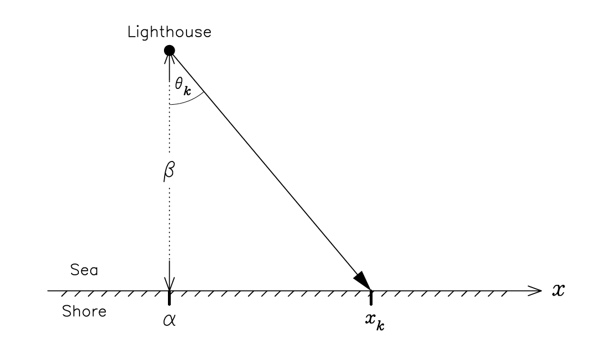

```{r setup-chunk}
knitr::opts_chunk$set(dev = "ragg_png")
options(digits=5) # set number of digits equal to 5

```

# Packages and functions

```{r, message=FALSE}

# tidyverse
library(tidyverse)

# others
library(gridExtra)
library(R6)
library(kableExtra)
library(glue)
library(patchwork)
library(latex2exp)
library(metR)   # label contour plot

```

# Exercise 1
The number of particles emitted by a radioactive source during a fixed interval of time ($\Delta t=10s$) follows a Poisson distribution on the parameter $\mu$. The number of particles observed during consecutive time intervals is: 4, 1, 3, 1 and 3. 

### a) Suppose a uniform prior distribution for the parameter $\mu$
#### Determine and draw the posterior distribution for $\mu$, given the data

Assuming a uniform prior, the posterior is simply proportional to the likelihood. Being a Poisson process, the posterior then is a $Gamma(\alpha, \lambda)$, where $\alpha = \sum_{j=1}^{n} y_j+1$ and $\lambda=n$.

```{r}

mu <- seq(0, 10, length=1000)

n.particles <- c(4, 1, 3, 1, 3)
n <- length(n.particles)

unif.shape <- sum(n.particles)+1
unif.rate <- n
unif.posterior <- dgamma(mu, shape=unif.shape , rate=unif.rate)

ggplot()+
  geom_line(aes(x=mu, y=unif.posterior), color='steelblue', size=0.7)+
  labs(
    title = 'Posterior distribution, positive uniform prior',
    x = TeX('$\\mu$'), 
    y = TeX('$P(\\mu|\\{y_i\\})$')
  )+
  theme_bw()

```

#### Evaluate mean, median and variance, both analytically and numerically in R

The median can not be computed analytically, as there is not a simple closed form expression for it. 

```{r}
# argmax <- function(x){
#     max.x <- max(x)
#     found <- FALSE
#     
#     i <- 1
#     while (!found & i<=length(x)){
#       if (x[i]==max.x){
#         found <- TRUE
#         return(i)
#       }
#       i <- i+1
#     }
#   }

gamma.mean.analytically <- function(shape, rate){
  return(shape/rate)
}
gamma.variance.analytically <- function(shape, rate){
  return(shape/rate^2)
}
gamma.mode.analytically <- function(shape, rate){
  return((shape-1)/rate)
}
gamma.mode.numerically <- function(param, distr.data){
  return(param[which.max(distr.data)])
}
gamma.median.numerically <- function(shape, rate){
  return(qgamma(0.5, shape=shape, rate=rate))
}
gamma.mean.numerically <- function(shape, rate, upp.bound=30){
  return(integrate(function(x){dgamma(x, shape=shape, rate=rate)*x}, 0, upp.bound)$value)
}
gamma.variance.numerically <- function(shape, rate, upp.bound=30){
  k2 <- integrate(function(x){dgamma(x, shape=shape, rate=rate)*(x^2)}, 0, upp.bound)$value
  k1 <- gamma.mean.numerically(shape, rate, upp.bound)
  
  return(k2-k1^2)
}

```


```{r}

glue('Median, computed numerically: mu={format(gamma.median.numerically(unif.shape, unif.rate), digits=4)}')

df <- data.frame(row.names=c('Analytically', 'Numerically'))

df['Mean'] = c(gamma.mean.analytically(unif.shape, unif.rate), gamma.mean.numerically(unif.shape, unif.rate))
df['Variance'] = c(gamma.variance.analytically(unif.shape, unif.rate), gamma.variance.numerically(unif.shape, unif.rate))
df['Mode'] = c(gamma.mode.analytically(unif.shape, unif.rate), gamma.mode.numerically(mu, unif.posterior))

df %>% 
  kable(digits=3, caption='Posterior statistics, with uniform prior') %>%
  kable_classic(full_width=FALSE)

unif.mean <- gamma.mean.analytically(unif.shape, unif.rate)
unif.mode <- gamma.mode.analytically(unif.shape, unif.rate)
unif.std <- sqrt(gamma.variance.analytically(unif.shape, unif.rate))

```


### b) Suppose a Jeffrey's prior for the parameter $\mu$
#### Determine and draw the posterior distribution for $\mu$, given the data

```{r}

jeffrey.shape <- sum(n.particles)+1/2
jeffrey.rate <- n
jeffrey.posterior <- dgamma(mu, shape=jeffrey.shape, rate=jeffrey.rate)

ggplot()+
  geom_line(aes(x=mu, y=jeffrey.posterior), color='steelblue', size=0.7)+
  labs(
    title = 'Posterior distribution with Jeffrey’s prior',
    x = TeX('$\\mu$'), 
    y = TeX('$P(\\mu|\\{y_i\\})$')
  )+
  theme_bw()

```

#### Evaluate mean, median and variance, both analytically and numerically in R

```{r}

glue('Median, computed numerically: mu={format(gamma.median.numerically(unif.shape, unif.rate), digits=4)}')

df <- data.frame(row.names=c('Analytically', 'Numerically'))

df['Mean'] = c(gamma.mean.analytically(jeffrey.shape, jeffrey.rate), gamma.mean.numerically(jeffrey.shape, jeffrey.rate))
df['Variance'] = c(gamma.variance.analytically(jeffrey.shape, jeffrey.rate), gamma.variance.numerically(jeffrey.shape, jeffrey.rate))
df['Mode'] = c(gamma.mode.analytically(jeffrey.shape, jeffrey.rate), gamma.mode.numerically(mu, jeffrey.posterior))

df %>% 
  kable(digits=3, caption="Posterior statistics, with Jeffrey's prior") %>%
  kable_classic(full_width=FALSE)

jeffrey.mean <- gamma.mean.analytically(jeffrey.shape, jeffrey.rate)
jeffrey.mode <- gamma.mode.analytically(jeffrey.shape, jeffrey.rate)
jeffrey.std <- sqrt(gamma.variance.analytically(jeffrey.shape, jeffrey.rate))

```

### c) Evaluate a 95% credibility interval for the results obtained with both priors
Compare the result with that obtained using a normal approximation for the posterior distribution, with the same mean and standard deviation.

```{r}

unif.cred.int <- c(qgamma(0.025, unif.shape, unif.rate), qgamma(0.975, unif.shape, unif.rate))
jeffrey.cred.int <- c(qgamma(0.025, jeffrey.shape, jeffrey.rate), qgamma(0.975, jeffrey.shape, jeffrey.rate))

gg_post_complete <- function(post.funct, limits, mode, Title='Posterior'){
  mu <- seq(0, 10, length=1000)
  mu95 <- seq(limits[1], limits[2], length=1000)
    
  ggplot()+
    geom_line(aes(x=mu, y=post.funct(mu)), size=0.7, color='steelblue')+
    geom_area(aes(x=mu95, y=post.funct(mu95)), fill='lightblue', color='steelblue', size=0.7)+
    labs(
      title=Title, 
      x=TeX('$\\mu$'), 
      y=TeX('$P(\\mu|\\{y_i\\})$')
    )+
    ylim(0, 0.6)+
    geom_vline(xintercept=limits, linetype='dashed', size=0.6)+
    geom_vline(xintercept=mode, linetype='dashed', size=0.6, color='firebrick')+
    annotate('text', x=limits[1]-0.6, y=0.55, label=paste('x1=', format(limits[1], digits=2, nsmall=2), sep=''))+
    annotate('text', x=limits[2]+0.6, y=0.55, label=paste('x2=', format(limits[2], digits=2, nsmall=2), sep=''))+
    annotate('text', x=mode+0.4, y = 0.58, label=paste(format(round(mode, 2), nsmall = 2), sep=''), color='firebrick')+
    theme_bw()
}

df <- data.frame(row.names=c('Uniform prior', "Jeffrey's prior"))
df['Lower bound']=c(unif.cred.int[1], jeffrey.cred.int[1])
df['Upper bound']=c(unif.cred.int[2], jeffrey.cred.int[2])

df %>%
  kable(caption='95% credibility interval', digits=3) %>%
  kable_classic("striped", full_width = F)

gg_post_complete(function(x){dgamma(x, shape=unif.shape , rate=unif.rate)}, unif.cred.int, unif.mode, Title='Posterior distribution, positive uniform prior')
gg_post_complete(function(x){dgamma(x, shape=jeffrey.shape , rate=jeffrey.rate)}, jeffrey.cred.int, jeffrey.mode, Title="Posterior distribution, Jeffrey's prior")

```

Using the normal approximation:

```{r}

gg_post_complete(function(x){dnorm(x, mean=unif.mean, sd=unif.std)}, 
                 c(qnorm(0.025, mean=unif.mean, sd=unif.std), qnorm(0.975, mean=unif.mean, sd=unif.std)),
                 unif.mean, 
                 Title='Posterior distribution using the normal approx')+
  labs(subtitle='Mean and std from the posterior with the uniform prior')
                 

gg_post_complete(function(x){dnorm(x, mean=jeffrey.mean, sd=jeffrey.std)}, 
                 c(qnorm(0.025, mean=jeffrey.mean, sd=jeffrey.std), qnorm(0.975, mean=jeffrey.mean, sd=jeffrey.std)),
                 jeffrey.mean, 
                 Title='Posterior distribution using the normal approx')+
  labs(subtitle="Mean and std from the posterior with the Jeffrey's prior")

```

Using the normal approximation we obtain very similar results. For example, with the positive uniform prior, the mode and the mean of the posterior distribution are, respectively, 3.2 and 3.4, while using the normal approximation, we obtain a mode and a mean of 3.4. Similarly, also the credibility intervals are almost the same. This is true also when considering the Jeffrey's prior. 

Notice that this results derive from the Central Limit Theorem, that in this case can be applied even if the number of measurements is quite small (5).

# Exercise 2
Given the problem of the lighthouse discussed last week, study the case in which both the position along the shore ($\alpha$) and the distance out at sea ($\beta$) are unknown. 



### Description of the problem
The lighthouse emits a series of short highly collimated flashes at random intervals and at random angles. We detect the pulses on the coast using photo-detectors; they record only the position $x_k$ of the flash arrival on the coast, but not the angle of emission. Given the recording of $N$ flashes at positions $\{x_k\}$, we want to estimate the position of the lighthouse.

### Solution
I assign a uniform likelihood pdf on the azimuth angle $\theta_k$
$$
P(\theta_k|\alpha, \beta) = \frac{1}{\pi}
$$
Since $\theta_k$ is connected to $\alpha$ and $\beta$ by the relation 
$$
x_k-\alpha = \beta\tan{\theta_k}
$$
I can operate a change of variable $\theta_k\rightarrow x_k$ on the pdf and I get 
$$
P(x|\alpha, \beta)=P(\theta|\alpha, \beta)\left\rvert\frac{d\theta}{dx}\right\rvert = 
\frac{1}{\pi}\frac{\beta}{\beta^2+(x-\alpha)^2}
$$
which is a Cauchy distribution, with maximum in $\alpha$ and FWHM of $2\beta$. I can then apply the Bayes theorem, where I call $D$ the set of measures $\{x_k\}$
$$
P(\alpha, \beta|D) \propto P(D|\alpha, \beta)\cdot P(\alpha, \beta)
$$
Regarding the prior, I assume that $\alpha$ is in a range $[\alpha_{min}, \alpha_{max}]$, while $\beta$ can take any non-negative value. Without having further information, then I assume a uniform distribution subject to these constraints

$$
P(\alpha, \beta) = 
\begin{cases}
  1 & \alpha\in[\alpha_{min}, \alpha_{max}], \; \beta\geq 0\\
  0 & \text{otherwise}
\end{cases}
$$
Notice that this is an improper prior, since the integral over all the possible values of the parameters diverges, and that the same considerations hold if an upper bound is imposed on $\beta$. As the recording of a signal at one photo-detector does not influence what we can infer about the position of another measurement (independent events), then the (unnormalized) Likelihood function is just the product of the probabilities of $N$ individual detections
$$
P(D|\alpha, \beta) = \prod P(x_j|\alpha, \beta) = \prod \frac{\beta}{\beta^2+(x_j-\alpha)^2}
$$
Finally, the posterior distribution is proportional to the likelihood, with the above constraints on $\alpha$ and $\beta$
$$
P(\alpha, \beta|D) = 
\begin{cases}
  \frac{1}{Z_{\alpha, \beta}}\prod \frac{\beta}{\beta^2+(x_j-\alpha)^2} & \text{if} \;\; \alpha\in[\alpha_{min}, \alpha_{max}], \; \beta\geq 0\\
  0 & \text{otherwise}
\end{cases}
$$
where $Z_{\alpha, \beta}$ is the normalization factor. It is possible to take the natural logarithm of the posterior
$$
L=\ln{P(\alpha, \beta|D)} = \text{const} + \sum \left[\ln\beta - \ln{(\beta^2+(x_j-\alpha)^2)}\right] = \text{const} - \sum\ln\left[\beta+\frac{(x_j-\alpha)^2}{\beta}\right]
$$
The best estimate $\alpha_0$, $\beta_0$ of the parameters is given by the maximum of the two-dimensional posterior pdf
$$
\begin{aligned}
&\overrightarrow{\nabla}_{\alpha, \beta}L\biggr|_{\alpha_0, \beta_0} = 0 \\
\Rightarrow \; &\begin{cases}
  \frac{dL}{d\alpha}\biggr|_{\alpha_0, \beta_0} &= 2 \sum_{j}\frac{\beta_0(x_j-\alpha_0)}{\beta_0^2+(x_j-\alpha_0)^2}=0 \\
  \frac{dL}{d\beta}\biggr|_{\alpha_0, \beta_0} &= \sum_{j}\left[\frac{1}{\beta_0}\cdot\frac{(x_j-\alpha_0)^2-\beta_0^2}{\beta_0^2+(x_j-\alpha_0)^2}\right] =0
\end{cases}
\end{aligned}
$$
and it can be evaluated numerically. 

### Data generation
I sample the data in the interval $x\in[−2 km,+2 km]$, using a uniform distribution and I assume the maximum number of collected data to be $100$. This is the maximum number in the sense that I will repeat the study for different values of $n$, the number of collected data, and in particular I will consider $n={1, 2, 5, 10, 20, 50, 100}$. 

```{r}

set.seed(205)
x.data <- runif(100, -2, 2)

ggplot()+
  geom_histogram(aes(x.data), breaks=seq(-2, 2, length=20), fill='steelblue', position = "identity", color='white')+
  labs(
    x='x', 
    y='Count', 
    title='Generated data',
    subtitle='Position of the flash arrival on the coast'
  )+
  scale_x_continuous(breaks=seq(-2, 2, length=9))+
  theme_bw()

```


### Posterior distribution 

```{r, fig.height=10, fig.width=15}

p.log.like.scalar <- function(a, b, data){
  # data is vector
  # a, b are scalar
  
  logL <- 0.0
  for (x in data) {
    logL <- logL - log(b + (x-a)^2/b)
  }
  return(logL)
}
p.log.like.vect <- function(a.vec, b.vec, data){
  # data is a vector
  # a, b are also vectors
  
  df <- expand.grid(alpha=a.vec, beta=b.vec)
  
  z <- numeric(nrow(df))

  for (i in 1:nrow(df)){
     z[i]<- p.log.like.scalar(df$alpha[i], df$beta[i], data)
  }
  df['loglike'] <- z
  
  return(df)
}

n.values = c(1, 2, 5, 10, 20, 50, 100)
n.length = length(n.values)

# define the grid of the parameters, according to the constraints
n.samples.x <- 300
n.samples.beta <- 300
x.min <- -6
x.max <- +6
beta.max <- 4

delta.alpha <- (x.max-x.min)/n.samples.x
delta.beta  <- beta.max*(n.samples.beta-1)/(n.samples.beta^2)

alpha <- seq(from=x.min, to=x.max, length=n.samples.x)
beta <- seq(from=beta.max/n.samples.beta, to=beta.max, length=n.samples.beta)

# function for computing 2d posterior and inferring the parameters
inference.a.b <- function(ndata){

  x.data.i <- x.data[1:ndata]
  df_loglike <- p.log.like.vect(alpha, beta, x.data.i)
  
  # find the maximum
  index.max <- which.max(df_loglike$loglike)
  alpha.max <- df_loglike$alpha[index.max]
  beta.max  <- df_loglike$beta[index.max]
  
  return(list(df = df_loglike, alpha=alpha.max, beta=beta.max))
}


# initialize objects
df_infer <- data.frame(N=n.values)
loglike_list <- vector(mode="list", length=n.length)
alpha.s <- numeric(n.length)
beta.s  <- numeric(n.length)

for (i in 1:n.length){
  res <- inference.a.b(n.values[i])
  loglike_list[[i]] <- res$df

  alpha.s[i] <- res$alpha
  beta.s[i]  <- res$beta
}

df_infer['alpha.max'] <- alpha.s
df_infer['beta.max']  <- beta.s

df_infer %>%
    kable(digits=3, caption="Estimate of alpha and beta") %>%
    kable_classic(full_width=FALSE)


# plot unnormalized 2D posterior as contours
gg_2d_post <- function(df, title){
  ggplot(df, aes(alpha, beta, z=loglike))+
  geom_contour(bins=10, color='navyblue', size=0.7)+
  geom_text_contour(stroke = 0.2, rotate=F)+
  labs(
    x=TeX('$\\alpha$'),
    y=TeX('$\\beta$'), 
    title=title
  )+
  theme_bw()+
  theme(axis.text   = element_text(size=14),
        axis.title  = element_text(size=14), 
        plot.title  = element_text(size=16, hjust=0.5))
}

for (i in 1:n.length){
  gg_tmp <- gg_2d_post(loglike_list[[i]], title=paste('N=', n.values[i], sep=''))
  
  if (i==1) plot_2d_post <- gg_tmp
  else plot_2d_post <- plot_2d_post + gg_tmp
}

plot_2d_post +
  plot_annotation(
    title='Unnormalized 2D posterior as a function of the number of samples', 
    theme = theme(plot.title = element_text(size = 20, hjust = 0.5))
    )

```

So far I have found the two parameters unnormalized posterior density function. To find the posterior only for one parameter, I have to marginalize over the other
$$
\begin{aligned}
P(\alpha|\beta, D) &= \int P(\alpha, \beta | D)d\beta = \frac{1}{Z_{\alpha, \beta}} \int_0^{\beta_{max}} P(D|\alpha, \beta)P(\alpha, \beta)d\beta \\
P(\beta|\alpha, D) &= \int P(\alpha, \beta | D)d\alpha = \frac{1}{Z_{\alpha, \beta}} \int_{\alpha_{min}}^{\alpha_{max}} P(D|\alpha, \beta)P(\alpha, \beta)d\alpha
\end{aligned}
$$
Numerically, the marginalization is performed on the grid of the parameters, simply by summing over one them 
$$
\begin{aligned}
P(\alpha_j| D) &\simeq \Delta\beta \sum_{k=1}^{N_\beta}P(\alpha_j, \beta_k |D) \\
P(\beta_j| D) &\simeq \Delta\alpha \sum_{k=1}^{N_\alpha}P(\alpha_k, \beta_j |D) 
\end{aligned}
$$
and finally the posterior is normalized using the rectangle rule over the grid. 

```{r, fig.height=25, fig.width=15, warning=FALSE}

gg_marg <- function(df, ndata, param.label, y.label, title, alpha=TRUE){
  x.data.i <- x.data[1:ndata]
  
  ggplot() + 
    geom_line(aes(x=df$x, y=df$y), size=0.7, color='navyblue')+
    {if (alpha) geom_vline(xintercept=mean(x.data.i), size=0.7, linetype='dashed')}+
    {if (alpha) geom_point(aes(x=x.data.i, y=rep(-0.1, length(x.data.i))), size=2.5, shape=21, fill='white', color='darkorange2', stroke=1.5)}+
    {if (alpha) annotate('text', x=mean(x.data.i)+1.2, y=max(df$y)+0.06, label=TeX(paste('$mean(x)$=', round(mean(x.data.i), 2), sep='')))}+
    labs(
      x=param.label,
      y=y.label,
      title=title
    )+
    ylim(c(-0.1, max(df$y)+0.1))+
    theme_bw()+
    theme(axis.text   = element_text(size=14),
        axis.title  = element_text(size=14), 
        plot.title  = element_text(size=16, hjust=0.5))
}

gg_marg_post <- function(df_loglike, N){
  
  df_marg_a <- df_loglike %>%
  group_by(alpha)%>%
  summarize(
    p_a_D = sum(exp(loglike))
  )

  df_marg_b <- df_loglike %>%
    group_by(beta)%>%
    summarize(
      p_b_D = sum(exp(loglike))
    )
  
  df_marg_a$p_a_D <- df_marg_a$p_a_D/(delta.alpha*sum(df_marg_a$p_a_D))
  df_marg_b$p_b_D <- df_marg_b$p_b_D/(delta.beta*sum(df_marg_b$p_b_D)) 
  
  df_marg_a <- df_marg_a %>% rename(x=alpha, y=p_a_D)
  df_marg_b <- df_marg_b %>% rename(x=beta, y=p_b_D)
  
  return(list(
    gg.a = gg_marg(df_marg_a, N, TeX('$\\alpha$'), TeX('P($\\alpha$|D)'), paste('N=', N, sep='')), 
    gg.b = gg_marg(df_marg_b, N, TeX('$\\beta$'),  TeX('P($\\beta$|D)'),  paste('N=', N, sep=''), alpha=F)
    )
  )
}

for (i in 1:n.length){
  gg_tmp <- gg_marg_post(loglike_list[[i]], n.values[i])
  
  if (i==1) plot_marg <- (gg_tmp$gg.a+gg_tmp$gg.b)
  else plot_marg <- plot_marg / (gg_tmp$gg.a+gg_tmp$gg.b)
}

# plot of the 1D marginalized posteriors
plot_marg +
  plot_annotation(
    title='Marginalized posterior distributions', 
    theme = theme(plot.title = element_text(size = 20, hjust = 0.5))
    )


```


# Exercise 3
Given the Signal over Background example discussed last week, analyze and discuss the following cases:

* **a)** Vary the sampling resolution used to generate the data, keeping the same sampling range `xdat <- seq(from=-7*w, to=7*w, by=0.5*w)`
  * change the resolution $w = \{0.1,  0.25,  1,  2, 3\}$
  * check the effect on the results
* **b)** Change the ratio $A/B$ used to simulate the data (keeping both positive in accordance with the prior)
  * check the effect on the results
  
Recall the signal shape is
$$
S_k = \Delta t\left\{A\cdot\text{exp}\left[-\frac{(x_k-x_0)^2}{2w^2}\right]+B\right\}
$$
where $\Delta t$ is the exposure time, $B$ and $A$ are the background and signal amplitudes, $x_0$ is the centre of the signal peak and $w$ its width. 
  
### Define general classes and methods

```{r}

signal <- R6Class("signal",
    public = list(
      x  = NULL,
      A  = NULL,
      B  = NULL,
      x0 = NULL,
      w  = NULL,
      delta.t = NULL,
      signal = NULL, 
      ddat = NULL, 

      initialize = function(x=NA, A=NA, B=NA, x0=NA, w=NA, delta.t=NA) {
        self$x  <- x
        self$A  <- A
        self$B  <- B
        self$x0 <- x0
        self$w  <- w
        self$delta.t <- delta.t
        self$signal  <- self$delta.t * (self$A*exp(-(self$x-self$x0)^2/(2*self$w^2)) + self$B)
      }, 
      
      generate = function(){
        set.seed(205)
        self$ddat <- rpois(length(self$signal), self$signal)
      }, 
      
      plot.signal = function(){
        geom_line(aes(x=self$x, y=self$signal), col='navyblue', size=0.7)
      }, 
      
      plot.data = function(){
        if(is.null(self$ddat)) self$generate()
        
        if(self$A/self$B>=1.5) xdat.off <- self$x-(self$x[which.max(self$ddat)]+self$x[which.max(self$ddat)+1])/2
        else xdat.off <- self$x
        geom_step(aes(x=xdat.off, y=self$ddat), col='firebrick', size=0.7)
      }
    )
)

posterior <- R6Class("posterior",
    inherit = signal, 
    
    ## PUBLIC
    public = list(
      z  = NULL, 
      p_a_D  = NULL,
      p_b_D  = NULL, 
      p_a_bD = NULL, 
      p_b_aD = NULL, 
      
      log.unnorm.post.grid = function(){
        z <- matrix(data=NA, nrow=length(private$a.vect), ncol=length(private$b.vect))
        for(j in 1:length(private$a.vect)) {
          for(k in 1:length(private$b.vect)) {
            z[j,k] <- private$log.post(private$a.vect[j], private$b.vect[k])
          }
        }
        self$z <- z - max(z)
      },
      
      a.b.vectors = function(a.vect, b.vect){
        private$a.vect = a.vect
        private$b.vect = b.vect
      },
      
      plot.2d.posterior = function(title=''){
        if(is.null(self$ddat)) super$generate()
        
        self$log.unnorm.post.grid()
        
        df <- expand.grid(a=private$a.vect, b=private$b.vect)
        df$z <- as.numeric(exp(self$z))
        
        ggplot(df, aes(a, b, z=z))+
          geom_contour(bins=5, color='navyblue', size=0.7)+
          geom_text_contour(stroke = 0.2, rotate=F)+
          geom_vline(xintercept=self$A, col='firebrick', alpha=1, size=0.7)+
          geom_hline(yintercept=self$B, col='firebrick', alpha=1, size=0.7)+
          geom_vline(xintercept=0, col='black', linetype='dashed', size=0.7)+
          labs(
            x='amplitude, A', 
            y='background, B'
          )+
          {if (title!='') labs(title=title)}+
          xlim(c(self$A-1.5, self$A+0.5))+
          ylim(c(0.5, 1.5))+
          theme_bw()+
          {if (title!='') theme(plot.title  = element_text(size=18))}
      }, 
      
      marginalization = function(delta_a, delta_b){
        # Compute normalized marginalized posteriors , P(a|D) and P(b|D)
        self$p_a_D <- apply(exp(self$z), 1, sum) 
        self$p_a_D <- self$p_a_D/(delta_a*sum(self$p_a_D))
        self$p_b_D <- apply(exp(self$z), 2, sum) 
        self$p_b_D <- self$p_b_D/(delta_b*sum(self$p_b_D))
         
        # Compute normalized conditional posteriors , P(a|b,D) and P(b|a,D)
        self$p_a_bD <- exp(Vectorize(private$log.post , "a.i")(private$a.vect, self$B))
        self$p_a_bD <- self$p_a_bD/(delta_a*sum(self$p_a_bD))
        self$p_b_aD <- exp(Vectorize(private$log.post , "b.i")(self$A , private$b.vect))
        self$p_b_aD <- self$p_b_aD/(delta_b*sum(self$p_b_aD))
      }, 
      
      # Plot the 1D marginalized posteriors
      plot.marginalized = function(title=''){
        
        gg_marg_b <- ggplot()+
          geom_line(aes(x=private$b.vect, y=self$p_b_D), size=1, color='navyblue')+
          geom_line(aes(x=private$b.vect, y=self$p_b_aD), size=1, linetype='dashed')+
          geom_vline(xintercept=self$b, col='firebrick', size=1)+
          labs(
            x='background, B',
            y='P(B|D) and P(B|A,D)',
            title=title
          )+
          {if (title!='') labs(title=title)}+
          ylim(1.05*c(0, max(self$p_b_D, self$p_b_aD)))+
          theme_bw()+
          theme(legend.title = element_blank(), 
                axis.text   = element_text(size=16),
                axis.title  = element_text(size=16),
                plot.title  = element_text(size=18))

        gg_marg_a <- ggplot()+
          geom_line(aes(x=private$a.vect, y=self$p_a_D), size=1, color='navyblue')+
          geom_line(aes(x=private$a.vect, y=self$p_a_bD), size=1, linetype='dashed')+
          geom_vline(xintercept=self$a, col='firebrick', size=1)+
          labs(
            x='amplitude, A',
            y='P(A|D) and P(A|B,D)', 
            title=title
          )+
          {if (title!='') labs(title=title)}+
          ylim(1.05*c(0,max(self$p_a_D, self$p_a_bD)))+
          theme_bw()+
          theme(legend.title = element_blank(),
                axis.text   = element_text(size=16),
                axis.title  = element_text(size=16), 
                plot.title  = element_text(size=18))

        gg_marg_b+gg_marg_a
      }, 
      
      param_values = function(delta_a, delta_b, print_param=TRUE, return_param=FALSE){
        if(is.null(self$p_a_D)) self$marginalization(delta_a, delta_b)

        mean_a <- delta_a * sum(private$a.vect * self$p_a_D)
        mean_b <- delta_b * sum(private$b.vect * self$p_b_D)
        sd_a <- sqrt( delta_a * sum((private$a.vect-mean_a)^2 * self$p_a_D) )
        sd_b <- sqrt( delta_b * sum((private$b.vect-mean_b)^2 * self$p_b_D) )
        
        # Covariance normalization is performed with ’brute force ’. 
        # The normalization constant is Z = delta_a*delta_b*sum(exp(z)).
        # This is independent of (a,b) so can be calculated outside of the loops.
        cov_ab <- 0
        for(j in 1:length(private$a.vect)) {
          for(k in 1:length(private$b.vect)) {
            cov_ab <- cov_ab + (private$a.vect[j]-mean_a)*(private$b.vect[k]-mean_b)*exp(self$z[j,k])
        }
        }
        cov_ab <- cov_ab / sum(exp(self$z))
        rho_ab <- cov_ab / (sd_a * sd_b)
        
        if (print_param){
          cat("  a = ", mean_a, "+/-", sd_a, "\n")
          cat("  b = ", mean_b, "+/-", sd_b, "\n")
          cat("rho = ", rho_ab, "\n")
        }
        
        if (return_param){
          return(c(mean_a, mean_b, sd_a, sd_b, rho_ab))
        }
      }
    ), 
    
    ## PRIVATE
    private = list(
      a.vect = NULL, 
      b.vect = NULL, 
      
      log.post = function(a.i, b.i) {
        if(a.i<0 || b.i<0) {return(-Inf)} # effect of the prior
        else{
          sig.tmp <- signal$new(self$x, a.i, b.i, self$x0, self$w, self$delta.t)
          return(sum(dpois(self$ddat, lambda=sig.tmp$signal, log=TRUE)))
        
        }
      }
    )
)


gg_signal = function(sig1, sig2, title=''){
  # sig1 is the true signal to plot
  # sig2 contains the generated data
  ggplot()+
    sig1$plot.signal()+
    sig2$plot.data()+
    xlim(range(sig1$x))+
    ylim(range(c(sig1$signal, sig2$ddat)))+
    labs(
      x='x', 
      y='Signal+Background counts'
    )+
    {if (title!='') labs(title=title)}+
    theme_bw()+
    {if (title!='') theme(plot.title  = element_text(size=18))}
}


```

### Reproduce the example done in class, to check if the above classes work correctly 

```{r, warning=FALSE}

x0      <- 0  # Signal peak
w       <- 1  # Signal width
A.true  <- 2  # Signal amplitude
B.true  <- 1  # Background amplitude
Delta.t <- 5  # Exposure time

sig.test <- posterior$new(seq(from=-7*w, to=7*w, by=0.5 *w), A.true, B.true, x0, w, Delta.t)
sig.plot <- posterior$new(seq(from=-7*w, to=7*w, by=0.05*w), A.true, B.true, x0, w, Delta.t)

gg_signal(sig.plot, sig.test)

# sampling grid for computing posterior
alim <- c(0.0, 4.0)
blim <- c(0.5, 1.5)
Nsamp <- 100
uniGrid <- seq(from=1/(2*Nsamp), to=1-1/(2*Nsamp), by=1/Nsamp)

delta_a <- diff(alim)/Nsamp
delta_b <- diff(blim)/Nsamp
a <- alim[1] + diff(alim)*uniGrid
b <- blim[1] + diff(blim)*uniGrid

# 2d posterior
sig.test$a.b.vectors(a, b)
sig.test$plot.2d.posterior()

```

```{r, fig.height=7, fig.width=15}

sig.test$marginalization(delta_a, delta_b)
sig.test$plot.marginalized()
sig.test$param_values(delta_a, delta_b, print_param=TRUE)

```

### a) Vary the sampling resolution used to generate the data, keeping the same sampling range

```{r, echo=TRUE, results='hide'}

x0      <- 0  # Signal peak
A.true  <- 2  # Signal amplitude
B.true  <- 1  # Background amplitude
Delta.t <- 5  # Exposure time

# signal widths
widths  <- c(0.1,  0.25,  1,  2, 3)

# sampling grid for computing posterior
alim <- c(0.0, 4.0)
blim <- c(0.5, 1.5)
Nsamp <- 100
uniGrid <- seq(from=1/(2*Nsamp), to=1-1/(2*Nsamp), by=1/Nsamp)

delta_a <- diff(alim)/Nsamp
delta_b <- diff(blim)/Nsamp
a <- alim[1] + diff(alim)*uniGrid
b <- blim[1] + diff(blim)*uniGrid

# initialize a list of signals
signals_w <- vector(mode = "list", length = length(widths))
sig.plot <- vector(mode = "list", length = length(widths))

for (i in seq_along(widths)){
  signals_w[[i]] <- posterior$new(seq(from=-7*widths[i], to=7*widths[i], by=0.5 *widths[i]), A.true, B.true, x0, widths[i], Delta.t)
  sig.plot[[i]] <- posterior$new(seq(from=-7*widths[i], to=7*widths[i], by=0.05*widths[i]), A.true, B.true, x0, widths[i], Delta.t)
}

# plot the signals, with the posteriors
i <- 1
while (i<=length(widths)){
  signals_w[[i]]$a.b.vectors(a, b)
  
  gg_title <- paste('w=', widths[i], sep='')
  gg_tmp <- (gg_signal(sig.plot[[i]], signals_w[[i]], gg_title)+signals_w[[i]]$plot.2d.posterior(gg_title))
  
  if (i==1) all_signals <- gg_tmp
  else all_signals <- all_signals / gg_tmp
  
  i <- i+1
}

```

```{r, fig.height=20, fig.width=15, warning=FALSE}
all_signals+
  plot_layout(guides = "collect")+
  plot_annotation(
    title='Signal, background counts and unnormalized 2D posterior', 
    theme = theme(plot.title = element_text(size = 20, hjust = 0.5))
    )

```

```{r, echo=TRUE, results='hide'}

# Compute marginalized posteriors, plot them, get parameters values
df_param <- data.frame('w'=widths)
params <- matrix(nrow = length(widths), ncol = 5)

i <- 1
while (i<=length(widths)){
  signals_w[[i]]$marginalization(delta_a, delta_b)
  
  gg_tmp <- (signals_w[[i]]$plot.marginalized(title=paste('w=', widths[i], sep='')))
  
  if (i==1) marg.distributions <- gg_tmp
  else marg.distributions <- marg.distributions / gg_tmp
  
  params[i,] <- signals_w[[i]]$param_values(delta_a, delta_b, print_param=FALSE, return_param=TRUE)

  i <- i+1
}

df_param['mean A'] <- params[, 1]
df_param['mean B'] <- params[, 2]
df_param['std A']  <- params[, 3]
df_param['std B']  <- params[, 4]
df_param['rho A, B'] <- params[, 5]

```

```{r, fig.height=20, fig.width=15}

df_param %>% 
  kable(digits=4) %>%
  kable_classic(full_width=FALSE)

marg.distributions+
  plot_layout(guides = "collect")+
  plot_annotation(
    title='Marginalized posterior distributions', 
    theme = theme(plot.title = element_text(size = 20, hjust = 0.5))
    )

```

#### Results
As expected, changing the resolution $w$, the shape of the signal and of the generated data remains the same. The unnormalized two-dimensional posterior also does not change, as well as the marginalized posterior distributions. The effect of $w$ can be understood by looking at the plot of the signal plus background counts: the only difference between the graphs is in the scale of the $x$ axis. This is also the reason why the mean value and the standard deviation of the estimated $A$ and $B$ remain the same for all $w$.

### b) Change the ratio A/B used to simulate the data (keeping both positive in accordance with the prior)
In this point I keep $B$ constant and equal to 1. 

```{r, echo=TRUE, results='hide'}

x0      <- 0  # Signal peak
w       <- 1  # Signal width
B.true  <- 1  # Background amplitude, I keep it constant
Delta.t <- 5  # Exposure time

xdat <- seq(from=-7*w, to=7*w, by=0.5 *w)
xplot <- seq(from=-7*w, to=7*w, by=0.05 *w)
  
# ratios A/B = A, because B=1
ratios  <- c(0.5, 1, 2, 4, 6)

# sampling grid for computing posterior
alim <- c(0.0, 6.0)
blim <- c(0.5, 1.5)
Nsamp <- 100
uniGrid <- seq(from=1/(2*Nsamp), to=1-1/(2*Nsamp), by=1/Nsamp)

delta_a <- diff(alim)/Nsamp
delta_b <- diff(blim)/Nsamp
a <- alim[1] + diff(alim)*uniGrid
b <- blim[1] + diff(blim)*uniGrid

# initialize a list of signals
signals_AB <- vector(mode = "list", length = length(ratios))
sig.plot <- vector(mode = "list", length = length(ratios))

for (i in seq_along(ratios)){
  signals_AB[[i]] <- posterior$new(xdat, ratios[i], B.true, x0, w, Delta.t)
  sig.plot[[i]] <- posterior$new(xplot, ratios[i], B.true, x0, w, Delta.t)
}

# plot the signals, with the posteriors
i <- 1
while (i<=length(ratios)){
  signals_AB[[i]]$a.b.vectors(a, b)
  
  gg_title <- paste('A/B=', ratios[i], sep='')
  gg_tmp <- (gg_signal(sig.plot[[i]], signals_AB[[i]], gg_title)+signals_AB[[i]]$plot.2d.posterior(gg_title))
  
  if (i==1) all_signals <- gg_tmp
  else all_signals <- all_signals / gg_tmp
  
  i <- i+1
}

```

```{r, fig.height=20, fig.width=15, warning=FALSE}
all_signals+
  plot_layout(guides = "collect")+
  plot_annotation(
    title='Signal, background counts and unnormalized 2D posterior', 
    theme = theme(plot.title = element_text(size = 20, hjust = 0.5))
    )

```

```{r, echo=TRUE, results='hide'}

# Compute marginalized posteriors, plot them, get parameters values
df_param <- data.frame('A.B.ratio'=ratios)
params <- matrix(nrow = length(ratios), ncol = 5)

i <- 1
while (i<=length(ratios)){
  signals_AB[[i]]$marginalization(delta_a, delta_b)
  
  gg_tmp <- (signals_AB[[i]]$plot.marginalized(title=paste('A/B=', ratios[i], sep='')))
  
  if (i==1) marg.distributions <- gg_tmp
  else marg.distributions <- marg.distributions / gg_tmp
  
  params[i,] <- signals_AB[[i]]$param_values(delta_a, delta_b, print_param=FALSE, return_param=TRUE)

  i <- i+1
}

df_param['mean A'] <- params[, 1]
df_param['mean B'] <- params[, 2]
df_param['std A']  <- params[, 3]
df_param['std B']  <- params[, 4]
df_param['rho A, B'] <- params[, 5]


```

```{r, fig.height=20, fig.width=15}

df_param %>% 
  kable(digits=4) %>%
  kable_classic(full_width=FALSE)

marg.distributions+
  plot_layout(guides = "collect")+
  plot_annotation(
    title='Marginalized posterior distributions', 
    theme = theme(plot.title = element_text(size = 20, hjust = 0.5))
    )

```

#### Results
From the plot of the signal, it is possible to see that by varying the $A/B$ ratio, the relative amplitude between the signal and the background changes correctly. Regarding the unnormalized two-dimensional posterior, in all cases the maximum is close to the true values of the parameters. In the first 2 plots, I drew a vertical line to indicate the fact that $\alpha$ cannot be negative, so the posterior diverges to $-\infty$ over that line. The table with the estimated values of $A$ and $B$ (mean, standard deviations and $\rho$) supports the fact that the results are similarly accurate. Finally, the posterior marginalized distributions are again all very similar and obviously that of $A$ moves to the right as the value of the ratio increases.


