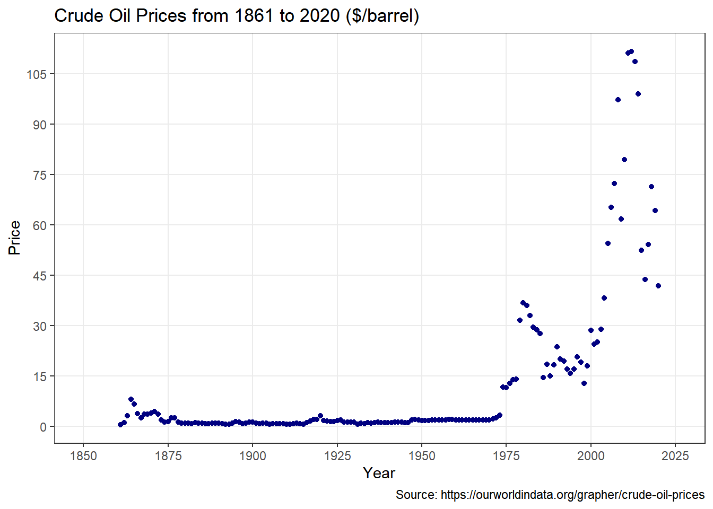
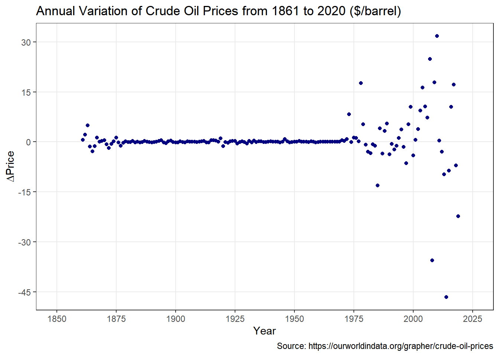
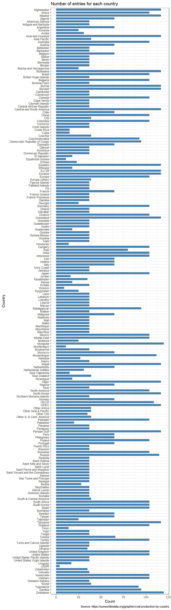

```r
# tidyverse
library(ggplot2)
library(readr)
library(tibble)
library(glue)

# others
library(latex2exp)
library(scales)
```

```
## 
## Attaching package: 'scales'
```

```
## The following object is masked from 'package:readr':
## 
##     col_factor
```

```r
library(kableExtra)
```

# Exercise 1 - Vectors and data frames


```r
df_lakes <- read.csv("../../data/lochs_of_Scotland.csv", header=TRUE, sep=",")
df_lakes %>%
  kbl() %>%
  kable_styling()
```

<table class="table" style="margin-left: auto; margin-right: auto;">
 <thead>
  <tr>
   <th style="text-align:left;"> Loch </th>
   <th style="text-align:right;"> Volume.km.3. </th>
   <th style="text-align:right;"> Volume.mi.3. </th>
   <th style="text-align:right;"> Area.km.2. </th>
   <th style="text-align:right;"> Area.mi.2. </th>
   <th style="text-align:right;"> Length.km. </th>
   <th style="text-align:right;"> Length.mi. </th>
   <th style="text-align:right;"> Max..depth.m. </th>
   <th style="text-align:right;"> Max..depth.ft. </th>
   <th style="text-align:right;"> Mean.depth.m. </th>
   <th style="text-align:right;"> Mean.depth.ft. </th>
  </tr>
 </thead>
<tbody>
  <tr>
   <td style="text-align:left;"> Loch Ness </td>
   <td style="text-align:right;"> 7.45 </td>
   <td style="text-align:right;"> 1.790 </td>
   <td style="text-align:right;"> 56.0 </td>
   <td style="text-align:right;"> 22.0 </td>
   <td style="text-align:right;"> 36.2 </td>
   <td style="text-align:right;"> 22.5 </td>
   <td style="text-align:right;"> 227 </td>
   <td style="text-align:right;"> 745 </td>
   <td style="text-align:right;"> 132.0 </td>
   <td style="text-align:right;"> 433 </td>
  </tr>
  <tr>
   <td style="text-align:left;"> Loch Lomond </td>
   <td style="text-align:right;"> 2.60 </td>
   <td style="text-align:right;"> 0.620 </td>
   <td style="text-align:right;"> 71.0 </td>
   <td style="text-align:right;"> 27.0 </td>
   <td style="text-align:right;"> 36.0 </td>
   <td style="text-align:right;"> 22.0 </td>
   <td style="text-align:right;"> 190 </td>
   <td style="text-align:right;"> 620 </td>
   <td style="text-align:right;"> 37.0 </td>
   <td style="text-align:right;"> 121 </td>
  </tr>
  <tr>
   <td style="text-align:left;"> Loch Morar </td>
   <td style="text-align:right;"> 2.30 </td>
   <td style="text-align:right;"> 0.550 </td>
   <td style="text-align:right;"> 26.7 </td>
   <td style="text-align:right;"> 10.3 </td>
   <td style="text-align:right;"> 18.8 </td>
   <td style="text-align:right;"> 11.7 </td>
   <td style="text-align:right;"> 310 </td>
   <td style="text-align:right;"> 1020 </td>
   <td style="text-align:right;"> 87.0 </td>
   <td style="text-align:right;"> 285 </td>
  </tr>
  <tr>
   <td style="text-align:left;"> Loch Tay </td>
   <td style="text-align:right;"> 1.60 </td>
   <td style="text-align:right;"> 0.380 </td>
   <td style="text-align:right;"> 26.4 </td>
   <td style="text-align:right;"> 10.2 </td>
   <td style="text-align:right;"> 23.0 </td>
   <td style="text-align:right;"> 14.0 </td>
   <td style="text-align:right;"> 150 </td>
   <td style="text-align:right;"> 490 </td>
   <td style="text-align:right;"> 60.6 </td>
   <td style="text-align:right;"> 199 </td>
  </tr>
  <tr>
   <td style="text-align:left;"> Loch Awe </td>
   <td style="text-align:right;"> 1.20 </td>
   <td style="text-align:right;"> 0.290 </td>
   <td style="text-align:right;"> 39.0 </td>
   <td style="text-align:right;"> 15.0 </td>
   <td style="text-align:right;"> 41.0 </td>
   <td style="text-align:right;"> 25.0 </td>
   <td style="text-align:right;"> 94 </td>
   <td style="text-align:right;"> 308 </td>
   <td style="text-align:right;"> 32.0 </td>
   <td style="text-align:right;"> 105 </td>
  </tr>
  <tr>
   <td style="text-align:left;"> Loch Maree </td>
   <td style="text-align:right;"> 1.09 </td>
   <td style="text-align:right;"> 0.260 </td>
   <td style="text-align:right;"> 28.6 </td>
   <td style="text-align:right;"> 11.0 </td>
   <td style="text-align:right;"> 20.0 </td>
   <td style="text-align:right;"> 12.0 </td>
   <td style="text-align:right;"> 114 </td>
   <td style="text-align:right;"> 374 </td>
   <td style="text-align:right;"> 38.0 </td>
   <td style="text-align:right;"> 125 </td>
  </tr>
  <tr>
   <td style="text-align:left;"> Loch Ericht </td>
   <td style="text-align:right;"> 1.08 </td>
   <td style="text-align:right;"> 0.260 </td>
   <td style="text-align:right;"> 18.6 </td>
   <td style="text-align:right;"> 7.2 </td>
   <td style="text-align:right;"> 23.0 </td>
   <td style="text-align:right;"> 14.0 </td>
   <td style="text-align:right;"> 156 </td>
   <td style="text-align:right;"> 512 </td>
   <td style="text-align:right;"> 57.6 </td>
   <td style="text-align:right;"> 189 </td>
  </tr>
  <tr>
   <td style="text-align:left;"> Loch Lochy </td>
   <td style="text-align:right;"> 1.07 </td>
   <td style="text-align:right;"> 0.260 </td>
   <td style="text-align:right;"> 16.0 </td>
   <td style="text-align:right;"> 6.2 </td>
   <td style="text-align:right;"> 16.0 </td>
   <td style="text-align:right;"> 9.9 </td>
   <td style="text-align:right;"> 162 </td>
   <td style="text-align:right;"> 531 </td>
   <td style="text-align:right;"> 70.0 </td>
   <td style="text-align:right;"> 230 </td>
  </tr>
  <tr>
   <td style="text-align:left;"> Loch Rannoch </td>
   <td style="text-align:right;"> 0.97 </td>
   <td style="text-align:right;"> 0.230 </td>
   <td style="text-align:right;"> 19.0 </td>
   <td style="text-align:right;"> 7.3 </td>
   <td style="text-align:right;"> 15.7 </td>
   <td style="text-align:right;"> 9.8 </td>
   <td style="text-align:right;"> 134 </td>
   <td style="text-align:right;"> 440 </td>
   <td style="text-align:right;"> 51.0 </td>
   <td style="text-align:right;"> 167 </td>
  </tr>
  <tr>
   <td style="text-align:left;"> Loch Shiel </td>
   <td style="text-align:right;"> 0.79 </td>
   <td style="text-align:right;"> 0.190 </td>
   <td style="text-align:right;"> 19.5 </td>
   <td style="text-align:right;"> 7.5 </td>
   <td style="text-align:right;"> 28.0 </td>
   <td style="text-align:right;"> 17.0 </td>
   <td style="text-align:right;"> 128 </td>
   <td style="text-align:right;"> 420 </td>
   <td style="text-align:right;"> 40.0 </td>
   <td style="text-align:right;"> 130 </td>
  </tr>
  <tr>
   <td style="text-align:left;"> Loch Katrine </td>
   <td style="text-align:right;"> 0.77 </td>
   <td style="text-align:right;"> 0.180 </td>
   <td style="text-align:right;"> 12.4 </td>
   <td style="text-align:right;"> 4.8 </td>
   <td style="text-align:right;"> 12.9 </td>
   <td style="text-align:right;"> 8.0 </td>
   <td style="text-align:right;"> 151 </td>
   <td style="text-align:right;"> 495 </td>
   <td style="text-align:right;"> 43.4 </td>
   <td style="text-align:right;"> 142 </td>
  </tr>
  <tr>
   <td style="text-align:left;"> Loch Arkaig </td>
   <td style="text-align:right;"> 0.75 </td>
   <td style="text-align:right;"> 0.180 </td>
   <td style="text-align:right;"> 16.0 </td>
   <td style="text-align:right;"> 6.2 </td>
   <td style="text-align:right;"> 19.3 </td>
   <td style="text-align:right;"> 12.0 </td>
   <td style="text-align:right;"> 109 </td>
   <td style="text-align:right;"> 358 </td>
   <td style="text-align:right;"> 46.5 </td>
   <td style="text-align:right;"> 153 </td>
  </tr>
  <tr>
   <td style="text-align:left;"> Loch Shin </td>
   <td style="text-align:right;"> 0.35 </td>
   <td style="text-align:right;"> 0.084 </td>
   <td style="text-align:right;"> 22.5 </td>
   <td style="text-align:right;"> 8.7 </td>
   <td style="text-align:right;"> 27.8 </td>
   <td style="text-align:right;"> 17.3 </td>
   <td style="text-align:right;"> 49 </td>
   <td style="text-align:right;"> 161 </td>
   <td style="text-align:right;"> 15.5 </td>
   <td style="text-align:right;"> 51 </td>
  </tr>
</tbody>
</table>


```r
# Remove columns not containing volume or area and in [mi]
df_lakes <- df_lakes[, c(1, 2, 4)]

# Rename the columns
colnames(df_lakes) <- c('Loch', 'Volume', 'Area')
df_lakes %>%
  kbl() %>%
  kable_styling()
```

<table class="table" style="margin-left: auto; margin-right: auto;">
 <thead>
  <tr>
   <th style="text-align:left;"> Loch </th>
   <th style="text-align:right;"> Volume </th>
   <th style="text-align:right;"> Area </th>
  </tr>
 </thead>
<tbody>
  <tr>
   <td style="text-align:left;"> Loch Ness </td>
   <td style="text-align:right;"> 7.45 </td>
   <td style="text-align:right;"> 56.0 </td>
  </tr>
  <tr>
   <td style="text-align:left;"> Loch Lomond </td>
   <td style="text-align:right;"> 2.60 </td>
   <td style="text-align:right;"> 71.0 </td>
  </tr>
  <tr>
   <td style="text-align:left;"> Loch Morar </td>
   <td style="text-align:right;"> 2.30 </td>
   <td style="text-align:right;"> 26.7 </td>
  </tr>
  <tr>
   <td style="text-align:left;"> Loch Tay </td>
   <td style="text-align:right;"> 1.60 </td>
   <td style="text-align:right;"> 26.4 </td>
  </tr>
  <tr>
   <td style="text-align:left;"> Loch Awe </td>
   <td style="text-align:right;"> 1.20 </td>
   <td style="text-align:right;"> 39.0 </td>
  </tr>
  <tr>
   <td style="text-align:left;"> Loch Maree </td>
   <td style="text-align:right;"> 1.09 </td>
   <td style="text-align:right;"> 28.6 </td>
  </tr>
  <tr>
   <td style="text-align:left;"> Loch Ericht </td>
   <td style="text-align:right;"> 1.08 </td>
   <td style="text-align:right;"> 18.6 </td>
  </tr>
  <tr>
   <td style="text-align:left;"> Loch Lochy </td>
   <td style="text-align:right;"> 1.07 </td>
   <td style="text-align:right;"> 16.0 </td>
  </tr>
  <tr>
   <td style="text-align:left;"> Loch Rannoch </td>
   <td style="text-align:right;"> 0.97 </td>
   <td style="text-align:right;"> 19.0 </td>
  </tr>
  <tr>
   <td style="text-align:left;"> Loch Shiel </td>
   <td style="text-align:right;"> 0.79 </td>
   <td style="text-align:right;"> 19.5 </td>
  </tr>
  <tr>
   <td style="text-align:left;"> Loch Katrine </td>
   <td style="text-align:right;"> 0.77 </td>
   <td style="text-align:right;"> 12.4 </td>
  </tr>
  <tr>
   <td style="text-align:left;"> Loch Arkaig </td>
   <td style="text-align:right;"> 0.75 </td>
   <td style="text-align:right;"> 16.0 </td>
  </tr>
  <tr>
   <td style="text-align:left;"> Loch Shin </td>
   <td style="text-align:right;"> 0.35 </td>
   <td style="text-align:right;"> 22.5 </td>
  </tr>
</tbody>
</table>

## 1. Evaluate the highest and lowest volume and area lake


```r
# indices 
idx_max_vol <- which.max(df_lakes$Volume)
idx_min_vol <- which.min(df_lakes$Volume)
idx_max_area <- which.max(df_lakes$Area)
idx_min_area <- which.min(df_lakes$Area)

# results 

cat(
  'Highest volume lake:', df_lakes$Loch[idx_max_vol], ', with volume ', df_lakes$Volume[idx_max_vol], 'km^3\n',
  'Lowest volume lake:', df_lakes$Loch[idx_min_vol], ', with volume ', df_lakes$Volume[idx_min_vol], 'km^3\n', 
  'Highest area lake:', df_lakes$Loch[idx_max_area], ', with area ', df_lakes$Area[idx_max_area], 'km^2\n',
  'Lowest area lake:', df_lakes$Loch[idx_min_area], ', with area ', df_lakes$Area[idx_min_area], 'km^2'
  
  )
```

```
## Highest volume lake: Loch Ness , with volume  7.45 km^3
##  Lowest volume lake: Loch Shin , with volume  0.35 km^3
##  Highest area lake: Loch Lomond , with area  71 km^2
##  Lowest area lake: Loch Katrine , with area  12.4 km^2
```

## 2. Order the frame with respect to the area and determine the two largest area lakes

Ordered dataframe:


```r
lakes_byarea <- df_lakes[order(df_lakes$Area, decreasing=TRUE), ]
lakes_byarea %>%
  kbl() %>%
  kable_styling()
```

<table class="table" style="margin-left: auto; margin-right: auto;">
 <thead>
  <tr>
   <th style="text-align:left;">   </th>
   <th style="text-align:left;"> Loch </th>
   <th style="text-align:right;"> Volume </th>
   <th style="text-align:right;"> Area </th>
  </tr>
 </thead>
<tbody>
  <tr>
   <td style="text-align:left;"> 2 </td>
   <td style="text-align:left;"> Loch Lomond </td>
   <td style="text-align:right;"> 2.60 </td>
   <td style="text-align:right;"> 71.0 </td>
  </tr>
  <tr>
   <td style="text-align:left;"> 1 </td>
   <td style="text-align:left;"> Loch Ness </td>
   <td style="text-align:right;"> 7.45 </td>
   <td style="text-align:right;"> 56.0 </td>
  </tr>
  <tr>
   <td style="text-align:left;"> 5 </td>
   <td style="text-align:left;"> Loch Awe </td>
   <td style="text-align:right;"> 1.20 </td>
   <td style="text-align:right;"> 39.0 </td>
  </tr>
  <tr>
   <td style="text-align:left;"> 6 </td>
   <td style="text-align:left;"> Loch Maree </td>
   <td style="text-align:right;"> 1.09 </td>
   <td style="text-align:right;"> 28.6 </td>
  </tr>
  <tr>
   <td style="text-align:left;"> 3 </td>
   <td style="text-align:left;"> Loch Morar </td>
   <td style="text-align:right;"> 2.30 </td>
   <td style="text-align:right;"> 26.7 </td>
  </tr>
  <tr>
   <td style="text-align:left;"> 4 </td>
   <td style="text-align:left;"> Loch Tay </td>
   <td style="text-align:right;"> 1.60 </td>
   <td style="text-align:right;"> 26.4 </td>
  </tr>
  <tr>
   <td style="text-align:left;"> 13 </td>
   <td style="text-align:left;"> Loch Shin </td>
   <td style="text-align:right;"> 0.35 </td>
   <td style="text-align:right;"> 22.5 </td>
  </tr>
  <tr>
   <td style="text-align:left;"> 10 </td>
   <td style="text-align:left;"> Loch Shiel </td>
   <td style="text-align:right;"> 0.79 </td>
   <td style="text-align:right;"> 19.5 </td>
  </tr>
  <tr>
   <td style="text-align:left;"> 9 </td>
   <td style="text-align:left;"> Loch Rannoch </td>
   <td style="text-align:right;"> 0.97 </td>
   <td style="text-align:right;"> 19.0 </td>
  </tr>
  <tr>
   <td style="text-align:left;"> 7 </td>
   <td style="text-align:left;"> Loch Ericht </td>
   <td style="text-align:right;"> 1.08 </td>
   <td style="text-align:right;"> 18.6 </td>
  </tr>
  <tr>
   <td style="text-align:left;"> 8 </td>
   <td style="text-align:left;"> Loch Lochy </td>
   <td style="text-align:right;"> 1.07 </td>
   <td style="text-align:right;"> 16.0 </td>
  </tr>
  <tr>
   <td style="text-align:left;"> 12 </td>
   <td style="text-align:left;"> Loch Arkaig </td>
   <td style="text-align:right;"> 0.75 </td>
   <td style="text-align:right;"> 16.0 </td>
  </tr>
  <tr>
   <td style="text-align:left;"> 11 </td>
   <td style="text-align:left;"> Loch Katrine </td>
   <td style="text-align:right;"> 0.77 </td>
   <td style="text-align:right;"> 12.4 </td>
  </tr>
</tbody>
</table>


```r
largest_area_2 = lakes_byarea$Loch[1:2]

glue('2 largest area lakes: {largest_area_2[1]} and {largest_area_2[2]}')
```

```
## 2 largest area lakes: Loch Lomond and Loch Ness
```

## 3. By summing up the areas occupied by the lakes, determine the area of Scotland covered by water


```r
area_water <- sum(df_lakes$Area)
glue('Area of Scotland covered by water: {area_water} km^2')
```

```
## Area of Scotland covered by water: 371.7 km^2
```

Reference and data: <https://en.wikipedia.org/wiki/List_of_lochs_of_Scotland>

# Exercise 2 - Crude Oil Production

## 1. Write R code that is able to read the file and import it in a data frame structure

The last column of the data frame contains data on crude oil prices from 1861 to 2020, measured in US dollars per barrel.


```r
df_oilprices <- read.csv("../../data/crude-oil-prices.csv", header=TRUE, sep=",")
colnames(df_oilprices) <- c(names(df_oilprices[1:3]), 'Price') 

df_oilprices %>%
  kbl() %>%
  kable_styling()
```

<table class="table" style="margin-left: auto; margin-right: auto;">
 <thead>
  <tr>
   <th style="text-align:left;"> Entity </th>
   <th style="text-align:left;"> Code </th>
   <th style="text-align:right;"> Year </th>
   <th style="text-align:right;"> Price </th>
  </tr>
 </thead>
<tbody>
  <tr>
   <td style="text-align:left;"> World </td>
   <td style="text-align:left;"> OWID_WRL </td>
   <td style="text-align:right;"> 1861 </td>
   <td style="text-align:right;"> 0.49000 </td>
  </tr>
  <tr>
   <td style="text-align:left;"> World </td>
   <td style="text-align:left;"> OWID_WRL </td>
   <td style="text-align:right;"> 1862 </td>
   <td style="text-align:right;"> 1.05000 </td>
  </tr>
  <tr>
   <td style="text-align:left;"> World </td>
   <td style="text-align:left;"> OWID_WRL </td>
   <td style="text-align:right;"> 1863 </td>
   <td style="text-align:right;"> 3.15000 </td>
  </tr>
  <tr>
   <td style="text-align:left;"> World </td>
   <td style="text-align:left;"> OWID_WRL </td>
   <td style="text-align:right;"> 1864 </td>
   <td style="text-align:right;"> 8.06000 </td>
  </tr>
  <tr>
   <td style="text-align:left;"> World </td>
   <td style="text-align:left;"> OWID_WRL </td>
   <td style="text-align:right;"> 1865 </td>
   <td style="text-align:right;"> 6.59000 </td>
  </tr>
  <tr>
   <td style="text-align:left;"> World </td>
   <td style="text-align:left;"> OWID_WRL </td>
   <td style="text-align:right;"> 1866 </td>
   <td style="text-align:right;"> 3.74000 </td>
  </tr>
  <tr>
   <td style="text-align:left;"> World </td>
   <td style="text-align:left;"> OWID_WRL </td>
   <td style="text-align:right;"> 1867 </td>
   <td style="text-align:right;"> 2.41000 </td>
  </tr>
  <tr>
   <td style="text-align:left;"> World </td>
   <td style="text-align:left;"> OWID_WRL </td>
   <td style="text-align:right;"> 1868 </td>
   <td style="text-align:right;"> 3.63000 </td>
  </tr>
  <tr>
   <td style="text-align:left;"> World </td>
   <td style="text-align:left;"> OWID_WRL </td>
   <td style="text-align:right;"> 1869 </td>
   <td style="text-align:right;"> 3.64000 </td>
  </tr>
  <tr>
   <td style="text-align:left;"> World </td>
   <td style="text-align:left;"> OWID_WRL </td>
   <td style="text-align:right;"> 1870 </td>
   <td style="text-align:right;"> 3.86000 </td>
  </tr>
  <tr>
   <td style="text-align:left;"> World </td>
   <td style="text-align:left;"> OWID_WRL </td>
   <td style="text-align:right;"> 1871 </td>
   <td style="text-align:right;"> 4.34000 </td>
  </tr>
  <tr>
   <td style="text-align:left;"> World </td>
   <td style="text-align:left;"> OWID_WRL </td>
   <td style="text-align:right;"> 1872 </td>
   <td style="text-align:right;"> 3.64000 </td>
  </tr>
  <tr>
   <td style="text-align:left;"> World </td>
   <td style="text-align:left;"> OWID_WRL </td>
   <td style="text-align:right;"> 1873 </td>
   <td style="text-align:right;"> 1.83000 </td>
  </tr>
  <tr>
   <td style="text-align:left;"> World </td>
   <td style="text-align:left;"> OWID_WRL </td>
   <td style="text-align:right;"> 1874 </td>
   <td style="text-align:right;"> 1.17000 </td>
  </tr>
  <tr>
   <td style="text-align:left;"> World </td>
   <td style="text-align:left;"> OWID_WRL </td>
   <td style="text-align:right;"> 1875 </td>
   <td style="text-align:right;"> 1.35000 </td>
  </tr>
  <tr>
   <td style="text-align:left;"> World </td>
   <td style="text-align:left;"> OWID_WRL </td>
   <td style="text-align:right;"> 1876 </td>
   <td style="text-align:right;"> 2.56000 </td>
  </tr>
  <tr>
   <td style="text-align:left;"> World </td>
   <td style="text-align:left;"> OWID_WRL </td>
   <td style="text-align:right;"> 1877 </td>
   <td style="text-align:right;"> 2.42000 </td>
  </tr>
  <tr>
   <td style="text-align:left;"> World </td>
   <td style="text-align:left;"> OWID_WRL </td>
   <td style="text-align:right;"> 1878 </td>
   <td style="text-align:right;"> 1.19000 </td>
  </tr>
  <tr>
   <td style="text-align:left;"> World </td>
   <td style="text-align:left;"> OWID_WRL </td>
   <td style="text-align:right;"> 1879 </td>
   <td style="text-align:right;"> 0.86000 </td>
  </tr>
  <tr>
   <td style="text-align:left;"> World </td>
   <td style="text-align:left;"> OWID_WRL </td>
   <td style="text-align:right;"> 1880 </td>
   <td style="text-align:right;"> 0.95000 </td>
  </tr>
  <tr>
   <td style="text-align:left;"> World </td>
   <td style="text-align:left;"> OWID_WRL </td>
   <td style="text-align:right;"> 1881 </td>
   <td style="text-align:right;"> 0.86000 </td>
  </tr>
  <tr>
   <td style="text-align:left;"> World </td>
   <td style="text-align:left;"> OWID_WRL </td>
   <td style="text-align:right;"> 1882 </td>
   <td style="text-align:right;"> 0.78000 </td>
  </tr>
  <tr>
   <td style="text-align:left;"> World </td>
   <td style="text-align:left;"> OWID_WRL </td>
   <td style="text-align:right;"> 1883 </td>
   <td style="text-align:right;"> 1.00000 </td>
  </tr>
  <tr>
   <td style="text-align:left;"> World </td>
   <td style="text-align:left;"> OWID_WRL </td>
   <td style="text-align:right;"> 1884 </td>
   <td style="text-align:right;"> 0.84000 </td>
  </tr>
  <tr>
   <td style="text-align:left;"> World </td>
   <td style="text-align:left;"> OWID_WRL </td>
   <td style="text-align:right;"> 1885 </td>
   <td style="text-align:right;"> 0.88000 </td>
  </tr>
  <tr>
   <td style="text-align:left;"> World </td>
   <td style="text-align:left;"> OWID_WRL </td>
   <td style="text-align:right;"> 1886 </td>
   <td style="text-align:right;"> 0.71000 </td>
  </tr>
  <tr>
   <td style="text-align:left;"> World </td>
   <td style="text-align:left;"> OWID_WRL </td>
   <td style="text-align:right;"> 1887 </td>
   <td style="text-align:right;"> 0.67000 </td>
  </tr>
  <tr>
   <td style="text-align:left;"> World </td>
   <td style="text-align:left;"> OWID_WRL </td>
   <td style="text-align:right;"> 1888 </td>
   <td style="text-align:right;"> 0.88000 </td>
  </tr>
  <tr>
   <td style="text-align:left;"> World </td>
   <td style="text-align:left;"> OWID_WRL </td>
   <td style="text-align:right;"> 1889 </td>
   <td style="text-align:right;"> 0.94000 </td>
  </tr>
  <tr>
   <td style="text-align:left;"> World </td>
   <td style="text-align:left;"> OWID_WRL </td>
   <td style="text-align:right;"> 1890 </td>
   <td style="text-align:right;"> 0.87000 </td>
  </tr>
  <tr>
   <td style="text-align:left;"> World </td>
   <td style="text-align:left;"> OWID_WRL </td>
   <td style="text-align:right;"> 1891 </td>
   <td style="text-align:right;"> 0.67000 </td>
  </tr>
  <tr>
   <td style="text-align:left;"> World </td>
   <td style="text-align:left;"> OWID_WRL </td>
   <td style="text-align:right;"> 1892 </td>
   <td style="text-align:right;"> 0.56000 </td>
  </tr>
  <tr>
   <td style="text-align:left;"> World </td>
   <td style="text-align:left;"> OWID_WRL </td>
   <td style="text-align:right;"> 1893 </td>
   <td style="text-align:right;"> 0.64000 </td>
  </tr>
  <tr>
   <td style="text-align:left;"> World </td>
   <td style="text-align:left;"> OWID_WRL </td>
   <td style="text-align:right;"> 1894 </td>
   <td style="text-align:right;"> 0.84000 </td>
  </tr>
  <tr>
   <td style="text-align:left;"> World </td>
   <td style="text-align:left;"> OWID_WRL </td>
   <td style="text-align:right;"> 1895 </td>
   <td style="text-align:right;"> 1.36000 </td>
  </tr>
  <tr>
   <td style="text-align:left;"> World </td>
   <td style="text-align:left;"> OWID_WRL </td>
   <td style="text-align:right;"> 1896 </td>
   <td style="text-align:right;"> 1.18000 </td>
  </tr>
  <tr>
   <td style="text-align:left;"> World </td>
   <td style="text-align:left;"> OWID_WRL </td>
   <td style="text-align:right;"> 1897 </td>
   <td style="text-align:right;"> 0.79000 </td>
  </tr>
  <tr>
   <td style="text-align:left;"> World </td>
   <td style="text-align:left;"> OWID_WRL </td>
   <td style="text-align:right;"> 1898 </td>
   <td style="text-align:right;"> 0.91000 </td>
  </tr>
  <tr>
   <td style="text-align:left;"> World </td>
   <td style="text-align:left;"> OWID_WRL </td>
   <td style="text-align:right;"> 1899 </td>
   <td style="text-align:right;"> 1.29000 </td>
  </tr>
  <tr>
   <td style="text-align:left;"> World </td>
   <td style="text-align:left;"> OWID_WRL </td>
   <td style="text-align:right;"> 1900 </td>
   <td style="text-align:right;"> 1.19000 </td>
  </tr>
  <tr>
   <td style="text-align:left;"> World </td>
   <td style="text-align:left;"> OWID_WRL </td>
   <td style="text-align:right;"> 1901 </td>
   <td style="text-align:right;"> 0.96000 </td>
  </tr>
  <tr>
   <td style="text-align:left;"> World </td>
   <td style="text-align:left;"> OWID_WRL </td>
   <td style="text-align:right;"> 1902 </td>
   <td style="text-align:right;"> 0.80000 </td>
  </tr>
  <tr>
   <td style="text-align:left;"> World </td>
   <td style="text-align:left;"> OWID_WRL </td>
   <td style="text-align:right;"> 1903 </td>
   <td style="text-align:right;"> 0.94000 </td>
  </tr>
  <tr>
   <td style="text-align:left;"> World </td>
   <td style="text-align:left;"> OWID_WRL </td>
   <td style="text-align:right;"> 1904 </td>
   <td style="text-align:right;"> 0.86000 </td>
  </tr>
  <tr>
   <td style="text-align:left;"> World </td>
   <td style="text-align:left;"> OWID_WRL </td>
   <td style="text-align:right;"> 1905 </td>
   <td style="text-align:right;"> 0.62000 </td>
  </tr>
  <tr>
   <td style="text-align:left;"> World </td>
   <td style="text-align:left;"> OWID_WRL </td>
   <td style="text-align:right;"> 1906 </td>
   <td style="text-align:right;"> 0.73000 </td>
  </tr>
  <tr>
   <td style="text-align:left;"> World </td>
   <td style="text-align:left;"> OWID_WRL </td>
   <td style="text-align:right;"> 1907 </td>
   <td style="text-align:right;"> 0.72000 </td>
  </tr>
  <tr>
   <td style="text-align:left;"> World </td>
   <td style="text-align:left;"> OWID_WRL </td>
   <td style="text-align:right;"> 1908 </td>
   <td style="text-align:right;"> 0.72000 </td>
  </tr>
  <tr>
   <td style="text-align:left;"> World </td>
   <td style="text-align:left;"> OWID_WRL </td>
   <td style="text-align:right;"> 1909 </td>
   <td style="text-align:right;"> 0.70000 </td>
  </tr>
  <tr>
   <td style="text-align:left;"> World </td>
   <td style="text-align:left;"> OWID_WRL </td>
   <td style="text-align:right;"> 1910 </td>
   <td style="text-align:right;"> 0.61000 </td>
  </tr>
  <tr>
   <td style="text-align:left;"> World </td>
   <td style="text-align:left;"> OWID_WRL </td>
   <td style="text-align:right;"> 1911 </td>
   <td style="text-align:right;"> 0.61000 </td>
  </tr>
  <tr>
   <td style="text-align:left;"> World </td>
   <td style="text-align:left;"> OWID_WRL </td>
   <td style="text-align:right;"> 1912 </td>
   <td style="text-align:right;"> 0.74000 </td>
  </tr>
  <tr>
   <td style="text-align:left;"> World </td>
   <td style="text-align:left;"> OWID_WRL </td>
   <td style="text-align:right;"> 1913 </td>
   <td style="text-align:right;"> 0.95000 </td>
  </tr>
  <tr>
   <td style="text-align:left;"> World </td>
   <td style="text-align:left;"> OWID_WRL </td>
   <td style="text-align:right;"> 1914 </td>
   <td style="text-align:right;"> 0.81000 </td>
  </tr>
  <tr>
   <td style="text-align:left;"> World </td>
   <td style="text-align:left;"> OWID_WRL </td>
   <td style="text-align:right;"> 1915 </td>
   <td style="text-align:right;"> 0.64000 </td>
  </tr>
  <tr>
   <td style="text-align:left;"> World </td>
   <td style="text-align:left;"> OWID_WRL </td>
   <td style="text-align:right;"> 1916 </td>
   <td style="text-align:right;"> 1.10000 </td>
  </tr>
  <tr>
   <td style="text-align:left;"> World </td>
   <td style="text-align:left;"> OWID_WRL </td>
   <td style="text-align:right;"> 1917 </td>
   <td style="text-align:right;"> 1.56000 </td>
  </tr>
  <tr>
   <td style="text-align:left;"> World </td>
   <td style="text-align:left;"> OWID_WRL </td>
   <td style="text-align:right;"> 1918 </td>
   <td style="text-align:right;"> 1.98000 </td>
  </tr>
  <tr>
   <td style="text-align:left;"> World </td>
   <td style="text-align:left;"> OWID_WRL </td>
   <td style="text-align:right;"> 1919 </td>
   <td style="text-align:right;"> 2.01000 </td>
  </tr>
  <tr>
   <td style="text-align:left;"> World </td>
   <td style="text-align:left;"> OWID_WRL </td>
   <td style="text-align:right;"> 1920 </td>
   <td style="text-align:right;"> 3.07000 </td>
  </tr>
  <tr>
   <td style="text-align:left;"> World </td>
   <td style="text-align:left;"> OWID_WRL </td>
   <td style="text-align:right;"> 1921 </td>
   <td style="text-align:right;"> 1.73000 </td>
  </tr>
  <tr>
   <td style="text-align:left;"> World </td>
   <td style="text-align:left;"> OWID_WRL </td>
   <td style="text-align:right;"> 1922 </td>
   <td style="text-align:right;"> 1.61000 </td>
  </tr>
  <tr>
   <td style="text-align:left;"> World </td>
   <td style="text-align:left;"> OWID_WRL </td>
   <td style="text-align:right;"> 1923 </td>
   <td style="text-align:right;"> 1.34000 </td>
  </tr>
  <tr>
   <td style="text-align:left;"> World </td>
   <td style="text-align:left;"> OWID_WRL </td>
   <td style="text-align:right;"> 1924 </td>
   <td style="text-align:right;"> 1.43000 </td>
  </tr>
  <tr>
   <td style="text-align:left;"> World </td>
   <td style="text-align:left;"> OWID_WRL </td>
   <td style="text-align:right;"> 1925 </td>
   <td style="text-align:right;"> 1.68000 </td>
  </tr>
  <tr>
   <td style="text-align:left;"> World </td>
   <td style="text-align:left;"> OWID_WRL </td>
   <td style="text-align:right;"> 1926 </td>
   <td style="text-align:right;"> 1.88000 </td>
  </tr>
  <tr>
   <td style="text-align:left;"> World </td>
   <td style="text-align:left;"> OWID_WRL </td>
   <td style="text-align:right;"> 1927 </td>
   <td style="text-align:right;"> 1.30000 </td>
  </tr>
  <tr>
   <td style="text-align:left;"> World </td>
   <td style="text-align:left;"> OWID_WRL </td>
   <td style="text-align:right;"> 1928 </td>
   <td style="text-align:right;"> 1.17000 </td>
  </tr>
  <tr>
   <td style="text-align:left;"> World </td>
   <td style="text-align:left;"> OWID_WRL </td>
   <td style="text-align:right;"> 1929 </td>
   <td style="text-align:right;"> 1.27000 </td>
  </tr>
  <tr>
   <td style="text-align:left;"> World </td>
   <td style="text-align:left;"> OWID_WRL </td>
   <td style="text-align:right;"> 1930 </td>
   <td style="text-align:right;"> 1.19000 </td>
  </tr>
  <tr>
   <td style="text-align:left;"> World </td>
   <td style="text-align:left;"> OWID_WRL </td>
   <td style="text-align:right;"> 1931 </td>
   <td style="text-align:right;"> 0.65000 </td>
  </tr>
  <tr>
   <td style="text-align:left;"> World </td>
   <td style="text-align:left;"> OWID_WRL </td>
   <td style="text-align:right;"> 1932 </td>
   <td style="text-align:right;"> 0.87000 </td>
  </tr>
  <tr>
   <td style="text-align:left;"> World </td>
   <td style="text-align:left;"> OWID_WRL </td>
   <td style="text-align:right;"> 1933 </td>
   <td style="text-align:right;"> 0.67000 </td>
  </tr>
  <tr>
   <td style="text-align:left;"> World </td>
   <td style="text-align:left;"> OWID_WRL </td>
   <td style="text-align:right;"> 1934 </td>
   <td style="text-align:right;"> 1.00000 </td>
  </tr>
  <tr>
   <td style="text-align:left;"> World </td>
   <td style="text-align:left;"> OWID_WRL </td>
   <td style="text-align:right;"> 1935 </td>
   <td style="text-align:right;"> 0.97000 </td>
  </tr>
  <tr>
   <td style="text-align:left;"> World </td>
   <td style="text-align:left;"> OWID_WRL </td>
   <td style="text-align:right;"> 1936 </td>
   <td style="text-align:right;"> 1.09000 </td>
  </tr>
  <tr>
   <td style="text-align:left;"> World </td>
   <td style="text-align:left;"> OWID_WRL </td>
   <td style="text-align:right;"> 1937 </td>
   <td style="text-align:right;"> 1.18000 </td>
  </tr>
  <tr>
   <td style="text-align:left;"> World </td>
   <td style="text-align:left;"> OWID_WRL </td>
   <td style="text-align:right;"> 1938 </td>
   <td style="text-align:right;"> 1.13000 </td>
  </tr>
  <tr>
   <td style="text-align:left;"> World </td>
   <td style="text-align:left;"> OWID_WRL </td>
   <td style="text-align:right;"> 1939 </td>
   <td style="text-align:right;"> 1.02000 </td>
  </tr>
  <tr>
   <td style="text-align:left;"> World </td>
   <td style="text-align:left;"> OWID_WRL </td>
   <td style="text-align:right;"> 1940 </td>
   <td style="text-align:right;"> 1.02000 </td>
  </tr>
  <tr>
   <td style="text-align:left;"> World </td>
   <td style="text-align:left;"> OWID_WRL </td>
   <td style="text-align:right;"> 1941 </td>
   <td style="text-align:right;"> 1.14000 </td>
  </tr>
  <tr>
   <td style="text-align:left;"> World </td>
   <td style="text-align:left;"> OWID_WRL </td>
   <td style="text-align:right;"> 1942 </td>
   <td style="text-align:right;"> 1.19000 </td>
  </tr>
  <tr>
   <td style="text-align:left;"> World </td>
   <td style="text-align:left;"> OWID_WRL </td>
   <td style="text-align:right;"> 1943 </td>
   <td style="text-align:right;"> 1.20000 </td>
  </tr>
  <tr>
   <td style="text-align:left;"> World </td>
   <td style="text-align:left;"> OWID_WRL </td>
   <td style="text-align:right;"> 1944 </td>
   <td style="text-align:right;"> 1.21000 </td>
  </tr>
  <tr>
   <td style="text-align:left;"> World </td>
   <td style="text-align:left;"> OWID_WRL </td>
   <td style="text-align:right;"> 1945 </td>
   <td style="text-align:right;"> 1.05000 </td>
  </tr>
  <tr>
   <td style="text-align:left;"> World </td>
   <td style="text-align:left;"> OWID_WRL </td>
   <td style="text-align:right;"> 1946 </td>
   <td style="text-align:right;"> 1.12000 </td>
  </tr>
  <tr>
   <td style="text-align:left;"> World </td>
   <td style="text-align:left;"> OWID_WRL </td>
   <td style="text-align:right;"> 1947 </td>
   <td style="text-align:right;"> 1.90000 </td>
  </tr>
  <tr>
   <td style="text-align:left;"> World </td>
   <td style="text-align:left;"> OWID_WRL </td>
   <td style="text-align:right;"> 1948 </td>
   <td style="text-align:right;"> 1.99000 </td>
  </tr>
  <tr>
   <td style="text-align:left;"> World </td>
   <td style="text-align:left;"> OWID_WRL </td>
   <td style="text-align:right;"> 1949 </td>
   <td style="text-align:right;"> 1.78000 </td>
  </tr>
  <tr>
   <td style="text-align:left;"> World </td>
   <td style="text-align:left;"> OWID_WRL </td>
   <td style="text-align:right;"> 1950 </td>
   <td style="text-align:right;"> 1.71000 </td>
  </tr>
  <tr>
   <td style="text-align:left;"> World </td>
   <td style="text-align:left;"> OWID_WRL </td>
   <td style="text-align:right;"> 1951 </td>
   <td style="text-align:right;"> 1.71000 </td>
  </tr>
  <tr>
   <td style="text-align:left;"> World </td>
   <td style="text-align:left;"> OWID_WRL </td>
   <td style="text-align:right;"> 1952 </td>
   <td style="text-align:right;"> 1.71000 </td>
  </tr>
  <tr>
   <td style="text-align:left;"> World </td>
   <td style="text-align:left;"> OWID_WRL </td>
   <td style="text-align:right;"> 1953 </td>
   <td style="text-align:right;"> 1.93000 </td>
  </tr>
  <tr>
   <td style="text-align:left;"> World </td>
   <td style="text-align:left;"> OWID_WRL </td>
   <td style="text-align:right;"> 1954 </td>
   <td style="text-align:right;"> 1.93000 </td>
  </tr>
  <tr>
   <td style="text-align:left;"> World </td>
   <td style="text-align:left;"> OWID_WRL </td>
   <td style="text-align:right;"> 1955 </td>
   <td style="text-align:right;"> 1.93000 </td>
  </tr>
  <tr>
   <td style="text-align:left;"> World </td>
   <td style="text-align:left;"> OWID_WRL </td>
   <td style="text-align:right;"> 1956 </td>
   <td style="text-align:right;"> 1.93000 </td>
  </tr>
  <tr>
   <td style="text-align:left;"> World </td>
   <td style="text-align:left;"> OWID_WRL </td>
   <td style="text-align:right;"> 1957 </td>
   <td style="text-align:right;"> 1.90000 </td>
  </tr>
  <tr>
   <td style="text-align:left;"> World </td>
   <td style="text-align:left;"> OWID_WRL </td>
   <td style="text-align:right;"> 1958 </td>
   <td style="text-align:right;"> 2.08000 </td>
  </tr>
  <tr>
   <td style="text-align:left;"> World </td>
   <td style="text-align:left;"> OWID_WRL </td>
   <td style="text-align:right;"> 1959 </td>
   <td style="text-align:right;"> 2.08000 </td>
  </tr>
  <tr>
   <td style="text-align:left;"> World </td>
   <td style="text-align:left;"> OWID_WRL </td>
   <td style="text-align:right;"> 1960 </td>
   <td style="text-align:right;"> 1.90000 </td>
  </tr>
  <tr>
   <td style="text-align:left;"> World </td>
   <td style="text-align:left;"> OWID_WRL </td>
   <td style="text-align:right;"> 1961 </td>
   <td style="text-align:right;"> 1.80000 </td>
  </tr>
  <tr>
   <td style="text-align:left;"> World </td>
   <td style="text-align:left;"> OWID_WRL </td>
   <td style="text-align:right;"> 1962 </td>
   <td style="text-align:right;"> 1.80000 </td>
  </tr>
  <tr>
   <td style="text-align:left;"> World </td>
   <td style="text-align:left;"> OWID_WRL </td>
   <td style="text-align:right;"> 1963 </td>
   <td style="text-align:right;"> 1.80000 </td>
  </tr>
  <tr>
   <td style="text-align:left;"> World </td>
   <td style="text-align:left;"> OWID_WRL </td>
   <td style="text-align:right;"> 1964 </td>
   <td style="text-align:right;"> 1.80000 </td>
  </tr>
  <tr>
   <td style="text-align:left;"> World </td>
   <td style="text-align:left;"> OWID_WRL </td>
   <td style="text-align:right;"> 1965 </td>
   <td style="text-align:right;"> 1.80000 </td>
  </tr>
  <tr>
   <td style="text-align:left;"> World </td>
   <td style="text-align:left;"> OWID_WRL </td>
   <td style="text-align:right;"> 1966 </td>
   <td style="text-align:right;"> 1.80000 </td>
  </tr>
  <tr>
   <td style="text-align:left;"> World </td>
   <td style="text-align:left;"> OWID_WRL </td>
   <td style="text-align:right;"> 1967 </td>
   <td style="text-align:right;"> 1.80000 </td>
  </tr>
  <tr>
   <td style="text-align:left;"> World </td>
   <td style="text-align:left;"> OWID_WRL </td>
   <td style="text-align:right;"> 1968 </td>
   <td style="text-align:right;"> 1.80000 </td>
  </tr>
  <tr>
   <td style="text-align:left;"> World </td>
   <td style="text-align:left;"> OWID_WRL </td>
   <td style="text-align:right;"> 1969 </td>
   <td style="text-align:right;"> 1.80000 </td>
  </tr>
  <tr>
   <td style="text-align:left;"> World </td>
   <td style="text-align:left;"> OWID_WRL </td>
   <td style="text-align:right;"> 1970 </td>
   <td style="text-align:right;"> 1.80000 </td>
  </tr>
  <tr>
   <td style="text-align:left;"> World </td>
   <td style="text-align:left;"> OWID_WRL </td>
   <td style="text-align:right;"> 1971 </td>
   <td style="text-align:right;"> 2.24000 </td>
  </tr>
  <tr>
   <td style="text-align:left;"> World </td>
   <td style="text-align:left;"> OWID_WRL </td>
   <td style="text-align:right;"> 1972 </td>
   <td style="text-align:right;"> 2.48000 </td>
  </tr>
  <tr>
   <td style="text-align:left;"> World </td>
   <td style="text-align:left;"> OWID_WRL </td>
   <td style="text-align:right;"> 1973 </td>
   <td style="text-align:right;"> 3.29000 </td>
  </tr>
  <tr>
   <td style="text-align:left;"> World </td>
   <td style="text-align:left;"> OWID_WRL </td>
   <td style="text-align:right;"> 1974 </td>
   <td style="text-align:right;"> 11.58000 </td>
  </tr>
  <tr>
   <td style="text-align:left;"> World </td>
   <td style="text-align:left;"> OWID_WRL </td>
   <td style="text-align:right;"> 1975 </td>
   <td style="text-align:right;"> 11.53000 </td>
  </tr>
  <tr>
   <td style="text-align:left;"> World </td>
   <td style="text-align:left;"> OWID_WRL </td>
   <td style="text-align:right;"> 1976 </td>
   <td style="text-align:right;"> 12.80000 </td>
  </tr>
  <tr>
   <td style="text-align:left;"> World </td>
   <td style="text-align:left;"> OWID_WRL </td>
   <td style="text-align:right;"> 1977 </td>
   <td style="text-align:right;"> 13.92000 </td>
  </tr>
  <tr>
   <td style="text-align:left;"> World </td>
   <td style="text-align:left;"> OWID_WRL </td>
   <td style="text-align:right;"> 1978 </td>
   <td style="text-align:right;"> 14.02000 </td>
  </tr>
  <tr>
   <td style="text-align:left;"> World </td>
   <td style="text-align:left;"> OWID_WRL </td>
   <td style="text-align:right;"> 1979 </td>
   <td style="text-align:right;"> 31.61000 </td>
  </tr>
  <tr>
   <td style="text-align:left;"> World </td>
   <td style="text-align:left;"> OWID_WRL </td>
   <td style="text-align:right;"> 1980 </td>
   <td style="text-align:right;"> 36.83000 </td>
  </tr>
  <tr>
   <td style="text-align:left;"> World </td>
   <td style="text-align:left;"> OWID_WRL </td>
   <td style="text-align:right;"> 1981 </td>
   <td style="text-align:right;"> 35.93000 </td>
  </tr>
  <tr>
   <td style="text-align:left;"> World </td>
   <td style="text-align:left;"> OWID_WRL </td>
   <td style="text-align:right;"> 1982 </td>
   <td style="text-align:right;"> 32.97000 </td>
  </tr>
  <tr>
   <td style="text-align:left;"> World </td>
   <td style="text-align:left;"> OWID_WRL </td>
   <td style="text-align:right;"> 1983 </td>
   <td style="text-align:right;"> 29.55000 </td>
  </tr>
  <tr>
   <td style="text-align:left;"> World </td>
   <td style="text-align:left;"> OWID_WRL </td>
   <td style="text-align:right;"> 1984 </td>
   <td style="text-align:right;"> 28.78000 </td>
  </tr>
  <tr>
   <td style="text-align:left;"> World </td>
   <td style="text-align:left;"> OWID_WRL </td>
   <td style="text-align:right;"> 1985 </td>
   <td style="text-align:right;"> 27.56000 </td>
  </tr>
  <tr>
   <td style="text-align:left;"> World </td>
   <td style="text-align:left;"> OWID_WRL </td>
   <td style="text-align:right;"> 1986 </td>
   <td style="text-align:right;"> 14.43000 </td>
  </tr>
  <tr>
   <td style="text-align:left;"> World </td>
   <td style="text-align:left;"> OWID_WRL </td>
   <td style="text-align:right;"> 1987 </td>
   <td style="text-align:right;"> 18.43504 </td>
  </tr>
  <tr>
   <td style="text-align:left;"> World </td>
   <td style="text-align:left;"> OWID_WRL </td>
   <td style="text-align:right;"> 1988 </td>
   <td style="text-align:right;"> 14.92384 </td>
  </tr>
  <tr>
   <td style="text-align:left;"> World </td>
   <td style="text-align:left;"> OWID_WRL </td>
   <td style="text-align:right;"> 1989 </td>
   <td style="text-align:right;"> 18.22611 </td>
  </tr>
  <tr>
   <td style="text-align:left;"> World </td>
   <td style="text-align:left;"> OWID_WRL </td>
   <td style="text-align:right;"> 1990 </td>
   <td style="text-align:right;"> 23.72582 </td>
  </tr>
  <tr>
   <td style="text-align:left;"> World </td>
   <td style="text-align:left;"> OWID_WRL </td>
   <td style="text-align:right;"> 1991 </td>
   <td style="text-align:right;"> 20.00091 </td>
  </tr>
  <tr>
   <td style="text-align:left;"> World </td>
   <td style="text-align:left;"> OWID_WRL </td>
   <td style="text-align:right;"> 1992 </td>
   <td style="text-align:right;"> 19.32084 </td>
  </tr>
  <tr>
   <td style="text-align:left;"> World </td>
   <td style="text-align:left;"> OWID_WRL </td>
   <td style="text-align:right;"> 1993 </td>
   <td style="text-align:right;"> 16.97163 </td>
  </tr>
  <tr>
   <td style="text-align:left;"> World </td>
   <td style="text-align:left;"> OWID_WRL </td>
   <td style="text-align:right;"> 1994 </td>
   <td style="text-align:right;"> 15.81763 </td>
  </tr>
  <tr>
   <td style="text-align:left;"> World </td>
   <td style="text-align:left;"> OWID_WRL </td>
   <td style="text-align:right;"> 1995 </td>
   <td style="text-align:right;"> 17.01668 </td>
  </tr>
  <tr>
   <td style="text-align:left;"> World </td>
   <td style="text-align:left;"> OWID_WRL </td>
   <td style="text-align:right;"> 1996 </td>
   <td style="text-align:right;"> 20.66849 </td>
  </tr>
  <tr>
   <td style="text-align:left;"> World </td>
   <td style="text-align:left;"> OWID_WRL </td>
   <td style="text-align:right;"> 1997 </td>
   <td style="text-align:right;"> 19.09259 </td>
  </tr>
  <tr>
   <td style="text-align:left;"> World </td>
   <td style="text-align:left;"> OWID_WRL </td>
   <td style="text-align:right;"> 1998 </td>
   <td style="text-align:right;"> 12.71566 </td>
  </tr>
  <tr>
   <td style="text-align:left;"> World </td>
   <td style="text-align:left;"> OWID_WRL </td>
   <td style="text-align:right;"> 1999 </td>
   <td style="text-align:right;"> 17.97008 </td>
  </tr>
  <tr>
   <td style="text-align:left;"> World </td>
   <td style="text-align:left;"> OWID_WRL </td>
   <td style="text-align:right;"> 2000 </td>
   <td style="text-align:right;"> 28.49545 </td>
  </tr>
  <tr>
   <td style="text-align:left;"> World </td>
   <td style="text-align:left;"> OWID_WRL </td>
   <td style="text-align:right;"> 2001 </td>
   <td style="text-align:right;"> 24.44389 </td>
  </tr>
  <tr>
   <td style="text-align:left;"> World </td>
   <td style="text-align:left;"> OWID_WRL </td>
   <td style="text-align:right;"> 2002 </td>
   <td style="text-align:right;"> 25.02326 </td>
  </tr>
  <tr>
   <td style="text-align:left;"> World </td>
   <td style="text-align:left;"> OWID_WRL </td>
   <td style="text-align:right;"> 2003 </td>
   <td style="text-align:right;"> 28.83070 </td>
  </tr>
  <tr>
   <td style="text-align:left;"> World </td>
   <td style="text-align:left;"> OWID_WRL </td>
   <td style="text-align:right;"> 2004 </td>
   <td style="text-align:right;"> 38.26500 </td>
  </tr>
  <tr>
   <td style="text-align:left;"> World </td>
   <td style="text-align:left;"> OWID_WRL </td>
   <td style="text-align:right;"> 2005 </td>
   <td style="text-align:right;"> 54.52109 </td>
  </tr>
  <tr>
   <td style="text-align:left;"> World </td>
   <td style="text-align:left;"> OWID_WRL </td>
   <td style="text-align:right;"> 2006 </td>
   <td style="text-align:right;"> 65.14406 </td>
  </tr>
  <tr>
   <td style="text-align:left;"> World </td>
   <td style="text-align:left;"> OWID_WRL </td>
   <td style="text-align:right;"> 2007 </td>
   <td style="text-align:right;"> 72.38908 </td>
  </tr>
  <tr>
   <td style="text-align:left;"> World </td>
   <td style="text-align:left;"> OWID_WRL </td>
   <td style="text-align:right;"> 2008 </td>
   <td style="text-align:right;"> 97.25597 </td>
  </tr>
  <tr>
   <td style="text-align:left;"> World </td>
   <td style="text-align:left;"> OWID_WRL </td>
   <td style="text-align:right;"> 2009 </td>
   <td style="text-align:right;"> 61.67126 </td>
  </tr>
  <tr>
   <td style="text-align:left;"> World </td>
   <td style="text-align:left;"> OWID_WRL </td>
   <td style="text-align:right;"> 2010 </td>
   <td style="text-align:right;"> 79.49553 </td>
  </tr>
  <tr>
   <td style="text-align:left;"> World </td>
   <td style="text-align:left;"> OWID_WRL </td>
   <td style="text-align:right;"> 2011 </td>
   <td style="text-align:right;"> 111.25560 </td>
  </tr>
  <tr>
   <td style="text-align:left;"> World </td>
   <td style="text-align:left;"> OWID_WRL </td>
   <td style="text-align:right;"> 2012 </td>
   <td style="text-align:right;"> 111.66970 </td>
  </tr>
  <tr>
   <td style="text-align:left;"> World </td>
   <td style="text-align:left;"> OWID_WRL </td>
   <td style="text-align:right;"> 2013 </td>
   <td style="text-align:right;"> 108.65852 </td>
  </tr>
  <tr>
   <td style="text-align:left;"> World </td>
   <td style="text-align:left;"> OWID_WRL </td>
   <td style="text-align:right;"> 2014 </td>
   <td style="text-align:right;"> 98.94601 </td>
  </tr>
  <tr>
   <td style="text-align:left;"> World </td>
   <td style="text-align:left;"> OWID_WRL </td>
   <td style="text-align:right;"> 2015 </td>
   <td style="text-align:right;"> 52.38676 </td>
  </tr>
  <tr>
   <td style="text-align:left;"> World </td>
   <td style="text-align:left;"> OWID_WRL </td>
   <td style="text-align:right;"> 2016 </td>
   <td style="text-align:right;"> 43.73417 </td>
  </tr>
  <tr>
   <td style="text-align:left;"> World </td>
   <td style="text-align:left;"> OWID_WRL </td>
   <td style="text-align:right;"> 2017 </td>
   <td style="text-align:right;"> 54.19244 </td>
  </tr>
  <tr>
   <td style="text-align:left;"> World </td>
   <td style="text-align:left;"> OWID_WRL </td>
   <td style="text-align:right;"> 2018 </td>
   <td style="text-align:right;"> 71.31006 </td>
  </tr>
  <tr>
   <td style="text-align:left;"> World </td>
   <td style="text-align:left;"> OWID_WRL </td>
   <td style="text-align:right;"> 2019 </td>
   <td style="text-align:right;"> 64.21057 </td>
  </tr>
  <tr>
   <td style="text-align:left;"> World </td>
   <td style="text-align:left;"> OWID_WRL </td>
   <td style="text-align:right;"> 2020 </td>
   <td style="text-align:right;"> 41.83835 </td>
  </tr>
</tbody>
</table>

## 2. Produce a plot with the Oil price as a function of the year


```r
gg <- ggplot(df_oilprices, aes(x=Year, y=Price))+
  geom_point(col='navyblue') + 
  labs(title="Crude Oil Prices from 1861 to 2020 ($/barrel)", 
       y="Price",
       x='Year', 
       caption = "Source: https://ourworldindata.org/grapher/crude-oil-prices") +
  scale_y_continuous(
    breaks = seq(0, 120, 15),
    minor_breaks = NULL
  ) + 
  scale_x_continuous(
    breaks = seq(1850, 2050, 25),
    minor_breaks = NULL,
    limits=c(1850, 2025)
  )+
  theme_bw()


plot(gg)
```



## 3. Which is the highest price in history ? When did it occur ?


```r
highest_price <- max(df_oilprices$Price)
highest_price_year <- df_oilprices$Year[which.max(df_oilprices$Price)]

glue('Highest price in hystory: {format(highest_price, digits=5)} $/barrel.\n
  It occured in {highest_price_year}.')
```

```
## Highest price in hystory: 111.67 $/barrel.
## 
## It occured in 2012.
```

## 4. Plot the derivative of the curve, simply evaluated with the finite difference formula

$$
\frac{\partial price}{\partial year} = price_{j+1}-price{j}
$$


```r
prices <- df_oilprices$Price
years <- df_oilprices$Year
derivatives <- prices[2:length(prices)]-prices[1:length(prices)-1]

df_derivatives <- data.frame(years[1:length(years)-1], derivatives)
colnames(df_derivatives) <- c('Year', 'Derivative')

str(df_derivatives)
```

```
## 'data.frame':	159 obs. of  2 variables:
##  $ Year      : int  1861 1862 1863 1864 1865 1866 1867 1868 1869 1870 ...
##  $ Derivative: num  0.56 2.1 4.91 -1.47 -2.85 ...
```


```r
gg <- ggplot(df_derivatives, aes(x=Year, y=Derivative))+
  geom_point(col='navyblue') + 
  labs(title="Annual Variation of Crude Oil Prices from 1861 to 2020 ($/barrel)", 
       y=TeX("$\\Delta$Price"),
       x='Year', 
       caption = "Source: https://ourworldindata.org/grapher/crude-oil-prices") +
  scale_x_continuous(
    breaks = seq(1850, 2050, 25),
    minor_breaks = NULL,
    limits=c(1850, 2025)
  ) +
  scale_y_continuous(
    breaks = seq(-45, 45, 15),
    minor_breaks = NULL,
  )+
  theme_bw()

plot(gg)
```



Reference and data: <https://ourworldindata.org/grapher/crude-oil-prices>

# Exercise 3 - World Coal Production

## 1. Write R code that is able to read the file and import it in a tibble structure


```r
coal_prod <- read_csv("../../data/coal-production-by-country.csv", col_names=TRUE)
```

```
## Rows: 11528 Columns: 4
## -- Column specification --------------------------------------------------------
## Delimiter: ","
## chr (2): Entity, Code
## dbl (2): Year, Coal production (TWh)
## 
## i Use `spec()` to retrieve the full column specification for this data.
## i Specify the column types or set `show_col_types = FALSE` to quiet this message.
```

```r
colnames(coal_prod) <- c(names(coal_prod[1:3]), 'Production')

coal_prod %>%
  kbl() %>%
  kable_styling()
```

<table class="table" style="margin-left: auto; margin-right: auto;">
 <thead>
  <tr>
   <th style="text-align:left;"> Entity </th>
   <th style="text-align:left;"> Code </th>
   <th style="text-align:right;"> Year </th>
   <th style="text-align:right;"> Production </th>
  </tr>
 </thead>
<tbody>
  <tr>
   <td style="text-align:left;"> Afghanistan </td>
   <td style="text-align:left;"> AFG </td>
   <td style="text-align:right;"> 1900 </td>
   <td style="text-align:right;"> 0.000 </td>
  </tr>
  <tr>
   <td style="text-align:left;"> Afghanistan </td>
   <td style="text-align:left;"> AFG </td>
   <td style="text-align:right;"> 1901 </td>
   <td style="text-align:right;"> 0.000 </td>
  </tr>
  <tr>
   <td style="text-align:left;"> Afghanistan </td>
   <td style="text-align:left;"> AFG </td>
   <td style="text-align:right;"> 1902 </td>
   <td style="text-align:right;"> 0.000 </td>
  </tr>
  <tr>
   <td style="text-align:left;"> Afghanistan </td>
   <td style="text-align:left;"> AFG </td>
   <td style="text-align:right;"> 1903 </td>
   <td style="text-align:right;"> 0.000 </td>
  </tr>
  <tr>
   <td style="text-align:left;"> Afghanistan </td>
   <td style="text-align:left;"> AFG </td>
   <td style="text-align:right;"> 1904 </td>
   <td style="text-align:right;"> 0.000 </td>
  </tr>
  <tr>
   <td style="text-align:left;"> Afghanistan </td>
   <td style="text-align:left;"> AFG </td>
   <td style="text-align:right;"> 1905 </td>
   <td style="text-align:right;"> 0.000 </td>
  </tr>
  <tr>
   <td style="text-align:left;"> Afghanistan </td>
   <td style="text-align:left;"> AFG </td>
   <td style="text-align:right;"> 1906 </td>
   <td style="text-align:right;"> 0.000 </td>
  </tr>
  <tr>
   <td style="text-align:left;"> Afghanistan </td>
   <td style="text-align:left;"> AFG </td>
   <td style="text-align:right;"> 1907 </td>
   <td style="text-align:right;"> 0.000 </td>
  </tr>
  <tr>
   <td style="text-align:left;"> Afghanistan </td>
   <td style="text-align:left;"> AFG </td>
   <td style="text-align:right;"> 1908 </td>
   <td style="text-align:right;"> 0.000 </td>
  </tr>
  <tr>
   <td style="text-align:left;"> Afghanistan </td>
   <td style="text-align:left;"> AFG </td>
   <td style="text-align:right;"> 1909 </td>
   <td style="text-align:right;"> 0.000 </td>
  </tr>
  <tr>
   <td style="text-align:left;"> Afghanistan </td>
   <td style="text-align:left;"> AFG </td>
   <td style="text-align:right;"> 1910 </td>
   <td style="text-align:right;"> 0.000 </td>
  </tr>
  <tr>
   <td style="text-align:left;"> Afghanistan </td>
   <td style="text-align:left;"> AFG </td>
   <td style="text-align:right;"> 1911 </td>
   <td style="text-align:right;"> 0.000 </td>
  </tr>
  <tr>
   <td style="text-align:left;"> Afghanistan </td>
   <td style="text-align:left;"> AFG </td>
   <td style="text-align:right;"> 1912 </td>
   <td style="text-align:right;"> 0.000 </td>
  </tr>
  <tr>
   <td style="text-align:left;"> Afghanistan </td>
   <td style="text-align:left;"> AFG </td>
   <td style="text-align:right;"> 1913 </td>
   <td style="text-align:right;"> 0.000 </td>
  </tr>
  <tr>
   <td style="text-align:left;"> Afghanistan </td>
   <td style="text-align:left;"> AFG </td>
   <td style="text-align:right;"> 1914 </td>
   <td style="text-align:right;"> 0.000 </td>
  </tr>
  <tr>
   <td style="text-align:left;"> Afghanistan </td>
   <td style="text-align:left;"> AFG </td>
   <td style="text-align:right;"> 1915 </td>
   <td style="text-align:right;"> 0.000 </td>
  </tr>
  <tr>
   <td style="text-align:left;"> Afghanistan </td>
   <td style="text-align:left;"> AFG </td>
   <td style="text-align:right;"> 1916 </td>
   <td style="text-align:right;"> 0.000 </td>
  </tr>
  <tr>
   <td style="text-align:left;"> Afghanistan </td>
   <td style="text-align:left;"> AFG </td>
   <td style="text-align:right;"> 1917 </td>
   <td style="text-align:right;"> 0.000 </td>
  </tr>
  <tr>
   <td style="text-align:left;"> Afghanistan </td>
   <td style="text-align:left;"> AFG </td>
   <td style="text-align:right;"> 1918 </td>
   <td style="text-align:right;"> 0.000 </td>
  </tr>
  <tr>
   <td style="text-align:left;"> Afghanistan </td>
   <td style="text-align:left;"> AFG </td>
   <td style="text-align:right;"> 1919 </td>
   <td style="text-align:right;"> 0.000 </td>
  </tr>
  <tr>
   <td style="text-align:left;"> Afghanistan </td>
   <td style="text-align:left;"> AFG </td>
   <td style="text-align:right;"> 1920 </td>
   <td style="text-align:right;"> 0.000 </td>
  </tr>
  <tr>
   <td style="text-align:left;"> Afghanistan </td>
   <td style="text-align:left;"> AFG </td>
   <td style="text-align:right;"> 1921 </td>
   <td style="text-align:right;"> 0.000 </td>
  </tr>
  <tr>
   <td style="text-align:left;"> Afghanistan </td>
   <td style="text-align:left;"> AFG </td>
   <td style="text-align:right;"> 1922 </td>
   <td style="text-align:right;"> 0.000 </td>
  </tr>
  <tr>
   <td style="text-align:left;"> Afghanistan </td>
   <td style="text-align:left;"> AFG </td>
   <td style="text-align:right;"> 1923 </td>
   <td style="text-align:right;"> 0.000 </td>
  </tr>
  <tr>
   <td style="text-align:left;"> Afghanistan </td>
   <td style="text-align:left;"> AFG </td>
   <td style="text-align:right;"> 1924 </td>
   <td style="text-align:right;"> 0.000 </td>
  </tr>
  <tr>
   <td style="text-align:left;"> Afghanistan </td>
   <td style="text-align:left;"> AFG </td>
   <td style="text-align:right;"> 1925 </td>
   <td style="text-align:right;"> 0.000 </td>
  </tr>
  <tr>
   <td style="text-align:left;"> Afghanistan </td>
   <td style="text-align:left;"> AFG </td>
   <td style="text-align:right;"> 1926 </td>
   <td style="text-align:right;"> 0.000 </td>
  </tr>
  <tr>
   <td style="text-align:left;"> Afghanistan </td>
   <td style="text-align:left;"> AFG </td>
   <td style="text-align:right;"> 1927 </td>
   <td style="text-align:right;"> 0.000 </td>
  </tr>
  <tr>
   <td style="text-align:left;"> Afghanistan </td>
   <td style="text-align:left;"> AFG </td>
   <td style="text-align:right;"> 1928 </td>
   <td style="text-align:right;"> 0.000 </td>
  </tr>
  <tr>
   <td style="text-align:left;"> Afghanistan </td>
   <td style="text-align:left;"> AFG </td>
   <td style="text-align:right;"> 1929 </td>
   <td style="text-align:right;"> 0.000 </td>
  </tr>
  <tr>
   <td style="text-align:left;"> Afghanistan </td>
   <td style="text-align:left;"> AFG </td>
   <td style="text-align:right;"> 1930 </td>
   <td style="text-align:right;"> 0.000 </td>
  </tr>
  <tr>
   <td style="text-align:left;"> Afghanistan </td>
   <td style="text-align:left;"> AFG </td>
   <td style="text-align:right;"> 1931 </td>
   <td style="text-align:right;"> 0.000 </td>
  </tr>
  <tr>
   <td style="text-align:left;"> Afghanistan </td>
   <td style="text-align:left;"> AFG </td>
   <td style="text-align:right;"> 1932 </td>
   <td style="text-align:right;"> 0.000 </td>
  </tr>
  <tr>
   <td style="text-align:left;"> Afghanistan </td>
   <td style="text-align:left;"> AFG </td>
   <td style="text-align:right;"> 1933 </td>
   <td style="text-align:right;"> 0.000 </td>
  </tr>
  <tr>
   <td style="text-align:left;"> Afghanistan </td>
   <td style="text-align:left;"> AFG </td>
   <td style="text-align:right;"> 1934 </td>
   <td style="text-align:right;"> 0.000 </td>
  </tr>
  <tr>
   <td style="text-align:left;"> Afghanistan </td>
   <td style="text-align:left;"> AFG </td>
   <td style="text-align:right;"> 1935 </td>
   <td style="text-align:right;"> 0.000 </td>
  </tr>
  <tr>
   <td style="text-align:left;"> Afghanistan </td>
   <td style="text-align:left;"> AFG </td>
   <td style="text-align:right;"> 1936 </td>
   <td style="text-align:right;"> 0.000 </td>
  </tr>
  <tr>
   <td style="text-align:left;"> Afghanistan </td>
   <td style="text-align:left;"> AFG </td>
   <td style="text-align:right;"> 1937 </td>
   <td style="text-align:right;"> 0.000 </td>
  </tr>
  <tr>
   <td style="text-align:left;"> Afghanistan </td>
   <td style="text-align:left;"> AFG </td>
   <td style="text-align:right;"> 1938 </td>
   <td style="text-align:right;"> 0.000 </td>
  </tr>
  <tr>
   <td style="text-align:left;"> Afghanistan </td>
   <td style="text-align:left;"> AFG </td>
   <td style="text-align:right;"> 1939 </td>
   <td style="text-align:right;"> 0.000 </td>
  </tr>
  <tr>
   <td style="text-align:left;"> Afghanistan </td>
   <td style="text-align:left;"> AFG </td>
   <td style="text-align:right;"> 1940 </td>
   <td style="text-align:right;"> 0.000 </td>
  </tr>
  <tr>
   <td style="text-align:left;"> Afghanistan </td>
   <td style="text-align:left;"> AFG </td>
   <td style="text-align:right;"> 1941 </td>
   <td style="text-align:right;"> 0.000 </td>
  </tr>
  <tr>
   <td style="text-align:left;"> Afghanistan </td>
   <td style="text-align:left;"> AFG </td>
   <td style="text-align:right;"> 1942 </td>
   <td style="text-align:right;"> 0.000 </td>
  </tr>
  <tr>
   <td style="text-align:left;"> Afghanistan </td>
   <td style="text-align:left;"> AFG </td>
   <td style="text-align:right;"> 1943 </td>
   <td style="text-align:right;"> 0.000 </td>
  </tr>
  <tr>
   <td style="text-align:left;"> Afghanistan </td>
   <td style="text-align:left;"> AFG </td>
   <td style="text-align:right;"> 1944 </td>
   <td style="text-align:right;"> 0.000 </td>
  </tr>
  <tr>
   <td style="text-align:left;"> Afghanistan </td>
   <td style="text-align:left;"> AFG </td>
   <td style="text-align:right;"> 1945 </td>
   <td style="text-align:right;"> 0.000 </td>
  </tr>
  <tr>
   <td style="text-align:left;"> Afghanistan </td>
   <td style="text-align:left;"> AFG </td>
   <td style="text-align:right;"> 1946 </td>
   <td style="text-align:right;"> 0.000 </td>
  </tr>
  <tr>
   <td style="text-align:left;"> Afghanistan </td>
   <td style="text-align:left;"> AFG </td>
   <td style="text-align:right;"> 1947 </td>
   <td style="text-align:right;"> 0.000 </td>
  </tr>
  <tr>
   <td style="text-align:left;"> Afghanistan </td>
   <td style="text-align:left;"> AFG </td>
   <td style="text-align:right;"> 1948 </td>
   <td style="text-align:right;"> 0.000 </td>
  </tr>
  <tr>
   <td style="text-align:left;"> Afghanistan </td>
   <td style="text-align:left;"> AFG </td>
   <td style="text-align:right;"> 1949 </td>
   <td style="text-align:right;"> 0.041 </td>
  </tr>
  <tr>
   <td style="text-align:left;"> Afghanistan </td>
   <td style="text-align:left;"> AFG </td>
   <td style="text-align:right;"> 1950 </td>
   <td style="text-align:right;"> 0.114 </td>
  </tr>
  <tr>
   <td style="text-align:left;"> Afghanistan </td>
   <td style="text-align:left;"> AFG </td>
   <td style="text-align:right;"> 1951 </td>
   <td style="text-align:right;"> 0.122 </td>
  </tr>
  <tr>
   <td style="text-align:left;"> Afghanistan </td>
   <td style="text-align:left;"> AFG </td>
   <td style="text-align:right;"> 1952 </td>
   <td style="text-align:right;"> 0.138 </td>
  </tr>
  <tr>
   <td style="text-align:left;"> Afghanistan </td>
   <td style="text-align:left;"> AFG </td>
   <td style="text-align:right;"> 1953 </td>
   <td style="text-align:right;"> 0.130 </td>
  </tr>
  <tr>
   <td style="text-align:left;"> Afghanistan </td>
   <td style="text-align:left;"> AFG </td>
   <td style="text-align:right;"> 1954 </td>
   <td style="text-align:right;"> 0.122 </td>
  </tr>
  <tr>
   <td style="text-align:left;"> Afghanistan </td>
   <td style="text-align:left;"> AFG </td>
   <td style="text-align:right;"> 1955 </td>
   <td style="text-align:right;"> 0.187 </td>
  </tr>
  <tr>
   <td style="text-align:left;"> Afghanistan </td>
   <td style="text-align:left;"> AFG </td>
   <td style="text-align:right;"> 1956 </td>
   <td style="text-align:right;"> 0.187 </td>
  </tr>
  <tr>
   <td style="text-align:left;"> Afghanistan </td>
   <td style="text-align:left;"> AFG </td>
   <td style="text-align:right;"> 1957 </td>
   <td style="text-align:right;"> 0.236 </td>
  </tr>
  <tr>
   <td style="text-align:left;"> Afghanistan </td>
   <td style="text-align:left;"> AFG </td>
   <td style="text-align:right;"> 1958 </td>
   <td style="text-align:right;"> 0.277 </td>
  </tr>
  <tr>
   <td style="text-align:left;"> Afghanistan </td>
   <td style="text-align:left;"> AFG </td>
   <td style="text-align:right;"> 1959 </td>
   <td style="text-align:right;"> 0.334 </td>
  </tr>
  <tr>
   <td style="text-align:left;"> Afghanistan </td>
   <td style="text-align:left;"> AFG </td>
   <td style="text-align:right;"> 1960 </td>
   <td style="text-align:right;"> 0.391 </td>
  </tr>
  <tr>
   <td style="text-align:left;"> Afghanistan </td>
   <td style="text-align:left;"> AFG </td>
   <td style="text-align:right;"> 1961 </td>
   <td style="text-align:right;"> 0.537 </td>
  </tr>
  <tr>
   <td style="text-align:left;"> Afghanistan </td>
   <td style="text-align:left;"> AFG </td>
   <td style="text-align:right;"> 1962 </td>
   <td style="text-align:right;"> 0.912 </td>
  </tr>
  <tr>
   <td style="text-align:left;"> Afghanistan </td>
   <td style="text-align:left;"> AFG </td>
   <td style="text-align:right;"> 1963 </td>
   <td style="text-align:right;"> 0.806 </td>
  </tr>
  <tr>
   <td style="text-align:left;"> Afghanistan </td>
   <td style="text-align:left;"> AFG </td>
   <td style="text-align:right;"> 1964 </td>
   <td style="text-align:right;"> 0.920 </td>
  </tr>
  <tr>
   <td style="text-align:left;"> Afghanistan </td>
   <td style="text-align:left;"> AFG </td>
   <td style="text-align:right;"> 1965 </td>
   <td style="text-align:right;"> 1.172 </td>
  </tr>
  <tr>
   <td style="text-align:left;"> Afghanistan </td>
   <td style="text-align:left;"> AFG </td>
   <td style="text-align:right;"> 1966 </td>
   <td style="text-align:right;"> 1.319 </td>
  </tr>
  <tr>
   <td style="text-align:left;"> Afghanistan </td>
   <td style="text-align:left;"> AFG </td>
   <td style="text-align:right;"> 1967 </td>
   <td style="text-align:right;"> 1.229 </td>
  </tr>
  <tr>
   <td style="text-align:left;"> Afghanistan </td>
   <td style="text-align:left;"> AFG </td>
   <td style="text-align:right;"> 1968 </td>
   <td style="text-align:right;"> 1.018 </td>
  </tr>
  <tr>
   <td style="text-align:left;"> Afghanistan </td>
   <td style="text-align:left;"> AFG </td>
   <td style="text-align:right;"> 1969 </td>
   <td style="text-align:right;"> 1.107 </td>
  </tr>
  <tr>
   <td style="text-align:left;"> Afghanistan </td>
   <td style="text-align:left;"> AFG </td>
   <td style="text-align:right;"> 1970 </td>
   <td style="text-align:right;"> 1.335 </td>
  </tr>
  <tr>
   <td style="text-align:left;"> Afghanistan </td>
   <td style="text-align:left;"> AFG </td>
   <td style="text-align:right;"> 1971 </td>
   <td style="text-align:right;"> 1.099 </td>
  </tr>
  <tr>
   <td style="text-align:left;"> Afghanistan </td>
   <td style="text-align:left;"> AFG </td>
   <td style="text-align:right;"> 1972 </td>
   <td style="text-align:right;"> 0.578 </td>
  </tr>
  <tr>
   <td style="text-align:left;"> Afghanistan </td>
   <td style="text-align:left;"> AFG </td>
   <td style="text-align:right;"> 1973 </td>
   <td style="text-align:right;"> 0.952 </td>
  </tr>
  <tr>
   <td style="text-align:left;"> Afghanistan </td>
   <td style="text-align:left;"> AFG </td>
   <td style="text-align:right;"> 1974 </td>
   <td style="text-align:right;"> 0.936 </td>
  </tr>
  <tr>
   <td style="text-align:left;"> Afghanistan </td>
   <td style="text-align:left;"> AFG </td>
   <td style="text-align:right;"> 1975 </td>
   <td style="text-align:right;"> 1.221 </td>
  </tr>
  <tr>
   <td style="text-align:left;"> Afghanistan </td>
   <td style="text-align:left;"> AFG </td>
   <td style="text-align:right;"> 1976 </td>
   <td style="text-align:right;"> 1.303 </td>
  </tr>
  <tr>
   <td style="text-align:left;"> Afghanistan </td>
   <td style="text-align:left;"> AFG </td>
   <td style="text-align:right;"> 1977 </td>
   <td style="text-align:right;"> 1.384 </td>
  </tr>
  <tr>
   <td style="text-align:left;"> Afghanistan </td>
   <td style="text-align:left;"> AFG </td>
   <td style="text-align:right;"> 1978 </td>
   <td style="text-align:right;"> 1.775 </td>
  </tr>
  <tr>
   <td style="text-align:left;"> Afghanistan </td>
   <td style="text-align:left;"> AFG </td>
   <td style="text-align:right;"> 1979 </td>
   <td style="text-align:right;"> 1.075 </td>
  </tr>
  <tr>
   <td style="text-align:left;"> Afghanistan </td>
   <td style="text-align:left;"> AFG </td>
   <td style="text-align:right;"> 1980 </td>
   <td style="text-align:right;"> 0.691 </td>
  </tr>
  <tr>
   <td style="text-align:left;"> Afghanistan </td>
   <td style="text-align:left;"> AFG </td>
   <td style="text-align:right;"> 1981 </td>
   <td style="text-align:right;"> 0.726 </td>
  </tr>
  <tr>
   <td style="text-align:left;"> Afghanistan </td>
   <td style="text-align:left;"> AFG </td>
   <td style="text-align:right;"> 1982 </td>
   <td style="text-align:right;"> 0.842 </td>
  </tr>
  <tr>
   <td style="text-align:left;"> Afghanistan </td>
   <td style="text-align:left;"> AFG </td>
   <td style="text-align:right;"> 1983 </td>
   <td style="text-align:right;"> 0.842 </td>
  </tr>
  <tr>
   <td style="text-align:left;"> Afghanistan </td>
   <td style="text-align:left;"> AFG </td>
   <td style="text-align:right;"> 1984 </td>
   <td style="text-align:right;"> 0.859 </td>
  </tr>
  <tr>
   <td style="text-align:left;"> Afghanistan </td>
   <td style="text-align:left;"> AFG </td>
   <td style="text-align:right;"> 1985 </td>
   <td style="text-align:right;"> 0.877 </td>
  </tr>
  <tr>
   <td style="text-align:left;"> Afghanistan </td>
   <td style="text-align:left;"> AFG </td>
   <td style="text-align:right;"> 1986 </td>
   <td style="text-align:right;"> 0.929 </td>
  </tr>
  <tr>
   <td style="text-align:left;"> Afghanistan </td>
   <td style="text-align:left;"> AFG </td>
   <td style="text-align:right;"> 1987 </td>
   <td style="text-align:right;"> 0.970 </td>
  </tr>
  <tr>
   <td style="text-align:left;"> Afghanistan </td>
   <td style="text-align:left;"> AFG </td>
   <td style="text-align:right;"> 1988 </td>
   <td style="text-align:right;"> 0.801 </td>
  </tr>
  <tr>
   <td style="text-align:left;"> Afghanistan </td>
   <td style="text-align:left;"> AFG </td>
   <td style="text-align:right;"> 1989 </td>
   <td style="text-align:right;"> 0.737 </td>
  </tr>
  <tr>
   <td style="text-align:left;"> Afghanistan </td>
   <td style="text-align:left;"> AFG </td>
   <td style="text-align:right;"> 1990 </td>
   <td style="text-align:right;"> 0.610 </td>
  </tr>
  <tr>
   <td style="text-align:left;"> Afghanistan </td>
   <td style="text-align:left;"> AFG </td>
   <td style="text-align:right;"> 1991 </td>
   <td style="text-align:right;"> 0.546 </td>
  </tr>
  <tr>
   <td style="text-align:left;"> Afghanistan </td>
   <td style="text-align:left;"> AFG </td>
   <td style="text-align:right;"> 1992 </td>
   <td style="text-align:right;"> 0.046 </td>
  </tr>
  <tr>
   <td style="text-align:left;"> Afghanistan </td>
   <td style="text-align:left;"> AFG </td>
   <td style="text-align:right;"> 1993 </td>
   <td style="text-align:right;"> 0.041 </td>
  </tr>
  <tr>
   <td style="text-align:left;"> Afghanistan </td>
   <td style="text-align:left;"> AFG </td>
   <td style="text-align:right;"> 1994 </td>
   <td style="text-align:right;"> 0.035 </td>
  </tr>
  <tr>
   <td style="text-align:left;"> Afghanistan </td>
   <td style="text-align:left;"> AFG </td>
   <td style="text-align:right;"> 1995 </td>
   <td style="text-align:right;"> 0.029 </td>
  </tr>
  <tr>
   <td style="text-align:left;"> Afghanistan </td>
   <td style="text-align:left;"> AFG </td>
   <td style="text-align:right;"> 1996 </td>
   <td style="text-align:right;"> 0.017 </td>
  </tr>
  <tr>
   <td style="text-align:left;"> Afghanistan </td>
   <td style="text-align:left;"> AFG </td>
   <td style="text-align:right;"> 1997 </td>
   <td style="text-align:right;"> 0.012 </td>
  </tr>
  <tr>
   <td style="text-align:left;"> Afghanistan </td>
   <td style="text-align:left;"> AFG </td>
   <td style="text-align:right;"> 1998 </td>
   <td style="text-align:right;"> 0.012 </td>
  </tr>
  <tr>
   <td style="text-align:left;"> Afghanistan </td>
   <td style="text-align:left;"> AFG </td>
   <td style="text-align:right;"> 1999 </td>
   <td style="text-align:right;"> 0.006 </td>
  </tr>
  <tr>
   <td style="text-align:left;"> Afghanistan </td>
   <td style="text-align:left;"> AFG </td>
   <td style="text-align:right;"> 2000 </td>
   <td style="text-align:right;"> 0.006 </td>
  </tr>
  <tr>
   <td style="text-align:left;"> Afghanistan </td>
   <td style="text-align:left;"> AFG </td>
   <td style="text-align:right;"> 2001 </td>
   <td style="text-align:right;"> 0.151 </td>
  </tr>
  <tr>
   <td style="text-align:left;"> Afghanistan </td>
   <td style="text-align:left;"> AFG </td>
   <td style="text-align:right;"> 2002 </td>
   <td style="text-align:right;"> 0.122 </td>
  </tr>
  <tr>
   <td style="text-align:left;"> Afghanistan </td>
   <td style="text-align:left;"> AFG </td>
   <td style="text-align:right;"> 2003 </td>
   <td style="text-align:right;"> 0.203 </td>
  </tr>
  <tr>
   <td style="text-align:left;"> Afghanistan </td>
   <td style="text-align:left;"> AFG </td>
   <td style="text-align:right;"> 2004 </td>
   <td style="text-align:right;"> 0.197 </td>
  </tr>
  <tr>
   <td style="text-align:left;"> Afghanistan </td>
   <td style="text-align:left;"> AFG </td>
   <td style="text-align:right;"> 2005 </td>
   <td style="text-align:right;"> 0.192 </td>
  </tr>
  <tr>
   <td style="text-align:left;"> Afghanistan </td>
   <td style="text-align:left;"> AFG </td>
   <td style="text-align:right;"> 2006 </td>
   <td style="text-align:right;"> 0.203 </td>
  </tr>
  <tr>
   <td style="text-align:left;"> Afghanistan </td>
   <td style="text-align:left;"> AFG </td>
   <td style="text-align:right;"> 2007 </td>
   <td style="text-align:right;"> 1.411 </td>
  </tr>
  <tr>
   <td style="text-align:left;"> Afghanistan </td>
   <td style="text-align:left;"> AFG </td>
   <td style="text-align:right;"> 2008 </td>
   <td style="text-align:right;"> 2.015 </td>
  </tr>
  <tr>
   <td style="text-align:left;"> Afghanistan </td>
   <td style="text-align:left;"> AFG </td>
   <td style="text-align:right;"> 2009 </td>
   <td style="text-align:right;"> 2.903 </td>
  </tr>
  <tr>
   <td style="text-align:left;"> Afghanistan </td>
   <td style="text-align:left;"> AFG </td>
   <td style="text-align:right;"> 2010 </td>
   <td style="text-align:right;"> 4.209 </td>
  </tr>
  <tr>
   <td style="text-align:left;"> Afghanistan </td>
   <td style="text-align:left;"> AFG </td>
   <td style="text-align:right;"> 2011 </td>
   <td style="text-align:right;"> 8.592 </td>
  </tr>
  <tr>
   <td style="text-align:left;"> Afghanistan </td>
   <td style="text-align:left;"> AFG </td>
   <td style="text-align:right;"> 2012 </td>
   <td style="text-align:right;"> 7.199 </td>
  </tr>
  <tr>
   <td style="text-align:left;"> Afghanistan </td>
   <td style="text-align:left;"> AFG </td>
   <td style="text-align:right;"> 2013 </td>
   <td style="text-align:right;"> 7.820 </td>
  </tr>
  <tr>
   <td style="text-align:left;"> Afghanistan </td>
   <td style="text-align:left;"> AFG </td>
   <td style="text-align:right;"> 2014 </td>
   <td style="text-align:right;"> 8.810 </td>
  </tr>
  <tr>
   <td style="text-align:left;"> Afghanistan </td>
   <td style="text-align:left;"> AFG </td>
   <td style="text-align:right;"> 2015 </td>
   <td style="text-align:right;"> 7.925 </td>
  </tr>
  <tr>
   <td style="text-align:left;"> Afghanistan </td>
   <td style="text-align:left;"> AFG </td>
   <td style="text-align:right;"> 2016 </td>
   <td style="text-align:right;"> 9.858 </td>
  </tr>
  <tr>
   <td style="text-align:left;"> Africa </td>
   <td style="text-align:left;"> NA </td>
   <td style="text-align:right;"> 1900 </td>
   <td style="text-align:right;"> 6.680 </td>
  </tr>
  <tr>
   <td style="text-align:left;"> Africa </td>
   <td style="text-align:left;"> NA </td>
   <td style="text-align:right;"> 1901 </td>
   <td style="text-align:right;"> 11.210 </td>
  </tr>
  <tr>
   <td style="text-align:left;"> Africa </td>
   <td style="text-align:left;"> NA </td>
   <td style="text-align:right;"> 1902 </td>
   <td style="text-align:right;"> 16.710 </td>
  </tr>
  <tr>
   <td style="text-align:left;"> Africa </td>
   <td style="text-align:left;"> NA </td>
   <td style="text-align:right;"> 1903 </td>
   <td style="text-align:right;"> 22.675 </td>
  </tr>
  <tr>
   <td style="text-align:left;"> Africa </td>
   <td style="text-align:left;"> NA </td>
   <td style="text-align:right;"> 1904 </td>
   <td style="text-align:right;"> 25.596 </td>
  </tr>
  <tr>
   <td style="text-align:left;"> Africa </td>
   <td style="text-align:left;"> NA </td>
   <td style="text-align:right;"> 1905 </td>
   <td style="text-align:right;"> 29.479 </td>
  </tr>
  <tr>
   <td style="text-align:left;"> Africa </td>
   <td style="text-align:left;"> NA </td>
   <td style="text-align:right;"> 1906 </td>
   <td style="text-align:right;"> 33.662 </td>
  </tr>
  <tr>
   <td style="text-align:left;"> Africa </td>
   <td style="text-align:left;"> NA </td>
   <td style="text-align:right;"> 1907 </td>
   <td style="text-align:right;"> 37.147 </td>
  </tr>
  <tr>
   <td style="text-align:left;"> Africa </td>
   <td style="text-align:left;"> NA </td>
   <td style="text-align:right;"> 1908 </td>
   <td style="text-align:right;"> 38.530 </td>
  </tr>
  <tr>
   <td style="text-align:left;"> Africa </td>
   <td style="text-align:left;"> NA </td>
   <td style="text-align:right;"> 1909 </td>
   <td style="text-align:right;"> 44.221 </td>
  </tr>
  <tr>
   <td style="text-align:left;"> Africa </td>
   <td style="text-align:left;"> NA </td>
   <td style="text-align:right;"> 1910 </td>
   <td style="text-align:right;"> 50.036 </td>
  </tr>
  <tr>
   <td style="text-align:left;"> Africa </td>
   <td style="text-align:left;"> NA </td>
   <td style="text-align:right;"> 1911 </td>
   <td style="text-align:right;"> 48.453 </td>
  </tr>
  <tr>
   <td style="text-align:left;"> Africa </td>
   <td style="text-align:left;"> NA </td>
   <td style="text-align:right;"> 1912 </td>
   <td style="text-align:right;"> 51.363 </td>
  </tr>
  <tr>
   <td style="text-align:left;"> Africa </td>
   <td style="text-align:left;"> NA </td>
   <td style="text-align:right;"> 1913 </td>
   <td style="text-align:right;"> 56.243 </td>
  </tr>
  <tr>
   <td style="text-align:left;"> Africa </td>
   <td style="text-align:left;"> NA </td>
   <td style="text-align:right;"> 1914 </td>
   <td style="text-align:right;"> 55.368 </td>
  </tr>
  <tr>
   <td style="text-align:left;"> Africa </td>
   <td style="text-align:left;"> NA </td>
   <td style="text-align:right;"> 1915 </td>
   <td style="text-align:right;"> 56.182 </td>
  </tr>
  <tr>
   <td style="text-align:left;"> Africa </td>
   <td style="text-align:left;"> NA </td>
   <td style="text-align:right;"> 1916 </td>
   <td style="text-align:right;"> 66.437 </td>
  </tr>
  <tr>
   <td style="text-align:left;"> Africa </td>
   <td style="text-align:left;"> NA </td>
   <td style="text-align:right;"> 1917 </td>
   <td style="text-align:right;"> 71.814 </td>
  </tr>
  <tr>
   <td style="text-align:left;"> Africa </td>
   <td style="text-align:left;"> NA </td>
   <td style="text-align:right;"> 1918 </td>
   <td style="text-align:right;"> 68.779 </td>
  </tr>
  <tr>
   <td style="text-align:left;"> Africa </td>
   <td style="text-align:left;"> NA </td>
   <td style="text-align:right;"> 1919 </td>
   <td style="text-align:right;"> 71.337 </td>
  </tr>
  <tr>
   <td style="text-align:left;"> Africa </td>
   <td style="text-align:left;"> NA </td>
   <td style="text-align:right;"> 1920 </td>
   <td style="text-align:right;"> 79.554 </td>
  </tr>
  <tr>
   <td style="text-align:left;"> Africa </td>
   <td style="text-align:left;"> NA </td>
   <td style="text-align:right;"> 1921 </td>
   <td style="text-align:right;"> 79.079 </td>
  </tr>
  <tr>
   <td style="text-align:left;"> Africa </td>
   <td style="text-align:left;"> NA </td>
   <td style="text-align:right;"> 1922 </td>
   <td style="text-align:right;"> 67.564 </td>
  </tr>
  <tr>
   <td style="text-align:left;"> Africa </td>
   <td style="text-align:left;"> NA </td>
   <td style="text-align:right;"> 1923 </td>
   <td style="text-align:right;"> 82.394 </td>
  </tr>
  <tr>
   <td style="text-align:left;"> Africa </td>
   <td style="text-align:left;"> NA </td>
   <td style="text-align:right;"> 1924 </td>
   <td style="text-align:right;"> 86.889 </td>
  </tr>
  <tr>
   <td style="text-align:left;"> Africa </td>
   <td style="text-align:left;"> NA </td>
   <td style="text-align:right;"> 1925 </td>
   <td style="text-align:right;"> 91.251 </td>
  </tr>
  <tr>
   <td style="text-align:left;"> Africa </td>
   <td style="text-align:left;"> NA </td>
   <td style="text-align:right;"> 1926 </td>
   <td style="text-align:right;"> 97.949 </td>
  </tr>
  <tr>
   <td style="text-align:left;"> Africa </td>
   <td style="text-align:left;"> NA </td>
   <td style="text-align:right;"> 1927 </td>
   <td style="text-align:right;"> 96.172 </td>
  </tr>
  <tr>
   <td style="text-align:left;"> Africa </td>
   <td style="text-align:left;"> NA </td>
   <td style="text-align:right;"> 1928 </td>
   <td style="text-align:right;"> 97.845 </td>
  </tr>
  <tr>
   <td style="text-align:left;"> Africa </td>
   <td style="text-align:left;"> NA </td>
   <td style="text-align:right;"> 1929 </td>
   <td style="text-align:right;"> 100.028 </td>
  </tr>
  <tr>
   <td style="text-align:left;"> Africa </td>
   <td style="text-align:left;"> NA </td>
   <td style="text-align:right;"> 1930 </td>
   <td style="text-align:right;"> 94.156 </td>
  </tr>
  <tr>
   <td style="text-align:left;"> Africa </td>
   <td style="text-align:left;"> NA </td>
   <td style="text-align:right;"> 1931 </td>
   <td style="text-align:right;"> 81.756 </td>
  </tr>
  <tr>
   <td style="text-align:left;"> Africa </td>
   <td style="text-align:left;"> NA </td>
   <td style="text-align:right;"> 1932 </td>
   <td style="text-align:right;"> 73.144 </td>
  </tr>
  <tr>
   <td style="text-align:left;"> Africa </td>
   <td style="text-align:left;"> NA </td>
   <td style="text-align:right;"> 1933 </td>
   <td style="text-align:right;"> 78.716 </td>
  </tr>
  <tr>
   <td style="text-align:left;"> Africa </td>
   <td style="text-align:left;"> NA </td>
   <td style="text-align:right;"> 1934 </td>
   <td style="text-align:right;"> 90.370 </td>
  </tr>
  <tr>
   <td style="text-align:left;"> Africa </td>
   <td style="text-align:left;"> NA </td>
   <td style="text-align:right;"> 1935 </td>
   <td style="text-align:right;"> 100.242 </td>
  </tr>
  <tr>
   <td style="text-align:left;"> Africa </td>
   <td style="text-align:left;"> NA </td>
   <td style="text-align:right;"> 1936 </td>
   <td style="text-align:right;"> 108.920 </td>
  </tr>
  <tr>
   <td style="text-align:left;"> Africa </td>
   <td style="text-align:left;"> NA </td>
   <td style="text-align:right;"> 1937 </td>
   <td style="text-align:right;"> 117.243 </td>
  </tr>
  <tr>
   <td style="text-align:left;"> Africa </td>
   <td style="text-align:left;"> NA </td>
   <td style="text-align:right;"> 1938 </td>
   <td style="text-align:right;"> 122.939 </td>
  </tr>
  <tr>
   <td style="text-align:left;"> Africa </td>
   <td style="text-align:left;"> NA </td>
   <td style="text-align:right;"> 1939 </td>
   <td style="text-align:right;"> 126.940 </td>
  </tr>
  <tr>
   <td style="text-align:left;"> Africa </td>
   <td style="text-align:left;"> NA </td>
   <td style="text-align:right;"> 1940 </td>
   <td style="text-align:right;"> 133.048 </td>
  </tr>
  <tr>
   <td style="text-align:left;"> Africa </td>
   <td style="text-align:left;"> NA </td>
   <td style="text-align:right;"> 1941 </td>
   <td style="text-align:right;"> 142.981 </td>
  </tr>
  <tr>
   <td style="text-align:left;"> Africa </td>
   <td style="text-align:left;"> NA </td>
   <td style="text-align:right;"> 1942 </td>
   <td style="text-align:right;"> 157.085 </td>
  </tr>
  <tr>
   <td style="text-align:left;"> Africa </td>
   <td style="text-align:left;"> NA </td>
   <td style="text-align:right;"> 1943 </td>
   <td style="text-align:right;"> 159.869 </td>
  </tr>
  <tr>
   <td style="text-align:left;"> Africa </td>
   <td style="text-align:left;"> NA </td>
   <td style="text-align:right;"> 1944 </td>
   <td style="text-align:right;"> 177.556 </td>
  </tr>
  <tr>
   <td style="text-align:left;"> Africa </td>
   <td style="text-align:left;"> NA </td>
   <td style="text-align:right;"> 1945 </td>
   <td style="text-align:right;"> 180.117 </td>
  </tr>
  <tr>
   <td style="text-align:left;"> Africa </td>
   <td style="text-align:left;"> NA </td>
   <td style="text-align:right;"> 1946 </td>
   <td style="text-align:right;"> 182.066 </td>
  </tr>
  <tr>
   <td style="text-align:left;"> Africa </td>
   <td style="text-align:left;"> NA </td>
   <td style="text-align:right;"> 1947 </td>
   <td style="text-align:right;"> 180.532 </td>
  </tr>
  <tr>
   <td style="text-align:left;"> Africa </td>
   <td style="text-align:left;"> NA </td>
   <td style="text-align:right;"> 1948 </td>
   <td style="text-align:right;"> 186.227 </td>
  </tr>
  <tr>
   <td style="text-align:left;"> Africa </td>
   <td style="text-align:left;"> NA </td>
   <td style="text-align:right;"> 1949 </td>
   <td style="text-align:right;"> 198.452 </td>
  </tr>
  <tr>
   <td style="text-align:left;"> Africa </td>
   <td style="text-align:left;"> NA </td>
   <td style="text-align:right;"> 1950 </td>
   <td style="text-align:right;"> 207.599 </td>
  </tr>
  <tr>
   <td style="text-align:left;"> Africa </td>
   <td style="text-align:left;"> NA </td>
   <td style="text-align:right;"> 1951 </td>
   <td style="text-align:right;"> 210.489 </td>
  </tr>
  <tr>
   <td style="text-align:left;"> Africa </td>
   <td style="text-align:left;"> NA </td>
   <td style="text-align:right;"> 1952 </td>
   <td style="text-align:right;"> 222.964 </td>
  </tr>
  <tr>
   <td style="text-align:left;"> Africa </td>
   <td style="text-align:left;"> NA </td>
   <td style="text-align:right;"> 1953 </td>
   <td style="text-align:right;"> 229.878 </td>
  </tr>
  <tr>
   <td style="text-align:left;"> Africa </td>
   <td style="text-align:left;"> NA </td>
   <td style="text-align:right;"> 1954 </td>
   <td style="text-align:right;"> 235.910 </td>
  </tr>
  <tr>
   <td style="text-align:left;"> Africa </td>
   <td style="text-align:left;"> NA </td>
   <td style="text-align:right;"> 1955 </td>
   <td style="text-align:right;"> 261.203 </td>
  </tr>
  <tr>
   <td style="text-align:left;"> Africa </td>
   <td style="text-align:left;"> NA </td>
   <td style="text-align:right;"> 1956 </td>
   <td style="text-align:right;"> 273.501 </td>
  </tr>
  <tr>
   <td style="text-align:left;"> Africa </td>
   <td style="text-align:left;"> NA </td>
   <td style="text-align:right;"> 1957 </td>
   <td style="text-align:right;"> 284.379 </td>
  </tr>
  <tr>
   <td style="text-align:left;"> Africa </td>
   <td style="text-align:left;"> NA </td>
   <td style="text-align:right;"> 1958 </td>
   <td style="text-align:right;"> 296.214 </td>
  </tr>
  <tr>
   <td style="text-align:left;"> Africa </td>
   <td style="text-align:left;"> NA </td>
   <td style="text-align:right;"> 1959 </td>
   <td style="text-align:right;"> 291.530 </td>
  </tr>
  <tr>
   <td style="text-align:left;"> Africa </td>
   <td style="text-align:left;"> NA </td>
   <td style="text-align:right;"> 1960 </td>
   <td style="text-align:right;"> 272.856 </td>
  </tr>
  <tr>
   <td style="text-align:left;"> Africa </td>
   <td style="text-align:left;"> NA </td>
   <td style="text-align:right;"> 1961 </td>
   <td style="text-align:right;"> 303.764 </td>
  </tr>
  <tr>
   <td style="text-align:left;"> Africa </td>
   <td style="text-align:left;"> NA </td>
   <td style="text-align:right;"> 1962 </td>
   <td style="text-align:right;"> 312.905 </td>
  </tr>
  <tr>
   <td style="text-align:left;"> Africa </td>
   <td style="text-align:left;"> NA </td>
   <td style="text-align:right;"> 1963 </td>
   <td style="text-align:right;"> 320.014 </td>
  </tr>
  <tr>
   <td style="text-align:left;"> Africa </td>
   <td style="text-align:left;"> NA </td>
   <td style="text-align:right;"> 1964 </td>
   <td style="text-align:right;"> 339.523 </td>
  </tr>
  <tr>
   <td style="text-align:left;"> Africa </td>
   <td style="text-align:left;"> NA </td>
   <td style="text-align:right;"> 1981 </td>
   <td style="text-align:right;"> 909.904 </td>
  </tr>
  <tr>
   <td style="text-align:left;"> Africa </td>
   <td style="text-align:left;"> NA </td>
   <td style="text-align:right;"> 1982 </td>
   <td style="text-align:right;"> 998.713 </td>
  </tr>
  <tr>
   <td style="text-align:left;"> Africa </td>
   <td style="text-align:left;"> NA </td>
   <td style="text-align:right;"> 1983 </td>
   <td style="text-align:right;"> 1011.874 </td>
  </tr>
  <tr>
   <td style="text-align:left;"> Africa </td>
   <td style="text-align:left;"> NA </td>
   <td style="text-align:right;"> 1984 </td>
   <td style="text-align:right;"> 1128.454 </td>
  </tr>
  <tr>
   <td style="text-align:left;"> Africa </td>
   <td style="text-align:left;"> NA </td>
   <td style="text-align:right;"> 1985 </td>
   <td style="text-align:right;"> 1198.912 </td>
  </tr>
  <tr>
   <td style="text-align:left;"> Africa </td>
   <td style="text-align:left;"> NA </td>
   <td style="text-align:right;"> 1986 </td>
   <td style="text-align:right;"> 1229.492 </td>
  </tr>
  <tr>
   <td style="text-align:left;"> Africa </td>
   <td style="text-align:left;"> NA </td>
   <td style="text-align:right;"> 1987 </td>
   <td style="text-align:right;"> 1230.776 </td>
  </tr>
  <tr>
   <td style="text-align:left;"> Africa </td>
   <td style="text-align:left;"> NA </td>
   <td style="text-align:right;"> 1988 </td>
   <td style="text-align:right;"> 1264.932 </td>
  </tr>
  <tr>
   <td style="text-align:left;"> Africa </td>
   <td style="text-align:left;"> NA </td>
   <td style="text-align:right;"> 1989 </td>
   <td style="text-align:right;"> 1228.451 </td>
  </tr>
  <tr>
   <td style="text-align:left;"> Africa </td>
   <td style="text-align:left;"> NA </td>
   <td style="text-align:right;"> 1990 </td>
   <td style="text-align:right;"> 1221.227 </td>
  </tr>
  <tr>
   <td style="text-align:left;"> Africa </td>
   <td style="text-align:left;"> NA </td>
   <td style="text-align:right;"> 1991 </td>
   <td style="text-align:right;"> 1244.816 </td>
  </tr>
  <tr>
   <td style="text-align:left;"> Africa </td>
   <td style="text-align:left;"> NA </td>
   <td style="text-align:right;"> 1992 </td>
   <td style="text-align:right;"> 1273.140 </td>
  </tr>
  <tr>
   <td style="text-align:left;"> Africa </td>
   <td style="text-align:left;"> NA </td>
   <td style="text-align:right;"> 1993 </td>
   <td style="text-align:right;"> 1296.998 </td>
  </tr>
  <tr>
   <td style="text-align:left;"> Africa </td>
   <td style="text-align:left;"> NA </td>
   <td style="text-align:right;"> 1994 </td>
   <td style="text-align:right;"> 1348.033 </td>
  </tr>
  <tr>
   <td style="text-align:left;"> Africa </td>
   <td style="text-align:left;"> NA </td>
   <td style="text-align:right;"> 1995 </td>
   <td style="text-align:right;"> 1416.045 </td>
  </tr>
  <tr>
   <td style="text-align:left;"> Africa </td>
   <td style="text-align:left;"> NA </td>
   <td style="text-align:right;"> 1996 </td>
   <td style="text-align:right;"> 1411.686 </td>
  </tr>
  <tr>
   <td style="text-align:left;"> Africa </td>
   <td style="text-align:left;"> NA </td>
   <td style="text-align:right;"> 1997 </td>
   <td style="text-align:right;"> 1501.609 </td>
  </tr>
  <tr>
   <td style="text-align:left;"> Africa </td>
   <td style="text-align:left;"> NA </td>
   <td style="text-align:right;"> 1998 </td>
   <td style="text-align:right;"> 1521.748 </td>
  </tr>
  <tr>
   <td style="text-align:left;"> Africa </td>
   <td style="text-align:left;"> NA </td>
   <td style="text-align:right;"> 1999 </td>
   <td style="text-align:right;"> 1519.338 </td>
  </tr>
  <tr>
   <td style="text-align:left;"> Africa </td>
   <td style="text-align:left;"> NA </td>
   <td style="text-align:right;"> 2000 </td>
   <td style="text-align:right;"> 1518.019 </td>
  </tr>
  <tr>
   <td style="text-align:left;"> Africa </td>
   <td style="text-align:left;"> NA </td>
   <td style="text-align:right;"> 2001 </td>
   <td style="text-align:right;"> 1514.258 </td>
  </tr>
  <tr>
   <td style="text-align:left;"> Africa </td>
   <td style="text-align:left;"> NA </td>
   <td style="text-align:right;"> 2002 </td>
   <td style="text-align:right;"> 1488.925 </td>
  </tr>
  <tr>
   <td style="text-align:left;"> Africa </td>
   <td style="text-align:left;"> NA </td>
   <td style="text-align:right;"> 2003 </td>
   <td style="text-align:right;"> 1599.962 </td>
  </tr>
  <tr>
   <td style="text-align:left;"> Africa </td>
   <td style="text-align:left;"> NA </td>
   <td style="text-align:right;"> 2004 </td>
   <td style="text-align:right;"> 1634.860 </td>
  </tr>
  <tr>
   <td style="text-align:left;"> Africa </td>
   <td style="text-align:left;"> NA </td>
   <td style="text-align:right;"> 2005 </td>
   <td style="text-align:right;"> 1645.395 </td>
  </tr>
  <tr>
   <td style="text-align:left;"> Africa </td>
   <td style="text-align:left;"> NA </td>
   <td style="text-align:right;"> 2006 </td>
   <td style="text-align:right;"> 1634.159 </td>
  </tr>
  <tr>
   <td style="text-align:left;"> Africa </td>
   <td style="text-align:left;"> NA </td>
   <td style="text-align:right;"> 2007 </td>
   <td style="text-align:right;"> 1633.506 </td>
  </tr>
  <tr>
   <td style="text-align:left;"> Africa </td>
   <td style="text-align:left;"> NA </td>
   <td style="text-align:right;"> 2008 </td>
   <td style="text-align:right;"> 1659.749 </td>
  </tr>
  <tr>
   <td style="text-align:left;"> Africa </td>
   <td style="text-align:left;"> NA </td>
   <td style="text-align:right;"> 2009 </td>
   <td style="text-align:right;"> 1645.729 </td>
  </tr>
  <tr>
   <td style="text-align:left;"> Africa </td>
   <td style="text-align:left;"> NA </td>
   <td style="text-align:right;"> 2010 </td>
   <td style="text-align:right;"> 1706.973 </td>
  </tr>
  <tr>
   <td style="text-align:left;"> Africa </td>
   <td style="text-align:left;"> NA </td>
   <td style="text-align:right;"> 2011 </td>
   <td style="text-align:right;"> 1697.519 </td>
  </tr>
  <tr>
   <td style="text-align:left;"> Africa </td>
   <td style="text-align:left;"> NA </td>
   <td style="text-align:right;"> 2012 </td>
   <td style="text-align:right;"> 1766.915 </td>
  </tr>
  <tr>
   <td style="text-align:left;"> Africa </td>
   <td style="text-align:left;"> NA </td>
   <td style="text-align:right;"> 2013 </td>
   <td style="text-align:right;"> 1771.994 </td>
  </tr>
  <tr>
   <td style="text-align:left;"> Africa </td>
   <td style="text-align:left;"> NA </td>
   <td style="text-align:right;"> 2014 </td>
   <td style="text-align:right;"> 1831.723 </td>
  </tr>
  <tr>
   <td style="text-align:left;"> Africa </td>
   <td style="text-align:left;"> NA </td>
   <td style="text-align:right;"> 2015 </td>
   <td style="text-align:right;"> 1758.626 </td>
  </tr>
  <tr>
   <td style="text-align:left;"> Africa </td>
   <td style="text-align:left;"> NA </td>
   <td style="text-align:right;"> 2016 </td>
   <td style="text-align:right;"> 1780.339 </td>
  </tr>
  <tr>
   <td style="text-align:left;"> Africa </td>
   <td style="text-align:left;"> NA </td>
   <td style="text-align:right;"> 2017 </td>
   <td style="text-align:right;"> 1845.275 </td>
  </tr>
  <tr>
   <td style="text-align:left;"> Africa </td>
   <td style="text-align:left;"> NA </td>
   <td style="text-align:right;"> 2018 </td>
   <td style="text-align:right;"> 1897.371 </td>
  </tr>
  <tr>
   <td style="text-align:left;"> Africa </td>
   <td style="text-align:left;"> NA </td>
   <td style="text-align:right;"> 2019 </td>
   <td style="text-align:right;"> 1848.779 </td>
  </tr>
  <tr>
   <td style="text-align:left;"> Albania </td>
   <td style="text-align:left;"> ALB </td>
   <td style="text-align:right;"> 1900 </td>
   <td style="text-align:right;"> 0.000 </td>
  </tr>
  <tr>
   <td style="text-align:left;"> Albania </td>
   <td style="text-align:left;"> ALB </td>
   <td style="text-align:right;"> 1901 </td>
   <td style="text-align:right;"> 0.000 </td>
  </tr>
  <tr>
   <td style="text-align:left;"> Albania </td>
   <td style="text-align:left;"> ALB </td>
   <td style="text-align:right;"> 1902 </td>
   <td style="text-align:right;"> 0.000 </td>
  </tr>
  <tr>
   <td style="text-align:left;"> Albania </td>
   <td style="text-align:left;"> ALB </td>
   <td style="text-align:right;"> 1903 </td>
   <td style="text-align:right;"> 0.000 </td>
  </tr>
  <tr>
   <td style="text-align:left;"> Albania </td>
   <td style="text-align:left;"> ALB </td>
   <td style="text-align:right;"> 1904 </td>
   <td style="text-align:right;"> 0.000 </td>
  </tr>
  <tr>
   <td style="text-align:left;"> Albania </td>
   <td style="text-align:left;"> ALB </td>
   <td style="text-align:right;"> 1905 </td>
   <td style="text-align:right;"> 0.000 </td>
  </tr>
  <tr>
   <td style="text-align:left;"> Albania </td>
   <td style="text-align:left;"> ALB </td>
   <td style="text-align:right;"> 1906 </td>
   <td style="text-align:right;"> 0.000 </td>
  </tr>
  <tr>
   <td style="text-align:left;"> Albania </td>
   <td style="text-align:left;"> ALB </td>
   <td style="text-align:right;"> 1907 </td>
   <td style="text-align:right;"> 0.000 </td>
  </tr>
  <tr>
   <td style="text-align:left;"> Albania </td>
   <td style="text-align:left;"> ALB </td>
   <td style="text-align:right;"> 1908 </td>
   <td style="text-align:right;"> 0.000 </td>
  </tr>
  <tr>
   <td style="text-align:left;"> Albania </td>
   <td style="text-align:left;"> ALB </td>
   <td style="text-align:right;"> 1909 </td>
   <td style="text-align:right;"> 0.000 </td>
  </tr>
  <tr>
   <td style="text-align:left;"> Albania </td>
   <td style="text-align:left;"> ALB </td>
   <td style="text-align:right;"> 1910 </td>
   <td style="text-align:right;"> 0.000 </td>
  </tr>
  <tr>
   <td style="text-align:left;"> Albania </td>
   <td style="text-align:left;"> ALB </td>
   <td style="text-align:right;"> 1911 </td>
   <td style="text-align:right;"> 0.000 </td>
  </tr>
  <tr>
   <td style="text-align:left;"> Albania </td>
   <td style="text-align:left;"> ALB </td>
   <td style="text-align:right;"> 1912 </td>
   <td style="text-align:right;"> 0.000 </td>
  </tr>
  <tr>
   <td style="text-align:left;"> Albania </td>
   <td style="text-align:left;"> ALB </td>
   <td style="text-align:right;"> 1913 </td>
   <td style="text-align:right;"> 0.000 </td>
  </tr>
  <tr>
   <td style="text-align:left;"> Albania </td>
   <td style="text-align:left;"> ALB </td>
   <td style="text-align:right;"> 1914 </td>
   <td style="text-align:right;"> 0.000 </td>
  </tr>
  <tr>
   <td style="text-align:left;"> Albania </td>
   <td style="text-align:left;"> ALB </td>
   <td style="text-align:right;"> 1915 </td>
   <td style="text-align:right;"> 0.000 </td>
  </tr>
  <tr>
   <td style="text-align:left;"> Albania </td>
   <td style="text-align:left;"> ALB </td>
   <td style="text-align:right;"> 1916 </td>
   <td style="text-align:right;"> 0.000 </td>
  </tr>
  <tr>
   <td style="text-align:left;"> Albania </td>
   <td style="text-align:left;"> ALB </td>
   <td style="text-align:right;"> 1917 </td>
   <td style="text-align:right;"> 0.000 </td>
  </tr>
  <tr>
   <td style="text-align:left;"> Albania </td>
   <td style="text-align:left;"> ALB </td>
   <td style="text-align:right;"> 1918 </td>
   <td style="text-align:right;"> 0.000 </td>
  </tr>
  <tr>
   <td style="text-align:left;"> Albania </td>
   <td style="text-align:left;"> ALB </td>
   <td style="text-align:right;"> 1919 </td>
   <td style="text-align:right;"> 0.000 </td>
  </tr>
  <tr>
   <td style="text-align:left;"> Albania </td>
   <td style="text-align:left;"> ALB </td>
   <td style="text-align:right;"> 1920 </td>
   <td style="text-align:right;"> 0.000 </td>
  </tr>
  <tr>
   <td style="text-align:left;"> Albania </td>
   <td style="text-align:left;"> ALB </td>
   <td style="text-align:right;"> 1921 </td>
   <td style="text-align:right;"> 0.000 </td>
  </tr>
  <tr>
   <td style="text-align:left;"> Albania </td>
   <td style="text-align:left;"> ALB </td>
   <td style="text-align:right;"> 1922 </td>
   <td style="text-align:right;"> 0.000 </td>
  </tr>
  <tr>
   <td style="text-align:left;"> Albania </td>
   <td style="text-align:left;"> ALB </td>
   <td style="text-align:right;"> 1923 </td>
   <td style="text-align:right;"> 0.000 </td>
  </tr>
  <tr>
   <td style="text-align:left;"> Albania </td>
   <td style="text-align:left;"> ALB </td>
   <td style="text-align:right;"> 1924 </td>
   <td style="text-align:right;"> 0.000 </td>
  </tr>
  <tr>
   <td style="text-align:left;"> Albania </td>
   <td style="text-align:left;"> ALB </td>
   <td style="text-align:right;"> 1925 </td>
   <td style="text-align:right;"> 0.000 </td>
  </tr>
  <tr>
   <td style="text-align:left;"> Albania </td>
   <td style="text-align:left;"> ALB </td>
   <td style="text-align:right;"> 1926 </td>
   <td style="text-align:right;"> 0.000 </td>
  </tr>
  <tr>
   <td style="text-align:left;"> Albania </td>
   <td style="text-align:left;"> ALB </td>
   <td style="text-align:right;"> 1927 </td>
   <td style="text-align:right;"> 0.000 </td>
  </tr>
  <tr>
   <td style="text-align:left;"> Albania </td>
   <td style="text-align:left;"> ALB </td>
   <td style="text-align:right;"> 1928 </td>
   <td style="text-align:right;"> 0.000 </td>
  </tr>
  <tr>
   <td style="text-align:left;"> Albania </td>
   <td style="text-align:left;"> ALB </td>
   <td style="text-align:right;"> 1929 </td>
   <td style="text-align:right;"> 0.000 </td>
  </tr>
  <tr>
   <td style="text-align:left;"> Albania </td>
   <td style="text-align:left;"> ALB </td>
   <td style="text-align:right;"> 1930 </td>
   <td style="text-align:right;"> 0.000 </td>
  </tr>
  <tr>
   <td style="text-align:left;"> Albania </td>
   <td style="text-align:left;"> ALB </td>
   <td style="text-align:right;"> 1931 </td>
   <td style="text-align:right;"> 0.000 </td>
  </tr>
  <tr>
   <td style="text-align:left;"> Albania </td>
   <td style="text-align:left;"> ALB </td>
   <td style="text-align:right;"> 1932 </td>
   <td style="text-align:right;"> 0.000 </td>
  </tr>
  <tr>
   <td style="text-align:left;"> Albania </td>
   <td style="text-align:left;"> ALB </td>
   <td style="text-align:right;"> 1933 </td>
   <td style="text-align:right;"> 0.000 </td>
  </tr>
  <tr>
   <td style="text-align:left;"> Albania </td>
   <td style="text-align:left;"> ALB </td>
   <td style="text-align:right;"> 1934 </td>
   <td style="text-align:right;"> 0.000 </td>
  </tr>
  <tr>
   <td style="text-align:left;"> Albania </td>
   <td style="text-align:left;"> ALB </td>
   <td style="text-align:right;"> 1935 </td>
   <td style="text-align:right;"> 0.000 </td>
  </tr>
  <tr>
   <td style="text-align:left;"> Albania </td>
   <td style="text-align:left;"> ALB </td>
   <td style="text-align:right;"> 1936 </td>
   <td style="text-align:right;"> 0.000 </td>
  </tr>
  <tr>
   <td style="text-align:left;"> Albania </td>
   <td style="text-align:left;"> ALB </td>
   <td style="text-align:right;"> 1937 </td>
   <td style="text-align:right;"> 0.000 </td>
  </tr>
  <tr>
   <td style="text-align:left;"> Albania </td>
   <td style="text-align:left;"> ALB </td>
   <td style="text-align:right;"> 1938 </td>
   <td style="text-align:right;"> 0.000 </td>
  </tr>
  <tr>
   <td style="text-align:left;"> Albania </td>
   <td style="text-align:left;"> ALB </td>
   <td style="text-align:right;"> 1939 </td>
   <td style="text-align:right;"> 0.000 </td>
  </tr>
  <tr>
   <td style="text-align:left;"> Albania </td>
   <td style="text-align:left;"> ALB </td>
   <td style="text-align:right;"> 1940 </td>
   <td style="text-align:right;"> 0.000 </td>
  </tr>
  <tr>
   <td style="text-align:left;"> Albania </td>
   <td style="text-align:left;"> ALB </td>
   <td style="text-align:right;"> 1941 </td>
   <td style="text-align:right;"> 0.000 </td>
  </tr>
  <tr>
   <td style="text-align:left;"> Albania </td>
   <td style="text-align:left;"> ALB </td>
   <td style="text-align:right;"> 1942 </td>
   <td style="text-align:right;"> 0.000 </td>
  </tr>
  <tr>
   <td style="text-align:left;"> Albania </td>
   <td style="text-align:left;"> ALB </td>
   <td style="text-align:right;"> 1943 </td>
   <td style="text-align:right;"> 0.000 </td>
  </tr>
  <tr>
   <td style="text-align:left;"> Albania </td>
   <td style="text-align:left;"> ALB </td>
   <td style="text-align:right;"> 1944 </td>
   <td style="text-align:right;"> 0.000 </td>
  </tr>
  <tr>
   <td style="text-align:left;"> Albania </td>
   <td style="text-align:left;"> ALB </td>
   <td style="text-align:right;"> 1945 </td>
   <td style="text-align:right;"> 0.000 </td>
  </tr>
  <tr>
   <td style="text-align:left;"> Albania </td>
   <td style="text-align:left;"> ALB </td>
   <td style="text-align:right;"> 1946 </td>
   <td style="text-align:right;"> 0.065 </td>
  </tr>
  <tr>
   <td style="text-align:left;"> Albania </td>
   <td style="text-align:left;"> ALB </td>
   <td style="text-align:right;"> 1947 </td>
   <td style="text-align:right;"> 0.000 </td>
  </tr>
  <tr>
   <td style="text-align:left;"> Albania </td>
   <td style="text-align:left;"> ALB </td>
   <td style="text-align:right;"> 1948 </td>
   <td style="text-align:right;"> 0.016 </td>
  </tr>
  <tr>
   <td style="text-align:left;"> Albania </td>
   <td style="text-align:left;"> ALB </td>
   <td style="text-align:right;"> 1949 </td>
   <td style="text-align:right;"> 0.000 </td>
  </tr>
  <tr>
   <td style="text-align:left;"> Albania </td>
   <td style="text-align:left;"> ALB </td>
   <td style="text-align:right;"> 1950 </td>
   <td style="text-align:right;"> 0.167 </td>
  </tr>
  <tr>
   <td style="text-align:left;"> Albania </td>
   <td style="text-align:left;"> ALB </td>
   <td style="text-align:right;"> 1951 </td>
   <td style="text-align:right;"> 0.212 </td>
  </tr>
  <tr>
   <td style="text-align:left;"> Albania </td>
   <td style="text-align:left;"> ALB </td>
   <td style="text-align:right;"> 1952 </td>
   <td style="text-align:right;"> 0.322 </td>
  </tr>
  <tr>
   <td style="text-align:left;"> Albania </td>
   <td style="text-align:left;"> ALB </td>
   <td style="text-align:right;"> 1953 </td>
   <td style="text-align:right;"> 0.427 </td>
  </tr>
  <tr>
   <td style="text-align:left;"> Albania </td>
   <td style="text-align:left;"> ALB </td>
   <td style="text-align:right;"> 1954 </td>
   <td style="text-align:right;"> 0.607 </td>
  </tr>
  <tr>
   <td style="text-align:left;"> Albania </td>
   <td style="text-align:left;"> ALB </td>
   <td style="text-align:right;"> 1955 </td>
   <td style="text-align:right;"> 0.794 </td>
  </tr>
  <tr>
   <td style="text-align:left;"> Albania </td>
   <td style="text-align:left;"> ALB </td>
   <td style="text-align:right;"> 1956 </td>
   <td style="text-align:right;"> 0.912 </td>
  </tr>
  <tr>
   <td style="text-align:left;"> Albania </td>
   <td style="text-align:left;"> ALB </td>
   <td style="text-align:right;"> 1957 </td>
   <td style="text-align:right;"> 0.961 </td>
  </tr>
  <tr>
   <td style="text-align:left;"> Albania </td>
   <td style="text-align:left;"> ALB </td>
   <td style="text-align:right;"> 1958 </td>
   <td style="text-align:right;"> 1.042 </td>
  </tr>
  <tr>
   <td style="text-align:left;"> Albania </td>
   <td style="text-align:left;"> ALB </td>
   <td style="text-align:right;"> 1959 </td>
   <td style="text-align:right;"> 1.058 </td>
  </tr>
  <tr>
   <td style="text-align:left;"> Albania </td>
   <td style="text-align:left;"> ALB </td>
   <td style="text-align:right;"> 1960 </td>
   <td style="text-align:right;"> 1.185 </td>
  </tr>
  <tr>
   <td style="text-align:left;"> Albania </td>
   <td style="text-align:left;"> ALB </td>
   <td style="text-align:right;"> 1961 </td>
   <td style="text-align:right;"> 1.176 </td>
  </tr>
  <tr>
   <td style="text-align:left;"> Albania </td>
   <td style="text-align:left;"> ALB </td>
   <td style="text-align:right;"> 1962 </td>
   <td style="text-align:right;"> 1.225 </td>
  </tr>
  <tr>
   <td style="text-align:left;"> Albania </td>
   <td style="text-align:left;"> ALB </td>
   <td style="text-align:right;"> 1963 </td>
   <td style="text-align:right;"> 1.026 </td>
  </tr>
  <tr>
   <td style="text-align:left;"> Albania </td>
   <td style="text-align:left;"> ALB </td>
   <td style="text-align:right;"> 1964 </td>
   <td style="text-align:right;"> 1.189 </td>
  </tr>
  <tr>
   <td style="text-align:left;"> Albania </td>
   <td style="text-align:left;"> ALB </td>
   <td style="text-align:right;"> 1965 </td>
   <td style="text-align:right;"> 1.347 </td>
  </tr>
  <tr>
   <td style="text-align:left;"> Albania </td>
   <td style="text-align:left;"> ALB </td>
   <td style="text-align:right;"> 1966 </td>
   <td style="text-align:right;"> 1.604 </td>
  </tr>
  <tr>
   <td style="text-align:left;"> Albania </td>
   <td style="text-align:left;"> ALB </td>
   <td style="text-align:right;"> 1967 </td>
   <td style="text-align:right;"> 1.628 </td>
  </tr>
  <tr>
   <td style="text-align:left;"> Albania </td>
   <td style="text-align:left;"> ALB </td>
   <td style="text-align:right;"> 1968 </td>
   <td style="text-align:right;"> 1.767 </td>
  </tr>
  <tr>
   <td style="text-align:left;"> Albania </td>
   <td style="text-align:left;"> ALB </td>
   <td style="text-align:right;"> 1969 </td>
   <td style="text-align:right;"> 2.410 </td>
  </tr>
  <tr>
   <td style="text-align:left;"> Albania </td>
   <td style="text-align:left;"> ALB </td>
   <td style="text-align:right;"> 1970 </td>
   <td style="text-align:right;"> 2.467 </td>
  </tr>
  <tr>
   <td style="text-align:left;"> Albania </td>
   <td style="text-align:left;"> ALB </td>
   <td style="text-align:right;"> 1971 </td>
   <td style="text-align:right;"> 2.748 </td>
  </tr>
  <tr>
   <td style="text-align:left;"> Albania </td>
   <td style="text-align:left;"> ALB </td>
   <td style="text-align:right;"> 1972 </td>
   <td style="text-align:right;"> 3.012 </td>
  </tr>
  <tr>
   <td style="text-align:left;"> Albania </td>
   <td style="text-align:left;"> ALB </td>
   <td style="text-align:right;"> 1973 </td>
   <td style="text-align:right;"> 3.301 </td>
  </tr>
  <tr>
   <td style="text-align:left;"> Albania </td>
   <td style="text-align:left;"> ALB </td>
   <td style="text-align:right;"> 1974 </td>
   <td style="text-align:right;"> 3.460 </td>
  </tr>
  <tr>
   <td style="text-align:left;"> Albania </td>
   <td style="text-align:left;"> ALB </td>
   <td style="text-align:right;"> 1975 </td>
   <td style="text-align:right;"> 3.460 </td>
  </tr>
  <tr>
   <td style="text-align:left;"> Albania </td>
   <td style="text-align:left;"> ALB </td>
   <td style="text-align:right;"> 1976 </td>
   <td style="text-align:right;"> 3.663 </td>
  </tr>
  <tr>
   <td style="text-align:left;"> Albania </td>
   <td style="text-align:left;"> ALB </td>
   <td style="text-align:right;"> 1977 </td>
   <td style="text-align:right;"> 3.867 </td>
  </tr>
  <tr>
   <td style="text-align:left;"> Albania </td>
   <td style="text-align:left;"> ALB </td>
   <td style="text-align:right;"> 1978 </td>
   <td style="text-align:right;"> 4.152 </td>
  </tr>
  <tr>
   <td style="text-align:left;"> Albania </td>
   <td style="text-align:left;"> ALB </td>
   <td style="text-align:right;"> 1979 </td>
   <td style="text-align:right;"> 5.699 </td>
  </tr>
  <tr>
   <td style="text-align:left;"> Albania </td>
   <td style="text-align:left;"> ALB </td>
   <td style="text-align:right;"> 1980 </td>
   <td style="text-align:right;"> 3.880 </td>
  </tr>
  <tr>
   <td style="text-align:left;"> Albania </td>
   <td style="text-align:left;"> ALB </td>
   <td style="text-align:right;"> 1981 </td>
   <td style="text-align:right;"> 4.214 </td>
  </tr>
  <tr>
   <td style="text-align:left;"> Albania </td>
   <td style="text-align:left;"> ALB </td>
   <td style="text-align:right;"> 1982 </td>
   <td style="text-align:right;"> 4.652 </td>
  </tr>
  <tr>
   <td style="text-align:left;"> Albania </td>
   <td style="text-align:left;"> ALB </td>
   <td style="text-align:right;"> 1983 </td>
   <td style="text-align:right;"> 5.063 </td>
  </tr>
  <tr>
   <td style="text-align:left;"> Albania </td>
   <td style="text-align:left;"> ALB </td>
   <td style="text-align:right;"> 1984 </td>
   <td style="text-align:right;"> 5.501 </td>
  </tr>
  <tr>
   <td style="text-align:left;"> Albania </td>
   <td style="text-align:left;"> ALB </td>
   <td style="text-align:right;"> 1985 </td>
   <td style="text-align:right;"> 5.884 </td>
  </tr>
  <tr>
   <td style="text-align:left;"> Albania </td>
   <td style="text-align:left;"> ALB </td>
   <td style="text-align:right;"> 1986 </td>
   <td style="text-align:right;"> 5.930 </td>
  </tr>
  <tr>
   <td style="text-align:left;"> Albania </td>
   <td style="text-align:left;"> ALB </td>
   <td style="text-align:right;"> 1987 </td>
   <td style="text-align:right;"> 5.840 </td>
  </tr>
  <tr>
   <td style="text-align:left;"> Albania </td>
   <td style="text-align:left;"> ALB </td>
   <td style="text-align:right;"> 1988 </td>
   <td style="text-align:right;"> 5.977 </td>
  </tr>
  <tr>
   <td style="text-align:left;"> Albania </td>
   <td style="text-align:left;"> ALB </td>
   <td style="text-align:right;"> 1989 </td>
   <td style="text-align:right;"> 6.001 </td>
  </tr>
  <tr>
   <td style="text-align:left;"> Albania </td>
   <td style="text-align:left;"> ALB </td>
   <td style="text-align:right;"> 1990 </td>
   <td style="text-align:right;"> 5.667 </td>
  </tr>
  <tr>
   <td style="text-align:left;"> Albania </td>
   <td style="text-align:left;"> ALB </td>
   <td style="text-align:right;"> 1991 </td>
   <td style="text-align:right;"> 2.975 </td>
  </tr>
  <tr>
   <td style="text-align:left;"> Albania </td>
   <td style="text-align:left;"> ALB </td>
   <td style="text-align:right;"> 1992 </td>
   <td style="text-align:right;"> 1.002 </td>
  </tr>
  <tr>
   <td style="text-align:left;"> Albania </td>
   <td style="text-align:left;"> ALB </td>
   <td style="text-align:right;"> 1993 </td>
   <td style="text-align:right;"> 0.586 </td>
  </tr>
  <tr>
   <td style="text-align:left;"> Albania </td>
   <td style="text-align:left;"> ALB </td>
   <td style="text-align:right;"> 1994 </td>
   <td style="text-align:right;"> 0.462 </td>
  </tr>
  <tr>
   <td style="text-align:left;"> Albania </td>
   <td style="text-align:left;"> ALB </td>
   <td style="text-align:right;"> 1995 </td>
   <td style="text-align:right;"> 0.219 </td>
  </tr>
  <tr>
   <td style="text-align:left;"> Albania </td>
   <td style="text-align:left;"> ALB </td>
   <td style="text-align:right;"> 1996 </td>
   <td style="text-align:right;"> 0.309 </td>
  </tr>
  <tr>
   <td style="text-align:left;"> Albania </td>
   <td style="text-align:left;"> ALB </td>
   <td style="text-align:right;"> 1997 </td>
   <td style="text-align:right;"> 0.107 </td>
  </tr>
  <tr>
   <td style="text-align:left;"> Albania </td>
   <td style="text-align:left;"> ALB </td>
   <td style="text-align:right;"> 1998 </td>
   <td style="text-align:right;"> 0.134 </td>
  </tr>
  <tr>
   <td style="text-align:left;"> Albania </td>
   <td style="text-align:left;"> ALB </td>
   <td style="text-align:right;"> 1999 </td>
   <td style="text-align:right;"> 0.134 </td>
  </tr>
  <tr>
   <td style="text-align:left;"> Albania </td>
   <td style="text-align:left;"> ALB </td>
   <td style="text-align:right;"> 2000 </td>
   <td style="text-align:right;"> 0.082 </td>
  </tr>
  <tr>
   <td style="text-align:left;"> Albania </td>
   <td style="text-align:left;"> ALB </td>
   <td style="text-align:right;"> 2001 </td>
   <td style="text-align:right;"> 0.057 </td>
  </tr>
  <tr>
   <td style="text-align:left;"> Albania </td>
   <td style="text-align:left;"> ALB </td>
   <td style="text-align:right;"> 2002 </td>
   <td style="text-align:right;"> 0.041 </td>
  </tr>
  <tr>
   <td style="text-align:left;"> Albania </td>
   <td style="text-align:left;"> ALB </td>
   <td style="text-align:right;"> 2003 </td>
   <td style="text-align:right;"> 0.159 </td>
  </tr>
  <tr>
   <td style="text-align:left;"> Albania </td>
   <td style="text-align:left;"> ALB </td>
   <td style="text-align:right;"> 2004 </td>
   <td style="text-align:right;"> 0.159 </td>
  </tr>
  <tr>
   <td style="text-align:left;"> Albania </td>
   <td style="text-align:left;"> ALB </td>
   <td style="text-align:right;"> 2005 </td>
   <td style="text-align:right;"> 0.123 </td>
  </tr>
  <tr>
   <td style="text-align:left;"> Albania </td>
   <td style="text-align:left;"> ALB </td>
   <td style="text-align:right;"> 2006 </td>
   <td style="text-align:right;"> 0.123 </td>
  </tr>
  <tr>
   <td style="text-align:left;"> Albania </td>
   <td style="text-align:left;"> ALB </td>
   <td style="text-align:right;"> 2007 </td>
   <td style="text-align:right;"> 0.123 </td>
  </tr>
  <tr>
   <td style="text-align:left;"> Albania </td>
   <td style="text-align:left;"> ALB </td>
   <td style="text-align:right;"> 2008 </td>
   <td style="text-align:right;"> 0.167 </td>
  </tr>
  <tr>
   <td style="text-align:left;"> Albania </td>
   <td style="text-align:left;"> ALB </td>
   <td style="text-align:right;"> 2009 </td>
   <td style="text-align:right;"> 0.027 </td>
  </tr>
  <tr>
   <td style="text-align:left;"> Albania </td>
   <td style="text-align:left;"> ALB </td>
   <td style="text-align:right;"> 2010 </td>
   <td style="text-align:right;"> 0.027 </td>
  </tr>
  <tr>
   <td style="text-align:left;"> Albania </td>
   <td style="text-align:left;"> ALB </td>
   <td style="text-align:right;"> 2011 </td>
   <td style="text-align:right;"> 0.014 </td>
  </tr>
  <tr>
   <td style="text-align:left;"> Albania </td>
   <td style="text-align:left;"> ALB </td>
   <td style="text-align:right;"> 2012 </td>
   <td style="text-align:right;"> 0.014 </td>
  </tr>
  <tr>
   <td style="text-align:left;"> Albania </td>
   <td style="text-align:left;"> ALB </td>
   <td style="text-align:right;"> 2013 </td>
   <td style="text-align:right;"> 0.008 </td>
  </tr>
  <tr>
   <td style="text-align:left;"> Albania </td>
   <td style="text-align:left;"> ALB </td>
   <td style="text-align:right;"> 2014 </td>
   <td style="text-align:right;"> 0.000 </td>
  </tr>
  <tr>
   <td style="text-align:left;"> Albania </td>
   <td style="text-align:left;"> ALB </td>
   <td style="text-align:right;"> 2015 </td>
   <td style="text-align:right;"> 0.000 </td>
  </tr>
  <tr>
   <td style="text-align:left;"> Albania </td>
   <td style="text-align:left;"> ALB </td>
   <td style="text-align:right;"> 2016 </td>
   <td style="text-align:right;"> 0.000 </td>
  </tr>
  <tr>
   <td style="text-align:left;"> Algeria </td>
   <td style="text-align:left;"> DZA </td>
   <td style="text-align:right;"> 1900 </td>
   <td style="text-align:right;"> 0.000 </td>
  </tr>
  <tr>
   <td style="text-align:left;"> Algeria </td>
   <td style="text-align:left;"> DZA </td>
   <td style="text-align:right;"> 1901 </td>
   <td style="text-align:right;"> 0.000 </td>
  </tr>
  <tr>
   <td style="text-align:left;"> Algeria </td>
   <td style="text-align:left;"> DZA </td>
   <td style="text-align:right;"> 1902 </td>
   <td style="text-align:right;"> 0.000 </td>
  </tr>
  <tr>
   <td style="text-align:left;"> Algeria </td>
   <td style="text-align:left;"> DZA </td>
   <td style="text-align:right;"> 1903 </td>
   <td style="text-align:right;"> 0.000 </td>
  </tr>
  <tr>
   <td style="text-align:left;"> Algeria </td>
   <td style="text-align:left;"> DZA </td>
   <td style="text-align:right;"> 1904 </td>
   <td style="text-align:right;"> 0.000 </td>
  </tr>
  <tr>
   <td style="text-align:left;"> Algeria </td>
   <td style="text-align:left;"> DZA </td>
   <td style="text-align:right;"> 1905 </td>
   <td style="text-align:right;"> 0.000 </td>
  </tr>
  <tr>
   <td style="text-align:left;"> Algeria </td>
   <td style="text-align:left;"> DZA </td>
   <td style="text-align:right;"> 1906 </td>
   <td style="text-align:right;"> 0.000 </td>
  </tr>
  <tr>
   <td style="text-align:left;"> Algeria </td>
   <td style="text-align:left;"> DZA </td>
   <td style="text-align:right;"> 1907 </td>
   <td style="text-align:right;"> 0.000 </td>
  </tr>
  <tr>
   <td style="text-align:left;"> Algeria </td>
   <td style="text-align:left;"> DZA </td>
   <td style="text-align:right;"> 1908 </td>
   <td style="text-align:right;"> 0.000 </td>
  </tr>
  <tr>
   <td style="text-align:left;"> Algeria </td>
   <td style="text-align:left;"> DZA </td>
   <td style="text-align:right;"> 1909 </td>
   <td style="text-align:right;"> 0.000 </td>
  </tr>
  <tr>
   <td style="text-align:left;"> Algeria </td>
   <td style="text-align:left;"> DZA </td>
   <td style="text-align:right;"> 1910 </td>
   <td style="text-align:right;"> 0.000 </td>
  </tr>
  <tr>
   <td style="text-align:left;"> Algeria </td>
   <td style="text-align:left;"> DZA </td>
   <td style="text-align:right;"> 1911 </td>
   <td style="text-align:right;"> 0.000 </td>
  </tr>
  <tr>
   <td style="text-align:left;"> Algeria </td>
   <td style="text-align:left;"> DZA </td>
   <td style="text-align:right;"> 1912 </td>
   <td style="text-align:right;"> 0.000 </td>
  </tr>
  <tr>
   <td style="text-align:left;"> Algeria </td>
   <td style="text-align:left;"> DZA </td>
   <td style="text-align:right;"> 1913 </td>
   <td style="text-align:right;"> 0.000 </td>
  </tr>
  <tr>
   <td style="text-align:left;"> Algeria </td>
   <td style="text-align:left;"> DZA </td>
   <td style="text-align:right;"> 1914 </td>
   <td style="text-align:right;"> 0.000 </td>
  </tr>
  <tr>
   <td style="text-align:left;"> Algeria </td>
   <td style="text-align:left;"> DZA </td>
   <td style="text-align:right;"> 1915 </td>
   <td style="text-align:right;"> 0.000 </td>
  </tr>
  <tr>
   <td style="text-align:left;"> Algeria </td>
   <td style="text-align:left;"> DZA </td>
   <td style="text-align:right;"> 1916 </td>
   <td style="text-align:right;"> 0.000 </td>
  </tr>
  <tr>
   <td style="text-align:left;"> Algeria </td>
   <td style="text-align:left;"> DZA </td>
   <td style="text-align:right;"> 1917 </td>
   <td style="text-align:right;"> 0.016 </td>
  </tr>
  <tr>
   <td style="text-align:left;"> Algeria </td>
   <td style="text-align:left;"> DZA </td>
   <td style="text-align:right;"> 1918 </td>
   <td style="text-align:right;"> 0.047 </td>
  </tr>
  <tr>
   <td style="text-align:left;"> Algeria </td>
   <td style="text-align:left;"> DZA </td>
   <td style="text-align:right;"> 1919 </td>
   <td style="text-align:right;"> 0.052 </td>
  </tr>
  <tr>
   <td style="text-align:left;"> Algeria </td>
   <td style="text-align:left;"> DZA </td>
   <td style="text-align:right;"> 1920 </td>
   <td style="text-align:right;"> 0.055 </td>
  </tr>
  <tr>
   <td style="text-align:left;"> Algeria </td>
   <td style="text-align:left;"> DZA </td>
   <td style="text-align:right;"> 1921 </td>
   <td style="text-align:right;"> 0.073 </td>
  </tr>
  <tr>
   <td style="text-align:left;"> Algeria </td>
   <td style="text-align:left;"> DZA </td>
   <td style="text-align:right;"> 1922 </td>
   <td style="text-align:right;"> 0.073 </td>
  </tr>
  <tr>
   <td style="text-align:left;"> Algeria </td>
   <td style="text-align:left;"> DZA </td>
   <td style="text-align:right;"> 1923 </td>
   <td style="text-align:right;"> 0.033 </td>
  </tr>
  <tr>
   <td style="text-align:left;"> Algeria </td>
   <td style="text-align:left;"> DZA </td>
   <td style="text-align:right;"> 1924 </td>
   <td style="text-align:right;"> 0.073 </td>
  </tr>
  <tr>
   <td style="text-align:left;"> Algeria </td>
   <td style="text-align:left;"> DZA </td>
   <td style="text-align:right;"> 1925 </td>
   <td style="text-align:right;"> 0.081 </td>
  </tr>
  <tr>
   <td style="text-align:left;"> Algeria </td>
   <td style="text-align:left;"> DZA </td>
   <td style="text-align:right;"> 1926 </td>
   <td style="text-align:right;"> 0.114 </td>
  </tr>
  <tr>
   <td style="text-align:left;"> Algeria </td>
   <td style="text-align:left;"> DZA </td>
   <td style="text-align:right;"> 1927 </td>
   <td style="text-align:right;"> 0.171 </td>
  </tr>
  <tr>
   <td style="text-align:left;"> Algeria </td>
   <td style="text-align:left;"> DZA </td>
   <td style="text-align:right;"> 1928 </td>
   <td style="text-align:right;"> 0.138 </td>
  </tr>
  <tr>
   <td style="text-align:left;"> Algeria </td>
   <td style="text-align:left;"> DZA </td>
   <td style="text-align:right;"> 1929 </td>
   <td style="text-align:right;"> 0.130 </td>
  </tr>
  <tr>
   <td style="text-align:left;"> Algeria </td>
   <td style="text-align:left;"> DZA </td>
   <td style="text-align:right;"> 1930 </td>
   <td style="text-align:right;"> 0.138 </td>
  </tr>
  <tr>
   <td style="text-align:left;"> Algeria </td>
   <td style="text-align:left;"> DZA </td>
   <td style="text-align:right;"> 1931 </td>
   <td style="text-align:right;"> 0.171 </td>
  </tr>
  <tr>
   <td style="text-align:left;"> Algeria </td>
   <td style="text-align:left;"> DZA </td>
   <td style="text-align:right;"> 1932 </td>
   <td style="text-align:right;"> 0.204 </td>
  </tr>
  <tr>
   <td style="text-align:left;"> Algeria </td>
   <td style="text-align:left;"> DZA </td>
   <td style="text-align:right;"> 1933 </td>
   <td style="text-align:right;"> 0.244 </td>
  </tr>
  <tr>
   <td style="text-align:left;"> Algeria </td>
   <td style="text-align:left;"> DZA </td>
   <td style="text-align:right;"> 1934 </td>
   <td style="text-align:right;"> 0.277 </td>
  </tr>
  <tr>
   <td style="text-align:left;"> Algeria </td>
   <td style="text-align:left;"> DZA </td>
   <td style="text-align:right;"> 1935 </td>
   <td style="text-align:right;"> 0.309 </td>
  </tr>
  <tr>
   <td style="text-align:left;"> Algeria </td>
   <td style="text-align:left;"> DZA </td>
   <td style="text-align:right;"> 1936 </td>
   <td style="text-align:right;"> 0.057 </td>
  </tr>
  <tr>
   <td style="text-align:left;"> Algeria </td>
   <td style="text-align:left;"> DZA </td>
   <td style="text-align:right;"> 1937 </td>
   <td style="text-align:right;"> 0.114 </td>
  </tr>
  <tr>
   <td style="text-align:left;"> Algeria </td>
   <td style="text-align:left;"> DZA </td>
   <td style="text-align:right;"> 1938 </td>
   <td style="text-align:right;"> 0.106 </td>
  </tr>
  <tr>
   <td style="text-align:left;"> Algeria </td>
   <td style="text-align:left;"> DZA </td>
   <td style="text-align:right;"> 1939 </td>
   <td style="text-align:right;"> 0.155 </td>
  </tr>
  <tr>
   <td style="text-align:left;"> Algeria </td>
   <td style="text-align:left;"> DZA </td>
   <td style="text-align:right;"> 1940 </td>
   <td style="text-align:right;"> 0.448 </td>
  </tr>
  <tr>
   <td style="text-align:left;"> Algeria </td>
   <td style="text-align:left;"> DZA </td>
   <td style="text-align:right;"> 1941 </td>
   <td style="text-align:right;"> 0.651 </td>
  </tr>
  <tr>
   <td style="text-align:left;"> Algeria </td>
   <td style="text-align:left;"> DZA </td>
   <td style="text-align:right;"> 1942 </td>
   <td style="text-align:right;"> 1.205 </td>
  </tr>
  <tr>
   <td style="text-align:left;"> Algeria </td>
   <td style="text-align:left;"> DZA </td>
   <td style="text-align:right;"> 1943 </td>
   <td style="text-align:right;"> 0.952 </td>
  </tr>
  <tr>
   <td style="text-align:left;"> Algeria </td>
   <td style="text-align:left;"> DZA </td>
   <td style="text-align:right;"> 1944 </td>
   <td style="text-align:right;"> 0.977 </td>
  </tr>
  <tr>
   <td style="text-align:left;"> Algeria </td>
   <td style="text-align:left;"> DZA </td>
   <td style="text-align:right;"> 1945 </td>
   <td style="text-align:right;"> 1.319 </td>
  </tr>
  <tr>
   <td style="text-align:left;"> Algeria </td>
   <td style="text-align:left;"> DZA </td>
   <td style="text-align:right;"> 1946 </td>
   <td style="text-align:right;"> 1.750 </td>
  </tr>
  <tr>
   <td style="text-align:left;"> Algeria </td>
   <td style="text-align:left;"> DZA </td>
   <td style="text-align:right;"> 1947 </td>
   <td style="text-align:right;"> 1.677 </td>
  </tr>
  <tr>
   <td style="text-align:left;"> Algeria </td>
   <td style="text-align:left;"> DZA </td>
   <td style="text-align:right;"> 1948 </td>
   <td style="text-align:right;"> 1.840 </td>
  </tr>
  <tr>
   <td style="text-align:left;"> Algeria </td>
   <td style="text-align:left;"> DZA </td>
   <td style="text-align:right;"> 1949 </td>
   <td style="text-align:right;"> 2.157 </td>
  </tr>
  <tr>
   <td style="text-align:left;"> Algeria </td>
   <td style="text-align:left;"> DZA </td>
   <td style="text-align:right;"> 1950 </td>
   <td style="text-align:right;"> 2.100 </td>
  </tr>
  <tr>
   <td style="text-align:left;"> Algeria </td>
   <td style="text-align:left;"> DZA </td>
   <td style="text-align:right;"> 1951 </td>
   <td style="text-align:right;"> 2.011 </td>
  </tr>
  <tr>
   <td style="text-align:left;"> Algeria </td>
   <td style="text-align:left;"> DZA </td>
   <td style="text-align:right;"> 1952 </td>
   <td style="text-align:right;"> 2.190 </td>
  </tr>
  <tr>
   <td style="text-align:left;"> Algeria </td>
   <td style="text-align:left;"> DZA </td>
   <td style="text-align:right;"> 1953 </td>
   <td style="text-align:right;"> 2.402 </td>
  </tr>
  <tr>
   <td style="text-align:left;"> Algeria </td>
   <td style="text-align:left;"> DZA </td>
   <td style="text-align:right;"> 1954 </td>
   <td style="text-align:right;"> 2.467 </td>
  </tr>
  <tr>
   <td style="text-align:left;"> Algeria </td>
   <td style="text-align:left;"> DZA </td>
   <td style="text-align:right;"> 1955 </td>
   <td style="text-align:right;"> 2.450 </td>
  </tr>
  <tr>
   <td style="text-align:left;"> Algeria </td>
   <td style="text-align:left;"> DZA </td>
   <td style="text-align:right;"> 1956 </td>
   <td style="text-align:right;"> 2.418 </td>
  </tr>
  <tr>
   <td style="text-align:left;"> Algeria </td>
   <td style="text-align:left;"> DZA </td>
   <td style="text-align:right;"> 1957 </td>
   <td style="text-align:right;"> 1.921 </td>
  </tr>
  <tr>
   <td style="text-align:left;"> Algeria </td>
   <td style="text-align:left;"> DZA </td>
   <td style="text-align:right;"> 1958 </td>
   <td style="text-align:right;"> 1.246 </td>
  </tr>
  <tr>
   <td style="text-align:left;"> Algeria </td>
   <td style="text-align:left;"> DZA </td>
   <td style="text-align:right;"> 1959 </td>
   <td style="text-align:right;"> 0.993 </td>
  </tr>
  <tr>
   <td style="text-align:left;"> Algeria </td>
   <td style="text-align:left;"> DZA </td>
   <td style="text-align:right;"> 1960 </td>
   <td style="text-align:right;"> 0.969 </td>
  </tr>
  <tr>
   <td style="text-align:left;"> Algeria </td>
   <td style="text-align:left;"> DZA </td>
   <td style="text-align:right;"> 1961 </td>
   <td style="text-align:right;"> 0.537 </td>
  </tr>
  <tr>
   <td style="text-align:left;"> Algeria </td>
   <td style="text-align:left;"> DZA </td>
   <td style="text-align:right;"> 1962 </td>
   <td style="text-align:right;"> 0.431 </td>
  </tr>
  <tr>
   <td style="text-align:left;"> Algeria </td>
   <td style="text-align:left;"> DZA </td>
   <td style="text-align:right;"> 1963 </td>
   <td style="text-align:right;"> 0.309 </td>
  </tr>
  <tr>
   <td style="text-align:left;"> Algeria </td>
   <td style="text-align:left;"> DZA </td>
   <td style="text-align:right;"> 1964 </td>
   <td style="text-align:right;"> 0.374 </td>
  </tr>
  <tr>
   <td style="text-align:left;"> American Samoa </td>
   <td style="text-align:left;"> ASM </td>
   <td style="text-align:right;"> 1980 </td>
   <td style="text-align:right;"> 0.000 </td>
  </tr>
  <tr>
   <td style="text-align:left;"> American Samoa </td>
   <td style="text-align:left;"> ASM </td>
   <td style="text-align:right;"> 1981 </td>
   <td style="text-align:right;"> 0.000 </td>
  </tr>
  <tr>
   <td style="text-align:left;"> American Samoa </td>
   <td style="text-align:left;"> ASM </td>
   <td style="text-align:right;"> 1982 </td>
   <td style="text-align:right;"> 0.000 </td>
  </tr>
  <tr>
   <td style="text-align:left;"> American Samoa </td>
   <td style="text-align:left;"> ASM </td>
   <td style="text-align:right;"> 1983 </td>
   <td style="text-align:right;"> 0.000 </td>
  </tr>
  <tr>
   <td style="text-align:left;"> American Samoa </td>
   <td style="text-align:left;"> ASM </td>
   <td style="text-align:right;"> 1984 </td>
   <td style="text-align:right;"> 0.000 </td>
  </tr>
  <tr>
   <td style="text-align:left;"> American Samoa </td>
   <td style="text-align:left;"> ASM </td>
   <td style="text-align:right;"> 1985 </td>
   <td style="text-align:right;"> 0.000 </td>
  </tr>
  <tr>
   <td style="text-align:left;"> American Samoa </td>
   <td style="text-align:left;"> ASM </td>
   <td style="text-align:right;"> 1986 </td>
   <td style="text-align:right;"> 0.000 </td>
  </tr>
  <tr>
   <td style="text-align:left;"> American Samoa </td>
   <td style="text-align:left;"> ASM </td>
   <td style="text-align:right;"> 1987 </td>
   <td style="text-align:right;"> 0.000 </td>
  </tr>
  <tr>
   <td style="text-align:left;"> American Samoa </td>
   <td style="text-align:left;"> ASM </td>
   <td style="text-align:right;"> 1988 </td>
   <td style="text-align:right;"> 0.000 </td>
  </tr>
  <tr>
   <td style="text-align:left;"> American Samoa </td>
   <td style="text-align:left;"> ASM </td>
   <td style="text-align:right;"> 1989 </td>
   <td style="text-align:right;"> 0.000 </td>
  </tr>
  <tr>
   <td style="text-align:left;"> American Samoa </td>
   <td style="text-align:left;"> ASM </td>
   <td style="text-align:right;"> 1990 </td>
   <td style="text-align:right;"> 0.000 </td>
  </tr>
  <tr>
   <td style="text-align:left;"> American Samoa </td>
   <td style="text-align:left;"> ASM </td>
   <td style="text-align:right;"> 1991 </td>
   <td style="text-align:right;"> 0.000 </td>
  </tr>
  <tr>
   <td style="text-align:left;"> American Samoa </td>
   <td style="text-align:left;"> ASM </td>
   <td style="text-align:right;"> 1992 </td>
   <td style="text-align:right;"> 0.000 </td>
  </tr>
  <tr>
   <td style="text-align:left;"> American Samoa </td>
   <td style="text-align:left;"> ASM </td>
   <td style="text-align:right;"> 1993 </td>
   <td style="text-align:right;"> 0.000 </td>
  </tr>
  <tr>
   <td style="text-align:left;"> American Samoa </td>
   <td style="text-align:left;"> ASM </td>
   <td style="text-align:right;"> 1994 </td>
   <td style="text-align:right;"> 0.000 </td>
  </tr>
  <tr>
   <td style="text-align:left;"> American Samoa </td>
   <td style="text-align:left;"> ASM </td>
   <td style="text-align:right;"> 1995 </td>
   <td style="text-align:right;"> 0.000 </td>
  </tr>
  <tr>
   <td style="text-align:left;"> American Samoa </td>
   <td style="text-align:left;"> ASM </td>
   <td style="text-align:right;"> 1996 </td>
   <td style="text-align:right;"> 0.000 </td>
  </tr>
  <tr>
   <td style="text-align:left;"> American Samoa </td>
   <td style="text-align:left;"> ASM </td>
   <td style="text-align:right;"> 1997 </td>
   <td style="text-align:right;"> 0.000 </td>
  </tr>
  <tr>
   <td style="text-align:left;"> American Samoa </td>
   <td style="text-align:left;"> ASM </td>
   <td style="text-align:right;"> 1998 </td>
   <td style="text-align:right;"> 0.000 </td>
  </tr>
  <tr>
   <td style="text-align:left;"> American Samoa </td>
   <td style="text-align:left;"> ASM </td>
   <td style="text-align:right;"> 1999 </td>
   <td style="text-align:right;"> 0.000 </td>
  </tr>
  <tr>
   <td style="text-align:left;"> American Samoa </td>
   <td style="text-align:left;"> ASM </td>
   <td style="text-align:right;"> 2000 </td>
   <td style="text-align:right;"> 0.000 </td>
  </tr>
  <tr>
   <td style="text-align:left;"> American Samoa </td>
   <td style="text-align:left;"> ASM </td>
   <td style="text-align:right;"> 2001 </td>
   <td style="text-align:right;"> 0.000 </td>
  </tr>
  <tr>
   <td style="text-align:left;"> American Samoa </td>
   <td style="text-align:left;"> ASM </td>
   <td style="text-align:right;"> 2002 </td>
   <td style="text-align:right;"> 0.000 </td>
  </tr>
  <tr>
   <td style="text-align:left;"> American Samoa </td>
   <td style="text-align:left;"> ASM </td>
   <td style="text-align:right;"> 2003 </td>
   <td style="text-align:right;"> 0.000 </td>
  </tr>
  <tr>
   <td style="text-align:left;"> American Samoa </td>
   <td style="text-align:left;"> ASM </td>
   <td style="text-align:right;"> 2004 </td>
   <td style="text-align:right;"> 0.000 </td>
  </tr>
  <tr>
   <td style="text-align:left;"> American Samoa </td>
   <td style="text-align:left;"> ASM </td>
   <td style="text-align:right;"> 2005 </td>
   <td style="text-align:right;"> 0.000 </td>
  </tr>
  <tr>
   <td style="text-align:left;"> American Samoa </td>
   <td style="text-align:left;"> ASM </td>
   <td style="text-align:right;"> 2006 </td>
   <td style="text-align:right;"> 0.000 </td>
  </tr>
  <tr>
   <td style="text-align:left;"> American Samoa </td>
   <td style="text-align:left;"> ASM </td>
   <td style="text-align:right;"> 2007 </td>
   <td style="text-align:right;"> 0.000 </td>
  </tr>
  <tr>
   <td style="text-align:left;"> American Samoa </td>
   <td style="text-align:left;"> ASM </td>
   <td style="text-align:right;"> 2008 </td>
   <td style="text-align:right;"> 0.000 </td>
  </tr>
  <tr>
   <td style="text-align:left;"> American Samoa </td>
   <td style="text-align:left;"> ASM </td>
   <td style="text-align:right;"> 2009 </td>
   <td style="text-align:right;"> 0.000 </td>
  </tr>
  <tr>
   <td style="text-align:left;"> American Samoa </td>
   <td style="text-align:left;"> ASM </td>
   <td style="text-align:right;"> 2010 </td>
   <td style="text-align:right;"> 0.000 </td>
  </tr>
  <tr>
   <td style="text-align:left;"> American Samoa </td>
   <td style="text-align:left;"> ASM </td>
   <td style="text-align:right;"> 2011 </td>
   <td style="text-align:right;"> 0.000 </td>
  </tr>
  <tr>
   <td style="text-align:left;"> American Samoa </td>
   <td style="text-align:left;"> ASM </td>
   <td style="text-align:right;"> 2012 </td>
   <td style="text-align:right;"> 0.000 </td>
  </tr>
  <tr>
   <td style="text-align:left;"> American Samoa </td>
   <td style="text-align:left;"> ASM </td>
   <td style="text-align:right;"> 2013 </td>
   <td style="text-align:right;"> 0.000 </td>
  </tr>
  <tr>
   <td style="text-align:left;"> American Samoa </td>
   <td style="text-align:left;"> ASM </td>
   <td style="text-align:right;"> 2014 </td>
   <td style="text-align:right;"> 0.000 </td>
  </tr>
  <tr>
   <td style="text-align:left;"> American Samoa </td>
   <td style="text-align:left;"> ASM </td>
   <td style="text-align:right;"> 2015 </td>
   <td style="text-align:right;"> 0.000 </td>
  </tr>
  <tr>
   <td style="text-align:left;"> American Samoa </td>
   <td style="text-align:left;"> ASM </td>
   <td style="text-align:right;"> 2016 </td>
   <td style="text-align:right;"> 0.000 </td>
  </tr>
  <tr>
   <td style="text-align:left;"> Antigua and Barbuda </td>
   <td style="text-align:left;"> ATG </td>
   <td style="text-align:right;"> 1980 </td>
   <td style="text-align:right;"> 0.000 </td>
  </tr>
  <tr>
   <td style="text-align:left;"> Antigua and Barbuda </td>
   <td style="text-align:left;"> ATG </td>
   <td style="text-align:right;"> 1981 </td>
   <td style="text-align:right;"> 0.000 </td>
  </tr>
  <tr>
   <td style="text-align:left;"> Antigua and Barbuda </td>
   <td style="text-align:left;"> ATG </td>
   <td style="text-align:right;"> 1982 </td>
   <td style="text-align:right;"> 0.000 </td>
  </tr>
  <tr>
   <td style="text-align:left;"> Antigua and Barbuda </td>
   <td style="text-align:left;"> ATG </td>
   <td style="text-align:right;"> 1983 </td>
   <td style="text-align:right;"> 0.000 </td>
  </tr>
  <tr>
   <td style="text-align:left;"> Antigua and Barbuda </td>
   <td style="text-align:left;"> ATG </td>
   <td style="text-align:right;"> 1984 </td>
   <td style="text-align:right;"> 0.000 </td>
  </tr>
  <tr>
   <td style="text-align:left;"> Antigua and Barbuda </td>
   <td style="text-align:left;"> ATG </td>
   <td style="text-align:right;"> 1985 </td>
   <td style="text-align:right;"> 0.000 </td>
  </tr>
  <tr>
   <td style="text-align:left;"> Antigua and Barbuda </td>
   <td style="text-align:left;"> ATG </td>
   <td style="text-align:right;"> 1986 </td>
   <td style="text-align:right;"> 0.000 </td>
  </tr>
  <tr>
   <td style="text-align:left;"> Antigua and Barbuda </td>
   <td style="text-align:left;"> ATG </td>
   <td style="text-align:right;"> 1987 </td>
   <td style="text-align:right;"> 0.000 </td>
  </tr>
  <tr>
   <td style="text-align:left;"> Antigua and Barbuda </td>
   <td style="text-align:left;"> ATG </td>
   <td style="text-align:right;"> 1988 </td>
   <td style="text-align:right;"> 0.000 </td>
  </tr>
  <tr>
   <td style="text-align:left;"> Antigua and Barbuda </td>
   <td style="text-align:left;"> ATG </td>
   <td style="text-align:right;"> 1989 </td>
   <td style="text-align:right;"> 0.000 </td>
  </tr>
  <tr>
   <td style="text-align:left;"> Antigua and Barbuda </td>
   <td style="text-align:left;"> ATG </td>
   <td style="text-align:right;"> 1990 </td>
   <td style="text-align:right;"> 0.000 </td>
  </tr>
  <tr>
   <td style="text-align:left;"> Antigua and Barbuda </td>
   <td style="text-align:left;"> ATG </td>
   <td style="text-align:right;"> 1991 </td>
   <td style="text-align:right;"> 0.000 </td>
  </tr>
  <tr>
   <td style="text-align:left;"> Antigua and Barbuda </td>
   <td style="text-align:left;"> ATG </td>
   <td style="text-align:right;"> 1992 </td>
   <td style="text-align:right;"> 0.000 </td>
  </tr>
  <tr>
   <td style="text-align:left;"> Antigua and Barbuda </td>
   <td style="text-align:left;"> ATG </td>
   <td style="text-align:right;"> 1993 </td>
   <td style="text-align:right;"> 0.000 </td>
  </tr>
  <tr>
   <td style="text-align:left;"> Antigua and Barbuda </td>
   <td style="text-align:left;"> ATG </td>
   <td style="text-align:right;"> 1994 </td>
   <td style="text-align:right;"> 0.000 </td>
  </tr>
  <tr>
   <td style="text-align:left;"> Antigua and Barbuda </td>
   <td style="text-align:left;"> ATG </td>
   <td style="text-align:right;"> 1995 </td>
   <td style="text-align:right;"> 0.000 </td>
  </tr>
  <tr>
   <td style="text-align:left;"> Antigua and Barbuda </td>
   <td style="text-align:left;"> ATG </td>
   <td style="text-align:right;"> 1996 </td>
   <td style="text-align:right;"> 0.000 </td>
  </tr>
  <tr>
   <td style="text-align:left;"> Antigua and Barbuda </td>
   <td style="text-align:left;"> ATG </td>
   <td style="text-align:right;"> 1997 </td>
   <td style="text-align:right;"> 0.000 </td>
  </tr>
  <tr>
   <td style="text-align:left;"> Antigua and Barbuda </td>
   <td style="text-align:left;"> ATG </td>
   <td style="text-align:right;"> 1998 </td>
   <td style="text-align:right;"> 0.000 </td>
  </tr>
  <tr>
   <td style="text-align:left;"> Antigua and Barbuda </td>
   <td style="text-align:left;"> ATG </td>
   <td style="text-align:right;"> 1999 </td>
   <td style="text-align:right;"> 0.000 </td>
  </tr>
  <tr>
   <td style="text-align:left;"> Antigua and Barbuda </td>
   <td style="text-align:left;"> ATG </td>
   <td style="text-align:right;"> 2000 </td>
   <td style="text-align:right;"> 0.000 </td>
  </tr>
  <tr>
   <td style="text-align:left;"> Antigua and Barbuda </td>
   <td style="text-align:left;"> ATG </td>
   <td style="text-align:right;"> 2001 </td>
   <td style="text-align:right;"> 0.000 </td>
  </tr>
  <tr>
   <td style="text-align:left;"> Antigua and Barbuda </td>
   <td style="text-align:left;"> ATG </td>
   <td style="text-align:right;"> 2002 </td>
   <td style="text-align:right;"> 0.000 </td>
  </tr>
  <tr>
   <td style="text-align:left;"> Antigua and Barbuda </td>
   <td style="text-align:left;"> ATG </td>
   <td style="text-align:right;"> 2003 </td>
   <td style="text-align:right;"> 0.000 </td>
  </tr>
  <tr>
   <td style="text-align:left;"> Antigua and Barbuda </td>
   <td style="text-align:left;"> ATG </td>
   <td style="text-align:right;"> 2004 </td>
   <td style="text-align:right;"> 0.000 </td>
  </tr>
  <tr>
   <td style="text-align:left;"> Antigua and Barbuda </td>
   <td style="text-align:left;"> ATG </td>
   <td style="text-align:right;"> 2005 </td>
   <td style="text-align:right;"> 0.000 </td>
  </tr>
  <tr>
   <td style="text-align:left;"> Antigua and Barbuda </td>
   <td style="text-align:left;"> ATG </td>
   <td style="text-align:right;"> 2006 </td>
   <td style="text-align:right;"> 0.000 </td>
  </tr>
  <tr>
   <td style="text-align:left;"> Antigua and Barbuda </td>
   <td style="text-align:left;"> ATG </td>
   <td style="text-align:right;"> 2007 </td>
   <td style="text-align:right;"> 0.000 </td>
  </tr>
  <tr>
   <td style="text-align:left;"> Antigua and Barbuda </td>
   <td style="text-align:left;"> ATG </td>
   <td style="text-align:right;"> 2008 </td>
   <td style="text-align:right;"> 0.000 </td>
  </tr>
  <tr>
   <td style="text-align:left;"> Antigua and Barbuda </td>
   <td style="text-align:left;"> ATG </td>
   <td style="text-align:right;"> 2009 </td>
   <td style="text-align:right;"> 0.000 </td>
  </tr>
  <tr>
   <td style="text-align:left;"> Antigua and Barbuda </td>
   <td style="text-align:left;"> ATG </td>
   <td style="text-align:right;"> 2010 </td>
   <td style="text-align:right;"> 0.000 </td>
  </tr>
  <tr>
   <td style="text-align:left;"> Antigua and Barbuda </td>
   <td style="text-align:left;"> ATG </td>
   <td style="text-align:right;"> 2011 </td>
   <td style="text-align:right;"> 0.000 </td>
  </tr>
  <tr>
   <td style="text-align:left;"> Antigua and Barbuda </td>
   <td style="text-align:left;"> ATG </td>
   <td style="text-align:right;"> 2012 </td>
   <td style="text-align:right;"> 0.000 </td>
  </tr>
  <tr>
   <td style="text-align:left;"> Antigua and Barbuda </td>
   <td style="text-align:left;"> ATG </td>
   <td style="text-align:right;"> 2013 </td>
   <td style="text-align:right;"> 0.000 </td>
  </tr>
  <tr>
   <td style="text-align:left;"> Antigua and Barbuda </td>
   <td style="text-align:left;"> ATG </td>
   <td style="text-align:right;"> 2014 </td>
   <td style="text-align:right;"> 0.000 </td>
  </tr>
  <tr>
   <td style="text-align:left;"> Antigua and Barbuda </td>
   <td style="text-align:left;"> ATG </td>
   <td style="text-align:right;"> 2015 </td>
   <td style="text-align:right;"> 0.000 </td>
  </tr>
  <tr>
   <td style="text-align:left;"> Antigua and Barbuda </td>
   <td style="text-align:left;"> ATG </td>
   <td style="text-align:right;"> 2016 </td>
   <td style="text-align:right;"> 0.000 </td>
  </tr>
  <tr>
   <td style="text-align:left;"> Argentina </td>
   <td style="text-align:left;"> ARG </td>
   <td style="text-align:right;"> 1900 </td>
   <td style="text-align:right;"> 0.000 </td>
  </tr>
  <tr>
   <td style="text-align:left;"> Argentina </td>
   <td style="text-align:left;"> ARG </td>
   <td style="text-align:right;"> 1901 </td>
   <td style="text-align:right;"> 0.000 </td>
  </tr>
  <tr>
   <td style="text-align:left;"> Argentina </td>
   <td style="text-align:left;"> ARG </td>
   <td style="text-align:right;"> 1902 </td>
   <td style="text-align:right;"> 0.000 </td>
  </tr>
  <tr>
   <td style="text-align:left;"> Argentina </td>
   <td style="text-align:left;"> ARG </td>
   <td style="text-align:right;"> 1903 </td>
   <td style="text-align:right;"> 0.000 </td>
  </tr>
  <tr>
   <td style="text-align:left;"> Argentina </td>
   <td style="text-align:left;"> ARG </td>
   <td style="text-align:right;"> 1904 </td>
   <td style="text-align:right;"> 0.000 </td>
  </tr>
  <tr>
   <td style="text-align:left;"> Argentina </td>
   <td style="text-align:left;"> ARG </td>
   <td style="text-align:right;"> 1905 </td>
   <td style="text-align:right;"> 0.000 </td>
  </tr>
  <tr>
   <td style="text-align:left;"> Argentina </td>
   <td style="text-align:left;"> ARG </td>
   <td style="text-align:right;"> 1906 </td>
   <td style="text-align:right;"> 0.000 </td>
  </tr>
  <tr>
   <td style="text-align:left;"> Argentina </td>
   <td style="text-align:left;"> ARG </td>
   <td style="text-align:right;"> 1907 </td>
   <td style="text-align:right;"> 0.000 </td>
  </tr>
  <tr>
   <td style="text-align:left;"> Argentina </td>
   <td style="text-align:left;"> ARG </td>
   <td style="text-align:right;"> 1908 </td>
   <td style="text-align:right;"> 0.000 </td>
  </tr>
  <tr>
   <td style="text-align:left;"> Argentina </td>
   <td style="text-align:left;"> ARG </td>
   <td style="text-align:right;"> 1909 </td>
   <td style="text-align:right;"> 0.000 </td>
  </tr>
  <tr>
   <td style="text-align:left;"> Argentina </td>
   <td style="text-align:left;"> ARG </td>
   <td style="text-align:right;"> 1910 </td>
   <td style="text-align:right;"> 0.000 </td>
  </tr>
  <tr>
   <td style="text-align:left;"> Argentina </td>
   <td style="text-align:left;"> ARG </td>
   <td style="text-align:right;"> 1911 </td>
   <td style="text-align:right;"> 0.000 </td>
  </tr>
  <tr>
   <td style="text-align:left;"> Argentina </td>
   <td style="text-align:left;"> ARG </td>
   <td style="text-align:right;"> 1912 </td>
   <td style="text-align:right;"> 0.000 </td>
  </tr>
  <tr>
   <td style="text-align:left;"> Argentina </td>
   <td style="text-align:left;"> ARG </td>
   <td style="text-align:right;"> 1913 </td>
   <td style="text-align:right;"> 0.000 </td>
  </tr>
  <tr>
   <td style="text-align:left;"> Argentina </td>
   <td style="text-align:left;"> ARG </td>
   <td style="text-align:right;"> 1914 </td>
   <td style="text-align:right;"> 0.000 </td>
  </tr>
  <tr>
   <td style="text-align:left;"> Argentina </td>
   <td style="text-align:left;"> ARG </td>
   <td style="text-align:right;"> 1915 </td>
   <td style="text-align:right;"> 0.000 </td>
  </tr>
  <tr>
   <td style="text-align:left;"> Argentina </td>
   <td style="text-align:left;"> ARG </td>
   <td style="text-align:right;"> 1916 </td>
   <td style="text-align:right;"> 0.000 </td>
  </tr>
  <tr>
   <td style="text-align:left;"> Argentina </td>
   <td style="text-align:left;"> ARG </td>
   <td style="text-align:right;"> 1917 </td>
   <td style="text-align:right;"> 0.000 </td>
  </tr>
  <tr>
   <td style="text-align:left;"> Argentina </td>
   <td style="text-align:left;"> ARG </td>
   <td style="text-align:right;"> 1918 </td>
   <td style="text-align:right;"> 0.000 </td>
  </tr>
  <tr>
   <td style="text-align:left;"> Argentina </td>
   <td style="text-align:left;"> ARG </td>
   <td style="text-align:right;"> 1919 </td>
   <td style="text-align:right;"> 0.000 </td>
  </tr>
  <tr>
   <td style="text-align:left;"> Argentina </td>
   <td style="text-align:left;"> ARG </td>
   <td style="text-align:right;"> 1920 </td>
   <td style="text-align:right;"> 0.000 </td>
  </tr>
  <tr>
   <td style="text-align:left;"> Argentina </td>
   <td style="text-align:left;"> ARG </td>
   <td style="text-align:right;"> 1921 </td>
   <td style="text-align:right;"> 0.000 </td>
  </tr>
  <tr>
   <td style="text-align:left;"> Argentina </td>
   <td style="text-align:left;"> ARG </td>
   <td style="text-align:right;"> 1922 </td>
   <td style="text-align:right;"> 0.000 </td>
  </tr>
  <tr>
   <td style="text-align:left;"> Argentina </td>
   <td style="text-align:left;"> ARG </td>
   <td style="text-align:right;"> 1923 </td>
   <td style="text-align:right;"> 0.000 </td>
  </tr>
  <tr>
   <td style="text-align:left;"> Argentina </td>
   <td style="text-align:left;"> ARG </td>
   <td style="text-align:right;"> 1924 </td>
   <td style="text-align:right;"> 0.000 </td>
  </tr>
  <tr>
   <td style="text-align:left;"> Argentina </td>
   <td style="text-align:left;"> ARG </td>
   <td style="text-align:right;"> 1925 </td>
   <td style="text-align:right;"> 0.000 </td>
  </tr>
  <tr>
   <td style="text-align:left;"> Argentina </td>
   <td style="text-align:left;"> ARG </td>
   <td style="text-align:right;"> 1926 </td>
   <td style="text-align:right;"> 0.000 </td>
  </tr>
  <tr>
   <td style="text-align:left;"> Argentina </td>
   <td style="text-align:left;"> ARG </td>
   <td style="text-align:right;"> 1927 </td>
   <td style="text-align:right;"> 0.000 </td>
  </tr>
  <tr>
   <td style="text-align:left;"> Argentina </td>
   <td style="text-align:left;"> ARG </td>
   <td style="text-align:right;"> 1928 </td>
   <td style="text-align:right;"> 0.000 </td>
  </tr>
  <tr>
   <td style="text-align:left;"> Argentina </td>
   <td style="text-align:left;"> ARG </td>
   <td style="text-align:right;"> 1929 </td>
   <td style="text-align:right;"> 0.000 </td>
  </tr>
  <tr>
   <td style="text-align:left;"> Argentina </td>
   <td style="text-align:left;"> ARG </td>
   <td style="text-align:right;"> 1930 </td>
   <td style="text-align:right;"> 0.000 </td>
  </tr>
  <tr>
   <td style="text-align:left;"> Argentina </td>
   <td style="text-align:left;"> ARG </td>
   <td style="text-align:right;"> 1931 </td>
   <td style="text-align:right;"> 0.000 </td>
  </tr>
  <tr>
   <td style="text-align:left;"> Argentina </td>
   <td style="text-align:left;"> ARG </td>
   <td style="text-align:right;"> 1932 </td>
   <td style="text-align:right;"> 0.000 </td>
  </tr>
  <tr>
   <td style="text-align:left;"> Argentina </td>
   <td style="text-align:left;"> ARG </td>
   <td style="text-align:right;"> 1933 </td>
   <td style="text-align:right;"> 0.000 </td>
  </tr>
  <tr>
   <td style="text-align:left;"> Argentina </td>
   <td style="text-align:left;"> ARG </td>
   <td style="text-align:right;"> 1934 </td>
   <td style="text-align:right;"> 0.000 </td>
  </tr>
  <tr>
   <td style="text-align:left;"> Argentina </td>
   <td style="text-align:left;"> ARG </td>
   <td style="text-align:right;"> 1935 </td>
   <td style="text-align:right;"> 0.000 </td>
  </tr>
  <tr>
   <td style="text-align:left;"> Argentina </td>
   <td style="text-align:left;"> ARG </td>
   <td style="text-align:right;"> 1936 </td>
   <td style="text-align:right;"> 0.000 </td>
  </tr>
  <tr>
   <td style="text-align:left;"> Argentina </td>
   <td style="text-align:left;"> ARG </td>
   <td style="text-align:right;"> 1937 </td>
   <td style="text-align:right;"> 0.000 </td>
  </tr>
  <tr>
   <td style="text-align:left;"> Argentina </td>
   <td style="text-align:left;"> ARG </td>
   <td style="text-align:right;"> 1938 </td>
   <td style="text-align:right;"> 0.000 </td>
  </tr>
  <tr>
   <td style="text-align:left;"> Argentina </td>
   <td style="text-align:left;"> ARG </td>
   <td style="text-align:right;"> 1939 </td>
   <td style="text-align:right;"> 0.007 </td>
  </tr>
  <tr>
   <td style="text-align:left;"> Argentina </td>
   <td style="text-align:left;"> ARG </td>
   <td style="text-align:right;"> 1940 </td>
   <td style="text-align:right;"> 0.007 </td>
  </tr>
  <tr>
   <td style="text-align:left;"> Argentina </td>
   <td style="text-align:left;"> ARG </td>
   <td style="text-align:right;"> 1941 </td>
   <td style="text-align:right;"> 0.007 </td>
  </tr>
  <tr>
   <td style="text-align:left;"> Argentina </td>
   <td style="text-align:left;"> ARG </td>
   <td style="text-align:right;"> 1942 </td>
   <td style="text-align:right;"> 0.027 </td>
  </tr>
  <tr>
   <td style="text-align:left;"> Argentina </td>
   <td style="text-align:left;"> ARG </td>
   <td style="text-align:right;"> 1943 </td>
   <td style="text-align:right;"> 0.062 </td>
  </tr>
  <tr>
   <td style="text-align:left;"> Argentina </td>
   <td style="text-align:left;"> ARG </td>
   <td style="text-align:right;"> 1944 </td>
   <td style="text-align:right;"> 0.034 </td>
  </tr>
  <tr>
   <td style="text-align:left;"> Argentina </td>
   <td style="text-align:left;"> ARG </td>
   <td style="text-align:right;"> 1945 </td>
   <td style="text-align:right;"> 0.021 </td>
  </tr>
  <tr>
   <td style="text-align:left;"> Argentina </td>
   <td style="text-align:left;"> ARG </td>
   <td style="text-align:right;"> 1946 </td>
   <td style="text-align:right;"> 0.021 </td>
  </tr>
  <tr>
   <td style="text-align:left;"> Argentina </td>
   <td style="text-align:left;"> ARG </td>
   <td style="text-align:right;"> 1947 </td>
   <td style="text-align:right;"> 0.096 </td>
  </tr>
  <tr>
   <td style="text-align:left;"> Argentina </td>
   <td style="text-align:left;"> ARG </td>
   <td style="text-align:right;"> 1948 </td>
   <td style="text-align:right;"> 0.124 </td>
  </tr>
  <tr>
   <td style="text-align:left;"> Argentina </td>
   <td style="text-align:left;"> ARG </td>
   <td style="text-align:right;"> 1949 </td>
   <td style="text-align:right;"> 0.124 </td>
  </tr>
  <tr>
   <td style="text-align:left;"> Argentina </td>
   <td style="text-align:left;"> ARG </td>
   <td style="text-align:right;"> 1950 </td>
   <td style="text-align:right;"> 0.178 </td>
  </tr>
  <tr>
   <td style="text-align:left;"> Argentina </td>
   <td style="text-align:left;"> ARG </td>
   <td style="text-align:right;"> 1951 </td>
   <td style="text-align:right;"> 0.275 </td>
  </tr>
  <tr>
   <td style="text-align:left;"> Argentina </td>
   <td style="text-align:left;"> ARG </td>
   <td style="text-align:right;"> 1952 </td>
   <td style="text-align:right;"> 0.769 </td>
  </tr>
  <tr>
   <td style="text-align:left;"> Argentina </td>
   <td style="text-align:left;"> ARG </td>
   <td style="text-align:right;"> 1953 </td>
   <td style="text-align:right;"> 0.570 </td>
  </tr>
  <tr>
   <td style="text-align:left;"> Argentina </td>
   <td style="text-align:left;"> ARG </td>
   <td style="text-align:right;"> 1954 </td>
   <td style="text-align:right;"> 0.638 </td>
  </tr>
  <tr>
   <td style="text-align:left;"> Argentina </td>
   <td style="text-align:left;"> ARG </td>
   <td style="text-align:right;"> 1955 </td>
   <td style="text-align:right;"> 0.933 </td>
  </tr>
  <tr>
   <td style="text-align:left;"> Argentina </td>
   <td style="text-align:left;"> ARG </td>
   <td style="text-align:right;"> 1956 </td>
   <td style="text-align:right;"> 1.112 </td>
  </tr>
  <tr>
   <td style="text-align:left;"> Argentina </td>
   <td style="text-align:left;"> ARG </td>
   <td style="text-align:right;"> 1957 </td>
   <td style="text-align:right;"> 1.585 </td>
  </tr>
  <tr>
   <td style="text-align:left;"> Argentina </td>
   <td style="text-align:left;"> ARG </td>
   <td style="text-align:right;"> 1958 </td>
   <td style="text-align:right;"> 1.791 </td>
  </tr>
  <tr>
   <td style="text-align:left;"> Argentina </td>
   <td style="text-align:left;"> ARG </td>
   <td style="text-align:right;"> 1959 </td>
   <td style="text-align:right;"> 2.066 </td>
  </tr>
  <tr>
   <td style="text-align:left;"> Argentina </td>
   <td style="text-align:left;"> ARG </td>
   <td style="text-align:right;"> 1960 </td>
   <td style="text-align:right;"> 1.860 </td>
  </tr>
  <tr>
   <td style="text-align:left;"> Argentina </td>
   <td style="text-align:left;"> ARG </td>
   <td style="text-align:right;"> 1961 </td>
   <td style="text-align:right;"> 2.333 </td>
  </tr>
  <tr>
   <td style="text-align:left;"> Argentina </td>
   <td style="text-align:left;"> ARG </td>
   <td style="text-align:right;"> 1962 </td>
   <td style="text-align:right;"> 1.963 </td>
  </tr>
  <tr>
   <td style="text-align:left;"> Argentina </td>
   <td style="text-align:left;"> ARG </td>
   <td style="text-align:right;"> 1963 </td>
   <td style="text-align:right;"> 1.421 </td>
  </tr>
  <tr>
   <td style="text-align:left;"> Argentina </td>
   <td style="text-align:left;"> ARG </td>
   <td style="text-align:right;"> 1964 </td>
   <td style="text-align:right;"> 2.278 </td>
  </tr>
  <tr>
   <td style="text-align:left;"> Armenia </td>
   <td style="text-align:left;"> ARM </td>
   <td style="text-align:right;"> 1992 </td>
   <td style="text-align:right;"> 0.000 </td>
  </tr>
  <tr>
   <td style="text-align:left;"> Armenia </td>
   <td style="text-align:left;"> ARM </td>
   <td style="text-align:right;"> 1993 </td>
   <td style="text-align:right;"> 0.000 </td>
  </tr>
  <tr>
   <td style="text-align:left;"> Armenia </td>
   <td style="text-align:left;"> ARM </td>
   <td style="text-align:right;"> 1994 </td>
   <td style="text-align:right;"> 0.000 </td>
  </tr>
  <tr>
   <td style="text-align:left;"> Armenia </td>
   <td style="text-align:left;"> ARM </td>
   <td style="text-align:right;"> 1995 </td>
   <td style="text-align:right;"> 0.000 </td>
  </tr>
  <tr>
   <td style="text-align:left;"> Armenia </td>
   <td style="text-align:left;"> ARM </td>
   <td style="text-align:right;"> 1996 </td>
   <td style="text-align:right;"> 0.000 </td>
  </tr>
  <tr>
   <td style="text-align:left;"> Armenia </td>
   <td style="text-align:left;"> ARM </td>
   <td style="text-align:right;"> 1997 </td>
   <td style="text-align:right;"> 0.000 </td>
  </tr>
  <tr>
   <td style="text-align:left;"> Armenia </td>
   <td style="text-align:left;"> ARM </td>
   <td style="text-align:right;"> 1998 </td>
   <td style="text-align:right;"> 0.000 </td>
  </tr>
  <tr>
   <td style="text-align:left;"> Armenia </td>
   <td style="text-align:left;"> ARM </td>
   <td style="text-align:right;"> 1999 </td>
   <td style="text-align:right;"> 0.000 </td>
  </tr>
  <tr>
   <td style="text-align:left;"> Armenia </td>
   <td style="text-align:left;"> ARM </td>
   <td style="text-align:right;"> 2000 </td>
   <td style="text-align:right;"> 0.000 </td>
  </tr>
  <tr>
   <td style="text-align:left;"> Armenia </td>
   <td style="text-align:left;"> ARM </td>
   <td style="text-align:right;"> 2001 </td>
   <td style="text-align:right;"> 0.000 </td>
  </tr>
  <tr>
   <td style="text-align:left;"> Armenia </td>
   <td style="text-align:left;"> ARM </td>
   <td style="text-align:right;"> 2002 </td>
   <td style="text-align:right;"> 0.000 </td>
  </tr>
  <tr>
   <td style="text-align:left;"> Armenia </td>
   <td style="text-align:left;"> ARM </td>
   <td style="text-align:right;"> 2003 </td>
   <td style="text-align:right;"> 0.000 </td>
  </tr>
  <tr>
   <td style="text-align:left;"> Armenia </td>
   <td style="text-align:left;"> ARM </td>
   <td style="text-align:right;"> 2004 </td>
   <td style="text-align:right;"> 0.000 </td>
  </tr>
  <tr>
   <td style="text-align:left;"> Armenia </td>
   <td style="text-align:left;"> ARM </td>
   <td style="text-align:right;"> 2005 </td>
   <td style="text-align:right;"> 0.000 </td>
  </tr>
  <tr>
   <td style="text-align:left;"> Armenia </td>
   <td style="text-align:left;"> ARM </td>
   <td style="text-align:right;"> 2006 </td>
   <td style="text-align:right;"> 0.000 </td>
  </tr>
  <tr>
   <td style="text-align:left;"> Armenia </td>
   <td style="text-align:left;"> ARM </td>
   <td style="text-align:right;"> 2007 </td>
   <td style="text-align:right;"> 0.000 </td>
  </tr>
  <tr>
   <td style="text-align:left;"> Armenia </td>
   <td style="text-align:left;"> ARM </td>
   <td style="text-align:right;"> 2008 </td>
   <td style="text-align:right;"> 0.000 </td>
  </tr>
  <tr>
   <td style="text-align:left;"> Armenia </td>
   <td style="text-align:left;"> ARM </td>
   <td style="text-align:right;"> 2009 </td>
   <td style="text-align:right;"> 0.000 </td>
  </tr>
  <tr>
   <td style="text-align:left;"> Armenia </td>
   <td style="text-align:left;"> ARM </td>
   <td style="text-align:right;"> 2010 </td>
   <td style="text-align:right;"> 0.000 </td>
  </tr>
  <tr>
   <td style="text-align:left;"> Armenia </td>
   <td style="text-align:left;"> ARM </td>
   <td style="text-align:right;"> 2011 </td>
   <td style="text-align:right;"> 0.000 </td>
  </tr>
  <tr>
   <td style="text-align:left;"> Armenia </td>
   <td style="text-align:left;"> ARM </td>
   <td style="text-align:right;"> 2012 </td>
   <td style="text-align:right;"> 0.000 </td>
  </tr>
  <tr>
   <td style="text-align:left;"> Armenia </td>
   <td style="text-align:left;"> ARM </td>
   <td style="text-align:right;"> 2013 </td>
   <td style="text-align:right;"> 0.000 </td>
  </tr>
  <tr>
   <td style="text-align:left;"> Armenia </td>
   <td style="text-align:left;"> ARM </td>
   <td style="text-align:right;"> 2014 </td>
   <td style="text-align:right;"> 0.000 </td>
  </tr>
  <tr>
   <td style="text-align:left;"> Armenia </td>
   <td style="text-align:left;"> ARM </td>
   <td style="text-align:right;"> 2015 </td>
   <td style="text-align:right;"> 0.000 </td>
  </tr>
  <tr>
   <td style="text-align:left;"> Armenia </td>
   <td style="text-align:left;"> ARM </td>
   <td style="text-align:right;"> 2016 </td>
   <td style="text-align:right;"> 0.000 </td>
  </tr>
  <tr>
   <td style="text-align:left;"> Aruba </td>
   <td style="text-align:left;"> ABW </td>
   <td style="text-align:right;"> 1986 </td>
   <td style="text-align:right;"> 0.000 </td>
  </tr>
  <tr>
   <td style="text-align:left;"> Aruba </td>
   <td style="text-align:left;"> ABW </td>
   <td style="text-align:right;"> 1987 </td>
   <td style="text-align:right;"> 0.000 </td>
  </tr>
  <tr>
   <td style="text-align:left;"> Aruba </td>
   <td style="text-align:left;"> ABW </td>
   <td style="text-align:right;"> 1988 </td>
   <td style="text-align:right;"> 0.000 </td>
  </tr>
  <tr>
   <td style="text-align:left;"> Aruba </td>
   <td style="text-align:left;"> ABW </td>
   <td style="text-align:right;"> 1989 </td>
   <td style="text-align:right;"> 0.000 </td>
  </tr>
  <tr>
   <td style="text-align:left;"> Aruba </td>
   <td style="text-align:left;"> ABW </td>
   <td style="text-align:right;"> 1990 </td>
   <td style="text-align:right;"> 0.000 </td>
  </tr>
  <tr>
   <td style="text-align:left;"> Aruba </td>
   <td style="text-align:left;"> ABW </td>
   <td style="text-align:right;"> 1991 </td>
   <td style="text-align:right;"> 0.000 </td>
  </tr>
  <tr>
   <td style="text-align:left;"> Aruba </td>
   <td style="text-align:left;"> ABW </td>
   <td style="text-align:right;"> 1992 </td>
   <td style="text-align:right;"> 0.000 </td>
  </tr>
  <tr>
   <td style="text-align:left;"> Aruba </td>
   <td style="text-align:left;"> ABW </td>
   <td style="text-align:right;"> 1993 </td>
   <td style="text-align:right;"> 0.000 </td>
  </tr>
  <tr>
   <td style="text-align:left;"> Aruba </td>
   <td style="text-align:left;"> ABW </td>
   <td style="text-align:right;"> 1994 </td>
   <td style="text-align:right;"> 0.000 </td>
  </tr>
  <tr>
   <td style="text-align:left;"> Aruba </td>
   <td style="text-align:left;"> ABW </td>
   <td style="text-align:right;"> 1995 </td>
   <td style="text-align:right;"> 0.000 </td>
  </tr>
  <tr>
   <td style="text-align:left;"> Aruba </td>
   <td style="text-align:left;"> ABW </td>
   <td style="text-align:right;"> 1996 </td>
   <td style="text-align:right;"> 0.000 </td>
  </tr>
  <tr>
   <td style="text-align:left;"> Aruba </td>
   <td style="text-align:left;"> ABW </td>
   <td style="text-align:right;"> 1997 </td>
   <td style="text-align:right;"> 0.000 </td>
  </tr>
  <tr>
   <td style="text-align:left;"> Aruba </td>
   <td style="text-align:left;"> ABW </td>
   <td style="text-align:right;"> 1998 </td>
   <td style="text-align:right;"> 0.000 </td>
  </tr>
  <tr>
   <td style="text-align:left;"> Aruba </td>
   <td style="text-align:left;"> ABW </td>
   <td style="text-align:right;"> 1999 </td>
   <td style="text-align:right;"> 0.000 </td>
  </tr>
  <tr>
   <td style="text-align:left;"> Aruba </td>
   <td style="text-align:left;"> ABW </td>
   <td style="text-align:right;"> 2000 </td>
   <td style="text-align:right;"> 0.000 </td>
  </tr>
  <tr>
   <td style="text-align:left;"> Aruba </td>
   <td style="text-align:left;"> ABW </td>
   <td style="text-align:right;"> 2001 </td>
   <td style="text-align:right;"> 0.000 </td>
  </tr>
  <tr>
   <td style="text-align:left;"> Aruba </td>
   <td style="text-align:left;"> ABW </td>
   <td style="text-align:right;"> 2002 </td>
   <td style="text-align:right;"> 0.000 </td>
  </tr>
  <tr>
   <td style="text-align:left;"> Aruba </td>
   <td style="text-align:left;"> ABW </td>
   <td style="text-align:right;"> 2003 </td>
   <td style="text-align:right;"> 0.000 </td>
  </tr>
  <tr>
   <td style="text-align:left;"> Aruba </td>
   <td style="text-align:left;"> ABW </td>
   <td style="text-align:right;"> 2004 </td>
   <td style="text-align:right;"> 0.000 </td>
  </tr>
  <tr>
   <td style="text-align:left;"> Aruba </td>
   <td style="text-align:left;"> ABW </td>
   <td style="text-align:right;"> 2005 </td>
   <td style="text-align:right;"> 0.000 </td>
  </tr>
  <tr>
   <td style="text-align:left;"> Aruba </td>
   <td style="text-align:left;"> ABW </td>
   <td style="text-align:right;"> 2006 </td>
   <td style="text-align:right;"> 0.000 </td>
  </tr>
  <tr>
   <td style="text-align:left;"> Aruba </td>
   <td style="text-align:left;"> ABW </td>
   <td style="text-align:right;"> 2007 </td>
   <td style="text-align:right;"> 0.000 </td>
  </tr>
  <tr>
   <td style="text-align:left;"> Aruba </td>
   <td style="text-align:left;"> ABW </td>
   <td style="text-align:right;"> 2008 </td>
   <td style="text-align:right;"> 0.000 </td>
  </tr>
  <tr>
   <td style="text-align:left;"> Aruba </td>
   <td style="text-align:left;"> ABW </td>
   <td style="text-align:right;"> 2009 </td>
   <td style="text-align:right;"> 0.000 </td>
  </tr>
  <tr>
   <td style="text-align:left;"> Aruba </td>
   <td style="text-align:left;"> ABW </td>
   <td style="text-align:right;"> 2010 </td>
   <td style="text-align:right;"> 0.000 </td>
  </tr>
  <tr>
   <td style="text-align:left;"> Aruba </td>
   <td style="text-align:left;"> ABW </td>
   <td style="text-align:right;"> 2011 </td>
   <td style="text-align:right;"> 0.000 </td>
  </tr>
  <tr>
   <td style="text-align:left;"> Aruba </td>
   <td style="text-align:left;"> ABW </td>
   <td style="text-align:right;"> 2012 </td>
   <td style="text-align:right;"> 0.000 </td>
  </tr>
  <tr>
   <td style="text-align:left;"> Aruba </td>
   <td style="text-align:left;"> ABW </td>
   <td style="text-align:right;"> 2013 </td>
   <td style="text-align:right;"> 0.000 </td>
  </tr>
  <tr>
   <td style="text-align:left;"> Aruba </td>
   <td style="text-align:left;"> ABW </td>
   <td style="text-align:right;"> 2014 </td>
   <td style="text-align:right;"> 0.000 </td>
  </tr>
  <tr>
   <td style="text-align:left;"> Aruba </td>
   <td style="text-align:left;"> ABW </td>
   <td style="text-align:right;"> 2015 </td>
   <td style="text-align:right;"> 0.000 </td>
  </tr>
  <tr>
   <td style="text-align:left;"> Aruba </td>
   <td style="text-align:left;"> ABW </td>
   <td style="text-align:right;"> 2016 </td>
   <td style="text-align:right;"> 0.000 </td>
  </tr>
  <tr>
   <td style="text-align:left;"> Asia Pacific </td>
   <td style="text-align:left;"> NA </td>
   <td style="text-align:right;"> 1981 </td>
   <td style="text-align:right;"> 5794.429 </td>
  </tr>
  <tr>
   <td style="text-align:left;"> Asia Pacific </td>
   <td style="text-align:left;"> NA </td>
   <td style="text-align:right;"> 1982 </td>
   <td style="text-align:right;"> 6087.912 </td>
  </tr>
  <tr>
   <td style="text-align:left;"> Asia Pacific </td>
   <td style="text-align:left;"> NA </td>
   <td style="text-align:right;"> 1983 </td>
   <td style="text-align:right;"> 6441.064 </td>
  </tr>
  <tr>
   <td style="text-align:left;"> Asia Pacific </td>
   <td style="text-align:left;"> NA </td>
   <td style="text-align:right;"> 1984 </td>
   <td style="text-align:right;"> 6972.646 </td>
  </tr>
  <tr>
   <td style="text-align:left;"> Asia Pacific </td>
   <td style="text-align:left;"> NA </td>
   <td style="text-align:right;"> 1985 </td>
   <td style="text-align:right;"> 7713.643 </td>
  </tr>
  <tr>
   <td style="text-align:left;"> Asia Pacific </td>
   <td style="text-align:left;"> NA </td>
   <td style="text-align:right;"> 1986 </td>
   <td style="text-align:right;"> 7983.543 </td>
  </tr>
  <tr>
   <td style="text-align:left;"> Asia Pacific </td>
   <td style="text-align:left;"> NA </td>
   <td style="text-align:right;"> 1987 </td>
   <td style="text-align:right;"> 8301.508 </td>
  </tr>
  <tr>
   <td style="text-align:left;"> Asia Pacific </td>
   <td style="text-align:left;"> NA </td>
   <td style="text-align:right;"> 1988 </td>
   <td style="text-align:right;"> 8642.707 </td>
  </tr>
  <tr>
   <td style="text-align:left;"> Asia Pacific </td>
   <td style="text-align:left;"> NA </td>
   <td style="text-align:right;"> 1989 </td>
   <td style="text-align:right;"> 9266.090 </td>
  </tr>
  <tr>
   <td style="text-align:left;"> Asia Pacific </td>
   <td style="text-align:left;"> NA </td>
   <td style="text-align:right;"> 1990 </td>
   <td style="text-align:right;"> 9533.321 </td>
  </tr>
  <tr>
   <td style="text-align:left;"> Asia Pacific </td>
   <td style="text-align:left;"> NA </td>
   <td style="text-align:right;"> 1991 </td>
   <td style="text-align:right;"> 9720.046 </td>
  </tr>
  <tr>
   <td style="text-align:left;"> Asia Pacific </td>
   <td style="text-align:left;"> NA </td>
   <td style="text-align:right;"> 1992 </td>
   <td style="text-align:right;"> 10055.375 </td>
  </tr>
  <tr>
   <td style="text-align:left;"> Asia Pacific </td>
   <td style="text-align:left;"> NA </td>
   <td style="text-align:right;"> 1993 </td>
   <td style="text-align:right;"> 10318.990 </td>
  </tr>
  <tr>
   <td style="text-align:left;"> Asia Pacific </td>
   <td style="text-align:left;"> NA </td>
   <td style="text-align:right;"> 1994 </td>
   <td style="text-align:right;"> 10899.838 </td>
  </tr>
  <tr>
   <td style="text-align:left;"> Asia Pacific </td>
   <td style="text-align:left;"> NA </td>
   <td style="text-align:right;"> 1995 </td>
   <td style="text-align:right;"> 11815.584 </td>
  </tr>
  <tr>
   <td style="text-align:left;"> Asia Pacific </td>
   <td style="text-align:left;"> NA </td>
   <td style="text-align:right;"> 1996 </td>
   <td style="text-align:right;"> 12237.887 </td>
  </tr>
  <tr>
   <td style="text-align:left;"> Asia Pacific </td>
   <td style="text-align:left;"> NA </td>
   <td style="text-align:right;"> 1997 </td>
   <td style="text-align:right;"> 12410.397 </td>
  </tr>
  <tr>
   <td style="text-align:left;"> Asia Pacific </td>
   <td style="text-align:left;"> NA </td>
   <td style="text-align:right;"> 1998 </td>
   <td style="text-align:right;"> 12138.957 </td>
  </tr>
  <tr>
   <td style="text-align:left;"> Asia Pacific </td>
   <td style="text-align:left;"> NA </td>
   <td style="text-align:right;"> 1999 </td>
   <td style="text-align:right;"> 12474.374 </td>
  </tr>
  <tr>
   <td style="text-align:left;"> Asia Pacific </td>
   <td style="text-align:left;"> NA </td>
   <td style="text-align:right;"> 2000 </td>
   <td style="text-align:right;"> 12980.594 </td>
  </tr>
  <tr>
   <td style="text-align:left;"> Asia Pacific </td>
   <td style="text-align:left;"> NA </td>
   <td style="text-align:right;"> 2001 </td>
   <td style="text-align:right;"> 13783.210 </td>
  </tr>
  <tr>
   <td style="text-align:left;"> Asia Pacific </td>
   <td style="text-align:left;"> NA </td>
   <td style="text-align:right;"> 2002 </td>
   <td style="text-align:right;"> 14601.442 </td>
  </tr>
  <tr>
   <td style="text-align:left;"> Asia Pacific </td>
   <td style="text-align:left;"> NA </td>
   <td style="text-align:right;"> 2003 </td>
   <td style="text-align:right;"> 16544.336 </td>
  </tr>
  <tr>
   <td style="text-align:left;"> Asia Pacific </td>
   <td style="text-align:left;"> NA </td>
   <td style="text-align:right;"> 2004 </td>
   <td style="text-align:right;"> 18872.347 </td>
  </tr>
  <tr>
   <td style="text-align:left;"> Asia Pacific </td>
   <td style="text-align:left;"> NA </td>
   <td style="text-align:right;"> 2005 </td>
   <td style="text-align:right;"> 20861.744 </td>
  </tr>
  <tr>
   <td style="text-align:left;"> Asia Pacific </td>
   <td style="text-align:left;"> NA </td>
   <td style="text-align:right;"> 2006 </td>
   <td style="text-align:right;"> 22341.965 </td>
  </tr>
  <tr>
   <td style="text-align:left;"> Asia Pacific </td>
   <td style="text-align:left;"> NA </td>
   <td style="text-align:right;"> 2007 </td>
   <td style="text-align:right;"> 24013.389 </td>
  </tr>
  <tr>
   <td style="text-align:left;"> Asia Pacific </td>
   <td style="text-align:left;"> NA </td>
   <td style="text-align:right;"> 2008 </td>
   <td style="text-align:right;"> 25065.510 </td>
  </tr>
  <tr>
   <td style="text-align:left;"> Asia Pacific </td>
   <td style="text-align:left;"> NA </td>
   <td style="text-align:right;"> 2009 </td>
   <td style="text-align:right;"> 26039.029 </td>
  </tr>
  <tr>
   <td style="text-align:left;"> Asia Pacific </td>
   <td style="text-align:left;"> NA </td>
   <td style="text-align:right;"> 2010 </td>
   <td style="text-align:right;"> 27898.651 </td>
  </tr>
  <tr>
   <td style="text-align:left;"> Asia Pacific </td>
   <td style="text-align:left;"> NA </td>
   <td style="text-align:right;"> 2011 </td>
   <td style="text-align:right;"> 30600.078 </td>
  </tr>
  <tr>
   <td style="text-align:left;"> Asia Pacific </td>
   <td style="text-align:left;"> NA </td>
   <td style="text-align:right;"> 2012 </td>
   <td style="text-align:right;"> 31321.262 </td>
  </tr>
  <tr>
   <td style="text-align:left;"> Asia Pacific </td>
   <td style="text-align:left;"> NA </td>
   <td style="text-align:right;"> 2013 </td>
   <td style="text-align:right;"> 32419.993 </td>
  </tr>
  <tr>
   <td style="text-align:left;"> Asia Pacific </td>
   <td style="text-align:left;"> NA </td>
   <td style="text-align:right;"> 2014 </td>
   <td style="text-align:right;"> 32302.518 </td>
  </tr>
  <tr>
   <td style="text-align:left;"> Asia Pacific </td>
   <td style="text-align:left;"> NA </td>
   <td style="text-align:right;"> 2015 </td>
   <td style="text-align:right;"> 32012.141 </td>
  </tr>
  <tr>
   <td style="text-align:left;"> Asia Pacific </td>
   <td style="text-align:left;"> NA </td>
   <td style="text-align:right;"> 2016 </td>
   <td style="text-align:right;"> 30578.024 </td>
  </tr>
  <tr>
   <td style="text-align:left;"> Asia Pacific </td>
   <td style="text-align:left;"> NA </td>
   <td style="text-align:right;"> 2017 </td>
   <td style="text-align:right;"> 31223.762 </td>
  </tr>
  <tr>
   <td style="text-align:left;"> Asia Pacific </td>
   <td style="text-align:left;"> NA </td>
   <td style="text-align:right;"> 2018 </td>
   <td style="text-align:right;"> 33327.755 </td>
  </tr>
  <tr>
   <td style="text-align:left;"> Asia Pacific </td>
   <td style="text-align:left;"> NA </td>
   <td style="text-align:right;"> 2019 </td>
   <td style="text-align:right;"> 34644.414 </td>
  </tr>
  <tr>
   <td style="text-align:left;"> Asia and Oceania </td>
   <td style="text-align:left;"> NA </td>
   <td style="text-align:right;"> 1900 </td>
   <td style="text-align:right;"> 150.701 </td>
  </tr>
  <tr>
   <td style="text-align:left;"> Asia and Oceania </td>
   <td style="text-align:left;"> NA </td>
   <td style="text-align:right;"> 1901 </td>
   <td style="text-align:right;"> 170.169 </td>
  </tr>
  <tr>
   <td style="text-align:left;"> Asia and Oceania </td>
   <td style="text-align:left;"> NA </td>
   <td style="text-align:right;"> 1902 </td>
   <td style="text-align:right;"> 181.483 </td>
  </tr>
  <tr>
   <td style="text-align:left;"> Asia and Oceania </td>
   <td style="text-align:left;"> NA </td>
   <td style="text-align:right;"> 1903 </td>
   <td style="text-align:right;"> 192.868 </td>
  </tr>
  <tr>
   <td style="text-align:left;"> Asia and Oceania </td>
   <td style="text-align:left;"> NA </td>
   <td style="text-align:right;"> 1904 </td>
   <td style="text-align:right;"> 203.125 </td>
  </tr>
  <tr>
   <td style="text-align:left;"> Asia and Oceania </td>
   <td style="text-align:left;"> NA </td>
   <td style="text-align:right;"> 1905 </td>
   <td style="text-align:right;"> 216.678 </td>
  </tr>
  <tr>
   <td style="text-align:left;"> Asia and Oceania </td>
   <td style="text-align:left;"> NA </td>
   <td style="text-align:right;"> 1906 </td>
   <td style="text-align:right;"> 291.047 </td>
  </tr>
  <tr>
   <td style="text-align:left;"> Asia and Oceania </td>
   <td style="text-align:left;"> NA </td>
   <td style="text-align:right;"> 1907 </td>
   <td style="text-align:right;"> 313.985 </td>
  </tr>
  <tr>
   <td style="text-align:left;"> Asia and Oceania </td>
   <td style="text-align:left;"> NA </td>
   <td style="text-align:right;"> 1908 </td>
   <td style="text-align:right;"> 354.665 </td>
  </tr>
  <tr>
   <td style="text-align:left;"> Asia and Oceania </td>
   <td style="text-align:left;"> NA </td>
   <td style="text-align:right;"> 1909 </td>
   <td style="text-align:right;"> 333.672 </td>
  </tr>
  <tr>
   <td style="text-align:left;"> Asia and Oceania </td>
   <td style="text-align:left;"> NA </td>
   <td style="text-align:right;"> 1910 </td>
   <td style="text-align:right;"> 347.577 </td>
  </tr>
  <tr>
   <td style="text-align:left;"> Asia and Oceania </td>
   <td style="text-align:left;"> NA </td>
   <td style="text-align:right;"> 1911 </td>
   <td style="text-align:right;"> 398.849 </td>
  </tr>
  <tr>
   <td style="text-align:left;"> Asia and Oceania </td>
   <td style="text-align:left;"> NA </td>
   <td style="text-align:right;"> 1912 </td>
   <td style="text-align:right;"> 380.595 </td>
  </tr>
  <tr>
   <td style="text-align:left;"> Asia and Oceania </td>
   <td style="text-align:left;"> NA </td>
   <td style="text-align:right;"> 1913 </td>
   <td style="text-align:right;"> 409.524 </td>
  </tr>
  <tr>
   <td style="text-align:left;"> Asia and Oceania </td>
   <td style="text-align:left;"> NA </td>
   <td style="text-align:right;"> 1914 </td>
   <td style="text-align:right;"> 436.860 </td>
  </tr>
  <tr>
   <td style="text-align:left;"> Asia and Oceania </td>
   <td style="text-align:left;"> NA </td>
   <td style="text-align:right;"> 1915 </td>
   <td style="text-align:right;"> 423.941 </td>
  </tr>
  <tr>
   <td style="text-align:left;"> Asia and Oceania </td>
   <td style="text-align:left;"> NA </td>
   <td style="text-align:right;"> 1916 </td>
   <td style="text-align:right;"> 441.776 </td>
  </tr>
  <tr>
   <td style="text-align:left;"> Asia and Oceania </td>
   <td style="text-align:left;"> NA </td>
   <td style="text-align:right;"> 1917 </td>
   <td style="text-align:right;"> 482.186 </td>
  </tr>
  <tr>
   <td style="text-align:left;"> Asia and Oceania </td>
   <td style="text-align:left;"> NA </td>
   <td style="text-align:right;"> 1918 </td>
   <td style="text-align:right;"> 522.144 </td>
  </tr>
  <tr>
   <td style="text-align:left;"> Asia and Oceania </td>
   <td style="text-align:left;"> NA </td>
   <td style="text-align:right;"> 1919 </td>
   <td style="text-align:right;"> 569.516 </td>
  </tr>
  <tr>
   <td style="text-align:left;"> Asia and Oceania </td>
   <td style="text-align:left;"> NA </td>
   <td style="text-align:right;"> 1920 </td>
   <td style="text-align:right;"> 540.180 </td>
  </tr>
  <tr>
   <td style="text-align:left;"> Asia and Oceania </td>
   <td style="text-align:left;"> NA </td>
   <td style="text-align:right;"> 1921 </td>
   <td style="text-align:right;"> 530.976 </td>
  </tr>
  <tr>
   <td style="text-align:left;"> Asia and Oceania </td>
   <td style="text-align:left;"> NA </td>
   <td style="text-align:right;"> 1922 </td>
   <td style="text-align:right;"> 542.532 </td>
  </tr>
  <tr>
   <td style="text-align:left;"> Asia and Oceania </td>
   <td style="text-align:left;"> NA </td>
   <td style="text-align:right;"> 1923 </td>
   <td style="text-align:right;"> 579.220 </td>
  </tr>
  <tr>
   <td style="text-align:left;"> Asia and Oceania </td>
   <td style="text-align:left;"> NA </td>
   <td style="text-align:right;"> 1924 </td>
   <td style="text-align:right;"> 620.756 </td>
  </tr>
  <tr>
   <td style="text-align:left;"> Asia and Oceania </td>
   <td style="text-align:left;"> NA </td>
   <td style="text-align:right;"> 1925 </td>
   <td style="text-align:right;"> 629.233 </td>
  </tr>
  <tr>
   <td style="text-align:left;"> Asia and Oceania </td>
   <td style="text-align:left;"> NA </td>
   <td style="text-align:right;"> 1926 </td>
   <td style="text-align:right;"> 618.374 </td>
  </tr>
  <tr>
   <td style="text-align:left;"> Asia and Oceania </td>
   <td style="text-align:left;"> NA </td>
   <td style="text-align:right;"> 1927 </td>
   <td style="text-align:right;"> 660.832 </td>
  </tr>
  <tr>
   <td style="text-align:left;"> Asia and Oceania </td>
   <td style="text-align:left;"> NA </td>
   <td style="text-align:right;"> 1928 </td>
   <td style="text-align:right;"> 661.594 </td>
  </tr>
  <tr>
   <td style="text-align:left;"> Asia and Oceania </td>
   <td style="text-align:left;"> NA </td>
   <td style="text-align:right;"> 1929 </td>
   <td style="text-align:right;"> 669.032 </td>
  </tr>
  <tr>
   <td style="text-align:left;"> Asia and Oceania </td>
   <td style="text-align:left;"> NA </td>
   <td style="text-align:right;"> 1930 </td>
   <td style="text-align:right;"> 649.644 </td>
  </tr>
  <tr>
   <td style="text-align:left;"> Asia and Oceania </td>
   <td style="text-align:left;"> NA </td>
   <td style="text-align:right;"> 1931 </td>
   <td style="text-align:right;"> 600.674 </td>
  </tr>
  <tr>
   <td style="text-align:left;"> Asia and Oceania </td>
   <td style="text-align:left;"> NA </td>
   <td style="text-align:right;"> 1932 </td>
   <td style="text-align:right;"> 582.995 </td>
  </tr>
  <tr>
   <td style="text-align:left;"> Asia and Oceania </td>
   <td style="text-align:left;"> NA </td>
   <td style="text-align:right;"> 1933 </td>
   <td style="text-align:right;"> 630.552 </td>
  </tr>
  <tr>
   <td style="text-align:left;"> Asia and Oceania </td>
   <td style="text-align:left;"> NA </td>
   <td style="text-align:right;"> 1934 </td>
   <td style="text-align:right;"> 701.951 </td>
  </tr>
  <tr>
   <td style="text-align:left;"> Asia and Oceania </td>
   <td style="text-align:left;"> NA </td>
   <td style="text-align:right;"> 1935 </td>
   <td style="text-align:right;"> 760.545 </td>
  </tr>
  <tr>
   <td style="text-align:left;"> Asia and Oceania </td>
   <td style="text-align:left;"> NA </td>
   <td style="text-align:right;"> 1936 </td>
   <td style="text-align:right;"> 824.537 </td>
  </tr>
  <tr>
   <td style="text-align:left;"> Asia and Oceania </td>
   <td style="text-align:left;"> NA </td>
   <td style="text-align:right;"> 1937 </td>
   <td style="text-align:right;"> 865.851 </td>
  </tr>
  <tr>
   <td style="text-align:left;"> Asia and Oceania </td>
   <td style="text-align:left;"> NA </td>
   <td style="text-align:right;"> 1938 </td>
   <td style="text-align:right;"> 906.058 </td>
  </tr>
  <tr>
   <td style="text-align:left;"> Asia and Oceania </td>
   <td style="text-align:left;"> NA </td>
   <td style="text-align:right;"> 1939 </td>
   <td style="text-align:right;"> 983.017 </td>
  </tr>
  <tr>
   <td style="text-align:left;"> Asia and Oceania </td>
   <td style="text-align:left;"> NA </td>
   <td style="text-align:right;"> 1940 </td>
   <td style="text-align:right;"> 1098.141 </td>
  </tr>
  <tr>
   <td style="text-align:left;"> Asia and Oceania </td>
   <td style="text-align:left;"> NA </td>
   <td style="text-align:right;"> 1941 </td>
   <td style="text-align:right;"> 1183.633 </td>
  </tr>
  <tr>
   <td style="text-align:left;"> Asia and Oceania </td>
   <td style="text-align:left;"> NA </td>
   <td style="text-align:right;"> 1942 </td>
   <td style="text-align:right;"> 1159.606 </td>
  </tr>
  <tr>
   <td style="text-align:left;"> Asia and Oceania </td>
   <td style="text-align:left;"> NA </td>
   <td style="text-align:right;"> 1943 </td>
   <td style="text-align:right;"> 1097.577 </td>
  </tr>
  <tr>
   <td style="text-align:left;"> Asia and Oceania </td>
   <td style="text-align:left;"> NA </td>
   <td style="text-align:right;"> 1944 </td>
   <td style="text-align:right;"> 1078.410 </td>
  </tr>
  <tr>
   <td style="text-align:left;"> Asia and Oceania </td>
   <td style="text-align:left;"> NA </td>
   <td style="text-align:right;"> 1945 </td>
   <td style="text-align:right;"> 702.643 </td>
  </tr>
  <tr>
   <td style="text-align:left;"> Asia and Oceania </td>
   <td style="text-align:left;"> NA </td>
   <td style="text-align:right;"> 1946 </td>
   <td style="text-align:right;"> 588.108 </td>
  </tr>
  <tr>
   <td style="text-align:left;"> Asia and Oceania </td>
   <td style="text-align:left;"> NA </td>
   <td style="text-align:right;"> 1947 </td>
   <td style="text-align:right;"> 665.046 </td>
  </tr>
  <tr>
   <td style="text-align:left;"> Asia and Oceania </td>
   <td style="text-align:left;"> NA </td>
   <td style="text-align:right;"> 1948 </td>
   <td style="text-align:right;"> 700.322 </td>
  </tr>
  <tr>
   <td style="text-align:left;"> Asia and Oceania </td>
   <td style="text-align:left;"> NA </td>
   <td style="text-align:right;"> 1949 </td>
   <td style="text-align:right;"> 851.262 </td>
  </tr>
  <tr>
   <td style="text-align:left;"> Asia and Oceania </td>
   <td style="text-align:left;"> NA </td>
   <td style="text-align:right;"> 1950 </td>
   <td style="text-align:right;"> 943.415 </td>
  </tr>
  <tr>
   <td style="text-align:left;"> Asia and Oceania </td>
   <td style="text-align:left;"> NA </td>
   <td style="text-align:right;"> 1951 </td>
   <td style="text-align:right;"> 1056.486 </td>
  </tr>
  <tr>
   <td style="text-align:left;"> Asia and Oceania </td>
   <td style="text-align:left;"> NA </td>
   <td style="text-align:right;"> 1952 </td>
   <td style="text-align:right;"> 1173.230 </td>
  </tr>
  <tr>
   <td style="text-align:left;"> Asia and Oceania </td>
   <td style="text-align:left;"> NA </td>
   <td style="text-align:right;"> 1953 </td>
   <td style="text-align:right;"> 1210.177 </td>
  </tr>
  <tr>
   <td style="text-align:left;"> Asia and Oceania </td>
   <td style="text-align:left;"> NA </td>
   <td style="text-align:right;"> 1954 </td>
   <td style="text-align:right;"> 1285.725 </td>
  </tr>
  <tr>
   <td style="text-align:left;"> Asia and Oceania </td>
   <td style="text-align:left;"> NA </td>
   <td style="text-align:right;"> 1955 </td>
   <td style="text-align:right;"> 1389.182 </td>
  </tr>
  <tr>
   <td style="text-align:left;"> Asia and Oceania </td>
   <td style="text-align:left;"> NA </td>
   <td style="text-align:right;"> 1956 </td>
   <td style="text-align:right;"> 1512.286 </td>
  </tr>
  <tr>
   <td style="text-align:left;"> Asia and Oceania </td>
   <td style="text-align:left;"> NA </td>
   <td style="text-align:right;"> 1957 </td>
   <td style="text-align:right;"> 1712.938 </td>
  </tr>
  <tr>
   <td style="text-align:left;"> Asia and Oceania </td>
   <td style="text-align:left;"> NA </td>
   <td style="text-align:right;"> 1958 </td>
   <td style="text-align:right;"> 2545.069 </td>
  </tr>
  <tr>
   <td style="text-align:left;"> Asia and Oceania </td>
   <td style="text-align:left;"> NA </td>
   <td style="text-align:right;"> 1959 </td>
   <td style="text-align:right;"> 2982.859 </td>
  </tr>
  <tr>
   <td style="text-align:left;"> Asia and Oceania </td>
   <td style="text-align:left;"> NA </td>
   <td style="text-align:right;"> 1960 </td>
   <td style="text-align:right;"> 3551.065 </td>
  </tr>
  <tr>
   <td style="text-align:left;"> Asia and Oceania </td>
   <td style="text-align:left;"> NA </td>
   <td style="text-align:right;"> 1961 </td>
   <td style="text-align:right;"> 2638.184 </td>
  </tr>
  <tr>
   <td style="text-align:left;"> Asia and Oceania </td>
   <td style="text-align:left;"> NA </td>
   <td style="text-align:right;"> 1962 </td>
   <td style="text-align:right;"> 2706.099 </td>
  </tr>
  <tr>
   <td style="text-align:left;"> Asia and Oceania </td>
   <td style="text-align:left;"> NA </td>
   <td style="text-align:right;"> 1963 </td>
   <td style="text-align:right;"> 2744.872 </td>
  </tr>
  <tr>
   <td style="text-align:left;"> Asia and Oceania </td>
   <td style="text-align:left;"> NA </td>
   <td style="text-align:right;"> 1964 </td>
   <td style="text-align:right;"> 2979.701 </td>
  </tr>
  <tr>
   <td style="text-align:left;"> Asia and Oceania </td>
   <td style="text-align:left;"> NA </td>
   <td style="text-align:right;"> 1965 </td>
   <td style="text-align:right;"> 3111.656 </td>
  </tr>
  <tr>
   <td style="text-align:left;"> Asia and Oceania </td>
   <td style="text-align:left;"> NA </td>
   <td style="text-align:right;"> 1966 </td>
   <td style="text-align:right;"> 3327.406 </td>
  </tr>
  <tr>
   <td style="text-align:left;"> Asia and Oceania </td>
   <td style="text-align:left;"> NA </td>
   <td style="text-align:right;"> 1967 </td>
   <td style="text-align:right;"> 2744.522 </td>
  </tr>
  <tr>
   <td style="text-align:left;"> Asia and Oceania </td>
   <td style="text-align:left;"> NA </td>
   <td style="text-align:right;"> 1968 </td>
   <td style="text-align:right;"> 3219.565 </td>
  </tr>
  <tr>
   <td style="text-align:left;"> Asia and Oceania </td>
   <td style="text-align:left;"> NA </td>
   <td style="text-align:right;"> 1969 </td>
   <td style="text-align:right;"> 3424.723 </td>
  </tr>
  <tr>
   <td style="text-align:left;"> Asia and Oceania </td>
   <td style="text-align:left;"> NA </td>
   <td style="text-align:right;"> 1970 </td>
   <td style="text-align:right;"> 3616.112 </td>
  </tr>
  <tr>
   <td style="text-align:left;"> Asia and Oceania </td>
   <td style="text-align:left;"> NA </td>
   <td style="text-align:right;"> 1971 </td>
   <td style="text-align:right;"> 3719.136 </td>
  </tr>
  <tr>
   <td style="text-align:left;"> Asia and Oceania </td>
   <td style="text-align:left;"> NA </td>
   <td style="text-align:right;"> 1972 </td>
   <td style="text-align:right;"> 3855.948 </td>
  </tr>
  <tr>
   <td style="text-align:left;"> Asia and Oceania </td>
   <td style="text-align:left;"> NA </td>
   <td style="text-align:right;"> 1973 </td>
   <td style="text-align:right;"> 4046.880 </td>
  </tr>
  <tr>
   <td style="text-align:left;"> Asia and Oceania </td>
   <td style="text-align:left;"> NA </td>
   <td style="text-align:right;"> 1974 </td>
   <td style="text-align:right;"> 4126.324 </td>
  </tr>
  <tr>
   <td style="text-align:left;"> Asia and Oceania </td>
   <td style="text-align:left;"> NA </td>
   <td style="text-align:right;"> 1975 </td>
   <td style="text-align:right;"> 4487.581 </td>
  </tr>
  <tr>
   <td style="text-align:left;"> Asia and Oceania </td>
   <td style="text-align:left;"> NA </td>
   <td style="text-align:right;"> 1976 </td>
   <td style="text-align:right;"> 4628.873 </td>
  </tr>
  <tr>
   <td style="text-align:left;"> Asia and Oceania </td>
   <td style="text-align:left;"> NA </td>
   <td style="text-align:right;"> 1977 </td>
   <td style="text-align:right;"> 4947.482 </td>
  </tr>
  <tr>
   <td style="text-align:left;"> Asia and Oceania </td>
   <td style="text-align:left;"> NA </td>
   <td style="text-align:right;"> 1978 </td>
   <td style="text-align:right;"> 5362.310 </td>
  </tr>
  <tr>
   <td style="text-align:left;"> Asia and Oceania </td>
   <td style="text-align:left;"> NA </td>
   <td style="text-align:right;"> 1979 </td>
   <td style="text-align:right;"> 5486.865 </td>
  </tr>
  <tr>
   <td style="text-align:left;"> Asia and Oceania </td>
   <td style="text-align:left;"> NA </td>
   <td style="text-align:right;"> 1980 </td>
   <td style="text-align:right;"> 5912.811 </td>
  </tr>
  <tr>
   <td style="text-align:left;"> Asia and Oceania </td>
   <td style="text-align:left;"> NA </td>
   <td style="text-align:right;"> 1981 </td>
   <td style="text-align:right;"> 6097.727 </td>
  </tr>
  <tr>
   <td style="text-align:left;"> Asia and Oceania </td>
   <td style="text-align:left;"> NA </td>
   <td style="text-align:right;"> 1982 </td>
   <td style="text-align:right;"> 6487.532 </td>
  </tr>
  <tr>
   <td style="text-align:left;"> Asia and Oceania </td>
   <td style="text-align:left;"> NA </td>
   <td style="text-align:right;"> 1983 </td>
   <td style="text-align:right;"> 6918.969 </td>
  </tr>
  <tr>
   <td style="text-align:left;"> Asia and Oceania </td>
   <td style="text-align:left;"> NA </td>
   <td style="text-align:right;"> 1984 </td>
   <td style="text-align:right;"> 7529.889 </td>
  </tr>
  <tr>
   <td style="text-align:left;"> Asia and Oceania </td>
   <td style="text-align:left;"> NA </td>
   <td style="text-align:right;"> 1985 </td>
   <td style="text-align:right;"> 8165.752 </td>
  </tr>
  <tr>
   <td style="text-align:left;"> Asia and Oceania </td>
   <td style="text-align:left;"> NA </td>
   <td style="text-align:right;"> 1986 </td>
   <td style="text-align:right;"> 8469.399 </td>
  </tr>
  <tr>
   <td style="text-align:left;"> Asia and Oceania </td>
   <td style="text-align:left;"> NA </td>
   <td style="text-align:right;"> 1987 </td>
   <td style="text-align:right;"> 8904.601 </td>
  </tr>
  <tr>
   <td style="text-align:left;"> Asia and Oceania </td>
   <td style="text-align:left;"> NA </td>
   <td style="text-align:right;"> 1988 </td>
   <td style="text-align:right;"> 9235.603 </td>
  </tr>
  <tr>
   <td style="text-align:left;"> Asia and Oceania </td>
   <td style="text-align:left;"> NA </td>
   <td style="text-align:right;"> 1989 </td>
   <td style="text-align:right;"> 9813.790 </td>
  </tr>
  <tr>
   <td style="text-align:left;"> Asia and Oceania </td>
   <td style="text-align:left;"> NA </td>
   <td style="text-align:right;"> 1990 </td>
   <td style="text-align:right;"> 10100.579 </td>
  </tr>
  <tr>
   <td style="text-align:left;"> Asia and Oceania </td>
   <td style="text-align:left;"> NA </td>
   <td style="text-align:right;"> 1991 </td>
   <td style="text-align:right;"> 10353.401 </td>
  </tr>
  <tr>
   <td style="text-align:left;"> Asia and Oceania </td>
   <td style="text-align:left;"> NA </td>
   <td style="text-align:right;"> 1992 </td>
   <td style="text-align:right;"> 10666.694 </td>
  </tr>
  <tr>
   <td style="text-align:left;"> Asia and Oceania </td>
   <td style="text-align:left;"> NA </td>
   <td style="text-align:right;"> 1993 </td>
   <td style="text-align:right;"> 10963.587 </td>
  </tr>
  <tr>
   <td style="text-align:left;"> Asia and Oceania </td>
   <td style="text-align:left;"> NA </td>
   <td style="text-align:right;"> 1994 </td>
   <td style="text-align:right;"> 11510.459 </td>
  </tr>
  <tr>
   <td style="text-align:left;"> Asia and Oceania </td>
   <td style="text-align:left;"> NA </td>
   <td style="text-align:right;"> 1995 </td>
   <td style="text-align:right;"> 12150.018 </td>
  </tr>
  <tr>
   <td style="text-align:left;"> Asia and Oceania </td>
   <td style="text-align:left;"> NA </td>
   <td style="text-align:right;"> 1996 </td>
   <td style="text-align:right;"> 12809.725 </td>
  </tr>
  <tr>
   <td style="text-align:left;"> Asia and Oceania </td>
   <td style="text-align:left;"> NA </td>
   <td style="text-align:right;"> 1997 </td>
   <td style="text-align:right;"> 12746.230 </td>
  </tr>
  <tr>
   <td style="text-align:left;"> Asia and Oceania </td>
   <td style="text-align:left;"> NA </td>
   <td style="text-align:right;"> 1998 </td>
   <td style="text-align:right;"> 12776.423 </td>
  </tr>
  <tr>
   <td style="text-align:left;"> Asia and Oceania </td>
   <td style="text-align:left;"> NA </td>
   <td style="text-align:right;"> 1999 </td>
   <td style="text-align:right;"> 12790.827 </td>
  </tr>
  <tr>
   <td style="text-align:left;"> Asia and Oceania </td>
   <td style="text-align:left;"> NA </td>
   <td style="text-align:right;"> 2000 </td>
   <td style="text-align:right;"> 13661.495 </td>
  </tr>
  <tr>
   <td style="text-align:left;"> Asia and Oceania </td>
   <td style="text-align:left;"> NA </td>
   <td style="text-align:right;"> 2001 </td>
   <td style="text-align:right;"> 14573.273 </td>
  </tr>
  <tr>
   <td style="text-align:left;"> Asia and Oceania </td>
   <td style="text-align:left;"> NA </td>
   <td style="text-align:right;"> 2002 </td>
   <td style="text-align:right;"> 15280.931 </td>
  </tr>
  <tr>
   <td style="text-align:left;"> Asia and Oceania </td>
   <td style="text-align:left;"> NA </td>
   <td style="text-align:right;"> 2003 </td>
   <td style="text-align:right;"> 17390.240 </td>
  </tr>
  <tr>
   <td style="text-align:left;"> Asia and Oceania </td>
   <td style="text-align:left;"> NA </td>
   <td style="text-align:right;"> 2004 </td>
   <td style="text-align:right;"> 19699.509 </td>
  </tr>
  <tr>
   <td style="text-align:left;"> Asia and Oceania </td>
   <td style="text-align:left;"> NA </td>
   <td style="text-align:right;"> 2005 </td>
   <td style="text-align:right;"> 21800.824 </td>
  </tr>
  <tr>
   <td style="text-align:left;"> Asia and Oceania </td>
   <td style="text-align:left;"> NA </td>
   <td style="text-align:right;"> 2006 </td>
   <td style="text-align:right;"> 23476.888 </td>
  </tr>
  <tr>
   <td style="text-align:left;"> Asia and Oceania </td>
   <td style="text-align:left;"> NA </td>
   <td style="text-align:right;"> 2007 </td>
   <td style="text-align:right;"> 25158.840 </td>
  </tr>
  <tr>
   <td style="text-align:left;"> Asia and Oceania </td>
   <td style="text-align:left;"> NA </td>
   <td style="text-align:right;"> 2008 </td>
   <td style="text-align:right;"> 26331.186 </td>
  </tr>
  <tr>
   <td style="text-align:left;"> Asia and Oceania </td>
   <td style="text-align:left;"> NA </td>
   <td style="text-align:right;"> 2009 </td>
   <td style="text-align:right;"> 28200.808 </td>
  </tr>
  <tr>
   <td style="text-align:left;"> Asia and Oceania </td>
   <td style="text-align:left;"> NA </td>
   <td style="text-align:right;"> 2010 </td>
   <td style="text-align:right;"> 30865.917 </td>
  </tr>
  <tr>
   <td style="text-align:left;"> Asia and Oceania </td>
   <td style="text-align:left;"> NA </td>
   <td style="text-align:right;"> 2011 </td>
   <td style="text-align:right;"> 33669.084 </td>
  </tr>
  <tr>
   <td style="text-align:left;"> Asia and Oceania </td>
   <td style="text-align:left;"> NA </td>
   <td style="text-align:right;"> 2012 </td>
   <td style="text-align:right;"> 35682.704 </td>
  </tr>
  <tr>
   <td style="text-align:left;"> Asia and Oceania </td>
   <td style="text-align:left;"> NA </td>
   <td style="text-align:right;"> 2013 </td>
   <td style="text-align:right;"> 36171.730 </td>
  </tr>
  <tr>
   <td style="text-align:left;"> Asia and Oceania </td>
   <td style="text-align:left;"> NA </td>
   <td style="text-align:right;"> 2014 </td>
   <td style="text-align:right;"> 36104.140 </td>
  </tr>
  <tr>
   <td style="text-align:left;"> Asia and Oceania </td>
   <td style="text-align:left;"> NA </td>
   <td style="text-align:right;"> 2015 </td>
   <td style="text-align:right;"> 35612.445 </td>
  </tr>
  <tr>
   <td style="text-align:left;"> Asia and Oceania </td>
   <td style="text-align:left;"> NA </td>
   <td style="text-align:right;"> 2016 </td>
   <td style="text-align:right;"> 33598.496 </td>
  </tr>
  <tr>
   <td style="text-align:left;"> Australia </td>
   <td style="text-align:left;"> AUS </td>
   <td style="text-align:right;"> 1900 </td>
   <td style="text-align:right;"> 42.519 </td>
  </tr>
  <tr>
   <td style="text-align:left;"> Australia </td>
   <td style="text-align:left;"> AUS </td>
   <td style="text-align:right;"> 1901 </td>
   <td style="text-align:right;"> 45.842 </td>
  </tr>
  <tr>
   <td style="text-align:left;"> Australia </td>
   <td style="text-align:left;"> AUS </td>
   <td style="text-align:right;"> 1902 </td>
   <td style="text-align:right;"> 45.678 </td>
  </tr>
  <tr>
   <td style="text-align:left;"> Australia </td>
   <td style="text-align:left;"> AUS </td>
   <td style="text-align:right;"> 1903 </td>
   <td style="text-align:right;"> 47.356 </td>
  </tr>
  <tr>
   <td style="text-align:left;"> Australia </td>
   <td style="text-align:left;"> AUS </td>
   <td style="text-align:right;"> 1904 </td>
   <td style="text-align:right;"> 45.639 </td>
  </tr>
  <tr>
   <td style="text-align:left;"> Australia </td>
   <td style="text-align:left;"> AUS </td>
   <td style="text-align:right;"> 1905 </td>
   <td style="text-align:right;"> 49.905 </td>
  </tr>
  <tr>
   <td style="text-align:left;"> Australia </td>
   <td style="text-align:left;"> AUS </td>
   <td style="text-align:right;"> 1906 </td>
   <td style="text-align:right;"> 57.238 </td>
  </tr>
  <tr>
   <td style="text-align:left;"> Australia </td>
   <td style="text-align:left;"> AUS </td>
   <td style="text-align:right;"> 1907 </td>
   <td style="text-align:right;"> 64.460 </td>
  </tr>
  <tr>
   <td style="text-align:left;"> Australia </td>
   <td style="text-align:left;"> AUS </td>
   <td style="text-align:right;"> 1908 </td>
   <td style="text-align:right;"> 67.875 </td>
  </tr>
  <tr>
   <td style="text-align:left;"> Australia </td>
   <td style="text-align:left;"> AUS </td>
   <td style="text-align:right;"> 1909 </td>
   <td style="text-align:right;"> 54.506 </td>
  </tr>
  <tr>
   <td style="text-align:left;"> Australia </td>
   <td style="text-align:left;"> AUS </td>
   <td style="text-align:right;"> 1910 </td>
   <td style="text-align:right;"> 64.834 </td>
  </tr>
  <tr>
   <td style="text-align:left;"> Australia </td>
   <td style="text-align:left;"> AUS </td>
   <td style="text-align:right;"> 1911 </td>
   <td style="text-align:right;"> 70.267 </td>
  </tr>
  <tr>
   <td style="text-align:left;"> Australia </td>
   <td style="text-align:left;"> AUS </td>
   <td style="text-align:right;"> 1912 </td>
   <td style="text-align:right;"> 78.105 </td>
  </tr>
  <tr>
   <td style="text-align:left;"> Australia </td>
   <td style="text-align:left;"> AUS </td>
   <td style="text-align:right;"> 1913 </td>
   <td style="text-align:right;"> 82.666 </td>
  </tr>
  <tr>
   <td style="text-align:left;"> Australia </td>
   <td style="text-align:left;"> AUS </td>
   <td style="text-align:right;"> 1914 </td>
   <td style="text-align:right;"> 82.849 </td>
  </tr>
  <tr>
   <td style="text-align:left;"> Australia </td>
   <td style="text-align:left;"> AUS </td>
   <td style="text-align:right;"> 1915 </td>
   <td style="text-align:right;"> 75.995 </td>
  </tr>
  <tr>
   <td style="text-align:left;"> Australia </td>
   <td style="text-align:left;"> AUS </td>
   <td style="text-align:right;"> 1916 </td>
   <td style="text-align:right;"> 65.327 </td>
  </tr>
  <tr>
   <td style="text-align:left;"> Australia </td>
   <td style="text-align:left;"> AUS </td>
   <td style="text-align:right;"> 1917 </td>
   <td style="text-align:right;"> 68.003 </td>
  </tr>
  <tr>
   <td style="text-align:left;"> Australia </td>
   <td style="text-align:left;"> AUS </td>
   <td style="text-align:right;"> 1918 </td>
   <td style="text-align:right;"> 72.754 </td>
  </tr>
  <tr>
   <td style="text-align:left;"> Australia </td>
   <td style="text-align:left;"> AUS </td>
   <td style="text-align:right;"> 1919 </td>
   <td style="text-align:right;"> 70.207 </td>
  </tr>
  <tr>
   <td style="text-align:left;"> Australia </td>
   <td style="text-align:left;"> AUS </td>
   <td style="text-align:right;"> 1920 </td>
   <td style="text-align:right;"> 85.690 </td>
  </tr>
  <tr>
   <td style="text-align:left;"> Australia </td>
   <td style="text-align:left;"> AUS </td>
   <td style="text-align:right;"> 1921 </td>
   <td style="text-align:right;"> 85.423 </td>
  </tr>
  <tr>
   <td style="text-align:left;"> Australia </td>
   <td style="text-align:left;"> AUS </td>
   <td style="text-align:right;"> 1922 </td>
   <td style="text-align:right;"> 81.533 </td>
  </tr>
  <tr>
   <td style="text-align:left;"> Australia </td>
   <td style="text-align:left;"> AUS </td>
   <td style="text-align:right;"> 1923 </td>
   <td style="text-align:right;"> 83.655 </td>
  </tr>
  <tr>
   <td style="text-align:left;"> Australia </td>
   <td style="text-align:left;"> AUS </td>
   <td style="text-align:right;"> 1924 </td>
   <td style="text-align:right;"> 91.945 </td>
  </tr>
  <tr>
   <td style="text-align:left;"> Australia </td>
   <td style="text-align:left;"> AUS </td>
   <td style="text-align:right;"> 1925 </td>
   <td style="text-align:right;"> 93.050 </td>
  </tr>
  <tr>
   <td style="text-align:left;"> Australia </td>
   <td style="text-align:left;"> AUS </td>
   <td style="text-align:right;"> 1926 </td>
   <td style="text-align:right;"> 90.913 </td>
  </tr>
  <tr>
   <td style="text-align:left;"> Australia </td>
   <td style="text-align:left;"> AUS </td>
   <td style="text-align:right;"> 1927 </td>
   <td style="text-align:right;"> 93.871 </td>
  </tr>
  <tr>
   <td style="text-align:left;"> Australia </td>
   <td style="text-align:left;"> AUS </td>
   <td style="text-align:right;"> 1928 </td>
   <td style="text-align:right;"> 83.025 </td>
  </tr>
  <tr>
   <td style="text-align:left;"> Australia </td>
   <td style="text-align:left;"> AUS </td>
   <td style="text-align:right;"> 1929 </td>
   <td style="text-align:right;"> 73.593 </td>
  </tr>
  <tr>
   <td style="text-align:left;"> Australia </td>
   <td style="text-align:left;"> AUS </td>
   <td style="text-align:right;"> 1930 </td>
   <td style="text-align:right;"> 68.282 </td>
  </tr>
  <tr>
   <td style="text-align:left;"> Australia </td>
   <td style="text-align:left;"> AUS </td>
   <td style="text-align:right;"> 1931 </td>
   <td style="text-align:right;"> 61.710 </td>
  </tr>
  <tr>
   <td style="text-align:left;"> Australia </td>
   <td style="text-align:left;"> AUS </td>
   <td style="text-align:right;"> 1932 </td>
   <td style="text-align:right;"> 64.044 </td>
  </tr>
  <tr>
   <td style="text-align:left;"> Australia </td>
   <td style="text-align:left;"> AUS </td>
   <td style="text-align:right;"> 1933 </td>
   <td style="text-align:right;"> 67.326 </td>
  </tr>
  <tr>
   <td style="text-align:left;"> Australia </td>
   <td style="text-align:left;"> AUS </td>
   <td style="text-align:right;"> 1934 </td>
   <td style="text-align:right;"> 70.669 </td>
  </tr>
  <tr>
   <td style="text-align:left;"> Australia </td>
   <td style="text-align:left;"> AUS </td>
   <td style="text-align:right;"> 1935 </td>
   <td style="text-align:right;"> 78.344 </td>
  </tr>
  <tr>
   <td style="text-align:left;"> Australia </td>
   <td style="text-align:left;"> AUS </td>
   <td style="text-align:right;"> 1936 </td>
   <td style="text-align:right;"> 83.713 </td>
  </tr>
  <tr>
   <td style="text-align:left;"> Australia </td>
   <td style="text-align:left;"> AUS </td>
   <td style="text-align:right;"> 1937 </td>
   <td style="text-align:right;"> 89.323 </td>
  </tr>
  <tr>
   <td style="text-align:left;"> Australia </td>
   <td style="text-align:left;"> AUS </td>
   <td style="text-align:right;"> 1938 </td>
   <td style="text-align:right;"> 87.671 </td>
  </tr>
  <tr>
   <td style="text-align:left;"> Australia </td>
   <td style="text-align:left;"> AUS </td>
   <td style="text-align:right;"> 1939 </td>
   <td style="text-align:right;"> 99.724 </td>
  </tr>
  <tr>
   <td style="text-align:left;"> Australia </td>
   <td style="text-align:left;"> AUS </td>
   <td style="text-align:right;"> 1940 </td>
   <td style="text-align:right;"> 89.328 </td>
  </tr>
  <tr>
   <td style="text-align:left;"> Australia </td>
   <td style="text-align:left;"> AUS </td>
   <td style="text-align:right;"> 1941 </td>
   <td style="text-align:right;"> 106.639 </td>
  </tr>
  <tr>
   <td style="text-align:left;"> Australia </td>
   <td style="text-align:left;"> AUS </td>
   <td style="text-align:right;"> 1942 </td>
   <td style="text-align:right;"> 112.207 </td>
  </tr>
  <tr>
   <td style="text-align:left;"> Australia </td>
   <td style="text-align:left;"> AUS </td>
   <td style="text-align:right;"> 1943 </td>
   <td style="text-align:right;"> 107.898 </td>
  </tr>
  <tr>
   <td style="text-align:left;"> Australia </td>
   <td style="text-align:left;"> AUS </td>
   <td style="text-align:right;"> 1944 </td>
   <td style="text-align:right;"> 104.788 </td>
  </tr>
  <tr>
   <td style="text-align:left;"> Australia </td>
   <td style="text-align:left;"> AUS </td>
   <td style="text-align:right;"> 1945 </td>
   <td style="text-align:right;"> 99.907 </td>
  </tr>
  <tr>
   <td style="text-align:left;"> Australia </td>
   <td style="text-align:left;"> AUS </td>
   <td style="text-align:right;"> 1946 </td>
   <td style="text-align:right;"> 107.444 </td>
  </tr>
  <tr>
   <td style="text-align:left;"> Australia </td>
   <td style="text-align:left;"> AUS </td>
   <td style="text-align:right;"> 1947 </td>
   <td style="text-align:right;"> 114.900 </td>
  </tr>
  <tr>
   <td style="text-align:left;"> Australia </td>
   <td style="text-align:left;"> AUS </td>
   <td style="text-align:right;"> 1948 </td>
   <td style="text-align:right;"> 116.031 </td>
  </tr>
  <tr>
   <td style="text-align:left;"> Australia </td>
   <td style="text-align:left;"> AUS </td>
   <td style="text-align:right;"> 1949 </td>
   <td style="text-align:right;"> 113.314 </td>
  </tr>
  <tr>
   <td style="text-align:left;"> Australia </td>
   <td style="text-align:left;"> AUS </td>
   <td style="text-align:right;"> 1950 </td>
   <td style="text-align:right;"> 129.300 </td>
  </tr>
  <tr>
   <td style="text-align:left;"> Australia </td>
   <td style="text-align:left;"> AUS </td>
   <td style="text-align:right;"> 1951 </td>
   <td style="text-align:right;"> 137.743 </td>
  </tr>
  <tr>
   <td style="text-align:left;"> Australia </td>
   <td style="text-align:left;"> AUS </td>
   <td style="text-align:right;"> 1952 </td>
   <td style="text-align:right;"> 150.362 </td>
  </tr>
  <tr>
   <td style="text-align:left;"> Australia </td>
   <td style="text-align:left;"> AUS </td>
   <td style="text-align:right;"> 1953 </td>
   <td style="text-align:right;"> 143.555 </td>
  </tr>
  <tr>
   <td style="text-align:left;"> Australia </td>
   <td style="text-align:left;"> AUS </td>
   <td style="text-align:right;"> 1954 </td>
   <td style="text-align:right;"> 154.722 </td>
  </tr>
  <tr>
   <td style="text-align:left;"> Australia </td>
   <td style="text-align:left;"> AUS </td>
   <td style="text-align:right;"> 1955 </td>
   <td style="text-align:right;"> 153.440 </td>
  </tr>
  <tr>
   <td style="text-align:left;"> Australia </td>
   <td style="text-align:left;"> AUS </td>
   <td style="text-align:right;"> 1956 </td>
   <td style="text-align:right;"> 154.395 </td>
  </tr>
  <tr>
   <td style="text-align:left;"> Australia </td>
   <td style="text-align:left;"> AUS </td>
   <td style="text-align:right;"> 1957 </td>
   <td style="text-align:right;"> 158.056 </td>
  </tr>
  <tr>
   <td style="text-align:left;"> Australia </td>
   <td style="text-align:left;"> AUS </td>
   <td style="text-align:right;"> 1958 </td>
   <td style="text-align:right;"> 162.606 </td>
  </tr>
  <tr>
   <td style="text-align:left;"> Australia </td>
   <td style="text-align:left;"> AUS </td>
   <td style="text-align:right;"> 1959 </td>
   <td style="text-align:right;"> 164.160 </td>
  </tr>
  <tr>
   <td style="text-align:left;"> Australia </td>
   <td style="text-align:left;"> AUS </td>
   <td style="text-align:right;"> 1960 </td>
   <td style="text-align:right;"> 182.891 </td>
  </tr>
  <tr>
   <td style="text-align:left;"> Australia </td>
   <td style="text-align:left;"> AUS </td>
   <td style="text-align:right;"> 1961 </td>
   <td style="text-align:right;"> 194.677 </td>
  </tr>
  <tr>
   <td style="text-align:left;"> Australia </td>
   <td style="text-align:left;"> AUS </td>
   <td style="text-align:right;"> 1962 </td>
   <td style="text-align:right;"> 199.077 </td>
  </tr>
  <tr>
   <td style="text-align:left;"> Australia </td>
   <td style="text-align:left;"> AUS </td>
   <td style="text-align:right;"> 1963 </td>
   <td style="text-align:right;"> 204.812 </td>
  </tr>
  <tr>
   <td style="text-align:left;"> Australia </td>
   <td style="text-align:left;"> AUS </td>
   <td style="text-align:right;"> 1964 </td>
   <td style="text-align:right;"> 222.063 </td>
  </tr>
  <tr>
   <td style="text-align:left;"> Australia </td>
   <td style="text-align:left;"> AUS </td>
   <td style="text-align:right;"> 1981 </td>
   <td style="text-align:right;"> 788.572 </td>
  </tr>
  <tr>
   <td style="text-align:left;"> Australia </td>
   <td style="text-align:left;"> AUS </td>
   <td style="text-align:right;"> 1982 </td>
   <td style="text-align:right;"> 804.955 </td>
  </tr>
  <tr>
   <td style="text-align:left;"> Australia </td>
   <td style="text-align:left;"> AUS </td>
   <td style="text-align:right;"> 1983 </td>
   <td style="text-align:right;"> 838.741 </td>
  </tr>
  <tr>
   <td style="text-align:left;"> Australia </td>
   <td style="text-align:left;"> AUS </td>
   <td style="text-align:right;"> 1984 </td>
   <td style="text-align:right;"> 880.918 </td>
  </tr>
  <tr>
   <td style="text-align:left;"> Australia </td>
   <td style="text-align:left;"> AUS </td>
   <td style="text-align:right;"> 1985 </td>
   <td style="text-align:right;"> 1074.347 </td>
  </tr>
  <tr>
   <td style="text-align:left;"> Australia </td>
   <td style="text-align:left;"> AUS </td>
   <td style="text-align:right;"> 1986 </td>
   <td style="text-align:right;"> 1142.860 </td>
  </tr>
  <tr>
   <td style="text-align:left;"> Australia </td>
   <td style="text-align:left;"> AUS </td>
   <td style="text-align:right;"> 1987 </td>
   <td style="text-align:right;"> 1193.669 </td>
  </tr>
  <tr>
   <td style="text-align:left;"> Australia </td>
   <td style="text-align:left;"> AUS </td>
   <td style="text-align:right;"> 1988 </td>
   <td style="text-align:right;"> 1173.294 </td>
  </tr>
  <tr>
   <td style="text-align:left;"> Australia </td>
   <td style="text-align:left;"> AUS </td>
   <td style="text-align:right;"> 1989 </td>
   <td style="text-align:right;"> 1274.679 </td>
  </tr>
  <tr>
   <td style="text-align:left;"> Australia </td>
   <td style="text-align:left;"> AUS </td>
   <td style="text-align:right;"> 1990 </td>
   <td style="text-align:right;"> 1334.602 </td>
  </tr>
  <tr>
   <td style="text-align:left;"> Australia </td>
   <td style="text-align:left;"> AUS </td>
   <td style="text-align:right;"> 1991 </td>
   <td style="text-align:right;"> 1384.425 </td>
  </tr>
  <tr>
   <td style="text-align:left;"> Australia </td>
   <td style="text-align:left;"> AUS </td>
   <td style="text-align:right;"> 1992 </td>
   <td style="text-align:right;"> 1477.236 </td>
  </tr>
  <tr>
   <td style="text-align:left;"> Australia </td>
   <td style="text-align:left;"> AUS </td>
   <td style="text-align:right;"> 1993 </td>
   <td style="text-align:right;"> 1484.101 </td>
  </tr>
  <tr>
   <td style="text-align:left;"> Australia </td>
   <td style="text-align:left;"> AUS </td>
   <td style="text-align:right;"> 1994 </td>
   <td style="text-align:right;"> 1516.912 </td>
  </tr>
  <tr>
   <td style="text-align:left;"> Australia </td>
   <td style="text-align:left;"> AUS </td>
   <td style="text-align:right;"> 1995 </td>
   <td style="text-align:right;"> 1591.819 </td>
  </tr>
  <tr>
   <td style="text-align:left;"> Australia </td>
   <td style="text-align:left;"> AUS </td>
   <td style="text-align:right;"> 1996 </td>
   <td style="text-align:right;"> 1640.684 </td>
  </tr>
  <tr>
   <td style="text-align:left;"> Australia </td>
   <td style="text-align:left;"> AUS </td>
   <td style="text-align:right;"> 1997 </td>
   <td style="text-align:right;"> 1789.116 </td>
  </tr>
  <tr>
   <td style="text-align:left;"> Australia </td>
   <td style="text-align:left;"> AUS </td>
   <td style="text-align:right;"> 1998 </td>
   <td style="text-align:right;"> 1832.103 </td>
  </tr>
  <tr>
   <td style="text-align:left;"> Australia </td>
   <td style="text-align:left;"> AUS </td>
   <td style="text-align:right;"> 1999 </td>
   <td style="text-align:right;"> 1931.919 </td>
  </tr>
  <tr>
   <td style="text-align:left;"> Australia </td>
   <td style="text-align:left;"> AUS </td>
   <td style="text-align:right;"> 2000 </td>
   <td style="text-align:right;"> 1996.821 </td>
  </tr>
  <tr>
   <td style="text-align:left;"> Australia </td>
   <td style="text-align:left;"> AUS </td>
   <td style="text-align:right;"> 2001 </td>
   <td style="text-align:right;"> 2157.923 </td>
  </tr>
  <tr>
   <td style="text-align:left;"> Australia </td>
   <td style="text-align:left;"> AUS </td>
   <td style="text-align:right;"> 2002 </td>
   <td style="text-align:right;"> 2224.048 </td>
  </tr>
  <tr>
   <td style="text-align:left;"> Australia </td>
   <td style="text-align:left;"> AUS </td>
   <td style="text-align:right;"> 2003 </td>
   <td style="text-align:right;"> 2299.050 </td>
  </tr>
  <tr>
   <td style="text-align:left;"> Australia </td>
   <td style="text-align:left;"> AUS </td>
   <td style="text-align:right;"> 2004 </td>
   <td style="text-align:right;"> 2388.833 </td>
  </tr>
  <tr>
   <td style="text-align:left;"> Australia </td>
   <td style="text-align:left;"> AUS </td>
   <td style="text-align:right;"> 2005 </td>
   <td style="text-align:right;"> 2501.290 </td>
  </tr>
  <tr>
   <td style="text-align:left;"> Australia </td>
   <td style="text-align:left;"> AUS </td>
   <td style="text-align:right;"> 2006 </td>
   <td style="text-align:right;"> 2556.843 </td>
  </tr>
  <tr>
   <td style="text-align:left;"> Australia </td>
   <td style="text-align:left;"> AUS </td>
   <td style="text-align:right;"> 2007 </td>
   <td style="text-align:right;"> 2640.857 </td>
  </tr>
  <tr>
   <td style="text-align:left;"> Australia </td>
   <td style="text-align:left;"> AUS </td>
   <td style="text-align:right;"> 2008 </td>
   <td style="text-align:right;"> 2720.624 </td>
  </tr>
  <tr>
   <td style="text-align:left;"> Australia </td>
   <td style="text-align:left;"> AUS </td>
   <td style="text-align:right;"> 2009 </td>
   <td style="text-align:right;"> 2822.836 </td>
  </tr>
  <tr>
   <td style="text-align:left;"> Australia </td>
   <td style="text-align:left;"> AUS </td>
   <td style="text-align:right;"> 2010 </td>
   <td style="text-align:right;"> 2914.792 </td>
  </tr>
  <tr>
   <td style="text-align:left;"> Australia </td>
   <td style="text-align:left;"> AUS </td>
   <td style="text-align:right;"> 2011 </td>
   <td style="text-align:right;"> 2850.816 </td>
  </tr>
  <tr>
   <td style="text-align:left;"> Australia </td>
   <td style="text-align:left;"> AUS </td>
   <td style="text-align:right;"> 2012 </td>
   <td style="text-align:right;"> 3091.912 </td>
  </tr>
  <tr>
   <td style="text-align:left;"> Australia </td>
   <td style="text-align:left;"> AUS </td>
   <td style="text-align:right;"> 2013 </td>
   <td style="text-align:right;"> 3323.746 </td>
  </tr>
  <tr>
   <td style="text-align:left;"> Australia </td>
   <td style="text-align:left;"> AUS </td>
   <td style="text-align:right;"> 2014 </td>
   <td style="text-align:right;"> 3559.452 </td>
  </tr>
  <tr>
   <td style="text-align:left;"> Australia </td>
   <td style="text-align:left;"> AUS </td>
   <td style="text-align:right;"> 2015 </td>
   <td style="text-align:right;"> 3555.705 </td>
  </tr>
  <tr>
   <td style="text-align:left;"> Australia </td>
   <td style="text-align:left;"> AUS </td>
   <td style="text-align:right;"> 2016 </td>
   <td style="text-align:right;"> 3563.059 </td>
  </tr>
  <tr>
   <td style="text-align:left;"> Australia </td>
   <td style="text-align:left;"> AUS </td>
   <td style="text-align:right;"> 2017 </td>
   <td style="text-align:right;"> 3473.316 </td>
  </tr>
  <tr>
   <td style="text-align:left;"> Australia </td>
   <td style="text-align:left;"> AUS </td>
   <td style="text-align:right;"> 2018 </td>
   <td style="text-align:right;"> 3627.981 </td>
  </tr>
  <tr>
   <td style="text-align:left;"> Australia </td>
   <td style="text-align:left;"> AUS </td>
   <td style="text-align:right;"> 2019 </td>
   <td style="text-align:right;"> 3652.209 </td>
  </tr>
  <tr>
   <td style="text-align:left;"> Austria </td>
   <td style="text-align:left;"> AUT </td>
   <td style="text-align:right;"> 1900 </td>
   <td style="text-align:right;"> 172.526 </td>
  </tr>
  <tr>
   <td style="text-align:left;"> Austria </td>
   <td style="text-align:left;"> AUT </td>
   <td style="text-align:right;"> 1901 </td>
   <td style="text-align:right;"> 182.199 </td>
  </tr>
  <tr>
   <td style="text-align:left;"> Austria </td>
   <td style="text-align:left;"> AUT </td>
   <td style="text-align:right;"> 1902 </td>
   <td style="text-align:right;"> 175.262 </td>
  </tr>
  <tr>
   <td style="text-align:left;"> Austria </td>
   <td style="text-align:left;"> AUT </td>
   <td style="text-align:right;"> 1903 </td>
   <td style="text-align:right;"> 179.019 </td>
  </tr>
  <tr>
   <td style="text-align:left;"> Austria </td>
   <td style="text-align:left;"> AUT </td>
   <td style="text-align:right;"> 1904 </td>
   <td style="text-align:right;"> 181.376 </td>
  </tr>
  <tr>
   <td style="text-align:left;"> Austria </td>
   <td style="text-align:left;"> AUT </td>
   <td style="text-align:right;"> 1905 </td>
   <td style="text-align:right;"> 189.931 </td>
  </tr>
  <tr>
   <td style="text-align:left;"> Austria </td>
   <td style="text-align:left;"> AUT </td>
   <td style="text-align:right;"> 1906 </td>
   <td style="text-align:right;"> 202.846 </td>
  </tr>
  <tr>
   <td style="text-align:left;"> Austria </td>
   <td style="text-align:left;"> AUT </td>
   <td style="text-align:right;"> 1907 </td>
   <td style="text-align:right;"> 213.987 </td>
  </tr>
  <tr>
   <td style="text-align:left;"> Austria </td>
   <td style="text-align:left;"> AUT </td>
   <td style="text-align:right;"> 1908 </td>
   <td style="text-align:right;"> 215.991 </td>
  </tr>
  <tr>
   <td style="text-align:left;"> Austria </td>
   <td style="text-align:left;"> AUT </td>
   <td style="text-align:right;"> 1909 </td>
   <td style="text-align:right;"> 212.031 </td>
  </tr>
  <tr>
   <td style="text-align:left;"> Austria </td>
   <td style="text-align:left;"> AUT </td>
   <td style="text-align:right;"> 1910 </td>
   <td style="text-align:right;"> 209.016 </td>
  </tr>
  <tr>
   <td style="text-align:left;"> Austria </td>
   <td style="text-align:left;"> AUT </td>
   <td style="text-align:right;"> 1911 </td>
   <td style="text-align:right;"> 214.458 </td>
  </tr>
  <tr>
   <td style="text-align:left;"> Austria </td>
   <td style="text-align:left;"> AUT </td>
   <td style="text-align:right;"> 1912 </td>
   <td style="text-align:right;"> 229.930 </td>
  </tr>
  <tr>
   <td style="text-align:left;"> Austria </td>
   <td style="text-align:left;"> AUT </td>
   <td style="text-align:right;"> 1913 </td>
   <td style="text-align:right;"> 239.537 </td>
  </tr>
  <tr>
   <td style="text-align:left;"> Austria </td>
   <td style="text-align:left;"> AUT </td>
   <td style="text-align:right;"> 1914 </td>
   <td style="text-align:right;"> 217.459 </td>
  </tr>
  <tr>
   <td style="text-align:left;"> Austria </td>
   <td style="text-align:left;"> AUT </td>
   <td style="text-align:right;"> 1915 </td>
   <td style="text-align:right;"> 217.669 </td>
  </tr>
  <tr>
   <td style="text-align:left;"> Austria </td>
   <td style="text-align:left;"> AUT </td>
   <td style="text-align:right;"> 1916 </td>
   <td style="text-align:right;"> 152.854 </td>
  </tr>
  <tr>
   <td style="text-align:left;"> Austria </td>
   <td style="text-align:left;"> AUT </td>
   <td style="text-align:right;"> 1917 </td>
   <td style="text-align:right;"> 9.689 </td>
  </tr>
  <tr>
   <td style="text-align:left;"> Austria </td>
   <td style="text-align:left;"> AUT </td>
   <td style="text-align:right;"> 1918 </td>
   <td style="text-align:right;"> 9.371 </td>
  </tr>
  <tr>
   <td style="text-align:left;"> Austria </td>
   <td style="text-align:left;"> AUT </td>
   <td style="text-align:right;"> 1919 </td>
   <td style="text-align:right;"> 8.477 </td>
  </tr>
  <tr>
   <td style="text-align:left;"> Austria </td>
   <td style="text-align:left;"> AUT </td>
   <td style="text-align:right;"> 1920 </td>
   <td style="text-align:right;"> 10.369 </td>
  </tr>
  <tr>
   <td style="text-align:left;"> Austria </td>
   <td style="text-align:left;"> AUT </td>
   <td style="text-align:right;"> 1921 </td>
   <td style="text-align:right;"> 10.679 </td>
  </tr>
  <tr>
   <td style="text-align:left;"> Austria </td>
   <td style="text-align:left;"> AUT </td>
   <td style="text-align:right;"> 1922 </td>
   <td style="text-align:right;"> 13.440 </td>
  </tr>
  <tr>
   <td style="text-align:left;"> Austria </td>
   <td style="text-align:left;"> AUT </td>
   <td style="text-align:right;"> 1923 </td>
   <td style="text-align:right;"> 11.640 </td>
  </tr>
  <tr>
   <td style="text-align:left;"> Austria </td>
   <td style="text-align:left;"> AUT </td>
   <td style="text-align:right;"> 1924 </td>
   <td style="text-align:right;"> 12.140 </td>
  </tr>
  <tr>
   <td style="text-align:left;"> Austria </td>
   <td style="text-align:left;"> AUT </td>
   <td style="text-align:right;"> 1925 </td>
   <td style="text-align:right;"> 12.845 </td>
  </tr>
  <tr>
   <td style="text-align:left;"> Austria </td>
   <td style="text-align:left;"> AUT </td>
   <td style="text-align:right;"> 1926 </td>
   <td style="text-align:right;"> 12.681 </td>
  </tr>
  <tr>
   <td style="text-align:left;"> Austria </td>
   <td style="text-align:left;"> AUT </td>
   <td style="text-align:right;"> 1927 </td>
   <td style="text-align:right;"> 13.244 </td>
  </tr>
  <tr>
   <td style="text-align:left;"> Austria </td>
   <td style="text-align:left;"> AUT </td>
   <td style="text-align:right;"> 1928 </td>
   <td style="text-align:right;"> 14.223 </td>
  </tr>
  <tr>
   <td style="text-align:left;"> Austria </td>
   <td style="text-align:left;"> AUT </td>
   <td style="text-align:right;"> 1929 </td>
   <td style="text-align:right;"> 15.281 </td>
  </tr>
  <tr>
   <td style="text-align:left;"> Austria </td>
   <td style="text-align:left;"> AUT </td>
   <td style="text-align:right;"> 1930 </td>
   <td style="text-align:right;"> 13.566 </td>
  </tr>
  <tr>
   <td style="text-align:left;"> Austria </td>
   <td style="text-align:left;"> AUT </td>
   <td style="text-align:right;"> 1931 </td>
   <td style="text-align:right;"> 13.351 </td>
  </tr>
  <tr>
   <td style="text-align:left;"> Austria </td>
   <td style="text-align:left;"> AUT </td>
   <td style="text-align:right;"> 1932 </td>
   <td style="text-align:right;"> 13.764 </td>
  </tr>
  <tr>
   <td style="text-align:left;"> Austria </td>
   <td style="text-align:left;"> AUT </td>
   <td style="text-align:right;"> 1933 </td>
   <td style="text-align:right;"> 13.568 </td>
  </tr>
  <tr>
   <td style="text-align:left;"> Austria </td>
   <td style="text-align:left;"> AUT </td>
   <td style="text-align:right;"> 1934 </td>
   <td style="text-align:right;"> 13.033 </td>
  </tr>
  <tr>
   <td style="text-align:left;"> Austria </td>
   <td style="text-align:left;"> AUT </td>
   <td style="text-align:right;"> 1935 </td>
   <td style="text-align:right;"> 13.577 </td>
  </tr>
  <tr>
   <td style="text-align:left;"> Austria </td>
   <td style="text-align:left;"> AUT </td>
   <td style="text-align:right;"> 1936 </td>
   <td style="text-align:right;"> 13.154 </td>
  </tr>
  <tr>
   <td style="text-align:left;"> Austria </td>
   <td style="text-align:left;"> AUT </td>
   <td style="text-align:right;"> 1937 </td>
   <td style="text-align:right;"> 14.370 </td>
  </tr>
  <tr>
   <td style="text-align:left;"> Austria </td>
   <td style="text-align:left;"> AUT </td>
   <td style="text-align:right;"> 1938 </td>
   <td style="text-align:right;"> 14.723 </td>
  </tr>
  <tr>
   <td style="text-align:left;"> Austria </td>
   <td style="text-align:left;"> AUT </td>
   <td style="text-align:right;"> 1939 </td>
   <td style="text-align:right;"> 15.385 </td>
  </tr>
  <tr>
   <td style="text-align:left;"> Austria </td>
   <td style="text-align:left;"> AUT </td>
   <td style="text-align:right;"> 1940 </td>
   <td style="text-align:right;"> 15.787 </td>
  </tr>
  <tr>
   <td style="text-align:left;"> Austria </td>
   <td style="text-align:left;"> AUT </td>
   <td style="text-align:right;"> 1941 </td>
   <td style="text-align:right;"> 15.474 </td>
  </tr>
  <tr>
   <td style="text-align:left;"> Austria </td>
   <td style="text-align:left;"> AUT </td>
   <td style="text-align:right;"> 1942 </td>
   <td style="text-align:right;"> 15.412 </td>
  </tr>
  <tr>
   <td style="text-align:left;"> Austria </td>
   <td style="text-align:left;"> AUT </td>
   <td style="text-align:right;"> 1943 </td>
   <td style="text-align:right;"> 16.304 </td>
  </tr>
  <tr>
   <td style="text-align:left;"> Austria </td>
   <td style="text-align:left;"> AUT </td>
   <td style="text-align:right;"> 1944 </td>
   <td style="text-align:right;"> 15.761 </td>
  </tr>
  <tr>
   <td style="text-align:left;"> Austria </td>
   <td style="text-align:left;"> AUT </td>
   <td style="text-align:right;"> 1945 </td>
   <td style="text-align:right;"> 8.550 </td>
  </tr>
  <tr>
   <td style="text-align:left;"> Austria </td>
   <td style="text-align:left;"> AUT </td>
   <td style="text-align:right;"> 1946 </td>
   <td style="text-align:right;"> 10.158 </td>
  </tr>
  <tr>
   <td style="text-align:left;"> Austria </td>
   <td style="text-align:left;"> AUT </td>
   <td style="text-align:right;"> 1947 </td>
   <td style="text-align:right;"> 12.393 </td>
  </tr>
  <tr>
   <td style="text-align:left;"> Austria </td>
   <td style="text-align:left;"> AUT </td>
   <td style="text-align:right;"> 1948 </td>
   <td style="text-align:right;"> 14.316 </td>
  </tr>
  <tr>
   <td style="text-align:left;"> Austria </td>
   <td style="text-align:left;"> AUT </td>
   <td style="text-align:right;"> 1949 </td>
   <td style="text-align:right;"> 16.200 </td>
  </tr>
  <tr>
   <td style="text-align:left;"> Austria </td>
   <td style="text-align:left;"> AUT </td>
   <td style="text-align:right;"> 1950 </td>
   <td style="text-align:right;"> 18.096 </td>
  </tr>
  <tr>
   <td style="text-align:left;"> Austria </td>
   <td style="text-align:left;"> AUT </td>
   <td style="text-align:right;"> 1951 </td>
   <td style="text-align:right;"> 20.827 </td>
  </tr>
  <tr>
   <td style="text-align:left;"> Austria </td>
   <td style="text-align:left;"> AUT </td>
   <td style="text-align:right;"> 1952 </td>
   <td style="text-align:right;"> 21.511 </td>
  </tr>
  <tr>
   <td style="text-align:left;"> Austria </td>
   <td style="text-align:left;"> AUT </td>
   <td style="text-align:right;"> 1953 </td>
   <td style="text-align:right;"> 22.805 </td>
  </tr>
  <tr>
   <td style="text-align:left;"> Austria </td>
   <td style="text-align:left;"> AUT </td>
   <td style="text-align:right;"> 1954 </td>
   <td style="text-align:right;"> 25.668 </td>
  </tr>
  <tr>
   <td style="text-align:left;"> Austria </td>
   <td style="text-align:left;"> AUT </td>
   <td style="text-align:right;"> 1955 </td>
   <td style="text-align:right;"> 26.907 </td>
  </tr>
  <tr>
   <td style="text-align:left;"> Austria </td>
   <td style="text-align:left;"> AUT </td>
   <td style="text-align:right;"> 1956 </td>
   <td style="text-align:right;"> 27.294 </td>
  </tr>
  <tr>
   <td style="text-align:left;"> Austria </td>
   <td style="text-align:left;"> AUT </td>
   <td style="text-align:right;"> 1957 </td>
   <td style="text-align:right;"> 27.747 </td>
  </tr>
  <tr>
   <td style="text-align:left;"> Austria </td>
   <td style="text-align:left;"> AUT </td>
   <td style="text-align:right;"> 1958 </td>
   <td style="text-align:right;"> 26.181 </td>
  </tr>
  <tr>
   <td style="text-align:left;"> Austria </td>
   <td style="text-align:left;"> AUT </td>
   <td style="text-align:right;"> 1959 </td>
   <td style="text-align:right;"> 25.071 </td>
  </tr>
  <tr>
   <td style="text-align:left;"> Austria </td>
   <td style="text-align:left;"> AUT </td>
   <td style="text-align:right;"> 1960 </td>
   <td style="text-align:right;"> 24.099 </td>
  </tr>
  <tr>
   <td style="text-align:left;"> Austria </td>
   <td style="text-align:left;"> AUT </td>
   <td style="text-align:right;"> 1961 </td>
   <td style="text-align:right;"> 22.685 </td>
  </tr>
  <tr>
   <td style="text-align:left;"> Austria </td>
   <td style="text-align:left;"> AUT </td>
   <td style="text-align:right;"> 1962 </td>
   <td style="text-align:right;"> 22.824 </td>
  </tr>
  <tr>
   <td style="text-align:left;"> Austria </td>
   <td style="text-align:left;"> AUT </td>
   <td style="text-align:right;"> 1963 </td>
   <td style="text-align:right;"> 24.180 </td>
  </tr>
  <tr>
   <td style="text-align:left;"> Austria </td>
   <td style="text-align:left;"> AUT </td>
   <td style="text-align:right;"> 1964 </td>
   <td style="text-align:right;"> 22.699 </td>
  </tr>
  <tr>
   <td style="text-align:left;"> Bahamas </td>
   <td style="text-align:left;"> BHS </td>
   <td style="text-align:right;"> 1980 </td>
   <td style="text-align:right;"> 0.000 </td>
  </tr>
  <tr>
   <td style="text-align:left;"> Bahamas </td>
   <td style="text-align:left;"> BHS </td>
   <td style="text-align:right;"> 1981 </td>
   <td style="text-align:right;"> 0.000 </td>
  </tr>
  <tr>
   <td style="text-align:left;"> Bahamas </td>
   <td style="text-align:left;"> BHS </td>
   <td style="text-align:right;"> 1982 </td>
   <td style="text-align:right;"> 0.000 </td>
  </tr>
  <tr>
   <td style="text-align:left;"> Bahamas </td>
   <td style="text-align:left;"> BHS </td>
   <td style="text-align:right;"> 1983 </td>
   <td style="text-align:right;"> 0.000 </td>
  </tr>
  <tr>
   <td style="text-align:left;"> Bahamas </td>
   <td style="text-align:left;"> BHS </td>
   <td style="text-align:right;"> 1984 </td>
   <td style="text-align:right;"> 0.000 </td>
  </tr>
  <tr>
   <td style="text-align:left;"> Bahamas </td>
   <td style="text-align:left;"> BHS </td>
   <td style="text-align:right;"> 1985 </td>
   <td style="text-align:right;"> 0.000 </td>
  </tr>
  <tr>
   <td style="text-align:left;"> Bahamas </td>
   <td style="text-align:left;"> BHS </td>
   <td style="text-align:right;"> 1986 </td>
   <td style="text-align:right;"> 0.000 </td>
  </tr>
  <tr>
   <td style="text-align:left;"> Bahamas </td>
   <td style="text-align:left;"> BHS </td>
   <td style="text-align:right;"> 1987 </td>
   <td style="text-align:right;"> 0.000 </td>
  </tr>
  <tr>
   <td style="text-align:left;"> Bahamas </td>
   <td style="text-align:left;"> BHS </td>
   <td style="text-align:right;"> 1988 </td>
   <td style="text-align:right;"> 0.000 </td>
  </tr>
  <tr>
   <td style="text-align:left;"> Bahamas </td>
   <td style="text-align:left;"> BHS </td>
   <td style="text-align:right;"> 1989 </td>
   <td style="text-align:right;"> 0.000 </td>
  </tr>
  <tr>
   <td style="text-align:left;"> Bahamas </td>
   <td style="text-align:left;"> BHS </td>
   <td style="text-align:right;"> 1990 </td>
   <td style="text-align:right;"> 0.000 </td>
  </tr>
  <tr>
   <td style="text-align:left;"> Bahamas </td>
   <td style="text-align:left;"> BHS </td>
   <td style="text-align:right;"> 1991 </td>
   <td style="text-align:right;"> 0.000 </td>
  </tr>
  <tr>
   <td style="text-align:left;"> Bahamas </td>
   <td style="text-align:left;"> BHS </td>
   <td style="text-align:right;"> 1992 </td>
   <td style="text-align:right;"> 0.000 </td>
  </tr>
  <tr>
   <td style="text-align:left;"> Bahamas </td>
   <td style="text-align:left;"> BHS </td>
   <td style="text-align:right;"> 1993 </td>
   <td style="text-align:right;"> 0.000 </td>
  </tr>
  <tr>
   <td style="text-align:left;"> Bahamas </td>
   <td style="text-align:left;"> BHS </td>
   <td style="text-align:right;"> 1994 </td>
   <td style="text-align:right;"> 0.000 </td>
  </tr>
  <tr>
   <td style="text-align:left;"> Bahamas </td>
   <td style="text-align:left;"> BHS </td>
   <td style="text-align:right;"> 1995 </td>
   <td style="text-align:right;"> 0.000 </td>
  </tr>
  <tr>
   <td style="text-align:left;"> Bahamas </td>
   <td style="text-align:left;"> BHS </td>
   <td style="text-align:right;"> 1996 </td>
   <td style="text-align:right;"> 0.000 </td>
  </tr>
  <tr>
   <td style="text-align:left;"> Bahamas </td>
   <td style="text-align:left;"> BHS </td>
   <td style="text-align:right;"> 1997 </td>
   <td style="text-align:right;"> 0.000 </td>
  </tr>
  <tr>
   <td style="text-align:left;"> Bahamas </td>
   <td style="text-align:left;"> BHS </td>
   <td style="text-align:right;"> 1998 </td>
   <td style="text-align:right;"> 0.000 </td>
  </tr>
  <tr>
   <td style="text-align:left;"> Bahamas </td>
   <td style="text-align:left;"> BHS </td>
   <td style="text-align:right;"> 1999 </td>
   <td style="text-align:right;"> 0.000 </td>
  </tr>
  <tr>
   <td style="text-align:left;"> Bahamas </td>
   <td style="text-align:left;"> BHS </td>
   <td style="text-align:right;"> 2000 </td>
   <td style="text-align:right;"> 0.000 </td>
  </tr>
  <tr>
   <td style="text-align:left;"> Bahamas </td>
   <td style="text-align:left;"> BHS </td>
   <td style="text-align:right;"> 2001 </td>
   <td style="text-align:right;"> 0.000 </td>
  </tr>
  <tr>
   <td style="text-align:left;"> Bahamas </td>
   <td style="text-align:left;"> BHS </td>
   <td style="text-align:right;"> 2002 </td>
   <td style="text-align:right;"> 0.000 </td>
  </tr>
  <tr>
   <td style="text-align:left;"> Bahamas </td>
   <td style="text-align:left;"> BHS </td>
   <td style="text-align:right;"> 2003 </td>
   <td style="text-align:right;"> 0.000 </td>
  </tr>
  <tr>
   <td style="text-align:left;"> Bahamas </td>
   <td style="text-align:left;"> BHS </td>
   <td style="text-align:right;"> 2004 </td>
   <td style="text-align:right;"> 0.000 </td>
  </tr>
  <tr>
   <td style="text-align:left;"> Bahamas </td>
   <td style="text-align:left;"> BHS </td>
   <td style="text-align:right;"> 2005 </td>
   <td style="text-align:right;"> 0.000 </td>
  </tr>
  <tr>
   <td style="text-align:left;"> Bahamas </td>
   <td style="text-align:left;"> BHS </td>
   <td style="text-align:right;"> 2006 </td>
   <td style="text-align:right;"> 0.000 </td>
  </tr>
  <tr>
   <td style="text-align:left;"> Bahamas </td>
   <td style="text-align:left;"> BHS </td>
   <td style="text-align:right;"> 2007 </td>
   <td style="text-align:right;"> 0.000 </td>
  </tr>
  <tr>
   <td style="text-align:left;"> Bahamas </td>
   <td style="text-align:left;"> BHS </td>
   <td style="text-align:right;"> 2008 </td>
   <td style="text-align:right;"> 0.000 </td>
  </tr>
  <tr>
   <td style="text-align:left;"> Bahamas </td>
   <td style="text-align:left;"> BHS </td>
   <td style="text-align:right;"> 2009 </td>
   <td style="text-align:right;"> 0.000 </td>
  </tr>
  <tr>
   <td style="text-align:left;"> Bahamas </td>
   <td style="text-align:left;"> BHS </td>
   <td style="text-align:right;"> 2010 </td>
   <td style="text-align:right;"> 0.000 </td>
  </tr>
  <tr>
   <td style="text-align:left;"> Bahamas </td>
   <td style="text-align:left;"> BHS </td>
   <td style="text-align:right;"> 2011 </td>
   <td style="text-align:right;"> 0.000 </td>
  </tr>
  <tr>
   <td style="text-align:left;"> Bahamas </td>
   <td style="text-align:left;"> BHS </td>
   <td style="text-align:right;"> 2012 </td>
   <td style="text-align:right;"> 0.000 </td>
  </tr>
  <tr>
   <td style="text-align:left;"> Bahamas </td>
   <td style="text-align:left;"> BHS </td>
   <td style="text-align:right;"> 2013 </td>
   <td style="text-align:right;"> 0.000 </td>
  </tr>
  <tr>
   <td style="text-align:left;"> Bahamas </td>
   <td style="text-align:left;"> BHS </td>
   <td style="text-align:right;"> 2014 </td>
   <td style="text-align:right;"> 0.000 </td>
  </tr>
  <tr>
   <td style="text-align:left;"> Bahamas </td>
   <td style="text-align:left;"> BHS </td>
   <td style="text-align:right;"> 2015 </td>
   <td style="text-align:right;"> 0.000 </td>
  </tr>
  <tr>
   <td style="text-align:left;"> Bahamas </td>
   <td style="text-align:left;"> BHS </td>
   <td style="text-align:right;"> 2016 </td>
   <td style="text-align:right;"> 0.000 </td>
  </tr>
  <tr>
   <td style="text-align:left;"> Barbados </td>
   <td style="text-align:left;"> BRB </td>
   <td style="text-align:right;"> 1980 </td>
   <td style="text-align:right;"> 0.000 </td>
  </tr>
  <tr>
   <td style="text-align:left;"> Barbados </td>
   <td style="text-align:left;"> BRB </td>
   <td style="text-align:right;"> 1981 </td>
   <td style="text-align:right;"> 0.000 </td>
  </tr>
  <tr>
   <td style="text-align:left;"> Barbados </td>
   <td style="text-align:left;"> BRB </td>
   <td style="text-align:right;"> 1982 </td>
   <td style="text-align:right;"> 0.000 </td>
  </tr>
  <tr>
   <td style="text-align:left;"> Barbados </td>
   <td style="text-align:left;"> BRB </td>
   <td style="text-align:right;"> 1983 </td>
   <td style="text-align:right;"> 0.000 </td>
  </tr>
  <tr>
   <td style="text-align:left;"> Barbados </td>
   <td style="text-align:left;"> BRB </td>
   <td style="text-align:right;"> 1984 </td>
   <td style="text-align:right;"> 0.000 </td>
  </tr>
  <tr>
   <td style="text-align:left;"> Barbados </td>
   <td style="text-align:left;"> BRB </td>
   <td style="text-align:right;"> 1985 </td>
   <td style="text-align:right;"> 0.000 </td>
  </tr>
  <tr>
   <td style="text-align:left;"> Barbados </td>
   <td style="text-align:left;"> BRB </td>
   <td style="text-align:right;"> 1986 </td>
   <td style="text-align:right;"> 0.000 </td>
  </tr>
  <tr>
   <td style="text-align:left;"> Barbados </td>
   <td style="text-align:left;"> BRB </td>
   <td style="text-align:right;"> 1987 </td>
   <td style="text-align:right;"> 0.000 </td>
  </tr>
  <tr>
   <td style="text-align:left;"> Barbados </td>
   <td style="text-align:left;"> BRB </td>
   <td style="text-align:right;"> 1988 </td>
   <td style="text-align:right;"> 0.000 </td>
  </tr>
  <tr>
   <td style="text-align:left;"> Barbados </td>
   <td style="text-align:left;"> BRB </td>
   <td style="text-align:right;"> 1989 </td>
   <td style="text-align:right;"> 0.000 </td>
  </tr>
  <tr>
   <td style="text-align:left;"> Barbados </td>
   <td style="text-align:left;"> BRB </td>
   <td style="text-align:right;"> 1990 </td>
   <td style="text-align:right;"> 0.000 </td>
  </tr>
  <tr>
   <td style="text-align:left;"> Barbados </td>
   <td style="text-align:left;"> BRB </td>
   <td style="text-align:right;"> 1991 </td>
   <td style="text-align:right;"> 0.000 </td>
  </tr>
  <tr>
   <td style="text-align:left;"> Barbados </td>
   <td style="text-align:left;"> BRB </td>
   <td style="text-align:right;"> 1992 </td>
   <td style="text-align:right;"> 0.000 </td>
  </tr>
  <tr>
   <td style="text-align:left;"> Barbados </td>
   <td style="text-align:left;"> BRB </td>
   <td style="text-align:right;"> 1993 </td>
   <td style="text-align:right;"> 0.000 </td>
  </tr>
  <tr>
   <td style="text-align:left;"> Barbados </td>
   <td style="text-align:left;"> BRB </td>
   <td style="text-align:right;"> 1994 </td>
   <td style="text-align:right;"> 0.000 </td>
  </tr>
  <tr>
   <td style="text-align:left;"> Barbados </td>
   <td style="text-align:left;"> BRB </td>
   <td style="text-align:right;"> 1995 </td>
   <td style="text-align:right;"> 0.000 </td>
  </tr>
  <tr>
   <td style="text-align:left;"> Barbados </td>
   <td style="text-align:left;"> BRB </td>
   <td style="text-align:right;"> 1996 </td>
   <td style="text-align:right;"> 0.000 </td>
  </tr>
  <tr>
   <td style="text-align:left;"> Barbados </td>
   <td style="text-align:left;"> BRB </td>
   <td style="text-align:right;"> 1997 </td>
   <td style="text-align:right;"> 0.000 </td>
  </tr>
  <tr>
   <td style="text-align:left;"> Barbados </td>
   <td style="text-align:left;"> BRB </td>
   <td style="text-align:right;"> 1998 </td>
   <td style="text-align:right;"> 0.000 </td>
  </tr>
  <tr>
   <td style="text-align:left;"> Barbados </td>
   <td style="text-align:left;"> BRB </td>
   <td style="text-align:right;"> 1999 </td>
   <td style="text-align:right;"> 0.000 </td>
  </tr>
  <tr>
   <td style="text-align:left;"> Barbados </td>
   <td style="text-align:left;"> BRB </td>
   <td style="text-align:right;"> 2000 </td>
   <td style="text-align:right;"> 0.000 </td>
  </tr>
  <tr>
   <td style="text-align:left;"> Barbados </td>
   <td style="text-align:left;"> BRB </td>
   <td style="text-align:right;"> 2001 </td>
   <td style="text-align:right;"> 0.000 </td>
  </tr>
  <tr>
   <td style="text-align:left;"> Barbados </td>
   <td style="text-align:left;"> BRB </td>
   <td style="text-align:right;"> 2002 </td>
   <td style="text-align:right;"> 0.000 </td>
  </tr>
  <tr>
   <td style="text-align:left;"> Barbados </td>
   <td style="text-align:left;"> BRB </td>
   <td style="text-align:right;"> 2003 </td>
   <td style="text-align:right;"> 0.000 </td>
  </tr>
  <tr>
   <td style="text-align:left;"> Barbados </td>
   <td style="text-align:left;"> BRB </td>
   <td style="text-align:right;"> 2004 </td>
   <td style="text-align:right;"> 0.000 </td>
  </tr>
  <tr>
   <td style="text-align:left;"> Barbados </td>
   <td style="text-align:left;"> BRB </td>
   <td style="text-align:right;"> 2005 </td>
   <td style="text-align:right;"> 0.000 </td>
  </tr>
  <tr>
   <td style="text-align:left;"> Barbados </td>
   <td style="text-align:left;"> BRB </td>
   <td style="text-align:right;"> 2006 </td>
   <td style="text-align:right;"> 0.000 </td>
  </tr>
  <tr>
   <td style="text-align:left;"> Barbados </td>
   <td style="text-align:left;"> BRB </td>
   <td style="text-align:right;"> 2007 </td>
   <td style="text-align:right;"> 0.000 </td>
  </tr>
  <tr>
   <td style="text-align:left;"> Barbados </td>
   <td style="text-align:left;"> BRB </td>
   <td style="text-align:right;"> 2008 </td>
   <td style="text-align:right;"> 0.000 </td>
  </tr>
  <tr>
   <td style="text-align:left;"> Barbados </td>
   <td style="text-align:left;"> BRB </td>
   <td style="text-align:right;"> 2009 </td>
   <td style="text-align:right;"> 0.000 </td>
  </tr>
  <tr>
   <td style="text-align:left;"> Barbados </td>
   <td style="text-align:left;"> BRB </td>
   <td style="text-align:right;"> 2010 </td>
   <td style="text-align:right;"> 0.000 </td>
  </tr>
  <tr>
   <td style="text-align:left;"> Barbados </td>
   <td style="text-align:left;"> BRB </td>
   <td style="text-align:right;"> 2011 </td>
   <td style="text-align:right;"> 0.000 </td>
  </tr>
  <tr>
   <td style="text-align:left;"> Barbados </td>
   <td style="text-align:left;"> BRB </td>
   <td style="text-align:right;"> 2012 </td>
   <td style="text-align:right;"> 0.000 </td>
  </tr>
  <tr>
   <td style="text-align:left;"> Barbados </td>
   <td style="text-align:left;"> BRB </td>
   <td style="text-align:right;"> 2013 </td>
   <td style="text-align:right;"> 0.000 </td>
  </tr>
  <tr>
   <td style="text-align:left;"> Barbados </td>
   <td style="text-align:left;"> BRB </td>
   <td style="text-align:right;"> 2014 </td>
   <td style="text-align:right;"> 0.000 </td>
  </tr>
  <tr>
   <td style="text-align:left;"> Barbados </td>
   <td style="text-align:left;"> BRB </td>
   <td style="text-align:right;"> 2015 </td>
   <td style="text-align:right;"> 0.000 </td>
  </tr>
  <tr>
   <td style="text-align:left;"> Barbados </td>
   <td style="text-align:left;"> BRB </td>
   <td style="text-align:right;"> 2016 </td>
   <td style="text-align:right;"> 0.000 </td>
  </tr>
  <tr>
   <td style="text-align:left;"> Belgium </td>
   <td style="text-align:left;"> BEL </td>
   <td style="text-align:right;"> 1900 </td>
   <td style="text-align:right;"> 174.776 </td>
  </tr>
  <tr>
   <td style="text-align:left;"> Belgium </td>
   <td style="text-align:left;"> BEL </td>
   <td style="text-align:right;"> 1901 </td>
   <td style="text-align:right;"> 165.473 </td>
  </tr>
  <tr>
   <td style="text-align:left;"> Belgium </td>
   <td style="text-align:left;"> BEL </td>
   <td style="text-align:right;"> 1902 </td>
   <td style="text-align:right;"> 170.411 </td>
  </tr>
  <tr>
   <td style="text-align:left;"> Belgium </td>
   <td style="text-align:left;"> BEL </td>
   <td style="text-align:right;"> 1903 </td>
   <td style="text-align:right;"> 177.264 </td>
  </tr>
  <tr>
   <td style="text-align:left;"> Belgium </td>
   <td style="text-align:left;"> BEL </td>
   <td style="text-align:right;"> 1904 </td>
   <td style="text-align:right;"> 169.547 </td>
  </tr>
  <tr>
   <td style="text-align:left;"> Belgium </td>
   <td style="text-align:left;"> BEL </td>
   <td style="text-align:right;"> 1905 </td>
   <td style="text-align:right;"> 162.202 </td>
  </tr>
  <tr>
   <td style="text-align:left;"> Belgium </td>
   <td style="text-align:left;"> BEL </td>
   <td style="text-align:right;"> 1906 </td>
   <td style="text-align:right;"> 175.573 </td>
  </tr>
  <tr>
   <td style="text-align:left;"> Belgium </td>
   <td style="text-align:left;"> BEL </td>
   <td style="text-align:right;"> 1907 </td>
   <td style="text-align:right;"> 176.579 </td>
  </tr>
  <tr>
   <td style="text-align:left;"> Belgium </td>
   <td style="text-align:left;"> BEL </td>
   <td style="text-align:right;"> 1908 </td>
   <td style="text-align:right;"> 175.559 </td>
  </tr>
  <tr>
   <td style="text-align:left;"> Belgium </td>
   <td style="text-align:left;"> BEL </td>
   <td style="text-align:right;"> 1909 </td>
   <td style="text-align:right;"> 175.186 </td>
  </tr>
  <tr>
   <td style="text-align:left;"> Belgium </td>
   <td style="text-align:left;"> BEL </td>
   <td style="text-align:right;"> 1910 </td>
   <td style="text-align:right;"> 178.158 </td>
  </tr>
  <tr>
   <td style="text-align:left;"> Belgium </td>
   <td style="text-align:left;"> BEL </td>
   <td style="text-align:right;"> 1911 </td>
   <td style="text-align:right;"> 171.730 </td>
  </tr>
  <tr>
   <td style="text-align:left;"> Belgium </td>
   <td style="text-align:left;"> BEL </td>
   <td style="text-align:right;"> 1912 </td>
   <td style="text-align:right;"> 171.119 </td>
  </tr>
  <tr>
   <td style="text-align:left;"> Belgium </td>
   <td style="text-align:left;"> BEL </td>
   <td style="text-align:right;"> 1913 </td>
   <td style="text-align:right;"> 170.151 </td>
  </tr>
  <tr>
   <td style="text-align:left;"> Belgium </td>
   <td style="text-align:left;"> BEL </td>
   <td style="text-align:right;"> 1914 </td>
   <td style="text-align:right;"> 124.503 </td>
  </tr>
  <tr>
   <td style="text-align:left;"> Belgium </td>
   <td style="text-align:left;"> BEL </td>
   <td style="text-align:right;"> 1915 </td>
   <td style="text-align:right;"> 105.612 </td>
  </tr>
  <tr>
   <td style="text-align:left;"> Belgium </td>
   <td style="text-align:left;"> BEL </td>
   <td style="text-align:right;"> 1916 </td>
   <td style="text-align:right;"> 140.511 </td>
  </tr>
  <tr>
   <td style="text-align:left;"> Belgium </td>
   <td style="text-align:left;"> BEL </td>
   <td style="text-align:right;"> 1917 </td>
   <td style="text-align:right;"> 111.221 </td>
  </tr>
  <tr>
   <td style="text-align:left;"> Belgium </td>
   <td style="text-align:left;"> BEL </td>
   <td style="text-align:right;"> 1918 </td>
   <td style="text-align:right;"> 103.474 </td>
  </tr>
  <tr>
   <td style="text-align:left;"> Belgium </td>
   <td style="text-align:left;"> BEL </td>
   <td style="text-align:right;"> 1919 </td>
   <td style="text-align:right;"> 137.680 </td>
  </tr>
  <tr>
   <td style="text-align:left;"> Belgium </td>
   <td style="text-align:left;"> BEL </td>
   <td style="text-align:right;"> 1920 </td>
   <td style="text-align:right;"> 166.776 </td>
  </tr>
  <tr>
   <td style="text-align:left;"> Belgium </td>
   <td style="text-align:left;"> BEL </td>
   <td style="text-align:right;"> 1921 </td>
   <td style="text-align:right;"> 162.024 </td>
  </tr>
  <tr>
   <td style="text-align:left;"> Belgium </td>
   <td style="text-align:left;"> BEL </td>
   <td style="text-align:right;"> 1922 </td>
   <td style="text-align:right;"> 157.979 </td>
  </tr>
  <tr>
   <td style="text-align:left;"> Belgium </td>
   <td style="text-align:left;"> BEL </td>
   <td style="text-align:right;"> 1923 </td>
   <td style="text-align:right;"> 170.754 </td>
  </tr>
  <tr>
   <td style="text-align:left;"> Belgium </td>
   <td style="text-align:left;"> BEL </td>
   <td style="text-align:right;"> 1924 </td>
   <td style="text-align:right;"> 174.024 </td>
  </tr>
  <tr>
   <td style="text-align:left;"> Belgium </td>
   <td style="text-align:left;"> BEL </td>
   <td style="text-align:right;"> 1925 </td>
   <td style="text-align:right;"> 172.050 </td>
  </tr>
  <tr>
   <td style="text-align:left;"> Belgium </td>
   <td style="text-align:left;"> BEL </td>
   <td style="text-align:right;"> 1926 </td>
   <td style="text-align:right;"> 187.939 </td>
  </tr>
  <tr>
   <td style="text-align:left;"> Belgium </td>
   <td style="text-align:left;"> BEL </td>
   <td style="text-align:right;"> 1927 </td>
   <td style="text-align:right;"> 205.228 </td>
  </tr>
  <tr>
   <td style="text-align:left;"> Belgium </td>
   <td style="text-align:left;"> BEL </td>
   <td style="text-align:right;"> 1928 </td>
   <td style="text-align:right;"> 205.429 </td>
  </tr>
  <tr>
   <td style="text-align:left;"> Belgium </td>
   <td style="text-align:left;"> BEL </td>
   <td style="text-align:right;"> 1929 </td>
   <td style="text-align:right;"> 200.677 </td>
  </tr>
  <tr>
   <td style="text-align:left;"> Belgium </td>
   <td style="text-align:left;"> BEL </td>
   <td style="text-align:right;"> 1930 </td>
   <td style="text-align:right;"> 204.215 </td>
  </tr>
  <tr>
   <td style="text-align:left;"> Belgium </td>
   <td style="text-align:left;"> BEL </td>
   <td style="text-align:right;"> 1931 </td>
   <td style="text-align:right;"> 201.436 </td>
  </tr>
  <tr>
   <td style="text-align:left;"> Belgium </td>
   <td style="text-align:left;"> BEL </td>
   <td style="text-align:right;"> 1932 </td>
   <td style="text-align:right;"> 159.588 </td>
  </tr>
  <tr>
   <td style="text-align:left;"> Belgium </td>
   <td style="text-align:left;"> BEL </td>
   <td style="text-align:right;"> 1933 </td>
   <td style="text-align:right;"> 188.460 </td>
  </tr>
  <tr>
   <td style="text-align:left;"> Belgium </td>
   <td style="text-align:left;"> BEL </td>
   <td style="text-align:right;"> 1934 </td>
   <td style="text-align:right;"> 196.572 </td>
  </tr>
  <tr>
   <td style="text-align:left;"> Belgium </td>
   <td style="text-align:left;"> BEL </td>
   <td style="text-align:right;"> 1935 </td>
   <td style="text-align:right;"> 197.444 </td>
  </tr>
  <tr>
   <td style="text-align:left;"> Belgium </td>
   <td style="text-align:left;"> BEL </td>
   <td style="text-align:right;"> 1936 </td>
   <td style="text-align:right;"> 207.582 </td>
  </tr>
  <tr>
   <td style="text-align:left;"> Belgium </td>
   <td style="text-align:left;"> BEL </td>
   <td style="text-align:right;"> 1937 </td>
   <td style="text-align:right;"> 222.420 </td>
  </tr>
  <tr>
   <td style="text-align:left;"> Belgium </td>
   <td style="text-align:left;"> BEL </td>
   <td style="text-align:right;"> 1938 </td>
   <td style="text-align:right;"> 220.379 </td>
  </tr>
  <tr>
   <td style="text-align:left;"> Belgium </td>
   <td style="text-align:left;"> BEL </td>
   <td style="text-align:right;"> 1939 </td>
   <td style="text-align:right;"> 222.309 </td>
  </tr>
  <tr>
   <td style="text-align:left;"> Belgium </td>
   <td style="text-align:left;"> BEL </td>
   <td style="text-align:right;"> 1940 </td>
   <td style="text-align:right;"> 190.241 </td>
  </tr>
  <tr>
   <td style="text-align:left;"> Belgium </td>
   <td style="text-align:left;"> BEL </td>
   <td style="text-align:right;"> 1941 </td>
   <td style="text-align:right;"> 199.053 </td>
  </tr>
  <tr>
   <td style="text-align:left;"> Belgium </td>
   <td style="text-align:left;"> BEL </td>
   <td style="text-align:right;"> 1942 </td>
   <td style="text-align:right;"> 186.635 </td>
  </tr>
  <tr>
   <td style="text-align:left;"> Belgium </td>
   <td style="text-align:left;"> BEL </td>
   <td style="text-align:right;"> 1943 </td>
   <td style="text-align:right;"> 176.817 </td>
  </tr>
  <tr>
   <td style="text-align:left;"> Belgium </td>
   <td style="text-align:left;"> BEL </td>
   <td style="text-align:right;"> 1944 </td>
   <td style="text-align:right;"> 100.778 </td>
  </tr>
  <tr>
   <td style="text-align:left;"> Belgium </td>
   <td style="text-align:left;"> BEL </td>
   <td style="text-align:right;"> 1945 </td>
   <td style="text-align:right;"> 117.940 </td>
  </tr>
  <tr>
   <td style="text-align:left;"> Belgium </td>
   <td style="text-align:left;"> BEL </td>
   <td style="text-align:right;"> 1946 </td>
   <td style="text-align:right;"> 170.225 </td>
  </tr>
  <tr>
   <td style="text-align:left;"> Belgium </td>
   <td style="text-align:left;"> BEL </td>
   <td style="text-align:right;"> 1947 </td>
   <td style="text-align:right;"> 182.024 </td>
  </tr>
  <tr>
   <td style="text-align:left;"> Belgium </td>
   <td style="text-align:left;"> BEL </td>
   <td style="text-align:right;"> 1948 </td>
   <td style="text-align:right;"> 198.732 </td>
  </tr>
  <tr>
   <td style="text-align:left;"> Belgium </td>
   <td style="text-align:left;"> BEL </td>
   <td style="text-align:right;"> 1949 </td>
   <td style="text-align:right;"> 207.485 </td>
  </tr>
  <tr>
   <td style="text-align:left;"> Belgium </td>
   <td style="text-align:left;"> BEL </td>
   <td style="text-align:right;"> 1950 </td>
   <td style="text-align:right;"> 203.515 </td>
  </tr>
  <tr>
   <td style="text-align:left;"> Belgium </td>
   <td style="text-align:left;"> BEL </td>
   <td style="text-align:right;"> 1951 </td>
   <td style="text-align:right;"> 220.871 </td>
  </tr>
  <tr>
   <td style="text-align:left;"> Belgium </td>
   <td style="text-align:left;"> BEL </td>
   <td style="text-align:right;"> 1952 </td>
   <td style="text-align:right;"> 226.331 </td>
  </tr>
  <tr>
   <td style="text-align:left;"> Belgium </td>
   <td style="text-align:left;"> BEL </td>
   <td style="text-align:right;"> 1953 </td>
   <td style="text-align:right;"> 223.918 </td>
  </tr>
  <tr>
   <td style="text-align:left;"> Belgium </td>
   <td style="text-align:left;"> BEL </td>
   <td style="text-align:right;"> 1954 </td>
   <td style="text-align:right;"> 217.876 </td>
  </tr>
  <tr>
   <td style="text-align:left;"> Belgium </td>
   <td style="text-align:left;"> BEL </td>
   <td style="text-align:right;"> 1955 </td>
   <td style="text-align:right;"> 222.875 </td>
  </tr>
  <tr>
   <td style="text-align:left;"> Belgium </td>
   <td style="text-align:left;"> BEL </td>
   <td style="text-align:right;"> 1956 </td>
   <td style="text-align:right;"> 219.456 </td>
  </tr>
  <tr>
   <td style="text-align:left;"> Belgium </td>
   <td style="text-align:left;"> BEL </td>
   <td style="text-align:right;"> 1957 </td>
   <td style="text-align:right;"> 216.029 </td>
  </tr>
  <tr>
   <td style="text-align:left;"> Belgium </td>
   <td style="text-align:left;"> BEL </td>
   <td style="text-align:right;"> 1958 </td>
   <td style="text-align:right;"> 201.585 </td>
  </tr>
  <tr>
   <td style="text-align:left;"> Belgium </td>
   <td style="text-align:left;"> BEL </td>
   <td style="text-align:right;"> 1959 </td>
   <td style="text-align:right;"> 169.517 </td>
  </tr>
  <tr>
   <td style="text-align:left;"> Belgium </td>
   <td style="text-align:left;"> BEL </td>
   <td style="text-align:right;"> 1960 </td>
   <td style="text-align:right;"> 167.372 </td>
  </tr>
  <tr>
   <td style="text-align:left;"> Belgium </td>
   <td style="text-align:left;"> BEL </td>
   <td style="text-align:right;"> 1961 </td>
   <td style="text-align:right;"> 160.444 </td>
  </tr>
  <tr>
   <td style="text-align:left;"> Belgium </td>
   <td style="text-align:left;"> BEL </td>
   <td style="text-align:right;"> 1962 </td>
   <td style="text-align:right;"> 157.949 </td>
  </tr>
  <tr>
   <td style="text-align:left;"> Belgium </td>
   <td style="text-align:left;"> BEL </td>
   <td style="text-align:right;"> 1963 </td>
   <td style="text-align:right;"> 159.528 </td>
  </tr>
  <tr>
   <td style="text-align:left;"> Belgium </td>
   <td style="text-align:left;"> BEL </td>
   <td style="text-align:right;"> 1964 </td>
   <td style="text-align:right;"> 158.701 </td>
  </tr>
  <tr>
   <td style="text-align:left;"> Belize </td>
   <td style="text-align:left;"> BLZ </td>
   <td style="text-align:right;"> 1980 </td>
   <td style="text-align:right;"> 0.000 </td>
  </tr>
  <tr>
   <td style="text-align:left;"> Belize </td>
   <td style="text-align:left;"> BLZ </td>
   <td style="text-align:right;"> 1981 </td>
   <td style="text-align:right;"> 0.000 </td>
  </tr>
  <tr>
   <td style="text-align:left;"> Belize </td>
   <td style="text-align:left;"> BLZ </td>
   <td style="text-align:right;"> 1982 </td>
   <td style="text-align:right;"> 0.000 </td>
  </tr>
  <tr>
   <td style="text-align:left;"> Belize </td>
   <td style="text-align:left;"> BLZ </td>
   <td style="text-align:right;"> 1983 </td>
   <td style="text-align:right;"> 0.000 </td>
  </tr>
  <tr>
   <td style="text-align:left;"> Belize </td>
   <td style="text-align:left;"> BLZ </td>
   <td style="text-align:right;"> 1984 </td>
   <td style="text-align:right;"> 0.000 </td>
  </tr>
  <tr>
   <td style="text-align:left;"> Belize </td>
   <td style="text-align:left;"> BLZ </td>
   <td style="text-align:right;"> 1985 </td>
   <td style="text-align:right;"> 0.000 </td>
  </tr>
  <tr>
   <td style="text-align:left;"> Belize </td>
   <td style="text-align:left;"> BLZ </td>
   <td style="text-align:right;"> 1986 </td>
   <td style="text-align:right;"> 0.000 </td>
  </tr>
  <tr>
   <td style="text-align:left;"> Belize </td>
   <td style="text-align:left;"> BLZ </td>
   <td style="text-align:right;"> 1987 </td>
   <td style="text-align:right;"> 0.000 </td>
  </tr>
  <tr>
   <td style="text-align:left;"> Belize </td>
   <td style="text-align:left;"> BLZ </td>
   <td style="text-align:right;"> 1988 </td>
   <td style="text-align:right;"> 0.000 </td>
  </tr>
  <tr>
   <td style="text-align:left;"> Belize </td>
   <td style="text-align:left;"> BLZ </td>
   <td style="text-align:right;"> 1989 </td>
   <td style="text-align:right;"> 0.000 </td>
  </tr>
  <tr>
   <td style="text-align:left;"> Belize </td>
   <td style="text-align:left;"> BLZ </td>
   <td style="text-align:right;"> 1990 </td>
   <td style="text-align:right;"> 0.000 </td>
  </tr>
  <tr>
   <td style="text-align:left;"> Belize </td>
   <td style="text-align:left;"> BLZ </td>
   <td style="text-align:right;"> 1991 </td>
   <td style="text-align:right;"> 0.000 </td>
  </tr>
  <tr>
   <td style="text-align:left;"> Belize </td>
   <td style="text-align:left;"> BLZ </td>
   <td style="text-align:right;"> 1992 </td>
   <td style="text-align:right;"> 0.000 </td>
  </tr>
  <tr>
   <td style="text-align:left;"> Belize </td>
   <td style="text-align:left;"> BLZ </td>
   <td style="text-align:right;"> 1993 </td>
   <td style="text-align:right;"> 0.000 </td>
  </tr>
  <tr>
   <td style="text-align:left;"> Belize </td>
   <td style="text-align:left;"> BLZ </td>
   <td style="text-align:right;"> 1994 </td>
   <td style="text-align:right;"> 0.000 </td>
  </tr>
  <tr>
   <td style="text-align:left;"> Belize </td>
   <td style="text-align:left;"> BLZ </td>
   <td style="text-align:right;"> 1995 </td>
   <td style="text-align:right;"> 0.000 </td>
  </tr>
  <tr>
   <td style="text-align:left;"> Belize </td>
   <td style="text-align:left;"> BLZ </td>
   <td style="text-align:right;"> 1996 </td>
   <td style="text-align:right;"> 0.000 </td>
  </tr>
  <tr>
   <td style="text-align:left;"> Belize </td>
   <td style="text-align:left;"> BLZ </td>
   <td style="text-align:right;"> 1997 </td>
   <td style="text-align:right;"> 0.000 </td>
  </tr>
  <tr>
   <td style="text-align:left;"> Belize </td>
   <td style="text-align:left;"> BLZ </td>
   <td style="text-align:right;"> 1998 </td>
   <td style="text-align:right;"> 0.000 </td>
  </tr>
  <tr>
   <td style="text-align:left;"> Belize </td>
   <td style="text-align:left;"> BLZ </td>
   <td style="text-align:right;"> 1999 </td>
   <td style="text-align:right;"> 0.000 </td>
  </tr>
  <tr>
   <td style="text-align:left;"> Belize </td>
   <td style="text-align:left;"> BLZ </td>
   <td style="text-align:right;"> 2000 </td>
   <td style="text-align:right;"> 0.000 </td>
  </tr>
  <tr>
   <td style="text-align:left;"> Belize </td>
   <td style="text-align:left;"> BLZ </td>
   <td style="text-align:right;"> 2001 </td>
   <td style="text-align:right;"> 0.000 </td>
  </tr>
  <tr>
   <td style="text-align:left;"> Belize </td>
   <td style="text-align:left;"> BLZ </td>
   <td style="text-align:right;"> 2002 </td>
   <td style="text-align:right;"> 0.000 </td>
  </tr>
  <tr>
   <td style="text-align:left;"> Belize </td>
   <td style="text-align:left;"> BLZ </td>
   <td style="text-align:right;"> 2003 </td>
   <td style="text-align:right;"> 0.000 </td>
  </tr>
  <tr>
   <td style="text-align:left;"> Belize </td>
   <td style="text-align:left;"> BLZ </td>
   <td style="text-align:right;"> 2004 </td>
   <td style="text-align:right;"> 0.000 </td>
  </tr>
  <tr>
   <td style="text-align:left;"> Belize </td>
   <td style="text-align:left;"> BLZ </td>
   <td style="text-align:right;"> 2005 </td>
   <td style="text-align:right;"> 0.000 </td>
  </tr>
  <tr>
   <td style="text-align:left;"> Belize </td>
   <td style="text-align:left;"> BLZ </td>
   <td style="text-align:right;"> 2006 </td>
   <td style="text-align:right;"> 0.000 </td>
  </tr>
  <tr>
   <td style="text-align:left;"> Belize </td>
   <td style="text-align:left;"> BLZ </td>
   <td style="text-align:right;"> 2007 </td>
   <td style="text-align:right;"> 0.000 </td>
  </tr>
  <tr>
   <td style="text-align:left;"> Belize </td>
   <td style="text-align:left;"> BLZ </td>
   <td style="text-align:right;"> 2008 </td>
   <td style="text-align:right;"> 0.000 </td>
  </tr>
  <tr>
   <td style="text-align:left;"> Belize </td>
   <td style="text-align:left;"> BLZ </td>
   <td style="text-align:right;"> 2009 </td>
   <td style="text-align:right;"> 0.000 </td>
  </tr>
  <tr>
   <td style="text-align:left;"> Belize </td>
   <td style="text-align:left;"> BLZ </td>
   <td style="text-align:right;"> 2010 </td>
   <td style="text-align:right;"> 0.000 </td>
  </tr>
  <tr>
   <td style="text-align:left;"> Belize </td>
   <td style="text-align:left;"> BLZ </td>
   <td style="text-align:right;"> 2011 </td>
   <td style="text-align:right;"> 0.000 </td>
  </tr>
  <tr>
   <td style="text-align:left;"> Belize </td>
   <td style="text-align:left;"> BLZ </td>
   <td style="text-align:right;"> 2012 </td>
   <td style="text-align:right;"> 0.000 </td>
  </tr>
  <tr>
   <td style="text-align:left;"> Belize </td>
   <td style="text-align:left;"> BLZ </td>
   <td style="text-align:right;"> 2013 </td>
   <td style="text-align:right;"> 0.000 </td>
  </tr>
  <tr>
   <td style="text-align:left;"> Belize </td>
   <td style="text-align:left;"> BLZ </td>
   <td style="text-align:right;"> 2014 </td>
   <td style="text-align:right;"> 0.000 </td>
  </tr>
  <tr>
   <td style="text-align:left;"> Belize </td>
   <td style="text-align:left;"> BLZ </td>
   <td style="text-align:right;"> 2015 </td>
   <td style="text-align:right;"> 0.000 </td>
  </tr>
  <tr>
   <td style="text-align:left;"> Belize </td>
   <td style="text-align:left;"> BLZ </td>
   <td style="text-align:right;"> 2016 </td>
   <td style="text-align:right;"> 0.000 </td>
  </tr>
  <tr>
   <td style="text-align:left;"> Benin </td>
   <td style="text-align:left;"> BEN </td>
   <td style="text-align:right;"> 1980 </td>
   <td style="text-align:right;"> 0.000 </td>
  </tr>
  <tr>
   <td style="text-align:left;"> Benin </td>
   <td style="text-align:left;"> BEN </td>
   <td style="text-align:right;"> 1981 </td>
   <td style="text-align:right;"> 0.000 </td>
  </tr>
  <tr>
   <td style="text-align:left;"> Benin </td>
   <td style="text-align:left;"> BEN </td>
   <td style="text-align:right;"> 1982 </td>
   <td style="text-align:right;"> 0.000 </td>
  </tr>
  <tr>
   <td style="text-align:left;"> Benin </td>
   <td style="text-align:left;"> BEN </td>
   <td style="text-align:right;"> 1983 </td>
   <td style="text-align:right;"> 0.000 </td>
  </tr>
  <tr>
   <td style="text-align:left;"> Benin </td>
   <td style="text-align:left;"> BEN </td>
   <td style="text-align:right;"> 1984 </td>
   <td style="text-align:right;"> 0.000 </td>
  </tr>
  <tr>
   <td style="text-align:left;"> Benin </td>
   <td style="text-align:left;"> BEN </td>
   <td style="text-align:right;"> 1985 </td>
   <td style="text-align:right;"> 0.000 </td>
  </tr>
  <tr>
   <td style="text-align:left;"> Benin </td>
   <td style="text-align:left;"> BEN </td>
   <td style="text-align:right;"> 1986 </td>
   <td style="text-align:right;"> 0.000 </td>
  </tr>
  <tr>
   <td style="text-align:left;"> Benin </td>
   <td style="text-align:left;"> BEN </td>
   <td style="text-align:right;"> 1987 </td>
   <td style="text-align:right;"> 0.000 </td>
  </tr>
  <tr>
   <td style="text-align:left;"> Benin </td>
   <td style="text-align:left;"> BEN </td>
   <td style="text-align:right;"> 1988 </td>
   <td style="text-align:right;"> 0.000 </td>
  </tr>
  <tr>
   <td style="text-align:left;"> Benin </td>
   <td style="text-align:left;"> BEN </td>
   <td style="text-align:right;"> 1989 </td>
   <td style="text-align:right;"> 0.000 </td>
  </tr>
  <tr>
   <td style="text-align:left;"> Benin </td>
   <td style="text-align:left;"> BEN </td>
   <td style="text-align:right;"> 1990 </td>
   <td style="text-align:right;"> 0.000 </td>
  </tr>
  <tr>
   <td style="text-align:left;"> Benin </td>
   <td style="text-align:left;"> BEN </td>
   <td style="text-align:right;"> 1991 </td>
   <td style="text-align:right;"> 0.000 </td>
  </tr>
  <tr>
   <td style="text-align:left;"> Benin </td>
   <td style="text-align:left;"> BEN </td>
   <td style="text-align:right;"> 1992 </td>
   <td style="text-align:right;"> 0.000 </td>
  </tr>
  <tr>
   <td style="text-align:left;"> Benin </td>
   <td style="text-align:left;"> BEN </td>
   <td style="text-align:right;"> 1993 </td>
   <td style="text-align:right;"> 0.000 </td>
  </tr>
  <tr>
   <td style="text-align:left;"> Benin </td>
   <td style="text-align:left;"> BEN </td>
   <td style="text-align:right;"> 1994 </td>
   <td style="text-align:right;"> 0.000 </td>
  </tr>
  <tr>
   <td style="text-align:left;"> Benin </td>
   <td style="text-align:left;"> BEN </td>
   <td style="text-align:right;"> 1995 </td>
   <td style="text-align:right;"> 0.000 </td>
  </tr>
  <tr>
   <td style="text-align:left;"> Benin </td>
   <td style="text-align:left;"> BEN </td>
   <td style="text-align:right;"> 1996 </td>
   <td style="text-align:right;"> 0.000 </td>
  </tr>
  <tr>
   <td style="text-align:left;"> Benin </td>
   <td style="text-align:left;"> BEN </td>
   <td style="text-align:right;"> 1997 </td>
   <td style="text-align:right;"> 0.000 </td>
  </tr>
  <tr>
   <td style="text-align:left;"> Benin </td>
   <td style="text-align:left;"> BEN </td>
   <td style="text-align:right;"> 1998 </td>
   <td style="text-align:right;"> 0.000 </td>
  </tr>
  <tr>
   <td style="text-align:left;"> Benin </td>
   <td style="text-align:left;"> BEN </td>
   <td style="text-align:right;"> 1999 </td>
   <td style="text-align:right;"> 0.000 </td>
  </tr>
  <tr>
   <td style="text-align:left;"> Benin </td>
   <td style="text-align:left;"> BEN </td>
   <td style="text-align:right;"> 2000 </td>
   <td style="text-align:right;"> 0.000 </td>
  </tr>
  <tr>
   <td style="text-align:left;"> Benin </td>
   <td style="text-align:left;"> BEN </td>
   <td style="text-align:right;"> 2001 </td>
   <td style="text-align:right;"> 0.000 </td>
  </tr>
  <tr>
   <td style="text-align:left;"> Benin </td>
   <td style="text-align:left;"> BEN </td>
   <td style="text-align:right;"> 2002 </td>
   <td style="text-align:right;"> 0.000 </td>
  </tr>
  <tr>
   <td style="text-align:left;"> Benin </td>
   <td style="text-align:left;"> BEN </td>
   <td style="text-align:right;"> 2003 </td>
   <td style="text-align:right;"> 0.000 </td>
  </tr>
  <tr>
   <td style="text-align:left;"> Benin </td>
   <td style="text-align:left;"> BEN </td>
   <td style="text-align:right;"> 2004 </td>
   <td style="text-align:right;"> 0.000 </td>
  </tr>
  <tr>
   <td style="text-align:left;"> Benin </td>
   <td style="text-align:left;"> BEN </td>
   <td style="text-align:right;"> 2005 </td>
   <td style="text-align:right;"> 0.000 </td>
  </tr>
  <tr>
   <td style="text-align:left;"> Benin </td>
   <td style="text-align:left;"> BEN </td>
   <td style="text-align:right;"> 2006 </td>
   <td style="text-align:right;"> 0.000 </td>
  </tr>
  <tr>
   <td style="text-align:left;"> Benin </td>
   <td style="text-align:left;"> BEN </td>
   <td style="text-align:right;"> 2007 </td>
   <td style="text-align:right;"> 0.000 </td>
  </tr>
  <tr>
   <td style="text-align:left;"> Benin </td>
   <td style="text-align:left;"> BEN </td>
   <td style="text-align:right;"> 2008 </td>
   <td style="text-align:right;"> 0.000 </td>
  </tr>
  <tr>
   <td style="text-align:left;"> Benin </td>
   <td style="text-align:left;"> BEN </td>
   <td style="text-align:right;"> 2009 </td>
   <td style="text-align:right;"> 0.000 </td>
  </tr>
  <tr>
   <td style="text-align:left;"> Benin </td>
   <td style="text-align:left;"> BEN </td>
   <td style="text-align:right;"> 2010 </td>
   <td style="text-align:right;"> 0.000 </td>
  </tr>
  <tr>
   <td style="text-align:left;"> Benin </td>
   <td style="text-align:left;"> BEN </td>
   <td style="text-align:right;"> 2011 </td>
   <td style="text-align:right;"> 0.000 </td>
  </tr>
  <tr>
   <td style="text-align:left;"> Benin </td>
   <td style="text-align:left;"> BEN </td>
   <td style="text-align:right;"> 2012 </td>
   <td style="text-align:right;"> 0.000 </td>
  </tr>
  <tr>
   <td style="text-align:left;"> Benin </td>
   <td style="text-align:left;"> BEN </td>
   <td style="text-align:right;"> 2013 </td>
   <td style="text-align:right;"> 0.000 </td>
  </tr>
  <tr>
   <td style="text-align:left;"> Benin </td>
   <td style="text-align:left;"> BEN </td>
   <td style="text-align:right;"> 2014 </td>
   <td style="text-align:right;"> 0.000 </td>
  </tr>
  <tr>
   <td style="text-align:left;"> Benin </td>
   <td style="text-align:left;"> BEN </td>
   <td style="text-align:right;"> 2015 </td>
   <td style="text-align:right;"> 0.000 </td>
  </tr>
  <tr>
   <td style="text-align:left;"> Benin </td>
   <td style="text-align:left;"> BEN </td>
   <td style="text-align:right;"> 2016 </td>
   <td style="text-align:right;"> 0.000 </td>
  </tr>
  <tr>
   <td style="text-align:left;"> Bermuda </td>
   <td style="text-align:left;"> BMU </td>
   <td style="text-align:right;"> 1980 </td>
   <td style="text-align:right;"> 0.000 </td>
  </tr>
  <tr>
   <td style="text-align:left;"> Bermuda </td>
   <td style="text-align:left;"> BMU </td>
   <td style="text-align:right;"> 1981 </td>
   <td style="text-align:right;"> 0.000 </td>
  </tr>
  <tr>
   <td style="text-align:left;"> Bermuda </td>
   <td style="text-align:left;"> BMU </td>
   <td style="text-align:right;"> 1982 </td>
   <td style="text-align:right;"> 0.000 </td>
  </tr>
  <tr>
   <td style="text-align:left;"> Bermuda </td>
   <td style="text-align:left;"> BMU </td>
   <td style="text-align:right;"> 1983 </td>
   <td style="text-align:right;"> 0.000 </td>
  </tr>
  <tr>
   <td style="text-align:left;"> Bermuda </td>
   <td style="text-align:left;"> BMU </td>
   <td style="text-align:right;"> 1984 </td>
   <td style="text-align:right;"> 0.000 </td>
  </tr>
  <tr>
   <td style="text-align:left;"> Bermuda </td>
   <td style="text-align:left;"> BMU </td>
   <td style="text-align:right;"> 1985 </td>
   <td style="text-align:right;"> 0.000 </td>
  </tr>
  <tr>
   <td style="text-align:left;"> Bermuda </td>
   <td style="text-align:left;"> BMU </td>
   <td style="text-align:right;"> 1986 </td>
   <td style="text-align:right;"> 0.000 </td>
  </tr>
  <tr>
   <td style="text-align:left;"> Bermuda </td>
   <td style="text-align:left;"> BMU </td>
   <td style="text-align:right;"> 1987 </td>
   <td style="text-align:right;"> 0.000 </td>
  </tr>
  <tr>
   <td style="text-align:left;"> Bermuda </td>
   <td style="text-align:left;"> BMU </td>
   <td style="text-align:right;"> 1988 </td>
   <td style="text-align:right;"> 0.000 </td>
  </tr>
  <tr>
   <td style="text-align:left;"> Bermuda </td>
   <td style="text-align:left;"> BMU </td>
   <td style="text-align:right;"> 1989 </td>
   <td style="text-align:right;"> 0.000 </td>
  </tr>
  <tr>
   <td style="text-align:left;"> Bermuda </td>
   <td style="text-align:left;"> BMU </td>
   <td style="text-align:right;"> 1990 </td>
   <td style="text-align:right;"> 0.000 </td>
  </tr>
  <tr>
   <td style="text-align:left;"> Bermuda </td>
   <td style="text-align:left;"> BMU </td>
   <td style="text-align:right;"> 1991 </td>
   <td style="text-align:right;"> 0.000 </td>
  </tr>
  <tr>
   <td style="text-align:left;"> Bermuda </td>
   <td style="text-align:left;"> BMU </td>
   <td style="text-align:right;"> 1992 </td>
   <td style="text-align:right;"> 0.000 </td>
  </tr>
  <tr>
   <td style="text-align:left;"> Bermuda </td>
   <td style="text-align:left;"> BMU </td>
   <td style="text-align:right;"> 1993 </td>
   <td style="text-align:right;"> 0.000 </td>
  </tr>
  <tr>
   <td style="text-align:left;"> Bermuda </td>
   <td style="text-align:left;"> BMU </td>
   <td style="text-align:right;"> 1994 </td>
   <td style="text-align:right;"> 0.000 </td>
  </tr>
  <tr>
   <td style="text-align:left;"> Bermuda </td>
   <td style="text-align:left;"> BMU </td>
   <td style="text-align:right;"> 1995 </td>
   <td style="text-align:right;"> 0.000 </td>
  </tr>
  <tr>
   <td style="text-align:left;"> Bermuda </td>
   <td style="text-align:left;"> BMU </td>
   <td style="text-align:right;"> 1996 </td>
   <td style="text-align:right;"> 0.000 </td>
  </tr>
  <tr>
   <td style="text-align:left;"> Bermuda </td>
   <td style="text-align:left;"> BMU </td>
   <td style="text-align:right;"> 1997 </td>
   <td style="text-align:right;"> 0.000 </td>
  </tr>
  <tr>
   <td style="text-align:left;"> Bermuda </td>
   <td style="text-align:left;"> BMU </td>
   <td style="text-align:right;"> 1998 </td>
   <td style="text-align:right;"> 0.000 </td>
  </tr>
  <tr>
   <td style="text-align:left;"> Bermuda </td>
   <td style="text-align:left;"> BMU </td>
   <td style="text-align:right;"> 1999 </td>
   <td style="text-align:right;"> 0.000 </td>
  </tr>
  <tr>
   <td style="text-align:left;"> Bermuda </td>
   <td style="text-align:left;"> BMU </td>
   <td style="text-align:right;"> 2000 </td>
   <td style="text-align:right;"> 0.000 </td>
  </tr>
  <tr>
   <td style="text-align:left;"> Bermuda </td>
   <td style="text-align:left;"> BMU </td>
   <td style="text-align:right;"> 2001 </td>
   <td style="text-align:right;"> 0.000 </td>
  </tr>
  <tr>
   <td style="text-align:left;"> Bermuda </td>
   <td style="text-align:left;"> BMU </td>
   <td style="text-align:right;"> 2002 </td>
   <td style="text-align:right;"> 0.000 </td>
  </tr>
  <tr>
   <td style="text-align:left;"> Bermuda </td>
   <td style="text-align:left;"> BMU </td>
   <td style="text-align:right;"> 2003 </td>
   <td style="text-align:right;"> 0.000 </td>
  </tr>
  <tr>
   <td style="text-align:left;"> Bermuda </td>
   <td style="text-align:left;"> BMU </td>
   <td style="text-align:right;"> 2004 </td>
   <td style="text-align:right;"> 0.000 </td>
  </tr>
  <tr>
   <td style="text-align:left;"> Bermuda </td>
   <td style="text-align:left;"> BMU </td>
   <td style="text-align:right;"> 2005 </td>
   <td style="text-align:right;"> 0.000 </td>
  </tr>
  <tr>
   <td style="text-align:left;"> Bermuda </td>
   <td style="text-align:left;"> BMU </td>
   <td style="text-align:right;"> 2006 </td>
   <td style="text-align:right;"> 0.000 </td>
  </tr>
  <tr>
   <td style="text-align:left;"> Bermuda </td>
   <td style="text-align:left;"> BMU </td>
   <td style="text-align:right;"> 2007 </td>
   <td style="text-align:right;"> 0.000 </td>
  </tr>
  <tr>
   <td style="text-align:left;"> Bermuda </td>
   <td style="text-align:left;"> BMU </td>
   <td style="text-align:right;"> 2008 </td>
   <td style="text-align:right;"> 0.000 </td>
  </tr>
  <tr>
   <td style="text-align:left;"> Bermuda </td>
   <td style="text-align:left;"> BMU </td>
   <td style="text-align:right;"> 2009 </td>
   <td style="text-align:right;"> 0.000 </td>
  </tr>
  <tr>
   <td style="text-align:left;"> Bermuda </td>
   <td style="text-align:left;"> BMU </td>
   <td style="text-align:right;"> 2010 </td>
   <td style="text-align:right;"> 0.000 </td>
  </tr>
  <tr>
   <td style="text-align:left;"> Bermuda </td>
   <td style="text-align:left;"> BMU </td>
   <td style="text-align:right;"> 2011 </td>
   <td style="text-align:right;"> 0.000 </td>
  </tr>
  <tr>
   <td style="text-align:left;"> Bermuda </td>
   <td style="text-align:left;"> BMU </td>
   <td style="text-align:right;"> 2012 </td>
   <td style="text-align:right;"> 0.000 </td>
  </tr>
  <tr>
   <td style="text-align:left;"> Bermuda </td>
   <td style="text-align:left;"> BMU </td>
   <td style="text-align:right;"> 2013 </td>
   <td style="text-align:right;"> 0.000 </td>
  </tr>
  <tr>
   <td style="text-align:left;"> Bermuda </td>
   <td style="text-align:left;"> BMU </td>
   <td style="text-align:right;"> 2014 </td>
   <td style="text-align:right;"> 0.000 </td>
  </tr>
  <tr>
   <td style="text-align:left;"> Bermuda </td>
   <td style="text-align:left;"> BMU </td>
   <td style="text-align:right;"> 2015 </td>
   <td style="text-align:right;"> 0.000 </td>
  </tr>
  <tr>
   <td style="text-align:left;"> Bermuda </td>
   <td style="text-align:left;"> BMU </td>
   <td style="text-align:right;"> 2016 </td>
   <td style="text-align:right;"> 0.000 </td>
  </tr>
  <tr>
   <td style="text-align:left;"> Bhutan </td>
   <td style="text-align:left;"> BTN </td>
   <td style="text-align:right;"> 1980 </td>
   <td style="text-align:right;"> 0.000 </td>
  </tr>
  <tr>
   <td style="text-align:left;"> Bhutan </td>
   <td style="text-align:left;"> BTN </td>
   <td style="text-align:right;"> 1981 </td>
   <td style="text-align:right;"> 0.000 </td>
  </tr>
  <tr>
   <td style="text-align:left;"> Bhutan </td>
   <td style="text-align:left;"> BTN </td>
   <td style="text-align:right;"> 1982 </td>
   <td style="text-align:right;"> 0.000 </td>
  </tr>
  <tr>
   <td style="text-align:left;"> Bhutan </td>
   <td style="text-align:left;"> BTN </td>
   <td style="text-align:right;"> 1983 </td>
   <td style="text-align:right;"> 0.001 </td>
  </tr>
  <tr>
   <td style="text-align:left;"> Bhutan </td>
   <td style="text-align:left;"> BTN </td>
   <td style="text-align:right;"> 1984 </td>
   <td style="text-align:right;"> 0.002 </td>
  </tr>
  <tr>
   <td style="text-align:left;"> Bhutan </td>
   <td style="text-align:left;"> BTN </td>
   <td style="text-align:right;"> 1985 </td>
   <td style="text-align:right;"> 0.002 </td>
  </tr>
  <tr>
   <td style="text-align:left;"> Bhutan </td>
   <td style="text-align:left;"> BTN </td>
   <td style="text-align:right;"> 1986 </td>
   <td style="text-align:right;"> 0.004 </td>
  </tr>
  <tr>
   <td style="text-align:left;"> Bhutan </td>
   <td style="text-align:left;"> BTN </td>
   <td style="text-align:right;"> 1987 </td>
   <td style="text-align:right;"> 0.009 </td>
  </tr>
  <tr>
   <td style="text-align:left;"> Bhutan </td>
   <td style="text-align:left;"> BTN </td>
   <td style="text-align:right;"> 1988 </td>
   <td style="text-align:right;"> 0.010 </td>
  </tr>
  <tr>
   <td style="text-align:left;"> Bhutan </td>
   <td style="text-align:left;"> BTN </td>
   <td style="text-align:right;"> 1989 </td>
   <td style="text-align:right;"> 0.010 </td>
  </tr>
  <tr>
   <td style="text-align:left;"> Bhutan </td>
   <td style="text-align:left;"> BTN </td>
   <td style="text-align:right;"> 1990 </td>
   <td style="text-align:right;"> 0.010 </td>
  </tr>
  <tr>
   <td style="text-align:left;"> Bhutan </td>
   <td style="text-align:left;"> BTN </td>
   <td style="text-align:right;"> 1991 </td>
   <td style="text-align:right;"> 0.010 </td>
  </tr>
  <tr>
   <td style="text-align:left;"> Bhutan </td>
   <td style="text-align:left;"> BTN </td>
   <td style="text-align:right;"> 1992 </td>
   <td style="text-align:right;"> 0.272 </td>
  </tr>
  <tr>
   <td style="text-align:left;"> Bhutan </td>
   <td style="text-align:left;"> BTN </td>
   <td style="text-align:right;"> 1993 </td>
   <td style="text-align:right;"> 0.224 </td>
  </tr>
  <tr>
   <td style="text-align:left;"> Bhutan </td>
   <td style="text-align:left;"> BTN </td>
   <td style="text-align:right;"> 1994 </td>
   <td style="text-align:right;"> 0.311 </td>
  </tr>
  <tr>
   <td style="text-align:left;"> Bhutan </td>
   <td style="text-align:left;"> BTN </td>
   <td style="text-align:right;"> 1995 </td>
   <td style="text-align:right;"> 0.331 </td>
  </tr>
  <tr>
   <td style="text-align:left;"> Bhutan </td>
   <td style="text-align:left;"> BTN </td>
   <td style="text-align:right;"> 1996 </td>
   <td style="text-align:right;"> 0.311 </td>
  </tr>
  <tr>
   <td style="text-align:left;"> Bhutan </td>
   <td style="text-align:left;"> BTN </td>
   <td style="text-align:right;"> 1997 </td>
   <td style="text-align:right;"> 0.263 </td>
  </tr>
  <tr>
   <td style="text-align:left;"> Bhutan </td>
   <td style="text-align:left;"> BTN </td>
   <td style="text-align:right;"> 1998 </td>
   <td style="text-align:right;"> 0.243 </td>
  </tr>
  <tr>
   <td style="text-align:left;"> Bhutan </td>
   <td style="text-align:left;"> BTN </td>
   <td style="text-align:right;"> 1999 </td>
   <td style="text-align:right;"> 0.243 </td>
  </tr>
  <tr>
   <td style="text-align:left;"> Bhutan </td>
   <td style="text-align:left;"> BTN </td>
   <td style="text-align:right;"> 2000 </td>
   <td style="text-align:right;"> 0.243 </td>
  </tr>
  <tr>
   <td style="text-align:left;"> Bhutan </td>
   <td style="text-align:left;"> BTN </td>
   <td style="text-align:right;"> 2001 </td>
   <td style="text-align:right;"> 0.412 </td>
  </tr>
  <tr>
   <td style="text-align:left;"> Bhutan </td>
   <td style="text-align:left;"> BTN </td>
   <td style="text-align:right;"> 2002 </td>
   <td style="text-align:right;"> 0.431 </td>
  </tr>
  <tr>
   <td style="text-align:left;"> Bhutan </td>
   <td style="text-align:left;"> BTN </td>
   <td style="text-align:right;"> 2003 </td>
   <td style="text-align:right;"> 0.323 </td>
  </tr>
  <tr>
   <td style="text-align:left;"> Bhutan </td>
   <td style="text-align:left;"> BTN </td>
   <td style="text-align:right;"> 2004 </td>
   <td style="text-align:right;"> 0.144 </td>
  </tr>
  <tr>
   <td style="text-align:left;"> Bhutan </td>
   <td style="text-align:left;"> BTN </td>
   <td style="text-align:right;"> 2005 </td>
   <td style="text-align:right;"> 0.415 </td>
  </tr>
  <tr>
   <td style="text-align:left;"> Bhutan </td>
   <td style="text-align:left;"> BTN </td>
   <td style="text-align:right;"> 2006 </td>
   <td style="text-align:right;"> 0.477 </td>
  </tr>
  <tr>
   <td style="text-align:left;"> Bhutan </td>
   <td style="text-align:left;"> BTN </td>
   <td style="text-align:right;"> 2007 </td>
   <td style="text-align:right;"> 0.512 </td>
  </tr>
  <tr>
   <td style="text-align:left;"> Bhutan </td>
   <td style="text-align:left;"> BTN </td>
   <td style="text-align:right;"> 2008 </td>
   <td style="text-align:right;"> 0.493 </td>
  </tr>
  <tr>
   <td style="text-align:left;"> Bhutan </td>
   <td style="text-align:left;"> BTN </td>
   <td style="text-align:right;"> 2009 </td>
   <td style="text-align:right;"> 0.393 </td>
  </tr>
  <tr>
   <td style="text-align:left;"> Bhutan </td>
   <td style="text-align:left;"> BTN </td>
   <td style="text-align:right;"> 2010 </td>
   <td style="text-align:right;"> 0.295 </td>
  </tr>
  <tr>
   <td style="text-align:left;"> Bhutan </td>
   <td style="text-align:left;"> BTN </td>
   <td style="text-align:right;"> 2011 </td>
   <td style="text-align:right;"> 0.502 </td>
  </tr>
  <tr>
   <td style="text-align:left;"> Bhutan </td>
   <td style="text-align:left;"> BTN </td>
   <td style="text-align:right;"> 2012 </td>
   <td style="text-align:right;"> 0.546 </td>
  </tr>
  <tr>
   <td style="text-align:left;"> Bhutan </td>
   <td style="text-align:left;"> BTN </td>
   <td style="text-align:right;"> 2013 </td>
   <td style="text-align:right;"> 0.378 </td>
  </tr>
  <tr>
   <td style="text-align:left;"> Bhutan </td>
   <td style="text-align:left;"> BTN </td>
   <td style="text-align:right;"> 2014 </td>
   <td style="text-align:right;"> 0.593 </td>
  </tr>
  <tr>
   <td style="text-align:left;"> Bhutan </td>
   <td style="text-align:left;"> BTN </td>
   <td style="text-align:right;"> 2015 </td>
   <td style="text-align:right;"> 0.414 </td>
  </tr>
  <tr>
   <td style="text-align:left;"> Bhutan </td>
   <td style="text-align:left;"> BTN </td>
   <td style="text-align:right;"> 2016 </td>
   <td style="text-align:right;"> 0.573 </td>
  </tr>
  <tr>
   <td style="text-align:left;"> Bosnia and Herzegovina </td>
   <td style="text-align:left;"> BIH </td>
   <td style="text-align:right;"> 1992 </td>
   <td style="text-align:right;"> 6.380 </td>
  </tr>
  <tr>
   <td style="text-align:left;"> Bosnia and Herzegovina </td>
   <td style="text-align:left;"> BIH </td>
   <td style="text-align:right;"> 1993 </td>
   <td style="text-align:right;"> 5.529 </td>
  </tr>
  <tr>
   <td style="text-align:left;"> Bosnia and Herzegovina </td>
   <td style="text-align:left;"> BIH </td>
   <td style="text-align:right;"> 1994 </td>
   <td style="text-align:right;"> 5.954 </td>
  </tr>
  <tr>
   <td style="text-align:left;"> Bosnia and Herzegovina </td>
   <td style="text-align:left;"> BIH </td>
   <td style="text-align:right;"> 1995 </td>
   <td style="text-align:right;"> 6.975 </td>
  </tr>
  <tr>
   <td style="text-align:left;"> Bosnia and Herzegovina </td>
   <td style="text-align:left;"> BIH </td>
   <td style="text-align:right;"> 1996 </td>
   <td style="text-align:right;"> 7.188 </td>
  </tr>
  <tr>
   <td style="text-align:left;"> Bosnia and Herzegovina </td>
   <td style="text-align:left;"> BIH </td>
   <td style="text-align:right;"> 1997 </td>
   <td style="text-align:right;"> 23.192 </td>
  </tr>
  <tr>
   <td style="text-align:left;"> Bosnia and Herzegovina </td>
   <td style="text-align:left;"> BIH </td>
   <td style="text-align:right;"> 1998 </td>
   <td style="text-align:right;"> 29.920 </td>
  </tr>
  <tr>
   <td style="text-align:left;"> Bosnia and Herzegovina </td>
   <td style="text-align:left;"> BIH </td>
   <td style="text-align:right;"> 1999 </td>
   <td style="text-align:right;"> 28.802 </td>
  </tr>
  <tr>
   <td style="text-align:left;"> Bosnia and Herzegovina </td>
   <td style="text-align:left;"> BIH </td>
   <td style="text-align:right;"> 2000 </td>
   <td style="text-align:right;"> 31.639 </td>
  </tr>
  <tr>
   <td style="text-align:left;"> Bosnia and Herzegovina </td>
   <td style="text-align:left;"> BIH </td>
   <td style="text-align:right;"> 2001 </td>
   <td style="text-align:right;"> 32.119 </td>
  </tr>
  <tr>
   <td style="text-align:left;"> Bosnia and Herzegovina </td>
   <td style="text-align:left;"> BIH </td>
   <td style="text-align:right;"> 2002 </td>
   <td style="text-align:right;"> 21.575 </td>
  </tr>
  <tr>
   <td style="text-align:left;"> Bosnia and Herzegovina </td>
   <td style="text-align:left;"> BIH </td>
   <td style="text-align:right;"> 2003 </td>
   <td style="text-align:right;"> 23.048 </td>
  </tr>
  <tr>
   <td style="text-align:left;"> Bosnia and Herzegovina </td>
   <td style="text-align:left;"> BIH </td>
   <td style="text-align:right;"> 2004 </td>
   <td style="text-align:right;"> 23.985 </td>
  </tr>
  <tr>
   <td style="text-align:left;"> Bosnia and Herzegovina </td>
   <td style="text-align:left;"> BIH </td>
   <td style="text-align:right;"> 2005 </td>
   <td style="text-align:right;"> 24.522 </td>
  </tr>
  <tr>
   <td style="text-align:left;"> Bosnia and Herzegovina </td>
   <td style="text-align:left;"> BIH </td>
   <td style="text-align:right;"> 2006 </td>
   <td style="text-align:right;"> 25.074 </td>
  </tr>
  <tr>
   <td style="text-align:left;"> Bosnia and Herzegovina </td>
   <td style="text-align:left;"> BIH </td>
   <td style="text-align:right;"> 2007 </td>
   <td style="text-align:right;"> 26.086 </td>
  </tr>
  <tr>
   <td style="text-align:left;"> Bosnia and Herzegovina </td>
   <td style="text-align:left;"> BIH </td>
   <td style="text-align:right;"> 2008 </td>
   <td style="text-align:right;"> 28.754 </td>
  </tr>
  <tr>
   <td style="text-align:left;"> Bosnia and Herzegovina </td>
   <td style="text-align:left;"> BIH </td>
   <td style="text-align:right;"> 2009 </td>
   <td style="text-align:right;"> 28.514 </td>
  </tr>
  <tr>
   <td style="text-align:left;"> Bosnia and Herzegovina </td>
   <td style="text-align:left;"> BIH </td>
   <td style="text-align:right;"> 2010 </td>
   <td style="text-align:right;"> 27.191 </td>
  </tr>
  <tr>
   <td style="text-align:left;"> Bosnia and Herzegovina </td>
   <td style="text-align:left;"> BIH </td>
   <td style="text-align:right;"> 2011 </td>
   <td style="text-align:right;"> 30.206 </td>
  </tr>
  <tr>
   <td style="text-align:left;"> Bosnia and Herzegovina </td>
   <td style="text-align:left;"> BIH </td>
   <td style="text-align:right;"> 2012 </td>
   <td style="text-align:right;"> 29.646 </td>
  </tr>
  <tr>
   <td style="text-align:left;"> Bosnia and Herzegovina </td>
   <td style="text-align:left;"> BIH </td>
   <td style="text-align:right;"> 2013 </td>
   <td style="text-align:right;"> 26.526 </td>
  </tr>
  <tr>
   <td style="text-align:left;"> Bosnia and Herzegovina </td>
   <td style="text-align:left;"> BIH </td>
   <td style="text-align:right;"> 2014 </td>
   <td style="text-align:right;"> 26.568 </td>
  </tr>
  <tr>
   <td style="text-align:left;"> Bosnia and Herzegovina </td>
   <td style="text-align:left;"> BIH </td>
   <td style="text-align:right;"> 2015 </td>
   <td style="text-align:right;"> 26.084 </td>
  </tr>
  <tr>
   <td style="text-align:left;"> Bosnia and Herzegovina </td>
   <td style="text-align:left;"> BIH </td>
   <td style="text-align:right;"> 2016 </td>
   <td style="text-align:right;"> 27.600 </td>
  </tr>
  <tr>
   <td style="text-align:left;"> Botswana </td>
   <td style="text-align:left;"> BWA </td>
   <td style="text-align:right;"> 1900 </td>
   <td style="text-align:right;"> 0.000 </td>
  </tr>
  <tr>
   <td style="text-align:left;"> Botswana </td>
   <td style="text-align:left;"> BWA </td>
   <td style="text-align:right;"> 1901 </td>
   <td style="text-align:right;"> 0.000 </td>
  </tr>
  <tr>
   <td style="text-align:left;"> Botswana </td>
   <td style="text-align:left;"> BWA </td>
   <td style="text-align:right;"> 1902 </td>
   <td style="text-align:right;"> 0.000 </td>
  </tr>
  <tr>
   <td style="text-align:left;"> Botswana </td>
   <td style="text-align:left;"> BWA </td>
   <td style="text-align:right;"> 1903 </td>
   <td style="text-align:right;"> 0.000 </td>
  </tr>
  <tr>
   <td style="text-align:left;"> Botswana </td>
   <td style="text-align:left;"> BWA </td>
   <td style="text-align:right;"> 1904 </td>
   <td style="text-align:right;"> 0.000 </td>
  </tr>
  <tr>
   <td style="text-align:left;"> Botswana </td>
   <td style="text-align:left;"> BWA </td>
   <td style="text-align:right;"> 1905 </td>
   <td style="text-align:right;"> 0.000 </td>
  </tr>
  <tr>
   <td style="text-align:left;"> Botswana </td>
   <td style="text-align:left;"> BWA </td>
   <td style="text-align:right;"> 1906 </td>
   <td style="text-align:right;"> 0.000 </td>
  </tr>
  <tr>
   <td style="text-align:left;"> Botswana </td>
   <td style="text-align:left;"> BWA </td>
   <td style="text-align:right;"> 1907 </td>
   <td style="text-align:right;"> 0.000 </td>
  </tr>
  <tr>
   <td style="text-align:left;"> Botswana </td>
   <td style="text-align:left;"> BWA </td>
   <td style="text-align:right;"> 1908 </td>
   <td style="text-align:right;"> 0.000 </td>
  </tr>
  <tr>
   <td style="text-align:left;"> Botswana </td>
   <td style="text-align:left;"> BWA </td>
   <td style="text-align:right;"> 1909 </td>
   <td style="text-align:right;"> 0.000 </td>
  </tr>
  <tr>
   <td style="text-align:left;"> Botswana </td>
   <td style="text-align:left;"> BWA </td>
   <td style="text-align:right;"> 1910 </td>
   <td style="text-align:right;"> 0.000 </td>
  </tr>
  <tr>
   <td style="text-align:left;"> Botswana </td>
   <td style="text-align:left;"> BWA </td>
   <td style="text-align:right;"> 1911 </td>
   <td style="text-align:right;"> 0.000 </td>
  </tr>
  <tr>
   <td style="text-align:left;"> Botswana </td>
   <td style="text-align:left;"> BWA </td>
   <td style="text-align:right;"> 1912 </td>
   <td style="text-align:right;"> 0.000 </td>
  </tr>
  <tr>
   <td style="text-align:left;"> Botswana </td>
   <td style="text-align:left;"> BWA </td>
   <td style="text-align:right;"> 1913 </td>
   <td style="text-align:right;"> 0.000 </td>
  </tr>
  <tr>
   <td style="text-align:left;"> Botswana </td>
   <td style="text-align:left;"> BWA </td>
   <td style="text-align:right;"> 1914 </td>
   <td style="text-align:right;"> 0.000 </td>
  </tr>
  <tr>
   <td style="text-align:left;"> Botswana </td>
   <td style="text-align:left;"> BWA </td>
   <td style="text-align:right;"> 1915 </td>
   <td style="text-align:right;"> 0.000 </td>
  </tr>
  <tr>
   <td style="text-align:left;"> Botswana </td>
   <td style="text-align:left;"> BWA </td>
   <td style="text-align:right;"> 1916 </td>
   <td style="text-align:right;"> 0.000 </td>
  </tr>
  <tr>
   <td style="text-align:left;"> Botswana </td>
   <td style="text-align:left;"> BWA </td>
   <td style="text-align:right;"> 1917 </td>
   <td style="text-align:right;"> 0.000 </td>
  </tr>
  <tr>
   <td style="text-align:left;"> Botswana </td>
   <td style="text-align:left;"> BWA </td>
   <td style="text-align:right;"> 1918 </td>
   <td style="text-align:right;"> 0.000 </td>
  </tr>
  <tr>
   <td style="text-align:left;"> Botswana </td>
   <td style="text-align:left;"> BWA </td>
   <td style="text-align:right;"> 1919 </td>
   <td style="text-align:right;"> 0.000 </td>
  </tr>
  <tr>
   <td style="text-align:left;"> Botswana </td>
   <td style="text-align:left;"> BWA </td>
   <td style="text-align:right;"> 1920 </td>
   <td style="text-align:right;"> 0.000 </td>
  </tr>
  <tr>
   <td style="text-align:left;"> Botswana </td>
   <td style="text-align:left;"> BWA </td>
   <td style="text-align:right;"> 1921 </td>
   <td style="text-align:right;"> 0.000 </td>
  </tr>
  <tr>
   <td style="text-align:left;"> Botswana </td>
   <td style="text-align:left;"> BWA </td>
   <td style="text-align:right;"> 1922 </td>
   <td style="text-align:right;"> 0.000 </td>
  </tr>
  <tr>
   <td style="text-align:left;"> Botswana </td>
   <td style="text-align:left;"> BWA </td>
   <td style="text-align:right;"> 1923 </td>
   <td style="text-align:right;"> 0.000 </td>
  </tr>
  <tr>
   <td style="text-align:left;"> Botswana </td>
   <td style="text-align:left;"> BWA </td>
   <td style="text-align:right;"> 1924 </td>
   <td style="text-align:right;"> 0.000 </td>
  </tr>
  <tr>
   <td style="text-align:left;"> Botswana </td>
   <td style="text-align:left;"> BWA </td>
   <td style="text-align:right;"> 1925 </td>
   <td style="text-align:right;"> 0.000 </td>
  </tr>
  <tr>
   <td style="text-align:left;"> Botswana </td>
   <td style="text-align:left;"> BWA </td>
   <td style="text-align:right;"> 1926 </td>
   <td style="text-align:right;"> 0.000 </td>
  </tr>
  <tr>
   <td style="text-align:left;"> Botswana </td>
   <td style="text-align:left;"> BWA </td>
   <td style="text-align:right;"> 1927 </td>
   <td style="text-align:right;"> 0.000 </td>
  </tr>
  <tr>
   <td style="text-align:left;"> Botswana </td>
   <td style="text-align:left;"> BWA </td>
   <td style="text-align:right;"> 1928 </td>
   <td style="text-align:right;"> 0.000 </td>
  </tr>
  <tr>
   <td style="text-align:left;"> Botswana </td>
   <td style="text-align:left;"> BWA </td>
   <td style="text-align:right;"> 1929 </td>
   <td style="text-align:right;"> 0.000 </td>
  </tr>
  <tr>
   <td style="text-align:left;"> Botswana </td>
   <td style="text-align:left;"> BWA </td>
   <td style="text-align:right;"> 1930 </td>
   <td style="text-align:right;"> 0.000 </td>
  </tr>
  <tr>
   <td style="text-align:left;"> Botswana </td>
   <td style="text-align:left;"> BWA </td>
   <td style="text-align:right;"> 1931 </td>
   <td style="text-align:right;"> 0.000 </td>
  </tr>
  <tr>
   <td style="text-align:left;"> Botswana </td>
   <td style="text-align:left;"> BWA </td>
   <td style="text-align:right;"> 1932 </td>
   <td style="text-align:right;"> 0.000 </td>
  </tr>
  <tr>
   <td style="text-align:left;"> Botswana </td>
   <td style="text-align:left;"> BWA </td>
   <td style="text-align:right;"> 1933 </td>
   <td style="text-align:right;"> 0.000 </td>
  </tr>
  <tr>
   <td style="text-align:left;"> Botswana </td>
   <td style="text-align:left;"> BWA </td>
   <td style="text-align:right;"> 1934 </td>
   <td style="text-align:right;"> 0.000 </td>
  </tr>
  <tr>
   <td style="text-align:left;"> Botswana </td>
   <td style="text-align:left;"> BWA </td>
   <td style="text-align:right;"> 1935 </td>
   <td style="text-align:right;"> 0.000 </td>
  </tr>
  <tr>
   <td style="text-align:left;"> Botswana </td>
   <td style="text-align:left;"> BWA </td>
   <td style="text-align:right;"> 1936 </td>
   <td style="text-align:right;"> 0.000 </td>
  </tr>
  <tr>
   <td style="text-align:left;"> Botswana </td>
   <td style="text-align:left;"> BWA </td>
   <td style="text-align:right;"> 1937 </td>
   <td style="text-align:right;"> 0.000 </td>
  </tr>
  <tr>
   <td style="text-align:left;"> Botswana </td>
   <td style="text-align:left;"> BWA </td>
   <td style="text-align:right;"> 1938 </td>
   <td style="text-align:right;"> 0.000 </td>
  </tr>
  <tr>
   <td style="text-align:left;"> Botswana </td>
   <td style="text-align:left;"> BWA </td>
   <td style="text-align:right;"> 1939 </td>
   <td style="text-align:right;"> 0.000 </td>
  </tr>
  <tr>
   <td style="text-align:left;"> Botswana </td>
   <td style="text-align:left;"> BWA </td>
   <td style="text-align:right;"> 1940 </td>
   <td style="text-align:right;"> 0.000 </td>
  </tr>
  <tr>
   <td style="text-align:left;"> Botswana </td>
   <td style="text-align:left;"> BWA </td>
   <td style="text-align:right;"> 1941 </td>
   <td style="text-align:right;"> 0.000 </td>
  </tr>
  <tr>
   <td style="text-align:left;"> Botswana </td>
   <td style="text-align:left;"> BWA </td>
   <td style="text-align:right;"> 1942 </td>
   <td style="text-align:right;"> 0.000 </td>
  </tr>
  <tr>
   <td style="text-align:left;"> Botswana </td>
   <td style="text-align:left;"> BWA </td>
   <td style="text-align:right;"> 1943 </td>
   <td style="text-align:right;"> 0.000 </td>
  </tr>
  <tr>
   <td style="text-align:left;"> Botswana </td>
   <td style="text-align:left;"> BWA </td>
   <td style="text-align:right;"> 1944 </td>
   <td style="text-align:right;"> 0.000 </td>
  </tr>
  <tr>
   <td style="text-align:left;"> Botswana </td>
   <td style="text-align:left;"> BWA </td>
   <td style="text-align:right;"> 1945 </td>
   <td style="text-align:right;"> 0.000 </td>
  </tr>
  <tr>
   <td style="text-align:left;"> Botswana </td>
   <td style="text-align:left;"> BWA </td>
   <td style="text-align:right;"> 1946 </td>
   <td style="text-align:right;"> 0.000 </td>
  </tr>
  <tr>
   <td style="text-align:left;"> Botswana </td>
   <td style="text-align:left;"> BWA </td>
   <td style="text-align:right;"> 1947 </td>
   <td style="text-align:right;"> 0.000 </td>
  </tr>
  <tr>
   <td style="text-align:left;"> Botswana </td>
   <td style="text-align:left;"> BWA </td>
   <td style="text-align:right;"> 1948 </td>
   <td style="text-align:right;"> 0.000 </td>
  </tr>
  <tr>
   <td style="text-align:left;"> Botswana </td>
   <td style="text-align:left;"> BWA </td>
   <td style="text-align:right;"> 1949 </td>
   <td style="text-align:right;"> 0.000 </td>
  </tr>
  <tr>
   <td style="text-align:left;"> Botswana </td>
   <td style="text-align:left;"> BWA </td>
   <td style="text-align:right;"> 1950 </td>
   <td style="text-align:right;"> 0.000 </td>
  </tr>
  <tr>
   <td style="text-align:left;"> Botswana </td>
   <td style="text-align:left;"> BWA </td>
   <td style="text-align:right;"> 1951 </td>
   <td style="text-align:right;"> 0.000 </td>
  </tr>
  <tr>
   <td style="text-align:left;"> Botswana </td>
   <td style="text-align:left;"> BWA </td>
   <td style="text-align:right;"> 1952 </td>
   <td style="text-align:right;"> 0.000 </td>
  </tr>
  <tr>
   <td style="text-align:left;"> Botswana </td>
   <td style="text-align:left;"> BWA </td>
   <td style="text-align:right;"> 1953 </td>
   <td style="text-align:right;"> 0.000 </td>
  </tr>
  <tr>
   <td style="text-align:left;"> Botswana </td>
   <td style="text-align:left;"> BWA </td>
   <td style="text-align:right;"> 1954 </td>
   <td style="text-align:right;"> 0.000 </td>
  </tr>
  <tr>
   <td style="text-align:left;"> Botswana </td>
   <td style="text-align:left;"> BWA </td>
   <td style="text-align:right;"> 1955 </td>
   <td style="text-align:right;"> 0.000 </td>
  </tr>
  <tr>
   <td style="text-align:left;"> Botswana </td>
   <td style="text-align:left;"> BWA </td>
   <td style="text-align:right;"> 1956 </td>
   <td style="text-align:right;"> 0.000 </td>
  </tr>
  <tr>
   <td style="text-align:left;"> Botswana </td>
   <td style="text-align:left;"> BWA </td>
   <td style="text-align:right;"> 1957 </td>
   <td style="text-align:right;"> 0.000 </td>
  </tr>
  <tr>
   <td style="text-align:left;"> Botswana </td>
   <td style="text-align:left;"> BWA </td>
   <td style="text-align:right;"> 1958 </td>
   <td style="text-align:right;"> 0.000 </td>
  </tr>
  <tr>
   <td style="text-align:left;"> Botswana </td>
   <td style="text-align:left;"> BWA </td>
   <td style="text-align:right;"> 1959 </td>
   <td style="text-align:right;"> 0.000 </td>
  </tr>
  <tr>
   <td style="text-align:left;"> Botswana </td>
   <td style="text-align:left;"> BWA </td>
   <td style="text-align:right;"> 1960 </td>
   <td style="text-align:right;"> 0.000 </td>
  </tr>
  <tr>
   <td style="text-align:left;"> Botswana </td>
   <td style="text-align:left;"> BWA </td>
   <td style="text-align:right;"> 1961 </td>
   <td style="text-align:right;"> 0.000 </td>
  </tr>
  <tr>
   <td style="text-align:left;"> Botswana </td>
   <td style="text-align:left;"> BWA </td>
   <td style="text-align:right;"> 1962 </td>
   <td style="text-align:right;"> 0.000 </td>
  </tr>
  <tr>
   <td style="text-align:left;"> Botswana </td>
   <td style="text-align:left;"> BWA </td>
   <td style="text-align:right;"> 1963 </td>
   <td style="text-align:right;"> 0.000 </td>
  </tr>
  <tr>
   <td style="text-align:left;"> Botswana </td>
   <td style="text-align:left;"> BWA </td>
   <td style="text-align:right;"> 1964 </td>
   <td style="text-align:right;"> 0.000 </td>
  </tr>
  <tr>
   <td style="text-align:left;"> Botswana </td>
   <td style="text-align:left;"> BWA </td>
   <td style="text-align:right;"> 1965 </td>
   <td style="text-align:right;"> 0.000 </td>
  </tr>
  <tr>
   <td style="text-align:left;"> Botswana </td>
   <td style="text-align:left;"> BWA </td>
   <td style="text-align:right;"> 1966 </td>
   <td style="text-align:right;"> 0.000 </td>
  </tr>
  <tr>
   <td style="text-align:left;"> Botswana </td>
   <td style="text-align:left;"> BWA </td>
   <td style="text-align:right;"> 1967 </td>
   <td style="text-align:right;"> 0.000 </td>
  </tr>
  <tr>
   <td style="text-align:left;"> Botswana </td>
   <td style="text-align:left;"> BWA </td>
   <td style="text-align:right;"> 1968 </td>
   <td style="text-align:right;"> 0.000 </td>
  </tr>
  <tr>
   <td style="text-align:left;"> Botswana </td>
   <td style="text-align:left;"> BWA </td>
   <td style="text-align:right;"> 1969 </td>
   <td style="text-align:right;"> 0.000 </td>
  </tr>
  <tr>
   <td style="text-align:left;"> Botswana </td>
   <td style="text-align:left;"> BWA </td>
   <td style="text-align:right;"> 1970 </td>
   <td style="text-align:right;"> 0.000 </td>
  </tr>
  <tr>
   <td style="text-align:left;"> Botswana </td>
   <td style="text-align:left;"> BWA </td>
   <td style="text-align:right;"> 1971 </td>
   <td style="text-align:right;"> 0.000 </td>
  </tr>
  <tr>
   <td style="text-align:left;"> Botswana </td>
   <td style="text-align:left;"> BWA </td>
   <td style="text-align:right;"> 1972 </td>
   <td style="text-align:right;"> 0.000 </td>
  </tr>
  <tr>
   <td style="text-align:left;"> Botswana </td>
   <td style="text-align:left;"> BWA </td>
   <td style="text-align:right;"> 1973 </td>
   <td style="text-align:right;"> 0.130 </td>
  </tr>
  <tr>
   <td style="text-align:left;"> Botswana </td>
   <td style="text-align:left;"> BWA </td>
   <td style="text-align:right;"> 1974 </td>
   <td style="text-align:right;"> 0.212 </td>
  </tr>
  <tr>
   <td style="text-align:left;"> Botswana </td>
   <td style="text-align:left;"> BWA </td>
   <td style="text-align:right;"> 1975 </td>
   <td style="text-align:right;"> 0.578 </td>
  </tr>
  <tr>
   <td style="text-align:left;"> Botswana </td>
   <td style="text-align:left;"> BWA </td>
   <td style="text-align:right;"> 1976 </td>
   <td style="text-align:right;"> 1.824 </td>
  </tr>
  <tr>
   <td style="text-align:left;"> Botswana </td>
   <td style="text-align:left;"> BWA </td>
   <td style="text-align:right;"> 1977 </td>
   <td style="text-align:right;"> 2.393 </td>
  </tr>
  <tr>
   <td style="text-align:left;"> Botswana </td>
   <td style="text-align:left;"> BWA </td>
   <td style="text-align:right;"> 1978 </td>
   <td style="text-align:right;"> 2.556 </td>
  </tr>
  <tr>
   <td style="text-align:left;"> Botswana </td>
   <td style="text-align:left;"> BWA </td>
   <td style="text-align:right;"> 1979 </td>
   <td style="text-align:right;"> 2.890 </td>
  </tr>
  <tr>
   <td style="text-align:left;"> Botswana </td>
   <td style="text-align:left;"> BWA </td>
   <td style="text-align:right;"> 1980 </td>
   <td style="text-align:right;"> 2.424 </td>
  </tr>
  <tr>
   <td style="text-align:left;"> Botswana </td>
   <td style="text-align:left;"> BWA </td>
   <td style="text-align:right;"> 1981 </td>
   <td style="text-align:right;"> 2.489 </td>
  </tr>
  <tr>
   <td style="text-align:left;"> Botswana </td>
   <td style="text-align:left;"> BWA </td>
   <td style="text-align:right;"> 1982 </td>
   <td style="text-align:right;"> 2.711 </td>
  </tr>
  <tr>
   <td style="text-align:left;"> Botswana </td>
   <td style="text-align:left;"> BWA </td>
   <td style="text-align:right;"> 1983 </td>
   <td style="text-align:right;"> 2.580 </td>
  </tr>
  <tr>
   <td style="text-align:left;"> Botswana </td>
   <td style="text-align:left;"> BWA </td>
   <td style="text-align:right;"> 1984 </td>
   <td style="text-align:right;"> 2.567 </td>
  </tr>
  <tr>
   <td style="text-align:left;"> Botswana </td>
   <td style="text-align:left;"> BWA </td>
   <td style="text-align:right;"> 1985 </td>
   <td style="text-align:right;"> 2.855 </td>
  </tr>
  <tr>
   <td style="text-align:left;"> Botswana </td>
   <td style="text-align:left;"> BWA </td>
   <td style="text-align:right;"> 1986 </td>
   <td style="text-align:right;"> 3.201 </td>
  </tr>
  <tr>
   <td style="text-align:left;"> Botswana </td>
   <td style="text-align:left;"> BWA </td>
   <td style="text-align:right;"> 1987 </td>
   <td style="text-align:right;"> 3.181 </td>
  </tr>
  <tr>
   <td style="text-align:left;"> Botswana </td>
   <td style="text-align:left;"> BWA </td>
   <td style="text-align:right;"> 1988 </td>
   <td style="text-align:right;"> 3.978 </td>
  </tr>
  <tr>
   <td style="text-align:left;"> Botswana </td>
   <td style="text-align:left;"> BWA </td>
   <td style="text-align:right;"> 1989 </td>
   <td style="text-align:right;"> 4.331 </td>
  </tr>
  <tr>
   <td style="text-align:left;"> Botswana </td>
   <td style="text-align:left;"> BWA </td>
   <td style="text-align:right;"> 1990 </td>
   <td style="text-align:right;"> 5.187 </td>
  </tr>
  <tr>
   <td style="text-align:left;"> Botswana </td>
   <td style="text-align:left;"> BWA </td>
   <td style="text-align:right;"> 1991 </td>
   <td style="text-align:right;"> 5.121 </td>
  </tr>
  <tr>
   <td style="text-align:left;"> Botswana </td>
   <td style="text-align:left;"> BWA </td>
   <td style="text-align:right;"> 1992 </td>
   <td style="text-align:right;"> 5.886 </td>
  </tr>
  <tr>
   <td style="text-align:left;"> Botswana </td>
   <td style="text-align:left;"> BWA </td>
   <td style="text-align:right;"> 1993 </td>
   <td style="text-align:right;"> 5.814 </td>
  </tr>
  <tr>
   <td style="text-align:left;"> Botswana </td>
   <td style="text-align:left;"> BWA </td>
   <td style="text-align:right;"> 1994 </td>
   <td style="text-align:right;"> 5.886 </td>
  </tr>
  <tr>
   <td style="text-align:left;"> Botswana </td>
   <td style="text-align:left;"> BWA </td>
   <td style="text-align:right;"> 1995 </td>
   <td style="text-align:right;"> 5.944 </td>
  </tr>
  <tr>
   <td style="text-align:left;"> Botswana </td>
   <td style="text-align:left;"> BWA </td>
   <td style="text-align:right;"> 1996 </td>
   <td style="text-align:right;"> 4.756 </td>
  </tr>
  <tr>
   <td style="text-align:left;"> Botswana </td>
   <td style="text-align:left;"> BWA </td>
   <td style="text-align:right;"> 1997 </td>
   <td style="text-align:right;"> 5.069 </td>
  </tr>
  <tr>
   <td style="text-align:left;"> Botswana </td>
   <td style="text-align:left;"> BWA </td>
   <td style="text-align:right;"> 1998 </td>
   <td style="text-align:right;"> 6.036 </td>
  </tr>
  <tr>
   <td style="text-align:left;"> Botswana </td>
   <td style="text-align:left;"> BWA </td>
   <td style="text-align:right;"> 1999 </td>
   <td style="text-align:right;"> 4.697 </td>
  </tr>
  <tr>
   <td style="text-align:left;"> Botswana </td>
   <td style="text-align:left;"> BWA </td>
   <td style="text-align:right;"> 2000 </td>
   <td style="text-align:right;"> 6.140 </td>
  </tr>
  <tr>
   <td style="text-align:left;"> Botswana </td>
   <td style="text-align:left;"> BWA </td>
   <td style="text-align:right;"> 2001 </td>
   <td style="text-align:right;"> 5.977 </td>
  </tr>
  <tr>
   <td style="text-align:left;"> Botswana </td>
   <td style="text-align:left;"> BWA </td>
   <td style="text-align:right;"> 2002 </td>
   <td style="text-align:right;"> 6.225 </td>
  </tr>
  <tr>
   <td style="text-align:left;"> Botswana </td>
   <td style="text-align:left;"> BWA </td>
   <td style="text-align:right;"> 2003 </td>
   <td style="text-align:right;"> 5.376 </td>
  </tr>
  <tr>
   <td style="text-align:left;"> Botswana </td>
   <td style="text-align:left;"> BWA </td>
   <td style="text-align:right;"> 2004 </td>
   <td style="text-align:right;"> 5.951 </td>
  </tr>
  <tr>
   <td style="text-align:left;"> Botswana </td>
   <td style="text-align:left;"> BWA </td>
   <td style="text-align:right;"> 2005 </td>
   <td style="text-align:right;"> 6.434 </td>
  </tr>
  <tr>
   <td style="text-align:left;"> Botswana </td>
   <td style="text-align:left;"> BWA </td>
   <td style="text-align:right;"> 2006 </td>
   <td style="text-align:right;"> 6.284 </td>
  </tr>
  <tr>
   <td style="text-align:left;"> Botswana </td>
   <td style="text-align:left;"> BWA </td>
   <td style="text-align:right;"> 2007 </td>
   <td style="text-align:right;"> 5.409 </td>
  </tr>
  <tr>
   <td style="text-align:left;"> Botswana </td>
   <td style="text-align:left;"> BWA </td>
   <td style="text-align:right;"> 2008 </td>
   <td style="text-align:right;"> 5.944 </td>
  </tr>
  <tr>
   <td style="text-align:left;"> Botswana </td>
   <td style="text-align:left;"> BWA </td>
   <td style="text-align:right;"> 2009 </td>
   <td style="text-align:right;"> 4.821 </td>
  </tr>
  <tr>
   <td style="text-align:left;"> Botswana </td>
   <td style="text-align:left;"> BWA </td>
   <td style="text-align:right;"> 2010 </td>
   <td style="text-align:right;"> 6.454 </td>
  </tr>
  <tr>
   <td style="text-align:left;"> Botswana </td>
   <td style="text-align:left;"> BWA </td>
   <td style="text-align:right;"> 2011 </td>
   <td style="text-align:right;"> 5.148 </td>
  </tr>
  <tr>
   <td style="text-align:left;"> Botswana </td>
   <td style="text-align:left;"> BWA </td>
   <td style="text-align:right;"> 2012 </td>
   <td style="text-align:right;"> 9.609 </td>
  </tr>
  <tr>
   <td style="text-align:left;"> Botswana </td>
   <td style="text-align:left;"> BWA </td>
   <td style="text-align:right;"> 2013 </td>
   <td style="text-align:right;"> 9.772 </td>
  </tr>
  <tr>
   <td style="text-align:left;"> Botswana </td>
   <td style="text-align:left;"> BWA </td>
   <td style="text-align:right;"> 2014 </td>
   <td style="text-align:right;"> 11.209 </td>
  </tr>
  <tr>
   <td style="text-align:left;"> Botswana </td>
   <td style="text-align:left;"> BWA </td>
   <td style="text-align:right;"> 2015 </td>
   <td style="text-align:right;"> 13.650 </td>
  </tr>
  <tr>
   <td style="text-align:left;"> Botswana </td>
   <td style="text-align:left;"> BWA </td>
   <td style="text-align:right;"> 2016 </td>
   <td style="text-align:right;"> 12.277 </td>
  </tr>
  <tr>
   <td style="text-align:left;"> Brazil </td>
   <td style="text-align:left;"> BRA </td>
   <td style="text-align:right;"> 1900 </td>
   <td style="text-align:right;"> 0.000 </td>
  </tr>
  <tr>
   <td style="text-align:left;"> Brazil </td>
   <td style="text-align:left;"> BRA </td>
   <td style="text-align:right;"> 1901 </td>
   <td style="text-align:right;"> 0.000 </td>
  </tr>
  <tr>
   <td style="text-align:left;"> Brazil </td>
   <td style="text-align:left;"> BRA </td>
   <td style="text-align:right;"> 1902 </td>
   <td style="text-align:right;"> 0.000 </td>
  </tr>
  <tr>
   <td style="text-align:left;"> Brazil </td>
   <td style="text-align:left;"> BRA </td>
   <td style="text-align:right;"> 1903 </td>
   <td style="text-align:right;"> 0.000 </td>
  </tr>
  <tr>
   <td style="text-align:left;"> Brazil </td>
   <td style="text-align:left;"> BRA </td>
   <td style="text-align:right;"> 1904 </td>
   <td style="text-align:right;"> 0.000 </td>
  </tr>
  <tr>
   <td style="text-align:left;"> Brazil </td>
   <td style="text-align:left;"> BRA </td>
   <td style="text-align:right;"> 1905 </td>
   <td style="text-align:right;"> 0.000 </td>
  </tr>
  <tr>
   <td style="text-align:left;"> Brazil </td>
   <td style="text-align:left;"> BRA </td>
   <td style="text-align:right;"> 1906 </td>
   <td style="text-align:right;"> 0.000 </td>
  </tr>
  <tr>
   <td style="text-align:left;"> Brazil </td>
   <td style="text-align:left;"> BRA </td>
   <td style="text-align:right;"> 1907 </td>
   <td style="text-align:right;"> 0.000 </td>
  </tr>
  <tr>
   <td style="text-align:left;"> Brazil </td>
   <td style="text-align:left;"> BRA </td>
   <td style="text-align:right;"> 1908 </td>
   <td style="text-align:right;"> 0.000 </td>
  </tr>
  <tr>
   <td style="text-align:left;"> Brazil </td>
   <td style="text-align:left;"> BRA </td>
   <td style="text-align:right;"> 1909 </td>
   <td style="text-align:right;"> 0.094 </td>
  </tr>
  <tr>
   <td style="text-align:left;"> Brazil </td>
   <td style="text-align:left;"> BRA </td>
   <td style="text-align:right;"> 1910 </td>
   <td style="text-align:right;"> 0.000 </td>
  </tr>
  <tr>
   <td style="text-align:left;"> Brazil </td>
   <td style="text-align:left;"> BRA </td>
   <td style="text-align:right;"> 1911 </td>
   <td style="text-align:right;"> 0.000 </td>
  </tr>
  <tr>
   <td style="text-align:left;"> Brazil </td>
   <td style="text-align:left;"> BRA </td>
   <td style="text-align:right;"> 1912 </td>
   <td style="text-align:right;"> 0.063 </td>
  </tr>
  <tr>
   <td style="text-align:left;"> Brazil </td>
   <td style="text-align:left;"> BRA </td>
   <td style="text-align:right;"> 1913 </td>
   <td style="text-align:right;"> 0.094 </td>
  </tr>
  <tr>
   <td style="text-align:left;"> Brazil </td>
   <td style="text-align:left;"> BRA </td>
   <td style="text-align:right;"> 1914 </td>
   <td style="text-align:right;"> 0.063 </td>
  </tr>
  <tr>
   <td style="text-align:left;"> Brazil </td>
   <td style="text-align:left;"> BRA </td>
   <td style="text-align:right;"> 1915 </td>
   <td style="text-align:right;"> 0.156 </td>
  </tr>
  <tr>
   <td style="text-align:left;"> Brazil </td>
   <td style="text-align:left;"> BRA </td>
   <td style="text-align:right;"> 1916 </td>
   <td style="text-align:right;"> 0.469 </td>
  </tr>
  <tr>
   <td style="text-align:left;"> Brazil </td>
   <td style="text-align:left;"> BRA </td>
   <td style="text-align:right;"> 1917 </td>
   <td style="text-align:right;"> 0.938 </td>
  </tr>
  <tr>
   <td style="text-align:left;"> Brazil </td>
   <td style="text-align:left;"> BRA </td>
   <td style="text-align:right;"> 1918 </td>
   <td style="text-align:right;"> 1.814 </td>
  </tr>
  <tr>
   <td style="text-align:left;"> Brazil </td>
   <td style="text-align:left;"> BRA </td>
   <td style="text-align:right;"> 1919 </td>
   <td style="text-align:right;"> 1.752 </td>
  </tr>
  <tr>
   <td style="text-align:left;"> Brazil </td>
   <td style="text-align:left;"> BRA </td>
   <td style="text-align:right;"> 1920 </td>
   <td style="text-align:right;"> 1.921 </td>
  </tr>
  <tr>
   <td style="text-align:left;"> Brazil </td>
   <td style="text-align:left;"> BRA </td>
   <td style="text-align:right;"> 1921 </td>
   <td style="text-align:right;"> 1.877 </td>
  </tr>
  <tr>
   <td style="text-align:left;"> Brazil </td>
   <td style="text-align:left;"> BRA </td>
   <td style="text-align:right;"> 1922 </td>
   <td style="text-align:right;"> 1.896 </td>
  </tr>
  <tr>
   <td style="text-align:left;"> Brazil </td>
   <td style="text-align:left;"> BRA </td>
   <td style="text-align:right;"> 1923 </td>
   <td style="text-align:right;"> 2.058 </td>
  </tr>
  <tr>
   <td style="text-align:left;"> Brazil </td>
   <td style="text-align:left;"> BRA </td>
   <td style="text-align:right;"> 1924 </td>
   <td style="text-align:right;"> 2.309 </td>
  </tr>
  <tr>
   <td style="text-align:left;"> Brazil </td>
   <td style="text-align:left;"> BRA </td>
   <td style="text-align:right;"> 1925 </td>
   <td style="text-align:right;"> 2.452 </td>
  </tr>
  <tr>
   <td style="text-align:left;"> Brazil </td>
   <td style="text-align:left;"> BRA </td>
   <td style="text-align:right;"> 1926 </td>
   <td style="text-align:right;"> 2.227 </td>
  </tr>
  <tr>
   <td style="text-align:left;"> Brazil </td>
   <td style="text-align:left;"> BRA </td>
   <td style="text-align:right;"> 1927 </td>
   <td style="text-align:right;"> 2.140 </td>
  </tr>
  <tr>
   <td style="text-align:left;"> Brazil </td>
   <td style="text-align:left;"> BRA </td>
   <td style="text-align:right;"> 1928 </td>
   <td style="text-align:right;"> 2.033 </td>
  </tr>
  <tr>
   <td style="text-align:left;"> Brazil </td>
   <td style="text-align:left;"> BRA </td>
   <td style="text-align:right;"> 1929 </td>
   <td style="text-align:right;"> 2.334 </td>
  </tr>
  <tr>
   <td style="text-align:left;"> Brazil </td>
   <td style="text-align:left;"> BRA </td>
   <td style="text-align:right;"> 1930 </td>
   <td style="text-align:right;"> 2.409 </td>
  </tr>
  <tr>
   <td style="text-align:left;"> Brazil </td>
   <td style="text-align:left;"> BRA </td>
   <td style="text-align:right;"> 1931 </td>
   <td style="text-align:right;"> 3.091 </td>
  </tr>
  <tr>
   <td style="text-align:left;"> Brazil </td>
   <td style="text-align:left;"> BRA </td>
   <td style="text-align:right;"> 1932 </td>
   <td style="text-align:right;"> 3.385 </td>
  </tr>
  <tr>
   <td style="text-align:left;"> Brazil </td>
   <td style="text-align:left;"> BRA </td>
   <td style="text-align:right;"> 1933 </td>
   <td style="text-align:right;"> 4.042 </td>
  </tr>
  <tr>
   <td style="text-align:left;"> Brazil </td>
   <td style="text-align:left;"> BRA </td>
   <td style="text-align:right;"> 1934 </td>
   <td style="text-align:right;"> 4.573 </td>
  </tr>
  <tr>
   <td style="text-align:left;"> Brazil </td>
   <td style="text-align:left;"> BRA </td>
   <td style="text-align:right;"> 1935 </td>
   <td style="text-align:right;"> 5.255 </td>
  </tr>
  <tr>
   <td style="text-align:left;"> Brazil </td>
   <td style="text-align:left;"> BRA </td>
   <td style="text-align:right;"> 1936 </td>
   <td style="text-align:right;"> 4.142 </td>
  </tr>
  <tr>
   <td style="text-align:left;"> Brazil </td>
   <td style="text-align:left;"> BRA </td>
   <td style="text-align:right;"> 1937 </td>
   <td style="text-align:right;"> 4.774 </td>
  </tr>
  <tr>
   <td style="text-align:left;"> Brazil </td>
   <td style="text-align:left;"> BRA </td>
   <td style="text-align:right;"> 1938 </td>
   <td style="text-align:right;"> 5.656 </td>
  </tr>
  <tr>
   <td style="text-align:left;"> Brazil </td>
   <td style="text-align:left;"> BRA </td>
   <td style="text-align:right;"> 1939 </td>
   <td style="text-align:right;"> 6.550 </td>
  </tr>
  <tr>
   <td style="text-align:left;"> Brazil </td>
   <td style="text-align:left;"> BRA </td>
   <td style="text-align:right;"> 1940 </td>
   <td style="text-align:right;"> 8.359 </td>
  </tr>
  <tr>
   <td style="text-align:left;"> Brazil </td>
   <td style="text-align:left;"> BRA </td>
   <td style="text-align:right;"> 1941 </td>
   <td style="text-align:right;"> 8.809 </td>
  </tr>
  <tr>
   <td style="text-align:left;"> Brazil </td>
   <td style="text-align:left;"> BRA </td>
   <td style="text-align:right;"> 1942 </td>
   <td style="text-align:right;"> 11.105 </td>
  </tr>
  <tr>
   <td style="text-align:left;"> Brazil </td>
   <td style="text-align:left;"> BRA </td>
   <td style="text-align:right;"> 1943 </td>
   <td style="text-align:right;"> 13.001 </td>
  </tr>
  <tr>
   <td style="text-align:left;"> Brazil </td>
   <td style="text-align:left;"> BRA </td>
   <td style="text-align:right;"> 1944 </td>
   <td style="text-align:right;"> 11.937 </td>
  </tr>
  <tr>
   <td style="text-align:left;"> Brazil </td>
   <td style="text-align:left;"> BRA </td>
   <td style="text-align:right;"> 1945 </td>
   <td style="text-align:right;"> 12.969 </td>
  </tr>
  <tr>
   <td style="text-align:left;"> Brazil </td>
   <td style="text-align:left;"> BRA </td>
   <td style="text-align:right;"> 1946 </td>
   <td style="text-align:right;"> 11.868 </td>
  </tr>
  <tr>
   <td style="text-align:left;"> Brazil </td>
   <td style="text-align:left;"> BRA </td>
   <td style="text-align:right;"> 1947 </td>
   <td style="text-align:right;"> 12.506 </td>
  </tr>
  <tr>
   <td style="text-align:left;"> Brazil </td>
   <td style="text-align:left;"> BRA </td>
   <td style="text-align:right;"> 1948 </td>
   <td style="text-align:right;"> 12.669 </td>
  </tr>
  <tr>
   <td style="text-align:left;"> Brazil </td>
   <td style="text-align:left;"> BRA </td>
   <td style="text-align:right;"> 1949 </td>
   <td style="text-align:right;"> 13.320 </td>
  </tr>
  <tr>
   <td style="text-align:left;"> Brazil </td>
   <td style="text-align:left;"> BRA </td>
   <td style="text-align:right;"> 1950 </td>
   <td style="text-align:right;"> 12.256 </td>
  </tr>
  <tr>
   <td style="text-align:left;"> Brazil </td>
   <td style="text-align:left;"> BRA </td>
   <td style="text-align:right;"> 1951 </td>
   <td style="text-align:right;"> 12.281 </td>
  </tr>
  <tr>
   <td style="text-align:left;"> Brazil </td>
   <td style="text-align:left;"> BRA </td>
   <td style="text-align:right;"> 1952 </td>
   <td style="text-align:right;"> 12.262 </td>
  </tr>
  <tr>
   <td style="text-align:left;"> Brazil </td>
   <td style="text-align:left;"> BRA </td>
   <td style="text-align:right;"> 1953 </td>
   <td style="text-align:right;"> 12.663 </td>
  </tr>
  <tr>
   <td style="text-align:left;"> Brazil </td>
   <td style="text-align:left;"> BRA </td>
   <td style="text-align:right;"> 1954 </td>
   <td style="text-align:right;"> 12.857 </td>
  </tr>
  <tr>
   <td style="text-align:left;"> Brazil </td>
   <td style="text-align:left;"> BRA </td>
   <td style="text-align:right;"> 1955 </td>
   <td style="text-align:right;"> 14.189 </td>
  </tr>
  <tr>
   <td style="text-align:left;"> Brazil </td>
   <td style="text-align:left;"> BRA </td>
   <td style="text-align:right;"> 1956 </td>
   <td style="text-align:right;"> 13.977 </td>
  </tr>
  <tr>
   <td style="text-align:left;"> Brazil </td>
   <td style="text-align:left;"> BRA </td>
   <td style="text-align:right;"> 1957 </td>
   <td style="text-align:right;"> 12.969 </td>
  </tr>
  <tr>
   <td style="text-align:left;"> Brazil </td>
   <td style="text-align:left;"> BRA </td>
   <td style="text-align:right;"> 1958 </td>
   <td style="text-align:right;"> 14.014 </td>
  </tr>
  <tr>
   <td style="text-align:left;"> Brazil </td>
   <td style="text-align:left;"> BRA </td>
   <td style="text-align:right;"> 1959 </td>
   <td style="text-align:right;"> 14.577 </td>
  </tr>
  <tr>
   <td style="text-align:left;"> Brazil </td>
   <td style="text-align:left;"> BRA </td>
   <td style="text-align:right;"> 1960 </td>
   <td style="text-align:right;"> 14.577 </td>
  </tr>
  <tr>
   <td style="text-align:left;"> Brazil </td>
   <td style="text-align:left;"> BRA </td>
   <td style="text-align:right;"> 1961 </td>
   <td style="text-align:right;"> 14.953 </td>
  </tr>
  <tr>
   <td style="text-align:left;"> Brazil </td>
   <td style="text-align:left;"> BRA </td>
   <td style="text-align:right;"> 1962 </td>
   <td style="text-align:right;"> 15.691 </td>
  </tr>
  <tr>
   <td style="text-align:left;"> Brazil </td>
   <td style="text-align:left;"> BRA </td>
   <td style="text-align:right;"> 1963 </td>
   <td style="text-align:right;"> 17.693 </td>
  </tr>
  <tr>
   <td style="text-align:left;"> Brazil </td>
   <td style="text-align:left;"> BRA </td>
   <td style="text-align:right;"> 1964 </td>
   <td style="text-align:right;"> 18.707 </td>
  </tr>
  <tr>
   <td style="text-align:left;"> Brazil </td>
   <td style="text-align:left;"> BRA </td>
   <td style="text-align:right;"> 1981 </td>
   <td style="text-align:right;"> 33.744 </td>
  </tr>
  <tr>
   <td style="text-align:left;"> Brazil </td>
   <td style="text-align:left;"> BRA </td>
   <td style="text-align:right;"> 1982 </td>
   <td style="text-align:right;"> 37.195 </td>
  </tr>
  <tr>
   <td style="text-align:left;"> Brazil </td>
   <td style="text-align:left;"> BRA </td>
   <td style="text-align:right;"> 1983 </td>
   <td style="text-align:right;"> 39.684 </td>
  </tr>
  <tr>
   <td style="text-align:left;"> Brazil </td>
   <td style="text-align:left;"> BRA </td>
   <td style="text-align:right;"> 1984 </td>
   <td style="text-align:right;"> 44.539 </td>
  </tr>
  <tr>
   <td style="text-align:left;"> Brazil </td>
   <td style="text-align:left;"> BRA </td>
   <td style="text-align:right;"> 1985 </td>
   <td style="text-align:right;"> 45.454 </td>
  </tr>
  <tr>
   <td style="text-align:left;"> Brazil </td>
   <td style="text-align:left;"> BRA </td>
   <td style="text-align:right;"> 1986 </td>
   <td style="text-align:right;"> 43.102 </td>
  </tr>
  <tr>
   <td style="text-align:left;"> Brazil </td>
   <td style="text-align:left;"> BRA </td>
   <td style="text-align:right;"> 1987 </td>
   <td style="text-align:right;"> 39.265 </td>
  </tr>
  <tr>
   <td style="text-align:left;"> Brazil </td>
   <td style="text-align:left;"> BRA </td>
   <td style="text-align:right;"> 1988 </td>
   <td style="text-align:right;"> 42.773 </td>
  </tr>
  <tr>
   <td style="text-align:left;"> Brazil </td>
   <td style="text-align:left;"> BRA </td>
   <td style="text-align:right;"> 1989 </td>
   <td style="text-align:right;"> 38.604 </td>
  </tr>
  <tr>
   <td style="text-align:left;"> Brazil </td>
   <td style="text-align:left;"> BRA </td>
   <td style="text-align:right;"> 1990 </td>
   <td style="text-align:right;"> 19.621 </td>
  </tr>
  <tr>
   <td style="text-align:left;"> Brazil </td>
   <td style="text-align:left;"> BRA </td>
   <td style="text-align:right;"> 1991 </td>
   <td style="text-align:right;"> 23.470 </td>
  </tr>
  <tr>
   <td style="text-align:left;"> Brazil </td>
   <td style="text-align:left;"> BRA </td>
   <td style="text-align:right;"> 1992 </td>
   <td style="text-align:right;"> 21.972 </td>
  </tr>
  <tr>
   <td style="text-align:left;"> Brazil </td>
   <td style="text-align:left;"> BRA </td>
   <td style="text-align:right;"> 1993 </td>
   <td style="text-align:right;"> 21.838 </td>
  </tr>
  <tr>
   <td style="text-align:left;"> Brazil </td>
   <td style="text-align:left;"> BRA </td>
   <td style="text-align:right;"> 1994 </td>
   <td style="text-align:right;"> 24.355 </td>
  </tr>
  <tr>
   <td style="text-align:left;"> Brazil </td>
   <td style="text-align:left;"> BRA </td>
   <td style="text-align:right;"> 1995 </td>
   <td style="text-align:right;"> 23.893 </td>
  </tr>
  <tr>
   <td style="text-align:left;"> Brazil </td>
   <td style="text-align:left;"> BRA </td>
   <td style="text-align:right;"> 1996 </td>
   <td style="text-align:right;"> 22.268 </td>
  </tr>
  <tr>
   <td style="text-align:left;"> Brazil </td>
   <td style="text-align:left;"> BRA </td>
   <td style="text-align:right;"> 1997 </td>
   <td style="text-align:right;"> 26.056 </td>
  </tr>
  <tr>
   <td style="text-align:left;"> Brazil </td>
   <td style="text-align:left;"> BRA </td>
   <td style="text-align:right;"> 1998 </td>
   <td style="text-align:right;"> 25.497 </td>
  </tr>
  <tr>
   <td style="text-align:left;"> Brazil </td>
   <td style="text-align:left;"> BRA </td>
   <td style="text-align:right;"> 1999 </td>
   <td style="text-align:right;"> 26.124 </td>
  </tr>
  <tr>
   <td style="text-align:left;"> Brazil </td>
   <td style="text-align:left;"> BRA </td>
   <td style="text-align:right;"> 2000 </td>
   <td style="text-align:right;"> 31.227 </td>
  </tr>
  <tr>
   <td style="text-align:left;"> Brazil </td>
   <td style="text-align:left;"> BRA </td>
   <td style="text-align:right;"> 2001 </td>
   <td style="text-align:right;"> 26.809 </td>
  </tr>
  <tr>
   <td style="text-align:left;"> Brazil </td>
   <td style="text-align:left;"> BRA </td>
   <td style="text-align:right;"> 2002 </td>
   <td style="text-align:right;"> 29.793 </td>
  </tr>
  <tr>
   <td style="text-align:left;"> Brazil </td>
   <td style="text-align:left;"> BRA </td>
   <td style="text-align:right;"> 2003 </td>
   <td style="text-align:right;"> 27.196 </td>
  </tr>
  <tr>
   <td style="text-align:left;"> Brazil </td>
   <td style="text-align:left;"> BRA </td>
   <td style="text-align:right;"> 2004 </td>
   <td style="text-align:right;"> 31.538 </td>
  </tr>
  <tr>
   <td style="text-align:left;"> Brazil </td>
   <td style="text-align:left;"> BRA </td>
   <td style="text-align:right;"> 2005 </td>
   <td style="text-align:right;"> 33.071 </td>
  </tr>
  <tr>
   <td style="text-align:left;"> Brazil </td>
   <td style="text-align:left;"> BRA </td>
   <td style="text-align:right;"> 2006 </td>
   <td style="text-align:right;"> 33.042 </td>
  </tr>
  <tr>
   <td style="text-align:left;"> Brazil </td>
   <td style="text-align:left;"> BRA </td>
   <td style="text-align:right;"> 2007 </td>
   <td style="text-align:right;"> 34.014 </td>
  </tr>
  <tr>
   <td style="text-align:left;"> Brazil </td>
   <td style="text-align:left;"> BRA </td>
   <td style="text-align:right;"> 2008 </td>
   <td style="text-align:right;"> 37.866 </td>
  </tr>
  <tr>
   <td style="text-align:left;"> Brazil </td>
   <td style="text-align:left;"> BRA </td>
   <td style="text-align:right;"> 2009 </td>
   <td style="text-align:right;"> 35.403 </td>
  </tr>
  <tr>
   <td style="text-align:left;"> Brazil </td>
   <td style="text-align:left;"> BRA </td>
   <td style="text-align:right;"> 2010 </td>
   <td style="text-align:right;"> 31.786 </td>
  </tr>
  <tr>
   <td style="text-align:left;"> Brazil </td>
   <td style="text-align:left;"> BRA </td>
   <td style="text-align:right;"> 2011 </td>
   <td style="text-align:right;"> 31.811 </td>
  </tr>
  <tr>
   <td style="text-align:left;"> Brazil </td>
   <td style="text-align:left;"> BRA </td>
   <td style="text-align:right;"> 2012 </td>
   <td style="text-align:right;"> 33.948 </td>
  </tr>
  <tr>
   <td style="text-align:left;"> Brazil </td>
   <td style="text-align:left;"> BRA </td>
   <td style="text-align:right;"> 2013 </td>
   <td style="text-align:right;"> 42.165 </td>
  </tr>
  <tr>
   <td style="text-align:left;"> Brazil </td>
   <td style="text-align:left;"> BRA </td>
   <td style="text-align:right;"> 2014 </td>
   <td style="text-align:right;"> 41.827 </td>
  </tr>
  <tr>
   <td style="text-align:left;"> Brazil </td>
   <td style="text-align:left;"> BRA </td>
   <td style="text-align:right;"> 2015 </td>
   <td style="text-align:right;"> 33.801 </td>
  </tr>
  <tr>
   <td style="text-align:left;"> Brazil </td>
   <td style="text-align:left;"> BRA </td>
   <td style="text-align:right;"> 2016 </td>
   <td style="text-align:right;"> 31.148 </td>
  </tr>
  <tr>
   <td style="text-align:left;"> Brazil </td>
   <td style="text-align:left;"> BRA </td>
   <td style="text-align:right;"> 2017 </td>
   <td style="text-align:right;"> 25.329 </td>
  </tr>
  <tr>
   <td style="text-align:left;"> Brazil </td>
   <td style="text-align:left;"> BRA </td>
   <td style="text-align:right;"> 2018 </td>
   <td style="text-align:right;"> 27.449 </td>
  </tr>
  <tr>
   <td style="text-align:left;"> Brazil </td>
   <td style="text-align:left;"> BRA </td>
   <td style="text-align:right;"> 2019 </td>
   <td style="text-align:right;"> 34.243 </td>
  </tr>
  <tr>
   <td style="text-align:left;"> British Virgin Islands </td>
   <td style="text-align:left;"> VGB </td>
   <td style="text-align:right;"> 1980 </td>
   <td style="text-align:right;"> 0.000 </td>
  </tr>
  <tr>
   <td style="text-align:left;"> British Virgin Islands </td>
   <td style="text-align:left;"> VGB </td>
   <td style="text-align:right;"> 1981 </td>
   <td style="text-align:right;"> 0.000 </td>
  </tr>
  <tr>
   <td style="text-align:left;"> British Virgin Islands </td>
   <td style="text-align:left;"> VGB </td>
   <td style="text-align:right;"> 1982 </td>
   <td style="text-align:right;"> 0.000 </td>
  </tr>
  <tr>
   <td style="text-align:left;"> British Virgin Islands </td>
   <td style="text-align:left;"> VGB </td>
   <td style="text-align:right;"> 1983 </td>
   <td style="text-align:right;"> 0.000 </td>
  </tr>
  <tr>
   <td style="text-align:left;"> British Virgin Islands </td>
   <td style="text-align:left;"> VGB </td>
   <td style="text-align:right;"> 1984 </td>
   <td style="text-align:right;"> 0.000 </td>
  </tr>
  <tr>
   <td style="text-align:left;"> British Virgin Islands </td>
   <td style="text-align:left;"> VGB </td>
   <td style="text-align:right;"> 1985 </td>
   <td style="text-align:right;"> 0.000 </td>
  </tr>
  <tr>
   <td style="text-align:left;"> British Virgin Islands </td>
   <td style="text-align:left;"> VGB </td>
   <td style="text-align:right;"> 1986 </td>
   <td style="text-align:right;"> 0.000 </td>
  </tr>
  <tr>
   <td style="text-align:left;"> British Virgin Islands </td>
   <td style="text-align:left;"> VGB </td>
   <td style="text-align:right;"> 1987 </td>
   <td style="text-align:right;"> 0.000 </td>
  </tr>
  <tr>
   <td style="text-align:left;"> British Virgin Islands </td>
   <td style="text-align:left;"> VGB </td>
   <td style="text-align:right;"> 1988 </td>
   <td style="text-align:right;"> 0.000 </td>
  </tr>
  <tr>
   <td style="text-align:left;"> British Virgin Islands </td>
   <td style="text-align:left;"> VGB </td>
   <td style="text-align:right;"> 1989 </td>
   <td style="text-align:right;"> 0.000 </td>
  </tr>
  <tr>
   <td style="text-align:left;"> British Virgin Islands </td>
   <td style="text-align:left;"> VGB </td>
   <td style="text-align:right;"> 1990 </td>
   <td style="text-align:right;"> 0.000 </td>
  </tr>
  <tr>
   <td style="text-align:left;"> British Virgin Islands </td>
   <td style="text-align:left;"> VGB </td>
   <td style="text-align:right;"> 1991 </td>
   <td style="text-align:right;"> 0.000 </td>
  </tr>
  <tr>
   <td style="text-align:left;"> British Virgin Islands </td>
   <td style="text-align:left;"> VGB </td>
   <td style="text-align:right;"> 1992 </td>
   <td style="text-align:right;"> 0.000 </td>
  </tr>
  <tr>
   <td style="text-align:left;"> British Virgin Islands </td>
   <td style="text-align:left;"> VGB </td>
   <td style="text-align:right;"> 1993 </td>
   <td style="text-align:right;"> 0.000 </td>
  </tr>
  <tr>
   <td style="text-align:left;"> British Virgin Islands </td>
   <td style="text-align:left;"> VGB </td>
   <td style="text-align:right;"> 1994 </td>
   <td style="text-align:right;"> 0.000 </td>
  </tr>
  <tr>
   <td style="text-align:left;"> British Virgin Islands </td>
   <td style="text-align:left;"> VGB </td>
   <td style="text-align:right;"> 1995 </td>
   <td style="text-align:right;"> 0.000 </td>
  </tr>
  <tr>
   <td style="text-align:left;"> British Virgin Islands </td>
   <td style="text-align:left;"> VGB </td>
   <td style="text-align:right;"> 1996 </td>
   <td style="text-align:right;"> 0.000 </td>
  </tr>
  <tr>
   <td style="text-align:left;"> British Virgin Islands </td>
   <td style="text-align:left;"> VGB </td>
   <td style="text-align:right;"> 1997 </td>
   <td style="text-align:right;"> 0.000 </td>
  </tr>
  <tr>
   <td style="text-align:left;"> British Virgin Islands </td>
   <td style="text-align:left;"> VGB </td>
   <td style="text-align:right;"> 1998 </td>
   <td style="text-align:right;"> 0.000 </td>
  </tr>
  <tr>
   <td style="text-align:left;"> British Virgin Islands </td>
   <td style="text-align:left;"> VGB </td>
   <td style="text-align:right;"> 1999 </td>
   <td style="text-align:right;"> 0.000 </td>
  </tr>
  <tr>
   <td style="text-align:left;"> British Virgin Islands </td>
   <td style="text-align:left;"> VGB </td>
   <td style="text-align:right;"> 2000 </td>
   <td style="text-align:right;"> 0.000 </td>
  </tr>
  <tr>
   <td style="text-align:left;"> British Virgin Islands </td>
   <td style="text-align:left;"> VGB </td>
   <td style="text-align:right;"> 2001 </td>
   <td style="text-align:right;"> 0.000 </td>
  </tr>
  <tr>
   <td style="text-align:left;"> British Virgin Islands </td>
   <td style="text-align:left;"> VGB </td>
   <td style="text-align:right;"> 2002 </td>
   <td style="text-align:right;"> 0.000 </td>
  </tr>
  <tr>
   <td style="text-align:left;"> British Virgin Islands </td>
   <td style="text-align:left;"> VGB </td>
   <td style="text-align:right;"> 2003 </td>
   <td style="text-align:right;"> 0.000 </td>
  </tr>
  <tr>
   <td style="text-align:left;"> British Virgin Islands </td>
   <td style="text-align:left;"> VGB </td>
   <td style="text-align:right;"> 2004 </td>
   <td style="text-align:right;"> 0.000 </td>
  </tr>
  <tr>
   <td style="text-align:left;"> British Virgin Islands </td>
   <td style="text-align:left;"> VGB </td>
   <td style="text-align:right;"> 2005 </td>
   <td style="text-align:right;"> 0.000 </td>
  </tr>
  <tr>
   <td style="text-align:left;"> British Virgin Islands </td>
   <td style="text-align:left;"> VGB </td>
   <td style="text-align:right;"> 2006 </td>
   <td style="text-align:right;"> 0.000 </td>
  </tr>
  <tr>
   <td style="text-align:left;"> British Virgin Islands </td>
   <td style="text-align:left;"> VGB </td>
   <td style="text-align:right;"> 2007 </td>
   <td style="text-align:right;"> 0.000 </td>
  </tr>
  <tr>
   <td style="text-align:left;"> British Virgin Islands </td>
   <td style="text-align:left;"> VGB </td>
   <td style="text-align:right;"> 2008 </td>
   <td style="text-align:right;"> 0.000 </td>
  </tr>
  <tr>
   <td style="text-align:left;"> British Virgin Islands </td>
   <td style="text-align:left;"> VGB </td>
   <td style="text-align:right;"> 2009 </td>
   <td style="text-align:right;"> 0.000 </td>
  </tr>
  <tr>
   <td style="text-align:left;"> British Virgin Islands </td>
   <td style="text-align:left;"> VGB </td>
   <td style="text-align:right;"> 2010 </td>
   <td style="text-align:right;"> 0.000 </td>
  </tr>
  <tr>
   <td style="text-align:left;"> British Virgin Islands </td>
   <td style="text-align:left;"> VGB </td>
   <td style="text-align:right;"> 2011 </td>
   <td style="text-align:right;"> 0.000 </td>
  </tr>
  <tr>
   <td style="text-align:left;"> British Virgin Islands </td>
   <td style="text-align:left;"> VGB </td>
   <td style="text-align:right;"> 2012 </td>
   <td style="text-align:right;"> 0.000 </td>
  </tr>
  <tr>
   <td style="text-align:left;"> British Virgin Islands </td>
   <td style="text-align:left;"> VGB </td>
   <td style="text-align:right;"> 2013 </td>
   <td style="text-align:right;"> 0.000 </td>
  </tr>
  <tr>
   <td style="text-align:left;"> British Virgin Islands </td>
   <td style="text-align:left;"> VGB </td>
   <td style="text-align:right;"> 2014 </td>
   <td style="text-align:right;"> 0.000 </td>
  </tr>
  <tr>
   <td style="text-align:left;"> British Virgin Islands </td>
   <td style="text-align:left;"> VGB </td>
   <td style="text-align:right;"> 2015 </td>
   <td style="text-align:right;"> 0.000 </td>
  </tr>
  <tr>
   <td style="text-align:left;"> British Virgin Islands </td>
   <td style="text-align:left;"> VGB </td>
   <td style="text-align:right;"> 2016 </td>
   <td style="text-align:right;"> 0.000 </td>
  </tr>
  <tr>
   <td style="text-align:left;"> Bulgaria </td>
   <td style="text-align:left;"> BGR </td>
   <td style="text-align:right;"> 1900 </td>
   <td style="text-align:right;"> 0.501 </td>
  </tr>
  <tr>
   <td style="text-align:left;"> Bulgaria </td>
   <td style="text-align:left;"> BGR </td>
   <td style="text-align:right;"> 1901 </td>
   <td style="text-align:right;"> 0.586 </td>
  </tr>
  <tr>
   <td style="text-align:left;"> Bulgaria </td>
   <td style="text-align:left;"> BGR </td>
   <td style="text-align:right;"> 1902 </td>
   <td style="text-align:right;"> 0.550 </td>
  </tr>
  <tr>
   <td style="text-align:left;"> Bulgaria </td>
   <td style="text-align:left;"> BGR </td>
   <td style="text-align:right;"> 1903 </td>
   <td style="text-align:right;"> 0.476 </td>
  </tr>
  <tr>
   <td style="text-align:left;"> Bulgaria </td>
   <td style="text-align:left;"> BGR </td>
   <td style="text-align:right;"> 1904 </td>
   <td style="text-align:right;"> 0.598 </td>
  </tr>
  <tr>
   <td style="text-align:left;"> Bulgaria </td>
   <td style="text-align:left;"> BGR </td>
   <td style="text-align:right;"> 1905 </td>
   <td style="text-align:right;"> 0.733 </td>
  </tr>
  <tr>
   <td style="text-align:left;"> Bulgaria </td>
   <td style="text-align:left;"> BGR </td>
   <td style="text-align:right;"> 1906 </td>
   <td style="text-align:right;"> 0.586 </td>
  </tr>
  <tr>
   <td style="text-align:left;"> Bulgaria </td>
   <td style="text-align:left;"> BGR </td>
   <td style="text-align:right;"> 1907 </td>
   <td style="text-align:right;"> 0.733 </td>
  </tr>
  <tr>
   <td style="text-align:left;"> Bulgaria </td>
   <td style="text-align:left;"> BGR </td>
   <td style="text-align:right;"> 1908 </td>
   <td style="text-align:right;"> 0.712 </td>
  </tr>
  <tr>
   <td style="text-align:left;"> Bulgaria </td>
   <td style="text-align:left;"> BGR </td>
   <td style="text-align:right;"> 1909 </td>
   <td style="text-align:right;"> 0.904 </td>
  </tr>
  <tr>
   <td style="text-align:left;"> Bulgaria </td>
   <td style="text-align:left;"> BGR </td>
   <td style="text-align:right;"> 1910 </td>
   <td style="text-align:right;"> 0.977 </td>
  </tr>
  <tr>
   <td style="text-align:left;"> Bulgaria </td>
   <td style="text-align:left;"> BGR </td>
   <td style="text-align:right;"> 1911 </td>
   <td style="text-align:right;"> 1.209 </td>
  </tr>
  <tr>
   <td style="text-align:left;"> Bulgaria </td>
   <td style="text-align:left;"> BGR </td>
   <td style="text-align:right;"> 1912 </td>
   <td style="text-align:right;"> 1.408 </td>
  </tr>
  <tr>
   <td style="text-align:left;"> Bulgaria </td>
   <td style="text-align:left;"> BGR </td>
   <td style="text-align:right;"> 1913 </td>
   <td style="text-align:right;"> 1.482 </td>
  </tr>
  <tr>
   <td style="text-align:left;"> Bulgaria </td>
   <td style="text-align:left;"> BGR </td>
   <td style="text-align:right;"> 1914 </td>
   <td style="text-align:right;"> 1.779 </td>
  </tr>
  <tr>
   <td style="text-align:left;"> Bulgaria </td>
   <td style="text-align:left;"> BGR </td>
   <td style="text-align:right;"> 1915 </td>
   <td style="text-align:right;"> 2.255 </td>
  </tr>
  <tr>
   <td style="text-align:left;"> Bulgaria </td>
   <td style="text-align:left;"> BGR </td>
   <td style="text-align:right;"> 1916 </td>
   <td style="text-align:right;"> 2.678 </td>
  </tr>
  <tr>
   <td style="text-align:left;"> Bulgaria </td>
   <td style="text-align:left;"> BGR </td>
   <td style="text-align:right;"> 1917 </td>
   <td style="text-align:right;"> 3.183 </td>
  </tr>
  <tr>
   <td style="text-align:left;"> Bulgaria </td>
   <td style="text-align:left;"> BGR </td>
   <td style="text-align:right;"> 1918 </td>
   <td style="text-align:right;"> 2.792 </td>
  </tr>
  <tr>
   <td style="text-align:left;"> Bulgaria </td>
   <td style="text-align:left;"> BGR </td>
   <td style="text-align:right;"> 1919 </td>
   <td style="text-align:right;"> 2.455 </td>
  </tr>
  <tr>
   <td style="text-align:left;"> Bulgaria </td>
   <td style="text-align:left;"> BGR </td>
   <td style="text-align:right;"> 1920 </td>
   <td style="text-align:right;"> 3.236 </td>
  </tr>
  <tr>
   <td style="text-align:left;"> Bulgaria </td>
   <td style="text-align:left;"> BGR </td>
   <td style="text-align:right;"> 1921 </td>
   <td style="text-align:right;"> 4.001 </td>
  </tr>
  <tr>
   <td style="text-align:left;"> Bulgaria </td>
   <td style="text-align:left;"> BGR </td>
   <td style="text-align:right;"> 1922 </td>
   <td style="text-align:right;"> 4.400 </td>
  </tr>
  <tr>
   <td style="text-align:left;"> Bulgaria </td>
   <td style="text-align:left;"> BGR </td>
   <td style="text-align:right;"> 1923 </td>
   <td style="text-align:right;"> 4.636 </td>
  </tr>
  <tr>
   <td style="text-align:left;"> Bulgaria </td>
   <td style="text-align:left;"> BGR </td>
   <td style="text-align:right;"> 1924 </td>
   <td style="text-align:right;"> 5.271 </td>
  </tr>
  <tr>
   <td style="text-align:left;"> Bulgaria </td>
   <td style="text-align:left;"> BGR </td>
   <td style="text-align:right;"> 1925 </td>
   <td style="text-align:right;"> 5.210 </td>
  </tr>
  <tr>
   <td style="text-align:left;"> Bulgaria </td>
   <td style="text-align:left;"> BGR </td>
   <td style="text-align:right;"> 1926 </td>
   <td style="text-align:right;"> 5.170 </td>
  </tr>
  <tr>
   <td style="text-align:left;"> Bulgaria </td>
   <td style="text-align:left;"> BGR </td>
   <td style="text-align:right;"> 1927 </td>
   <td style="text-align:right;"> 5.316 </td>
  </tr>
  <tr>
   <td style="text-align:left;"> Bulgaria </td>
   <td style="text-align:left;"> BGR </td>
   <td style="text-align:right;"> 1928 </td>
   <td style="text-align:right;"> 6.110 </td>
  </tr>
  <tr>
   <td style="text-align:left;"> Bulgaria </td>
   <td style="text-align:left;"> BGR </td>
   <td style="text-align:right;"> 1929 </td>
   <td style="text-align:right;"> 7.046 </td>
  </tr>
  <tr>
   <td style="text-align:left;"> Bulgaria </td>
   <td style="text-align:left;"> BGR </td>
   <td style="text-align:right;"> 1930 </td>
   <td style="text-align:right;"> 6.773 </td>
  </tr>
  <tr>
   <td style="text-align:left;"> Bulgaria </td>
   <td style="text-align:left;"> BGR </td>
   <td style="text-align:right;"> 1931 </td>
   <td style="text-align:right;"> 6.549 </td>
  </tr>
  <tr>
   <td style="text-align:left;"> Bulgaria </td>
   <td style="text-align:left;"> BGR </td>
   <td style="text-align:right;"> 1932 </td>
   <td style="text-align:right;"> 7.567 </td>
  </tr>
  <tr>
   <td style="text-align:left;"> Bulgaria </td>
   <td style="text-align:left;"> BGR </td>
   <td style="text-align:right;"> 1933 </td>
   <td style="text-align:right;"> 6.729 </td>
  </tr>
  <tr>
   <td style="text-align:left;"> Bulgaria </td>
   <td style="text-align:left;"> BGR </td>
   <td style="text-align:right;"> 1934 </td>
   <td style="text-align:right;"> 7.026 </td>
  </tr>
  <tr>
   <td style="text-align:left;"> Bulgaria </td>
   <td style="text-align:left;"> BGR </td>
   <td style="text-align:right;"> 1935 </td>
   <td style="text-align:right;"> 7.132 </td>
  </tr>
  <tr>
   <td style="text-align:left;"> Bulgaria </td>
   <td style="text-align:left;"> BGR </td>
   <td style="text-align:right;"> 1936 </td>
   <td style="text-align:right;"> 7.245 </td>
  </tr>
  <tr>
   <td style="text-align:left;"> Bulgaria </td>
   <td style="text-align:left;"> BGR </td>
   <td style="text-align:right;"> 1937 </td>
   <td style="text-align:right;"> 8.027 </td>
  </tr>
  <tr>
   <td style="text-align:left;"> Bulgaria </td>
   <td style="text-align:left;"> BGR </td>
   <td style="text-align:right;"> 1938 </td>
   <td style="text-align:right;"> 9.094 </td>
  </tr>
  <tr>
   <td style="text-align:left;"> Bulgaria </td>
   <td style="text-align:left;"> BGR </td>
   <td style="text-align:right;"> 1939 </td>
   <td style="text-align:right;"> 10.022 </td>
  </tr>
  <tr>
   <td style="text-align:left;"> Bulgaria </td>
   <td style="text-align:left;"> BGR </td>
   <td style="text-align:right;"> 1940 </td>
   <td style="text-align:right;"> 12.130 </td>
  </tr>
  <tr>
   <td style="text-align:left;"> Bulgaria </td>
   <td style="text-align:left;"> BGR </td>
   <td style="text-align:right;"> 1941 </td>
   <td style="text-align:right;"> 13.062 </td>
  </tr>
  <tr>
   <td style="text-align:left;"> Bulgaria </td>
   <td style="text-align:left;"> BGR </td>
   <td style="text-align:right;"> 1942 </td>
   <td style="text-align:right;"> 15.826 </td>
  </tr>
  <tr>
   <td style="text-align:left;"> Bulgaria </td>
   <td style="text-align:left;"> BGR </td>
   <td style="text-align:right;"> 1943 </td>
   <td style="text-align:right;"> 17.173 </td>
  </tr>
  <tr>
   <td style="text-align:left;"> Bulgaria </td>
   <td style="text-align:left;"> BGR </td>
   <td style="text-align:right;"> 1944 </td>
   <td style="text-align:right;"> 12.781 </td>
  </tr>
  <tr>
   <td style="text-align:left;"> Bulgaria </td>
   <td style="text-align:left;"> BGR </td>
   <td style="text-align:right;"> 1945 </td>
   <td style="text-align:right;"> 15.024 </td>
  </tr>
  <tr>
   <td style="text-align:left;"> Bulgaria </td>
   <td style="text-align:left;"> BGR </td>
   <td style="text-align:right;"> 1946 </td>
   <td style="text-align:right;"> 14.678 </td>
  </tr>
  <tr>
   <td style="text-align:left;"> Bulgaria </td>
   <td style="text-align:left;"> BGR </td>
   <td style="text-align:right;"> 1947 </td>
   <td style="text-align:right;"> 17.446 </td>
  </tr>
  <tr>
   <td style="text-align:left;"> Bulgaria </td>
   <td style="text-align:left;"> BGR </td>
   <td style="text-align:right;"> 1948 </td>
   <td style="text-align:right;"> 17.886 </td>
  </tr>
  <tr>
   <td style="text-align:left;"> Bulgaria </td>
   <td style="text-align:left;"> BGR </td>
   <td style="text-align:right;"> 1949 </td>
   <td style="text-align:right;"> 21.997 </td>
  </tr>
  <tr>
   <td style="text-align:left;"> Bulgaria </td>
   <td style="text-align:left;"> BGR </td>
   <td style="text-align:right;"> 1950 </td>
   <td style="text-align:right;"> 24.769 </td>
  </tr>
  <tr>
   <td style="text-align:left;"> Bulgaria </td>
   <td style="text-align:left;"> BGR </td>
   <td style="text-align:right;"> 1951 </td>
   <td style="text-align:right;"> 26.882 </td>
  </tr>
  <tr>
   <td style="text-align:left;"> Bulgaria </td>
   <td style="text-align:left;"> BGR </td>
   <td style="text-align:right;"> 1952 </td>
   <td style="text-align:right;"> 31.127 </td>
  </tr>
  <tr>
   <td style="text-align:left;"> Bulgaria </td>
   <td style="text-align:left;"> BGR </td>
   <td style="text-align:right;"> 1953 </td>
   <td style="text-align:right;"> 35.067 </td>
  </tr>
  <tr>
   <td style="text-align:left;"> Bulgaria </td>
   <td style="text-align:left;"> BGR </td>
   <td style="text-align:right;"> 1954 </td>
   <td style="text-align:right;"> 37.530 </td>
  </tr>
  <tr>
   <td style="text-align:left;"> Bulgaria </td>
   <td style="text-align:left;"> BGR </td>
   <td style="text-align:right;"> 1955 </td>
   <td style="text-align:right;"> 42.105 </td>
  </tr>
  <tr>
   <td style="text-align:left;"> Bulgaria </td>
   <td style="text-align:left;"> BGR </td>
   <td style="text-align:right;"> 1956 </td>
   <td style="text-align:right;"> 45.537 </td>
  </tr>
  <tr>
   <td style="text-align:left;"> Bulgaria </td>
   <td style="text-align:left;"> BGR </td>
   <td style="text-align:right;"> 1957 </td>
   <td style="text-align:right;"> 49.949 </td>
  </tr>
  <tr>
   <td style="text-align:left;"> Bulgaria </td>
   <td style="text-align:left;"> BGR </td>
   <td style="text-align:right;"> 1958 </td>
   <td style="text-align:right;"> 53.368 </td>
  </tr>
  <tr>
   <td style="text-align:left;"> Bulgaria </td>
   <td style="text-align:left;"> BGR </td>
   <td style="text-align:right;"> 1959 </td>
   <td style="text-align:right;"> 64.570 </td>
  </tr>
  <tr>
   <td style="text-align:left;"> Bulgaria </td>
   <td style="text-align:left;"> BGR </td>
   <td style="text-align:right;"> 1960 </td>
   <td style="text-align:right;"> 72.117 </td>
  </tr>
  <tr>
   <td style="text-align:left;"> Bulgaria </td>
   <td style="text-align:left;"> BGR </td>
   <td style="text-align:right;"> 1961 </td>
   <td style="text-align:right;"> 73.871 </td>
  </tr>
  <tr>
   <td style="text-align:left;"> Bulgaria </td>
   <td style="text-align:left;"> BGR </td>
   <td style="text-align:right;"> 1962 </td>
   <td style="text-align:right;"> 82.941 </td>
  </tr>
  <tr>
   <td style="text-align:left;"> Bulgaria </td>
   <td style="text-align:left;"> BGR </td>
   <td style="text-align:right;"> 1963 </td>
   <td style="text-align:right;"> 87.886 </td>
  </tr>
  <tr>
   <td style="text-align:left;"> Bulgaria </td>
   <td style="text-align:left;"> BGR </td>
   <td style="text-align:right;"> 1964 </td>
   <td style="text-align:right;"> 101.636 </td>
  </tr>
  <tr>
   <td style="text-align:left;"> Bulgaria </td>
   <td style="text-align:left;"> BGR </td>
   <td style="text-align:right;"> 1981 </td>
   <td style="text-align:right;"> 54.998 </td>
  </tr>
  <tr>
   <td style="text-align:left;"> Bulgaria </td>
   <td style="text-align:left;"> BGR </td>
   <td style="text-align:right;"> 1982 </td>
   <td style="text-align:right;"> 60.482 </td>
  </tr>
  <tr>
   <td style="text-align:left;"> Bulgaria </td>
   <td style="text-align:left;"> BGR </td>
   <td style="text-align:right;"> 1983 </td>
   <td style="text-align:right;"> 60.816 </td>
  </tr>
  <tr>
   <td style="text-align:left;"> Bulgaria </td>
   <td style="text-align:left;"> BGR </td>
   <td style="text-align:right;"> 1984 </td>
   <td style="text-align:right;"> 60.702 </td>
  </tr>
  <tr>
   <td style="text-align:left;"> Bulgaria </td>
   <td style="text-align:left;"> BGR </td>
   <td style="text-align:right;"> 1985 </td>
   <td style="text-align:right;"> 57.955 </td>
  </tr>
  <tr>
   <td style="text-align:left;"> Bulgaria </td>
   <td style="text-align:left;"> BGR </td>
   <td style="text-align:right;"> 1986 </td>
   <td style="text-align:right;"> 65.982 </td>
  </tr>
  <tr>
   <td style="text-align:left;"> Bulgaria </td>
   <td style="text-align:left;"> BGR </td>
   <td style="text-align:right;"> 1987 </td>
   <td style="text-align:right;"> 68.922 </td>
  </tr>
  <tr>
   <td style="text-align:left;"> Bulgaria </td>
   <td style="text-align:left;"> BGR </td>
   <td style="text-align:right;"> 1988 </td>
   <td style="text-align:right;"> 63.966 </td>
  </tr>
  <tr>
   <td style="text-align:left;"> Bulgaria </td>
   <td style="text-align:left;"> BGR </td>
   <td style="text-align:right;"> 1989 </td>
   <td style="text-align:right;"> 64.216 </td>
  </tr>
  <tr>
   <td style="text-align:left;"> Bulgaria </td>
   <td style="text-align:left;"> BGR </td>
   <td style="text-align:right;"> 1990 </td>
   <td style="text-align:right;"> 59.207 </td>
  </tr>
  <tr>
   <td style="text-align:left;"> Bulgaria </td>
   <td style="text-align:left;"> BGR </td>
   <td style="text-align:right;"> 1991 </td>
   <td style="text-align:right;"> 54.249 </td>
  </tr>
  <tr>
   <td style="text-align:left;"> Bulgaria </td>
   <td style="text-align:left;"> BGR </td>
   <td style="text-align:right;"> 1992 </td>
   <td style="text-align:right;"> 62.575 </td>
  </tr>
  <tr>
   <td style="text-align:left;"> Bulgaria </td>
   <td style="text-align:left;"> BGR </td>
   <td style="text-align:right;"> 1993 </td>
   <td style="text-align:right;"> 60.636 </td>
  </tr>
  <tr>
   <td style="text-align:left;"> Bulgaria </td>
   <td style="text-align:left;"> BGR </td>
   <td style="text-align:right;"> 1994 </td>
   <td style="text-align:right;"> 58.666 </td>
  </tr>
  <tr>
   <td style="text-align:left;"> Bulgaria </td>
   <td style="text-align:left;"> BGR </td>
   <td style="text-align:right;"> 1995 </td>
   <td style="text-align:right;"> 61.485 </td>
  </tr>
  <tr>
   <td style="text-align:left;"> Bulgaria </td>
   <td style="text-align:left;"> BGR </td>
   <td style="text-align:right;"> 1996 </td>
   <td style="text-align:right;"> 62.820 </td>
  </tr>
  <tr>
   <td style="text-align:left;"> Bulgaria </td>
   <td style="text-align:left;"> BGR </td>
   <td style="text-align:right;"> 1997 </td>
   <td style="text-align:right;"> 58.285 </td>
  </tr>
  <tr>
   <td style="text-align:left;"> Bulgaria </td>
   <td style="text-align:left;"> BGR </td>
   <td style="text-align:right;"> 1998 </td>
   <td style="text-align:right;"> 58.923 </td>
  </tr>
  <tr>
   <td style="text-align:left;"> Bulgaria </td>
   <td style="text-align:left;"> BGR </td>
   <td style="text-align:right;"> 1999 </td>
   <td style="text-align:right;"> 49.730 </td>
  </tr>
  <tr>
   <td style="text-align:left;"> Bulgaria </td>
   <td style="text-align:left;"> BGR </td>
   <td style="text-align:right;"> 2000 </td>
   <td style="text-align:right;"> 49.948 </td>
  </tr>
  <tr>
   <td style="text-align:left;"> Bulgaria </td>
   <td style="text-align:left;"> BGR </td>
   <td style="text-align:right;"> 2001 </td>
   <td style="text-align:right;"> 52.304 </td>
  </tr>
  <tr>
   <td style="text-align:left;"> Bulgaria </td>
   <td style="text-align:left;"> BGR </td>
   <td style="text-align:right;"> 2002 </td>
   <td style="text-align:right;"> 51.501 </td>
  </tr>
  <tr>
   <td style="text-align:left;"> Bulgaria </td>
   <td style="text-align:left;"> BGR </td>
   <td style="text-align:right;"> 2003 </td>
   <td style="text-align:right;"> 54.025 </td>
  </tr>
  <tr>
   <td style="text-align:left;"> Bulgaria </td>
   <td style="text-align:left;"> BGR </td>
   <td style="text-align:right;"> 2004 </td>
   <td style="text-align:right;"> 52.781 </td>
  </tr>
  <tr>
   <td style="text-align:left;"> Bulgaria </td>
   <td style="text-align:left;"> BGR </td>
   <td style="text-align:right;"> 2005 </td>
   <td style="text-align:right;"> 48.589 </td>
  </tr>
  <tr>
   <td style="text-align:left;"> Bulgaria </td>
   <td style="text-align:left;"> BGR </td>
   <td style="text-align:right;"> 2006 </td>
   <td style="text-align:right;"> 50.095 </td>
  </tr>
  <tr>
   <td style="text-align:left;"> Bulgaria </td>
   <td style="text-align:left;"> BGR </td>
   <td style="text-align:right;"> 2007 </td>
   <td style="text-align:right;"> 56.339 </td>
  </tr>
  <tr>
   <td style="text-align:left;"> Bulgaria </td>
   <td style="text-align:left;"> BGR </td>
   <td style="text-align:right;"> 2008 </td>
   <td style="text-align:right;"> 56.536 </td>
  </tr>
  <tr>
   <td style="text-align:left;"> Bulgaria </td>
   <td style="text-align:left;"> BGR </td>
   <td style="text-align:right;"> 2009 </td>
   <td style="text-align:right;"> 53.579 </td>
  </tr>
  <tr>
   <td style="text-align:left;"> Bulgaria </td>
   <td style="text-align:left;"> BGR </td>
   <td style="text-align:right;"> 2010 </td>
   <td style="text-align:right;"> 57.516 </td>
  </tr>
  <tr>
   <td style="text-align:left;"> Bulgaria </td>
   <td style="text-align:left;"> BGR </td>
   <td style="text-align:right;"> 2011 </td>
   <td style="text-align:right;"> 72.233 </td>
  </tr>
  <tr>
   <td style="text-align:left;"> Bulgaria </td>
   <td style="text-align:left;"> BGR </td>
   <td style="text-align:right;"> 2012 </td>
   <td style="text-align:right;"> 65.270 </td>
  </tr>
  <tr>
   <td style="text-align:left;"> Bulgaria </td>
   <td style="text-align:left;"> BGR </td>
   <td style="text-align:right;"> 2013 </td>
   <td style="text-align:right;"> 55.695 </td>
  </tr>
  <tr>
   <td style="text-align:left;"> Bulgaria </td>
   <td style="text-align:left;"> BGR </td>
   <td style="text-align:right;"> 2014 </td>
   <td style="text-align:right;"> 59.646 </td>
  </tr>
  <tr>
   <td style="text-align:left;"> Bulgaria </td>
   <td style="text-align:left;"> BGR </td>
   <td style="text-align:right;"> 2015 </td>
   <td style="text-align:right;"> 68.237 </td>
  </tr>
  <tr>
   <td style="text-align:left;"> Bulgaria </td>
   <td style="text-align:left;"> BGR </td>
   <td style="text-align:right;"> 2016 </td>
   <td style="text-align:right;"> 59.524 </td>
  </tr>
  <tr>
   <td style="text-align:left;"> Bulgaria </td>
   <td style="text-align:left;"> BGR </td>
   <td style="text-align:right;"> 2017 </td>
   <td style="text-align:right;"> 66.276 </td>
  </tr>
  <tr>
   <td style="text-align:left;"> Bulgaria </td>
   <td style="text-align:left;"> BGR </td>
   <td style="text-align:right;"> 2018 </td>
   <td style="text-align:right;"> 61.280 </td>
  </tr>
  <tr>
   <td style="text-align:left;"> Bulgaria </td>
   <td style="text-align:left;"> BGR </td>
   <td style="text-align:right;"> 2019 </td>
   <td style="text-align:right;"> 56.643 </td>
  </tr>
  <tr>
   <td style="text-align:left;"> Burkina Faso </td>
   <td style="text-align:left;"> BFA </td>
   <td style="text-align:right;"> 1980 </td>
   <td style="text-align:right;"> 0.000 </td>
  </tr>
  <tr>
   <td style="text-align:left;"> Burkina Faso </td>
   <td style="text-align:left;"> BFA </td>
   <td style="text-align:right;"> 1981 </td>
   <td style="text-align:right;"> 0.000 </td>
  </tr>
  <tr>
   <td style="text-align:left;"> Burkina Faso </td>
   <td style="text-align:left;"> BFA </td>
   <td style="text-align:right;"> 1982 </td>
   <td style="text-align:right;"> 0.000 </td>
  </tr>
  <tr>
   <td style="text-align:left;"> Burkina Faso </td>
   <td style="text-align:left;"> BFA </td>
   <td style="text-align:right;"> 1983 </td>
   <td style="text-align:right;"> 0.000 </td>
  </tr>
  <tr>
   <td style="text-align:left;"> Burkina Faso </td>
   <td style="text-align:left;"> BFA </td>
   <td style="text-align:right;"> 1984 </td>
   <td style="text-align:right;"> 0.000 </td>
  </tr>
  <tr>
   <td style="text-align:left;"> Burkina Faso </td>
   <td style="text-align:left;"> BFA </td>
   <td style="text-align:right;"> 1985 </td>
   <td style="text-align:right;"> 0.000 </td>
  </tr>
  <tr>
   <td style="text-align:left;"> Burkina Faso </td>
   <td style="text-align:left;"> BFA </td>
   <td style="text-align:right;"> 1986 </td>
   <td style="text-align:right;"> 0.000 </td>
  </tr>
  <tr>
   <td style="text-align:left;"> Burkina Faso </td>
   <td style="text-align:left;"> BFA </td>
   <td style="text-align:right;"> 1987 </td>
   <td style="text-align:right;"> 0.000 </td>
  </tr>
  <tr>
   <td style="text-align:left;"> Burkina Faso </td>
   <td style="text-align:left;"> BFA </td>
   <td style="text-align:right;"> 1988 </td>
   <td style="text-align:right;"> 0.000 </td>
  </tr>
  <tr>
   <td style="text-align:left;"> Burkina Faso </td>
   <td style="text-align:left;"> BFA </td>
   <td style="text-align:right;"> 1989 </td>
   <td style="text-align:right;"> 0.000 </td>
  </tr>
  <tr>
   <td style="text-align:left;"> Burkina Faso </td>
   <td style="text-align:left;"> BFA </td>
   <td style="text-align:right;"> 1990 </td>
   <td style="text-align:right;"> 0.000 </td>
  </tr>
  <tr>
   <td style="text-align:left;"> Burkina Faso </td>
   <td style="text-align:left;"> BFA </td>
   <td style="text-align:right;"> 1991 </td>
   <td style="text-align:right;"> 0.000 </td>
  </tr>
  <tr>
   <td style="text-align:left;"> Burkina Faso </td>
   <td style="text-align:left;"> BFA </td>
   <td style="text-align:right;"> 1992 </td>
   <td style="text-align:right;"> 0.000 </td>
  </tr>
  <tr>
   <td style="text-align:left;"> Burkina Faso </td>
   <td style="text-align:left;"> BFA </td>
   <td style="text-align:right;"> 1993 </td>
   <td style="text-align:right;"> 0.000 </td>
  </tr>
  <tr>
   <td style="text-align:left;"> Burkina Faso </td>
   <td style="text-align:left;"> BFA </td>
   <td style="text-align:right;"> 1994 </td>
   <td style="text-align:right;"> 0.000 </td>
  </tr>
  <tr>
   <td style="text-align:left;"> Burkina Faso </td>
   <td style="text-align:left;"> BFA </td>
   <td style="text-align:right;"> 1995 </td>
   <td style="text-align:right;"> 0.000 </td>
  </tr>
  <tr>
   <td style="text-align:left;"> Burkina Faso </td>
   <td style="text-align:left;"> BFA </td>
   <td style="text-align:right;"> 1996 </td>
   <td style="text-align:right;"> 0.000 </td>
  </tr>
  <tr>
   <td style="text-align:left;"> Burkina Faso </td>
   <td style="text-align:left;"> BFA </td>
   <td style="text-align:right;"> 1997 </td>
   <td style="text-align:right;"> 0.000 </td>
  </tr>
  <tr>
   <td style="text-align:left;"> Burkina Faso </td>
   <td style="text-align:left;"> BFA </td>
   <td style="text-align:right;"> 1998 </td>
   <td style="text-align:right;"> 0.000 </td>
  </tr>
  <tr>
   <td style="text-align:left;"> Burkina Faso </td>
   <td style="text-align:left;"> BFA </td>
   <td style="text-align:right;"> 1999 </td>
   <td style="text-align:right;"> 0.000 </td>
  </tr>
  <tr>
   <td style="text-align:left;"> Burkina Faso </td>
   <td style="text-align:left;"> BFA </td>
   <td style="text-align:right;"> 2000 </td>
   <td style="text-align:right;"> 0.000 </td>
  </tr>
  <tr>
   <td style="text-align:left;"> Burkina Faso </td>
   <td style="text-align:left;"> BFA </td>
   <td style="text-align:right;"> 2001 </td>
   <td style="text-align:right;"> 0.000 </td>
  </tr>
  <tr>
   <td style="text-align:left;"> Burkina Faso </td>
   <td style="text-align:left;"> BFA </td>
   <td style="text-align:right;"> 2002 </td>
   <td style="text-align:right;"> 0.000 </td>
  </tr>
  <tr>
   <td style="text-align:left;"> Burkina Faso </td>
   <td style="text-align:left;"> BFA </td>
   <td style="text-align:right;"> 2003 </td>
   <td style="text-align:right;"> 0.000 </td>
  </tr>
  <tr>
   <td style="text-align:left;"> Burkina Faso </td>
   <td style="text-align:left;"> BFA </td>
   <td style="text-align:right;"> 2004 </td>
   <td style="text-align:right;"> 0.000 </td>
  </tr>
  <tr>
   <td style="text-align:left;"> Burkina Faso </td>
   <td style="text-align:left;"> BFA </td>
   <td style="text-align:right;"> 2005 </td>
   <td style="text-align:right;"> 0.000 </td>
  </tr>
  <tr>
   <td style="text-align:left;"> Burkina Faso </td>
   <td style="text-align:left;"> BFA </td>
   <td style="text-align:right;"> 2006 </td>
   <td style="text-align:right;"> 0.000 </td>
  </tr>
  <tr>
   <td style="text-align:left;"> Burkina Faso </td>
   <td style="text-align:left;"> BFA </td>
   <td style="text-align:right;"> 2007 </td>
   <td style="text-align:right;"> 0.000 </td>
  </tr>
  <tr>
   <td style="text-align:left;"> Burkina Faso </td>
   <td style="text-align:left;"> BFA </td>
   <td style="text-align:right;"> 2008 </td>
   <td style="text-align:right;"> 0.000 </td>
  </tr>
  <tr>
   <td style="text-align:left;"> Burkina Faso </td>
   <td style="text-align:left;"> BFA </td>
   <td style="text-align:right;"> 2009 </td>
   <td style="text-align:right;"> 0.000 </td>
  </tr>
  <tr>
   <td style="text-align:left;"> Burkina Faso </td>
   <td style="text-align:left;"> BFA </td>
   <td style="text-align:right;"> 2010 </td>
   <td style="text-align:right;"> 0.000 </td>
  </tr>
  <tr>
   <td style="text-align:left;"> Burkina Faso </td>
   <td style="text-align:left;"> BFA </td>
   <td style="text-align:right;"> 2011 </td>
   <td style="text-align:right;"> 0.000 </td>
  </tr>
  <tr>
   <td style="text-align:left;"> Burkina Faso </td>
   <td style="text-align:left;"> BFA </td>
   <td style="text-align:right;"> 2012 </td>
   <td style="text-align:right;"> 0.000 </td>
  </tr>
  <tr>
   <td style="text-align:left;"> Burkina Faso </td>
   <td style="text-align:left;"> BFA </td>
   <td style="text-align:right;"> 2013 </td>
   <td style="text-align:right;"> 0.000 </td>
  </tr>
  <tr>
   <td style="text-align:left;"> Burkina Faso </td>
   <td style="text-align:left;"> BFA </td>
   <td style="text-align:right;"> 2014 </td>
   <td style="text-align:right;"> 0.000 </td>
  </tr>
  <tr>
   <td style="text-align:left;"> Burkina Faso </td>
   <td style="text-align:left;"> BFA </td>
   <td style="text-align:right;"> 2015 </td>
   <td style="text-align:right;"> 0.000 </td>
  </tr>
  <tr>
   <td style="text-align:left;"> Burkina Faso </td>
   <td style="text-align:left;"> BFA </td>
   <td style="text-align:right;"> 2016 </td>
   <td style="text-align:right;"> 0.000 </td>
  </tr>
  <tr>
   <td style="text-align:left;"> Burma </td>
   <td style="text-align:left;"> NA </td>
   <td style="text-align:right;"> 1900 </td>
   <td style="text-align:right;"> 0.000 </td>
  </tr>
  <tr>
   <td style="text-align:left;"> Burma </td>
   <td style="text-align:left;"> NA </td>
   <td style="text-align:right;"> 1901 </td>
   <td style="text-align:right;"> 0.000 </td>
  </tr>
  <tr>
   <td style="text-align:left;"> Burma </td>
   <td style="text-align:left;"> NA </td>
   <td style="text-align:right;"> 1902 </td>
   <td style="text-align:right;"> 0.000 </td>
  </tr>
  <tr>
   <td style="text-align:left;"> Burma </td>
   <td style="text-align:left;"> NA </td>
   <td style="text-align:right;"> 1903 </td>
   <td style="text-align:right;"> 0.000 </td>
  </tr>
  <tr>
   <td style="text-align:left;"> Burma </td>
   <td style="text-align:left;"> NA </td>
   <td style="text-align:right;"> 1904 </td>
   <td style="text-align:right;"> 0.000 </td>
  </tr>
  <tr>
   <td style="text-align:left;"> Burma </td>
   <td style="text-align:left;"> NA </td>
   <td style="text-align:right;"> 1905 </td>
   <td style="text-align:right;"> 0.000 </td>
  </tr>
  <tr>
   <td style="text-align:left;"> Burma </td>
   <td style="text-align:left;"> NA </td>
   <td style="text-align:right;"> 1906 </td>
   <td style="text-align:right;"> 0.000 </td>
  </tr>
  <tr>
   <td style="text-align:left;"> Burma </td>
   <td style="text-align:left;"> NA </td>
   <td style="text-align:right;"> 1907 </td>
   <td style="text-align:right;"> 0.000 </td>
  </tr>
  <tr>
   <td style="text-align:left;"> Burma </td>
   <td style="text-align:left;"> NA </td>
   <td style="text-align:right;"> 1908 </td>
   <td style="text-align:right;"> 0.000 </td>
  </tr>
  <tr>
   <td style="text-align:left;"> Burma </td>
   <td style="text-align:left;"> NA </td>
   <td style="text-align:right;"> 1909 </td>
   <td style="text-align:right;"> 0.000 </td>
  </tr>
  <tr>
   <td style="text-align:left;"> Burma </td>
   <td style="text-align:left;"> NA </td>
   <td style="text-align:right;"> 1910 </td>
   <td style="text-align:right;"> 0.000 </td>
  </tr>
  <tr>
   <td style="text-align:left;"> Burma </td>
   <td style="text-align:left;"> NA </td>
   <td style="text-align:right;"> 1911 </td>
   <td style="text-align:right;"> 0.000 </td>
  </tr>
  <tr>
   <td style="text-align:left;"> Burma </td>
   <td style="text-align:left;"> NA </td>
   <td style="text-align:right;"> 1912 </td>
   <td style="text-align:right;"> 0.000 </td>
  </tr>
  <tr>
   <td style="text-align:left;"> Burma </td>
   <td style="text-align:left;"> NA </td>
   <td style="text-align:right;"> 1913 </td>
   <td style="text-align:right;"> 0.000 </td>
  </tr>
  <tr>
   <td style="text-align:left;"> Burma </td>
   <td style="text-align:left;"> NA </td>
   <td style="text-align:right;"> 1914 </td>
   <td style="text-align:right;"> 0.000 </td>
  </tr>
  <tr>
   <td style="text-align:left;"> Burma </td>
   <td style="text-align:left;"> NA </td>
   <td style="text-align:right;"> 1915 </td>
   <td style="text-align:right;"> 0.000 </td>
  </tr>
  <tr>
   <td style="text-align:left;"> Burma </td>
   <td style="text-align:left;"> NA </td>
   <td style="text-align:right;"> 1916 </td>
   <td style="text-align:right;"> 0.000 </td>
  </tr>
  <tr>
   <td style="text-align:left;"> Burma </td>
   <td style="text-align:left;"> NA </td>
   <td style="text-align:right;"> 1917 </td>
   <td style="text-align:right;"> 0.000 </td>
  </tr>
  <tr>
   <td style="text-align:left;"> Burma </td>
   <td style="text-align:left;"> NA </td>
   <td style="text-align:right;"> 1918 </td>
   <td style="text-align:right;"> 0.000 </td>
  </tr>
  <tr>
   <td style="text-align:left;"> Burma </td>
   <td style="text-align:left;"> NA </td>
   <td style="text-align:right;"> 1919 </td>
   <td style="text-align:right;"> 0.000 </td>
  </tr>
  <tr>
   <td style="text-align:left;"> Burma </td>
   <td style="text-align:left;"> NA </td>
   <td style="text-align:right;"> 1920 </td>
   <td style="text-align:right;"> 0.000 </td>
  </tr>
  <tr>
   <td style="text-align:left;"> Burma </td>
   <td style="text-align:left;"> NA </td>
   <td style="text-align:right;"> 1921 </td>
   <td style="text-align:right;"> 0.000 </td>
  </tr>
  <tr>
   <td style="text-align:left;"> Burma </td>
   <td style="text-align:left;"> NA </td>
   <td style="text-align:right;"> 1922 </td>
   <td style="text-align:right;"> 0.000 </td>
  </tr>
  <tr>
   <td style="text-align:left;"> Burma </td>
   <td style="text-align:left;"> NA </td>
   <td style="text-align:right;"> 1923 </td>
   <td style="text-align:right;"> 0.000 </td>
  </tr>
  <tr>
   <td style="text-align:left;"> Burma </td>
   <td style="text-align:left;"> NA </td>
   <td style="text-align:right;"> 1924 </td>
   <td style="text-align:right;"> 0.000 </td>
  </tr>
  <tr>
   <td style="text-align:left;"> Burma </td>
   <td style="text-align:left;"> NA </td>
   <td style="text-align:right;"> 1925 </td>
   <td style="text-align:right;"> 0.000 </td>
  </tr>
  <tr>
   <td style="text-align:left;"> Burma </td>
   <td style="text-align:left;"> NA </td>
   <td style="text-align:right;"> 1926 </td>
   <td style="text-align:right;"> 0.000 </td>
  </tr>
  <tr>
   <td style="text-align:left;"> Burma </td>
   <td style="text-align:left;"> NA </td>
   <td style="text-align:right;"> 1927 </td>
   <td style="text-align:right;"> 0.000 </td>
  </tr>
  <tr>
   <td style="text-align:left;"> Burma </td>
   <td style="text-align:left;"> NA </td>
   <td style="text-align:right;"> 1928 </td>
   <td style="text-align:right;"> 0.000 </td>
  </tr>
  <tr>
   <td style="text-align:left;"> Burma </td>
   <td style="text-align:left;"> NA </td>
   <td style="text-align:right;"> 1929 </td>
   <td style="text-align:right;"> 0.000 </td>
  </tr>
  <tr>
   <td style="text-align:left;"> Burma </td>
   <td style="text-align:left;"> NA </td>
   <td style="text-align:right;"> 1930 </td>
   <td style="text-align:right;"> 0.000 </td>
  </tr>
  <tr>
   <td style="text-align:left;"> Burma </td>
   <td style="text-align:left;"> NA </td>
   <td style="text-align:right;"> 1931 </td>
   <td style="text-align:right;"> 0.000 </td>
  </tr>
  <tr>
   <td style="text-align:left;"> Burma </td>
   <td style="text-align:left;"> NA </td>
   <td style="text-align:right;"> 1932 </td>
   <td style="text-align:right;"> 0.000 </td>
  </tr>
  <tr>
   <td style="text-align:left;"> Burma </td>
   <td style="text-align:left;"> NA </td>
   <td style="text-align:right;"> 1933 </td>
   <td style="text-align:right;"> 0.000 </td>
  </tr>
  <tr>
   <td style="text-align:left;"> Burma </td>
   <td style="text-align:left;"> NA </td>
   <td style="text-align:right;"> 1934 </td>
   <td style="text-align:right;"> 0.000 </td>
  </tr>
  <tr>
   <td style="text-align:left;"> Burma </td>
   <td style="text-align:left;"> NA </td>
   <td style="text-align:right;"> 1935 </td>
   <td style="text-align:right;"> 0.000 </td>
  </tr>
  <tr>
   <td style="text-align:left;"> Burma </td>
   <td style="text-align:left;"> NA </td>
   <td style="text-align:right;"> 1936 </td>
   <td style="text-align:right;"> 0.000 </td>
  </tr>
  <tr>
   <td style="text-align:left;"> Burma </td>
   <td style="text-align:left;"> NA </td>
   <td style="text-align:right;"> 1937 </td>
   <td style="text-align:right;"> 0.000 </td>
  </tr>
  <tr>
   <td style="text-align:left;"> Burma </td>
   <td style="text-align:left;"> NA </td>
   <td style="text-align:right;"> 1938 </td>
   <td style="text-align:right;"> 0.000 </td>
  </tr>
  <tr>
   <td style="text-align:left;"> Burma </td>
   <td style="text-align:left;"> NA </td>
   <td style="text-align:right;"> 1939 </td>
   <td style="text-align:right;"> 0.000 </td>
  </tr>
  <tr>
   <td style="text-align:left;"> Burma </td>
   <td style="text-align:left;"> NA </td>
   <td style="text-align:right;"> 1940 </td>
   <td style="text-align:right;"> 0.000 </td>
  </tr>
  <tr>
   <td style="text-align:left;"> Burma </td>
   <td style="text-align:left;"> NA </td>
   <td style="text-align:right;"> 1941 </td>
   <td style="text-align:right;"> 0.000 </td>
  </tr>
  <tr>
   <td style="text-align:left;"> Burma </td>
   <td style="text-align:left;"> NA </td>
   <td style="text-align:right;"> 1942 </td>
   <td style="text-align:right;"> 0.000 </td>
  </tr>
  <tr>
   <td style="text-align:left;"> Burma </td>
   <td style="text-align:left;"> NA </td>
   <td style="text-align:right;"> 1943 </td>
   <td style="text-align:right;"> 0.000 </td>
  </tr>
  <tr>
   <td style="text-align:left;"> Burma </td>
   <td style="text-align:left;"> NA </td>
   <td style="text-align:right;"> 1944 </td>
   <td style="text-align:right;"> 0.000 </td>
  </tr>
  <tr>
   <td style="text-align:left;"> Burma </td>
   <td style="text-align:left;"> NA </td>
   <td style="text-align:right;"> 1945 </td>
   <td style="text-align:right;"> 0.000 </td>
  </tr>
  <tr>
   <td style="text-align:left;"> Burma </td>
   <td style="text-align:left;"> NA </td>
   <td style="text-align:right;"> 1946 </td>
   <td style="text-align:right;"> 0.000 </td>
  </tr>
  <tr>
   <td style="text-align:left;"> Burma </td>
   <td style="text-align:left;"> NA </td>
   <td style="text-align:right;"> 1947 </td>
   <td style="text-align:right;"> 0.000 </td>
  </tr>
  <tr>
   <td style="text-align:left;"> Burma </td>
   <td style="text-align:left;"> NA </td>
   <td style="text-align:right;"> 1948 </td>
   <td style="text-align:right;"> 0.000 </td>
  </tr>
  <tr>
   <td style="text-align:left;"> Burma </td>
   <td style="text-align:left;"> NA </td>
   <td style="text-align:right;"> 1949 </td>
   <td style="text-align:right;"> 0.000 </td>
  </tr>
  <tr>
   <td style="text-align:left;"> Burma </td>
   <td style="text-align:left;"> NA </td>
   <td style="text-align:right;"> 1950 </td>
   <td style="text-align:right;"> 0.000 </td>
  </tr>
  <tr>
   <td style="text-align:left;"> Burma </td>
   <td style="text-align:left;"> NA </td>
   <td style="text-align:right;"> 1951 </td>
   <td style="text-align:right;"> 0.000 </td>
  </tr>
  <tr>
   <td style="text-align:left;"> Burma </td>
   <td style="text-align:left;"> NA </td>
   <td style="text-align:right;"> 1952 </td>
   <td style="text-align:right;"> 0.000 </td>
  </tr>
  <tr>
   <td style="text-align:left;"> Burma </td>
   <td style="text-align:left;"> NA </td>
   <td style="text-align:right;"> 1953 </td>
   <td style="text-align:right;"> 0.000 </td>
  </tr>
  <tr>
   <td style="text-align:left;"> Burma </td>
   <td style="text-align:left;"> NA </td>
   <td style="text-align:right;"> 1954 </td>
   <td style="text-align:right;"> 0.016 </td>
  </tr>
  <tr>
   <td style="text-align:left;"> Burma </td>
   <td style="text-align:left;"> NA </td>
   <td style="text-align:right;"> 1955 </td>
   <td style="text-align:right;"> 0.057 </td>
  </tr>
  <tr>
   <td style="text-align:left;"> Burma </td>
   <td style="text-align:left;"> NA </td>
   <td style="text-align:right;"> 1956 </td>
   <td style="text-align:right;"> 0.008 </td>
  </tr>
  <tr>
   <td style="text-align:left;"> Burma </td>
   <td style="text-align:left;"> NA </td>
   <td style="text-align:right;"> 1957 </td>
   <td style="text-align:right;"> 0.008 </td>
  </tr>
  <tr>
   <td style="text-align:left;"> Burma </td>
   <td style="text-align:left;"> NA </td>
   <td style="text-align:right;"> 1958 </td>
   <td style="text-align:right;"> 0.000 </td>
  </tr>
  <tr>
   <td style="text-align:left;"> Burma </td>
   <td style="text-align:left;"> NA </td>
   <td style="text-align:right;"> 1959 </td>
   <td style="text-align:right;"> 0.008 </td>
  </tr>
  <tr>
   <td style="text-align:left;"> Burma </td>
   <td style="text-align:left;"> NA </td>
   <td style="text-align:right;"> 1960 </td>
   <td style="text-align:right;"> 0.008 </td>
  </tr>
  <tr>
   <td style="text-align:left;"> Burma </td>
   <td style="text-align:left;"> NA </td>
   <td style="text-align:right;"> 1961 </td>
   <td style="text-align:right;"> 0.016 </td>
  </tr>
  <tr>
   <td style="text-align:left;"> Burma </td>
   <td style="text-align:left;"> NA </td>
   <td style="text-align:right;"> 1962 </td>
   <td style="text-align:right;"> 0.024 </td>
  </tr>
  <tr>
   <td style="text-align:left;"> Burma </td>
   <td style="text-align:left;"> NA </td>
   <td style="text-align:right;"> 1963 </td>
   <td style="text-align:right;"> 0.024 </td>
  </tr>
  <tr>
   <td style="text-align:left;"> Burma </td>
   <td style="text-align:left;"> NA </td>
   <td style="text-align:right;"> 1964 </td>
   <td style="text-align:right;"> 0.081 </td>
  </tr>
  <tr>
   <td style="text-align:left;"> Burma </td>
   <td style="text-align:left;"> NA </td>
   <td style="text-align:right;"> 1965 </td>
   <td style="text-align:right;"> 0.130 </td>
  </tr>
  <tr>
   <td style="text-align:left;"> Burma </td>
   <td style="text-align:left;"> NA </td>
   <td style="text-align:right;"> 1966 </td>
   <td style="text-align:right;"> 0.122 </td>
  </tr>
  <tr>
   <td style="text-align:left;"> Burma </td>
   <td style="text-align:left;"> NA </td>
   <td style="text-align:right;"> 1967 </td>
   <td style="text-align:right;"> 0.130 </td>
  </tr>
  <tr>
   <td style="text-align:left;"> Burma </td>
   <td style="text-align:left;"> NA </td>
   <td style="text-align:right;"> 1968 </td>
   <td style="text-align:right;"> 0.073 </td>
  </tr>
  <tr>
   <td style="text-align:left;"> Burma </td>
   <td style="text-align:left;"> NA </td>
   <td style="text-align:right;"> 1969 </td>
   <td style="text-align:right;"> 0.065 </td>
  </tr>
  <tr>
   <td style="text-align:left;"> Burma </td>
   <td style="text-align:left;"> NA </td>
   <td style="text-align:right;"> 1970 </td>
   <td style="text-align:right;"> 0.090 </td>
  </tr>
  <tr>
   <td style="text-align:left;"> Burma </td>
   <td style="text-align:left;"> NA </td>
   <td style="text-align:right;"> 1971 </td>
   <td style="text-align:right;"> 0.122 </td>
  </tr>
  <tr>
   <td style="text-align:left;"> Burma </td>
   <td style="text-align:left;"> NA </td>
   <td style="text-align:right;"> 1972 </td>
   <td style="text-align:right;"> 0.130 </td>
  </tr>
  <tr>
   <td style="text-align:left;"> Burma </td>
   <td style="text-align:left;"> NA </td>
   <td style="text-align:right;"> 1973 </td>
   <td style="text-align:right;"> 0.122 </td>
  </tr>
  <tr>
   <td style="text-align:left;"> Burma </td>
   <td style="text-align:left;"> NA </td>
   <td style="text-align:right;"> 1974 </td>
   <td style="text-align:right;"> 0.106 </td>
  </tr>
  <tr>
   <td style="text-align:left;"> Burma </td>
   <td style="text-align:left;"> NA </td>
   <td style="text-align:right;"> 1975 </td>
   <td style="text-align:right;"> 0.122 </td>
  </tr>
  <tr>
   <td style="text-align:left;"> Burma </td>
   <td style="text-align:left;"> NA </td>
   <td style="text-align:right;"> 1976 </td>
   <td style="text-align:right;"> 0.106 </td>
  </tr>
  <tr>
   <td style="text-align:left;"> Burma </td>
   <td style="text-align:left;"> NA </td>
   <td style="text-align:right;"> 1977 </td>
   <td style="text-align:right;"> 0.147 </td>
  </tr>
  <tr>
   <td style="text-align:left;"> Burma </td>
   <td style="text-align:left;"> NA </td>
   <td style="text-align:right;"> 1978 </td>
   <td style="text-align:right;"> 0.180 </td>
  </tr>
  <tr>
   <td style="text-align:left;"> Burma </td>
   <td style="text-align:left;"> NA </td>
   <td style="text-align:right;"> 1979 </td>
   <td style="text-align:right;"> 0.135 </td>
  </tr>
  <tr>
   <td style="text-align:left;"> Burma </td>
   <td style="text-align:left;"> NA </td>
   <td style="text-align:right;"> 1980 </td>
   <td style="text-align:right;"> 0.226 </td>
  </tr>
  <tr>
   <td style="text-align:left;"> Burma </td>
   <td style="text-align:left;"> NA </td>
   <td style="text-align:right;"> 1981 </td>
   <td style="text-align:right;"> 0.333 </td>
  </tr>
  <tr>
   <td style="text-align:left;"> Burma </td>
   <td style="text-align:left;"> NA </td>
   <td style="text-align:right;"> 1982 </td>
   <td style="text-align:right;"> 0.398 </td>
  </tr>
  <tr>
   <td style="text-align:left;"> Burma </td>
   <td style="text-align:left;"> NA </td>
   <td style="text-align:right;"> 1983 </td>
   <td style="text-align:right;"> 0.422 </td>
  </tr>
  <tr>
   <td style="text-align:left;"> Burma </td>
   <td style="text-align:left;"> NA </td>
   <td style="text-align:right;"> 1984 </td>
   <td style="text-align:right;"> 0.517 </td>
  </tr>
  <tr>
   <td style="text-align:left;"> Burma </td>
   <td style="text-align:left;"> NA </td>
   <td style="text-align:right;"> 1985 </td>
   <td style="text-align:right;"> 0.511 </td>
  </tr>
  <tr>
   <td style="text-align:left;"> Burma </td>
   <td style="text-align:left;"> NA </td>
   <td style="text-align:right;"> 1986 </td>
   <td style="text-align:right;"> 0.582 </td>
  </tr>
  <tr>
   <td style="text-align:left;"> Burma </td>
   <td style="text-align:left;"> NA </td>
   <td style="text-align:right;"> 1987 </td>
   <td style="text-align:right;"> 0.440 </td>
  </tr>
  <tr>
   <td style="text-align:left;"> Burma </td>
   <td style="text-align:left;"> NA </td>
   <td style="text-align:right;"> 1988 </td>
   <td style="text-align:right;"> 0.386 </td>
  </tr>
  <tr>
   <td style="text-align:left;"> Burma </td>
   <td style="text-align:left;"> NA </td>
   <td style="text-align:right;"> 1989 </td>
   <td style="text-align:right;"> 0.386 </td>
  </tr>
  <tr>
   <td style="text-align:left;"> Burma </td>
   <td style="text-align:left;"> NA </td>
   <td style="text-align:right;"> 1990 </td>
   <td style="text-align:right;"> 0.410 </td>
  </tr>
  <tr>
   <td style="text-align:left;"> Burma </td>
   <td style="text-align:left;"> NA </td>
   <td style="text-align:right;"> 1991 </td>
   <td style="text-align:right;"> 0.446 </td>
  </tr>
  <tr>
   <td style="text-align:left;"> Burma </td>
   <td style="text-align:left;"> NA </td>
   <td style="text-align:right;"> 1992 </td>
   <td style="text-align:right;"> 0.434 </td>
  </tr>
  <tr>
   <td style="text-align:left;"> Burma </td>
   <td style="text-align:left;"> NA </td>
   <td style="text-align:right;"> 1993 </td>
   <td style="text-align:right;"> 0.345 </td>
  </tr>
  <tr>
   <td style="text-align:left;"> Burma </td>
   <td style="text-align:left;"> NA </td>
   <td style="text-align:right;"> 1994 </td>
   <td style="text-align:right;"> 0.315 </td>
  </tr>
  <tr>
   <td style="text-align:left;"> Burma </td>
   <td style="text-align:left;"> NA </td>
   <td style="text-align:right;"> 1995 </td>
   <td style="text-align:right;"> 0.345 </td>
  </tr>
  <tr>
   <td style="text-align:left;"> Burma </td>
   <td style="text-align:left;"> NA </td>
   <td style="text-align:right;"> 1996 </td>
   <td style="text-align:right;"> 0.315 </td>
  </tr>
  <tr>
   <td style="text-align:left;"> Burma </td>
   <td style="text-align:left;"> NA </td>
   <td style="text-align:right;"> 1997 </td>
   <td style="text-align:right;"> 0.291 </td>
  </tr>
  <tr>
   <td style="text-align:left;"> Burma </td>
   <td style="text-align:left;"> NA </td>
   <td style="text-align:right;"> 1998 </td>
   <td style="text-align:right;"> 0.309 </td>
  </tr>
  <tr>
   <td style="text-align:left;"> Burma </td>
   <td style="text-align:left;"> NA </td>
   <td style="text-align:right;"> 1999 </td>
   <td style="text-align:right;"> 1.117 </td>
  </tr>
  <tr>
   <td style="text-align:left;"> Burma </td>
   <td style="text-align:left;"> NA </td>
   <td style="text-align:right;"> 2000 </td>
   <td style="text-align:right;"> 3.446 </td>
  </tr>
  <tr>
   <td style="text-align:left;"> Burma </td>
   <td style="text-align:left;"> NA </td>
   <td style="text-align:right;"> 2001 </td>
   <td style="text-align:right;"> 3.814 </td>
  </tr>
  <tr>
   <td style="text-align:left;"> Burma </td>
   <td style="text-align:left;"> NA </td>
   <td style="text-align:right;"> 2002 </td>
   <td style="text-align:right;"> 2.893 </td>
  </tr>
  <tr>
   <td style="text-align:left;"> Burma </td>
   <td style="text-align:left;"> NA </td>
   <td style="text-align:right;"> 2003 </td>
   <td style="text-align:right;"> 5.086 </td>
  </tr>
  <tr>
   <td style="text-align:left;"> Burma </td>
   <td style="text-align:left;"> NA </td>
   <td style="text-align:right;"> 2004 </td>
   <td style="text-align:right;"> 2.775 </td>
  </tr>
  <tr>
   <td style="text-align:left;"> Burma </td>
   <td style="text-align:left;"> NA </td>
   <td style="text-align:right;"> 2005 </td>
   <td style="text-align:right;"> 3.410 </td>
  </tr>
  <tr>
   <td style="text-align:left;"> Burma </td>
   <td style="text-align:left;"> NA </td>
   <td style="text-align:right;"> 2006 </td>
   <td style="text-align:right;"> 4.355 </td>
  </tr>
  <tr>
   <td style="text-align:left;"> Burma </td>
   <td style="text-align:left;"> NA </td>
   <td style="text-align:right;"> 2007 </td>
   <td style="text-align:right;"> 4.605 </td>
  </tr>
  <tr>
   <td style="text-align:left;"> Burma </td>
   <td style="text-align:left;"> NA </td>
   <td style="text-align:right;"> 2008 </td>
   <td style="text-align:right;"> 3.975 </td>
  </tr>
  <tr>
   <td style="text-align:left;"> Burma </td>
   <td style="text-align:left;"> NA </td>
   <td style="text-align:right;"> 2009 </td>
   <td style="text-align:right;"> 3.684 </td>
  </tr>
  <tr>
   <td style="text-align:left;"> Burma </td>
   <td style="text-align:left;"> NA </td>
   <td style="text-align:right;"> 2010 </td>
   <td style="text-align:right;"> 4.076 </td>
  </tr>
  <tr>
   <td style="text-align:left;"> Burma </td>
   <td style="text-align:left;"> NA </td>
   <td style="text-align:right;"> 2011 </td>
   <td style="text-align:right;"> 4.117 </td>
  </tr>
  <tr>
   <td style="text-align:left;"> Burma </td>
   <td style="text-align:left;"> NA </td>
   <td style="text-align:right;"> 2012 </td>
   <td style="text-align:right;"> 5.015 </td>
  </tr>
  <tr>
   <td style="text-align:left;"> Burma </td>
   <td style="text-align:left;"> NA </td>
   <td style="text-align:right;"> 2013 </td>
   <td style="text-align:right;"> 3.608 </td>
  </tr>
  <tr>
   <td style="text-align:left;"> Burma </td>
   <td style="text-align:left;"> NA </td>
   <td style="text-align:right;"> 2014 </td>
   <td style="text-align:right;"> 3.436 </td>
  </tr>
  <tr>
   <td style="text-align:left;"> Burma </td>
   <td style="text-align:left;"> NA </td>
   <td style="text-align:right;"> 2015 </td>
   <td style="text-align:right;"> 2.760 </td>
  </tr>
  <tr>
   <td style="text-align:left;"> Burma </td>
   <td style="text-align:left;"> NA </td>
   <td style="text-align:right;"> 2016 </td>
   <td style="text-align:right;"> 2.753 </td>
  </tr>
  <tr>
   <td style="text-align:left;"> Burundi </td>
   <td style="text-align:left;"> BDI </td>
   <td style="text-align:right;"> 1900 </td>
   <td style="text-align:right;"> 0.000 </td>
  </tr>
  <tr>
   <td style="text-align:left;"> Burundi </td>
   <td style="text-align:left;"> BDI </td>
   <td style="text-align:right;"> 1901 </td>
   <td style="text-align:right;"> 0.000 </td>
  </tr>
  <tr>
   <td style="text-align:left;"> Burundi </td>
   <td style="text-align:left;"> BDI </td>
   <td style="text-align:right;"> 1902 </td>
   <td style="text-align:right;"> 0.000 </td>
  </tr>
  <tr>
   <td style="text-align:left;"> Burundi </td>
   <td style="text-align:left;"> BDI </td>
   <td style="text-align:right;"> 1903 </td>
   <td style="text-align:right;"> 0.000 </td>
  </tr>
  <tr>
   <td style="text-align:left;"> Burundi </td>
   <td style="text-align:left;"> BDI </td>
   <td style="text-align:right;"> 1904 </td>
   <td style="text-align:right;"> 0.000 </td>
  </tr>
  <tr>
   <td style="text-align:left;"> Burundi </td>
   <td style="text-align:left;"> BDI </td>
   <td style="text-align:right;"> 1905 </td>
   <td style="text-align:right;"> 0.000 </td>
  </tr>
  <tr>
   <td style="text-align:left;"> Burundi </td>
   <td style="text-align:left;"> BDI </td>
   <td style="text-align:right;"> 1906 </td>
   <td style="text-align:right;"> 0.000 </td>
  </tr>
  <tr>
   <td style="text-align:left;"> Burundi </td>
   <td style="text-align:left;"> BDI </td>
   <td style="text-align:right;"> 1907 </td>
   <td style="text-align:right;"> 0.000 </td>
  </tr>
  <tr>
   <td style="text-align:left;"> Burundi </td>
   <td style="text-align:left;"> BDI </td>
   <td style="text-align:right;"> 1908 </td>
   <td style="text-align:right;"> 0.000 </td>
  </tr>
  <tr>
   <td style="text-align:left;"> Burundi </td>
   <td style="text-align:left;"> BDI </td>
   <td style="text-align:right;"> 1909 </td>
   <td style="text-align:right;"> 0.000 </td>
  </tr>
  <tr>
   <td style="text-align:left;"> Burundi </td>
   <td style="text-align:left;"> BDI </td>
   <td style="text-align:right;"> 1910 </td>
   <td style="text-align:right;"> 0.000 </td>
  </tr>
  <tr>
   <td style="text-align:left;"> Burundi </td>
   <td style="text-align:left;"> BDI </td>
   <td style="text-align:right;"> 1911 </td>
   <td style="text-align:right;"> 0.000 </td>
  </tr>
  <tr>
   <td style="text-align:left;"> Burundi </td>
   <td style="text-align:left;"> BDI </td>
   <td style="text-align:right;"> 1912 </td>
   <td style="text-align:right;"> 0.000 </td>
  </tr>
  <tr>
   <td style="text-align:left;"> Burundi </td>
   <td style="text-align:left;"> BDI </td>
   <td style="text-align:right;"> 1913 </td>
   <td style="text-align:right;"> 0.000 </td>
  </tr>
  <tr>
   <td style="text-align:left;"> Burundi </td>
   <td style="text-align:left;"> BDI </td>
   <td style="text-align:right;"> 1914 </td>
   <td style="text-align:right;"> 0.000 </td>
  </tr>
  <tr>
   <td style="text-align:left;"> Burundi </td>
   <td style="text-align:left;"> BDI </td>
   <td style="text-align:right;"> 1915 </td>
   <td style="text-align:right;"> 0.000 </td>
  </tr>
  <tr>
   <td style="text-align:left;"> Burundi </td>
   <td style="text-align:left;"> BDI </td>
   <td style="text-align:right;"> 1916 </td>
   <td style="text-align:right;"> 0.000 </td>
  </tr>
  <tr>
   <td style="text-align:left;"> Burundi </td>
   <td style="text-align:left;"> BDI </td>
   <td style="text-align:right;"> 1917 </td>
   <td style="text-align:right;"> 0.000 </td>
  </tr>
  <tr>
   <td style="text-align:left;"> Burundi </td>
   <td style="text-align:left;"> BDI </td>
   <td style="text-align:right;"> 1918 </td>
   <td style="text-align:right;"> 0.000 </td>
  </tr>
  <tr>
   <td style="text-align:left;"> Burundi </td>
   <td style="text-align:left;"> BDI </td>
   <td style="text-align:right;"> 1919 </td>
   <td style="text-align:right;"> 0.000 </td>
  </tr>
  <tr>
   <td style="text-align:left;"> Burundi </td>
   <td style="text-align:left;"> BDI </td>
   <td style="text-align:right;"> 1920 </td>
   <td style="text-align:right;"> 0.000 </td>
  </tr>
  <tr>
   <td style="text-align:left;"> Burundi </td>
   <td style="text-align:left;"> BDI </td>
   <td style="text-align:right;"> 1921 </td>
   <td style="text-align:right;"> 0.000 </td>
  </tr>
  <tr>
   <td style="text-align:left;"> Burundi </td>
   <td style="text-align:left;"> BDI </td>
   <td style="text-align:right;"> 1922 </td>
   <td style="text-align:right;"> 0.000 </td>
  </tr>
  <tr>
   <td style="text-align:left;"> Burundi </td>
   <td style="text-align:left;"> BDI </td>
   <td style="text-align:right;"> 1923 </td>
   <td style="text-align:right;"> 0.000 </td>
  </tr>
  <tr>
   <td style="text-align:left;"> Burundi </td>
   <td style="text-align:left;"> BDI </td>
   <td style="text-align:right;"> 1924 </td>
   <td style="text-align:right;"> 0.000 </td>
  </tr>
  <tr>
   <td style="text-align:left;"> Burundi </td>
   <td style="text-align:left;"> BDI </td>
   <td style="text-align:right;"> 1925 </td>
   <td style="text-align:right;"> 0.000 </td>
  </tr>
  <tr>
   <td style="text-align:left;"> Burundi </td>
   <td style="text-align:left;"> BDI </td>
   <td style="text-align:right;"> 1926 </td>
   <td style="text-align:right;"> 0.000 </td>
  </tr>
  <tr>
   <td style="text-align:left;"> Burundi </td>
   <td style="text-align:left;"> BDI </td>
   <td style="text-align:right;"> 1927 </td>
   <td style="text-align:right;"> 0.000 </td>
  </tr>
  <tr>
   <td style="text-align:left;"> Burundi </td>
   <td style="text-align:left;"> BDI </td>
   <td style="text-align:right;"> 1928 </td>
   <td style="text-align:right;"> 0.000 </td>
  </tr>
  <tr>
   <td style="text-align:left;"> Burundi </td>
   <td style="text-align:left;"> BDI </td>
   <td style="text-align:right;"> 1929 </td>
   <td style="text-align:right;"> 0.000 </td>
  </tr>
  <tr>
   <td style="text-align:left;"> Burundi </td>
   <td style="text-align:left;"> BDI </td>
   <td style="text-align:right;"> 1930 </td>
   <td style="text-align:right;"> 0.000 </td>
  </tr>
  <tr>
   <td style="text-align:left;"> Burundi </td>
   <td style="text-align:left;"> BDI </td>
   <td style="text-align:right;"> 1931 </td>
   <td style="text-align:right;"> 0.000 </td>
  </tr>
  <tr>
   <td style="text-align:left;"> Burundi </td>
   <td style="text-align:left;"> BDI </td>
   <td style="text-align:right;"> 1932 </td>
   <td style="text-align:right;"> 0.000 </td>
  </tr>
  <tr>
   <td style="text-align:left;"> Burundi </td>
   <td style="text-align:left;"> BDI </td>
   <td style="text-align:right;"> 1933 </td>
   <td style="text-align:right;"> 0.000 </td>
  </tr>
  <tr>
   <td style="text-align:left;"> Burundi </td>
   <td style="text-align:left;"> BDI </td>
   <td style="text-align:right;"> 1934 </td>
   <td style="text-align:right;"> 0.000 </td>
  </tr>
  <tr>
   <td style="text-align:left;"> Burundi </td>
   <td style="text-align:left;"> BDI </td>
   <td style="text-align:right;"> 1935 </td>
   <td style="text-align:right;"> 0.000 </td>
  </tr>
  <tr>
   <td style="text-align:left;"> Burundi </td>
   <td style="text-align:left;"> BDI </td>
   <td style="text-align:right;"> 1936 </td>
   <td style="text-align:right;"> 0.000 </td>
  </tr>
  <tr>
   <td style="text-align:left;"> Burundi </td>
   <td style="text-align:left;"> BDI </td>
   <td style="text-align:right;"> 1937 </td>
   <td style="text-align:right;"> 0.000 </td>
  </tr>
  <tr>
   <td style="text-align:left;"> Burundi </td>
   <td style="text-align:left;"> BDI </td>
   <td style="text-align:right;"> 1938 </td>
   <td style="text-align:right;"> 0.000 </td>
  </tr>
  <tr>
   <td style="text-align:left;"> Burundi </td>
   <td style="text-align:left;"> BDI </td>
   <td style="text-align:right;"> 1939 </td>
   <td style="text-align:right;"> 0.000 </td>
  </tr>
  <tr>
   <td style="text-align:left;"> Burundi </td>
   <td style="text-align:left;"> BDI </td>
   <td style="text-align:right;"> 1940 </td>
   <td style="text-align:right;"> 0.000 </td>
  </tr>
  <tr>
   <td style="text-align:left;"> Burundi </td>
   <td style="text-align:left;"> BDI </td>
   <td style="text-align:right;"> 1941 </td>
   <td style="text-align:right;"> 0.000 </td>
  </tr>
  <tr>
   <td style="text-align:left;"> Burundi </td>
   <td style="text-align:left;"> BDI </td>
   <td style="text-align:right;"> 1942 </td>
   <td style="text-align:right;"> 0.000 </td>
  </tr>
  <tr>
   <td style="text-align:left;"> Burundi </td>
   <td style="text-align:left;"> BDI </td>
   <td style="text-align:right;"> 1943 </td>
   <td style="text-align:right;"> 0.000 </td>
  </tr>
  <tr>
   <td style="text-align:left;"> Burundi </td>
   <td style="text-align:left;"> BDI </td>
   <td style="text-align:right;"> 1944 </td>
   <td style="text-align:right;"> 0.000 </td>
  </tr>
  <tr>
   <td style="text-align:left;"> Burundi </td>
   <td style="text-align:left;"> BDI </td>
   <td style="text-align:right;"> 1945 </td>
   <td style="text-align:right;"> 0.000 </td>
  </tr>
  <tr>
   <td style="text-align:left;"> Burundi </td>
   <td style="text-align:left;"> BDI </td>
   <td style="text-align:right;"> 1946 </td>
   <td style="text-align:right;"> 0.000 </td>
  </tr>
  <tr>
   <td style="text-align:left;"> Burundi </td>
   <td style="text-align:left;"> BDI </td>
   <td style="text-align:right;"> 1947 </td>
   <td style="text-align:right;"> 0.000 </td>
  </tr>
  <tr>
   <td style="text-align:left;"> Burundi </td>
   <td style="text-align:left;"> BDI </td>
   <td style="text-align:right;"> 1948 </td>
   <td style="text-align:right;"> 0.000 </td>
  </tr>
  <tr>
   <td style="text-align:left;"> Burundi </td>
   <td style="text-align:left;"> BDI </td>
   <td style="text-align:right;"> 1949 </td>
   <td style="text-align:right;"> 0.000 </td>
  </tr>
  <tr>
   <td style="text-align:left;"> Burundi </td>
   <td style="text-align:left;"> BDI </td>
   <td style="text-align:right;"> 1950 </td>
   <td style="text-align:right;"> 0.000 </td>
  </tr>
  <tr>
   <td style="text-align:left;"> Burundi </td>
   <td style="text-align:left;"> BDI </td>
   <td style="text-align:right;"> 1951 </td>
   <td style="text-align:right;"> 0.000 </td>
  </tr>
  <tr>
   <td style="text-align:left;"> Burundi </td>
   <td style="text-align:left;"> BDI </td>
   <td style="text-align:right;"> 1952 </td>
   <td style="text-align:right;"> 0.000 </td>
  </tr>
  <tr>
   <td style="text-align:left;"> Burundi </td>
   <td style="text-align:left;"> BDI </td>
   <td style="text-align:right;"> 1953 </td>
   <td style="text-align:right;"> 0.000 </td>
  </tr>
  <tr>
   <td style="text-align:left;"> Burundi </td>
   <td style="text-align:left;"> BDI </td>
   <td style="text-align:right;"> 1954 </td>
   <td style="text-align:right;"> 0.000 </td>
  </tr>
  <tr>
   <td style="text-align:left;"> Burundi </td>
   <td style="text-align:left;"> BDI </td>
   <td style="text-align:right;"> 1955 </td>
   <td style="text-align:right;"> 0.000 </td>
  </tr>
  <tr>
   <td style="text-align:left;"> Burundi </td>
   <td style="text-align:left;"> BDI </td>
   <td style="text-align:right;"> 1956 </td>
   <td style="text-align:right;"> 0.000 </td>
  </tr>
  <tr>
   <td style="text-align:left;"> Burundi </td>
   <td style="text-align:left;"> BDI </td>
   <td style="text-align:right;"> 1957 </td>
   <td style="text-align:right;"> 0.000 </td>
  </tr>
  <tr>
   <td style="text-align:left;"> Burundi </td>
   <td style="text-align:left;"> BDI </td>
   <td style="text-align:right;"> 1958 </td>
   <td style="text-align:right;"> 0.000 </td>
  </tr>
  <tr>
   <td style="text-align:left;"> Burundi </td>
   <td style="text-align:left;"> BDI </td>
   <td style="text-align:right;"> 1959 </td>
   <td style="text-align:right;"> 0.000 </td>
  </tr>
  <tr>
   <td style="text-align:left;"> Burundi </td>
   <td style="text-align:left;"> BDI </td>
   <td style="text-align:right;"> 1960 </td>
   <td style="text-align:right;"> 0.000 </td>
  </tr>
  <tr>
   <td style="text-align:left;"> Burundi </td>
   <td style="text-align:left;"> BDI </td>
   <td style="text-align:right;"> 1961 </td>
   <td style="text-align:right;"> 0.000 </td>
  </tr>
  <tr>
   <td style="text-align:left;"> Burundi </td>
   <td style="text-align:left;"> BDI </td>
   <td style="text-align:right;"> 1962 </td>
   <td style="text-align:right;"> 0.000 </td>
  </tr>
  <tr>
   <td style="text-align:left;"> Burundi </td>
   <td style="text-align:left;"> BDI </td>
   <td style="text-align:right;"> 1963 </td>
   <td style="text-align:right;"> 0.000 </td>
  </tr>
  <tr>
   <td style="text-align:left;"> Burundi </td>
   <td style="text-align:left;"> BDI </td>
   <td style="text-align:right;"> 1964 </td>
   <td style="text-align:right;"> 0.000 </td>
  </tr>
  <tr>
   <td style="text-align:left;"> Burundi </td>
   <td style="text-align:left;"> BDI </td>
   <td style="text-align:right;"> 1965 </td>
   <td style="text-align:right;"> 0.000 </td>
  </tr>
  <tr>
   <td style="text-align:left;"> Burundi </td>
   <td style="text-align:left;"> BDI </td>
   <td style="text-align:right;"> 1966 </td>
   <td style="text-align:right;"> 0.000 </td>
  </tr>
  <tr>
   <td style="text-align:left;"> Burundi </td>
   <td style="text-align:left;"> BDI </td>
   <td style="text-align:right;"> 1967 </td>
   <td style="text-align:right;"> 0.000 </td>
  </tr>
  <tr>
   <td style="text-align:left;"> Burundi </td>
   <td style="text-align:left;"> BDI </td>
   <td style="text-align:right;"> 1968 </td>
   <td style="text-align:right;"> 0.000 </td>
  </tr>
  <tr>
   <td style="text-align:left;"> Burundi </td>
   <td style="text-align:left;"> BDI </td>
   <td style="text-align:right;"> 1969 </td>
   <td style="text-align:right;"> 0.000 </td>
  </tr>
  <tr>
   <td style="text-align:left;"> Burundi </td>
   <td style="text-align:left;"> BDI </td>
   <td style="text-align:right;"> 1970 </td>
   <td style="text-align:right;"> 0.000 </td>
  </tr>
  <tr>
   <td style="text-align:left;"> Burundi </td>
   <td style="text-align:left;"> BDI </td>
   <td style="text-align:right;"> 1971 </td>
   <td style="text-align:right;"> 0.000 </td>
  </tr>
  <tr>
   <td style="text-align:left;"> Burundi </td>
   <td style="text-align:left;"> BDI </td>
   <td style="text-align:right;"> 1972 </td>
   <td style="text-align:right;"> 0.000 </td>
  </tr>
  <tr>
   <td style="text-align:left;"> Burundi </td>
   <td style="text-align:left;"> BDI </td>
   <td style="text-align:right;"> 1973 </td>
   <td style="text-align:right;"> 0.016 </td>
  </tr>
  <tr>
   <td style="text-align:left;"> Burundi </td>
   <td style="text-align:left;"> BDI </td>
   <td style="text-align:right;"> 1974 </td>
   <td style="text-align:right;"> 0.022 </td>
  </tr>
  <tr>
   <td style="text-align:left;"> Burundi </td>
   <td style="text-align:left;"> BDI </td>
   <td style="text-align:right;"> 1975 </td>
   <td style="text-align:right;"> 0.028 </td>
  </tr>
  <tr>
   <td style="text-align:left;"> Burundi </td>
   <td style="text-align:left;"> BDI </td>
   <td style="text-align:right;"> 1976 </td>
   <td style="text-align:right;"> 0.003 </td>
  </tr>
  <tr>
   <td style="text-align:left;"> Burundi </td>
   <td style="text-align:left;"> BDI </td>
   <td style="text-align:right;"> 1977 </td>
   <td style="text-align:right;"> 0.003 </td>
  </tr>
  <tr>
   <td style="text-align:left;"> Burundi </td>
   <td style="text-align:left;"> BDI </td>
   <td style="text-align:right;"> 1978 </td>
   <td style="text-align:right;"> 0.006 </td>
  </tr>
  <tr>
   <td style="text-align:left;"> Burundi </td>
   <td style="text-align:left;"> BDI </td>
   <td style="text-align:right;"> 1979 </td>
   <td style="text-align:right;"> 0.009 </td>
  </tr>
  <tr>
   <td style="text-align:left;"> Burundi </td>
   <td style="text-align:left;"> BDI </td>
   <td style="text-align:right;"> 1980 </td>
   <td style="text-align:right;"> 0.000 </td>
  </tr>
  <tr>
   <td style="text-align:left;"> Burundi </td>
   <td style="text-align:left;"> BDI </td>
   <td style="text-align:right;"> 1981 </td>
   <td style="text-align:right;"> 0.000 </td>
  </tr>
  <tr>
   <td style="text-align:left;"> Burundi </td>
   <td style="text-align:left;"> BDI </td>
   <td style="text-align:right;"> 1982 </td>
   <td style="text-align:right;"> 0.000 </td>
  </tr>
  <tr>
   <td style="text-align:left;"> Burundi </td>
   <td style="text-align:left;"> BDI </td>
   <td style="text-align:right;"> 1983 </td>
   <td style="text-align:right;"> 0.000 </td>
  </tr>
  <tr>
   <td style="text-align:left;"> Burundi </td>
   <td style="text-align:left;"> BDI </td>
   <td style="text-align:right;"> 1984 </td>
   <td style="text-align:right;"> 0.000 </td>
  </tr>
  <tr>
   <td style="text-align:left;"> Burundi </td>
   <td style="text-align:left;"> BDI </td>
   <td style="text-align:right;"> 1985 </td>
   <td style="text-align:right;"> 0.000 </td>
  </tr>
  <tr>
   <td style="text-align:left;"> Burundi </td>
   <td style="text-align:left;"> BDI </td>
   <td style="text-align:right;"> 1986 </td>
   <td style="text-align:right;"> 0.000 </td>
  </tr>
  <tr>
   <td style="text-align:left;"> Burundi </td>
   <td style="text-align:left;"> BDI </td>
   <td style="text-align:right;"> 1987 </td>
   <td style="text-align:right;"> 0.000 </td>
  </tr>
  <tr>
   <td style="text-align:left;"> Burundi </td>
   <td style="text-align:left;"> BDI </td>
   <td style="text-align:right;"> 1988 </td>
   <td style="text-align:right;"> 0.000 </td>
  </tr>
  <tr>
   <td style="text-align:left;"> Burundi </td>
   <td style="text-align:left;"> BDI </td>
   <td style="text-align:right;"> 1989 </td>
   <td style="text-align:right;"> 0.000 </td>
  </tr>
  <tr>
   <td style="text-align:left;"> Burundi </td>
   <td style="text-align:left;"> BDI </td>
   <td style="text-align:right;"> 1990 </td>
   <td style="text-align:right;"> 0.000 </td>
  </tr>
  <tr>
   <td style="text-align:left;"> Burundi </td>
   <td style="text-align:left;"> BDI </td>
   <td style="text-align:right;"> 1991 </td>
   <td style="text-align:right;"> 0.000 </td>
  </tr>
  <tr>
   <td style="text-align:left;"> Burundi </td>
   <td style="text-align:left;"> BDI </td>
   <td style="text-align:right;"> 1992 </td>
   <td style="text-align:right;"> 0.000 </td>
  </tr>
  <tr>
   <td style="text-align:left;"> Burundi </td>
   <td style="text-align:left;"> BDI </td>
   <td style="text-align:right;"> 1993 </td>
   <td style="text-align:right;"> 0.000 </td>
  </tr>
  <tr>
   <td style="text-align:left;"> Burundi </td>
   <td style="text-align:left;"> BDI </td>
   <td style="text-align:right;"> 1994 </td>
   <td style="text-align:right;"> 0.000 </td>
  </tr>
  <tr>
   <td style="text-align:left;"> Burundi </td>
   <td style="text-align:left;"> BDI </td>
   <td style="text-align:right;"> 1995 </td>
   <td style="text-align:right;"> 0.000 </td>
  </tr>
  <tr>
   <td style="text-align:left;"> Burundi </td>
   <td style="text-align:left;"> BDI </td>
   <td style="text-align:right;"> 1996 </td>
   <td style="text-align:right;"> 0.000 </td>
  </tr>
  <tr>
   <td style="text-align:left;"> Burundi </td>
   <td style="text-align:left;"> BDI </td>
   <td style="text-align:right;"> 1997 </td>
   <td style="text-align:right;"> 0.000 </td>
  </tr>
  <tr>
   <td style="text-align:left;"> Burundi </td>
   <td style="text-align:left;"> BDI </td>
   <td style="text-align:right;"> 1998 </td>
   <td style="text-align:right;"> 0.000 </td>
  </tr>
  <tr>
   <td style="text-align:left;"> Burundi </td>
   <td style="text-align:left;"> BDI </td>
   <td style="text-align:right;"> 1999 </td>
   <td style="text-align:right;"> 0.000 </td>
  </tr>
  <tr>
   <td style="text-align:left;"> Burundi </td>
   <td style="text-align:left;"> BDI </td>
   <td style="text-align:right;"> 2000 </td>
   <td style="text-align:right;"> 0.000 </td>
  </tr>
  <tr>
   <td style="text-align:left;"> Burundi </td>
   <td style="text-align:left;"> BDI </td>
   <td style="text-align:right;"> 2001 </td>
   <td style="text-align:right;"> 0.000 </td>
  </tr>
  <tr>
   <td style="text-align:left;"> Burundi </td>
   <td style="text-align:left;"> BDI </td>
   <td style="text-align:right;"> 2002 </td>
   <td style="text-align:right;"> 0.000 </td>
  </tr>
  <tr>
   <td style="text-align:left;"> Burundi </td>
   <td style="text-align:left;"> BDI </td>
   <td style="text-align:right;"> 2003 </td>
   <td style="text-align:right;"> 0.000 </td>
  </tr>
  <tr>
   <td style="text-align:left;"> Burundi </td>
   <td style="text-align:left;"> BDI </td>
   <td style="text-align:right;"> 2004 </td>
   <td style="text-align:right;"> 0.000 </td>
  </tr>
  <tr>
   <td style="text-align:left;"> Burundi </td>
   <td style="text-align:left;"> BDI </td>
   <td style="text-align:right;"> 2005 </td>
   <td style="text-align:right;"> 0.000 </td>
  </tr>
  <tr>
   <td style="text-align:left;"> Burundi </td>
   <td style="text-align:left;"> BDI </td>
   <td style="text-align:right;"> 2006 </td>
   <td style="text-align:right;"> 0.000 </td>
  </tr>
  <tr>
   <td style="text-align:left;"> Burundi </td>
   <td style="text-align:left;"> BDI </td>
   <td style="text-align:right;"> 2007 </td>
   <td style="text-align:right;"> 0.000 </td>
  </tr>
  <tr>
   <td style="text-align:left;"> Burundi </td>
   <td style="text-align:left;"> BDI </td>
   <td style="text-align:right;"> 2008 </td>
   <td style="text-align:right;"> 0.000 </td>
  </tr>
  <tr>
   <td style="text-align:left;"> Burundi </td>
   <td style="text-align:left;"> BDI </td>
   <td style="text-align:right;"> 2009 </td>
   <td style="text-align:right;"> 0.000 </td>
  </tr>
  <tr>
   <td style="text-align:left;"> Burundi </td>
   <td style="text-align:left;"> BDI </td>
   <td style="text-align:right;"> 2010 </td>
   <td style="text-align:right;"> 0.000 </td>
  </tr>
  <tr>
   <td style="text-align:left;"> Burundi </td>
   <td style="text-align:left;"> BDI </td>
   <td style="text-align:right;"> 2011 </td>
   <td style="text-align:right;"> 0.000 </td>
  </tr>
  <tr>
   <td style="text-align:left;"> Burundi </td>
   <td style="text-align:left;"> BDI </td>
   <td style="text-align:right;"> 2012 </td>
   <td style="text-align:right;"> 0.000 </td>
  </tr>
  <tr>
   <td style="text-align:left;"> Burundi </td>
   <td style="text-align:left;"> BDI </td>
   <td style="text-align:right;"> 2013 </td>
   <td style="text-align:right;"> 0.000 </td>
  </tr>
  <tr>
   <td style="text-align:left;"> Burundi </td>
   <td style="text-align:left;"> BDI </td>
   <td style="text-align:right;"> 2014 </td>
   <td style="text-align:right;"> 0.000 </td>
  </tr>
  <tr>
   <td style="text-align:left;"> Burundi </td>
   <td style="text-align:left;"> BDI </td>
   <td style="text-align:right;"> 2015 </td>
   <td style="text-align:right;"> 0.000 </td>
  </tr>
  <tr>
   <td style="text-align:left;"> Burundi </td>
   <td style="text-align:left;"> BDI </td>
   <td style="text-align:right;"> 2016 </td>
   <td style="text-align:right;"> 0.000 </td>
  </tr>
  <tr>
   <td style="text-align:left;"> CIS </td>
   <td style="text-align:left;"> NA </td>
   <td style="text-align:right;"> 1981 </td>
   <td style="text-align:right;"> 4027.848 </td>
  </tr>
  <tr>
   <td style="text-align:left;"> CIS </td>
   <td style="text-align:left;"> NA </td>
   <td style="text-align:right;"> 1982 </td>
   <td style="text-align:right;"> 4061.563 </td>
  </tr>
  <tr>
   <td style="text-align:left;"> CIS </td>
   <td style="text-align:left;"> NA </td>
   <td style="text-align:right;"> 1983 </td>
   <td style="text-align:right;"> 4057.791 </td>
  </tr>
  <tr>
   <td style="text-align:left;"> CIS </td>
   <td style="text-align:left;"> NA </td>
   <td style="text-align:right;"> 1984 </td>
   <td style="text-align:right;"> 4013.751 </td>
  </tr>
  <tr>
   <td style="text-align:left;"> CIS </td>
   <td style="text-align:left;"> NA </td>
   <td style="text-align:right;"> 1985 </td>
   <td style="text-align:right;"> 2876.900 </td>
  </tr>
  <tr>
   <td style="text-align:left;"> CIS </td>
   <td style="text-align:left;"> NA </td>
   <td style="text-align:right;"> 1986 </td>
   <td style="text-align:right;"> 2988.711 </td>
  </tr>
  <tr>
   <td style="text-align:left;"> CIS </td>
   <td style="text-align:left;"> NA </td>
   <td style="text-align:right;"> 1987 </td>
   <td style="text-align:right;"> 3023.926 </td>
  </tr>
  <tr>
   <td style="text-align:left;"> CIS </td>
   <td style="text-align:left;"> NA </td>
   <td style="text-align:right;"> 1988 </td>
   <td style="text-align:right;"> 3102.551 </td>
  </tr>
  <tr>
   <td style="text-align:left;"> CIS </td>
   <td style="text-align:left;"> NA </td>
   <td style="text-align:right;"> 1989 </td>
   <td style="text-align:right;"> 2989.714 </td>
  </tr>
  <tr>
   <td style="text-align:left;"> CIS </td>
   <td style="text-align:left;"> NA </td>
   <td style="text-align:right;"> 1990 </td>
   <td style="text-align:right;"> 2871.751 </td>
  </tr>
  <tr>
   <td style="text-align:left;"> CIS </td>
   <td style="text-align:left;"> NA </td>
   <td style="text-align:right;"> 1991 </td>
   <td style="text-align:right;"> 2689.864 </td>
  </tr>
  <tr>
   <td style="text-align:left;"> CIS </td>
   <td style="text-align:left;"> NA </td>
   <td style="text-align:right;"> 1992 </td>
   <td style="text-align:right;"> 2578.752 </td>
  </tr>
  <tr>
   <td style="text-align:left;"> CIS </td>
   <td style="text-align:left;"> NA </td>
   <td style="text-align:right;"> 1993 </td>
   <td style="text-align:right;"> 2307.507 </td>
  </tr>
  <tr>
   <td style="text-align:left;"> CIS </td>
   <td style="text-align:left;"> NA </td>
   <td style="text-align:right;"> 1994 </td>
   <td style="text-align:right;"> 2078.679 </td>
  </tr>
  <tr>
   <td style="text-align:left;"> CIS </td>
   <td style="text-align:left;"> NA </td>
   <td style="text-align:right;"> 1995 </td>
   <td style="text-align:right;"> 1889.257 </td>
  </tr>
  <tr>
   <td style="text-align:left;"> CIS </td>
   <td style="text-align:left;"> NA </td>
   <td style="text-align:right;"> 1996 </td>
   <td style="text-align:right;"> 1809.532 </td>
  </tr>
  <tr>
   <td style="text-align:left;"> CIS </td>
   <td style="text-align:left;"> NA </td>
   <td style="text-align:right;"> 1997 </td>
   <td style="text-align:right;"> 1734.602 </td>
  </tr>
  <tr>
   <td style="text-align:left;"> CIS </td>
   <td style="text-align:left;"> NA </td>
   <td style="text-align:right;"> 1998 </td>
   <td style="text-align:right;"> 1635.743 </td>
  </tr>
  <tr>
   <td style="text-align:left;"> CIS </td>
   <td style="text-align:left;"> NA </td>
   <td style="text-align:right;"> 1999 </td>
   <td style="text-align:right;"> 1684.721 </td>
  </tr>
  <tr>
   <td style="text-align:left;"> CIS </td>
   <td style="text-align:left;"> NA </td>
   <td style="text-align:right;"> 2000 </td>
   <td style="text-align:right;"> 1806.210 </td>
  </tr>
  <tr>
   <td style="text-align:left;"> CIS </td>
   <td style="text-align:left;"> NA </td>
   <td style="text-align:right;"> 2001 </td>
   <td style="text-align:right;"> 1908.686 </td>
  </tr>
  <tr>
   <td style="text-align:left;"> CIS </td>
   <td style="text-align:left;"> NA </td>
   <td style="text-align:right;"> 2002 </td>
   <td style="text-align:right;"> 1813.072 </td>
  </tr>
  <tr>
   <td style="text-align:left;"> CIS </td>
   <td style="text-align:left;"> NA </td>
   <td style="text-align:right;"> 2003 </td>
   <td style="text-align:right;"> 1979.382 </td>
  </tr>
  <tr>
   <td style="text-align:left;"> CIS </td>
   <td style="text-align:left;"> NA </td>
   <td style="text-align:right;"> 2004 </td>
   <td style="text-align:right;"> 2047.358 </td>
  </tr>
  <tr>
   <td style="text-align:left;"> CIS </td>
   <td style="text-align:left;"> NA </td>
   <td style="text-align:right;"> 2005 </td>
   <td style="text-align:right;"> 2028.679 </td>
  </tr>
  <tr>
   <td style="text-align:left;"> CIS </td>
   <td style="text-align:left;"> NA </td>
   <td style="text-align:right;"> 2006 </td>
   <td style="text-align:right;"> 2139.672 </td>
  </tr>
  <tr>
   <td style="text-align:left;"> CIS </td>
   <td style="text-align:left;"> NA </td>
   <td style="text-align:right;"> 2007 </td>
   <td style="text-align:right;"> 2180.363 </td>
  </tr>
  <tr>
   <td style="text-align:left;"> CIS </td>
   <td style="text-align:left;"> NA </td>
   <td style="text-align:right;"> 2008 </td>
   <td style="text-align:right;"> 2311.790 </td>
  </tr>
  <tr>
   <td style="text-align:left;"> CIS </td>
   <td style="text-align:left;"> NA </td>
   <td style="text-align:right;"> 2009 </td>
   <td style="text-align:right;"> 2175.516 </td>
  </tr>
  <tr>
   <td style="text-align:left;"> CIS </td>
   <td style="text-align:left;"> NA </td>
   <td style="text-align:right;"> 2010 </td>
   <td style="text-align:right;"> 2330.259 </td>
  </tr>
  <tr>
   <td style="text-align:left;"> CIS </td>
   <td style="text-align:left;"> NA </td>
   <td style="text-align:right;"> 2011 </td>
   <td style="text-align:right;"> 2436.554 </td>
  </tr>
  <tr>
   <td style="text-align:left;"> CIS </td>
   <td style="text-align:left;"> NA </td>
   <td style="text-align:right;"> 2012 </td>
   <td style="text-align:right;"> 2585.134 </td>
  </tr>
  <tr>
   <td style="text-align:left;"> CIS </td>
   <td style="text-align:left;"> NA </td>
   <td style="text-align:right;"> 2013 </td>
   <td style="text-align:right;"> 2640.367 </td>
  </tr>
  <tr>
   <td style="text-align:left;"> CIS </td>
   <td style="text-align:left;"> NA </td>
   <td style="text-align:right;"> 2014 </td>
   <td style="text-align:right;"> 2653.519 </td>
  </tr>
  <tr>
   <td style="text-align:left;"> CIS </td>
   <td style="text-align:left;"> NA </td>
   <td style="text-align:right;"> 2015 </td>
   <td style="text-align:right;"> 2734.346 </td>
  </tr>
  <tr>
   <td style="text-align:left;"> CIS </td>
   <td style="text-align:left;"> NA </td>
   <td style="text-align:right;"> 2016 </td>
   <td style="text-align:right;"> 2803.422 </td>
  </tr>
  <tr>
   <td style="text-align:left;"> CIS </td>
   <td style="text-align:left;"> NA </td>
   <td style="text-align:right;"> 2017 </td>
   <td style="text-align:right;"> 2991.655 </td>
  </tr>
  <tr>
   <td style="text-align:left;"> CIS </td>
   <td style="text-align:left;"> NA </td>
   <td style="text-align:right;"> 2018 </td>
   <td style="text-align:right;"> 3196.300 </td>
  </tr>
  <tr>
   <td style="text-align:left;"> CIS </td>
   <td style="text-align:left;"> NA </td>
   <td style="text-align:right;"> 2019 </td>
   <td style="text-align:right;"> 3176.121 </td>
  </tr>
  <tr>
   <td style="text-align:left;"> Cambodia </td>
   <td style="text-align:left;"> KHM </td>
   <td style="text-align:right;"> 1980 </td>
   <td style="text-align:right;"> 0.000 </td>
  </tr>
  <tr>
   <td style="text-align:left;"> Cambodia </td>
   <td style="text-align:left;"> KHM </td>
   <td style="text-align:right;"> 1981 </td>
   <td style="text-align:right;"> 0.000 </td>
  </tr>
  <tr>
   <td style="text-align:left;"> Cambodia </td>
   <td style="text-align:left;"> KHM </td>
   <td style="text-align:right;"> 1982 </td>
   <td style="text-align:right;"> 0.000 </td>
  </tr>
  <tr>
   <td style="text-align:left;"> Cambodia </td>
   <td style="text-align:left;"> KHM </td>
   <td style="text-align:right;"> 1983 </td>
   <td style="text-align:right;"> 0.000 </td>
  </tr>
  <tr>
   <td style="text-align:left;"> Cambodia </td>
   <td style="text-align:left;"> KHM </td>
   <td style="text-align:right;"> 1984 </td>
   <td style="text-align:right;"> 0.000 </td>
  </tr>
  <tr>
   <td style="text-align:left;"> Cambodia </td>
   <td style="text-align:left;"> KHM </td>
   <td style="text-align:right;"> 1985 </td>
   <td style="text-align:right;"> 0.000 </td>
  </tr>
  <tr>
   <td style="text-align:left;"> Cambodia </td>
   <td style="text-align:left;"> KHM </td>
   <td style="text-align:right;"> 1986 </td>
   <td style="text-align:right;"> 0.000 </td>
  </tr>
  <tr>
   <td style="text-align:left;"> Cambodia </td>
   <td style="text-align:left;"> KHM </td>
   <td style="text-align:right;"> 1987 </td>
   <td style="text-align:right;"> 0.000 </td>
  </tr>
  <tr>
   <td style="text-align:left;"> Cambodia </td>
   <td style="text-align:left;"> KHM </td>
   <td style="text-align:right;"> 1988 </td>
   <td style="text-align:right;"> 0.000 </td>
  </tr>
  <tr>
   <td style="text-align:left;"> Cambodia </td>
   <td style="text-align:left;"> KHM </td>
   <td style="text-align:right;"> 1989 </td>
   <td style="text-align:right;"> 0.000 </td>
  </tr>
  <tr>
   <td style="text-align:left;"> Cambodia </td>
   <td style="text-align:left;"> KHM </td>
   <td style="text-align:right;"> 1990 </td>
   <td style="text-align:right;"> 0.000 </td>
  </tr>
  <tr>
   <td style="text-align:left;"> Cambodia </td>
   <td style="text-align:left;"> KHM </td>
   <td style="text-align:right;"> 1991 </td>
   <td style="text-align:right;"> 0.000 </td>
  </tr>
  <tr>
   <td style="text-align:left;"> Cambodia </td>
   <td style="text-align:left;"> KHM </td>
   <td style="text-align:right;"> 1992 </td>
   <td style="text-align:right;"> 0.000 </td>
  </tr>
  <tr>
   <td style="text-align:left;"> Cambodia </td>
   <td style="text-align:left;"> KHM </td>
   <td style="text-align:right;"> 1993 </td>
   <td style="text-align:right;"> 0.000 </td>
  </tr>
  <tr>
   <td style="text-align:left;"> Cambodia </td>
   <td style="text-align:left;"> KHM </td>
   <td style="text-align:right;"> 1994 </td>
   <td style="text-align:right;"> 0.000 </td>
  </tr>
  <tr>
   <td style="text-align:left;"> Cambodia </td>
   <td style="text-align:left;"> KHM </td>
   <td style="text-align:right;"> 1995 </td>
   <td style="text-align:right;"> 0.000 </td>
  </tr>
  <tr>
   <td style="text-align:left;"> Cambodia </td>
   <td style="text-align:left;"> KHM </td>
   <td style="text-align:right;"> 1996 </td>
   <td style="text-align:right;"> 0.000 </td>
  </tr>
  <tr>
   <td style="text-align:left;"> Cambodia </td>
   <td style="text-align:left;"> KHM </td>
   <td style="text-align:right;"> 1997 </td>
   <td style="text-align:right;"> 0.000 </td>
  </tr>
  <tr>
   <td style="text-align:left;"> Cambodia </td>
   <td style="text-align:left;"> KHM </td>
   <td style="text-align:right;"> 1998 </td>
   <td style="text-align:right;"> 0.000 </td>
  </tr>
  <tr>
   <td style="text-align:left;"> Cambodia </td>
   <td style="text-align:left;"> KHM </td>
   <td style="text-align:right;"> 1999 </td>
   <td style="text-align:right;"> 0.000 </td>
  </tr>
  <tr>
   <td style="text-align:left;"> Cambodia </td>
   <td style="text-align:left;"> KHM </td>
   <td style="text-align:right;"> 2000 </td>
   <td style="text-align:right;"> 0.000 </td>
  </tr>
  <tr>
   <td style="text-align:left;"> Cambodia </td>
   <td style="text-align:left;"> KHM </td>
   <td style="text-align:right;"> 2001 </td>
   <td style="text-align:right;"> 0.000 </td>
  </tr>
  <tr>
   <td style="text-align:left;"> Cambodia </td>
   <td style="text-align:left;"> KHM </td>
   <td style="text-align:right;"> 2002 </td>
   <td style="text-align:right;"> 0.000 </td>
  </tr>
  <tr>
   <td style="text-align:left;"> Cambodia </td>
   <td style="text-align:left;"> KHM </td>
   <td style="text-align:right;"> 2003 </td>
   <td style="text-align:right;"> 0.000 </td>
  </tr>
  <tr>
   <td style="text-align:left;"> Cambodia </td>
   <td style="text-align:left;"> KHM </td>
   <td style="text-align:right;"> 2004 </td>
   <td style="text-align:right;"> 0.000 </td>
  </tr>
  <tr>
   <td style="text-align:left;"> Cambodia </td>
   <td style="text-align:left;"> KHM </td>
   <td style="text-align:right;"> 2005 </td>
   <td style="text-align:right;"> 0.000 </td>
  </tr>
  <tr>
   <td style="text-align:left;"> Cambodia </td>
   <td style="text-align:left;"> KHM </td>
   <td style="text-align:right;"> 2006 </td>
   <td style="text-align:right;"> 0.000 </td>
  </tr>
  <tr>
   <td style="text-align:left;"> Cambodia </td>
   <td style="text-align:left;"> KHM </td>
   <td style="text-align:right;"> 2007 </td>
   <td style="text-align:right;"> 0.000 </td>
  </tr>
  <tr>
   <td style="text-align:left;"> Cambodia </td>
   <td style="text-align:left;"> KHM </td>
   <td style="text-align:right;"> 2008 </td>
   <td style="text-align:right;"> 0.000 </td>
  </tr>
  <tr>
   <td style="text-align:left;"> Cambodia </td>
   <td style="text-align:left;"> KHM </td>
   <td style="text-align:right;"> 2009 </td>
   <td style="text-align:right;"> 0.000 </td>
  </tr>
  <tr>
   <td style="text-align:left;"> Cambodia </td>
   <td style="text-align:left;"> KHM </td>
   <td style="text-align:right;"> 2010 </td>
   <td style="text-align:right;"> 0.000 </td>
  </tr>
  <tr>
   <td style="text-align:left;"> Cambodia </td>
   <td style="text-align:left;"> KHM </td>
   <td style="text-align:right;"> 2011 </td>
   <td style="text-align:right;"> 0.000 </td>
  </tr>
  <tr>
   <td style="text-align:left;"> Cambodia </td>
   <td style="text-align:left;"> KHM </td>
   <td style="text-align:right;"> 2012 </td>
   <td style="text-align:right;"> 0.000 </td>
  </tr>
  <tr>
   <td style="text-align:left;"> Cambodia </td>
   <td style="text-align:left;"> KHM </td>
   <td style="text-align:right;"> 2013 </td>
   <td style="text-align:right;"> 0.000 </td>
  </tr>
  <tr>
   <td style="text-align:left;"> Cambodia </td>
   <td style="text-align:left;"> KHM </td>
   <td style="text-align:right;"> 2014 </td>
   <td style="text-align:right;"> 0.000 </td>
  </tr>
  <tr>
   <td style="text-align:left;"> Cambodia </td>
   <td style="text-align:left;"> KHM </td>
   <td style="text-align:right;"> 2015 </td>
   <td style="text-align:right;"> 0.000 </td>
  </tr>
  <tr>
   <td style="text-align:left;"> Cambodia </td>
   <td style="text-align:left;"> KHM </td>
   <td style="text-align:right;"> 2016 </td>
   <td style="text-align:right;"> 0.000 </td>
  </tr>
  <tr>
   <td style="text-align:left;"> Cameroon </td>
   <td style="text-align:left;"> CMR </td>
   <td style="text-align:right;"> 1980 </td>
   <td style="text-align:right;"> 0.000 </td>
  </tr>
  <tr>
   <td style="text-align:left;"> Cameroon </td>
   <td style="text-align:left;"> CMR </td>
   <td style="text-align:right;"> 1981 </td>
   <td style="text-align:right;"> 0.000 </td>
  </tr>
  <tr>
   <td style="text-align:left;"> Cameroon </td>
   <td style="text-align:left;"> CMR </td>
   <td style="text-align:right;"> 1982 </td>
   <td style="text-align:right;"> 0.000 </td>
  </tr>
  <tr>
   <td style="text-align:left;"> Cameroon </td>
   <td style="text-align:left;"> CMR </td>
   <td style="text-align:right;"> 1983 </td>
   <td style="text-align:right;"> 0.000 </td>
  </tr>
  <tr>
   <td style="text-align:left;"> Cameroon </td>
   <td style="text-align:left;"> CMR </td>
   <td style="text-align:right;"> 1984 </td>
   <td style="text-align:right;"> 0.000 </td>
  </tr>
  <tr>
   <td style="text-align:left;"> Cameroon </td>
   <td style="text-align:left;"> CMR </td>
   <td style="text-align:right;"> 1985 </td>
   <td style="text-align:right;"> 0.000 </td>
  </tr>
  <tr>
   <td style="text-align:left;"> Cameroon </td>
   <td style="text-align:left;"> CMR </td>
   <td style="text-align:right;"> 1986 </td>
   <td style="text-align:right;"> 0.000 </td>
  </tr>
  <tr>
   <td style="text-align:left;"> Cameroon </td>
   <td style="text-align:left;"> CMR </td>
   <td style="text-align:right;"> 1987 </td>
   <td style="text-align:right;"> 0.000 </td>
  </tr>
  <tr>
   <td style="text-align:left;"> Cameroon </td>
   <td style="text-align:left;"> CMR </td>
   <td style="text-align:right;"> 1988 </td>
   <td style="text-align:right;"> 0.000 </td>
  </tr>
  <tr>
   <td style="text-align:left;"> Cameroon </td>
   <td style="text-align:left;"> CMR </td>
   <td style="text-align:right;"> 1989 </td>
   <td style="text-align:right;"> 0.000 </td>
  </tr>
  <tr>
   <td style="text-align:left;"> Cameroon </td>
   <td style="text-align:left;"> CMR </td>
   <td style="text-align:right;"> 1990 </td>
   <td style="text-align:right;"> 0.000 </td>
  </tr>
  <tr>
   <td style="text-align:left;"> Cameroon </td>
   <td style="text-align:left;"> CMR </td>
   <td style="text-align:right;"> 1991 </td>
   <td style="text-align:right;"> 0.000 </td>
  </tr>
  <tr>
   <td style="text-align:left;"> Cameroon </td>
   <td style="text-align:left;"> CMR </td>
   <td style="text-align:right;"> 1992 </td>
   <td style="text-align:right;"> 0.000 </td>
  </tr>
  <tr>
   <td style="text-align:left;"> Cameroon </td>
   <td style="text-align:left;"> CMR </td>
   <td style="text-align:right;"> 1993 </td>
   <td style="text-align:right;"> 0.000 </td>
  </tr>
  <tr>
   <td style="text-align:left;"> Cameroon </td>
   <td style="text-align:left;"> CMR </td>
   <td style="text-align:right;"> 1994 </td>
   <td style="text-align:right;"> 0.000 </td>
  </tr>
  <tr>
   <td style="text-align:left;"> Cameroon </td>
   <td style="text-align:left;"> CMR </td>
   <td style="text-align:right;"> 1995 </td>
   <td style="text-align:right;"> 0.000 </td>
  </tr>
  <tr>
   <td style="text-align:left;"> Cameroon </td>
   <td style="text-align:left;"> CMR </td>
   <td style="text-align:right;"> 1996 </td>
   <td style="text-align:right;"> 0.000 </td>
  </tr>
  <tr>
   <td style="text-align:left;"> Cameroon </td>
   <td style="text-align:left;"> CMR </td>
   <td style="text-align:right;"> 1997 </td>
   <td style="text-align:right;"> 0.000 </td>
  </tr>
  <tr>
   <td style="text-align:left;"> Cameroon </td>
   <td style="text-align:left;"> CMR </td>
   <td style="text-align:right;"> 1998 </td>
   <td style="text-align:right;"> 0.000 </td>
  </tr>
  <tr>
   <td style="text-align:left;"> Cameroon </td>
   <td style="text-align:left;"> CMR </td>
   <td style="text-align:right;"> 1999 </td>
   <td style="text-align:right;"> 0.000 </td>
  </tr>
  <tr>
   <td style="text-align:left;"> Cameroon </td>
   <td style="text-align:left;"> CMR </td>
   <td style="text-align:right;"> 2000 </td>
   <td style="text-align:right;"> 0.000 </td>
  </tr>
  <tr>
   <td style="text-align:left;"> Cameroon </td>
   <td style="text-align:left;"> CMR </td>
   <td style="text-align:right;"> 2001 </td>
   <td style="text-align:right;"> 0.000 </td>
  </tr>
  <tr>
   <td style="text-align:left;"> Cameroon </td>
   <td style="text-align:left;"> CMR </td>
   <td style="text-align:right;"> 2002 </td>
   <td style="text-align:right;"> 0.000 </td>
  </tr>
  <tr>
   <td style="text-align:left;"> Cameroon </td>
   <td style="text-align:left;"> CMR </td>
   <td style="text-align:right;"> 2003 </td>
   <td style="text-align:right;"> 0.000 </td>
  </tr>
  <tr>
   <td style="text-align:left;"> Cameroon </td>
   <td style="text-align:left;"> CMR </td>
   <td style="text-align:right;"> 2004 </td>
   <td style="text-align:right;"> 0.000 </td>
  </tr>
  <tr>
   <td style="text-align:left;"> Cameroon </td>
   <td style="text-align:left;"> CMR </td>
   <td style="text-align:right;"> 2005 </td>
   <td style="text-align:right;"> 0.000 </td>
  </tr>
  <tr>
   <td style="text-align:left;"> Cameroon </td>
   <td style="text-align:left;"> CMR </td>
   <td style="text-align:right;"> 2006 </td>
   <td style="text-align:right;"> 0.000 </td>
  </tr>
  <tr>
   <td style="text-align:left;"> Cameroon </td>
   <td style="text-align:left;"> CMR </td>
   <td style="text-align:right;"> 2007 </td>
   <td style="text-align:right;"> 0.000 </td>
  </tr>
  <tr>
   <td style="text-align:left;"> Cameroon </td>
   <td style="text-align:left;"> CMR </td>
   <td style="text-align:right;"> 2008 </td>
   <td style="text-align:right;"> 0.000 </td>
  </tr>
  <tr>
   <td style="text-align:left;"> Cameroon </td>
   <td style="text-align:left;"> CMR </td>
   <td style="text-align:right;"> 2009 </td>
   <td style="text-align:right;"> 0.000 </td>
  </tr>
  <tr>
   <td style="text-align:left;"> Cameroon </td>
   <td style="text-align:left;"> CMR </td>
   <td style="text-align:right;"> 2010 </td>
   <td style="text-align:right;"> 0.000 </td>
  </tr>
  <tr>
   <td style="text-align:left;"> Cameroon </td>
   <td style="text-align:left;"> CMR </td>
   <td style="text-align:right;"> 2011 </td>
   <td style="text-align:right;"> 0.000 </td>
  </tr>
  <tr>
   <td style="text-align:left;"> Cameroon </td>
   <td style="text-align:left;"> CMR </td>
   <td style="text-align:right;"> 2012 </td>
   <td style="text-align:right;"> 0.000 </td>
  </tr>
  <tr>
   <td style="text-align:left;"> Cameroon </td>
   <td style="text-align:left;"> CMR </td>
   <td style="text-align:right;"> 2013 </td>
   <td style="text-align:right;"> 0.000 </td>
  </tr>
  <tr>
   <td style="text-align:left;"> Cameroon </td>
   <td style="text-align:left;"> CMR </td>
   <td style="text-align:right;"> 2014 </td>
   <td style="text-align:right;"> 0.000 </td>
  </tr>
  <tr>
   <td style="text-align:left;"> Cameroon </td>
   <td style="text-align:left;"> CMR </td>
   <td style="text-align:right;"> 2015 </td>
   <td style="text-align:right;"> 0.000 </td>
  </tr>
  <tr>
   <td style="text-align:left;"> Cameroon </td>
   <td style="text-align:left;"> CMR </td>
   <td style="text-align:right;"> 2016 </td>
   <td style="text-align:right;"> 0.000 </td>
  </tr>
  <tr>
   <td style="text-align:left;"> Canada </td>
   <td style="text-align:left;"> CAN </td>
   <td style="text-align:right;"> 1900 </td>
   <td style="text-align:right;"> 42.667 </td>
  </tr>
  <tr>
   <td style="text-align:left;"> Canada </td>
   <td style="text-align:left;"> CAN </td>
   <td style="text-align:right;"> 1901 </td>
   <td style="text-align:right;"> 47.902 </td>
  </tr>
  <tr>
   <td style="text-align:left;"> Canada </td>
   <td style="text-align:left;"> CAN </td>
   <td style="text-align:right;"> 1902 </td>
   <td style="text-align:right;"> 55.147 </td>
  </tr>
  <tr>
   <td style="text-align:left;"> Canada </td>
   <td style="text-align:left;"> CAN </td>
   <td style="text-align:right;"> 1903 </td>
   <td style="text-align:right;"> 58.786 </td>
  </tr>
  <tr>
   <td style="text-align:left;"> Canada </td>
   <td style="text-align:left;"> CAN </td>
   <td style="text-align:right;"> 1904 </td>
   <td style="text-align:right;"> 60.968 </td>
  </tr>
  <tr>
   <td style="text-align:left;"> Canada </td>
   <td style="text-align:left;"> CAN </td>
   <td style="text-align:right;"> 1905 </td>
   <td style="text-align:right;"> 64.159 </td>
  </tr>
  <tr>
   <td style="text-align:left;"> Canada </td>
   <td style="text-align:left;"> CAN </td>
   <td style="text-align:right;"> 1906 </td>
   <td style="text-align:right;"> 72.105 </td>
  </tr>
  <tr>
   <td style="text-align:left;"> Canada </td>
   <td style="text-align:left;"> CAN </td>
   <td style="text-align:right;"> 1907 </td>
   <td style="text-align:right;"> 77.624 </td>
  </tr>
  <tr>
   <td style="text-align:left;"> Canada </td>
   <td style="text-align:left;"> CAN </td>
   <td style="text-align:right;"> 1908 </td>
   <td style="text-align:right;"> 80.392 </td>
  </tr>
  <tr>
   <td style="text-align:left;"> Canada </td>
   <td style="text-align:left;"> CAN </td>
   <td style="text-align:right;"> 1909 </td>
   <td style="text-align:right;"> 77.551 </td>
  </tr>
  <tr>
   <td style="text-align:left;"> Canada </td>
   <td style="text-align:left;"> CAN </td>
   <td style="text-align:right;"> 1910 </td>
   <td style="text-align:right;"> 95.339 </td>
  </tr>
  <tr>
   <td style="text-align:left;"> Canada </td>
   <td style="text-align:left;"> CAN </td>
   <td style="text-align:right;"> 1911 </td>
   <td style="text-align:right;"> 83.624 </td>
  </tr>
  <tr>
   <td style="text-align:left;"> Canada </td>
   <td style="text-align:left;"> CAN </td>
   <td style="text-align:right;"> 1912 </td>
   <td style="text-align:right;"> 107.184 </td>
  </tr>
  <tr>
   <td style="text-align:left;"> Canada </td>
   <td style="text-align:left;"> CAN </td>
   <td style="text-align:right;"> 1913 </td>
   <td style="text-align:right;"> 110.864 </td>
  </tr>
  <tr>
   <td style="text-align:left;"> Canada </td>
   <td style="text-align:left;"> CAN </td>
   <td style="text-align:right;"> 1914 </td>
   <td style="text-align:right;"> 100.721 </td>
  </tr>
  <tr>
   <td style="text-align:left;"> Canada </td>
   <td style="text-align:left;"> CAN </td>
   <td style="text-align:right;"> 1915 </td>
   <td style="text-align:right;"> 97.977 </td>
  </tr>
  <tr>
   <td style="text-align:left;"> Canada </td>
   <td style="text-align:left;"> CAN </td>
   <td style="text-align:right;"> 1916 </td>
   <td style="text-align:right;"> 106.957 </td>
  </tr>
  <tr>
   <td style="text-align:left;"> Canada </td>
   <td style="text-align:left;"> CAN </td>
   <td style="text-align:right;"> 1917 </td>
   <td style="text-align:right;"> 103.741 </td>
  </tr>
  <tr>
   <td style="text-align:left;"> Canada </td>
   <td style="text-align:left;"> CAN </td>
   <td style="text-align:right;"> 1918 </td>
   <td style="text-align:right;"> 124.953 </td>
  </tr>
  <tr>
   <td style="text-align:left;"> Canada </td>
   <td style="text-align:left;"> CAN </td>
   <td style="text-align:right;"> 1919 </td>
   <td style="text-align:right;"> 115.866 </td>
  </tr>
  <tr>
   <td style="text-align:left;"> Canada </td>
   <td style="text-align:left;"> CAN </td>
   <td style="text-align:right;"> 1920 </td>
   <td style="text-align:right;"> 141.579 </td>
  </tr>
  <tr>
   <td style="text-align:left;"> Canada </td>
   <td style="text-align:left;"> CAN </td>
   <td style="text-align:right;"> 1921 </td>
   <td style="text-align:right;"> 125.771 </td>
  </tr>
  <tr>
   <td style="text-align:left;"> Canada </td>
   <td style="text-align:left;"> CAN </td>
   <td style="text-align:right;"> 1922 </td>
   <td style="text-align:right;"> 127.427 </td>
  </tr>
  <tr>
   <td style="text-align:left;"> Canada </td>
   <td style="text-align:left;"> CAN </td>
   <td style="text-align:right;"> 1923 </td>
   <td style="text-align:right;"> 141.400 </td>
  </tr>
  <tr>
   <td style="text-align:left;"> Canada </td>
   <td style="text-align:left;"> CAN </td>
   <td style="text-align:right;"> 1924 </td>
   <td style="text-align:right;"> 116.552 </td>
  </tr>
  <tr>
   <td style="text-align:left;"> Canada </td>
   <td style="text-align:left;"> CAN </td>
   <td style="text-align:right;"> 1925 </td>
   <td style="text-align:right;"> 113.114 </td>
  </tr>
  <tr>
   <td style="text-align:left;"> Canada </td>
   <td style="text-align:left;"> CAN </td>
   <td style="text-align:right;"> 1926 </td>
   <td style="text-align:right;"> 137.660 </td>
  </tr>
  <tr>
   <td style="text-align:left;"> Canada </td>
   <td style="text-align:left;"> CAN </td>
   <td style="text-align:right;"> 1927 </td>
   <td style="text-align:right;"> 145.688 </td>
  </tr>
  <tr>
   <td style="text-align:left;"> Canada </td>
   <td style="text-align:left;"> CAN </td>
   <td style="text-align:right;"> 1928 </td>
   <td style="text-align:right;"> 146.820 </td>
  </tr>
  <tr>
   <td style="text-align:left;"> Canada </td>
   <td style="text-align:left;"> CAN </td>
   <td style="text-align:right;"> 1929 </td>
   <td style="text-align:right;"> 146.851 </td>
  </tr>
  <tr>
   <td style="text-align:left;"> Canada </td>
   <td style="text-align:left;"> CAN </td>
   <td style="text-align:right;"> 1930 </td>
   <td style="text-align:right;"> 125.245 </td>
  </tr>
  <tr>
   <td style="text-align:left;"> Canada </td>
   <td style="text-align:left;"> CAN </td>
   <td style="text-align:right;"> 1931 </td>
   <td style="text-align:right;"> 93.367 </td>
  </tr>
  <tr>
   <td style="text-align:left;"> Canada </td>
   <td style="text-align:left;"> CAN </td>
   <td style="text-align:right;"> 1932 </td>
   <td style="text-align:right;"> 90.640 </td>
  </tr>
  <tr>
   <td style="text-align:left;"> Canada </td>
   <td style="text-align:left;"> CAN </td>
   <td style="text-align:right;"> 1933 </td>
   <td style="text-align:right;"> 92.044 </td>
  </tr>
  <tr>
   <td style="text-align:left;"> Canada </td>
   <td style="text-align:left;"> CAN </td>
   <td style="text-align:right;"> 1934 </td>
   <td style="text-align:right;"> 106.050 </td>
  </tr>
  <tr>
   <td style="text-align:left;"> Canada </td>
   <td style="text-align:left;"> CAN </td>
   <td style="text-align:right;"> 1935 </td>
   <td style="text-align:right;"> 106.677 </td>
  </tr>
  <tr>
   <td style="text-align:left;"> Canada </td>
   <td style="text-align:left;"> CAN </td>
   <td style="text-align:right;"> 1936 </td>
   <td style="text-align:right;"> 117.022 </td>
  </tr>
  <tr>
   <td style="text-align:left;"> Canada </td>
   <td style="text-align:left;"> CAN </td>
   <td style="text-align:right;"> 1937 </td>
   <td style="text-align:right;"> 121.630 </td>
  </tr>
  <tr>
   <td style="text-align:left;"> Canada </td>
   <td style="text-align:left;"> CAN </td>
   <td style="text-align:right;"> 1938 </td>
   <td style="text-align:right;"> 110.122 </td>
  </tr>
  <tr>
   <td style="text-align:left;"> Canada </td>
   <td style="text-align:left;"> CAN </td>
   <td style="text-align:right;"> 1939 </td>
   <td style="text-align:right;"> 120.165 </td>
  </tr>
  <tr>
   <td style="text-align:left;"> Canada </td>
   <td style="text-align:left;"> CAN </td>
   <td style="text-align:right;"> 1940 </td>
   <td style="text-align:right;"> 134.617 </td>
  </tr>
  <tr>
   <td style="text-align:left;"> Canada </td>
   <td style="text-align:left;"> CAN </td>
   <td style="text-align:right;"> 1941 </td>
   <td style="text-align:right;"> 140.484 </td>
  </tr>
  <tr>
   <td style="text-align:left;"> Canada </td>
   <td style="text-align:left;"> CAN </td>
   <td style="text-align:right;"> 1942 </td>
   <td style="text-align:right;"> 145.113 </td>
  </tr>
  <tr>
   <td style="text-align:left;"> Canada </td>
   <td style="text-align:left;"> CAN </td>
   <td style="text-align:right;"> 1943 </td>
   <td style="text-align:right;"> 139.296 </td>
  </tr>
  <tr>
   <td style="text-align:left;"> Canada </td>
   <td style="text-align:left;"> CAN </td>
   <td style="text-align:right;"> 1944 </td>
   <td style="text-align:right;"> 131.834 </td>
  </tr>
  <tr>
   <td style="text-align:left;"> Canada </td>
   <td style="text-align:left;"> CAN </td>
   <td style="text-align:right;"> 1945 </td>
   <td style="text-align:right;"> 128.723 </td>
  </tr>
  <tr>
   <td style="text-align:left;"> Canada </td>
   <td style="text-align:left;"> CAN </td>
   <td style="text-align:right;"> 1946 </td>
   <td style="text-align:right;"> 137.536 </td>
  </tr>
  <tr>
   <td style="text-align:left;"> Canada </td>
   <td style="text-align:left;"> CAN </td>
   <td style="text-align:right;"> 1947 </td>
   <td style="text-align:right;"> 124.176 </td>
  </tr>
  <tr>
   <td style="text-align:left;"> Canada </td>
   <td style="text-align:left;"> CAN </td>
   <td style="text-align:right;"> 1948 </td>
   <td style="text-align:right;"> 143.317 </td>
  </tr>
  <tr>
   <td style="text-align:left;"> Canada </td>
   <td style="text-align:left;"> CAN </td>
   <td style="text-align:right;"> 1949 </td>
   <td style="text-align:right;"> 149.516 </td>
  </tr>
  <tr>
   <td style="text-align:left;"> Canada </td>
   <td style="text-align:left;"> CAN </td>
   <td style="text-align:right;"> 1950 </td>
   <td style="text-align:right;"> 151.133 </td>
  </tr>
  <tr>
   <td style="text-align:left;"> Canada </td>
   <td style="text-align:left;"> CAN </td>
   <td style="text-align:right;"> 1951 </td>
   <td style="text-align:right;"> 147.142 </td>
  </tr>
  <tr>
   <td style="text-align:left;"> Canada </td>
   <td style="text-align:left;"> CAN </td>
   <td style="text-align:right;"> 1952 </td>
   <td style="text-align:right;"> 139.080 </td>
  </tr>
  <tr>
   <td style="text-align:left;"> Canada </td>
   <td style="text-align:left;"> CAN </td>
   <td style="text-align:right;"> 1953 </td>
   <td style="text-align:right;"> 126.410 </td>
  </tr>
  <tr>
   <td style="text-align:left;"> Canada </td>
   <td style="text-align:left;"> CAN </td>
   <td style="text-align:right;"> 1954 </td>
   <td style="text-align:right;"> 119.542 </td>
  </tr>
  <tr>
   <td style="text-align:left;"> Canada </td>
   <td style="text-align:left;"> CAN </td>
   <td style="text-align:right;"> 1955 </td>
   <td style="text-align:right;"> 119.635 </td>
  </tr>
  <tr>
   <td style="text-align:left;"> Canada </td>
   <td style="text-align:left;"> CAN </td>
   <td style="text-align:right;"> 1956 </td>
   <td style="text-align:right;"> 120.557 </td>
  </tr>
  <tr>
   <td style="text-align:left;"> Canada </td>
   <td style="text-align:left;"> CAN </td>
   <td style="text-align:right;"> 1957 </td>
   <td style="text-align:right;"> 107.406 </td>
  </tr>
  <tr>
   <td style="text-align:left;"> Canada </td>
   <td style="text-align:left;"> CAN </td>
   <td style="text-align:right;"> 1958 </td>
   <td style="text-align:right;"> 96.325 </td>
  </tr>
  <tr>
   <td style="text-align:left;"> Canada </td>
   <td style="text-align:left;"> CAN </td>
   <td style="text-align:right;"> 1959 </td>
   <td style="text-align:right;"> 87.132 </td>
  </tr>
  <tr>
   <td style="text-align:left;"> Canada </td>
   <td style="text-align:left;"> CAN </td>
   <td style="text-align:right;"> 1960 </td>
   <td style="text-align:right;"> 89.233 </td>
  </tr>
  <tr>
   <td style="text-align:left;"> Canada </td>
   <td style="text-align:left;"> CAN </td>
   <td style="text-align:right;"> 1961 </td>
   <td style="text-align:right;"> 86.138 </td>
  </tr>
  <tr>
   <td style="text-align:left;"> Canada </td>
   <td style="text-align:left;"> CAN </td>
   <td style="text-align:right;"> 1962 </td>
   <td style="text-align:right;"> 85.439 </td>
  </tr>
  <tr>
   <td style="text-align:left;"> Canada </td>
   <td style="text-align:left;"> CAN </td>
   <td style="text-align:right;"> 1963 </td>
   <td style="text-align:right;"> 85.459 </td>
  </tr>
  <tr>
   <td style="text-align:left;"> Canada </td>
   <td style="text-align:left;"> CAN </td>
   <td style="text-align:right;"> 1964 </td>
   <td style="text-align:right;"> 91.827 </td>
  </tr>
  <tr>
   <td style="text-align:left;"> Canada </td>
   <td style="text-align:left;"> CAN </td>
   <td style="text-align:right;"> 1981 </td>
   <td style="text-align:right;"> 269.317 </td>
  </tr>
  <tr>
   <td style="text-align:left;"> Canada </td>
   <td style="text-align:left;"> CAN </td>
   <td style="text-align:right;"> 1982 </td>
   <td style="text-align:right;"> 285.633 </td>
  </tr>
  <tr>
   <td style="text-align:left;"> Canada </td>
   <td style="text-align:left;"> CAN </td>
   <td style="text-align:right;"> 1983 </td>
   <td style="text-align:right;"> 296.114 </td>
  </tr>
  <tr>
   <td style="text-align:left;"> Canada </td>
   <td style="text-align:left;"> CAN </td>
   <td style="text-align:right;"> 1984 </td>
   <td style="text-align:right;"> 387.889 </td>
  </tr>
  <tr>
   <td style="text-align:left;"> Canada </td>
   <td style="text-align:left;"> CAN </td>
   <td style="text-align:right;"> 1985 </td>
   <td style="text-align:right;"> 413.093 </td>
  </tr>
  <tr>
   <td style="text-align:left;"> Canada </td>
   <td style="text-align:left;"> CAN </td>
   <td style="text-align:right;"> 1986 </td>
   <td style="text-align:right;"> 383.922 </td>
  </tr>
  <tr>
   <td style="text-align:left;"> Canada </td>
   <td style="text-align:left;"> CAN </td>
   <td style="text-align:right;"> 1987 </td>
   <td style="text-align:right;"> 387.205 </td>
  </tr>
  <tr>
   <td style="text-align:left;"> Canada </td>
   <td style="text-align:left;"> CAN </td>
   <td style="text-align:right;"> 1988 </td>
   <td style="text-align:right;"> 448.388 </td>
  </tr>
  <tr>
   <td style="text-align:left;"> Canada </td>
   <td style="text-align:left;"> CAN </td>
   <td style="text-align:right;"> 1989 </td>
   <td style="text-align:right;"> 477.334 </td>
  </tr>
  <tr>
   <td style="text-align:left;"> Canada </td>
   <td style="text-align:left;"> CAN </td>
   <td style="text-align:right;"> 1990 </td>
   <td style="text-align:right;"> 464.751 </td>
  </tr>
  <tr>
   <td style="text-align:left;"> Canada </td>
   <td style="text-align:left;"> CAN </td>
   <td style="text-align:right;"> 1991 </td>
   <td style="text-align:right;"> 485.549 </td>
  </tr>
  <tr>
   <td style="text-align:left;"> Canada </td>
   <td style="text-align:left;"> CAN </td>
   <td style="text-align:right;"> 1992 </td>
   <td style="text-align:right;"> 431.536 </td>
  </tr>
  <tr>
   <td style="text-align:left;"> Canada </td>
   <td style="text-align:left;"> CAN </td>
   <td style="text-align:right;"> 1993 </td>
   <td style="text-align:right;"> 458.698 </td>
  </tr>
  <tr>
   <td style="text-align:left;"> Canada </td>
   <td style="text-align:left;"> CAN </td>
   <td style="text-align:right;"> 1994 </td>
   <td style="text-align:right;"> 482.020 </td>
  </tr>
  <tr>
   <td style="text-align:left;"> Canada </td>
   <td style="text-align:left;"> CAN </td>
   <td style="text-align:right;"> 1995 </td>
   <td style="text-align:right;"> 500.225 </td>
  </tr>
  <tr>
   <td style="text-align:left;"> Canada </td>
   <td style="text-align:left;"> CAN </td>
   <td style="text-align:right;"> 1996 </td>
   <td style="text-align:right;"> 508.949 </td>
  </tr>
  <tr>
   <td style="text-align:left;"> Canada </td>
   <td style="text-align:left;"> CAN </td>
   <td style="text-align:right;"> 1997 </td>
   <td style="text-align:right;"> 527.207 </td>
  </tr>
  <tr>
   <td style="text-align:left;"> Canada </td>
   <td style="text-align:left;"> CAN </td>
   <td style="text-align:right;"> 1998 </td>
   <td style="text-align:right;"> 498.629 </td>
  </tr>
  <tr>
   <td style="text-align:left;"> Canada </td>
   <td style="text-align:left;"> CAN </td>
   <td style="text-align:right;"> 1999 </td>
   <td style="text-align:right;"> 479.276 </td>
  </tr>
  <tr>
   <td style="text-align:left;"> Canada </td>
   <td style="text-align:left;"> CAN </td>
   <td style="text-align:right;"> 2000 </td>
   <td style="text-align:right;"> 454.525 </td>
  </tr>
  <tr>
   <td style="text-align:left;"> Canada </td>
   <td style="text-align:left;"> CAN </td>
   <td style="text-align:right;"> 2001 </td>
   <td style="text-align:right;"> 462.902 </td>
  </tr>
  <tr>
   <td style="text-align:left;"> Canada </td>
   <td style="text-align:left;"> CAN </td>
   <td style="text-align:right;"> 2002 </td>
   <td style="text-align:right;"> 398.458 </td>
  </tr>
  <tr>
   <td style="text-align:left;"> Canada </td>
   <td style="text-align:left;"> CAN </td>
   <td style="text-align:right;"> 2003 </td>
   <td style="text-align:right;"> 369.971 </td>
  </tr>
  <tr>
   <td style="text-align:left;"> Canada </td>
   <td style="text-align:left;"> CAN </td>
   <td style="text-align:right;"> 2004 </td>
   <td style="text-align:right;"> 394.374 </td>
  </tr>
  <tr>
   <td style="text-align:left;"> Canada </td>
   <td style="text-align:left;"> CAN </td>
   <td style="text-align:right;"> 2005 </td>
   <td style="text-align:right;"> 410.788 </td>
  </tr>
  <tr>
   <td style="text-align:left;"> Canada </td>
   <td style="text-align:left;"> CAN </td>
   <td style="text-align:right;"> 2006 </td>
   <td style="text-align:right;"> 404.736 </td>
  </tr>
  <tr>
   <td style="text-align:left;"> Canada </td>
   <td style="text-align:left;"> CAN </td>
   <td style="text-align:right;"> 2007 </td>
   <td style="text-align:right;"> 415.148 </td>
  </tr>
  <tr>
   <td style="text-align:left;"> Canada </td>
   <td style="text-align:left;"> CAN </td>
   <td style="text-align:right;"> 2008 </td>
   <td style="text-align:right;"> 413.931 </td>
  </tr>
  <tr>
   <td style="text-align:left;"> Canada </td>
   <td style="text-align:left;"> CAN </td>
   <td style="text-align:right;"> 2009 </td>
   <td style="text-align:right;"> 385.477 </td>
  </tr>
  <tr>
   <td style="text-align:left;"> Canada </td>
   <td style="text-align:left;"> CAN </td>
   <td style="text-align:right;"> 2010 </td>
   <td style="text-align:right;"> 412.009 </td>
  </tr>
  <tr>
   <td style="text-align:left;"> Canada </td>
   <td style="text-align:left;"> CAN </td>
   <td style="text-align:right;"> 2011 </td>
   <td style="text-align:right;"> 412.451 </td>
  </tr>
  <tr>
   <td style="text-align:left;"> Canada </td>
   <td style="text-align:left;"> CAN </td>
   <td style="text-align:right;"> 2012 </td>
   <td style="text-align:right;"> 413.214 </td>
  </tr>
  <tr>
   <td style="text-align:left;"> Canada </td>
   <td style="text-align:left;"> CAN </td>
   <td style="text-align:right;"> 2013 </td>
   <td style="text-align:right;"> 420.306 </td>
  </tr>
  <tr>
   <td style="text-align:left;"> Canada </td>
   <td style="text-align:left;"> CAN </td>
   <td style="text-align:right;"> 2014 </td>
   <td style="text-align:right;"> 417.629 </td>
  </tr>
  <tr>
   <td style="text-align:left;"> Canada </td>
   <td style="text-align:left;"> CAN </td>
   <td style="text-align:right;"> 2015 </td>
   <td style="text-align:right;"> 376.323 </td>
  </tr>
  <tr>
   <td style="text-align:left;"> Canada </td>
   <td style="text-align:left;"> CAN </td>
   <td style="text-align:right;"> 2016 </td>
   <td style="text-align:right;"> 380.604 </td>
  </tr>
  <tr>
   <td style="text-align:left;"> Canada </td>
   <td style="text-align:left;"> CAN </td>
   <td style="text-align:right;"> 2017 </td>
   <td style="text-align:right;"> 367.288 </td>
  </tr>
  <tr>
   <td style="text-align:left;"> Canada </td>
   <td style="text-align:left;"> CAN </td>
   <td style="text-align:right;"> 2018 </td>
   <td style="text-align:right;"> 326.433 </td>
  </tr>
  <tr>
   <td style="text-align:left;"> Canada </td>
   <td style="text-align:left;"> CAN </td>
   <td style="text-align:right;"> 2019 </td>
   <td style="text-align:right;"> 309.699 </td>
  </tr>
  <tr>
   <td style="text-align:left;"> Cape Verde </td>
   <td style="text-align:left;"> CPV </td>
   <td style="text-align:right;"> 1980 </td>
   <td style="text-align:right;"> 0.000 </td>
  </tr>
  <tr>
   <td style="text-align:left;"> Cape Verde </td>
   <td style="text-align:left;"> CPV </td>
   <td style="text-align:right;"> 1981 </td>
   <td style="text-align:right;"> 0.000 </td>
  </tr>
  <tr>
   <td style="text-align:left;"> Cape Verde </td>
   <td style="text-align:left;"> CPV </td>
   <td style="text-align:right;"> 1982 </td>
   <td style="text-align:right;"> 0.000 </td>
  </tr>
  <tr>
   <td style="text-align:left;"> Cape Verde </td>
   <td style="text-align:left;"> CPV </td>
   <td style="text-align:right;"> 1983 </td>
   <td style="text-align:right;"> 0.000 </td>
  </tr>
  <tr>
   <td style="text-align:left;"> Cape Verde </td>
   <td style="text-align:left;"> CPV </td>
   <td style="text-align:right;"> 1984 </td>
   <td style="text-align:right;"> 0.000 </td>
  </tr>
  <tr>
   <td style="text-align:left;"> Cape Verde </td>
   <td style="text-align:left;"> CPV </td>
   <td style="text-align:right;"> 1985 </td>
   <td style="text-align:right;"> 0.000 </td>
  </tr>
  <tr>
   <td style="text-align:left;"> Cape Verde </td>
   <td style="text-align:left;"> CPV </td>
   <td style="text-align:right;"> 1986 </td>
   <td style="text-align:right;"> 0.000 </td>
  </tr>
  <tr>
   <td style="text-align:left;"> Cape Verde </td>
   <td style="text-align:left;"> CPV </td>
   <td style="text-align:right;"> 1987 </td>
   <td style="text-align:right;"> 0.000 </td>
  </tr>
  <tr>
   <td style="text-align:left;"> Cape Verde </td>
   <td style="text-align:left;"> CPV </td>
   <td style="text-align:right;"> 1988 </td>
   <td style="text-align:right;"> 0.000 </td>
  </tr>
  <tr>
   <td style="text-align:left;"> Cape Verde </td>
   <td style="text-align:left;"> CPV </td>
   <td style="text-align:right;"> 1989 </td>
   <td style="text-align:right;"> 0.000 </td>
  </tr>
  <tr>
   <td style="text-align:left;"> Cape Verde </td>
   <td style="text-align:left;"> CPV </td>
   <td style="text-align:right;"> 1990 </td>
   <td style="text-align:right;"> 0.000 </td>
  </tr>
  <tr>
   <td style="text-align:left;"> Cape Verde </td>
   <td style="text-align:left;"> CPV </td>
   <td style="text-align:right;"> 1991 </td>
   <td style="text-align:right;"> 0.000 </td>
  </tr>
  <tr>
   <td style="text-align:left;"> Cape Verde </td>
   <td style="text-align:left;"> CPV </td>
   <td style="text-align:right;"> 1992 </td>
   <td style="text-align:right;"> 0.000 </td>
  </tr>
  <tr>
   <td style="text-align:left;"> Cape Verde </td>
   <td style="text-align:left;"> CPV </td>
   <td style="text-align:right;"> 1993 </td>
   <td style="text-align:right;"> 0.000 </td>
  </tr>
  <tr>
   <td style="text-align:left;"> Cape Verde </td>
   <td style="text-align:left;"> CPV </td>
   <td style="text-align:right;"> 1994 </td>
   <td style="text-align:right;"> 0.000 </td>
  </tr>
  <tr>
   <td style="text-align:left;"> Cape Verde </td>
   <td style="text-align:left;"> CPV </td>
   <td style="text-align:right;"> 1995 </td>
   <td style="text-align:right;"> 0.000 </td>
  </tr>
  <tr>
   <td style="text-align:left;"> Cape Verde </td>
   <td style="text-align:left;"> CPV </td>
   <td style="text-align:right;"> 1996 </td>
   <td style="text-align:right;"> 0.000 </td>
  </tr>
  <tr>
   <td style="text-align:left;"> Cape Verde </td>
   <td style="text-align:left;"> CPV </td>
   <td style="text-align:right;"> 1997 </td>
   <td style="text-align:right;"> 0.000 </td>
  </tr>
  <tr>
   <td style="text-align:left;"> Cape Verde </td>
   <td style="text-align:left;"> CPV </td>
   <td style="text-align:right;"> 1998 </td>
   <td style="text-align:right;"> 0.000 </td>
  </tr>
  <tr>
   <td style="text-align:left;"> Cape Verde </td>
   <td style="text-align:left;"> CPV </td>
   <td style="text-align:right;"> 1999 </td>
   <td style="text-align:right;"> 0.000 </td>
  </tr>
  <tr>
   <td style="text-align:left;"> Cape Verde </td>
   <td style="text-align:left;"> CPV </td>
   <td style="text-align:right;"> 2000 </td>
   <td style="text-align:right;"> 0.000 </td>
  </tr>
  <tr>
   <td style="text-align:left;"> Cape Verde </td>
   <td style="text-align:left;"> CPV </td>
   <td style="text-align:right;"> 2001 </td>
   <td style="text-align:right;"> 0.000 </td>
  </tr>
  <tr>
   <td style="text-align:left;"> Cape Verde </td>
   <td style="text-align:left;"> CPV </td>
   <td style="text-align:right;"> 2002 </td>
   <td style="text-align:right;"> 0.000 </td>
  </tr>
  <tr>
   <td style="text-align:left;"> Cape Verde </td>
   <td style="text-align:left;"> CPV </td>
   <td style="text-align:right;"> 2003 </td>
   <td style="text-align:right;"> 0.000 </td>
  </tr>
  <tr>
   <td style="text-align:left;"> Cape Verde </td>
   <td style="text-align:left;"> CPV </td>
   <td style="text-align:right;"> 2004 </td>
   <td style="text-align:right;"> 0.000 </td>
  </tr>
  <tr>
   <td style="text-align:left;"> Cape Verde </td>
   <td style="text-align:left;"> CPV </td>
   <td style="text-align:right;"> 2005 </td>
   <td style="text-align:right;"> 0.000 </td>
  </tr>
  <tr>
   <td style="text-align:left;"> Cape Verde </td>
   <td style="text-align:left;"> CPV </td>
   <td style="text-align:right;"> 2006 </td>
   <td style="text-align:right;"> 0.000 </td>
  </tr>
  <tr>
   <td style="text-align:left;"> Cape Verde </td>
   <td style="text-align:left;"> CPV </td>
   <td style="text-align:right;"> 2007 </td>
   <td style="text-align:right;"> 0.000 </td>
  </tr>
  <tr>
   <td style="text-align:left;"> Cape Verde </td>
   <td style="text-align:left;"> CPV </td>
   <td style="text-align:right;"> 2008 </td>
   <td style="text-align:right;"> 0.000 </td>
  </tr>
  <tr>
   <td style="text-align:left;"> Cape Verde </td>
   <td style="text-align:left;"> CPV </td>
   <td style="text-align:right;"> 2009 </td>
   <td style="text-align:right;"> 0.000 </td>
  </tr>
  <tr>
   <td style="text-align:left;"> Cape Verde </td>
   <td style="text-align:left;"> CPV </td>
   <td style="text-align:right;"> 2010 </td>
   <td style="text-align:right;"> 0.000 </td>
  </tr>
  <tr>
   <td style="text-align:left;"> Cape Verde </td>
   <td style="text-align:left;"> CPV </td>
   <td style="text-align:right;"> 2011 </td>
   <td style="text-align:right;"> 0.000 </td>
  </tr>
  <tr>
   <td style="text-align:left;"> Cape Verde </td>
   <td style="text-align:left;"> CPV </td>
   <td style="text-align:right;"> 2012 </td>
   <td style="text-align:right;"> 0.000 </td>
  </tr>
  <tr>
   <td style="text-align:left;"> Cape Verde </td>
   <td style="text-align:left;"> CPV </td>
   <td style="text-align:right;"> 2013 </td>
   <td style="text-align:right;"> 0.000 </td>
  </tr>
  <tr>
   <td style="text-align:left;"> Cape Verde </td>
   <td style="text-align:left;"> CPV </td>
   <td style="text-align:right;"> 2014 </td>
   <td style="text-align:right;"> 0.000 </td>
  </tr>
  <tr>
   <td style="text-align:left;"> Cape Verde </td>
   <td style="text-align:left;"> CPV </td>
   <td style="text-align:right;"> 2015 </td>
   <td style="text-align:right;"> 0.000 </td>
  </tr>
  <tr>
   <td style="text-align:left;"> Cape Verde </td>
   <td style="text-align:left;"> CPV </td>
   <td style="text-align:right;"> 2016 </td>
   <td style="text-align:right;"> 0.000 </td>
  </tr>
  <tr>
   <td style="text-align:left;"> Cayman Islands </td>
   <td style="text-align:left;"> CYM </td>
   <td style="text-align:right;"> 1980 </td>
   <td style="text-align:right;"> 0.000 </td>
  </tr>
  <tr>
   <td style="text-align:left;"> Cayman Islands </td>
   <td style="text-align:left;"> CYM </td>
   <td style="text-align:right;"> 1981 </td>
   <td style="text-align:right;"> 0.000 </td>
  </tr>
  <tr>
   <td style="text-align:left;"> Cayman Islands </td>
   <td style="text-align:left;"> CYM </td>
   <td style="text-align:right;"> 1982 </td>
   <td style="text-align:right;"> 0.000 </td>
  </tr>
  <tr>
   <td style="text-align:left;"> Cayman Islands </td>
   <td style="text-align:left;"> CYM </td>
   <td style="text-align:right;"> 1983 </td>
   <td style="text-align:right;"> 0.000 </td>
  </tr>
  <tr>
   <td style="text-align:left;"> Cayman Islands </td>
   <td style="text-align:left;"> CYM </td>
   <td style="text-align:right;"> 1984 </td>
   <td style="text-align:right;"> 0.000 </td>
  </tr>
  <tr>
   <td style="text-align:left;"> Cayman Islands </td>
   <td style="text-align:left;"> CYM </td>
   <td style="text-align:right;"> 1985 </td>
   <td style="text-align:right;"> 0.000 </td>
  </tr>
  <tr>
   <td style="text-align:left;"> Cayman Islands </td>
   <td style="text-align:left;"> CYM </td>
   <td style="text-align:right;"> 1986 </td>
   <td style="text-align:right;"> 0.000 </td>
  </tr>
  <tr>
   <td style="text-align:left;"> Cayman Islands </td>
   <td style="text-align:left;"> CYM </td>
   <td style="text-align:right;"> 1987 </td>
   <td style="text-align:right;"> 0.000 </td>
  </tr>
  <tr>
   <td style="text-align:left;"> Cayman Islands </td>
   <td style="text-align:left;"> CYM </td>
   <td style="text-align:right;"> 1988 </td>
   <td style="text-align:right;"> 0.000 </td>
  </tr>
  <tr>
   <td style="text-align:left;"> Cayman Islands </td>
   <td style="text-align:left;"> CYM </td>
   <td style="text-align:right;"> 1989 </td>
   <td style="text-align:right;"> 0.000 </td>
  </tr>
  <tr>
   <td style="text-align:left;"> Cayman Islands </td>
   <td style="text-align:left;"> CYM </td>
   <td style="text-align:right;"> 1990 </td>
   <td style="text-align:right;"> 0.000 </td>
  </tr>
  <tr>
   <td style="text-align:left;"> Cayman Islands </td>
   <td style="text-align:left;"> CYM </td>
   <td style="text-align:right;"> 1991 </td>
   <td style="text-align:right;"> 0.000 </td>
  </tr>
  <tr>
   <td style="text-align:left;"> Cayman Islands </td>
   <td style="text-align:left;"> CYM </td>
   <td style="text-align:right;"> 1992 </td>
   <td style="text-align:right;"> 0.000 </td>
  </tr>
  <tr>
   <td style="text-align:left;"> Cayman Islands </td>
   <td style="text-align:left;"> CYM </td>
   <td style="text-align:right;"> 1993 </td>
   <td style="text-align:right;"> 0.000 </td>
  </tr>
  <tr>
   <td style="text-align:left;"> Cayman Islands </td>
   <td style="text-align:left;"> CYM </td>
   <td style="text-align:right;"> 1994 </td>
   <td style="text-align:right;"> 0.000 </td>
  </tr>
  <tr>
   <td style="text-align:left;"> Cayman Islands </td>
   <td style="text-align:left;"> CYM </td>
   <td style="text-align:right;"> 1995 </td>
   <td style="text-align:right;"> 0.000 </td>
  </tr>
  <tr>
   <td style="text-align:left;"> Cayman Islands </td>
   <td style="text-align:left;"> CYM </td>
   <td style="text-align:right;"> 1996 </td>
   <td style="text-align:right;"> 0.000 </td>
  </tr>
  <tr>
   <td style="text-align:left;"> Cayman Islands </td>
   <td style="text-align:left;"> CYM </td>
   <td style="text-align:right;"> 1997 </td>
   <td style="text-align:right;"> 0.000 </td>
  </tr>
  <tr>
   <td style="text-align:left;"> Cayman Islands </td>
   <td style="text-align:left;"> CYM </td>
   <td style="text-align:right;"> 1998 </td>
   <td style="text-align:right;"> 0.000 </td>
  </tr>
  <tr>
   <td style="text-align:left;"> Cayman Islands </td>
   <td style="text-align:left;"> CYM </td>
   <td style="text-align:right;"> 1999 </td>
   <td style="text-align:right;"> 0.000 </td>
  </tr>
  <tr>
   <td style="text-align:left;"> Cayman Islands </td>
   <td style="text-align:left;"> CYM </td>
   <td style="text-align:right;"> 2000 </td>
   <td style="text-align:right;"> 0.000 </td>
  </tr>
  <tr>
   <td style="text-align:left;"> Cayman Islands </td>
   <td style="text-align:left;"> CYM </td>
   <td style="text-align:right;"> 2001 </td>
   <td style="text-align:right;"> 0.000 </td>
  </tr>
  <tr>
   <td style="text-align:left;"> Cayman Islands </td>
   <td style="text-align:left;"> CYM </td>
   <td style="text-align:right;"> 2002 </td>
   <td style="text-align:right;"> 0.000 </td>
  </tr>
  <tr>
   <td style="text-align:left;"> Cayman Islands </td>
   <td style="text-align:left;"> CYM </td>
   <td style="text-align:right;"> 2003 </td>
   <td style="text-align:right;"> 0.000 </td>
  </tr>
  <tr>
   <td style="text-align:left;"> Cayman Islands </td>
   <td style="text-align:left;"> CYM </td>
   <td style="text-align:right;"> 2004 </td>
   <td style="text-align:right;"> 0.000 </td>
  </tr>
  <tr>
   <td style="text-align:left;"> Cayman Islands </td>
   <td style="text-align:left;"> CYM </td>
   <td style="text-align:right;"> 2005 </td>
   <td style="text-align:right;"> 0.000 </td>
  </tr>
  <tr>
   <td style="text-align:left;"> Cayman Islands </td>
   <td style="text-align:left;"> CYM </td>
   <td style="text-align:right;"> 2006 </td>
   <td style="text-align:right;"> 0.000 </td>
  </tr>
  <tr>
   <td style="text-align:left;"> Cayman Islands </td>
   <td style="text-align:left;"> CYM </td>
   <td style="text-align:right;"> 2007 </td>
   <td style="text-align:right;"> 0.000 </td>
  </tr>
  <tr>
   <td style="text-align:left;"> Cayman Islands </td>
   <td style="text-align:left;"> CYM </td>
   <td style="text-align:right;"> 2008 </td>
   <td style="text-align:right;"> 0.000 </td>
  </tr>
  <tr>
   <td style="text-align:left;"> Cayman Islands </td>
   <td style="text-align:left;"> CYM </td>
   <td style="text-align:right;"> 2009 </td>
   <td style="text-align:right;"> 0.000 </td>
  </tr>
  <tr>
   <td style="text-align:left;"> Cayman Islands </td>
   <td style="text-align:left;"> CYM </td>
   <td style="text-align:right;"> 2010 </td>
   <td style="text-align:right;"> 0.000 </td>
  </tr>
  <tr>
   <td style="text-align:left;"> Cayman Islands </td>
   <td style="text-align:left;"> CYM </td>
   <td style="text-align:right;"> 2011 </td>
   <td style="text-align:right;"> 0.000 </td>
  </tr>
  <tr>
   <td style="text-align:left;"> Cayman Islands </td>
   <td style="text-align:left;"> CYM </td>
   <td style="text-align:right;"> 2012 </td>
   <td style="text-align:right;"> 0.000 </td>
  </tr>
  <tr>
   <td style="text-align:left;"> Cayman Islands </td>
   <td style="text-align:left;"> CYM </td>
   <td style="text-align:right;"> 2013 </td>
   <td style="text-align:right;"> 0.000 </td>
  </tr>
  <tr>
   <td style="text-align:left;"> Cayman Islands </td>
   <td style="text-align:left;"> CYM </td>
   <td style="text-align:right;"> 2014 </td>
   <td style="text-align:right;"> 0.000 </td>
  </tr>
  <tr>
   <td style="text-align:left;"> Cayman Islands </td>
   <td style="text-align:left;"> CYM </td>
   <td style="text-align:right;"> 2015 </td>
   <td style="text-align:right;"> 0.000 </td>
  </tr>
  <tr>
   <td style="text-align:left;"> Cayman Islands </td>
   <td style="text-align:left;"> CYM </td>
   <td style="text-align:right;"> 2016 </td>
   <td style="text-align:right;"> 0.000 </td>
  </tr>
  <tr>
   <td style="text-align:left;"> Central African Republic </td>
   <td style="text-align:left;"> CAF </td>
   <td style="text-align:right;"> 1980 </td>
   <td style="text-align:right;"> 0.000 </td>
  </tr>
  <tr>
   <td style="text-align:left;"> Central African Republic </td>
   <td style="text-align:left;"> CAF </td>
   <td style="text-align:right;"> 1981 </td>
   <td style="text-align:right;"> 0.000 </td>
  </tr>
  <tr>
   <td style="text-align:left;"> Central African Republic </td>
   <td style="text-align:left;"> CAF </td>
   <td style="text-align:right;"> 1982 </td>
   <td style="text-align:right;"> 0.000 </td>
  </tr>
  <tr>
   <td style="text-align:left;"> Central African Republic </td>
   <td style="text-align:left;"> CAF </td>
   <td style="text-align:right;"> 1983 </td>
   <td style="text-align:right;"> 0.000 </td>
  </tr>
  <tr>
   <td style="text-align:left;"> Central African Republic </td>
   <td style="text-align:left;"> CAF </td>
   <td style="text-align:right;"> 1984 </td>
   <td style="text-align:right;"> 0.000 </td>
  </tr>
  <tr>
   <td style="text-align:left;"> Central African Republic </td>
   <td style="text-align:left;"> CAF </td>
   <td style="text-align:right;"> 1985 </td>
   <td style="text-align:right;"> 0.000 </td>
  </tr>
  <tr>
   <td style="text-align:left;"> Central African Republic </td>
   <td style="text-align:left;"> CAF </td>
   <td style="text-align:right;"> 1986 </td>
   <td style="text-align:right;"> 0.000 </td>
  </tr>
  <tr>
   <td style="text-align:left;"> Central African Republic </td>
   <td style="text-align:left;"> CAF </td>
   <td style="text-align:right;"> 1987 </td>
   <td style="text-align:right;"> 0.000 </td>
  </tr>
  <tr>
   <td style="text-align:left;"> Central African Republic </td>
   <td style="text-align:left;"> CAF </td>
   <td style="text-align:right;"> 1988 </td>
   <td style="text-align:right;"> 0.000 </td>
  </tr>
  <tr>
   <td style="text-align:left;"> Central African Republic </td>
   <td style="text-align:left;"> CAF </td>
   <td style="text-align:right;"> 1989 </td>
   <td style="text-align:right;"> 0.000 </td>
  </tr>
  <tr>
   <td style="text-align:left;"> Central African Republic </td>
   <td style="text-align:left;"> CAF </td>
   <td style="text-align:right;"> 1990 </td>
   <td style="text-align:right;"> 0.000 </td>
  </tr>
  <tr>
   <td style="text-align:left;"> Central African Republic </td>
   <td style="text-align:left;"> CAF </td>
   <td style="text-align:right;"> 1991 </td>
   <td style="text-align:right;"> 0.000 </td>
  </tr>
  <tr>
   <td style="text-align:left;"> Central African Republic </td>
   <td style="text-align:left;"> CAF </td>
   <td style="text-align:right;"> 1992 </td>
   <td style="text-align:right;"> 0.000 </td>
  </tr>
  <tr>
   <td style="text-align:left;"> Central African Republic </td>
   <td style="text-align:left;"> CAF </td>
   <td style="text-align:right;"> 1993 </td>
   <td style="text-align:right;"> 0.000 </td>
  </tr>
  <tr>
   <td style="text-align:left;"> Central African Republic </td>
   <td style="text-align:left;"> CAF </td>
   <td style="text-align:right;"> 1994 </td>
   <td style="text-align:right;"> 0.000 </td>
  </tr>
  <tr>
   <td style="text-align:left;"> Central African Republic </td>
   <td style="text-align:left;"> CAF </td>
   <td style="text-align:right;"> 1995 </td>
   <td style="text-align:right;"> 0.000 </td>
  </tr>
  <tr>
   <td style="text-align:left;"> Central African Republic </td>
   <td style="text-align:left;"> CAF </td>
   <td style="text-align:right;"> 1996 </td>
   <td style="text-align:right;"> 0.000 </td>
  </tr>
  <tr>
   <td style="text-align:left;"> Central African Republic </td>
   <td style="text-align:left;"> CAF </td>
   <td style="text-align:right;"> 1997 </td>
   <td style="text-align:right;"> 0.000 </td>
  </tr>
  <tr>
   <td style="text-align:left;"> Central African Republic </td>
   <td style="text-align:left;"> CAF </td>
   <td style="text-align:right;"> 1998 </td>
   <td style="text-align:right;"> 0.000 </td>
  </tr>
  <tr>
   <td style="text-align:left;"> Central African Republic </td>
   <td style="text-align:left;"> CAF </td>
   <td style="text-align:right;"> 1999 </td>
   <td style="text-align:right;"> 0.000 </td>
  </tr>
  <tr>
   <td style="text-align:left;"> Central African Republic </td>
   <td style="text-align:left;"> CAF </td>
   <td style="text-align:right;"> 2000 </td>
   <td style="text-align:right;"> 0.000 </td>
  </tr>
  <tr>
   <td style="text-align:left;"> Central African Republic </td>
   <td style="text-align:left;"> CAF </td>
   <td style="text-align:right;"> 2001 </td>
   <td style="text-align:right;"> 0.000 </td>
  </tr>
  <tr>
   <td style="text-align:left;"> Central African Republic </td>
   <td style="text-align:left;"> CAF </td>
   <td style="text-align:right;"> 2002 </td>
   <td style="text-align:right;"> 0.000 </td>
  </tr>
  <tr>
   <td style="text-align:left;"> Central African Republic </td>
   <td style="text-align:left;"> CAF </td>
   <td style="text-align:right;"> 2003 </td>
   <td style="text-align:right;"> 0.000 </td>
  </tr>
  <tr>
   <td style="text-align:left;"> Central African Republic </td>
   <td style="text-align:left;"> CAF </td>
   <td style="text-align:right;"> 2004 </td>
   <td style="text-align:right;"> 0.000 </td>
  </tr>
  <tr>
   <td style="text-align:left;"> Central African Republic </td>
   <td style="text-align:left;"> CAF </td>
   <td style="text-align:right;"> 2005 </td>
   <td style="text-align:right;"> 0.000 </td>
  </tr>
  <tr>
   <td style="text-align:left;"> Central African Republic </td>
   <td style="text-align:left;"> CAF </td>
   <td style="text-align:right;"> 2006 </td>
   <td style="text-align:right;"> 0.000 </td>
  </tr>
  <tr>
   <td style="text-align:left;"> Central African Republic </td>
   <td style="text-align:left;"> CAF </td>
   <td style="text-align:right;"> 2007 </td>
   <td style="text-align:right;"> 0.000 </td>
  </tr>
  <tr>
   <td style="text-align:left;"> Central African Republic </td>
   <td style="text-align:left;"> CAF </td>
   <td style="text-align:right;"> 2008 </td>
   <td style="text-align:right;"> 0.000 </td>
  </tr>
  <tr>
   <td style="text-align:left;"> Central African Republic </td>
   <td style="text-align:left;"> CAF </td>
   <td style="text-align:right;"> 2009 </td>
   <td style="text-align:right;"> 0.000 </td>
  </tr>
  <tr>
   <td style="text-align:left;"> Central African Republic </td>
   <td style="text-align:left;"> CAF </td>
   <td style="text-align:right;"> 2010 </td>
   <td style="text-align:right;"> 0.000 </td>
  </tr>
  <tr>
   <td style="text-align:left;"> Central African Republic </td>
   <td style="text-align:left;"> CAF </td>
   <td style="text-align:right;"> 2011 </td>
   <td style="text-align:right;"> 0.000 </td>
  </tr>
  <tr>
   <td style="text-align:left;"> Central African Republic </td>
   <td style="text-align:left;"> CAF </td>
   <td style="text-align:right;"> 2012 </td>
   <td style="text-align:right;"> 0.000 </td>
  </tr>
  <tr>
   <td style="text-align:left;"> Central African Republic </td>
   <td style="text-align:left;"> CAF </td>
   <td style="text-align:right;"> 2013 </td>
   <td style="text-align:right;"> 0.000 </td>
  </tr>
  <tr>
   <td style="text-align:left;"> Central African Republic </td>
   <td style="text-align:left;"> CAF </td>
   <td style="text-align:right;"> 2014 </td>
   <td style="text-align:right;"> 0.000 </td>
  </tr>
  <tr>
   <td style="text-align:left;"> Central African Republic </td>
   <td style="text-align:left;"> CAF </td>
   <td style="text-align:right;"> 2015 </td>
   <td style="text-align:right;"> 0.000 </td>
  </tr>
  <tr>
   <td style="text-align:left;"> Central African Republic </td>
   <td style="text-align:left;"> CAF </td>
   <td style="text-align:right;"> 2016 </td>
   <td style="text-align:right;"> 0.000 </td>
  </tr>
  <tr>
   <td style="text-align:left;"> Central and South America </td>
   <td style="text-align:left;"> NA </td>
   <td style="text-align:right;"> 1900 </td>
   <td style="text-align:right;"> 3.000 </td>
  </tr>
  <tr>
   <td style="text-align:left;"> Central and South America </td>
   <td style="text-align:left;"> NA </td>
   <td style="text-align:right;"> 1901 </td>
   <td style="text-align:right;"> 5.183 </td>
  </tr>
  <tr>
   <td style="text-align:left;"> Central and South America </td>
   <td style="text-align:left;"> NA </td>
   <td style="text-align:right;"> 1902 </td>
   <td style="text-align:right;"> 6.020 </td>
  </tr>
  <tr>
   <td style="text-align:left;"> Central and South America </td>
   <td style="text-align:left;"> NA </td>
   <td style="text-align:right;"> 1903 </td>
   <td style="text-align:right;"> 6.940 </td>
  </tr>
  <tr>
   <td style="text-align:left;"> Central and South America </td>
   <td style="text-align:left;"> NA </td>
   <td style="text-align:right;"> 1904 </td>
   <td style="text-align:right;"> 6.533 </td>
  </tr>
  <tr>
   <td style="text-align:left;"> Central and South America </td>
   <td style="text-align:left;"> NA </td>
   <td style="text-align:right;"> 1905 </td>
   <td style="text-align:right;"> 6.984 </td>
  </tr>
  <tr>
   <td style="text-align:left;"> Central and South America </td>
   <td style="text-align:left;"> NA </td>
   <td style="text-align:right;"> 1906 </td>
   <td style="text-align:right;"> 8.141 </td>
  </tr>
  <tr>
   <td style="text-align:left;"> Central and South America </td>
   <td style="text-align:left;"> NA </td>
   <td style="text-align:right;"> 1907 </td>
   <td style="text-align:right;"> 8.201 </td>
  </tr>
  <tr>
   <td style="text-align:left;"> Central and South America </td>
   <td style="text-align:left;"> NA </td>
   <td style="text-align:right;"> 1908 </td>
   <td style="text-align:right;"> 10.085 </td>
  </tr>
  <tr>
   <td style="text-align:left;"> Central and South America </td>
   <td style="text-align:left;"> NA </td>
   <td style="text-align:right;"> 1909 </td>
   <td style="text-align:right;"> 10.176 </td>
  </tr>
  <tr>
   <td style="text-align:left;"> Central and South America </td>
   <td style="text-align:left;"> NA </td>
   <td style="text-align:right;"> 1910 </td>
   <td style="text-align:right;"> 11.120 </td>
  </tr>
  <tr>
   <td style="text-align:left;"> Central and South America </td>
   <td style="text-align:left;"> NA </td>
   <td style="text-align:right;"> 1911 </td>
   <td style="text-align:right;"> 12.320 </td>
  </tr>
  <tr>
   <td style="text-align:left;"> Central and South America </td>
   <td style="text-align:left;"> NA </td>
   <td style="text-align:right;"> 1912 </td>
   <td style="text-align:right;"> 12.962 </td>
  </tr>
  <tr>
   <td style="text-align:left;"> Central and South America </td>
   <td style="text-align:left;"> NA </td>
   <td style="text-align:right;"> 1913 </td>
   <td style="text-align:right;"> 12.672 </td>
  </tr>
  <tr>
   <td style="text-align:left;"> Central and South America </td>
   <td style="text-align:left;"> NA </td>
   <td style="text-align:right;"> 1914 </td>
   <td style="text-align:right;"> 11.173 </td>
  </tr>
  <tr>
   <td style="text-align:left;"> Central and South America </td>
   <td style="text-align:left;"> NA </td>
   <td style="text-align:right;"> 1915 </td>
   <td style="text-align:right;"> 12.047 </td>
  </tr>
  <tr>
   <td style="text-align:left;"> Central and South America </td>
   <td style="text-align:left;"> NA </td>
   <td style="text-align:right;"> 1916 </td>
   <td style="text-align:right;"> 14.603 </td>
  </tr>
  <tr>
   <td style="text-align:left;"> Central and South America </td>
   <td style="text-align:left;"> NA </td>
   <td style="text-align:right;"> 1917 </td>
   <td style="text-align:right;"> 16.337 </td>
  </tr>
  <tr>
   <td style="text-align:left;"> Central and South America </td>
   <td style="text-align:left;"> NA </td>
   <td style="text-align:right;"> 1918 </td>
   <td style="text-align:right;"> 17.223 </td>
  </tr>
  <tr>
   <td style="text-align:left;"> Central and South America </td>
   <td style="text-align:left;"> NA </td>
   <td style="text-align:right;"> 1919 </td>
   <td style="text-align:right;"> 16.709 </td>
  </tr>
  <tr>
   <td style="text-align:left;"> Central and South America </td>
   <td style="text-align:left;"> NA </td>
   <td style="text-align:right;"> 1920 </td>
   <td style="text-align:right;"> 13.726 </td>
  </tr>
  <tr>
   <td style="text-align:left;"> Central and South America </td>
   <td style="text-align:left;"> NA </td>
   <td style="text-align:right;"> 1921 </td>
   <td style="text-align:right;"> 15.197 </td>
  </tr>
  <tr>
   <td style="text-align:left;"> Central and South America </td>
   <td style="text-align:left;"> NA </td>
   <td style="text-align:right;"> 1922 </td>
   <td style="text-align:right;"> 12.986 </td>
  </tr>
  <tr>
   <td style="text-align:left;"> Central and South America </td>
   <td style="text-align:left;"> NA </td>
   <td style="text-align:right;"> 1923 </td>
   <td style="text-align:right;"> 13.974 </td>
  </tr>
  <tr>
   <td style="text-align:left;"> Central and South America </td>
   <td style="text-align:left;"> NA </td>
   <td style="text-align:right;"> 1924 </td>
   <td style="text-align:right;"> 16.331 </td>
  </tr>
  <tr>
   <td style="text-align:left;"> Central and South America </td>
   <td style="text-align:left;"> NA </td>
   <td style="text-align:right;"> 1925 </td>
   <td style="text-align:right;"> 15.467 </td>
  </tr>
  <tr>
   <td style="text-align:left;"> Central and South America </td>
   <td style="text-align:left;"> NA </td>
   <td style="text-align:right;"> 1926 </td>
   <td style="text-align:right;"> 15.905 </td>
  </tr>
  <tr>
   <td style="text-align:left;"> Central and South America </td>
   <td style="text-align:left;"> NA </td>
   <td style="text-align:right;"> 1927 </td>
   <td style="text-align:right;"> 15.501 </td>
  </tr>
  <tr>
   <td style="text-align:left;"> Central and South America </td>
   <td style="text-align:left;"> NA </td>
   <td style="text-align:right;"> 1928 </td>
   <td style="text-align:right;"> 15.651 </td>
  </tr>
  <tr>
   <td style="text-align:left;"> Central and South America </td>
   <td style="text-align:left;"> NA </td>
   <td style="text-align:right;"> 1929 </td>
   <td style="text-align:right;"> 17.206 </td>
  </tr>
  <tr>
   <td style="text-align:left;"> Central and South America </td>
   <td style="text-align:left;"> NA </td>
   <td style="text-align:right;"> 1930 </td>
   <td style="text-align:right;"> 16.507 </td>
  </tr>
  <tr>
   <td style="text-align:left;"> Central and South America </td>
   <td style="text-align:left;"> NA </td>
   <td style="text-align:right;"> 1931 </td>
   <td style="text-align:right;"> 13.076 </td>
  </tr>
  <tr>
   <td style="text-align:left;"> Central and South America </td>
   <td style="text-align:left;"> NA </td>
   <td style="text-align:right;"> 1932 </td>
   <td style="text-align:right;"> 12.314 </td>
  </tr>
  <tr>
   <td style="text-align:left;"> Central and South America </td>
   <td style="text-align:left;"> NA </td>
   <td style="text-align:right;"> 1933 </td>
   <td style="text-align:right;"> 17.405 </td>
  </tr>
  <tr>
   <td style="text-align:left;"> Central and South America </td>
   <td style="text-align:left;"> NA </td>
   <td style="text-align:right;"> 1934 </td>
   <td style="text-align:right;"> 21.463 </td>
  </tr>
  <tr>
   <td style="text-align:left;"> Central and South America </td>
   <td style="text-align:left;"> NA </td>
   <td style="text-align:right;"> 1935 </td>
   <td style="text-align:right;"> 24.284 </td>
  </tr>
  <tr>
   <td style="text-align:left;"> Central and South America </td>
   <td style="text-align:left;"> NA </td>
   <td style="text-align:right;"> 1936 </td>
   <td style="text-align:right;"> 23.173 </td>
  </tr>
  <tr>
   <td style="text-align:left;"> Central and South America </td>
   <td style="text-align:left;"> NA </td>
   <td style="text-align:right;"> 1937 </td>
   <td style="text-align:right;"> 24.105 </td>
  </tr>
  <tr>
   <td style="text-align:left;"> Central and South America </td>
   <td style="text-align:left;"> NA </td>
   <td style="text-align:right;"> 1938 </td>
   <td style="text-align:right;"> 25.417 </td>
  </tr>
  <tr>
   <td style="text-align:left;"> Central and South America </td>
   <td style="text-align:left;"> NA </td>
   <td style="text-align:right;"> 1939 </td>
   <td style="text-align:right;"> 25.152 </td>
  </tr>
  <tr>
   <td style="text-align:left;"> Central and South America </td>
   <td style="text-align:left;"> NA </td>
   <td style="text-align:right;"> 1940 </td>
   <td style="text-align:right;"> 29.132 </td>
  </tr>
  <tr>
   <td style="text-align:left;"> Central and South America </td>
   <td style="text-align:left;"> NA </td>
   <td style="text-align:right;"> 1941 </td>
   <td style="text-align:right;"> 29.626 </td>
  </tr>
  <tr>
   <td style="text-align:left;"> Central and South America </td>
   <td style="text-align:left;"> NA </td>
   <td style="text-align:right;"> 1942 </td>
   <td style="text-align:right;"> 34.390 </td>
  </tr>
  <tr>
   <td style="text-align:left;"> Central and South America </td>
   <td style="text-align:left;"> NA </td>
   <td style="text-align:right;"> 1943 </td>
   <td style="text-align:right;"> 36.788 </td>
  </tr>
  <tr>
   <td style="text-align:left;"> Central and South America </td>
   <td style="text-align:left;"> NA </td>
   <td style="text-align:right;"> 1944 </td>
   <td style="text-align:right;"> 35.947 </td>
  </tr>
  <tr>
   <td style="text-align:left;"> Central and South America </td>
   <td style="text-align:left;"> NA </td>
   <td style="text-align:right;"> 1945 </td>
   <td style="text-align:right;"> 35.727 </td>
  </tr>
  <tr>
   <td style="text-align:left;"> Central and South America </td>
   <td style="text-align:left;"> NA </td>
   <td style="text-align:right;"> 1946 </td>
   <td style="text-align:right;"> 34.085 </td>
  </tr>
  <tr>
   <td style="text-align:left;"> Central and South America </td>
   <td style="text-align:left;"> NA </td>
   <td style="text-align:right;"> 1947 </td>
   <td style="text-align:right;"> 35.089 </td>
  </tr>
  <tr>
   <td style="text-align:left;"> Central and South America </td>
   <td style="text-align:left;"> NA </td>
   <td style="text-align:right;"> 1948 </td>
   <td style="text-align:right;"> 36.770 </td>
  </tr>
  <tr>
   <td style="text-align:left;"> Central and South America </td>
   <td style="text-align:left;"> NA </td>
   <td style="text-align:right;"> 1949 </td>
   <td style="text-align:right;"> 36.271 </td>
  </tr>
  <tr>
   <td style="text-align:left;"> Central and South America </td>
   <td style="text-align:left;"> NA </td>
   <td style="text-align:right;"> 1950 </td>
   <td style="text-align:right;"> 41.273 </td>
  </tr>
  <tr>
   <td style="text-align:left;"> Central and South America </td>
   <td style="text-align:left;"> NA </td>
   <td style="text-align:right;"> 1951 </td>
   <td style="text-align:right;"> 40.302 </td>
  </tr>
  <tr>
   <td style="text-align:left;"> Central and South America </td>
   <td style="text-align:left;"> NA </td>
   <td style="text-align:right;"> 1952 </td>
   <td style="text-align:right;"> 41.684 </td>
  </tr>
  <tr>
   <td style="text-align:left;"> Central and South America </td>
   <td style="text-align:left;"> NA </td>
   <td style="text-align:right;"> 1953 </td>
   <td style="text-align:right;"> 43.154 </td>
  </tr>
  <tr>
   <td style="text-align:left;"> Central and South America </td>
   <td style="text-align:left;"> NA </td>
   <td style="text-align:right;"> 1954 </td>
   <td style="text-align:right;"> 45.170 </td>
  </tr>
  <tr>
   <td style="text-align:left;"> Central and South America </td>
   <td style="text-align:left;"> NA </td>
   <td style="text-align:right;"> 1955 </td>
   <td style="text-align:right;"> 49.208 </td>
  </tr>
  <tr>
   <td style="text-align:left;"> Central and South America </td>
   <td style="text-align:left;"> NA </td>
   <td style="text-align:right;"> 1956 </td>
   <td style="text-align:right;"> 48.956 </td>
  </tr>
  <tr>
   <td style="text-align:left;"> Central and South America </td>
   <td style="text-align:left;"> NA </td>
   <td style="text-align:right;"> 1957 </td>
   <td style="text-align:right;"> 47.126 </td>
  </tr>
  <tr>
   <td style="text-align:left;"> Central and South America </td>
   <td style="text-align:left;"> NA </td>
   <td style="text-align:right;"> 1958 </td>
   <td style="text-align:right;"> 51.937 </td>
  </tr>
  <tr>
   <td style="text-align:left;"> Central and South America </td>
   <td style="text-align:left;"> NA </td>
   <td style="text-align:right;"> 1959 </td>
   <td style="text-align:right;"> 52.180 </td>
  </tr>
  <tr>
   <td style="text-align:left;"> Central and South America </td>
   <td style="text-align:left;"> NA </td>
   <td style="text-align:right;"> 1960 </td>
   <td style="text-align:right;"> 50.517 </td>
  </tr>
  <tr>
   <td style="text-align:left;"> Central and South America </td>
   <td style="text-align:left;"> NA </td>
   <td style="text-align:right;"> 1961 </td>
   <td style="text-align:right;"> 55.147 </td>
  </tr>
  <tr>
   <td style="text-align:left;"> Central and South America </td>
   <td style="text-align:left;"> NA </td>
   <td style="text-align:right;"> 1962 </td>
   <td style="text-align:right;"> 57.860 </td>
  </tr>
  <tr>
   <td style="text-align:left;"> Central and South America </td>
   <td style="text-align:left;"> NA </td>
   <td style="text-align:right;"> 1963 </td>
   <td style="text-align:right;"> 59.778 </td>
  </tr>
  <tr>
   <td style="text-align:left;"> Central and South America </td>
   <td style="text-align:left;"> NA </td>
   <td style="text-align:right;"> 1964 </td>
   <td style="text-align:right;"> 60.765 </td>
  </tr>
  <tr>
   <td style="text-align:left;"> Central and South America </td>
   <td style="text-align:left;"> NA </td>
   <td style="text-align:right;"> 1965 </td>
   <td style="text-align:right;"> 61.992 </td>
  </tr>
  <tr>
   <td style="text-align:left;"> Central and South America </td>
   <td style="text-align:left;"> NA </td>
   <td style="text-align:right;"> 1966 </td>
   <td style="text-align:right;"> 60.782 </td>
  </tr>
  <tr>
   <td style="text-align:left;"> Central and South America </td>
   <td style="text-align:left;"> NA </td>
   <td style="text-align:right;"> 1967 </td>
   <td style="text-align:right;"> 69.007 </td>
  </tr>
  <tr>
   <td style="text-align:left;"> Central and South America </td>
   <td style="text-align:left;"> NA </td>
   <td style="text-align:right;"> 1968 </td>
   <td style="text-align:right;"> 73.453 </td>
  </tr>
  <tr>
   <td style="text-align:left;"> Central and South America </td>
   <td style="text-align:left;"> NA </td>
   <td style="text-align:right;"> 1969 </td>
   <td style="text-align:right;"> 78.183 </td>
  </tr>
  <tr>
   <td style="text-align:left;"> Central and South America </td>
   <td style="text-align:left;"> NA </td>
   <td style="text-align:right;"> 1970 </td>
   <td style="text-align:right;"> 69.066 </td>
  </tr>
  <tr>
   <td style="text-align:left;"> Central and South America </td>
   <td style="text-align:left;"> NA </td>
   <td style="text-align:right;"> 1971 </td>
   <td style="text-align:right;"> 74.148 </td>
  </tr>
  <tr>
   <td style="text-align:left;"> Central and South America </td>
   <td style="text-align:left;"> NA </td>
   <td style="text-align:right;"> 1972 </td>
   <td style="text-align:right;"> 75.021 </td>
  </tr>
  <tr>
   <td style="text-align:left;"> Central and South America </td>
   <td style="text-align:left;"> NA </td>
   <td style="text-align:right;"> 1973 </td>
   <td style="text-align:right;"> 74.032 </td>
  </tr>
  <tr>
   <td style="text-align:left;"> Central and South America </td>
   <td style="text-align:left;"> NA </td>
   <td style="text-align:right;"> 1974 </td>
   <td style="text-align:right;"> 77.222 </td>
  </tr>
  <tr>
   <td style="text-align:left;"> Central and South America </td>
   <td style="text-align:left;"> NA </td>
   <td style="text-align:right;"> 1975 </td>
   <td style="text-align:right;"> 83.047 </td>
  </tr>
  <tr>
   <td style="text-align:left;"> Central and South America </td>
   <td style="text-align:left;"> NA </td>
   <td style="text-align:right;"> 1976 </td>
   <td style="text-align:right;"> 94.206 </td>
  </tr>
  <tr>
   <td style="text-align:left;"> Central and South America </td>
   <td style="text-align:left;"> NA </td>
   <td style="text-align:right;"> 1977 </td>
   <td style="text-align:right;"> 112.246 </td>
  </tr>
  <tr>
   <td style="text-align:left;"> Central and South America </td>
   <td style="text-align:left;"> NA </td>
   <td style="text-align:right;"> 1978 </td>
   <td style="text-align:right;"> 125.386 </td>
  </tr>
  <tr>
   <td style="text-align:left;"> Central and South America </td>
   <td style="text-align:left;"> NA </td>
   <td style="text-align:right;"> 1979 </td>
   <td style="text-align:right;"> 140.194 </td>
  </tr>
  <tr>
   <td style="text-align:left;"> Central and South America </td>
   <td style="text-align:left;"> NA </td>
   <td style="text-align:right;"> 1980 </td>
   <td style="text-align:right;"> 64.712 </td>
  </tr>
  <tr>
   <td style="text-align:left;"> Central and South America </td>
   <td style="text-align:left;"> NA </td>
   <td style="text-align:right;"> 1981 </td>
   <td style="text-align:right;"> 68.749 </td>
  </tr>
  <tr>
   <td style="text-align:left;"> Central and South America </td>
   <td style="text-align:left;"> NA </td>
   <td style="text-align:right;"> 1982 </td>
   <td style="text-align:right;"> 73.960 </td>
  </tr>
  <tr>
   <td style="text-align:left;"> Central and South America </td>
   <td style="text-align:left;"> NA </td>
   <td style="text-align:right;"> 1983 </td>
   <td style="text-align:right;"> 78.824 </td>
  </tr>
  <tr>
   <td style="text-align:left;"> Central and South America </td>
   <td style="text-align:left;"> NA </td>
   <td style="text-align:right;"> 1984 </td>
   <td style="text-align:right;"> 95.415 </td>
  </tr>
  <tr>
   <td style="text-align:left;"> Central and South America </td>
   <td style="text-align:left;"> NA </td>
   <td style="text-align:right;"> 1985 </td>
   <td style="text-align:right;"> 112.108 </td>
  </tr>
  <tr>
   <td style="text-align:left;"> Central and South America </td>
   <td style="text-align:left;"> NA </td>
   <td style="text-align:right;"> 1986 </td>
   <td style="text-align:right;"> 125.712 </td>
  </tr>
  <tr>
   <td style="text-align:left;"> Central and South America </td>
   <td style="text-align:left;"> NA </td>
   <td style="text-align:right;"> 1987 </td>
   <td style="text-align:right;"> 143.625 </td>
  </tr>
  <tr>
   <td style="text-align:left;"> Central and South America </td>
   <td style="text-align:left;"> NA </td>
   <td style="text-align:right;"> 1988 </td>
   <td style="text-align:right;"> 169.406 </td>
  </tr>
  <tr>
   <td style="text-align:left;"> Central and South America </td>
   <td style="text-align:left;"> NA </td>
   <td style="text-align:right;"> 1989 </td>
   <td style="text-align:right;"> 199.493 </td>
  </tr>
  <tr>
   <td style="text-align:left;"> Central and South America </td>
   <td style="text-align:left;"> NA </td>
   <td style="text-align:right;"> 1990 </td>
   <td style="text-align:right;"> 206.190 </td>
  </tr>
  <tr>
   <td style="text-align:left;"> Central and South America </td>
   <td style="text-align:left;"> NA </td>
   <td style="text-align:right;"> 1991 </td>
   <td style="text-align:right;"> 205.299 </td>
  </tr>
  <tr>
   <td style="text-align:left;"> Central and South America </td>
   <td style="text-align:left;"> NA </td>
   <td style="text-align:right;"> 1992 </td>
   <td style="text-align:right;"> 216.355 </td>
  </tr>
  <tr>
   <td style="text-align:left;"> Central and South America </td>
   <td style="text-align:left;"> NA </td>
   <td style="text-align:right;"> 1993 </td>
   <td style="text-align:right;"> 220.768 </td>
  </tr>
  <tr>
   <td style="text-align:left;"> Central and South America </td>
   <td style="text-align:left;"> NA </td>
   <td style="text-align:right;"> 1994 </td>
   <td style="text-align:right;"> 238.213 </td>
  </tr>
  <tr>
   <td style="text-align:left;"> Central and South America </td>
   <td style="text-align:left;"> NA </td>
   <td style="text-align:right;"> 1995 </td>
   <td style="text-align:right;"> 259.278 </td>
  </tr>
  <tr>
   <td style="text-align:left;"> Central and South America </td>
   <td style="text-align:left;"> NA </td>
   <td style="text-align:right;"> 1996 </td>
   <td style="text-align:right;"> 281.358 </td>
  </tr>
  <tr>
   <td style="text-align:left;"> Central and South America </td>
   <td style="text-align:left;"> NA </td>
   <td style="text-align:right;"> 1997 </td>
   <td style="text-align:right;"> 320.097 </td>
  </tr>
  <tr>
   <td style="text-align:left;"> Central and South America </td>
   <td style="text-align:left;"> NA </td>
   <td style="text-align:right;"> 1998 </td>
   <td style="text-align:right;"> 344.953 </td>
  </tr>
  <tr>
   <td style="text-align:left;"> Central and South America </td>
   <td style="text-align:left;"> NA </td>
   <td style="text-align:right;"> 1999 </td>
   <td style="text-align:right;"> 334.868 </td>
  </tr>
  <tr>
   <td style="text-align:left;"> Central and South America </td>
   <td style="text-align:left;"> NA </td>
   <td style="text-align:right;"> 2000 </td>
   <td style="text-align:right;"> 386.914 </td>
  </tr>
  <tr>
   <td style="text-align:left;"> Central and South America </td>
   <td style="text-align:left;"> NA </td>
   <td style="text-align:right;"> 2001 </td>
   <td style="text-align:right;"> 418.926 </td>
  </tr>
  <tr>
   <td style="text-align:left;"> Central and South America </td>
   <td style="text-align:left;"> NA </td>
   <td style="text-align:right;"> 2002 </td>
   <td style="text-align:right;"> 416.087 </td>
  </tr>
  <tr>
   <td style="text-align:left;"> Central and South America </td>
   <td style="text-align:left;"> NA </td>
   <td style="text-align:right;"> 2003 </td>
   <td style="text-align:right;"> 455.752 </td>
  </tr>
  <tr>
   <td style="text-align:left;"> Central and South America </td>
   <td style="text-align:left;"> NA </td>
   <td style="text-align:right;"> 2004 </td>
   <td style="text-align:right;"> 484.079 </td>
  </tr>
  <tr>
   <td style="text-align:left;"> Central and South America </td>
   <td style="text-align:left;"> NA </td>
   <td style="text-align:right;"> 2005 </td>
   <td style="text-align:right;"> 533.392 </td>
  </tr>
  <tr>
   <td style="text-align:left;"> Central and South America </td>
   <td style="text-align:left;"> NA </td>
   <td style="text-align:right;"> 2006 </td>
   <td style="text-align:right;"> 580.279 </td>
  </tr>
  <tr>
   <td style="text-align:left;"> Central and South America </td>
   <td style="text-align:left;"> NA </td>
   <td style="text-align:right;"> 2007 </td>
   <td style="text-align:right;"> 571.849 </td>
  </tr>
  <tr>
   <td style="text-align:left;"> Central and South America </td>
   <td style="text-align:left;"> NA </td>
   <td style="text-align:right;"> 2008 </td>
   <td style="text-align:right;"> 625.291 </td>
  </tr>
  <tr>
   <td style="text-align:left;"> Central and South America </td>
   <td style="text-align:left;"> NA </td>
   <td style="text-align:right;"> 2009 </td>
   <td style="text-align:right;"> 604.838 </td>
  </tr>
  <tr>
   <td style="text-align:left;"> Central and South America </td>
   <td style="text-align:left;"> NA </td>
   <td style="text-align:right;"> 2010 </td>
   <td style="text-align:right;"> 605.872 </td>
  </tr>
  <tr>
   <td style="text-align:left;"> Central and South America </td>
   <td style="text-align:left;"> NA </td>
   <td style="text-align:right;"> 2011 </td>
   <td style="text-align:right;"> 691.952 </td>
  </tr>
  <tr>
   <td style="text-align:left;"> Central and South America </td>
   <td style="text-align:left;"> NA </td>
   <td style="text-align:right;"> 2012 </td>
   <td style="text-align:right;"> 716.292 </td>
  </tr>
  <tr>
   <td style="text-align:left;"> Central and South America </td>
   <td style="text-align:left;"> NA </td>
   <td style="text-align:right;"> 2013 </td>
   <td style="text-align:right;"> 702.087 </td>
  </tr>
  <tr>
   <td style="text-align:left;"> Central and South America </td>
   <td style="text-align:left;"> NA </td>
   <td style="text-align:right;"> 2014 </td>
   <td style="text-align:right;"> 736.182 </td>
  </tr>
  <tr>
   <td style="text-align:left;"> Central and South America </td>
   <td style="text-align:left;"> NA </td>
   <td style="text-align:right;"> 2015 </td>
   <td style="text-align:right;"> 718.473 </td>
  </tr>
  <tr>
   <td style="text-align:left;"> Central and South America </td>
   <td style="text-align:left;"> NA </td>
   <td style="text-align:right;"> 2016 </td>
   <td style="text-align:right;"> 752.939 </td>
  </tr>
  <tr>
   <td style="text-align:left;"> Chile </td>
   <td style="text-align:left;"> CHL </td>
   <td style="text-align:right;"> 1900 </td>
   <td style="text-align:right;"> 2.609 </td>
  </tr>
  <tr>
   <td style="text-align:left;"> Chile </td>
   <td style="text-align:left;"> CHL </td>
   <td style="text-align:right;"> 1901 </td>
   <td style="text-align:right;"> 4.816 </td>
  </tr>
  <tr>
   <td style="text-align:left;"> Chile </td>
   <td style="text-align:left;"> CHL </td>
   <td style="text-align:right;"> 1902 </td>
   <td style="text-align:right;"> 6.020 </td>
  </tr>
  <tr>
   <td style="text-align:left;"> Chile </td>
   <td style="text-align:left;"> CHL </td>
   <td style="text-align:right;"> 1903 </td>
   <td style="text-align:right;"> 6.638 </td>
  </tr>
  <tr>
   <td style="text-align:left;"> Chile </td>
   <td style="text-align:left;"> CHL </td>
   <td style="text-align:right;"> 1904 </td>
   <td style="text-align:right;"> 6.036 </td>
  </tr>
  <tr>
   <td style="text-align:left;"> Chile </td>
   <td style="text-align:left;"> CHL </td>
   <td style="text-align:right;"> 1905 </td>
   <td style="text-align:right;"> 6.373 </td>
  </tr>
  <tr>
   <td style="text-align:left;"> Chile </td>
   <td style="text-align:left;"> CHL </td>
   <td style="text-align:right;"> 1906 </td>
   <td style="text-align:right;"> 7.489 </td>
  </tr>
  <tr>
   <td style="text-align:left;"> Chile </td>
   <td style="text-align:left;"> CHL </td>
   <td style="text-align:right;"> 1907 </td>
   <td style="text-align:right;"> 6.687 </td>
  </tr>
  <tr>
   <td style="text-align:left;"> Chile </td>
   <td style="text-align:left;"> CHL </td>
   <td style="text-align:right;"> 1908 </td>
   <td style="text-align:right;"> 7.545 </td>
  </tr>
  <tr>
   <td style="text-align:left;"> Chile </td>
   <td style="text-align:left;"> CHL </td>
   <td style="text-align:right;"> 1909 </td>
   <td style="text-align:right;"> 7.216 </td>
  </tr>
  <tr>
   <td style="text-align:left;"> Chile </td>
   <td style="text-align:left;"> CHL </td>
   <td style="text-align:right;"> 1910 </td>
   <td style="text-align:right;"> 8.621 </td>
  </tr>
  <tr>
   <td style="text-align:left;"> Chile </td>
   <td style="text-align:left;"> CHL </td>
   <td style="text-align:right;"> 1911 </td>
   <td style="text-align:right;"> 9.536 </td>
  </tr>
  <tr>
   <td style="text-align:left;"> Chile </td>
   <td style="text-align:left;"> CHL </td>
   <td style="text-align:right;"> 1912 </td>
   <td style="text-align:right;"> 10.628 </td>
  </tr>
  <tr>
   <td style="text-align:left;"> Chile </td>
   <td style="text-align:left;"> CHL </td>
   <td style="text-align:right;"> 1913 </td>
   <td style="text-align:right;"> 10.299 </td>
  </tr>
  <tr>
   <td style="text-align:left;"> Chile </td>
   <td style="text-align:left;"> CHL </td>
   <td style="text-align:right;"> 1914 </td>
   <td style="text-align:right;"> 8.725 </td>
  </tr>
  <tr>
   <td style="text-align:left;"> Chile </td>
   <td style="text-align:left;"> CHL </td>
   <td style="text-align:right;"> 1915 </td>
   <td style="text-align:right;"> 9.408 </td>
  </tr>
  <tr>
   <td style="text-align:left;"> Chile </td>
   <td style="text-align:left;"> CHL </td>
   <td style="text-align:right;"> 1916 </td>
   <td style="text-align:right;"> 11.382 </td>
  </tr>
  <tr>
   <td style="text-align:left;"> Chile </td>
   <td style="text-align:left;"> CHL </td>
   <td style="text-align:right;"> 1917 </td>
   <td style="text-align:right;"> 12.354 </td>
  </tr>
  <tr>
   <td style="text-align:left;"> Chile </td>
   <td style="text-align:left;"> CHL </td>
   <td style="text-align:right;"> 1918 </td>
   <td style="text-align:right;"> 12.177 </td>
  </tr>
  <tr>
   <td style="text-align:left;"> Chile </td>
   <td style="text-align:left;"> CHL </td>
   <td style="text-align:right;"> 1919 </td>
   <td style="text-align:right;"> 11.920 </td>
  </tr>
  <tr>
   <td style="text-align:left;"> Chile </td>
   <td style="text-align:left;"> CHL </td>
   <td style="text-align:right;"> 1920 </td>
   <td style="text-align:right;"> 8.533 </td>
  </tr>
  <tr>
   <td style="text-align:left;"> Chile </td>
   <td style="text-align:left;"> CHL </td>
   <td style="text-align:right;"> 1921 </td>
   <td style="text-align:right;"> 10.234 </td>
  </tr>
  <tr>
   <td style="text-align:left;"> Chile </td>
   <td style="text-align:left;"> CHL </td>
   <td style="text-align:right;"> 1922 </td>
   <td style="text-align:right;"> 8.452 </td>
  </tr>
  <tr>
   <td style="text-align:left;"> Chile </td>
   <td style="text-align:left;"> CHL </td>
   <td style="text-align:right;"> 1923 </td>
   <td style="text-align:right;"> 9.343 </td>
  </tr>
  <tr>
   <td style="text-align:left;"> Chile </td>
   <td style="text-align:left;"> CHL </td>
   <td style="text-align:right;"> 1924 </td>
   <td style="text-align:right;"> 12.354 </td>
  </tr>
  <tr>
   <td style="text-align:left;"> Chile </td>
   <td style="text-align:left;"> CHL </td>
   <td style="text-align:right;"> 1925 </td>
   <td style="text-align:right;"> 11.663 </td>
  </tr>
  <tr>
   <td style="text-align:left;"> Chile </td>
   <td style="text-align:left;"> CHL </td>
   <td style="text-align:right;"> 1926 </td>
   <td style="text-align:right;"> 11.968 </td>
  </tr>
  <tr>
   <td style="text-align:left;"> Chile </td>
   <td style="text-align:left;"> CHL </td>
   <td style="text-align:right;"> 1927 </td>
   <td style="text-align:right;"> 11.896 </td>
  </tr>
  <tr>
   <td style="text-align:left;"> Chile </td>
   <td style="text-align:left;"> CHL </td>
   <td style="text-align:right;"> 1928 </td>
   <td style="text-align:right;"> 11.045 </td>
  </tr>
  <tr>
   <td style="text-align:left;"> Chile </td>
   <td style="text-align:left;"> CHL </td>
   <td style="text-align:right;"> 1929 </td>
   <td style="text-align:right;"> 12.105 </td>
  </tr>
  <tr>
   <td style="text-align:left;"> Chile </td>
   <td style="text-align:left;"> CHL </td>
   <td style="text-align:right;"> 1930 </td>
   <td style="text-align:right;"> 11.575 </td>
  </tr>
  <tr>
   <td style="text-align:left;"> Chile </td>
   <td style="text-align:left;"> CHL </td>
   <td style="text-align:right;"> 1931 </td>
   <td style="text-align:right;"> 8.830 </td>
  </tr>
  <tr>
   <td style="text-align:left;"> Chile </td>
   <td style="text-align:left;"> CHL </td>
   <td style="text-align:right;"> 1932 </td>
   <td style="text-align:right;"> 8.709 </td>
  </tr>
  <tr>
   <td style="text-align:left;"> Chile </td>
   <td style="text-align:left;"> CHL </td>
   <td style="text-align:right;"> 1933 </td>
   <td style="text-align:right;"> 12.346 </td>
  </tr>
  <tr>
   <td style="text-align:left;"> Chile </td>
   <td style="text-align:left;"> CHL </td>
   <td style="text-align:right;"> 1934 </td>
   <td style="text-align:right;"> 14.513 </td>
  </tr>
  <tr>
   <td style="text-align:left;"> Chile </td>
   <td style="text-align:left;"> CHL </td>
   <td style="text-align:right;"> 1935 </td>
   <td style="text-align:right;"> 15.251 </td>
  </tr>
  <tr>
   <td style="text-align:left;"> Chile </td>
   <td style="text-align:left;"> CHL </td>
   <td style="text-align:right;"> 1936 </td>
   <td style="text-align:right;"> 15.051 </td>
  </tr>
  <tr>
   <td style="text-align:left;"> Chile </td>
   <td style="text-align:left;"> CHL </td>
   <td style="text-align:right;"> 1937 </td>
   <td style="text-align:right;"> 15.717 </td>
  </tr>
  <tr>
   <td style="text-align:left;"> Chile </td>
   <td style="text-align:left;"> CHL </td>
   <td style="text-align:right;"> 1938 </td>
   <td style="text-align:right;"> 16.407 </td>
  </tr>
  <tr>
   <td style="text-align:left;"> Chile </td>
   <td style="text-align:left;"> CHL </td>
   <td style="text-align:right;"> 1939 </td>
   <td style="text-align:right;"> 14.850 </td>
  </tr>
  <tr>
   <td style="text-align:left;"> Chile </td>
   <td style="text-align:left;"> CHL </td>
   <td style="text-align:right;"> 1940 </td>
   <td style="text-align:right;"> 15.556 </td>
  </tr>
  <tr>
   <td style="text-align:left;"> Chile </td>
   <td style="text-align:left;"> CHL </td>
   <td style="text-align:right;"> 1941 </td>
   <td style="text-align:right;"> 16.536 </td>
  </tr>
  <tr>
   <td style="text-align:left;"> Chile </td>
   <td style="text-align:left;"> CHL </td>
   <td style="text-align:right;"> 1942 </td>
   <td style="text-align:right;"> 17.266 </td>
  </tr>
  <tr>
   <td style="text-align:left;"> Chile </td>
   <td style="text-align:left;"> CHL </td>
   <td style="text-align:right;"> 1943 </td>
   <td style="text-align:right;"> 18.181 </td>
  </tr>
  <tr>
   <td style="text-align:left;"> Chile </td>
   <td style="text-align:left;"> CHL </td>
   <td style="text-align:right;"> 1944 </td>
   <td style="text-align:right;"> 18.294 </td>
  </tr>
  <tr>
   <td style="text-align:left;"> Chile </td>
   <td style="text-align:left;"> CHL </td>
   <td style="text-align:right;"> 1945 </td>
   <td style="text-align:right;"> 16.688 </td>
  </tr>
  <tr>
   <td style="text-align:left;"> Chile </td>
   <td style="text-align:left;"> CHL </td>
   <td style="text-align:right;"> 1946 </td>
   <td style="text-align:right;"> 15.781 </td>
  </tr>
  <tr>
   <td style="text-align:left;"> Chile </td>
   <td style="text-align:left;"> CHL </td>
   <td style="text-align:right;"> 1947 </td>
   <td style="text-align:right;"> 16.592 </td>
  </tr>
  <tr>
   <td style="text-align:left;"> Chile </td>
   <td style="text-align:left;"> CHL </td>
   <td style="text-align:right;"> 1948 </td>
   <td style="text-align:right;"> 18.229 </td>
  </tr>
  <tr>
   <td style="text-align:left;"> Chile </td>
   <td style="text-align:left;"> CHL </td>
   <td style="text-align:right;"> 1949 </td>
   <td style="text-align:right;"> 17.186 </td>
  </tr>
  <tr>
   <td style="text-align:left;"> Chile </td>
   <td style="text-align:left;"> CHL </td>
   <td style="text-align:right;"> 1950 </td>
   <td style="text-align:right;"> 19.012 </td>
  </tr>
  <tr>
   <td style="text-align:left;"> Chile </td>
   <td style="text-align:left;"> CHL </td>
   <td style="text-align:right;"> 1951 </td>
   <td style="text-align:right;"> 16.927 </td>
  </tr>
  <tr>
   <td style="text-align:left;"> Chile </td>
   <td style="text-align:left;"> CHL </td>
   <td style="text-align:right;"> 1952 </td>
   <td style="text-align:right;"> 18.753 </td>
  </tr>
  <tr>
   <td style="text-align:left;"> Chile </td>
   <td style="text-align:left;"> CHL </td>
   <td style="text-align:right;"> 1953 </td>
   <td style="text-align:right;"> 17.962 </td>
  </tr>
  <tr>
   <td style="text-align:left;"> Chile </td>
   <td style="text-align:left;"> CHL </td>
   <td style="text-align:right;"> 1954 </td>
   <td style="text-align:right;"> 17.526 </td>
  </tr>
  <tr>
   <td style="text-align:left;"> Chile </td>
   <td style="text-align:left;"> CHL </td>
   <td style="text-align:right;"> 1955 </td>
   <td style="text-align:right;"> 17.665 </td>
  </tr>
  <tr>
   <td style="text-align:left;"> Chile </td>
   <td style="text-align:left;"> CHL </td>
   <td style="text-align:right;"> 1956 </td>
   <td style="text-align:right;"> 16.144 </td>
  </tr>
  <tr>
   <td style="text-align:left;"> Chile </td>
   <td style="text-align:left;"> CHL </td>
   <td style="text-align:right;"> 1957 </td>
   <td style="text-align:right;"> 14.857 </td>
  </tr>
  <tr>
   <td style="text-align:left;"> Chile </td>
   <td style="text-align:left;"> CHL </td>
   <td style="text-align:right;"> 1958 </td>
   <td style="text-align:right;"> 14.159 </td>
  </tr>
  <tr>
   <td style="text-align:left;"> Chile </td>
   <td style="text-align:left;"> CHL </td>
   <td style="text-align:right;"> 1959 </td>
   <td style="text-align:right;"> 13.662 </td>
  </tr>
  <tr>
   <td style="text-align:left;"> Chile </td>
   <td style="text-align:left;"> CHL </td>
   <td style="text-align:right;"> 1960 </td>
   <td style="text-align:right;"> 11.310 </td>
  </tr>
  <tr>
   <td style="text-align:left;"> Chile </td>
   <td style="text-align:left;"> CHL </td>
   <td style="text-align:right;"> 1961 </td>
   <td style="text-align:right;"> 13.454 </td>
  </tr>
  <tr>
   <td style="text-align:left;"> Chile </td>
   <td style="text-align:left;"> CHL </td>
   <td style="text-align:right;"> 1962 </td>
   <td style="text-align:right;"> 14.236 </td>
  </tr>
  <tr>
   <td style="text-align:left;"> Chile </td>
   <td style="text-align:left;"> CHL </td>
   <td style="text-align:right;"> 1963 </td>
   <td style="text-align:right;"> 13.205 </td>
  </tr>
  <tr>
   <td style="text-align:left;"> Chile </td>
   <td style="text-align:left;"> CHL </td>
   <td style="text-align:right;"> 1964 </td>
   <td style="text-align:right;"> 13.867 </td>
  </tr>
  <tr>
   <td style="text-align:left;"> China </td>
   <td style="text-align:left;"> CHN </td>
   <td style="text-align:right;"> 1900 </td>
   <td style="text-align:right;"> 0.000 </td>
  </tr>
  <tr>
   <td style="text-align:left;"> China </td>
   <td style="text-align:left;"> CHN </td>
   <td style="text-align:right;"> 1901 </td>
   <td style="text-align:right;"> 0.000 </td>
  </tr>
  <tr>
   <td style="text-align:left;"> China </td>
   <td style="text-align:left;"> CHN </td>
   <td style="text-align:right;"> 1902 </td>
   <td style="text-align:right;"> 0.291 </td>
  </tr>
  <tr>
   <td style="text-align:left;"> China </td>
   <td style="text-align:left;"> CHN </td>
   <td style="text-align:right;"> 1903 </td>
   <td style="text-align:right;"> 6.022 </td>
  </tr>
  <tr>
   <td style="text-align:left;"> China </td>
   <td style="text-align:left;"> CHN </td>
   <td style="text-align:right;"> 1904 </td>
   <td style="text-align:right;"> 6.411 </td>
  </tr>
  <tr>
   <td style="text-align:left;"> China </td>
   <td style="text-align:left;"> CHN </td>
   <td style="text-align:right;"> 1905 </td>
   <td style="text-align:right;"> 7.051 </td>
  </tr>
  <tr>
   <td style="text-align:left;"> China </td>
   <td style="text-align:left;"> CHN </td>
   <td style="text-align:right;"> 1906 </td>
   <td style="text-align:right;"> 52.506 </td>
  </tr>
  <tr>
   <td style="text-align:left;"> China </td>
   <td style="text-align:left;"> CHN </td>
   <td style="text-align:right;"> 1907 </td>
   <td style="text-align:right;"> 51.675 </td>
  </tr>
  <tr>
   <td style="text-align:left;"> China </td>
   <td style="text-align:left;"> CHN </td>
   <td style="text-align:right;"> 1908 </td>
   <td style="text-align:right;"> 69.752 </td>
  </tr>
  <tr>
   <td style="text-align:left;"> China </td>
   <td style="text-align:left;"> CHN </td>
   <td style="text-align:right;"> 1909 </td>
   <td style="text-align:right;"> 63.939 </td>
  </tr>
  <tr>
   <td style="text-align:left;"> China </td>
   <td style="text-align:left;"> CHN </td>
   <td style="text-align:right;"> 1910 </td>
   <td style="text-align:right;"> 57.534 </td>
  </tr>
  <tr>
   <td style="text-align:left;"> China </td>
   <td style="text-align:left;"> CHN </td>
   <td style="text-align:right;"> 1911 </td>
   <td style="text-align:right;"> 85.446 </td>
  </tr>
  <tr>
   <td style="text-align:left;"> China </td>
   <td style="text-align:left;"> CHN </td>
   <td style="text-align:right;"> 1912 </td>
   <td style="text-align:right;"> 30.028 </td>
  </tr>
  <tr>
   <td style="text-align:left;"> China </td>
   <td style="text-align:left;"> CHN </td>
   <td style="text-align:right;"> 1913 </td>
   <td style="text-align:right;"> 33.004 </td>
  </tr>
  <tr>
   <td style="text-align:left;"> China </td>
   <td style="text-align:left;"> CHN </td>
   <td style="text-align:right;"> 1914 </td>
   <td style="text-align:right;"> 46.350 </td>
  </tr>
  <tr>
   <td style="text-align:left;"> China </td>
   <td style="text-align:left;"> CHN </td>
   <td style="text-align:right;"> 1915 </td>
   <td style="text-align:right;"> 49.367 </td>
  </tr>
  <tr>
   <td style="text-align:left;"> China </td>
   <td style="text-align:left;"> CHN </td>
   <td style="text-align:right;"> 1916 </td>
   <td style="text-align:right;"> 55.122 </td>
  </tr>
  <tr>
   <td style="text-align:left;"> China </td>
   <td style="text-align:left;"> CHN </td>
   <td style="text-align:right;"> 1917 </td>
   <td style="text-align:right;"> 60.911 </td>
  </tr>
  <tr>
   <td style="text-align:left;"> China </td>
   <td style="text-align:left;"> CHN </td>
   <td style="text-align:right;"> 1918 </td>
   <td style="text-align:right;"> 64.573 </td>
  </tr>
  <tr>
   <td style="text-align:left;"> China </td>
   <td style="text-align:left;"> CHN </td>
   <td style="text-align:right;"> 1919 </td>
   <td style="text-align:right;"> 74.431 </td>
  </tr>
  <tr>
   <td style="text-align:left;"> China </td>
   <td style="text-align:left;"> CHN </td>
   <td style="text-align:right;"> 1920 </td>
   <td style="text-align:right;"> 82.139 </td>
  </tr>
  <tr>
   <td style="text-align:left;"> China </td>
   <td style="text-align:left;"> CHN </td>
   <td style="text-align:right;"> 1921 </td>
   <td style="text-align:right;"> 77.599 </td>
  </tr>
  <tr>
   <td style="text-align:left;"> China </td>
   <td style="text-align:left;"> CHN </td>
   <td style="text-align:right;"> 1922 </td>
   <td style="text-align:right;"> 81.726 </td>
  </tr>
  <tr>
   <td style="text-align:left;"> China </td>
   <td style="text-align:left;"> CHN </td>
   <td style="text-align:right;"> 1923 </td>
   <td style="text-align:right;"> 98.659 </td>
  </tr>
  <tr>
   <td style="text-align:left;"> China </td>
   <td style="text-align:left;"> CHN </td>
   <td style="text-align:right;"> 1924 </td>
   <td style="text-align:right;"> 107.680 </td>
  </tr>
  <tr>
   <td style="text-align:left;"> China </td>
   <td style="text-align:left;"> CHN </td>
   <td style="text-align:right;"> 1925 </td>
   <td style="text-align:right;"> 101.943 </td>
  </tr>
  <tr>
   <td style="text-align:left;"> China </td>
   <td style="text-align:left;"> CHN </td>
   <td style="text-align:right;"> 1926 </td>
   <td style="text-align:right;"> 90.777 </td>
  </tr>
  <tr>
   <td style="text-align:left;"> China </td>
   <td style="text-align:left;"> CHN </td>
   <td style="text-align:right;"> 1927 </td>
   <td style="text-align:right;"> 102.850 </td>
  </tr>
  <tr>
   <td style="text-align:left;"> China </td>
   <td style="text-align:left;"> CHN </td>
   <td style="text-align:right;"> 1928 </td>
   <td style="text-align:right;"> 104.512 </td>
  </tr>
  <tr>
   <td style="text-align:left;"> China </td>
   <td style="text-align:left;"> CHN </td>
   <td style="text-align:right;"> 1929 </td>
   <td style="text-align:right;"> 109.592 </td>
  </tr>
  <tr>
   <td style="text-align:left;"> China </td>
   <td style="text-align:left;"> CHN </td>
   <td style="text-align:right;"> 1930 </td>
   <td style="text-align:right;"> 115.626 </td>
  </tr>
  <tr>
   <td style="text-align:left;"> China </td>
   <td style="text-align:left;"> CHN </td>
   <td style="text-align:right;"> 1931 </td>
   <td style="text-align:right;"> 122.607 </td>
  </tr>
  <tr>
   <td style="text-align:left;"> China </td>
   <td style="text-align:left;"> CHN </td>
   <td style="text-align:right;"> 1932 </td>
   <td style="text-align:right;"> 117.492 </td>
  </tr>
  <tr>
   <td style="text-align:left;"> China </td>
   <td style="text-align:left;"> CHN </td>
   <td style="text-align:right;"> 1933 </td>
   <td style="text-align:right;"> 128.315 </td>
  </tr>
  <tr>
   <td style="text-align:left;"> China </td>
   <td style="text-align:left;"> CHN </td>
   <td style="text-align:right;"> 1934 </td>
   <td style="text-align:right;"> 149.973 </td>
  </tr>
  <tr>
   <td style="text-align:left;"> China </td>
   <td style="text-align:left;"> CHN </td>
   <td style="text-align:right;"> 1935 </td>
   <td style="text-align:right;"> 174.921 </td>
  </tr>
  <tr>
   <td style="text-align:left;"> China </td>
   <td style="text-align:left;"> CHN </td>
   <td style="text-align:right;"> 1936 </td>
   <td style="text-align:right;"> 196.434 </td>
  </tr>
  <tr>
   <td style="text-align:left;"> China </td>
   <td style="text-align:left;"> CHN </td>
   <td style="text-align:right;"> 1937 </td>
   <td style="text-align:right;"> 182.443 </td>
  </tr>
  <tr>
   <td style="text-align:left;"> China </td>
   <td style="text-align:left;"> CHN </td>
   <td style="text-align:right;"> 1938 </td>
   <td style="text-align:right;"> 167.109 </td>
  </tr>
  <tr>
   <td style="text-align:left;"> China </td>
   <td style="text-align:left;"> CHN </td>
   <td style="text-align:right;"> 1939 </td>
   <td style="text-align:right;"> 201.630 </td>
  </tr>
  <tr>
   <td style="text-align:left;"> China </td>
   <td style="text-align:left;"> CHN </td>
   <td style="text-align:right;"> 1940 </td>
   <td style="text-align:right;"> 257.699 </td>
  </tr>
  <tr>
   <td style="text-align:left;"> China </td>
   <td style="text-align:left;"> CHN </td>
   <td style="text-align:right;"> 1941 </td>
   <td style="text-align:right;"> 322.156 </td>
  </tr>
  <tr>
   <td style="text-align:left;"> China </td>
   <td style="text-align:left;"> CHN </td>
   <td style="text-align:right;"> 1942 </td>
   <td style="text-align:right;"> 339.309 </td>
  </tr>
  <tr>
   <td style="text-align:left;"> China </td>
   <td style="text-align:left;"> CHN </td>
   <td style="text-align:right;"> 1943 </td>
   <td style="text-align:right;"> 293.302 </td>
  </tr>
  <tr>
   <td style="text-align:left;"> China </td>
   <td style="text-align:left;"> CHN </td>
   <td style="text-align:right;"> 1944 </td>
   <td style="text-align:right;"> 296.604 </td>
  </tr>
  <tr>
   <td style="text-align:left;"> China </td>
   <td style="text-align:left;"> CHN </td>
   <td style="text-align:right;"> 1945 </td>
   <td style="text-align:right;"> 152.786 </td>
  </tr>
  <tr>
   <td style="text-align:left;"> China </td>
   <td style="text-align:left;"> CHN </td>
   <td style="text-align:right;"> 1946 </td>
   <td style="text-align:right;"> 94.991 </td>
  </tr>
  <tr>
   <td style="text-align:left;"> China </td>
   <td style="text-align:left;"> CHN </td>
   <td style="text-align:right;"> 1947 </td>
   <td style="text-align:right;"> 101.943 </td>
  </tr>
  <tr>
   <td style="text-align:left;"> China </td>
   <td style="text-align:left;"> CHN </td>
   <td style="text-align:right;"> 1948 </td>
   <td style="text-align:right;"> 72.193 </td>
  </tr>
  <tr>
   <td style="text-align:left;"> China </td>
   <td style="text-align:left;"> CHN </td>
   <td style="text-align:right;"> 1949 </td>
   <td style="text-align:right;"> 180.193 </td>
  </tr>
  <tr>
   <td style="text-align:left;"> China </td>
   <td style="text-align:left;"> CHN </td>
   <td style="text-align:right;"> 1950 </td>
   <td style="text-align:right;"> 249.480 </td>
  </tr>
  <tr>
   <td style="text-align:left;"> China </td>
   <td style="text-align:left;"> CHN </td>
   <td style="text-align:right;"> 1951 </td>
   <td style="text-align:right;"> 308.595 </td>
  </tr>
  <tr>
   <td style="text-align:left;"> China </td>
   <td style="text-align:left;"> CHN </td>
   <td style="text-align:right;"> 1952 </td>
   <td style="text-align:right;"> 386.485 </td>
  </tr>
  <tr>
   <td style="text-align:left;"> China </td>
   <td style="text-align:left;"> CHN </td>
   <td style="text-align:right;"> 1953 </td>
   <td style="text-align:right;"> 405.027 </td>
  </tr>
  <tr>
   <td style="text-align:left;"> China </td>
   <td style="text-align:left;"> CHN </td>
   <td style="text-align:right;"> 1954 </td>
   <td style="text-align:right;"> 486.289 </td>
  </tr>
  <tr>
   <td style="text-align:left;"> China </td>
   <td style="text-align:left;"> CHN </td>
   <td style="text-align:right;"> 1955 </td>
   <td style="text-align:right;"> 571.386 </td>
  </tr>
  <tr>
   <td style="text-align:left;"> China </td>
   <td style="text-align:left;"> CHN </td>
   <td style="text-align:right;"> 1956 </td>
   <td style="text-align:right;"> 641.487 </td>
  </tr>
  <tr>
   <td style="text-align:left;"> China </td>
   <td style="text-align:left;"> CHN </td>
   <td style="text-align:right;"> 1957 </td>
   <td style="text-align:right;"> 759.891 </td>
  </tr>
  <tr>
   <td style="text-align:left;"> China </td>
   <td style="text-align:left;"> CHN </td>
   <td style="text-align:right;"> 1958 </td>
   <td style="text-align:right;"> 1569.423 </td>
  </tr>
  <tr>
   <td style="text-align:left;"> China </td>
   <td style="text-align:left;"> CHN </td>
   <td style="text-align:right;"> 1959 </td>
   <td style="text-align:right;"> 2021.650 </td>
  </tr>
  <tr>
   <td style="text-align:left;"> China </td>
   <td style="text-align:left;"> CHN </td>
   <td style="text-align:right;"> 1960 </td>
   <td style="text-align:right;"> 2441.325 </td>
  </tr>
  <tr>
   <td style="text-align:left;"> China </td>
   <td style="text-align:left;"> CHN </td>
   <td style="text-align:right;"> 1961 </td>
   <td style="text-align:right;"> 1453.170 </td>
  </tr>
  <tr>
   <td style="text-align:left;"> China </td>
   <td style="text-align:left;"> CHN </td>
   <td style="text-align:right;"> 1962 </td>
   <td style="text-align:right;"> 1453.170 </td>
  </tr>
  <tr>
   <td style="text-align:left;"> China </td>
   <td style="text-align:left;"> CHN </td>
   <td style="text-align:right;"> 1963 </td>
   <td style="text-align:right;"> 1453.170 </td>
  </tr>
  <tr>
   <td style="text-align:left;"> China </td>
   <td style="text-align:left;"> CHN </td>
   <td style="text-align:right;"> 1964 </td>
   <td style="text-align:right;"> 1685.677 </td>
  </tr>
  <tr>
   <td style="text-align:left;"> China </td>
   <td style="text-align:left;"> CHN </td>
   <td style="text-align:right;"> 1981 </td>
   <td style="text-align:right;"> 3614.607 </td>
  </tr>
  <tr>
   <td style="text-align:left;"> China </td>
   <td style="text-align:left;"> CHN </td>
   <td style="text-align:right;"> 1982 </td>
   <td style="text-align:right;"> 3874.538 </td>
  </tr>
  <tr>
   <td style="text-align:left;"> China </td>
   <td style="text-align:left;"> CHN </td>
   <td style="text-align:right;"> 1983 </td>
   <td style="text-align:right;"> 4154.821 </td>
  </tr>
  <tr>
   <td style="text-align:left;"> China </td>
   <td style="text-align:left;"> CHN </td>
   <td style="text-align:right;"> 1984 </td>
   <td style="text-align:right;"> 4589.202 </td>
  </tr>
  <tr>
   <td style="text-align:left;"> China </td>
   <td style="text-align:left;"> CHN </td>
   <td style="text-align:right;"> 1985 </td>
   <td style="text-align:right;"> 5072.429 </td>
  </tr>
  <tr>
   <td style="text-align:left;"> China </td>
   <td style="text-align:left;"> CHN </td>
   <td style="text-align:right;"> 1986 </td>
   <td style="text-align:right;"> 5198.614 </td>
  </tr>
  <tr>
   <td style="text-align:left;"> China </td>
   <td style="text-align:left;"> CHN </td>
   <td style="text-align:right;"> 1987 </td>
   <td style="text-align:right;"> 5396.906 </td>
  </tr>
  <tr>
   <td style="text-align:left;"> China </td>
   <td style="text-align:left;"> CHN </td>
   <td style="text-align:right;"> 1988 </td>
   <td style="text-align:right;"> 5698.123 </td>
  </tr>
  <tr>
   <td style="text-align:left;"> China </td>
   <td style="text-align:left;"> CHN </td>
   <td style="text-align:right;"> 1989 </td>
   <td style="text-align:right;"> 6130.178 </td>
  </tr>
  <tr>
   <td style="text-align:left;"> China </td>
   <td style="text-align:left;"> CHN </td>
   <td style="text-align:right;"> 1990 </td>
   <td style="text-align:right;"> 6279.525 </td>
  </tr>
  <tr>
   <td style="text-align:left;"> China </td>
   <td style="text-align:left;"> CHN </td>
   <td style="text-align:right;"> 1991 </td>
   <td style="text-align:right;"> 6323.271 </td>
  </tr>
  <tr>
   <td style="text-align:left;"> China </td>
   <td style="text-align:left;"> CHN </td>
   <td style="text-align:right;"> 1992 </td>
   <td style="text-align:right;"> 6491.755 </td>
  </tr>
  <tr>
   <td style="text-align:left;"> China </td>
   <td style="text-align:left;"> CHN </td>
   <td style="text-align:right;"> 1993 </td>
   <td style="text-align:right;"> 6691.151 </td>
  </tr>
  <tr>
   <td style="text-align:left;"> China </td>
   <td style="text-align:left;"> CHN </td>
   <td style="text-align:right;"> 1994 </td>
   <td style="text-align:right;"> 7210.030 </td>
  </tr>
  <tr>
   <td style="text-align:left;"> China </td>
   <td style="text-align:left;"> CHN </td>
   <td style="text-align:right;"> 1995 </td>
   <td style="text-align:right;"> 7912.657 </td>
  </tr>
  <tr>
   <td style="text-align:left;"> China </td>
   <td style="text-align:left;"> CHN </td>
   <td style="text-align:right;"> 1996 </td>
   <td style="text-align:right;"> 8121.814 </td>
  </tr>
  <tr>
   <td style="text-align:left;"> China </td>
   <td style="text-align:left;"> CHN </td>
   <td style="text-align:right;"> 1997 </td>
   <td style="text-align:right;"> 8068.501 </td>
  </tr>
  <tr>
   <td style="text-align:left;"> China </td>
   <td style="text-align:left;"> CHN </td>
   <td style="text-align:right;"> 1998 </td>
   <td style="text-align:right;"> 7745.753 </td>
  </tr>
  <tr>
   <td style="text-align:left;"> China </td>
   <td style="text-align:left;"> CHN </td>
   <td style="text-align:right;"> 1999 </td>
   <td style="text-align:right;"> 7931.651 </td>
  </tr>
  <tr>
   <td style="text-align:left;"> China </td>
   <td style="text-align:left;"> CHN </td>
   <td style="text-align:right;"> 2000 </td>
   <td style="text-align:right;"> 8226.118 </td>
  </tr>
  <tr>
   <td style="text-align:left;"> China </td>
   <td style="text-align:left;"> CHN </td>
   <td style="text-align:right;"> 2001 </td>
   <td style="text-align:right;"> 8715.237 </td>
  </tr>
  <tr>
   <td style="text-align:left;"> China </td>
   <td style="text-align:left;"> CHN </td>
   <td style="text-align:right;"> 2002 </td>
   <td style="text-align:right;"> 9307.329 </td>
  </tr>
  <tr>
   <td style="text-align:left;"> China </td>
   <td style="text-align:left;"> CHN </td>
   <td style="text-align:right;"> 2003 </td>
   <td style="text-align:right;"> 10994.311 </td>
  </tr>
  <tr>
   <td style="text-align:left;"> China </td>
   <td style="text-align:left;"> CHN </td>
   <td style="text-align:right;"> 2004 </td>
   <td style="text-align:right;"> 12873.740 </td>
  </tr>
  <tr>
   <td style="text-align:left;"> China </td>
   <td style="text-align:left;"> CHN </td>
   <td style="text-align:right;"> 2005 </td>
   <td style="text-align:right;"> 14441.002 </td>
  </tr>
  <tr>
   <td style="text-align:left;"> China </td>
   <td style="text-align:left;"> CHN </td>
   <td style="text-align:right;"> 2006 </td>
   <td style="text-align:right;"> 15449.567 </td>
  </tr>
  <tr>
   <td style="text-align:left;"> China </td>
   <td style="text-align:left;"> CHN </td>
   <td style="text-align:right;"> 2007 </td>
   <td style="text-align:right;"> 16738.878 </td>
  </tr>
  <tr>
   <td style="text-align:left;"> China </td>
   <td style="text-align:left;"> CHN </td>
   <td style="text-align:right;"> 2008 </td>
   <td style="text-align:right;"> 17349.297 </td>
  </tr>
  <tr>
   <td style="text-align:left;"> China </td>
   <td style="text-align:left;"> CHN </td>
   <td style="text-align:right;"> 2009 </td>
   <td style="text-align:right;"> 17885.366 </td>
  </tr>
  <tr>
   <td style="text-align:left;"> China </td>
   <td style="text-align:left;"> CHN </td>
   <td style="text-align:right;"> 2010 </td>
   <td style="text-align:right;"> 19367.264 </td>
  </tr>
  <tr>
   <td style="text-align:left;"> China </td>
   <td style="text-align:left;"> CHN </td>
   <td style="text-align:right;"> 2011 </td>
   <td style="text-align:right;"> 21535.084 </td>
  </tr>
  <tr>
   <td style="text-align:left;"> China </td>
   <td style="text-align:left;"> CHN </td>
   <td style="text-align:right;"> 2012 </td>
   <td style="text-align:right;"> 21789.320 </td>
  </tr>
  <tr>
   <td style="text-align:left;"> China </td>
   <td style="text-align:left;"> CHN </td>
   <td style="text-align:right;"> 2013 </td>
   <td style="text-align:right;"> 22034.153 </td>
  </tr>
  <tr>
   <td style="text-align:left;"> China </td>
   <td style="text-align:left;"> CHN </td>
   <td style="text-align:right;"> 2014 </td>
   <td style="text-align:right;"> 21680.780 </td>
  </tr>
  <tr>
   <td style="text-align:left;"> China </td>
   <td style="text-align:left;"> CHN </td>
   <td style="text-align:right;"> 2015 </td>
   <td style="text-align:right;"> 21231.311 </td>
  </tr>
  <tr>
   <td style="text-align:left;"> China </td>
   <td style="text-align:left;"> CHN </td>
   <td style="text-align:right;"> 2016 </td>
   <td style="text-align:right;"> 19671.247 </td>
  </tr>
  <tr>
   <td style="text-align:left;"> China </td>
   <td style="text-align:left;"> CHN </td>
   <td style="text-align:right;"> 2017 </td>
   <td style="text-align:right;"> 20326.126 </td>
  </tr>
  <tr>
   <td style="text-align:left;"> China </td>
   <td style="text-align:left;"> CHN </td>
   <td style="text-align:right;"> 2018 </td>
   <td style="text-align:right;"> 21271.611 </td>
  </tr>
  <tr>
   <td style="text-align:left;"> China </td>
   <td style="text-align:left;"> CHN </td>
   <td style="text-align:right;"> 2019 </td>
   <td style="text-align:right;"> 22171.380 </td>
  </tr>
  <tr>
   <td style="text-align:left;"> Colombia </td>
   <td style="text-align:left;"> COL </td>
   <td style="text-align:right;"> 1900 </td>
   <td style="text-align:right;"> 0.000 </td>
  </tr>
  <tr>
   <td style="text-align:left;"> Colombia </td>
   <td style="text-align:left;"> COL </td>
   <td style="text-align:right;"> 1901 </td>
   <td style="text-align:right;"> 0.000 </td>
  </tr>
  <tr>
   <td style="text-align:left;"> Colombia </td>
   <td style="text-align:left;"> COL </td>
   <td style="text-align:right;"> 1902 </td>
   <td style="text-align:right;"> 0.000 </td>
  </tr>
  <tr>
   <td style="text-align:left;"> Colombia </td>
   <td style="text-align:left;"> COL </td>
   <td style="text-align:right;"> 1903 </td>
   <td style="text-align:right;"> 0.000 </td>
  </tr>
  <tr>
   <td style="text-align:left;"> Colombia </td>
   <td style="text-align:left;"> COL </td>
   <td style="text-align:right;"> 1904 </td>
   <td style="text-align:right;"> 0.000 </td>
  </tr>
  <tr>
   <td style="text-align:left;"> Colombia </td>
   <td style="text-align:left;"> COL </td>
   <td style="text-align:right;"> 1905 </td>
   <td style="text-align:right;"> 0.000 </td>
  </tr>
  <tr>
   <td style="text-align:left;"> Colombia </td>
   <td style="text-align:left;"> COL </td>
   <td style="text-align:right;"> 1906 </td>
   <td style="text-align:right;"> 0.000 </td>
  </tr>
  <tr>
   <td style="text-align:left;"> Colombia </td>
   <td style="text-align:left;"> COL </td>
   <td style="text-align:right;"> 1907 </td>
   <td style="text-align:right;"> 0.000 </td>
  </tr>
  <tr>
   <td style="text-align:left;"> Colombia </td>
   <td style="text-align:left;"> COL </td>
   <td style="text-align:right;"> 1908 </td>
   <td style="text-align:right;"> 0.000 </td>
  </tr>
  <tr>
   <td style="text-align:left;"> Colombia </td>
   <td style="text-align:left;"> COL </td>
   <td style="text-align:right;"> 1909 </td>
   <td style="text-align:right;"> 0.000 </td>
  </tr>
  <tr>
   <td style="text-align:left;"> Colombia </td>
   <td style="text-align:left;"> COL </td>
   <td style="text-align:right;"> 1910 </td>
   <td style="text-align:right;"> 0.000 </td>
  </tr>
  <tr>
   <td style="text-align:left;"> Colombia </td>
   <td style="text-align:left;"> COL </td>
   <td style="text-align:right;"> 1911 </td>
   <td style="text-align:right;"> 0.000 </td>
  </tr>
  <tr>
   <td style="text-align:left;"> Colombia </td>
   <td style="text-align:left;"> COL </td>
   <td style="text-align:right;"> 1912 </td>
   <td style="text-align:right;"> 0.000 </td>
  </tr>
  <tr>
   <td style="text-align:left;"> Colombia </td>
   <td style="text-align:left;"> COL </td>
   <td style="text-align:right;"> 1913 </td>
   <td style="text-align:right;"> 0.000 </td>
  </tr>
  <tr>
   <td style="text-align:left;"> Colombia </td>
   <td style="text-align:left;"> COL </td>
   <td style="text-align:right;"> 1914 </td>
   <td style="text-align:right;"> 0.000 </td>
  </tr>
  <tr>
   <td style="text-align:left;"> Colombia </td>
   <td style="text-align:left;"> COL </td>
   <td style="text-align:right;"> 1915 </td>
   <td style="text-align:right;"> 0.000 </td>
  </tr>
  <tr>
   <td style="text-align:left;"> Colombia </td>
   <td style="text-align:left;"> COL </td>
   <td style="text-align:right;"> 1916 </td>
   <td style="text-align:right;"> 0.000 </td>
  </tr>
  <tr>
   <td style="text-align:left;"> Colombia </td>
   <td style="text-align:left;"> COL </td>
   <td style="text-align:right;"> 1917 </td>
   <td style="text-align:right;"> 0.000 </td>
  </tr>
  <tr>
   <td style="text-align:left;"> Colombia </td>
   <td style="text-align:left;"> COL </td>
   <td style="text-align:right;"> 1918 </td>
   <td style="text-align:right;"> 0.000 </td>
  </tr>
  <tr>
   <td style="text-align:left;"> Colombia </td>
   <td style="text-align:left;"> COL </td>
   <td style="text-align:right;"> 1919 </td>
   <td style="text-align:right;"> 0.000 </td>
  </tr>
  <tr>
   <td style="text-align:left;"> Colombia </td>
   <td style="text-align:left;"> COL </td>
   <td style="text-align:right;"> 1920 </td>
   <td style="text-align:right;"> 0.000 </td>
  </tr>
  <tr>
   <td style="text-align:left;"> Colombia </td>
   <td style="text-align:left;"> COL </td>
   <td style="text-align:right;"> 1921 </td>
   <td style="text-align:right;"> 0.000 </td>
  </tr>
  <tr>
   <td style="text-align:left;"> Colombia </td>
   <td style="text-align:left;"> COL </td>
   <td style="text-align:right;"> 1922 </td>
   <td style="text-align:right;"> 0.000 </td>
  </tr>
  <tr>
   <td style="text-align:left;"> Colombia </td>
   <td style="text-align:left;"> COL </td>
   <td style="text-align:right;"> 1923 </td>
   <td style="text-align:right;"> 0.000 </td>
  </tr>
  <tr>
   <td style="text-align:left;"> Colombia </td>
   <td style="text-align:left;"> COL </td>
   <td style="text-align:right;"> 1924 </td>
   <td style="text-align:right;"> 0.000 </td>
  </tr>
  <tr>
   <td style="text-align:left;"> Colombia </td>
   <td style="text-align:left;"> COL </td>
   <td style="text-align:right;"> 1925 </td>
   <td style="text-align:right;"> 0.000 </td>
  </tr>
  <tr>
   <td style="text-align:left;"> Colombia </td>
   <td style="text-align:left;"> COL </td>
   <td style="text-align:right;"> 1926 </td>
   <td style="text-align:right;"> 0.000 </td>
  </tr>
  <tr>
   <td style="text-align:left;"> Colombia </td>
   <td style="text-align:left;"> COL </td>
   <td style="text-align:right;"> 1927 </td>
   <td style="text-align:right;"> 0.000 </td>
  </tr>
  <tr>
   <td style="text-align:left;"> Colombia </td>
   <td style="text-align:left;"> COL </td>
   <td style="text-align:right;"> 1928 </td>
   <td style="text-align:right;"> 0.814 </td>
  </tr>
  <tr>
   <td style="text-align:left;"> Colombia </td>
   <td style="text-align:left;"> COL </td>
   <td style="text-align:right;"> 1929 </td>
   <td style="text-align:right;"> 0.814 </td>
  </tr>
  <tr>
   <td style="text-align:left;"> Colombia </td>
   <td style="text-align:left;"> COL </td>
   <td style="text-align:right;"> 1930 </td>
   <td style="text-align:right;"> 0.814 </td>
  </tr>
  <tr>
   <td style="text-align:left;"> Colombia </td>
   <td style="text-align:left;"> COL </td>
   <td style="text-align:right;"> 1931 </td>
   <td style="text-align:right;"> 0.000 </td>
  </tr>
  <tr>
   <td style="text-align:left;"> Colombia </td>
   <td style="text-align:left;"> COL </td>
   <td style="text-align:right;"> 1932 </td>
   <td style="text-align:right;"> 0.000 </td>
  </tr>
  <tr>
   <td style="text-align:left;"> Colombia </td>
   <td style="text-align:left;"> COL </td>
   <td style="text-align:right;"> 1933 </td>
   <td style="text-align:right;"> 0.733 </td>
  </tr>
  <tr>
   <td style="text-align:left;"> Colombia </td>
   <td style="text-align:left;"> COL </td>
   <td style="text-align:right;"> 1934 </td>
   <td style="text-align:right;"> 2.043 </td>
  </tr>
  <tr>
   <td style="text-align:left;"> Colombia </td>
   <td style="text-align:left;"> COL </td>
   <td style="text-align:right;"> 1935 </td>
   <td style="text-align:right;"> 3.077 </td>
  </tr>
  <tr>
   <td style="text-align:left;"> Colombia </td>
   <td style="text-align:left;"> COL </td>
   <td style="text-align:right;"> 1936 </td>
   <td style="text-align:right;"> 3.199 </td>
  </tr>
  <tr>
   <td style="text-align:left;"> Colombia </td>
   <td style="text-align:left;"> COL </td>
   <td style="text-align:right;"> 1937 </td>
   <td style="text-align:right;"> 2.752 </td>
  </tr>
  <tr>
   <td style="text-align:left;"> Colombia </td>
   <td style="text-align:left;"> COL </td>
   <td style="text-align:right;"> 1938 </td>
   <td style="text-align:right;"> 2.695 </td>
  </tr>
  <tr>
   <td style="text-align:left;"> Colombia </td>
   <td style="text-align:left;"> COL </td>
   <td style="text-align:right;"> 1939 </td>
   <td style="text-align:right;"> 2.841 </td>
  </tr>
  <tr>
   <td style="text-align:left;"> Colombia </td>
   <td style="text-align:left;"> COL </td>
   <td style="text-align:right;"> 1940 </td>
   <td style="text-align:right;"> 4.250 </td>
  </tr>
  <tr>
   <td style="text-align:left;"> Colombia </td>
   <td style="text-align:left;"> COL </td>
   <td style="text-align:right;"> 1941 </td>
   <td style="text-align:right;"> 3.273 </td>
  </tr>
  <tr>
   <td style="text-align:left;"> Colombia </td>
   <td style="text-align:left;"> COL </td>
   <td style="text-align:right;"> 1942 </td>
   <td style="text-align:right;"> 4.706 </td>
  </tr>
  <tr>
   <td style="text-align:left;"> Colombia </td>
   <td style="text-align:left;"> COL </td>
   <td style="text-align:right;"> 1943 </td>
   <td style="text-align:right;"> 3.932 </td>
  </tr>
  <tr>
   <td style="text-align:left;"> Colombia </td>
   <td style="text-align:left;"> COL </td>
   <td style="text-align:right;"> 1944 </td>
   <td style="text-align:right;"> 4.201 </td>
  </tr>
  <tr>
   <td style="text-align:left;"> Colombia </td>
   <td style="text-align:left;"> COL </td>
   <td style="text-align:right;"> 1945 </td>
   <td style="text-align:right;"> 4.355 </td>
  </tr>
  <tr>
   <td style="text-align:left;"> Colombia </td>
   <td style="text-align:left;"> COL </td>
   <td style="text-align:right;"> 1946 </td>
   <td style="text-align:right;"> 4.510 </td>
  </tr>
  <tr>
   <td style="text-align:left;"> Colombia </td>
   <td style="text-align:left;"> COL </td>
   <td style="text-align:right;"> 1947 </td>
   <td style="text-align:right;"> 4.119 </td>
  </tr>
  <tr>
   <td style="text-align:left;"> Colombia </td>
   <td style="text-align:left;"> COL </td>
   <td style="text-align:right;"> 1948 </td>
   <td style="text-align:right;"> 4.184 </td>
  </tr>
  <tr>
   <td style="text-align:left;"> Colombia </td>
   <td style="text-align:left;"> COL </td>
   <td style="text-align:right;"> 1949 </td>
   <td style="text-align:right;"> 4.241 </td>
  </tr>
  <tr>
   <td style="text-align:left;"> Colombia </td>
   <td style="text-align:left;"> COL </td>
   <td style="text-align:right;"> 1950 </td>
   <td style="text-align:right;"> 8.222 </td>
  </tr>
  <tr>
   <td style="text-align:left;"> Colombia </td>
   <td style="text-align:left;"> COL </td>
   <td style="text-align:right;"> 1951 </td>
   <td style="text-align:right;"> 9.077 </td>
  </tr>
  <tr>
   <td style="text-align:left;"> Colombia </td>
   <td style="text-align:left;"> COL </td>
   <td style="text-align:right;"> 1952 </td>
   <td style="text-align:right;"> 7.864 </td>
  </tr>
  <tr>
   <td style="text-align:left;"> Colombia </td>
   <td style="text-align:left;"> COL </td>
   <td style="text-align:right;"> 1953 </td>
   <td style="text-align:right;"> 10.013 </td>
  </tr>
  <tr>
   <td style="text-align:left;"> Colombia </td>
   <td style="text-align:left;"> COL </td>
   <td style="text-align:right;"> 1954 </td>
   <td style="text-align:right;"> 12.212 </td>
  </tr>
  <tr>
   <td style="text-align:left;"> Colombia </td>
   <td style="text-align:left;"> COL </td>
   <td style="text-align:right;"> 1955 </td>
   <td style="text-align:right;"> 15.061 </td>
  </tr>
  <tr>
   <td style="text-align:left;"> Colombia </td>
   <td style="text-align:left;"> COL </td>
   <td style="text-align:right;"> 1956 </td>
   <td style="text-align:right;"> 16.282 </td>
  </tr>
  <tr>
   <td style="text-align:left;"> Colombia </td>
   <td style="text-align:left;"> COL </td>
   <td style="text-align:right;"> 1957 </td>
   <td style="text-align:right;"> 16.282 </td>
  </tr>
  <tr>
   <td style="text-align:left;"> Colombia </td>
   <td style="text-align:left;"> COL </td>
   <td style="text-align:right;"> 1958 </td>
   <td style="text-align:right;"> 19.864 </td>
  </tr>
  <tr>
   <td style="text-align:left;"> Colombia </td>
   <td style="text-align:left;"> COL </td>
   <td style="text-align:right;"> 1959 </td>
   <td style="text-align:right;"> 20.190 </td>
  </tr>
  <tr>
   <td style="text-align:left;"> Colombia </td>
   <td style="text-align:left;"> COL </td>
   <td style="text-align:right;"> 1960 </td>
   <td style="text-align:right;"> 21.167 </td>
  </tr>
  <tr>
   <td style="text-align:left;"> Colombia </td>
   <td style="text-align:left;"> COL </td>
   <td style="text-align:right;"> 1961 </td>
   <td style="text-align:right;"> 22.795 </td>
  </tr>
  <tr>
   <td style="text-align:left;"> Colombia </td>
   <td style="text-align:left;"> COL </td>
   <td style="text-align:right;"> 1962 </td>
   <td style="text-align:right;"> 24.423 </td>
  </tr>
  <tr>
   <td style="text-align:left;"> Colombia </td>
   <td style="text-align:left;"> COL </td>
   <td style="text-align:right;"> 1963 </td>
   <td style="text-align:right;"> 26.051 </td>
  </tr>
  <tr>
   <td style="text-align:left;"> Colombia </td>
   <td style="text-align:left;"> COL </td>
   <td style="text-align:right;"> 1964 </td>
   <td style="text-align:right;"> 24.423 </td>
  </tr>
  <tr>
   <td style="text-align:left;"> Colombia </td>
   <td style="text-align:left;"> COL </td>
   <td style="text-align:right;"> 1981 </td>
   <td style="text-align:right;"> 32.022 </td>
  </tr>
  <tr>
   <td style="text-align:left;"> Colombia </td>
   <td style="text-align:left;"> COL </td>
   <td style="text-align:right;"> 1982 </td>
   <td style="text-align:right;"> 35.482 </td>
  </tr>
  <tr>
   <td style="text-align:left;"> Colombia </td>
   <td style="text-align:left;"> COL </td>
   <td style="text-align:right;"> 1983 </td>
   <td style="text-align:right;"> 40.550 </td>
  </tr>
  <tr>
   <td style="text-align:left;"> Colombia </td>
   <td style="text-align:left;"> COL </td>
   <td style="text-align:right;"> 1984 </td>
   <td style="text-align:right;"> 53.260 </td>
  </tr>
  <tr>
   <td style="text-align:left;"> Colombia </td>
   <td style="text-align:left;"> COL </td>
   <td style="text-align:right;"> 1985 </td>
   <td style="text-align:right;"> 72.014 </td>
  </tr>
  <tr>
   <td style="text-align:left;"> Colombia </td>
   <td style="text-align:left;"> COL </td>
   <td style="text-align:right;"> 1986 </td>
   <td style="text-align:right;"> 86.161 </td>
  </tr>
  <tr>
   <td style="text-align:left;"> Colombia </td>
   <td style="text-align:left;"> COL </td>
   <td style="text-align:right;"> 1987 </td>
   <td style="text-align:right;"> 117.113 </td>
  </tr>
  <tr>
   <td style="text-align:left;"> Colombia </td>
   <td style="text-align:left;"> COL </td>
   <td style="text-align:right;"> 1988 </td>
   <td style="text-align:right;"> 121.181 </td>
  </tr>
  <tr>
   <td style="text-align:left;"> Colombia </td>
   <td style="text-align:left;"> COL </td>
   <td style="text-align:right;"> 1989 </td>
   <td style="text-align:right;"> 151.683 </td>
  </tr>
  <tr>
   <td style="text-align:left;"> Colombia </td>
   <td style="text-align:left;"> COL </td>
   <td style="text-align:right;"> 1990 </td>
   <td style="text-align:right;"> 164.250 </td>
  </tr>
  <tr>
   <td style="text-align:left;"> Colombia </td>
   <td style="text-align:left;"> COL </td>
   <td style="text-align:right;"> 1991 </td>
   <td style="text-align:right;"> 160.743 </td>
  </tr>
  <tr>
   <td style="text-align:left;"> Colombia </td>
   <td style="text-align:left;"> COL </td>
   <td style="text-align:right;"> 1992 </td>
   <td style="text-align:right;"> 175.741 </td>
  </tr>
  <tr>
   <td style="text-align:left;"> Colombia </td>
   <td style="text-align:left;"> COL </td>
   <td style="text-align:right;"> 1993 </td>
   <td style="text-align:right;"> 174.240 </td>
  </tr>
  <tr>
   <td style="text-align:left;"> Colombia </td>
   <td style="text-align:left;"> COL </td>
   <td style="text-align:right;"> 1994 </td>
   <td style="text-align:right;"> 181.880 </td>
  </tr>
  <tr>
   <td style="text-align:left;"> Colombia </td>
   <td style="text-align:left;"> COL </td>
   <td style="text-align:right;"> 1995 </td>
   <td style="text-align:right;"> 206.556 </td>
  </tr>
  <tr>
   <td style="text-align:left;"> Colombia </td>
   <td style="text-align:left;"> COL </td>
   <td style="text-align:right;"> 1996 </td>
   <td style="text-align:right;"> 237.242 </td>
  </tr>
  <tr>
   <td style="text-align:left;"> Colombia </td>
   <td style="text-align:left;"> COL </td>
   <td style="text-align:right;"> 1997 </td>
   <td style="text-align:right;"> 262.745 </td>
  </tr>
  <tr>
   <td style="text-align:left;"> Colombia </td>
   <td style="text-align:left;"> COL </td>
   <td style="text-align:right;"> 1998 </td>
   <td style="text-align:right;"> 269.317 </td>
  </tr>
  <tr>
   <td style="text-align:left;"> Colombia </td>
   <td style="text-align:left;"> COL </td>
   <td style="text-align:right;"> 1999 </td>
   <td style="text-align:right;"> 262.841 </td>
  </tr>
  <tr>
   <td style="text-align:left;"> Colombia </td>
   <td style="text-align:left;"> COL </td>
   <td style="text-align:right;"> 2000 </td>
   <td style="text-align:right;"> 306.881 </td>
  </tr>
  <tr>
   <td style="text-align:left;"> Colombia </td>
   <td style="text-align:left;"> COL </td>
   <td style="text-align:right;"> 2001 </td>
   <td style="text-align:right;"> 352.377 </td>
  </tr>
  <tr>
   <td style="text-align:left;"> Colombia </td>
   <td style="text-align:left;"> COL </td>
   <td style="text-align:right;"> 2002 </td>
   <td style="text-align:right;"> 316.851 </td>
  </tr>
  <tr>
   <td style="text-align:left;"> Colombia </td>
   <td style="text-align:left;"> COL </td>
   <td style="text-align:right;"> 2003 </td>
   <td style="text-align:right;"> 401.461 </td>
  </tr>
  <tr>
   <td style="text-align:left;"> Colombia </td>
   <td style="text-align:left;"> COL </td>
   <td style="text-align:right;"> 2004 </td>
   <td style="text-align:right;"> 432.432 </td>
  </tr>
  <tr>
   <td style="text-align:left;"> Colombia </td>
   <td style="text-align:left;"> COL </td>
   <td style="text-align:right;"> 2005 </td>
   <td style="text-align:right;"> 478.875 </td>
  </tr>
  <tr>
   <td style="text-align:left;"> Colombia </td>
   <td style="text-align:left;"> COL </td>
   <td style="text-align:right;"> 2006 </td>
   <td style="text-align:right;"> 528.804 </td>
  </tr>
  <tr>
   <td style="text-align:left;"> Colombia </td>
   <td style="text-align:left;"> COL </td>
   <td style="text-align:right;"> 2007 </td>
   <td style="text-align:right;"> 558.446 </td>
  </tr>
  <tr>
   <td style="text-align:left;"> Colombia </td>
   <td style="text-align:left;"> COL </td>
   <td style="text-align:right;"> 2008 </td>
   <td style="text-align:right;"> 587.205 </td>
  </tr>
  <tr>
   <td style="text-align:left;"> Colombia </td>
   <td style="text-align:left;"> COL </td>
   <td style="text-align:right;"> 2009 </td>
   <td style="text-align:right;"> 581.656 </td>
  </tr>
  <tr>
   <td style="text-align:left;"> Colombia </td>
   <td style="text-align:left;"> COL </td>
   <td style="text-align:right;"> 2010 </td>
   <td style="text-align:right;"> 593.980 </td>
  </tr>
  <tr>
   <td style="text-align:left;"> Colombia </td>
   <td style="text-align:left;"> COL </td>
   <td style="text-align:right;"> 2011 </td>
   <td style="text-align:right;"> 685.479 </td>
  </tr>
  <tr>
   <td style="text-align:left;"> Colombia </td>
   <td style="text-align:left;"> COL </td>
   <td style="text-align:right;"> 2012 </td>
   <td style="text-align:right;"> 711.212 </td>
  </tr>
  <tr>
   <td style="text-align:left;"> Colombia </td>
   <td style="text-align:left;"> COL </td>
   <td style="text-align:right;"> 2013 </td>
   <td style="text-align:right;"> 683.025 </td>
  </tr>
  <tr>
   <td style="text-align:left;"> Colombia </td>
   <td style="text-align:left;"> COL </td>
   <td style="text-align:right;"> 2014 </td>
   <td style="text-align:right;"> 707.646 </td>
  </tr>
  <tr>
   <td style="text-align:left;"> Colombia </td>
   <td style="text-align:left;"> COL </td>
   <td style="text-align:right;"> 2015 </td>
   <td style="text-align:right;"> 683.436 </td>
  </tr>
  <tr>
   <td style="text-align:left;"> Colombia </td>
   <td style="text-align:left;"> COL </td>
   <td style="text-align:right;"> 2016 </td>
   <td style="text-align:right;"> 723.097 </td>
  </tr>
  <tr>
   <td style="text-align:left;"> Colombia </td>
   <td style="text-align:left;"> COL </td>
   <td style="text-align:right;"> 2017 </td>
   <td style="text-align:right;"> 723.393 </td>
  </tr>
  <tr>
   <td style="text-align:left;"> Colombia </td>
   <td style="text-align:left;"> COL </td>
   <td style="text-align:right;"> 2018 </td>
   <td style="text-align:right;"> 673.341 </td>
  </tr>
  <tr>
   <td style="text-align:left;"> Colombia </td>
   <td style="text-align:left;"> COL </td>
   <td style="text-align:right;"> 2019 </td>
   <td style="text-align:right;"> 658.290 </td>
  </tr>
  <tr>
   <td style="text-align:left;"> Comoros </td>
   <td style="text-align:left;"> COM </td>
   <td style="text-align:right;"> 1980 </td>
   <td style="text-align:right;"> 0.000 </td>
  </tr>
  <tr>
   <td style="text-align:left;"> Comoros </td>
   <td style="text-align:left;"> COM </td>
   <td style="text-align:right;"> 1981 </td>
   <td style="text-align:right;"> 0.000 </td>
  </tr>
  <tr>
   <td style="text-align:left;"> Comoros </td>
   <td style="text-align:left;"> COM </td>
   <td style="text-align:right;"> 1982 </td>
   <td style="text-align:right;"> 0.000 </td>
  </tr>
  <tr>
   <td style="text-align:left;"> Comoros </td>
   <td style="text-align:left;"> COM </td>
   <td style="text-align:right;"> 1983 </td>
   <td style="text-align:right;"> 0.000 </td>
  </tr>
  <tr>
   <td style="text-align:left;"> Comoros </td>
   <td style="text-align:left;"> COM </td>
   <td style="text-align:right;"> 1984 </td>
   <td style="text-align:right;"> 0.000 </td>
  </tr>
  <tr>
   <td style="text-align:left;"> Comoros </td>
   <td style="text-align:left;"> COM </td>
   <td style="text-align:right;"> 1985 </td>
   <td style="text-align:right;"> 0.000 </td>
  </tr>
  <tr>
   <td style="text-align:left;"> Comoros </td>
   <td style="text-align:left;"> COM </td>
   <td style="text-align:right;"> 1986 </td>
   <td style="text-align:right;"> 0.000 </td>
  </tr>
  <tr>
   <td style="text-align:left;"> Comoros </td>
   <td style="text-align:left;"> COM </td>
   <td style="text-align:right;"> 1987 </td>
   <td style="text-align:right;"> 0.000 </td>
  </tr>
  <tr>
   <td style="text-align:left;"> Comoros </td>
   <td style="text-align:left;"> COM </td>
   <td style="text-align:right;"> 1988 </td>
   <td style="text-align:right;"> 0.000 </td>
  </tr>
  <tr>
   <td style="text-align:left;"> Comoros </td>
   <td style="text-align:left;"> COM </td>
   <td style="text-align:right;"> 1989 </td>
   <td style="text-align:right;"> 0.000 </td>
  </tr>
  <tr>
   <td style="text-align:left;"> Comoros </td>
   <td style="text-align:left;"> COM </td>
   <td style="text-align:right;"> 1990 </td>
   <td style="text-align:right;"> 0.000 </td>
  </tr>
  <tr>
   <td style="text-align:left;"> Comoros </td>
   <td style="text-align:left;"> COM </td>
   <td style="text-align:right;"> 1991 </td>
   <td style="text-align:right;"> 0.000 </td>
  </tr>
  <tr>
   <td style="text-align:left;"> Comoros </td>
   <td style="text-align:left;"> COM </td>
   <td style="text-align:right;"> 1992 </td>
   <td style="text-align:right;"> 0.000 </td>
  </tr>
  <tr>
   <td style="text-align:left;"> Comoros </td>
   <td style="text-align:left;"> COM </td>
   <td style="text-align:right;"> 1993 </td>
   <td style="text-align:right;"> 0.000 </td>
  </tr>
  <tr>
   <td style="text-align:left;"> Comoros </td>
   <td style="text-align:left;"> COM </td>
   <td style="text-align:right;"> 1994 </td>
   <td style="text-align:right;"> 0.000 </td>
  </tr>
  <tr>
   <td style="text-align:left;"> Comoros </td>
   <td style="text-align:left;"> COM </td>
   <td style="text-align:right;"> 1995 </td>
   <td style="text-align:right;"> 0.000 </td>
  </tr>
  <tr>
   <td style="text-align:left;"> Comoros </td>
   <td style="text-align:left;"> COM </td>
   <td style="text-align:right;"> 1996 </td>
   <td style="text-align:right;"> 0.000 </td>
  </tr>
  <tr>
   <td style="text-align:left;"> Comoros </td>
   <td style="text-align:left;"> COM </td>
   <td style="text-align:right;"> 1997 </td>
   <td style="text-align:right;"> 0.000 </td>
  </tr>
  <tr>
   <td style="text-align:left;"> Comoros </td>
   <td style="text-align:left;"> COM </td>
   <td style="text-align:right;"> 1998 </td>
   <td style="text-align:right;"> 0.000 </td>
  </tr>
  <tr>
   <td style="text-align:left;"> Comoros </td>
   <td style="text-align:left;"> COM </td>
   <td style="text-align:right;"> 1999 </td>
   <td style="text-align:right;"> 0.000 </td>
  </tr>
  <tr>
   <td style="text-align:left;"> Comoros </td>
   <td style="text-align:left;"> COM </td>
   <td style="text-align:right;"> 2000 </td>
   <td style="text-align:right;"> 0.000 </td>
  </tr>
  <tr>
   <td style="text-align:left;"> Comoros </td>
   <td style="text-align:left;"> COM </td>
   <td style="text-align:right;"> 2001 </td>
   <td style="text-align:right;"> 0.000 </td>
  </tr>
  <tr>
   <td style="text-align:left;"> Comoros </td>
   <td style="text-align:left;"> COM </td>
   <td style="text-align:right;"> 2002 </td>
   <td style="text-align:right;"> 0.000 </td>
  </tr>
  <tr>
   <td style="text-align:left;"> Comoros </td>
   <td style="text-align:left;"> COM </td>
   <td style="text-align:right;"> 2003 </td>
   <td style="text-align:right;"> 0.000 </td>
  </tr>
  <tr>
   <td style="text-align:left;"> Comoros </td>
   <td style="text-align:left;"> COM </td>
   <td style="text-align:right;"> 2004 </td>
   <td style="text-align:right;"> 0.000 </td>
  </tr>
  <tr>
   <td style="text-align:left;"> Comoros </td>
   <td style="text-align:left;"> COM </td>
   <td style="text-align:right;"> 2005 </td>
   <td style="text-align:right;"> 0.000 </td>
  </tr>
  <tr>
   <td style="text-align:left;"> Comoros </td>
   <td style="text-align:left;"> COM </td>
   <td style="text-align:right;"> 2006 </td>
   <td style="text-align:right;"> 0.000 </td>
  </tr>
  <tr>
   <td style="text-align:left;"> Comoros </td>
   <td style="text-align:left;"> COM </td>
   <td style="text-align:right;"> 2007 </td>
   <td style="text-align:right;"> 0.000 </td>
  </tr>
  <tr>
   <td style="text-align:left;"> Comoros </td>
   <td style="text-align:left;"> COM </td>
   <td style="text-align:right;"> 2008 </td>
   <td style="text-align:right;"> 0.000 </td>
  </tr>
  <tr>
   <td style="text-align:left;"> Comoros </td>
   <td style="text-align:left;"> COM </td>
   <td style="text-align:right;"> 2009 </td>
   <td style="text-align:right;"> 0.000 </td>
  </tr>
  <tr>
   <td style="text-align:left;"> Comoros </td>
   <td style="text-align:left;"> COM </td>
   <td style="text-align:right;"> 2010 </td>
   <td style="text-align:right;"> 0.000 </td>
  </tr>
  <tr>
   <td style="text-align:left;"> Comoros </td>
   <td style="text-align:left;"> COM </td>
   <td style="text-align:right;"> 2011 </td>
   <td style="text-align:right;"> 0.000 </td>
  </tr>
  <tr>
   <td style="text-align:left;"> Comoros </td>
   <td style="text-align:left;"> COM </td>
   <td style="text-align:right;"> 2012 </td>
   <td style="text-align:right;"> 0.000 </td>
  </tr>
  <tr>
   <td style="text-align:left;"> Comoros </td>
   <td style="text-align:left;"> COM </td>
   <td style="text-align:right;"> 2013 </td>
   <td style="text-align:right;"> 0.000 </td>
  </tr>
  <tr>
   <td style="text-align:left;"> Comoros </td>
   <td style="text-align:left;"> COM </td>
   <td style="text-align:right;"> 2014 </td>
   <td style="text-align:right;"> 0.000 </td>
  </tr>
  <tr>
   <td style="text-align:left;"> Comoros </td>
   <td style="text-align:left;"> COM </td>
   <td style="text-align:right;"> 2015 </td>
   <td style="text-align:right;"> 0.000 </td>
  </tr>
  <tr>
   <td style="text-align:left;"> Comoros </td>
   <td style="text-align:left;"> COM </td>
   <td style="text-align:right;"> 2016 </td>
   <td style="text-align:right;"> 0.000 </td>
  </tr>
  <tr>
   <td style="text-align:left;"> Cook Islands </td>
   <td style="text-align:left;"> COK </td>
   <td style="text-align:right;"> 1980 </td>
   <td style="text-align:right;"> 0.000 </td>
  </tr>
  <tr>
   <td style="text-align:left;"> Cook Islands </td>
   <td style="text-align:left;"> COK </td>
   <td style="text-align:right;"> 1981 </td>
   <td style="text-align:right;"> 0.000 </td>
  </tr>
  <tr>
   <td style="text-align:left;"> Cook Islands </td>
   <td style="text-align:left;"> COK </td>
   <td style="text-align:right;"> 1982 </td>
   <td style="text-align:right;"> 0.000 </td>
  </tr>
  <tr>
   <td style="text-align:left;"> Cook Islands </td>
   <td style="text-align:left;"> COK </td>
   <td style="text-align:right;"> 1983 </td>
   <td style="text-align:right;"> 0.000 </td>
  </tr>
  <tr>
   <td style="text-align:left;"> Cook Islands </td>
   <td style="text-align:left;"> COK </td>
   <td style="text-align:right;"> 1984 </td>
   <td style="text-align:right;"> 0.000 </td>
  </tr>
  <tr>
   <td style="text-align:left;"> Cook Islands </td>
   <td style="text-align:left;"> COK </td>
   <td style="text-align:right;"> 1985 </td>
   <td style="text-align:right;"> 0.000 </td>
  </tr>
  <tr>
   <td style="text-align:left;"> Cook Islands </td>
   <td style="text-align:left;"> COK </td>
   <td style="text-align:right;"> 1986 </td>
   <td style="text-align:right;"> 0.000 </td>
  </tr>
  <tr>
   <td style="text-align:left;"> Cook Islands </td>
   <td style="text-align:left;"> COK </td>
   <td style="text-align:right;"> 1987 </td>
   <td style="text-align:right;"> 0.000 </td>
  </tr>
  <tr>
   <td style="text-align:left;"> Cook Islands </td>
   <td style="text-align:left;"> COK </td>
   <td style="text-align:right;"> 1988 </td>
   <td style="text-align:right;"> 0.000 </td>
  </tr>
  <tr>
   <td style="text-align:left;"> Cook Islands </td>
   <td style="text-align:left;"> COK </td>
   <td style="text-align:right;"> 1989 </td>
   <td style="text-align:right;"> 0.000 </td>
  </tr>
  <tr>
   <td style="text-align:left;"> Cook Islands </td>
   <td style="text-align:left;"> COK </td>
   <td style="text-align:right;"> 1990 </td>
   <td style="text-align:right;"> 0.000 </td>
  </tr>
  <tr>
   <td style="text-align:left;"> Cook Islands </td>
   <td style="text-align:left;"> COK </td>
   <td style="text-align:right;"> 1991 </td>
   <td style="text-align:right;"> 0.000 </td>
  </tr>
  <tr>
   <td style="text-align:left;"> Cook Islands </td>
   <td style="text-align:left;"> COK </td>
   <td style="text-align:right;"> 1992 </td>
   <td style="text-align:right;"> 0.000 </td>
  </tr>
  <tr>
   <td style="text-align:left;"> Cook Islands </td>
   <td style="text-align:left;"> COK </td>
   <td style="text-align:right;"> 1993 </td>
   <td style="text-align:right;"> 0.000 </td>
  </tr>
  <tr>
   <td style="text-align:left;"> Cook Islands </td>
   <td style="text-align:left;"> COK </td>
   <td style="text-align:right;"> 1994 </td>
   <td style="text-align:right;"> 0.000 </td>
  </tr>
  <tr>
   <td style="text-align:left;"> Cook Islands </td>
   <td style="text-align:left;"> COK </td>
   <td style="text-align:right;"> 1995 </td>
   <td style="text-align:right;"> 0.000 </td>
  </tr>
  <tr>
   <td style="text-align:left;"> Cook Islands </td>
   <td style="text-align:left;"> COK </td>
   <td style="text-align:right;"> 1996 </td>
   <td style="text-align:right;"> 0.000 </td>
  </tr>
  <tr>
   <td style="text-align:left;"> Cook Islands </td>
   <td style="text-align:left;"> COK </td>
   <td style="text-align:right;"> 1997 </td>
   <td style="text-align:right;"> 0.000 </td>
  </tr>
  <tr>
   <td style="text-align:left;"> Cook Islands </td>
   <td style="text-align:left;"> COK </td>
   <td style="text-align:right;"> 1998 </td>
   <td style="text-align:right;"> 0.000 </td>
  </tr>
  <tr>
   <td style="text-align:left;"> Cook Islands </td>
   <td style="text-align:left;"> COK </td>
   <td style="text-align:right;"> 1999 </td>
   <td style="text-align:right;"> 0.000 </td>
  </tr>
  <tr>
   <td style="text-align:left;"> Cook Islands </td>
   <td style="text-align:left;"> COK </td>
   <td style="text-align:right;"> 2000 </td>
   <td style="text-align:right;"> 0.000 </td>
  </tr>
  <tr>
   <td style="text-align:left;"> Cook Islands </td>
   <td style="text-align:left;"> COK </td>
   <td style="text-align:right;"> 2001 </td>
   <td style="text-align:right;"> 0.000 </td>
  </tr>
  <tr>
   <td style="text-align:left;"> Cook Islands </td>
   <td style="text-align:left;"> COK </td>
   <td style="text-align:right;"> 2002 </td>
   <td style="text-align:right;"> 0.000 </td>
  </tr>
  <tr>
   <td style="text-align:left;"> Cook Islands </td>
   <td style="text-align:left;"> COK </td>
   <td style="text-align:right;"> 2003 </td>
   <td style="text-align:right;"> 0.000 </td>
  </tr>
  <tr>
   <td style="text-align:left;"> Cook Islands </td>
   <td style="text-align:left;"> COK </td>
   <td style="text-align:right;"> 2004 </td>
   <td style="text-align:right;"> 0.000 </td>
  </tr>
  <tr>
   <td style="text-align:left;"> Cook Islands </td>
   <td style="text-align:left;"> COK </td>
   <td style="text-align:right;"> 2005 </td>
   <td style="text-align:right;"> 0.000 </td>
  </tr>
  <tr>
   <td style="text-align:left;"> Cook Islands </td>
   <td style="text-align:left;"> COK </td>
   <td style="text-align:right;"> 2006 </td>
   <td style="text-align:right;"> 0.000 </td>
  </tr>
  <tr>
   <td style="text-align:left;"> Cook Islands </td>
   <td style="text-align:left;"> COK </td>
   <td style="text-align:right;"> 2007 </td>
   <td style="text-align:right;"> 0.000 </td>
  </tr>
  <tr>
   <td style="text-align:left;"> Cook Islands </td>
   <td style="text-align:left;"> COK </td>
   <td style="text-align:right;"> 2008 </td>
   <td style="text-align:right;"> 0.000 </td>
  </tr>
  <tr>
   <td style="text-align:left;"> Cook Islands </td>
   <td style="text-align:left;"> COK </td>
   <td style="text-align:right;"> 2009 </td>
   <td style="text-align:right;"> 0.000 </td>
  </tr>
  <tr>
   <td style="text-align:left;"> Cook Islands </td>
   <td style="text-align:left;"> COK </td>
   <td style="text-align:right;"> 2010 </td>
   <td style="text-align:right;"> 0.000 </td>
  </tr>
  <tr>
   <td style="text-align:left;"> Cook Islands </td>
   <td style="text-align:left;"> COK </td>
   <td style="text-align:right;"> 2011 </td>
   <td style="text-align:right;"> 0.000 </td>
  </tr>
  <tr>
   <td style="text-align:left;"> Cook Islands </td>
   <td style="text-align:left;"> COK </td>
   <td style="text-align:right;"> 2012 </td>
   <td style="text-align:right;"> 0.000 </td>
  </tr>
  <tr>
   <td style="text-align:left;"> Cook Islands </td>
   <td style="text-align:left;"> COK </td>
   <td style="text-align:right;"> 2013 </td>
   <td style="text-align:right;"> 0.000 </td>
  </tr>
  <tr>
   <td style="text-align:left;"> Cook Islands </td>
   <td style="text-align:left;"> COK </td>
   <td style="text-align:right;"> 2014 </td>
   <td style="text-align:right;"> 0.000 </td>
  </tr>
  <tr>
   <td style="text-align:left;"> Cook Islands </td>
   <td style="text-align:left;"> COK </td>
   <td style="text-align:right;"> 2015 </td>
   <td style="text-align:right;"> 0.000 </td>
  </tr>
  <tr>
   <td style="text-align:left;"> Cook Islands </td>
   <td style="text-align:left;"> COK </td>
   <td style="text-align:right;"> 2016 </td>
   <td style="text-align:right;"> 0.000 </td>
  </tr>
  <tr>
   <td style="text-align:left;"> Costa Rica </td>
   <td style="text-align:left;"> CRI </td>
   <td style="text-align:right;"> 1980 </td>
   <td style="text-align:right;"> 0.000 </td>
  </tr>
  <tr>
   <td style="text-align:left;"> Costa Rica </td>
   <td style="text-align:left;"> CRI </td>
   <td style="text-align:right;"> 1981 </td>
   <td style="text-align:right;"> 0.000 </td>
  </tr>
  <tr>
   <td style="text-align:left;"> Costa Rica </td>
   <td style="text-align:left;"> CRI </td>
   <td style="text-align:right;"> 1982 </td>
   <td style="text-align:right;"> 0.000 </td>
  </tr>
  <tr>
   <td style="text-align:left;"> Costa Rica </td>
   <td style="text-align:left;"> CRI </td>
   <td style="text-align:right;"> 1983 </td>
   <td style="text-align:right;"> 0.000 </td>
  </tr>
  <tr>
   <td style="text-align:left;"> Costa Rica </td>
   <td style="text-align:left;"> CRI </td>
   <td style="text-align:right;"> 1984 </td>
   <td style="text-align:right;"> 0.000 </td>
  </tr>
  <tr>
   <td style="text-align:left;"> Costa Rica </td>
   <td style="text-align:left;"> CRI </td>
   <td style="text-align:right;"> 1985 </td>
   <td style="text-align:right;"> 0.000 </td>
  </tr>
  <tr>
   <td style="text-align:left;"> Costa Rica </td>
   <td style="text-align:left;"> CRI </td>
   <td style="text-align:right;"> 1986 </td>
   <td style="text-align:right;"> 0.000 </td>
  </tr>
  <tr>
   <td style="text-align:left;"> Costa Rica </td>
   <td style="text-align:left;"> CRI </td>
   <td style="text-align:right;"> 1987 </td>
   <td style="text-align:right;"> 0.000 </td>
  </tr>
  <tr>
   <td style="text-align:left;"> Costa Rica </td>
   <td style="text-align:left;"> CRI </td>
   <td style="text-align:right;"> 1988 </td>
   <td style="text-align:right;"> 0.000 </td>
  </tr>
  <tr>
   <td style="text-align:left;"> Costa Rica </td>
   <td style="text-align:left;"> CRI </td>
   <td style="text-align:right;"> 1989 </td>
   <td style="text-align:right;"> 0.000 </td>
  </tr>
  <tr>
   <td style="text-align:left;"> Costa Rica </td>
   <td style="text-align:left;"> CRI </td>
   <td style="text-align:right;"> 1991 </td>
   <td style="text-align:right;"> 0.000 </td>
  </tr>
  <tr>
   <td style="text-align:left;"> Costa Rica </td>
   <td style="text-align:left;"> CRI </td>
   <td style="text-align:right;"> 1992 </td>
   <td style="text-align:right;"> 0.000 </td>
  </tr>
  <tr>
   <td style="text-align:left;"> Costa Rica </td>
   <td style="text-align:left;"> CRI </td>
   <td style="text-align:right;"> 1993 </td>
   <td style="text-align:right;"> 0.000 </td>
  </tr>
  <tr>
   <td style="text-align:left;"> Costa Rica </td>
   <td style="text-align:left;"> CRI </td>
   <td style="text-align:right;"> 1994 </td>
   <td style="text-align:right;"> 0.000 </td>
  </tr>
  <tr>
   <td style="text-align:left;"> Costa Rica </td>
   <td style="text-align:left;"> CRI </td>
   <td style="text-align:right;"> 1996 </td>
   <td style="text-align:right;"> 0.000 </td>
  </tr>
  <tr>
   <td style="text-align:left;"> Cuba </td>
   <td style="text-align:left;"> CUB </td>
   <td style="text-align:right;"> 1980 </td>
   <td style="text-align:right;"> 0.000 </td>
  </tr>
  <tr>
   <td style="text-align:left;"> Cuba </td>
   <td style="text-align:left;"> CUB </td>
   <td style="text-align:right;"> 1981 </td>
   <td style="text-align:right;"> 0.000 </td>
  </tr>
  <tr>
   <td style="text-align:left;"> Cuba </td>
   <td style="text-align:left;"> CUB </td>
   <td style="text-align:right;"> 1982 </td>
   <td style="text-align:right;"> 0.000 </td>
  </tr>
  <tr>
   <td style="text-align:left;"> Cuba </td>
   <td style="text-align:left;"> CUB </td>
   <td style="text-align:right;"> 1983 </td>
   <td style="text-align:right;"> 0.000 </td>
  </tr>
  <tr>
   <td style="text-align:left;"> Cuba </td>
   <td style="text-align:left;"> CUB </td>
   <td style="text-align:right;"> 1984 </td>
   <td style="text-align:right;"> 0.000 </td>
  </tr>
  <tr>
   <td style="text-align:left;"> Cuba </td>
   <td style="text-align:left;"> CUB </td>
   <td style="text-align:right;"> 1985 </td>
   <td style="text-align:right;"> 0.000 </td>
  </tr>
  <tr>
   <td style="text-align:left;"> Cuba </td>
   <td style="text-align:left;"> CUB </td>
   <td style="text-align:right;"> 1986 </td>
   <td style="text-align:right;"> 0.000 </td>
  </tr>
  <tr>
   <td style="text-align:left;"> Cuba </td>
   <td style="text-align:left;"> CUB </td>
   <td style="text-align:right;"> 1987 </td>
   <td style="text-align:right;"> 0.000 </td>
  </tr>
  <tr>
   <td style="text-align:left;"> Cuba </td>
   <td style="text-align:left;"> CUB </td>
   <td style="text-align:right;"> 1988 </td>
   <td style="text-align:right;"> 0.000 </td>
  </tr>
  <tr>
   <td style="text-align:left;"> Cuba </td>
   <td style="text-align:left;"> CUB </td>
   <td style="text-align:right;"> 1989 </td>
   <td style="text-align:right;"> 0.000 </td>
  </tr>
  <tr>
   <td style="text-align:left;"> Cuba </td>
   <td style="text-align:left;"> CUB </td>
   <td style="text-align:right;"> 1990 </td>
   <td style="text-align:right;"> 0.000 </td>
  </tr>
  <tr>
   <td style="text-align:left;"> Cuba </td>
   <td style="text-align:left;"> CUB </td>
   <td style="text-align:right;"> 1991 </td>
   <td style="text-align:right;"> 0.000 </td>
  </tr>
  <tr>
   <td style="text-align:left;"> Cuba </td>
   <td style="text-align:left;"> CUB </td>
   <td style="text-align:right;"> 1992 </td>
   <td style="text-align:right;"> 0.000 </td>
  </tr>
  <tr>
   <td style="text-align:left;"> Cuba </td>
   <td style="text-align:left;"> CUB </td>
   <td style="text-align:right;"> 1993 </td>
   <td style="text-align:right;"> 0.000 </td>
  </tr>
  <tr>
   <td style="text-align:left;"> Cuba </td>
   <td style="text-align:left;"> CUB </td>
   <td style="text-align:right;"> 1994 </td>
   <td style="text-align:right;"> 0.000 </td>
  </tr>
  <tr>
   <td style="text-align:left;"> Czechia </td>
   <td style="text-align:left;"> CZE </td>
   <td style="text-align:right;"> 1981 </td>
   <td style="text-align:right;"> 496.221 </td>
  </tr>
  <tr>
   <td style="text-align:left;"> Czechia </td>
   <td style="text-align:left;"> CZE </td>
   <td style="text-align:right;"> 1982 </td>
   <td style="text-align:right;"> 501.446 </td>
  </tr>
  <tr>
   <td style="text-align:left;"> Czechia </td>
   <td style="text-align:left;"> CZE </td>
   <td style="text-align:right;"> 1983 </td>
   <td style="text-align:right;"> 509.621 </td>
  </tr>
  <tr>
   <td style="text-align:left;"> Czechia </td>
   <td style="text-align:left;"> CZE </td>
   <td style="text-align:right;"> 1984 </td>
   <td style="text-align:right;"> 517.128 </td>
  </tr>
  <tr>
   <td style="text-align:left;"> Czechia </td>
   <td style="text-align:left;"> CZE </td>
   <td style="text-align:right;"> 1985 </td>
   <td style="text-align:right;"> 510.801 </td>
  </tr>
  <tr>
   <td style="text-align:left;"> Czechia </td>
   <td style="text-align:left;"> CZE </td>
   <td style="text-align:right;"> 1986 </td>
   <td style="text-align:right;"> 509.731 </td>
  </tr>
  <tr>
   <td style="text-align:left;"> Czechia </td>
   <td style="text-align:left;"> CZE </td>
   <td style="text-align:right;"> 1987 </td>
   <td style="text-align:right;"> 506.904 </td>
  </tr>
  <tr>
   <td style="text-align:left;"> Czechia </td>
   <td style="text-align:left;"> CZE </td>
   <td style="text-align:right;"> 1988 </td>
   <td style="text-align:right;"> 494.782 </td>
  </tr>
  <tr>
   <td style="text-align:left;"> Czechia </td>
   <td style="text-align:left;"> CZE </td>
   <td style="text-align:right;"> 1989 </td>
   <td style="text-align:right;"> 473.741 </td>
  </tr>
  <tr>
   <td style="text-align:left;"> Czechia </td>
   <td style="text-align:left;"> CZE </td>
   <td style="text-align:right;"> 1990 </td>
   <td style="text-align:right;"> 422.059 </td>
  </tr>
  <tr>
   <td style="text-align:left;"> Czechia </td>
   <td style="text-align:left;"> CZE </td>
   <td style="text-align:right;"> 1991 </td>
   <td style="text-align:right;"> 394.438 </td>
  </tr>
  <tr>
   <td style="text-align:left;"> Czechia </td>
   <td style="text-align:left;"> CZE </td>
   <td style="text-align:right;"> 1992 </td>
   <td style="text-align:right;"> 365.379 </td>
  </tr>
  <tr>
   <td style="text-align:left;"> Czechia </td>
   <td style="text-align:left;"> CZE </td>
   <td style="text-align:right;"> 1993 </td>
   <td style="text-align:right;"> 357.697 </td>
  </tr>
  <tr>
   <td style="text-align:left;"> Czechia </td>
   <td style="text-align:left;"> CZE </td>
   <td style="text-align:right;"> 1994 </td>
   <td style="text-align:right;"> 326.842 </td>
  </tr>
  <tr>
   <td style="text-align:left;"> Czechia </td>
   <td style="text-align:left;"> CZE </td>
   <td style="text-align:right;"> 1995 </td>
   <td style="text-align:right;"> 316.646 </td>
  </tr>
  <tr>
   <td style="text-align:left;"> Czechia </td>
   <td style="text-align:left;"> CZE </td>
   <td style="text-align:right;"> 1996 </td>
   <td style="text-align:right;"> 320.434 </td>
  </tr>
  <tr>
   <td style="text-align:left;"> Czechia </td>
   <td style="text-align:left;"> CZE </td>
   <td style="text-align:right;"> 1997 </td>
   <td style="text-align:right;"> 325.277 </td>
  </tr>
  <tr>
   <td style="text-align:left;"> Czechia </td>
   <td style="text-align:left;"> CZE </td>
   <td style="text-align:right;"> 1998 </td>
   <td style="text-align:right;"> 303.559 </td>
  </tr>
  <tr>
   <td style="text-align:left;"> Czechia </td>
   <td style="text-align:left;"> CZE </td>
   <td style="text-align:right;"> 1999 </td>
   <td style="text-align:right;"> 269.043 </td>
  </tr>
  <tr>
   <td style="text-align:left;"> Czechia </td>
   <td style="text-align:left;"> CZE </td>
   <td style="text-align:right;"> 2000 </td>
   <td style="text-align:right;"> 291.315 </td>
  </tr>
  <tr>
   <td style="text-align:left;"> Czechia </td>
   <td style="text-align:left;"> CZE </td>
   <td style="text-align:right;"> 2001 </td>
   <td style="text-align:right;"> 294.787 </td>
  </tr>
  <tr>
   <td style="text-align:left;"> Czechia </td>
   <td style="text-align:left;"> CZE </td>
   <td style="text-align:right;"> 2002 </td>
   <td style="text-align:right;"> 282.084 </td>
  </tr>
  <tr>
   <td style="text-align:left;"> Czechia </td>
   <td style="text-align:left;"> CZE </td>
   <td style="text-align:right;"> 2003 </td>
   <td style="text-align:right;"> 283.600 </td>
  </tr>
  <tr>
   <td style="text-align:left;"> Czechia </td>
   <td style="text-align:left;"> CZE </td>
   <td style="text-align:right;"> 2004 </td>
   <td style="text-align:right;"> 272.230 </td>
  </tr>
  <tr>
   <td style="text-align:left;"> Czechia </td>
   <td style="text-align:left;"> CZE </td>
   <td style="text-align:right;"> 2005 </td>
   <td style="text-align:right;"> 274.119 </td>
  </tr>
  <tr>
   <td style="text-align:left;"> Czechia </td>
   <td style="text-align:left;"> CZE </td>
   <td style="text-align:right;"> 2006 </td>
   <td style="text-align:right;"> 277.510 </td>
  </tr>
  <tr>
   <td style="text-align:left;"> Czechia </td>
   <td style="text-align:left;"> CZE </td>
   <td style="text-align:right;"> 2007 </td>
   <td style="text-align:right;"> 276.841 </td>
  </tr>
  <tr>
   <td style="text-align:left;"> Czechia </td>
   <td style="text-align:left;"> CZE </td>
   <td style="text-align:right;"> 2008 </td>
   <td style="text-align:right;"> 264.992 </td>
  </tr>
  <tr>
   <td style="text-align:left;"> Czechia </td>
   <td style="text-align:left;"> CZE </td>
   <td style="text-align:right;"> 2009 </td>
   <td style="text-align:right;"> 242.524 </td>
  </tr>
  <tr>
   <td style="text-align:left;"> Czechia </td>
   <td style="text-align:left;"> CZE </td>
   <td style="text-align:right;"> 2010 </td>
   <td style="text-align:right;"> 242.343 </td>
  </tr>
  <tr>
   <td style="text-align:left;"> Czechia </td>
   <td style="text-align:left;"> CZE </td>
   <td style="text-align:right;"> 2011 </td>
   <td style="text-align:right;"> 244.404 </td>
  </tr>
  <tr>
   <td style="text-align:left;"> Czechia </td>
   <td style="text-align:left;"> CZE </td>
   <td style="text-align:right;"> 2012 </td>
   <td style="text-align:right;"> 235.904 </td>
  </tr>
  <tr>
   <td style="text-align:left;"> Czechia </td>
   <td style="text-align:left;"> CZE </td>
   <td style="text-align:right;"> 2013 </td>
   <td style="text-align:right;"> 206.758 </td>
  </tr>
  <tr>
   <td style="text-align:left;"> Czechia </td>
   <td style="text-align:left;"> CZE </td>
   <td style="text-align:right;"> 2014 </td>
   <td style="text-align:right;"> 197.650 </td>
  </tr>
  <tr>
   <td style="text-align:left;"> Czechia </td>
   <td style="text-align:left;"> CZE </td>
   <td style="text-align:right;"> 2015 </td>
   <td style="text-align:right;"> 196.755 </td>
  </tr>
  <tr>
   <td style="text-align:left;"> Czechia </td>
   <td style="text-align:left;"> CZE </td>
   <td style="text-align:right;"> 2016 </td>
   <td style="text-align:right;"> 187.356 </td>
  </tr>
  <tr>
   <td style="text-align:left;"> Czechia </td>
   <td style="text-align:left;"> CZE </td>
   <td style="text-align:right;"> 2017 </td>
   <td style="text-align:right;"> 177.734 </td>
  </tr>
  <tr>
   <td style="text-align:left;"> Czechia </td>
   <td style="text-align:left;"> CZE </td>
   <td style="text-align:right;"> 2018 </td>
   <td style="text-align:right;"> 171.009 </td>
  </tr>
  <tr>
   <td style="text-align:left;"> Czechia </td>
   <td style="text-align:left;"> CZE </td>
   <td style="text-align:right;"> 2019 </td>
   <td style="text-align:right;"> 156.972 </td>
  </tr>
  <tr>
   <td style="text-align:left;"> Czechoslovakia </td>
   <td style="text-align:left;"> OWID_CZS </td>
   <td style="text-align:right;"> 1900 </td>
   <td style="text-align:right;"> 130.947 </td>
  </tr>
  <tr>
   <td style="text-align:left;"> Czechoslovakia </td>
   <td style="text-align:left;"> OWID_CZS </td>
   <td style="text-align:right;"> 1901 </td>
   <td style="text-align:right;"> 66.620 </td>
  </tr>
  <tr>
   <td style="text-align:left;"> Czechoslovakia </td>
   <td style="text-align:left;"> OWID_CZS </td>
   <td style="text-align:right;"> 1902 </td>
   <td style="text-align:right;"> 66.278 </td>
  </tr>
  <tr>
   <td style="text-align:left;"> Czechoslovakia </td>
   <td style="text-align:left;"> OWID_CZS </td>
   <td style="text-align:right;"> 1903 </td>
   <td style="text-align:right;"> 66.677 </td>
  </tr>
  <tr>
   <td style="text-align:left;"> Czechoslovakia </td>
   <td style="text-align:left;"> OWID_CZS </td>
   <td style="text-align:right;"> 1904 </td>
   <td style="text-align:right;"> 65.901 </td>
  </tr>
  <tr>
   <td style="text-align:left;"> Czechoslovakia </td>
   <td style="text-align:left;"> OWID_CZS </td>
   <td style="text-align:right;"> 1905 </td>
   <td style="text-align:right;"> 147.087 </td>
  </tr>
  <tr>
   <td style="text-align:left;"> Czechoslovakia </td>
   <td style="text-align:left;"> OWID_CZS </td>
   <td style="text-align:right;"> 1906 </td>
   <td style="text-align:right;"> 72.848 </td>
  </tr>
  <tr>
   <td style="text-align:left;"> Czechoslovakia </td>
   <td style="text-align:left;"> OWID_CZS </td>
   <td style="text-align:right;"> 1907 </td>
   <td style="text-align:right;"> 79.138 </td>
  </tr>
  <tr>
   <td style="text-align:left;"> Czechoslovakia </td>
   <td style="text-align:left;"> OWID_CZS </td>
   <td style="text-align:right;"> 1908 </td>
   <td style="text-align:right;"> 80.777 </td>
  </tr>
  <tr>
   <td style="text-align:left;"> Czechoslovakia </td>
   <td style="text-align:left;"> OWID_CZS </td>
   <td style="text-align:right;"> 1909 </td>
   <td style="text-align:right;"> 78.599 </td>
  </tr>
  <tr>
   <td style="text-align:left;"> Czechoslovakia </td>
   <td style="text-align:left;"> OWID_CZS </td>
   <td style="text-align:right;"> 1910 </td>
   <td style="text-align:right;"> 161.592 </td>
  </tr>
  <tr>
   <td style="text-align:left;"> Czechoslovakia </td>
   <td style="text-align:left;"> OWID_CZS </td>
   <td style="text-align:right;"> 1911 </td>
   <td style="text-align:right;"> 163.722 </td>
  </tr>
  <tr>
   <td style="text-align:left;"> Czechoslovakia </td>
   <td style="text-align:left;"> OWID_CZS </td>
   <td style="text-align:right;"> 1912 </td>
   <td style="text-align:right;"> 174.307 </td>
  </tr>
  <tr>
   <td style="text-align:left;"> Czechoslovakia </td>
   <td style="text-align:left;"> OWID_CZS </td>
   <td style="text-align:right;"> 1913 </td>
   <td style="text-align:right;"> 182.320 </td>
  </tr>
  <tr>
   <td style="text-align:left;"> Czechoslovakia </td>
   <td style="text-align:left;"> OWID_CZS </td>
   <td style="text-align:right;"> 1914 </td>
   <td style="text-align:right;"> 166.519 </td>
  </tr>
  <tr>
   <td style="text-align:left;"> Czechoslovakia </td>
   <td style="text-align:left;"> OWID_CZS </td>
   <td style="text-align:right;"> 1915 </td>
   <td style="text-align:right;"> 166.606 </td>
  </tr>
  <tr>
   <td style="text-align:left;"> Czechoslovakia </td>
   <td style="text-align:left;"> OWID_CZS </td>
   <td style="text-align:right;"> 1916 </td>
   <td style="text-align:right;"> 177.356 </td>
  </tr>
  <tr>
   <td style="text-align:left;"> Czechoslovakia </td>
   <td style="text-align:left;"> OWID_CZS </td>
   <td style="text-align:right;"> 1917 </td>
   <td style="text-align:right;"> 166.741 </td>
  </tr>
  <tr>
   <td style="text-align:left;"> Czechoslovakia </td>
   <td style="text-align:left;"> OWID_CZS </td>
   <td style="text-align:right;"> 1918 </td>
   <td style="text-align:right;"> 141.927 </td>
  </tr>
  <tr>
   <td style="text-align:left;"> Czechoslovakia </td>
   <td style="text-align:left;"> OWID_CZS </td>
   <td style="text-align:right;"> 1919 </td>
   <td style="text-align:right;"> 133.515 </td>
  </tr>
  <tr>
   <td style="text-align:left;"> Czechoslovakia </td>
   <td style="text-align:left;"> OWID_CZS </td>
   <td style="text-align:right;"> 1920 </td>
   <td style="text-align:right;"> 150.806 </td>
  </tr>
  <tr>
   <td style="text-align:left;"> Czechoslovakia </td>
   <td style="text-align:left;"> OWID_CZS </td>
   <td style="text-align:right;"> 1921 </td>
   <td style="text-align:right;"> 160.223 </td>
  </tr>
  <tr>
   <td style="text-align:left;"> Czechoslovakia </td>
   <td style="text-align:left;"> OWID_CZS </td>
   <td style="text-align:right;"> 1922 </td>
   <td style="text-align:right;"> 141.631 </td>
  </tr>
  <tr>
   <td style="text-align:left;"> Czechoslovakia </td>
   <td style="text-align:left;"> OWID_CZS </td>
   <td style="text-align:right;"> 1923 </td>
   <td style="text-align:right;"> 144.255 </td>
  </tr>
  <tr>
   <td style="text-align:left;"> Czechoslovakia </td>
   <td style="text-align:left;"> OWID_CZS </td>
   <td style="text-align:right;"> 1924 </td>
   <td style="text-align:right;"> 173.764 </td>
  </tr>
  <tr>
   <td style="text-align:left;"> Czechoslovakia </td>
   <td style="text-align:left;"> OWID_CZS </td>
   <td style="text-align:right;"> 1925 </td>
   <td style="text-align:right;"> 156.152 </td>
  </tr>
  <tr>
   <td style="text-align:left;"> Czechoslovakia </td>
   <td style="text-align:left;"> OWID_CZS </td>
   <td style="text-align:right;"> 1926 </td>
   <td style="text-align:right;"> 169.783 </td>
  </tr>
  <tr>
   <td style="text-align:left;"> Czechoslovakia </td>
   <td style="text-align:left;"> OWID_CZS </td>
   <td style="text-align:right;"> 1927 </td>
   <td style="text-align:right;"> 173.960 </td>
  </tr>
  <tr>
   <td style="text-align:left;"> Czechoslovakia </td>
   <td style="text-align:left;"> OWID_CZS </td>
   <td style="text-align:right;"> 1928 </td>
   <td style="text-align:right;"> 174.674 </td>
  </tr>
  <tr>
   <td style="text-align:left;"> Czechoslovakia </td>
   <td style="text-align:left;"> OWID_CZS </td>
   <td style="text-align:right;"> 1929 </td>
   <td style="text-align:right;"> 195.884 </td>
  </tr>
  <tr>
   <td style="text-align:left;"> Czechoslovakia </td>
   <td style="text-align:left;"> OWID_CZS </td>
   <td style="text-align:right;"> 1930 </td>
   <td style="text-align:right;"> 169.288 </td>
  </tr>
  <tr>
   <td style="text-align:left;"> Czechoslovakia </td>
   <td style="text-align:left;"> OWID_CZS </td>
   <td style="text-align:right;"> 1931 </td>
   <td style="text-align:right;"> 155.496 </td>
  </tr>
  <tr>
   <td style="text-align:left;"> Czechoslovakia </td>
   <td style="text-align:left;"> OWID_CZS </td>
   <td style="text-align:right;"> 1932 </td>
   <td style="text-align:right;"> 133.159 </td>
  </tr>
  <tr>
   <td style="text-align:left;"> Czechoslovakia </td>
   <td style="text-align:left;"> OWID_CZS </td>
   <td style="text-align:right;"> 1933 </td>
   <td style="text-align:right;"> 127.320 </td>
  </tr>
  <tr>
   <td style="text-align:left;"> Czechoslovakia </td>
   <td style="text-align:left;"> OWID_CZS </td>
   <td style="text-align:right;"> 1934 </td>
   <td style="text-align:right;"> 128.789 </td>
  </tr>
  <tr>
   <td style="text-align:left;"> Czechoslovakia </td>
   <td style="text-align:left;"> OWID_CZS </td>
   <td style="text-align:right;"> 1935 </td>
   <td style="text-align:right;"> 130.127 </td>
  </tr>
  <tr>
   <td style="text-align:left;"> Czechoslovakia </td>
   <td style="text-align:left;"> OWID_CZS </td>
   <td style="text-align:right;"> 1936 </td>
   <td style="text-align:right;"> 142.324 </td>
  </tr>
  <tr>
   <td style="text-align:left;"> Czechoslovakia </td>
   <td style="text-align:left;"> OWID_CZS </td>
   <td style="text-align:right;"> 1937 </td>
   <td style="text-align:right;"> 180.546 </td>
  </tr>
  <tr>
   <td style="text-align:left;"> Czechoslovakia </td>
   <td style="text-align:left;"> OWID_CZS </td>
   <td style="text-align:right;"> 1938 </td>
   <td style="text-align:right;"> 167.639 </td>
  </tr>
  <tr>
   <td style="text-align:left;"> Czechoslovakia </td>
   <td style="text-align:left;"> OWID_CZS </td>
   <td style="text-align:right;"> 1939 </td>
   <td style="text-align:right;"> 200.353 </td>
  </tr>
  <tr>
   <td style="text-align:left;"> Czechoslovakia </td>
   <td style="text-align:left;"> OWID_CZS </td>
   <td style="text-align:right;"> 1940 </td>
   <td style="text-align:right;"> 225.766 </td>
  </tr>
  <tr>
   <td style="text-align:left;"> Czechoslovakia </td>
   <td style="text-align:left;"> OWID_CZS </td>
   <td style="text-align:right;"> 1941 </td>
   <td style="text-align:right;"> 227.064 </td>
  </tr>
  <tr>
   <td style="text-align:left;"> Czechoslovakia </td>
   <td style="text-align:left;"> OWID_CZS </td>
   <td style="text-align:right;"> 1942 </td>
   <td style="text-align:right;"> 244.940 </td>
  </tr>
  <tr>
   <td style="text-align:left;"> Czechoslovakia </td>
   <td style="text-align:left;"> OWID_CZS </td>
   <td style="text-align:right;"> 1943 </td>
   <td style="text-align:right;"> 270.188 </td>
  </tr>
  <tr>
   <td style="text-align:left;"> Czechoslovakia </td>
   <td style="text-align:left;"> OWID_CZS </td>
   <td style="text-align:right;"> 1944 </td>
   <td style="text-align:right;"> 257.971 </td>
  </tr>
  <tr>
   <td style="text-align:left;"> Czechoslovakia </td>
   <td style="text-align:left;"> OWID_CZS </td>
   <td style="text-align:right;"> 1945 </td>
   <td style="text-align:right;"> 136.600 </td>
  </tr>
  <tr>
   <td style="text-align:left;"> Czechoslovakia </td>
   <td style="text-align:left;"> OWID_CZS </td>
   <td style="text-align:right;"> 1946 </td>
   <td style="text-align:right;"> 168.388 </td>
  </tr>
  <tr>
   <td style="text-align:left;"> Czechoslovakia </td>
   <td style="text-align:left;"> OWID_CZS </td>
   <td style="text-align:right;"> 1947 </td>
   <td style="text-align:right;"> 193.049 </td>
  </tr>
  <tr>
   <td style="text-align:left;"> Czechoslovakia </td>
   <td style="text-align:left;"> OWID_CZS </td>
   <td style="text-align:right;"> 1948 </td>
   <td style="text-align:right;"> 208.097 </td>
  </tr>
  <tr>
   <td style="text-align:left;"> Czechoslovakia </td>
   <td style="text-align:left;"> OWID_CZS </td>
   <td style="text-align:right;"> 1949 </td>
   <td style="text-align:right;"> 213.484 </td>
  </tr>
  <tr>
   <td style="text-align:left;"> Czechoslovakia </td>
   <td style="text-align:left;"> OWID_CZS </td>
   <td style="text-align:right;"> 1950 </td>
   <td style="text-align:right;"> 227.189 </td>
  </tr>
  <tr>
   <td style="text-align:left;"> Czechoslovakia </td>
   <td style="text-align:left;"> OWID_CZS </td>
   <td style="text-align:right;"> 1951 </td>
   <td style="text-align:right;"> 231.740 </td>
  </tr>
  <tr>
   <td style="text-align:left;"> Czechoslovakia </td>
   <td style="text-align:left;"> OWID_CZS </td>
   <td style="text-align:right;"> 1952 </td>
   <td style="text-align:right;"> 255.176 </td>
  </tr>
  <tr>
   <td style="text-align:left;"> Czechoslovakia </td>
   <td style="text-align:left;"> OWID_CZS </td>
   <td style="text-align:right;"> 1953 </td>
   <td style="text-align:right;"> 259.095 </td>
  </tr>
  <tr>
   <td style="text-align:left;"> Czechoslovakia </td>
   <td style="text-align:left;"> OWID_CZS </td>
   <td style="text-align:right;"> 1954 </td>
   <td style="text-align:right;"> 279.872 </td>
  </tr>
  <tr>
   <td style="text-align:left;"> Czechoslovakia </td>
   <td style="text-align:left;"> OWID_CZS </td>
   <td style="text-align:right;"> 1955 </td>
   <td style="text-align:right;"> 289.904 </td>
  </tr>
  <tr>
   <td style="text-align:left;"> Czechoslovakia </td>
   <td style="text-align:left;"> OWID_CZS </td>
   <td style="text-align:right;"> 1956 </td>
   <td style="text-align:right;"> 329.078 </td>
  </tr>
  <tr>
   <td style="text-align:left;"> Czechoslovakia </td>
   <td style="text-align:left;"> OWID_CZS </td>
   <td style="text-align:right;"> 1957 </td>
   <td style="text-align:right;"> 340.008 </td>
  </tr>
  <tr>
   <td style="text-align:left;"> Czechoslovakia </td>
   <td style="text-align:left;"> OWID_CZS </td>
   <td style="text-align:right;"> 1958 </td>
   <td style="text-align:right;"> 370.578 </td>
  </tr>
  <tr>
   <td style="text-align:left;"> Czechoslovakia </td>
   <td style="text-align:left;"> OWID_CZS </td>
   <td style="text-align:right;"> 1959 </td>
   <td style="text-align:right;"> 367.593 </td>
  </tr>
  <tr>
   <td style="text-align:left;"> Czechoslovakia </td>
   <td style="text-align:left;"> OWID_CZS </td>
   <td style="text-align:right;"> 1960 </td>
   <td style="text-align:right;"> 392.059 </td>
  </tr>
  <tr>
   <td style="text-align:left;"> Czechoslovakia </td>
   <td style="text-align:left;"> OWID_CZS </td>
   <td style="text-align:right;"> 1961 </td>
   <td style="text-align:right;"> 416.992 </td>
  </tr>
  <tr>
   <td style="text-align:left;"> Czechoslovakia </td>
   <td style="text-align:left;"> OWID_CZS </td>
   <td style="text-align:right;"> 1962 </td>
   <td style="text-align:right;"> 438.377 </td>
  </tr>
  <tr>
   <td style="text-align:left;"> Czechoslovakia </td>
   <td style="text-align:left;"> OWID_CZS </td>
   <td style="text-align:right;"> 1963 </td>
   <td style="text-align:right;"> 459.274 </td>
  </tr>
  <tr>
   <td style="text-align:left;"> Czechoslovakia </td>
   <td style="text-align:left;"> OWID_CZS </td>
   <td style="text-align:right;"> 1964 </td>
   <td style="text-align:right;"> 467.701 </td>
  </tr>
  <tr>
   <td style="text-align:left;"> Czechoslovakia </td>
   <td style="text-align:left;"> OWID_CZS </td>
   <td style="text-align:right;"> 1965 </td>
   <td style="text-align:right;"> 455.842 </td>
  </tr>
  <tr>
   <td style="text-align:left;"> Czechoslovakia </td>
   <td style="text-align:left;"> OWID_CZS </td>
   <td style="text-align:right;"> 1966 </td>
   <td style="text-align:right;"> 452.099 </td>
  </tr>
  <tr>
   <td style="text-align:left;"> Czechoslovakia </td>
   <td style="text-align:left;"> OWID_CZS </td>
   <td style="text-align:right;"> 1967 </td>
   <td style="text-align:right;"> 436.779 </td>
  </tr>
  <tr>
   <td style="text-align:left;"> Czechoslovakia </td>
   <td style="text-align:left;"> OWID_CZS </td>
   <td style="text-align:right;"> 1968 </td>
   <td style="text-align:right;"> 449.306 </td>
  </tr>
  <tr>
   <td style="text-align:left;"> Czechoslovakia </td>
   <td style="text-align:left;"> OWID_CZS </td>
   <td style="text-align:right;"> 1969 </td>
   <td style="text-align:right;"> 474.271 </td>
  </tr>
  <tr>
   <td style="text-align:left;"> Czechoslovakia </td>
   <td style="text-align:left;"> OWID_CZS </td>
   <td style="text-align:right;"> 1970 </td>
   <td style="text-align:right;"> 490.163 </td>
  </tr>
  <tr>
   <td style="text-align:left;"> Czechoslovakia </td>
   <td style="text-align:left;"> OWID_CZS </td>
   <td style="text-align:right;"> 1971 </td>
   <td style="text-align:right;"> 505.522 </td>
  </tr>
  <tr>
   <td style="text-align:left;"> Czechoslovakia </td>
   <td style="text-align:left;"> OWID_CZS </td>
   <td style="text-align:right;"> 1972 </td>
   <td style="text-align:right;"> 501.467 </td>
  </tr>
  <tr>
   <td style="text-align:left;"> Czechoslovakia </td>
   <td style="text-align:left;"> OWID_CZS </td>
   <td style="text-align:right;"> 1973 </td>
   <td style="text-align:right;"> 487.056 </td>
  </tr>
  <tr>
   <td style="text-align:left;"> Czechoslovakia </td>
   <td style="text-align:left;"> OWID_CZS </td>
   <td style="text-align:right;"> 1974 </td>
   <td style="text-align:right;"> 491.476 </td>
  </tr>
  <tr>
   <td style="text-align:left;"> Czechoslovakia </td>
   <td style="text-align:left;"> OWID_CZS </td>
   <td style="text-align:right;"> 1975 </td>
   <td style="text-align:right;"> 507.305 </td>
  </tr>
  <tr>
   <td style="text-align:left;"> Czechoslovakia </td>
   <td style="text-align:left;"> OWID_CZS </td>
   <td style="text-align:right;"> 1976 </td>
   <td style="text-align:right;"> 520.029 </td>
  </tr>
  <tr>
   <td style="text-align:left;"> Czechoslovakia </td>
   <td style="text-align:left;"> OWID_CZS </td>
   <td style="text-align:right;"> 1977 </td>
   <td style="text-align:right;"> 532.127 </td>
  </tr>
  <tr>
   <td style="text-align:left;"> Czechoslovakia </td>
   <td style="text-align:left;"> OWID_CZS </td>
   <td style="text-align:right;"> 1978 </td>
   <td style="text-align:right;"> 543.564 </td>
  </tr>
  <tr>
   <td style="text-align:left;"> Czechoslovakia </td>
   <td style="text-align:left;"> OWID_CZS </td>
   <td style="text-align:right;"> 1979 </td>
   <td style="text-align:right;"> 546.240 </td>
  </tr>
  <tr>
   <td style="text-align:left;"> Czechoslovakia </td>
   <td style="text-align:left;"> OWID_CZS </td>
   <td style="text-align:right;"> 1980 </td>
   <td style="text-align:right;"> 451.147 </td>
  </tr>
  <tr>
   <td style="text-align:left;"> Czechoslovakia </td>
   <td style="text-align:left;"> OWID_CZS </td>
   <td style="text-align:right;"> 1981 </td>
   <td style="text-align:right;"> 443.059 </td>
  </tr>
  <tr>
   <td style="text-align:left;"> Czechoslovakia </td>
   <td style="text-align:left;"> OWID_CZS </td>
   <td style="text-align:right;"> 1982 </td>
   <td style="text-align:right;"> 450.845 </td>
  </tr>
  <tr>
   <td style="text-align:left;"> Czechoslovakia </td>
   <td style="text-align:left;"> OWID_CZS </td>
   <td style="text-align:right;"> 1983 </td>
   <td style="text-align:right;"> 465.107 </td>
  </tr>
  <tr>
   <td style="text-align:left;"> Czechoslovakia </td>
   <td style="text-align:left;"> OWID_CZS </td>
   <td style="text-align:right;"> 1984 </td>
   <td style="text-align:right;"> 475.043 </td>
  </tr>
  <tr>
   <td style="text-align:left;"> Czechoslovakia </td>
   <td style="text-align:left;"> OWID_CZS </td>
   <td style="text-align:right;"> 1985 </td>
   <td style="text-align:right;"> 465.354 </td>
  </tr>
  <tr>
   <td style="text-align:left;"> Czechoslovakia </td>
   <td style="text-align:left;"> OWID_CZS </td>
   <td style="text-align:right;"> 1986 </td>
   <td style="text-align:right;"> 463.896 </td>
  </tr>
  <tr>
   <td style="text-align:left;"> Czechoslovakia </td>
   <td style="text-align:left;"> OWID_CZS </td>
   <td style="text-align:right;"> 1987 </td>
   <td style="text-align:right;"> 462.996 </td>
  </tr>
  <tr>
   <td style="text-align:left;"> Czechoslovakia </td>
   <td style="text-align:left;"> OWID_CZS </td>
   <td style="text-align:right;"> 1988 </td>
   <td style="text-align:right;"> 454.685 </td>
  </tr>
  <tr>
   <td style="text-align:left;"> Czechoslovakia </td>
   <td style="text-align:left;"> OWID_CZS </td>
   <td style="text-align:right;"> 1989 </td>
   <td style="text-align:right;"> 433.455 </td>
  </tr>
  <tr>
   <td style="text-align:left;"> Czechoslovakia </td>
   <td style="text-align:left;"> OWID_CZS </td>
   <td style="text-align:right;"> 1990 </td>
   <td style="text-align:right;"> 384.510 </td>
  </tr>
  <tr>
   <td style="text-align:left;"> Czechoslovakia </td>
   <td style="text-align:left;"> OWID_CZS </td>
   <td style="text-align:right;"> 1991 </td>
   <td style="text-align:right;"> 363.434 </td>
  </tr>
  <tr>
   <td style="text-align:left;"> Czechoslovakia </td>
   <td style="text-align:left;"> OWID_CZS </td>
   <td style="text-align:right;"> 1992 </td>
   <td style="text-align:right;"> 326.543 </td>
  </tr>
  <tr>
   <td style="text-align:left;"> Democratic Republic of Congo </td>
   <td style="text-align:left;"> COD </td>
   <td style="text-align:right;"> 1900 </td>
   <td style="text-align:right;"> 0.000 </td>
  </tr>
  <tr>
   <td style="text-align:left;"> Democratic Republic of Congo </td>
   <td style="text-align:left;"> COD </td>
   <td style="text-align:right;"> 1901 </td>
   <td style="text-align:right;"> 0.000 </td>
  </tr>
  <tr>
   <td style="text-align:left;"> Democratic Republic of Congo </td>
   <td style="text-align:left;"> COD </td>
   <td style="text-align:right;"> 1902 </td>
   <td style="text-align:right;"> 0.000 </td>
  </tr>
  <tr>
   <td style="text-align:left;"> Democratic Republic of Congo </td>
   <td style="text-align:left;"> COD </td>
   <td style="text-align:right;"> 1903 </td>
   <td style="text-align:right;"> 0.000 </td>
  </tr>
  <tr>
   <td style="text-align:left;"> Democratic Republic of Congo </td>
   <td style="text-align:left;"> COD </td>
   <td style="text-align:right;"> 1904 </td>
   <td style="text-align:right;"> 0.000 </td>
  </tr>
  <tr>
   <td style="text-align:left;"> Democratic Republic of Congo </td>
   <td style="text-align:left;"> COD </td>
   <td style="text-align:right;"> 1905 </td>
   <td style="text-align:right;"> 0.000 </td>
  </tr>
  <tr>
   <td style="text-align:left;"> Democratic Republic of Congo </td>
   <td style="text-align:left;"> COD </td>
   <td style="text-align:right;"> 1906 </td>
   <td style="text-align:right;"> 0.000 </td>
  </tr>
  <tr>
   <td style="text-align:left;"> Democratic Republic of Congo </td>
   <td style="text-align:left;"> COD </td>
   <td style="text-align:right;"> 1907 </td>
   <td style="text-align:right;"> 0.000 </td>
  </tr>
  <tr>
   <td style="text-align:left;"> Democratic Republic of Congo </td>
   <td style="text-align:left;"> COD </td>
   <td style="text-align:right;"> 1908 </td>
   <td style="text-align:right;"> 0.000 </td>
  </tr>
  <tr>
   <td style="text-align:left;"> Democratic Republic of Congo </td>
   <td style="text-align:left;"> COD </td>
   <td style="text-align:right;"> 1909 </td>
   <td style="text-align:right;"> 0.000 </td>
  </tr>
  <tr>
   <td style="text-align:left;"> Democratic Republic of Congo </td>
   <td style="text-align:left;"> COD </td>
   <td style="text-align:right;"> 1910 </td>
   <td style="text-align:right;"> 0.000 </td>
  </tr>
  <tr>
   <td style="text-align:left;"> Democratic Republic of Congo </td>
   <td style="text-align:left;"> COD </td>
   <td style="text-align:right;"> 1911 </td>
   <td style="text-align:right;"> 0.000 </td>
  </tr>
  <tr>
   <td style="text-align:left;"> Democratic Republic of Congo </td>
   <td style="text-align:left;"> COD </td>
   <td style="text-align:right;"> 1912 </td>
   <td style="text-align:right;"> 0.000 </td>
  </tr>
  <tr>
   <td style="text-align:left;"> Democratic Republic of Congo </td>
   <td style="text-align:left;"> COD </td>
   <td style="text-align:right;"> 1913 </td>
   <td style="text-align:right;"> 0.000 </td>
  </tr>
  <tr>
   <td style="text-align:left;"> Democratic Republic of Congo </td>
   <td style="text-align:left;"> COD </td>
   <td style="text-align:right;"> 1914 </td>
   <td style="text-align:right;"> 0.000 </td>
  </tr>
  <tr>
   <td style="text-align:left;"> Democratic Republic of Congo </td>
   <td style="text-align:left;"> COD </td>
   <td style="text-align:right;"> 1915 </td>
   <td style="text-align:right;"> 0.000 </td>
  </tr>
  <tr>
   <td style="text-align:left;"> Democratic Republic of Congo </td>
   <td style="text-align:left;"> COD </td>
   <td style="text-align:right;"> 1916 </td>
   <td style="text-align:right;"> 0.000 </td>
  </tr>
  <tr>
   <td style="text-align:left;"> Democratic Republic of Congo </td>
   <td style="text-align:left;"> COD </td>
   <td style="text-align:right;"> 1917 </td>
   <td style="text-align:right;"> 0.000 </td>
  </tr>
  <tr>
   <td style="text-align:left;"> Democratic Republic of Congo </td>
   <td style="text-align:left;"> COD </td>
   <td style="text-align:right;"> 1918 </td>
   <td style="text-align:right;"> 0.000 </td>
  </tr>
  <tr>
   <td style="text-align:left;"> Democratic Republic of Congo </td>
   <td style="text-align:left;"> COD </td>
   <td style="text-align:right;"> 1919 </td>
   <td style="text-align:right;"> 0.000 </td>
  </tr>
  <tr>
   <td style="text-align:left;"> Democratic Republic of Congo </td>
   <td style="text-align:left;"> COD </td>
   <td style="text-align:right;"> 1920 </td>
   <td style="text-align:right;"> 0.016 </td>
  </tr>
  <tr>
   <td style="text-align:left;"> Democratic Republic of Congo </td>
   <td style="text-align:left;"> COD </td>
   <td style="text-align:right;"> 1921 </td>
   <td style="text-align:right;"> 0.024 </td>
  </tr>
  <tr>
   <td style="text-align:left;"> Democratic Republic of Congo </td>
   <td style="text-align:left;"> COD </td>
   <td style="text-align:right;"> 1922 </td>
   <td style="text-align:right;"> 0.244 </td>
  </tr>
  <tr>
   <td style="text-align:left;"> Democratic Republic of Congo </td>
   <td style="text-align:left;"> COD </td>
   <td style="text-align:right;"> 1923 </td>
   <td style="text-align:right;"> 0.497 </td>
  </tr>
  <tr>
   <td style="text-align:left;"> Democratic Republic of Congo </td>
   <td style="text-align:left;"> COD </td>
   <td style="text-align:right;"> 1924 </td>
   <td style="text-align:right;"> 0.659 </td>
  </tr>
  <tr>
   <td style="text-align:left;"> Democratic Republic of Congo </td>
   <td style="text-align:left;"> COD </td>
   <td style="text-align:right;"> 1925 </td>
   <td style="text-align:right;"> 0.529 </td>
  </tr>
  <tr>
   <td style="text-align:left;"> Democratic Republic of Congo </td>
   <td style="text-align:left;"> COD </td>
   <td style="text-align:right;"> 1926 </td>
   <td style="text-align:right;"> 0.733 </td>
  </tr>
  <tr>
   <td style="text-align:left;"> Democratic Republic of Congo </td>
   <td style="text-align:left;"> COD </td>
   <td style="text-align:right;"> 1927 </td>
   <td style="text-align:right;"> 0.708 </td>
  </tr>
  <tr>
   <td style="text-align:left;"> Democratic Republic of Congo </td>
   <td style="text-align:left;"> COD </td>
   <td style="text-align:right;"> 1928 </td>
   <td style="text-align:right;"> 0.798 </td>
  </tr>
  <tr>
   <td style="text-align:left;"> Democratic Republic of Congo </td>
   <td style="text-align:left;"> COD </td>
   <td style="text-align:right;"> 1929 </td>
   <td style="text-align:right;"> 0.847 </td>
  </tr>
  <tr>
   <td style="text-align:left;"> Democratic Republic of Congo </td>
   <td style="text-align:left;"> COD </td>
   <td style="text-align:right;"> 1930 </td>
   <td style="text-align:right;"> 1.091 </td>
  </tr>
  <tr>
   <td style="text-align:left;"> Democratic Republic of Congo </td>
   <td style="text-align:left;"> COD </td>
   <td style="text-align:right;"> 1931 </td>
   <td style="text-align:right;"> 0.700 </td>
  </tr>
  <tr>
   <td style="text-align:left;"> Democratic Republic of Congo </td>
   <td style="text-align:left;"> COD </td>
   <td style="text-align:right;"> 1932 </td>
   <td style="text-align:right;"> 0.138 </td>
  </tr>
  <tr>
   <td style="text-align:left;"> Democratic Republic of Congo </td>
   <td style="text-align:left;"> COD </td>
   <td style="text-align:right;"> 1933 </td>
   <td style="text-align:right;"> 0.000 </td>
  </tr>
  <tr>
   <td style="text-align:left;"> Democratic Republic of Congo </td>
   <td style="text-align:left;"> COD </td>
   <td style="text-align:right;"> 1934 </td>
   <td style="text-align:right;"> 0.041 </td>
  </tr>
  <tr>
   <td style="text-align:left;"> Democratic Republic of Congo </td>
   <td style="text-align:left;"> COD </td>
   <td style="text-align:right;"> 1935 </td>
   <td style="text-align:right;"> 0.090 </td>
  </tr>
  <tr>
   <td style="text-align:left;"> Democratic Republic of Congo </td>
   <td style="text-align:left;"> COD </td>
   <td style="text-align:right;"> 1936 </td>
   <td style="text-align:right;"> 0.114 </td>
  </tr>
  <tr>
   <td style="text-align:left;"> Democratic Republic of Congo </td>
   <td style="text-align:left;"> COD </td>
   <td style="text-align:right;"> 1937 </td>
   <td style="text-align:right;"> 0.293 </td>
  </tr>
  <tr>
   <td style="text-align:left;"> Democratic Republic of Congo </td>
   <td style="text-align:left;"> COD </td>
   <td style="text-align:right;"> 1938 </td>
   <td style="text-align:right;"> 0.342 </td>
  </tr>
  <tr>
   <td style="text-align:left;"> Democratic Republic of Congo </td>
   <td style="text-align:left;"> COD </td>
   <td style="text-align:right;"> 1939 </td>
   <td style="text-align:right;"> 0.220 </td>
  </tr>
  <tr>
   <td style="text-align:left;"> Democratic Republic of Congo </td>
   <td style="text-align:left;"> COD </td>
   <td style="text-align:right;"> 1940 </td>
   <td style="text-align:right;"> 0.195 </td>
  </tr>
  <tr>
   <td style="text-align:left;"> Democratic Republic of Congo </td>
   <td style="text-align:left;"> COD </td>
   <td style="text-align:right;"> 1941 </td>
   <td style="text-align:right;"> 0.252 </td>
  </tr>
  <tr>
   <td style="text-align:left;"> Democratic Republic of Congo </td>
   <td style="text-align:left;"> COD </td>
   <td style="text-align:right;"> 1942 </td>
   <td style="text-align:right;"> 0.342 </td>
  </tr>
  <tr>
   <td style="text-align:left;"> Democratic Republic of Congo </td>
   <td style="text-align:left;"> COD </td>
   <td style="text-align:right;"> 1943 </td>
   <td style="text-align:right;"> 0.570 </td>
  </tr>
  <tr>
   <td style="text-align:left;"> Democratic Republic of Congo </td>
   <td style="text-align:left;"> COD </td>
   <td style="text-align:right;"> 1944 </td>
   <td style="text-align:right;"> 0.399 </td>
  </tr>
  <tr>
   <td style="text-align:left;"> Democratic Republic of Congo </td>
   <td style="text-align:left;"> COD </td>
   <td style="text-align:right;"> 1945 </td>
   <td style="text-align:right;"> 0.407 </td>
  </tr>
  <tr>
   <td style="text-align:left;"> Democratic Republic of Congo </td>
   <td style="text-align:left;"> COD </td>
   <td style="text-align:right;"> 1946 </td>
   <td style="text-align:right;"> 0.830 </td>
  </tr>
  <tr>
   <td style="text-align:left;"> Democratic Republic of Congo </td>
   <td style="text-align:left;"> COD </td>
   <td style="text-align:right;"> 1947 </td>
   <td style="text-align:right;"> 0.830 </td>
  </tr>
  <tr>
   <td style="text-align:left;"> Democratic Republic of Congo </td>
   <td style="text-align:left;"> COD </td>
   <td style="text-align:right;"> 1948 </td>
   <td style="text-align:right;"> 0.952 </td>
  </tr>
  <tr>
   <td style="text-align:left;"> Democratic Republic of Congo </td>
   <td style="text-align:left;"> COD </td>
   <td style="text-align:right;"> 1949 </td>
   <td style="text-align:right;"> 1.237 </td>
  </tr>
  <tr>
   <td style="text-align:left;"> Democratic Republic of Congo </td>
   <td style="text-align:left;"> COD </td>
   <td style="text-align:right;"> 1950 </td>
   <td style="text-align:right;"> 1.303 </td>
  </tr>
  <tr>
   <td style="text-align:left;"> Democratic Republic of Congo </td>
   <td style="text-align:left;"> COD </td>
   <td style="text-align:right;"> 1951 </td>
   <td style="text-align:right;"> 1.775 </td>
  </tr>
  <tr>
   <td style="text-align:left;"> Democratic Republic of Congo </td>
   <td style="text-align:left;"> COD </td>
   <td style="text-align:right;"> 1952 </td>
   <td style="text-align:right;"> 2.060 </td>
  </tr>
  <tr>
   <td style="text-align:left;"> Democratic Republic of Congo </td>
   <td style="text-align:left;"> COD </td>
   <td style="text-align:right;"> 1953 </td>
   <td style="text-align:right;"> 2.564 </td>
  </tr>
  <tr>
   <td style="text-align:left;"> Democratic Republic of Congo </td>
   <td style="text-align:left;"> COD </td>
   <td style="text-align:right;"> 1954 </td>
   <td style="text-align:right;"> 3.085 </td>
  </tr>
  <tr>
   <td style="text-align:left;"> Democratic Republic of Congo </td>
   <td style="text-align:left;"> COD </td>
   <td style="text-align:right;"> 1955 </td>
   <td style="text-align:right;"> 3.908 </td>
  </tr>
  <tr>
   <td style="text-align:left;"> Democratic Republic of Congo </td>
   <td style="text-align:left;"> COD </td>
   <td style="text-align:right;"> 1956 </td>
   <td style="text-align:right;"> 3.419 </td>
  </tr>
  <tr>
   <td style="text-align:left;"> Democratic Republic of Congo </td>
   <td style="text-align:left;"> COD </td>
   <td style="text-align:right;"> 1957 </td>
   <td style="text-align:right;"> 3.525 </td>
  </tr>
  <tr>
   <td style="text-align:left;"> Democratic Republic of Congo </td>
   <td style="text-align:left;"> COD </td>
   <td style="text-align:right;"> 1958 </td>
   <td style="text-align:right;"> 2.393 </td>
  </tr>
  <tr>
   <td style="text-align:left;"> Democratic Republic of Congo </td>
   <td style="text-align:left;"> COD </td>
   <td style="text-align:right;"> 1959 </td>
   <td style="text-align:right;"> 2.174 </td>
  </tr>
  <tr>
   <td style="text-align:left;"> Democratic Republic of Congo </td>
   <td style="text-align:left;"> COD </td>
   <td style="text-align:right;"> 1960 </td>
   <td style="text-align:right;"> 1.327 </td>
  </tr>
  <tr>
   <td style="text-align:left;"> Democratic Republic of Congo </td>
   <td style="text-align:left;"> COD </td>
   <td style="text-align:right;"> 1961 </td>
   <td style="text-align:right;"> 0.594 </td>
  </tr>
  <tr>
   <td style="text-align:left;"> Democratic Republic of Congo </td>
   <td style="text-align:left;"> COD </td>
   <td style="text-align:right;"> 1962 </td>
   <td style="text-align:right;"> 0.619 </td>
  </tr>
  <tr>
   <td style="text-align:left;"> Democratic Republic of Congo </td>
   <td style="text-align:left;"> COD </td>
   <td style="text-align:right;"> 1963 </td>
   <td style="text-align:right;"> 0.749 </td>
  </tr>
  <tr>
   <td style="text-align:left;"> Democratic Republic of Congo </td>
   <td style="text-align:left;"> COD </td>
   <td style="text-align:right;"> 1964 </td>
   <td style="text-align:right;"> 0.814 </td>
  </tr>
  <tr>
   <td style="text-align:left;"> Democratic Republic of Congo </td>
   <td style="text-align:left;"> COD </td>
   <td style="text-align:right;"> 1965 </td>
   <td style="text-align:right;"> 0.928 </td>
  </tr>
  <tr>
   <td style="text-align:left;"> Democratic Republic of Congo </td>
   <td style="text-align:left;"> COD </td>
   <td style="text-align:right;"> 1966 </td>
   <td style="text-align:right;"> 0.920 </td>
  </tr>
  <tr>
   <td style="text-align:left;"> Democratic Republic of Congo </td>
   <td style="text-align:left;"> COD </td>
   <td style="text-align:right;"> 1967 </td>
   <td style="text-align:right;"> 1.083 </td>
  </tr>
  <tr>
   <td style="text-align:left;"> Democratic Republic of Congo </td>
   <td style="text-align:left;"> COD </td>
   <td style="text-align:right;"> 1968 </td>
   <td style="text-align:right;"> 0.578 </td>
  </tr>
  <tr>
   <td style="text-align:left;"> Democratic Republic of Congo </td>
   <td style="text-align:left;"> COD </td>
   <td style="text-align:right;"> 1969 </td>
   <td style="text-align:right;"> 0.529 </td>
  </tr>
  <tr>
   <td style="text-align:left;"> Democratic Republic of Congo </td>
   <td style="text-align:left;"> COD </td>
   <td style="text-align:right;"> 1970 </td>
   <td style="text-align:right;"> 0.830 </td>
  </tr>
  <tr>
   <td style="text-align:left;"> Democratic Republic of Congo </td>
   <td style="text-align:left;"> COD </td>
   <td style="text-align:right;"> 1971 </td>
   <td style="text-align:right;"> 0.912 </td>
  </tr>
  <tr>
   <td style="text-align:left;"> Democratic Republic of Congo </td>
   <td style="text-align:left;"> COD </td>
   <td style="text-align:right;"> 1972 </td>
   <td style="text-align:right;"> 1.042 </td>
  </tr>
  <tr>
   <td style="text-align:left;"> Democratic Republic of Congo </td>
   <td style="text-align:left;"> COD </td>
   <td style="text-align:right;"> 1973 </td>
   <td style="text-align:right;"> 0.936 </td>
  </tr>
  <tr>
   <td style="text-align:left;"> Democratic Republic of Congo </td>
   <td style="text-align:left;"> COD </td>
   <td style="text-align:right;"> 1974 </td>
   <td style="text-align:right;"> 0.716 </td>
  </tr>
  <tr>
   <td style="text-align:left;"> Democratic Republic of Congo </td>
   <td style="text-align:left;"> COD </td>
   <td style="text-align:right;"> 1975 </td>
   <td style="text-align:right;"> 0.782 </td>
  </tr>
  <tr>
   <td style="text-align:left;"> Democratic Republic of Congo </td>
   <td style="text-align:left;"> COD </td>
   <td style="text-align:right;"> 1976 </td>
   <td style="text-align:right;"> 0.887 </td>
  </tr>
  <tr>
   <td style="text-align:left;"> Democratic Republic of Congo </td>
   <td style="text-align:left;"> COD </td>
   <td style="text-align:right;"> 1977 </td>
   <td style="text-align:right;"> 1.042 </td>
  </tr>
  <tr>
   <td style="text-align:left;"> Democratic Republic of Congo </td>
   <td style="text-align:left;"> COD </td>
   <td style="text-align:right;"> 1978 </td>
   <td style="text-align:right;"> 0.871 </td>
  </tr>
  <tr>
   <td style="text-align:left;"> Democratic Republic of Congo </td>
   <td style="text-align:left;"> COD </td>
   <td style="text-align:right;"> 1979 </td>
   <td style="text-align:right;"> 0.814 </td>
  </tr>
  <tr>
   <td style="text-align:left;"> Democratic Republic of Congo </td>
   <td style="text-align:left;"> COD </td>
   <td style="text-align:right;"> 1980 </td>
   <td style="text-align:right;"> 1.042 </td>
  </tr>
  <tr>
   <td style="text-align:left;"> Democratic Republic of Congo </td>
   <td style="text-align:left;"> COD </td>
   <td style="text-align:right;"> 1981 </td>
   <td style="text-align:right;"> 1.057 </td>
  </tr>
  <tr>
   <td style="text-align:left;"> Democratic Republic of Congo </td>
   <td style="text-align:left;"> COD </td>
   <td style="text-align:right;"> 1982 </td>
   <td style="text-align:right;"> 0.929 </td>
  </tr>
  <tr>
   <td style="text-align:left;"> Democratic Republic of Congo </td>
   <td style="text-align:left;"> COD </td>
   <td style="text-align:right;"> 1983 </td>
   <td style="text-align:right;"> 0.853 </td>
  </tr>
  <tr>
   <td style="text-align:left;"> Democratic Republic of Congo </td>
   <td style="text-align:left;"> COD </td>
   <td style="text-align:right;"> 1984 </td>
   <td style="text-align:right;"> 0.914 </td>
  </tr>
  <tr>
   <td style="text-align:left;"> Democratic Republic of Congo </td>
   <td style="text-align:left;"> COD </td>
   <td style="text-align:right;"> 1985 </td>
   <td style="text-align:right;"> 0.914 </td>
  </tr>
  <tr>
   <td style="text-align:left;"> Democratic Republic of Congo </td>
   <td style="text-align:left;"> COD </td>
   <td style="text-align:right;"> 1986 </td>
   <td style="text-align:right;"> 0.899 </td>
  </tr>
  <tr>
   <td style="text-align:left;"> Democratic Republic of Congo </td>
   <td style="text-align:left;"> COD </td>
   <td style="text-align:right;"> 1987 </td>
   <td style="text-align:right;"> 0.921 </td>
  </tr>
  <tr>
   <td style="text-align:left;"> Democratic Republic of Congo </td>
   <td style="text-align:left;"> COD </td>
   <td style="text-align:right;"> 1988 </td>
   <td style="text-align:right;"> 0.929 </td>
  </tr>
  <tr>
   <td style="text-align:left;"> Democratic Republic of Congo </td>
   <td style="text-align:left;"> COD </td>
   <td style="text-align:right;"> 1989 </td>
   <td style="text-align:right;"> 0.944 </td>
  </tr>
  <tr>
   <td style="text-align:left;"> Democratic Republic of Congo </td>
   <td style="text-align:left;"> COD </td>
   <td style="text-align:right;"> 1990 </td>
   <td style="text-align:right;"> 0.951 </td>
  </tr>
  <tr>
   <td style="text-align:left;"> Democratic Republic of Congo </td>
   <td style="text-align:left;"> COD </td>
   <td style="text-align:right;"> 1991 </td>
   <td style="text-align:right;"> 0.525 </td>
  </tr>
  <tr>
   <td style="text-align:left;"> Democratic Republic of Congo </td>
   <td style="text-align:left;"> COD </td>
   <td style="text-align:right;"> 1992 </td>
   <td style="text-align:right;"> 0.315 </td>
  </tr>
  <tr>
   <td style="text-align:left;"> Democratic Republic of Congo </td>
   <td style="text-align:left;"> COD </td>
   <td style="text-align:right;"> 1993 </td>
   <td style="text-align:right;"> 0.106 </td>
  </tr>
  <tr>
   <td style="text-align:left;"> Democratic Republic of Congo </td>
   <td style="text-align:left;"> COD </td>
   <td style="text-align:right;"> 1994 </td>
   <td style="text-align:right;"> 0.083 </td>
  </tr>
  <tr>
   <td style="text-align:left;"> Denmark </td>
   <td style="text-align:left;"> DNK </td>
   <td style="text-align:right;"> 1900 </td>
   <td style="text-align:right;"> 0.000 </td>
  </tr>
  <tr>
   <td style="text-align:left;"> Denmark </td>
   <td style="text-align:left;"> DNK </td>
   <td style="text-align:right;"> 1901 </td>
   <td style="text-align:right;"> 0.000 </td>
  </tr>
  <tr>
   <td style="text-align:left;"> Denmark </td>
   <td style="text-align:left;"> DNK </td>
   <td style="text-align:right;"> 1902 </td>
   <td style="text-align:right;"> 0.000 </td>
  </tr>
  <tr>
   <td style="text-align:left;"> Denmark </td>
   <td style="text-align:left;"> DNK </td>
   <td style="text-align:right;"> 1903 </td>
   <td style="text-align:right;"> 0.000 </td>
  </tr>
  <tr>
   <td style="text-align:left;"> Denmark </td>
   <td style="text-align:left;"> DNK </td>
   <td style="text-align:right;"> 1904 </td>
   <td style="text-align:right;"> 0.000 </td>
  </tr>
  <tr>
   <td style="text-align:left;"> Denmark </td>
   <td style="text-align:left;"> DNK </td>
   <td style="text-align:right;"> 1905 </td>
   <td style="text-align:right;"> 0.000 </td>
  </tr>
  <tr>
   <td style="text-align:left;"> Denmark </td>
   <td style="text-align:left;"> DNK </td>
   <td style="text-align:right;"> 1906 </td>
   <td style="text-align:right;"> 0.000 </td>
  </tr>
  <tr>
   <td style="text-align:left;"> Denmark </td>
   <td style="text-align:left;"> DNK </td>
   <td style="text-align:right;"> 1907 </td>
   <td style="text-align:right;"> 0.000 </td>
  </tr>
  <tr>
   <td style="text-align:left;"> Denmark </td>
   <td style="text-align:left;"> DNK </td>
   <td style="text-align:right;"> 1908 </td>
   <td style="text-align:right;"> 0.000 </td>
  </tr>
  <tr>
   <td style="text-align:left;"> Denmark </td>
   <td style="text-align:left;"> DNK </td>
   <td style="text-align:right;"> 1909 </td>
   <td style="text-align:right;"> 0.000 </td>
  </tr>
  <tr>
   <td style="text-align:left;"> Denmark </td>
   <td style="text-align:left;"> DNK </td>
   <td style="text-align:right;"> 1910 </td>
   <td style="text-align:right;"> 0.000 </td>
  </tr>
  <tr>
   <td style="text-align:left;"> Denmark </td>
   <td style="text-align:left;"> DNK </td>
   <td style="text-align:right;"> 1911 </td>
   <td style="text-align:right;"> 0.000 </td>
  </tr>
  <tr>
   <td style="text-align:left;"> Denmark </td>
   <td style="text-align:left;"> DNK </td>
   <td style="text-align:right;"> 1912 </td>
   <td style="text-align:right;"> 0.000 </td>
  </tr>
  <tr>
   <td style="text-align:left;"> Denmark </td>
   <td style="text-align:left;"> DNK </td>
   <td style="text-align:right;"> 1913 </td>
   <td style="text-align:right;"> 0.000 </td>
  </tr>
  <tr>
   <td style="text-align:left;"> Denmark </td>
   <td style="text-align:left;"> DNK </td>
   <td style="text-align:right;"> 1914 </td>
   <td style="text-align:right;"> 0.000 </td>
  </tr>
  <tr>
   <td style="text-align:left;"> Denmark </td>
   <td style="text-align:left;"> DNK </td>
   <td style="text-align:right;"> 1915 </td>
   <td style="text-align:right;"> 0.000 </td>
  </tr>
  <tr>
   <td style="text-align:left;"> Denmark </td>
   <td style="text-align:left;"> DNK </td>
   <td style="text-align:right;"> 1916 </td>
   <td style="text-align:right;"> 0.000 </td>
  </tr>
  <tr>
   <td style="text-align:left;"> Denmark </td>
   <td style="text-align:left;"> DNK </td>
   <td style="text-align:right;"> 1917 </td>
   <td style="text-align:right;"> 0.000 </td>
  </tr>
  <tr>
   <td style="text-align:left;"> Denmark </td>
   <td style="text-align:left;"> DNK </td>
   <td style="text-align:right;"> 1918 </td>
   <td style="text-align:right;"> 0.000 </td>
  </tr>
  <tr>
   <td style="text-align:left;"> Denmark </td>
   <td style="text-align:left;"> DNK </td>
   <td style="text-align:right;"> 1919 </td>
   <td style="text-align:right;"> 0.000 </td>
  </tr>
  <tr>
   <td style="text-align:left;"> Denmark </td>
   <td style="text-align:left;"> DNK </td>
   <td style="text-align:right;"> 1920 </td>
   <td style="text-align:right;"> 0.000 </td>
  </tr>
  <tr>
   <td style="text-align:left;"> Denmark </td>
   <td style="text-align:left;"> DNK </td>
   <td style="text-align:right;"> 1921 </td>
   <td style="text-align:right;"> 0.000 </td>
  </tr>
  <tr>
   <td style="text-align:left;"> Denmark </td>
   <td style="text-align:left;"> DNK </td>
   <td style="text-align:right;"> 1922 </td>
   <td style="text-align:right;"> 0.000 </td>
  </tr>
  <tr>
   <td style="text-align:left;"> Denmark </td>
   <td style="text-align:left;"> DNK </td>
   <td style="text-align:right;"> 1923 </td>
   <td style="text-align:right;"> 0.000 </td>
  </tr>
  <tr>
   <td style="text-align:left;"> Denmark </td>
   <td style="text-align:left;"> DNK </td>
   <td style="text-align:right;"> 1924 </td>
   <td style="text-align:right;"> 0.000 </td>
  </tr>
  <tr>
   <td style="text-align:left;"> Denmark </td>
   <td style="text-align:left;"> DNK </td>
   <td style="text-align:right;"> 1925 </td>
   <td style="text-align:right;"> 0.000 </td>
  </tr>
  <tr>
   <td style="text-align:left;"> Denmark </td>
   <td style="text-align:left;"> DNK </td>
   <td style="text-align:right;"> 1926 </td>
   <td style="text-align:right;"> 0.000 </td>
  </tr>
  <tr>
   <td style="text-align:left;"> Denmark </td>
   <td style="text-align:left;"> DNK </td>
   <td style="text-align:right;"> 1927 </td>
   <td style="text-align:right;"> 0.000 </td>
  </tr>
  <tr>
   <td style="text-align:left;"> Denmark </td>
   <td style="text-align:left;"> DNK </td>
   <td style="text-align:right;"> 1928 </td>
   <td style="text-align:right;"> 0.000 </td>
  </tr>
  <tr>
   <td style="text-align:left;"> Denmark </td>
   <td style="text-align:left;"> DNK </td>
   <td style="text-align:right;"> 1929 </td>
   <td style="text-align:right;"> 0.000 </td>
  </tr>
  <tr>
   <td style="text-align:left;"> Denmark </td>
   <td style="text-align:left;"> DNK </td>
   <td style="text-align:right;"> 1930 </td>
   <td style="text-align:right;"> 0.000 </td>
  </tr>
  <tr>
   <td style="text-align:left;"> Denmark </td>
   <td style="text-align:left;"> DNK </td>
   <td style="text-align:right;"> 1931 </td>
   <td style="text-align:right;"> 0.000 </td>
  </tr>
  <tr>
   <td style="text-align:left;"> Denmark </td>
   <td style="text-align:left;"> DNK </td>
   <td style="text-align:right;"> 1932 </td>
   <td style="text-align:right;"> 0.000 </td>
  </tr>
  <tr>
   <td style="text-align:left;"> Denmark </td>
   <td style="text-align:left;"> DNK </td>
   <td style="text-align:right;"> 1933 </td>
   <td style="text-align:right;"> 0.000 </td>
  </tr>
  <tr>
   <td style="text-align:left;"> Denmark </td>
   <td style="text-align:left;"> DNK </td>
   <td style="text-align:right;"> 1934 </td>
   <td style="text-align:right;"> 0.000 </td>
  </tr>
  <tr>
   <td style="text-align:left;"> Denmark </td>
   <td style="text-align:left;"> DNK </td>
   <td style="text-align:right;"> 1935 </td>
   <td style="text-align:right;"> 0.000 </td>
  </tr>
  <tr>
   <td style="text-align:left;"> Denmark </td>
   <td style="text-align:left;"> DNK </td>
   <td style="text-align:right;"> 1936 </td>
   <td style="text-align:right;"> 0.000 </td>
  </tr>
  <tr>
   <td style="text-align:left;"> Denmark </td>
   <td style="text-align:left;"> DNK </td>
   <td style="text-align:right;"> 1937 </td>
   <td style="text-align:right;"> 0.000 </td>
  </tr>
  <tr>
   <td style="text-align:left;"> Denmark </td>
   <td style="text-align:left;"> DNK </td>
   <td style="text-align:right;"> 1938 </td>
   <td style="text-align:right;"> 0.000 </td>
  </tr>
  <tr>
   <td style="text-align:left;"> Denmark </td>
   <td style="text-align:left;"> DNK </td>
   <td style="text-align:right;"> 1939 </td>
   <td style="text-align:right;"> 0.000 </td>
  </tr>
  <tr>
   <td style="text-align:left;"> Denmark </td>
   <td style="text-align:left;"> DNK </td>
   <td style="text-align:right;"> 1940 </td>
   <td style="text-align:right;"> 0.580 </td>
  </tr>
  <tr>
   <td style="text-align:left;"> Denmark </td>
   <td style="text-align:left;"> DNK </td>
   <td style="text-align:right;"> 1941 </td>
   <td style="text-align:right;"> 2.564 </td>
  </tr>
  <tr>
   <td style="text-align:left;"> Denmark </td>
   <td style="text-align:left;"> DNK </td>
   <td style="text-align:right;"> 1942 </td>
   <td style="text-align:right;"> 4.616 </td>
  </tr>
  <tr>
   <td style="text-align:left;"> Denmark </td>
   <td style="text-align:left;"> DNK </td>
   <td style="text-align:right;"> 1943 </td>
   <td style="text-align:right;"> 6.667 </td>
  </tr>
  <tr>
   <td style="text-align:left;"> Denmark </td>
   <td style="text-align:left;"> DNK </td>
   <td style="text-align:right;"> 1944 </td>
   <td style="text-align:right;"> 5.642 </td>
  </tr>
  <tr>
   <td style="text-align:left;"> Denmark </td>
   <td style="text-align:left;"> DNK </td>
   <td style="text-align:right;"> 1945 </td>
   <td style="text-align:right;"> 5.898 </td>
  </tr>
  <tr>
   <td style="text-align:left;"> Denmark </td>
   <td style="text-align:left;"> DNK </td>
   <td style="text-align:right;"> 1946 </td>
   <td style="text-align:right;"> 5.898 </td>
  </tr>
  <tr>
   <td style="text-align:left;"> Denmark </td>
   <td style="text-align:left;"> DNK </td>
   <td style="text-align:right;"> 1947 </td>
   <td style="text-align:right;"> 7.180 </td>
  </tr>
  <tr>
   <td style="text-align:left;"> Denmark </td>
   <td style="text-align:left;"> DNK </td>
   <td style="text-align:right;"> 1948 </td>
   <td style="text-align:right;"> 6.155 </td>
  </tr>
  <tr>
   <td style="text-align:left;"> Denmark </td>
   <td style="text-align:left;"> DNK </td>
   <td style="text-align:right;"> 1949 </td>
   <td style="text-align:right;"> 4.103 </td>
  </tr>
  <tr>
   <td style="text-align:left;"> Denmark </td>
   <td style="text-align:left;"> DNK </td>
   <td style="text-align:right;"> 1950 </td>
   <td style="text-align:right;"> 1.975 </td>
  </tr>
  <tr>
   <td style="text-align:left;"> Denmark </td>
   <td style="text-align:left;"> DNK </td>
   <td style="text-align:right;"> 1951 </td>
   <td style="text-align:right;"> 4.057 </td>
  </tr>
  <tr>
   <td style="text-align:left;"> Denmark </td>
   <td style="text-align:left;"> DNK </td>
   <td style="text-align:right;"> 1952 </td>
   <td style="text-align:right;"> 4.106 </td>
  </tr>
  <tr>
   <td style="text-align:left;"> Denmark </td>
   <td style="text-align:left;"> DNK </td>
   <td style="text-align:right;"> 1953 </td>
   <td style="text-align:right;"> 2.046 </td>
  </tr>
  <tr>
   <td style="text-align:left;"> Denmark </td>
   <td style="text-align:left;"> DNK </td>
   <td style="text-align:right;"> 1954 </td>
   <td style="text-align:right;"> 1.741 </td>
  </tr>
  <tr>
   <td style="text-align:left;"> Denmark </td>
   <td style="text-align:left;"> DNK </td>
   <td style="text-align:right;"> 1955 </td>
   <td style="text-align:right;"> 2.054 </td>
  </tr>
  <tr>
   <td style="text-align:left;"> Denmark </td>
   <td style="text-align:left;"> DNK </td>
   <td style="text-align:right;"> 1956 </td>
   <td style="text-align:right;"> 3.580 </td>
  </tr>
  <tr>
   <td style="text-align:left;"> Denmark </td>
   <td style="text-align:left;"> DNK </td>
   <td style="text-align:right;"> 1957 </td>
   <td style="text-align:right;"> 6.565 </td>
  </tr>
  <tr>
   <td style="text-align:left;"> Denmark </td>
   <td style="text-align:left;"> DNK </td>
   <td style="text-align:right;"> 1958 </td>
   <td style="text-align:right;"> 6.270 </td>
  </tr>
  <tr>
   <td style="text-align:left;"> Denmark </td>
   <td style="text-align:left;"> DNK </td>
   <td style="text-align:right;"> 1959 </td>
   <td style="text-align:right;"> 6.891 </td>
  </tr>
  <tr>
   <td style="text-align:left;"> Denmark </td>
   <td style="text-align:left;"> DNK </td>
   <td style="text-align:right;"> 1960 </td>
   <td style="text-align:right;"> 6.855 </td>
  </tr>
  <tr>
   <td style="text-align:left;"> Denmark </td>
   <td style="text-align:left;"> DNK </td>
   <td style="text-align:right;"> 1961 </td>
   <td style="text-align:right;"> 6.396 </td>
  </tr>
  <tr>
   <td style="text-align:left;"> Denmark </td>
   <td style="text-align:left;"> DNK </td>
   <td style="text-align:right;"> 1962 </td>
   <td style="text-align:right;"> 6.555 </td>
  </tr>
  <tr>
   <td style="text-align:left;"> Denmark </td>
   <td style="text-align:left;"> DNK </td>
   <td style="text-align:right;"> 1963 </td>
   <td style="text-align:right;"> 6.442 </td>
  </tr>
  <tr>
   <td style="text-align:left;"> Denmark </td>
   <td style="text-align:left;"> DNK </td>
   <td style="text-align:right;"> 1964 </td>
   <td style="text-align:right;"> 5.629 </td>
  </tr>
  <tr>
   <td style="text-align:left;"> Djibouti </td>
   <td style="text-align:left;"> DJI </td>
   <td style="text-align:right;"> 1980 </td>
   <td style="text-align:right;"> 0.000 </td>
  </tr>
  <tr>
   <td style="text-align:left;"> Djibouti </td>
   <td style="text-align:left;"> DJI </td>
   <td style="text-align:right;"> 1981 </td>
   <td style="text-align:right;"> 0.000 </td>
  </tr>
  <tr>
   <td style="text-align:left;"> Djibouti </td>
   <td style="text-align:left;"> DJI </td>
   <td style="text-align:right;"> 1982 </td>
   <td style="text-align:right;"> 0.000 </td>
  </tr>
  <tr>
   <td style="text-align:left;"> Djibouti </td>
   <td style="text-align:left;"> DJI </td>
   <td style="text-align:right;"> 1983 </td>
   <td style="text-align:right;"> 0.000 </td>
  </tr>
  <tr>
   <td style="text-align:left;"> Djibouti </td>
   <td style="text-align:left;"> DJI </td>
   <td style="text-align:right;"> 1984 </td>
   <td style="text-align:right;"> 0.000 </td>
  </tr>
  <tr>
   <td style="text-align:left;"> Djibouti </td>
   <td style="text-align:left;"> DJI </td>
   <td style="text-align:right;"> 1985 </td>
   <td style="text-align:right;"> 0.000 </td>
  </tr>
  <tr>
   <td style="text-align:left;"> Djibouti </td>
   <td style="text-align:left;"> DJI </td>
   <td style="text-align:right;"> 1986 </td>
   <td style="text-align:right;"> 0.000 </td>
  </tr>
  <tr>
   <td style="text-align:left;"> Djibouti </td>
   <td style="text-align:left;"> DJI </td>
   <td style="text-align:right;"> 1987 </td>
   <td style="text-align:right;"> 0.000 </td>
  </tr>
  <tr>
   <td style="text-align:left;"> Djibouti </td>
   <td style="text-align:left;"> DJI </td>
   <td style="text-align:right;"> 1988 </td>
   <td style="text-align:right;"> 0.000 </td>
  </tr>
  <tr>
   <td style="text-align:left;"> Djibouti </td>
   <td style="text-align:left;"> DJI </td>
   <td style="text-align:right;"> 1989 </td>
   <td style="text-align:right;"> 0.000 </td>
  </tr>
  <tr>
   <td style="text-align:left;"> Djibouti </td>
   <td style="text-align:left;"> DJI </td>
   <td style="text-align:right;"> 1990 </td>
   <td style="text-align:right;"> 0.000 </td>
  </tr>
  <tr>
   <td style="text-align:left;"> Djibouti </td>
   <td style="text-align:left;"> DJI </td>
   <td style="text-align:right;"> 1991 </td>
   <td style="text-align:right;"> 0.000 </td>
  </tr>
  <tr>
   <td style="text-align:left;"> Djibouti </td>
   <td style="text-align:left;"> DJI </td>
   <td style="text-align:right;"> 1992 </td>
   <td style="text-align:right;"> 0.000 </td>
  </tr>
  <tr>
   <td style="text-align:left;"> Djibouti </td>
   <td style="text-align:left;"> DJI </td>
   <td style="text-align:right;"> 1993 </td>
   <td style="text-align:right;"> 0.000 </td>
  </tr>
  <tr>
   <td style="text-align:left;"> Djibouti </td>
   <td style="text-align:left;"> DJI </td>
   <td style="text-align:right;"> 1994 </td>
   <td style="text-align:right;"> 0.000 </td>
  </tr>
  <tr>
   <td style="text-align:left;"> Djibouti </td>
   <td style="text-align:left;"> DJI </td>
   <td style="text-align:right;"> 1995 </td>
   <td style="text-align:right;"> 0.000 </td>
  </tr>
  <tr>
   <td style="text-align:left;"> Djibouti </td>
   <td style="text-align:left;"> DJI </td>
   <td style="text-align:right;"> 1996 </td>
   <td style="text-align:right;"> 0.000 </td>
  </tr>
  <tr>
   <td style="text-align:left;"> Djibouti </td>
   <td style="text-align:left;"> DJI </td>
   <td style="text-align:right;"> 1997 </td>
   <td style="text-align:right;"> 0.000 </td>
  </tr>
  <tr>
   <td style="text-align:left;"> Djibouti </td>
   <td style="text-align:left;"> DJI </td>
   <td style="text-align:right;"> 1998 </td>
   <td style="text-align:right;"> 0.000 </td>
  </tr>
  <tr>
   <td style="text-align:left;"> Djibouti </td>
   <td style="text-align:left;"> DJI </td>
   <td style="text-align:right;"> 1999 </td>
   <td style="text-align:right;"> 0.000 </td>
  </tr>
  <tr>
   <td style="text-align:left;"> Djibouti </td>
   <td style="text-align:left;"> DJI </td>
   <td style="text-align:right;"> 2000 </td>
   <td style="text-align:right;"> 0.000 </td>
  </tr>
  <tr>
   <td style="text-align:left;"> Djibouti </td>
   <td style="text-align:left;"> DJI </td>
   <td style="text-align:right;"> 2001 </td>
   <td style="text-align:right;"> 0.000 </td>
  </tr>
  <tr>
   <td style="text-align:left;"> Djibouti </td>
   <td style="text-align:left;"> DJI </td>
   <td style="text-align:right;"> 2002 </td>
   <td style="text-align:right;"> 0.000 </td>
  </tr>
  <tr>
   <td style="text-align:left;"> Djibouti </td>
   <td style="text-align:left;"> DJI </td>
   <td style="text-align:right;"> 2003 </td>
   <td style="text-align:right;"> 0.000 </td>
  </tr>
  <tr>
   <td style="text-align:left;"> Djibouti </td>
   <td style="text-align:left;"> DJI </td>
   <td style="text-align:right;"> 2004 </td>
   <td style="text-align:right;"> 0.000 </td>
  </tr>
  <tr>
   <td style="text-align:left;"> Djibouti </td>
   <td style="text-align:left;"> DJI </td>
   <td style="text-align:right;"> 2005 </td>
   <td style="text-align:right;"> 0.000 </td>
  </tr>
  <tr>
   <td style="text-align:left;"> Djibouti </td>
   <td style="text-align:left;"> DJI </td>
   <td style="text-align:right;"> 2006 </td>
   <td style="text-align:right;"> 0.000 </td>
  </tr>
  <tr>
   <td style="text-align:left;"> Djibouti </td>
   <td style="text-align:left;"> DJI </td>
   <td style="text-align:right;"> 2007 </td>
   <td style="text-align:right;"> 0.000 </td>
  </tr>
  <tr>
   <td style="text-align:left;"> Djibouti </td>
   <td style="text-align:left;"> DJI </td>
   <td style="text-align:right;"> 2008 </td>
   <td style="text-align:right;"> 0.000 </td>
  </tr>
  <tr>
   <td style="text-align:left;"> Djibouti </td>
   <td style="text-align:left;"> DJI </td>
   <td style="text-align:right;"> 2009 </td>
   <td style="text-align:right;"> 0.000 </td>
  </tr>
  <tr>
   <td style="text-align:left;"> Djibouti </td>
   <td style="text-align:left;"> DJI </td>
   <td style="text-align:right;"> 2010 </td>
   <td style="text-align:right;"> 0.000 </td>
  </tr>
  <tr>
   <td style="text-align:left;"> Djibouti </td>
   <td style="text-align:left;"> DJI </td>
   <td style="text-align:right;"> 2011 </td>
   <td style="text-align:right;"> 0.000 </td>
  </tr>
  <tr>
   <td style="text-align:left;"> Djibouti </td>
   <td style="text-align:left;"> DJI </td>
   <td style="text-align:right;"> 2012 </td>
   <td style="text-align:right;"> 0.000 </td>
  </tr>
  <tr>
   <td style="text-align:left;"> Djibouti </td>
   <td style="text-align:left;"> DJI </td>
   <td style="text-align:right;"> 2013 </td>
   <td style="text-align:right;"> 0.000 </td>
  </tr>
  <tr>
   <td style="text-align:left;"> Djibouti </td>
   <td style="text-align:left;"> DJI </td>
   <td style="text-align:right;"> 2014 </td>
   <td style="text-align:right;"> 0.000 </td>
  </tr>
  <tr>
   <td style="text-align:left;"> Djibouti </td>
   <td style="text-align:left;"> DJI </td>
   <td style="text-align:right;"> 2015 </td>
   <td style="text-align:right;"> 0.000 </td>
  </tr>
  <tr>
   <td style="text-align:left;"> Djibouti </td>
   <td style="text-align:left;"> DJI </td>
   <td style="text-align:right;"> 2016 </td>
   <td style="text-align:right;"> 0.000 </td>
  </tr>
  <tr>
   <td style="text-align:left;"> Dominica </td>
   <td style="text-align:left;"> DMA </td>
   <td style="text-align:right;"> 1980 </td>
   <td style="text-align:right;"> 0.000 </td>
  </tr>
  <tr>
   <td style="text-align:left;"> Dominica </td>
   <td style="text-align:left;"> DMA </td>
   <td style="text-align:right;"> 1981 </td>
   <td style="text-align:right;"> 0.000 </td>
  </tr>
  <tr>
   <td style="text-align:left;"> Dominica </td>
   <td style="text-align:left;"> DMA </td>
   <td style="text-align:right;"> 1982 </td>
   <td style="text-align:right;"> 0.000 </td>
  </tr>
  <tr>
   <td style="text-align:left;"> Dominica </td>
   <td style="text-align:left;"> DMA </td>
   <td style="text-align:right;"> 1983 </td>
   <td style="text-align:right;"> 0.000 </td>
  </tr>
  <tr>
   <td style="text-align:left;"> Dominica </td>
   <td style="text-align:left;"> DMA </td>
   <td style="text-align:right;"> 1984 </td>
   <td style="text-align:right;"> 0.000 </td>
  </tr>
  <tr>
   <td style="text-align:left;"> Dominica </td>
   <td style="text-align:left;"> DMA </td>
   <td style="text-align:right;"> 1985 </td>
   <td style="text-align:right;"> 0.000 </td>
  </tr>
  <tr>
   <td style="text-align:left;"> Dominica </td>
   <td style="text-align:left;"> DMA </td>
   <td style="text-align:right;"> 1986 </td>
   <td style="text-align:right;"> 0.000 </td>
  </tr>
  <tr>
   <td style="text-align:left;"> Dominica </td>
   <td style="text-align:left;"> DMA </td>
   <td style="text-align:right;"> 1987 </td>
   <td style="text-align:right;"> 0.000 </td>
  </tr>
  <tr>
   <td style="text-align:left;"> Dominica </td>
   <td style="text-align:left;"> DMA </td>
   <td style="text-align:right;"> 1988 </td>
   <td style="text-align:right;"> 0.000 </td>
  </tr>
  <tr>
   <td style="text-align:left;"> Dominica </td>
   <td style="text-align:left;"> DMA </td>
   <td style="text-align:right;"> 1989 </td>
   <td style="text-align:right;"> 0.000 </td>
  </tr>
  <tr>
   <td style="text-align:left;"> Dominica </td>
   <td style="text-align:left;"> DMA </td>
   <td style="text-align:right;"> 1990 </td>
   <td style="text-align:right;"> 0.000 </td>
  </tr>
  <tr>
   <td style="text-align:left;"> Dominica </td>
   <td style="text-align:left;"> DMA </td>
   <td style="text-align:right;"> 1991 </td>
   <td style="text-align:right;"> 0.000 </td>
  </tr>
  <tr>
   <td style="text-align:left;"> Dominica </td>
   <td style="text-align:left;"> DMA </td>
   <td style="text-align:right;"> 1992 </td>
   <td style="text-align:right;"> 0.000 </td>
  </tr>
  <tr>
   <td style="text-align:left;"> Dominica </td>
   <td style="text-align:left;"> DMA </td>
   <td style="text-align:right;"> 1993 </td>
   <td style="text-align:right;"> 0.000 </td>
  </tr>
  <tr>
   <td style="text-align:left;"> Dominica </td>
   <td style="text-align:left;"> DMA </td>
   <td style="text-align:right;"> 1994 </td>
   <td style="text-align:right;"> 0.000 </td>
  </tr>
  <tr>
   <td style="text-align:left;"> Dominica </td>
   <td style="text-align:left;"> DMA </td>
   <td style="text-align:right;"> 1995 </td>
   <td style="text-align:right;"> 0.000 </td>
  </tr>
  <tr>
   <td style="text-align:left;"> Dominica </td>
   <td style="text-align:left;"> DMA </td>
   <td style="text-align:right;"> 1996 </td>
   <td style="text-align:right;"> 0.000 </td>
  </tr>
  <tr>
   <td style="text-align:left;"> Dominica </td>
   <td style="text-align:left;"> DMA </td>
   <td style="text-align:right;"> 1997 </td>
   <td style="text-align:right;"> 0.000 </td>
  </tr>
  <tr>
   <td style="text-align:left;"> Dominica </td>
   <td style="text-align:left;"> DMA </td>
   <td style="text-align:right;"> 1998 </td>
   <td style="text-align:right;"> 0.000 </td>
  </tr>
  <tr>
   <td style="text-align:left;"> Dominica </td>
   <td style="text-align:left;"> DMA </td>
   <td style="text-align:right;"> 1999 </td>
   <td style="text-align:right;"> 0.000 </td>
  </tr>
  <tr>
   <td style="text-align:left;"> Dominica </td>
   <td style="text-align:left;"> DMA </td>
   <td style="text-align:right;"> 2000 </td>
   <td style="text-align:right;"> 0.000 </td>
  </tr>
  <tr>
   <td style="text-align:left;"> Dominica </td>
   <td style="text-align:left;"> DMA </td>
   <td style="text-align:right;"> 2001 </td>
   <td style="text-align:right;"> 0.000 </td>
  </tr>
  <tr>
   <td style="text-align:left;"> Dominica </td>
   <td style="text-align:left;"> DMA </td>
   <td style="text-align:right;"> 2002 </td>
   <td style="text-align:right;"> 0.000 </td>
  </tr>
  <tr>
   <td style="text-align:left;"> Dominica </td>
   <td style="text-align:left;"> DMA </td>
   <td style="text-align:right;"> 2003 </td>
   <td style="text-align:right;"> 0.000 </td>
  </tr>
  <tr>
   <td style="text-align:left;"> Dominica </td>
   <td style="text-align:left;"> DMA </td>
   <td style="text-align:right;"> 2004 </td>
   <td style="text-align:right;"> 0.000 </td>
  </tr>
  <tr>
   <td style="text-align:left;"> Dominica </td>
   <td style="text-align:left;"> DMA </td>
   <td style="text-align:right;"> 2005 </td>
   <td style="text-align:right;"> 0.000 </td>
  </tr>
  <tr>
   <td style="text-align:left;"> Dominica </td>
   <td style="text-align:left;"> DMA </td>
   <td style="text-align:right;"> 2006 </td>
   <td style="text-align:right;"> 0.000 </td>
  </tr>
  <tr>
   <td style="text-align:left;"> Dominica </td>
   <td style="text-align:left;"> DMA </td>
   <td style="text-align:right;"> 2007 </td>
   <td style="text-align:right;"> 0.000 </td>
  </tr>
  <tr>
   <td style="text-align:left;"> Dominica </td>
   <td style="text-align:left;"> DMA </td>
   <td style="text-align:right;"> 2008 </td>
   <td style="text-align:right;"> 0.000 </td>
  </tr>
  <tr>
   <td style="text-align:left;"> Dominica </td>
   <td style="text-align:left;"> DMA </td>
   <td style="text-align:right;"> 2009 </td>
   <td style="text-align:right;"> 0.000 </td>
  </tr>
  <tr>
   <td style="text-align:left;"> Dominica </td>
   <td style="text-align:left;"> DMA </td>
   <td style="text-align:right;"> 2010 </td>
   <td style="text-align:right;"> 0.000 </td>
  </tr>
  <tr>
   <td style="text-align:left;"> Dominica </td>
   <td style="text-align:left;"> DMA </td>
   <td style="text-align:right;"> 2011 </td>
   <td style="text-align:right;"> 0.000 </td>
  </tr>
  <tr>
   <td style="text-align:left;"> Dominica </td>
   <td style="text-align:left;"> DMA </td>
   <td style="text-align:right;"> 2012 </td>
   <td style="text-align:right;"> 0.000 </td>
  </tr>
  <tr>
   <td style="text-align:left;"> Dominica </td>
   <td style="text-align:left;"> DMA </td>
   <td style="text-align:right;"> 2013 </td>
   <td style="text-align:right;"> 0.000 </td>
  </tr>
  <tr>
   <td style="text-align:left;"> Dominica </td>
   <td style="text-align:left;"> DMA </td>
   <td style="text-align:right;"> 2014 </td>
   <td style="text-align:right;"> 0.000 </td>
  </tr>
  <tr>
   <td style="text-align:left;"> Dominica </td>
   <td style="text-align:left;"> DMA </td>
   <td style="text-align:right;"> 2015 </td>
   <td style="text-align:right;"> 0.000 </td>
  </tr>
  <tr>
   <td style="text-align:left;"> Dominica </td>
   <td style="text-align:left;"> DMA </td>
   <td style="text-align:right;"> 2016 </td>
   <td style="text-align:right;"> 0.000 </td>
  </tr>
  <tr>
   <td style="text-align:left;"> Dominican Republic </td>
   <td style="text-align:left;"> DOM </td>
   <td style="text-align:right;"> 1980 </td>
   <td style="text-align:right;"> 0.000 </td>
  </tr>
  <tr>
   <td style="text-align:left;"> Dominican Republic </td>
   <td style="text-align:left;"> DOM </td>
   <td style="text-align:right;"> 1981 </td>
   <td style="text-align:right;"> 0.000 </td>
  </tr>
  <tr>
   <td style="text-align:left;"> Dominican Republic </td>
   <td style="text-align:left;"> DOM </td>
   <td style="text-align:right;"> 1982 </td>
   <td style="text-align:right;"> 0.000 </td>
  </tr>
  <tr>
   <td style="text-align:left;"> Dominican Republic </td>
   <td style="text-align:left;"> DOM </td>
   <td style="text-align:right;"> 1983 </td>
   <td style="text-align:right;"> 0.000 </td>
  </tr>
  <tr>
   <td style="text-align:left;"> Dominican Republic </td>
   <td style="text-align:left;"> DOM </td>
   <td style="text-align:right;"> 1984 </td>
   <td style="text-align:right;"> 0.000 </td>
  </tr>
  <tr>
   <td style="text-align:left;"> Dominican Republic </td>
   <td style="text-align:left;"> DOM </td>
   <td style="text-align:right;"> 1985 </td>
   <td style="text-align:right;"> 0.000 </td>
  </tr>
  <tr>
   <td style="text-align:left;"> Dominican Republic </td>
   <td style="text-align:left;"> DOM </td>
   <td style="text-align:right;"> 1986 </td>
   <td style="text-align:right;"> 0.000 </td>
  </tr>
  <tr>
   <td style="text-align:left;"> Dominican Republic </td>
   <td style="text-align:left;"> DOM </td>
   <td style="text-align:right;"> 1987 </td>
   <td style="text-align:right;"> 0.000 </td>
  </tr>
  <tr>
   <td style="text-align:left;"> Dominican Republic </td>
   <td style="text-align:left;"> DOM </td>
   <td style="text-align:right;"> 1988 </td>
   <td style="text-align:right;"> 0.000 </td>
  </tr>
  <tr>
   <td style="text-align:left;"> Dominican Republic </td>
   <td style="text-align:left;"> DOM </td>
   <td style="text-align:right;"> 1989 </td>
   <td style="text-align:right;"> 0.000 </td>
  </tr>
  <tr>
   <td style="text-align:left;"> Dominican Republic </td>
   <td style="text-align:left;"> DOM </td>
   <td style="text-align:right;"> 1990 </td>
   <td style="text-align:right;"> 0.000 </td>
  </tr>
  <tr>
   <td style="text-align:left;"> Dominican Republic </td>
   <td style="text-align:left;"> DOM </td>
   <td style="text-align:right;"> 1991 </td>
   <td style="text-align:right;"> 0.000 </td>
  </tr>
  <tr>
   <td style="text-align:left;"> Dominican Republic </td>
   <td style="text-align:left;"> DOM </td>
   <td style="text-align:right;"> 1992 </td>
   <td style="text-align:right;"> 0.000 </td>
  </tr>
  <tr>
   <td style="text-align:left;"> Dominican Republic </td>
   <td style="text-align:left;"> DOM </td>
   <td style="text-align:right;"> 1993 </td>
   <td style="text-align:right;"> 0.000 </td>
  </tr>
  <tr>
   <td style="text-align:left;"> Dominican Republic </td>
   <td style="text-align:left;"> DOM </td>
   <td style="text-align:right;"> 1994 </td>
   <td style="text-align:right;"> 0.000 </td>
  </tr>
  <tr>
   <td style="text-align:left;"> Dominican Republic </td>
   <td style="text-align:left;"> DOM </td>
   <td style="text-align:right;"> 1995 </td>
   <td style="text-align:right;"> 0.000 </td>
  </tr>
  <tr>
   <td style="text-align:left;"> Dominican Republic </td>
   <td style="text-align:left;"> DOM </td>
   <td style="text-align:right;"> 1996 </td>
   <td style="text-align:right;"> 0.000 </td>
  </tr>
  <tr>
   <td style="text-align:left;"> Dominican Republic </td>
   <td style="text-align:left;"> DOM </td>
   <td style="text-align:right;"> 1997 </td>
   <td style="text-align:right;"> 0.000 </td>
  </tr>
  <tr>
   <td style="text-align:left;"> Dominican Republic </td>
   <td style="text-align:left;"> DOM </td>
   <td style="text-align:right;"> 1998 </td>
   <td style="text-align:right;"> 0.000 </td>
  </tr>
  <tr>
   <td style="text-align:left;"> Dominican Republic </td>
   <td style="text-align:left;"> DOM </td>
   <td style="text-align:right;"> 1999 </td>
   <td style="text-align:right;"> 0.000 </td>
  </tr>
  <tr>
   <td style="text-align:left;"> Dominican Republic </td>
   <td style="text-align:left;"> DOM </td>
   <td style="text-align:right;"> 2000 </td>
   <td style="text-align:right;"> 0.000 </td>
  </tr>
  <tr>
   <td style="text-align:left;"> Dominican Republic </td>
   <td style="text-align:left;"> DOM </td>
   <td style="text-align:right;"> 2001 </td>
   <td style="text-align:right;"> 0.000 </td>
  </tr>
  <tr>
   <td style="text-align:left;"> Dominican Republic </td>
   <td style="text-align:left;"> DOM </td>
   <td style="text-align:right;"> 2002 </td>
   <td style="text-align:right;"> 0.000 </td>
  </tr>
  <tr>
   <td style="text-align:left;"> Dominican Republic </td>
   <td style="text-align:left;"> DOM </td>
   <td style="text-align:right;"> 2003 </td>
   <td style="text-align:right;"> 0.000 </td>
  </tr>
  <tr>
   <td style="text-align:left;"> Dominican Republic </td>
   <td style="text-align:left;"> DOM </td>
   <td style="text-align:right;"> 2004 </td>
   <td style="text-align:right;"> 0.000 </td>
  </tr>
  <tr>
   <td style="text-align:left;"> Dominican Republic </td>
   <td style="text-align:left;"> DOM </td>
   <td style="text-align:right;"> 2005 </td>
   <td style="text-align:right;"> 0.000 </td>
  </tr>
  <tr>
   <td style="text-align:left;"> Dominican Republic </td>
   <td style="text-align:left;"> DOM </td>
   <td style="text-align:right;"> 2006 </td>
   <td style="text-align:right;"> 0.000 </td>
  </tr>
  <tr>
   <td style="text-align:left;"> Dominican Republic </td>
   <td style="text-align:left;"> DOM </td>
   <td style="text-align:right;"> 2007 </td>
   <td style="text-align:right;"> 0.000 </td>
  </tr>
  <tr>
   <td style="text-align:left;"> Dominican Republic </td>
   <td style="text-align:left;"> DOM </td>
   <td style="text-align:right;"> 2008 </td>
   <td style="text-align:right;"> 0.000 </td>
  </tr>
  <tr>
   <td style="text-align:left;"> Dominican Republic </td>
   <td style="text-align:left;"> DOM </td>
   <td style="text-align:right;"> 2009 </td>
   <td style="text-align:right;"> 0.000 </td>
  </tr>
  <tr>
   <td style="text-align:left;"> Dominican Republic </td>
   <td style="text-align:left;"> DOM </td>
   <td style="text-align:right;"> 2010 </td>
   <td style="text-align:right;"> 0.000 </td>
  </tr>
  <tr>
   <td style="text-align:left;"> Dominican Republic </td>
   <td style="text-align:left;"> DOM </td>
   <td style="text-align:right;"> 2011 </td>
   <td style="text-align:right;"> 0.000 </td>
  </tr>
  <tr>
   <td style="text-align:left;"> Dominican Republic </td>
   <td style="text-align:left;"> DOM </td>
   <td style="text-align:right;"> 2012 </td>
   <td style="text-align:right;"> 0.000 </td>
  </tr>
  <tr>
   <td style="text-align:left;"> Dominican Republic </td>
   <td style="text-align:left;"> DOM </td>
   <td style="text-align:right;"> 2013 </td>
   <td style="text-align:right;"> 0.000 </td>
  </tr>
  <tr>
   <td style="text-align:left;"> Dominican Republic </td>
   <td style="text-align:left;"> DOM </td>
   <td style="text-align:right;"> 2014 </td>
   <td style="text-align:right;"> 0.000 </td>
  </tr>
  <tr>
   <td style="text-align:left;"> Dominican Republic </td>
   <td style="text-align:left;"> DOM </td>
   <td style="text-align:right;"> 2015 </td>
   <td style="text-align:right;"> 0.000 </td>
  </tr>
  <tr>
   <td style="text-align:left;"> Dominican Republic </td>
   <td style="text-align:left;"> DOM </td>
   <td style="text-align:right;"> 2016 </td>
   <td style="text-align:right;"> 0.000 </td>
  </tr>
  <tr>
   <td style="text-align:left;"> EU-28 </td>
   <td style="text-align:left;"> NA </td>
   <td style="text-align:right;"> 1900 </td>
   <td style="text-align:right;"> 3070.011 </td>
  </tr>
  <tr>
   <td style="text-align:left;"> EU-28 </td>
   <td style="text-align:left;"> NA </td>
   <td style="text-align:right;"> 1901 </td>
   <td style="text-align:right;"> 3036.116 </td>
  </tr>
  <tr>
   <td style="text-align:left;"> EU-28 </td>
   <td style="text-align:left;"> NA </td>
   <td style="text-align:right;"> 1902 </td>
   <td style="text-align:right;"> 3057.157 </td>
  </tr>
  <tr>
   <td style="text-align:left;"> EU-28 </td>
   <td style="text-align:left;"> NA </td>
   <td style="text-align:right;"> 1903 </td>
   <td style="text-align:right;"> 3191.611 </td>
  </tr>
  <tr>
   <td style="text-align:left;"> EU-28 </td>
   <td style="text-align:left;"> NA </td>
   <td style="text-align:right;"> 1904 </td>
   <td style="text-align:right;"> 3226.571 </td>
  </tr>
  <tr>
   <td style="text-align:left;"> EU-28 </td>
   <td style="text-align:left;"> NA </td>
   <td style="text-align:right;"> 1905 </td>
   <td style="text-align:right;"> 3330.372 </td>
  </tr>
  <tr>
   <td style="text-align:left;"> EU-28 </td>
   <td style="text-align:left;"> NA </td>
   <td style="text-align:right;"> 1906 </td>
   <td style="text-align:right;"> 3519.594 </td>
  </tr>
  <tr>
   <td style="text-align:left;"> EU-28 </td>
   <td style="text-align:left;"> NA </td>
   <td style="text-align:right;"> 1907 </td>
   <td style="text-align:right;"> 3741.817 </td>
  </tr>
  <tr>
   <td style="text-align:left;"> EU-28 </td>
   <td style="text-align:left;"> NA </td>
   <td style="text-align:right;"> 1908 </td>
   <td style="text-align:right;"> 3748.986 </td>
  </tr>
  <tr>
   <td style="text-align:left;"> EU-28 </td>
   <td style="text-align:left;"> NA </td>
   <td style="text-align:right;"> 1909 </td>
   <td style="text-align:right;"> 3783.457 </td>
  </tr>
  <tr>
   <td style="text-align:left;"> EU-28 </td>
   <td style="text-align:left;"> NA </td>
   <td style="text-align:right;"> 1910 </td>
   <td style="text-align:right;"> 3807.680 </td>
  </tr>
  <tr>
   <td style="text-align:left;"> EU-28 </td>
   <td style="text-align:left;"> NA </td>
   <td style="text-align:right;"> 1911 </td>
   <td style="text-align:right;"> 3933.193 </td>
  </tr>
  <tr>
   <td style="text-align:left;"> EU-28 </td>
   <td style="text-align:left;"> NA </td>
   <td style="text-align:right;"> 1912 </td>
   <td style="text-align:right;"> 4031.299 </td>
  </tr>
  <tr>
   <td style="text-align:left;"> EU-28 </td>
   <td style="text-align:left;"> NA </td>
   <td style="text-align:right;"> 1913 </td>
   <td style="text-align:right;"> 4338.736 </td>
  </tr>
  <tr>
   <td style="text-align:left;"> EU-28 </td>
   <td style="text-align:left;"> NA </td>
   <td style="text-align:right;"> 1914 </td>
   <td style="text-align:right;"> 3801.292 </td>
  </tr>
  <tr>
   <td style="text-align:left;"> EU-28 </td>
   <td style="text-align:left;"> NA </td>
   <td style="text-align:right;"> 1915 </td>
   <td style="text-align:right;"> 3569.577 </td>
  </tr>
  <tr>
   <td style="text-align:left;"> EU-28 </td>
   <td style="text-align:left;"> NA </td>
   <td style="text-align:right;"> 1916 </td>
   <td style="text-align:right;"> 3705.353 </td>
  </tr>
  <tr>
   <td style="text-align:left;"> EU-28 </td>
   <td style="text-align:left;"> NA </td>
   <td style="text-align:right;"> 1917 </td>
   <td style="text-align:right;"> 3631.806 </td>
  </tr>
  <tr>
   <td style="text-align:left;"> EU-28 </td>
   <td style="text-align:left;"> NA </td>
   <td style="text-align:right;"> 1918 </td>
   <td style="text-align:right;"> 3377.395 </td>
  </tr>
  <tr>
   <td style="text-align:left;"> EU-28 </td>
   <td style="text-align:left;"> NA </td>
   <td style="text-align:right;"> 1919 </td>
   <td style="text-align:right;"> 2847.312 </td>
  </tr>
  <tr>
   <td style="text-align:left;"> EU-28 </td>
   <td style="text-align:left;"> NA </td>
   <td style="text-align:right;"> 1920 </td>
   <td style="text-align:right;"> 3230.691 </td>
  </tr>
  <tr>
   <td style="text-align:left;"> EU-28 </td>
   <td style="text-align:left;"> NA </td>
   <td style="text-align:right;"> 1921 </td>
   <td style="text-align:right;"> 2837.344 </td>
  </tr>
  <tr>
   <td style="text-align:left;"> EU-28 </td>
   <td style="text-align:left;"> NA </td>
   <td style="text-align:right;"> 1922 </td>
   <td style="text-align:right;"> 3447.025 </td>
  </tr>
  <tr>
   <td style="text-align:left;"> EU-28 </td>
   <td style="text-align:left;"> NA </td>
   <td style="text-align:right;"> 1923 </td>
   <td style="text-align:right;"> 3394.354 </td>
  </tr>
  <tr>
   <td style="text-align:left;"> EU-28 </td>
   <td style="text-align:left;"> NA </td>
   <td style="text-align:right;"> 1924 </td>
   <td style="text-align:right;"> 3663.418 </td>
  </tr>
  <tr>
   <td style="text-align:left;"> EU-28 </td>
   <td style="text-align:left;"> NA </td>
   <td style="text-align:right;"> 1925 </td>
   <td style="text-align:right;"> 3621.253 </td>
  </tr>
  <tr>
   <td style="text-align:left;"> EU-28 </td>
   <td style="text-align:left;"> NA </td>
   <td style="text-align:right;"> 1926 </td>
   <td style="text-align:right;"> 2973.280 </td>
  </tr>
  <tr>
   <td style="text-align:left;"> EU-28 </td>
   <td style="text-align:left;"> NA </td>
   <td style="text-align:right;"> 1927 </td>
   <td style="text-align:right;"> 3956.039 </td>
  </tr>
  <tr>
   <td style="text-align:left;"> EU-28 </td>
   <td style="text-align:left;"> NA </td>
   <td style="text-align:right;"> 1928 </td>
   <td style="text-align:right;"> 3912.425 </td>
  </tr>
  <tr>
   <td style="text-align:left;"> EU-28 </td>
   <td style="text-align:left;"> NA </td>
   <td style="text-align:right;"> 1929 </td>
   <td style="text-align:right;"> 4208.261 </td>
  </tr>
  <tr>
   <td style="text-align:left;"> EU-28 </td>
   <td style="text-align:left;"> NA </td>
   <td style="text-align:right;"> 1930 </td>
   <td style="text-align:right;"> 3879.698 </td>
  </tr>
  <tr>
   <td style="text-align:left;"> EU-28 </td>
   <td style="text-align:left;"> NA </td>
   <td style="text-align:right;"> 1931 </td>
   <td style="text-align:right;"> 3530.774 </td>
  </tr>
  <tr>
   <td style="text-align:left;"> EU-28 </td>
   <td style="text-align:left;"> NA </td>
   <td style="text-align:right;"> 1932 </td>
   <td style="text-align:right;"> 3222.567 </td>
  </tr>
  <tr>
   <td style="text-align:left;"> EU-28 </td>
   <td style="text-align:left;"> NA </td>
   <td style="text-align:right;"> 1933 </td>
   <td style="text-align:right;"> 3262.487 </td>
  </tr>
  <tr>
   <td style="text-align:left;"> EU-28 </td>
   <td style="text-align:left;"> NA </td>
   <td style="text-align:right;"> 1934 </td>
   <td style="text-align:right;"> 3486.002 </td>
  </tr>
  <tr>
   <td style="text-align:left;"> EU-28 </td>
   <td style="text-align:left;"> NA </td>
   <td style="text-align:right;"> 1935 </td>
   <td style="text-align:right;"> 3603.429 </td>
  </tr>
  <tr>
   <td style="text-align:left;"> EU-28 </td>
   <td style="text-align:left;"> NA </td>
   <td style="text-align:right;"> 1936 </td>
   <td style="text-align:right;"> 3756.722 </td>
  </tr>
  <tr>
   <td style="text-align:left;"> EU-28 </td>
   <td style="text-align:left;"> NA </td>
   <td style="text-align:right;"> 1937 </td>
   <td style="text-align:right;"> 4094.268 </td>
  </tr>
  <tr>
   <td style="text-align:left;"> EU-28 </td>
   <td style="text-align:left;"> NA </td>
   <td style="text-align:right;"> 1938 </td>
   <td style="text-align:right;"> 4086.561 </td>
  </tr>
  <tr>
   <td style="text-align:left;"> EU-28 </td>
   <td style="text-align:left;"> NA </td>
   <td style="text-align:right;"> 1939 </td>
   <td style="text-align:right;"> 4039.635 </td>
  </tr>
  <tr>
   <td style="text-align:left;"> EU-28 </td>
   <td style="text-align:left;"> NA </td>
   <td style="text-align:right;"> 1940 </td>
   <td style="text-align:right;"> 4284.726 </td>
  </tr>
  <tr>
   <td style="text-align:left;"> EU-28 </td>
   <td style="text-align:left;"> NA </td>
   <td style="text-align:right;"> 1941 </td>
   <td style="text-align:right;"> 4226.990 </td>
  </tr>
  <tr>
   <td style="text-align:left;"> EU-28 </td>
   <td style="text-align:left;"> NA </td>
   <td style="text-align:right;"> 1942 </td>
   <td style="text-align:right;"> 4288.661 </td>
  </tr>
  <tr>
   <td style="text-align:left;"> EU-28 </td>
   <td style="text-align:left;"> NA </td>
   <td style="text-align:right;"> 1943 </td>
   <td style="text-align:right;"> 4295.117 </td>
  </tr>
  <tr>
   <td style="text-align:left;"> EU-28 </td>
   <td style="text-align:left;"> NA </td>
   <td style="text-align:right;"> 1944 </td>
   <td style="text-align:right;"> 3806.928 </td>
  </tr>
  <tr>
   <td style="text-align:left;"> EU-28 </td>
   <td style="text-align:left;"> NA </td>
   <td style="text-align:right;"> 1945 </td>
   <td style="text-align:right;"> 2379.449 </td>
  </tr>
  <tr>
   <td style="text-align:left;"> EU-28 </td>
   <td style="text-align:left;"> NA </td>
   <td style="text-align:right;"> 1946 </td>
   <td style="text-align:right;"> 3253.370 </td>
  </tr>
  <tr>
   <td style="text-align:left;"> EU-28 </td>
   <td style="text-align:left;"> NA </td>
   <td style="text-align:right;"> 1947 </td>
   <td style="text-align:right;"> 3552.064 </td>
  </tr>
  <tr>
   <td style="text-align:left;"> EU-28 </td>
   <td style="text-align:left;"> NA </td>
   <td style="text-align:right;"> 1948 </td>
   <td style="text-align:right;"> 3888.343 </td>
  </tr>
  <tr>
   <td style="text-align:left;"> EU-28 </td>
   <td style="text-align:left;"> NA </td>
   <td style="text-align:right;"> 1949 </td>
   <td style="text-align:right;"> 4210.237 </td>
  </tr>
  <tr>
   <td style="text-align:left;"> EU-28 </td>
   <td style="text-align:left;"> NA </td>
   <td style="text-align:right;"> 1950 </td>
   <td style="text-align:right;"> 4364.441 </td>
  </tr>
  <tr>
   <td style="text-align:left;"> EU-28 </td>
   <td style="text-align:left;"> NA </td>
   <td style="text-align:right;"> 1951 </td>
   <td style="text-align:right;"> 4615.126 </td>
  </tr>
  <tr>
   <td style="text-align:left;"> EU-28 </td>
   <td style="text-align:left;"> NA </td>
   <td style="text-align:right;"> 1952 </td>
   <td style="text-align:right;"> 4768.636 </td>
  </tr>
  <tr>
   <td style="text-align:left;"> EU-28 </td>
   <td style="text-align:left;"> NA </td>
   <td style="text-align:right;"> 1953 </td>
   <td style="text-align:right;"> 4813.331 </td>
  </tr>
  <tr>
   <td style="text-align:left;"> EU-28 </td>
   <td style="text-align:left;"> NA </td>
   <td style="text-align:right;"> 1954 </td>
   <td style="text-align:right;"> 4901.602 </td>
  </tr>
  <tr>
   <td style="text-align:left;"> EU-28 </td>
   <td style="text-align:left;"> NA </td>
   <td style="text-align:right;"> 1955 </td>
   <td style="text-align:right;"> 5003.719 </td>
  </tr>
  <tr>
   <td style="text-align:left;"> EU-28 </td>
   <td style="text-align:left;"> NA </td>
   <td style="text-align:right;"> 1956 </td>
   <td style="text-align:right;"> 5060.580 </td>
  </tr>
  <tr>
   <td style="text-align:left;"> EU-28 </td>
   <td style="text-align:left;"> NA </td>
   <td style="text-align:right;"> 1957 </td>
   <td style="text-align:right;"> 5111.642 </td>
  </tr>
  <tr>
   <td style="text-align:left;"> EU-28 </td>
   <td style="text-align:left;"> NA </td>
   <td style="text-align:right;"> 1958 </td>
   <td style="text-align:right;"> 5075.417 </td>
  </tr>
  <tr>
   <td style="text-align:left;"> EU-28 </td>
   <td style="text-align:left;"> NA </td>
   <td style="text-align:right;"> 1959 </td>
   <td style="text-align:right;"> 5084.273 </td>
  </tr>
  <tr>
   <td style="text-align:left;"> EU-28 </td>
   <td style="text-align:left;"> NA </td>
   <td style="text-align:right;"> 1960 </td>
   <td style="text-align:right;"> 5068.628 </td>
  </tr>
  <tr>
   <td style="text-align:left;"> EU-28 </td>
   <td style="text-align:left;"> NA </td>
   <td style="text-align:right;"> 1961 </td>
   <td style="text-align:right;"> 5119.497 </td>
  </tr>
  <tr>
   <td style="text-align:left;"> EU-28 </td>
   <td style="text-align:left;"> NA </td>
   <td style="text-align:right;"> 1962 </td>
   <td style="text-align:right;"> 5169.450 </td>
  </tr>
  <tr>
   <td style="text-align:left;"> EU-28 </td>
   <td style="text-align:left;"> NA </td>
   <td style="text-align:right;"> 1963 </td>
   <td style="text-align:right;"> 5208.324 </td>
  </tr>
  <tr>
   <td style="text-align:left;"> EU-28 </td>
   <td style="text-align:left;"> NA </td>
   <td style="text-align:right;"> 1964 </td>
   <td style="text-align:right;"> 5303.090 </td>
  </tr>
  <tr>
   <td style="text-align:left;"> EU-28 </td>
   <td style="text-align:left;"> NA </td>
   <td style="text-align:right;"> 1965 </td>
   <td style="text-align:right;"> 5170.564 </td>
  </tr>
  <tr>
   <td style="text-align:left;"> EU-28 </td>
   <td style="text-align:left;"> NA </td>
   <td style="text-align:right;"> 1966 </td>
   <td style="text-align:right;"> 4983.426 </td>
  </tr>
  <tr>
   <td style="text-align:left;"> EU-28 </td>
   <td style="text-align:left;"> NA </td>
   <td style="text-align:right;"> 1967 </td>
   <td style="text-align:right;"> 4785.901 </td>
  </tr>
  <tr>
   <td style="text-align:left;"> EU-28 </td>
   <td style="text-align:left;"> NA </td>
   <td style="text-align:right;"> 1968 </td>
   <td style="text-align:right;"> 4757.826 </td>
  </tr>
  <tr>
   <td style="text-align:left;"> EU-28 </td>
   <td style="text-align:left;"> NA </td>
   <td style="text-align:right;"> 1969 </td>
   <td style="text-align:right;"> 4669.593 </td>
  </tr>
  <tr>
   <td style="text-align:left;"> EU-28 </td>
   <td style="text-align:left;"> NA </td>
   <td style="text-align:right;"> 1970 </td>
   <td style="text-align:right;"> 4691.184 </td>
  </tr>
  <tr>
   <td style="text-align:left;"> EU-28 </td>
   <td style="text-align:left;"> NA </td>
   <td style="text-align:right;"> 1971 </td>
   <td style="text-align:right;"> 4658.461 </td>
  </tr>
  <tr>
   <td style="text-align:left;"> EU-28 </td>
   <td style="text-align:left;"> NA </td>
   <td style="text-align:right;"> 1972 </td>
   <td style="text-align:right;"> 4404.158 </td>
  </tr>
  <tr>
   <td style="text-align:left;"> EU-28 </td>
   <td style="text-align:left;"> NA </td>
   <td style="text-align:right;"> 1973 </td>
   <td style="text-align:right;"> 4434.512 </td>
  </tr>
  <tr>
   <td style="text-align:left;"> EU-28 </td>
   <td style="text-align:left;"> NA </td>
   <td style="text-align:right;"> 1974 </td>
   <td style="text-align:right;"> 4275.307 </td>
  </tr>
  <tr>
   <td style="text-align:left;"> EU-28 </td>
   <td style="text-align:left;"> NA </td>
   <td style="text-align:right;"> 1975 </td>
   <td style="text-align:right;"> 4490.911 </td>
  </tr>
  <tr>
   <td style="text-align:left;"> EU-28 </td>
   <td style="text-align:left;"> NA </td>
   <td style="text-align:right;"> 1976 </td>
   <td style="text-align:right;"> 4515.821 </td>
  </tr>
  <tr>
   <td style="text-align:left;"> EU-28 </td>
   <td style="text-align:left;"> NA </td>
   <td style="text-align:right;"> 1977 </td>
   <td style="text-align:right;"> 4526.904 </td>
  </tr>
  <tr>
   <td style="text-align:left;"> EU-28 </td>
   <td style="text-align:left;"> NA </td>
   <td style="text-align:right;"> 1978 </td>
   <td style="text-align:right;"> 4574.039 </td>
  </tr>
  <tr>
   <td style="text-align:left;"> EU-28 </td>
   <td style="text-align:left;"> NA </td>
   <td style="text-align:right;"> 1979 </td>
   <td style="text-align:right;"> 4690.672 </td>
  </tr>
  <tr>
   <td style="text-align:left;"> EU-28 </td>
   <td style="text-align:left;"> NA </td>
   <td style="text-align:right;"> 1980 </td>
   <td style="text-align:right;"> 4241.553 </td>
  </tr>
  <tr>
   <td style="text-align:left;"> EU-28 </td>
   <td style="text-align:left;"> NA </td>
   <td style="text-align:right;"> 1981 </td>
   <td style="text-align:right;"> 4150.247 </td>
  </tr>
  <tr>
   <td style="text-align:left;"> EU-28 </td>
   <td style="text-align:left;"> NA </td>
   <td style="text-align:right;"> 1982 </td>
   <td style="text-align:right;"> 4313.974 </td>
  </tr>
  <tr>
   <td style="text-align:left;"> EU-28 </td>
   <td style="text-align:left;"> NA </td>
   <td style="text-align:right;"> 1983 </td>
   <td style="text-align:right;"> 4272.637 </td>
  </tr>
  <tr>
   <td style="text-align:left;"> EU-28 </td>
   <td style="text-align:left;"> NA </td>
   <td style="text-align:right;"> 1984 </td>
   <td style="text-align:right;"> 3823.293 </td>
  </tr>
  <tr>
   <td style="text-align:left;"> EU-28 </td>
   <td style="text-align:left;"> NA </td>
   <td style="text-align:right;"> 1985 </td>
   <td style="text-align:right;"> 4222.768 </td>
  </tr>
  <tr>
   <td style="text-align:left;"> EU-28 </td>
   <td style="text-align:left;"> NA </td>
   <td style="text-align:right;"> 1986 </td>
   <td style="text-align:right;"> 4334.361 </td>
  </tr>
  <tr>
   <td style="text-align:left;"> EU-28 </td>
   <td style="text-align:left;"> NA </td>
   <td style="text-align:right;"> 1987 </td>
   <td style="text-align:right;"> 4267.108 </td>
  </tr>
  <tr>
   <td style="text-align:left;"> EU-28 </td>
   <td style="text-align:left;"> NA </td>
   <td style="text-align:right;"> 1988 </td>
   <td style="text-align:right;"> 4215.510 </td>
  </tr>
  <tr>
   <td style="text-align:left;"> EU-28 </td>
   <td style="text-align:left;"> NA </td>
   <td style="text-align:right;"> 1989 </td>
   <td style="text-align:right;"> 4095.952 </td>
  </tr>
  <tr>
   <td style="text-align:left;"> EU-28 </td>
   <td style="text-align:left;"> NA </td>
   <td style="text-align:right;"> 1990 </td>
   <td style="text-align:right;"> 3634.236 </td>
  </tr>
  <tr>
   <td style="text-align:left;"> EU-28 </td>
   <td style="text-align:left;"> NA </td>
   <td style="text-align:right;"> 1991 </td>
   <td style="text-align:right;"> 3219.502 </td>
  </tr>
  <tr>
   <td style="text-align:left;"> EU-28 </td>
   <td style="text-align:left;"> NA </td>
   <td style="text-align:right;"> 1992 </td>
   <td style="text-align:right;"> 3002.474 </td>
  </tr>
  <tr>
   <td style="text-align:left;"> EU-28 </td>
   <td style="text-align:left;"> NA </td>
   <td style="text-align:right;"> 1993 </td>
   <td style="text-align:right;"> 3198.318 </td>
  </tr>
  <tr>
   <td style="text-align:left;"> EU-28 </td>
   <td style="text-align:left;"> NA </td>
   <td style="text-align:right;"> 1994 </td>
   <td style="text-align:right;"> 2946.715 </td>
  </tr>
  <tr>
   <td style="text-align:left;"> EU-28 </td>
   <td style="text-align:left;"> NA </td>
   <td style="text-align:right;"> 1995 </td>
   <td style="text-align:right;"> 2919.054 </td>
  </tr>
  <tr>
   <td style="text-align:left;"> EU-28 </td>
   <td style="text-align:left;"> NA </td>
   <td style="text-align:right;"> 1996 </td>
   <td style="text-align:right;"> 2896.566 </td>
  </tr>
  <tr>
   <td style="text-align:left;"> EU-28 </td>
   <td style="text-align:left;"> NA </td>
   <td style="text-align:right;"> 1997 </td>
   <td style="text-align:right;"> 2781.287 </td>
  </tr>
  <tr>
   <td style="text-align:left;"> EU-28 </td>
   <td style="text-align:left;"> NA </td>
   <td style="text-align:right;"> 1998 </td>
   <td style="text-align:right;"> 2514.396 </td>
  </tr>
  <tr>
   <td style="text-align:left;"> EU-28 </td>
   <td style="text-align:left;"> NA </td>
   <td style="text-align:right;"> 1999 </td>
   <td style="text-align:right;"> 2357.150 </td>
  </tr>
  <tr>
   <td style="text-align:left;"> EU-28 </td>
   <td style="text-align:left;"> NA </td>
   <td style="text-align:right;"> 2000 </td>
   <td style="text-align:right;"> 2303.223 </td>
  </tr>
  <tr>
   <td style="text-align:left;"> EU-28 </td>
   <td style="text-align:left;"> NA </td>
   <td style="text-align:right;"> 2001 </td>
   <td style="text-align:right;"> 2319.925 </td>
  </tr>
  <tr>
   <td style="text-align:left;"> EU-28 </td>
   <td style="text-align:left;"> NA </td>
   <td style="text-align:right;"> 2002 </td>
   <td style="text-align:right;"> 2288.502 </td>
  </tr>
  <tr>
   <td style="text-align:left;"> EU-28 </td>
   <td style="text-align:left;"> NA </td>
   <td style="text-align:right;"> 2003 </td>
   <td style="text-align:right;"> 2276.167 </td>
  </tr>
  <tr>
   <td style="text-align:left;"> EU-28 </td>
   <td style="text-align:left;"> NA </td>
   <td style="text-align:right;"> 2004 </td>
   <td style="text-align:right;"> 2235.750 </td>
  </tr>
  <tr>
   <td style="text-align:left;"> EU-28 </td>
   <td style="text-align:left;"> NA </td>
   <td style="text-align:right;"> 2005 </td>
   <td style="text-align:right;"> 2144.475 </td>
  </tr>
  <tr>
   <td style="text-align:left;"> EU-28 </td>
   <td style="text-align:left;"> NA </td>
   <td style="text-align:right;"> 2006 </td>
   <td style="text-align:right;"> 2098.693 </td>
  </tr>
  <tr>
   <td style="text-align:left;"> EU-28 </td>
   <td style="text-align:left;"> NA </td>
   <td style="text-align:right;"> 2007 </td>
   <td style="text-align:right;"> 2053.630 </td>
  </tr>
  <tr>
   <td style="text-align:left;"> EU-28 </td>
   <td style="text-align:left;"> NA </td>
   <td style="text-align:right;"> 2008 </td>
   <td style="text-align:right;"> 1977.310 </td>
  </tr>
  <tr>
   <td style="text-align:left;"> EU-28 </td>
   <td style="text-align:left;"> NA </td>
   <td style="text-align:right;"> 2009 </td>
   <td style="text-align:right;"> 1875.665 </td>
  </tr>
  <tr>
   <td style="text-align:left;"> EU-28 </td>
   <td style="text-align:left;"> NA </td>
   <td style="text-align:right;"> 2010 </td>
   <td style="text-align:right;"> 1841.541 </td>
  </tr>
  <tr>
   <td style="text-align:left;"> EU-28 </td>
   <td style="text-align:left;"> NA </td>
   <td style="text-align:right;"> 2011 </td>
   <td style="text-align:right;"> 1919.935 </td>
  </tr>
  <tr>
   <td style="text-align:left;"> EU-28 </td>
   <td style="text-align:left;"> NA </td>
   <td style="text-align:right;"> 2012 </td>
   <td style="text-align:right;"> 1934.666 </td>
  </tr>
  <tr>
   <td style="text-align:left;"> EU-28 </td>
   <td style="text-align:left;"> NA </td>
   <td style="text-align:right;"> 2013 </td>
   <td style="text-align:right;"> 1794.969 </td>
  </tr>
  <tr>
   <td style="text-align:left;"> EU-28 </td>
   <td style="text-align:left;"> NA </td>
   <td style="text-align:right;"> 2014 </td>
   <td style="text-align:right;"> 1746.348 </td>
  </tr>
  <tr>
   <td style="text-align:left;"> EU-28 </td>
   <td style="text-align:left;"> NA </td>
   <td style="text-align:right;"> 2015 </td>
   <td style="text-align:right;"> 1703.660 </td>
  </tr>
  <tr>
   <td style="text-align:left;"> EU-28 </td>
   <td style="text-align:left;"> NA </td>
   <td style="text-align:right;"> 2016 </td>
   <td style="text-align:right;"> 1559.821 </td>
  </tr>
  <tr>
   <td style="text-align:left;"> El Salvador </td>
   <td style="text-align:left;"> SLV </td>
   <td style="text-align:right;"> 1980 </td>
   <td style="text-align:right;"> 0.000 </td>
  </tr>
  <tr>
   <td style="text-align:left;"> El Salvador </td>
   <td style="text-align:left;"> SLV </td>
   <td style="text-align:right;"> 1981 </td>
   <td style="text-align:right;"> 0.000 </td>
  </tr>
  <tr>
   <td style="text-align:left;"> El Salvador </td>
   <td style="text-align:left;"> SLV </td>
   <td style="text-align:right;"> 1982 </td>
   <td style="text-align:right;"> 0.000 </td>
  </tr>
  <tr>
   <td style="text-align:left;"> El Salvador </td>
   <td style="text-align:left;"> SLV </td>
   <td style="text-align:right;"> 1983 </td>
   <td style="text-align:right;"> 0.000 </td>
  </tr>
  <tr>
   <td style="text-align:left;"> El Salvador </td>
   <td style="text-align:left;"> SLV </td>
   <td style="text-align:right;"> 1984 </td>
   <td style="text-align:right;"> 0.000 </td>
  </tr>
  <tr>
   <td style="text-align:left;"> El Salvador </td>
   <td style="text-align:left;"> SLV </td>
   <td style="text-align:right;"> 1985 </td>
   <td style="text-align:right;"> 0.000 </td>
  </tr>
  <tr>
   <td style="text-align:left;"> El Salvador </td>
   <td style="text-align:left;"> SLV </td>
   <td style="text-align:right;"> 1986 </td>
   <td style="text-align:right;"> 0.000 </td>
  </tr>
  <tr>
   <td style="text-align:left;"> El Salvador </td>
   <td style="text-align:left;"> SLV </td>
   <td style="text-align:right;"> 1987 </td>
   <td style="text-align:right;"> 0.000 </td>
  </tr>
  <tr>
   <td style="text-align:left;"> El Salvador </td>
   <td style="text-align:left;"> SLV </td>
   <td style="text-align:right;"> 1988 </td>
   <td style="text-align:right;"> 0.000 </td>
  </tr>
  <tr>
   <td style="text-align:left;"> El Salvador </td>
   <td style="text-align:left;"> SLV </td>
   <td style="text-align:right;"> 1989 </td>
   <td style="text-align:right;"> 0.000 </td>
  </tr>
  <tr>
   <td style="text-align:left;"> El Salvador </td>
   <td style="text-align:left;"> SLV </td>
   <td style="text-align:right;"> 1991 </td>
   <td style="text-align:right;"> 0.000 </td>
  </tr>
  <tr>
   <td style="text-align:left;"> El Salvador </td>
   <td style="text-align:left;"> SLV </td>
   <td style="text-align:right;"> 1992 </td>
   <td style="text-align:right;"> 0.000 </td>
  </tr>
  <tr>
   <td style="text-align:left;"> El Salvador </td>
   <td style="text-align:left;"> SLV </td>
   <td style="text-align:right;"> 1993 </td>
   <td style="text-align:right;"> 0.000 </td>
  </tr>
  <tr>
   <td style="text-align:left;"> El Salvador </td>
   <td style="text-align:left;"> SLV </td>
   <td style="text-align:right;"> 1994 </td>
   <td style="text-align:right;"> 0.000 </td>
  </tr>
  <tr>
   <td style="text-align:left;"> El Salvador </td>
   <td style="text-align:left;"> SLV </td>
   <td style="text-align:right;"> 1996 </td>
   <td style="text-align:right;"> 0.000 </td>
  </tr>
  <tr>
   <td style="text-align:left;"> El Salvador </td>
   <td style="text-align:left;"> SLV </td>
   <td style="text-align:right;"> 1997 </td>
   <td style="text-align:right;"> 0.000 </td>
  </tr>
  <tr>
   <td style="text-align:left;"> El Salvador </td>
   <td style="text-align:left;"> SLV </td>
   <td style="text-align:right;"> 1998 </td>
   <td style="text-align:right;"> 0.000 </td>
  </tr>
  <tr>
   <td style="text-align:left;"> El Salvador </td>
   <td style="text-align:left;"> SLV </td>
   <td style="text-align:right;"> 1999 </td>
   <td style="text-align:right;"> 0.000 </td>
  </tr>
  <tr>
   <td style="text-align:left;"> Equatorial Guinea </td>
   <td style="text-align:left;"> GNQ </td>
   <td style="text-align:right;"> 1980 </td>
   <td style="text-align:right;"> 0.000 </td>
  </tr>
  <tr>
   <td style="text-align:left;"> Equatorial Guinea </td>
   <td style="text-align:left;"> GNQ </td>
   <td style="text-align:right;"> 1981 </td>
   <td style="text-align:right;"> 0.000 </td>
  </tr>
  <tr>
   <td style="text-align:left;"> Equatorial Guinea </td>
   <td style="text-align:left;"> GNQ </td>
   <td style="text-align:right;"> 1982 </td>
   <td style="text-align:right;"> 0.000 </td>
  </tr>
  <tr>
   <td style="text-align:left;"> Equatorial Guinea </td>
   <td style="text-align:left;"> GNQ </td>
   <td style="text-align:right;"> 1983 </td>
   <td style="text-align:right;"> 0.000 </td>
  </tr>
  <tr>
   <td style="text-align:left;"> Equatorial Guinea </td>
   <td style="text-align:left;"> GNQ </td>
   <td style="text-align:right;"> 1984 </td>
   <td style="text-align:right;"> 0.000 </td>
  </tr>
  <tr>
   <td style="text-align:left;"> Equatorial Guinea </td>
   <td style="text-align:left;"> GNQ </td>
   <td style="text-align:right;"> 1985 </td>
   <td style="text-align:right;"> 0.000 </td>
  </tr>
  <tr>
   <td style="text-align:left;"> Equatorial Guinea </td>
   <td style="text-align:left;"> GNQ </td>
   <td style="text-align:right;"> 1986 </td>
   <td style="text-align:right;"> 0.000 </td>
  </tr>
  <tr>
   <td style="text-align:left;"> Equatorial Guinea </td>
   <td style="text-align:left;"> GNQ </td>
   <td style="text-align:right;"> 1987 </td>
   <td style="text-align:right;"> 0.000 </td>
  </tr>
  <tr>
   <td style="text-align:left;"> Equatorial Guinea </td>
   <td style="text-align:left;"> GNQ </td>
   <td style="text-align:right;"> 1988 </td>
   <td style="text-align:right;"> 0.000 </td>
  </tr>
  <tr>
   <td style="text-align:left;"> Equatorial Guinea </td>
   <td style="text-align:left;"> GNQ </td>
   <td style="text-align:right;"> 1989 </td>
   <td style="text-align:right;"> 0.000 </td>
  </tr>
  <tr>
   <td style="text-align:left;"> Equatorial Guinea </td>
   <td style="text-align:left;"> GNQ </td>
   <td style="text-align:right;"> 1990 </td>
   <td style="text-align:right;"> 0.000 </td>
  </tr>
  <tr>
   <td style="text-align:left;"> Eritrea </td>
   <td style="text-align:left;"> ERI </td>
   <td style="text-align:right;"> 1994 </td>
   <td style="text-align:right;"> 0.000 </td>
  </tr>
  <tr>
   <td style="text-align:left;"> Eritrea </td>
   <td style="text-align:left;"> ERI </td>
   <td style="text-align:right;"> 1995 </td>
   <td style="text-align:right;"> 0.000 </td>
  </tr>
  <tr>
   <td style="text-align:left;"> Eritrea </td>
   <td style="text-align:left;"> ERI </td>
   <td style="text-align:right;"> 1996 </td>
   <td style="text-align:right;"> 0.000 </td>
  </tr>
  <tr>
   <td style="text-align:left;"> Eritrea </td>
   <td style="text-align:left;"> ERI </td>
   <td style="text-align:right;"> 1997 </td>
   <td style="text-align:right;"> 0.000 </td>
  </tr>
  <tr>
   <td style="text-align:left;"> Eritrea </td>
   <td style="text-align:left;"> ERI </td>
   <td style="text-align:right;"> 1998 </td>
   <td style="text-align:right;"> 0.000 </td>
  </tr>
  <tr>
   <td style="text-align:left;"> Eritrea </td>
   <td style="text-align:left;"> ERI </td>
   <td style="text-align:right;"> 1999 </td>
   <td style="text-align:right;"> 0.000 </td>
  </tr>
  <tr>
   <td style="text-align:left;"> Eritrea </td>
   <td style="text-align:left;"> ERI </td>
   <td style="text-align:right;"> 2000 </td>
   <td style="text-align:right;"> 0.000 </td>
  </tr>
  <tr>
   <td style="text-align:left;"> Eritrea </td>
   <td style="text-align:left;"> ERI </td>
   <td style="text-align:right;"> 2001 </td>
   <td style="text-align:right;"> 0.000 </td>
  </tr>
  <tr>
   <td style="text-align:left;"> Eritrea </td>
   <td style="text-align:left;"> ERI </td>
   <td style="text-align:right;"> 2002 </td>
   <td style="text-align:right;"> 0.000 </td>
  </tr>
  <tr>
   <td style="text-align:left;"> Eritrea </td>
   <td style="text-align:left;"> ERI </td>
   <td style="text-align:right;"> 2003 </td>
   <td style="text-align:right;"> 0.000 </td>
  </tr>
  <tr>
   <td style="text-align:left;"> Eritrea </td>
   <td style="text-align:left;"> ERI </td>
   <td style="text-align:right;"> 2004 </td>
   <td style="text-align:right;"> 0.000 </td>
  </tr>
  <tr>
   <td style="text-align:left;"> Eritrea </td>
   <td style="text-align:left;"> ERI </td>
   <td style="text-align:right;"> 2005 </td>
   <td style="text-align:right;"> 0.000 </td>
  </tr>
  <tr>
   <td style="text-align:left;"> Eritrea </td>
   <td style="text-align:left;"> ERI </td>
   <td style="text-align:right;"> 2006 </td>
   <td style="text-align:right;"> 0.000 </td>
  </tr>
  <tr>
   <td style="text-align:left;"> Eritrea </td>
   <td style="text-align:left;"> ERI </td>
   <td style="text-align:right;"> 2007 </td>
   <td style="text-align:right;"> 0.000 </td>
  </tr>
  <tr>
   <td style="text-align:left;"> Eritrea </td>
   <td style="text-align:left;"> ERI </td>
   <td style="text-align:right;"> 2008 </td>
   <td style="text-align:right;"> 0.000 </td>
  </tr>
  <tr>
   <td style="text-align:left;"> Eritrea </td>
   <td style="text-align:left;"> ERI </td>
   <td style="text-align:right;"> 2009 </td>
   <td style="text-align:right;"> 0.000 </td>
  </tr>
  <tr>
   <td style="text-align:left;"> Eritrea </td>
   <td style="text-align:left;"> ERI </td>
   <td style="text-align:right;"> 2010 </td>
   <td style="text-align:right;"> 0.000 </td>
  </tr>
  <tr>
   <td style="text-align:left;"> Eritrea </td>
   <td style="text-align:left;"> ERI </td>
   <td style="text-align:right;"> 2011 </td>
   <td style="text-align:right;"> 0.000 </td>
  </tr>
  <tr>
   <td style="text-align:left;"> Eritrea </td>
   <td style="text-align:left;"> ERI </td>
   <td style="text-align:right;"> 2012 </td>
   <td style="text-align:right;"> 0.000 </td>
  </tr>
  <tr>
   <td style="text-align:left;"> Eritrea </td>
   <td style="text-align:left;"> ERI </td>
   <td style="text-align:right;"> 2013 </td>
   <td style="text-align:right;"> 0.000 </td>
  </tr>
  <tr>
   <td style="text-align:left;"> Eritrea </td>
   <td style="text-align:left;"> ERI </td>
   <td style="text-align:right;"> 2014 </td>
   <td style="text-align:right;"> 0.000 </td>
  </tr>
  <tr>
   <td style="text-align:left;"> Eritrea </td>
   <td style="text-align:left;"> ERI </td>
   <td style="text-align:right;"> 2015 </td>
   <td style="text-align:right;"> 0.000 </td>
  </tr>
  <tr>
   <td style="text-align:left;"> Eritrea </td>
   <td style="text-align:left;"> ERI </td>
   <td style="text-align:right;"> 2016 </td>
   <td style="text-align:right;"> 0.000 </td>
  </tr>
  <tr>
   <td style="text-align:left;"> Eswatini </td>
   <td style="text-align:left;"> SWZ </td>
   <td style="text-align:right;"> 1900 </td>
   <td style="text-align:right;"> 0.000 </td>
  </tr>
  <tr>
   <td style="text-align:left;"> Eswatini </td>
   <td style="text-align:left;"> SWZ </td>
   <td style="text-align:right;"> 1901 </td>
   <td style="text-align:right;"> 0.000 </td>
  </tr>
  <tr>
   <td style="text-align:left;"> Eswatini </td>
   <td style="text-align:left;"> SWZ </td>
   <td style="text-align:right;"> 1902 </td>
   <td style="text-align:right;"> 0.000 </td>
  </tr>
  <tr>
   <td style="text-align:left;"> Eswatini </td>
   <td style="text-align:left;"> SWZ </td>
   <td style="text-align:right;"> 1903 </td>
   <td style="text-align:right;"> 0.000 </td>
  </tr>
  <tr>
   <td style="text-align:left;"> Eswatini </td>
   <td style="text-align:left;"> SWZ </td>
   <td style="text-align:right;"> 1904 </td>
   <td style="text-align:right;"> 0.000 </td>
  </tr>
  <tr>
   <td style="text-align:left;"> Eswatini </td>
   <td style="text-align:left;"> SWZ </td>
   <td style="text-align:right;"> 1905 </td>
   <td style="text-align:right;"> 0.000 </td>
  </tr>
  <tr>
   <td style="text-align:left;"> Eswatini </td>
   <td style="text-align:left;"> SWZ </td>
   <td style="text-align:right;"> 1906 </td>
   <td style="text-align:right;"> 0.000 </td>
  </tr>
  <tr>
   <td style="text-align:left;"> Eswatini </td>
   <td style="text-align:left;"> SWZ </td>
   <td style="text-align:right;"> 1907 </td>
   <td style="text-align:right;"> 0.000 </td>
  </tr>
  <tr>
   <td style="text-align:left;"> Eswatini </td>
   <td style="text-align:left;"> SWZ </td>
   <td style="text-align:right;"> 1908 </td>
   <td style="text-align:right;"> 0.000 </td>
  </tr>
  <tr>
   <td style="text-align:left;"> Eswatini </td>
   <td style="text-align:left;"> SWZ </td>
   <td style="text-align:right;"> 1909 </td>
   <td style="text-align:right;"> 0.000 </td>
  </tr>
  <tr>
   <td style="text-align:left;"> Eswatini </td>
   <td style="text-align:left;"> SWZ </td>
   <td style="text-align:right;"> 1910 </td>
   <td style="text-align:right;"> 0.000 </td>
  </tr>
  <tr>
   <td style="text-align:left;"> Eswatini </td>
   <td style="text-align:left;"> SWZ </td>
   <td style="text-align:right;"> 1911 </td>
   <td style="text-align:right;"> 0.000 </td>
  </tr>
  <tr>
   <td style="text-align:left;"> Eswatini </td>
   <td style="text-align:left;"> SWZ </td>
   <td style="text-align:right;"> 1912 </td>
   <td style="text-align:right;"> 0.000 </td>
  </tr>
  <tr>
   <td style="text-align:left;"> Eswatini </td>
   <td style="text-align:left;"> SWZ </td>
   <td style="text-align:right;"> 1913 </td>
   <td style="text-align:right;"> 0.000 </td>
  </tr>
  <tr>
   <td style="text-align:left;"> Eswatini </td>
   <td style="text-align:left;"> SWZ </td>
   <td style="text-align:right;"> 1914 </td>
   <td style="text-align:right;"> 0.000 </td>
  </tr>
  <tr>
   <td style="text-align:left;"> Eswatini </td>
   <td style="text-align:left;"> SWZ </td>
   <td style="text-align:right;"> 1915 </td>
   <td style="text-align:right;"> 0.000 </td>
  </tr>
  <tr>
   <td style="text-align:left;"> Eswatini </td>
   <td style="text-align:left;"> SWZ </td>
   <td style="text-align:right;"> 1916 </td>
   <td style="text-align:right;"> 0.000 </td>
  </tr>
  <tr>
   <td style="text-align:left;"> Eswatini </td>
   <td style="text-align:left;"> SWZ </td>
   <td style="text-align:right;"> 1917 </td>
   <td style="text-align:right;"> 0.000 </td>
  </tr>
  <tr>
   <td style="text-align:left;"> Eswatini </td>
   <td style="text-align:left;"> SWZ </td>
   <td style="text-align:right;"> 1918 </td>
   <td style="text-align:right;"> 0.000 </td>
  </tr>
  <tr>
   <td style="text-align:left;"> Eswatini </td>
   <td style="text-align:left;"> SWZ </td>
   <td style="text-align:right;"> 1919 </td>
   <td style="text-align:right;"> 0.000 </td>
  </tr>
  <tr>
   <td style="text-align:left;"> Eswatini </td>
   <td style="text-align:left;"> SWZ </td>
   <td style="text-align:right;"> 1920 </td>
   <td style="text-align:right;"> 0.000 </td>
  </tr>
  <tr>
   <td style="text-align:left;"> Eswatini </td>
   <td style="text-align:left;"> SWZ </td>
   <td style="text-align:right;"> 1921 </td>
   <td style="text-align:right;"> 0.000 </td>
  </tr>
  <tr>
   <td style="text-align:left;"> Eswatini </td>
   <td style="text-align:left;"> SWZ </td>
   <td style="text-align:right;"> 1922 </td>
   <td style="text-align:right;"> 0.000 </td>
  </tr>
  <tr>
   <td style="text-align:left;"> Eswatini </td>
   <td style="text-align:left;"> SWZ </td>
   <td style="text-align:right;"> 1923 </td>
   <td style="text-align:right;"> 0.000 </td>
  </tr>
  <tr>
   <td style="text-align:left;"> Eswatini </td>
   <td style="text-align:left;"> SWZ </td>
   <td style="text-align:right;"> 1924 </td>
   <td style="text-align:right;"> 0.000 </td>
  </tr>
  <tr>
   <td style="text-align:left;"> Eswatini </td>
   <td style="text-align:left;"> SWZ </td>
   <td style="text-align:right;"> 1925 </td>
   <td style="text-align:right;"> 0.000 </td>
  </tr>
  <tr>
   <td style="text-align:left;"> Eswatini </td>
   <td style="text-align:left;"> SWZ </td>
   <td style="text-align:right;"> 1926 </td>
   <td style="text-align:right;"> 0.000 </td>
  </tr>
  <tr>
   <td style="text-align:left;"> Eswatini </td>
   <td style="text-align:left;"> SWZ </td>
   <td style="text-align:right;"> 1927 </td>
   <td style="text-align:right;"> 0.000 </td>
  </tr>
  <tr>
   <td style="text-align:left;"> Eswatini </td>
   <td style="text-align:left;"> SWZ </td>
   <td style="text-align:right;"> 1928 </td>
   <td style="text-align:right;"> 0.000 </td>
  </tr>
  <tr>
   <td style="text-align:left;"> Eswatini </td>
   <td style="text-align:left;"> SWZ </td>
   <td style="text-align:right;"> 1929 </td>
   <td style="text-align:right;"> 0.000 </td>
  </tr>
  <tr>
   <td style="text-align:left;"> Eswatini </td>
   <td style="text-align:left;"> SWZ </td>
   <td style="text-align:right;"> 1930 </td>
   <td style="text-align:right;"> 0.000 </td>
  </tr>
  <tr>
   <td style="text-align:left;"> Eswatini </td>
   <td style="text-align:left;"> SWZ </td>
   <td style="text-align:right;"> 1931 </td>
   <td style="text-align:right;"> 0.000 </td>
  </tr>
  <tr>
   <td style="text-align:left;"> Eswatini </td>
   <td style="text-align:left;"> SWZ </td>
   <td style="text-align:right;"> 1932 </td>
   <td style="text-align:right;"> 0.000 </td>
  </tr>
  <tr>
   <td style="text-align:left;"> Eswatini </td>
   <td style="text-align:left;"> SWZ </td>
   <td style="text-align:right;"> 1933 </td>
   <td style="text-align:right;"> 0.000 </td>
  </tr>
  <tr>
   <td style="text-align:left;"> Eswatini </td>
   <td style="text-align:left;"> SWZ </td>
   <td style="text-align:right;"> 1934 </td>
   <td style="text-align:right;"> 0.000 </td>
  </tr>
  <tr>
   <td style="text-align:left;"> Eswatini </td>
   <td style="text-align:left;"> SWZ </td>
   <td style="text-align:right;"> 1935 </td>
   <td style="text-align:right;"> 0.000 </td>
  </tr>
  <tr>
   <td style="text-align:left;"> Eswatini </td>
   <td style="text-align:left;"> SWZ </td>
   <td style="text-align:right;"> 1936 </td>
   <td style="text-align:right;"> 0.000 </td>
  </tr>
  <tr>
   <td style="text-align:left;"> Eswatini </td>
   <td style="text-align:left;"> SWZ </td>
   <td style="text-align:right;"> 1937 </td>
   <td style="text-align:right;"> 0.000 </td>
  </tr>
  <tr>
   <td style="text-align:left;"> Eswatini </td>
   <td style="text-align:left;"> SWZ </td>
   <td style="text-align:right;"> 1938 </td>
   <td style="text-align:right;"> 0.000 </td>
  </tr>
  <tr>
   <td style="text-align:left;"> Eswatini </td>
   <td style="text-align:left;"> SWZ </td>
   <td style="text-align:right;"> 1939 </td>
   <td style="text-align:right;"> 0.000 </td>
  </tr>
  <tr>
   <td style="text-align:left;"> Eswatini </td>
   <td style="text-align:left;"> SWZ </td>
   <td style="text-align:right;"> 1940 </td>
   <td style="text-align:right;"> 0.000 </td>
  </tr>
  <tr>
   <td style="text-align:left;"> Eswatini </td>
   <td style="text-align:left;"> SWZ </td>
   <td style="text-align:right;"> 1941 </td>
   <td style="text-align:right;"> 0.000 </td>
  </tr>
  <tr>
   <td style="text-align:left;"> Eswatini </td>
   <td style="text-align:left;"> SWZ </td>
   <td style="text-align:right;"> 1942 </td>
   <td style="text-align:right;"> 0.000 </td>
  </tr>
  <tr>
   <td style="text-align:left;"> Eswatini </td>
   <td style="text-align:left;"> SWZ </td>
   <td style="text-align:right;"> 1943 </td>
   <td style="text-align:right;"> 0.000 </td>
  </tr>
  <tr>
   <td style="text-align:left;"> Eswatini </td>
   <td style="text-align:left;"> SWZ </td>
   <td style="text-align:right;"> 1944 </td>
   <td style="text-align:right;"> 0.000 </td>
  </tr>
  <tr>
   <td style="text-align:left;"> Eswatini </td>
   <td style="text-align:left;"> SWZ </td>
   <td style="text-align:right;"> 1945 </td>
   <td style="text-align:right;"> 0.000 </td>
  </tr>
  <tr>
   <td style="text-align:left;"> Eswatini </td>
   <td style="text-align:left;"> SWZ </td>
   <td style="text-align:right;"> 1946 </td>
   <td style="text-align:right;"> 0.000 </td>
  </tr>
  <tr>
   <td style="text-align:left;"> Eswatini </td>
   <td style="text-align:left;"> SWZ </td>
   <td style="text-align:right;"> 1947 </td>
   <td style="text-align:right;"> 0.000 </td>
  </tr>
  <tr>
   <td style="text-align:left;"> Eswatini </td>
   <td style="text-align:left;"> SWZ </td>
   <td style="text-align:right;"> 1948 </td>
   <td style="text-align:right;"> 0.000 </td>
  </tr>
  <tr>
   <td style="text-align:left;"> Eswatini </td>
   <td style="text-align:left;"> SWZ </td>
   <td style="text-align:right;"> 1949 </td>
   <td style="text-align:right;"> 0.000 </td>
  </tr>
  <tr>
   <td style="text-align:left;"> Eswatini </td>
   <td style="text-align:left;"> SWZ </td>
   <td style="text-align:right;"> 1950 </td>
   <td style="text-align:right;"> 0.000 </td>
  </tr>
  <tr>
   <td style="text-align:left;"> Eswatini </td>
   <td style="text-align:left;"> SWZ </td>
   <td style="text-align:right;"> 1951 </td>
   <td style="text-align:right;"> 0.000 </td>
  </tr>
  <tr>
   <td style="text-align:left;"> Eswatini </td>
   <td style="text-align:left;"> SWZ </td>
   <td style="text-align:right;"> 1952 </td>
   <td style="text-align:right;"> 0.000 </td>
  </tr>
  <tr>
   <td style="text-align:left;"> Eswatini </td>
   <td style="text-align:left;"> SWZ </td>
   <td style="text-align:right;"> 1953 </td>
   <td style="text-align:right;"> 0.000 </td>
  </tr>
  <tr>
   <td style="text-align:left;"> Eswatini </td>
   <td style="text-align:left;"> SWZ </td>
   <td style="text-align:right;"> 1954 </td>
   <td style="text-align:right;"> 0.000 </td>
  </tr>
  <tr>
   <td style="text-align:left;"> Eswatini </td>
   <td style="text-align:left;"> SWZ </td>
   <td style="text-align:right;"> 1955 </td>
   <td style="text-align:right;"> 0.000 </td>
  </tr>
  <tr>
   <td style="text-align:left;"> Eswatini </td>
   <td style="text-align:left;"> SWZ </td>
   <td style="text-align:right;"> 1956 </td>
   <td style="text-align:right;"> 0.000 </td>
  </tr>
  <tr>
   <td style="text-align:left;"> Eswatini </td>
   <td style="text-align:left;"> SWZ </td>
   <td style="text-align:right;"> 1957 </td>
   <td style="text-align:right;"> 0.000 </td>
  </tr>
  <tr>
   <td style="text-align:left;"> Eswatini </td>
   <td style="text-align:left;"> SWZ </td>
   <td style="text-align:right;"> 1958 </td>
   <td style="text-align:right;"> 0.000 </td>
  </tr>
  <tr>
   <td style="text-align:left;"> Eswatini </td>
   <td style="text-align:left;"> SWZ </td>
   <td style="text-align:right;"> 1959 </td>
   <td style="text-align:right;"> 0.008 </td>
  </tr>
  <tr>
   <td style="text-align:left;"> Eswatini </td>
   <td style="text-align:left;"> SWZ </td>
   <td style="text-align:right;"> 1960 </td>
   <td style="text-align:right;"> 0.098 </td>
  </tr>
  <tr>
   <td style="text-align:left;"> Eswatini </td>
   <td style="text-align:left;"> SWZ </td>
   <td style="text-align:right;"> 1961 </td>
   <td style="text-align:right;"> 0.008 </td>
  </tr>
  <tr>
   <td style="text-align:left;"> Eswatini </td>
   <td style="text-align:left;"> SWZ </td>
   <td style="text-align:right;"> 1962 </td>
   <td style="text-align:right;"> 0.000 </td>
  </tr>
  <tr>
   <td style="text-align:left;"> Eswatini </td>
   <td style="text-align:left;"> SWZ </td>
   <td style="text-align:right;"> 1963 </td>
   <td style="text-align:right;"> 0.000 </td>
  </tr>
  <tr>
   <td style="text-align:left;"> Eswatini </td>
   <td style="text-align:left;"> SWZ </td>
   <td style="text-align:right;"> 1964 </td>
   <td style="text-align:right;"> 0.033 </td>
  </tr>
  <tr>
   <td style="text-align:left;"> Eswatini </td>
   <td style="text-align:left;"> SWZ </td>
   <td style="text-align:right;"> 1965 </td>
   <td style="text-align:right;"> 0.244 </td>
  </tr>
  <tr>
   <td style="text-align:left;"> Eswatini </td>
   <td style="text-align:left;"> SWZ </td>
   <td style="text-align:right;"> 1966 </td>
   <td style="text-align:right;"> 0.545 </td>
  </tr>
  <tr>
   <td style="text-align:left;"> Eswatini </td>
   <td style="text-align:left;"> SWZ </td>
   <td style="text-align:right;"> 1967 </td>
   <td style="text-align:right;"> 0.635 </td>
  </tr>
  <tr>
   <td style="text-align:left;"> Eswatini </td>
   <td style="text-align:left;"> SWZ </td>
   <td style="text-align:right;"> 1968 </td>
   <td style="text-align:right;"> 0.725 </td>
  </tr>
  <tr>
   <td style="text-align:left;"> Eswatini </td>
   <td style="text-align:left;"> SWZ </td>
   <td style="text-align:right;"> 1969 </td>
   <td style="text-align:right;"> 0.847 </td>
  </tr>
  <tr>
   <td style="text-align:left;"> Eswatini </td>
   <td style="text-align:left;"> SWZ </td>
   <td style="text-align:right;"> 1970 </td>
   <td style="text-align:right;"> 1.001 </td>
  </tr>
  <tr>
   <td style="text-align:left;"> Eswatini </td>
   <td style="text-align:left;"> SWZ </td>
   <td style="text-align:right;"> 1971 </td>
   <td style="text-align:right;"> 1.205 </td>
  </tr>
  <tr>
   <td style="text-align:left;"> Eswatini </td>
   <td style="text-align:left;"> SWZ </td>
   <td style="text-align:right;"> 1972 </td>
   <td style="text-align:right;"> 1.026 </td>
  </tr>
  <tr>
   <td style="text-align:left;"> Eswatini </td>
   <td style="text-align:left;"> SWZ </td>
   <td style="text-align:right;"> 1973 </td>
   <td style="text-align:right;"> 1.156 </td>
  </tr>
  <tr>
   <td style="text-align:left;"> Eswatini </td>
   <td style="text-align:left;"> SWZ </td>
   <td style="text-align:right;"> 1974 </td>
   <td style="text-align:right;"> 1.140 </td>
  </tr>
  <tr>
   <td style="text-align:left;"> Eswatini </td>
   <td style="text-align:left;"> SWZ </td>
   <td style="text-align:right;"> 1975 </td>
   <td style="text-align:right;"> 1.034 </td>
  </tr>
  <tr>
   <td style="text-align:left;"> Eswatini </td>
   <td style="text-align:left;"> SWZ </td>
   <td style="text-align:right;"> 1976 </td>
   <td style="text-align:right;"> 1.026 </td>
  </tr>
  <tr>
   <td style="text-align:left;"> Eswatini </td>
   <td style="text-align:left;"> SWZ </td>
   <td style="text-align:right;"> 1977 </td>
   <td style="text-align:right;"> 1.050 </td>
  </tr>
  <tr>
   <td style="text-align:left;"> Eswatini </td>
   <td style="text-align:left;"> SWZ </td>
   <td style="text-align:right;"> 1978 </td>
   <td style="text-align:right;"> 1.351 </td>
  </tr>
  <tr>
   <td style="text-align:left;"> Eswatini </td>
   <td style="text-align:left;"> SWZ </td>
   <td style="text-align:right;"> 1979 </td>
   <td style="text-align:right;"> 1.368 </td>
  </tr>
  <tr>
   <td style="text-align:left;"> Eswatini </td>
   <td style="text-align:left;"> SWZ </td>
   <td style="text-align:right;"> 1980 </td>
   <td style="text-align:right;"> 1.219 </td>
  </tr>
  <tr>
   <td style="text-align:left;"> Eswatini </td>
   <td style="text-align:left;"> SWZ </td>
   <td style="text-align:right;"> 1981 </td>
   <td style="text-align:right;"> 1.136 </td>
  </tr>
  <tr>
   <td style="text-align:left;"> Eswatini </td>
   <td style="text-align:left;"> SWZ </td>
   <td style="text-align:right;"> 1982 </td>
   <td style="text-align:right;"> 1.136 </td>
  </tr>
  <tr>
   <td style="text-align:left;"> Eswatini </td>
   <td style="text-align:left;"> SWZ </td>
   <td style="text-align:right;"> 1983 </td>
   <td style="text-align:right;"> 0.707 </td>
  </tr>
  <tr>
   <td style="text-align:left;"> Eswatini </td>
   <td style="text-align:left;"> SWZ </td>
   <td style="text-align:right;"> 1984 </td>
   <td style="text-align:right;"> 0.866 </td>
  </tr>
  <tr>
   <td style="text-align:left;"> Eswatini </td>
   <td style="text-align:left;"> SWZ </td>
   <td style="text-align:right;"> 1985 </td>
   <td style="text-align:right;"> 1.150 </td>
  </tr>
  <tr>
   <td style="text-align:left;"> Eswatini </td>
   <td style="text-align:left;"> SWZ </td>
   <td style="text-align:right;"> 1986 </td>
   <td style="text-align:right;"> 1.191 </td>
  </tr>
  <tr>
   <td style="text-align:left;"> Eswatini </td>
   <td style="text-align:left;"> SWZ </td>
   <td style="text-align:right;"> 1987 </td>
   <td style="text-align:right;"> 1.143 </td>
  </tr>
  <tr>
   <td style="text-align:left;"> Eswatini </td>
   <td style="text-align:left;"> SWZ </td>
   <td style="text-align:right;"> 1988 </td>
   <td style="text-align:right;"> 1.011 </td>
  </tr>
  <tr>
   <td style="text-align:left;"> Eswatini </td>
   <td style="text-align:left;"> SWZ </td>
   <td style="text-align:right;"> 1989 </td>
   <td style="text-align:right;"> 1.060 </td>
  </tr>
  <tr>
   <td style="text-align:left;"> Eswatini </td>
   <td style="text-align:left;"> SWZ </td>
   <td style="text-align:right;"> 1990 </td>
   <td style="text-align:right;"> 1.108 </td>
  </tr>
  <tr>
   <td style="text-align:left;"> Eswatini </td>
   <td style="text-align:left;"> SWZ </td>
   <td style="text-align:right;"> 1991 </td>
   <td style="text-align:right;"> 0.852 </td>
  </tr>
  <tr>
   <td style="text-align:left;"> Eswatini </td>
   <td style="text-align:left;"> SWZ </td>
   <td style="text-align:right;"> 1992 </td>
   <td style="text-align:right;"> 0.693 </td>
  </tr>
  <tr>
   <td style="text-align:left;"> Eswatini </td>
   <td style="text-align:left;"> SWZ </td>
   <td style="text-align:right;"> 1993 </td>
   <td style="text-align:right;"> 0.346 </td>
  </tr>
  <tr>
   <td style="text-align:left;"> Eswatini </td>
   <td style="text-align:left;"> SWZ </td>
   <td style="text-align:right;"> 1994 </td>
   <td style="text-align:right;"> 1.579 </td>
  </tr>
  <tr>
   <td style="text-align:left;"> Eswatini </td>
   <td style="text-align:left;"> SWZ </td>
   <td style="text-align:right;"> 1995 </td>
   <td style="text-align:right;"> 1.191 </td>
  </tr>
  <tr>
   <td style="text-align:left;"> Eswatini </td>
   <td style="text-align:left;"> SWZ </td>
   <td style="text-align:right;"> 1996 </td>
   <td style="text-align:right;"> 0.894 </td>
  </tr>
  <tr>
   <td style="text-align:left;"> Eswatini </td>
   <td style="text-align:left;"> SWZ </td>
   <td style="text-align:right;"> 1997 </td>
   <td style="text-align:right;"> 1.406 </td>
  </tr>
  <tr>
   <td style="text-align:left;"> Eswatini </td>
   <td style="text-align:left;"> SWZ </td>
   <td style="text-align:right;"> 1998 </td>
   <td style="text-align:right;"> 2.840 </td>
  </tr>
  <tr>
   <td style="text-align:left;"> Eswatini </td>
   <td style="text-align:left;"> SWZ </td>
   <td style="text-align:right;"> 1999 </td>
   <td style="text-align:right;"> 2.951 </td>
  </tr>
  <tr>
   <td style="text-align:left;"> Eswatini </td>
   <td style="text-align:left;"> SWZ </td>
   <td style="text-align:right;"> 2000 </td>
   <td style="text-align:right;"> 2.632 </td>
  </tr>
  <tr>
   <td style="text-align:left;"> Eswatini </td>
   <td style="text-align:left;"> SWZ </td>
   <td style="text-align:right;"> 2001 </td>
   <td style="text-align:right;"> 2.182 </td>
  </tr>
  <tr>
   <td style="text-align:left;"> Eswatini </td>
   <td style="text-align:left;"> SWZ </td>
   <td style="text-align:right;"> 2002 </td>
   <td style="text-align:right;"> 2.937 </td>
  </tr>
  <tr>
   <td style="text-align:left;"> Eswatini </td>
   <td style="text-align:left;"> SWZ </td>
   <td style="text-align:right;"> 2003 </td>
   <td style="text-align:right;"> 3.108 </td>
  </tr>
  <tr>
   <td style="text-align:left;"> Eswatini </td>
   <td style="text-align:left;"> SWZ </td>
   <td style="text-align:right;"> 2004 </td>
   <td style="text-align:right;"> 3.382 </td>
  </tr>
  <tr>
   <td style="text-align:left;"> Eswatini </td>
   <td style="text-align:left;"> SWZ </td>
   <td style="text-align:right;"> 2005 </td>
   <td style="text-align:right;"> 3.124 </td>
  </tr>
  <tr>
   <td style="text-align:left;"> Eswatini </td>
   <td style="text-align:left;"> SWZ </td>
   <td style="text-align:right;"> 2006 </td>
   <td style="text-align:right;"> 2.151 </td>
  </tr>
  <tr>
   <td style="text-align:left;"> Eswatini </td>
   <td style="text-align:left;"> SWZ </td>
   <td style="text-align:right;"> 2007 </td>
   <td style="text-align:right;"> 1.671 </td>
  </tr>
  <tr>
   <td style="text-align:left;"> Eswatini </td>
   <td style="text-align:left;"> SWZ </td>
   <td style="text-align:right;"> 2008 </td>
   <td style="text-align:right;"> 1.211 </td>
  </tr>
  <tr>
   <td style="text-align:left;"> Eswatini </td>
   <td style="text-align:left;"> SWZ </td>
   <td style="text-align:right;"> 2009 </td>
   <td style="text-align:right;"> 0.898 </td>
  </tr>
  <tr>
   <td style="text-align:left;"> Eswatini </td>
   <td style="text-align:left;"> SWZ </td>
   <td style="text-align:right;"> 2010 </td>
   <td style="text-align:right;"> 1.011 </td>
  </tr>
  <tr>
   <td style="text-align:left;"> Eswatini </td>
   <td style="text-align:left;"> SWZ </td>
   <td style="text-align:right;"> 2011 </td>
   <td style="text-align:right;"> 0.838 </td>
  </tr>
  <tr>
   <td style="text-align:left;"> Eswatini </td>
   <td style="text-align:left;"> SWZ </td>
   <td style="text-align:right;"> 2012 </td>
   <td style="text-align:right;"> 1.055 </td>
  </tr>
  <tr>
   <td style="text-align:left;"> Eswatini </td>
   <td style="text-align:left;"> SWZ </td>
   <td style="text-align:right;"> 2013 </td>
   <td style="text-align:right;"> 1.780 </td>
  </tr>
  <tr>
   <td style="text-align:left;"> Eswatini </td>
   <td style="text-align:left;"> SWZ </td>
   <td style="text-align:right;"> 2014 </td>
   <td style="text-align:right;"> 1.243 </td>
  </tr>
  <tr>
   <td style="text-align:left;"> Eswatini </td>
   <td style="text-align:left;"> SWZ </td>
   <td style="text-align:right;"> 2015 </td>
   <td style="text-align:right;"> 0.997 </td>
  </tr>
  <tr>
   <td style="text-align:left;"> Eswatini </td>
   <td style="text-align:left;"> SWZ </td>
   <td style="text-align:right;"> 2016 </td>
   <td style="text-align:right;"> 1.130 </td>
  </tr>
  <tr>
   <td style="text-align:left;"> Ethiopia </td>
   <td style="text-align:left;"> ETH </td>
   <td style="text-align:right;"> 1980 </td>
   <td style="text-align:right;"> 0.000 </td>
  </tr>
  <tr>
   <td style="text-align:left;"> Ethiopia </td>
   <td style="text-align:left;"> ETH </td>
   <td style="text-align:right;"> 1981 </td>
   <td style="text-align:right;"> 0.000 </td>
  </tr>
  <tr>
   <td style="text-align:left;"> Ethiopia </td>
   <td style="text-align:left;"> ETH </td>
   <td style="text-align:right;"> 1982 </td>
   <td style="text-align:right;"> 0.000 </td>
  </tr>
  <tr>
   <td style="text-align:left;"> Ethiopia </td>
   <td style="text-align:left;"> ETH </td>
   <td style="text-align:right;"> 1983 </td>
   <td style="text-align:right;"> 0.000 </td>
  </tr>
  <tr>
   <td style="text-align:left;"> Ethiopia </td>
   <td style="text-align:left;"> ETH </td>
   <td style="text-align:right;"> 1984 </td>
   <td style="text-align:right;"> 0.000 </td>
  </tr>
  <tr>
   <td style="text-align:left;"> Ethiopia </td>
   <td style="text-align:left;"> ETH </td>
   <td style="text-align:right;"> 1985 </td>
   <td style="text-align:right;"> 0.000 </td>
  </tr>
  <tr>
   <td style="text-align:left;"> Ethiopia </td>
   <td style="text-align:left;"> ETH </td>
   <td style="text-align:right;"> 1986 </td>
   <td style="text-align:right;"> 0.000 </td>
  </tr>
  <tr>
   <td style="text-align:left;"> Ethiopia </td>
   <td style="text-align:left;"> ETH </td>
   <td style="text-align:right;"> 1987 </td>
   <td style="text-align:right;"> 0.000 </td>
  </tr>
  <tr>
   <td style="text-align:left;"> Ethiopia </td>
   <td style="text-align:left;"> ETH </td>
   <td style="text-align:right;"> 1988 </td>
   <td style="text-align:right;"> 0.000 </td>
  </tr>
  <tr>
   <td style="text-align:left;"> Ethiopia </td>
   <td style="text-align:left;"> ETH </td>
   <td style="text-align:right;"> 1989 </td>
   <td style="text-align:right;"> 0.000 </td>
  </tr>
  <tr>
   <td style="text-align:left;"> Ethiopia </td>
   <td style="text-align:left;"> ETH </td>
   <td style="text-align:right;"> 1991 </td>
   <td style="text-align:right;"> 0.000 </td>
  </tr>
  <tr>
   <td style="text-align:left;"> Ethiopia </td>
   <td style="text-align:left;"> ETH </td>
   <td style="text-align:right;"> 1992 </td>
   <td style="text-align:right;"> 0.000 </td>
  </tr>
  <tr>
   <td style="text-align:left;"> Ethiopia </td>
   <td style="text-align:left;"> ETH </td>
   <td style="text-align:right;"> 1993 </td>
   <td style="text-align:right;"> 0.000 </td>
  </tr>
  <tr>
   <td style="text-align:left;"> Ethiopia </td>
   <td style="text-align:left;"> ETH </td>
   <td style="text-align:right;"> 1994 </td>
   <td style="text-align:right;"> 0.000 </td>
  </tr>
  <tr>
   <td style="text-align:left;"> Ethiopia </td>
   <td style="text-align:left;"> ETH </td>
   <td style="text-align:right;"> 1996 </td>
   <td style="text-align:right;"> 0.000 </td>
  </tr>
  <tr>
   <td style="text-align:left;"> Ethiopia </td>
   <td style="text-align:left;"> ETH </td>
   <td style="text-align:right;"> 1997 </td>
   <td style="text-align:right;"> 0.000 </td>
  </tr>
  <tr>
   <td style="text-align:left;"> Ethiopia </td>
   <td style="text-align:left;"> ETH </td>
   <td style="text-align:right;"> 1998 </td>
   <td style="text-align:right;"> 0.000 </td>
  </tr>
  <tr>
   <td style="text-align:left;"> Ethiopia </td>
   <td style="text-align:left;"> ETH </td>
   <td style="text-align:right;"> 1999 </td>
   <td style="text-align:right;"> 0.000 </td>
  </tr>
  <tr>
   <td style="text-align:left;"> Eurasia </td>
   <td style="text-align:left;"> NA </td>
   <td style="text-align:right;"> 1900 </td>
   <td style="text-align:right;"> 108.312 </td>
  </tr>
  <tr>
   <td style="text-align:left;"> Eurasia </td>
   <td style="text-align:left;"> NA </td>
   <td style="text-align:right;"> 1901 </td>
   <td style="text-align:right;"> 110.799 </td>
  </tr>
  <tr>
   <td style="text-align:left;"> Eurasia </td>
   <td style="text-align:left;"> NA </td>
   <td style="text-align:right;"> 1902 </td>
   <td style="text-align:right;"> 110.390 </td>
  </tr>
  <tr>
   <td style="text-align:left;"> Eurasia </td>
   <td style="text-align:left;"> NA </td>
   <td style="text-align:right;"> 1903 </td>
   <td style="text-align:right;"> 113.085 </td>
  </tr>
  <tr>
   <td style="text-align:left;"> Eurasia </td>
   <td style="text-align:left;"> NA </td>
   <td style="text-align:right;"> 1904 </td>
   <td style="text-align:right;"> 131.461 </td>
  </tr>
  <tr>
   <td style="text-align:left;"> Eurasia </td>
   <td style="text-align:left;"> NA </td>
   <td style="text-align:right;"> 1905 </td>
   <td style="text-align:right;"> 125.159 </td>
  </tr>
  <tr>
   <td style="text-align:left;"> Eurasia </td>
   <td style="text-align:left;"> NA </td>
   <td style="text-align:right;"> 1906 </td>
   <td style="text-align:right;"> 145.660 </td>
  </tr>
  <tr>
   <td style="text-align:left;"> Eurasia </td>
   <td style="text-align:left;"> NA </td>
   <td style="text-align:right;"> 1907 </td>
   <td style="text-align:right;"> 174.307 </td>
  </tr>
  <tr>
   <td style="text-align:left;"> Eurasia </td>
   <td style="text-align:left;"> NA </td>
   <td style="text-align:right;"> 1908 </td>
   <td style="text-align:right;"> 173.436 </td>
  </tr>
  <tr>
   <td style="text-align:left;"> Eurasia </td>
   <td style="text-align:left;"> NA </td>
   <td style="text-align:right;"> 1909 </td>
   <td style="text-align:right;"> 181.050 </td>
  </tr>
  <tr>
   <td style="text-align:left;"> Eurasia </td>
   <td style="text-align:left;"> NA </td>
   <td style="text-align:right;"> 1910 </td>
   <td style="text-align:right;"> 169.296 </td>
  </tr>
  <tr>
   <td style="text-align:left;"> Eurasia </td>
   <td style="text-align:left;"> NA </td>
   <td style="text-align:right;"> 1911 </td>
   <td style="text-align:right;"> 179.788 </td>
  </tr>
  <tr>
   <td style="text-align:left;"> Eurasia </td>
   <td style="text-align:left;"> NA </td>
   <td style="text-align:right;"> 1912 </td>
   <td style="text-align:right;"> 212.129 </td>
  </tr>
  <tr>
   <td style="text-align:left;"> Eurasia </td>
   <td style="text-align:left;"> NA </td>
   <td style="text-align:right;"> 1913 </td>
   <td style="text-align:right;"> 230.052 </td>
  </tr>
  <tr>
   <td style="text-align:left;"> Eurasia </td>
   <td style="text-align:left;"> NA </td>
   <td style="text-align:right;"> 1914 </td>
   <td style="text-align:right;"> 215.607 </td>
  </tr>
  <tr>
   <td style="text-align:left;"> Eurasia </td>
   <td style="text-align:left;"> NA </td>
   <td style="text-align:right;"> 1915 </td>
   <td style="text-align:right;"> 212.213 </td>
  </tr>
  <tr>
   <td style="text-align:left;"> Eurasia </td>
   <td style="text-align:left;"> NA </td>
   <td style="text-align:right;"> 1916 </td>
   <td style="text-align:right;"> 224.017 </td>
  </tr>
  <tr>
   <td style="text-align:left;"> Eurasia </td>
   <td style="text-align:left;"> NA </td>
   <td style="text-align:right;"> 1917 </td>
   <td style="text-align:right;"> 209.616 </td>
  </tr>
  <tr>
   <td style="text-align:left;"> Eurasia </td>
   <td style="text-align:left;"> NA </td>
   <td style="text-align:right;"> 1918 </td>
   <td style="text-align:right;"> 82.013 </td>
  </tr>
  <tr>
   <td style="text-align:left;"> Eurasia </td>
   <td style="text-align:left;"> NA </td>
   <td style="text-align:right;"> 1919 </td>
   <td style="text-align:right;"> 57.250 </td>
  </tr>
  <tr>
   <td style="text-align:left;"> Eurasia </td>
   <td style="text-align:left;"> NA </td>
   <td style="text-align:right;"> 1920 </td>
   <td style="text-align:right;"> 51.450 </td>
  </tr>
  <tr>
   <td style="text-align:left;"> Eurasia </td>
   <td style="text-align:left;"> NA </td>
   <td style="text-align:right;"> 1921 </td>
   <td style="text-align:right;"> 56.612 </td>
  </tr>
  <tr>
   <td style="text-align:left;"> Eurasia </td>
   <td style="text-align:left;"> NA </td>
   <td style="text-align:right;"> 1922 </td>
   <td style="text-align:right;"> 68.756 </td>
  </tr>
  <tr>
   <td style="text-align:left;"> Eurasia </td>
   <td style="text-align:left;"> NA </td>
   <td style="text-align:right;"> 1923 </td>
   <td style="text-align:right;"> 77.374 </td>
  </tr>
  <tr>
   <td style="text-align:left;"> Eurasia </td>
   <td style="text-align:left;"> NA </td>
   <td style="text-align:right;"> 1924 </td>
   <td style="text-align:right;"> 103.239 </td>
  </tr>
  <tr>
   <td style="text-align:left;"> Eurasia </td>
   <td style="text-align:left;"> NA </td>
   <td style="text-align:right;"> 1925 </td>
   <td style="text-align:right;"> 104.980 </td>
  </tr>
  <tr>
   <td style="text-align:left;"> Eurasia </td>
   <td style="text-align:left;"> NA </td>
   <td style="text-align:right;"> 1926 </td>
   <td style="text-align:right;"> 164.137 </td>
  </tr>
  <tr>
   <td style="text-align:left;"> Eurasia </td>
   <td style="text-align:left;"> NA </td>
   <td style="text-align:right;"> 1927 </td>
   <td style="text-align:right;"> 206.298 </td>
  </tr>
  <tr>
   <td style="text-align:left;"> Eurasia </td>
   <td style="text-align:left;"> NA </td>
   <td style="text-align:right;"> 1928 </td>
   <td style="text-align:right;"> 227.150 </td>
  </tr>
  <tr>
   <td style="text-align:left;"> Eurasia </td>
   <td style="text-align:left;"> NA </td>
   <td style="text-align:right;"> 1929 </td>
   <td style="text-align:right;"> 256.198 </td>
  </tr>
  <tr>
   <td style="text-align:left;"> Eurasia </td>
   <td style="text-align:left;"> NA </td>
   <td style="text-align:right;"> 1930 </td>
   <td style="text-align:right;"> 304.291 </td>
  </tr>
  <tr>
   <td style="text-align:left;"> Eurasia </td>
   <td style="text-align:left;"> NA </td>
   <td style="text-align:right;"> 1931 </td>
   <td style="text-align:right;"> 359.014 </td>
  </tr>
  <tr>
   <td style="text-align:left;"> Eurasia </td>
   <td style="text-align:left;"> NA </td>
   <td style="text-align:right;"> 1932 </td>
   <td style="text-align:right;"> 406.885 </td>
  </tr>
  <tr>
   <td style="text-align:left;"> Eurasia </td>
   <td style="text-align:left;"> NA </td>
   <td style="text-align:right;"> 1933 </td>
   <td style="text-align:right;"> 480.095 </td>
  </tr>
  <tr>
   <td style="text-align:left;"> Eurasia </td>
   <td style="text-align:left;"> NA </td>
   <td style="text-align:right;"> 1934 </td>
   <td style="text-align:right;"> 590.624 </td>
  </tr>
  <tr>
   <td style="text-align:left;"> Eurasia </td>
   <td style="text-align:left;"> NA </td>
   <td style="text-align:right;"> 1935 </td>
   <td style="text-align:right;"> 683.958 </td>
  </tr>
  <tr>
   <td style="text-align:left;"> Eurasia </td>
   <td style="text-align:left;"> NA </td>
   <td style="text-align:right;"> 1936 </td>
   <td style="text-align:right;"> 787.538 </td>
  </tr>
  <tr>
   <td style="text-align:left;"> Eurasia </td>
   <td style="text-align:left;"> NA </td>
   <td style="text-align:right;"> 1937 </td>
   <td style="text-align:right;"> 793.334 </td>
  </tr>
  <tr>
   <td style="text-align:left;"> Eurasia </td>
   <td style="text-align:left;"> NA </td>
   <td style="text-align:right;"> 1938 </td>
   <td style="text-align:right;"> 827.244 </td>
  </tr>
  <tr>
   <td style="text-align:left;"> Eurasia </td>
   <td style="text-align:left;"> NA </td>
   <td style="text-align:right;"> 1939 </td>
   <td style="text-align:right;"> 904.333 </td>
  </tr>
  <tr>
   <td style="text-align:left;"> Eurasia </td>
   <td style="text-align:left;"> NA </td>
   <td style="text-align:right;"> 1940 </td>
   <td style="text-align:right;"> 1019.734 </td>
  </tr>
  <tr>
   <td style="text-align:left;"> Eurasia </td>
   <td style="text-align:left;"> NA </td>
   <td style="text-align:right;"> 1941 </td>
   <td style="text-align:right;"> 984.165 </td>
  </tr>
  <tr>
   <td style="text-align:left;"> Eurasia </td>
   <td style="text-align:left;"> NA </td>
   <td style="text-align:right;"> 1942 </td>
   <td style="text-align:right;"> 603.371 </td>
  </tr>
  <tr>
   <td style="text-align:left;"> Eurasia </td>
   <td style="text-align:left;"> NA </td>
   <td style="text-align:right;"> 1943 </td>
   <td style="text-align:right;"> 880.921 </td>
  </tr>
  <tr>
   <td style="text-align:left;"> Eurasia </td>
   <td style="text-align:left;"> NA </td>
   <td style="text-align:right;"> 1944 </td>
   <td style="text-align:right;"> 717.341 </td>
  </tr>
  <tr>
   <td style="text-align:left;"> Eurasia </td>
   <td style="text-align:left;"> NA </td>
   <td style="text-align:right;"> 1945 </td>
   <td style="text-align:right;"> 822.994 </td>
  </tr>
  <tr>
   <td style="text-align:left;"> Eurasia </td>
   <td style="text-align:left;"> NA </td>
   <td style="text-align:right;"> 1946 </td>
   <td style="text-align:right;"> 919.100 </td>
  </tr>
  <tr>
   <td style="text-align:left;"> Eurasia </td>
   <td style="text-align:left;"> NA </td>
   <td style="text-align:right;"> 1947 </td>
   <td style="text-align:right;"> 1046.133 </td>
  </tr>
  <tr>
   <td style="text-align:left;"> Eurasia </td>
   <td style="text-align:left;"> NA </td>
   <td style="text-align:right;"> 1948 </td>
   <td style="text-align:right;"> 1188.208 </td>
  </tr>
  <tr>
   <td style="text-align:left;"> Eurasia </td>
   <td style="text-align:left;"> NA </td>
   <td style="text-align:right;"> 1949 </td>
   <td style="text-align:right;"> 1341.805 </td>
  </tr>
  <tr>
   <td style="text-align:left;"> Eurasia </td>
   <td style="text-align:left;"> NA </td>
   <td style="text-align:right;"> 1950 </td>
   <td style="text-align:right;"> 1479.550 </td>
  </tr>
  <tr>
   <td style="text-align:left;"> Eurasia </td>
   <td style="text-align:left;"> NA </td>
   <td style="text-align:right;"> 1951 </td>
   <td style="text-align:right;"> 1606.406 </td>
  </tr>
  <tr>
   <td style="text-align:left;"> Eurasia </td>
   <td style="text-align:left;"> NA </td>
   <td style="text-align:right;"> 1952 </td>
   <td style="text-align:right;"> 1710.575 </td>
  </tr>
  <tr>
   <td style="text-align:left;"> Eurasia </td>
   <td style="text-align:left;"> NA </td>
   <td style="text-align:right;"> 1953 </td>
   <td style="text-align:right;"> 1805.061 </td>
  </tr>
  <tr>
   <td style="text-align:left;"> Eurasia </td>
   <td style="text-align:left;"> NA </td>
   <td style="text-align:right;"> 1954 </td>
   <td style="text-align:right;"> 1957.839 </td>
  </tr>
  <tr>
   <td style="text-align:left;"> Eurasia </td>
   <td style="text-align:left;"> NA </td>
   <td style="text-align:right;"> 1955 </td>
   <td style="text-align:right;"> 2209.427 </td>
  </tr>
  <tr>
   <td style="text-align:left;"> Eurasia </td>
   <td style="text-align:left;"> NA </td>
   <td style="text-align:right;"> 1956 </td>
   <td style="text-align:right;"> 2430.391 </td>
  </tr>
  <tr>
   <td style="text-align:left;"> Eurasia </td>
   <td style="text-align:left;"> NA </td>
   <td style="text-align:right;"> 1957 </td>
   <td style="text-align:right;"> 2625.345 </td>
  </tr>
  <tr>
   <td style="text-align:left;"> Eurasia </td>
   <td style="text-align:left;"> NA </td>
   <td style="text-align:right;"> 1958 </td>
   <td style="text-align:right;"> 2815.215 </td>
  </tr>
  <tr>
   <td style="text-align:left;"> Eurasia </td>
   <td style="text-align:left;"> NA </td>
   <td style="text-align:right;"> 1959 </td>
   <td style="text-align:right;"> 2891.294 </td>
  </tr>
  <tr>
   <td style="text-align:left;"> Eurasia </td>
   <td style="text-align:left;"> NA </td>
   <td style="text-align:right;"> 1960 </td>
   <td style="text-align:right;"> 2935.724 </td>
  </tr>
  <tr>
   <td style="text-align:left;"> Eurasia </td>
   <td style="text-align:left;"> NA </td>
   <td style="text-align:right;"> 1961 </td>
   <td style="text-align:right;"> 2932.985 </td>
  </tr>
  <tr>
   <td style="text-align:left;"> Eurasia </td>
   <td style="text-align:left;"> NA </td>
   <td style="text-align:right;"> 1962 </td>
   <td style="text-align:right;"> 3001.203 </td>
  </tr>
  <tr>
   <td style="text-align:left;"> Eurasia </td>
   <td style="text-align:left;"> NA </td>
   <td style="text-align:right;"> 1963 </td>
   <td style="text-align:right;"> 3077.124 </td>
  </tr>
  <tr>
   <td style="text-align:left;"> Eurasia </td>
   <td style="text-align:left;"> NA </td>
   <td style="text-align:right;"> 1964 </td>
   <td style="text-align:right;"> 3195.983 </td>
  </tr>
  <tr>
   <td style="text-align:left;"> Eurasia </td>
   <td style="text-align:left;"> NA </td>
   <td style="text-align:right;"> 1965 </td>
   <td style="text-align:right;"> 3338.238 </td>
  </tr>
  <tr>
   <td style="text-align:left;"> Eurasia </td>
   <td style="text-align:left;"> NA </td>
   <td style="text-align:right;"> 1966 </td>
   <td style="text-align:right;"> 3403.382 </td>
  </tr>
  <tr>
   <td style="text-align:left;"> Eurasia </td>
   <td style="text-align:left;"> NA </td>
   <td style="text-align:right;"> 1967 </td>
   <td style="text-align:right;"> 3477.144 </td>
  </tr>
  <tr>
   <td style="text-align:left;"> Eurasia </td>
   <td style="text-align:left;"> NA </td>
   <td style="text-align:right;"> 1968 </td>
   <td style="text-align:right;"> 3489.749 </td>
  </tr>
  <tr>
   <td style="text-align:left;"> Eurasia </td>
   <td style="text-align:left;"> NA </td>
   <td style="text-align:right;"> 1969 </td>
   <td style="text-align:right;"> 3573.259 </td>
  </tr>
  <tr>
   <td style="text-align:left;"> Eurasia </td>
   <td style="text-align:left;"> NA </td>
   <td style="text-align:right;"> 1970 </td>
   <td style="text-align:right;"> 3656.842 </td>
  </tr>
  <tr>
   <td style="text-align:left;"> Eurasia </td>
   <td style="text-align:left;"> NA </td>
   <td style="text-align:right;"> 1971 </td>
   <td style="text-align:right;"> 3749.137 </td>
  </tr>
  <tr>
   <td style="text-align:left;"> Eurasia </td>
   <td style="text-align:left;"> NA </td>
   <td style="text-align:right;"> 1972 </td>
   <td style="text-align:right;"> 3502.231 </td>
  </tr>
  <tr>
   <td style="text-align:left;"> Eurasia </td>
   <td style="text-align:left;"> NA </td>
   <td style="text-align:right;"> 1973 </td>
   <td style="text-align:right;"> 3573.104 </td>
  </tr>
  <tr>
   <td style="text-align:left;"> Eurasia </td>
   <td style="text-align:left;"> NA </td>
   <td style="text-align:right;"> 1974 </td>
   <td style="text-align:right;"> 3666.200 </td>
  </tr>
  <tr>
   <td style="text-align:left;"> Eurasia </td>
   <td style="text-align:left;"> NA </td>
   <td style="text-align:right;"> 1975 </td>
   <td style="text-align:right;"> 3751.482 </td>
  </tr>
  <tr>
   <td style="text-align:left;"> Eurasia </td>
   <td style="text-align:left;"> NA </td>
   <td style="text-align:right;"> 1976 </td>
   <td style="text-align:right;"> 3815.945 </td>
  </tr>
  <tr>
   <td style="text-align:left;"> Eurasia </td>
   <td style="text-align:left;"> NA </td>
   <td style="text-align:right;"> 1977 </td>
   <td style="text-align:right;"> 3863.001 </td>
  </tr>
  <tr>
   <td style="text-align:left;"> Eurasia </td>
   <td style="text-align:left;"> NA </td>
   <td style="text-align:right;"> 1978 </td>
   <td style="text-align:right;"> 3872.841 </td>
  </tr>
  <tr>
   <td style="text-align:left;"> Eurasia </td>
   <td style="text-align:left;"> NA </td>
   <td style="text-align:right;"> 1979 </td>
   <td style="text-align:right;"> 3833.585 </td>
  </tr>
  <tr>
   <td style="text-align:left;"> Eurasia </td>
   <td style="text-align:left;"> NA </td>
   <td style="text-align:right;"> 1980 </td>
   <td style="text-align:right;"> 3551.813 </td>
  </tr>
  <tr>
   <td style="text-align:left;"> Eurasia </td>
   <td style="text-align:left;"> NA </td>
   <td style="text-align:right;"> 1981 </td>
   <td style="text-align:right;"> 3487.013 </td>
  </tr>
  <tr>
   <td style="text-align:left;"> Eurasia </td>
   <td style="text-align:left;"> NA </td>
   <td style="text-align:right;"> 1982 </td>
   <td style="text-align:right;"> 3542.159 </td>
  </tr>
  <tr>
   <td style="text-align:left;"> Eurasia </td>
   <td style="text-align:left;"> NA </td>
   <td style="text-align:right;"> 1983 </td>
   <td style="text-align:right;"> 3520.543 </td>
  </tr>
  <tr>
   <td style="text-align:left;"> Eurasia </td>
   <td style="text-align:left;"> NA </td>
   <td style="text-align:right;"> 1984 </td>
   <td style="text-align:right;"> 3558.972 </td>
  </tr>
  <tr>
   <td style="text-align:left;"> Eurasia </td>
   <td style="text-align:left;"> NA </td>
   <td style="text-align:right;"> 1985 </td>
   <td style="text-align:right;"> 3621.068 </td>
  </tr>
  <tr>
   <td style="text-align:left;"> Eurasia </td>
   <td style="text-align:left;"> NA </td>
   <td style="text-align:right;"> 1986 </td>
   <td style="text-align:right;"> 3738.675 </td>
  </tr>
  <tr>
   <td style="text-align:left;"> Eurasia </td>
   <td style="text-align:left;"> NA </td>
   <td style="text-align:right;"> 1987 </td>
   <td style="text-align:right;"> 3781.885 </td>
  </tr>
  <tr>
   <td style="text-align:left;"> Eurasia </td>
   <td style="text-align:left;"> NA </td>
   <td style="text-align:right;"> 1988 </td>
   <td style="text-align:right;"> 3830.314 </td>
  </tr>
  <tr>
   <td style="text-align:left;"> Eurasia </td>
   <td style="text-align:left;"> NA </td>
   <td style="text-align:right;"> 1989 </td>
   <td style="text-align:right;"> 3674.726 </td>
  </tr>
  <tr>
   <td style="text-align:left;"> Eurasia </td>
   <td style="text-align:left;"> NA </td>
   <td style="text-align:right;"> 1990 </td>
   <td style="text-align:right;"> 4011.285 </td>
  </tr>
  <tr>
   <td style="text-align:left;"> Eurasia </td>
   <td style="text-align:left;"> NA </td>
   <td style="text-align:right;"> 1991 </td>
   <td style="text-align:right;"> 3124.344 </td>
  </tr>
  <tr>
   <td style="text-align:left;"> Eurasia </td>
   <td style="text-align:left;"> NA </td>
   <td style="text-align:right;"> 1992 </td>
   <td style="text-align:right;"> 4161.825 </td>
  </tr>
  <tr>
   <td style="text-align:left;"> Eurasia </td>
   <td style="text-align:left;"> NA </td>
   <td style="text-align:right;"> 1993 </td>
   <td style="text-align:right;"> 3663.836 </td>
  </tr>
  <tr>
   <td style="text-align:left;"> Eurasia </td>
   <td style="text-align:left;"> NA </td>
   <td style="text-align:right;"> 1994 </td>
   <td style="text-align:right;"> 3235.931 </td>
  </tr>
  <tr>
   <td style="text-align:left;"> Eurasia </td>
   <td style="text-align:left;"> NA </td>
   <td style="text-align:right;"> 1995 </td>
   <td style="text-align:right;"> 2940.172 </td>
  </tr>
  <tr>
   <td style="text-align:left;"> Eurasia </td>
   <td style="text-align:left;"> NA </td>
   <td style="text-align:right;"> 1996 </td>
   <td style="text-align:right;"> 2710.611 </td>
  </tr>
  <tr>
   <td style="text-align:left;"> Eurasia </td>
   <td style="text-align:left;"> NA </td>
   <td style="text-align:right;"> 1997 </td>
   <td style="text-align:right;"> 2612.834 </td>
  </tr>
  <tr>
   <td style="text-align:left;"> Eurasia </td>
   <td style="text-align:left;"> NA </td>
   <td style="text-align:right;"> 1998 </td>
   <td style="text-align:right;"> 2534.925 </td>
  </tr>
  <tr>
   <td style="text-align:left;"> Eurasia </td>
   <td style="text-align:left;"> NA </td>
   <td style="text-align:right;"> 1999 </td>
   <td style="text-align:right;"> 2590.123 </td>
  </tr>
  <tr>
   <td style="text-align:left;"> Eurasia </td>
   <td style="text-align:left;"> NA </td>
   <td style="text-align:right;"> 2000 </td>
   <td style="text-align:right;"> 2752.594 </td>
  </tr>
  <tr>
   <td style="text-align:left;"> Eurasia </td>
   <td style="text-align:left;"> NA </td>
   <td style="text-align:right;"> 2001 </td>
   <td style="text-align:right;"> 2815.970 </td>
  </tr>
  <tr>
   <td style="text-align:left;"> Eurasia </td>
   <td style="text-align:left;"> NA </td>
   <td style="text-align:right;"> 2002 </td>
   <td style="text-align:right;"> 2697.805 </td>
  </tr>
  <tr>
   <td style="text-align:left;"> Eurasia </td>
   <td style="text-align:left;"> NA </td>
   <td style="text-align:right;"> 2003 </td>
   <td style="text-align:right;"> 2927.140 </td>
  </tr>
  <tr>
   <td style="text-align:left;"> Eurasia </td>
   <td style="text-align:left;"> NA </td>
   <td style="text-align:right;"> 2004 </td>
   <td style="text-align:right;"> 2929.292 </td>
  </tr>
  <tr>
   <td style="text-align:left;"> Eurasia </td>
   <td style="text-align:left;"> NA </td>
   <td style="text-align:right;"> 2005 </td>
   <td style="text-align:right;"> 3103.266 </td>
  </tr>
  <tr>
   <td style="text-align:left;"> Eurasia </td>
   <td style="text-align:left;"> NA </td>
   <td style="text-align:right;"> 2006 </td>
   <td style="text-align:right;"> 3233.153 </td>
  </tr>
  <tr>
   <td style="text-align:left;"> Eurasia </td>
   <td style="text-align:left;"> NA </td>
   <td style="text-align:right;"> 2007 </td>
   <td style="text-align:right;"> 3294.031 </td>
  </tr>
  <tr>
   <td style="text-align:left;"> Eurasia </td>
   <td style="text-align:left;"> NA </td>
   <td style="text-align:right;"> 2008 </td>
   <td style="text-align:right;"> 3417.599 </td>
  </tr>
  <tr>
   <td style="text-align:left;"> Eurasia </td>
   <td style="text-align:left;"> NA </td>
   <td style="text-align:right;"> 2009 </td>
   <td style="text-align:right;"> 3194.617 </td>
  </tr>
  <tr>
   <td style="text-align:left;"> Eurasia </td>
   <td style="text-align:left;"> NA </td>
   <td style="text-align:right;"> 2010 </td>
   <td style="text-align:right;"> 3419.009 </td>
  </tr>
  <tr>
   <td style="text-align:left;"> Eurasia </td>
   <td style="text-align:left;"> NA </td>
   <td style="text-align:right;"> 2011 </td>
   <td style="text-align:right;"> 3479.227 </td>
  </tr>
  <tr>
   <td style="text-align:left;"> Eurasia </td>
   <td style="text-align:left;"> NA </td>
   <td style="text-align:right;"> 2012 </td>
   <td style="text-align:right;"> 3773.955 </td>
  </tr>
  <tr>
   <td style="text-align:left;"> Eurasia </td>
   <td style="text-align:left;"> NA </td>
   <td style="text-align:right;"> 2013 </td>
   <td style="text-align:right;"> 3908.668 </td>
  </tr>
  <tr>
   <td style="text-align:left;"> Eurasia </td>
   <td style="text-align:left;"> NA </td>
   <td style="text-align:right;"> 2014 </td>
   <td style="text-align:right;"> 3804.420 </td>
  </tr>
  <tr>
   <td style="text-align:left;"> Eurasia </td>
   <td style="text-align:left;"> NA </td>
   <td style="text-align:right;"> 2015 </td>
   <td style="text-align:right;"> 3786.163 </td>
  </tr>
  <tr>
   <td style="text-align:left;"> Eurasia </td>
   <td style="text-align:left;"> NA </td>
   <td style="text-align:right;"> 2016 </td>
   <td style="text-align:right;"> 3866.148 </td>
  </tr>
  <tr>
   <td style="text-align:left;"> Europe </td>
   <td style="text-align:left;"> NA </td>
   <td style="text-align:right;"> 1900 </td>
   <td style="text-align:right;"> 3206.068 </td>
  </tr>
  <tr>
   <td style="text-align:left;"> Europe </td>
   <td style="text-align:left;"> NA </td>
   <td style="text-align:right;"> 1901 </td>
   <td style="text-align:right;"> 3107.738 </td>
  </tr>
  <tr>
   <td style="text-align:left;"> Europe </td>
   <td style="text-align:left;"> NA </td>
   <td style="text-align:right;"> 1902 </td>
   <td style="text-align:right;"> 3128.597 </td>
  </tr>
  <tr>
   <td style="text-align:left;"> Europe </td>
   <td style="text-align:left;"> NA </td>
   <td style="text-align:right;"> 1903 </td>
   <td style="text-align:right;"> 3264.106 </td>
  </tr>
  <tr>
   <td style="text-align:left;"> Europe </td>
   <td style="text-align:left;"> NA </td>
   <td style="text-align:right;"> 1904 </td>
   <td style="text-align:right;"> 3298.925 </td>
  </tr>
  <tr>
   <td style="text-align:left;"> Europe </td>
   <td style="text-align:left;"> NA </td>
   <td style="text-align:right;"> 1905 </td>
   <td style="text-align:right;"> 3484.613 </td>
  </tr>
  <tr>
   <td style="text-align:left;"> Europe </td>
   <td style="text-align:left;"> NA </td>
   <td style="text-align:right;"> 1906 </td>
   <td style="text-align:right;"> 3600.230 </td>
  </tr>
  <tr>
   <td style="text-align:left;"> Europe </td>
   <td style="text-align:left;"> NA </td>
   <td style="text-align:right;"> 1907 </td>
   <td style="text-align:right;"> 3829.724 </td>
  </tr>
  <tr>
   <td style="text-align:left;"> Europe </td>
   <td style="text-align:left;"> NA </td>
   <td style="text-align:right;"> 1908 </td>
   <td style="text-align:right;"> 3838.304 </td>
  </tr>
  <tr>
   <td style="text-align:left;"> Europe </td>
   <td style="text-align:left;"> NA </td>
   <td style="text-align:right;"> 1909 </td>
   <td style="text-align:right;"> 3871.379 </td>
  </tr>
  <tr>
   <td style="text-align:left;"> Europe </td>
   <td style="text-align:left;"> NA </td>
   <td style="text-align:right;"> 1910 </td>
   <td style="text-align:right;"> 3978.323 </td>
  </tr>
  <tr>
   <td style="text-align:left;"> Europe </td>
   <td style="text-align:left;"> NA </td>
   <td style="text-align:right;"> 1911 </td>
   <td style="text-align:right;"> 4107.422 </td>
  </tr>
  <tr>
   <td style="text-align:left;"> Europe </td>
   <td style="text-align:left;"> NA </td>
   <td style="text-align:right;"> 1912 </td>
   <td style="text-align:right;"> 4215.460 </td>
  </tr>
  <tr>
   <td style="text-align:left;"> Europe </td>
   <td style="text-align:left;"> NA </td>
   <td style="text-align:right;"> 1913 </td>
   <td style="text-align:right;"> 4537.356 </td>
  </tr>
  <tr>
   <td style="text-align:left;"> Europe </td>
   <td style="text-align:left;"> NA </td>
   <td style="text-align:right;"> 1914 </td>
   <td style="text-align:right;"> 3973.230 </td>
  </tr>
  <tr>
   <td style="text-align:left;"> Europe </td>
   <td style="text-align:left;"> NA </td>
   <td style="text-align:right;"> 1915 </td>
   <td style="text-align:right;"> 3739.508 </td>
  </tr>
  <tr>
   <td style="text-align:left;"> Europe </td>
   <td style="text-align:left;"> NA </td>
   <td style="text-align:right;"> 1916 </td>
   <td style="text-align:right;"> 3884.440 </td>
  </tr>
  <tr>
   <td style="text-align:left;"> Europe </td>
   <td style="text-align:left;"> NA </td>
   <td style="text-align:right;"> 1917 </td>
   <td style="text-align:right;"> 3799.956 </td>
  </tr>
  <tr>
   <td style="text-align:left;"> Europe </td>
   <td style="text-align:left;"> NA </td>
   <td style="text-align:right;"> 1918 </td>
   <td style="text-align:right;"> 3521.183 </td>
  </tr>
  <tr>
   <td style="text-align:left;"> Europe </td>
   <td style="text-align:left;"> NA </td>
   <td style="text-align:right;"> 1919 </td>
   <td style="text-align:right;"> 2991.225 </td>
  </tr>
  <tr>
   <td style="text-align:left;"> Europe </td>
   <td style="text-align:left;"> NA </td>
   <td style="text-align:right;"> 1920 </td>
   <td style="text-align:right;"> 3395.757 </td>
  </tr>
  <tr>
   <td style="text-align:left;"> Europe </td>
   <td style="text-align:left;"> NA </td>
   <td style="text-align:right;"> 1921 </td>
   <td style="text-align:right;"> 3010.986 </td>
  </tr>
  <tr>
   <td style="text-align:left;"> Europe </td>
   <td style="text-align:left;"> NA </td>
   <td style="text-align:right;"> 1922 </td>
   <td style="text-align:right;"> 3605.420 </td>
  </tr>
  <tr>
   <td style="text-align:left;"> Europe </td>
   <td style="text-align:left;"> NA </td>
   <td style="text-align:right;"> 1923 </td>
   <td style="text-align:right;"> 3558.363 </td>
  </tr>
  <tr>
   <td style="text-align:left;"> Europe </td>
   <td style="text-align:left;"> NA </td>
   <td style="text-align:right;"> 1924 </td>
   <td style="text-align:right;"> 3860.442 </td>
  </tr>
  <tr>
   <td style="text-align:left;"> Europe </td>
   <td style="text-align:left;"> NA </td>
   <td style="text-align:right;"> 1925 </td>
   <td style="text-align:right;"> 3800.712 </td>
  </tr>
  <tr>
   <td style="text-align:left;"> Europe </td>
   <td style="text-align:left;"> NA </td>
   <td style="text-align:right;"> 1926 </td>
   <td style="text-align:right;"> 3167.973 </td>
  </tr>
  <tr>
   <td style="text-align:left;"> Europe </td>
   <td style="text-align:left;"> NA </td>
   <td style="text-align:right;"> 1927 </td>
   <td style="text-align:right;"> 4158.645 </td>
  </tr>
  <tr>
   <td style="text-align:left;"> Europe </td>
   <td style="text-align:left;"> NA </td>
   <td style="text-align:right;"> 1928 </td>
   <td style="text-align:right;"> 4116.005 </td>
  </tr>
  <tr>
   <td style="text-align:left;"> Europe </td>
   <td style="text-align:left;"> NA </td>
   <td style="text-align:right;"> 1929 </td>
   <td style="text-align:right;"> 4436.242 </td>
  </tr>
  <tr>
   <td style="text-align:left;"> Europe </td>
   <td style="text-align:left;"> NA </td>
   <td style="text-align:right;"> 1930 </td>
   <td style="text-align:right;"> 4080.511 </td>
  </tr>
  <tr>
   <td style="text-align:left;"> Europe </td>
   <td style="text-align:left;"> NA </td>
   <td style="text-align:right;"> 1931 </td>
   <td style="text-align:right;"> 3716.931 </td>
  </tr>
  <tr>
   <td style="text-align:left;"> Europe </td>
   <td style="text-align:left;"> NA </td>
   <td style="text-align:right;"> 1932 </td>
   <td style="text-align:right;"> 3385.338 </td>
  </tr>
  <tr>
   <td style="text-align:left;"> Europe </td>
   <td style="text-align:left;"> NA </td>
   <td style="text-align:right;"> 1933 </td>
   <td style="text-align:right;"> 3420.859 </td>
  </tr>
  <tr>
   <td style="text-align:left;"> Europe </td>
   <td style="text-align:left;"> NA </td>
   <td style="text-align:right;"> 1934 </td>
   <td style="text-align:right;"> 3649.837 </td>
  </tr>
  <tr>
   <td style="text-align:left;"> Europe </td>
   <td style="text-align:left;"> NA </td>
   <td style="text-align:right;"> 1935 </td>
   <td style="text-align:right;"> 3769.305 </td>
  </tr>
  <tr>
   <td style="text-align:left;"> Europe </td>
   <td style="text-align:left;"> NA </td>
   <td style="text-align:right;"> 1936 </td>
   <td style="text-align:right;"> 3935.025 </td>
  </tr>
  <tr>
   <td style="text-align:left;"> Europe </td>
   <td style="text-align:left;"> NA </td>
   <td style="text-align:right;"> 1937 </td>
   <td style="text-align:right;"> 4312.441 </td>
  </tr>
  <tr>
   <td style="text-align:left;"> Europe </td>
   <td style="text-align:left;"> NA </td>
   <td style="text-align:right;"> 1938 </td>
   <td style="text-align:right;"> 4296.482 </td>
  </tr>
  <tr>
   <td style="text-align:left;"> Europe </td>
   <td style="text-align:left;"> NA </td>
   <td style="text-align:right;"> 1939 </td>
   <td style="text-align:right;"> 4283.991 </td>
  </tr>
  <tr>
   <td style="text-align:left;"> Europe </td>
   <td style="text-align:left;"> NA </td>
   <td style="text-align:right;"> 1940 </td>
   <td style="text-align:right;"> 4557.827 </td>
  </tr>
  <tr>
   <td style="text-align:left;"> Europe </td>
   <td style="text-align:left;"> NA </td>
   <td style="text-align:right;"> 1941 </td>
   <td style="text-align:right;"> 4478.816 </td>
  </tr>
  <tr>
   <td style="text-align:left;"> Europe </td>
   <td style="text-align:left;"> NA </td>
   <td style="text-align:right;"> 1942 </td>
   <td style="text-align:right;"> 4553.660 </td>
  </tr>
  <tr>
   <td style="text-align:left;"> Europe </td>
   <td style="text-align:left;"> NA </td>
   <td style="text-align:right;"> 1943 </td>
   <td style="text-align:right;"> 4590.949 </td>
  </tr>
  <tr>
   <td style="text-align:left;"> Europe </td>
   <td style="text-align:left;"> NA </td>
   <td style="text-align:right;"> 1944 </td>
   <td style="text-align:right;"> 4093.976 </td>
  </tr>
  <tr>
   <td style="text-align:left;"> Europe </td>
   <td style="text-align:left;"> NA </td>
   <td style="text-align:right;"> 1945 </td>
   <td style="text-align:right;"> 2558.427 </td>
  </tr>
  <tr>
   <td style="text-align:left;"> Europe </td>
   <td style="text-align:left;"> NA </td>
   <td style="text-align:right;"> 1946 </td>
   <td style="text-align:right;"> 3477.565 </td>
  </tr>
  <tr>
   <td style="text-align:left;"> Europe </td>
   <td style="text-align:left;"> NA </td>
   <td style="text-align:right;"> 1947 </td>
   <td style="text-align:right;"> 3813.213 </td>
  </tr>
  <tr>
   <td style="text-align:left;"> Europe </td>
   <td style="text-align:left;"> NA </td>
   <td style="text-align:right;"> 1948 </td>
   <td style="text-align:right;"> 4170.428 </td>
  </tr>
  <tr>
   <td style="text-align:left;"> Europe </td>
   <td style="text-align:left;"> NA </td>
   <td style="text-align:right;"> 1949 </td>
   <td style="text-align:right;"> 4505.007 </td>
  </tr>
  <tr>
   <td style="text-align:left;"> Europe </td>
   <td style="text-align:left;"> NA </td>
   <td style="text-align:right;"> 1950 </td>
   <td style="text-align:right;"> 4675.389 </td>
  </tr>
  <tr>
   <td style="text-align:left;"> Europe </td>
   <td style="text-align:left;"> NA </td>
   <td style="text-align:right;"> 1951 </td>
   <td style="text-align:right;"> 4931.173 </td>
  </tr>
  <tr>
   <td style="text-align:left;"> Europe </td>
   <td style="text-align:left;"> NA </td>
   <td style="text-align:right;"> 1952 </td>
   <td style="text-align:right;"> 5105.881 </td>
  </tr>
  <tr>
   <td style="text-align:left;"> Europe </td>
   <td style="text-align:left;"> NA </td>
   <td style="text-align:right;"> 1953 </td>
   <td style="text-align:right;"> 5161.612 </td>
  </tr>
  <tr>
   <td style="text-align:left;"> Europe </td>
   <td style="text-align:left;"> NA </td>
   <td style="text-align:right;"> 1954 </td>
   <td style="text-align:right;"> 5241.068 </td>
  </tr>
  <tr>
   <td style="text-align:left;"> Europe </td>
   <td style="text-align:left;"> NA </td>
   <td style="text-align:right;"> 1955 </td>
   <td style="text-align:right;"> 5395.368 </td>
  </tr>
  <tr>
   <td style="text-align:left;"> Europe </td>
   <td style="text-align:left;"> NA </td>
   <td style="text-align:right;"> 1956 </td>
   <td style="text-align:right;"> 5501.856 </td>
  </tr>
  <tr>
   <td style="text-align:left;"> Europe </td>
   <td style="text-align:left;"> NA </td>
   <td style="text-align:right;"> 1957 </td>
   <td style="text-align:right;"> 5571.855 </td>
  </tr>
  <tr>
   <td style="text-align:left;"> Europe </td>
   <td style="text-align:left;"> NA </td>
   <td style="text-align:right;"> 1958 </td>
   <td style="text-align:right;"> 5571.216 </td>
  </tr>
  <tr>
   <td style="text-align:left;"> Europe </td>
   <td style="text-align:left;"> NA </td>
   <td style="text-align:right;"> 1959 </td>
   <td style="text-align:right;"> 5583.272 </td>
  </tr>
  <tr>
   <td style="text-align:left;"> Europe </td>
   <td style="text-align:left;"> NA </td>
   <td style="text-align:right;"> 1960 </td>
   <td style="text-align:right;"> 5596.644 </td>
  </tr>
  <tr>
   <td style="text-align:left;"> Europe </td>
   <td style="text-align:left;"> NA </td>
   <td style="text-align:right;"> 1961 </td>
   <td style="text-align:right;"> 5675.761 </td>
  </tr>
  <tr>
   <td style="text-align:left;"> Europe </td>
   <td style="text-align:left;"> NA </td>
   <td style="text-align:right;"> 1962 </td>
   <td style="text-align:right;"> 5751.901 </td>
  </tr>
  <tr>
   <td style="text-align:left;"> Europe </td>
   <td style="text-align:left;"> NA </td>
   <td style="text-align:right;"> 1963 </td>
   <td style="text-align:right;"> 5824.297 </td>
  </tr>
  <tr>
   <td style="text-align:left;"> Europe </td>
   <td style="text-align:left;"> NA </td>
   <td style="text-align:right;"> 1964 </td>
   <td style="text-align:right;"> 5938.958 </td>
  </tr>
  <tr>
   <td style="text-align:left;"> Europe </td>
   <td style="text-align:left;"> NA </td>
   <td style="text-align:right;"> 1981 </td>
   <td style="text-align:right;"> 5238.371 </td>
  </tr>
  <tr>
   <td style="text-align:left;"> Europe </td>
   <td style="text-align:left;"> NA </td>
   <td style="text-align:right;"> 1982 </td>
   <td style="text-align:right;"> 5477.790 </td>
  </tr>
  <tr>
   <td style="text-align:left;"> Europe </td>
   <td style="text-align:left;"> NA </td>
   <td style="text-align:right;"> 1983 </td>
   <td style="text-align:right;"> 5407.027 </td>
  </tr>
  <tr>
   <td style="text-align:left;"> Europe </td>
   <td style="text-align:left;"> NA </td>
   <td style="text-align:right;"> 1984 </td>
   <td style="text-align:right;"> 4968.098 </td>
  </tr>
  <tr>
   <td style="text-align:left;"> Europe </td>
   <td style="text-align:left;"> NA </td>
   <td style="text-align:right;"> 1985 </td>
   <td style="text-align:right;"> 6525.853 </td>
  </tr>
  <tr>
   <td style="text-align:left;"> Europe </td>
   <td style="text-align:left;"> NA </td>
   <td style="text-align:right;"> 1986 </td>
   <td style="text-align:right;"> 6651.071 </td>
  </tr>
  <tr>
   <td style="text-align:left;"> Europe </td>
   <td style="text-align:left;"> NA </td>
   <td style="text-align:right;"> 1987 </td>
   <td style="text-align:right;"> 6548.634 </td>
  </tr>
  <tr>
   <td style="text-align:left;"> Europe </td>
   <td style="text-align:left;"> NA </td>
   <td style="text-align:right;"> 1988 </td>
   <td style="text-align:right;"> 6463.790 </td>
  </tr>
  <tr>
   <td style="text-align:left;"> Europe </td>
   <td style="text-align:left;"> NA </td>
   <td style="text-align:right;"> 1989 </td>
   <td style="text-align:right;"> 6209.891 </td>
  </tr>
  <tr>
   <td style="text-align:left;"> Europe </td>
   <td style="text-align:left;"> NA </td>
   <td style="text-align:right;"> 1990 </td>
   <td style="text-align:right;"> 5708.197 </td>
  </tr>
  <tr>
   <td style="text-align:left;"> Europe </td>
   <td style="text-align:left;"> NA </td>
   <td style="text-align:right;"> 1991 </td>
   <td style="text-align:right;"> 5181.330 </td>
  </tr>
  <tr>
   <td style="text-align:left;"> Europe </td>
   <td style="text-align:left;"> NA </td>
   <td style="text-align:right;"> 1992 </td>
   <td style="text-align:right;"> 4914.373 </td>
  </tr>
  <tr>
   <td style="text-align:left;"> Europe </td>
   <td style="text-align:left;"> NA </td>
   <td style="text-align:right;"> 1993 </td>
   <td style="text-align:right;"> 4464.549 </td>
  </tr>
  <tr>
   <td style="text-align:left;"> Europe </td>
   <td style="text-align:left;"> NA </td>
   <td style="text-align:right;"> 1994 </td>
   <td style="text-align:right;"> 4058.789 </td>
  </tr>
  <tr>
   <td style="text-align:left;"> Europe </td>
   <td style="text-align:left;"> NA </td>
   <td style="text-align:right;"> 1995 </td>
   <td style="text-align:right;"> 4019.887 </td>
  </tr>
  <tr>
   <td style="text-align:left;"> Europe </td>
   <td style="text-align:left;"> NA </td>
   <td style="text-align:right;"> 1996 </td>
   <td style="text-align:right;"> 3813.341 </td>
  </tr>
  <tr>
   <td style="text-align:left;"> Europe </td>
   <td style="text-align:left;"> NA </td>
   <td style="text-align:right;"> 1997 </td>
   <td style="text-align:right;"> 3814.894 </td>
  </tr>
  <tr>
   <td style="text-align:left;"> Europe </td>
   <td style="text-align:left;"> NA </td>
   <td style="text-align:right;"> 1998 </td>
   <td style="text-align:right;"> 3493.595 </td>
  </tr>
  <tr>
   <td style="text-align:left;"> Europe </td>
   <td style="text-align:left;"> NA </td>
   <td style="text-align:right;"> 1999 </td>
   <td style="text-align:right;"> 3350.401 </td>
  </tr>
  <tr>
   <td style="text-align:left;"> Europe </td>
   <td style="text-align:left;"> NA </td>
   <td style="text-align:right;"> 2000 </td>
   <td style="text-align:right;"> 3228.296 </td>
  </tr>
  <tr>
   <td style="text-align:left;"> Europe </td>
   <td style="text-align:left;"> NA </td>
   <td style="text-align:right;"> 2001 </td>
   <td style="text-align:right;"> 3203.839 </td>
  </tr>
  <tr>
   <td style="text-align:left;"> Europe </td>
   <td style="text-align:left;"> NA </td>
   <td style="text-align:right;"> 2002 </td>
   <td style="text-align:right;"> 3175.921 </td>
  </tr>
  <tr>
   <td style="text-align:left;"> Europe </td>
   <td style="text-align:left;"> NA </td>
   <td style="text-align:right;"> 2003 </td>
   <td style="text-align:right;"> 3151.696 </td>
  </tr>
  <tr>
   <td style="text-align:left;"> Europe </td>
   <td style="text-align:left;"> NA </td>
   <td style="text-align:right;"> 2004 </td>
   <td style="text-align:right;"> 3053.603 </td>
  </tr>
  <tr>
   <td style="text-align:left;"> Europe </td>
   <td style="text-align:left;"> NA </td>
   <td style="text-align:right;"> 2005 </td>
   <td style="text-align:right;"> 2987.386 </td>
  </tr>
  <tr>
   <td style="text-align:left;"> Europe </td>
   <td style="text-align:left;"> NA </td>
   <td style="text-align:right;"> 2006 </td>
   <td style="text-align:right;"> 2976.620 </td>
  </tr>
  <tr>
   <td style="text-align:left;"> Europe </td>
   <td style="text-align:left;"> NA </td>
   <td style="text-align:right;"> 2007 </td>
   <td style="text-align:right;"> 2920.108 </td>
  </tr>
  <tr>
   <td style="text-align:left;"> Europe </td>
   <td style="text-align:left;"> NA </td>
   <td style="text-align:right;"> 2008 </td>
   <td style="text-align:right;"> 2853.011 </td>
  </tr>
  <tr>
   <td style="text-align:left;"> Europe </td>
   <td style="text-align:left;"> NA </td>
   <td style="text-align:right;"> 2009 </td>
   <td style="text-align:right;"> 2697.936 </td>
  </tr>
  <tr>
   <td style="text-align:left;"> Europe </td>
   <td style="text-align:left;"> NA </td>
   <td style="text-align:right;"> 2010 </td>
   <td style="text-align:right;"> 2666.619 </td>
  </tr>
  <tr>
   <td style="text-align:left;"> Europe </td>
   <td style="text-align:left;"> NA </td>
   <td style="text-align:right;"> 2011 </td>
   <td style="text-align:right;"> 2761.218 </td>
  </tr>
  <tr>
   <td style="text-align:left;"> Europe </td>
   <td style="text-align:left;"> NA </td>
   <td style="text-align:right;"> 2012 </td>
   <td style="text-align:right;"> 2767.812 </td>
  </tr>
  <tr>
   <td style="text-align:left;"> Europe </td>
   <td style="text-align:left;"> NA </td>
   <td style="text-align:right;"> 2013 </td>
   <td style="text-align:right;"> 2620.734 </td>
  </tr>
  <tr>
   <td style="text-align:left;"> Europe </td>
   <td style="text-align:left;"> NA </td>
   <td style="text-align:right;"> 2014 </td>
   <td style="text-align:right;"> 2389.706 </td>
  </tr>
  <tr>
   <td style="text-align:left;"> Europe </td>
   <td style="text-align:left;"> NA </td>
   <td style="text-align:right;"> 2015 </td>
   <td style="text-align:right;"> 2193.113 </td>
  </tr>
  <tr>
   <td style="text-align:left;"> Europe </td>
   <td style="text-align:left;"> NA </td>
   <td style="text-align:right;"> 2016 </td>
   <td style="text-align:right;"> 2096.853 </td>
  </tr>
  <tr>
   <td style="text-align:left;"> Europe </td>
   <td style="text-align:left;"> NA </td>
   <td style="text-align:right;"> 2017 </td>
   <td style="text-align:right;"> 2013.367 </td>
  </tr>
  <tr>
   <td style="text-align:left;"> Europe </td>
   <td style="text-align:left;"> NA </td>
   <td style="text-align:right;"> 2018 </td>
   <td style="text-align:right;"> 2023.560 </td>
  </tr>
  <tr>
   <td style="text-align:left;"> Europe </td>
   <td style="text-align:left;"> NA </td>
   <td style="text-align:right;"> 2019 </td>
   <td style="text-align:right;"> 1810.835 </td>
  </tr>
  <tr>
   <td style="text-align:left;"> Europe (other) </td>
   <td style="text-align:left;"> NA </td>
   <td style="text-align:right;"> 1981 </td>
   <td style="text-align:right;"> 398.152 </td>
  </tr>
  <tr>
   <td style="text-align:left;"> Europe (other) </td>
   <td style="text-align:left;"> NA </td>
   <td style="text-align:right;"> 1982 </td>
   <td style="text-align:right;"> 419.784 </td>
  </tr>
  <tr>
   <td style="text-align:left;"> Europe (other) </td>
   <td style="text-align:left;"> NA </td>
   <td style="text-align:right;"> 1983 </td>
   <td style="text-align:right;"> 424.568 </td>
  </tr>
  <tr>
   <td style="text-align:left;"> Europe (other) </td>
   <td style="text-align:left;"> NA </td>
   <td style="text-align:right;"> 1984 </td>
   <td style="text-align:right;"> 434.116 </td>
  </tr>
  <tr>
   <td style="text-align:left;"> Europe (other) </td>
   <td style="text-align:left;"> NA </td>
   <td style="text-align:right;"> 1985 </td>
   <td style="text-align:right;"> 512.756 </td>
  </tr>
  <tr>
   <td style="text-align:left;"> Europe (other) </td>
   <td style="text-align:left;"> NA </td>
   <td style="text-align:right;"> 1986 </td>
   <td style="text-align:right;"> 519.515 </td>
  </tr>
  <tr>
   <td style="text-align:left;"> Europe (other) </td>
   <td style="text-align:left;"> NA </td>
   <td style="text-align:right;"> 1987 </td>
   <td style="text-align:right;"> 484.318 </td>
  </tr>
  <tr>
   <td style="text-align:left;"> Europe (other) </td>
   <td style="text-align:left;"> NA </td>
   <td style="text-align:right;"> 1988 </td>
   <td style="text-align:right;"> 441.446 </td>
  </tr>
  <tr>
   <td style="text-align:left;"> Europe (other) </td>
   <td style="text-align:left;"> NA </td>
   <td style="text-align:right;"> 1989 </td>
   <td style="text-align:right;"> 452.180 </td>
  </tr>
  <tr>
   <td style="text-align:left;"> Europe (other) </td>
   <td style="text-align:left;"> NA </td>
   <td style="text-align:right;"> 1990 </td>
   <td style="text-align:right;"> 439.521 </td>
  </tr>
  <tr>
   <td style="text-align:left;"> Europe (other) </td>
   <td style="text-align:left;"> NA </td>
   <td style="text-align:right;"> 1991 </td>
   <td style="text-align:right;"> 390.199 </td>
  </tr>
  <tr>
   <td style="text-align:left;"> Europe (other) </td>
   <td style="text-align:left;"> NA </td>
   <td style="text-align:right;"> 1992 </td>
   <td style="text-align:right;"> 372.012 </td>
  </tr>
  <tr>
   <td style="text-align:left;"> Europe (other) </td>
   <td style="text-align:left;"> NA </td>
   <td style="text-align:right;"> 1993 </td>
   <td style="text-align:right;"> 327.703 </td>
  </tr>
  <tr>
   <td style="text-align:left;"> Europe (other) </td>
   <td style="text-align:left;"> NA </td>
   <td style="text-align:right;"> 1994 </td>
   <td style="text-align:right;"> 294.949 </td>
  </tr>
  <tr>
   <td style="text-align:left;"> Europe (other) </td>
   <td style="text-align:left;"> NA </td>
   <td style="text-align:right;"> 1995 </td>
   <td style="text-align:right;"> 296.880 </td>
  </tr>
  <tr>
   <td style="text-align:left;"> Europe (other) </td>
   <td style="text-align:left;"> NA </td>
   <td style="text-align:right;"> 1996 </td>
   <td style="text-align:right;"> 291.126 </td>
  </tr>
  <tr>
   <td style="text-align:left;"> Europe (other) </td>
   <td style="text-align:left;"> NA </td>
   <td style="text-align:right;"> 1997 </td>
   <td style="text-align:right;"> 304.778 </td>
  </tr>
  <tr>
   <td style="text-align:left;"> Europe (other) </td>
   <td style="text-align:left;"> NA </td>
   <td style="text-align:right;"> 1998 </td>
   <td style="text-align:right;"> 274.563 </td>
  </tr>
  <tr>
   <td style="text-align:left;"> Europe (other) </td>
   <td style="text-align:left;"> NA </td>
   <td style="text-align:right;"> 1999 </td>
   <td style="text-align:right;"> 258.166 </td>
  </tr>
  <tr>
   <td style="text-align:left;"> Europe (other) </td>
   <td style="text-align:left;"> NA </td>
   <td style="text-align:right;"> 2000 </td>
   <td style="text-align:right;"> 253.134 </td>
  </tr>
  <tr>
   <td style="text-align:left;"> Europe (other) </td>
   <td style="text-align:left;"> NA </td>
   <td style="text-align:right;"> 2001 </td>
   <td style="text-align:right;"> 256.130 </td>
  </tr>
  <tr>
   <td style="text-align:left;"> Europe (other) </td>
   <td style="text-align:left;"> NA </td>
   <td style="text-align:right;"> 2002 </td>
   <td style="text-align:right;"> 265.044 </td>
  </tr>
  <tr>
   <td style="text-align:left;"> Europe (other) </td>
   <td style="text-align:left;"> NA </td>
   <td style="text-align:right;"> 2003 </td>
   <td style="text-align:right;"> 285.566 </td>
  </tr>
  <tr>
   <td style="text-align:left;"> Europe (other) </td>
   <td style="text-align:left;"> NA </td>
   <td style="text-align:right;"> 2004 </td>
   <td style="text-align:right;"> 256.182 </td>
  </tr>
  <tr>
   <td style="text-align:left;"> Europe (other) </td>
   <td style="text-align:left;"> NA </td>
   <td style="text-align:right;"> 2005 </td>
   <td style="text-align:right;"> 254.315 </td>
  </tr>
  <tr>
   <td style="text-align:left;"> Europe (other) </td>
   <td style="text-align:left;"> NA </td>
   <td style="text-align:right;"> 2006 </td>
   <td style="text-align:right;"> 277.369 </td>
  </tr>
  <tr>
   <td style="text-align:left;"> Europe (other) </td>
   <td style="text-align:left;"> NA </td>
   <td style="text-align:right;"> 2007 </td>
   <td style="text-align:right;"> 176.348 </td>
  </tr>
  <tr>
   <td style="text-align:left;"> Europe (other) </td>
   <td style="text-align:left;"> NA </td>
   <td style="text-align:right;"> 2008 </td>
   <td style="text-align:right;"> 177.775 </td>
  </tr>
  <tr>
   <td style="text-align:left;"> Europe (other) </td>
   <td style="text-align:left;"> NA </td>
   <td style="text-align:right;"> 2009 </td>
   <td style="text-align:right;"> 179.845 </td>
  </tr>
  <tr>
   <td style="text-align:left;"> Europe (other) </td>
   <td style="text-align:left;"> NA </td>
   <td style="text-align:right;"> 2010 </td>
   <td style="text-align:right;"> 183.367 </td>
  </tr>
  <tr>
   <td style="text-align:left;"> Europe (other) </td>
   <td style="text-align:left;"> NA </td>
   <td style="text-align:right;"> 2011 </td>
   <td style="text-align:right;"> 183.156 </td>
  </tr>
  <tr>
   <td style="text-align:left;"> Europe (other) </td>
   <td style="text-align:left;"> NA </td>
   <td style="text-align:right;"> 2012 </td>
   <td style="text-align:right;"> 163.155 </td>
  </tr>
  <tr>
   <td style="text-align:left;"> Europe (other) </td>
   <td style="text-align:left;"> NA </td>
   <td style="text-align:right;"> 2013 </td>
   <td style="text-align:right;"> 190.394 </td>
  </tr>
  <tr>
   <td style="text-align:left;"> Europe (other) </td>
   <td style="text-align:left;"> NA </td>
   <td style="text-align:right;"> 2014 </td>
   <td style="text-align:right;"> 182.612 </td>
  </tr>
  <tr>
   <td style="text-align:left;"> Europe (other) </td>
   <td style="text-align:left;"> NA </td>
   <td style="text-align:right;"> 2015 </td>
   <td style="text-align:right;"> 166.161 </td>
  </tr>
  <tr>
   <td style="text-align:left;"> Europe (other) </td>
   <td style="text-align:left;"> NA </td>
   <td style="text-align:right;"> 2016 </td>
   <td style="text-align:right;"> 156.260 </td>
  </tr>
  <tr>
   <td style="text-align:left;"> Europe (other) </td>
   <td style="text-align:left;"> NA </td>
   <td style="text-align:right;"> 2017 </td>
   <td style="text-align:right;"> 157.792 </td>
  </tr>
  <tr>
   <td style="text-align:left;"> Europe (other) </td>
   <td style="text-align:left;"> NA </td>
   <td style="text-align:right;"> 2018 </td>
   <td style="text-align:right;"> 227.388 </td>
  </tr>
  <tr>
   <td style="text-align:left;"> Europe (other) </td>
   <td style="text-align:left;"> NA </td>
   <td style="text-align:right;"> 2019 </td>
   <td style="text-align:right;"> 179.366 </td>
  </tr>
  <tr>
   <td style="text-align:left;"> Faeroe Islands </td>
   <td style="text-align:left;"> FRO </td>
   <td style="text-align:right;"> 1980 </td>
   <td style="text-align:right;"> 0.000 </td>
  </tr>
  <tr>
   <td style="text-align:left;"> Faeroe Islands </td>
   <td style="text-align:left;"> FRO </td>
   <td style="text-align:right;"> 1981 </td>
   <td style="text-align:right;"> 0.000 </td>
  </tr>
  <tr>
   <td style="text-align:left;"> Faeroe Islands </td>
   <td style="text-align:left;"> FRO </td>
   <td style="text-align:right;"> 1982 </td>
   <td style="text-align:right;"> 0.000 </td>
  </tr>
  <tr>
   <td style="text-align:left;"> Faeroe Islands </td>
   <td style="text-align:left;"> FRO </td>
   <td style="text-align:right;"> 1983 </td>
   <td style="text-align:right;"> 0.000 </td>
  </tr>
  <tr>
   <td style="text-align:left;"> Faeroe Islands </td>
   <td style="text-align:left;"> FRO </td>
   <td style="text-align:right;"> 1984 </td>
   <td style="text-align:right;"> 0.000 </td>
  </tr>
  <tr>
   <td style="text-align:left;"> Faeroe Islands </td>
   <td style="text-align:left;"> FRO </td>
   <td style="text-align:right;"> 1985 </td>
   <td style="text-align:right;"> 0.000 </td>
  </tr>
  <tr>
   <td style="text-align:left;"> Faeroe Islands </td>
   <td style="text-align:left;"> FRO </td>
   <td style="text-align:right;"> 1986 </td>
   <td style="text-align:right;"> 0.000 </td>
  </tr>
  <tr>
   <td style="text-align:left;"> Faeroe Islands </td>
   <td style="text-align:left;"> FRO </td>
   <td style="text-align:right;"> 1987 </td>
   <td style="text-align:right;"> 0.000 </td>
  </tr>
  <tr>
   <td style="text-align:left;"> Faeroe Islands </td>
   <td style="text-align:left;"> FRO </td>
   <td style="text-align:right;"> 1988 </td>
   <td style="text-align:right;"> 0.000 </td>
  </tr>
  <tr>
   <td style="text-align:left;"> Faeroe Islands </td>
   <td style="text-align:left;"> FRO </td>
   <td style="text-align:right;"> 1989 </td>
   <td style="text-align:right;"> 0.000 </td>
  </tr>
  <tr>
   <td style="text-align:left;"> Faeroe Islands </td>
   <td style="text-align:left;"> FRO </td>
   <td style="text-align:right;"> 1990 </td>
   <td style="text-align:right;"> 0.000 </td>
  </tr>
  <tr>
   <td style="text-align:left;"> Faeroe Islands </td>
   <td style="text-align:left;"> FRO </td>
   <td style="text-align:right;"> 1991 </td>
   <td style="text-align:right;"> 0.000 </td>
  </tr>
  <tr>
   <td style="text-align:left;"> Faeroe Islands </td>
   <td style="text-align:left;"> FRO </td>
   <td style="text-align:right;"> 1992 </td>
   <td style="text-align:right;"> 0.000 </td>
  </tr>
  <tr>
   <td style="text-align:left;"> Faeroe Islands </td>
   <td style="text-align:left;"> FRO </td>
   <td style="text-align:right;"> 1993 </td>
   <td style="text-align:right;"> 0.000 </td>
  </tr>
  <tr>
   <td style="text-align:left;"> Faeroe Islands </td>
   <td style="text-align:left;"> FRO </td>
   <td style="text-align:right;"> 1994 </td>
   <td style="text-align:right;"> 0.000 </td>
  </tr>
  <tr>
   <td style="text-align:left;"> Faeroe Islands </td>
   <td style="text-align:left;"> FRO </td>
   <td style="text-align:right;"> 1995 </td>
   <td style="text-align:right;"> 0.000 </td>
  </tr>
  <tr>
   <td style="text-align:left;"> Faeroe Islands </td>
   <td style="text-align:left;"> FRO </td>
   <td style="text-align:right;"> 1996 </td>
   <td style="text-align:right;"> 0.000 </td>
  </tr>
  <tr>
   <td style="text-align:left;"> Faeroe Islands </td>
   <td style="text-align:left;"> FRO </td>
   <td style="text-align:right;"> 1997 </td>
   <td style="text-align:right;"> 0.000 </td>
  </tr>
  <tr>
   <td style="text-align:left;"> Faeroe Islands </td>
   <td style="text-align:left;"> FRO </td>
   <td style="text-align:right;"> 1998 </td>
   <td style="text-align:right;"> 0.000 </td>
  </tr>
  <tr>
   <td style="text-align:left;"> Faeroe Islands </td>
   <td style="text-align:left;"> FRO </td>
   <td style="text-align:right;"> 1999 </td>
   <td style="text-align:right;"> 0.000 </td>
  </tr>
  <tr>
   <td style="text-align:left;"> Faeroe Islands </td>
   <td style="text-align:left;"> FRO </td>
   <td style="text-align:right;"> 2000 </td>
   <td style="text-align:right;"> 0.000 </td>
  </tr>
  <tr>
   <td style="text-align:left;"> Faeroe Islands </td>
   <td style="text-align:left;"> FRO </td>
   <td style="text-align:right;"> 2001 </td>
   <td style="text-align:right;"> 0.000 </td>
  </tr>
  <tr>
   <td style="text-align:left;"> Faeroe Islands </td>
   <td style="text-align:left;"> FRO </td>
   <td style="text-align:right;"> 2002 </td>
   <td style="text-align:right;"> 0.000 </td>
  </tr>
  <tr>
   <td style="text-align:left;"> Faeroe Islands </td>
   <td style="text-align:left;"> FRO </td>
   <td style="text-align:right;"> 2003 </td>
   <td style="text-align:right;"> 0.000 </td>
  </tr>
  <tr>
   <td style="text-align:left;"> Faeroe Islands </td>
   <td style="text-align:left;"> FRO </td>
   <td style="text-align:right;"> 2004 </td>
   <td style="text-align:right;"> 0.000 </td>
  </tr>
  <tr>
   <td style="text-align:left;"> Faeroe Islands </td>
   <td style="text-align:left;"> FRO </td>
   <td style="text-align:right;"> 2005 </td>
   <td style="text-align:right;"> 0.000 </td>
  </tr>
  <tr>
   <td style="text-align:left;"> Faeroe Islands </td>
   <td style="text-align:left;"> FRO </td>
   <td style="text-align:right;"> 2006 </td>
   <td style="text-align:right;"> 0.000 </td>
  </tr>
  <tr>
   <td style="text-align:left;"> Faeroe Islands </td>
   <td style="text-align:left;"> FRO </td>
   <td style="text-align:right;"> 2007 </td>
   <td style="text-align:right;"> 0.000 </td>
  </tr>
  <tr>
   <td style="text-align:left;"> Faeroe Islands </td>
   <td style="text-align:left;"> FRO </td>
   <td style="text-align:right;"> 2008 </td>
   <td style="text-align:right;"> 0.000 </td>
  </tr>
  <tr>
   <td style="text-align:left;"> Faeroe Islands </td>
   <td style="text-align:left;"> FRO </td>
   <td style="text-align:right;"> 2009 </td>
   <td style="text-align:right;"> 0.000 </td>
  </tr>
  <tr>
   <td style="text-align:left;"> Faeroe Islands </td>
   <td style="text-align:left;"> FRO </td>
   <td style="text-align:right;"> 2010 </td>
   <td style="text-align:right;"> 0.000 </td>
  </tr>
  <tr>
   <td style="text-align:left;"> Faeroe Islands </td>
   <td style="text-align:left;"> FRO </td>
   <td style="text-align:right;"> 2011 </td>
   <td style="text-align:right;"> 0.000 </td>
  </tr>
  <tr>
   <td style="text-align:left;"> Faeroe Islands </td>
   <td style="text-align:left;"> FRO </td>
   <td style="text-align:right;"> 2012 </td>
   <td style="text-align:right;"> 0.000 </td>
  </tr>
  <tr>
   <td style="text-align:left;"> Faeroe Islands </td>
   <td style="text-align:left;"> FRO </td>
   <td style="text-align:right;"> 2013 </td>
   <td style="text-align:right;"> 0.000 </td>
  </tr>
  <tr>
   <td style="text-align:left;"> Faeroe Islands </td>
   <td style="text-align:left;"> FRO </td>
   <td style="text-align:right;"> 2014 </td>
   <td style="text-align:right;"> 0.000 </td>
  </tr>
  <tr>
   <td style="text-align:left;"> Faeroe Islands </td>
   <td style="text-align:left;"> FRO </td>
   <td style="text-align:right;"> 2015 </td>
   <td style="text-align:right;"> 0.000 </td>
  </tr>
  <tr>
   <td style="text-align:left;"> Faeroe Islands </td>
   <td style="text-align:left;"> FRO </td>
   <td style="text-align:right;"> 2016 </td>
   <td style="text-align:right;"> 0.000 </td>
  </tr>
  <tr>
   <td style="text-align:left;"> Falkland Islands </td>
   <td style="text-align:left;"> FLK </td>
   <td style="text-align:right;"> 1980 </td>
   <td style="text-align:right;"> 0.000 </td>
  </tr>
  <tr>
   <td style="text-align:left;"> Falkland Islands </td>
   <td style="text-align:left;"> FLK </td>
   <td style="text-align:right;"> 1981 </td>
   <td style="text-align:right;"> 0.000 </td>
  </tr>
  <tr>
   <td style="text-align:left;"> Falkland Islands </td>
   <td style="text-align:left;"> FLK </td>
   <td style="text-align:right;"> 1982 </td>
   <td style="text-align:right;"> 0.000 </td>
  </tr>
  <tr>
   <td style="text-align:left;"> Falkland Islands </td>
   <td style="text-align:left;"> FLK </td>
   <td style="text-align:right;"> 1983 </td>
   <td style="text-align:right;"> 0.000 </td>
  </tr>
  <tr>
   <td style="text-align:left;"> Falkland Islands </td>
   <td style="text-align:left;"> FLK </td>
   <td style="text-align:right;"> 1984 </td>
   <td style="text-align:right;"> 0.000 </td>
  </tr>
  <tr>
   <td style="text-align:left;"> Falkland Islands </td>
   <td style="text-align:left;"> FLK </td>
   <td style="text-align:right;"> 1985 </td>
   <td style="text-align:right;"> 0.000 </td>
  </tr>
  <tr>
   <td style="text-align:left;"> Falkland Islands </td>
   <td style="text-align:left;"> FLK </td>
   <td style="text-align:right;"> 1986 </td>
   <td style="text-align:right;"> 0.000 </td>
  </tr>
  <tr>
   <td style="text-align:left;"> Falkland Islands </td>
   <td style="text-align:left;"> FLK </td>
   <td style="text-align:right;"> 1987 </td>
   <td style="text-align:right;"> 0.000 </td>
  </tr>
  <tr>
   <td style="text-align:left;"> Falkland Islands </td>
   <td style="text-align:left;"> FLK </td>
   <td style="text-align:right;"> 1988 </td>
   <td style="text-align:right;"> 0.000 </td>
  </tr>
  <tr>
   <td style="text-align:left;"> Falkland Islands </td>
   <td style="text-align:left;"> FLK </td>
   <td style="text-align:right;"> 1989 </td>
   <td style="text-align:right;"> 0.000 </td>
  </tr>
  <tr>
   <td style="text-align:left;"> Falkland Islands </td>
   <td style="text-align:left;"> FLK </td>
   <td style="text-align:right;"> 1990 </td>
   <td style="text-align:right;"> 0.000 </td>
  </tr>
  <tr>
   <td style="text-align:left;"> Falkland Islands </td>
   <td style="text-align:left;"> FLK </td>
   <td style="text-align:right;"> 1991 </td>
   <td style="text-align:right;"> 0.000 </td>
  </tr>
  <tr>
   <td style="text-align:left;"> Falkland Islands </td>
   <td style="text-align:left;"> FLK </td>
   <td style="text-align:right;"> 1992 </td>
   <td style="text-align:right;"> 0.000 </td>
  </tr>
  <tr>
   <td style="text-align:left;"> Falkland Islands </td>
   <td style="text-align:left;"> FLK </td>
   <td style="text-align:right;"> 1993 </td>
   <td style="text-align:right;"> 0.000 </td>
  </tr>
  <tr>
   <td style="text-align:left;"> Falkland Islands </td>
   <td style="text-align:left;"> FLK </td>
   <td style="text-align:right;"> 1994 </td>
   <td style="text-align:right;"> 0.000 </td>
  </tr>
  <tr>
   <td style="text-align:left;"> Falkland Islands </td>
   <td style="text-align:left;"> FLK </td>
   <td style="text-align:right;"> 1995 </td>
   <td style="text-align:right;"> 0.000 </td>
  </tr>
  <tr>
   <td style="text-align:left;"> Falkland Islands </td>
   <td style="text-align:left;"> FLK </td>
   <td style="text-align:right;"> 1996 </td>
   <td style="text-align:right;"> 0.000 </td>
  </tr>
  <tr>
   <td style="text-align:left;"> Falkland Islands </td>
   <td style="text-align:left;"> FLK </td>
   <td style="text-align:right;"> 1997 </td>
   <td style="text-align:right;"> 0.000 </td>
  </tr>
  <tr>
   <td style="text-align:left;"> Falkland Islands </td>
   <td style="text-align:left;"> FLK </td>
   <td style="text-align:right;"> 1998 </td>
   <td style="text-align:right;"> 0.000 </td>
  </tr>
  <tr>
   <td style="text-align:left;"> Falkland Islands </td>
   <td style="text-align:left;"> FLK </td>
   <td style="text-align:right;"> 1999 </td>
   <td style="text-align:right;"> 0.000 </td>
  </tr>
  <tr>
   <td style="text-align:left;"> Falkland Islands </td>
   <td style="text-align:left;"> FLK </td>
   <td style="text-align:right;"> 2000 </td>
   <td style="text-align:right;"> 0.000 </td>
  </tr>
  <tr>
   <td style="text-align:left;"> Falkland Islands </td>
   <td style="text-align:left;"> FLK </td>
   <td style="text-align:right;"> 2001 </td>
   <td style="text-align:right;"> 0.000 </td>
  </tr>
  <tr>
   <td style="text-align:left;"> Falkland Islands </td>
   <td style="text-align:left;"> FLK </td>
   <td style="text-align:right;"> 2002 </td>
   <td style="text-align:right;"> 0.000 </td>
  </tr>
  <tr>
   <td style="text-align:left;"> Falkland Islands </td>
   <td style="text-align:left;"> FLK </td>
   <td style="text-align:right;"> 2003 </td>
   <td style="text-align:right;"> 0.000 </td>
  </tr>
  <tr>
   <td style="text-align:left;"> Falkland Islands </td>
   <td style="text-align:left;"> FLK </td>
   <td style="text-align:right;"> 2004 </td>
   <td style="text-align:right;"> 0.000 </td>
  </tr>
  <tr>
   <td style="text-align:left;"> Falkland Islands </td>
   <td style="text-align:left;"> FLK </td>
   <td style="text-align:right;"> 2005 </td>
   <td style="text-align:right;"> 0.000 </td>
  </tr>
  <tr>
   <td style="text-align:left;"> Falkland Islands </td>
   <td style="text-align:left;"> FLK </td>
   <td style="text-align:right;"> 2006 </td>
   <td style="text-align:right;"> 0.000 </td>
  </tr>
  <tr>
   <td style="text-align:left;"> Falkland Islands </td>
   <td style="text-align:left;"> FLK </td>
   <td style="text-align:right;"> 2007 </td>
   <td style="text-align:right;"> 0.000 </td>
  </tr>
  <tr>
   <td style="text-align:left;"> Falkland Islands </td>
   <td style="text-align:left;"> FLK </td>
   <td style="text-align:right;"> 2008 </td>
   <td style="text-align:right;"> 0.000 </td>
  </tr>
  <tr>
   <td style="text-align:left;"> Falkland Islands </td>
   <td style="text-align:left;"> FLK </td>
   <td style="text-align:right;"> 2009 </td>
   <td style="text-align:right;"> 0.000 </td>
  </tr>
  <tr>
   <td style="text-align:left;"> Falkland Islands </td>
   <td style="text-align:left;"> FLK </td>
   <td style="text-align:right;"> 2010 </td>
   <td style="text-align:right;"> 0.000 </td>
  </tr>
  <tr>
   <td style="text-align:left;"> Falkland Islands </td>
   <td style="text-align:left;"> FLK </td>
   <td style="text-align:right;"> 2011 </td>
   <td style="text-align:right;"> 0.000 </td>
  </tr>
  <tr>
   <td style="text-align:left;"> Falkland Islands </td>
   <td style="text-align:left;"> FLK </td>
   <td style="text-align:right;"> 2012 </td>
   <td style="text-align:right;"> 0.000 </td>
  </tr>
  <tr>
   <td style="text-align:left;"> Falkland Islands </td>
   <td style="text-align:left;"> FLK </td>
   <td style="text-align:right;"> 2013 </td>
   <td style="text-align:right;"> 0.000 </td>
  </tr>
  <tr>
   <td style="text-align:left;"> Falkland Islands </td>
   <td style="text-align:left;"> FLK </td>
   <td style="text-align:right;"> 2014 </td>
   <td style="text-align:right;"> 0.000 </td>
  </tr>
  <tr>
   <td style="text-align:left;"> Falkland Islands </td>
   <td style="text-align:left;"> FLK </td>
   <td style="text-align:right;"> 2015 </td>
   <td style="text-align:right;"> 0.000 </td>
  </tr>
  <tr>
   <td style="text-align:left;"> Falkland Islands </td>
   <td style="text-align:left;"> FLK </td>
   <td style="text-align:right;"> 2016 </td>
   <td style="text-align:right;"> 0.000 </td>
  </tr>
  <tr>
   <td style="text-align:left;"> Fiji </td>
   <td style="text-align:left;"> FJI </td>
   <td style="text-align:right;"> 1980 </td>
   <td style="text-align:right;"> 0.000 </td>
  </tr>
  <tr>
   <td style="text-align:left;"> Fiji </td>
   <td style="text-align:left;"> FJI </td>
   <td style="text-align:right;"> 1981 </td>
   <td style="text-align:right;"> 0.000 </td>
  </tr>
  <tr>
   <td style="text-align:left;"> Fiji </td>
   <td style="text-align:left;"> FJI </td>
   <td style="text-align:right;"> 1982 </td>
   <td style="text-align:right;"> 0.000 </td>
  </tr>
  <tr>
   <td style="text-align:left;"> Fiji </td>
   <td style="text-align:left;"> FJI </td>
   <td style="text-align:right;"> 1983 </td>
   <td style="text-align:right;"> 0.000 </td>
  </tr>
  <tr>
   <td style="text-align:left;"> Fiji </td>
   <td style="text-align:left;"> FJI </td>
   <td style="text-align:right;"> 1984 </td>
   <td style="text-align:right;"> 0.000 </td>
  </tr>
  <tr>
   <td style="text-align:left;"> Fiji </td>
   <td style="text-align:left;"> FJI </td>
   <td style="text-align:right;"> 1985 </td>
   <td style="text-align:right;"> 0.000 </td>
  </tr>
  <tr>
   <td style="text-align:left;"> Fiji </td>
   <td style="text-align:left;"> FJI </td>
   <td style="text-align:right;"> 1986 </td>
   <td style="text-align:right;"> 0.000 </td>
  </tr>
  <tr>
   <td style="text-align:left;"> Fiji </td>
   <td style="text-align:left;"> FJI </td>
   <td style="text-align:right;"> 1987 </td>
   <td style="text-align:right;"> 0.000 </td>
  </tr>
  <tr>
   <td style="text-align:left;"> Fiji </td>
   <td style="text-align:left;"> FJI </td>
   <td style="text-align:right;"> 1988 </td>
   <td style="text-align:right;"> 0.000 </td>
  </tr>
  <tr>
   <td style="text-align:left;"> Fiji </td>
   <td style="text-align:left;"> FJI </td>
   <td style="text-align:right;"> 1989 </td>
   <td style="text-align:right;"> 0.000 </td>
  </tr>
  <tr>
   <td style="text-align:left;"> Fiji </td>
   <td style="text-align:left;"> FJI </td>
   <td style="text-align:right;"> 1990 </td>
   <td style="text-align:right;"> 0.000 </td>
  </tr>
  <tr>
   <td style="text-align:left;"> Fiji </td>
   <td style="text-align:left;"> FJI </td>
   <td style="text-align:right;"> 1991 </td>
   <td style="text-align:right;"> 0.000 </td>
  </tr>
  <tr>
   <td style="text-align:left;"> Fiji </td>
   <td style="text-align:left;"> FJI </td>
   <td style="text-align:right;"> 1992 </td>
   <td style="text-align:right;"> 0.000 </td>
  </tr>
  <tr>
   <td style="text-align:left;"> Fiji </td>
   <td style="text-align:left;"> FJI </td>
   <td style="text-align:right;"> 1993 </td>
   <td style="text-align:right;"> 0.000 </td>
  </tr>
  <tr>
   <td style="text-align:left;"> Fiji </td>
   <td style="text-align:left;"> FJI </td>
   <td style="text-align:right;"> 1994 </td>
   <td style="text-align:right;"> 0.000 </td>
  </tr>
  <tr>
   <td style="text-align:left;"> Fiji </td>
   <td style="text-align:left;"> FJI </td>
   <td style="text-align:right;"> 1995 </td>
   <td style="text-align:right;"> 0.000 </td>
  </tr>
  <tr>
   <td style="text-align:left;"> Fiji </td>
   <td style="text-align:left;"> FJI </td>
   <td style="text-align:right;"> 1996 </td>
   <td style="text-align:right;"> 0.000 </td>
  </tr>
  <tr>
   <td style="text-align:left;"> Fiji </td>
   <td style="text-align:left;"> FJI </td>
   <td style="text-align:right;"> 1997 </td>
   <td style="text-align:right;"> 0.000 </td>
  </tr>
  <tr>
   <td style="text-align:left;"> Fiji </td>
   <td style="text-align:left;"> FJI </td>
   <td style="text-align:right;"> 1998 </td>
   <td style="text-align:right;"> 0.000 </td>
  </tr>
  <tr>
   <td style="text-align:left;"> Fiji </td>
   <td style="text-align:left;"> FJI </td>
   <td style="text-align:right;"> 1999 </td>
   <td style="text-align:right;"> 0.000 </td>
  </tr>
  <tr>
   <td style="text-align:left;"> Fiji </td>
   <td style="text-align:left;"> FJI </td>
   <td style="text-align:right;"> 2000 </td>
   <td style="text-align:right;"> 0.000 </td>
  </tr>
  <tr>
   <td style="text-align:left;"> Fiji </td>
   <td style="text-align:left;"> FJI </td>
   <td style="text-align:right;"> 2001 </td>
   <td style="text-align:right;"> 0.000 </td>
  </tr>
  <tr>
   <td style="text-align:left;"> Fiji </td>
   <td style="text-align:left;"> FJI </td>
   <td style="text-align:right;"> 2002 </td>
   <td style="text-align:right;"> 0.000 </td>
  </tr>
  <tr>
   <td style="text-align:left;"> Fiji </td>
   <td style="text-align:left;"> FJI </td>
   <td style="text-align:right;"> 2003 </td>
   <td style="text-align:right;"> 0.000 </td>
  </tr>
  <tr>
   <td style="text-align:left;"> Fiji </td>
   <td style="text-align:left;"> FJI </td>
   <td style="text-align:right;"> 2004 </td>
   <td style="text-align:right;"> 0.000 </td>
  </tr>
  <tr>
   <td style="text-align:left;"> Fiji </td>
   <td style="text-align:left;"> FJI </td>
   <td style="text-align:right;"> 2005 </td>
   <td style="text-align:right;"> 0.000 </td>
  </tr>
  <tr>
   <td style="text-align:left;"> Fiji </td>
   <td style="text-align:left;"> FJI </td>
   <td style="text-align:right;"> 2006 </td>
   <td style="text-align:right;"> 0.000 </td>
  </tr>
  <tr>
   <td style="text-align:left;"> Fiji </td>
   <td style="text-align:left;"> FJI </td>
   <td style="text-align:right;"> 2007 </td>
   <td style="text-align:right;"> 0.000 </td>
  </tr>
  <tr>
   <td style="text-align:left;"> Fiji </td>
   <td style="text-align:left;"> FJI </td>
   <td style="text-align:right;"> 2008 </td>
   <td style="text-align:right;"> 0.000 </td>
  </tr>
  <tr>
   <td style="text-align:left;"> Fiji </td>
   <td style="text-align:left;"> FJI </td>
   <td style="text-align:right;"> 2009 </td>
   <td style="text-align:right;"> 0.000 </td>
  </tr>
  <tr>
   <td style="text-align:left;"> Fiji </td>
   <td style="text-align:left;"> FJI </td>
   <td style="text-align:right;"> 2010 </td>
   <td style="text-align:right;"> 0.000 </td>
  </tr>
  <tr>
   <td style="text-align:left;"> Fiji </td>
   <td style="text-align:left;"> FJI </td>
   <td style="text-align:right;"> 2011 </td>
   <td style="text-align:right;"> 0.000 </td>
  </tr>
  <tr>
   <td style="text-align:left;"> Fiji </td>
   <td style="text-align:left;"> FJI </td>
   <td style="text-align:right;"> 2012 </td>
   <td style="text-align:right;"> 0.000 </td>
  </tr>
  <tr>
   <td style="text-align:left;"> Fiji </td>
   <td style="text-align:left;"> FJI </td>
   <td style="text-align:right;"> 2013 </td>
   <td style="text-align:right;"> 0.000 </td>
  </tr>
  <tr>
   <td style="text-align:left;"> Fiji </td>
   <td style="text-align:left;"> FJI </td>
   <td style="text-align:right;"> 2014 </td>
   <td style="text-align:right;"> 0.000 </td>
  </tr>
  <tr>
   <td style="text-align:left;"> Fiji </td>
   <td style="text-align:left;"> FJI </td>
   <td style="text-align:right;"> 2015 </td>
   <td style="text-align:right;"> 0.000 </td>
  </tr>
  <tr>
   <td style="text-align:left;"> Fiji </td>
   <td style="text-align:left;"> FJI </td>
   <td style="text-align:right;"> 2016 </td>
   <td style="text-align:right;"> 0.000 </td>
  </tr>
  <tr>
   <td style="text-align:left;"> France </td>
   <td style="text-align:left;"> FRA </td>
   <td style="text-align:right;"> 1900 </td>
   <td style="text-align:right;"> 269.726 </td>
  </tr>
  <tr>
   <td style="text-align:left;"> France </td>
   <td style="text-align:left;"> FRA </td>
   <td style="text-align:right;"> 1901 </td>
   <td style="text-align:right;"> 260.913 </td>
  </tr>
  <tr>
   <td style="text-align:left;"> France </td>
   <td style="text-align:left;"> FRA </td>
   <td style="text-align:right;"> 1902 </td>
   <td style="text-align:right;"> 242.148 </td>
  </tr>
  <tr>
   <td style="text-align:left;"> France </td>
   <td style="text-align:left;"> FRA </td>
   <td style="text-align:right;"> 1903 </td>
   <td style="text-align:right;"> 281.926 </td>
  </tr>
  <tr>
   <td style="text-align:left;"> France </td>
   <td style="text-align:left;"> FRA </td>
   <td style="text-align:right;"> 1904 </td>
   <td style="text-align:right;"> 275.993 </td>
  </tr>
  <tr>
   <td style="text-align:left;"> France </td>
   <td style="text-align:left;"> FRA </td>
   <td style="text-align:right;"> 1905 </td>
   <td style="text-align:right;"> 290.173 </td>
  </tr>
  <tr>
   <td style="text-align:left;"> France </td>
   <td style="text-align:left;"> FRA </td>
   <td style="text-align:right;"> 1906 </td>
   <td style="text-align:right;"> 275.983 </td>
  </tr>
  <tr>
   <td style="text-align:left;"> France </td>
   <td style="text-align:left;"> FRA </td>
   <td style="text-align:right;"> 1907 </td>
   <td style="text-align:right;"> 296.723 </td>
  </tr>
  <tr>
   <td style="text-align:left;"> France </td>
   <td style="text-align:left;"> FRA </td>
   <td style="text-align:right;"> 1908 </td>
   <td style="text-align:right;"> 301.903 </td>
  </tr>
  <tr>
   <td style="text-align:left;"> France </td>
   <td style="text-align:left;"> FRA </td>
   <td style="text-align:right;"> 1909 </td>
   <td style="text-align:right;"> 305.695 </td>
  </tr>
  <tr>
   <td style="text-align:left;"> France </td>
   <td style="text-align:left;"> FRA </td>
   <td style="text-align:right;"> 1910 </td>
   <td style="text-align:right;"> 309.879 </td>
  </tr>
  <tr>
   <td style="text-align:left;"> France </td>
   <td style="text-align:left;"> FRA </td>
   <td style="text-align:right;"> 1911 </td>
   <td style="text-align:right;"> 317.063 </td>
  </tr>
  <tr>
   <td style="text-align:left;"> France </td>
   <td style="text-align:left;"> FRA </td>
   <td style="text-align:right;"> 1912 </td>
   <td style="text-align:right;"> 332.516 </td>
  </tr>
  <tr>
   <td style="text-align:left;"> France </td>
   <td style="text-align:left;"> FRA </td>
   <td style="text-align:right;"> 1913 </td>
   <td style="text-align:right;"> 329.929 </td>
  </tr>
  <tr>
   <td style="text-align:left;"> France </td>
   <td style="text-align:left;"> FRA </td>
   <td style="text-align:right;"> 1914 </td>
   <td style="text-align:right;"> 221.860 </td>
  </tr>
  <tr>
   <td style="text-align:left;"> France </td>
   <td style="text-align:left;"> FRA </td>
   <td style="text-align:right;"> 1915 </td>
   <td style="text-align:right;"> 156.806 </td>
  </tr>
  <tr>
   <td style="text-align:left;"> France </td>
   <td style="text-align:left;"> FRA </td>
   <td style="text-align:right;"> 1916 </td>
   <td style="text-align:right;"> 170.984 </td>
  </tr>
  <tr>
   <td style="text-align:left;"> France </td>
   <td style="text-align:left;"> FRA </td>
   <td style="text-align:right;"> 1917 </td>
   <td style="text-align:right;"> 231.626 </td>
  </tr>
  <tr>
   <td style="text-align:left;"> France </td>
   <td style="text-align:left;"> FRA </td>
   <td style="text-align:right;"> 1918 </td>
   <td style="text-align:right;"> 209.483 </td>
  </tr>
  <tr>
   <td style="text-align:left;"> France </td>
   <td style="text-align:left;"> FRA </td>
   <td style="text-align:right;"> 1919 </td>
   <td style="text-align:right;"> 179.778 </td>
  </tr>
  <tr>
   <td style="text-align:left;"> France </td>
   <td style="text-align:left;"> FRA </td>
   <td style="text-align:right;"> 1920 </td>
   <td style="text-align:right;"> 202.498 </td>
  </tr>
  <tr>
   <td style="text-align:left;"> France </td>
   <td style="text-align:left;"> FRA </td>
   <td style="text-align:right;"> 1921 </td>
   <td style="text-align:right;"> 233.325 </td>
  </tr>
  <tr>
   <td style="text-align:left;"> France </td>
   <td style="text-align:left;"> FRA </td>
   <td style="text-align:right;"> 1922 </td>
   <td style="text-align:right;"> 257.290 </td>
  </tr>
  <tr>
   <td style="text-align:left;"> France </td>
   <td style="text-align:left;"> FRA </td>
   <td style="text-align:right;"> 1923 </td>
   <td style="text-align:right;"> 311.029 </td>
  </tr>
  <tr>
   <td style="text-align:left;"> France </td>
   <td style="text-align:left;"> FRA </td>
   <td style="text-align:right;"> 1924 </td>
   <td style="text-align:right;"> 363.058 </td>
  </tr>
  <tr>
   <td style="text-align:left;"> France </td>
   <td style="text-align:left;"> FRA </td>
   <td style="text-align:right;"> 1925 </td>
   <td style="text-align:right;"> 388.267 </td>
  </tr>
  <tr>
   <td style="text-align:left;"> France </td>
   <td style="text-align:left;"> FRA </td>
   <td style="text-align:right;"> 1926 </td>
   <td style="text-align:right;"> 423.565 </td>
  </tr>
  <tr>
   <td style="text-align:left;"> France </td>
   <td style="text-align:left;"> FRA </td>
   <td style="text-align:right;"> 1927 </td>
   <td style="text-align:right;"> 426.924 </td>
  </tr>
  <tr>
   <td style="text-align:left;"> France </td>
   <td style="text-align:left;"> FRA </td>
   <td style="text-align:right;"> 1928 </td>
   <td style="text-align:right;"> 423.404 </td>
  </tr>
  <tr>
   <td style="text-align:left;"> France </td>
   <td style="text-align:left;"> FRA </td>
   <td style="text-align:right;"> 1929 </td>
   <td style="text-align:right;"> 443.670 </td>
  </tr>
  <tr>
   <td style="text-align:left;"> France </td>
   <td style="text-align:left;"> FRA </td>
   <td style="text-align:right;"> 1930 </td>
   <td style="text-align:right;"> 444.447 </td>
  </tr>
  <tr>
   <td style="text-align:left;"> France </td>
   <td style="text-align:left;"> FRA </td>
   <td style="text-align:right;"> 1931 </td>
   <td style="text-align:right;"> 412.182 </td>
  </tr>
  <tr>
   <td style="text-align:left;"> France </td>
   <td style="text-align:left;"> FRA </td>
   <td style="text-align:right;"> 1932 </td>
   <td style="text-align:right;"> 381.598 </td>
  </tr>
  <tr>
   <td style="text-align:left;"> France </td>
   <td style="text-align:left;"> FRA </td>
   <td style="text-align:right;"> 1933 </td>
   <td style="text-align:right;"> 387.046 </td>
  </tr>
  <tr>
   <td style="text-align:left;"> France </td>
   <td style="text-align:left;"> FRA </td>
   <td style="text-align:right;"> 1934 </td>
   <td style="text-align:right;"> 392.779 </td>
  </tr>
  <tr>
   <td style="text-align:left;"> France </td>
   <td style="text-align:left;"> FRA </td>
   <td style="text-align:right;"> 1935 </td>
   <td style="text-align:right;"> 380.638 </td>
  </tr>
  <tr>
   <td style="text-align:left;"> France </td>
   <td style="text-align:left;"> FRA </td>
   <td style="text-align:right;"> 1936 </td>
   <td style="text-align:right;"> 372.799 </td>
  </tr>
  <tr>
   <td style="text-align:left;"> France </td>
   <td style="text-align:left;"> FRA </td>
   <td style="text-align:right;"> 1937 </td>
   <td style="text-align:right;"> 365.998 </td>
  </tr>
  <tr>
   <td style="text-align:left;"> France </td>
   <td style="text-align:left;"> FRA </td>
   <td style="text-align:right;"> 1938 </td>
   <td style="text-align:right;"> 383.757 </td>
  </tr>
  <tr>
   <td style="text-align:left;"> France </td>
   <td style="text-align:left;"> FRA </td>
   <td style="text-align:right;"> 1939 </td>
   <td style="text-align:right;"> 405.489 </td>
  </tr>
  <tr>
   <td style="text-align:left;"> France </td>
   <td style="text-align:left;"> FRA </td>
   <td style="text-align:right;"> 1940 </td>
   <td style="text-align:right;"> 327.509 </td>
  </tr>
  <tr>
   <td style="text-align:left;"> France </td>
   <td style="text-align:left;"> FRA </td>
   <td style="text-align:right;"> 1941 </td>
   <td style="text-align:right;"> 350.501 </td>
  </tr>
  <tr>
   <td style="text-align:left;"> France </td>
   <td style="text-align:left;"> FRA </td>
   <td style="text-align:right;"> 1942 </td>
   <td style="text-align:right;"> 350.415 </td>
  </tr>
  <tr>
   <td style="text-align:left;"> France </td>
   <td style="text-align:left;"> FRA </td>
   <td style="text-align:right;"> 1943 </td>
   <td style="text-align:right;"> 337.759 </td>
  </tr>
  <tr>
   <td style="text-align:left;"> France </td>
   <td style="text-align:left;"> FRA </td>
   <td style="text-align:right;"> 1944 </td>
   <td style="text-align:right;"> 212.013 </td>
  </tr>
  <tr>
   <td style="text-align:left;"> France </td>
   <td style="text-align:left;"> FRA </td>
   <td style="text-align:right;"> 1945 </td>
   <td style="text-align:right;"> 279.525 </td>
  </tr>
  <tr>
   <td style="text-align:left;"> France </td>
   <td style="text-align:left;"> FRA </td>
   <td style="text-align:right;"> 1946 </td>
   <td style="text-align:right;"> 394.313 </td>
  </tr>
  <tr>
   <td style="text-align:left;"> France </td>
   <td style="text-align:left;"> FRA </td>
   <td style="text-align:right;"> 1947 </td>
   <td style="text-align:right;"> 378.441 </td>
  </tr>
  <tr>
   <td style="text-align:left;"> France </td>
   <td style="text-align:left;"> FRA </td>
   <td style="text-align:right;"> 1948 </td>
   <td style="text-align:right;"> 361.405 </td>
  </tr>
  <tr>
   <td style="text-align:left;"> France </td>
   <td style="text-align:left;"> FRA </td>
   <td style="text-align:right;"> 1949 </td>
   <td style="text-align:right;"> 425.823 </td>
  </tr>
  <tr>
   <td style="text-align:left;"> France </td>
   <td style="text-align:left;"> FRA </td>
   <td style="text-align:right;"> 1950 </td>
   <td style="text-align:right;"> 422.149 </td>
  </tr>
  <tr>
   <td style="text-align:left;"> France </td>
   <td style="text-align:left;"> FRA </td>
   <td style="text-align:right;"> 1951 </td>
   <td style="text-align:right;"> 441.029 </td>
  </tr>
  <tr>
   <td style="text-align:left;"> France </td>
   <td style="text-align:left;"> FRA </td>
   <td style="text-align:right;"> 1952 </td>
   <td style="text-align:right;"> 460.447 </td>
  </tr>
  <tr>
   <td style="text-align:left;"> France </td>
   <td style="text-align:left;"> FRA </td>
   <td style="text-align:right;"> 1953 </td>
   <td style="text-align:right;"> 437.634 </td>
  </tr>
  <tr>
   <td style="text-align:left;"> France </td>
   <td style="text-align:left;"> FRA </td>
   <td style="text-align:right;"> 1954 </td>
   <td style="text-align:right;"> 452.241 </td>
  </tr>
  <tr>
   <td style="text-align:left;"> France </td>
   <td style="text-align:left;"> FRA </td>
   <td style="text-align:right;"> 1955 </td>
   <td style="text-align:right;"> 460.511 </td>
  </tr>
  <tr>
   <td style="text-align:left;"> France </td>
   <td style="text-align:left;"> FRA </td>
   <td style="text-align:right;"> 1956 </td>
   <td style="text-align:right;"> 459.806 </td>
  </tr>
  <tr>
   <td style="text-align:left;"> France </td>
   <td style="text-align:left;"> FRA </td>
   <td style="text-align:right;"> 1957 </td>
   <td style="text-align:right;"> 473.574 </td>
  </tr>
  <tr>
   <td style="text-align:left;"> France </td>
   <td style="text-align:left;"> FRA </td>
   <td style="text-align:right;"> 1958 </td>
   <td style="text-align:right;"> 481.230 </td>
  </tr>
  <tr>
   <td style="text-align:left;"> France </td>
   <td style="text-align:left;"> FRA </td>
   <td style="text-align:right;"> 1959 </td>
   <td style="text-align:right;"> 479.595 </td>
  </tr>
  <tr>
   <td style="text-align:left;"> France </td>
   <td style="text-align:left;"> FRA </td>
   <td style="text-align:right;"> 1960 </td>
   <td style="text-align:right;"> 466.696 </td>
  </tr>
  <tr>
   <td style="text-align:left;"> France </td>
   <td style="text-align:left;"> FRA </td>
   <td style="text-align:right;"> 1961 </td>
   <td style="text-align:right;"> 440.441 </td>
  </tr>
  <tr>
   <td style="text-align:left;"> France </td>
   <td style="text-align:left;"> FRA </td>
   <td style="text-align:right;"> 1962 </td>
   <td style="text-align:right;"> 440.332 </td>
  </tr>
  <tr>
   <td style="text-align:left;"> France </td>
   <td style="text-align:left;"> FRA </td>
   <td style="text-align:right;"> 1963 </td>
   <td style="text-align:right;"> 400.855 </td>
  </tr>
  <tr>
   <td style="text-align:left;"> France </td>
   <td style="text-align:left;"> FRA </td>
   <td style="text-align:right;"> 1964 </td>
   <td style="text-align:right;"> 442.713 </td>
  </tr>
  <tr>
   <td style="text-align:left;"> French Guiana </td>
   <td style="text-align:left;"> GUF </td>
   <td style="text-align:right;"> 1980 </td>
   <td style="text-align:right;"> 0.000 </td>
  </tr>
  <tr>
   <td style="text-align:left;"> French Guiana </td>
   <td style="text-align:left;"> GUF </td>
   <td style="text-align:right;"> 1981 </td>
   <td style="text-align:right;"> 0.000 </td>
  </tr>
  <tr>
   <td style="text-align:left;"> French Guiana </td>
   <td style="text-align:left;"> GUF </td>
   <td style="text-align:right;"> 1982 </td>
   <td style="text-align:right;"> 0.000 </td>
  </tr>
  <tr>
   <td style="text-align:left;"> French Guiana </td>
   <td style="text-align:left;"> GUF </td>
   <td style="text-align:right;"> 1983 </td>
   <td style="text-align:right;"> 0.000 </td>
  </tr>
  <tr>
   <td style="text-align:left;"> French Guiana </td>
   <td style="text-align:left;"> GUF </td>
   <td style="text-align:right;"> 1984 </td>
   <td style="text-align:right;"> 0.000 </td>
  </tr>
  <tr>
   <td style="text-align:left;"> French Guiana </td>
   <td style="text-align:left;"> GUF </td>
   <td style="text-align:right;"> 1985 </td>
   <td style="text-align:right;"> 0.000 </td>
  </tr>
  <tr>
   <td style="text-align:left;"> French Guiana </td>
   <td style="text-align:left;"> GUF </td>
   <td style="text-align:right;"> 1986 </td>
   <td style="text-align:right;"> 0.000 </td>
  </tr>
  <tr>
   <td style="text-align:left;"> French Guiana </td>
   <td style="text-align:left;"> GUF </td>
   <td style="text-align:right;"> 1987 </td>
   <td style="text-align:right;"> 0.000 </td>
  </tr>
  <tr>
   <td style="text-align:left;"> French Guiana </td>
   <td style="text-align:left;"> GUF </td>
   <td style="text-align:right;"> 1988 </td>
   <td style="text-align:right;"> 0.000 </td>
  </tr>
  <tr>
   <td style="text-align:left;"> French Guiana </td>
   <td style="text-align:left;"> GUF </td>
   <td style="text-align:right;"> 1989 </td>
   <td style="text-align:right;"> 0.000 </td>
  </tr>
  <tr>
   <td style="text-align:left;"> French Guiana </td>
   <td style="text-align:left;"> GUF </td>
   <td style="text-align:right;"> 1990 </td>
   <td style="text-align:right;"> 0.000 </td>
  </tr>
  <tr>
   <td style="text-align:left;"> French Guiana </td>
   <td style="text-align:left;"> GUF </td>
   <td style="text-align:right;"> 1991 </td>
   <td style="text-align:right;"> 0.000 </td>
  </tr>
  <tr>
   <td style="text-align:left;"> French Guiana </td>
   <td style="text-align:left;"> GUF </td>
   <td style="text-align:right;"> 1992 </td>
   <td style="text-align:right;"> 0.000 </td>
  </tr>
  <tr>
   <td style="text-align:left;"> French Guiana </td>
   <td style="text-align:left;"> GUF </td>
   <td style="text-align:right;"> 1993 </td>
   <td style="text-align:right;"> 0.000 </td>
  </tr>
  <tr>
   <td style="text-align:left;"> French Guiana </td>
   <td style="text-align:left;"> GUF </td>
   <td style="text-align:right;"> 1994 </td>
   <td style="text-align:right;"> 0.000 </td>
  </tr>
  <tr>
   <td style="text-align:left;"> French Guiana </td>
   <td style="text-align:left;"> GUF </td>
   <td style="text-align:right;"> 1995 </td>
   <td style="text-align:right;"> 0.000 </td>
  </tr>
  <tr>
   <td style="text-align:left;"> French Guiana </td>
   <td style="text-align:left;"> GUF </td>
   <td style="text-align:right;"> 1996 </td>
   <td style="text-align:right;"> 0.000 </td>
  </tr>
  <tr>
   <td style="text-align:left;"> French Guiana </td>
   <td style="text-align:left;"> GUF </td>
   <td style="text-align:right;"> 1997 </td>
   <td style="text-align:right;"> 0.000 </td>
  </tr>
  <tr>
   <td style="text-align:left;"> French Guiana </td>
   <td style="text-align:left;"> GUF </td>
   <td style="text-align:right;"> 1998 </td>
   <td style="text-align:right;"> 0.000 </td>
  </tr>
  <tr>
   <td style="text-align:left;"> French Guiana </td>
   <td style="text-align:left;"> GUF </td>
   <td style="text-align:right;"> 1999 </td>
   <td style="text-align:right;"> 0.000 </td>
  </tr>
  <tr>
   <td style="text-align:left;"> French Guiana </td>
   <td style="text-align:left;"> GUF </td>
   <td style="text-align:right;"> 2000 </td>
   <td style="text-align:right;"> 0.000 </td>
  </tr>
  <tr>
   <td style="text-align:left;"> French Guiana </td>
   <td style="text-align:left;"> GUF </td>
   <td style="text-align:right;"> 2001 </td>
   <td style="text-align:right;"> 0.000 </td>
  </tr>
  <tr>
   <td style="text-align:left;"> French Guiana </td>
   <td style="text-align:left;"> GUF </td>
   <td style="text-align:right;"> 2002 </td>
   <td style="text-align:right;"> 0.000 </td>
  </tr>
  <tr>
   <td style="text-align:left;"> French Guiana </td>
   <td style="text-align:left;"> GUF </td>
   <td style="text-align:right;"> 2003 </td>
   <td style="text-align:right;"> 0.000 </td>
  </tr>
  <tr>
   <td style="text-align:left;"> French Guiana </td>
   <td style="text-align:left;"> GUF </td>
   <td style="text-align:right;"> 2004 </td>
   <td style="text-align:right;"> 0.000 </td>
  </tr>
  <tr>
   <td style="text-align:left;"> French Guiana </td>
   <td style="text-align:left;"> GUF </td>
   <td style="text-align:right;"> 2005 </td>
   <td style="text-align:right;"> 0.000 </td>
  </tr>
  <tr>
   <td style="text-align:left;"> French Guiana </td>
   <td style="text-align:left;"> GUF </td>
   <td style="text-align:right;"> 2006 </td>
   <td style="text-align:right;"> 0.000 </td>
  </tr>
  <tr>
   <td style="text-align:left;"> French Guiana </td>
   <td style="text-align:left;"> GUF </td>
   <td style="text-align:right;"> 2007 </td>
   <td style="text-align:right;"> 0.000 </td>
  </tr>
  <tr>
   <td style="text-align:left;"> French Guiana </td>
   <td style="text-align:left;"> GUF </td>
   <td style="text-align:right;"> 2008 </td>
   <td style="text-align:right;"> 0.000 </td>
  </tr>
  <tr>
   <td style="text-align:left;"> French Guiana </td>
   <td style="text-align:left;"> GUF </td>
   <td style="text-align:right;"> 2009 </td>
   <td style="text-align:right;"> 0.000 </td>
  </tr>
  <tr>
   <td style="text-align:left;"> French Guiana </td>
   <td style="text-align:left;"> GUF </td>
   <td style="text-align:right;"> 2010 </td>
   <td style="text-align:right;"> 0.000 </td>
  </tr>
  <tr>
   <td style="text-align:left;"> French Guiana </td>
   <td style="text-align:left;"> GUF </td>
   <td style="text-align:right;"> 2011 </td>
   <td style="text-align:right;"> 0.000 </td>
  </tr>
  <tr>
   <td style="text-align:left;"> French Guiana </td>
   <td style="text-align:left;"> GUF </td>
   <td style="text-align:right;"> 2012 </td>
   <td style="text-align:right;"> 0.000 </td>
  </tr>
  <tr>
   <td style="text-align:left;"> French Guiana </td>
   <td style="text-align:left;"> GUF </td>
   <td style="text-align:right;"> 2013 </td>
   <td style="text-align:right;"> 0.000 </td>
  </tr>
  <tr>
   <td style="text-align:left;"> French Guiana </td>
   <td style="text-align:left;"> GUF </td>
   <td style="text-align:right;"> 2014 </td>
   <td style="text-align:right;"> 0.000 </td>
  </tr>
  <tr>
   <td style="text-align:left;"> French Guiana </td>
   <td style="text-align:left;"> GUF </td>
   <td style="text-align:right;"> 2015 </td>
   <td style="text-align:right;"> 0.000 </td>
  </tr>
  <tr>
   <td style="text-align:left;"> French Guiana </td>
   <td style="text-align:left;"> GUF </td>
   <td style="text-align:right;"> 2016 </td>
   <td style="text-align:right;"> 0.000 </td>
  </tr>
  <tr>
   <td style="text-align:left;"> French Polynesia </td>
   <td style="text-align:left;"> PYF </td>
   <td style="text-align:right;"> 1980 </td>
   <td style="text-align:right;"> 0.000 </td>
  </tr>
  <tr>
   <td style="text-align:left;"> French Polynesia </td>
   <td style="text-align:left;"> PYF </td>
   <td style="text-align:right;"> 1981 </td>
   <td style="text-align:right;"> 0.000 </td>
  </tr>
  <tr>
   <td style="text-align:left;"> French Polynesia </td>
   <td style="text-align:left;"> PYF </td>
   <td style="text-align:right;"> 1982 </td>
   <td style="text-align:right;"> 0.000 </td>
  </tr>
  <tr>
   <td style="text-align:left;"> French Polynesia </td>
   <td style="text-align:left;"> PYF </td>
   <td style="text-align:right;"> 1983 </td>
   <td style="text-align:right;"> 0.000 </td>
  </tr>
  <tr>
   <td style="text-align:left;"> French Polynesia </td>
   <td style="text-align:left;"> PYF </td>
   <td style="text-align:right;"> 1984 </td>
   <td style="text-align:right;"> 0.000 </td>
  </tr>
  <tr>
   <td style="text-align:left;"> French Polynesia </td>
   <td style="text-align:left;"> PYF </td>
   <td style="text-align:right;"> 1985 </td>
   <td style="text-align:right;"> 0.000 </td>
  </tr>
  <tr>
   <td style="text-align:left;"> French Polynesia </td>
   <td style="text-align:left;"> PYF </td>
   <td style="text-align:right;"> 1986 </td>
   <td style="text-align:right;"> 0.000 </td>
  </tr>
  <tr>
   <td style="text-align:left;"> French Polynesia </td>
   <td style="text-align:left;"> PYF </td>
   <td style="text-align:right;"> 1987 </td>
   <td style="text-align:right;"> 0.000 </td>
  </tr>
  <tr>
   <td style="text-align:left;"> French Polynesia </td>
   <td style="text-align:left;"> PYF </td>
   <td style="text-align:right;"> 1988 </td>
   <td style="text-align:right;"> 0.000 </td>
  </tr>
  <tr>
   <td style="text-align:left;"> French Polynesia </td>
   <td style="text-align:left;"> PYF </td>
   <td style="text-align:right;"> 1989 </td>
   <td style="text-align:right;"> 0.000 </td>
  </tr>
  <tr>
   <td style="text-align:left;"> French Polynesia </td>
   <td style="text-align:left;"> PYF </td>
   <td style="text-align:right;"> 1990 </td>
   <td style="text-align:right;"> 0.000 </td>
  </tr>
  <tr>
   <td style="text-align:left;"> French Polynesia </td>
   <td style="text-align:left;"> PYF </td>
   <td style="text-align:right;"> 1991 </td>
   <td style="text-align:right;"> 0.000 </td>
  </tr>
  <tr>
   <td style="text-align:left;"> French Polynesia </td>
   <td style="text-align:left;"> PYF </td>
   <td style="text-align:right;"> 1992 </td>
   <td style="text-align:right;"> 0.000 </td>
  </tr>
  <tr>
   <td style="text-align:left;"> French Polynesia </td>
   <td style="text-align:left;"> PYF </td>
   <td style="text-align:right;"> 1993 </td>
   <td style="text-align:right;"> 0.000 </td>
  </tr>
  <tr>
   <td style="text-align:left;"> French Polynesia </td>
   <td style="text-align:left;"> PYF </td>
   <td style="text-align:right;"> 1994 </td>
   <td style="text-align:right;"> 0.000 </td>
  </tr>
  <tr>
   <td style="text-align:left;"> French Polynesia </td>
   <td style="text-align:left;"> PYF </td>
   <td style="text-align:right;"> 1995 </td>
   <td style="text-align:right;"> 0.000 </td>
  </tr>
  <tr>
   <td style="text-align:left;"> French Polynesia </td>
   <td style="text-align:left;"> PYF </td>
   <td style="text-align:right;"> 1996 </td>
   <td style="text-align:right;"> 0.000 </td>
  </tr>
  <tr>
   <td style="text-align:left;"> French Polynesia </td>
   <td style="text-align:left;"> PYF </td>
   <td style="text-align:right;"> 1997 </td>
   <td style="text-align:right;"> 0.000 </td>
  </tr>
  <tr>
   <td style="text-align:left;"> French Polynesia </td>
   <td style="text-align:left;"> PYF </td>
   <td style="text-align:right;"> 1998 </td>
   <td style="text-align:right;"> 0.000 </td>
  </tr>
  <tr>
   <td style="text-align:left;"> French Polynesia </td>
   <td style="text-align:left;"> PYF </td>
   <td style="text-align:right;"> 1999 </td>
   <td style="text-align:right;"> 0.000 </td>
  </tr>
  <tr>
   <td style="text-align:left;"> French Polynesia </td>
   <td style="text-align:left;"> PYF </td>
   <td style="text-align:right;"> 2000 </td>
   <td style="text-align:right;"> 0.000 </td>
  </tr>
  <tr>
   <td style="text-align:left;"> French Polynesia </td>
   <td style="text-align:left;"> PYF </td>
   <td style="text-align:right;"> 2001 </td>
   <td style="text-align:right;"> 0.000 </td>
  </tr>
  <tr>
   <td style="text-align:left;"> French Polynesia </td>
   <td style="text-align:left;"> PYF </td>
   <td style="text-align:right;"> 2002 </td>
   <td style="text-align:right;"> 0.000 </td>
  </tr>
  <tr>
   <td style="text-align:left;"> French Polynesia </td>
   <td style="text-align:left;"> PYF </td>
   <td style="text-align:right;"> 2003 </td>
   <td style="text-align:right;"> 0.000 </td>
  </tr>
  <tr>
   <td style="text-align:left;"> French Polynesia </td>
   <td style="text-align:left;"> PYF </td>
   <td style="text-align:right;"> 2004 </td>
   <td style="text-align:right;"> 0.000 </td>
  </tr>
  <tr>
   <td style="text-align:left;"> French Polynesia </td>
   <td style="text-align:left;"> PYF </td>
   <td style="text-align:right;"> 2005 </td>
   <td style="text-align:right;"> 0.000 </td>
  </tr>
  <tr>
   <td style="text-align:left;"> French Polynesia </td>
   <td style="text-align:left;"> PYF </td>
   <td style="text-align:right;"> 2006 </td>
   <td style="text-align:right;"> 0.000 </td>
  </tr>
  <tr>
   <td style="text-align:left;"> French Polynesia </td>
   <td style="text-align:left;"> PYF </td>
   <td style="text-align:right;"> 2007 </td>
   <td style="text-align:right;"> 0.000 </td>
  </tr>
  <tr>
   <td style="text-align:left;"> French Polynesia </td>
   <td style="text-align:left;"> PYF </td>
   <td style="text-align:right;"> 2008 </td>
   <td style="text-align:right;"> 0.000 </td>
  </tr>
  <tr>
   <td style="text-align:left;"> French Polynesia </td>
   <td style="text-align:left;"> PYF </td>
   <td style="text-align:right;"> 2009 </td>
   <td style="text-align:right;"> 0.000 </td>
  </tr>
  <tr>
   <td style="text-align:left;"> French Polynesia </td>
   <td style="text-align:left;"> PYF </td>
   <td style="text-align:right;"> 2010 </td>
   <td style="text-align:right;"> 0.000 </td>
  </tr>
  <tr>
   <td style="text-align:left;"> French Polynesia </td>
   <td style="text-align:left;"> PYF </td>
   <td style="text-align:right;"> 2011 </td>
   <td style="text-align:right;"> 0.000 </td>
  </tr>
  <tr>
   <td style="text-align:left;"> French Polynesia </td>
   <td style="text-align:left;"> PYF </td>
   <td style="text-align:right;"> 2012 </td>
   <td style="text-align:right;"> 0.000 </td>
  </tr>
  <tr>
   <td style="text-align:left;"> French Polynesia </td>
   <td style="text-align:left;"> PYF </td>
   <td style="text-align:right;"> 2013 </td>
   <td style="text-align:right;"> 0.000 </td>
  </tr>
  <tr>
   <td style="text-align:left;"> French Polynesia </td>
   <td style="text-align:left;"> PYF </td>
   <td style="text-align:right;"> 2014 </td>
   <td style="text-align:right;"> 0.000 </td>
  </tr>
  <tr>
   <td style="text-align:left;"> French Polynesia </td>
   <td style="text-align:left;"> PYF </td>
   <td style="text-align:right;"> 2015 </td>
   <td style="text-align:right;"> 0.000 </td>
  </tr>
  <tr>
   <td style="text-align:left;"> French Polynesia </td>
   <td style="text-align:left;"> PYF </td>
   <td style="text-align:right;"> 2016 </td>
   <td style="text-align:right;"> 0.000 </td>
  </tr>
  <tr>
   <td style="text-align:left;"> Gambia </td>
   <td style="text-align:left;"> GMB </td>
   <td style="text-align:right;"> 1980 </td>
   <td style="text-align:right;"> 0.000 </td>
  </tr>
  <tr>
   <td style="text-align:left;"> Gambia </td>
   <td style="text-align:left;"> GMB </td>
   <td style="text-align:right;"> 1981 </td>
   <td style="text-align:right;"> 0.000 </td>
  </tr>
  <tr>
   <td style="text-align:left;"> Gambia </td>
   <td style="text-align:left;"> GMB </td>
   <td style="text-align:right;"> 1982 </td>
   <td style="text-align:right;"> 0.000 </td>
  </tr>
  <tr>
   <td style="text-align:left;"> Gambia </td>
   <td style="text-align:left;"> GMB </td>
   <td style="text-align:right;"> 1983 </td>
   <td style="text-align:right;"> 0.000 </td>
  </tr>
  <tr>
   <td style="text-align:left;"> Gambia </td>
   <td style="text-align:left;"> GMB </td>
   <td style="text-align:right;"> 1984 </td>
   <td style="text-align:right;"> 0.000 </td>
  </tr>
  <tr>
   <td style="text-align:left;"> Gambia </td>
   <td style="text-align:left;"> GMB </td>
   <td style="text-align:right;"> 1985 </td>
   <td style="text-align:right;"> 0.000 </td>
  </tr>
  <tr>
   <td style="text-align:left;"> Gambia </td>
   <td style="text-align:left;"> GMB </td>
   <td style="text-align:right;"> 1986 </td>
   <td style="text-align:right;"> 0.000 </td>
  </tr>
  <tr>
   <td style="text-align:left;"> Gambia </td>
   <td style="text-align:left;"> GMB </td>
   <td style="text-align:right;"> 1987 </td>
   <td style="text-align:right;"> 0.000 </td>
  </tr>
  <tr>
   <td style="text-align:left;"> Gambia </td>
   <td style="text-align:left;"> GMB </td>
   <td style="text-align:right;"> 1988 </td>
   <td style="text-align:right;"> 0.000 </td>
  </tr>
  <tr>
   <td style="text-align:left;"> Gambia </td>
   <td style="text-align:left;"> GMB </td>
   <td style="text-align:right;"> 1989 </td>
   <td style="text-align:right;"> 0.000 </td>
  </tr>
  <tr>
   <td style="text-align:left;"> Gambia </td>
   <td style="text-align:left;"> GMB </td>
   <td style="text-align:right;"> 1990 </td>
   <td style="text-align:right;"> 0.000 </td>
  </tr>
  <tr>
   <td style="text-align:left;"> Gambia </td>
   <td style="text-align:left;"> GMB </td>
   <td style="text-align:right;"> 1991 </td>
   <td style="text-align:right;"> 0.000 </td>
  </tr>
  <tr>
   <td style="text-align:left;"> Gambia </td>
   <td style="text-align:left;"> GMB </td>
   <td style="text-align:right;"> 1992 </td>
   <td style="text-align:right;"> 0.000 </td>
  </tr>
  <tr>
   <td style="text-align:left;"> Gambia </td>
   <td style="text-align:left;"> GMB </td>
   <td style="text-align:right;"> 1993 </td>
   <td style="text-align:right;"> 0.000 </td>
  </tr>
  <tr>
   <td style="text-align:left;"> Gambia </td>
   <td style="text-align:left;"> GMB </td>
   <td style="text-align:right;"> 1994 </td>
   <td style="text-align:right;"> 0.000 </td>
  </tr>
  <tr>
   <td style="text-align:left;"> Gambia </td>
   <td style="text-align:left;"> GMB </td>
   <td style="text-align:right;"> 1995 </td>
   <td style="text-align:right;"> 0.000 </td>
  </tr>
  <tr>
   <td style="text-align:left;"> Gambia </td>
   <td style="text-align:left;"> GMB </td>
   <td style="text-align:right;"> 1996 </td>
   <td style="text-align:right;"> 0.000 </td>
  </tr>
  <tr>
   <td style="text-align:left;"> Gambia </td>
   <td style="text-align:left;"> GMB </td>
   <td style="text-align:right;"> 1997 </td>
   <td style="text-align:right;"> 0.000 </td>
  </tr>
  <tr>
   <td style="text-align:left;"> Gambia </td>
   <td style="text-align:left;"> GMB </td>
   <td style="text-align:right;"> 1998 </td>
   <td style="text-align:right;"> 0.000 </td>
  </tr>
  <tr>
   <td style="text-align:left;"> Gambia </td>
   <td style="text-align:left;"> GMB </td>
   <td style="text-align:right;"> 1999 </td>
   <td style="text-align:right;"> 0.000 </td>
  </tr>
  <tr>
   <td style="text-align:left;"> Gambia </td>
   <td style="text-align:left;"> GMB </td>
   <td style="text-align:right;"> 2000 </td>
   <td style="text-align:right;"> 0.000 </td>
  </tr>
  <tr>
   <td style="text-align:left;"> Gambia </td>
   <td style="text-align:left;"> GMB </td>
   <td style="text-align:right;"> 2001 </td>
   <td style="text-align:right;"> 0.000 </td>
  </tr>
  <tr>
   <td style="text-align:left;"> Gambia </td>
   <td style="text-align:left;"> GMB </td>
   <td style="text-align:right;"> 2002 </td>
   <td style="text-align:right;"> 0.000 </td>
  </tr>
  <tr>
   <td style="text-align:left;"> Gambia </td>
   <td style="text-align:left;"> GMB </td>
   <td style="text-align:right;"> 2003 </td>
   <td style="text-align:right;"> 0.000 </td>
  </tr>
  <tr>
   <td style="text-align:left;"> Gambia </td>
   <td style="text-align:left;"> GMB </td>
   <td style="text-align:right;"> 2004 </td>
   <td style="text-align:right;"> 0.000 </td>
  </tr>
  <tr>
   <td style="text-align:left;"> Gambia </td>
   <td style="text-align:left;"> GMB </td>
   <td style="text-align:right;"> 2005 </td>
   <td style="text-align:right;"> 0.000 </td>
  </tr>
  <tr>
   <td style="text-align:left;"> Gambia </td>
   <td style="text-align:left;"> GMB </td>
   <td style="text-align:right;"> 2006 </td>
   <td style="text-align:right;"> 0.000 </td>
  </tr>
  <tr>
   <td style="text-align:left;"> Gambia </td>
   <td style="text-align:left;"> GMB </td>
   <td style="text-align:right;"> 2007 </td>
   <td style="text-align:right;"> 0.000 </td>
  </tr>
  <tr>
   <td style="text-align:left;"> Gambia </td>
   <td style="text-align:left;"> GMB </td>
   <td style="text-align:right;"> 2008 </td>
   <td style="text-align:right;"> 0.000 </td>
  </tr>
  <tr>
   <td style="text-align:left;"> Gambia </td>
   <td style="text-align:left;"> GMB </td>
   <td style="text-align:right;"> 2009 </td>
   <td style="text-align:right;"> 0.000 </td>
  </tr>
  <tr>
   <td style="text-align:left;"> Gambia </td>
   <td style="text-align:left;"> GMB </td>
   <td style="text-align:right;"> 2010 </td>
   <td style="text-align:right;"> 0.000 </td>
  </tr>
  <tr>
   <td style="text-align:left;"> Gambia </td>
   <td style="text-align:left;"> GMB </td>
   <td style="text-align:right;"> 2011 </td>
   <td style="text-align:right;"> 0.000 </td>
  </tr>
  <tr>
   <td style="text-align:left;"> Gambia </td>
   <td style="text-align:left;"> GMB </td>
   <td style="text-align:right;"> 2012 </td>
   <td style="text-align:right;"> 0.000 </td>
  </tr>
  <tr>
   <td style="text-align:left;"> Gambia </td>
   <td style="text-align:left;"> GMB </td>
   <td style="text-align:right;"> 2013 </td>
   <td style="text-align:right;"> 0.000 </td>
  </tr>
  <tr>
   <td style="text-align:left;"> Gambia </td>
   <td style="text-align:left;"> GMB </td>
   <td style="text-align:right;"> 2014 </td>
   <td style="text-align:right;"> 0.000 </td>
  </tr>
  <tr>
   <td style="text-align:left;"> Gambia </td>
   <td style="text-align:left;"> GMB </td>
   <td style="text-align:right;"> 2015 </td>
   <td style="text-align:right;"> 0.000 </td>
  </tr>
  <tr>
   <td style="text-align:left;"> Gambia </td>
   <td style="text-align:left;"> GMB </td>
   <td style="text-align:right;"> 2016 </td>
   <td style="text-align:right;"> 0.000 </td>
  </tr>
  <tr>
   <td style="text-align:left;"> Georgia </td>
   <td style="text-align:left;"> GEO </td>
   <td style="text-align:right;"> 1992 </td>
   <td style="text-align:right;"> 0.718 </td>
  </tr>
  <tr>
   <td style="text-align:left;"> Georgia </td>
   <td style="text-align:left;"> GEO </td>
   <td style="text-align:right;"> 1993 </td>
   <td style="text-align:right;"> 0.764 </td>
  </tr>
  <tr>
   <td style="text-align:left;"> Georgia </td>
   <td style="text-align:left;"> GEO </td>
   <td style="text-align:right;"> 1994 </td>
   <td style="text-align:right;"> 0.937 </td>
  </tr>
  <tr>
   <td style="text-align:left;"> Georgia </td>
   <td style="text-align:left;"> GEO </td>
   <td style="text-align:right;"> 1995 </td>
   <td style="text-align:right;"> 0.173 </td>
  </tr>
  <tr>
   <td style="text-align:left;"> Georgia </td>
   <td style="text-align:left;"> GEO </td>
   <td style="text-align:right;"> 1996 </td>
   <td style="text-align:right;"> 0.081 </td>
  </tr>
  <tr>
   <td style="text-align:left;"> Georgia </td>
   <td style="text-align:left;"> GEO </td>
   <td style="text-align:right;"> 1997 </td>
   <td style="text-align:right;"> 0.025 </td>
  </tr>
  <tr>
   <td style="text-align:left;"> Georgia </td>
   <td style="text-align:left;"> GEO </td>
   <td style="text-align:right;"> 1998 </td>
   <td style="text-align:right;"> 0.076 </td>
  </tr>
  <tr>
   <td style="text-align:left;"> Georgia </td>
   <td style="text-align:left;"> GEO </td>
   <td style="text-align:right;"> 1999 </td>
   <td style="text-align:right;"> 0.081 </td>
  </tr>
  <tr>
   <td style="text-align:left;"> Georgia </td>
   <td style="text-align:left;"> GEO </td>
   <td style="text-align:right;"> 2000 </td>
   <td style="text-align:right;"> 0.036 </td>
  </tr>
  <tr>
   <td style="text-align:left;"> Georgia </td>
   <td style="text-align:left;"> GEO </td>
   <td style="text-align:right;"> 2001 </td>
   <td style="text-align:right;"> 0.005 </td>
  </tr>
  <tr>
   <td style="text-align:left;"> Georgia </td>
   <td style="text-align:left;"> GEO </td>
   <td style="text-align:right;"> 2002 </td>
   <td style="text-align:right;"> 0.031 </td>
  </tr>
  <tr>
   <td style="text-align:left;"> Georgia </td>
   <td style="text-align:left;"> GEO </td>
   <td style="text-align:right;"> 2003 </td>
   <td style="text-align:right;"> 0.041 </td>
  </tr>
  <tr>
   <td style="text-align:left;"> Georgia </td>
   <td style="text-align:left;"> GEO </td>
   <td style="text-align:right;"> 2004 </td>
   <td style="text-align:right;"> 0.041 </td>
  </tr>
  <tr>
   <td style="text-align:left;"> Georgia </td>
   <td style="text-align:left;"> GEO </td>
   <td style="text-align:right;"> 2005 </td>
   <td style="text-align:right;"> 0.025 </td>
  </tr>
  <tr>
   <td style="text-align:left;"> Georgia </td>
   <td style="text-align:left;"> GEO </td>
   <td style="text-align:right;"> 2006 </td>
   <td style="text-align:right;"> 0.046 </td>
  </tr>
  <tr>
   <td style="text-align:left;"> Georgia </td>
   <td style="text-align:left;"> GEO </td>
   <td style="text-align:right;"> 2007 </td>
   <td style="text-align:right;"> 0.071 </td>
  </tr>
  <tr>
   <td style="text-align:left;"> Georgia </td>
   <td style="text-align:left;"> GEO </td>
   <td style="text-align:right;"> 2008 </td>
   <td style="text-align:right;"> 0.056 </td>
  </tr>
  <tr>
   <td style="text-align:left;"> Georgia </td>
   <td style="text-align:left;"> GEO </td>
   <td style="text-align:right;"> 2009 </td>
   <td style="text-align:right;"> 0.774 </td>
  </tr>
  <tr>
   <td style="text-align:left;"> Georgia </td>
   <td style="text-align:left;"> GEO </td>
   <td style="text-align:right;"> 2010 </td>
   <td style="text-align:right;"> 0.535 </td>
  </tr>
  <tr>
   <td style="text-align:left;"> Georgia </td>
   <td style="text-align:left;"> GEO </td>
   <td style="text-align:right;"> 2011 </td>
   <td style="text-align:right;"> 0.713 </td>
  </tr>
  <tr>
   <td style="text-align:left;"> Georgia </td>
   <td style="text-align:left;"> GEO </td>
   <td style="text-align:right;"> 2012 </td>
   <td style="text-align:right;"> 1.293 </td>
  </tr>
  <tr>
   <td style="text-align:left;"> Georgia </td>
   <td style="text-align:left;"> GEO </td>
   <td style="text-align:right;"> 2013 </td>
   <td style="text-align:right;"> 2.058 </td>
  </tr>
  <tr>
   <td style="text-align:left;"> Georgia </td>
   <td style="text-align:left;"> GEO </td>
   <td style="text-align:right;"> 2014 </td>
   <td style="text-align:right;"> 1.515 </td>
  </tr>
  <tr>
   <td style="text-align:left;"> Georgia </td>
   <td style="text-align:left;"> GEO </td>
   <td style="text-align:right;"> 2015 </td>
   <td style="text-align:right;"> 1.531 </td>
  </tr>
  <tr>
   <td style="text-align:left;"> Georgia </td>
   <td style="text-align:left;"> GEO </td>
   <td style="text-align:right;"> 2016 </td>
   <td style="text-align:right;"> 1.475 </td>
  </tr>
  <tr>
   <td style="text-align:left;"> Germany </td>
   <td style="text-align:left;"> DEU </td>
   <td style="text-align:right;"> 1900 </td>
   <td style="text-align:right;"> 647.411 </td>
  </tr>
  <tr>
   <td style="text-align:left;"> Germany </td>
   <td style="text-align:left;"> DEU </td>
   <td style="text-align:right;"> 1901 </td>
   <td style="text-align:right;"> 653.506 </td>
  </tr>
  <tr>
   <td style="text-align:left;"> Germany </td>
   <td style="text-align:left;"> DEU </td>
   <td style="text-align:right;"> 1902 </td>
   <td style="text-align:right;"> 644.823 </td>
  </tr>
  <tr>
   <td style="text-align:left;"> Germany </td>
   <td style="text-align:left;"> DEU </td>
   <td style="text-align:right;"> 1903 </td>
   <td style="text-align:right;"> 697.370 </td>
  </tr>
  <tr>
   <td style="text-align:left;"> Germany </td>
   <td style="text-align:left;"> DEU </td>
   <td style="text-align:right;"> 1904 </td>
   <td style="text-align:right;"> 725.257 </td>
  </tr>
  <tr>
   <td style="text-align:left;"> Germany </td>
   <td style="text-align:left;"> DEU </td>
   <td style="text-align:right;"> 1905 </td>
   <td style="text-align:right;"> 767.310 </td>
  </tr>
  <tr>
   <td style="text-align:left;"> Germany </td>
   <td style="text-align:left;"> DEU </td>
   <td style="text-align:right;"> 1906 </td>
   <td style="text-align:right;"> 826.136 </td>
  </tr>
  <tr>
   <td style="text-align:left;"> Germany </td>
   <td style="text-align:left;"> DEU </td>
   <td style="text-align:right;"> 1907 </td>
   <td style="text-align:right;"> 871.457 </td>
  </tr>
  <tr>
   <td style="text-align:left;"> Germany </td>
   <td style="text-align:left;"> DEU </td>
   <td style="text-align:right;"> 1908 </td>
   <td style="text-align:right;"> 899.592 </td>
  </tr>
  <tr>
   <td style="text-align:left;"> Germany </td>
   <td style="text-align:left;"> DEU </td>
   <td style="text-align:right;"> 1909 </td>
   <td style="text-align:right;"> 909.969 </td>
  </tr>
  <tr>
   <td style="text-align:left;"> Germany </td>
   <td style="text-align:left;"> DEU </td>
   <td style="text-align:right;"> 1910 </td>
   <td style="text-align:right;"> 923.582 </td>
  </tr>
  <tr>
   <td style="text-align:left;"> Germany </td>
   <td style="text-align:left;"> DEU </td>
   <td style="text-align:right;"> 1911 </td>
   <td style="text-align:right;"> 971.220 </td>
  </tr>
  <tr>
   <td style="text-align:left;"> Germany </td>
   <td style="text-align:left;"> DEU </td>
   <td style="text-align:right;"> 1912 </td>
   <td style="text-align:right;"> 1075.851 </td>
  </tr>
  <tr>
   <td style="text-align:left;"> Germany </td>
   <td style="text-align:left;"> DEU </td>
   <td style="text-align:right;"> 1913 </td>
   <td style="text-align:right;"> 1167.712 </td>
  </tr>
  <tr>
   <td style="text-align:left;"> Germany </td>
   <td style="text-align:left;"> DEU </td>
   <td style="text-align:right;"> 1914 </td>
   <td style="text-align:right;"> 1015.133 </td>
  </tr>
  <tr>
   <td style="text-align:left;"> Germany </td>
   <td style="text-align:left;"> DEU </td>
   <td style="text-align:right;"> 1915 </td>
   <td style="text-align:right;"> 952.981 </td>
  </tr>
  <tr>
   <td style="text-align:left;"> Germany </td>
   <td style="text-align:left;"> DEU </td>
   <td style="text-align:right;"> 1916 </td>
   <td style="text-align:right;"> 1029.997 </td>
  </tr>
  <tr>
   <td style="text-align:left;"> Germany </td>
   <td style="text-align:left;"> DEU </td>
   <td style="text-align:right;"> 1917 </td>
   <td style="text-align:right;"> 1076.316 </td>
  </tr>
  <tr>
   <td style="text-align:left;"> Germany </td>
   <td style="text-align:left;"> DEU </td>
   <td style="text-align:right;"> 1918 </td>
   <td style="text-align:right;"> 1041.302 </td>
  </tr>
  <tr>
   <td style="text-align:left;"> Germany </td>
   <td style="text-align:left;"> DEU </td>
   <td style="text-align:right;"> 1919 </td>
   <td style="text-align:right;"> 816.085 </td>
  </tr>
  <tr>
   <td style="text-align:left;"> Germany </td>
   <td style="text-align:left;"> DEU </td>
   <td style="text-align:right;"> 1920 </td>
   <td style="text-align:right;"> 934.570 </td>
  </tr>
  <tr>
   <td style="text-align:left;"> Germany </td>
   <td style="text-align:left;"> DEU </td>
   <td style="text-align:right;"> 1921 </td>
   <td style="text-align:right;"> 986.737 </td>
  </tr>
  <tr>
   <td style="text-align:left;"> Germany </td>
   <td style="text-align:left;"> DEU </td>
   <td style="text-align:right;"> 1922 </td>
   <td style="text-align:right;"> 936.215 </td>
  </tr>
  <tr>
   <td style="text-align:left;"> Germany </td>
   <td style="text-align:left;"> DEU </td>
   <td style="text-align:right;"> 1923 </td>
   <td style="text-align:right;"> 605.976 </td>
  </tr>
  <tr>
   <td style="text-align:left;"> Germany </td>
   <td style="text-align:left;"> DEU </td>
   <td style="text-align:right;"> 1924 </td>
   <td style="text-align:right;"> 903.103 </td>
  </tr>
  <tr>
   <td style="text-align:left;"> Germany </td>
   <td style="text-align:left;"> DEU </td>
   <td style="text-align:right;"> 1925 </td>
   <td style="text-align:right;"> 1009.802 </td>
  </tr>
  <tr>
   <td style="text-align:left;"> Germany </td>
   <td style="text-align:left;"> DEU </td>
   <td style="text-align:right;"> 1926 </td>
   <td style="text-align:right;"> 1071.836 </td>
  </tr>
  <tr>
   <td style="text-align:left;"> Germany </td>
   <td style="text-align:left;"> DEU </td>
   <td style="text-align:right;"> 1927 </td>
   <td style="text-align:right;"> 1140.002 </td>
  </tr>
  <tr>
   <td style="text-align:left;"> Germany </td>
   <td style="text-align:left;"> DEU </td>
   <td style="text-align:right;"> 1928 </td>
   <td style="text-align:right;"> 1165.127 </td>
  </tr>
  <tr>
   <td style="text-align:left;"> Germany </td>
   <td style="text-align:left;"> DEU </td>
   <td style="text-align:right;"> 1929 </td>
   <td style="text-align:right;"> 1250.058 </td>
  </tr>
  <tr>
   <td style="text-align:left;"> Germany </td>
   <td style="text-align:left;"> DEU </td>
   <td style="text-align:right;"> 1930 </td>
   <td style="text-align:right;"> 1075.809 </td>
  </tr>
  <tr>
   <td style="text-align:left;"> Germany </td>
   <td style="text-align:left;"> DEU </td>
   <td style="text-align:right;"> 1931 </td>
   <td style="text-align:right;"> 923.924 </td>
  </tr>
  <tr>
   <td style="text-align:left;"> Germany </td>
   <td style="text-align:left;"> DEU </td>
   <td style="text-align:right;"> 1932 </td>
   <td style="text-align:right;"> 827.944 </td>
  </tr>
  <tr>
   <td style="text-align:left;"> Germany </td>
   <td style="text-align:left;"> DEU </td>
   <td style="text-align:right;"> 1933 </td>
   <td style="text-align:right;"> 862.998 </td>
  </tr>
  <tr>
   <td style="text-align:left;"> Germany </td>
   <td style="text-align:left;"> DEU </td>
   <td style="text-align:right;"> 1934 </td>
   <td style="text-align:right;"> 964.859 </td>
  </tr>
  <tr>
   <td style="text-align:left;"> Germany </td>
   <td style="text-align:left;"> DEU </td>
   <td style="text-align:right;"> 1935 </td>
   <td style="text-align:right;"> 1079.959 </td>
  </tr>
  <tr>
   <td style="text-align:left;"> Germany </td>
   <td style="text-align:left;"> DEU </td>
   <td style="text-align:right;"> 1936 </td>
   <td style="text-align:right;"> 1191.914 </td>
  </tr>
  <tr>
   <td style="text-align:left;"> Germany </td>
   <td style="text-align:left;"> DEU </td>
   <td style="text-align:right;"> 1937 </td>
   <td style="text-align:right;"> 1380.935 </td>
  </tr>
  <tr>
   <td style="text-align:left;"> Germany </td>
   <td style="text-align:left;"> DEU </td>
   <td style="text-align:right;"> 1938 </td>
   <td style="text-align:right;"> 1415.834 </td>
  </tr>
  <tr>
   <td style="text-align:left;"> Germany </td>
   <td style="text-align:left;"> DEU </td>
   <td style="text-align:right;"> 1939 </td>
   <td style="text-align:right;"> 1399.550 </td>
  </tr>
  <tr>
   <td style="text-align:left;"> Germany </td>
   <td style="text-align:left;"> DEU </td>
   <td style="text-align:right;"> 1940 </td>
   <td style="text-align:right;"> 1423.262 </td>
  </tr>
  <tr>
   <td style="text-align:left;"> Germany </td>
   <td style="text-align:left;"> DEU </td>
   <td style="text-align:right;"> 1941 </td>
   <td style="text-align:right;"> 1445.914 </td>
  </tr>
  <tr>
   <td style="text-align:left;"> Germany </td>
   <td style="text-align:left;"> DEU </td>
   <td style="text-align:right;"> 1942 </td>
   <td style="text-align:right;"> 1472.939 </td>
  </tr>
  <tr>
   <td style="text-align:left;"> Germany </td>
   <td style="text-align:left;"> DEU </td>
   <td style="text-align:right;"> 1943 </td>
   <td style="text-align:right;"> 1500.064 </td>
  </tr>
  <tr>
   <td style="text-align:left;"> Germany </td>
   <td style="text-align:left;"> DEU </td>
   <td style="text-align:right;"> 1944 </td>
   <td style="text-align:right;"> 1337.005 </td>
  </tr>
  <tr>
   <td style="text-align:left;"> Germany </td>
   <td style="text-align:left;"> DEU </td>
   <td style="text-align:right;"> 1945 </td>
   <td style="text-align:right;"> 335.030 </td>
  </tr>
  <tr>
   <td style="text-align:left;"> Germany </td>
   <td style="text-align:left;"> DEU </td>
   <td style="text-align:right;"> 1946 </td>
   <td style="text-align:right;"> 819.839 </td>
  </tr>
  <tr>
   <td style="text-align:left;"> Germany </td>
   <td style="text-align:left;"> DEU </td>
   <td style="text-align:right;"> 1947 </td>
   <td style="text-align:right;"> 954.382 </td>
  </tr>
  <tr>
   <td style="text-align:left;"> Germany </td>
   <td style="text-align:left;"> DEU </td>
   <td style="text-align:right;"> 1948 </td>
   <td style="text-align:right;"> 1112.982 </td>
  </tr>
  <tr>
   <td style="text-align:left;"> Germany </td>
   <td style="text-align:left;"> DEU </td>
   <td style="text-align:right;"> 1949 </td>
   <td style="text-align:right;"> 1301.117 </td>
  </tr>
  <tr>
   <td style="text-align:left;"> Germany </td>
   <td style="text-align:left;"> DEU </td>
   <td style="text-align:right;"> 1950 </td>
   <td style="text-align:right;"> 1389.456 </td>
  </tr>
  <tr>
   <td style="text-align:left;"> Germany </td>
   <td style="text-align:left;"> DEU </td>
   <td style="text-align:right;"> 1951 </td>
   <td style="text-align:right;"> 1507.062 </td>
  </tr>
  <tr>
   <td style="text-align:left;"> Germany </td>
   <td style="text-align:left;"> DEU </td>
   <td style="text-align:right;"> 1952 </td>
   <td style="text-align:right;"> 1569.091 </td>
  </tr>
  <tr>
   <td style="text-align:left;"> Germany </td>
   <td style="text-align:left;"> DEU </td>
   <td style="text-align:right;"> 1953 </td>
   <td style="text-align:right;"> 1613.141 </td>
  </tr>
  <tr>
   <td style="text-align:left;"> Germany </td>
   <td style="text-align:left;"> DEU </td>
   <td style="text-align:right;"> 1954 </td>
   <td style="text-align:right;"> 1669.968 </td>
  </tr>
  <tr>
   <td style="text-align:left;"> Germany </td>
   <td style="text-align:left;"> DEU </td>
   <td style="text-align:right;"> 1955 </td>
   <td style="text-align:right;"> 1743.677 </td>
  </tr>
  <tr>
   <td style="text-align:left;"> Germany </td>
   <td style="text-align:left;"> DEU </td>
   <td style="text-align:right;"> 1956 </td>
   <td style="text-align:right;"> 1793.178 </td>
  </tr>
  <tr>
   <td style="text-align:left;"> Germany </td>
   <td style="text-align:left;"> DEU </td>
   <td style="text-align:right;"> 1957 </td>
   <td style="text-align:right;"> 1809.219 </td>
  </tr>
  <tr>
   <td style="text-align:left;"> Germany </td>
   <td style="text-align:left;"> DEU </td>
   <td style="text-align:right;"> 1958 </td>
   <td style="text-align:right;"> 1801.693 </td>
  </tr>
  <tr>
   <td style="text-align:left;"> Germany </td>
   <td style="text-align:left;"> DEU </td>
   <td style="text-align:right;"> 1959 </td>
   <td style="text-align:right;"> 1871.445 </td>
  </tr>
  <tr>
   <td style="text-align:left;"> Germany </td>
   <td style="text-align:left;"> DEU </td>
   <td style="text-align:right;"> 1960 </td>
   <td style="text-align:right;"> 1907.468 </td>
  </tr>
  <tr>
   <td style="text-align:left;"> Germany </td>
   <td style="text-align:left;"> DEU </td>
   <td style="text-align:right;"> 1961 </td>
   <td style="text-align:right;"> 1940.829 </td>
  </tr>
  <tr>
   <td style="text-align:left;"> Germany </td>
   <td style="text-align:left;"> DEU </td>
   <td style="text-align:right;"> 1962 </td>
   <td style="text-align:right;"> 1961.798 </td>
  </tr>
  <tr>
   <td style="text-align:left;"> Germany </td>
   <td style="text-align:left;"> DEU </td>
   <td style="text-align:right;"> 1963 </td>
   <td style="text-align:right;"> 1998.747 </td>
  </tr>
  <tr>
   <td style="text-align:left;"> Germany </td>
   <td style="text-align:left;"> DEU </td>
   <td style="text-align:right;"> 1964 </td>
   <td style="text-align:right;"> 2014.402 </td>
  </tr>
  <tr>
   <td style="text-align:left;"> Germany </td>
   <td style="text-align:left;"> DEU </td>
   <td style="text-align:right;"> 1981 </td>
   <td style="text-align:right;"> 1731.168 </td>
  </tr>
  <tr>
   <td style="text-align:left;"> Germany </td>
   <td style="text-align:left;"> DEU </td>
   <td style="text-align:right;"> 1982 </td>
   <td style="text-align:right;"> 1738.718 </td>
  </tr>
  <tr>
   <td style="text-align:left;"> Germany </td>
   <td style="text-align:left;"> DEU </td>
   <td style="text-align:right;"> 1983 </td>
   <td style="text-align:right;"> 1642.872 </td>
  </tr>
  <tr>
   <td style="text-align:left;"> Germany </td>
   <td style="text-align:left;"> DEU </td>
   <td style="text-align:right;"> 1984 </td>
   <td style="text-align:right;"> 1662.829 </td>
  </tr>
  <tr>
   <td style="text-align:left;"> Germany </td>
   <td style="text-align:left;"> DEU </td>
   <td style="text-align:right;"> 1985 </td>
   <td style="text-align:right;"> 1728.617 </td>
  </tr>
  <tr>
   <td style="text-align:left;"> Germany </td>
   <td style="text-align:left;"> DEU </td>
   <td style="text-align:right;"> 1986 </td>
   <td style="text-align:right;"> 1669.051 </td>
  </tr>
  <tr>
   <td style="text-align:left;"> Germany </td>
   <td style="text-align:left;"> DEU </td>
   <td style="text-align:right;"> 1987 </td>
   <td style="text-align:right;"> 1616.068 </td>
  </tr>
  <tr>
   <td style="text-align:left;"> Germany </td>
   <td style="text-align:left;"> DEU </td>
   <td style="text-align:right;"> 1988 </td>
   <td style="text-align:right;"> 1603.600 </td>
  </tr>
  <tr>
   <td style="text-align:left;"> Germany </td>
   <td style="text-align:left;"> DEU </td>
   <td style="text-align:right;"> 1989 </td>
   <td style="text-align:right;"> 1530.112 </td>
  </tr>
  <tr>
   <td style="text-align:left;"> Germany </td>
   <td style="text-align:left;"> DEU </td>
   <td style="text-align:right;"> 1990 </td>
   <td style="text-align:right;"> 1454.183 </td>
  </tr>
  <tr>
   <td style="text-align:left;"> Germany </td>
   <td style="text-align:left;"> DEU </td>
   <td style="text-align:right;"> 1991 </td>
   <td style="text-align:right;"> 1234.532 </td>
  </tr>
  <tr>
   <td style="text-align:left;"> Germany </td>
   <td style="text-align:left;"> DEU </td>
   <td style="text-align:right;"> 1992 </td>
   <td style="text-align:right;"> 1135.492 </td>
  </tr>
  <tr>
   <td style="text-align:left;"> Germany </td>
   <td style="text-align:left;"> DEU </td>
   <td style="text-align:right;"> 1993 </td>
   <td style="text-align:right;"> 1021.693 </td>
  </tr>
  <tr>
   <td style="text-align:left;"> Germany </td>
   <td style="text-align:left;"> DEU </td>
   <td style="text-align:right;"> 1994 </td>
   <td style="text-align:right;"> 941.432 </td>
  </tr>
  <tr>
   <td style="text-align:left;"> Germany </td>
   <td style="text-align:left;"> DEU </td>
   <td style="text-align:right;"> 1995 </td>
   <td style="text-align:right;"> 919.347 </td>
  </tr>
  <tr>
   <td style="text-align:left;"> Germany </td>
   <td style="text-align:left;"> DEU </td>
   <td style="text-align:right;"> 1996 </td>
   <td style="text-align:right;"> 860.475 </td>
  </tr>
  <tr>
   <td style="text-align:left;"> Germany </td>
   <td style="text-align:left;"> DEU </td>
   <td style="text-align:right;"> 1997 </td>
   <td style="text-align:right;"> 824.192 </td>
  </tr>
  <tr>
   <td style="text-align:left;"> Germany </td>
   <td style="text-align:left;"> DEU </td>
   <td style="text-align:right;"> 1998 </td>
   <td style="text-align:right;"> 756.048 </td>
  </tr>
  <tr>
   <td style="text-align:left;"> Germany </td>
   <td style="text-align:left;"> DEU </td>
   <td style="text-align:right;"> 1999 </td>
   <td style="text-align:right;"> 735.946 </td>
  </tr>
  <tr>
   <td style="text-align:left;"> Germany </td>
   <td style="text-align:left;"> DEU </td>
   <td style="text-align:right;"> 2000 </td>
   <td style="text-align:right;"> 706.087 </td>
  </tr>
  <tr>
   <td style="text-align:left;"> Germany </td>
   <td style="text-align:left;"> DEU </td>
   <td style="text-align:right;"> 2001 </td>
   <td style="text-align:right;"> 677.529 </td>
  </tr>
  <tr>
   <td style="text-align:left;"> Germany </td>
   <td style="text-align:left;"> DEU </td>
   <td style="text-align:right;"> 2002 </td>
   <td style="text-align:right;"> 679.462 </td>
  </tr>
  <tr>
   <td style="text-align:left;"> Germany </td>
   <td style="text-align:left;"> DEU </td>
   <td style="text-align:right;"> 2003 </td>
   <td style="text-align:right;"> 672.201 </td>
  </tr>
  <tr>
   <td style="text-align:left;"> Germany </td>
   <td style="text-align:left;"> DEU </td>
   <td style="text-align:right;"> 2004 </td>
   <td style="text-align:right;"> 679.345 </td>
  </tr>
  <tr>
   <td style="text-align:left;"> Germany </td>
   <td style="text-align:left;"> DEU </td>
   <td style="text-align:right;"> 2005 </td>
   <td style="text-align:right;"> 657.931 </td>
  </tr>
  <tr>
   <td style="text-align:left;"> Germany </td>
   <td style="text-align:left;"> DEU </td>
   <td style="text-align:right;"> 2006 </td>
   <td style="text-align:right;"> 620.454 </td>
  </tr>
  <tr>
   <td style="text-align:left;"> Germany </td>
   <td style="text-align:left;"> DEU </td>
   <td style="text-align:right;"> 2007 </td>
   <td style="text-align:right;"> 632.836 </td>
  </tr>
  <tr>
   <td style="text-align:left;"> Germany </td>
   <td style="text-align:left;"> DEU </td>
   <td style="text-align:right;"> 2008 </td>
   <td style="text-align:right;"> 582.616 </td>
  </tr>
  <tr>
   <td style="text-align:left;"> Germany </td>
   <td style="text-align:left;"> DEU </td>
   <td style="text-align:right;"> 2009 </td>
   <td style="text-align:right;"> 539.803 </td>
  </tr>
  <tr>
   <td style="text-align:left;"> Germany </td>
   <td style="text-align:left;"> DEU </td>
   <td style="text-align:right;"> 2010 </td>
   <td style="text-align:right;"> 533.795 </td>
  </tr>
  <tr>
   <td style="text-align:left;"> Germany </td>
   <td style="text-align:left;"> DEU </td>
   <td style="text-align:right;"> 2011 </td>
   <td style="text-align:right;"> 543.483 </td>
  </tr>
  <tr>
   <td style="text-align:left;"> Germany </td>
   <td style="text-align:left;"> DEU </td>
   <td style="text-align:right;"> 2012 </td>
   <td style="text-align:right;"> 555.596 </td>
  </tr>
  <tr>
   <td style="text-align:left;"> Germany </td>
   <td style="text-align:left;"> DEU </td>
   <td style="text-align:right;"> 2013 </td>
   <td style="text-align:right;"> 524.757 </td>
  </tr>
  <tr>
   <td style="text-align:left;"> Germany </td>
   <td style="text-align:left;"> DEU </td>
   <td style="text-align:right;"> 2014 </td>
   <td style="text-align:right;"> 513.277 </td>
  </tr>
  <tr>
   <td style="text-align:left;"> Germany </td>
   <td style="text-align:left;"> DEU </td>
   <td style="text-align:right;"> 2015 </td>
   <td style="text-align:right;"> 497.910 </td>
  </tr>
  <tr>
   <td style="text-align:left;"> Germany </td>
   <td style="text-align:left;"> DEU </td>
   <td style="text-align:right;"> 2016 </td>
   <td style="text-align:right;"> 460.973 </td>
  </tr>
  <tr>
   <td style="text-align:left;"> Germany </td>
   <td style="text-align:left;"> DEU </td>
   <td style="text-align:right;"> 2017 </td>
   <td style="text-align:right;"> 458.445 </td>
  </tr>
  <tr>
   <td style="text-align:left;"> Germany </td>
   <td style="text-align:left;"> DEU </td>
   <td style="text-align:right;"> 2018 </td>
   <td style="text-align:right;"> 439.408 </td>
  </tr>
  <tr>
   <td style="text-align:left;"> Germany </td>
   <td style="text-align:left;"> DEU </td>
   <td style="text-align:right;"> 2019 </td>
   <td style="text-align:right;"> 351.456 </td>
  </tr>
  <tr>
   <td style="text-align:left;"> Ghana </td>
   <td style="text-align:left;"> GHA </td>
   <td style="text-align:right;"> 1980 </td>
   <td style="text-align:right;"> 0.000 </td>
  </tr>
  <tr>
   <td style="text-align:left;"> Ghana </td>
   <td style="text-align:left;"> GHA </td>
   <td style="text-align:right;"> 1981 </td>
   <td style="text-align:right;"> 0.000 </td>
  </tr>
  <tr>
   <td style="text-align:left;"> Ghana </td>
   <td style="text-align:left;"> GHA </td>
   <td style="text-align:right;"> 1982 </td>
   <td style="text-align:right;"> 0.000 </td>
  </tr>
  <tr>
   <td style="text-align:left;"> Ghana </td>
   <td style="text-align:left;"> GHA </td>
   <td style="text-align:right;"> 1983 </td>
   <td style="text-align:right;"> 0.000 </td>
  </tr>
  <tr>
   <td style="text-align:left;"> Ghana </td>
   <td style="text-align:left;"> GHA </td>
   <td style="text-align:right;"> 1984 </td>
   <td style="text-align:right;"> 0.000 </td>
  </tr>
  <tr>
   <td style="text-align:left;"> Ghana </td>
   <td style="text-align:left;"> GHA </td>
   <td style="text-align:right;"> 1985 </td>
   <td style="text-align:right;"> 0.000 </td>
  </tr>
  <tr>
   <td style="text-align:left;"> Ghana </td>
   <td style="text-align:left;"> GHA </td>
   <td style="text-align:right;"> 1986 </td>
   <td style="text-align:right;"> 0.000 </td>
  </tr>
  <tr>
   <td style="text-align:left;"> Ghana </td>
   <td style="text-align:left;"> GHA </td>
   <td style="text-align:right;"> 1987 </td>
   <td style="text-align:right;"> 0.000 </td>
  </tr>
  <tr>
   <td style="text-align:left;"> Ghana </td>
   <td style="text-align:left;"> GHA </td>
   <td style="text-align:right;"> 1988 </td>
   <td style="text-align:right;"> 0.000 </td>
  </tr>
  <tr>
   <td style="text-align:left;"> Ghana </td>
   <td style="text-align:left;"> GHA </td>
   <td style="text-align:right;"> 1989 </td>
   <td style="text-align:right;"> 0.000 </td>
  </tr>
  <tr>
   <td style="text-align:left;"> Ghana </td>
   <td style="text-align:left;"> GHA </td>
   <td style="text-align:right;"> 1990 </td>
   <td style="text-align:right;"> 0.000 </td>
  </tr>
  <tr>
   <td style="text-align:left;"> Ghana </td>
   <td style="text-align:left;"> GHA </td>
   <td style="text-align:right;"> 1991 </td>
   <td style="text-align:right;"> 0.000 </td>
  </tr>
  <tr>
   <td style="text-align:left;"> Ghana </td>
   <td style="text-align:left;"> GHA </td>
   <td style="text-align:right;"> 1992 </td>
   <td style="text-align:right;"> 0.000 </td>
  </tr>
  <tr>
   <td style="text-align:left;"> Ghana </td>
   <td style="text-align:left;"> GHA </td>
   <td style="text-align:right;"> 1993 </td>
   <td style="text-align:right;"> 0.000 </td>
  </tr>
  <tr>
   <td style="text-align:left;"> Ghana </td>
   <td style="text-align:left;"> GHA </td>
   <td style="text-align:right;"> 1994 </td>
   <td style="text-align:right;"> 0.000 </td>
  </tr>
  <tr>
   <td style="text-align:left;"> Ghana </td>
   <td style="text-align:left;"> GHA </td>
   <td style="text-align:right;"> 1995 </td>
   <td style="text-align:right;"> 0.000 </td>
  </tr>
  <tr>
   <td style="text-align:left;"> Ghana </td>
   <td style="text-align:left;"> GHA </td>
   <td style="text-align:right;"> 1996 </td>
   <td style="text-align:right;"> 0.000 </td>
  </tr>
  <tr>
   <td style="text-align:left;"> Ghana </td>
   <td style="text-align:left;"> GHA </td>
   <td style="text-align:right;"> 1997 </td>
   <td style="text-align:right;"> 0.000 </td>
  </tr>
  <tr>
   <td style="text-align:left;"> Ghana </td>
   <td style="text-align:left;"> GHA </td>
   <td style="text-align:right;"> 1998 </td>
   <td style="text-align:right;"> 0.000 </td>
  </tr>
  <tr>
   <td style="text-align:left;"> Ghana </td>
   <td style="text-align:left;"> GHA </td>
   <td style="text-align:right;"> 1999 </td>
   <td style="text-align:right;"> 0.000 </td>
  </tr>
  <tr>
   <td style="text-align:left;"> Ghana </td>
   <td style="text-align:left;"> GHA </td>
   <td style="text-align:right;"> 2000 </td>
   <td style="text-align:right;"> 0.000 </td>
  </tr>
  <tr>
   <td style="text-align:left;"> Ghana </td>
   <td style="text-align:left;"> GHA </td>
   <td style="text-align:right;"> 2001 </td>
   <td style="text-align:right;"> 0.000 </td>
  </tr>
  <tr>
   <td style="text-align:left;"> Ghana </td>
   <td style="text-align:left;"> GHA </td>
   <td style="text-align:right;"> 2002 </td>
   <td style="text-align:right;"> 0.000 </td>
  </tr>
  <tr>
   <td style="text-align:left;"> Ghana </td>
   <td style="text-align:left;"> GHA </td>
   <td style="text-align:right;"> 2003 </td>
   <td style="text-align:right;"> 0.000 </td>
  </tr>
  <tr>
   <td style="text-align:left;"> Ghana </td>
   <td style="text-align:left;"> GHA </td>
   <td style="text-align:right;"> 2004 </td>
   <td style="text-align:right;"> 0.000 </td>
  </tr>
  <tr>
   <td style="text-align:left;"> Ghana </td>
   <td style="text-align:left;"> GHA </td>
   <td style="text-align:right;"> 2005 </td>
   <td style="text-align:right;"> 0.000 </td>
  </tr>
  <tr>
   <td style="text-align:left;"> Ghana </td>
   <td style="text-align:left;"> GHA </td>
   <td style="text-align:right;"> 2006 </td>
   <td style="text-align:right;"> 0.000 </td>
  </tr>
  <tr>
   <td style="text-align:left;"> Ghana </td>
   <td style="text-align:left;"> GHA </td>
   <td style="text-align:right;"> 2007 </td>
   <td style="text-align:right;"> 0.000 </td>
  </tr>
  <tr>
   <td style="text-align:left;"> Ghana </td>
   <td style="text-align:left;"> GHA </td>
   <td style="text-align:right;"> 2008 </td>
   <td style="text-align:right;"> 0.000 </td>
  </tr>
  <tr>
   <td style="text-align:left;"> Ghana </td>
   <td style="text-align:left;"> GHA </td>
   <td style="text-align:right;"> 2009 </td>
   <td style="text-align:right;"> 0.000 </td>
  </tr>
  <tr>
   <td style="text-align:left;"> Ghana </td>
   <td style="text-align:left;"> GHA </td>
   <td style="text-align:right;"> 2010 </td>
   <td style="text-align:right;"> 0.000 </td>
  </tr>
  <tr>
   <td style="text-align:left;"> Ghana </td>
   <td style="text-align:left;"> GHA </td>
   <td style="text-align:right;"> 2011 </td>
   <td style="text-align:right;"> 0.000 </td>
  </tr>
  <tr>
   <td style="text-align:left;"> Ghana </td>
   <td style="text-align:left;"> GHA </td>
   <td style="text-align:right;"> 2012 </td>
   <td style="text-align:right;"> 0.000 </td>
  </tr>
  <tr>
   <td style="text-align:left;"> Ghana </td>
   <td style="text-align:left;"> GHA </td>
   <td style="text-align:right;"> 2013 </td>
   <td style="text-align:right;"> 0.000 </td>
  </tr>
  <tr>
   <td style="text-align:left;"> Ghana </td>
   <td style="text-align:left;"> GHA </td>
   <td style="text-align:right;"> 2014 </td>
   <td style="text-align:right;"> 0.000 </td>
  </tr>
  <tr>
   <td style="text-align:left;"> Ghana </td>
   <td style="text-align:left;"> GHA </td>
   <td style="text-align:right;"> 2015 </td>
   <td style="text-align:right;"> 0.000 </td>
  </tr>
  <tr>
   <td style="text-align:left;"> Ghana </td>
   <td style="text-align:left;"> GHA </td>
   <td style="text-align:right;"> 2016 </td>
   <td style="text-align:right;"> 0.000 </td>
  </tr>
  <tr>
   <td style="text-align:left;"> Gibraltar </td>
   <td style="text-align:left;"> GIB </td>
   <td style="text-align:right;"> 1980 </td>
   <td style="text-align:right;"> 0.000 </td>
  </tr>
  <tr>
   <td style="text-align:left;"> Gibraltar </td>
   <td style="text-align:left;"> GIB </td>
   <td style="text-align:right;"> 1981 </td>
   <td style="text-align:right;"> 0.000 </td>
  </tr>
  <tr>
   <td style="text-align:left;"> Gibraltar </td>
   <td style="text-align:left;"> GIB </td>
   <td style="text-align:right;"> 1982 </td>
   <td style="text-align:right;"> 0.000 </td>
  </tr>
  <tr>
   <td style="text-align:left;"> Gibraltar </td>
   <td style="text-align:left;"> GIB </td>
   <td style="text-align:right;"> 1983 </td>
   <td style="text-align:right;"> 0.000 </td>
  </tr>
  <tr>
   <td style="text-align:left;"> Gibraltar </td>
   <td style="text-align:left;"> GIB </td>
   <td style="text-align:right;"> 1984 </td>
   <td style="text-align:right;"> 0.000 </td>
  </tr>
  <tr>
   <td style="text-align:left;"> Gibraltar </td>
   <td style="text-align:left;"> GIB </td>
   <td style="text-align:right;"> 1985 </td>
   <td style="text-align:right;"> 0.000 </td>
  </tr>
  <tr>
   <td style="text-align:left;"> Gibraltar </td>
   <td style="text-align:left;"> GIB </td>
   <td style="text-align:right;"> 1986 </td>
   <td style="text-align:right;"> 0.000 </td>
  </tr>
  <tr>
   <td style="text-align:left;"> Gibraltar </td>
   <td style="text-align:left;"> GIB </td>
   <td style="text-align:right;"> 1987 </td>
   <td style="text-align:right;"> 0.000 </td>
  </tr>
  <tr>
   <td style="text-align:left;"> Gibraltar </td>
   <td style="text-align:left;"> GIB </td>
   <td style="text-align:right;"> 1988 </td>
   <td style="text-align:right;"> 0.000 </td>
  </tr>
  <tr>
   <td style="text-align:left;"> Gibraltar </td>
   <td style="text-align:left;"> GIB </td>
   <td style="text-align:right;"> 1989 </td>
   <td style="text-align:right;"> 0.000 </td>
  </tr>
  <tr>
   <td style="text-align:left;"> Gibraltar </td>
   <td style="text-align:left;"> GIB </td>
   <td style="text-align:right;"> 1990 </td>
   <td style="text-align:right;"> 0.000 </td>
  </tr>
  <tr>
   <td style="text-align:left;"> Gibraltar </td>
   <td style="text-align:left;"> GIB </td>
   <td style="text-align:right;"> 1991 </td>
   <td style="text-align:right;"> 0.000 </td>
  </tr>
  <tr>
   <td style="text-align:left;"> Gibraltar </td>
   <td style="text-align:left;"> GIB </td>
   <td style="text-align:right;"> 1992 </td>
   <td style="text-align:right;"> 0.000 </td>
  </tr>
  <tr>
   <td style="text-align:left;"> Gibraltar </td>
   <td style="text-align:left;"> GIB </td>
   <td style="text-align:right;"> 1993 </td>
   <td style="text-align:right;"> 0.000 </td>
  </tr>
  <tr>
   <td style="text-align:left;"> Gibraltar </td>
   <td style="text-align:left;"> GIB </td>
   <td style="text-align:right;"> 1994 </td>
   <td style="text-align:right;"> 0.000 </td>
  </tr>
  <tr>
   <td style="text-align:left;"> Gibraltar </td>
   <td style="text-align:left;"> GIB </td>
   <td style="text-align:right;"> 1995 </td>
   <td style="text-align:right;"> 0.000 </td>
  </tr>
  <tr>
   <td style="text-align:left;"> Gibraltar </td>
   <td style="text-align:left;"> GIB </td>
   <td style="text-align:right;"> 1996 </td>
   <td style="text-align:right;"> 0.000 </td>
  </tr>
  <tr>
   <td style="text-align:left;"> Gibraltar </td>
   <td style="text-align:left;"> GIB </td>
   <td style="text-align:right;"> 1997 </td>
   <td style="text-align:right;"> 0.000 </td>
  </tr>
  <tr>
   <td style="text-align:left;"> Gibraltar </td>
   <td style="text-align:left;"> GIB </td>
   <td style="text-align:right;"> 1998 </td>
   <td style="text-align:right;"> 0.000 </td>
  </tr>
  <tr>
   <td style="text-align:left;"> Gibraltar </td>
   <td style="text-align:left;"> GIB </td>
   <td style="text-align:right;"> 1999 </td>
   <td style="text-align:right;"> 0.000 </td>
  </tr>
  <tr>
   <td style="text-align:left;"> Gibraltar </td>
   <td style="text-align:left;"> GIB </td>
   <td style="text-align:right;"> 2000 </td>
   <td style="text-align:right;"> 0.000 </td>
  </tr>
  <tr>
   <td style="text-align:left;"> Gibraltar </td>
   <td style="text-align:left;"> GIB </td>
   <td style="text-align:right;"> 2001 </td>
   <td style="text-align:right;"> 0.000 </td>
  </tr>
  <tr>
   <td style="text-align:left;"> Gibraltar </td>
   <td style="text-align:left;"> GIB </td>
   <td style="text-align:right;"> 2002 </td>
   <td style="text-align:right;"> 0.000 </td>
  </tr>
  <tr>
   <td style="text-align:left;"> Gibraltar </td>
   <td style="text-align:left;"> GIB </td>
   <td style="text-align:right;"> 2003 </td>
   <td style="text-align:right;"> 0.000 </td>
  </tr>
  <tr>
   <td style="text-align:left;"> Gibraltar </td>
   <td style="text-align:left;"> GIB </td>
   <td style="text-align:right;"> 2004 </td>
   <td style="text-align:right;"> 0.000 </td>
  </tr>
  <tr>
   <td style="text-align:left;"> Gibraltar </td>
   <td style="text-align:left;"> GIB </td>
   <td style="text-align:right;"> 2005 </td>
   <td style="text-align:right;"> 0.000 </td>
  </tr>
  <tr>
   <td style="text-align:left;"> Gibraltar </td>
   <td style="text-align:left;"> GIB </td>
   <td style="text-align:right;"> 2006 </td>
   <td style="text-align:right;"> 0.000 </td>
  </tr>
  <tr>
   <td style="text-align:left;"> Gibraltar </td>
   <td style="text-align:left;"> GIB </td>
   <td style="text-align:right;"> 2007 </td>
   <td style="text-align:right;"> 0.000 </td>
  </tr>
  <tr>
   <td style="text-align:left;"> Gibraltar </td>
   <td style="text-align:left;"> GIB </td>
   <td style="text-align:right;"> 2008 </td>
   <td style="text-align:right;"> 0.000 </td>
  </tr>
  <tr>
   <td style="text-align:left;"> Gibraltar </td>
   <td style="text-align:left;"> GIB </td>
   <td style="text-align:right;"> 2009 </td>
   <td style="text-align:right;"> 0.000 </td>
  </tr>
  <tr>
   <td style="text-align:left;"> Gibraltar </td>
   <td style="text-align:left;"> GIB </td>
   <td style="text-align:right;"> 2010 </td>
   <td style="text-align:right;"> 0.000 </td>
  </tr>
  <tr>
   <td style="text-align:left;"> Gibraltar </td>
   <td style="text-align:left;"> GIB </td>
   <td style="text-align:right;"> 2011 </td>
   <td style="text-align:right;"> 0.000 </td>
  </tr>
  <tr>
   <td style="text-align:left;"> Gibraltar </td>
   <td style="text-align:left;"> GIB </td>
   <td style="text-align:right;"> 2012 </td>
   <td style="text-align:right;"> 0.000 </td>
  </tr>
  <tr>
   <td style="text-align:left;"> Gibraltar </td>
   <td style="text-align:left;"> GIB </td>
   <td style="text-align:right;"> 2013 </td>
   <td style="text-align:right;"> 0.000 </td>
  </tr>
  <tr>
   <td style="text-align:left;"> Gibraltar </td>
   <td style="text-align:left;"> GIB </td>
   <td style="text-align:right;"> 2014 </td>
   <td style="text-align:right;"> 0.000 </td>
  </tr>
  <tr>
   <td style="text-align:left;"> Gibraltar </td>
   <td style="text-align:left;"> GIB </td>
   <td style="text-align:right;"> 2015 </td>
   <td style="text-align:right;"> 0.000 </td>
  </tr>
  <tr>
   <td style="text-align:left;"> Gibraltar </td>
   <td style="text-align:left;"> GIB </td>
   <td style="text-align:right;"> 2016 </td>
   <td style="text-align:right;"> 0.000 </td>
  </tr>
  <tr>
   <td style="text-align:left;"> Greece </td>
   <td style="text-align:left;"> GRC </td>
   <td style="text-align:right;"> 1900 </td>
   <td style="text-align:right;"> 0.021 </td>
  </tr>
  <tr>
   <td style="text-align:left;"> Greece </td>
   <td style="text-align:left;"> GRC </td>
   <td style="text-align:right;"> 1901 </td>
   <td style="text-align:right;"> 0.021 </td>
  </tr>
  <tr>
   <td style="text-align:left;"> Greece </td>
   <td style="text-align:left;"> GRC </td>
   <td style="text-align:right;"> 1902 </td>
   <td style="text-align:right;"> 0.014 </td>
  </tr>
  <tr>
   <td style="text-align:left;"> Greece </td>
   <td style="text-align:left;"> GRC </td>
   <td style="text-align:right;"> 1903 </td>
   <td style="text-align:right;"> 0.016 </td>
  </tr>
  <tr>
   <td style="text-align:left;"> Greece </td>
   <td style="text-align:left;"> GRC </td>
   <td style="text-align:right;"> 1904 </td>
   <td style="text-align:right;"> 0.021 </td>
  </tr>
  <tr>
   <td style="text-align:left;"> Greece </td>
   <td style="text-align:left;"> GRC </td>
   <td style="text-align:right;"> 1905 </td>
   <td style="text-align:right;"> 0.019 </td>
  </tr>
  <tr>
   <td style="text-align:left;"> Greece </td>
   <td style="text-align:left;"> GRC </td>
   <td style="text-align:right;"> 1906 </td>
   <td style="text-align:right;"> 0.019 </td>
  </tr>
  <tr>
   <td style="text-align:left;"> Greece </td>
   <td style="text-align:left;"> GRC </td>
   <td style="text-align:right;"> 1907 </td>
   <td style="text-align:right;"> 0.019 </td>
  </tr>
  <tr>
   <td style="text-align:left;"> Greece </td>
   <td style="text-align:left;"> GRC </td>
   <td style="text-align:right;"> 1908 </td>
   <td style="text-align:right;"> 0.014 </td>
  </tr>
  <tr>
   <td style="text-align:left;"> Greece </td>
   <td style="text-align:left;"> GRC </td>
   <td style="text-align:right;"> 1909 </td>
   <td style="text-align:right;"> 0.006 </td>
  </tr>
  <tr>
   <td style="text-align:left;"> Greece </td>
   <td style="text-align:left;"> GRC </td>
   <td style="text-align:right;"> 1910 </td>
   <td style="text-align:right;"> 0.002 </td>
  </tr>
  <tr>
   <td style="text-align:left;"> Greece </td>
   <td style="text-align:left;"> GRC </td>
   <td style="text-align:right;"> 1911 </td>
   <td style="text-align:right;"> 0.000 </td>
  </tr>
  <tr>
   <td style="text-align:left;"> Greece </td>
   <td style="text-align:left;"> GRC </td>
   <td style="text-align:right;"> 1912 </td>
   <td style="text-align:right;"> 0.000 </td>
  </tr>
  <tr>
   <td style="text-align:left;"> Greece </td>
   <td style="text-align:left;"> GRC </td>
   <td style="text-align:right;"> 1913 </td>
   <td style="text-align:right;"> 0.000 </td>
  </tr>
  <tr>
   <td style="text-align:left;"> Greece </td>
   <td style="text-align:left;"> GRC </td>
   <td style="text-align:right;"> 1914 </td>
   <td style="text-align:right;"> 0.032 </td>
  </tr>
  <tr>
   <td style="text-align:left;"> Greece </td>
   <td style="text-align:left;"> GRC </td>
   <td style="text-align:right;"> 1915 </td>
   <td style="text-align:right;"> 0.064 </td>
  </tr>
  <tr>
   <td style="text-align:left;"> Greece </td>
   <td style="text-align:left;"> GRC </td>
   <td style="text-align:right;"> 1916 </td>
   <td style="text-align:right;"> 0.187 </td>
  </tr>
  <tr>
   <td style="text-align:left;"> Greece </td>
   <td style="text-align:left;"> GRC </td>
   <td style="text-align:right;"> 1917 </td>
   <td style="text-align:right;"> 0.252 </td>
  </tr>
  <tr>
   <td style="text-align:left;"> Greece </td>
   <td style="text-align:left;"> GRC </td>
   <td style="text-align:right;"> 1918 </td>
   <td style="text-align:right;"> 0.340 </td>
  </tr>
  <tr>
   <td style="text-align:left;"> Greece </td>
   <td style="text-align:left;"> GRC </td>
   <td style="text-align:right;"> 1919 </td>
   <td style="text-align:right;"> 0.292 </td>
  </tr>
  <tr>
   <td style="text-align:left;"> Greece </td>
   <td style="text-align:left;"> GRC </td>
   <td style="text-align:right;"> 1920 </td>
   <td style="text-align:right;"> 0.314 </td>
  </tr>
  <tr>
   <td style="text-align:left;"> Greece </td>
   <td style="text-align:left;"> GRC </td>
   <td style="text-align:right;"> 1921 </td>
   <td style="text-align:right;"> 0.270 </td>
  </tr>
  <tr>
   <td style="text-align:left;"> Greece </td>
   <td style="text-align:left;"> GRC </td>
   <td style="text-align:right;"> 1922 </td>
   <td style="text-align:right;"> 0.211 </td>
  </tr>
  <tr>
   <td style="text-align:left;"> Greece </td>
   <td style="text-align:left;"> GRC </td>
   <td style="text-align:right;"> 1923 </td>
   <td style="text-align:right;"> 0.190 </td>
  </tr>
  <tr>
   <td style="text-align:left;"> Greece </td>
   <td style="text-align:left;"> GRC </td>
   <td style="text-align:right;"> 1924 </td>
   <td style="text-align:right;"> 0.209 </td>
  </tr>
  <tr>
   <td style="text-align:left;"> Greece </td>
   <td style="text-align:left;"> GRC </td>
   <td style="text-align:right;"> 1925 </td>
   <td style="text-align:right;"> 0.227 </td>
  </tr>
  <tr>
   <td style="text-align:left;"> Greece </td>
   <td style="text-align:left;"> GRC </td>
   <td style="text-align:right;"> 1926 </td>
   <td style="text-align:right;"> 0.244 </td>
  </tr>
  <tr>
   <td style="text-align:left;"> Greece </td>
   <td style="text-align:left;"> GRC </td>
   <td style="text-align:right;"> 1927 </td>
   <td style="text-align:right;"> 0.228 </td>
  </tr>
  <tr>
   <td style="text-align:left;"> Greece </td>
   <td style="text-align:left;"> GRC </td>
   <td style="text-align:right;"> 1928 </td>
   <td style="text-align:right;"> 0.193 </td>
  </tr>
  <tr>
   <td style="text-align:left;"> Greece </td>
   <td style="text-align:left;"> GRC </td>
   <td style="text-align:right;"> 1929 </td>
   <td style="text-align:right;"> 0.251 </td>
  </tr>
  <tr>
   <td style="text-align:left;"> Greece </td>
   <td style="text-align:left;"> GRC </td>
   <td style="text-align:right;"> 1930 </td>
   <td style="text-align:right;"> 0.207 </td>
  </tr>
  <tr>
   <td style="text-align:left;"> Greece </td>
   <td style="text-align:left;"> GRC </td>
   <td style="text-align:right;"> 1931 </td>
   <td style="text-align:right;"> 0.168 </td>
  </tr>
  <tr>
   <td style="text-align:left;"> Greece </td>
   <td style="text-align:left;"> GRC </td>
   <td style="text-align:right;"> 1932 </td>
   <td style="text-align:right;"> 0.220 </td>
  </tr>
  <tr>
   <td style="text-align:left;"> Greece </td>
   <td style="text-align:left;"> GRC </td>
   <td style="text-align:right;"> 1933 </td>
   <td style="text-align:right;"> 0.158 </td>
  </tr>
  <tr>
   <td style="text-align:left;"> Greece </td>
   <td style="text-align:left;"> GRC </td>
   <td style="text-align:right;"> 1934 </td>
   <td style="text-align:right;"> 0.161 </td>
  </tr>
  <tr>
   <td style="text-align:left;"> Greece </td>
   <td style="text-align:left;"> GRC </td>
   <td style="text-align:right;"> 1935 </td>
   <td style="text-align:right;"> 0.148 </td>
  </tr>
  <tr>
   <td style="text-align:left;"> Greece </td>
   <td style="text-align:left;"> GRC </td>
   <td style="text-align:right;"> 1936 </td>
   <td style="text-align:right;"> 0.169 </td>
  </tr>
  <tr>
   <td style="text-align:left;"> Greece </td>
   <td style="text-align:left;"> GRC </td>
   <td style="text-align:right;"> 1937 </td>
   <td style="text-align:right;"> 0.209 </td>
  </tr>
  <tr>
   <td style="text-align:left;"> Greece </td>
   <td style="text-align:left;"> GRC </td>
   <td style="text-align:right;"> 1938 </td>
   <td style="text-align:right;"> 0.172 </td>
  </tr>
  <tr>
   <td style="text-align:left;"> Greece </td>
   <td style="text-align:left;"> GRC </td>
   <td style="text-align:right;"> 1939 </td>
   <td style="text-align:right;"> 0.222 </td>
  </tr>
  <tr>
   <td style="text-align:left;"> Greece </td>
   <td style="text-align:left;"> GRC </td>
   <td style="text-align:right;"> 1940 </td>
   <td style="text-align:right;"> 0.399 </td>
  </tr>
  <tr>
   <td style="text-align:left;"> Greece </td>
   <td style="text-align:left;"> GRC </td>
   <td style="text-align:right;"> 1941 </td>
   <td style="text-align:right;"> 0.287 </td>
  </tr>
  <tr>
   <td style="text-align:left;"> Greece </td>
   <td style="text-align:left;"> GRC </td>
   <td style="text-align:right;"> 1942 </td>
   <td style="text-align:right;"> 0.582 </td>
  </tr>
  <tr>
   <td style="text-align:left;"> Greece </td>
   <td style="text-align:left;"> GRC </td>
   <td style="text-align:right;"> 1943 </td>
   <td style="text-align:right;"> 0.590 </td>
  </tr>
  <tr>
   <td style="text-align:left;"> Greece </td>
   <td style="text-align:left;"> GRC </td>
   <td style="text-align:right;"> 1944 </td>
   <td style="text-align:right;"> 0.303 </td>
  </tr>
  <tr>
   <td style="text-align:left;"> Greece </td>
   <td style="text-align:left;"> GRC </td>
   <td style="text-align:right;"> 1945 </td>
   <td style="text-align:right;"> 0.112 </td>
  </tr>
  <tr>
   <td style="text-align:left;"> Greece </td>
   <td style="text-align:left;"> GRC </td>
   <td style="text-align:right;"> 1946 </td>
   <td style="text-align:right;"> 0.199 </td>
  </tr>
  <tr>
   <td style="text-align:left;"> Greece </td>
   <td style="text-align:left;"> GRC </td>
   <td style="text-align:right;"> 1947 </td>
   <td style="text-align:right;"> 0.211 </td>
  </tr>
  <tr>
   <td style="text-align:left;"> Greece </td>
   <td style="text-align:left;"> GRC </td>
   <td style="text-align:right;"> 1948 </td>
   <td style="text-align:right;"> 0.199 </td>
  </tr>
  <tr>
   <td style="text-align:left;"> Greece </td>
   <td style="text-align:left;"> GRC </td>
   <td style="text-align:right;"> 1949 </td>
   <td style="text-align:right;"> 0.281 </td>
  </tr>
  <tr>
   <td style="text-align:left;"> Greece </td>
   <td style="text-align:left;"> GRC </td>
   <td style="text-align:right;"> 1950 </td>
   <td style="text-align:right;"> 0.260 </td>
  </tr>
  <tr>
   <td style="text-align:left;"> Greece </td>
   <td style="text-align:left;"> GRC </td>
   <td style="text-align:right;"> 1951 </td>
   <td style="text-align:right;"> 0.306 </td>
  </tr>
  <tr>
   <td style="text-align:left;"> Greece </td>
   <td style="text-align:left;"> GRC </td>
   <td style="text-align:right;"> 1952 </td>
   <td style="text-align:right;"> 0.401 </td>
  </tr>
  <tr>
   <td style="text-align:left;"> Greece </td>
   <td style="text-align:left;"> GRC </td>
   <td style="text-align:right;"> 1953 </td>
   <td style="text-align:right;"> 0.710 </td>
  </tr>
  <tr>
   <td style="text-align:left;"> Greece </td>
   <td style="text-align:left;"> GRC </td>
   <td style="text-align:right;"> 1954 </td>
   <td style="text-align:right;"> 1.117 </td>
  </tr>
  <tr>
   <td style="text-align:left;"> Greece </td>
   <td style="text-align:left;"> GRC </td>
   <td style="text-align:right;"> 1955 </td>
   <td style="text-align:right;"> 1.248 </td>
  </tr>
  <tr>
   <td style="text-align:left;"> Greece </td>
   <td style="text-align:left;"> GRC </td>
   <td style="text-align:right;"> 1956 </td>
   <td style="text-align:right;"> 1.273 </td>
  </tr>
  <tr>
   <td style="text-align:left;"> Greece </td>
   <td style="text-align:left;"> GRC </td>
   <td style="text-align:right;"> 1957 </td>
   <td style="text-align:right;"> 1.592 </td>
  </tr>
  <tr>
   <td style="text-align:left;"> Greece </td>
   <td style="text-align:left;"> GRC </td>
   <td style="text-align:right;"> 1958 </td>
   <td style="text-align:right;"> 1.904 </td>
  </tr>
  <tr>
   <td style="text-align:left;"> Greece </td>
   <td style="text-align:left;"> GRC </td>
   <td style="text-align:right;"> 1959 </td>
   <td style="text-align:right;"> 2.567 </td>
  </tr>
  <tr>
   <td style="text-align:left;"> Greece </td>
   <td style="text-align:left;"> GRC </td>
   <td style="text-align:right;"> 1960 </td>
   <td style="text-align:right;"> 4.070 </td>
  </tr>
  <tr>
   <td style="text-align:left;"> Greece </td>
   <td style="text-align:left;"> GRC </td>
   <td style="text-align:right;"> 1961 </td>
   <td style="text-align:right;"> 3.995 </td>
  </tr>
  <tr>
   <td style="text-align:left;"> Greece </td>
   <td style="text-align:left;"> GRC </td>
   <td style="text-align:right;"> 1962 </td>
   <td style="text-align:right;"> 4.300 </td>
  </tr>
  <tr>
   <td style="text-align:left;"> Greece </td>
   <td style="text-align:left;"> GRC </td>
   <td style="text-align:right;"> 1963 </td>
   <td style="text-align:right;"> 5.626 </td>
  </tr>
  <tr>
   <td style="text-align:left;"> Greece </td>
   <td style="text-align:left;"> GRC </td>
   <td style="text-align:right;"> 1964 </td>
   <td style="text-align:right;"> 6.158 </td>
  </tr>
  <tr>
   <td style="text-align:left;"> Greece </td>
   <td style="text-align:left;"> GRC </td>
   <td style="text-align:right;"> 1981 </td>
   <td style="text-align:right;"> 40.447 </td>
  </tr>
  <tr>
   <td style="text-align:left;"> Greece </td>
   <td style="text-align:left;"> GRC </td>
   <td style="text-align:right;"> 1982 </td>
   <td style="text-align:right;"> 42.382 </td>
  </tr>
  <tr>
   <td style="text-align:left;"> Greece </td>
   <td style="text-align:left;"> GRC </td>
   <td style="text-align:right;"> 1983 </td>
   <td style="text-align:right;"> 46.249 </td>
  </tr>
  <tr>
   <td style="text-align:left;"> Greece </td>
   <td style="text-align:left;"> GRC </td>
   <td style="text-align:right;"> 1984 </td>
   <td style="text-align:right;"> 50.271 </td>
  </tr>
  <tr>
   <td style="text-align:left;"> Greece </td>
   <td style="text-align:left;"> GRC </td>
   <td style="text-align:right;"> 1985 </td>
   <td style="text-align:right;"> 56.266 </td>
  </tr>
  <tr>
   <td style="text-align:left;"> Greece </td>
   <td style="text-align:left;"> GRC </td>
   <td style="text-align:right;"> 1986 </td>
   <td style="text-align:right;"> 58.800 </td>
  </tr>
  <tr>
   <td style="text-align:left;"> Greece </td>
   <td style="text-align:left;"> GRC </td>
   <td style="text-align:right;"> 1987 </td>
   <td style="text-align:right;"> 69.421 </td>
  </tr>
  <tr>
   <td style="text-align:left;"> Greece </td>
   <td style="text-align:left;"> GRC </td>
   <td style="text-align:right;"> 1988 </td>
   <td style="text-align:right;"> 73.116 </td>
  </tr>
  <tr>
   <td style="text-align:left;"> Greece </td>
   <td style="text-align:left;"> GRC </td>
   <td style="text-align:right;"> 1989 </td>
   <td style="text-align:right;"> 82.820 </td>
  </tr>
  <tr>
   <td style="text-align:left;"> Greece </td>
   <td style="text-align:left;"> GRC </td>
   <td style="text-align:right;"> 1990 </td>
   <td style="text-align:right;"> 82.788 </td>
  </tr>
  <tr>
   <td style="text-align:left;"> Greece </td>
   <td style="text-align:left;"> GRC </td>
   <td style="text-align:right;"> 1991 </td>
   <td style="text-align:right;"> 80.287 </td>
  </tr>
  <tr>
   <td style="text-align:left;"> Greece </td>
   <td style="text-align:left;"> GRC </td>
   <td style="text-align:right;"> 1992 </td>
   <td style="text-align:right;"> 81.353 </td>
  </tr>
  <tr>
   <td style="text-align:left;"> Greece </td>
   <td style="text-align:left;"> GRC </td>
   <td style="text-align:right;"> 1993 </td>
   <td style="text-align:right;"> 83.307 </td>
  </tr>
  <tr>
   <td style="text-align:left;"> Greece </td>
   <td style="text-align:left;"> GRC </td>
   <td style="text-align:right;"> 1994 </td>
   <td style="text-align:right;"> 85.606 </td>
  </tr>
  <tr>
   <td style="text-align:left;"> Greece </td>
   <td style="text-align:left;"> GRC </td>
   <td style="text-align:right;"> 1995 </td>
   <td style="text-align:right;"> 87.343 </td>
  </tr>
  <tr>
   <td style="text-align:left;"> Greece </td>
   <td style="text-align:left;"> GRC </td>
   <td style="text-align:right;"> 1996 </td>
   <td style="text-align:right;"> 83.610 </td>
  </tr>
  <tr>
   <td style="text-align:left;"> Greece </td>
   <td style="text-align:left;"> GRC </td>
   <td style="text-align:right;"> 1997 </td>
   <td style="text-align:right;"> 89.623 </td>
  </tr>
  <tr>
   <td style="text-align:left;"> Greece </td>
   <td style="text-align:left;"> GRC </td>
   <td style="text-align:right;"> 1998 </td>
   <td style="text-align:right;"> 94.505 </td>
  </tr>
  <tr>
   <td style="text-align:left;"> Greece </td>
   <td style="text-align:left;"> GRC </td>
   <td style="text-align:right;"> 1999 </td>
   <td style="text-align:right;"> 93.439 </td>
  </tr>
  <tr>
   <td style="text-align:left;"> Greece </td>
   <td style="text-align:left;"> GRC </td>
   <td style="text-align:right;"> 2000 </td>
   <td style="text-align:right;"> 95.617 </td>
  </tr>
  <tr>
   <td style="text-align:left;"> Greece </td>
   <td style="text-align:left;"> GRC </td>
   <td style="text-align:right;"> 2001 </td>
   <td style="text-align:right;"> 97.599 </td>
  </tr>
  <tr>
   <td style="text-align:left;"> Greece </td>
   <td style="text-align:left;"> GRC </td>
   <td style="text-align:right;"> 2002 </td>
   <td style="text-align:right;"> 99.810 </td>
  </tr>
  <tr>
   <td style="text-align:left;"> Greece </td>
   <td style="text-align:left;"> GRC </td>
   <td style="text-align:right;"> 2003 </td>
   <td style="text-align:right;"> 95.087 </td>
  </tr>
  <tr>
   <td style="text-align:left;"> Greece </td>
   <td style="text-align:left;"> GRC </td>
   <td style="text-align:right;"> 2004 </td>
   <td style="text-align:right;"> 99.399 </td>
  </tr>
  <tr>
   <td style="text-align:left;"> Greece </td>
   <td style="text-align:left;"> GRC </td>
   <td style="text-align:right;"> 2005 </td>
   <td style="text-align:right;"> 99.297 </td>
  </tr>
  <tr>
   <td style="text-align:left;"> Greece </td>
   <td style="text-align:left;"> GRC </td>
   <td style="text-align:right;"> 2006 </td>
   <td style="text-align:right;"> 95.021 </td>
  </tr>
  <tr>
   <td style="text-align:left;"> Greece </td>
   <td style="text-align:left;"> GRC </td>
   <td style="text-align:right;"> 2007 </td>
   <td style="text-align:right;"> 97.565 </td>
  </tr>
  <tr>
   <td style="text-align:left;"> Greece </td>
   <td style="text-align:left;"> GRC </td>
   <td style="text-align:right;"> 2008 </td>
   <td style="text-align:right;"> 94.546 </td>
  </tr>
  <tr>
   <td style="text-align:left;"> Greece </td>
   <td style="text-align:left;"> GRC </td>
   <td style="text-align:right;"> 2009 </td>
   <td style="text-align:right;"> 95.086 </td>
  </tr>
  <tr>
   <td style="text-align:left;"> Greece </td>
   <td style="text-align:left;"> GRC </td>
   <td style="text-align:right;"> 2010 </td>
   <td style="text-align:right;"> 85.078 </td>
  </tr>
  <tr>
   <td style="text-align:left;"> Greece </td>
   <td style="text-align:left;"> GRC </td>
   <td style="text-align:right;"> 2011 </td>
   <td style="text-align:right;"> 87.282 </td>
  </tr>
  <tr>
   <td style="text-align:left;"> Greece </td>
   <td style="text-align:left;"> GRC </td>
   <td style="text-align:right;"> 2012 </td>
   <td style="text-align:right;"> 93.560 </td>
  </tr>
  <tr>
   <td style="text-align:left;"> Greece </td>
   <td style="text-align:left;"> GRC </td>
   <td style="text-align:right;"> 2013 </td>
   <td style="text-align:right;"> 78.250 </td>
  </tr>
  <tr>
   <td style="text-align:left;"> Greece </td>
   <td style="text-align:left;"> GRC </td>
   <td style="text-align:right;"> 2014 </td>
   <td style="text-align:right;"> 74.248 </td>
  </tr>
  <tr>
   <td style="text-align:left;"> Greece </td>
   <td style="text-align:left;"> GRC </td>
   <td style="text-align:right;"> 2015 </td>
   <td style="text-align:right;"> 66.003 </td>
  </tr>
  <tr>
   <td style="text-align:left;"> Greece </td>
   <td style="text-align:left;"> GRC </td>
   <td style="text-align:right;"> 2016 </td>
   <td style="text-align:right;"> 46.201 </td>
  </tr>
  <tr>
   <td style="text-align:left;"> Greece </td>
   <td style="text-align:left;"> GRC </td>
   <td style="text-align:right;"> 2017 </td>
   <td style="text-align:right;"> 53.117 </td>
  </tr>
  <tr>
   <td style="text-align:left;"> Greece </td>
   <td style="text-align:left;"> GRC </td>
   <td style="text-align:right;"> 2018 </td>
   <td style="text-align:right;"> 49.716 </td>
  </tr>
  <tr>
   <td style="text-align:left;"> Greece </td>
   <td style="text-align:left;"> GRC </td>
   <td style="text-align:right;"> 2019 </td>
   <td style="text-align:right;"> 37.259 </td>
  </tr>
  <tr>
   <td style="text-align:left;"> Greenland </td>
   <td style="text-align:left;"> GRL </td>
   <td style="text-align:right;"> 1900 </td>
   <td style="text-align:right;"> 0.000 </td>
  </tr>
  <tr>
   <td style="text-align:left;"> Greenland </td>
   <td style="text-align:left;"> GRL </td>
   <td style="text-align:right;"> 1901 </td>
   <td style="text-align:right;"> 0.000 </td>
  </tr>
  <tr>
   <td style="text-align:left;"> Greenland </td>
   <td style="text-align:left;"> GRL </td>
   <td style="text-align:right;"> 1902 </td>
   <td style="text-align:right;"> 0.000 </td>
  </tr>
  <tr>
   <td style="text-align:left;"> Greenland </td>
   <td style="text-align:left;"> GRL </td>
   <td style="text-align:right;"> 1903 </td>
   <td style="text-align:right;"> 0.000 </td>
  </tr>
  <tr>
   <td style="text-align:left;"> Greenland </td>
   <td style="text-align:left;"> GRL </td>
   <td style="text-align:right;"> 1904 </td>
   <td style="text-align:right;"> 0.000 </td>
  </tr>
  <tr>
   <td style="text-align:left;"> Greenland </td>
   <td style="text-align:left;"> GRL </td>
   <td style="text-align:right;"> 1905 </td>
   <td style="text-align:right;"> 0.000 </td>
  </tr>
  <tr>
   <td style="text-align:left;"> Greenland </td>
   <td style="text-align:left;"> GRL </td>
   <td style="text-align:right;"> 1906 </td>
   <td style="text-align:right;"> 0.000 </td>
  </tr>
  <tr>
   <td style="text-align:left;"> Greenland </td>
   <td style="text-align:left;"> GRL </td>
   <td style="text-align:right;"> 1907 </td>
   <td style="text-align:right;"> 0.000 </td>
  </tr>
  <tr>
   <td style="text-align:left;"> Greenland </td>
   <td style="text-align:left;"> GRL </td>
   <td style="text-align:right;"> 1908 </td>
   <td style="text-align:right;"> 0.000 </td>
  </tr>
  <tr>
   <td style="text-align:left;"> Greenland </td>
   <td style="text-align:left;"> GRL </td>
   <td style="text-align:right;"> 1909 </td>
   <td style="text-align:right;"> 0.000 </td>
  </tr>
  <tr>
   <td style="text-align:left;"> Greenland </td>
   <td style="text-align:left;"> GRL </td>
   <td style="text-align:right;"> 1910 </td>
   <td style="text-align:right;"> 0.000 </td>
  </tr>
  <tr>
   <td style="text-align:left;"> Greenland </td>
   <td style="text-align:left;"> GRL </td>
   <td style="text-align:right;"> 1911 </td>
   <td style="text-align:right;"> 0.000 </td>
  </tr>
  <tr>
   <td style="text-align:left;"> Greenland </td>
   <td style="text-align:left;"> GRL </td>
   <td style="text-align:right;"> 1912 </td>
   <td style="text-align:right;"> 0.000 </td>
  </tr>
  <tr>
   <td style="text-align:left;"> Greenland </td>
   <td style="text-align:left;"> GRL </td>
   <td style="text-align:right;"> 1913 </td>
   <td style="text-align:right;"> 0.000 </td>
  </tr>
  <tr>
   <td style="text-align:left;"> Greenland </td>
   <td style="text-align:left;"> GRL </td>
   <td style="text-align:right;"> 1914 </td>
   <td style="text-align:right;"> 0.000 </td>
  </tr>
  <tr>
   <td style="text-align:left;"> Greenland </td>
   <td style="text-align:left;"> GRL </td>
   <td style="text-align:right;"> 1915 </td>
   <td style="text-align:right;"> 0.000 </td>
  </tr>
  <tr>
   <td style="text-align:left;"> Greenland </td>
   <td style="text-align:left;"> GRL </td>
   <td style="text-align:right;"> 1916 </td>
   <td style="text-align:right;"> 0.000 </td>
  </tr>
  <tr>
   <td style="text-align:left;"> Greenland </td>
   <td style="text-align:left;"> GRL </td>
   <td style="text-align:right;"> 1917 </td>
   <td style="text-align:right;"> 0.000 </td>
  </tr>
  <tr>
   <td style="text-align:left;"> Greenland </td>
   <td style="text-align:left;"> GRL </td>
   <td style="text-align:right;"> 1918 </td>
   <td style="text-align:right;"> 0.000 </td>
  </tr>
  <tr>
   <td style="text-align:left;"> Greenland </td>
   <td style="text-align:left;"> GRL </td>
   <td style="text-align:right;"> 1919 </td>
   <td style="text-align:right;"> 0.000 </td>
  </tr>
  <tr>
   <td style="text-align:left;"> Greenland </td>
   <td style="text-align:left;"> GRL </td>
   <td style="text-align:right;"> 1920 </td>
   <td style="text-align:right;"> 0.000 </td>
  </tr>
  <tr>
   <td style="text-align:left;"> Greenland </td>
   <td style="text-align:left;"> GRL </td>
   <td style="text-align:right;"> 1921 </td>
   <td style="text-align:right;"> 0.000 </td>
  </tr>
  <tr>
   <td style="text-align:left;"> Greenland </td>
   <td style="text-align:left;"> GRL </td>
   <td style="text-align:right;"> 1922 </td>
   <td style="text-align:right;"> 0.000 </td>
  </tr>
  <tr>
   <td style="text-align:left;"> Greenland </td>
   <td style="text-align:left;"> GRL </td>
   <td style="text-align:right;"> 1923 </td>
   <td style="text-align:right;"> 0.000 </td>
  </tr>
  <tr>
   <td style="text-align:left;"> Greenland </td>
   <td style="text-align:left;"> GRL </td>
   <td style="text-align:right;"> 1924 </td>
   <td style="text-align:right;"> 0.000 </td>
  </tr>
  <tr>
   <td style="text-align:left;"> Greenland </td>
   <td style="text-align:left;"> GRL </td>
   <td style="text-align:right;"> 1925 </td>
   <td style="text-align:right;"> 0.000 </td>
  </tr>
  <tr>
   <td style="text-align:left;"> Greenland </td>
   <td style="text-align:left;"> GRL </td>
   <td style="text-align:right;"> 1926 </td>
   <td style="text-align:right;"> 0.000 </td>
  </tr>
  <tr>
   <td style="text-align:left;"> Greenland </td>
   <td style="text-align:left;"> GRL </td>
   <td style="text-align:right;"> 1927 </td>
   <td style="text-align:right;"> 0.000 </td>
  </tr>
  <tr>
   <td style="text-align:left;"> Greenland </td>
   <td style="text-align:left;"> GRL </td>
   <td style="text-align:right;"> 1928 </td>
   <td style="text-align:right;"> 0.000 </td>
  </tr>
  <tr>
   <td style="text-align:left;"> Greenland </td>
   <td style="text-align:left;"> GRL </td>
   <td style="text-align:right;"> 1929 </td>
   <td style="text-align:right;"> 0.000 </td>
  </tr>
  <tr>
   <td style="text-align:left;"> Greenland </td>
   <td style="text-align:left;"> GRL </td>
   <td style="text-align:right;"> 1930 </td>
   <td style="text-align:right;"> 0.000 </td>
  </tr>
  <tr>
   <td style="text-align:left;"> Greenland </td>
   <td style="text-align:left;"> GRL </td>
   <td style="text-align:right;"> 1931 </td>
   <td style="text-align:right;"> 0.000 </td>
  </tr>
  <tr>
   <td style="text-align:left;"> Greenland </td>
   <td style="text-align:left;"> GRL </td>
   <td style="text-align:right;"> 1932 </td>
   <td style="text-align:right;"> 0.000 </td>
  </tr>
  <tr>
   <td style="text-align:left;"> Greenland </td>
   <td style="text-align:left;"> GRL </td>
   <td style="text-align:right;"> 1933 </td>
   <td style="text-align:right;"> 0.000 </td>
  </tr>
  <tr>
   <td style="text-align:left;"> Greenland </td>
   <td style="text-align:left;"> GRL </td>
   <td style="text-align:right;"> 1934 </td>
   <td style="text-align:right;"> 0.000 </td>
  </tr>
  <tr>
   <td style="text-align:left;"> Greenland </td>
   <td style="text-align:left;"> GRL </td>
   <td style="text-align:right;"> 1935 </td>
   <td style="text-align:right;"> 0.000 </td>
  </tr>
  <tr>
   <td style="text-align:left;"> Greenland </td>
   <td style="text-align:left;"> GRL </td>
   <td style="text-align:right;"> 1936 </td>
   <td style="text-align:right;"> 0.000 </td>
  </tr>
  <tr>
   <td style="text-align:left;"> Greenland </td>
   <td style="text-align:left;"> GRL </td>
   <td style="text-align:right;"> 1937 </td>
   <td style="text-align:right;"> 0.000 </td>
  </tr>
  <tr>
   <td style="text-align:left;"> Greenland </td>
   <td style="text-align:left;"> GRL </td>
   <td style="text-align:right;"> 1938 </td>
   <td style="text-align:right;"> 0.000 </td>
  </tr>
  <tr>
   <td style="text-align:left;"> Greenland </td>
   <td style="text-align:left;"> GRL </td>
   <td style="text-align:right;"> 1939 </td>
   <td style="text-align:right;"> 0.000 </td>
  </tr>
  <tr>
   <td style="text-align:left;"> Greenland </td>
   <td style="text-align:left;"> GRL </td>
   <td style="text-align:right;"> 1940 </td>
   <td style="text-align:right;"> 0.000 </td>
  </tr>
  <tr>
   <td style="text-align:left;"> Greenland </td>
   <td style="text-align:left;"> GRL </td>
   <td style="text-align:right;"> 1941 </td>
   <td style="text-align:right;"> 0.000 </td>
  </tr>
  <tr>
   <td style="text-align:left;"> Greenland </td>
   <td style="text-align:left;"> GRL </td>
   <td style="text-align:right;"> 1942 </td>
   <td style="text-align:right;"> 0.000 </td>
  </tr>
  <tr>
   <td style="text-align:left;"> Greenland </td>
   <td style="text-align:left;"> GRL </td>
   <td style="text-align:right;"> 1943 </td>
   <td style="text-align:right;"> 0.000 </td>
  </tr>
  <tr>
   <td style="text-align:left;"> Greenland </td>
   <td style="text-align:left;"> GRL </td>
   <td style="text-align:right;"> 1944 </td>
   <td style="text-align:right;"> 0.000 </td>
  </tr>
  <tr>
   <td style="text-align:left;"> Greenland </td>
   <td style="text-align:left;"> GRL </td>
   <td style="text-align:right;"> 1945 </td>
   <td style="text-align:right;"> 0.000 </td>
  </tr>
  <tr>
   <td style="text-align:left;"> Greenland </td>
   <td style="text-align:left;"> GRL </td>
   <td style="text-align:right;"> 1946 </td>
   <td style="text-align:right;"> 0.000 </td>
  </tr>
  <tr>
   <td style="text-align:left;"> Greenland </td>
   <td style="text-align:left;"> GRL </td>
   <td style="text-align:right;"> 1947 </td>
   <td style="text-align:right;"> 0.000 </td>
  </tr>
  <tr>
   <td style="text-align:left;"> Greenland </td>
   <td style="text-align:left;"> GRL </td>
   <td style="text-align:right;"> 1948 </td>
   <td style="text-align:right;"> 0.000 </td>
  </tr>
  <tr>
   <td style="text-align:left;"> Greenland </td>
   <td style="text-align:left;"> GRL </td>
   <td style="text-align:right;"> 1949 </td>
   <td style="text-align:right;"> 0.000 </td>
  </tr>
  <tr>
   <td style="text-align:left;"> Greenland </td>
   <td style="text-align:left;"> GRL </td>
   <td style="text-align:right;"> 1950 </td>
   <td style="text-align:right;"> 0.000 </td>
  </tr>
  <tr>
   <td style="text-align:left;"> Greenland </td>
   <td style="text-align:left;"> GRL </td>
   <td style="text-align:right;"> 1951 </td>
   <td style="text-align:right;"> 0.041 </td>
  </tr>
  <tr>
   <td style="text-align:left;"> Greenland </td>
   <td style="text-align:left;"> GRL </td>
   <td style="text-align:right;"> 1952 </td>
   <td style="text-align:right;"> 0.049 </td>
  </tr>
  <tr>
   <td style="text-align:left;"> Greenland </td>
   <td style="text-align:left;"> GRL </td>
   <td style="text-align:right;"> 1953 </td>
   <td style="text-align:right;"> 0.049 </td>
  </tr>
  <tr>
   <td style="text-align:left;"> Greenland </td>
   <td style="text-align:left;"> GRL </td>
   <td style="text-align:right;"> 1954 </td>
   <td style="text-align:right;"> 0.106 </td>
  </tr>
  <tr>
   <td style="text-align:left;"> Greenland </td>
   <td style="text-align:left;"> GRL </td>
   <td style="text-align:right;"> 1955 </td>
   <td style="text-align:right;"> 0.130 </td>
  </tr>
  <tr>
   <td style="text-align:left;"> Greenland </td>
   <td style="text-align:left;"> GRL </td>
   <td style="text-align:right;"> 1956 </td>
   <td style="text-align:right;"> 0.130 </td>
  </tr>
  <tr>
   <td style="text-align:left;"> Greenland </td>
   <td style="text-align:left;"> GRL </td>
   <td style="text-align:right;"> 1957 </td>
   <td style="text-align:right;"> 0.138 </td>
  </tr>
  <tr>
   <td style="text-align:left;"> Greenland </td>
   <td style="text-align:left;"> GRL </td>
   <td style="text-align:right;"> 1958 </td>
   <td style="text-align:right;"> 0.261 </td>
  </tr>
  <tr>
   <td style="text-align:left;"> Greenland </td>
   <td style="text-align:left;"> GRL </td>
   <td style="text-align:right;"> 1959 </td>
   <td style="text-align:right;"> 0.220 </td>
  </tr>
  <tr>
   <td style="text-align:left;"> Greenland </td>
   <td style="text-align:left;"> GRL </td>
   <td style="text-align:right;"> 1960 </td>
   <td style="text-align:right;"> 0.228 </td>
  </tr>
  <tr>
   <td style="text-align:left;"> Greenland </td>
   <td style="text-align:left;"> GRL </td>
   <td style="text-align:right;"> 1961 </td>
   <td style="text-align:right;"> 0.244 </td>
  </tr>
  <tr>
   <td style="text-align:left;"> Greenland </td>
   <td style="text-align:left;"> GRL </td>
   <td style="text-align:right;"> 1962 </td>
   <td style="text-align:right;"> 0.212 </td>
  </tr>
  <tr>
   <td style="text-align:left;"> Greenland </td>
   <td style="text-align:left;"> GRL </td>
   <td style="text-align:right;"> 1963 </td>
   <td style="text-align:right;"> 0.317 </td>
  </tr>
  <tr>
   <td style="text-align:left;"> Greenland </td>
   <td style="text-align:left;"> GRL </td>
   <td style="text-align:right;"> 1964 </td>
   <td style="text-align:right;"> 0.277 </td>
  </tr>
  <tr>
   <td style="text-align:left;"> Greenland </td>
   <td style="text-align:left;"> GRL </td>
   <td style="text-align:right;"> 1965 </td>
   <td style="text-align:right;"> 0.163 </td>
  </tr>
  <tr>
   <td style="text-align:left;"> Greenland </td>
   <td style="text-align:left;"> GRL </td>
   <td style="text-align:right;"> 1966 </td>
   <td style="text-align:right;"> 0.277 </td>
  </tr>
  <tr>
   <td style="text-align:left;"> Greenland </td>
   <td style="text-align:left;"> GRL </td>
   <td style="text-align:right;"> 1967 </td>
   <td style="text-align:right;"> 0.261 </td>
  </tr>
  <tr>
   <td style="text-align:left;"> Greenland </td>
   <td style="text-align:left;"> GRL </td>
   <td style="text-align:right;"> 1968 </td>
   <td style="text-align:right;"> 0.000 </td>
  </tr>
  <tr>
   <td style="text-align:left;"> Greenland </td>
   <td style="text-align:left;"> GRL </td>
   <td style="text-align:right;"> 1969 </td>
   <td style="text-align:right;"> 0.000 </td>
  </tr>
  <tr>
   <td style="text-align:left;"> Greenland </td>
   <td style="text-align:left;"> GRL </td>
   <td style="text-align:right;"> 1970 </td>
   <td style="text-align:right;"> 0.147 </td>
  </tr>
  <tr>
   <td style="text-align:left;"> Greenland </td>
   <td style="text-align:left;"> GRL </td>
   <td style="text-align:right;"> 1971 </td>
   <td style="text-align:right;"> 0.000 </td>
  </tr>
  <tr>
   <td style="text-align:left;"> Greenland </td>
   <td style="text-align:left;"> GRL </td>
   <td style="text-align:right;"> 1972 </td>
   <td style="text-align:right;"> 0.000 </td>
  </tr>
  <tr>
   <td style="text-align:left;"> Greenland </td>
   <td style="text-align:left;"> GRL </td>
   <td style="text-align:right;"> 1973 </td>
   <td style="text-align:right;"> 0.000 </td>
  </tr>
  <tr>
   <td style="text-align:left;"> Greenland </td>
   <td style="text-align:left;"> GRL </td>
   <td style="text-align:right;"> 1974 </td>
   <td style="text-align:right;"> 0.000 </td>
  </tr>
  <tr>
   <td style="text-align:left;"> Greenland </td>
   <td style="text-align:left;"> GRL </td>
   <td style="text-align:right;"> 1975 </td>
   <td style="text-align:right;"> 0.000 </td>
  </tr>
  <tr>
   <td style="text-align:left;"> Greenland </td>
   <td style="text-align:left;"> GRL </td>
   <td style="text-align:right;"> 1976 </td>
   <td style="text-align:right;"> 0.000 </td>
  </tr>
  <tr>
   <td style="text-align:left;"> Greenland </td>
   <td style="text-align:left;"> GRL </td>
   <td style="text-align:right;"> 1977 </td>
   <td style="text-align:right;"> 0.000 </td>
  </tr>
  <tr>
   <td style="text-align:left;"> Greenland </td>
   <td style="text-align:left;"> GRL </td>
   <td style="text-align:right;"> 1978 </td>
   <td style="text-align:right;"> 0.000 </td>
  </tr>
  <tr>
   <td style="text-align:left;"> Greenland </td>
   <td style="text-align:left;"> GRL </td>
   <td style="text-align:right;"> 1979 </td>
   <td style="text-align:right;"> 0.000 </td>
  </tr>
  <tr>
   <td style="text-align:left;"> Greenland </td>
   <td style="text-align:left;"> GRL </td>
   <td style="text-align:right;"> 1980 </td>
   <td style="text-align:right;"> 0.000 </td>
  </tr>
  <tr>
   <td style="text-align:left;"> Greenland </td>
   <td style="text-align:left;"> GRL </td>
   <td style="text-align:right;"> 1981 </td>
   <td style="text-align:right;"> 0.000 </td>
  </tr>
  <tr>
   <td style="text-align:left;"> Greenland </td>
   <td style="text-align:left;"> GRL </td>
   <td style="text-align:right;"> 1982 </td>
   <td style="text-align:right;"> 0.000 </td>
  </tr>
  <tr>
   <td style="text-align:left;"> Greenland </td>
   <td style="text-align:left;"> GRL </td>
   <td style="text-align:right;"> 1983 </td>
   <td style="text-align:right;"> 0.000 </td>
  </tr>
  <tr>
   <td style="text-align:left;"> Greenland </td>
   <td style="text-align:left;"> GRL </td>
   <td style="text-align:right;"> 1984 </td>
   <td style="text-align:right;"> 0.000 </td>
  </tr>
  <tr>
   <td style="text-align:left;"> Greenland </td>
   <td style="text-align:left;"> GRL </td>
   <td style="text-align:right;"> 1985 </td>
   <td style="text-align:right;"> 0.000 </td>
  </tr>
  <tr>
   <td style="text-align:left;"> Greenland </td>
   <td style="text-align:left;"> GRL </td>
   <td style="text-align:right;"> 1986 </td>
   <td style="text-align:right;"> 0.000 </td>
  </tr>
  <tr>
   <td style="text-align:left;"> Greenland </td>
   <td style="text-align:left;"> GRL </td>
   <td style="text-align:right;"> 1987 </td>
   <td style="text-align:right;"> 0.000 </td>
  </tr>
  <tr>
   <td style="text-align:left;"> Greenland </td>
   <td style="text-align:left;"> GRL </td>
   <td style="text-align:right;"> 1988 </td>
   <td style="text-align:right;"> 0.000 </td>
  </tr>
  <tr>
   <td style="text-align:left;"> Greenland </td>
   <td style="text-align:left;"> GRL </td>
   <td style="text-align:right;"> 1989 </td>
   <td style="text-align:right;"> 0.000 </td>
  </tr>
  <tr>
   <td style="text-align:left;"> Greenland </td>
   <td style="text-align:left;"> GRL </td>
   <td style="text-align:right;"> 1990 </td>
   <td style="text-align:right;"> 0.000 </td>
  </tr>
  <tr>
   <td style="text-align:left;"> Greenland </td>
   <td style="text-align:left;"> GRL </td>
   <td style="text-align:right;"> 1991 </td>
   <td style="text-align:right;"> 0.000 </td>
  </tr>
  <tr>
   <td style="text-align:left;"> Greenland </td>
   <td style="text-align:left;"> GRL </td>
   <td style="text-align:right;"> 1992 </td>
   <td style="text-align:right;"> 0.000 </td>
  </tr>
  <tr>
   <td style="text-align:left;"> Greenland </td>
   <td style="text-align:left;"> GRL </td>
   <td style="text-align:right;"> 1993 </td>
   <td style="text-align:right;"> 0.000 </td>
  </tr>
  <tr>
   <td style="text-align:left;"> Greenland </td>
   <td style="text-align:left;"> GRL </td>
   <td style="text-align:right;"> 1994 </td>
   <td style="text-align:right;"> 0.000 </td>
  </tr>
  <tr>
   <td style="text-align:left;"> Greenland </td>
   <td style="text-align:left;"> GRL </td>
   <td style="text-align:right;"> 1995 </td>
   <td style="text-align:right;"> 0.000 </td>
  </tr>
  <tr>
   <td style="text-align:left;"> Greenland </td>
   <td style="text-align:left;"> GRL </td>
   <td style="text-align:right;"> 1996 </td>
   <td style="text-align:right;"> 0.000 </td>
  </tr>
  <tr>
   <td style="text-align:left;"> Greenland </td>
   <td style="text-align:left;"> GRL </td>
   <td style="text-align:right;"> 1997 </td>
   <td style="text-align:right;"> 0.000 </td>
  </tr>
  <tr>
   <td style="text-align:left;"> Greenland </td>
   <td style="text-align:left;"> GRL </td>
   <td style="text-align:right;"> 1998 </td>
   <td style="text-align:right;"> 0.000 </td>
  </tr>
  <tr>
   <td style="text-align:left;"> Greenland </td>
   <td style="text-align:left;"> GRL </td>
   <td style="text-align:right;"> 1999 </td>
   <td style="text-align:right;"> 0.000 </td>
  </tr>
  <tr>
   <td style="text-align:left;"> Greenland </td>
   <td style="text-align:left;"> GRL </td>
   <td style="text-align:right;"> 2000 </td>
   <td style="text-align:right;"> 0.000 </td>
  </tr>
  <tr>
   <td style="text-align:left;"> Greenland </td>
   <td style="text-align:left;"> GRL </td>
   <td style="text-align:right;"> 2001 </td>
   <td style="text-align:right;"> 0.000 </td>
  </tr>
  <tr>
   <td style="text-align:left;"> Greenland </td>
   <td style="text-align:left;"> GRL </td>
   <td style="text-align:right;"> 2002 </td>
   <td style="text-align:right;"> 0.000 </td>
  </tr>
  <tr>
   <td style="text-align:left;"> Greenland </td>
   <td style="text-align:left;"> GRL </td>
   <td style="text-align:right;"> 2003 </td>
   <td style="text-align:right;"> 0.000 </td>
  </tr>
  <tr>
   <td style="text-align:left;"> Greenland </td>
   <td style="text-align:left;"> GRL </td>
   <td style="text-align:right;"> 2004 </td>
   <td style="text-align:right;"> 0.000 </td>
  </tr>
  <tr>
   <td style="text-align:left;"> Greenland </td>
   <td style="text-align:left;"> GRL </td>
   <td style="text-align:right;"> 2005 </td>
   <td style="text-align:right;"> 0.000 </td>
  </tr>
  <tr>
   <td style="text-align:left;"> Greenland </td>
   <td style="text-align:left;"> GRL </td>
   <td style="text-align:right;"> 2006 </td>
   <td style="text-align:right;"> 0.000 </td>
  </tr>
  <tr>
   <td style="text-align:left;"> Greenland </td>
   <td style="text-align:left;"> GRL </td>
   <td style="text-align:right;"> 2007 </td>
   <td style="text-align:right;"> 0.000 </td>
  </tr>
  <tr>
   <td style="text-align:left;"> Greenland </td>
   <td style="text-align:left;"> GRL </td>
   <td style="text-align:right;"> 2008 </td>
   <td style="text-align:right;"> 0.000 </td>
  </tr>
  <tr>
   <td style="text-align:left;"> Greenland </td>
   <td style="text-align:left;"> GRL </td>
   <td style="text-align:right;"> 2009 </td>
   <td style="text-align:right;"> 0.000 </td>
  </tr>
  <tr>
   <td style="text-align:left;"> Greenland </td>
   <td style="text-align:left;"> GRL </td>
   <td style="text-align:right;"> 2010 </td>
   <td style="text-align:right;"> 0.000 </td>
  </tr>
  <tr>
   <td style="text-align:left;"> Greenland </td>
   <td style="text-align:left;"> GRL </td>
   <td style="text-align:right;"> 2011 </td>
   <td style="text-align:right;"> 0.000 </td>
  </tr>
  <tr>
   <td style="text-align:left;"> Greenland </td>
   <td style="text-align:left;"> GRL </td>
   <td style="text-align:right;"> 2012 </td>
   <td style="text-align:right;"> 0.000 </td>
  </tr>
  <tr>
   <td style="text-align:left;"> Greenland </td>
   <td style="text-align:left;"> GRL </td>
   <td style="text-align:right;"> 2013 </td>
   <td style="text-align:right;"> 0.000 </td>
  </tr>
  <tr>
   <td style="text-align:left;"> Greenland </td>
   <td style="text-align:left;"> GRL </td>
   <td style="text-align:right;"> 2014 </td>
   <td style="text-align:right;"> 0.000 </td>
  </tr>
  <tr>
   <td style="text-align:left;"> Greenland </td>
   <td style="text-align:left;"> GRL </td>
   <td style="text-align:right;"> 2015 </td>
   <td style="text-align:right;"> 0.000 </td>
  </tr>
  <tr>
   <td style="text-align:left;"> Greenland </td>
   <td style="text-align:left;"> GRL </td>
   <td style="text-align:right;"> 2016 </td>
   <td style="text-align:right;"> 0.000 </td>
  </tr>
  <tr>
   <td style="text-align:left;"> Grenada </td>
   <td style="text-align:left;"> GRD </td>
   <td style="text-align:right;"> 1980 </td>
   <td style="text-align:right;"> 0.000 </td>
  </tr>
  <tr>
   <td style="text-align:left;"> Grenada </td>
   <td style="text-align:left;"> GRD </td>
   <td style="text-align:right;"> 1981 </td>
   <td style="text-align:right;"> 0.000 </td>
  </tr>
  <tr>
   <td style="text-align:left;"> Grenada </td>
   <td style="text-align:left;"> GRD </td>
   <td style="text-align:right;"> 1982 </td>
   <td style="text-align:right;"> 0.000 </td>
  </tr>
  <tr>
   <td style="text-align:left;"> Grenada </td>
   <td style="text-align:left;"> GRD </td>
   <td style="text-align:right;"> 1983 </td>
   <td style="text-align:right;"> 0.000 </td>
  </tr>
  <tr>
   <td style="text-align:left;"> Grenada </td>
   <td style="text-align:left;"> GRD </td>
   <td style="text-align:right;"> 1984 </td>
   <td style="text-align:right;"> 0.000 </td>
  </tr>
  <tr>
   <td style="text-align:left;"> Grenada </td>
   <td style="text-align:left;"> GRD </td>
   <td style="text-align:right;"> 1985 </td>
   <td style="text-align:right;"> 0.000 </td>
  </tr>
  <tr>
   <td style="text-align:left;"> Grenada </td>
   <td style="text-align:left;"> GRD </td>
   <td style="text-align:right;"> 1986 </td>
   <td style="text-align:right;"> 0.000 </td>
  </tr>
  <tr>
   <td style="text-align:left;"> Grenada </td>
   <td style="text-align:left;"> GRD </td>
   <td style="text-align:right;"> 1987 </td>
   <td style="text-align:right;"> 0.000 </td>
  </tr>
  <tr>
   <td style="text-align:left;"> Grenada </td>
   <td style="text-align:left;"> GRD </td>
   <td style="text-align:right;"> 1988 </td>
   <td style="text-align:right;"> 0.000 </td>
  </tr>
  <tr>
   <td style="text-align:left;"> Grenada </td>
   <td style="text-align:left;"> GRD </td>
   <td style="text-align:right;"> 1989 </td>
   <td style="text-align:right;"> 0.000 </td>
  </tr>
  <tr>
   <td style="text-align:left;"> Grenada </td>
   <td style="text-align:left;"> GRD </td>
   <td style="text-align:right;"> 1990 </td>
   <td style="text-align:right;"> 0.000 </td>
  </tr>
  <tr>
   <td style="text-align:left;"> Grenada </td>
   <td style="text-align:left;"> GRD </td>
   <td style="text-align:right;"> 1991 </td>
   <td style="text-align:right;"> 0.000 </td>
  </tr>
  <tr>
   <td style="text-align:left;"> Grenada </td>
   <td style="text-align:left;"> GRD </td>
   <td style="text-align:right;"> 1992 </td>
   <td style="text-align:right;"> 0.000 </td>
  </tr>
  <tr>
   <td style="text-align:left;"> Grenada </td>
   <td style="text-align:left;"> GRD </td>
   <td style="text-align:right;"> 1993 </td>
   <td style="text-align:right;"> 0.000 </td>
  </tr>
  <tr>
   <td style="text-align:left;"> Grenada </td>
   <td style="text-align:left;"> GRD </td>
   <td style="text-align:right;"> 1994 </td>
   <td style="text-align:right;"> 0.000 </td>
  </tr>
  <tr>
   <td style="text-align:left;"> Grenada </td>
   <td style="text-align:left;"> GRD </td>
   <td style="text-align:right;"> 1995 </td>
   <td style="text-align:right;"> 0.000 </td>
  </tr>
  <tr>
   <td style="text-align:left;"> Grenada </td>
   <td style="text-align:left;"> GRD </td>
   <td style="text-align:right;"> 1996 </td>
   <td style="text-align:right;"> 0.000 </td>
  </tr>
  <tr>
   <td style="text-align:left;"> Grenada </td>
   <td style="text-align:left;"> GRD </td>
   <td style="text-align:right;"> 1997 </td>
   <td style="text-align:right;"> 0.000 </td>
  </tr>
  <tr>
   <td style="text-align:left;"> Grenada </td>
   <td style="text-align:left;"> GRD </td>
   <td style="text-align:right;"> 1998 </td>
   <td style="text-align:right;"> 0.000 </td>
  </tr>
  <tr>
   <td style="text-align:left;"> Grenada </td>
   <td style="text-align:left;"> GRD </td>
   <td style="text-align:right;"> 1999 </td>
   <td style="text-align:right;"> 0.000 </td>
  </tr>
  <tr>
   <td style="text-align:left;"> Grenada </td>
   <td style="text-align:left;"> GRD </td>
   <td style="text-align:right;"> 2000 </td>
   <td style="text-align:right;"> 0.000 </td>
  </tr>
  <tr>
   <td style="text-align:left;"> Grenada </td>
   <td style="text-align:left;"> GRD </td>
   <td style="text-align:right;"> 2001 </td>
   <td style="text-align:right;"> 0.000 </td>
  </tr>
  <tr>
   <td style="text-align:left;"> Grenada </td>
   <td style="text-align:left;"> GRD </td>
   <td style="text-align:right;"> 2002 </td>
   <td style="text-align:right;"> 0.000 </td>
  </tr>
  <tr>
   <td style="text-align:left;"> Grenada </td>
   <td style="text-align:left;"> GRD </td>
   <td style="text-align:right;"> 2003 </td>
   <td style="text-align:right;"> 0.000 </td>
  </tr>
  <tr>
   <td style="text-align:left;"> Grenada </td>
   <td style="text-align:left;"> GRD </td>
   <td style="text-align:right;"> 2004 </td>
   <td style="text-align:right;"> 0.000 </td>
  </tr>
  <tr>
   <td style="text-align:left;"> Grenada </td>
   <td style="text-align:left;"> GRD </td>
   <td style="text-align:right;"> 2005 </td>
   <td style="text-align:right;"> 0.000 </td>
  </tr>
  <tr>
   <td style="text-align:left;"> Grenada </td>
   <td style="text-align:left;"> GRD </td>
   <td style="text-align:right;"> 2006 </td>
   <td style="text-align:right;"> 0.000 </td>
  </tr>
  <tr>
   <td style="text-align:left;"> Grenada </td>
   <td style="text-align:left;"> GRD </td>
   <td style="text-align:right;"> 2007 </td>
   <td style="text-align:right;"> 0.000 </td>
  </tr>
  <tr>
   <td style="text-align:left;"> Grenada </td>
   <td style="text-align:left;"> GRD </td>
   <td style="text-align:right;"> 2008 </td>
   <td style="text-align:right;"> 0.000 </td>
  </tr>
  <tr>
   <td style="text-align:left;"> Grenada </td>
   <td style="text-align:left;"> GRD </td>
   <td style="text-align:right;"> 2009 </td>
   <td style="text-align:right;"> 0.000 </td>
  </tr>
  <tr>
   <td style="text-align:left;"> Grenada </td>
   <td style="text-align:left;"> GRD </td>
   <td style="text-align:right;"> 2010 </td>
   <td style="text-align:right;"> 0.000 </td>
  </tr>
  <tr>
   <td style="text-align:left;"> Grenada </td>
   <td style="text-align:left;"> GRD </td>
   <td style="text-align:right;"> 2011 </td>
   <td style="text-align:right;"> 0.000 </td>
  </tr>
  <tr>
   <td style="text-align:left;"> Grenada </td>
   <td style="text-align:left;"> GRD </td>
   <td style="text-align:right;"> 2012 </td>
   <td style="text-align:right;"> 0.000 </td>
  </tr>
  <tr>
   <td style="text-align:left;"> Grenada </td>
   <td style="text-align:left;"> GRD </td>
   <td style="text-align:right;"> 2013 </td>
   <td style="text-align:right;"> 0.000 </td>
  </tr>
  <tr>
   <td style="text-align:left;"> Grenada </td>
   <td style="text-align:left;"> GRD </td>
   <td style="text-align:right;"> 2014 </td>
   <td style="text-align:right;"> 0.000 </td>
  </tr>
  <tr>
   <td style="text-align:left;"> Grenada </td>
   <td style="text-align:left;"> GRD </td>
   <td style="text-align:right;"> 2015 </td>
   <td style="text-align:right;"> 0.000 </td>
  </tr>
  <tr>
   <td style="text-align:left;"> Grenada </td>
   <td style="text-align:left;"> GRD </td>
   <td style="text-align:right;"> 2016 </td>
   <td style="text-align:right;"> 0.000 </td>
  </tr>
  <tr>
   <td style="text-align:left;"> Guadeloupe </td>
   <td style="text-align:left;"> GLP </td>
   <td style="text-align:right;"> 1980 </td>
   <td style="text-align:right;"> 0.000 </td>
  </tr>
  <tr>
   <td style="text-align:left;"> Guadeloupe </td>
   <td style="text-align:left;"> GLP </td>
   <td style="text-align:right;"> 1981 </td>
   <td style="text-align:right;"> 0.000 </td>
  </tr>
  <tr>
   <td style="text-align:left;"> Guadeloupe </td>
   <td style="text-align:left;"> GLP </td>
   <td style="text-align:right;"> 1982 </td>
   <td style="text-align:right;"> 0.000 </td>
  </tr>
  <tr>
   <td style="text-align:left;"> Guadeloupe </td>
   <td style="text-align:left;"> GLP </td>
   <td style="text-align:right;"> 1983 </td>
   <td style="text-align:right;"> 0.000 </td>
  </tr>
  <tr>
   <td style="text-align:left;"> Guadeloupe </td>
   <td style="text-align:left;"> GLP </td>
   <td style="text-align:right;"> 1984 </td>
   <td style="text-align:right;"> 0.000 </td>
  </tr>
  <tr>
   <td style="text-align:left;"> Guadeloupe </td>
   <td style="text-align:left;"> GLP </td>
   <td style="text-align:right;"> 1985 </td>
   <td style="text-align:right;"> 0.000 </td>
  </tr>
  <tr>
   <td style="text-align:left;"> Guadeloupe </td>
   <td style="text-align:left;"> GLP </td>
   <td style="text-align:right;"> 1986 </td>
   <td style="text-align:right;"> 0.000 </td>
  </tr>
  <tr>
   <td style="text-align:left;"> Guadeloupe </td>
   <td style="text-align:left;"> GLP </td>
   <td style="text-align:right;"> 1987 </td>
   <td style="text-align:right;"> 0.000 </td>
  </tr>
  <tr>
   <td style="text-align:left;"> Guadeloupe </td>
   <td style="text-align:left;"> GLP </td>
   <td style="text-align:right;"> 1988 </td>
   <td style="text-align:right;"> 0.000 </td>
  </tr>
  <tr>
   <td style="text-align:left;"> Guadeloupe </td>
   <td style="text-align:left;"> GLP </td>
   <td style="text-align:right;"> 1989 </td>
   <td style="text-align:right;"> 0.000 </td>
  </tr>
  <tr>
   <td style="text-align:left;"> Guadeloupe </td>
   <td style="text-align:left;"> GLP </td>
   <td style="text-align:right;"> 1990 </td>
   <td style="text-align:right;"> 0.000 </td>
  </tr>
  <tr>
   <td style="text-align:left;"> Guadeloupe </td>
   <td style="text-align:left;"> GLP </td>
   <td style="text-align:right;"> 1991 </td>
   <td style="text-align:right;"> 0.000 </td>
  </tr>
  <tr>
   <td style="text-align:left;"> Guadeloupe </td>
   <td style="text-align:left;"> GLP </td>
   <td style="text-align:right;"> 1992 </td>
   <td style="text-align:right;"> 0.000 </td>
  </tr>
  <tr>
   <td style="text-align:left;"> Guadeloupe </td>
   <td style="text-align:left;"> GLP </td>
   <td style="text-align:right;"> 1993 </td>
   <td style="text-align:right;"> 0.000 </td>
  </tr>
  <tr>
   <td style="text-align:left;"> Guadeloupe </td>
   <td style="text-align:left;"> GLP </td>
   <td style="text-align:right;"> 1994 </td>
   <td style="text-align:right;"> 0.000 </td>
  </tr>
  <tr>
   <td style="text-align:left;"> Guadeloupe </td>
   <td style="text-align:left;"> GLP </td>
   <td style="text-align:right;"> 1995 </td>
   <td style="text-align:right;"> 0.000 </td>
  </tr>
  <tr>
   <td style="text-align:left;"> Guadeloupe </td>
   <td style="text-align:left;"> GLP </td>
   <td style="text-align:right;"> 1996 </td>
   <td style="text-align:right;"> 0.000 </td>
  </tr>
  <tr>
   <td style="text-align:left;"> Guadeloupe </td>
   <td style="text-align:left;"> GLP </td>
   <td style="text-align:right;"> 1997 </td>
   <td style="text-align:right;"> 0.000 </td>
  </tr>
  <tr>
   <td style="text-align:left;"> Guadeloupe </td>
   <td style="text-align:left;"> GLP </td>
   <td style="text-align:right;"> 1998 </td>
   <td style="text-align:right;"> 0.000 </td>
  </tr>
  <tr>
   <td style="text-align:left;"> Guadeloupe </td>
   <td style="text-align:left;"> GLP </td>
   <td style="text-align:right;"> 1999 </td>
   <td style="text-align:right;"> 0.000 </td>
  </tr>
  <tr>
   <td style="text-align:left;"> Guadeloupe </td>
   <td style="text-align:left;"> GLP </td>
   <td style="text-align:right;"> 2000 </td>
   <td style="text-align:right;"> 0.000 </td>
  </tr>
  <tr>
   <td style="text-align:left;"> Guadeloupe </td>
   <td style="text-align:left;"> GLP </td>
   <td style="text-align:right;"> 2001 </td>
   <td style="text-align:right;"> 0.000 </td>
  </tr>
  <tr>
   <td style="text-align:left;"> Guadeloupe </td>
   <td style="text-align:left;"> GLP </td>
   <td style="text-align:right;"> 2002 </td>
   <td style="text-align:right;"> 0.000 </td>
  </tr>
  <tr>
   <td style="text-align:left;"> Guadeloupe </td>
   <td style="text-align:left;"> GLP </td>
   <td style="text-align:right;"> 2003 </td>
   <td style="text-align:right;"> 0.000 </td>
  </tr>
  <tr>
   <td style="text-align:left;"> Guadeloupe </td>
   <td style="text-align:left;"> GLP </td>
   <td style="text-align:right;"> 2004 </td>
   <td style="text-align:right;"> 0.000 </td>
  </tr>
  <tr>
   <td style="text-align:left;"> Guadeloupe </td>
   <td style="text-align:left;"> GLP </td>
   <td style="text-align:right;"> 2005 </td>
   <td style="text-align:right;"> 0.000 </td>
  </tr>
  <tr>
   <td style="text-align:left;"> Guadeloupe </td>
   <td style="text-align:left;"> GLP </td>
   <td style="text-align:right;"> 2006 </td>
   <td style="text-align:right;"> 0.000 </td>
  </tr>
  <tr>
   <td style="text-align:left;"> Guadeloupe </td>
   <td style="text-align:left;"> GLP </td>
   <td style="text-align:right;"> 2007 </td>
   <td style="text-align:right;"> 0.000 </td>
  </tr>
  <tr>
   <td style="text-align:left;"> Guadeloupe </td>
   <td style="text-align:left;"> GLP </td>
   <td style="text-align:right;"> 2008 </td>
   <td style="text-align:right;"> 0.000 </td>
  </tr>
  <tr>
   <td style="text-align:left;"> Guadeloupe </td>
   <td style="text-align:left;"> GLP </td>
   <td style="text-align:right;"> 2009 </td>
   <td style="text-align:right;"> 0.000 </td>
  </tr>
  <tr>
   <td style="text-align:left;"> Guadeloupe </td>
   <td style="text-align:left;"> GLP </td>
   <td style="text-align:right;"> 2010 </td>
   <td style="text-align:right;"> 0.000 </td>
  </tr>
  <tr>
   <td style="text-align:left;"> Guadeloupe </td>
   <td style="text-align:left;"> GLP </td>
   <td style="text-align:right;"> 2011 </td>
   <td style="text-align:right;"> 0.000 </td>
  </tr>
  <tr>
   <td style="text-align:left;"> Guadeloupe </td>
   <td style="text-align:left;"> GLP </td>
   <td style="text-align:right;"> 2012 </td>
   <td style="text-align:right;"> 0.000 </td>
  </tr>
  <tr>
   <td style="text-align:left;"> Guadeloupe </td>
   <td style="text-align:left;"> GLP </td>
   <td style="text-align:right;"> 2013 </td>
   <td style="text-align:right;"> 0.000 </td>
  </tr>
  <tr>
   <td style="text-align:left;"> Guadeloupe </td>
   <td style="text-align:left;"> GLP </td>
   <td style="text-align:right;"> 2014 </td>
   <td style="text-align:right;"> 0.000 </td>
  </tr>
  <tr>
   <td style="text-align:left;"> Guadeloupe </td>
   <td style="text-align:left;"> GLP </td>
   <td style="text-align:right;"> 2015 </td>
   <td style="text-align:right;"> 0.000 </td>
  </tr>
  <tr>
   <td style="text-align:left;"> Guadeloupe </td>
   <td style="text-align:left;"> GLP </td>
   <td style="text-align:right;"> 2016 </td>
   <td style="text-align:right;"> 0.000 </td>
  </tr>
  <tr>
   <td style="text-align:left;"> Guam </td>
   <td style="text-align:left;"> GUM </td>
   <td style="text-align:right;"> 1980 </td>
   <td style="text-align:right;"> 0.000 </td>
  </tr>
  <tr>
   <td style="text-align:left;"> Guam </td>
   <td style="text-align:left;"> GUM </td>
   <td style="text-align:right;"> 1981 </td>
   <td style="text-align:right;"> 0.000 </td>
  </tr>
  <tr>
   <td style="text-align:left;"> Guam </td>
   <td style="text-align:left;"> GUM </td>
   <td style="text-align:right;"> 1982 </td>
   <td style="text-align:right;"> 0.000 </td>
  </tr>
  <tr>
   <td style="text-align:left;"> Guam </td>
   <td style="text-align:left;"> GUM </td>
   <td style="text-align:right;"> 1983 </td>
   <td style="text-align:right;"> 0.000 </td>
  </tr>
  <tr>
   <td style="text-align:left;"> Guam </td>
   <td style="text-align:left;"> GUM </td>
   <td style="text-align:right;"> 1984 </td>
   <td style="text-align:right;"> 0.000 </td>
  </tr>
  <tr>
   <td style="text-align:left;"> Guam </td>
   <td style="text-align:left;"> GUM </td>
   <td style="text-align:right;"> 1985 </td>
   <td style="text-align:right;"> 0.000 </td>
  </tr>
  <tr>
   <td style="text-align:left;"> Guam </td>
   <td style="text-align:left;"> GUM </td>
   <td style="text-align:right;"> 1986 </td>
   <td style="text-align:right;"> 0.000 </td>
  </tr>
  <tr>
   <td style="text-align:left;"> Guam </td>
   <td style="text-align:left;"> GUM </td>
   <td style="text-align:right;"> 1987 </td>
   <td style="text-align:right;"> 0.000 </td>
  </tr>
  <tr>
   <td style="text-align:left;"> Guam </td>
   <td style="text-align:left;"> GUM </td>
   <td style="text-align:right;"> 1988 </td>
   <td style="text-align:right;"> 0.000 </td>
  </tr>
  <tr>
   <td style="text-align:left;"> Guam </td>
   <td style="text-align:left;"> GUM </td>
   <td style="text-align:right;"> 1989 </td>
   <td style="text-align:right;"> 0.000 </td>
  </tr>
  <tr>
   <td style="text-align:left;"> Guam </td>
   <td style="text-align:left;"> GUM </td>
   <td style="text-align:right;"> 1990 </td>
   <td style="text-align:right;"> 0.000 </td>
  </tr>
  <tr>
   <td style="text-align:left;"> Guam </td>
   <td style="text-align:left;"> GUM </td>
   <td style="text-align:right;"> 1991 </td>
   <td style="text-align:right;"> 0.000 </td>
  </tr>
  <tr>
   <td style="text-align:left;"> Guam </td>
   <td style="text-align:left;"> GUM </td>
   <td style="text-align:right;"> 1992 </td>
   <td style="text-align:right;"> 0.000 </td>
  </tr>
  <tr>
   <td style="text-align:left;"> Guam </td>
   <td style="text-align:left;"> GUM </td>
   <td style="text-align:right;"> 1993 </td>
   <td style="text-align:right;"> 0.000 </td>
  </tr>
  <tr>
   <td style="text-align:left;"> Guam </td>
   <td style="text-align:left;"> GUM </td>
   <td style="text-align:right;"> 1994 </td>
   <td style="text-align:right;"> 0.000 </td>
  </tr>
  <tr>
   <td style="text-align:left;"> Guam </td>
   <td style="text-align:left;"> GUM </td>
   <td style="text-align:right;"> 1995 </td>
   <td style="text-align:right;"> 0.000 </td>
  </tr>
  <tr>
   <td style="text-align:left;"> Guam </td>
   <td style="text-align:left;"> GUM </td>
   <td style="text-align:right;"> 1996 </td>
   <td style="text-align:right;"> 0.000 </td>
  </tr>
  <tr>
   <td style="text-align:left;"> Guam </td>
   <td style="text-align:left;"> GUM </td>
   <td style="text-align:right;"> 1997 </td>
   <td style="text-align:right;"> 0.000 </td>
  </tr>
  <tr>
   <td style="text-align:left;"> Guam </td>
   <td style="text-align:left;"> GUM </td>
   <td style="text-align:right;"> 1998 </td>
   <td style="text-align:right;"> 0.000 </td>
  </tr>
  <tr>
   <td style="text-align:left;"> Guam </td>
   <td style="text-align:left;"> GUM </td>
   <td style="text-align:right;"> 1999 </td>
   <td style="text-align:right;"> 0.000 </td>
  </tr>
  <tr>
   <td style="text-align:left;"> Guam </td>
   <td style="text-align:left;"> GUM </td>
   <td style="text-align:right;"> 2000 </td>
   <td style="text-align:right;"> 0.000 </td>
  </tr>
  <tr>
   <td style="text-align:left;"> Guam </td>
   <td style="text-align:left;"> GUM </td>
   <td style="text-align:right;"> 2001 </td>
   <td style="text-align:right;"> 0.000 </td>
  </tr>
  <tr>
   <td style="text-align:left;"> Guam </td>
   <td style="text-align:left;"> GUM </td>
   <td style="text-align:right;"> 2002 </td>
   <td style="text-align:right;"> 0.000 </td>
  </tr>
  <tr>
   <td style="text-align:left;"> Guam </td>
   <td style="text-align:left;"> GUM </td>
   <td style="text-align:right;"> 2003 </td>
   <td style="text-align:right;"> 0.000 </td>
  </tr>
  <tr>
   <td style="text-align:left;"> Guam </td>
   <td style="text-align:left;"> GUM </td>
   <td style="text-align:right;"> 2004 </td>
   <td style="text-align:right;"> 0.000 </td>
  </tr>
  <tr>
   <td style="text-align:left;"> Guam </td>
   <td style="text-align:left;"> GUM </td>
   <td style="text-align:right;"> 2005 </td>
   <td style="text-align:right;"> 0.000 </td>
  </tr>
  <tr>
   <td style="text-align:left;"> Guam </td>
   <td style="text-align:left;"> GUM </td>
   <td style="text-align:right;"> 2006 </td>
   <td style="text-align:right;"> 0.000 </td>
  </tr>
  <tr>
   <td style="text-align:left;"> Guam </td>
   <td style="text-align:left;"> GUM </td>
   <td style="text-align:right;"> 2007 </td>
   <td style="text-align:right;"> 0.000 </td>
  </tr>
  <tr>
   <td style="text-align:left;"> Guam </td>
   <td style="text-align:left;"> GUM </td>
   <td style="text-align:right;"> 2008 </td>
   <td style="text-align:right;"> 0.000 </td>
  </tr>
  <tr>
   <td style="text-align:left;"> Guam </td>
   <td style="text-align:left;"> GUM </td>
   <td style="text-align:right;"> 2009 </td>
   <td style="text-align:right;"> 0.000 </td>
  </tr>
  <tr>
   <td style="text-align:left;"> Guam </td>
   <td style="text-align:left;"> GUM </td>
   <td style="text-align:right;"> 2010 </td>
   <td style="text-align:right;"> 0.000 </td>
  </tr>
  <tr>
   <td style="text-align:left;"> Guam </td>
   <td style="text-align:left;"> GUM </td>
   <td style="text-align:right;"> 2011 </td>
   <td style="text-align:right;"> 0.000 </td>
  </tr>
  <tr>
   <td style="text-align:left;"> Guam </td>
   <td style="text-align:left;"> GUM </td>
   <td style="text-align:right;"> 2012 </td>
   <td style="text-align:right;"> 0.000 </td>
  </tr>
  <tr>
   <td style="text-align:left;"> Guam </td>
   <td style="text-align:left;"> GUM </td>
   <td style="text-align:right;"> 2013 </td>
   <td style="text-align:right;"> 0.000 </td>
  </tr>
  <tr>
   <td style="text-align:left;"> Guam </td>
   <td style="text-align:left;"> GUM </td>
   <td style="text-align:right;"> 2014 </td>
   <td style="text-align:right;"> 0.000 </td>
  </tr>
  <tr>
   <td style="text-align:left;"> Guam </td>
   <td style="text-align:left;"> GUM </td>
   <td style="text-align:right;"> 2015 </td>
   <td style="text-align:right;"> 0.000 </td>
  </tr>
  <tr>
   <td style="text-align:left;"> Guam </td>
   <td style="text-align:left;"> GUM </td>
   <td style="text-align:right;"> 2016 </td>
   <td style="text-align:right;"> 0.000 </td>
  </tr>
  <tr>
   <td style="text-align:left;"> Guatemala </td>
   <td style="text-align:left;"> GTM </td>
   <td style="text-align:right;"> 1980 </td>
   <td style="text-align:right;"> 0.000 </td>
  </tr>
  <tr>
   <td style="text-align:left;"> Guatemala </td>
   <td style="text-align:left;"> GTM </td>
   <td style="text-align:right;"> 1981 </td>
   <td style="text-align:right;"> 0.000 </td>
  </tr>
  <tr>
   <td style="text-align:left;"> Guatemala </td>
   <td style="text-align:left;"> GTM </td>
   <td style="text-align:right;"> 1982 </td>
   <td style="text-align:right;"> 0.000 </td>
  </tr>
  <tr>
   <td style="text-align:left;"> Guatemala </td>
   <td style="text-align:left;"> GTM </td>
   <td style="text-align:right;"> 1983 </td>
   <td style="text-align:right;"> 0.000 </td>
  </tr>
  <tr>
   <td style="text-align:left;"> Guatemala </td>
   <td style="text-align:left;"> GTM </td>
   <td style="text-align:right;"> 1984 </td>
   <td style="text-align:right;"> 0.000 </td>
  </tr>
  <tr>
   <td style="text-align:left;"> Guatemala </td>
   <td style="text-align:left;"> GTM </td>
   <td style="text-align:right;"> 1985 </td>
   <td style="text-align:right;"> 0.000 </td>
  </tr>
  <tr>
   <td style="text-align:left;"> Guatemala </td>
   <td style="text-align:left;"> GTM </td>
   <td style="text-align:right;"> 1986 </td>
   <td style="text-align:right;"> 0.000 </td>
  </tr>
  <tr>
   <td style="text-align:left;"> Guatemala </td>
   <td style="text-align:left;"> GTM </td>
   <td style="text-align:right;"> 1987 </td>
   <td style="text-align:right;"> 0.000 </td>
  </tr>
  <tr>
   <td style="text-align:left;"> Guatemala </td>
   <td style="text-align:left;"> GTM </td>
   <td style="text-align:right;"> 1988 </td>
   <td style="text-align:right;"> 0.000 </td>
  </tr>
  <tr>
   <td style="text-align:left;"> Guatemala </td>
   <td style="text-align:left;"> GTM </td>
   <td style="text-align:right;"> 1989 </td>
   <td style="text-align:right;"> 0.000 </td>
  </tr>
  <tr>
   <td style="text-align:left;"> Guatemala </td>
   <td style="text-align:left;"> GTM </td>
   <td style="text-align:right;"> 1991 </td>
   <td style="text-align:right;"> 0.000 </td>
  </tr>
  <tr>
   <td style="text-align:left;"> Guatemala </td>
   <td style="text-align:left;"> GTM </td>
   <td style="text-align:right;"> 1992 </td>
   <td style="text-align:right;"> 0.000 </td>
  </tr>
  <tr>
   <td style="text-align:left;"> Guatemala </td>
   <td style="text-align:left;"> GTM </td>
   <td style="text-align:right;"> 1993 </td>
   <td style="text-align:right;"> 0.000 </td>
  </tr>
  <tr>
   <td style="text-align:left;"> Guatemala </td>
   <td style="text-align:left;"> GTM </td>
   <td style="text-align:right;"> 1994 </td>
   <td style="text-align:right;"> 0.000 </td>
  </tr>
  <tr>
   <td style="text-align:left;"> Guatemala </td>
   <td style="text-align:left;"> GTM </td>
   <td style="text-align:right;"> 1996 </td>
   <td style="text-align:right;"> 0.000 </td>
  </tr>
  <tr>
   <td style="text-align:left;"> Guatemala </td>
   <td style="text-align:left;"> GTM </td>
   <td style="text-align:right;"> 1997 </td>
   <td style="text-align:right;"> 0.000 </td>
  </tr>
  <tr>
   <td style="text-align:left;"> Guatemala </td>
   <td style="text-align:left;"> GTM </td>
   <td style="text-align:right;"> 1998 </td>
   <td style="text-align:right;"> 0.000 </td>
  </tr>
  <tr>
   <td style="text-align:left;"> Guatemala </td>
   <td style="text-align:left;"> GTM </td>
   <td style="text-align:right;"> 1999 </td>
   <td style="text-align:right;"> 0.000 </td>
  </tr>
  <tr>
   <td style="text-align:left;"> Guinea </td>
   <td style="text-align:left;"> GIN </td>
   <td style="text-align:right;"> 1980 </td>
   <td style="text-align:right;"> 0.000 </td>
  </tr>
  <tr>
   <td style="text-align:left;"> Guinea </td>
   <td style="text-align:left;"> GIN </td>
   <td style="text-align:right;"> 1981 </td>
   <td style="text-align:right;"> 0.000 </td>
  </tr>
  <tr>
   <td style="text-align:left;"> Guinea </td>
   <td style="text-align:left;"> GIN </td>
   <td style="text-align:right;"> 1982 </td>
   <td style="text-align:right;"> 0.000 </td>
  </tr>
  <tr>
   <td style="text-align:left;"> Guinea </td>
   <td style="text-align:left;"> GIN </td>
   <td style="text-align:right;"> 1983 </td>
   <td style="text-align:right;"> 0.000 </td>
  </tr>
  <tr>
   <td style="text-align:left;"> Guinea </td>
   <td style="text-align:left;"> GIN </td>
   <td style="text-align:right;"> 1984 </td>
   <td style="text-align:right;"> 0.000 </td>
  </tr>
  <tr>
   <td style="text-align:left;"> Guinea </td>
   <td style="text-align:left;"> GIN </td>
   <td style="text-align:right;"> 1985 </td>
   <td style="text-align:right;"> 0.000 </td>
  </tr>
  <tr>
   <td style="text-align:left;"> Guinea </td>
   <td style="text-align:left;"> GIN </td>
   <td style="text-align:right;"> 1986 </td>
   <td style="text-align:right;"> 0.000 </td>
  </tr>
  <tr>
   <td style="text-align:left;"> Guinea </td>
   <td style="text-align:left;"> GIN </td>
   <td style="text-align:right;"> 1987 </td>
   <td style="text-align:right;"> 0.000 </td>
  </tr>
  <tr>
   <td style="text-align:left;"> Guinea </td>
   <td style="text-align:left;"> GIN </td>
   <td style="text-align:right;"> 1988 </td>
   <td style="text-align:right;"> 0.000 </td>
  </tr>
  <tr>
   <td style="text-align:left;"> Guinea </td>
   <td style="text-align:left;"> GIN </td>
   <td style="text-align:right;"> 1989 </td>
   <td style="text-align:right;"> 0.000 </td>
  </tr>
  <tr>
   <td style="text-align:left;"> Guinea </td>
   <td style="text-align:left;"> GIN </td>
   <td style="text-align:right;"> 1990 </td>
   <td style="text-align:right;"> 0.000 </td>
  </tr>
  <tr>
   <td style="text-align:left;"> Guinea </td>
   <td style="text-align:left;"> GIN </td>
   <td style="text-align:right;"> 1991 </td>
   <td style="text-align:right;"> 0.000 </td>
  </tr>
  <tr>
   <td style="text-align:left;"> Guinea </td>
   <td style="text-align:left;"> GIN </td>
   <td style="text-align:right;"> 1992 </td>
   <td style="text-align:right;"> 0.000 </td>
  </tr>
  <tr>
   <td style="text-align:left;"> Guinea </td>
   <td style="text-align:left;"> GIN </td>
   <td style="text-align:right;"> 1993 </td>
   <td style="text-align:right;"> 0.000 </td>
  </tr>
  <tr>
   <td style="text-align:left;"> Guinea </td>
   <td style="text-align:left;"> GIN </td>
   <td style="text-align:right;"> 1994 </td>
   <td style="text-align:right;"> 0.000 </td>
  </tr>
  <tr>
   <td style="text-align:left;"> Guinea </td>
   <td style="text-align:left;"> GIN </td>
   <td style="text-align:right;"> 1995 </td>
   <td style="text-align:right;"> 0.000 </td>
  </tr>
  <tr>
   <td style="text-align:left;"> Guinea </td>
   <td style="text-align:left;"> GIN </td>
   <td style="text-align:right;"> 1996 </td>
   <td style="text-align:right;"> 0.000 </td>
  </tr>
  <tr>
   <td style="text-align:left;"> Guinea </td>
   <td style="text-align:left;"> GIN </td>
   <td style="text-align:right;"> 1997 </td>
   <td style="text-align:right;"> 0.000 </td>
  </tr>
  <tr>
   <td style="text-align:left;"> Guinea </td>
   <td style="text-align:left;"> GIN </td>
   <td style="text-align:right;"> 1998 </td>
   <td style="text-align:right;"> 0.000 </td>
  </tr>
  <tr>
   <td style="text-align:left;"> Guinea </td>
   <td style="text-align:left;"> GIN </td>
   <td style="text-align:right;"> 1999 </td>
   <td style="text-align:right;"> 0.000 </td>
  </tr>
  <tr>
   <td style="text-align:left;"> Guinea </td>
   <td style="text-align:left;"> GIN </td>
   <td style="text-align:right;"> 2000 </td>
   <td style="text-align:right;"> 0.000 </td>
  </tr>
  <tr>
   <td style="text-align:left;"> Guinea </td>
   <td style="text-align:left;"> GIN </td>
   <td style="text-align:right;"> 2001 </td>
   <td style="text-align:right;"> 0.000 </td>
  </tr>
  <tr>
   <td style="text-align:left;"> Guinea </td>
   <td style="text-align:left;"> GIN </td>
   <td style="text-align:right;"> 2002 </td>
   <td style="text-align:right;"> 0.000 </td>
  </tr>
  <tr>
   <td style="text-align:left;"> Guinea </td>
   <td style="text-align:left;"> GIN </td>
   <td style="text-align:right;"> 2003 </td>
   <td style="text-align:right;"> 0.000 </td>
  </tr>
  <tr>
   <td style="text-align:left;"> Guinea </td>
   <td style="text-align:left;"> GIN </td>
   <td style="text-align:right;"> 2004 </td>
   <td style="text-align:right;"> 0.000 </td>
  </tr>
  <tr>
   <td style="text-align:left;"> Guinea </td>
   <td style="text-align:left;"> GIN </td>
   <td style="text-align:right;"> 2005 </td>
   <td style="text-align:right;"> 0.000 </td>
  </tr>
  <tr>
   <td style="text-align:left;"> Guinea </td>
   <td style="text-align:left;"> GIN </td>
   <td style="text-align:right;"> 2006 </td>
   <td style="text-align:right;"> 0.000 </td>
  </tr>
  <tr>
   <td style="text-align:left;"> Guinea </td>
   <td style="text-align:left;"> GIN </td>
   <td style="text-align:right;"> 2007 </td>
   <td style="text-align:right;"> 0.000 </td>
  </tr>
  <tr>
   <td style="text-align:left;"> Guinea </td>
   <td style="text-align:left;"> GIN </td>
   <td style="text-align:right;"> 2008 </td>
   <td style="text-align:right;"> 0.000 </td>
  </tr>
  <tr>
   <td style="text-align:left;"> Guinea </td>
   <td style="text-align:left;"> GIN </td>
   <td style="text-align:right;"> 2009 </td>
   <td style="text-align:right;"> 0.000 </td>
  </tr>
  <tr>
   <td style="text-align:left;"> Guinea </td>
   <td style="text-align:left;"> GIN </td>
   <td style="text-align:right;"> 2010 </td>
   <td style="text-align:right;"> 0.000 </td>
  </tr>
  <tr>
   <td style="text-align:left;"> Guinea </td>
   <td style="text-align:left;"> GIN </td>
   <td style="text-align:right;"> 2011 </td>
   <td style="text-align:right;"> 0.000 </td>
  </tr>
  <tr>
   <td style="text-align:left;"> Guinea </td>
   <td style="text-align:left;"> GIN </td>
   <td style="text-align:right;"> 2012 </td>
   <td style="text-align:right;"> 0.000 </td>
  </tr>
  <tr>
   <td style="text-align:left;"> Guinea </td>
   <td style="text-align:left;"> GIN </td>
   <td style="text-align:right;"> 2013 </td>
   <td style="text-align:right;"> 0.000 </td>
  </tr>
  <tr>
   <td style="text-align:left;"> Guinea </td>
   <td style="text-align:left;"> GIN </td>
   <td style="text-align:right;"> 2014 </td>
   <td style="text-align:right;"> 0.000 </td>
  </tr>
  <tr>
   <td style="text-align:left;"> Guinea </td>
   <td style="text-align:left;"> GIN </td>
   <td style="text-align:right;"> 2015 </td>
   <td style="text-align:right;"> 0.000 </td>
  </tr>
  <tr>
   <td style="text-align:left;"> Guinea </td>
   <td style="text-align:left;"> GIN </td>
   <td style="text-align:right;"> 2016 </td>
   <td style="text-align:right;"> 0.000 </td>
  </tr>
  <tr>
   <td style="text-align:left;"> Guinea-Bissau </td>
   <td style="text-align:left;"> GNB </td>
   <td style="text-align:right;"> 1980 </td>
   <td style="text-align:right;"> 0.000 </td>
  </tr>
  <tr>
   <td style="text-align:left;"> Guinea-Bissau </td>
   <td style="text-align:left;"> GNB </td>
   <td style="text-align:right;"> 1981 </td>
   <td style="text-align:right;"> 0.000 </td>
  </tr>
  <tr>
   <td style="text-align:left;"> Guinea-Bissau </td>
   <td style="text-align:left;"> GNB </td>
   <td style="text-align:right;"> 1982 </td>
   <td style="text-align:right;"> 0.000 </td>
  </tr>
  <tr>
   <td style="text-align:left;"> Guinea-Bissau </td>
   <td style="text-align:left;"> GNB </td>
   <td style="text-align:right;"> 1983 </td>
   <td style="text-align:right;"> 0.000 </td>
  </tr>
  <tr>
   <td style="text-align:left;"> Guinea-Bissau </td>
   <td style="text-align:left;"> GNB </td>
   <td style="text-align:right;"> 1984 </td>
   <td style="text-align:right;"> 0.000 </td>
  </tr>
  <tr>
   <td style="text-align:left;"> Guinea-Bissau </td>
   <td style="text-align:left;"> GNB </td>
   <td style="text-align:right;"> 1985 </td>
   <td style="text-align:right;"> 0.000 </td>
  </tr>
  <tr>
   <td style="text-align:left;"> Guinea-Bissau </td>
   <td style="text-align:left;"> GNB </td>
   <td style="text-align:right;"> 1986 </td>
   <td style="text-align:right;"> 0.000 </td>
  </tr>
  <tr>
   <td style="text-align:left;"> Guinea-Bissau </td>
   <td style="text-align:left;"> GNB </td>
   <td style="text-align:right;"> 1987 </td>
   <td style="text-align:right;"> 0.000 </td>
  </tr>
  <tr>
   <td style="text-align:left;"> Guinea-Bissau </td>
   <td style="text-align:left;"> GNB </td>
   <td style="text-align:right;"> 1988 </td>
   <td style="text-align:right;"> 0.000 </td>
  </tr>
  <tr>
   <td style="text-align:left;"> Guinea-Bissau </td>
   <td style="text-align:left;"> GNB </td>
   <td style="text-align:right;"> 1989 </td>
   <td style="text-align:right;"> 0.000 </td>
  </tr>
  <tr>
   <td style="text-align:left;"> Guinea-Bissau </td>
   <td style="text-align:left;"> GNB </td>
   <td style="text-align:right;"> 1990 </td>
   <td style="text-align:right;"> 0.000 </td>
  </tr>
  <tr>
   <td style="text-align:left;"> Guinea-Bissau </td>
   <td style="text-align:left;"> GNB </td>
   <td style="text-align:right;"> 1991 </td>
   <td style="text-align:right;"> 0.000 </td>
  </tr>
  <tr>
   <td style="text-align:left;"> Guinea-Bissau </td>
   <td style="text-align:left;"> GNB </td>
   <td style="text-align:right;"> 1992 </td>
   <td style="text-align:right;"> 0.000 </td>
  </tr>
  <tr>
   <td style="text-align:left;"> Guinea-Bissau </td>
   <td style="text-align:left;"> GNB </td>
   <td style="text-align:right;"> 1993 </td>
   <td style="text-align:right;"> 0.000 </td>
  </tr>
  <tr>
   <td style="text-align:left;"> Guinea-Bissau </td>
   <td style="text-align:left;"> GNB </td>
   <td style="text-align:right;"> 1994 </td>
   <td style="text-align:right;"> 0.000 </td>
  </tr>
  <tr>
   <td style="text-align:left;"> Guinea-Bissau </td>
   <td style="text-align:left;"> GNB </td>
   <td style="text-align:right;"> 1995 </td>
   <td style="text-align:right;"> 0.000 </td>
  </tr>
  <tr>
   <td style="text-align:left;"> Guinea-Bissau </td>
   <td style="text-align:left;"> GNB </td>
   <td style="text-align:right;"> 1996 </td>
   <td style="text-align:right;"> 0.000 </td>
  </tr>
  <tr>
   <td style="text-align:left;"> Guinea-Bissau </td>
   <td style="text-align:left;"> GNB </td>
   <td style="text-align:right;"> 1997 </td>
   <td style="text-align:right;"> 0.000 </td>
  </tr>
  <tr>
   <td style="text-align:left;"> Guinea-Bissau </td>
   <td style="text-align:left;"> GNB </td>
   <td style="text-align:right;"> 1998 </td>
   <td style="text-align:right;"> 0.000 </td>
  </tr>
  <tr>
   <td style="text-align:left;"> Guinea-Bissau </td>
   <td style="text-align:left;"> GNB </td>
   <td style="text-align:right;"> 1999 </td>
   <td style="text-align:right;"> 0.000 </td>
  </tr>
  <tr>
   <td style="text-align:left;"> Guinea-Bissau </td>
   <td style="text-align:left;"> GNB </td>
   <td style="text-align:right;"> 2000 </td>
   <td style="text-align:right;"> 0.000 </td>
  </tr>
  <tr>
   <td style="text-align:left;"> Guinea-Bissau </td>
   <td style="text-align:left;"> GNB </td>
   <td style="text-align:right;"> 2001 </td>
   <td style="text-align:right;"> 0.000 </td>
  </tr>
  <tr>
   <td style="text-align:left;"> Guinea-Bissau </td>
   <td style="text-align:left;"> GNB </td>
   <td style="text-align:right;"> 2002 </td>
   <td style="text-align:right;"> 0.000 </td>
  </tr>
  <tr>
   <td style="text-align:left;"> Guinea-Bissau </td>
   <td style="text-align:left;"> GNB </td>
   <td style="text-align:right;"> 2003 </td>
   <td style="text-align:right;"> 0.000 </td>
  </tr>
  <tr>
   <td style="text-align:left;"> Guinea-Bissau </td>
   <td style="text-align:left;"> GNB </td>
   <td style="text-align:right;"> 2004 </td>
   <td style="text-align:right;"> 0.000 </td>
  </tr>
  <tr>
   <td style="text-align:left;"> Guinea-Bissau </td>
   <td style="text-align:left;"> GNB </td>
   <td style="text-align:right;"> 2005 </td>
   <td style="text-align:right;"> 0.000 </td>
  </tr>
  <tr>
   <td style="text-align:left;"> Guinea-Bissau </td>
   <td style="text-align:left;"> GNB </td>
   <td style="text-align:right;"> 2006 </td>
   <td style="text-align:right;"> 0.000 </td>
  </tr>
  <tr>
   <td style="text-align:left;"> Guinea-Bissau </td>
   <td style="text-align:left;"> GNB </td>
   <td style="text-align:right;"> 2007 </td>
   <td style="text-align:right;"> 0.000 </td>
  </tr>
  <tr>
   <td style="text-align:left;"> Guinea-Bissau </td>
   <td style="text-align:left;"> GNB </td>
   <td style="text-align:right;"> 2008 </td>
   <td style="text-align:right;"> 0.000 </td>
  </tr>
  <tr>
   <td style="text-align:left;"> Guinea-Bissau </td>
   <td style="text-align:left;"> GNB </td>
   <td style="text-align:right;"> 2009 </td>
   <td style="text-align:right;"> 0.000 </td>
  </tr>
  <tr>
   <td style="text-align:left;"> Guinea-Bissau </td>
   <td style="text-align:left;"> GNB </td>
   <td style="text-align:right;"> 2010 </td>
   <td style="text-align:right;"> 0.000 </td>
  </tr>
  <tr>
   <td style="text-align:left;"> Guinea-Bissau </td>
   <td style="text-align:left;"> GNB </td>
   <td style="text-align:right;"> 2011 </td>
   <td style="text-align:right;"> 0.000 </td>
  </tr>
  <tr>
   <td style="text-align:left;"> Guinea-Bissau </td>
   <td style="text-align:left;"> GNB </td>
   <td style="text-align:right;"> 2012 </td>
   <td style="text-align:right;"> 0.000 </td>
  </tr>
  <tr>
   <td style="text-align:left;"> Guinea-Bissau </td>
   <td style="text-align:left;"> GNB </td>
   <td style="text-align:right;"> 2013 </td>
   <td style="text-align:right;"> 0.000 </td>
  </tr>
  <tr>
   <td style="text-align:left;"> Guinea-Bissau </td>
   <td style="text-align:left;"> GNB </td>
   <td style="text-align:right;"> 2014 </td>
   <td style="text-align:right;"> 0.000 </td>
  </tr>
  <tr>
   <td style="text-align:left;"> Guinea-Bissau </td>
   <td style="text-align:left;"> GNB </td>
   <td style="text-align:right;"> 2015 </td>
   <td style="text-align:right;"> 0.000 </td>
  </tr>
  <tr>
   <td style="text-align:left;"> Guinea-Bissau </td>
   <td style="text-align:left;"> GNB </td>
   <td style="text-align:right;"> 2016 </td>
   <td style="text-align:right;"> 0.000 </td>
  </tr>
  <tr>
   <td style="text-align:left;"> Guyana </td>
   <td style="text-align:left;"> GUY </td>
   <td style="text-align:right;"> 1980 </td>
   <td style="text-align:right;"> 0.000 </td>
  </tr>
  <tr>
   <td style="text-align:left;"> Guyana </td>
   <td style="text-align:left;"> GUY </td>
   <td style="text-align:right;"> 1981 </td>
   <td style="text-align:right;"> 0.000 </td>
  </tr>
  <tr>
   <td style="text-align:left;"> Guyana </td>
   <td style="text-align:left;"> GUY </td>
   <td style="text-align:right;"> 1982 </td>
   <td style="text-align:right;"> 0.000 </td>
  </tr>
  <tr>
   <td style="text-align:left;"> Guyana </td>
   <td style="text-align:left;"> GUY </td>
   <td style="text-align:right;"> 1983 </td>
   <td style="text-align:right;"> 0.000 </td>
  </tr>
  <tr>
   <td style="text-align:left;"> Guyana </td>
   <td style="text-align:left;"> GUY </td>
   <td style="text-align:right;"> 1984 </td>
   <td style="text-align:right;"> 0.000 </td>
  </tr>
  <tr>
   <td style="text-align:left;"> Guyana </td>
   <td style="text-align:left;"> GUY </td>
   <td style="text-align:right;"> 1985 </td>
   <td style="text-align:right;"> 0.000 </td>
  </tr>
  <tr>
   <td style="text-align:left;"> Guyana </td>
   <td style="text-align:left;"> GUY </td>
   <td style="text-align:right;"> 1986 </td>
   <td style="text-align:right;"> 0.000 </td>
  </tr>
  <tr>
   <td style="text-align:left;"> Guyana </td>
   <td style="text-align:left;"> GUY </td>
   <td style="text-align:right;"> 1987 </td>
   <td style="text-align:right;"> 0.000 </td>
  </tr>
  <tr>
   <td style="text-align:left;"> Guyana </td>
   <td style="text-align:left;"> GUY </td>
   <td style="text-align:right;"> 1988 </td>
   <td style="text-align:right;"> 0.000 </td>
  </tr>
  <tr>
   <td style="text-align:left;"> Guyana </td>
   <td style="text-align:left;"> GUY </td>
   <td style="text-align:right;"> 1989 </td>
   <td style="text-align:right;"> 0.000 </td>
  </tr>
  <tr>
   <td style="text-align:left;"> Guyana </td>
   <td style="text-align:left;"> GUY </td>
   <td style="text-align:right;"> 1990 </td>
   <td style="text-align:right;"> 0.000 </td>
  </tr>
  <tr>
   <td style="text-align:left;"> Guyana </td>
   <td style="text-align:left;"> GUY </td>
   <td style="text-align:right;"> 1991 </td>
   <td style="text-align:right;"> 0.000 </td>
  </tr>
  <tr>
   <td style="text-align:left;"> Guyana </td>
   <td style="text-align:left;"> GUY </td>
   <td style="text-align:right;"> 1992 </td>
   <td style="text-align:right;"> 0.000 </td>
  </tr>
  <tr>
   <td style="text-align:left;"> Guyana </td>
   <td style="text-align:left;"> GUY </td>
   <td style="text-align:right;"> 1993 </td>
   <td style="text-align:right;"> 0.000 </td>
  </tr>
  <tr>
   <td style="text-align:left;"> Guyana </td>
   <td style="text-align:left;"> GUY </td>
   <td style="text-align:right;"> 1994 </td>
   <td style="text-align:right;"> 0.000 </td>
  </tr>
  <tr>
   <td style="text-align:left;"> Guyana </td>
   <td style="text-align:left;"> GUY </td>
   <td style="text-align:right;"> 1995 </td>
   <td style="text-align:right;"> 0.000 </td>
  </tr>
  <tr>
   <td style="text-align:left;"> Guyana </td>
   <td style="text-align:left;"> GUY </td>
   <td style="text-align:right;"> 1996 </td>
   <td style="text-align:right;"> 0.000 </td>
  </tr>
  <tr>
   <td style="text-align:left;"> Guyana </td>
   <td style="text-align:left;"> GUY </td>
   <td style="text-align:right;"> 1997 </td>
   <td style="text-align:right;"> 0.000 </td>
  </tr>
  <tr>
   <td style="text-align:left;"> Guyana </td>
   <td style="text-align:left;"> GUY </td>
   <td style="text-align:right;"> 1998 </td>
   <td style="text-align:right;"> 0.000 </td>
  </tr>
  <tr>
   <td style="text-align:left;"> Guyana </td>
   <td style="text-align:left;"> GUY </td>
   <td style="text-align:right;"> 1999 </td>
   <td style="text-align:right;"> 0.000 </td>
  </tr>
  <tr>
   <td style="text-align:left;"> Guyana </td>
   <td style="text-align:left;"> GUY </td>
   <td style="text-align:right;"> 2000 </td>
   <td style="text-align:right;"> 0.000 </td>
  </tr>
  <tr>
   <td style="text-align:left;"> Guyana </td>
   <td style="text-align:left;"> GUY </td>
   <td style="text-align:right;"> 2001 </td>
   <td style="text-align:right;"> 0.000 </td>
  </tr>
  <tr>
   <td style="text-align:left;"> Guyana </td>
   <td style="text-align:left;"> GUY </td>
   <td style="text-align:right;"> 2002 </td>
   <td style="text-align:right;"> 0.000 </td>
  </tr>
  <tr>
   <td style="text-align:left;"> Guyana </td>
   <td style="text-align:left;"> GUY </td>
   <td style="text-align:right;"> 2003 </td>
   <td style="text-align:right;"> 0.000 </td>
  </tr>
  <tr>
   <td style="text-align:left;"> Guyana </td>
   <td style="text-align:left;"> GUY </td>
   <td style="text-align:right;"> 2004 </td>
   <td style="text-align:right;"> 0.000 </td>
  </tr>
  <tr>
   <td style="text-align:left;"> Guyana </td>
   <td style="text-align:left;"> GUY </td>
   <td style="text-align:right;"> 2005 </td>
   <td style="text-align:right;"> 0.000 </td>
  </tr>
  <tr>
   <td style="text-align:left;"> Guyana </td>
   <td style="text-align:left;"> GUY </td>
   <td style="text-align:right;"> 2006 </td>
   <td style="text-align:right;"> 0.000 </td>
  </tr>
  <tr>
   <td style="text-align:left;"> Guyana </td>
   <td style="text-align:left;"> GUY </td>
   <td style="text-align:right;"> 2007 </td>
   <td style="text-align:right;"> 0.000 </td>
  </tr>
  <tr>
   <td style="text-align:left;"> Guyana </td>
   <td style="text-align:left;"> GUY </td>
   <td style="text-align:right;"> 2008 </td>
   <td style="text-align:right;"> 0.000 </td>
  </tr>
  <tr>
   <td style="text-align:left;"> Guyana </td>
   <td style="text-align:left;"> GUY </td>
   <td style="text-align:right;"> 2009 </td>
   <td style="text-align:right;"> 0.000 </td>
  </tr>
  <tr>
   <td style="text-align:left;"> Guyana </td>
   <td style="text-align:left;"> GUY </td>
   <td style="text-align:right;"> 2010 </td>
   <td style="text-align:right;"> 0.000 </td>
  </tr>
  <tr>
   <td style="text-align:left;"> Guyana </td>
   <td style="text-align:left;"> GUY </td>
   <td style="text-align:right;"> 2011 </td>
   <td style="text-align:right;"> 0.000 </td>
  </tr>
  <tr>
   <td style="text-align:left;"> Guyana </td>
   <td style="text-align:left;"> GUY </td>
   <td style="text-align:right;"> 2012 </td>
   <td style="text-align:right;"> 0.000 </td>
  </tr>
  <tr>
   <td style="text-align:left;"> Guyana </td>
   <td style="text-align:left;"> GUY </td>
   <td style="text-align:right;"> 2013 </td>
   <td style="text-align:right;"> 0.000 </td>
  </tr>
  <tr>
   <td style="text-align:left;"> Guyana </td>
   <td style="text-align:left;"> GUY </td>
   <td style="text-align:right;"> 2014 </td>
   <td style="text-align:right;"> 0.000 </td>
  </tr>
  <tr>
   <td style="text-align:left;"> Guyana </td>
   <td style="text-align:left;"> GUY </td>
   <td style="text-align:right;"> 2015 </td>
   <td style="text-align:right;"> 0.000 </td>
  </tr>
  <tr>
   <td style="text-align:left;"> Guyana </td>
   <td style="text-align:left;"> GUY </td>
   <td style="text-align:right;"> 2016 </td>
   <td style="text-align:right;"> 0.000 </td>
  </tr>
  <tr>
   <td style="text-align:left;"> Haiti </td>
   <td style="text-align:left;"> HTI </td>
   <td style="text-align:right;"> 1980 </td>
   <td style="text-align:right;"> 0.000 </td>
  </tr>
  <tr>
   <td style="text-align:left;"> Haiti </td>
   <td style="text-align:left;"> HTI </td>
   <td style="text-align:right;"> 1981 </td>
   <td style="text-align:right;"> 0.000 </td>
  </tr>
  <tr>
   <td style="text-align:left;"> Haiti </td>
   <td style="text-align:left;"> HTI </td>
   <td style="text-align:right;"> 1982 </td>
   <td style="text-align:right;"> 0.000 </td>
  </tr>
  <tr>
   <td style="text-align:left;"> Haiti </td>
   <td style="text-align:left;"> HTI </td>
   <td style="text-align:right;"> 1983 </td>
   <td style="text-align:right;"> 0.000 </td>
  </tr>
  <tr>
   <td style="text-align:left;"> Haiti </td>
   <td style="text-align:left;"> HTI </td>
   <td style="text-align:right;"> 1984 </td>
   <td style="text-align:right;"> 0.000 </td>
  </tr>
  <tr>
   <td style="text-align:left;"> Haiti </td>
   <td style="text-align:left;"> HTI </td>
   <td style="text-align:right;"> 1985 </td>
   <td style="text-align:right;"> 0.000 </td>
  </tr>
  <tr>
   <td style="text-align:left;"> Haiti </td>
   <td style="text-align:left;"> HTI </td>
   <td style="text-align:right;"> 1986 </td>
   <td style="text-align:right;"> 0.000 </td>
  </tr>
  <tr>
   <td style="text-align:left;"> Haiti </td>
   <td style="text-align:left;"> HTI </td>
   <td style="text-align:right;"> 1987 </td>
   <td style="text-align:right;"> 0.000 </td>
  </tr>
  <tr>
   <td style="text-align:left;"> Haiti </td>
   <td style="text-align:left;"> HTI </td>
   <td style="text-align:right;"> 1988 </td>
   <td style="text-align:right;"> 0.000 </td>
  </tr>
  <tr>
   <td style="text-align:left;"> Haiti </td>
   <td style="text-align:left;"> HTI </td>
   <td style="text-align:right;"> 1989 </td>
   <td style="text-align:right;"> 0.000 </td>
  </tr>
  <tr>
   <td style="text-align:left;"> Haiti </td>
   <td style="text-align:left;"> HTI </td>
   <td style="text-align:right;"> 1990 </td>
   <td style="text-align:right;"> 0.000 </td>
  </tr>
  <tr>
   <td style="text-align:left;"> Haiti </td>
   <td style="text-align:left;"> HTI </td>
   <td style="text-align:right;"> 1991 </td>
   <td style="text-align:right;"> 0.000 </td>
  </tr>
  <tr>
   <td style="text-align:left;"> Haiti </td>
   <td style="text-align:left;"> HTI </td>
   <td style="text-align:right;"> 1992 </td>
   <td style="text-align:right;"> 0.000 </td>
  </tr>
  <tr>
   <td style="text-align:left;"> Haiti </td>
   <td style="text-align:left;"> HTI </td>
   <td style="text-align:right;"> 1993 </td>
   <td style="text-align:right;"> 0.000 </td>
  </tr>
  <tr>
   <td style="text-align:left;"> Haiti </td>
   <td style="text-align:left;"> HTI </td>
   <td style="text-align:right;"> 1994 </td>
   <td style="text-align:right;"> 0.000 </td>
  </tr>
  <tr>
   <td style="text-align:left;"> Haiti </td>
   <td style="text-align:left;"> HTI </td>
   <td style="text-align:right;"> 1995 </td>
   <td style="text-align:right;"> 0.000 </td>
  </tr>
  <tr>
   <td style="text-align:left;"> Haiti </td>
   <td style="text-align:left;"> HTI </td>
   <td style="text-align:right;"> 1996 </td>
   <td style="text-align:right;"> 0.000 </td>
  </tr>
  <tr>
   <td style="text-align:left;"> Haiti </td>
   <td style="text-align:left;"> HTI </td>
   <td style="text-align:right;"> 1997 </td>
   <td style="text-align:right;"> 0.000 </td>
  </tr>
  <tr>
   <td style="text-align:left;"> Haiti </td>
   <td style="text-align:left;"> HTI </td>
   <td style="text-align:right;"> 1998 </td>
   <td style="text-align:right;"> 0.000 </td>
  </tr>
  <tr>
   <td style="text-align:left;"> Haiti </td>
   <td style="text-align:left;"> HTI </td>
   <td style="text-align:right;"> 1999 </td>
   <td style="text-align:right;"> 0.000 </td>
  </tr>
  <tr>
   <td style="text-align:left;"> Haiti </td>
   <td style="text-align:left;"> HTI </td>
   <td style="text-align:right;"> 2000 </td>
   <td style="text-align:right;"> 0.000 </td>
  </tr>
  <tr>
   <td style="text-align:left;"> Haiti </td>
   <td style="text-align:left;"> HTI </td>
   <td style="text-align:right;"> 2001 </td>
   <td style="text-align:right;"> 0.000 </td>
  </tr>
  <tr>
   <td style="text-align:left;"> Haiti </td>
   <td style="text-align:left;"> HTI </td>
   <td style="text-align:right;"> 2002 </td>
   <td style="text-align:right;"> 0.000 </td>
  </tr>
  <tr>
   <td style="text-align:left;"> Haiti </td>
   <td style="text-align:left;"> HTI </td>
   <td style="text-align:right;"> 2003 </td>
   <td style="text-align:right;"> 0.000 </td>
  </tr>
  <tr>
   <td style="text-align:left;"> Haiti </td>
   <td style="text-align:left;"> HTI </td>
   <td style="text-align:right;"> 2004 </td>
   <td style="text-align:right;"> 0.000 </td>
  </tr>
  <tr>
   <td style="text-align:left;"> Haiti </td>
   <td style="text-align:left;"> HTI </td>
   <td style="text-align:right;"> 2005 </td>
   <td style="text-align:right;"> 0.000 </td>
  </tr>
  <tr>
   <td style="text-align:left;"> Haiti </td>
   <td style="text-align:left;"> HTI </td>
   <td style="text-align:right;"> 2006 </td>
   <td style="text-align:right;"> 0.000 </td>
  </tr>
  <tr>
   <td style="text-align:left;"> Haiti </td>
   <td style="text-align:left;"> HTI </td>
   <td style="text-align:right;"> 2007 </td>
   <td style="text-align:right;"> 0.000 </td>
  </tr>
  <tr>
   <td style="text-align:left;"> Haiti </td>
   <td style="text-align:left;"> HTI </td>
   <td style="text-align:right;"> 2008 </td>
   <td style="text-align:right;"> 0.000 </td>
  </tr>
  <tr>
   <td style="text-align:left;"> Haiti </td>
   <td style="text-align:left;"> HTI </td>
   <td style="text-align:right;"> 2009 </td>
   <td style="text-align:right;"> 0.000 </td>
  </tr>
  <tr>
   <td style="text-align:left;"> Haiti </td>
   <td style="text-align:left;"> HTI </td>
   <td style="text-align:right;"> 2010 </td>
   <td style="text-align:right;"> 0.000 </td>
  </tr>
  <tr>
   <td style="text-align:left;"> Haiti </td>
   <td style="text-align:left;"> HTI </td>
   <td style="text-align:right;"> 2011 </td>
   <td style="text-align:right;"> 0.000 </td>
  </tr>
  <tr>
   <td style="text-align:left;"> Haiti </td>
   <td style="text-align:left;"> HTI </td>
   <td style="text-align:right;"> 2012 </td>
   <td style="text-align:right;"> 0.000 </td>
  </tr>
  <tr>
   <td style="text-align:left;"> Haiti </td>
   <td style="text-align:left;"> HTI </td>
   <td style="text-align:right;"> 2013 </td>
   <td style="text-align:right;"> 0.000 </td>
  </tr>
  <tr>
   <td style="text-align:left;"> Haiti </td>
   <td style="text-align:left;"> HTI </td>
   <td style="text-align:right;"> 2014 </td>
   <td style="text-align:right;"> 0.000 </td>
  </tr>
  <tr>
   <td style="text-align:left;"> Haiti </td>
   <td style="text-align:left;"> HTI </td>
   <td style="text-align:right;"> 2015 </td>
   <td style="text-align:right;"> 0.000 </td>
  </tr>
  <tr>
   <td style="text-align:left;"> Haiti </td>
   <td style="text-align:left;"> HTI </td>
   <td style="text-align:right;"> 2016 </td>
   <td style="text-align:right;"> 0.000 </td>
  </tr>
  <tr>
   <td style="text-align:left;"> Honduras </td>
   <td style="text-align:left;"> HND </td>
   <td style="text-align:right;"> 1980 </td>
   <td style="text-align:right;"> 0.000 </td>
  </tr>
  <tr>
   <td style="text-align:left;"> Honduras </td>
   <td style="text-align:left;"> HND </td>
   <td style="text-align:right;"> 1981 </td>
   <td style="text-align:right;"> 0.000 </td>
  </tr>
  <tr>
   <td style="text-align:left;"> Honduras </td>
   <td style="text-align:left;"> HND </td>
   <td style="text-align:right;"> 1982 </td>
   <td style="text-align:right;"> 0.000 </td>
  </tr>
  <tr>
   <td style="text-align:left;"> Honduras </td>
   <td style="text-align:left;"> HND </td>
   <td style="text-align:right;"> 1983 </td>
   <td style="text-align:right;"> 0.000 </td>
  </tr>
  <tr>
   <td style="text-align:left;"> Honduras </td>
   <td style="text-align:left;"> HND </td>
   <td style="text-align:right;"> 1984 </td>
   <td style="text-align:right;"> 0.000 </td>
  </tr>
  <tr>
   <td style="text-align:left;"> Honduras </td>
   <td style="text-align:left;"> HND </td>
   <td style="text-align:right;"> 1985 </td>
   <td style="text-align:right;"> 0.000 </td>
  </tr>
  <tr>
   <td style="text-align:left;"> Honduras </td>
   <td style="text-align:left;"> HND </td>
   <td style="text-align:right;"> 1986 </td>
   <td style="text-align:right;"> 0.000 </td>
  </tr>
  <tr>
   <td style="text-align:left;"> Honduras </td>
   <td style="text-align:left;"> HND </td>
   <td style="text-align:right;"> 1987 </td>
   <td style="text-align:right;"> 0.000 </td>
  </tr>
  <tr>
   <td style="text-align:left;"> Honduras </td>
   <td style="text-align:left;"> HND </td>
   <td style="text-align:right;"> 1988 </td>
   <td style="text-align:right;"> 0.000 </td>
  </tr>
  <tr>
   <td style="text-align:left;"> Honduras </td>
   <td style="text-align:left;"> HND </td>
   <td style="text-align:right;"> 1989 </td>
   <td style="text-align:right;"> 0.000 </td>
  </tr>
  <tr>
   <td style="text-align:left;"> Honduras </td>
   <td style="text-align:left;"> HND </td>
   <td style="text-align:right;"> 1991 </td>
   <td style="text-align:right;"> 0.000 </td>
  </tr>
  <tr>
   <td style="text-align:left;"> Honduras </td>
   <td style="text-align:left;"> HND </td>
   <td style="text-align:right;"> 1992 </td>
   <td style="text-align:right;"> 0.000 </td>
  </tr>
  <tr>
   <td style="text-align:left;"> Honduras </td>
   <td style="text-align:left;"> HND </td>
   <td style="text-align:right;"> 1993 </td>
   <td style="text-align:right;"> 0.000 </td>
  </tr>
  <tr>
   <td style="text-align:left;"> Honduras </td>
   <td style="text-align:left;"> HND </td>
   <td style="text-align:right;"> 1994 </td>
   <td style="text-align:right;"> 0.000 </td>
  </tr>
  <tr>
   <td style="text-align:left;"> Hungary </td>
   <td style="text-align:left;"> HUN </td>
   <td style="text-align:right;"> 1900 </td>
   <td style="text-align:right;"> 23.713 </td>
  </tr>
  <tr>
   <td style="text-align:left;"> Hungary </td>
   <td style="text-align:left;"> HUN </td>
   <td style="text-align:right;"> 1901 </td>
   <td style="text-align:right;"> 23.837 </td>
  </tr>
  <tr>
   <td style="text-align:left;"> Hungary </td>
   <td style="text-align:left;"> HUN </td>
   <td style="text-align:right;"> 1902 </td>
   <td style="text-align:right;"> 22.391 </td>
  </tr>
  <tr>
   <td style="text-align:left;"> Hungary </td>
   <td style="text-align:left;"> HUN </td>
   <td style="text-align:right;"> 1903 </td>
   <td style="text-align:right;"> 23.128 </td>
  </tr>
  <tr>
   <td style="text-align:left;"> Hungary </td>
   <td style="text-align:left;"> HUN </td>
   <td style="text-align:right;"> 1904 </td>
   <td style="text-align:right;"> 23.653 </td>
  </tr>
  <tr>
   <td style="text-align:left;"> Hungary </td>
   <td style="text-align:left;"> HUN </td>
   <td style="text-align:right;"> 1905 </td>
   <td style="text-align:right;"> 24.664 </td>
  </tr>
  <tr>
   <td style="text-align:left;"> Hungary </td>
   <td style="text-align:left;"> HUN </td>
   <td style="text-align:right;"> 1906 </td>
   <td style="text-align:right;"> 26.244 </td>
  </tr>
  <tr>
   <td style="text-align:left;"> Hungary </td>
   <td style="text-align:left;"> HUN </td>
   <td style="text-align:right;"> 1907 </td>
   <td style="text-align:right;"> 26.564 </td>
  </tr>
  <tr>
   <td style="text-align:left;"> Hungary </td>
   <td style="text-align:left;"> HUN </td>
   <td style="text-align:right;"> 1908 </td>
   <td style="text-align:right;"> 28.417 </td>
  </tr>
  <tr>
   <td style="text-align:left;"> Hungary </td>
   <td style="text-align:left;"> HUN </td>
   <td style="text-align:right;"> 1909 </td>
   <td style="text-align:right;"> 30.938 </td>
  </tr>
  <tr>
   <td style="text-align:left;"> Hungary </td>
   <td style="text-align:left;"> HUN </td>
   <td style="text-align:right;"> 1910 </td>
   <td style="text-align:right;"> 30.742 </td>
  </tr>
  <tr>
   <td style="text-align:left;"> Hungary </td>
   <td style="text-align:left;"> HUN </td>
   <td style="text-align:right;"> 1911 </td>
   <td style="text-align:right;"> 31.878 </td>
  </tr>
  <tr>
   <td style="text-align:left;"> Hungary </td>
   <td style="text-align:left;"> HUN </td>
   <td style="text-align:right;"> 1912 </td>
   <td style="text-align:right;"> 32.590 </td>
  </tr>
  <tr>
   <td style="text-align:left;"> Hungary </td>
   <td style="text-align:left;"> HUN </td>
   <td style="text-align:right;"> 1913 </td>
   <td style="text-align:right;"> 34.776 </td>
  </tr>
  <tr>
   <td style="text-align:left;"> Hungary </td>
   <td style="text-align:left;"> HUN </td>
   <td style="text-align:right;"> 1914 </td>
   <td style="text-align:right;"> 31.036 </td>
  </tr>
  <tr>
   <td style="text-align:left;"> Hungary </td>
   <td style="text-align:left;"> HUN </td>
   <td style="text-align:right;"> 1915 </td>
   <td style="text-align:right;"> 31.464 </td>
  </tr>
  <tr>
   <td style="text-align:left;"> Hungary </td>
   <td style="text-align:left;"> HUN </td>
   <td style="text-align:right;"> 1916 </td>
   <td style="text-align:right;"> 31.289 </td>
  </tr>
  <tr>
   <td style="text-align:left;"> Hungary </td>
   <td style="text-align:left;"> HUN </td>
   <td style="text-align:right;"> 1917 </td>
   <td style="text-align:right;"> 30.743 </td>
  </tr>
  <tr>
   <td style="text-align:left;"> Hungary </td>
   <td style="text-align:left;"> HUN </td>
   <td style="text-align:right;"> 1918 </td>
   <td style="text-align:right;"> 28.651 </td>
  </tr>
  <tr>
   <td style="text-align:left;"> Hungary </td>
   <td style="text-align:left;"> HUN </td>
   <td style="text-align:right;"> 1919 </td>
   <td style="text-align:right;"> 13.434 </td>
  </tr>
  <tr>
   <td style="text-align:left;"> Hungary </td>
   <td style="text-align:left;"> HUN </td>
   <td style="text-align:right;"> 1920 </td>
   <td style="text-align:right;"> 17.177 </td>
  </tr>
  <tr>
   <td style="text-align:left;"> Hungary </td>
   <td style="text-align:left;"> HUN </td>
   <td style="text-align:right;"> 1921 </td>
   <td style="text-align:right;"> 22.082 </td>
  </tr>
  <tr>
   <td style="text-align:left;"> Hungary </td>
   <td style="text-align:left;"> HUN </td>
   <td style="text-align:right;"> 1922 </td>
   <td style="text-align:right;"> 24.950 </td>
  </tr>
  <tr>
   <td style="text-align:left;"> Hungary </td>
   <td style="text-align:left;"> HUN </td>
   <td style="text-align:right;"> 1923 </td>
   <td style="text-align:right;"> 27.076 </td>
  </tr>
  <tr>
   <td style="text-align:left;"> Hungary </td>
   <td style="text-align:left;"> HUN </td>
   <td style="text-align:right;"> 1924 </td>
   <td style="text-align:right;"> 24.972 </td>
  </tr>
  <tr>
   <td style="text-align:left;"> Hungary </td>
   <td style="text-align:left;"> HUN </td>
   <td style="text-align:right;"> 1925 </td>
   <td style="text-align:right;"> 22.455 </td>
  </tr>
  <tr>
   <td style="text-align:left;"> Hungary </td>
   <td style="text-align:left;"> HUN </td>
   <td style="text-align:right;"> 1926 </td>
   <td style="text-align:right;"> 23.590 </td>
  </tr>
  <tr>
   <td style="text-align:left;"> Hungary </td>
   <td style="text-align:left;"> HUN </td>
   <td style="text-align:right;"> 1927 </td>
   <td style="text-align:right;"> 24.831 </td>
  </tr>
  <tr>
   <td style="text-align:left;"> Hungary </td>
   <td style="text-align:left;"> HUN </td>
   <td style="text-align:right;"> 1928 </td>
   <td style="text-align:right;"> 25.722 </td>
  </tr>
  <tr>
   <td style="text-align:left;"> Hungary </td>
   <td style="text-align:left;"> HUN </td>
   <td style="text-align:right;"> 1929 </td>
   <td style="text-align:right;"> 27.734 </td>
  </tr>
  <tr>
   <td style="text-align:left;"> Hungary </td>
   <td style="text-align:left;"> HUN </td>
   <td style="text-align:right;"> 1930 </td>
   <td style="text-align:right;"> 24.720 </td>
  </tr>
  <tr>
   <td style="text-align:left;"> Hungary </td>
   <td style="text-align:left;"> HUN </td>
   <td style="text-align:right;"> 1931 </td>
   <td style="text-align:right;"> 24.334 </td>
  </tr>
  <tr>
   <td style="text-align:left;"> Hungary </td>
   <td style="text-align:left;"> HUN </td>
   <td style="text-align:right;"> 1932 </td>
   <td style="text-align:right;"> 24.268 </td>
  </tr>
  <tr>
   <td style="text-align:left;"> Hungary </td>
   <td style="text-align:left;"> HUN </td>
   <td style="text-align:right;"> 1933 </td>
   <td style="text-align:right;"> 23.750 </td>
  </tr>
  <tr>
   <td style="text-align:left;"> Hungary </td>
   <td style="text-align:left;"> HUN </td>
   <td style="text-align:right;"> 1934 </td>
   <td style="text-align:right;"> 24.541 </td>
  </tr>
  <tr>
   <td style="text-align:left;"> Hungary </td>
   <td style="text-align:left;"> HUN </td>
   <td style="text-align:right;"> 1935 </td>
   <td style="text-align:right;"> 26.612 </td>
  </tr>
  <tr>
   <td style="text-align:left;"> Hungary </td>
   <td style="text-align:left;"> HUN </td>
   <td style="text-align:right;"> 1936 </td>
   <td style="text-align:right;"> 27.946 </td>
  </tr>
  <tr>
   <td style="text-align:left;"> Hungary </td>
   <td style="text-align:left;"> HUN </td>
   <td style="text-align:right;"> 1937 </td>
   <td style="text-align:right;"> 31.588 </td>
  </tr>
  <tr>
   <td style="text-align:left;"> Hungary </td>
   <td style="text-align:left;"> HUN </td>
   <td style="text-align:right;"> 1938 </td>
   <td style="text-align:right;"> 33.015 </td>
  </tr>
  <tr>
   <td style="text-align:left;"> Hungary </td>
   <td style="text-align:left;"> HUN </td>
   <td style="text-align:right;"> 1939 </td>
   <td style="text-align:right;"> 37.433 </td>
  </tr>
  <tr>
   <td style="text-align:left;"> Hungary </td>
   <td style="text-align:left;"> HUN </td>
   <td style="text-align:right;"> 1940 </td>
   <td style="text-align:right;"> 40.078 </td>
  </tr>
  <tr>
   <td style="text-align:left;"> Hungary </td>
   <td style="text-align:left;"> HUN </td>
   <td style="text-align:right;"> 1941 </td>
   <td style="text-align:right;"> 43.208 </td>
  </tr>
  <tr>
   <td style="text-align:left;"> Hungary </td>
   <td style="text-align:left;"> HUN </td>
   <td style="text-align:right;"> 1942 </td>
   <td style="text-align:right;"> 43.922 </td>
  </tr>
  <tr>
   <td style="text-align:left;"> Hungary </td>
   <td style="text-align:left;"> HUN </td>
   <td style="text-align:right;"> 1943 </td>
   <td style="text-align:right;"> 42.975 </td>
  </tr>
  <tr>
   <td style="text-align:left;"> Hungary </td>
   <td style="text-align:left;"> HUN </td>
   <td style="text-align:right;"> 1944 </td>
   <td style="text-align:right;"> 34.329 </td>
  </tr>
  <tr>
   <td style="text-align:left;"> Hungary </td>
   <td style="text-align:left;"> HUN </td>
   <td style="text-align:right;"> 1945 </td>
   <td style="text-align:right;"> 15.412 </td>
  </tr>
  <tr>
   <td style="text-align:left;"> Hungary </td>
   <td style="text-align:left;"> HUN </td>
   <td style="text-align:right;"> 1946 </td>
   <td style="text-align:right;"> 22.454 </td>
  </tr>
  <tr>
   <td style="text-align:left;"> Hungary </td>
   <td style="text-align:left;"> HUN </td>
   <td style="text-align:right;"> 1947 </td>
   <td style="text-align:right;"> 31.205 </td>
  </tr>
  <tr>
   <td style="text-align:left;"> Hungary </td>
   <td style="text-align:left;"> HUN </td>
   <td style="text-align:right;"> 1948 </td>
   <td style="text-align:right;"> 37.556 </td>
  </tr>
  <tr>
   <td style="text-align:left;"> Hungary </td>
   <td style="text-align:left;"> HUN </td>
   <td style="text-align:right;"> 1949 </td>
   <td style="text-align:right;"> 41.873 </td>
  </tr>
  <tr>
   <td style="text-align:left;"> Hungary </td>
   <td style="text-align:left;"> HUN </td>
   <td style="text-align:right;"> 1950 </td>
   <td style="text-align:right;"> 46.766 </td>
  </tr>
  <tr>
   <td style="text-align:left;"> Hungary </td>
   <td style="text-align:left;"> HUN </td>
   <td style="text-align:right;"> 1951 </td>
   <td style="text-align:right;"> 53.832 </td>
  </tr>
  <tr>
   <td style="text-align:left;"> Hungary </td>
   <td style="text-align:left;"> HUN </td>
   <td style="text-align:right;"> 1952 </td>
   <td style="text-align:right;"> 65.152 </td>
  </tr>
  <tr>
   <td style="text-align:left;"> Hungary </td>
   <td style="text-align:left;"> HUN </td>
   <td style="text-align:right;"> 1953 </td>
   <td style="text-align:right;"> 73.784 </td>
  </tr>
  <tr>
   <td style="text-align:left;"> Hungary </td>
   <td style="text-align:left;"> HUN </td>
   <td style="text-align:right;"> 1954 </td>
   <td style="text-align:right;"> 76.102 </td>
  </tr>
  <tr>
   <td style="text-align:left;"> Hungary </td>
   <td style="text-align:left;"> HUN </td>
   <td style="text-align:right;"> 1955 </td>
   <td style="text-align:right;"> 79.060 </td>
  </tr>
  <tr>
   <td style="text-align:left;"> Hungary </td>
   <td style="text-align:left;"> HUN </td>
   <td style="text-align:right;"> 1956 </td>
   <td style="text-align:right;"> 72.811 </td>
  </tr>
  <tr>
   <td style="text-align:left;"> Hungary </td>
   <td style="text-align:left;"> HUN </td>
   <td style="text-align:right;"> 1957 </td>
   <td style="text-align:right;"> 74.779 </td>
  </tr>
  <tr>
   <td style="text-align:left;"> Hungary </td>
   <td style="text-align:left;"> HUN </td>
   <td style="text-align:right;"> 1958 </td>
   <td style="text-align:right;"> 85.524 </td>
  </tr>
  <tr>
   <td style="text-align:left;"> Hungary </td>
   <td style="text-align:left;"> HUN </td>
   <td style="text-align:right;"> 1959 </td>
   <td style="text-align:right;"> 89.442 </td>
  </tr>
  <tr>
   <td style="text-align:left;"> Hungary </td>
   <td style="text-align:left;"> HUN </td>
   <td style="text-align:right;"> 1960 </td>
   <td style="text-align:right;"> 93.547 </td>
  </tr>
  <tr>
   <td style="text-align:left;"> Hungary </td>
   <td style="text-align:left;"> HUN </td>
   <td style="text-align:right;"> 1961 </td>
   <td style="text-align:right;"> 99.426 </td>
  </tr>
  <tr>
   <td style="text-align:left;"> Hungary </td>
   <td style="text-align:left;"> HUN </td>
   <td style="text-align:right;"> 1962 </td>
   <td style="text-align:right;"> 101.366 </td>
  </tr>
  <tr>
   <td style="text-align:left;"> Hungary </td>
   <td style="text-align:left;"> HUN </td>
   <td style="text-align:right;"> 1963 </td>
   <td style="text-align:right;"> 108.019 </td>
  </tr>
  <tr>
   <td style="text-align:left;"> Hungary </td>
   <td style="text-align:left;"> HUN </td>
   <td style="text-align:right;"> 1964 </td>
   <td style="text-align:right;"> 112.147 </td>
  </tr>
  <tr>
   <td style="text-align:left;"> Hungary </td>
   <td style="text-align:left;"> HUN </td>
   <td style="text-align:right;"> 1981 </td>
   <td style="text-align:right;"> 83.507 </td>
  </tr>
  <tr>
   <td style="text-align:left;"> Hungary </td>
   <td style="text-align:left;"> HUN </td>
   <td style="text-align:right;"> 1982 </td>
   <td style="text-align:right;"> 83.702 </td>
  </tr>
  <tr>
   <td style="text-align:left;"> Hungary </td>
   <td style="text-align:left;"> HUN </td>
   <td style="text-align:right;"> 1983 </td>
   <td style="text-align:right;"> 80.293 </td>
  </tr>
  <tr>
   <td style="text-align:left;"> Hungary </td>
   <td style="text-align:left;"> HUN </td>
   <td style="text-align:right;"> 1984 </td>
   <td style="text-align:right;"> 78.433 </td>
  </tr>
  <tr>
   <td style="text-align:left;"> Hungary </td>
   <td style="text-align:left;"> HUN </td>
   <td style="text-align:right;"> 1985 </td>
   <td style="text-align:right;"> 76.245 </td>
  </tr>
  <tr>
   <td style="text-align:left;"> Hungary </td>
   <td style="text-align:left;"> HUN </td>
   <td style="text-align:right;"> 1986 </td>
   <td style="text-align:right;"> 72.132 </td>
  </tr>
  <tr>
   <td style="text-align:left;"> Hungary </td>
   <td style="text-align:left;"> HUN </td>
   <td style="text-align:right;"> 1987 </td>
   <td style="text-align:right;"> 71.608 </td>
  </tr>
  <tr>
   <td style="text-align:left;"> Hungary </td>
   <td style="text-align:left;"> HUN </td>
   <td style="text-align:right;"> 1988 </td>
   <td style="text-align:right;"> 65.992 </td>
  </tr>
  <tr>
   <td style="text-align:left;"> Hungary </td>
   <td style="text-align:left;"> HUN </td>
   <td style="text-align:right;"> 1989 </td>
   <td style="text-align:right;"> 63.115 </td>
  </tr>
  <tr>
   <td style="text-align:left;"> Hungary </td>
   <td style="text-align:left;"> HUN </td>
   <td style="text-align:right;"> 1990 </td>
   <td style="text-align:right;"> 57.094 </td>
  </tr>
  <tr>
   <td style="text-align:left;"> Hungary </td>
   <td style="text-align:left;"> HUN </td>
   <td style="text-align:right;"> 1991 </td>
   <td style="text-align:right;"> 55.172 </td>
  </tr>
  <tr>
   <td style="text-align:left;"> Hungary </td>
   <td style="text-align:left;"> HUN </td>
   <td style="text-align:right;"> 1992 </td>
   <td style="text-align:right;"> 50.174 </td>
  </tr>
  <tr>
   <td style="text-align:left;"> Hungary </td>
   <td style="text-align:left;"> HUN </td>
   <td style="text-align:right;"> 1993 </td>
   <td style="text-align:right;"> 43.224 </td>
  </tr>
  <tr>
   <td style="text-align:left;"> Hungary </td>
   <td style="text-align:left;"> HUN </td>
   <td style="text-align:right;"> 1994 </td>
   <td style="text-align:right;"> 41.213 </td>
  </tr>
  <tr>
   <td style="text-align:left;"> Hungary </td>
   <td style="text-align:left;"> HUN </td>
   <td style="text-align:right;"> 1995 </td>
   <td style="text-align:right;"> 41.928 </td>
  </tr>
  <tr>
   <td style="text-align:left;"> Hungary </td>
   <td style="text-align:left;"> HUN </td>
   <td style="text-align:right;"> 1996 </td>
   <td style="text-align:right;"> 44.783 </td>
  </tr>
  <tr>
   <td style="text-align:left;"> Hungary </td>
   <td style="text-align:left;"> HUN </td>
   <td style="text-align:right;"> 1997 </td>
   <td style="text-align:right;"> 46.772 </td>
  </tr>
  <tr>
   <td style="text-align:left;"> Hungary </td>
   <td style="text-align:left;"> HUN </td>
   <td style="text-align:right;"> 1998 </td>
   <td style="text-align:right;"> 42.750 </td>
  </tr>
  <tr>
   <td style="text-align:left;"> Hungary </td>
   <td style="text-align:left;"> HUN </td>
   <td style="text-align:right;"> 1999 </td>
   <td style="text-align:right;"> 39.517 </td>
  </tr>
  <tr>
   <td style="text-align:left;"> Hungary </td>
   <td style="text-align:left;"> HUN </td>
   <td style="text-align:right;"> 2000 </td>
   <td style="text-align:right;"> 38.562 </td>
  </tr>
  <tr>
   <td style="text-align:left;"> Hungary </td>
   <td style="text-align:left;"> HUN </td>
   <td style="text-align:right;"> 2001 </td>
   <td style="text-align:right;"> 35.136 </td>
  </tr>
  <tr>
   <td style="text-align:left;"> Hungary </td>
   <td style="text-align:left;"> HUN </td>
   <td style="text-align:right;"> 2002 </td>
   <td style="text-align:right;"> 34.421 </td>
  </tr>
  <tr>
   <td style="text-align:left;"> Hungary </td>
   <td style="text-align:left;"> HUN </td>
   <td style="text-align:right;"> 2003 </td>
   <td style="text-align:right;"> 35.545 </td>
  </tr>
  <tr>
   <td style="text-align:left;"> Hungary </td>
   <td style="text-align:left;"> HUN </td>
   <td style="text-align:right;"> 2004 </td>
   <td style="text-align:right;"> 27.068 </td>
  </tr>
  <tr>
   <td style="text-align:left;"> Hungary </td>
   <td style="text-align:left;"> HUN </td>
   <td style="text-align:right;"> 2005 </td>
   <td style="text-align:right;"> 20.331 </td>
  </tr>
  <tr>
   <td style="text-align:left;"> Hungary </td>
   <td style="text-align:left;"> HUN </td>
   <td style="text-align:right;"> 2006 </td>
   <td style="text-align:right;"> 20.429 </td>
  </tr>
  <tr>
   <td style="text-align:left;"> Hungary </td>
   <td style="text-align:left;"> HUN </td>
   <td style="text-align:right;"> 2007 </td>
   <td style="text-align:right;"> 20.618 </td>
  </tr>
  <tr>
   <td style="text-align:left;"> Hungary </td>
   <td style="text-align:left;"> HUN </td>
   <td style="text-align:right;"> 2008 </td>
   <td style="text-align:right;"> 19.696 </td>
  </tr>
  <tr>
   <td style="text-align:left;"> Hungary </td>
   <td style="text-align:left;"> HUN </td>
   <td style="text-align:right;"> 2009 </td>
   <td style="text-align:right;"> 18.097 </td>
  </tr>
  <tr>
   <td style="text-align:left;"> Hungary </td>
   <td style="text-align:left;"> HUN </td>
   <td style="text-align:right;"> 2010 </td>
   <td style="text-align:right;"> 18.530 </td>
  </tr>
  <tr>
   <td style="text-align:left;"> Hungary </td>
   <td style="text-align:left;"> HUN </td>
   <td style="text-align:right;"> 2011 </td>
   <td style="text-align:right;"> 19.137 </td>
  </tr>
  <tr>
   <td style="text-align:left;"> Hungary </td>
   <td style="text-align:left;"> HUN </td>
   <td style="text-align:right;"> 2012 </td>
   <td style="text-align:right;"> 18.683 </td>
  </tr>
  <tr>
   <td style="text-align:left;"> Hungary </td>
   <td style="text-align:left;"> HUN </td>
   <td style="text-align:right;"> 2013 </td>
   <td style="text-align:right;"> 18.744 </td>
  </tr>
  <tr>
   <td style="text-align:left;"> Hungary </td>
   <td style="text-align:left;"> HUN </td>
   <td style="text-align:right;"> 2014 </td>
   <td style="text-align:right;"> 18.468 </td>
  </tr>
  <tr>
   <td style="text-align:left;"> Hungary </td>
   <td style="text-align:left;"> HUN </td>
   <td style="text-align:right;"> 2015 </td>
   <td style="text-align:right;"> 17.658 </td>
  </tr>
  <tr>
   <td style="text-align:left;"> Hungary </td>
   <td style="text-align:left;"> HUN </td>
   <td style="text-align:right;"> 2016 </td>
   <td style="text-align:right;"> 17.009 </td>
  </tr>
  <tr>
   <td style="text-align:left;"> Hungary </td>
   <td style="text-align:left;"> HUN </td>
   <td style="text-align:right;"> 2017 </td>
   <td style="text-align:right;"> 14.923 </td>
  </tr>
  <tr>
   <td style="text-align:left;"> Hungary </td>
   <td style="text-align:left;"> HUN </td>
   <td style="text-align:right;"> 2018 </td>
   <td style="text-align:right;"> 14.785 </td>
  </tr>
  <tr>
   <td style="text-align:left;"> Hungary </td>
   <td style="text-align:left;"> HUN </td>
   <td style="text-align:right;"> 2019 </td>
   <td style="text-align:right;"> 17.455 </td>
  </tr>
  <tr>
   <td style="text-align:left;"> Inde </td>
   <td style="text-align:left;"> NA </td>
   <td style="text-align:right;"> 1900 </td>
   <td style="text-align:right;"> 0.000 </td>
  </tr>
  <tr>
   <td style="text-align:left;"> Inde </td>
   <td style="text-align:left;"> NA </td>
   <td style="text-align:right;"> 1901 </td>
   <td style="text-align:right;"> 0.000 </td>
  </tr>
  <tr>
   <td style="text-align:left;"> Inde </td>
   <td style="text-align:left;"> NA </td>
   <td style="text-align:right;"> 1902 </td>
   <td style="text-align:right;"> 0.000 </td>
  </tr>
  <tr>
   <td style="text-align:left;"> Inde </td>
   <td style="text-align:left;"> NA </td>
   <td style="text-align:right;"> 1903 </td>
   <td style="text-align:right;"> 0.000 </td>
  </tr>
  <tr>
   <td style="text-align:left;"> Inde </td>
   <td style="text-align:left;"> NA </td>
   <td style="text-align:right;"> 1904 </td>
   <td style="text-align:right;"> 0.000 </td>
  </tr>
  <tr>
   <td style="text-align:left;"> Inde </td>
   <td style="text-align:left;"> NA </td>
   <td style="text-align:right;"> 1905 </td>
   <td style="text-align:right;"> 0.000 </td>
  </tr>
  <tr>
   <td style="text-align:left;"> Inde </td>
   <td style="text-align:left;"> NA </td>
   <td style="text-align:right;"> 1906 </td>
   <td style="text-align:right;"> 0.000 </td>
  </tr>
  <tr>
   <td style="text-align:left;"> Inde </td>
   <td style="text-align:left;"> NA </td>
   <td style="text-align:right;"> 1907 </td>
   <td style="text-align:right;"> 0.000 </td>
  </tr>
  <tr>
   <td style="text-align:left;"> Inde </td>
   <td style="text-align:left;"> NA </td>
   <td style="text-align:right;"> 1908 </td>
   <td style="text-align:right;"> 0.000 </td>
  </tr>
  <tr>
   <td style="text-align:left;"> Inde </td>
   <td style="text-align:left;"> NA </td>
   <td style="text-align:right;"> 1909 </td>
   <td style="text-align:right;"> 0.000 </td>
  </tr>
  <tr>
   <td style="text-align:left;"> Inde </td>
   <td style="text-align:left;"> NA </td>
   <td style="text-align:right;"> 1910 </td>
   <td style="text-align:right;"> 0.000 </td>
  </tr>
  <tr>
   <td style="text-align:left;"> Inde </td>
   <td style="text-align:left;"> NA </td>
   <td style="text-align:right;"> 1911 </td>
   <td style="text-align:right;"> 0.000 </td>
  </tr>
  <tr>
   <td style="text-align:left;"> Inde </td>
   <td style="text-align:left;"> NA </td>
   <td style="text-align:right;"> 1912 </td>
   <td style="text-align:right;"> 0.000 </td>
  </tr>
  <tr>
   <td style="text-align:left;"> Inde </td>
   <td style="text-align:left;"> NA </td>
   <td style="text-align:right;"> 1913 </td>
   <td style="text-align:right;"> 0.000 </td>
  </tr>
  <tr>
   <td style="text-align:left;"> Inde </td>
   <td style="text-align:left;"> NA </td>
   <td style="text-align:right;"> 1914 </td>
   <td style="text-align:right;"> 0.000 </td>
  </tr>
  <tr>
   <td style="text-align:left;"> Inde </td>
   <td style="text-align:left;"> NA </td>
   <td style="text-align:right;"> 1915 </td>
   <td style="text-align:right;"> 0.000 </td>
  </tr>
  <tr>
   <td style="text-align:left;"> Inde </td>
   <td style="text-align:left;"> NA </td>
   <td style="text-align:right;"> 1916 </td>
   <td style="text-align:right;"> 0.000 </td>
  </tr>
  <tr>
   <td style="text-align:left;"> Inde </td>
   <td style="text-align:left;"> NA </td>
   <td style="text-align:right;"> 1917 </td>
   <td style="text-align:right;"> 0.000 </td>
  </tr>
  <tr>
   <td style="text-align:left;"> Inde </td>
   <td style="text-align:left;"> NA </td>
   <td style="text-align:right;"> 1918 </td>
   <td style="text-align:right;"> 0.000 </td>
  </tr>
  <tr>
   <td style="text-align:left;"> Inde </td>
   <td style="text-align:left;"> NA </td>
   <td style="text-align:right;"> 1919 </td>
   <td style="text-align:right;"> 0.000 </td>
  </tr>
  <tr>
   <td style="text-align:left;"> Inde </td>
   <td style="text-align:left;"> NA </td>
   <td style="text-align:right;"> 1920 </td>
   <td style="text-align:right;"> 0.000 </td>
  </tr>
  <tr>
   <td style="text-align:left;"> Inde </td>
   <td style="text-align:left;"> NA </td>
   <td style="text-align:right;"> 1921 </td>
   <td style="text-align:right;"> 0.000 </td>
  </tr>
  <tr>
   <td style="text-align:left;"> Inde </td>
   <td style="text-align:left;"> NA </td>
   <td style="text-align:right;"> 1922 </td>
   <td style="text-align:right;"> 0.000 </td>
  </tr>
  <tr>
   <td style="text-align:left;"> Inde </td>
   <td style="text-align:left;"> NA </td>
   <td style="text-align:right;"> 1923 </td>
   <td style="text-align:right;"> 0.000 </td>
  </tr>
  <tr>
   <td style="text-align:left;"> Inde </td>
   <td style="text-align:left;"> NA </td>
   <td style="text-align:right;"> 1924 </td>
   <td style="text-align:right;"> 0.000 </td>
  </tr>
  <tr>
   <td style="text-align:left;"> Inde </td>
   <td style="text-align:left;"> NA </td>
   <td style="text-align:right;"> 1925 </td>
   <td style="text-align:right;"> 0.000 </td>
  </tr>
  <tr>
   <td style="text-align:left;"> Inde </td>
   <td style="text-align:left;"> NA </td>
   <td style="text-align:right;"> 1926 </td>
   <td style="text-align:right;"> 0.000 </td>
  </tr>
  <tr>
   <td style="text-align:left;"> Inde </td>
   <td style="text-align:left;"> NA </td>
   <td style="text-align:right;"> 1927 </td>
   <td style="text-align:right;"> 0.000 </td>
  </tr>
  <tr>
   <td style="text-align:left;"> Inde </td>
   <td style="text-align:left;"> NA </td>
   <td style="text-align:right;"> 1928 </td>
   <td style="text-align:right;"> 0.000 </td>
  </tr>
  <tr>
   <td style="text-align:left;"> Inde </td>
   <td style="text-align:left;"> NA </td>
   <td style="text-align:right;"> 1929 </td>
   <td style="text-align:right;"> 0.000 </td>
  </tr>
  <tr>
   <td style="text-align:left;"> Inde </td>
   <td style="text-align:left;"> NA </td>
   <td style="text-align:right;"> 1930 </td>
   <td style="text-align:right;"> 0.000 </td>
  </tr>
  <tr>
   <td style="text-align:left;"> Inde </td>
   <td style="text-align:left;"> NA </td>
   <td style="text-align:right;"> 1931 </td>
   <td style="text-align:right;"> 0.000 </td>
  </tr>
  <tr>
   <td style="text-align:left;"> Inde </td>
   <td style="text-align:left;"> NA </td>
   <td style="text-align:right;"> 1932 </td>
   <td style="text-align:right;"> 0.000 </td>
  </tr>
  <tr>
   <td style="text-align:left;"> Inde </td>
   <td style="text-align:left;"> NA </td>
   <td style="text-align:right;"> 1933 </td>
   <td style="text-align:right;"> 0.000 </td>
  </tr>
  <tr>
   <td style="text-align:left;"> Inde </td>
   <td style="text-align:left;"> NA </td>
   <td style="text-align:right;"> 1934 </td>
   <td style="text-align:right;"> 0.000 </td>
  </tr>
  <tr>
   <td style="text-align:left;"> Inde </td>
   <td style="text-align:left;"> NA </td>
   <td style="text-align:right;"> 1935 </td>
   <td style="text-align:right;"> 0.000 </td>
  </tr>
  <tr>
   <td style="text-align:left;"> Inde </td>
   <td style="text-align:left;"> NA </td>
   <td style="text-align:right;"> 1936 </td>
   <td style="text-align:right;"> 0.000 </td>
  </tr>
  <tr>
   <td style="text-align:left;"> Inde </td>
   <td style="text-align:left;"> NA </td>
   <td style="text-align:right;"> 1937 </td>
   <td style="text-align:right;"> 0.000 </td>
  </tr>
  <tr>
   <td style="text-align:left;"> Inde </td>
   <td style="text-align:left;"> NA </td>
   <td style="text-align:right;"> 1938 </td>
   <td style="text-align:right;"> 0.000 </td>
  </tr>
  <tr>
   <td style="text-align:left;"> Inde </td>
   <td style="text-align:left;"> NA </td>
   <td style="text-align:right;"> 1939 </td>
   <td style="text-align:right;"> 0.000 </td>
  </tr>
  <tr>
   <td style="text-align:left;"> Inde </td>
   <td style="text-align:left;"> NA </td>
   <td style="text-align:right;"> 1940 </td>
   <td style="text-align:right;"> 0.000 </td>
  </tr>
  <tr>
   <td style="text-align:left;"> Inde </td>
   <td style="text-align:left;"> NA </td>
   <td style="text-align:right;"> 1941 </td>
   <td style="text-align:right;"> 0.000 </td>
  </tr>
  <tr>
   <td style="text-align:left;"> Inde </td>
   <td style="text-align:left;"> NA </td>
   <td style="text-align:right;"> 1942 </td>
   <td style="text-align:right;"> 0.000 </td>
  </tr>
  <tr>
   <td style="text-align:left;"> Inde </td>
   <td style="text-align:left;"> NA </td>
   <td style="text-align:right;"> 1943 </td>
   <td style="text-align:right;"> 0.000 </td>
  </tr>
  <tr>
   <td style="text-align:left;"> Inde </td>
   <td style="text-align:left;"> NA </td>
   <td style="text-align:right;"> 1944 </td>
   <td style="text-align:right;"> 0.000 </td>
  </tr>
  <tr>
   <td style="text-align:left;"> Inde </td>
   <td style="text-align:left;"> NA </td>
   <td style="text-align:right;"> 1945 </td>
   <td style="text-align:right;"> 0.000 </td>
  </tr>
  <tr>
   <td style="text-align:left;"> Inde </td>
   <td style="text-align:left;"> NA </td>
   <td style="text-align:right;"> 1946 </td>
   <td style="text-align:right;"> 0.000 </td>
  </tr>
  <tr>
   <td style="text-align:left;"> Inde </td>
   <td style="text-align:left;"> NA </td>
   <td style="text-align:right;"> 1947 </td>
   <td style="text-align:right;"> 0.000 </td>
  </tr>
  <tr>
   <td style="text-align:left;"> Inde </td>
   <td style="text-align:left;"> NA </td>
   <td style="text-align:right;"> 1948 </td>
   <td style="text-align:right;"> 0.000 </td>
  </tr>
  <tr>
   <td style="text-align:left;"> Inde </td>
   <td style="text-align:left;"> NA </td>
   <td style="text-align:right;"> 1949 </td>
   <td style="text-align:right;"> 0.000 </td>
  </tr>
  <tr>
   <td style="text-align:left;"> Inde </td>
   <td style="text-align:left;"> NA </td>
   <td style="text-align:right;"> 1950 </td>
   <td style="text-align:right;"> 0.000 </td>
  </tr>
  <tr>
   <td style="text-align:left;"> Inde </td>
   <td style="text-align:left;"> NA </td>
   <td style="text-align:right;"> 1951 </td>
   <td style="text-align:right;"> 0.091 </td>
  </tr>
  <tr>
   <td style="text-align:left;"> Inde </td>
   <td style="text-align:left;"> NA </td>
   <td style="text-align:right;"> 1952 </td>
   <td style="text-align:right;"> 0.000 </td>
  </tr>
  <tr>
   <td style="text-align:left;"> Inde </td>
   <td style="text-align:left;"> NA </td>
   <td style="text-align:right;"> 1953 </td>
   <td style="text-align:right;"> 0.000 </td>
  </tr>
  <tr>
   <td style="text-align:left;"> Inde </td>
   <td style="text-align:left;"> NA </td>
   <td style="text-align:right;"> 1954 </td>
   <td style="text-align:right;"> 0.000 </td>
  </tr>
  <tr>
   <td style="text-align:left;"> Inde </td>
   <td style="text-align:left;"> NA </td>
   <td style="text-align:right;"> 1955 </td>
   <td style="text-align:right;"> 0.000 </td>
  </tr>
  <tr>
   <td style="text-align:left;"> Inde </td>
   <td style="text-align:left;"> NA </td>
   <td style="text-align:right;"> 1956 </td>
   <td style="text-align:right;"> 0.067 </td>
  </tr>
  <tr>
   <td style="text-align:left;"> Inde </td>
   <td style="text-align:left;"> NA </td>
   <td style="text-align:right;"> 1957 </td>
   <td style="text-align:right;"> 0.000 </td>
  </tr>
  <tr>
   <td style="text-align:left;"> Inde </td>
   <td style="text-align:left;"> NA </td>
   <td style="text-align:right;"> 1958 </td>
   <td style="text-align:right;"> 0.051 </td>
  </tr>
  <tr>
   <td style="text-align:left;"> Inde </td>
   <td style="text-align:left;"> NA </td>
   <td style="text-align:right;"> 1959 </td>
   <td style="text-align:right;"> 0.089 </td>
  </tr>
  <tr>
   <td style="text-align:left;"> Inde </td>
   <td style="text-align:left;"> NA </td>
   <td style="text-align:right;"> 1960 </td>
   <td style="text-align:right;"> 0.126 </td>
  </tr>
  <tr>
   <td style="text-align:left;"> Inde </td>
   <td style="text-align:left;"> NA </td>
   <td style="text-align:right;"> 1961 </td>
   <td style="text-align:right;"> 0.172 </td>
  </tr>
  <tr>
   <td style="text-align:left;"> Inde </td>
   <td style="text-align:left;"> NA </td>
   <td style="text-align:right;"> 1962 </td>
   <td style="text-align:right;"> 0.567 </td>
  </tr>
  <tr>
   <td style="text-align:left;"> Inde </td>
   <td style="text-align:left;"> NA </td>
   <td style="text-align:right;"> 1963 </td>
   <td style="text-align:right;"> 2.684 </td>
  </tr>
  <tr>
   <td style="text-align:left;"> Inde </td>
   <td style="text-align:left;"> NA </td>
   <td style="text-align:right;"> 1964 </td>
   <td style="text-align:right;"> 4.215 </td>
  </tr>
  <tr>
   <td style="text-align:left;"> Inde </td>
   <td style="text-align:left;"> NA </td>
   <td style="text-align:right;"> 1965 </td>
   <td style="text-align:right;"> 6.179 </td>
  </tr>
  <tr>
   <td style="text-align:left;"> Inde </td>
   <td style="text-align:left;"> NA </td>
   <td style="text-align:right;"> 1966 </td>
   <td style="text-align:right;"> 6.899 </td>
  </tr>
  <tr>
   <td style="text-align:left;"> Inde </td>
   <td style="text-align:left;"> NA </td>
   <td style="text-align:right;"> 1967 </td>
   <td style="text-align:right;"> 7.869 </td>
  </tr>
  <tr>
   <td style="text-align:left;"> Inde </td>
   <td style="text-align:left;"> NA </td>
   <td style="text-align:right;"> 1968 </td>
   <td style="text-align:right;"> 11.085 </td>
  </tr>
  <tr>
   <td style="text-align:left;"> Inde </td>
   <td style="text-align:left;"> NA </td>
   <td style="text-align:right;"> 1969 </td>
   <td style="text-align:right;"> 11.251 </td>
  </tr>
  <tr>
   <td style="text-align:left;"> Inde </td>
   <td style="text-align:left;"> NA </td>
   <td style="text-align:right;"> 1970 </td>
   <td style="text-align:right;"> 9.524 </td>
  </tr>
  <tr>
   <td style="text-align:left;"> Inde </td>
   <td style="text-align:left;"> NA </td>
   <td style="text-align:right;"> 1971 </td>
   <td style="text-align:right;"> 9.833 </td>
  </tr>
  <tr>
   <td style="text-align:left;"> Inde </td>
   <td style="text-align:left;"> NA </td>
   <td style="text-align:right;"> 1972 </td>
   <td style="text-align:right;"> 8.240 </td>
  </tr>
  <tr>
   <td style="text-align:left;"> Inde </td>
   <td style="text-align:left;"> NA </td>
   <td style="text-align:right;"> 1973 </td>
   <td style="text-align:right;"> 8.919 </td>
  </tr>
  <tr>
   <td style="text-align:left;"> Inde </td>
   <td style="text-align:left;"> NA </td>
   <td style="text-align:right;"> 1974 </td>
   <td style="text-align:right;"> 8.178 </td>
  </tr>
  <tr>
   <td style="text-align:left;"> Inde </td>
   <td style="text-align:left;"> NA </td>
   <td style="text-align:right;"> 1975 </td>
   <td style="text-align:right;"> 7.581 </td>
  </tr>
  <tr>
   <td style="text-align:left;"> Inde </td>
   <td style="text-align:left;"> NA </td>
   <td style="text-align:right;"> 1976 </td>
   <td style="text-align:right;"> 10.464 </td>
  </tr>
  <tr>
   <td style="text-align:left;"> Inde </td>
   <td style="text-align:left;"> NA </td>
   <td style="text-align:right;"> 1977 </td>
   <td style="text-align:right;"> 9.757 </td>
  </tr>
  <tr>
   <td style="text-align:left;"> Inde </td>
   <td style="text-align:left;"> NA </td>
   <td style="text-align:right;"> 1978 </td>
   <td style="text-align:right;"> 9.706 </td>
  </tr>
  <tr>
   <td style="text-align:left;"> Inde </td>
   <td style="text-align:left;"> NA </td>
   <td style="text-align:right;"> 1979 </td>
   <td style="text-align:right;"> 8.723 </td>
  </tr>
  <tr>
   <td style="text-align:left;"> India </td>
   <td style="text-align:left;"> IND </td>
   <td style="text-align:right;"> 1900 </td>
   <td style="text-align:right;"> 39.547 </td>
  </tr>
  <tr>
   <td style="text-align:left;"> India </td>
   <td style="text-align:left;"> IND </td>
   <td style="text-align:right;"> 1901 </td>
   <td style="text-align:right;"> 42.888 </td>
  </tr>
  <tr>
   <td style="text-align:left;"> India </td>
   <td style="text-align:left;"> IND </td>
   <td style="text-align:right;"> 1902 </td>
   <td style="text-align:right;"> 47.990 </td>
  </tr>
  <tr>
   <td style="text-align:left;"> India </td>
   <td style="text-align:left;"> IND </td>
   <td style="text-align:right;"> 1903 </td>
   <td style="text-align:right;"> 48.073 </td>
  </tr>
  <tr>
   <td style="text-align:left;"> India </td>
   <td style="text-align:left;"> IND </td>
   <td style="text-align:right;"> 1904 </td>
   <td style="text-align:right;"> 53.112 </td>
  </tr>
  <tr>
   <td style="text-align:left;"> India </td>
   <td style="text-align:left;"> IND </td>
   <td style="text-align:right;"> 1905 </td>
   <td style="text-align:right;"> 54.416 </td>
  </tr>
  <tr>
   <td style="text-align:left;"> India </td>
   <td style="text-align:left;"> IND </td>
   <td style="text-align:right;"> 1906 </td>
   <td style="text-align:right;"> 63.240 </td>
  </tr>
  <tr>
   <td style="text-align:left;"> India </td>
   <td style="text-align:left;"> IND </td>
   <td style="text-align:right;"> 1907 </td>
   <td style="text-align:right;"> 72.058 </td>
  </tr>
  <tr>
   <td style="text-align:left;"> India </td>
   <td style="text-align:left;"> IND </td>
   <td style="text-align:right;"> 1908 </td>
   <td style="text-align:right;"> 82.550 </td>
  </tr>
  <tr>
   <td style="text-align:left;"> India </td>
   <td style="text-align:left;"> IND </td>
   <td style="text-align:right;"> 1909 </td>
   <td style="text-align:right;"> 76.728 </td>
  </tr>
  <tr>
   <td style="text-align:left;"> India </td>
   <td style="text-align:left;"> IND </td>
   <td style="text-align:right;"> 1910 </td>
   <td style="text-align:right;"> 77.873 </td>
  </tr>
  <tr>
   <td style="text-align:left;"> India </td>
   <td style="text-align:left;"> IND </td>
   <td style="text-align:right;"> 1911 </td>
   <td style="text-align:right;"> 82.200 </td>
  </tr>
  <tr>
   <td style="text-align:left;"> India </td>
   <td style="text-align:left;"> IND </td>
   <td style="text-align:right;"> 1912 </td>
   <td style="text-align:right;"> 95.064 </td>
  </tr>
  <tr>
   <td style="text-align:left;"> India </td>
   <td style="text-align:left;"> IND </td>
   <td style="text-align:right;"> 1913 </td>
   <td style="text-align:right;"> 104.773 </td>
  </tr>
  <tr>
   <td style="text-align:left;"> India </td>
   <td style="text-align:left;"> IND </td>
   <td style="text-align:right;"> 1914 </td>
   <td style="text-align:right;"> 106.427 </td>
  </tr>
  <tr>
   <td style="text-align:left;"> India </td>
   <td style="text-align:left;"> IND </td>
   <td style="text-align:right;"> 1915 </td>
   <td style="text-align:right;"> 110.562 </td>
  </tr>
  <tr>
   <td style="text-align:left;"> India </td>
   <td style="text-align:left;"> IND </td>
   <td style="text-align:right;"> 1916 </td>
   <td style="text-align:right;"> 111.536 </td>
  </tr>
  <tr>
   <td style="text-align:left;"> India </td>
   <td style="text-align:left;"> IND </td>
   <td style="text-align:right;"> 1917 </td>
   <td style="text-align:right;"> 117.732 </td>
  </tr>
  <tr>
   <td style="text-align:left;"> India </td>
   <td style="text-align:left;"> IND </td>
   <td style="text-align:right;"> 1918 </td>
   <td style="text-align:right;"> 133.956 </td>
  </tr>
  <tr>
   <td style="text-align:left;"> India </td>
   <td style="text-align:left;"> IND </td>
   <td style="text-align:right;"> 1919 </td>
   <td style="text-align:right;"> 146.273 </td>
  </tr>
  <tr>
   <td style="text-align:left;"> India </td>
   <td style="text-align:left;"> IND </td>
   <td style="text-align:right;"> 1920 </td>
   <td style="text-align:right;"> 116.110 </td>
  </tr>
  <tr>
   <td style="text-align:left;"> India </td>
   <td style="text-align:left;"> IND </td>
   <td style="text-align:right;"> 1921 </td>
   <td style="text-align:right;"> 124.782 </td>
  </tr>
  <tr>
   <td style="text-align:left;"> India </td>
   <td style="text-align:left;"> IND </td>
   <td style="text-align:right;"> 1922 </td>
   <td style="text-align:right;"> 122.892 </td>
  </tr>
  <tr>
   <td style="text-align:left;"> India </td>
   <td style="text-align:left;"> IND </td>
   <td style="text-align:right;"> 1923 </td>
   <td style="text-align:right;"> 127.066 </td>
  </tr>
  <tr>
   <td style="text-align:left;"> India </td>
   <td style="text-align:left;"> IND </td>
   <td style="text-align:right;"> 1924 </td>
   <td style="text-align:right;"> 136.895 </td>
  </tr>
  <tr>
   <td style="text-align:left;"> India </td>
   <td style="text-align:left;"> IND </td>
   <td style="text-align:right;"> 1925 </td>
   <td style="text-align:right;"> 135.127 </td>
  </tr>
  <tr>
   <td style="text-align:left;"> India </td>
   <td style="text-align:left;"> IND </td>
   <td style="text-align:right;"> 1926 </td>
   <td style="text-align:right;"> 135.744 </td>
  </tr>
  <tr>
   <td style="text-align:left;"> India </td>
   <td style="text-align:left;"> IND </td>
   <td style="text-align:right;"> 1927 </td>
   <td style="text-align:right;"> 142.742 </td>
  </tr>
  <tr>
   <td style="text-align:left;"> India </td>
   <td style="text-align:left;"> IND </td>
   <td style="text-align:right;"> 1928 </td>
   <td style="text-align:right;"> 145.726 </td>
  </tr>
  <tr>
   <td style="text-align:left;"> India </td>
   <td style="text-align:left;"> IND </td>
   <td style="text-align:right;"> 1929 </td>
   <td style="text-align:right;"> 151.388 </td>
  </tr>
  <tr>
   <td style="text-align:left;"> India </td>
   <td style="text-align:left;"> IND </td>
   <td style="text-align:right;"> 1930 </td>
   <td style="text-align:right;"> 153.870 </td>
  </tr>
  <tr>
   <td style="text-align:left;"> India </td>
   <td style="text-align:left;"> IND </td>
   <td style="text-align:right;"> 1931 </td>
   <td style="text-align:right;"> 140.376 </td>
  </tr>
  <tr>
   <td style="text-align:left;"> India </td>
   <td style="text-align:left;"> IND </td>
   <td style="text-align:right;"> 1932 </td>
   <td style="text-align:right;"> 130.272 </td>
  </tr>
  <tr>
   <td style="text-align:left;"> India </td>
   <td style="text-align:left;"> IND </td>
   <td style="text-align:right;"> 1933 </td>
   <td style="text-align:right;"> 127.925 </td>
  </tr>
  <tr>
   <td style="text-align:left;"> India </td>
   <td style="text-align:left;"> IND </td>
   <td style="text-align:right;"> 1934 </td>
   <td style="text-align:right;"> 142.583 </td>
  </tr>
  <tr>
   <td style="text-align:left;"> India </td>
   <td style="text-align:left;"> IND </td>
   <td style="text-align:right;"> 1935 </td>
   <td style="text-align:right;"> 148.786 </td>
  </tr>
  <tr>
   <td style="text-align:left;"> India </td>
   <td style="text-align:left;"> IND </td>
   <td style="text-align:right;"> 1936 </td>
   <td style="text-align:right;"> 146.165 </td>
  </tr>
  <tr>
   <td style="text-align:left;"> India </td>
   <td style="text-align:left;"> IND </td>
   <td style="text-align:right;"> 1937 </td>
   <td style="text-align:right;"> 161.842 </td>
  </tr>
  <tr>
   <td style="text-align:left;"> India </td>
   <td style="text-align:left;"> IND </td>
   <td style="text-align:right;"> 1938 </td>
   <td style="text-align:right;"> 183.219 </td>
  </tr>
  <tr>
   <td style="text-align:left;"> India </td>
   <td style="text-align:left;"> IND </td>
   <td style="text-align:right;"> 1939 </td>
   <td style="text-align:right;"> 179.509 </td>
  </tr>
  <tr>
   <td style="text-align:left;"> India </td>
   <td style="text-align:left;"> IND </td>
   <td style="text-align:right;"> 1940 </td>
   <td style="text-align:right;"> 189.975 </td>
  </tr>
  <tr>
   <td style="text-align:left;"> India </td>
   <td style="text-align:left;"> IND </td>
   <td style="text-align:right;"> 1941 </td>
   <td style="text-align:right;"> 190.465 </td>
  </tr>
  <tr>
   <td style="text-align:left;"> India </td>
   <td style="text-align:left;"> IND </td>
   <td style="text-align:right;"> 1942 </td>
   <td style="text-align:right;"> 190.261 </td>
  </tr>
  <tr>
   <td style="text-align:left;"> India </td>
   <td style="text-align:left;"> IND </td>
   <td style="text-align:right;"> 1943 </td>
   <td style="text-align:right;"> 164.914 </td>
  </tr>
  <tr>
   <td style="text-align:left;"> India </td>
   <td style="text-align:left;"> IND </td>
   <td style="text-align:right;"> 1944 </td>
   <td style="text-align:right;"> 168.891 </td>
  </tr>
  <tr>
   <td style="text-align:left;"> India </td>
   <td style="text-align:left;"> IND </td>
   <td style="text-align:right;"> 1945 </td>
   <td style="text-align:right;"> 188.544 </td>
  </tr>
  <tr>
   <td style="text-align:left;"> India </td>
   <td style="text-align:left;"> IND </td>
   <td style="text-align:right;"> 1946 </td>
   <td style="text-align:right;"> 186.800 </td>
  </tr>
  <tr>
   <td style="text-align:left;"> India </td>
   <td style="text-align:left;"> IND </td>
   <td style="text-align:right;"> 1947 </td>
   <td style="text-align:right;"> 191.788 </td>
  </tr>
  <tr>
   <td style="text-align:left;"> India </td>
   <td style="text-align:left;"> IND </td>
   <td style="text-align:right;"> 1948 </td>
   <td style="text-align:right;"> 191.655 </td>
  </tr>
  <tr>
   <td style="text-align:left;"> India </td>
   <td style="text-align:left;"> IND </td>
   <td style="text-align:right;"> 1949 </td>
   <td style="text-align:right;"> 201.650 </td>
  </tr>
  <tr>
   <td style="text-align:left;"> India </td>
   <td style="text-align:left;"> IND </td>
   <td style="text-align:right;"> 1950 </td>
   <td style="text-align:right;"> 208.845 </td>
  </tr>
  <tr>
   <td style="text-align:left;"> India </td>
   <td style="text-align:left;"> IND </td>
   <td style="text-align:right;"> 1951 </td>
   <td style="text-align:right;"> 222.371 </td>
  </tr>
  <tr>
   <td style="text-align:left;"> India </td>
   <td style="text-align:left;"> IND </td>
   <td style="text-align:right;"> 1952 </td>
   <td style="text-align:right;"> 234.670 </td>
  </tr>
  <tr>
   <td style="text-align:left;"> India </td>
   <td style="text-align:left;"> IND </td>
   <td style="text-align:right;"> 1953 </td>
   <td style="text-align:right;"> 232.583 </td>
  </tr>
  <tr>
   <td style="text-align:left;"> India </td>
   <td style="text-align:left;"> IND </td>
   <td style="text-align:right;"> 1954 </td>
   <td style="text-align:right;"> 238.398 </td>
  </tr>
  <tr>
   <td style="text-align:left;"> India </td>
   <td style="text-align:left;"> IND </td>
   <td style="text-align:right;"> 1955 </td>
   <td style="text-align:right;"> 247.101 </td>
  </tr>
  <tr>
   <td style="text-align:left;"> India </td>
   <td style="text-align:left;"> IND </td>
   <td style="text-align:right;"> 1956 </td>
   <td style="text-align:right;"> 254.723 </td>
  </tr>
  <tr>
   <td style="text-align:left;"> India </td>
   <td style="text-align:left;"> IND </td>
   <td style="text-align:right;"> 1957 </td>
   <td style="text-align:right;"> 281.235 </td>
  </tr>
  <tr>
   <td style="text-align:left;"> India </td>
   <td style="text-align:left;"> IND </td>
   <td style="text-align:right;"> 1958 </td>
   <td style="text-align:right;"> 293.087 </td>
  </tr>
  <tr>
   <td style="text-align:left;"> India </td>
   <td style="text-align:left;"> IND </td>
   <td style="text-align:right;"> 1959 </td>
   <td style="text-align:right;"> 304.247 </td>
  </tr>
  <tr>
   <td style="text-align:left;"> India </td>
   <td style="text-align:left;"> IND </td>
   <td style="text-align:right;"> 1960 </td>
   <td style="text-align:right;"> 334.607 </td>
  </tr>
  <tr>
   <td style="text-align:left;"> India </td>
   <td style="text-align:left;"> IND </td>
   <td style="text-align:right;"> 1961 </td>
   <td style="text-align:right;"> 356.697 </td>
  </tr>
  <tr>
   <td style="text-align:left;"> India </td>
   <td style="text-align:left;"> IND </td>
   <td style="text-align:right;"> 1962 </td>
   <td style="text-align:right;"> 390.448 </td>
  </tr>
  <tr>
   <td style="text-align:left;"> India </td>
   <td style="text-align:left;"> IND </td>
   <td style="text-align:right;"> 1963 </td>
   <td style="text-align:right;"> 419.625 </td>
  </tr>
  <tr>
   <td style="text-align:left;"> India </td>
   <td style="text-align:left;"> IND </td>
   <td style="text-align:right;"> 1964 </td>
   <td style="text-align:right;"> 397.256 </td>
  </tr>
  <tr>
   <td style="text-align:left;"> India </td>
   <td style="text-align:left;"> IND </td>
   <td style="text-align:right;"> 1981 </td>
   <td style="text-align:right;"> 741.744 </td>
  </tr>
  <tr>
   <td style="text-align:left;"> India </td>
   <td style="text-align:left;"> IND </td>
   <td style="text-align:right;"> 1982 </td>
   <td style="text-align:right;"> 734.246 </td>
  </tr>
  <tr>
   <td style="text-align:left;"> India </td>
   <td style="text-align:left;"> IND </td>
   <td style="text-align:right;"> 1983 </td>
   <td style="text-align:right;"> 776.838 </td>
  </tr>
  <tr>
   <td style="text-align:left;"> India </td>
   <td style="text-align:left;"> IND </td>
   <td style="text-align:right;"> 1984 </td>
   <td style="text-align:right;"> 815.065 </td>
  </tr>
  <tr>
   <td style="text-align:left;"> India </td>
   <td style="text-align:left;"> IND </td>
   <td style="text-align:right;"> 1985 </td>
   <td style="text-align:right;"> 841.710 </td>
  </tr>
  <tr>
   <td style="text-align:left;"> India </td>
   <td style="text-align:left;"> IND </td>
   <td style="text-align:right;"> 1986 </td>
   <td style="text-align:right;"> 905.427 </td>
  </tr>
  <tr>
   <td style="text-align:left;"> India </td>
   <td style="text-align:left;"> IND </td>
   <td style="text-align:right;"> 1987 </td>
   <td style="text-align:right;"> 992.485 </td>
  </tr>
  <tr>
   <td style="text-align:left;"> India </td>
   <td style="text-align:left;"> IND </td>
   <td style="text-align:right;"> 1988 </td>
   <td style="text-align:right;"> 1055.136 </td>
  </tr>
  <tr>
   <td style="text-align:left;"> India </td>
   <td style="text-align:left;"> IND </td>
   <td style="text-align:right;"> 1989 </td>
   <td style="text-align:right;"> 1147.428 </td>
  </tr>
  <tr>
   <td style="text-align:left;"> India </td>
   <td style="text-align:left;"> IND </td>
   <td style="text-align:right;"> 1990 </td>
   <td style="text-align:right;"> 1236.168 </td>
  </tr>
  <tr>
   <td style="text-align:left;"> India </td>
   <td style="text-align:left;"> IND </td>
   <td style="text-align:right;"> 1991 </td>
   <td style="text-align:right;"> 1321.825 </td>
  </tr>
  <tr>
   <td style="text-align:left;"> India </td>
   <td style="text-align:left;"> IND </td>
   <td style="text-align:right;"> 1992 </td>
   <td style="text-align:right;"> 1395.100 </td>
  </tr>
  <tr>
   <td style="text-align:left;"> India </td>
   <td style="text-align:left;"> IND </td>
   <td style="text-align:right;"> 1993 </td>
   <td style="text-align:right;"> 1441.370 </td>
  </tr>
  <tr>
   <td style="text-align:left;"> India </td>
   <td style="text-align:left;"> IND </td>
   <td style="text-align:right;"> 1994 </td>
   <td style="text-align:right;"> 1466.096 </td>
  </tr>
  <tr>
   <td style="text-align:left;"> India </td>
   <td style="text-align:left;"> IND </td>
   <td style="text-align:right;"> 1995 </td>
   <td style="text-align:right;"> 1547.905 </td>
  </tr>
  <tr>
   <td style="text-align:left;"> India </td>
   <td style="text-align:left;"> IND </td>
   <td style="text-align:right;"> 1996 </td>
   <td style="text-align:right;"> 1658.956 </td>
  </tr>
  <tr>
   <td style="text-align:left;"> India </td>
   <td style="text-align:left;"> IND </td>
   <td style="text-align:right;"> 1997 </td>
   <td style="text-align:right;"> 1713.907 </td>
  </tr>
  <tr>
   <td style="text-align:left;"> India </td>
   <td style="text-align:left;"> IND </td>
   <td style="text-align:right;"> 1998 </td>
   <td style="text-align:right;"> 1703.448 </td>
  </tr>
  <tr>
   <td style="text-align:left;"> India </td>
   <td style="text-align:left;"> IND </td>
   <td style="text-align:right;"> 1999 </td>
   <td style="text-align:right;"> 1666.206 </td>
  </tr>
  <tr>
   <td style="text-align:left;"> India </td>
   <td style="text-align:left;"> IND </td>
   <td style="text-align:right;"> 2000 </td>
   <td style="text-align:right;"> 1771.193 </td>
  </tr>
  <tr>
   <td style="text-align:left;"> India </td>
   <td style="text-align:left;"> IND </td>
   <td style="text-align:right;"> 2001 </td>
   <td style="text-align:right;"> 1793.759 </td>
  </tr>
  <tr>
   <td style="text-align:left;"> India </td>
   <td style="text-align:left;"> IND </td>
   <td style="text-align:right;"> 2002 </td>
   <td style="text-align:right;"> 1873.273 </td>
  </tr>
  <tr>
   <td style="text-align:left;"> India </td>
   <td style="text-align:left;"> IND </td>
   <td style="text-align:right;"> 2003 </td>
   <td style="text-align:right;"> 1954.735 </td>
  </tr>
  <tr>
   <td style="text-align:left;"> India </td>
   <td style="text-align:left;"> IND </td>
   <td style="text-align:right;"> 2004 </td>
   <td style="text-align:right;"> 2110.973 </td>
  </tr>
  <tr>
   <td style="text-align:left;"> India </td>
   <td style="text-align:left;"> IND </td>
   <td style="text-align:right;"> 2005 </td>
   <td style="text-align:right;"> 2207.162 </td>
  </tr>
  <tr>
   <td style="text-align:left;"> India </td>
   <td style="text-align:left;"> IND </td>
   <td style="text-align:right;"> 2006 </td>
   <td style="text-align:right;"> 2303.687 </td>
  </tr>
  <tr>
   <td style="text-align:left;"> India </td>
   <td style="text-align:left;"> IND </td>
   <td style="text-align:right;"> 2007 </td>
   <td style="text-align:right;"> 2445.311 </td>
  </tr>
  <tr>
   <td style="text-align:left;"> India </td>
   <td style="text-align:left;"> IND </td>
   <td style="text-align:right;"> 2008 </td>
   <td style="text-align:right;"> 2645.355 </td>
  </tr>
  <tr>
   <td style="text-align:left;"> India </td>
   <td style="text-align:left;"> IND </td>
   <td style="text-align:right;"> 2009 </td>
   <td style="text-align:right;"> 2861.465 </td>
  </tr>
  <tr>
   <td style="text-align:left;"> India </td>
   <td style="text-align:left;"> IND </td>
   <td style="text-align:right;"> 2010 </td>
   <td style="text-align:right;"> 2934.698 </td>
  </tr>
  <tr>
   <td style="text-align:left;"> India </td>
   <td style="text-align:left;"> IND </td>
   <td style="text-align:right;"> 2011 </td>
   <td style="text-align:right;"> 2915.362 </td>
  </tr>
  <tr>
   <td style="text-align:left;"> India </td>
   <td style="text-align:left;"> IND </td>
   <td style="text-align:right;"> 2012 </td>
   <td style="text-align:right;"> 2966.213 </td>
  </tr>
  <tr>
   <td style="text-align:left;"> India </td>
   <td style="text-align:left;"> IND </td>
   <td style="text-align:right;"> 2013 </td>
   <td style="text-align:right;"> 2974.119 </td>
  </tr>
  <tr>
   <td style="text-align:left;"> India </td>
   <td style="text-align:left;"> IND </td>
   <td style="text-align:right;"> 2014 </td>
   <td style="text-align:right;"> 3133.726 </td>
  </tr>
  <tr>
   <td style="text-align:left;"> India </td>
   <td style="text-align:left;"> IND </td>
   <td style="text-align:right;"> 2015 </td>
   <td style="text-align:right;"> 3268.106 </td>
  </tr>
  <tr>
   <td style="text-align:left;"> India </td>
   <td style="text-align:left;"> IND </td>
   <td style="text-align:right;"> 2016 </td>
   <td style="text-align:right;"> 3301.834 </td>
  </tr>
  <tr>
   <td style="text-align:left;"> India </td>
   <td style="text-align:left;"> IND </td>
   <td style="text-align:right;"> 2017 </td>
   <td style="text-align:right;"> 3329.756 </td>
  </tr>
  <tr>
   <td style="text-align:left;"> India </td>
   <td style="text-align:left;"> IND </td>
   <td style="text-align:right;"> 2018 </td>
   <td style="text-align:right;"> 3555.390 </td>
  </tr>
  <tr>
   <td style="text-align:left;"> India </td>
   <td style="text-align:left;"> IND </td>
   <td style="text-align:right;"> 2019 </td>
   <td style="text-align:right;"> 3536.276 </td>
  </tr>
  <tr>
   <td style="text-align:left;"> Indonesia </td>
   <td style="text-align:left;"> IDN </td>
   <td style="text-align:right;"> 1900 </td>
   <td style="text-align:right;"> 1.653 </td>
  </tr>
  <tr>
   <td style="text-align:left;"> Indonesia </td>
   <td style="text-align:left;"> IDN </td>
   <td style="text-align:right;"> 1901 </td>
   <td style="text-align:right;"> 1.669 </td>
  </tr>
  <tr>
   <td style="text-align:left;"> Indonesia </td>
   <td style="text-align:left;"> IDN </td>
   <td style="text-align:right;"> 1902 </td>
   <td style="text-align:right;"> 1.563 </td>
  </tr>
  <tr>
   <td style="text-align:left;"> Indonesia </td>
   <td style="text-align:left;"> IDN </td>
   <td style="text-align:right;"> 1903 </td>
   <td style="text-align:right;"> 1.718 </td>
  </tr>
  <tr>
   <td style="text-align:left;"> Indonesia </td>
   <td style="text-align:left;"> IDN </td>
   <td style="text-align:right;"> 1904 </td>
   <td style="text-align:right;"> 1.881 </td>
  </tr>
  <tr>
   <td style="text-align:left;"> Indonesia </td>
   <td style="text-align:left;"> IDN </td>
   <td style="text-align:right;"> 1905 </td>
   <td style="text-align:right;"> 2.483 </td>
  </tr>
  <tr>
   <td style="text-align:left;"> Indonesia </td>
   <td style="text-align:left;"> IDN </td>
   <td style="text-align:right;"> 1906 </td>
   <td style="text-align:right;"> 3.028 </td>
  </tr>
  <tr>
   <td style="text-align:left;"> Indonesia </td>
   <td style="text-align:left;"> IDN </td>
   <td style="text-align:right;"> 1907 </td>
   <td style="text-align:right;"> 3.273 </td>
  </tr>
  <tr>
   <td style="text-align:left;"> Indonesia </td>
   <td style="text-align:left;"> IDN </td>
   <td style="text-align:right;"> 1908 </td>
   <td style="text-align:right;"> 3.484 </td>
  </tr>
  <tr>
   <td style="text-align:left;"> Indonesia </td>
   <td style="text-align:left;"> IDN </td>
   <td style="text-align:right;"> 1909 </td>
   <td style="text-align:right;"> 4.022 </td>
  </tr>
  <tr>
   <td style="text-align:left;"> Indonesia </td>
   <td style="text-align:left;"> IDN </td>
   <td style="text-align:right;"> 1910 </td>
   <td style="text-align:right;"> 4.421 </td>
  </tr>
  <tr>
   <td style="text-align:left;"> Indonesia </td>
   <td style="text-align:left;"> IDN </td>
   <td style="text-align:right;"> 1911 </td>
   <td style="text-align:right;"> 4.909 </td>
  </tr>
  <tr>
   <td style="text-align:left;"> Indonesia </td>
   <td style="text-align:left;"> IDN </td>
   <td style="text-align:right;"> 1912 </td>
   <td style="text-align:right;"> 4.958 </td>
  </tr>
  <tr>
   <td style="text-align:left;"> Indonesia </td>
   <td style="text-align:left;"> IDN </td>
   <td style="text-align:right;"> 1913 </td>
   <td style="text-align:right;"> 4.624 </td>
  </tr>
  <tr>
   <td style="text-align:left;"> Indonesia </td>
   <td style="text-align:left;"> IDN </td>
   <td style="text-align:right;"> 1914 </td>
   <td style="text-align:right;"> 5.039 </td>
  </tr>
  <tr>
   <td style="text-align:left;"> Indonesia </td>
   <td style="text-align:left;"> IDN </td>
   <td style="text-align:right;"> 1915 </td>
   <td style="text-align:right;"> 5.072 </td>
  </tr>
  <tr>
   <td style="text-align:left;"> Indonesia </td>
   <td style="text-align:left;"> IDN </td>
   <td style="text-align:right;"> 1916 </td>
   <td style="text-align:right;"> 6.098 </td>
  </tr>
  <tr>
   <td style="text-align:left;"> Indonesia </td>
   <td style="text-align:left;"> IDN </td>
   <td style="text-align:right;"> 1917 </td>
   <td style="text-align:right;"> 6.700 </td>
  </tr>
  <tr>
   <td style="text-align:left;"> Indonesia </td>
   <td style="text-align:left;"> IDN </td>
   <td style="text-align:right;"> 1918 </td>
   <td style="text-align:right;"> 6.781 </td>
  </tr>
  <tr>
   <td style="text-align:left;"> Indonesia </td>
   <td style="text-align:left;"> IDN </td>
   <td style="text-align:right;"> 1919 </td>
   <td style="text-align:right;"> 7.734 </td>
  </tr>
  <tr>
   <td style="text-align:left;"> Indonesia </td>
   <td style="text-align:left;"> IDN </td>
   <td style="text-align:right;"> 1920 </td>
   <td style="text-align:right;"> 0.863 </td>
  </tr>
  <tr>
   <td style="text-align:left;"> Indonesia </td>
   <td style="text-align:left;"> IDN </td>
   <td style="text-align:right;"> 1921 </td>
   <td style="text-align:right;"> 9.867 </td>
  </tr>
  <tr>
   <td style="text-align:left;"> Indonesia </td>
   <td style="text-align:left;"> IDN </td>
   <td style="text-align:right;"> 1922 </td>
   <td style="text-align:right;"> 8.475 </td>
  </tr>
  <tr>
   <td style="text-align:left;"> Indonesia </td>
   <td style="text-align:left;"> IDN </td>
   <td style="text-align:right;"> 1923 </td>
   <td style="text-align:right;"> 9.411 </td>
  </tr>
  <tr>
   <td style="text-align:left;"> Indonesia </td>
   <td style="text-align:left;"> IDN </td>
   <td style="text-align:right;"> 1924 </td>
   <td style="text-align:right;"> 11.780 </td>
  </tr>
  <tr>
   <td style="text-align:left;"> Indonesia </td>
   <td style="text-align:left;"> IDN </td>
   <td style="text-align:right;"> 1925 </td>
   <td style="text-align:right;"> 11.406 </td>
  </tr>
  <tr>
   <td style="text-align:left;"> Indonesia </td>
   <td style="text-align:left;"> IDN </td>
   <td style="text-align:right;"> 1926 </td>
   <td style="text-align:right;"> 11.935 </td>
  </tr>
  <tr>
   <td style="text-align:left;"> Indonesia </td>
   <td style="text-align:left;"> IDN </td>
   <td style="text-align:right;"> 1927 </td>
   <td style="text-align:right;"> 13.188 </td>
  </tr>
  <tr>
   <td style="text-align:left;"> Indonesia </td>
   <td style="text-align:left;"> IDN </td>
   <td style="text-align:right;"> 1928 </td>
   <td style="text-align:right;"> 13.872 </td>
  </tr>
  <tr>
   <td style="text-align:left;"> Indonesia </td>
   <td style="text-align:left;"> IDN </td>
   <td style="text-align:right;"> 1929 </td>
   <td style="text-align:right;"> 14.914 </td>
  </tr>
  <tr>
   <td style="text-align:left;"> Indonesia </td>
   <td style="text-align:left;"> IDN </td>
   <td style="text-align:right;"> 1930 </td>
   <td style="text-align:right;"> 15.232 </td>
  </tr>
  <tr>
   <td style="text-align:left;"> Indonesia </td>
   <td style="text-align:left;"> IDN </td>
   <td style="text-align:right;"> 1931 </td>
   <td style="text-align:right;"> 11.430 </td>
  </tr>
  <tr>
   <td style="text-align:left;"> Indonesia </td>
   <td style="text-align:left;"> IDN </td>
   <td style="text-align:right;"> 1932 </td>
   <td style="text-align:right;"> 8.548 </td>
  </tr>
  <tr>
   <td style="text-align:left;"> Indonesia </td>
   <td style="text-align:left;"> IDN </td>
   <td style="text-align:right;"> 1933 </td>
   <td style="text-align:right;"> 8.426 </td>
  </tr>
  <tr>
   <td style="text-align:left;"> Indonesia </td>
   <td style="text-align:left;"> IDN </td>
   <td style="text-align:right;"> 1934 </td>
   <td style="text-align:right;"> 8.410 </td>
  </tr>
  <tr>
   <td style="text-align:left;"> Indonesia </td>
   <td style="text-align:left;"> IDN </td>
   <td style="text-align:right;"> 1935 </td>
   <td style="text-align:right;"> 9.045 </td>
  </tr>
  <tr>
   <td style="text-align:left;"> Indonesia </td>
   <td style="text-align:left;"> IDN </td>
   <td style="text-align:right;"> 1936 </td>
   <td style="text-align:right;"> 9.338 </td>
  </tr>
  <tr>
   <td style="text-align:left;"> Indonesia </td>
   <td style="text-align:left;"> IDN </td>
   <td style="text-align:right;"> 1937 </td>
   <td style="text-align:right;"> 11.178 </td>
  </tr>
  <tr>
   <td style="text-align:left;"> Indonesia </td>
   <td style="text-align:left;"> IDN </td>
   <td style="text-align:right;"> 1938 </td>
   <td style="text-align:right;"> 11.861 </td>
  </tr>
  <tr>
   <td style="text-align:left;"> Indonesia </td>
   <td style="text-align:left;"> IDN </td>
   <td style="text-align:right;"> 1939 </td>
   <td style="text-align:right;"> 14.499 </td>
  </tr>
  <tr>
   <td style="text-align:left;"> Indonesia </td>
   <td style="text-align:left;"> IDN </td>
   <td style="text-align:right;"> 1940 </td>
   <td style="text-align:right;"> 16.355 </td>
  </tr>
  <tr>
   <td style="text-align:left;"> Indonesia </td>
   <td style="text-align:left;"> IDN </td>
   <td style="text-align:right;"> 1941 </td>
   <td style="text-align:right;"> 16.201 </td>
  </tr>
  <tr>
   <td style="text-align:left;"> Indonesia </td>
   <td style="text-align:left;"> IDN </td>
   <td style="text-align:right;"> 1942 </td>
   <td style="text-align:right;"> 0.000 </td>
  </tr>
  <tr>
   <td style="text-align:left;"> Indonesia </td>
   <td style="text-align:left;"> IDN </td>
   <td style="text-align:right;"> 1943 </td>
   <td style="text-align:right;"> 0.000 </td>
  </tr>
  <tr>
   <td style="text-align:left;"> Indonesia </td>
   <td style="text-align:left;"> IDN </td>
   <td style="text-align:right;"> 1944 </td>
   <td style="text-align:right;"> 0.000 </td>
  </tr>
  <tr>
   <td style="text-align:left;"> Indonesia </td>
   <td style="text-align:left;"> IDN </td>
   <td style="text-align:right;"> 1945 </td>
   <td style="text-align:right;"> 0.000 </td>
  </tr>
  <tr>
   <td style="text-align:left;"> Indonesia </td>
   <td style="text-align:left;"> IDN </td>
   <td style="text-align:right;"> 1946 </td>
   <td style="text-align:right;"> 1.278 </td>
  </tr>
  <tr>
   <td style="text-align:left;"> Indonesia </td>
   <td style="text-align:left;"> IDN </td>
   <td style="text-align:right;"> 1947 </td>
   <td style="text-align:right;"> 1.815 </td>
  </tr>
  <tr>
   <td style="text-align:left;"> Indonesia </td>
   <td style="text-align:left;"> IDN </td>
   <td style="text-align:right;"> 1948 </td>
   <td style="text-align:right;"> 4.396 </td>
  </tr>
  <tr>
   <td style="text-align:left;"> Indonesia </td>
   <td style="text-align:left;"> IDN </td>
   <td style="text-align:right;"> 1949 </td>
   <td style="text-align:right;"> 5.389 </td>
  </tr>
  <tr>
   <td style="text-align:left;"> Indonesia </td>
   <td style="text-align:left;"> IDN </td>
   <td style="text-align:right;"> 1950 </td>
   <td style="text-align:right;"> 6.545 </td>
  </tr>
  <tr>
   <td style="text-align:left;"> Indonesia </td>
   <td style="text-align:left;"> IDN </td>
   <td style="text-align:right;"> 1951 </td>
   <td style="text-align:right;"> 7.066 </td>
  </tr>
  <tr>
   <td style="text-align:left;"> Indonesia </td>
   <td style="text-align:left;"> IDN </td>
   <td style="text-align:right;"> 1952 </td>
   <td style="text-align:right;"> 7.889 </td>
  </tr>
  <tr>
   <td style="text-align:left;"> Indonesia </td>
   <td style="text-align:left;"> IDN </td>
   <td style="text-align:right;"> 1953 </td>
   <td style="text-align:right;"> 7.302 </td>
  </tr>
  <tr>
   <td style="text-align:left;"> Indonesia </td>
   <td style="text-align:left;"> IDN </td>
   <td style="text-align:right;"> 1954 </td>
   <td style="text-align:right;"> 7.327 </td>
  </tr>
  <tr>
   <td style="text-align:left;"> Indonesia </td>
   <td style="text-align:left;"> IDN </td>
   <td style="text-align:right;"> 1955 </td>
   <td style="text-align:right;"> 6.627 </td>
  </tr>
  <tr>
   <td style="text-align:left;"> Indonesia </td>
   <td style="text-align:left;"> IDN </td>
   <td style="text-align:right;"> 1956 </td>
   <td style="text-align:right;"> 6.741 </td>
  </tr>
  <tr>
   <td style="text-align:left;"> Indonesia </td>
   <td style="text-align:left;"> IDN </td>
   <td style="text-align:right;"> 1957 </td>
   <td style="text-align:right;"> 5.837 </td>
  </tr>
  <tr>
   <td style="text-align:left;"> Indonesia </td>
   <td style="text-align:left;"> IDN </td>
   <td style="text-align:right;"> 1958 </td>
   <td style="text-align:right;"> 4.909 </td>
  </tr>
  <tr>
   <td style="text-align:left;"> Indonesia </td>
   <td style="text-align:left;"> IDN </td>
   <td style="text-align:right;"> 1959 </td>
   <td style="text-align:right;"> 5.194 </td>
  </tr>
  <tr>
   <td style="text-align:left;"> Indonesia </td>
   <td style="text-align:left;"> IDN </td>
   <td style="text-align:right;"> 1960 </td>
   <td style="text-align:right;"> 5.357 </td>
  </tr>
  <tr>
   <td style="text-align:left;"> Indonesia </td>
   <td style="text-align:left;"> IDN </td>
   <td style="text-align:right;"> 1961 </td>
   <td style="text-align:right;"> 4.469 </td>
  </tr>
  <tr>
   <td style="text-align:left;"> Indonesia </td>
   <td style="text-align:left;"> IDN </td>
   <td style="text-align:right;"> 1962 </td>
   <td style="text-align:right;"> 3.843 </td>
  </tr>
  <tr>
   <td style="text-align:left;"> Indonesia </td>
   <td style="text-align:left;"> IDN </td>
   <td style="text-align:right;"> 1963 </td>
   <td style="text-align:right;"> 4.811 </td>
  </tr>
  <tr>
   <td style="text-align:left;"> Indonesia </td>
   <td style="text-align:left;"> IDN </td>
   <td style="text-align:right;"> 1964 </td>
   <td style="text-align:right;"> 3.647 </td>
  </tr>
  <tr>
   <td style="text-align:left;"> Indonesia </td>
   <td style="text-align:left;"> IDN </td>
   <td style="text-align:right;"> 1981 </td>
   <td style="text-align:right;"> 2.741 </td>
  </tr>
  <tr>
   <td style="text-align:left;"> Indonesia </td>
   <td style="text-align:left;"> IDN </td>
   <td style="text-align:right;"> 1982 </td>
   <td style="text-align:right;"> 4.043 </td>
  </tr>
  <tr>
   <td style="text-align:left;"> Indonesia </td>
   <td style="text-align:left;"> IDN </td>
   <td style="text-align:right;"> 1983 </td>
   <td style="text-align:right;"> 4.455 </td>
  </tr>
  <tr>
   <td style="text-align:left;"> Indonesia </td>
   <td style="text-align:left;"> IDN </td>
   <td style="text-align:right;"> 1984 </td>
   <td style="text-align:right;"> 10.074 </td>
  </tr>
  <tr>
   <td style="text-align:left;"> Indonesia </td>
   <td style="text-align:left;"> IDN </td>
   <td style="text-align:right;"> 1985 </td>
   <td style="text-align:right;"> 13.706 </td>
  </tr>
  <tr>
   <td style="text-align:left;"> Indonesia </td>
   <td style="text-align:left;"> IDN </td>
   <td style="text-align:right;"> 1986 </td>
   <td style="text-align:right;"> 17.750 </td>
  </tr>
  <tr>
   <td style="text-align:left;"> Indonesia </td>
   <td style="text-align:left;"> IDN </td>
   <td style="text-align:right;"> 1987 </td>
   <td style="text-align:right;"> 20.765 </td>
  </tr>
  <tr>
   <td style="text-align:left;"> Indonesia </td>
   <td style="text-align:left;"> IDN </td>
   <td style="text-align:right;"> 1988 </td>
   <td style="text-align:right;"> 30.770 </td>
  </tr>
  <tr>
   <td style="text-align:left;"> Indonesia </td>
   <td style="text-align:left;"> IDN </td>
   <td style="text-align:right;"> 1989 </td>
   <td style="text-align:right;"> 59.622 </td>
  </tr>
  <tr>
   <td style="text-align:left;"> Indonesia </td>
   <td style="text-align:left;"> IDN </td>
   <td style="text-align:right;"> 1990 </td>
   <td style="text-align:right;"> 73.534 </td>
  </tr>
  <tr>
   <td style="text-align:left;"> Indonesia </td>
   <td style="text-align:left;"> IDN </td>
   <td style="text-align:right;"> 1991 </td>
   <td style="text-align:right;"> 94.847 </td>
  </tr>
  <tr>
   <td style="text-align:left;"> Indonesia </td>
   <td style="text-align:left;"> IDN </td>
   <td style="text-align:right;"> 1992 </td>
   <td style="text-align:right;"> 153.235 </td>
  </tr>
  <tr>
   <td style="text-align:left;"> Indonesia </td>
   <td style="text-align:left;"> IDN </td>
   <td style="text-align:right;"> 1993 </td>
   <td style="text-align:right;"> 189.008 </td>
  </tr>
  <tr>
   <td style="text-align:left;"> Indonesia </td>
   <td style="text-align:left;"> IDN </td>
   <td style="text-align:right;"> 1994 </td>
   <td style="text-align:right;"> 225.261 </td>
  </tr>
  <tr>
   <td style="text-align:left;"> Indonesia </td>
   <td style="text-align:left;"> IDN </td>
   <td style="text-align:right;"> 1995 </td>
   <td style="text-align:right;"> 286.734 </td>
  </tr>
  <tr>
   <td style="text-align:left;"> Indonesia </td>
   <td style="text-align:left;"> IDN </td>
   <td style="text-align:right;"> 1996 </td>
   <td style="text-align:right;"> 345.054 </td>
  </tr>
  <tr>
   <td style="text-align:left;"> Indonesia </td>
   <td style="text-align:left;"> IDN </td>
   <td style="text-align:right;"> 1997 </td>
   <td style="text-align:right;"> 375.687 </td>
  </tr>
  <tr>
   <td style="text-align:left;"> Indonesia </td>
   <td style="text-align:left;"> IDN </td>
   <td style="text-align:right;"> 1998 </td>
   <td style="text-align:right;"> 426.468 </td>
  </tr>
  <tr>
   <td style="text-align:left;"> Indonesia </td>
   <td style="text-align:left;"> IDN </td>
   <td style="text-align:right;"> 1999 </td>
   <td style="text-align:right;"> 504.936 </td>
  </tr>
  <tr>
   <td style="text-align:left;"> Indonesia </td>
   <td style="text-align:left;"> IDN </td>
   <td style="text-align:right;"> 2000 </td>
   <td style="text-align:right;"> 527.964 </td>
  </tr>
  <tr>
   <td style="text-align:left;"> Indonesia </td>
   <td style="text-align:left;"> IDN </td>
   <td style="text-align:right;"> 2001 </td>
   <td style="text-align:right;"> 634.189 </td>
  </tr>
  <tr>
   <td style="text-align:left;"> Indonesia </td>
   <td style="text-align:left;"> IDN </td>
   <td style="text-align:right;"> 2002 </td>
   <td style="text-align:right;"> 708.125 </td>
  </tr>
  <tr>
   <td style="text-align:left;"> Indonesia </td>
   <td style="text-align:left;"> IDN </td>
   <td style="text-align:right;"> 2003 </td>
   <td style="text-align:right;"> 783.158 </td>
  </tr>
  <tr>
   <td style="text-align:left;"> Indonesia </td>
   <td style="text-align:left;"> IDN </td>
   <td style="text-align:right;"> 2004 </td>
   <td style="text-align:right;"> 907.022 </td>
  </tr>
  <tr>
   <td style="text-align:left;"> Indonesia </td>
   <td style="text-align:left;"> IDN </td>
   <td style="text-align:right;"> 2005 </td>
   <td style="text-align:right;"> 1046.622 </td>
  </tr>
  <tr>
   <td style="text-align:left;"> Indonesia </td>
   <td style="text-align:left;"> IDN </td>
   <td style="text-align:right;"> 2006 </td>
   <td style="text-align:right;"> 1327.866 </td>
  </tr>
  <tr>
   <td style="text-align:left;"> Indonesia </td>
   <td style="text-align:left;"> IDN </td>
   <td style="text-align:right;"> 2007 </td>
   <td style="text-align:right;"> 1486.757 </td>
  </tr>
  <tr>
   <td style="text-align:left;"> Indonesia </td>
   <td style="text-align:left;"> IDN </td>
   <td style="text-align:right;"> 2008 </td>
   <td style="text-align:right;"> 1646.457 </td>
  </tr>
  <tr>
   <td style="text-align:left;"> Indonesia </td>
   <td style="text-align:left;"> IDN </td>
   <td style="text-align:right;"> 2009 </td>
   <td style="text-align:right;"> 1755.634 </td>
  </tr>
  <tr>
   <td style="text-align:left;"> Indonesia </td>
   <td style="text-align:left;"> IDN </td>
   <td style="text-align:right;"> 2010 </td>
   <td style="text-align:right;"> 1885.728 </td>
  </tr>
  <tr>
   <td style="text-align:left;"> Indonesia </td>
   <td style="text-align:left;"> IDN </td>
   <td style="text-align:right;"> 2011 </td>
   <td style="text-align:right;"> 2421.001 </td>
  </tr>
  <tr>
   <td style="text-align:left;"> Indonesia </td>
   <td style="text-align:left;"> IDN </td>
   <td style="text-align:right;"> 2012 </td>
   <td style="text-align:right;"> 2644.605 </td>
  </tr>
  <tr>
   <td style="text-align:left;"> Indonesia </td>
   <td style="text-align:left;"> IDN </td>
   <td style="text-align:right;"> 2013 </td>
   <td style="text-align:right;"> 3252.487 </td>
  </tr>
  <tr>
   <td style="text-align:left;"> Indonesia </td>
   <td style="text-align:left;"> IDN </td>
   <td style="text-align:right;"> 2014 </td>
   <td style="text-align:right;"> 3139.382 </td>
  </tr>
  <tr>
   <td style="text-align:left;"> Indonesia </td>
   <td style="text-align:left;"> IDN </td>
   <td style="text-align:right;"> 2015 </td>
   <td style="text-align:right;"> 3163.158 </td>
  </tr>
  <tr>
   <td style="text-align:left;"> Indonesia </td>
   <td style="text-align:left;"> IDN </td>
   <td style="text-align:right;"> 2016 </td>
   <td style="text-align:right;"> 3126.369 </td>
  </tr>
  <tr>
   <td style="text-align:left;"> Indonesia </td>
   <td style="text-align:left;"> IDN </td>
   <td style="text-align:right;"> 2017 </td>
   <td style="text-align:right;"> 3160.980 </td>
  </tr>
  <tr>
   <td style="text-align:left;"> Indonesia </td>
   <td style="text-align:left;"> IDN </td>
   <td style="text-align:right;"> 2018 </td>
   <td style="text-align:right;"> 3822.473 </td>
  </tr>
  <tr>
   <td style="text-align:left;"> Indonesia </td>
   <td style="text-align:left;"> IDN </td>
   <td style="text-align:right;"> 2019 </td>
   <td style="text-align:right;"> 4180.391 </td>
  </tr>
  <tr>
   <td style="text-align:left;"> Iran </td>
   <td style="text-align:left;"> IRN </td>
   <td style="text-align:right;"> 1900 </td>
   <td style="text-align:right;"> 0.000 </td>
  </tr>
  <tr>
   <td style="text-align:left;"> Iran </td>
   <td style="text-align:left;"> IRN </td>
   <td style="text-align:right;"> 1901 </td>
   <td style="text-align:right;"> 0.000 </td>
  </tr>
  <tr>
   <td style="text-align:left;"> Iran </td>
   <td style="text-align:left;"> IRN </td>
   <td style="text-align:right;"> 1902 </td>
   <td style="text-align:right;"> 0.000 </td>
  </tr>
  <tr>
   <td style="text-align:left;"> Iran </td>
   <td style="text-align:left;"> IRN </td>
   <td style="text-align:right;"> 1903 </td>
   <td style="text-align:right;"> 0.000 </td>
  </tr>
  <tr>
   <td style="text-align:left;"> Iran </td>
   <td style="text-align:left;"> IRN </td>
   <td style="text-align:right;"> 1904 </td>
   <td style="text-align:right;"> 0.000 </td>
  </tr>
  <tr>
   <td style="text-align:left;"> Iran </td>
   <td style="text-align:left;"> IRN </td>
   <td style="text-align:right;"> 1905 </td>
   <td style="text-align:right;"> 0.000 </td>
  </tr>
  <tr>
   <td style="text-align:left;"> Iran </td>
   <td style="text-align:left;"> IRN </td>
   <td style="text-align:right;"> 1906 </td>
   <td style="text-align:right;"> 0.000 </td>
  </tr>
  <tr>
   <td style="text-align:left;"> Iran </td>
   <td style="text-align:left;"> IRN </td>
   <td style="text-align:right;"> 1907 </td>
   <td style="text-align:right;"> 0.000 </td>
  </tr>
  <tr>
   <td style="text-align:left;"> Iran </td>
   <td style="text-align:left;"> IRN </td>
   <td style="text-align:right;"> 1908 </td>
   <td style="text-align:right;"> 0.000 </td>
  </tr>
  <tr>
   <td style="text-align:left;"> Iran </td>
   <td style="text-align:left;"> IRN </td>
   <td style="text-align:right;"> 1909 </td>
   <td style="text-align:right;"> 0.000 </td>
  </tr>
  <tr>
   <td style="text-align:left;"> Iran </td>
   <td style="text-align:left;"> IRN </td>
   <td style="text-align:right;"> 1910 </td>
   <td style="text-align:right;"> 0.000 </td>
  </tr>
  <tr>
   <td style="text-align:left;"> Iran </td>
   <td style="text-align:left;"> IRN </td>
   <td style="text-align:right;"> 1911 </td>
   <td style="text-align:right;"> 0.000 </td>
  </tr>
  <tr>
   <td style="text-align:left;"> Iran </td>
   <td style="text-align:left;"> IRN </td>
   <td style="text-align:right;"> 1912 </td>
   <td style="text-align:right;"> 0.000 </td>
  </tr>
  <tr>
   <td style="text-align:left;"> Iran </td>
   <td style="text-align:left;"> IRN </td>
   <td style="text-align:right;"> 1913 </td>
   <td style="text-align:right;"> 0.000 </td>
  </tr>
  <tr>
   <td style="text-align:left;"> Iran </td>
   <td style="text-align:left;"> IRN </td>
   <td style="text-align:right;"> 1914 </td>
   <td style="text-align:right;"> 0.000 </td>
  </tr>
  <tr>
   <td style="text-align:left;"> Iran </td>
   <td style="text-align:left;"> IRN </td>
   <td style="text-align:right;"> 1915 </td>
   <td style="text-align:right;"> 0.000 </td>
  </tr>
  <tr>
   <td style="text-align:left;"> Iran </td>
   <td style="text-align:left;"> IRN </td>
   <td style="text-align:right;"> 1916 </td>
   <td style="text-align:right;"> 0.000 </td>
  </tr>
  <tr>
   <td style="text-align:left;"> Iran </td>
   <td style="text-align:left;"> IRN </td>
   <td style="text-align:right;"> 1917 </td>
   <td style="text-align:right;"> 0.000 </td>
  </tr>
  <tr>
   <td style="text-align:left;"> Iran </td>
   <td style="text-align:left;"> IRN </td>
   <td style="text-align:right;"> 1918 </td>
   <td style="text-align:right;"> 0.000 </td>
  </tr>
  <tr>
   <td style="text-align:left;"> Iran </td>
   <td style="text-align:left;"> IRN </td>
   <td style="text-align:right;"> 1919 </td>
   <td style="text-align:right;"> 0.000 </td>
  </tr>
  <tr>
   <td style="text-align:left;"> Iran </td>
   <td style="text-align:left;"> IRN </td>
   <td style="text-align:right;"> 1920 </td>
   <td style="text-align:right;"> 0.000 </td>
  </tr>
  <tr>
   <td style="text-align:left;"> Iran </td>
   <td style="text-align:left;"> IRN </td>
   <td style="text-align:right;"> 1921 </td>
   <td style="text-align:right;"> 0.000 </td>
  </tr>
  <tr>
   <td style="text-align:left;"> Iran </td>
   <td style="text-align:left;"> IRN </td>
   <td style="text-align:right;"> 1922 </td>
   <td style="text-align:right;"> 0.000 </td>
  </tr>
  <tr>
   <td style="text-align:left;"> Iran </td>
   <td style="text-align:left;"> IRN </td>
   <td style="text-align:right;"> 1923 </td>
   <td style="text-align:right;"> 0.000 </td>
  </tr>
  <tr>
   <td style="text-align:left;"> Iran </td>
   <td style="text-align:left;"> IRN </td>
   <td style="text-align:right;"> 1924 </td>
   <td style="text-align:right;"> 0.000 </td>
  </tr>
  <tr>
   <td style="text-align:left;"> Iran </td>
   <td style="text-align:left;"> IRN </td>
   <td style="text-align:right;"> 1925 </td>
   <td style="text-align:right;"> 0.000 </td>
  </tr>
  <tr>
   <td style="text-align:left;"> Iran </td>
   <td style="text-align:left;"> IRN </td>
   <td style="text-align:right;"> 1926 </td>
   <td style="text-align:right;"> 0.000 </td>
  </tr>
  <tr>
   <td style="text-align:left;"> Iran </td>
   <td style="text-align:left;"> IRN </td>
   <td style="text-align:right;"> 1927 </td>
   <td style="text-align:right;"> 0.000 </td>
  </tr>
  <tr>
   <td style="text-align:left;"> Iran </td>
   <td style="text-align:left;"> IRN </td>
   <td style="text-align:right;"> 1928 </td>
   <td style="text-align:right;"> 0.000 </td>
  </tr>
  <tr>
   <td style="text-align:left;"> Iran </td>
   <td style="text-align:left;"> IRN </td>
   <td style="text-align:right;"> 1929 </td>
   <td style="text-align:right;"> 0.000 </td>
  </tr>
  <tr>
   <td style="text-align:left;"> Iran </td>
   <td style="text-align:left;"> IRN </td>
   <td style="text-align:right;"> 1930 </td>
   <td style="text-align:right;"> 0.000 </td>
  </tr>
  <tr>
   <td style="text-align:left;"> Iran </td>
   <td style="text-align:left;"> IRN </td>
   <td style="text-align:right;"> 1931 </td>
   <td style="text-align:right;"> 0.000 </td>
  </tr>
  <tr>
   <td style="text-align:left;"> Iran </td>
   <td style="text-align:left;"> IRN </td>
   <td style="text-align:right;"> 1932 </td>
   <td style="text-align:right;"> 0.000 </td>
  </tr>
  <tr>
   <td style="text-align:left;"> Iran </td>
   <td style="text-align:left;"> IRN </td>
   <td style="text-align:right;"> 1933 </td>
   <td style="text-align:right;"> 0.000 </td>
  </tr>
  <tr>
   <td style="text-align:left;"> Iran </td>
   <td style="text-align:left;"> IRN </td>
   <td style="text-align:right;"> 1934 </td>
   <td style="text-align:right;"> 0.000 </td>
  </tr>
  <tr>
   <td style="text-align:left;"> Iran </td>
   <td style="text-align:left;"> IRN </td>
   <td style="text-align:right;"> 1935 </td>
   <td style="text-align:right;"> 0.000 </td>
  </tr>
  <tr>
   <td style="text-align:left;"> Iran </td>
   <td style="text-align:left;"> IRN </td>
   <td style="text-align:right;"> 1936 </td>
   <td style="text-align:right;"> 0.000 </td>
  </tr>
  <tr>
   <td style="text-align:left;"> Iran </td>
   <td style="text-align:left;"> IRN </td>
   <td style="text-align:right;"> 1937 </td>
   <td style="text-align:right;"> 0.000 </td>
  </tr>
  <tr>
   <td style="text-align:left;"> Iran </td>
   <td style="text-align:left;"> IRN </td>
   <td style="text-align:right;"> 1938 </td>
   <td style="text-align:right;"> 0.000 </td>
  </tr>
  <tr>
   <td style="text-align:left;"> Iran </td>
   <td style="text-align:left;"> IRN </td>
   <td style="text-align:right;"> 1939 </td>
   <td style="text-align:right;"> 0.611 </td>
  </tr>
  <tr>
   <td style="text-align:left;"> Iran </td>
   <td style="text-align:left;"> IRN </td>
   <td style="text-align:right;"> 1940 </td>
   <td style="text-align:right;"> 0.749 </td>
  </tr>
  <tr>
   <td style="text-align:left;"> Iran </td>
   <td style="text-align:left;"> IRN </td>
   <td style="text-align:right;"> 1941 </td>
   <td style="text-align:right;"> 0.733 </td>
  </tr>
  <tr>
   <td style="text-align:left;"> Iran </td>
   <td style="text-align:left;"> IRN </td>
   <td style="text-align:right;"> 1942 </td>
   <td style="text-align:right;"> 0.668 </td>
  </tr>
  <tr>
   <td style="text-align:left;"> Iran </td>
   <td style="text-align:left;"> IRN </td>
   <td style="text-align:right;"> 1943 </td>
   <td style="text-align:right;"> 0.562 </td>
  </tr>
  <tr>
   <td style="text-align:left;"> Iran </td>
   <td style="text-align:left;"> IRN </td>
   <td style="text-align:right;"> 1944 </td>
   <td style="text-align:right;"> 0.814 </td>
  </tr>
  <tr>
   <td style="text-align:left;"> Iran </td>
   <td style="text-align:left;"> IRN </td>
   <td style="text-align:right;"> 1945 </td>
   <td style="text-align:right;"> 1.221 </td>
  </tr>
  <tr>
   <td style="text-align:left;"> Iran </td>
   <td style="text-align:left;"> IRN </td>
   <td style="text-align:right;"> 1946 </td>
   <td style="text-align:right;"> 1.221 </td>
  </tr>
  <tr>
   <td style="text-align:left;"> Iran </td>
   <td style="text-align:left;"> IRN </td>
   <td style="text-align:right;"> 1947 </td>
   <td style="text-align:right;"> 1.531 </td>
  </tr>
  <tr>
   <td style="text-align:left;"> Iran </td>
   <td style="text-align:left;"> IRN </td>
   <td style="text-align:right;"> 1948 </td>
   <td style="text-align:right;"> 1.221 </td>
  </tr>
  <tr>
   <td style="text-align:left;"> Iran </td>
   <td style="text-align:left;"> IRN </td>
   <td style="text-align:right;"> 1949 </td>
   <td style="text-align:right;"> 1.384 </td>
  </tr>
  <tr>
   <td style="text-align:left;"> Iran </td>
   <td style="text-align:left;"> IRN </td>
   <td style="text-align:right;"> 1950 </td>
   <td style="text-align:right;"> 1.628 </td>
  </tr>
  <tr>
   <td style="text-align:left;"> Iran </td>
   <td style="text-align:left;"> IRN </td>
   <td style="text-align:right;"> 1951 </td>
   <td style="text-align:right;"> 1.628 </td>
  </tr>
  <tr>
   <td style="text-align:left;"> Iran </td>
   <td style="text-align:left;"> IRN </td>
   <td style="text-align:right;"> 1952 </td>
   <td style="text-align:right;"> 1.384 </td>
  </tr>
  <tr>
   <td style="text-align:left;"> Iran </td>
   <td style="text-align:left;"> IRN </td>
   <td style="text-align:right;"> 1953 </td>
   <td style="text-align:right;"> 1.262 </td>
  </tr>
  <tr>
   <td style="text-align:left;"> Iran </td>
   <td style="text-align:left;"> IRN </td>
   <td style="text-align:right;"> 1954 </td>
   <td style="text-align:right;"> 0.179 </td>
  </tr>
  <tr>
   <td style="text-align:left;"> Iran </td>
   <td style="text-align:left;"> IRN </td>
   <td style="text-align:right;"> 1955 </td>
   <td style="text-align:right;"> 1.995 </td>
  </tr>
  <tr>
   <td style="text-align:left;"> Iran </td>
   <td style="text-align:left;"> IRN </td>
   <td style="text-align:right;"> 1956 </td>
   <td style="text-align:right;"> 1.547 </td>
  </tr>
  <tr>
   <td style="text-align:left;"> Iran </td>
   <td style="text-align:left;"> IRN </td>
   <td style="text-align:right;"> 1957 </td>
   <td style="text-align:right;"> 1.433 </td>
  </tr>
  <tr>
   <td style="text-align:left;"> Iran </td>
   <td style="text-align:left;"> IRN </td>
   <td style="text-align:right;"> 1958 </td>
   <td style="text-align:right;"> 1.498 </td>
  </tr>
  <tr>
   <td style="text-align:left;"> Iran </td>
   <td style="text-align:left;"> IRN </td>
   <td style="text-align:right;"> 1959 </td>
   <td style="text-align:right;"> 1.929 </td>
  </tr>
  <tr>
   <td style="text-align:left;"> Iran </td>
   <td style="text-align:left;"> IRN </td>
   <td style="text-align:right;"> 1960 </td>
   <td style="text-align:right;"> 1.872 </td>
  </tr>
  <tr>
   <td style="text-align:left;"> Iran </td>
   <td style="text-align:left;"> IRN </td>
   <td style="text-align:right;"> 1961 </td>
   <td style="text-align:right;"> 1.612 </td>
  </tr>
  <tr>
   <td style="text-align:left;"> Iran </td>
   <td style="text-align:left;"> IRN </td>
   <td style="text-align:right;"> 1962 </td>
   <td style="text-align:right;"> 1.669 </td>
  </tr>
  <tr>
   <td style="text-align:left;"> Iran </td>
   <td style="text-align:left;"> IRN </td>
   <td style="text-align:right;"> 1963 </td>
   <td style="text-align:right;"> 1.856 </td>
  </tr>
  <tr>
   <td style="text-align:left;"> Iran </td>
   <td style="text-align:left;"> IRN </td>
   <td style="text-align:right;"> 1964 </td>
   <td style="text-align:right;"> 2.231 </td>
  </tr>
  <tr>
   <td style="text-align:left;"> Ireland </td>
   <td style="text-align:left;"> IRL </td>
   <td style="text-align:right;"> 1900 </td>
   <td style="text-align:right;"> 0.000 </td>
  </tr>
  <tr>
   <td style="text-align:left;"> Ireland </td>
   <td style="text-align:left;"> IRL </td>
   <td style="text-align:right;"> 1901 </td>
   <td style="text-align:right;"> 0.000 </td>
  </tr>
  <tr>
   <td style="text-align:left;"> Ireland </td>
   <td style="text-align:left;"> IRL </td>
   <td style="text-align:right;"> 1902 </td>
   <td style="text-align:right;"> 0.000 </td>
  </tr>
  <tr>
   <td style="text-align:left;"> Ireland </td>
   <td style="text-align:left;"> IRL </td>
   <td style="text-align:right;"> 1903 </td>
   <td style="text-align:right;"> 0.000 </td>
  </tr>
  <tr>
   <td style="text-align:left;"> Ireland </td>
   <td style="text-align:left;"> IRL </td>
   <td style="text-align:right;"> 1904 </td>
   <td style="text-align:right;"> 0.000 </td>
  </tr>
  <tr>
   <td style="text-align:left;"> Ireland </td>
   <td style="text-align:left;"> IRL </td>
   <td style="text-align:right;"> 1905 </td>
   <td style="text-align:right;"> 0.000 </td>
  </tr>
  <tr>
   <td style="text-align:left;"> Ireland </td>
   <td style="text-align:left;"> IRL </td>
   <td style="text-align:right;"> 1906 </td>
   <td style="text-align:right;"> 0.000 </td>
  </tr>
  <tr>
   <td style="text-align:left;"> Ireland </td>
   <td style="text-align:left;"> IRL </td>
   <td style="text-align:right;"> 1907 </td>
   <td style="text-align:right;"> 0.000 </td>
  </tr>
  <tr>
   <td style="text-align:left;"> Ireland </td>
   <td style="text-align:left;"> IRL </td>
   <td style="text-align:right;"> 1908 </td>
   <td style="text-align:right;"> 0.000 </td>
  </tr>
  <tr>
   <td style="text-align:left;"> Ireland </td>
   <td style="text-align:left;"> IRL </td>
   <td style="text-align:right;"> 1909 </td>
   <td style="text-align:right;"> 0.000 </td>
  </tr>
  <tr>
   <td style="text-align:left;"> Ireland </td>
   <td style="text-align:left;"> IRL </td>
   <td style="text-align:right;"> 1910 </td>
   <td style="text-align:right;"> 0.659 </td>
  </tr>
  <tr>
   <td style="text-align:left;"> Ireland </td>
   <td style="text-align:left;"> IRL </td>
   <td style="text-align:right;"> 1911 </td>
   <td style="text-align:right;"> 0.000 </td>
  </tr>
  <tr>
   <td style="text-align:left;"> Ireland </td>
   <td style="text-align:left;"> IRL </td>
   <td style="text-align:right;"> 1912 </td>
   <td style="text-align:right;"> 0.000 </td>
  </tr>
  <tr>
   <td style="text-align:left;"> Ireland </td>
   <td style="text-align:left;"> IRL </td>
   <td style="text-align:right;"> 1913 </td>
   <td style="text-align:right;"> 0.684 </td>
  </tr>
  <tr>
   <td style="text-align:left;"> Ireland </td>
   <td style="text-align:left;"> IRL </td>
   <td style="text-align:right;"> 1914 </td>
   <td style="text-align:right;"> 0.765 </td>
  </tr>
  <tr>
   <td style="text-align:left;"> Ireland </td>
   <td style="text-align:left;"> IRL </td>
   <td style="text-align:right;"> 1915 </td>
   <td style="text-align:right;"> 0.700 </td>
  </tr>
  <tr>
   <td style="text-align:left;"> Ireland </td>
   <td style="text-align:left;"> IRL </td>
   <td style="text-align:right;"> 1916 </td>
   <td style="text-align:right;"> 0.741 </td>
  </tr>
  <tr>
   <td style="text-align:left;"> Ireland </td>
   <td style="text-align:left;"> IRL </td>
   <td style="text-align:right;"> 1917 </td>
   <td style="text-align:right;"> 0.790 </td>
  </tr>
  <tr>
   <td style="text-align:left;"> Ireland </td>
   <td style="text-align:left;"> IRL </td>
   <td style="text-align:right;"> 1918 </td>
   <td style="text-align:right;"> 0.757 </td>
  </tr>
  <tr>
   <td style="text-align:left;"> Ireland </td>
   <td style="text-align:left;"> IRL </td>
   <td style="text-align:right;"> 1919 </td>
   <td style="text-align:right;"> 0.765 </td>
  </tr>
  <tr>
   <td style="text-align:left;"> Ireland </td>
   <td style="text-align:left;"> IRL </td>
   <td style="text-align:right;"> 1920 </td>
   <td style="text-align:right;"> 0.896 </td>
  </tr>
  <tr>
   <td style="text-align:left;"> Ireland </td>
   <td style="text-align:left;"> IRL </td>
   <td style="text-align:right;"> 1921 </td>
   <td style="text-align:right;"> 0.733 </td>
  </tr>
  <tr>
   <td style="text-align:left;"> Ireland </td>
   <td style="text-align:left;"> IRL </td>
   <td style="text-align:right;"> 1922 </td>
   <td style="text-align:right;"> 0.000 </td>
  </tr>
  <tr>
   <td style="text-align:left;"> Ireland </td>
   <td style="text-align:left;"> IRL </td>
   <td style="text-align:right;"> 1923 </td>
   <td style="text-align:right;"> 0.000 </td>
  </tr>
  <tr>
   <td style="text-align:left;"> Ireland </td>
   <td style="text-align:left;"> IRL </td>
   <td style="text-align:right;"> 1924 </td>
   <td style="text-align:right;"> 0.000 </td>
  </tr>
  <tr>
   <td style="text-align:left;"> Ireland </td>
   <td style="text-align:left;"> IRL </td>
   <td style="text-align:right;"> 1925 </td>
   <td style="text-align:right;"> 0.000 </td>
  </tr>
  <tr>
   <td style="text-align:left;"> Ireland </td>
   <td style="text-align:left;"> IRL </td>
   <td style="text-align:right;"> 1926 </td>
   <td style="text-align:right;"> 0.651 </td>
  </tr>
  <tr>
   <td style="text-align:left;"> Ireland </td>
   <td style="text-align:left;"> IRL </td>
   <td style="text-align:right;"> 1927 </td>
   <td style="text-align:right;"> 0.000 </td>
  </tr>
  <tr>
   <td style="text-align:left;"> Ireland </td>
   <td style="text-align:left;"> IRL </td>
   <td style="text-align:right;"> 1928 </td>
   <td style="text-align:right;"> 0.000 </td>
  </tr>
  <tr>
   <td style="text-align:left;"> Ireland </td>
   <td style="text-align:left;"> IRL </td>
   <td style="text-align:right;"> 1929 </td>
   <td style="text-align:right;"> 0.708 </td>
  </tr>
  <tr>
   <td style="text-align:left;"> Ireland </td>
   <td style="text-align:left;"> IRL </td>
   <td style="text-align:right;"> 1930 </td>
   <td style="text-align:right;"> 0.000 </td>
  </tr>
  <tr>
   <td style="text-align:left;"> Ireland </td>
   <td style="text-align:left;"> IRL </td>
   <td style="text-align:right;"> 1931 </td>
   <td style="text-align:right;"> 0.757 </td>
  </tr>
  <tr>
   <td style="text-align:left;"> Ireland </td>
   <td style="text-align:left;"> IRL </td>
   <td style="text-align:right;"> 1932 </td>
   <td style="text-align:right;"> 0.668 </td>
  </tr>
  <tr>
   <td style="text-align:left;"> Ireland </td>
   <td style="text-align:left;"> IRL </td>
   <td style="text-align:right;"> 1933 </td>
   <td style="text-align:right;"> 0.871 </td>
  </tr>
  <tr>
   <td style="text-align:left;"> Ireland </td>
   <td style="text-align:left;"> IRL </td>
   <td style="text-align:right;"> 1934 </td>
   <td style="text-align:right;"> 0.920 </td>
  </tr>
  <tr>
   <td style="text-align:left;"> Ireland </td>
   <td style="text-align:left;"> IRL </td>
   <td style="text-align:right;"> 1935 </td>
   <td style="text-align:right;"> 0.936 </td>
  </tr>
  <tr>
   <td style="text-align:left;"> Ireland </td>
   <td style="text-align:left;"> IRL </td>
   <td style="text-align:right;"> 1936 </td>
   <td style="text-align:right;"> 1.034 </td>
  </tr>
  <tr>
   <td style="text-align:left;"> Ireland </td>
   <td style="text-align:left;"> IRL </td>
   <td style="text-align:right;"> 1937 </td>
   <td style="text-align:right;"> 1.042 </td>
  </tr>
  <tr>
   <td style="text-align:left;"> Ireland </td>
   <td style="text-align:left;"> IRL </td>
   <td style="text-align:right;"> 1938 </td>
   <td style="text-align:right;"> 0.977 </td>
  </tr>
  <tr>
   <td style="text-align:left;"> Ireland </td>
   <td style="text-align:left;"> IRL </td>
   <td style="text-align:right;"> 1939 </td>
   <td style="text-align:right;"> 0.977 </td>
  </tr>
  <tr>
   <td style="text-align:left;"> Ireland </td>
   <td style="text-align:left;"> IRL </td>
   <td style="text-align:right;"> 1940 </td>
   <td style="text-align:right;"> 0.961 </td>
  </tr>
  <tr>
   <td style="text-align:left;"> Ireland </td>
   <td style="text-align:left;"> IRL </td>
   <td style="text-align:right;"> 1941 </td>
   <td style="text-align:right;"> 1.262 </td>
  </tr>
  <tr>
   <td style="text-align:left;"> Ireland </td>
   <td style="text-align:left;"> IRL </td>
   <td style="text-align:right;"> 1942 </td>
   <td style="text-align:right;"> 1.360 </td>
  </tr>
  <tr>
   <td style="text-align:left;"> Ireland </td>
   <td style="text-align:left;"> IRL </td>
   <td style="text-align:right;"> 1943 </td>
   <td style="text-align:right;"> 1.514 </td>
  </tr>
  <tr>
   <td style="text-align:left;"> Ireland </td>
   <td style="text-align:left;"> IRL </td>
   <td style="text-align:right;"> 1944 </td>
   <td style="text-align:right;"> 1.677 </td>
  </tr>
  <tr>
   <td style="text-align:left;"> Ireland </td>
   <td style="text-align:left;"> IRL </td>
   <td style="text-align:right;"> 1945 </td>
   <td style="text-align:right;"> 1.758 </td>
  </tr>
  <tr>
   <td style="text-align:left;"> Ireland </td>
   <td style="text-align:left;"> IRL </td>
   <td style="text-align:right;"> 1946 </td>
   <td style="text-align:right;"> 1.750 </td>
  </tr>
  <tr>
   <td style="text-align:left;"> Ireland </td>
   <td style="text-align:left;"> IRL </td>
   <td style="text-align:right;"> 1947 </td>
   <td style="text-align:right;"> 1.799 </td>
  </tr>
  <tr>
   <td style="text-align:left;"> Ireland </td>
   <td style="text-align:left;"> IRL </td>
   <td style="text-align:right;"> 1948 </td>
   <td style="text-align:right;"> 1.400 </td>
  </tr>
  <tr>
   <td style="text-align:left;"> Ireland </td>
   <td style="text-align:left;"> IRL </td>
   <td style="text-align:right;"> 1949 </td>
   <td style="text-align:right;"> 1.050 </td>
  </tr>
  <tr>
   <td style="text-align:left;"> Ireland </td>
   <td style="text-align:left;"> IRL </td>
   <td style="text-align:right;"> 1950 </td>
   <td style="text-align:right;"> 1.400 </td>
  </tr>
  <tr>
   <td style="text-align:left;"> Ireland </td>
   <td style="text-align:left;"> IRL </td>
   <td style="text-align:right;"> 1951 </td>
   <td style="text-align:right;"> 1.457 </td>
  </tr>
  <tr>
   <td style="text-align:left;"> Ireland </td>
   <td style="text-align:left;"> IRL </td>
   <td style="text-align:right;"> 1952 </td>
   <td style="text-align:right;"> 1.351 </td>
  </tr>
  <tr>
   <td style="text-align:left;"> Ireland </td>
   <td style="text-align:left;"> IRL </td>
   <td style="text-align:right;"> 1953 </td>
   <td style="text-align:right;"> 1.360 </td>
  </tr>
  <tr>
   <td style="text-align:left;"> Ireland </td>
   <td style="text-align:left;"> IRL </td>
   <td style="text-align:right;"> 1954 </td>
   <td style="text-align:right;"> 1.669 </td>
  </tr>
  <tr>
   <td style="text-align:left;"> Ireland </td>
   <td style="text-align:left;"> IRL </td>
   <td style="text-align:right;"> 1955 </td>
   <td style="text-align:right;"> 1.636 </td>
  </tr>
  <tr>
   <td style="text-align:left;"> Ireland </td>
   <td style="text-align:left;"> IRL </td>
   <td style="text-align:right;"> 1956 </td>
   <td style="text-align:right;"> 1.954 </td>
  </tr>
  <tr>
   <td style="text-align:left;"> Ireland </td>
   <td style="text-align:left;"> IRL </td>
   <td style="text-align:right;"> 1957 </td>
   <td style="text-align:right;"> 1.962 </td>
  </tr>
  <tr>
   <td style="text-align:left;"> Ireland </td>
   <td style="text-align:left;"> IRL </td>
   <td style="text-align:right;"> 1958 </td>
   <td style="text-align:right;"> 1.954 </td>
  </tr>
  <tr>
   <td style="text-align:left;"> Ireland </td>
   <td style="text-align:left;"> IRL </td>
   <td style="text-align:right;"> 1959 </td>
   <td style="text-align:right;"> 1.897 </td>
  </tr>
  <tr>
   <td style="text-align:left;"> Ireland </td>
   <td style="text-align:left;"> IRL </td>
   <td style="text-align:right;"> 1960 </td>
   <td style="text-align:right;"> 1.693 </td>
  </tr>
  <tr>
   <td style="text-align:left;"> Ireland </td>
   <td style="text-align:left;"> IRL </td>
   <td style="text-align:right;"> 1961 </td>
   <td style="text-align:right;"> 1.636 </td>
  </tr>
  <tr>
   <td style="text-align:left;"> Ireland </td>
   <td style="text-align:left;"> IRL </td>
   <td style="text-align:right;"> 1962 </td>
   <td style="text-align:right;"> 1.693 </td>
  </tr>
  <tr>
   <td style="text-align:left;"> Ireland </td>
   <td style="text-align:left;"> IRL </td>
   <td style="text-align:right;"> 1963 </td>
   <td style="text-align:right;"> 1.897 </td>
  </tr>
  <tr>
   <td style="text-align:left;"> Ireland </td>
   <td style="text-align:left;"> IRL </td>
   <td style="text-align:right;"> 1964 </td>
   <td style="text-align:right;"> 1.881 </td>
  </tr>
  <tr>
   <td style="text-align:left;"> Italy </td>
   <td style="text-align:left;"> ITA </td>
   <td style="text-align:right;"> 1900 </td>
   <td style="text-align:right;"> 1.170 </td>
  </tr>
  <tr>
   <td style="text-align:left;"> Italy </td>
   <td style="text-align:left;"> ITA </td>
   <td style="text-align:right;"> 1901 </td>
   <td style="text-align:right;"> 1.039 </td>
  </tr>
  <tr>
   <td style="text-align:left;"> Italy </td>
   <td style="text-align:left;"> ITA </td>
   <td style="text-align:right;"> 1902 </td>
   <td style="text-align:right;"> 1.021 </td>
  </tr>
  <tr>
   <td style="text-align:left;"> Italy </td>
   <td style="text-align:left;"> ITA </td>
   <td style="text-align:right;"> 1903 </td>
   <td style="text-align:right;"> 0.863 </td>
  </tr>
  <tr>
   <td style="text-align:left;"> Italy </td>
   <td style="text-align:left;"> ITA </td>
   <td style="text-align:right;"> 1904 </td>
   <td style="text-align:right;"> 0.664 </td>
  </tr>
  <tr>
   <td style="text-align:left;"> Italy </td>
   <td style="text-align:left;"> ITA </td>
   <td style="text-align:right;"> 1905 </td>
   <td style="text-align:right;"> 1.018 </td>
  </tr>
  <tr>
   <td style="text-align:left;"> Italy </td>
   <td style="text-align:left;"> ITA </td>
   <td style="text-align:right;"> 1906 </td>
   <td style="text-align:right;"> 1.176 </td>
  </tr>
  <tr>
   <td style="text-align:left;"> Italy </td>
   <td style="text-align:left;"> ITA </td>
   <td style="text-align:right;"> 1907 </td>
   <td style="text-align:right;"> 1.133 </td>
  </tr>
  <tr>
   <td style="text-align:left;"> Italy </td>
   <td style="text-align:left;"> ITA </td>
   <td style="text-align:right;"> 1908 </td>
   <td style="text-align:right;"> 1.179 </td>
  </tr>
  <tr>
   <td style="text-align:left;"> Italy </td>
   <td style="text-align:left;"> ITA </td>
   <td style="text-align:right;"> 1909 </td>
   <td style="text-align:right;"> 1.365 </td>
  </tr>
  <tr>
   <td style="text-align:left;"> Italy </td>
   <td style="text-align:left;"> ITA </td>
   <td style="text-align:right;"> 1910 </td>
   <td style="text-align:right;"> 1.387 </td>
  </tr>
  <tr>
   <td style="text-align:left;"> Italy </td>
   <td style="text-align:left;"> ITA </td>
   <td style="text-align:right;"> 1911 </td>
   <td style="text-align:right;"> 1.378 </td>
  </tr>
  <tr>
   <td style="text-align:left;"> Italy </td>
   <td style="text-align:left;"> ITA </td>
   <td style="text-align:right;"> 1912 </td>
   <td style="text-align:right;"> 1.630 </td>
  </tr>
  <tr>
   <td style="text-align:left;"> Italy </td>
   <td style="text-align:left;"> ITA </td>
   <td style="text-align:right;"> 1913 </td>
   <td style="text-align:right;"> 1.708 </td>
  </tr>
  <tr>
   <td style="text-align:left;"> Italy </td>
   <td style="text-align:left;"> ITA </td>
   <td style="text-align:right;"> 1914 </td>
   <td style="text-align:right;"> 1.905 </td>
  </tr>
  <tr>
   <td style="text-align:left;"> Italy </td>
   <td style="text-align:left;"> ITA </td>
   <td style="text-align:right;"> 1915 </td>
   <td style="text-align:right;"> 2.363 </td>
  </tr>
  <tr>
   <td style="text-align:left;"> Italy </td>
   <td style="text-align:left;"> ITA </td>
   <td style="text-align:right;"> 1916 </td>
   <td style="text-align:right;"> 3.283 </td>
  </tr>
  <tr>
   <td style="text-align:left;"> Italy </td>
   <td style="text-align:left;"> ITA </td>
   <td style="text-align:right;"> 1917 </td>
   <td style="text-align:right;"> 4.406 </td>
  </tr>
  <tr>
   <td style="text-align:left;"> Italy </td>
   <td style="text-align:left;"> ITA </td>
   <td style="text-align:right;"> 1918 </td>
   <td style="text-align:right;"> 5.422 </td>
  </tr>
  <tr>
   <td style="text-align:left;"> Italy </td>
   <td style="text-align:left;"> ITA </td>
   <td style="text-align:right;"> 1919 </td>
   <td style="text-align:right;"> 2.934 </td>
  </tr>
  <tr>
   <td style="text-align:left;"> Italy </td>
   <td style="text-align:left;"> ITA </td>
   <td style="text-align:right;"> 1920 </td>
   <td style="text-align:right;"> 5.070 </td>
  </tr>
  <tr>
   <td style="text-align:left;"> Italy </td>
   <td style="text-align:left;"> ITA </td>
   <td style="text-align:right;"> 1921 </td>
   <td style="text-align:right;"> 3.437 </td>
  </tr>
  <tr>
   <td style="text-align:left;"> Italy </td>
   <td style="text-align:left;"> ITA </td>
   <td style="text-align:right;"> 1922 </td>
   <td style="text-align:right;"> 3.419 </td>
  </tr>
  <tr>
   <td style="text-align:left;"> Italy </td>
   <td style="text-align:left;"> ITA </td>
   <td style="text-align:right;"> 1923 </td>
   <td style="text-align:right;"> 3.755 </td>
  </tr>
  <tr>
   <td style="text-align:left;"> Italy </td>
   <td style="text-align:left;"> ITA </td>
   <td style="text-align:right;"> 1924 </td>
   <td style="text-align:right;"> 3.277 </td>
  </tr>
  <tr>
   <td style="text-align:left;"> Italy </td>
   <td style="text-align:left;"> ITA </td>
   <td style="text-align:right;"> 1925 </td>
   <td style="text-align:right;"> 4.240 </td>
  </tr>
  <tr>
   <td style="text-align:left;"> Italy </td>
   <td style="text-align:left;"> ITA </td>
   <td style="text-align:right;"> 1926 </td>
   <td style="text-align:right;"> 4.608 </td>
  </tr>
  <tr>
   <td style="text-align:left;"> Italy </td>
   <td style="text-align:left;"> ITA </td>
   <td style="text-align:right;"> 1927 </td>
   <td style="text-align:right;"> 1.437 </td>
  </tr>
  <tr>
   <td style="text-align:left;"> Italy </td>
   <td style="text-align:left;"> ITA </td>
   <td style="text-align:right;"> 1928 </td>
   <td style="text-align:right;"> 2.759 </td>
  </tr>
  <tr>
   <td style="text-align:left;"> Italy </td>
   <td style="text-align:left;"> ITA </td>
   <td style="text-align:right;"> 1929 </td>
   <td style="text-align:right;"> 3.725 </td>
  </tr>
  <tr>
   <td style="text-align:left;"> Italy </td>
   <td style="text-align:left;"> ITA </td>
   <td style="text-align:right;"> 1930 </td>
   <td style="text-align:right;"> 3.290 </td>
  </tr>
  <tr>
   <td style="text-align:left;"> Italy </td>
   <td style="text-align:left;"> ITA </td>
   <td style="text-align:right;"> 1931 </td>
   <td style="text-align:right;"> 2.811 </td>
  </tr>
  <tr>
   <td style="text-align:left;"> Italy </td>
   <td style="text-align:left;"> ITA </td>
   <td style="text-align:right;"> 1932 </td>
   <td style="text-align:right;"> 2.995 </td>
  </tr>
  <tr>
   <td style="text-align:left;"> Italy </td>
   <td style="text-align:left;"> ITA </td>
   <td style="text-align:right;"> 1933 </td>
   <td style="text-align:right;"> 3.655 </td>
  </tr>
  <tr>
   <td style="text-align:left;"> Italy </td>
   <td style="text-align:left;"> ITA </td>
   <td style="text-align:right;"> 1934 </td>
   <td style="text-align:right;"> 4.473 </td>
  </tr>
  <tr>
   <td style="text-align:left;"> Italy </td>
   <td style="text-align:left;"> ITA </td>
   <td style="text-align:right;"> 1935 </td>
   <td style="text-align:right;"> 5.567 </td>
  </tr>
  <tr>
   <td style="text-align:left;"> Italy </td>
   <td style="text-align:left;"> ITA </td>
   <td style="text-align:right;"> 1936 </td>
   <td style="text-align:right;"> 9.723 </td>
  </tr>
  <tr>
   <td style="text-align:left;"> Italy </td>
   <td style="text-align:left;"> ITA </td>
   <td style="text-align:right;"> 1937 </td>
   <td style="text-align:right;"> 12.940 </td>
  </tr>
  <tr>
   <td style="text-align:left;"> Italy </td>
   <td style="text-align:left;"> ITA </td>
   <td style="text-align:right;"> 1938 </td>
   <td style="text-align:right;"> 15.313 </td>
  </tr>
  <tr>
   <td style="text-align:left;"> Italy </td>
   <td style="text-align:left;"> ITA </td>
   <td style="text-align:right;"> 1939 </td>
   <td style="text-align:right;"> 21.381 </td>
  </tr>
  <tr>
   <td style="text-align:left;"> Italy </td>
   <td style="text-align:left;"> ITA </td>
   <td style="text-align:right;"> 1940 </td>
   <td style="text-align:right;"> 26.895 </td>
  </tr>
  <tr>
   <td style="text-align:left;"> Italy </td>
   <td style="text-align:left;"> ITA </td>
   <td style="text-align:right;"> 1941 </td>
   <td style="text-align:right;"> 27.401 </td>
  </tr>
  <tr>
   <td style="text-align:left;"> Italy </td>
   <td style="text-align:left;"> ITA </td>
   <td style="text-align:right;"> 1942 </td>
   <td style="text-align:right;"> 29.161 </td>
  </tr>
  <tr>
   <td style="text-align:left;"> Italy </td>
   <td style="text-align:left;"> ITA </td>
   <td style="text-align:right;"> 1943 </td>
   <td style="text-align:right;"> 16.705 </td>
  </tr>
  <tr>
   <td style="text-align:left;"> Italy </td>
   <td style="text-align:left;"> ITA </td>
   <td style="text-align:right;"> 1944 </td>
   <td style="text-align:right;"> 7.302 </td>
  </tr>
  <tr>
   <td style="text-align:left;"> Italy </td>
   <td style="text-align:left;"> ITA </td>
   <td style="text-align:right;"> 1945 </td>
   <td style="text-align:right;"> 9.770 </td>
  </tr>
  <tr>
   <td style="text-align:left;"> Italy </td>
   <td style="text-align:left;"> ITA </td>
   <td style="text-align:right;"> 1946 </td>
   <td style="text-align:right;"> 13.433 </td>
  </tr>
  <tr>
   <td style="text-align:left;"> Italy </td>
   <td style="text-align:left;"> ITA </td>
   <td style="text-align:right;"> 1947 </td>
   <td style="text-align:right;"> 15.548 </td>
  </tr>
  <tr>
   <td style="text-align:left;"> Italy </td>
   <td style="text-align:left;"> ITA </td>
   <td style="text-align:right;"> 1948 </td>
   <td style="text-align:right;"> 10.118 </td>
  </tr>
  <tr>
   <td style="text-align:left;"> Italy </td>
   <td style="text-align:left;"> ITA </td>
   <td style="text-align:right;"> 1949 </td>
   <td style="text-align:right;"> 11.092 </td>
  </tr>
  <tr>
   <td style="text-align:left;"> Italy </td>
   <td style="text-align:left;"> ITA </td>
   <td style="text-align:right;"> 1950 </td>
   <td style="text-align:right;"> 10.298 </td>
  </tr>
  <tr>
   <td style="text-align:left;"> Italy </td>
   <td style="text-align:left;"> ITA </td>
   <td style="text-align:right;"> 1951 </td>
   <td style="text-align:right;"> 11.644 </td>
  </tr>
  <tr>
   <td style="text-align:left;"> Italy </td>
   <td style="text-align:left;"> ITA </td>
   <td style="text-align:right;"> 1952 </td>
   <td style="text-align:right;"> 10.945 </td>
  </tr>
  <tr>
   <td style="text-align:left;"> Italy </td>
   <td style="text-align:left;"> ITA </td>
   <td style="text-align:right;"> 1953 </td>
   <td style="text-align:right;"> 11.056 </td>
  </tr>
  <tr>
   <td style="text-align:left;"> Italy </td>
   <td style="text-align:left;"> ITA </td>
   <td style="text-align:right;"> 1954 </td>
   <td style="text-align:right;"> 10.314 </td>
  </tr>
  <tr>
   <td style="text-align:left;"> Italy </td>
   <td style="text-align:left;"> ITA </td>
   <td style="text-align:right;"> 1955 </td>
   <td style="text-align:right;"> 10.262 </td>
  </tr>
  <tr>
   <td style="text-align:left;"> Italy </td>
   <td style="text-align:left;"> ITA </td>
   <td style="text-align:right;"> 1956 </td>
   <td style="text-align:right;"> 9.753 </td>
  </tr>
  <tr>
   <td style="text-align:left;"> Italy </td>
   <td style="text-align:left;"> ITA </td>
   <td style="text-align:right;"> 1957 </td>
   <td style="text-align:right;"> 9.297 </td>
  </tr>
  <tr>
   <td style="text-align:left;"> Italy </td>
   <td style="text-align:left;"> ITA </td>
   <td style="text-align:right;"> 1958 </td>
   <td style="text-align:right;"> 7.920 </td>
  </tr>
  <tr>
   <td style="text-align:left;"> Italy </td>
   <td style="text-align:left;"> ITA </td>
   <td style="text-align:right;"> 1959 </td>
   <td style="text-align:right;"> 8.996 </td>
  </tr>
  <tr>
   <td style="text-align:left;"> Italy </td>
   <td style="text-align:left;"> ITA </td>
   <td style="text-align:right;"> 1960 </td>
   <td style="text-align:right;"> 7.936 </td>
  </tr>
  <tr>
   <td style="text-align:left;"> Italy </td>
   <td style="text-align:left;"> ITA </td>
   <td style="text-align:right;"> 1961 </td>
   <td style="text-align:right;"> 9.759 </td>
  </tr>
  <tr>
   <td style="text-align:left;"> Italy </td>
   <td style="text-align:left;"> ITA </td>
   <td style="text-align:right;"> 1962 </td>
   <td style="text-align:right;"> 9.972 </td>
  </tr>
  <tr>
   <td style="text-align:left;"> Italy </td>
   <td style="text-align:left;"> ITA </td>
   <td style="text-align:right;"> 1963 </td>
   <td style="text-align:right;"> 8.101 </td>
  </tr>
  <tr>
   <td style="text-align:left;"> Italy </td>
   <td style="text-align:left;"> ITA </td>
   <td style="text-align:right;"> 1964 </td>
   <td style="text-align:right;"> 6.768 </td>
  </tr>
  <tr>
   <td style="text-align:left;"> Ivory Coast </td>
   <td style="text-align:left;"> NA </td>
   <td style="text-align:right;"> 1980 </td>
   <td style="text-align:right;"> 0.000 </td>
  </tr>
  <tr>
   <td style="text-align:left;"> Ivory Coast </td>
   <td style="text-align:left;"> NA </td>
   <td style="text-align:right;"> 1981 </td>
   <td style="text-align:right;"> 0.000 </td>
  </tr>
  <tr>
   <td style="text-align:left;"> Ivory Coast </td>
   <td style="text-align:left;"> NA </td>
   <td style="text-align:right;"> 1982 </td>
   <td style="text-align:right;"> 0.000 </td>
  </tr>
  <tr>
   <td style="text-align:left;"> Ivory Coast </td>
   <td style="text-align:left;"> NA </td>
   <td style="text-align:right;"> 1983 </td>
   <td style="text-align:right;"> 0.000 </td>
  </tr>
  <tr>
   <td style="text-align:left;"> Ivory Coast </td>
   <td style="text-align:left;"> NA </td>
   <td style="text-align:right;"> 1984 </td>
   <td style="text-align:right;"> 0.000 </td>
  </tr>
  <tr>
   <td style="text-align:left;"> Ivory Coast </td>
   <td style="text-align:left;"> NA </td>
   <td style="text-align:right;"> 1985 </td>
   <td style="text-align:right;"> 0.000 </td>
  </tr>
  <tr>
   <td style="text-align:left;"> Ivory Coast </td>
   <td style="text-align:left;"> NA </td>
   <td style="text-align:right;"> 1986 </td>
   <td style="text-align:right;"> 0.000 </td>
  </tr>
  <tr>
   <td style="text-align:left;"> Ivory Coast </td>
   <td style="text-align:left;"> NA </td>
   <td style="text-align:right;"> 1987 </td>
   <td style="text-align:right;"> 0.000 </td>
  </tr>
  <tr>
   <td style="text-align:left;"> Ivory Coast </td>
   <td style="text-align:left;"> NA </td>
   <td style="text-align:right;"> 1988 </td>
   <td style="text-align:right;"> 0.000 </td>
  </tr>
  <tr>
   <td style="text-align:left;"> Ivory Coast </td>
   <td style="text-align:left;"> NA </td>
   <td style="text-align:right;"> 1989 </td>
   <td style="text-align:right;"> 0.000 </td>
  </tr>
  <tr>
   <td style="text-align:left;"> Ivory Coast </td>
   <td style="text-align:left;"> NA </td>
   <td style="text-align:right;"> 1990 </td>
   <td style="text-align:right;"> 0.000 </td>
  </tr>
  <tr>
   <td style="text-align:left;"> Ivory Coast </td>
   <td style="text-align:left;"> NA </td>
   <td style="text-align:right;"> 1991 </td>
   <td style="text-align:right;"> 0.000 </td>
  </tr>
  <tr>
   <td style="text-align:left;"> Ivory Coast </td>
   <td style="text-align:left;"> NA </td>
   <td style="text-align:right;"> 1992 </td>
   <td style="text-align:right;"> 0.000 </td>
  </tr>
  <tr>
   <td style="text-align:left;"> Ivory Coast </td>
   <td style="text-align:left;"> NA </td>
   <td style="text-align:right;"> 1993 </td>
   <td style="text-align:right;"> 0.000 </td>
  </tr>
  <tr>
   <td style="text-align:left;"> Ivory Coast </td>
   <td style="text-align:left;"> NA </td>
   <td style="text-align:right;"> 1994 </td>
   <td style="text-align:right;"> 0.000 </td>
  </tr>
  <tr>
   <td style="text-align:left;"> Ivory Coast </td>
   <td style="text-align:left;"> NA </td>
   <td style="text-align:right;"> 1995 </td>
   <td style="text-align:right;"> 0.000 </td>
  </tr>
  <tr>
   <td style="text-align:left;"> Ivory Coast </td>
   <td style="text-align:left;"> NA </td>
   <td style="text-align:right;"> 1996 </td>
   <td style="text-align:right;"> 0.000 </td>
  </tr>
  <tr>
   <td style="text-align:left;"> Ivory Coast </td>
   <td style="text-align:left;"> NA </td>
   <td style="text-align:right;"> 1997 </td>
   <td style="text-align:right;"> 0.000 </td>
  </tr>
  <tr>
   <td style="text-align:left;"> Ivory Coast </td>
   <td style="text-align:left;"> NA </td>
   <td style="text-align:right;"> 1998 </td>
   <td style="text-align:right;"> 0.000 </td>
  </tr>
  <tr>
   <td style="text-align:left;"> Ivory Coast </td>
   <td style="text-align:left;"> NA </td>
   <td style="text-align:right;"> 1999 </td>
   <td style="text-align:right;"> 0.000 </td>
  </tr>
  <tr>
   <td style="text-align:left;"> Ivory Coast </td>
   <td style="text-align:left;"> NA </td>
   <td style="text-align:right;"> 2000 </td>
   <td style="text-align:right;"> 0.000 </td>
  </tr>
  <tr>
   <td style="text-align:left;"> Ivory Coast </td>
   <td style="text-align:left;"> NA </td>
   <td style="text-align:right;"> 2001 </td>
   <td style="text-align:right;"> 0.000 </td>
  </tr>
  <tr>
   <td style="text-align:left;"> Ivory Coast </td>
   <td style="text-align:left;"> NA </td>
   <td style="text-align:right;"> 2002 </td>
   <td style="text-align:right;"> 0.000 </td>
  </tr>
  <tr>
   <td style="text-align:left;"> Ivory Coast </td>
   <td style="text-align:left;"> NA </td>
   <td style="text-align:right;"> 2003 </td>
   <td style="text-align:right;"> 0.000 </td>
  </tr>
  <tr>
   <td style="text-align:left;"> Ivory Coast </td>
   <td style="text-align:left;"> NA </td>
   <td style="text-align:right;"> 2004 </td>
   <td style="text-align:right;"> 0.000 </td>
  </tr>
  <tr>
   <td style="text-align:left;"> Ivory Coast </td>
   <td style="text-align:left;"> NA </td>
   <td style="text-align:right;"> 2005 </td>
   <td style="text-align:right;"> 0.000 </td>
  </tr>
  <tr>
   <td style="text-align:left;"> Ivory Coast </td>
   <td style="text-align:left;"> NA </td>
   <td style="text-align:right;"> 2006 </td>
   <td style="text-align:right;"> 0.000 </td>
  </tr>
  <tr>
   <td style="text-align:left;"> Ivory Coast </td>
   <td style="text-align:left;"> NA </td>
   <td style="text-align:right;"> 2007 </td>
   <td style="text-align:right;"> 0.000 </td>
  </tr>
  <tr>
   <td style="text-align:left;"> Ivory Coast </td>
   <td style="text-align:left;"> NA </td>
   <td style="text-align:right;"> 2008 </td>
   <td style="text-align:right;"> 0.000 </td>
  </tr>
  <tr>
   <td style="text-align:left;"> Ivory Coast </td>
   <td style="text-align:left;"> NA </td>
   <td style="text-align:right;"> 2009 </td>
   <td style="text-align:right;"> 0.000 </td>
  </tr>
  <tr>
   <td style="text-align:left;"> Ivory Coast </td>
   <td style="text-align:left;"> NA </td>
   <td style="text-align:right;"> 2010 </td>
   <td style="text-align:right;"> 0.000 </td>
  </tr>
  <tr>
   <td style="text-align:left;"> Ivory Coast </td>
   <td style="text-align:left;"> NA </td>
   <td style="text-align:right;"> 2011 </td>
   <td style="text-align:right;"> 0.000 </td>
  </tr>
  <tr>
   <td style="text-align:left;"> Ivory Coast </td>
   <td style="text-align:left;"> NA </td>
   <td style="text-align:right;"> 2012 </td>
   <td style="text-align:right;"> 0.000 </td>
  </tr>
  <tr>
   <td style="text-align:left;"> Ivory Coast </td>
   <td style="text-align:left;"> NA </td>
   <td style="text-align:right;"> 2013 </td>
   <td style="text-align:right;"> 0.000 </td>
  </tr>
  <tr>
   <td style="text-align:left;"> Ivory Coast </td>
   <td style="text-align:left;"> NA </td>
   <td style="text-align:right;"> 2014 </td>
   <td style="text-align:right;"> 0.000 </td>
  </tr>
  <tr>
   <td style="text-align:left;"> Ivory Coast </td>
   <td style="text-align:left;"> NA </td>
   <td style="text-align:right;"> 2015 </td>
   <td style="text-align:right;"> 0.000 </td>
  </tr>
  <tr>
   <td style="text-align:left;"> Ivory Coast </td>
   <td style="text-align:left;"> NA </td>
   <td style="text-align:right;"> 2016 </td>
   <td style="text-align:right;"> 0.000 </td>
  </tr>
  <tr>
   <td style="text-align:left;"> Jamaica </td>
   <td style="text-align:left;"> JAM </td>
   <td style="text-align:right;"> 1980 </td>
   <td style="text-align:right;"> 0.000 </td>
  </tr>
  <tr>
   <td style="text-align:left;"> Jamaica </td>
   <td style="text-align:left;"> JAM </td>
   <td style="text-align:right;"> 1981 </td>
   <td style="text-align:right;"> 0.000 </td>
  </tr>
  <tr>
   <td style="text-align:left;"> Jamaica </td>
   <td style="text-align:left;"> JAM </td>
   <td style="text-align:right;"> 1982 </td>
   <td style="text-align:right;"> 0.000 </td>
  </tr>
  <tr>
   <td style="text-align:left;"> Jamaica </td>
   <td style="text-align:left;"> JAM </td>
   <td style="text-align:right;"> 1983 </td>
   <td style="text-align:right;"> 0.000 </td>
  </tr>
  <tr>
   <td style="text-align:left;"> Jamaica </td>
   <td style="text-align:left;"> JAM </td>
   <td style="text-align:right;"> 1984 </td>
   <td style="text-align:right;"> 0.000 </td>
  </tr>
  <tr>
   <td style="text-align:left;"> Jamaica </td>
   <td style="text-align:left;"> JAM </td>
   <td style="text-align:right;"> 1985 </td>
   <td style="text-align:right;"> 0.000 </td>
  </tr>
  <tr>
   <td style="text-align:left;"> Jamaica </td>
   <td style="text-align:left;"> JAM </td>
   <td style="text-align:right;"> 1986 </td>
   <td style="text-align:right;"> 0.000 </td>
  </tr>
  <tr>
   <td style="text-align:left;"> Jamaica </td>
   <td style="text-align:left;"> JAM </td>
   <td style="text-align:right;"> 1987 </td>
   <td style="text-align:right;"> 0.000 </td>
  </tr>
  <tr>
   <td style="text-align:left;"> Jamaica </td>
   <td style="text-align:left;"> JAM </td>
   <td style="text-align:right;"> 1988 </td>
   <td style="text-align:right;"> 0.000 </td>
  </tr>
  <tr>
   <td style="text-align:left;"> Jamaica </td>
   <td style="text-align:left;"> JAM </td>
   <td style="text-align:right;"> 1989 </td>
   <td style="text-align:right;"> 0.000 </td>
  </tr>
  <tr>
   <td style="text-align:left;"> Jamaica </td>
   <td style="text-align:left;"> JAM </td>
   <td style="text-align:right;"> 1990 </td>
   <td style="text-align:right;"> 0.000 </td>
  </tr>
  <tr>
   <td style="text-align:left;"> Jamaica </td>
   <td style="text-align:left;"> JAM </td>
   <td style="text-align:right;"> 1991 </td>
   <td style="text-align:right;"> 0.000 </td>
  </tr>
  <tr>
   <td style="text-align:left;"> Jamaica </td>
   <td style="text-align:left;"> JAM </td>
   <td style="text-align:right;"> 1992 </td>
   <td style="text-align:right;"> 0.000 </td>
  </tr>
  <tr>
   <td style="text-align:left;"> Jamaica </td>
   <td style="text-align:left;"> JAM </td>
   <td style="text-align:right;"> 1993 </td>
   <td style="text-align:right;"> 0.000 </td>
  </tr>
  <tr>
   <td style="text-align:left;"> Jamaica </td>
   <td style="text-align:left;"> JAM </td>
   <td style="text-align:right;"> 1994 </td>
   <td style="text-align:right;"> 0.000 </td>
  </tr>
  <tr>
   <td style="text-align:left;"> Jamaica </td>
   <td style="text-align:left;"> JAM </td>
   <td style="text-align:right;"> 1995 </td>
   <td style="text-align:right;"> 0.000 </td>
  </tr>
  <tr>
   <td style="text-align:left;"> Jamaica </td>
   <td style="text-align:left;"> JAM </td>
   <td style="text-align:right;"> 1996 </td>
   <td style="text-align:right;"> 0.000 </td>
  </tr>
  <tr>
   <td style="text-align:left;"> Jamaica </td>
   <td style="text-align:left;"> JAM </td>
   <td style="text-align:right;"> 1997 </td>
   <td style="text-align:right;"> 0.000 </td>
  </tr>
  <tr>
   <td style="text-align:left;"> Jamaica </td>
   <td style="text-align:left;"> JAM </td>
   <td style="text-align:right;"> 1998 </td>
   <td style="text-align:right;"> 0.000 </td>
  </tr>
  <tr>
   <td style="text-align:left;"> Jamaica </td>
   <td style="text-align:left;"> JAM </td>
   <td style="text-align:right;"> 1999 </td>
   <td style="text-align:right;"> 0.000 </td>
  </tr>
  <tr>
   <td style="text-align:left;"> Jamaica </td>
   <td style="text-align:left;"> JAM </td>
   <td style="text-align:right;"> 2000 </td>
   <td style="text-align:right;"> 0.000 </td>
  </tr>
  <tr>
   <td style="text-align:left;"> Jamaica </td>
   <td style="text-align:left;"> JAM </td>
   <td style="text-align:right;"> 2001 </td>
   <td style="text-align:right;"> 0.000 </td>
  </tr>
  <tr>
   <td style="text-align:left;"> Jamaica </td>
   <td style="text-align:left;"> JAM </td>
   <td style="text-align:right;"> 2002 </td>
   <td style="text-align:right;"> 0.000 </td>
  </tr>
  <tr>
   <td style="text-align:left;"> Jamaica </td>
   <td style="text-align:left;"> JAM </td>
   <td style="text-align:right;"> 2003 </td>
   <td style="text-align:right;"> 0.000 </td>
  </tr>
  <tr>
   <td style="text-align:left;"> Jamaica </td>
   <td style="text-align:left;"> JAM </td>
   <td style="text-align:right;"> 2004 </td>
   <td style="text-align:right;"> 0.000 </td>
  </tr>
  <tr>
   <td style="text-align:left;"> Jamaica </td>
   <td style="text-align:left;"> JAM </td>
   <td style="text-align:right;"> 2005 </td>
   <td style="text-align:right;"> 0.000 </td>
  </tr>
  <tr>
   <td style="text-align:left;"> Jamaica </td>
   <td style="text-align:left;"> JAM </td>
   <td style="text-align:right;"> 2006 </td>
   <td style="text-align:right;"> 0.000 </td>
  </tr>
  <tr>
   <td style="text-align:left;"> Jamaica </td>
   <td style="text-align:left;"> JAM </td>
   <td style="text-align:right;"> 2007 </td>
   <td style="text-align:right;"> 0.000 </td>
  </tr>
  <tr>
   <td style="text-align:left;"> Jamaica </td>
   <td style="text-align:left;"> JAM </td>
   <td style="text-align:right;"> 2008 </td>
   <td style="text-align:right;"> 0.000 </td>
  </tr>
  <tr>
   <td style="text-align:left;"> Jamaica </td>
   <td style="text-align:left;"> JAM </td>
   <td style="text-align:right;"> 2009 </td>
   <td style="text-align:right;"> 0.000 </td>
  </tr>
  <tr>
   <td style="text-align:left;"> Jamaica </td>
   <td style="text-align:left;"> JAM </td>
   <td style="text-align:right;"> 2010 </td>
   <td style="text-align:right;"> 0.000 </td>
  </tr>
  <tr>
   <td style="text-align:left;"> Jamaica </td>
   <td style="text-align:left;"> JAM </td>
   <td style="text-align:right;"> 2011 </td>
   <td style="text-align:right;"> 0.000 </td>
  </tr>
  <tr>
   <td style="text-align:left;"> Jamaica </td>
   <td style="text-align:left;"> JAM </td>
   <td style="text-align:right;"> 2012 </td>
   <td style="text-align:right;"> 0.000 </td>
  </tr>
  <tr>
   <td style="text-align:left;"> Jamaica </td>
   <td style="text-align:left;"> JAM </td>
   <td style="text-align:right;"> 2013 </td>
   <td style="text-align:right;"> 0.000 </td>
  </tr>
  <tr>
   <td style="text-align:left;"> Jamaica </td>
   <td style="text-align:left;"> JAM </td>
   <td style="text-align:right;"> 2014 </td>
   <td style="text-align:right;"> 0.000 </td>
  </tr>
  <tr>
   <td style="text-align:left;"> Jamaica </td>
   <td style="text-align:left;"> JAM </td>
   <td style="text-align:right;"> 2015 </td>
   <td style="text-align:right;"> 0.000 </td>
  </tr>
  <tr>
   <td style="text-align:left;"> Jamaica </td>
   <td style="text-align:left;"> JAM </td>
   <td style="text-align:right;"> 2016 </td>
   <td style="text-align:right;"> 0.000 </td>
  </tr>
  <tr>
   <td style="text-align:left;"> Japan </td>
   <td style="text-align:left;"> JPN </td>
   <td style="text-align:right;"> 1900 </td>
   <td style="text-align:right;"> 57.462 </td>
  </tr>
  <tr>
   <td style="text-align:left;"> Japan </td>
   <td style="text-align:left;"> JPN </td>
   <td style="text-align:right;"> 1901 </td>
   <td style="text-align:right;"> 69.221 </td>
  </tr>
  <tr>
   <td style="text-align:left;"> Japan </td>
   <td style="text-align:left;"> JPN </td>
   <td style="text-align:right;"> 1902 </td>
   <td style="text-align:right;"> 74.553 </td>
  </tr>
  <tr>
   <td style="text-align:left;"> Japan </td>
   <td style="text-align:left;"> JPN </td>
   <td style="text-align:right;"> 1903 </td>
   <td style="text-align:right;"> 77.546 </td>
  </tr>
  <tr>
   <td style="text-align:left;"> Japan </td>
   <td style="text-align:left;"> JPN </td>
   <td style="text-align:right;"> 1904 </td>
   <td style="text-align:right;"> 82.413 </td>
  </tr>
  <tr>
   <td style="text-align:left;"> Japan </td>
   <td style="text-align:left;"> JPN </td>
   <td style="text-align:right;"> 1905 </td>
   <td style="text-align:right;"> 88.698 </td>
  </tr>
  <tr>
   <td style="text-align:left;"> Japan </td>
   <td style="text-align:left;"> JPN </td>
   <td style="text-align:right;"> 1906 </td>
   <td style="text-align:right;"> 99.785 </td>
  </tr>
  <tr>
   <td style="text-align:left;"> Japan </td>
   <td style="text-align:left;"> JPN </td>
   <td style="text-align:right;"> 1907 </td>
   <td style="text-align:right;"> 106.107 </td>
  </tr>
  <tr>
   <td style="text-align:left;"> Japan </td>
   <td style="text-align:left;"> JPN </td>
   <td style="text-align:right;"> 1908 </td>
   <td style="text-align:right;"> 113.974 </td>
  </tr>
  <tr>
   <td style="text-align:left;"> Japan </td>
   <td style="text-align:left;"> JPN </td>
   <td style="text-align:right;"> 1909 </td>
   <td style="text-align:right;"> 115.728 </td>
  </tr>
  <tr>
   <td style="text-align:left;"> Japan </td>
   <td style="text-align:left;"> JPN </td>
   <td style="text-align:right;"> 1910 </td>
   <td style="text-align:right;"> 120.587 </td>
  </tr>
  <tr>
   <td style="text-align:left;"> Japan </td>
   <td style="text-align:left;"> JPN </td>
   <td style="text-align:right;"> 1911 </td>
   <td style="text-align:right;"> 135.557 </td>
  </tr>
  <tr>
   <td style="text-align:left;"> Japan </td>
   <td style="text-align:left;"> JPN </td>
   <td style="text-align:right;"> 1912 </td>
   <td style="text-align:right;"> 150.986 </td>
  </tr>
  <tr>
   <td style="text-align:left;"> Japan </td>
   <td style="text-align:left;"> JPN </td>
   <td style="text-align:right;"> 1913 </td>
   <td style="text-align:right;"> 163.824 </td>
  </tr>
  <tr>
   <td style="text-align:left;"> Japan </td>
   <td style="text-align:left;"> JPN </td>
   <td style="text-align:right;"> 1914 </td>
   <td style="text-align:right;"> 171.334 </td>
  </tr>
  <tr>
   <td style="text-align:left;"> Japan </td>
   <td style="text-align:left;"> JPN </td>
   <td style="text-align:right;"> 1915 </td>
   <td style="text-align:right;"> 157.494 </td>
  </tr>
  <tr>
   <td style="text-align:left;"> Japan </td>
   <td style="text-align:left;"> JPN </td>
   <td style="text-align:right;"> 1916 </td>
   <td style="text-align:right;"> 176.018 </td>
  </tr>
  <tr>
   <td style="text-align:left;"> Japan </td>
   <td style="text-align:left;"> JPN </td>
   <td style="text-align:right;"> 1917 </td>
   <td style="text-align:right;"> 202.676 </td>
  </tr>
  <tr>
   <td style="text-align:left;"> Japan </td>
   <td style="text-align:left;"> JPN </td>
   <td style="text-align:right;"> 1918 </td>
   <td style="text-align:right;"> 215.528 </td>
  </tr>
  <tr>
   <td style="text-align:left;"> Japan </td>
   <td style="text-align:left;"> JPN </td>
   <td style="text-align:right;"> 1919 </td>
   <td style="text-align:right;"> 240.450 </td>
  </tr>
  <tr>
   <td style="text-align:left;"> Japan </td>
   <td style="text-align:left;"> JPN </td>
   <td style="text-align:right;"> 1920 </td>
   <td style="text-align:right;"> 224.872 </td>
  </tr>
  <tr>
   <td style="text-align:left;"> Japan </td>
   <td style="text-align:left;"> JPN </td>
   <td style="text-align:right;"> 1921 </td>
   <td style="text-align:right;"> 201.586 </td>
  </tr>
  <tr>
   <td style="text-align:left;"> Japan </td>
   <td style="text-align:left;"> JPN </td>
   <td style="text-align:right;"> 1922 </td>
   <td style="text-align:right;"> 213.001 </td>
  </tr>
  <tr>
   <td style="text-align:left;"> Japan </td>
   <td style="text-align:left;"> JPN </td>
   <td style="text-align:right;"> 1923 </td>
   <td style="text-align:right;"> 222.528 </td>
  </tr>
  <tr>
   <td style="text-align:left;"> Japan </td>
   <td style="text-align:left;"> JPN </td>
   <td style="text-align:right;"> 1924 </td>
   <td style="text-align:right;"> 231.514 </td>
  </tr>
  <tr>
   <td style="text-align:left;"> Japan </td>
   <td style="text-align:left;"> JPN </td>
   <td style="text-align:right;"> 1925 </td>
   <td style="text-align:right;"> 241.836 </td>
  </tr>
  <tr>
   <td style="text-align:left;"> Japan </td>
   <td style="text-align:left;"> JPN </td>
   <td style="text-align:right;"> 1926 </td>
   <td style="text-align:right;"> 241.569 </td>
  </tr>
  <tr>
   <td style="text-align:left;"> Japan </td>
   <td style="text-align:left;"> JPN </td>
   <td style="text-align:right;"> 1927 </td>
   <td style="text-align:right;"> 257.761 </td>
  </tr>
  <tr>
   <td style="text-align:left;"> Japan </td>
   <td style="text-align:left;"> JPN </td>
   <td style="text-align:right;"> 1928 </td>
   <td style="text-align:right;"> 260.202 </td>
  </tr>
  <tr>
   <td style="text-align:left;"> Japan </td>
   <td style="text-align:left;"> JPN </td>
   <td style="text-align:right;"> 1929 </td>
   <td style="text-align:right;"> 263.232 </td>
  </tr>
  <tr>
   <td style="text-align:left;"> Japan </td>
   <td style="text-align:left;"> JPN </td>
   <td style="text-align:right;"> 1930 </td>
   <td style="text-align:right;"> 241.091 </td>
  </tr>
  <tr>
   <td style="text-align:left;"> Japan </td>
   <td style="text-align:left;"> JPN </td>
   <td style="text-align:right;"> 1931 </td>
   <td style="text-align:right;"> 215.058 </td>
  </tr>
  <tr>
   <td style="text-align:left;"> Japan </td>
   <td style="text-align:left;"> JPN </td>
   <td style="text-align:right;"> 1932 </td>
   <td style="text-align:right;"> 215.538 </td>
  </tr>
  <tr>
   <td style="text-align:left;"> Japan </td>
   <td style="text-align:left;"> JPN </td>
   <td style="text-align:right;"> 1933 </td>
   <td style="text-align:right;"> 249.865 </td>
  </tr>
  <tr>
   <td style="text-align:left;"> Japan </td>
   <td style="text-align:left;"> JPN </td>
   <td style="text-align:right;"> 1934 </td>
   <td style="text-align:right;"> 275.985 </td>
  </tr>
  <tr>
   <td style="text-align:left;"> Japan </td>
   <td style="text-align:left;"> JPN </td>
   <td style="text-align:right;"> 1935 </td>
   <td style="text-align:right;"> 290.037 </td>
  </tr>
  <tr>
   <td style="text-align:left;"> Japan </td>
   <td style="text-align:left;"> JPN </td>
   <td style="text-align:right;"> 1936 </td>
   <td style="text-align:right;"> 321.043 </td>
  </tr>
  <tr>
   <td style="text-align:left;"> Japan </td>
   <td style="text-align:left;"> JPN </td>
   <td style="text-align:right;"> 1937 </td>
   <td style="text-align:right;"> 347.585 </td>
  </tr>
  <tr>
   <td style="text-align:left;"> Japan </td>
   <td style="text-align:left;"> JPN </td>
   <td style="text-align:right;"> 1938 </td>
   <td style="text-align:right;"> 373.929 </td>
  </tr>
  <tr>
   <td style="text-align:left;"> Japan </td>
   <td style="text-align:left;"> JPN </td>
   <td style="text-align:right;"> 1939 </td>
   <td style="text-align:right;"> 392.678 </td>
  </tr>
  <tr>
   <td style="text-align:left;"> Japan </td>
   <td style="text-align:left;"> JPN </td>
   <td style="text-align:right;"> 1940 </td>
   <td style="text-align:right;"> 432.815 </td>
  </tr>
  <tr>
   <td style="text-align:left;"> Japan </td>
   <td style="text-align:left;"> JPN </td>
   <td style="text-align:right;"> 1941 </td>
   <td style="text-align:right;"> 434.201 </td>
  </tr>
  <tr>
   <td style="text-align:left;"> Japan </td>
   <td style="text-align:left;"> JPN </td>
   <td style="text-align:right;"> 1942 </td>
   <td style="text-align:right;"> 415.124 </td>
  </tr>
  <tr>
   <td style="text-align:left;"> Japan </td>
   <td style="text-align:left;"> JPN </td>
   <td style="text-align:right;"> 1943 </td>
   <td style="text-align:right;"> 429.736 </td>
  </tr>
  <tr>
   <td style="text-align:left;"> Japan </td>
   <td style="text-align:left;"> JPN </td>
   <td style="text-align:right;"> 1944 </td>
   <td style="text-align:right;"> 412.431 </td>
  </tr>
  <tr>
   <td style="text-align:left;"> Japan </td>
   <td style="text-align:left;"> JPN </td>
   <td style="text-align:right;"> 1945 </td>
   <td style="text-align:right;"> 233.680 </td>
  </tr>
  <tr>
   <td style="text-align:left;"> Japan </td>
   <td style="text-align:left;"> JPN </td>
   <td style="text-align:right;"> 1946 </td>
   <td style="text-align:right;"> 163.207 </td>
  </tr>
  <tr>
   <td style="text-align:left;"> Japan </td>
   <td style="text-align:left;"> JPN </td>
   <td style="text-align:right;"> 1947 </td>
   <td style="text-align:right;"> 216.878 </td>
  </tr>
  <tr>
   <td style="text-align:left;"> Japan </td>
   <td style="text-align:left;"> JPN </td>
   <td style="text-align:right;"> 1948 </td>
   <td style="text-align:right;"> 265.694 </td>
  </tr>
  <tr>
   <td style="text-align:left;"> Japan </td>
   <td style="text-align:left;"> JPN </td>
   <td style="text-align:right;"> 1949 </td>
   <td style="text-align:right;"> 296.113 </td>
  </tr>
  <tr>
   <td style="text-align:left;"> Japan </td>
   <td style="text-align:left;"> JPN </td>
   <td style="text-align:right;"> 1950 </td>
   <td style="text-align:right;"> 298.550 </td>
  </tr>
  <tr>
   <td style="text-align:left;"> Japan </td>
   <td style="text-align:left;"> JPN </td>
   <td style="text-align:right;"> 1951 </td>
   <td style="text-align:right;"> 336.098 </td>
  </tr>
  <tr>
   <td style="text-align:left;"> Japan </td>
   <td style="text-align:left;"> JPN </td>
   <td style="text-align:right;"> 1952 </td>
   <td style="text-align:right;"> 336.824 </td>
  </tr>
  <tr>
   <td style="text-align:left;"> Japan </td>
   <td style="text-align:left;"> JPN </td>
   <td style="text-align:right;"> 1953 </td>
   <td style="text-align:right;"> 361.020 </td>
  </tr>
  <tr>
   <td style="text-align:left;"> Japan </td>
   <td style="text-align:left;"> JPN </td>
   <td style="text-align:right;"> 1954 </td>
   <td style="text-align:right;"> 331.650 </td>
  </tr>
  <tr>
   <td style="text-align:left;"> Japan </td>
   <td style="text-align:left;"> JPN </td>
   <td style="text-align:right;"> 1955 </td>
   <td style="text-align:right;"> 329.183 </td>
  </tr>
  <tr>
   <td style="text-align:left;"> Japan </td>
   <td style="text-align:left;"> JPN </td>
   <td style="text-align:right;"> 1956 </td>
   <td style="text-align:right;"> 361.381 </td>
  </tr>
  <tr>
   <td style="text-align:left;"> Japan </td>
   <td style="text-align:left;"> JPN </td>
   <td style="text-align:right;"> 1957 </td>
   <td style="text-align:right;"> 401.399 </td>
  </tr>
  <tr>
   <td style="text-align:left;"> Japan </td>
   <td style="text-align:left;"> JPN </td>
   <td style="text-align:right;"> 1958 </td>
   <td style="text-align:right;"> 385.394 </td>
  </tr>
  <tr>
   <td style="text-align:left;"> Japan </td>
   <td style="text-align:left;"> JPN </td>
   <td style="text-align:right;"> 1959 </td>
   <td style="text-align:right;"> 366.552 </td>
  </tr>
  <tr>
   <td style="text-align:left;"> Japan </td>
   <td style="text-align:left;"> JPN </td>
   <td style="text-align:right;"> 1960 </td>
   <td style="text-align:right;"> 395.617 </td>
  </tr>
  <tr>
   <td style="text-align:left;"> Japan </td>
   <td style="text-align:left;"> JPN </td>
   <td style="text-align:right;"> 1961 </td>
   <td style="text-align:right;"> 421.567 </td>
  </tr>
  <tr>
   <td style="text-align:left;"> Japan </td>
   <td style="text-align:left;"> JPN </td>
   <td style="text-align:right;"> 1962 </td>
   <td style="text-align:right;"> 420.383 </td>
  </tr>
  <tr>
   <td style="text-align:left;"> Japan </td>
   <td style="text-align:left;"> JPN </td>
   <td style="text-align:right;"> 1963 </td>
   <td style="text-align:right;"> 401.845 </td>
  </tr>
  <tr>
   <td style="text-align:left;"> Japan </td>
   <td style="text-align:left;"> JPN </td>
   <td style="text-align:right;"> 1964 </td>
   <td style="text-align:right;"> 392.629 </td>
  </tr>
  <tr>
   <td style="text-align:left;"> Japan </td>
   <td style="text-align:left;"> JPN </td>
   <td style="text-align:right;"> 1981 </td>
   <td style="text-align:right;"> 128.687 </td>
  </tr>
  <tr>
   <td style="text-align:left;"> Japan </td>
   <td style="text-align:left;"> JPN </td>
   <td style="text-align:right;"> 1982 </td>
   <td style="text-align:right;"> 126.446 </td>
  </tr>
  <tr>
   <td style="text-align:left;"> Japan </td>
   <td style="text-align:left;"> JPN </td>
   <td style="text-align:right;"> 1983 </td>
   <td style="text-align:right;"> 118.668 </td>
  </tr>
  <tr>
   <td style="text-align:left;"> Japan </td>
   <td style="text-align:left;"> JPN </td>
   <td style="text-align:right;"> 1984 </td>
   <td style="text-align:right;"> 115.293 </td>
  </tr>
  <tr>
   <td style="text-align:left;"> Japan </td>
   <td style="text-align:left;"> JPN </td>
   <td style="text-align:right;"> 1985 </td>
   <td style="text-align:right;"> 111.823 </td>
  </tr>
  <tr>
   <td style="text-align:left;"> Japan </td>
   <td style="text-align:left;"> JPN </td>
   <td style="text-align:right;"> 1986 </td>
   <td style="text-align:right;"> 108.981 </td>
  </tr>
  <tr>
   <td style="text-align:left;"> Japan </td>
   <td style="text-align:left;"> JPN </td>
   <td style="text-align:right;"> 1987 </td>
   <td style="text-align:right;"> 86.920 </td>
  </tr>
  <tr>
   <td style="text-align:left;"> Japan </td>
   <td style="text-align:left;"> JPN </td>
   <td style="text-align:right;"> 1988 </td>
   <td style="text-align:right;"> 74.118 </td>
  </tr>
  <tr>
   <td style="text-align:left;"> Japan </td>
   <td style="text-align:left;"> JPN </td>
   <td style="text-align:right;"> 1989 </td>
   <td style="text-align:right;"> 67.100 </td>
  </tr>
  <tr>
   <td style="text-align:left;"> Japan </td>
   <td style="text-align:left;"> JPN </td>
   <td style="text-align:right;"> 1990 </td>
   <td style="text-align:right;"> 53.162 </td>
  </tr>
  <tr>
   <td style="text-align:left;"> Japan </td>
   <td style="text-align:left;"> JPN </td>
   <td style="text-align:right;"> 1991 </td>
   <td style="text-align:right;"> 51.585 </td>
  </tr>
  <tr>
   <td style="text-align:left;"> Japan </td>
   <td style="text-align:left;"> JPN </td>
   <td style="text-align:right;"> 1992 </td>
   <td style="text-align:right;"> 48.702 </td>
  </tr>
  <tr>
   <td style="text-align:left;"> Japan </td>
   <td style="text-align:left;"> JPN </td>
   <td style="text-align:right;"> 1993 </td>
   <td style="text-align:right;"> 46.267 </td>
  </tr>
  <tr>
   <td style="text-align:left;"> Japan </td>
   <td style="text-align:left;"> JPN </td>
   <td style="text-align:right;"> 1994 </td>
   <td style="text-align:right;"> 44.408 </td>
  </tr>
  <tr>
   <td style="text-align:left;"> Japan </td>
   <td style="text-align:left;"> JPN </td>
   <td style="text-align:right;"> 1995 </td>
   <td style="text-align:right;"> 40.115 </td>
  </tr>
  <tr>
   <td style="text-align:left;"> Japan </td>
   <td style="text-align:left;"> JPN </td>
   <td style="text-align:right;"> 1996 </td>
   <td style="text-align:right;"> 41.525 </td>
  </tr>
  <tr>
   <td style="text-align:left;"> Japan </td>
   <td style="text-align:left;"> JPN </td>
   <td style="text-align:right;"> 1997 </td>
   <td style="text-align:right;"> 27.363 </td>
  </tr>
  <tr>
   <td style="text-align:left;"> Japan </td>
   <td style="text-align:left;"> JPN </td>
   <td style="text-align:right;"> 1998 </td>
   <td style="text-align:right;"> 23.454 </td>
  </tr>
  <tr>
   <td style="text-align:left;"> Japan </td>
   <td style="text-align:left;"> JPN </td>
   <td style="text-align:right;"> 1999 </td>
   <td style="text-align:right;"> 25.056 </td>
  </tr>
  <tr>
   <td style="text-align:left;"> Japan </td>
   <td style="text-align:left;"> JPN </td>
   <td style="text-align:right;"> 2000 </td>
   <td style="text-align:right;"> 20.057 </td>
  </tr>
  <tr>
   <td style="text-align:left;"> Japan </td>
   <td style="text-align:left;"> JPN </td>
   <td style="text-align:right;"> 2001 </td>
   <td style="text-align:right;"> 20.506 </td>
  </tr>
  <tr>
   <td style="text-align:left;"> Japan </td>
   <td style="text-align:left;"> JPN </td>
   <td style="text-align:right;"> 2002 </td>
   <td style="text-align:right;"> 8.776 </td>
  </tr>
  <tr>
   <td style="text-align:left;"> Japan </td>
   <td style="text-align:left;"> JPN </td>
   <td style="text-align:right;"> 2003 </td>
   <td style="text-align:right;"> 8.574 </td>
  </tr>
  <tr>
   <td style="text-align:left;"> Japan </td>
   <td style="text-align:left;"> JPN </td>
   <td style="text-align:right;"> 2004 </td>
   <td style="text-align:right;"> 8.577 </td>
  </tr>
  <tr>
   <td style="text-align:left;"> Japan </td>
   <td style="text-align:left;"> JPN </td>
   <td style="text-align:right;"> 2005 </td>
   <td style="text-align:right;"> 7.136 </td>
  </tr>
  <tr>
   <td style="text-align:left;"> Japan </td>
   <td style="text-align:left;"> JPN </td>
   <td style="text-align:right;"> 2006 </td>
   <td style="text-align:right;"> 8.714 </td>
  </tr>
  <tr>
   <td style="text-align:left;"> Japan </td>
   <td style="text-align:left;"> JPN </td>
   <td style="text-align:right;"> 2007 </td>
   <td style="text-align:right;"> 9.121 </td>
  </tr>
  <tr>
   <td style="text-align:left;"> Japan </td>
   <td style="text-align:left;"> JPN </td>
   <td style="text-align:right;"> 2008 </td>
   <td style="text-align:right;"> 7.868 </td>
  </tr>
  <tr>
   <td style="text-align:left;"> Japan </td>
   <td style="text-align:left;"> JPN </td>
   <td style="text-align:right;"> 2009 </td>
   <td style="text-align:right;"> 8.207 </td>
  </tr>
  <tr>
   <td style="text-align:left;"> Japan </td>
   <td style="text-align:left;"> JPN </td>
   <td style="text-align:right;"> 2010 </td>
   <td style="text-align:right;"> 5.876 </td>
  </tr>
  <tr>
   <td style="text-align:left;"> Japan </td>
   <td style="text-align:left;"> JPN </td>
   <td style="text-align:right;"> 2011 </td>
   <td style="text-align:right;"> 8.148 </td>
  </tr>
  <tr>
   <td style="text-align:left;"> Japan </td>
   <td style="text-align:left;"> JPN </td>
   <td style="text-align:right;"> 2012 </td>
   <td style="text-align:right;"> 8.466 </td>
  </tr>
  <tr>
   <td style="text-align:left;"> Japan </td>
   <td style="text-align:left;"> JPN </td>
   <td style="text-align:right;"> 2013 </td>
   <td style="text-align:right;"> 7.713 </td>
  </tr>
  <tr>
   <td style="text-align:left;"> Japan </td>
   <td style="text-align:left;"> JPN </td>
   <td style="text-align:right;"> 2014 </td>
   <td style="text-align:right;"> 8.379 </td>
  </tr>
  <tr>
   <td style="text-align:left;"> Japan </td>
   <td style="text-align:left;"> JPN </td>
   <td style="text-align:right;"> 2015 </td>
   <td style="text-align:right;"> 7.503 </td>
  </tr>
  <tr>
   <td style="text-align:left;"> Japan </td>
   <td style="text-align:left;"> JPN </td>
   <td style="text-align:right;"> 2016 </td>
   <td style="text-align:right;"> 8.590 </td>
  </tr>
  <tr>
   <td style="text-align:left;"> Japan </td>
   <td style="text-align:left;"> JPN </td>
   <td style="text-align:right;"> 2017 </td>
   <td style="text-align:right;"> 8.898 </td>
  </tr>
  <tr>
   <td style="text-align:left;"> Japan </td>
   <td style="text-align:left;"> JPN </td>
   <td style="text-align:right;"> 2018 </td>
   <td style="text-align:right;"> 6.669 </td>
  </tr>
  <tr>
   <td style="text-align:left;"> Japan </td>
   <td style="text-align:left;"> JPN </td>
   <td style="text-align:right;"> 2019 </td>
   <td style="text-align:right;"> 4.860 </td>
  </tr>
  <tr>
   <td style="text-align:left;"> Jordan </td>
   <td style="text-align:left;"> JOR </td>
   <td style="text-align:right;"> 1980 </td>
   <td style="text-align:right;"> 0.000 </td>
  </tr>
  <tr>
   <td style="text-align:left;"> Jordan </td>
   <td style="text-align:left;"> JOR </td>
   <td style="text-align:right;"> 1981 </td>
   <td style="text-align:right;"> 0.000 </td>
  </tr>
  <tr>
   <td style="text-align:left;"> Jordan </td>
   <td style="text-align:left;"> JOR </td>
   <td style="text-align:right;"> 1982 </td>
   <td style="text-align:right;"> 0.000 </td>
  </tr>
  <tr>
   <td style="text-align:left;"> Jordan </td>
   <td style="text-align:left;"> JOR </td>
   <td style="text-align:right;"> 1983 </td>
   <td style="text-align:right;"> 0.000 </td>
  </tr>
  <tr>
   <td style="text-align:left;"> Jordan </td>
   <td style="text-align:left;"> JOR </td>
   <td style="text-align:right;"> 1984 </td>
   <td style="text-align:right;"> 0.000 </td>
  </tr>
  <tr>
   <td style="text-align:left;"> Jordan </td>
   <td style="text-align:left;"> JOR </td>
   <td style="text-align:right;"> 1985 </td>
   <td style="text-align:right;"> 0.000 </td>
  </tr>
  <tr>
   <td style="text-align:left;"> Jordan </td>
   <td style="text-align:left;"> JOR </td>
   <td style="text-align:right;"> 1986 </td>
   <td style="text-align:right;"> 0.000 </td>
  </tr>
  <tr>
   <td style="text-align:left;"> Jordan </td>
   <td style="text-align:left;"> JOR </td>
   <td style="text-align:right;"> 1987 </td>
   <td style="text-align:right;"> 0.000 </td>
  </tr>
  <tr>
   <td style="text-align:left;"> Jordan </td>
   <td style="text-align:left;"> JOR </td>
   <td style="text-align:right;"> 1988 </td>
   <td style="text-align:right;"> 0.000 </td>
  </tr>
  <tr>
   <td style="text-align:left;"> Jordan </td>
   <td style="text-align:left;"> JOR </td>
   <td style="text-align:right;"> 1989 </td>
   <td style="text-align:right;"> 0.000 </td>
  </tr>
  <tr>
   <td style="text-align:left;"> Jordan </td>
   <td style="text-align:left;"> JOR </td>
   <td style="text-align:right;"> 1990 </td>
   <td style="text-align:right;"> 0.000 </td>
  </tr>
  <tr>
   <td style="text-align:left;"> Jordan </td>
   <td style="text-align:left;"> JOR </td>
   <td style="text-align:right;"> 1991 </td>
   <td style="text-align:right;"> 0.000 </td>
  </tr>
  <tr>
   <td style="text-align:left;"> Jordan </td>
   <td style="text-align:left;"> JOR </td>
   <td style="text-align:right;"> 1992 </td>
   <td style="text-align:right;"> 0.000 </td>
  </tr>
  <tr>
   <td style="text-align:left;"> Jordan </td>
   <td style="text-align:left;"> JOR </td>
   <td style="text-align:right;"> 1993 </td>
   <td style="text-align:right;"> 0.000 </td>
  </tr>
  <tr>
   <td style="text-align:left;"> Jordan </td>
   <td style="text-align:left;"> JOR </td>
   <td style="text-align:right;"> 1994 </td>
   <td style="text-align:right;"> 0.000 </td>
  </tr>
  <tr>
   <td style="text-align:left;"> Jordan </td>
   <td style="text-align:left;"> JOR </td>
   <td style="text-align:right;"> 1995 </td>
   <td style="text-align:right;"> 0.000 </td>
  </tr>
  <tr>
   <td style="text-align:left;"> Kazakhstan </td>
   <td style="text-align:left;"> KAZ </td>
   <td style="text-align:right;"> 1985 </td>
   <td style="text-align:right;"> 666.060 </td>
  </tr>
  <tr>
   <td style="text-align:left;"> Kazakhstan </td>
   <td style="text-align:left;"> KAZ </td>
   <td style="text-align:right;"> 1986 </td>
   <td style="text-align:right;"> 699.672 </td>
  </tr>
  <tr>
   <td style="text-align:left;"> Kazakhstan </td>
   <td style="text-align:left;"> KAZ </td>
   <td style="text-align:right;"> 1987 </td>
   <td style="text-align:right;"> 722.760 </td>
  </tr>
  <tr>
   <td style="text-align:left;"> Kazakhstan </td>
   <td style="text-align:left;"> KAZ </td>
   <td style="text-align:right;"> 1988 </td>
   <td style="text-align:right;"> 725.017 </td>
  </tr>
  <tr>
   <td style="text-align:left;"> Kazakhstan </td>
   <td style="text-align:left;"> KAZ </td>
   <td style="text-align:right;"> 1989 </td>
   <td style="text-align:right;"> 699.645 </td>
  </tr>
  <tr>
   <td style="text-align:left;"> Kazakhstan </td>
   <td style="text-align:left;"> KAZ </td>
   <td style="text-align:right;"> 1990 </td>
   <td style="text-align:right;"> 663.759 </td>
  </tr>
  <tr>
   <td style="text-align:left;"> Kazakhstan </td>
   <td style="text-align:left;"> KAZ </td>
   <td style="text-align:right;"> 1991 </td>
   <td style="text-align:right;"> 657.507 </td>
  </tr>
  <tr>
   <td style="text-align:left;"> Kazakhstan </td>
   <td style="text-align:left;"> KAZ </td>
   <td style="text-align:right;"> 1992 </td>
   <td style="text-align:right;"> 637.493 </td>
  </tr>
  <tr>
   <td style="text-align:left;"> Kazakhstan </td>
   <td style="text-align:left;"> KAZ </td>
   <td style="text-align:right;"> 1993 </td>
   <td style="text-align:right;"> 561.884 </td>
  </tr>
  <tr>
   <td style="text-align:left;"> Kazakhstan </td>
   <td style="text-align:left;"> KAZ </td>
   <td style="text-align:right;"> 1994 </td>
   <td style="text-align:right;"> 524.654 </td>
  </tr>
  <tr>
   <td style="text-align:left;"> Kazakhstan </td>
   <td style="text-align:left;"> KAZ </td>
   <td style="text-align:right;"> 1995 </td>
   <td style="text-align:right;"> 417.734 </td>
  </tr>
  <tr>
   <td style="text-align:left;"> Kazakhstan </td>
   <td style="text-align:left;"> KAZ </td>
   <td style="text-align:right;"> 1996 </td>
   <td style="text-align:right;"> 385.178 </td>
  </tr>
  <tr>
   <td style="text-align:left;"> Kazakhstan </td>
   <td style="text-align:left;"> KAZ </td>
   <td style="text-align:right;"> 1997 </td>
   <td style="text-align:right;"> 365.840 </td>
  </tr>
  <tr>
   <td style="text-align:left;"> Kazakhstan </td>
   <td style="text-align:left;"> KAZ </td>
   <td style="text-align:right;"> 1998 </td>
   <td style="text-align:right;"> 352.538 </td>
  </tr>
  <tr>
   <td style="text-align:left;"> Kazakhstan </td>
   <td style="text-align:left;"> KAZ </td>
   <td style="text-align:right;"> 1999 </td>
   <td style="text-align:right;"> 294.387 </td>
  </tr>
  <tr>
   <td style="text-align:left;"> Kazakhstan </td>
   <td style="text-align:left;"> KAZ </td>
   <td style="text-align:right;"> 2000 </td>
   <td style="text-align:right;"> 377.232 </td>
  </tr>
  <tr>
   <td style="text-align:left;"> Kazakhstan </td>
   <td style="text-align:left;"> KAZ </td>
   <td style="text-align:right;"> 2001 </td>
   <td style="text-align:right;"> 398.239 </td>
  </tr>
  <tr>
   <td style="text-align:left;"> Kazakhstan </td>
   <td style="text-align:left;"> KAZ </td>
   <td style="text-align:right;"> 2002 </td>
   <td style="text-align:right;"> 370.433 </td>
  </tr>
  <tr>
   <td style="text-align:left;"> Kazakhstan </td>
   <td style="text-align:left;"> KAZ </td>
   <td style="text-align:right;"> 2003 </td>
   <td style="text-align:right;"> 425.065 </td>
  </tr>
  <tr>
   <td style="text-align:left;"> Kazakhstan </td>
   <td style="text-align:left;"> KAZ </td>
   <td style="text-align:right;"> 2004 </td>
   <td style="text-align:right;"> 435.734 </td>
  </tr>
  <tr>
   <td style="text-align:left;"> Kazakhstan </td>
   <td style="text-align:left;"> KAZ </td>
   <td style="text-align:right;"> 2005 </td>
   <td style="text-align:right;"> 433.281 </td>
  </tr>
  <tr>
   <td style="text-align:left;"> Kazakhstan </td>
   <td style="text-align:left;"> KAZ </td>
   <td style="text-align:right;"> 2006 </td>
   <td style="text-align:right;"> 481.791 </td>
  </tr>
  <tr>
   <td style="text-align:left;"> Kazakhstan </td>
   <td style="text-align:left;"> KAZ </td>
   <td style="text-align:right;"> 2007 </td>
   <td style="text-align:right;"> 490.806 </td>
  </tr>
  <tr>
   <td style="text-align:left;"> Kazakhstan </td>
   <td style="text-align:left;"> KAZ </td>
   <td style="text-align:right;"> 2008 </td>
   <td style="text-align:right;"> 557.576 </td>
  </tr>
  <tr>
   <td style="text-align:left;"> Kazakhstan </td>
   <td style="text-align:left;"> KAZ </td>
   <td style="text-align:right;"> 2009 </td>
   <td style="text-align:right;"> 504.957 </td>
  </tr>
  <tr>
   <td style="text-align:left;"> Kazakhstan </td>
   <td style="text-align:left;"> KAZ </td>
   <td style="text-align:right;"> 2010 </td>
   <td style="text-align:right;"> 552.401 </td>
  </tr>
  <tr>
   <td style="text-align:left;"> Kazakhstan </td>
   <td style="text-align:left;"> KAZ </td>
   <td style="text-align:right;"> 2011 </td>
   <td style="text-align:right;"> 578.607 </td>
  </tr>
  <tr>
   <td style="text-align:left;"> Kazakhstan </td>
   <td style="text-align:left;"> KAZ </td>
   <td style="text-align:right;"> 2012 </td>
   <td style="text-align:right;"> 600.489 </td>
  </tr>
  <tr>
   <td style="text-align:left;"> Kazakhstan </td>
   <td style="text-align:left;"> KAZ </td>
   <td style="text-align:right;"> 2013 </td>
   <td style="text-align:right;"> 597.507 </td>
  </tr>
  <tr>
   <td style="text-align:left;"> Kazakhstan </td>
   <td style="text-align:left;"> KAZ </td>
   <td style="text-align:right;"> 2014 </td>
   <td style="text-align:right;"> 568.665 </td>
  </tr>
  <tr>
   <td style="text-align:left;"> Kazakhstan </td>
   <td style="text-align:left;"> KAZ </td>
   <td style="text-align:right;"> 2015 </td>
   <td style="text-align:right;"> 537.116 </td>
  </tr>
  <tr>
   <td style="text-align:left;"> Kazakhstan </td>
   <td style="text-align:left;"> KAZ </td>
   <td style="text-align:right;"> 2016 </td>
   <td style="text-align:right;"> 515.087 </td>
  </tr>
  <tr>
   <td style="text-align:left;"> Kazakhstan </td>
   <td style="text-align:left;"> KAZ </td>
   <td style="text-align:right;"> 2017 </td>
   <td style="text-align:right;"> 561.462 </td>
  </tr>
  <tr>
   <td style="text-align:left;"> Kazakhstan </td>
   <td style="text-align:left;"> KAZ </td>
   <td style="text-align:right;"> 2018 </td>
   <td style="text-align:right;"> 592.179 </td>
  </tr>
  <tr>
   <td style="text-align:left;"> Kazakhstan </td>
   <td style="text-align:left;"> KAZ </td>
   <td style="text-align:right;"> 2019 </td>
   <td style="text-align:right;"> 578.059 </td>
  </tr>
  <tr>
   <td style="text-align:left;"> Kenya </td>
   <td style="text-align:left;"> KEN </td>
   <td style="text-align:right;"> 1980 </td>
   <td style="text-align:right;"> 0.000 </td>
  </tr>
  <tr>
   <td style="text-align:left;"> Kenya </td>
   <td style="text-align:left;"> KEN </td>
   <td style="text-align:right;"> 1981 </td>
   <td style="text-align:right;"> 0.000 </td>
  </tr>
  <tr>
   <td style="text-align:left;"> Kenya </td>
   <td style="text-align:left;"> KEN </td>
   <td style="text-align:right;"> 1982 </td>
   <td style="text-align:right;"> 0.000 </td>
  </tr>
  <tr>
   <td style="text-align:left;"> Kenya </td>
   <td style="text-align:left;"> KEN </td>
   <td style="text-align:right;"> 1983 </td>
   <td style="text-align:right;"> 0.000 </td>
  </tr>
  <tr>
   <td style="text-align:left;"> Kenya </td>
   <td style="text-align:left;"> KEN </td>
   <td style="text-align:right;"> 1984 </td>
   <td style="text-align:right;"> 0.000 </td>
  </tr>
  <tr>
   <td style="text-align:left;"> Kenya </td>
   <td style="text-align:left;"> KEN </td>
   <td style="text-align:right;"> 1985 </td>
   <td style="text-align:right;"> 0.000 </td>
  </tr>
  <tr>
   <td style="text-align:left;"> Kenya </td>
   <td style="text-align:left;"> KEN </td>
   <td style="text-align:right;"> 1986 </td>
   <td style="text-align:right;"> 0.000 </td>
  </tr>
  <tr>
   <td style="text-align:left;"> Kenya </td>
   <td style="text-align:left;"> KEN </td>
   <td style="text-align:right;"> 1987 </td>
   <td style="text-align:right;"> 0.000 </td>
  </tr>
  <tr>
   <td style="text-align:left;"> Kenya </td>
   <td style="text-align:left;"> KEN </td>
   <td style="text-align:right;"> 1988 </td>
   <td style="text-align:right;"> 0.000 </td>
  </tr>
  <tr>
   <td style="text-align:left;"> Kenya </td>
   <td style="text-align:left;"> KEN </td>
   <td style="text-align:right;"> 1989 </td>
   <td style="text-align:right;"> 0.000 </td>
  </tr>
  <tr>
   <td style="text-align:left;"> Kenya </td>
   <td style="text-align:left;"> KEN </td>
   <td style="text-align:right;"> 1991 </td>
   <td style="text-align:right;"> 0.000 </td>
  </tr>
  <tr>
   <td style="text-align:left;"> Kenya </td>
   <td style="text-align:left;"> KEN </td>
   <td style="text-align:right;"> 1992 </td>
   <td style="text-align:right;"> 0.000 </td>
  </tr>
  <tr>
   <td style="text-align:left;"> Kenya </td>
   <td style="text-align:left;"> KEN </td>
   <td style="text-align:right;"> 1993 </td>
   <td style="text-align:right;"> 0.000 </td>
  </tr>
  <tr>
   <td style="text-align:left;"> Kenya </td>
   <td style="text-align:left;"> KEN </td>
   <td style="text-align:right;"> 1994 </td>
   <td style="text-align:right;"> 0.000 </td>
  </tr>
  <tr>
   <td style="text-align:left;"> Kenya </td>
   <td style="text-align:left;"> KEN </td>
   <td style="text-align:right;"> 1996 </td>
   <td style="text-align:right;"> 0.000 </td>
  </tr>
  <tr>
   <td style="text-align:left;"> Kenya </td>
   <td style="text-align:left;"> KEN </td>
   <td style="text-align:right;"> 1997 </td>
   <td style="text-align:right;"> 0.000 </td>
  </tr>
  <tr>
   <td style="text-align:left;"> Kenya </td>
   <td style="text-align:left;"> KEN </td>
   <td style="text-align:right;"> 1998 </td>
   <td style="text-align:right;"> 0.000 </td>
  </tr>
  <tr>
   <td style="text-align:left;"> Kenya </td>
   <td style="text-align:left;"> KEN </td>
   <td style="text-align:right;"> 1999 </td>
   <td style="text-align:right;"> 0.000 </td>
  </tr>
  <tr>
   <td style="text-align:left;"> Kiribati </td>
   <td style="text-align:left;"> KIR </td>
   <td style="text-align:right;"> 1980 </td>
   <td style="text-align:right;"> 0.000 </td>
  </tr>
  <tr>
   <td style="text-align:left;"> Kiribati </td>
   <td style="text-align:left;"> KIR </td>
   <td style="text-align:right;"> 1981 </td>
   <td style="text-align:right;"> 0.000 </td>
  </tr>
  <tr>
   <td style="text-align:left;"> Kiribati </td>
   <td style="text-align:left;"> KIR </td>
   <td style="text-align:right;"> 1982 </td>
   <td style="text-align:right;"> 0.000 </td>
  </tr>
  <tr>
   <td style="text-align:left;"> Kiribati </td>
   <td style="text-align:left;"> KIR </td>
   <td style="text-align:right;"> 1983 </td>
   <td style="text-align:right;"> 0.000 </td>
  </tr>
  <tr>
   <td style="text-align:left;"> Kiribati </td>
   <td style="text-align:left;"> KIR </td>
   <td style="text-align:right;"> 1984 </td>
   <td style="text-align:right;"> 0.000 </td>
  </tr>
  <tr>
   <td style="text-align:left;"> Kiribati </td>
   <td style="text-align:left;"> KIR </td>
   <td style="text-align:right;"> 1985 </td>
   <td style="text-align:right;"> 0.000 </td>
  </tr>
  <tr>
   <td style="text-align:left;"> Kiribati </td>
   <td style="text-align:left;"> KIR </td>
   <td style="text-align:right;"> 1986 </td>
   <td style="text-align:right;"> 0.000 </td>
  </tr>
  <tr>
   <td style="text-align:left;"> Kiribati </td>
   <td style="text-align:left;"> KIR </td>
   <td style="text-align:right;"> 1987 </td>
   <td style="text-align:right;"> 0.000 </td>
  </tr>
  <tr>
   <td style="text-align:left;"> Kiribati </td>
   <td style="text-align:left;"> KIR </td>
   <td style="text-align:right;"> 1988 </td>
   <td style="text-align:right;"> 0.000 </td>
  </tr>
  <tr>
   <td style="text-align:left;"> Kiribati </td>
   <td style="text-align:left;"> KIR </td>
   <td style="text-align:right;"> 1989 </td>
   <td style="text-align:right;"> 0.000 </td>
  </tr>
  <tr>
   <td style="text-align:left;"> Kiribati </td>
   <td style="text-align:left;"> KIR </td>
   <td style="text-align:right;"> 1990 </td>
   <td style="text-align:right;"> 0.000 </td>
  </tr>
  <tr>
   <td style="text-align:left;"> Kiribati </td>
   <td style="text-align:left;"> KIR </td>
   <td style="text-align:right;"> 1991 </td>
   <td style="text-align:right;"> 0.000 </td>
  </tr>
  <tr>
   <td style="text-align:left;"> Kiribati </td>
   <td style="text-align:left;"> KIR </td>
   <td style="text-align:right;"> 1992 </td>
   <td style="text-align:right;"> 0.000 </td>
  </tr>
  <tr>
   <td style="text-align:left;"> Kiribati </td>
   <td style="text-align:left;"> KIR </td>
   <td style="text-align:right;"> 1993 </td>
   <td style="text-align:right;"> 0.000 </td>
  </tr>
  <tr>
   <td style="text-align:left;"> Kiribati </td>
   <td style="text-align:left;"> KIR </td>
   <td style="text-align:right;"> 1994 </td>
   <td style="text-align:right;"> 0.000 </td>
  </tr>
  <tr>
   <td style="text-align:left;"> Kiribati </td>
   <td style="text-align:left;"> KIR </td>
   <td style="text-align:right;"> 1995 </td>
   <td style="text-align:right;"> 0.000 </td>
  </tr>
  <tr>
   <td style="text-align:left;"> Kiribati </td>
   <td style="text-align:left;"> KIR </td>
   <td style="text-align:right;"> 1996 </td>
   <td style="text-align:right;"> 0.000 </td>
  </tr>
  <tr>
   <td style="text-align:left;"> Kiribati </td>
   <td style="text-align:left;"> KIR </td>
   <td style="text-align:right;"> 1997 </td>
   <td style="text-align:right;"> 0.000 </td>
  </tr>
  <tr>
   <td style="text-align:left;"> Kiribati </td>
   <td style="text-align:left;"> KIR </td>
   <td style="text-align:right;"> 1998 </td>
   <td style="text-align:right;"> 0.000 </td>
  </tr>
  <tr>
   <td style="text-align:left;"> Kiribati </td>
   <td style="text-align:left;"> KIR </td>
   <td style="text-align:right;"> 1999 </td>
   <td style="text-align:right;"> 0.000 </td>
  </tr>
  <tr>
   <td style="text-align:left;"> Kiribati </td>
   <td style="text-align:left;"> KIR </td>
   <td style="text-align:right;"> 2000 </td>
   <td style="text-align:right;"> 0.000 </td>
  </tr>
  <tr>
   <td style="text-align:left;"> Kiribati </td>
   <td style="text-align:left;"> KIR </td>
   <td style="text-align:right;"> 2001 </td>
   <td style="text-align:right;"> 0.000 </td>
  </tr>
  <tr>
   <td style="text-align:left;"> Kiribati </td>
   <td style="text-align:left;"> KIR </td>
   <td style="text-align:right;"> 2002 </td>
   <td style="text-align:right;"> 0.000 </td>
  </tr>
  <tr>
   <td style="text-align:left;"> Kiribati </td>
   <td style="text-align:left;"> KIR </td>
   <td style="text-align:right;"> 2003 </td>
   <td style="text-align:right;"> 0.000 </td>
  </tr>
  <tr>
   <td style="text-align:left;"> Kiribati </td>
   <td style="text-align:left;"> KIR </td>
   <td style="text-align:right;"> 2004 </td>
   <td style="text-align:right;"> 0.000 </td>
  </tr>
  <tr>
   <td style="text-align:left;"> Kiribati </td>
   <td style="text-align:left;"> KIR </td>
   <td style="text-align:right;"> 2005 </td>
   <td style="text-align:right;"> 0.000 </td>
  </tr>
  <tr>
   <td style="text-align:left;"> Kiribati </td>
   <td style="text-align:left;"> KIR </td>
   <td style="text-align:right;"> 2006 </td>
   <td style="text-align:right;"> 0.000 </td>
  </tr>
  <tr>
   <td style="text-align:left;"> Kiribati </td>
   <td style="text-align:left;"> KIR </td>
   <td style="text-align:right;"> 2007 </td>
   <td style="text-align:right;"> 0.000 </td>
  </tr>
  <tr>
   <td style="text-align:left;"> Kiribati </td>
   <td style="text-align:left;"> KIR </td>
   <td style="text-align:right;"> 2008 </td>
   <td style="text-align:right;"> 0.000 </td>
  </tr>
  <tr>
   <td style="text-align:left;"> Kiribati </td>
   <td style="text-align:left;"> KIR </td>
   <td style="text-align:right;"> 2009 </td>
   <td style="text-align:right;"> 0.000 </td>
  </tr>
  <tr>
   <td style="text-align:left;"> Kiribati </td>
   <td style="text-align:left;"> KIR </td>
   <td style="text-align:right;"> 2010 </td>
   <td style="text-align:right;"> 0.000 </td>
  </tr>
  <tr>
   <td style="text-align:left;"> Kiribati </td>
   <td style="text-align:left;"> KIR </td>
   <td style="text-align:right;"> 2011 </td>
   <td style="text-align:right;"> 0.000 </td>
  </tr>
  <tr>
   <td style="text-align:left;"> Kiribati </td>
   <td style="text-align:left;"> KIR </td>
   <td style="text-align:right;"> 2012 </td>
   <td style="text-align:right;"> 0.000 </td>
  </tr>
  <tr>
   <td style="text-align:left;"> Kiribati </td>
   <td style="text-align:left;"> KIR </td>
   <td style="text-align:right;"> 2013 </td>
   <td style="text-align:right;"> 0.000 </td>
  </tr>
  <tr>
   <td style="text-align:left;"> Kiribati </td>
   <td style="text-align:left;"> KIR </td>
   <td style="text-align:right;"> 2014 </td>
   <td style="text-align:right;"> 0.000 </td>
  </tr>
  <tr>
   <td style="text-align:left;"> Kiribati </td>
   <td style="text-align:left;"> KIR </td>
   <td style="text-align:right;"> 2015 </td>
   <td style="text-align:right;"> 0.000 </td>
  </tr>
  <tr>
   <td style="text-align:left;"> Kiribati </td>
   <td style="text-align:left;"> KIR </td>
   <td style="text-align:right;"> 2016 </td>
   <td style="text-align:right;"> 0.000 </td>
  </tr>
  <tr>
   <td style="text-align:left;"> Kosovo </td>
   <td style="text-align:left;"> OWID_KOS </td>
   <td style="text-align:right;"> 2008 </td>
   <td style="text-align:right;"> 17.623 </td>
  </tr>
  <tr>
   <td style="text-align:left;"> Kosovo </td>
   <td style="text-align:left;"> OWID_KOS </td>
   <td style="text-align:right;"> 2009 </td>
   <td style="text-align:right;"> 19.616 </td>
  </tr>
  <tr>
   <td style="text-align:left;"> Kosovo </td>
   <td style="text-align:left;"> OWID_KOS </td>
   <td style="text-align:right;"> 2010 </td>
   <td style="text-align:right;"> 19.749 </td>
  </tr>
  <tr>
   <td style="text-align:left;"> Kosovo </td>
   <td style="text-align:left;"> OWID_KOS </td>
   <td style="text-align:right;"> 2011 </td>
   <td style="text-align:right;"> 18.935 </td>
  </tr>
  <tr>
   <td style="text-align:left;"> Kosovo </td>
   <td style="text-align:left;"> OWID_KOS </td>
   <td style="text-align:right;"> 2012 </td>
   <td style="text-align:right;"> 19.827 </td>
  </tr>
  <tr>
   <td style="text-align:left;"> Kosovo </td>
   <td style="text-align:left;"> OWID_KOS </td>
   <td style="text-align:right;"> 2013 </td>
   <td style="text-align:right;"> 18.767 </td>
  </tr>
  <tr>
   <td style="text-align:left;"> Kosovo </td>
   <td style="text-align:left;"> OWID_KOS </td>
   <td style="text-align:right;"> 2014 </td>
   <td style="text-align:right;"> 16.449 </td>
  </tr>
  <tr>
   <td style="text-align:left;"> Kosovo </td>
   <td style="text-align:left;"> OWID_KOS </td>
   <td style="text-align:right;"> 2015 </td>
   <td style="text-align:right;"> 18.817 </td>
  </tr>
  <tr>
   <td style="text-align:left;"> Kosovo </td>
   <td style="text-align:left;"> OWID_KOS </td>
   <td style="text-align:right;"> 2016 </td>
   <td style="text-align:right;"> 20.095 </td>
  </tr>
  <tr>
   <td style="text-align:left;"> Kyrgyzstan </td>
   <td style="text-align:left;"> KGZ </td>
   <td style="text-align:right;"> 1992 </td>
   <td style="text-align:right;"> 9.912 </td>
  </tr>
  <tr>
   <td style="text-align:left;"> Kyrgyzstan </td>
   <td style="text-align:left;"> KGZ </td>
   <td style="text-align:right;"> 1993 </td>
   <td style="text-align:right;"> 7.930 </td>
  </tr>
  <tr>
   <td style="text-align:left;"> Kyrgyzstan </td>
   <td style="text-align:left;"> KGZ </td>
   <td style="text-align:right;"> 1994 </td>
   <td style="text-align:right;"> 3.894 </td>
  </tr>
  <tr>
   <td style="text-align:left;"> Kyrgyzstan </td>
   <td style="text-align:left;"> KGZ </td>
   <td style="text-align:right;"> 1995 </td>
   <td style="text-align:right;"> 2.133 </td>
  </tr>
  <tr>
   <td style="text-align:left;"> Kyrgyzstan </td>
   <td style="text-align:left;"> KGZ </td>
   <td style="text-align:right;"> 1996 </td>
   <td style="text-align:right;"> 1.885 </td>
  </tr>
  <tr>
   <td style="text-align:left;"> Kyrgyzstan </td>
   <td style="text-align:left;"> KGZ </td>
   <td style="text-align:right;"> 1997 </td>
   <td style="text-align:right;"> 2.405 </td>
  </tr>
  <tr>
   <td style="text-align:left;"> Kyrgyzstan </td>
   <td style="text-align:left;"> KGZ </td>
   <td style="text-align:right;"> 1998 </td>
   <td style="text-align:right;"> 1.991 </td>
  </tr>
  <tr>
   <td style="text-align:left;"> Kyrgyzstan </td>
   <td style="text-align:left;"> KGZ </td>
   <td style="text-align:right;"> 1999 </td>
   <td style="text-align:right;"> 1.922 </td>
  </tr>
  <tr>
   <td style="text-align:left;"> Kyrgyzstan </td>
   <td style="text-align:left;"> KGZ </td>
   <td style="text-align:right;"> 2000 </td>
   <td style="text-align:right;"> 1.958 </td>
  </tr>
  <tr>
   <td style="text-align:left;"> Kyrgyzstan </td>
   <td style="text-align:left;"> KGZ </td>
   <td style="text-align:right;"> 2001 </td>
   <td style="text-align:right;"> 2.193 </td>
  </tr>
  <tr>
   <td style="text-align:left;"> Kyrgyzstan </td>
   <td style="text-align:left;"> KGZ </td>
   <td style="text-align:right;"> 2002 </td>
   <td style="text-align:right;"> 2.115 </td>
  </tr>
  <tr>
   <td style="text-align:left;"> Kyrgyzstan </td>
   <td style="text-align:left;"> KGZ </td>
   <td style="text-align:right;"> 2003 </td>
   <td style="text-align:right;"> 1.917 </td>
  </tr>
  <tr>
   <td style="text-align:left;"> Kyrgyzstan </td>
   <td style="text-align:left;"> KGZ </td>
   <td style="text-align:right;"> 2004 </td>
   <td style="text-align:right;"> 2.124 </td>
  </tr>
  <tr>
   <td style="text-align:left;"> Kyrgyzstan </td>
   <td style="text-align:left;"> KGZ </td>
   <td style="text-align:right;"> 2005 </td>
   <td style="text-align:right;"> 1.544 </td>
  </tr>
  <tr>
   <td style="text-align:left;"> Kyrgyzstan </td>
   <td style="text-align:left;"> KGZ </td>
   <td style="text-align:right;"> 2006 </td>
   <td style="text-align:right;"> 1.479 </td>
  </tr>
  <tr>
   <td style="text-align:left;"> Kyrgyzstan </td>
   <td style="text-align:left;"> KGZ </td>
   <td style="text-align:right;"> 2007 </td>
   <td style="text-align:right;"> 1.820 </td>
  </tr>
  <tr>
   <td style="text-align:left;"> Kyrgyzstan </td>
   <td style="text-align:left;"> KGZ </td>
   <td style="text-align:right;"> 2008 </td>
   <td style="text-align:right;"> 2.235 </td>
  </tr>
  <tr>
   <td style="text-align:left;"> Kyrgyzstan </td>
   <td style="text-align:left;"> KGZ </td>
   <td style="text-align:right;"> 2009 </td>
   <td style="text-align:right;"> 2.797 </td>
  </tr>
  <tr>
   <td style="text-align:left;"> Kyrgyzstan </td>
   <td style="text-align:left;"> KGZ </td>
   <td style="text-align:right;"> 2010 </td>
   <td style="text-align:right;"> 2.650 </td>
  </tr>
  <tr>
   <td style="text-align:left;"> Kyrgyzstan </td>
   <td style="text-align:left;"> KGZ </td>
   <td style="text-align:right;"> 2011 </td>
   <td style="text-align:right;"> 3.829 </td>
  </tr>
  <tr>
   <td style="text-align:left;"> Kyrgyzstan </td>
   <td style="text-align:left;"> KGZ </td>
   <td style="text-align:right;"> 2012 </td>
   <td style="text-align:right;"> 5.364 </td>
  </tr>
  <tr>
   <td style="text-align:left;"> Kyrgyzstan </td>
   <td style="text-align:left;"> KGZ </td>
   <td style="text-align:right;"> 2013 </td>
   <td style="text-align:right;"> 6.488 </td>
  </tr>
  <tr>
   <td style="text-align:left;"> Kyrgyzstan </td>
   <td style="text-align:left;"> KGZ </td>
   <td style="text-align:right;"> 2014 </td>
   <td style="text-align:right;"> 8.266 </td>
  </tr>
  <tr>
   <td style="text-align:left;"> Kyrgyzstan </td>
   <td style="text-align:left;"> KGZ </td>
   <td style="text-align:right;"> 2015 </td>
   <td style="text-align:right;"> 8.368 </td>
  </tr>
  <tr>
   <td style="text-align:left;"> Kyrgyzstan </td>
   <td style="text-align:left;"> KGZ </td>
   <td style="text-align:right;"> 2016 </td>
   <td style="text-align:right;"> 8.382 </td>
  </tr>
  <tr>
   <td style="text-align:left;"> Laos </td>
   <td style="text-align:left;"> LAO </td>
   <td style="text-align:right;"> 1980 </td>
   <td style="text-align:right;"> 0.000 </td>
  </tr>
  <tr>
   <td style="text-align:left;"> Laos </td>
   <td style="text-align:left;"> LAO </td>
   <td style="text-align:right;"> 1981 </td>
   <td style="text-align:right;"> 0.000 </td>
  </tr>
  <tr>
   <td style="text-align:left;"> Laos </td>
   <td style="text-align:left;"> LAO </td>
   <td style="text-align:right;"> 1982 </td>
   <td style="text-align:right;"> 0.001 </td>
  </tr>
  <tr>
   <td style="text-align:left;"> Laos </td>
   <td style="text-align:left;"> LAO </td>
   <td style="text-align:right;"> 1983 </td>
   <td style="text-align:right;"> 0.001 </td>
  </tr>
  <tr>
   <td style="text-align:left;"> Laos </td>
   <td style="text-align:left;"> LAO </td>
   <td style="text-align:right;"> 1984 </td>
   <td style="text-align:right;"> 0.002 </td>
  </tr>
  <tr>
   <td style="text-align:left;"> Laos </td>
   <td style="text-align:left;"> LAO </td>
   <td style="text-align:right;"> 1985 </td>
   <td style="text-align:right;"> 0.005 </td>
  </tr>
  <tr>
   <td style="text-align:left;"> Laos </td>
   <td style="text-align:left;"> LAO </td>
   <td style="text-align:right;"> 1986 </td>
   <td style="text-align:right;"> 0.010 </td>
  </tr>
  <tr>
   <td style="text-align:left;"> Laos </td>
   <td style="text-align:left;"> LAO </td>
   <td style="text-align:right;"> 1987 </td>
   <td style="text-align:right;"> 0.005 </td>
  </tr>
  <tr>
   <td style="text-align:left;"> Laos </td>
   <td style="text-align:left;"> LAO </td>
   <td style="text-align:right;"> 1988 </td>
   <td style="text-align:right;"> 0.005 </td>
  </tr>
  <tr>
   <td style="text-align:left;"> Laos </td>
   <td style="text-align:left;"> LAO </td>
   <td style="text-align:right;"> 1989 </td>
   <td style="text-align:right;"> 0.005 </td>
  </tr>
  <tr>
   <td style="text-align:left;"> Laos </td>
   <td style="text-align:left;"> LAO </td>
   <td style="text-align:right;"> 1990 </td>
   <td style="text-align:right;"> 0.005 </td>
  </tr>
  <tr>
   <td style="text-align:left;"> Laos </td>
   <td style="text-align:left;"> LAO </td>
   <td style="text-align:right;"> 1991 </td>
   <td style="text-align:right;"> 0.005 </td>
  </tr>
  <tr>
   <td style="text-align:left;"> Laos </td>
   <td style="text-align:left;"> LAO </td>
   <td style="text-align:right;"> 1992 </td>
   <td style="text-align:right;"> 0.005 </td>
  </tr>
  <tr>
   <td style="text-align:left;"> Laos </td>
   <td style="text-align:left;"> LAO </td>
   <td style="text-align:right;"> 1993 </td>
   <td style="text-align:right;"> 0.005 </td>
  </tr>
  <tr>
   <td style="text-align:left;"> Laos </td>
   <td style="text-align:left;"> LAO </td>
   <td style="text-align:right;"> 1994 </td>
   <td style="text-align:right;"> 0.005 </td>
  </tr>
  <tr>
   <td style="text-align:left;"> Laos </td>
   <td style="text-align:left;"> LAO </td>
   <td style="text-align:right;"> 1995 </td>
   <td style="text-align:right;"> 0.115 </td>
  </tr>
  <tr>
   <td style="text-align:left;"> Laos </td>
   <td style="text-align:left;"> LAO </td>
   <td style="text-align:right;"> 1996 </td>
   <td style="text-align:right;"> 0.247 </td>
  </tr>
  <tr>
   <td style="text-align:left;"> Laos </td>
   <td style="text-align:left;"> LAO </td>
   <td style="text-align:right;"> 1997 </td>
   <td style="text-align:right;"> 0.465 </td>
  </tr>
  <tr>
   <td style="text-align:left;"> Laos </td>
   <td style="text-align:left;"> LAO </td>
   <td style="text-align:right;"> 1998 </td>
   <td style="text-align:right;"> 0.419 </td>
  </tr>
  <tr>
   <td style="text-align:left;"> Laos </td>
   <td style="text-align:left;"> LAO </td>
   <td style="text-align:right;"> 1999 </td>
   <td style="text-align:right;"> 0.384 </td>
  </tr>
  <tr>
   <td style="text-align:left;"> Laos </td>
   <td style="text-align:left;"> LAO </td>
   <td style="text-align:right;"> 2000 </td>
   <td style="text-align:right;"> 1.117 </td>
  </tr>
  <tr>
   <td style="text-align:left;"> Laos </td>
   <td style="text-align:left;"> LAO </td>
   <td style="text-align:right;"> 2001 </td>
   <td style="text-align:right;"> 1.203 </td>
  </tr>
  <tr>
   <td style="text-align:left;"> Laos </td>
   <td style="text-align:left;"> LAO </td>
   <td style="text-align:right;"> 2002 </td>
   <td style="text-align:right;"> 1.292 </td>
  </tr>
  <tr>
   <td style="text-align:left;"> Laos </td>
   <td style="text-align:left;"> LAO </td>
   <td style="text-align:right;"> 2003 </td>
   <td style="text-align:right;"> 1.418 </td>
  </tr>
  <tr>
   <td style="text-align:left;"> Laos </td>
   <td style="text-align:left;"> LAO </td>
   <td style="text-align:right;"> 2004 </td>
   <td style="text-align:right;"> 1.688 </td>
  </tr>
  <tr>
   <td style="text-align:left;"> Laos </td>
   <td style="text-align:left;"> LAO </td>
   <td style="text-align:right;"> 2005 </td>
   <td style="text-align:right;"> 1.805 </td>
  </tr>
  <tr>
   <td style="text-align:left;"> Laos </td>
   <td style="text-align:left;"> LAO </td>
   <td style="text-align:right;"> 2006 </td>
   <td style="text-align:right;"> 1.970 </td>
  </tr>
  <tr>
   <td style="text-align:left;"> Laos </td>
   <td style="text-align:left;"> LAO </td>
   <td style="text-align:right;"> 2007 </td>
   <td style="text-align:right;"> 2.225 </td>
  </tr>
  <tr>
   <td style="text-align:left;"> Laos </td>
   <td style="text-align:left;"> LAO </td>
   <td style="text-align:right;"> 2008 </td>
   <td style="text-align:right;"> 2.455 </td>
  </tr>
  <tr>
   <td style="text-align:left;"> Laos </td>
   <td style="text-align:left;"> LAO </td>
   <td style="text-align:right;"> 2009 </td>
   <td style="text-align:right;"> 2.767 </td>
  </tr>
  <tr>
   <td style="text-align:left;"> Laos </td>
   <td style="text-align:left;"> LAO </td>
   <td style="text-align:right;"> 2010 </td>
   <td style="text-align:right;"> 3.572 </td>
  </tr>
  <tr>
   <td style="text-align:left;"> Laos </td>
   <td style="text-align:left;"> LAO </td>
   <td style="text-align:right;"> 2011 </td>
   <td style="text-align:right;"> 4.119 </td>
  </tr>
  <tr>
   <td style="text-align:left;"> Laos </td>
   <td style="text-align:left;"> LAO </td>
   <td style="text-align:right;"> 2012 </td>
   <td style="text-align:right;"> 4.585 </td>
  </tr>
  <tr>
   <td style="text-align:left;"> Laos </td>
   <td style="text-align:left;"> LAO </td>
   <td style="text-align:right;"> 2013 </td>
   <td style="text-align:right;"> 5.139 </td>
  </tr>
  <tr>
   <td style="text-align:left;"> Laos </td>
   <td style="text-align:left;"> LAO </td>
   <td style="text-align:right;"> 2014 </td>
   <td style="text-align:right;"> 5.654 </td>
  </tr>
  <tr>
   <td style="text-align:left;"> Laos </td>
   <td style="text-align:left;"> LAO </td>
   <td style="text-align:right;"> 2015 </td>
   <td style="text-align:right;"> 20.253 </td>
  </tr>
  <tr>
   <td style="text-align:left;"> Laos </td>
   <td style="text-align:left;"> LAO </td>
   <td style="text-align:right;"> 2016 </td>
   <td style="text-align:right;"> 20.107 </td>
  </tr>
  <tr>
   <td style="text-align:left;"> Lebanon </td>
   <td style="text-align:left;"> LBN </td>
   <td style="text-align:right;"> 1980 </td>
   <td style="text-align:right;"> 0.000 </td>
  </tr>
  <tr>
   <td style="text-align:left;"> Lebanon </td>
   <td style="text-align:left;"> LBN </td>
   <td style="text-align:right;"> 1981 </td>
   <td style="text-align:right;"> 0.000 </td>
  </tr>
  <tr>
   <td style="text-align:left;"> Lebanon </td>
   <td style="text-align:left;"> LBN </td>
   <td style="text-align:right;"> 1982 </td>
   <td style="text-align:right;"> 0.000 </td>
  </tr>
  <tr>
   <td style="text-align:left;"> Lebanon </td>
   <td style="text-align:left;"> LBN </td>
   <td style="text-align:right;"> 1983 </td>
   <td style="text-align:right;"> 0.000 </td>
  </tr>
  <tr>
   <td style="text-align:left;"> Lebanon </td>
   <td style="text-align:left;"> LBN </td>
   <td style="text-align:right;"> 1984 </td>
   <td style="text-align:right;"> 0.000 </td>
  </tr>
  <tr>
   <td style="text-align:left;"> Lebanon </td>
   <td style="text-align:left;"> LBN </td>
   <td style="text-align:right;"> 1985 </td>
   <td style="text-align:right;"> 0.000 </td>
  </tr>
  <tr>
   <td style="text-align:left;"> Lebanon </td>
   <td style="text-align:left;"> LBN </td>
   <td style="text-align:right;"> 1986 </td>
   <td style="text-align:right;"> 0.000 </td>
  </tr>
  <tr>
   <td style="text-align:left;"> Lebanon </td>
   <td style="text-align:left;"> LBN </td>
   <td style="text-align:right;"> 1987 </td>
   <td style="text-align:right;"> 0.000 </td>
  </tr>
  <tr>
   <td style="text-align:left;"> Lebanon </td>
   <td style="text-align:left;"> LBN </td>
   <td style="text-align:right;"> 1988 </td>
   <td style="text-align:right;"> 0.000 </td>
  </tr>
  <tr>
   <td style="text-align:left;"> Lebanon </td>
   <td style="text-align:left;"> LBN </td>
   <td style="text-align:right;"> 1989 </td>
   <td style="text-align:right;"> 0.000 </td>
  </tr>
  <tr>
   <td style="text-align:left;"> Lebanon </td>
   <td style="text-align:left;"> LBN </td>
   <td style="text-align:right;"> 1990 </td>
   <td style="text-align:right;"> 0.000 </td>
  </tr>
  <tr>
   <td style="text-align:left;"> Lebanon </td>
   <td style="text-align:left;"> LBN </td>
   <td style="text-align:right;"> 1991 </td>
   <td style="text-align:right;"> 0.000 </td>
  </tr>
  <tr>
   <td style="text-align:left;"> Lebanon </td>
   <td style="text-align:left;"> LBN </td>
   <td style="text-align:right;"> 1992 </td>
   <td style="text-align:right;"> 0.000 </td>
  </tr>
  <tr>
   <td style="text-align:left;"> Lebanon </td>
   <td style="text-align:left;"> LBN </td>
   <td style="text-align:right;"> 1993 </td>
   <td style="text-align:right;"> 0.000 </td>
  </tr>
  <tr>
   <td style="text-align:left;"> Lebanon </td>
   <td style="text-align:left;"> LBN </td>
   <td style="text-align:right;"> 1994 </td>
   <td style="text-align:right;"> 0.000 </td>
  </tr>
  <tr>
   <td style="text-align:left;"> Lebanon </td>
   <td style="text-align:left;"> LBN </td>
   <td style="text-align:right;"> 1995 </td>
   <td style="text-align:right;"> 0.000 </td>
  </tr>
  <tr>
   <td style="text-align:left;"> Lebanon </td>
   <td style="text-align:left;"> LBN </td>
   <td style="text-align:right;"> 1996 </td>
   <td style="text-align:right;"> 0.000 </td>
  </tr>
  <tr>
   <td style="text-align:left;"> Lebanon </td>
   <td style="text-align:left;"> LBN </td>
   <td style="text-align:right;"> 1997 </td>
   <td style="text-align:right;"> 0.000 </td>
  </tr>
  <tr>
   <td style="text-align:left;"> Lebanon </td>
   <td style="text-align:left;"> LBN </td>
   <td style="text-align:right;"> 1998 </td>
   <td style="text-align:right;"> 0.000 </td>
  </tr>
  <tr>
   <td style="text-align:left;"> Lebanon </td>
   <td style="text-align:left;"> LBN </td>
   <td style="text-align:right;"> 1999 </td>
   <td style="text-align:right;"> 0.000 </td>
  </tr>
  <tr>
   <td style="text-align:left;"> Lebanon </td>
   <td style="text-align:left;"> LBN </td>
   <td style="text-align:right;"> 2000 </td>
   <td style="text-align:right;"> 0.000 </td>
  </tr>
  <tr>
   <td style="text-align:left;"> Lebanon </td>
   <td style="text-align:left;"> LBN </td>
   <td style="text-align:right;"> 2001 </td>
   <td style="text-align:right;"> 0.000 </td>
  </tr>
  <tr>
   <td style="text-align:left;"> Lebanon </td>
   <td style="text-align:left;"> LBN </td>
   <td style="text-align:right;"> 2002 </td>
   <td style="text-align:right;"> 0.000 </td>
  </tr>
  <tr>
   <td style="text-align:left;"> Lebanon </td>
   <td style="text-align:left;"> LBN </td>
   <td style="text-align:right;"> 2003 </td>
   <td style="text-align:right;"> 0.000 </td>
  </tr>
  <tr>
   <td style="text-align:left;"> Lebanon </td>
   <td style="text-align:left;"> LBN </td>
   <td style="text-align:right;"> 2004 </td>
   <td style="text-align:right;"> 0.000 </td>
  </tr>
  <tr>
   <td style="text-align:left;"> Lebanon </td>
   <td style="text-align:left;"> LBN </td>
   <td style="text-align:right;"> 2005 </td>
   <td style="text-align:right;"> 0.000 </td>
  </tr>
  <tr>
   <td style="text-align:left;"> Lebanon </td>
   <td style="text-align:left;"> LBN </td>
   <td style="text-align:right;"> 2006 </td>
   <td style="text-align:right;"> 0.000 </td>
  </tr>
  <tr>
   <td style="text-align:left;"> Lebanon </td>
   <td style="text-align:left;"> LBN </td>
   <td style="text-align:right;"> 2007 </td>
   <td style="text-align:right;"> 0.000 </td>
  </tr>
  <tr>
   <td style="text-align:left;"> Lebanon </td>
   <td style="text-align:left;"> LBN </td>
   <td style="text-align:right;"> 2008 </td>
   <td style="text-align:right;"> 0.000 </td>
  </tr>
  <tr>
   <td style="text-align:left;"> Lebanon </td>
   <td style="text-align:left;"> LBN </td>
   <td style="text-align:right;"> 2009 </td>
   <td style="text-align:right;"> 0.000 </td>
  </tr>
  <tr>
   <td style="text-align:left;"> Lebanon </td>
   <td style="text-align:left;"> LBN </td>
   <td style="text-align:right;"> 2010 </td>
   <td style="text-align:right;"> 0.000 </td>
  </tr>
  <tr>
   <td style="text-align:left;"> Lebanon </td>
   <td style="text-align:left;"> LBN </td>
   <td style="text-align:right;"> 2011 </td>
   <td style="text-align:right;"> 0.000 </td>
  </tr>
  <tr>
   <td style="text-align:left;"> Lebanon </td>
   <td style="text-align:left;"> LBN </td>
   <td style="text-align:right;"> 2012 </td>
   <td style="text-align:right;"> 0.000 </td>
  </tr>
  <tr>
   <td style="text-align:left;"> Lebanon </td>
   <td style="text-align:left;"> LBN </td>
   <td style="text-align:right;"> 2013 </td>
   <td style="text-align:right;"> 0.000 </td>
  </tr>
  <tr>
   <td style="text-align:left;"> Lebanon </td>
   <td style="text-align:left;"> LBN </td>
   <td style="text-align:right;"> 2014 </td>
   <td style="text-align:right;"> 0.000 </td>
  </tr>
  <tr>
   <td style="text-align:left;"> Lebanon </td>
   <td style="text-align:left;"> LBN </td>
   <td style="text-align:right;"> 2015 </td>
   <td style="text-align:right;"> 0.000 </td>
  </tr>
  <tr>
   <td style="text-align:left;"> Lebanon </td>
   <td style="text-align:left;"> LBN </td>
   <td style="text-align:right;"> 2016 </td>
   <td style="text-align:right;"> 0.000 </td>
  </tr>
  <tr>
   <td style="text-align:left;"> Lesotho </td>
   <td style="text-align:left;"> LSO </td>
   <td style="text-align:right;"> 1980 </td>
   <td style="text-align:right;"> 0.000 </td>
  </tr>
  <tr>
   <td style="text-align:left;"> Lesotho </td>
   <td style="text-align:left;"> LSO </td>
   <td style="text-align:right;"> 1981 </td>
   <td style="text-align:right;"> 0.000 </td>
  </tr>
  <tr>
   <td style="text-align:left;"> Lesotho </td>
   <td style="text-align:left;"> LSO </td>
   <td style="text-align:right;"> 1982 </td>
   <td style="text-align:right;"> 0.000 </td>
  </tr>
  <tr>
   <td style="text-align:left;"> Lesotho </td>
   <td style="text-align:left;"> LSO </td>
   <td style="text-align:right;"> 1983 </td>
   <td style="text-align:right;"> 0.000 </td>
  </tr>
  <tr>
   <td style="text-align:left;"> Lesotho </td>
   <td style="text-align:left;"> LSO </td>
   <td style="text-align:right;"> 1984 </td>
   <td style="text-align:right;"> 0.000 </td>
  </tr>
  <tr>
   <td style="text-align:left;"> Lesotho </td>
   <td style="text-align:left;"> LSO </td>
   <td style="text-align:right;"> 1985 </td>
   <td style="text-align:right;"> 0.000 </td>
  </tr>
  <tr>
   <td style="text-align:left;"> Lesotho </td>
   <td style="text-align:left;"> LSO </td>
   <td style="text-align:right;"> 1986 </td>
   <td style="text-align:right;"> 0.000 </td>
  </tr>
  <tr>
   <td style="text-align:left;"> Lesotho </td>
   <td style="text-align:left;"> LSO </td>
   <td style="text-align:right;"> 1987 </td>
   <td style="text-align:right;"> 0.000 </td>
  </tr>
  <tr>
   <td style="text-align:left;"> Lesotho </td>
   <td style="text-align:left;"> LSO </td>
   <td style="text-align:right;"> 1988 </td>
   <td style="text-align:right;"> 0.000 </td>
  </tr>
  <tr>
   <td style="text-align:left;"> Lesotho </td>
   <td style="text-align:left;"> LSO </td>
   <td style="text-align:right;"> 1989 </td>
   <td style="text-align:right;"> 0.000 </td>
  </tr>
  <tr>
   <td style="text-align:left;"> Lesotho </td>
   <td style="text-align:left;"> LSO </td>
   <td style="text-align:right;"> 1990 </td>
   <td style="text-align:right;"> 0.000 </td>
  </tr>
  <tr>
   <td style="text-align:left;"> Lesotho </td>
   <td style="text-align:left;"> LSO </td>
   <td style="text-align:right;"> 1991 </td>
   <td style="text-align:right;"> 0.000 </td>
  </tr>
  <tr>
   <td style="text-align:left;"> Lesotho </td>
   <td style="text-align:left;"> LSO </td>
   <td style="text-align:right;"> 1992 </td>
   <td style="text-align:right;"> 0.000 </td>
  </tr>
  <tr>
   <td style="text-align:left;"> Lesotho </td>
   <td style="text-align:left;"> LSO </td>
   <td style="text-align:right;"> 1993 </td>
   <td style="text-align:right;"> 0.000 </td>
  </tr>
  <tr>
   <td style="text-align:left;"> Lesotho </td>
   <td style="text-align:left;"> LSO </td>
   <td style="text-align:right;"> 1994 </td>
   <td style="text-align:right;"> 0.000 </td>
  </tr>
  <tr>
   <td style="text-align:left;"> Lesotho </td>
   <td style="text-align:left;"> LSO </td>
   <td style="text-align:right;"> 1995 </td>
   <td style="text-align:right;"> 0.000 </td>
  </tr>
  <tr>
   <td style="text-align:left;"> Lesotho </td>
   <td style="text-align:left;"> LSO </td>
   <td style="text-align:right;"> 1996 </td>
   <td style="text-align:right;"> 0.000 </td>
  </tr>
  <tr>
   <td style="text-align:left;"> Lesotho </td>
   <td style="text-align:left;"> LSO </td>
   <td style="text-align:right;"> 1997 </td>
   <td style="text-align:right;"> 0.000 </td>
  </tr>
  <tr>
   <td style="text-align:left;"> Lesotho </td>
   <td style="text-align:left;"> LSO </td>
   <td style="text-align:right;"> 1998 </td>
   <td style="text-align:right;"> 0.000 </td>
  </tr>
  <tr>
   <td style="text-align:left;"> Lesotho </td>
   <td style="text-align:left;"> LSO </td>
   <td style="text-align:right;"> 1999 </td>
   <td style="text-align:right;"> 0.000 </td>
  </tr>
  <tr>
   <td style="text-align:left;"> Lesotho </td>
   <td style="text-align:left;"> LSO </td>
   <td style="text-align:right;"> 2000 </td>
   <td style="text-align:right;"> 0.000 </td>
  </tr>
  <tr>
   <td style="text-align:left;"> Lesotho </td>
   <td style="text-align:left;"> LSO </td>
   <td style="text-align:right;"> 2001 </td>
   <td style="text-align:right;"> 0.000 </td>
  </tr>
  <tr>
   <td style="text-align:left;"> Lesotho </td>
   <td style="text-align:left;"> LSO </td>
   <td style="text-align:right;"> 2002 </td>
   <td style="text-align:right;"> 0.000 </td>
  </tr>
  <tr>
   <td style="text-align:left;"> Lesotho </td>
   <td style="text-align:left;"> LSO </td>
   <td style="text-align:right;"> 2003 </td>
   <td style="text-align:right;"> 0.000 </td>
  </tr>
  <tr>
   <td style="text-align:left;"> Lesotho </td>
   <td style="text-align:left;"> LSO </td>
   <td style="text-align:right;"> 2004 </td>
   <td style="text-align:right;"> 0.000 </td>
  </tr>
  <tr>
   <td style="text-align:left;"> Lesotho </td>
   <td style="text-align:left;"> LSO </td>
   <td style="text-align:right;"> 2005 </td>
   <td style="text-align:right;"> 0.000 </td>
  </tr>
  <tr>
   <td style="text-align:left;"> Lesotho </td>
   <td style="text-align:left;"> LSO </td>
   <td style="text-align:right;"> 2006 </td>
   <td style="text-align:right;"> 0.000 </td>
  </tr>
  <tr>
   <td style="text-align:left;"> Lesotho </td>
   <td style="text-align:left;"> LSO </td>
   <td style="text-align:right;"> 2007 </td>
   <td style="text-align:right;"> 0.000 </td>
  </tr>
  <tr>
   <td style="text-align:left;"> Lesotho </td>
   <td style="text-align:left;"> LSO </td>
   <td style="text-align:right;"> 2008 </td>
   <td style="text-align:right;"> 0.000 </td>
  </tr>
  <tr>
   <td style="text-align:left;"> Lesotho </td>
   <td style="text-align:left;"> LSO </td>
   <td style="text-align:right;"> 2009 </td>
   <td style="text-align:right;"> 0.000 </td>
  </tr>
  <tr>
   <td style="text-align:left;"> Lesotho </td>
   <td style="text-align:left;"> LSO </td>
   <td style="text-align:right;"> 2010 </td>
   <td style="text-align:right;"> 0.000 </td>
  </tr>
  <tr>
   <td style="text-align:left;"> Lesotho </td>
   <td style="text-align:left;"> LSO </td>
   <td style="text-align:right;"> 2011 </td>
   <td style="text-align:right;"> 0.000 </td>
  </tr>
  <tr>
   <td style="text-align:left;"> Lesotho </td>
   <td style="text-align:left;"> LSO </td>
   <td style="text-align:right;"> 2012 </td>
   <td style="text-align:right;"> 0.000 </td>
  </tr>
  <tr>
   <td style="text-align:left;"> Lesotho </td>
   <td style="text-align:left;"> LSO </td>
   <td style="text-align:right;"> 2013 </td>
   <td style="text-align:right;"> 0.000 </td>
  </tr>
  <tr>
   <td style="text-align:left;"> Lesotho </td>
   <td style="text-align:left;"> LSO </td>
   <td style="text-align:right;"> 2014 </td>
   <td style="text-align:right;"> 0.000 </td>
  </tr>
  <tr>
   <td style="text-align:left;"> Lesotho </td>
   <td style="text-align:left;"> LSO </td>
   <td style="text-align:right;"> 2015 </td>
   <td style="text-align:right;"> 0.000 </td>
  </tr>
  <tr>
   <td style="text-align:left;"> Lesotho </td>
   <td style="text-align:left;"> LSO </td>
   <td style="text-align:right;"> 2016 </td>
   <td style="text-align:right;"> 0.000 </td>
  </tr>
  <tr>
   <td style="text-align:left;"> Liberia </td>
   <td style="text-align:left;"> LBR </td>
   <td style="text-align:right;"> 1980 </td>
   <td style="text-align:right;"> 0.000 </td>
  </tr>
  <tr>
   <td style="text-align:left;"> Liberia </td>
   <td style="text-align:left;"> LBR </td>
   <td style="text-align:right;"> 1981 </td>
   <td style="text-align:right;"> 0.000 </td>
  </tr>
  <tr>
   <td style="text-align:left;"> Liberia </td>
   <td style="text-align:left;"> LBR </td>
   <td style="text-align:right;"> 1982 </td>
   <td style="text-align:right;"> 0.000 </td>
  </tr>
  <tr>
   <td style="text-align:left;"> Liberia </td>
   <td style="text-align:left;"> LBR </td>
   <td style="text-align:right;"> 1983 </td>
   <td style="text-align:right;"> 0.000 </td>
  </tr>
  <tr>
   <td style="text-align:left;"> Liberia </td>
   <td style="text-align:left;"> LBR </td>
   <td style="text-align:right;"> 1984 </td>
   <td style="text-align:right;"> 0.000 </td>
  </tr>
  <tr>
   <td style="text-align:left;"> Liberia </td>
   <td style="text-align:left;"> LBR </td>
   <td style="text-align:right;"> 1985 </td>
   <td style="text-align:right;"> 0.000 </td>
  </tr>
  <tr>
   <td style="text-align:left;"> Liberia </td>
   <td style="text-align:left;"> LBR </td>
   <td style="text-align:right;"> 1986 </td>
   <td style="text-align:right;"> 0.000 </td>
  </tr>
  <tr>
   <td style="text-align:left;"> Liberia </td>
   <td style="text-align:left;"> LBR </td>
   <td style="text-align:right;"> 1987 </td>
   <td style="text-align:right;"> 0.000 </td>
  </tr>
  <tr>
   <td style="text-align:left;"> Liberia </td>
   <td style="text-align:left;"> LBR </td>
   <td style="text-align:right;"> 1988 </td>
   <td style="text-align:right;"> 0.000 </td>
  </tr>
  <tr>
   <td style="text-align:left;"> Liberia </td>
   <td style="text-align:left;"> LBR </td>
   <td style="text-align:right;"> 1989 </td>
   <td style="text-align:right;"> 0.000 </td>
  </tr>
  <tr>
   <td style="text-align:left;"> Liberia </td>
   <td style="text-align:left;"> LBR </td>
   <td style="text-align:right;"> 1990 </td>
   <td style="text-align:right;"> 0.000 </td>
  </tr>
  <tr>
   <td style="text-align:left;"> Liberia </td>
   <td style="text-align:left;"> LBR </td>
   <td style="text-align:right;"> 1991 </td>
   <td style="text-align:right;"> 0.000 </td>
  </tr>
  <tr>
   <td style="text-align:left;"> Liberia </td>
   <td style="text-align:left;"> LBR </td>
   <td style="text-align:right;"> 1992 </td>
   <td style="text-align:right;"> 0.000 </td>
  </tr>
  <tr>
   <td style="text-align:left;"> Liberia </td>
   <td style="text-align:left;"> LBR </td>
   <td style="text-align:right;"> 1993 </td>
   <td style="text-align:right;"> 0.000 </td>
  </tr>
  <tr>
   <td style="text-align:left;"> Liberia </td>
   <td style="text-align:left;"> LBR </td>
   <td style="text-align:right;"> 1994 </td>
   <td style="text-align:right;"> 0.000 </td>
  </tr>
  <tr>
   <td style="text-align:left;"> Liberia </td>
   <td style="text-align:left;"> LBR </td>
   <td style="text-align:right;"> 1995 </td>
   <td style="text-align:right;"> 0.000 </td>
  </tr>
  <tr>
   <td style="text-align:left;"> Liberia </td>
   <td style="text-align:left;"> LBR </td>
   <td style="text-align:right;"> 1996 </td>
   <td style="text-align:right;"> 0.000 </td>
  </tr>
  <tr>
   <td style="text-align:left;"> Liberia </td>
   <td style="text-align:left;"> LBR </td>
   <td style="text-align:right;"> 1997 </td>
   <td style="text-align:right;"> 0.000 </td>
  </tr>
  <tr>
   <td style="text-align:left;"> Liberia </td>
   <td style="text-align:left;"> LBR </td>
   <td style="text-align:right;"> 1998 </td>
   <td style="text-align:right;"> 0.000 </td>
  </tr>
  <tr>
   <td style="text-align:left;"> Liberia </td>
   <td style="text-align:left;"> LBR </td>
   <td style="text-align:right;"> 1999 </td>
   <td style="text-align:right;"> 0.000 </td>
  </tr>
  <tr>
   <td style="text-align:left;"> Liberia </td>
   <td style="text-align:left;"> LBR </td>
   <td style="text-align:right;"> 2000 </td>
   <td style="text-align:right;"> 0.000 </td>
  </tr>
  <tr>
   <td style="text-align:left;"> Liberia </td>
   <td style="text-align:left;"> LBR </td>
   <td style="text-align:right;"> 2001 </td>
   <td style="text-align:right;"> 0.000 </td>
  </tr>
  <tr>
   <td style="text-align:left;"> Liberia </td>
   <td style="text-align:left;"> LBR </td>
   <td style="text-align:right;"> 2002 </td>
   <td style="text-align:right;"> 0.000 </td>
  </tr>
  <tr>
   <td style="text-align:left;"> Liberia </td>
   <td style="text-align:left;"> LBR </td>
   <td style="text-align:right;"> 2003 </td>
   <td style="text-align:right;"> 0.000 </td>
  </tr>
  <tr>
   <td style="text-align:left;"> Liberia </td>
   <td style="text-align:left;"> LBR </td>
   <td style="text-align:right;"> 2004 </td>
   <td style="text-align:right;"> 0.000 </td>
  </tr>
  <tr>
   <td style="text-align:left;"> Liberia </td>
   <td style="text-align:left;"> LBR </td>
   <td style="text-align:right;"> 2005 </td>
   <td style="text-align:right;"> 0.000 </td>
  </tr>
  <tr>
   <td style="text-align:left;"> Liberia </td>
   <td style="text-align:left;"> LBR </td>
   <td style="text-align:right;"> 2006 </td>
   <td style="text-align:right;"> 0.000 </td>
  </tr>
  <tr>
   <td style="text-align:left;"> Liberia </td>
   <td style="text-align:left;"> LBR </td>
   <td style="text-align:right;"> 2007 </td>
   <td style="text-align:right;"> 0.000 </td>
  </tr>
  <tr>
   <td style="text-align:left;"> Liberia </td>
   <td style="text-align:left;"> LBR </td>
   <td style="text-align:right;"> 2008 </td>
   <td style="text-align:right;"> 0.000 </td>
  </tr>
  <tr>
   <td style="text-align:left;"> Liberia </td>
   <td style="text-align:left;"> LBR </td>
   <td style="text-align:right;"> 2009 </td>
   <td style="text-align:right;"> 0.000 </td>
  </tr>
  <tr>
   <td style="text-align:left;"> Liberia </td>
   <td style="text-align:left;"> LBR </td>
   <td style="text-align:right;"> 2010 </td>
   <td style="text-align:right;"> 0.000 </td>
  </tr>
  <tr>
   <td style="text-align:left;"> Liberia </td>
   <td style="text-align:left;"> LBR </td>
   <td style="text-align:right;"> 2011 </td>
   <td style="text-align:right;"> 0.000 </td>
  </tr>
  <tr>
   <td style="text-align:left;"> Liberia </td>
   <td style="text-align:left;"> LBR </td>
   <td style="text-align:right;"> 2012 </td>
   <td style="text-align:right;"> 0.000 </td>
  </tr>
  <tr>
   <td style="text-align:left;"> Liberia </td>
   <td style="text-align:left;"> LBR </td>
   <td style="text-align:right;"> 2013 </td>
   <td style="text-align:right;"> 0.000 </td>
  </tr>
  <tr>
   <td style="text-align:left;"> Liberia </td>
   <td style="text-align:left;"> LBR </td>
   <td style="text-align:right;"> 2014 </td>
   <td style="text-align:right;"> 0.000 </td>
  </tr>
  <tr>
   <td style="text-align:left;"> Liberia </td>
   <td style="text-align:left;"> LBR </td>
   <td style="text-align:right;"> 2015 </td>
   <td style="text-align:right;"> 0.000 </td>
  </tr>
  <tr>
   <td style="text-align:left;"> Liberia </td>
   <td style="text-align:left;"> LBR </td>
   <td style="text-align:right;"> 2016 </td>
   <td style="text-align:right;"> 0.000 </td>
  </tr>
  <tr>
   <td style="text-align:left;"> Macau </td>
   <td style="text-align:left;"> NA </td>
   <td style="text-align:right;"> 1980 </td>
   <td style="text-align:right;"> 0.000 </td>
  </tr>
  <tr>
   <td style="text-align:left;"> Macau </td>
   <td style="text-align:left;"> NA </td>
   <td style="text-align:right;"> 1981 </td>
   <td style="text-align:right;"> 0.000 </td>
  </tr>
  <tr>
   <td style="text-align:left;"> Macau </td>
   <td style="text-align:left;"> NA </td>
   <td style="text-align:right;"> 1982 </td>
   <td style="text-align:right;"> 0.000 </td>
  </tr>
  <tr>
   <td style="text-align:left;"> Macau </td>
   <td style="text-align:left;"> NA </td>
   <td style="text-align:right;"> 1983 </td>
   <td style="text-align:right;"> 0.000 </td>
  </tr>
  <tr>
   <td style="text-align:left;"> Macau </td>
   <td style="text-align:left;"> NA </td>
   <td style="text-align:right;"> 1984 </td>
   <td style="text-align:right;"> 0.000 </td>
  </tr>
  <tr>
   <td style="text-align:left;"> Macau </td>
   <td style="text-align:left;"> NA </td>
   <td style="text-align:right;"> 1985 </td>
   <td style="text-align:right;"> 0.000 </td>
  </tr>
  <tr>
   <td style="text-align:left;"> Macau </td>
   <td style="text-align:left;"> NA </td>
   <td style="text-align:right;"> 1986 </td>
   <td style="text-align:right;"> 0.000 </td>
  </tr>
  <tr>
   <td style="text-align:left;"> Macau </td>
   <td style="text-align:left;"> NA </td>
   <td style="text-align:right;"> 1987 </td>
   <td style="text-align:right;"> 0.000 </td>
  </tr>
  <tr>
   <td style="text-align:left;"> Macau </td>
   <td style="text-align:left;"> NA </td>
   <td style="text-align:right;"> 1988 </td>
   <td style="text-align:right;"> 0.000 </td>
  </tr>
  <tr>
   <td style="text-align:left;"> Macau </td>
   <td style="text-align:left;"> NA </td>
   <td style="text-align:right;"> 1989 </td>
   <td style="text-align:right;"> 0.000 </td>
  </tr>
  <tr>
   <td style="text-align:left;"> Macau </td>
   <td style="text-align:left;"> NA </td>
   <td style="text-align:right;"> 1990 </td>
   <td style="text-align:right;"> 0.000 </td>
  </tr>
  <tr>
   <td style="text-align:left;"> Macau </td>
   <td style="text-align:left;"> NA </td>
   <td style="text-align:right;"> 1991 </td>
   <td style="text-align:right;"> 0.000 </td>
  </tr>
  <tr>
   <td style="text-align:left;"> Macau </td>
   <td style="text-align:left;"> NA </td>
   <td style="text-align:right;"> 1992 </td>
   <td style="text-align:right;"> 0.000 </td>
  </tr>
  <tr>
   <td style="text-align:left;"> Macau </td>
   <td style="text-align:left;"> NA </td>
   <td style="text-align:right;"> 1993 </td>
   <td style="text-align:right;"> 0.000 </td>
  </tr>
  <tr>
   <td style="text-align:left;"> Macau </td>
   <td style="text-align:left;"> NA </td>
   <td style="text-align:right;"> 1994 </td>
   <td style="text-align:right;"> 0.000 </td>
  </tr>
  <tr>
   <td style="text-align:left;"> Macau </td>
   <td style="text-align:left;"> NA </td>
   <td style="text-align:right;"> 1995 </td>
   <td style="text-align:right;"> 0.000 </td>
  </tr>
  <tr>
   <td style="text-align:left;"> Macau </td>
   <td style="text-align:left;"> NA </td>
   <td style="text-align:right;"> 1996 </td>
   <td style="text-align:right;"> 0.000 </td>
  </tr>
  <tr>
   <td style="text-align:left;"> Macau </td>
   <td style="text-align:left;"> NA </td>
   <td style="text-align:right;"> 1997 </td>
   <td style="text-align:right;"> 0.000 </td>
  </tr>
  <tr>
   <td style="text-align:left;"> Macau </td>
   <td style="text-align:left;"> NA </td>
   <td style="text-align:right;"> 1998 </td>
   <td style="text-align:right;"> 0.000 </td>
  </tr>
  <tr>
   <td style="text-align:left;"> Macau </td>
   <td style="text-align:left;"> NA </td>
   <td style="text-align:right;"> 1999 </td>
   <td style="text-align:right;"> 0.000 </td>
  </tr>
  <tr>
   <td style="text-align:left;"> Macau </td>
   <td style="text-align:left;"> NA </td>
   <td style="text-align:right;"> 2000 </td>
   <td style="text-align:right;"> 0.000 </td>
  </tr>
  <tr>
   <td style="text-align:left;"> Macau </td>
   <td style="text-align:left;"> NA </td>
   <td style="text-align:right;"> 2001 </td>
   <td style="text-align:right;"> 0.000 </td>
  </tr>
  <tr>
   <td style="text-align:left;"> Macau </td>
   <td style="text-align:left;"> NA </td>
   <td style="text-align:right;"> 2002 </td>
   <td style="text-align:right;"> 0.000 </td>
  </tr>
  <tr>
   <td style="text-align:left;"> Macau </td>
   <td style="text-align:left;"> NA </td>
   <td style="text-align:right;"> 2003 </td>
   <td style="text-align:right;"> 0.000 </td>
  </tr>
  <tr>
   <td style="text-align:left;"> Macau </td>
   <td style="text-align:left;"> NA </td>
   <td style="text-align:right;"> 2004 </td>
   <td style="text-align:right;"> 0.000 </td>
  </tr>
  <tr>
   <td style="text-align:left;"> Macau </td>
   <td style="text-align:left;"> NA </td>
   <td style="text-align:right;"> 2005 </td>
   <td style="text-align:right;"> 0.000 </td>
  </tr>
  <tr>
   <td style="text-align:left;"> Macau </td>
   <td style="text-align:left;"> NA </td>
   <td style="text-align:right;"> 2006 </td>
   <td style="text-align:right;"> 0.000 </td>
  </tr>
  <tr>
   <td style="text-align:left;"> Macau </td>
   <td style="text-align:left;"> NA </td>
   <td style="text-align:right;"> 2007 </td>
   <td style="text-align:right;"> 0.000 </td>
  </tr>
  <tr>
   <td style="text-align:left;"> Macau </td>
   <td style="text-align:left;"> NA </td>
   <td style="text-align:right;"> 2008 </td>
   <td style="text-align:right;"> 0.000 </td>
  </tr>
  <tr>
   <td style="text-align:left;"> Macau </td>
   <td style="text-align:left;"> NA </td>
   <td style="text-align:right;"> 2009 </td>
   <td style="text-align:right;"> 0.000 </td>
  </tr>
  <tr>
   <td style="text-align:left;"> Macau </td>
   <td style="text-align:left;"> NA </td>
   <td style="text-align:right;"> 2010 </td>
   <td style="text-align:right;"> 0.000 </td>
  </tr>
  <tr>
   <td style="text-align:left;"> Macau </td>
   <td style="text-align:left;"> NA </td>
   <td style="text-align:right;"> 2011 </td>
   <td style="text-align:right;"> 0.000 </td>
  </tr>
  <tr>
   <td style="text-align:left;"> Macau </td>
   <td style="text-align:left;"> NA </td>
   <td style="text-align:right;"> 2012 </td>
   <td style="text-align:right;"> 0.000 </td>
  </tr>
  <tr>
   <td style="text-align:left;"> Macau </td>
   <td style="text-align:left;"> NA </td>
   <td style="text-align:right;"> 2013 </td>
   <td style="text-align:right;"> 0.000 </td>
  </tr>
  <tr>
   <td style="text-align:left;"> Macau </td>
   <td style="text-align:left;"> NA </td>
   <td style="text-align:right;"> 2014 </td>
   <td style="text-align:right;"> 0.000 </td>
  </tr>
  <tr>
   <td style="text-align:left;"> Macau </td>
   <td style="text-align:left;"> NA </td>
   <td style="text-align:right;"> 2015 </td>
   <td style="text-align:right;"> 0.000 </td>
  </tr>
  <tr>
   <td style="text-align:left;"> Macau </td>
   <td style="text-align:left;"> NA </td>
   <td style="text-align:right;"> 2016 </td>
   <td style="text-align:right;"> 0.000 </td>
  </tr>
  <tr>
   <td style="text-align:left;"> Madagascar </td>
   <td style="text-align:left;"> MDG </td>
   <td style="text-align:right;"> 1900 </td>
   <td style="text-align:right;"> 0.000 </td>
  </tr>
  <tr>
   <td style="text-align:left;"> Madagascar </td>
   <td style="text-align:left;"> MDG </td>
   <td style="text-align:right;"> 1901 </td>
   <td style="text-align:right;"> 0.000 </td>
  </tr>
  <tr>
   <td style="text-align:left;"> Madagascar </td>
   <td style="text-align:left;"> MDG </td>
   <td style="text-align:right;"> 1902 </td>
   <td style="text-align:right;"> 0.000 </td>
  </tr>
  <tr>
   <td style="text-align:left;"> Madagascar </td>
   <td style="text-align:left;"> MDG </td>
   <td style="text-align:right;"> 1903 </td>
   <td style="text-align:right;"> 0.000 </td>
  </tr>
  <tr>
   <td style="text-align:left;"> Madagascar </td>
   <td style="text-align:left;"> MDG </td>
   <td style="text-align:right;"> 1904 </td>
   <td style="text-align:right;"> 0.000 </td>
  </tr>
  <tr>
   <td style="text-align:left;"> Madagascar </td>
   <td style="text-align:left;"> MDG </td>
   <td style="text-align:right;"> 1905 </td>
   <td style="text-align:right;"> 0.000 </td>
  </tr>
  <tr>
   <td style="text-align:left;"> Madagascar </td>
   <td style="text-align:left;"> MDG </td>
   <td style="text-align:right;"> 1906 </td>
   <td style="text-align:right;"> 0.000 </td>
  </tr>
  <tr>
   <td style="text-align:left;"> Madagascar </td>
   <td style="text-align:left;"> MDG </td>
   <td style="text-align:right;"> 1907 </td>
   <td style="text-align:right;"> 0.000 </td>
  </tr>
  <tr>
   <td style="text-align:left;"> Madagascar </td>
   <td style="text-align:left;"> MDG </td>
   <td style="text-align:right;"> 1908 </td>
   <td style="text-align:right;"> 0.000 </td>
  </tr>
  <tr>
   <td style="text-align:left;"> Madagascar </td>
   <td style="text-align:left;"> MDG </td>
   <td style="text-align:right;"> 1909 </td>
   <td style="text-align:right;"> 0.000 </td>
  </tr>
  <tr>
   <td style="text-align:left;"> Madagascar </td>
   <td style="text-align:left;"> MDG </td>
   <td style="text-align:right;"> 1910 </td>
   <td style="text-align:right;"> 0.000 </td>
  </tr>
  <tr>
   <td style="text-align:left;"> Madagascar </td>
   <td style="text-align:left;"> MDG </td>
   <td style="text-align:right;"> 1911 </td>
   <td style="text-align:right;"> 0.000 </td>
  </tr>
  <tr>
   <td style="text-align:left;"> Madagascar </td>
   <td style="text-align:left;"> MDG </td>
   <td style="text-align:right;"> 1912 </td>
   <td style="text-align:right;"> 0.000 </td>
  </tr>
  <tr>
   <td style="text-align:left;"> Madagascar </td>
   <td style="text-align:left;"> MDG </td>
   <td style="text-align:right;"> 1913 </td>
   <td style="text-align:right;"> 0.000 </td>
  </tr>
  <tr>
   <td style="text-align:left;"> Madagascar </td>
   <td style="text-align:left;"> MDG </td>
   <td style="text-align:right;"> 1914 </td>
   <td style="text-align:right;"> 0.000 </td>
  </tr>
  <tr>
   <td style="text-align:left;"> Madagascar </td>
   <td style="text-align:left;"> MDG </td>
   <td style="text-align:right;"> 1915 </td>
   <td style="text-align:right;"> 0.000 </td>
  </tr>
  <tr>
   <td style="text-align:left;"> Madagascar </td>
   <td style="text-align:left;"> MDG </td>
   <td style="text-align:right;"> 1916 </td>
   <td style="text-align:right;"> 0.000 </td>
  </tr>
  <tr>
   <td style="text-align:left;"> Madagascar </td>
   <td style="text-align:left;"> MDG </td>
   <td style="text-align:right;"> 1917 </td>
   <td style="text-align:right;"> 0.000 </td>
  </tr>
  <tr>
   <td style="text-align:left;"> Madagascar </td>
   <td style="text-align:left;"> MDG </td>
   <td style="text-align:right;"> 1918 </td>
   <td style="text-align:right;"> 0.000 </td>
  </tr>
  <tr>
   <td style="text-align:left;"> Madagascar </td>
   <td style="text-align:left;"> MDG </td>
   <td style="text-align:right;"> 1919 </td>
   <td style="text-align:right;"> 0.000 </td>
  </tr>
  <tr>
   <td style="text-align:left;"> Madagascar </td>
   <td style="text-align:left;"> MDG </td>
   <td style="text-align:right;"> 1920 </td>
   <td style="text-align:right;"> 0.000 </td>
  </tr>
  <tr>
   <td style="text-align:left;"> Madagascar </td>
   <td style="text-align:left;"> MDG </td>
   <td style="text-align:right;"> 1921 </td>
   <td style="text-align:right;"> 0.000 </td>
  </tr>
  <tr>
   <td style="text-align:left;"> Madagascar </td>
   <td style="text-align:left;"> MDG </td>
   <td style="text-align:right;"> 1922 </td>
   <td style="text-align:right;"> 0.000 </td>
  </tr>
  <tr>
   <td style="text-align:left;"> Madagascar </td>
   <td style="text-align:left;"> MDG </td>
   <td style="text-align:right;"> 1923 </td>
   <td style="text-align:right;"> 0.000 </td>
  </tr>
  <tr>
   <td style="text-align:left;"> Madagascar </td>
   <td style="text-align:left;"> MDG </td>
   <td style="text-align:right;"> 1924 </td>
   <td style="text-align:right;"> 0.000 </td>
  </tr>
  <tr>
   <td style="text-align:left;"> Madagascar </td>
   <td style="text-align:left;"> MDG </td>
   <td style="text-align:right;"> 1925 </td>
   <td style="text-align:right;"> 0.000 </td>
  </tr>
  <tr>
   <td style="text-align:left;"> Madagascar </td>
   <td style="text-align:left;"> MDG </td>
   <td style="text-align:right;"> 1926 </td>
   <td style="text-align:right;"> 0.000 </td>
  </tr>
  <tr>
   <td style="text-align:left;"> Madagascar </td>
   <td style="text-align:left;"> MDG </td>
   <td style="text-align:right;"> 1927 </td>
   <td style="text-align:right;"> 0.000 </td>
  </tr>
  <tr>
   <td style="text-align:left;"> Madagascar </td>
   <td style="text-align:left;"> MDG </td>
   <td style="text-align:right;"> 1928 </td>
   <td style="text-align:right;"> 0.000 </td>
  </tr>
  <tr>
   <td style="text-align:left;"> Madagascar </td>
   <td style="text-align:left;"> MDG </td>
   <td style="text-align:right;"> 1929 </td>
   <td style="text-align:right;"> 0.000 </td>
  </tr>
  <tr>
   <td style="text-align:left;"> Madagascar </td>
   <td style="text-align:left;"> MDG </td>
   <td style="text-align:right;"> 1930 </td>
   <td style="text-align:right;"> 0.000 </td>
  </tr>
  <tr>
   <td style="text-align:left;"> Madagascar </td>
   <td style="text-align:left;"> MDG </td>
   <td style="text-align:right;"> 1931 </td>
   <td style="text-align:right;"> 0.000 </td>
  </tr>
  <tr>
   <td style="text-align:left;"> Madagascar </td>
   <td style="text-align:left;"> MDG </td>
   <td style="text-align:right;"> 1932 </td>
   <td style="text-align:right;"> 0.000 </td>
  </tr>
  <tr>
   <td style="text-align:left;"> Madagascar </td>
   <td style="text-align:left;"> MDG </td>
   <td style="text-align:right;"> 1933 </td>
   <td style="text-align:right;"> 0.000 </td>
  </tr>
  <tr>
   <td style="text-align:left;"> Madagascar </td>
   <td style="text-align:left;"> MDG </td>
   <td style="text-align:right;"> 1934 </td>
   <td style="text-align:right;"> 0.000 </td>
  </tr>
  <tr>
   <td style="text-align:left;"> Madagascar </td>
   <td style="text-align:left;"> MDG </td>
   <td style="text-align:right;"> 1935 </td>
   <td style="text-align:right;"> 0.000 </td>
  </tr>
  <tr>
   <td style="text-align:left;"> Madagascar </td>
   <td style="text-align:left;"> MDG </td>
   <td style="text-align:right;"> 1936 </td>
   <td style="text-align:right;"> 0.000 </td>
  </tr>
  <tr>
   <td style="text-align:left;"> Madagascar </td>
   <td style="text-align:left;"> MDG </td>
   <td style="text-align:right;"> 1937 </td>
   <td style="text-align:right;"> 0.000 </td>
  </tr>
  <tr>
   <td style="text-align:left;"> Madagascar </td>
   <td style="text-align:left;"> MDG </td>
   <td style="text-align:right;"> 1938 </td>
   <td style="text-align:right;"> 0.000 </td>
  </tr>
  <tr>
   <td style="text-align:left;"> Madagascar </td>
   <td style="text-align:left;"> MDG </td>
   <td style="text-align:right;"> 1939 </td>
   <td style="text-align:right;"> 0.000 </td>
  </tr>
  <tr>
   <td style="text-align:left;"> Madagascar </td>
   <td style="text-align:left;"> MDG </td>
   <td style="text-align:right;"> 1940 </td>
   <td style="text-align:right;"> 0.000 </td>
  </tr>
  <tr>
   <td style="text-align:left;"> Madagascar </td>
   <td style="text-align:left;"> MDG </td>
   <td style="text-align:right;"> 1941 </td>
   <td style="text-align:right;"> 0.000 </td>
  </tr>
  <tr>
   <td style="text-align:left;"> Madagascar </td>
   <td style="text-align:left;"> MDG </td>
   <td style="text-align:right;"> 1942 </td>
   <td style="text-align:right;"> 0.000 </td>
  </tr>
  <tr>
   <td style="text-align:left;"> Madagascar </td>
   <td style="text-align:left;"> MDG </td>
   <td style="text-align:right;"> 1943 </td>
   <td style="text-align:right;"> 0.000 </td>
  </tr>
  <tr>
   <td style="text-align:left;"> Madagascar </td>
   <td style="text-align:left;"> MDG </td>
   <td style="text-align:right;"> 1944 </td>
   <td style="text-align:right;"> 0.000 </td>
  </tr>
  <tr>
   <td style="text-align:left;"> Madagascar </td>
   <td style="text-align:left;"> MDG </td>
   <td style="text-align:right;"> 1945 </td>
   <td style="text-align:right;"> 0.024 </td>
  </tr>
  <tr>
   <td style="text-align:left;"> Madagascar </td>
   <td style="text-align:left;"> MDG </td>
   <td style="text-align:right;"> 1946 </td>
   <td style="text-align:right;"> 0.000 </td>
  </tr>
  <tr>
   <td style="text-align:left;"> Madagascar </td>
   <td style="text-align:left;"> MDG </td>
   <td style="text-align:right;"> 1947 </td>
   <td style="text-align:right;"> 0.000 </td>
  </tr>
  <tr>
   <td style="text-align:left;"> Madagascar </td>
   <td style="text-align:left;"> MDG </td>
   <td style="text-align:right;"> 1948 </td>
   <td style="text-align:right;"> 0.000 </td>
  </tr>
  <tr>
   <td style="text-align:left;"> Madagascar </td>
   <td style="text-align:left;"> MDG </td>
   <td style="text-align:right;"> 1949 </td>
   <td style="text-align:right;"> 0.000 </td>
  </tr>
  <tr>
   <td style="text-align:left;"> Madagascar </td>
   <td style="text-align:left;"> MDG </td>
   <td style="text-align:right;"> 1950 </td>
   <td style="text-align:right;"> 0.016 </td>
  </tr>
  <tr>
   <td style="text-align:left;"> Madagascar </td>
   <td style="text-align:left;"> MDG </td>
   <td style="text-align:right;"> 1951 </td>
   <td style="text-align:right;"> 0.041 </td>
  </tr>
  <tr>
   <td style="text-align:left;"> Madagascar </td>
   <td style="text-align:left;"> MDG </td>
   <td style="text-align:right;"> 1952 </td>
   <td style="text-align:right;"> 0.033 </td>
  </tr>
  <tr>
   <td style="text-align:left;"> Madagascar </td>
   <td style="text-align:left;"> MDG </td>
   <td style="text-align:right;"> 1953 </td>
   <td style="text-align:right;"> 0.041 </td>
  </tr>
  <tr>
   <td style="text-align:left;"> Madagascar </td>
   <td style="text-align:left;"> MDG </td>
   <td style="text-align:right;"> 1954 </td>
   <td style="text-align:right;"> 0.008 </td>
  </tr>
  <tr>
   <td style="text-align:left;"> Madagascar </td>
   <td style="text-align:left;"> MDG </td>
   <td style="text-align:right;"> 1955 </td>
   <td style="text-align:right;"> 0.000 </td>
  </tr>
  <tr>
   <td style="text-align:left;"> Madagascar </td>
   <td style="text-align:left;"> MDG </td>
   <td style="text-align:right;"> 1956 </td>
   <td style="text-align:right;"> 0.000 </td>
  </tr>
  <tr>
   <td style="text-align:left;"> Madagascar </td>
   <td style="text-align:left;"> MDG </td>
   <td style="text-align:right;"> 1957 </td>
   <td style="text-align:right;"> 0.008 </td>
  </tr>
  <tr>
   <td style="text-align:left;"> Madagascar </td>
   <td style="text-align:left;"> MDG </td>
   <td style="text-align:right;"> 1958 </td>
   <td style="text-align:right;"> 0.000 </td>
  </tr>
  <tr>
   <td style="text-align:left;"> Madagascar </td>
   <td style="text-align:left;"> MDG </td>
   <td style="text-align:right;"> 1959 </td>
   <td style="text-align:right;"> 0.000 </td>
  </tr>
  <tr>
   <td style="text-align:left;"> Madagascar </td>
   <td style="text-align:left;"> MDG </td>
   <td style="text-align:right;"> 1960 </td>
   <td style="text-align:right;"> 0.000 </td>
  </tr>
  <tr>
   <td style="text-align:left;"> Madagascar </td>
   <td style="text-align:left;"> MDG </td>
   <td style="text-align:right;"> 1961 </td>
   <td style="text-align:right;"> 0.000 </td>
  </tr>
  <tr>
   <td style="text-align:left;"> Madagascar </td>
   <td style="text-align:left;"> MDG </td>
   <td style="text-align:right;"> 1962 </td>
   <td style="text-align:right;"> 0.000 </td>
  </tr>
  <tr>
   <td style="text-align:left;"> Madagascar </td>
   <td style="text-align:left;"> MDG </td>
   <td style="text-align:right;"> 1963 </td>
   <td style="text-align:right;"> 0.016 </td>
  </tr>
  <tr>
   <td style="text-align:left;"> Madagascar </td>
   <td style="text-align:left;"> MDG </td>
   <td style="text-align:right;"> 1964 </td>
   <td style="text-align:right;"> 0.000 </td>
  </tr>
  <tr>
   <td style="text-align:left;"> Madagascar </td>
   <td style="text-align:left;"> MDG </td>
   <td style="text-align:right;"> 1965 </td>
   <td style="text-align:right;"> 0.016 </td>
  </tr>
  <tr>
   <td style="text-align:left;"> Madagascar </td>
   <td style="text-align:left;"> MDG </td>
   <td style="text-align:right;"> 1966 </td>
   <td style="text-align:right;"> 0.000 </td>
  </tr>
  <tr>
   <td style="text-align:left;"> Madagascar </td>
   <td style="text-align:left;"> MDG </td>
   <td style="text-align:right;"> 1967 </td>
   <td style="text-align:right;"> 0.016 </td>
  </tr>
  <tr>
   <td style="text-align:left;"> Madagascar </td>
   <td style="text-align:left;"> MDG </td>
   <td style="text-align:right;"> 1968 </td>
   <td style="text-align:right;"> 0.000 </td>
  </tr>
  <tr>
   <td style="text-align:left;"> Madagascar </td>
   <td style="text-align:left;"> MDG </td>
   <td style="text-align:right;"> 1969 </td>
   <td style="text-align:right;"> 0.000 </td>
  </tr>
  <tr>
   <td style="text-align:left;"> Madagascar </td>
   <td style="text-align:left;"> MDG </td>
   <td style="text-align:right;"> 1970 </td>
   <td style="text-align:right;"> 0.000 </td>
  </tr>
  <tr>
   <td style="text-align:left;"> Madagascar </td>
   <td style="text-align:left;"> MDG </td>
   <td style="text-align:right;"> 1971 </td>
   <td style="text-align:right;"> 0.000 </td>
  </tr>
  <tr>
   <td style="text-align:left;"> Madagascar </td>
   <td style="text-align:left;"> MDG </td>
   <td style="text-align:right;"> 1972 </td>
   <td style="text-align:right;"> 0.000 </td>
  </tr>
  <tr>
   <td style="text-align:left;"> Madagascar </td>
   <td style="text-align:left;"> MDG </td>
   <td style="text-align:right;"> 1973 </td>
   <td style="text-align:right;"> 0.000 </td>
  </tr>
  <tr>
   <td style="text-align:left;"> Madagascar </td>
   <td style="text-align:left;"> MDG </td>
   <td style="text-align:right;"> 1974 </td>
   <td style="text-align:right;"> 0.000 </td>
  </tr>
  <tr>
   <td style="text-align:left;"> Madagascar </td>
   <td style="text-align:left;"> MDG </td>
   <td style="text-align:right;"> 1975 </td>
   <td style="text-align:right;"> 0.000 </td>
  </tr>
  <tr>
   <td style="text-align:left;"> Madagascar </td>
   <td style="text-align:left;"> MDG </td>
   <td style="text-align:right;"> 1976 </td>
   <td style="text-align:right;"> 0.000 </td>
  </tr>
  <tr>
   <td style="text-align:left;"> Madagascar </td>
   <td style="text-align:left;"> MDG </td>
   <td style="text-align:right;"> 1977 </td>
   <td style="text-align:right;"> 0.000 </td>
  </tr>
  <tr>
   <td style="text-align:left;"> Madagascar </td>
   <td style="text-align:left;"> MDG </td>
   <td style="text-align:right;"> 1978 </td>
   <td style="text-align:right;"> 0.000 </td>
  </tr>
  <tr>
   <td style="text-align:left;"> Madagascar </td>
   <td style="text-align:left;"> MDG </td>
   <td style="text-align:right;"> 1979 </td>
   <td style="text-align:right;"> 0.000 </td>
  </tr>
  <tr>
   <td style="text-align:left;"> Madagascar </td>
   <td style="text-align:left;"> MDG </td>
   <td style="text-align:right;"> 1980 </td>
   <td style="text-align:right;"> 0.000 </td>
  </tr>
  <tr>
   <td style="text-align:left;"> Madagascar </td>
   <td style="text-align:left;"> MDG </td>
   <td style="text-align:right;"> 1981 </td>
   <td style="text-align:right;"> 0.000 </td>
  </tr>
  <tr>
   <td style="text-align:left;"> Madagascar </td>
   <td style="text-align:left;"> MDG </td>
   <td style="text-align:right;"> 1982 </td>
   <td style="text-align:right;"> 0.000 </td>
  </tr>
  <tr>
   <td style="text-align:left;"> Madagascar </td>
   <td style="text-align:left;"> MDG </td>
   <td style="text-align:right;"> 1983 </td>
   <td style="text-align:right;"> 0.000 </td>
  </tr>
  <tr>
   <td style="text-align:left;"> Madagascar </td>
   <td style="text-align:left;"> MDG </td>
   <td style="text-align:right;"> 1984 </td>
   <td style="text-align:right;"> 0.000 </td>
  </tr>
  <tr>
   <td style="text-align:left;"> Madagascar </td>
   <td style="text-align:left;"> MDG </td>
   <td style="text-align:right;"> 1985 </td>
   <td style="text-align:right;"> 0.000 </td>
  </tr>
  <tr>
   <td style="text-align:left;"> Madagascar </td>
   <td style="text-align:left;"> MDG </td>
   <td style="text-align:right;"> 1986 </td>
   <td style="text-align:right;"> 0.000 </td>
  </tr>
  <tr>
   <td style="text-align:left;"> Madagascar </td>
   <td style="text-align:left;"> MDG </td>
   <td style="text-align:right;"> 1987 </td>
   <td style="text-align:right;"> 0.000 </td>
  </tr>
  <tr>
   <td style="text-align:left;"> Madagascar </td>
   <td style="text-align:left;"> MDG </td>
   <td style="text-align:right;"> 1988 </td>
   <td style="text-align:right;"> 0.000 </td>
  </tr>
  <tr>
   <td style="text-align:left;"> Madagascar </td>
   <td style="text-align:left;"> MDG </td>
   <td style="text-align:right;"> 1989 </td>
   <td style="text-align:right;"> 0.000 </td>
  </tr>
  <tr>
   <td style="text-align:left;"> Madagascar </td>
   <td style="text-align:left;"> MDG </td>
   <td style="text-align:right;"> 1990 </td>
   <td style="text-align:right;"> 0.000 </td>
  </tr>
  <tr>
   <td style="text-align:left;"> Madagascar </td>
   <td style="text-align:left;"> MDG </td>
   <td style="text-align:right;"> 1991 </td>
   <td style="text-align:right;"> 0.000 </td>
  </tr>
  <tr>
   <td style="text-align:left;"> Madagascar </td>
   <td style="text-align:left;"> MDG </td>
   <td style="text-align:right;"> 1992 </td>
   <td style="text-align:right;"> 0.000 </td>
  </tr>
  <tr>
   <td style="text-align:left;"> Madagascar </td>
   <td style="text-align:left;"> MDG </td>
   <td style="text-align:right;"> 1993 </td>
   <td style="text-align:right;"> 0.000 </td>
  </tr>
  <tr>
   <td style="text-align:left;"> Madagascar </td>
   <td style="text-align:left;"> MDG </td>
   <td style="text-align:right;"> 1994 </td>
   <td style="text-align:right;"> 0.000 </td>
  </tr>
  <tr>
   <td style="text-align:left;"> Malawi </td>
   <td style="text-align:left;"> MWI </td>
   <td style="text-align:right;"> 1980 </td>
   <td style="text-align:right;"> 0.000 </td>
  </tr>
  <tr>
   <td style="text-align:left;"> Malawi </td>
   <td style="text-align:left;"> MWI </td>
   <td style="text-align:right;"> 1981 </td>
   <td style="text-align:right;"> 0.000 </td>
  </tr>
  <tr>
   <td style="text-align:left;"> Malawi </td>
   <td style="text-align:left;"> MWI </td>
   <td style="text-align:right;"> 1982 </td>
   <td style="text-align:right;"> 0.000 </td>
  </tr>
  <tr>
   <td style="text-align:left;"> Malawi </td>
   <td style="text-align:left;"> MWI </td>
   <td style="text-align:right;"> 1983 </td>
   <td style="text-align:right;"> 0.073 </td>
  </tr>
  <tr>
   <td style="text-align:left;"> Malawi </td>
   <td style="text-align:left;"> MWI </td>
   <td style="text-align:right;"> 1984 </td>
   <td style="text-align:right;"> 0.080 </td>
  </tr>
  <tr>
   <td style="text-align:left;"> Malawi </td>
   <td style="text-align:left;"> MWI </td>
   <td style="text-align:right;"> 1985 </td>
   <td style="text-align:right;"> 0.208 </td>
  </tr>
  <tr>
   <td style="text-align:left;"> Malawi </td>
   <td style="text-align:left;"> MWI </td>
   <td style="text-align:right;"> 1986 </td>
   <td style="text-align:right;"> 0.227 </td>
  </tr>
  <tr>
   <td style="text-align:left;"> Malawi </td>
   <td style="text-align:left;"> MWI </td>
   <td style="text-align:right;"> 1987 </td>
   <td style="text-align:right;"> 0.235 </td>
  </tr>
  <tr>
   <td style="text-align:left;"> Malawi </td>
   <td style="text-align:left;"> MWI </td>
   <td style="text-align:right;"> 1988 </td>
   <td style="text-align:right;"> 0.336 </td>
  </tr>
  <tr>
   <td style="text-align:left;"> Malawi </td>
   <td style="text-align:left;"> MWI </td>
   <td style="text-align:right;"> 1989 </td>
   <td style="text-align:right;"> 0.388 </td>
  </tr>
  <tr>
   <td style="text-align:left;"> Malawi </td>
   <td style="text-align:left;"> MWI </td>
   <td style="text-align:right;"> 1990 </td>
   <td style="text-align:right;"> 0.367 </td>
  </tr>
  <tr>
   <td style="text-align:left;"> Malawi </td>
   <td style="text-align:left;"> MWI </td>
   <td style="text-align:right;"> 1991 </td>
   <td style="text-align:right;"> 0.373 </td>
  </tr>
  <tr>
   <td style="text-align:left;"> Malawi </td>
   <td style="text-align:left;"> MWI </td>
   <td style="text-align:right;"> 1992 </td>
   <td style="text-align:right;"> 0.380 </td>
  </tr>
  <tr>
   <td style="text-align:left;"> Malawi </td>
   <td style="text-align:left;"> MWI </td>
   <td style="text-align:right;"> 1993 </td>
   <td style="text-align:right;"> 0.380 </td>
  </tr>
  <tr>
   <td style="text-align:left;"> Malawi </td>
   <td style="text-align:left;"> MWI </td>
   <td style="text-align:right;"> 1994 </td>
   <td style="text-align:right;"> 0.373 </td>
  </tr>
  <tr>
   <td style="text-align:left;"> Malawi </td>
   <td style="text-align:left;"> MWI </td>
   <td style="text-align:right;"> 1995 </td>
   <td style="text-align:right;"> 0.358 </td>
  </tr>
  <tr>
   <td style="text-align:left;"> Malawi </td>
   <td style="text-align:left;"> MWI </td>
   <td style="text-align:right;"> 1996 </td>
   <td style="text-align:right;"> 0.388 </td>
  </tr>
  <tr>
   <td style="text-align:left;"> Malawi </td>
   <td style="text-align:left;"> MWI </td>
   <td style="text-align:right;"> 1997 </td>
   <td style="text-align:right;"> 0.402 </td>
  </tr>
  <tr>
   <td style="text-align:left;"> Malawi </td>
   <td style="text-align:left;"> MWI </td>
   <td style="text-align:right;"> 1998 </td>
   <td style="text-align:right;"> 0.417 </td>
  </tr>
  <tr>
   <td style="text-align:left;"> Malawi </td>
   <td style="text-align:left;"> MWI </td>
   <td style="text-align:right;"> 1999 </td>
   <td style="text-align:right;"> 0.463 </td>
  </tr>
  <tr>
   <td style="text-align:left;"> Malawi </td>
   <td style="text-align:left;"> MWI </td>
   <td style="text-align:right;"> 2000 </td>
   <td style="text-align:right;"> 0.576 </td>
  </tr>
  <tr>
   <td style="text-align:left;"> Malawi </td>
   <td style="text-align:left;"> MWI </td>
   <td style="text-align:right;"> 2001 </td>
   <td style="text-align:right;"> 0.353 </td>
  </tr>
  <tr>
   <td style="text-align:left;"> Malawi </td>
   <td style="text-align:left;"> MWI </td>
   <td style="text-align:right;"> 2002 </td>
   <td style="text-align:right;"> 0.460 </td>
  </tr>
  <tr>
   <td style="text-align:left;"> Malawi </td>
   <td style="text-align:left;"> MWI </td>
   <td style="text-align:right;"> 2003 </td>
   <td style="text-align:right;"> 0.595 </td>
  </tr>
  <tr>
   <td style="text-align:left;"> Malawi </td>
   <td style="text-align:left;"> MWI </td>
   <td style="text-align:right;"> 2004 </td>
   <td style="text-align:right;"> 0.379 </td>
  </tr>
  <tr>
   <td style="text-align:left;"> Malawi </td>
   <td style="text-align:left;"> MWI </td>
   <td style="text-align:right;"> 2005 </td>
   <td style="text-align:right;"> 0.380 </td>
  </tr>
  <tr>
   <td style="text-align:left;"> Malawi </td>
   <td style="text-align:left;"> MWI </td>
   <td style="text-align:right;"> 2006 </td>
   <td style="text-align:right;"> 0.442 </td>
  </tr>
  <tr>
   <td style="text-align:left;"> Malawi </td>
   <td style="text-align:left;"> MWI </td>
   <td style="text-align:right;"> 2007 </td>
   <td style="text-align:right;"> 0.429 </td>
  </tr>
  <tr>
   <td style="text-align:left;"> Malawi </td>
   <td style="text-align:left;"> MWI </td>
   <td style="text-align:right;"> 2008 </td>
   <td style="text-align:right;"> 0.443 </td>
  </tr>
  <tr>
   <td style="text-align:left;"> Malawi </td>
   <td style="text-align:left;"> MWI </td>
   <td style="text-align:right;"> 2009 </td>
   <td style="text-align:right;"> 0.432 </td>
  </tr>
  <tr>
   <td style="text-align:left;"> Malawi </td>
   <td style="text-align:left;"> MWI </td>
   <td style="text-align:right;"> 2010 </td>
   <td style="text-align:right;"> 0.578 </td>
  </tr>
  <tr>
   <td style="text-align:left;"> Malawi </td>
   <td style="text-align:left;"> MWI </td>
   <td style="text-align:right;"> 2011 </td>
   <td style="text-align:right;"> 0.563 </td>
  </tr>
  <tr>
   <td style="text-align:left;"> Malawi </td>
   <td style="text-align:left;"> MWI </td>
   <td style="text-align:right;"> 2012 </td>
   <td style="text-align:right;"> 0.519 </td>
  </tr>
  <tr>
   <td style="text-align:left;"> Malawi </td>
   <td style="text-align:left;"> MWI </td>
   <td style="text-align:right;"> 2013 </td>
   <td style="text-align:right;"> 0.490 </td>
  </tr>
  <tr>
   <td style="text-align:left;"> Malawi </td>
   <td style="text-align:left;"> MWI </td>
   <td style="text-align:right;"> 2014 </td>
   <td style="text-align:right;"> 0.468 </td>
  </tr>
  <tr>
   <td style="text-align:left;"> Malawi </td>
   <td style="text-align:left;"> MWI </td>
   <td style="text-align:right;"> 2015 </td>
   <td style="text-align:right;"> 0.432 </td>
  </tr>
  <tr>
   <td style="text-align:left;"> Malawi </td>
   <td style="text-align:left;"> MWI </td>
   <td style="text-align:right;"> 2016 </td>
   <td style="text-align:right;"> 0.315 </td>
  </tr>
  <tr>
   <td style="text-align:left;"> Malaysia </td>
   <td style="text-align:left;"> MYS </td>
   <td style="text-align:right;"> 1900 </td>
   <td style="text-align:right;"> 0.179 </td>
  </tr>
  <tr>
   <td style="text-align:left;"> Malaysia </td>
   <td style="text-align:left;"> MYS </td>
   <td style="text-align:right;"> 1901 </td>
   <td style="text-align:right;"> 0.147 </td>
  </tr>
  <tr>
   <td style="text-align:left;"> Malaysia </td>
   <td style="text-align:left;"> MYS </td>
   <td style="text-align:right;"> 1902 </td>
   <td style="text-align:right;"> 0.155 </td>
  </tr>
  <tr>
   <td style="text-align:left;"> Malaysia </td>
   <td style="text-align:left;"> MYS </td>
   <td style="text-align:right;"> 1903 </td>
   <td style="text-align:right;"> 0.155 </td>
  </tr>
  <tr>
   <td style="text-align:left;"> Malaysia </td>
   <td style="text-align:left;"> MYS </td>
   <td style="text-align:right;"> 1904 </td>
   <td style="text-align:right;"> 0.106 </td>
  </tr>
  <tr>
   <td style="text-align:left;"> Malaysia </td>
   <td style="text-align:left;"> MYS </td>
   <td style="text-align:right;"> 1905 </td>
   <td style="text-align:right;"> 0.122 </td>
  </tr>
  <tr>
   <td style="text-align:left;"> Malaysia </td>
   <td style="text-align:left;"> MYS </td>
   <td style="text-align:right;"> 1906 </td>
   <td style="text-align:right;"> 0.114 </td>
  </tr>
  <tr>
   <td style="text-align:left;"> Malaysia </td>
   <td style="text-align:left;"> MYS </td>
   <td style="text-align:right;"> 1907 </td>
   <td style="text-align:right;"> 0.269 </td>
  </tr>
  <tr>
   <td style="text-align:left;"> Malaysia </td>
   <td style="text-align:left;"> MYS </td>
   <td style="text-align:right;"> 1908 </td>
   <td style="text-align:right;"> 0.277 </td>
  </tr>
  <tr>
   <td style="text-align:left;"> Malaysia </td>
   <td style="text-align:left;"> MYS </td>
   <td style="text-align:right;"> 1909 </td>
   <td style="text-align:right;"> 0.513 </td>
  </tr>
  <tr>
   <td style="text-align:left;"> Malaysia </td>
   <td style="text-align:left;"> MYS </td>
   <td style="text-align:right;"> 1910 </td>
   <td style="text-align:right;"> 0.716 </td>
  </tr>
  <tr>
   <td style="text-align:left;"> Malaysia </td>
   <td style="text-align:left;"> MYS </td>
   <td style="text-align:right;"> 1911 </td>
   <td style="text-align:right;"> 0.000 </td>
  </tr>
  <tr>
   <td style="text-align:left;"> Malaysia </td>
   <td style="text-align:left;"> MYS </td>
   <td style="text-align:right;"> 1912 </td>
   <td style="text-align:right;"> 0.000 </td>
  </tr>
  <tr>
   <td style="text-align:left;"> Malaysia </td>
   <td style="text-align:left;"> MYS </td>
   <td style="text-align:right;"> 1913 </td>
   <td style="text-align:right;"> 0.000 </td>
  </tr>
  <tr>
   <td style="text-align:left;"> Malaysia </td>
   <td style="text-align:left;"> MYS </td>
   <td style="text-align:right;"> 1914 </td>
   <td style="text-align:right;"> 0.016 </td>
  </tr>
  <tr>
   <td style="text-align:left;"> Malaysia </td>
   <td style="text-align:left;"> MYS </td>
   <td style="text-align:right;"> 1915 </td>
   <td style="text-align:right;"> 0.098 </td>
  </tr>
  <tr>
   <td style="text-align:left;"> Malaysia </td>
   <td style="text-align:left;"> MYS </td>
   <td style="text-align:right;"> 1916 </td>
   <td style="text-align:right;"> 0.830 </td>
  </tr>
  <tr>
   <td style="text-align:left;"> Malaysia </td>
   <td style="text-align:left;"> MYS </td>
   <td style="text-align:right;"> 1917 </td>
   <td style="text-align:right;"> 1.262 </td>
  </tr>
  <tr>
   <td style="text-align:left;"> Malaysia </td>
   <td style="text-align:left;"> MYS </td>
   <td style="text-align:right;"> 1918 </td>
   <td style="text-align:right;"> 1.376 </td>
  </tr>
  <tr>
   <td style="text-align:left;"> Malaysia </td>
   <td style="text-align:left;"> MYS </td>
   <td style="text-align:right;"> 1919 </td>
   <td style="text-align:right;"> 1.555 </td>
  </tr>
  <tr>
   <td style="text-align:left;"> Malaysia </td>
   <td style="text-align:left;"> MYS </td>
   <td style="text-align:right;"> 1920 </td>
   <td style="text-align:right;"> 2.019 </td>
  </tr>
  <tr>
   <td style="text-align:left;"> Malaysia </td>
   <td style="text-align:left;"> MYS </td>
   <td style="text-align:right;"> 1921 </td>
   <td style="text-align:right;"> 2.434 </td>
  </tr>
  <tr>
   <td style="text-align:left;"> Malaysia </td>
   <td style="text-align:left;"> MYS </td>
   <td style="text-align:right;"> 1922 </td>
   <td style="text-align:right;"> 2.296 </td>
  </tr>
  <tr>
   <td style="text-align:left;"> Malaysia </td>
   <td style="text-align:left;"> MYS </td>
   <td style="text-align:right;"> 1923 </td>
   <td style="text-align:right;"> 2.589 </td>
  </tr>
  <tr>
   <td style="text-align:left;"> Malaysia </td>
   <td style="text-align:left;"> MYS </td>
   <td style="text-align:right;"> 1924 </td>
   <td style="text-align:right;"> 3.037 </td>
  </tr>
  <tr>
   <td style="text-align:left;"> Malaysia </td>
   <td style="text-align:left;"> MYS </td>
   <td style="text-align:right;"> 1925 </td>
   <td style="text-align:right;"> 3.322 </td>
  </tr>
  <tr>
   <td style="text-align:left;"> Malaysia </td>
   <td style="text-align:left;"> MYS </td>
   <td style="text-align:right;"> 1926 </td>
   <td style="text-align:right;"> 3.720 </td>
  </tr>
  <tr>
   <td style="text-align:left;"> Malaysia </td>
   <td style="text-align:left;"> MYS </td>
   <td style="text-align:right;"> 1927 </td>
   <td style="text-align:right;"> 3.663 </td>
  </tr>
  <tr>
   <td style="text-align:left;"> Malaysia </td>
   <td style="text-align:left;"> MYS </td>
   <td style="text-align:right;"> 1928 </td>
   <td style="text-align:right;"> 4.608 </td>
  </tr>
  <tr>
   <td style="text-align:left;"> Malaysia </td>
   <td style="text-align:left;"> MYS </td>
   <td style="text-align:right;"> 1929 </td>
   <td style="text-align:right;"> 5.471 </td>
  </tr>
  <tr>
   <td style="text-align:left;"> Malaysia </td>
   <td style="text-align:left;"> MYS </td>
   <td style="text-align:right;"> 1930 </td>
   <td style="text-align:right;"> 4.681 </td>
  </tr>
  <tr>
   <td style="text-align:left;"> Malaysia </td>
   <td style="text-align:left;"> MYS </td>
   <td style="text-align:right;"> 1931 </td>
   <td style="text-align:right;"> 3.330 </td>
  </tr>
  <tr>
   <td style="text-align:left;"> Malaysia </td>
   <td style="text-align:left;"> MYS </td>
   <td style="text-align:right;"> 1932 </td>
   <td style="text-align:right;"> 2.296 </td>
  </tr>
  <tr>
   <td style="text-align:left;"> Malaysia </td>
   <td style="text-align:left;"> MYS </td>
   <td style="text-align:right;"> 1933 </td>
   <td style="text-align:right;"> 1.807 </td>
  </tr>
  <tr>
   <td style="text-align:left;"> Malaysia </td>
   <td style="text-align:left;"> MYS </td>
   <td style="text-align:right;"> 1934 </td>
   <td style="text-align:right;"> 2.662 </td>
  </tr>
  <tr>
   <td style="text-align:left;"> Malaysia </td>
   <td style="text-align:left;"> MYS </td>
   <td style="text-align:right;"> 1935 </td>
   <td style="text-align:right;"> 3.118 </td>
  </tr>
  <tr>
   <td style="text-align:left;"> Malaysia </td>
   <td style="text-align:left;"> MYS </td>
   <td style="text-align:right;"> 1936 </td>
   <td style="text-align:right;"> 4.160 </td>
  </tr>
  <tr>
   <td style="text-align:left;"> Malaysia </td>
   <td style="text-align:left;"> MYS </td>
   <td style="text-align:right;"> 1937 </td>
   <td style="text-align:right;"> 5.194 </td>
  </tr>
  <tr>
   <td style="text-align:left;"> Malaysia </td>
   <td style="text-align:left;"> MYS </td>
   <td style="text-align:right;"> 1938 </td>
   <td style="text-align:right;"> 3.957 </td>
  </tr>
  <tr>
   <td style="text-align:left;"> Malaysia </td>
   <td style="text-align:left;"> MYS </td>
   <td style="text-align:right;"> 1939 </td>
   <td style="text-align:right;"> 3.647 </td>
  </tr>
  <tr>
   <td style="text-align:left;"> Malaysia </td>
   <td style="text-align:left;"> MYS </td>
   <td style="text-align:right;"> 1940 </td>
   <td style="text-align:right;"> 6.464 </td>
  </tr>
  <tr>
   <td style="text-align:left;"> Malaysia </td>
   <td style="text-align:left;"> MYS </td>
   <td style="text-align:right;"> 1941 </td>
   <td style="text-align:right;"> 5.682 </td>
  </tr>
  <tr>
   <td style="text-align:left;"> Malaysia </td>
   <td style="text-align:left;"> MYS </td>
   <td style="text-align:right;"> 1942 </td>
   <td style="text-align:right;"> 2.027 </td>
  </tr>
  <tr>
   <td style="text-align:left;"> Malaysia </td>
   <td style="text-align:left;"> MYS </td>
   <td style="text-align:right;"> 1943 </td>
   <td style="text-align:right;"> 4.046 </td>
  </tr>
  <tr>
   <td style="text-align:left;"> Malaysia </td>
   <td style="text-align:left;"> MYS </td>
   <td style="text-align:right;"> 1944 </td>
   <td style="text-align:right;"> 3.387 </td>
  </tr>
  <tr>
   <td style="text-align:left;"> Malaysia </td>
   <td style="text-align:left;"> MYS </td>
   <td style="text-align:right;"> 1945 </td>
   <td style="text-align:right;"> 1.872 </td>
  </tr>
  <tr>
   <td style="text-align:left;"> Malaysia </td>
   <td style="text-align:left;"> MYS </td>
   <td style="text-align:right;"> 1946 </td>
   <td style="text-align:right;"> 1.856 </td>
  </tr>
  <tr>
   <td style="text-align:left;"> Malaysia </td>
   <td style="text-align:left;"> MYS </td>
   <td style="text-align:right;"> 1947 </td>
   <td style="text-align:right;"> 1.872 </td>
  </tr>
  <tr>
   <td style="text-align:left;"> Malaysia </td>
   <td style="text-align:left;"> MYS </td>
   <td style="text-align:right;"> 1948 </td>
   <td style="text-align:right;"> 3.102 </td>
  </tr>
  <tr>
   <td style="text-align:left;"> Malaysia </td>
   <td style="text-align:left;"> MYS </td>
   <td style="text-align:right;"> 1949 </td>
   <td style="text-align:right;"> 3.199 </td>
  </tr>
  <tr>
   <td style="text-align:left;"> Malaysia </td>
   <td style="text-align:left;"> MYS </td>
   <td style="text-align:right;"> 1950 </td>
   <td style="text-align:right;"> 3.436 </td>
  </tr>
  <tr>
   <td style="text-align:left;"> Malaysia </td>
   <td style="text-align:left;"> MYS </td>
   <td style="text-align:right;"> 1951 </td>
   <td style="text-align:right;"> 3.167 </td>
  </tr>
  <tr>
   <td style="text-align:left;"> Malaysia </td>
   <td style="text-align:left;"> MYS </td>
   <td style="text-align:right;"> 1952 </td>
   <td style="text-align:right;"> 2.605 </td>
  </tr>
  <tr>
   <td style="text-align:left;"> Malaysia </td>
   <td style="text-align:left;"> MYS </td>
   <td style="text-align:right;"> 1953 </td>
   <td style="text-align:right;"> 2.369 </td>
  </tr>
  <tr>
   <td style="text-align:left;"> Malaysia </td>
   <td style="text-align:left;"> MYS </td>
   <td style="text-align:right;"> 1954 </td>
   <td style="text-align:right;"> 1.864 </td>
  </tr>
  <tr>
   <td style="text-align:left;"> Malaysia </td>
   <td style="text-align:left;"> MYS </td>
   <td style="text-align:right;"> 1955 </td>
   <td style="text-align:right;"> 1.701 </td>
  </tr>
  <tr>
   <td style="text-align:left;"> Malaysia </td>
   <td style="text-align:left;"> MYS </td>
   <td style="text-align:right;"> 1956 </td>
   <td style="text-align:right;"> 1.506 </td>
  </tr>
  <tr>
   <td style="text-align:left;"> Malaysia </td>
   <td style="text-align:left;"> MYS </td>
   <td style="text-align:right;"> 1957 </td>
   <td style="text-align:right;"> 1.262 </td>
  </tr>
  <tr>
   <td style="text-align:left;"> Malaysia </td>
   <td style="text-align:left;"> MYS </td>
   <td style="text-align:right;"> 1958 </td>
   <td style="text-align:right;"> 0.554 </td>
  </tr>
  <tr>
   <td style="text-align:left;"> Malaysia </td>
   <td style="text-align:left;"> MYS </td>
   <td style="text-align:right;"> 1959 </td>
   <td style="text-align:right;"> 0.627 </td>
  </tr>
  <tr>
   <td style="text-align:left;"> Malaysia </td>
   <td style="text-align:left;"> MYS </td>
   <td style="text-align:right;"> 1960 </td>
   <td style="text-align:right;"> 0.057 </td>
  </tr>
  <tr>
   <td style="text-align:left;"> Malaysia </td>
   <td style="text-align:left;"> MYS </td>
   <td style="text-align:right;"> 1961 </td>
   <td style="text-align:right;"> 0.000 </td>
  </tr>
  <tr>
   <td style="text-align:left;"> Malaysia </td>
   <td style="text-align:left;"> MYS </td>
   <td style="text-align:right;"> 1962 </td>
   <td style="text-align:right;"> 0.000 </td>
  </tr>
  <tr>
   <td style="text-align:left;"> Malaysia </td>
   <td style="text-align:left;"> MYS </td>
   <td style="text-align:right;"> 1963 </td>
   <td style="text-align:right;"> 0.000 </td>
  </tr>
  <tr>
   <td style="text-align:left;"> Malaysia </td>
   <td style="text-align:left;"> MYS </td>
   <td style="text-align:right;"> 1964 </td>
   <td style="text-align:right;"> 0.000 </td>
  </tr>
  <tr>
   <td style="text-align:left;"> Maldives </td>
   <td style="text-align:left;"> MDV </td>
   <td style="text-align:right;"> 1980 </td>
   <td style="text-align:right;"> 0.000 </td>
  </tr>
  <tr>
   <td style="text-align:left;"> Maldives </td>
   <td style="text-align:left;"> MDV </td>
   <td style="text-align:right;"> 1981 </td>
   <td style="text-align:right;"> 0.000 </td>
  </tr>
  <tr>
   <td style="text-align:left;"> Maldives </td>
   <td style="text-align:left;"> MDV </td>
   <td style="text-align:right;"> 1982 </td>
   <td style="text-align:right;"> 0.000 </td>
  </tr>
  <tr>
   <td style="text-align:left;"> Maldives </td>
   <td style="text-align:left;"> MDV </td>
   <td style="text-align:right;"> 1983 </td>
   <td style="text-align:right;"> 0.000 </td>
  </tr>
  <tr>
   <td style="text-align:left;"> Maldives </td>
   <td style="text-align:left;"> MDV </td>
   <td style="text-align:right;"> 1984 </td>
   <td style="text-align:right;"> 0.000 </td>
  </tr>
  <tr>
   <td style="text-align:left;"> Maldives </td>
   <td style="text-align:left;"> MDV </td>
   <td style="text-align:right;"> 1985 </td>
   <td style="text-align:right;"> 0.000 </td>
  </tr>
  <tr>
   <td style="text-align:left;"> Maldives </td>
   <td style="text-align:left;"> MDV </td>
   <td style="text-align:right;"> 1986 </td>
   <td style="text-align:right;"> 0.000 </td>
  </tr>
  <tr>
   <td style="text-align:left;"> Maldives </td>
   <td style="text-align:left;"> MDV </td>
   <td style="text-align:right;"> 1987 </td>
   <td style="text-align:right;"> 0.000 </td>
  </tr>
  <tr>
   <td style="text-align:left;"> Maldives </td>
   <td style="text-align:left;"> MDV </td>
   <td style="text-align:right;"> 1988 </td>
   <td style="text-align:right;"> 0.000 </td>
  </tr>
  <tr>
   <td style="text-align:left;"> Maldives </td>
   <td style="text-align:left;"> MDV </td>
   <td style="text-align:right;"> 1989 </td>
   <td style="text-align:right;"> 0.000 </td>
  </tr>
  <tr>
   <td style="text-align:left;"> Maldives </td>
   <td style="text-align:left;"> MDV </td>
   <td style="text-align:right;"> 1990 </td>
   <td style="text-align:right;"> 0.000 </td>
  </tr>
  <tr>
   <td style="text-align:left;"> Maldives </td>
   <td style="text-align:left;"> MDV </td>
   <td style="text-align:right;"> 1991 </td>
   <td style="text-align:right;"> 0.000 </td>
  </tr>
  <tr>
   <td style="text-align:left;"> Maldives </td>
   <td style="text-align:left;"> MDV </td>
   <td style="text-align:right;"> 1992 </td>
   <td style="text-align:right;"> 0.000 </td>
  </tr>
  <tr>
   <td style="text-align:left;"> Maldives </td>
   <td style="text-align:left;"> MDV </td>
   <td style="text-align:right;"> 1993 </td>
   <td style="text-align:right;"> 0.000 </td>
  </tr>
  <tr>
   <td style="text-align:left;"> Maldives </td>
   <td style="text-align:left;"> MDV </td>
   <td style="text-align:right;"> 1994 </td>
   <td style="text-align:right;"> 0.000 </td>
  </tr>
  <tr>
   <td style="text-align:left;"> Maldives </td>
   <td style="text-align:left;"> MDV </td>
   <td style="text-align:right;"> 1995 </td>
   <td style="text-align:right;"> 0.000 </td>
  </tr>
  <tr>
   <td style="text-align:left;"> Maldives </td>
   <td style="text-align:left;"> MDV </td>
   <td style="text-align:right;"> 1996 </td>
   <td style="text-align:right;"> 0.000 </td>
  </tr>
  <tr>
   <td style="text-align:left;"> Maldives </td>
   <td style="text-align:left;"> MDV </td>
   <td style="text-align:right;"> 1997 </td>
   <td style="text-align:right;"> 0.000 </td>
  </tr>
  <tr>
   <td style="text-align:left;"> Maldives </td>
   <td style="text-align:left;"> MDV </td>
   <td style="text-align:right;"> 1998 </td>
   <td style="text-align:right;"> 0.000 </td>
  </tr>
  <tr>
   <td style="text-align:left;"> Maldives </td>
   <td style="text-align:left;"> MDV </td>
   <td style="text-align:right;"> 1999 </td>
   <td style="text-align:right;"> 0.000 </td>
  </tr>
  <tr>
   <td style="text-align:left;"> Maldives </td>
   <td style="text-align:left;"> MDV </td>
   <td style="text-align:right;"> 2000 </td>
   <td style="text-align:right;"> 0.000 </td>
  </tr>
  <tr>
   <td style="text-align:left;"> Maldives </td>
   <td style="text-align:left;"> MDV </td>
   <td style="text-align:right;"> 2001 </td>
   <td style="text-align:right;"> 0.000 </td>
  </tr>
  <tr>
   <td style="text-align:left;"> Maldives </td>
   <td style="text-align:left;"> MDV </td>
   <td style="text-align:right;"> 2002 </td>
   <td style="text-align:right;"> 0.000 </td>
  </tr>
  <tr>
   <td style="text-align:left;"> Maldives </td>
   <td style="text-align:left;"> MDV </td>
   <td style="text-align:right;"> 2003 </td>
   <td style="text-align:right;"> 0.000 </td>
  </tr>
  <tr>
   <td style="text-align:left;"> Maldives </td>
   <td style="text-align:left;"> MDV </td>
   <td style="text-align:right;"> 2004 </td>
   <td style="text-align:right;"> 0.000 </td>
  </tr>
  <tr>
   <td style="text-align:left;"> Maldives </td>
   <td style="text-align:left;"> MDV </td>
   <td style="text-align:right;"> 2005 </td>
   <td style="text-align:right;"> 0.000 </td>
  </tr>
  <tr>
   <td style="text-align:left;"> Maldives </td>
   <td style="text-align:left;"> MDV </td>
   <td style="text-align:right;"> 2006 </td>
   <td style="text-align:right;"> 0.000 </td>
  </tr>
  <tr>
   <td style="text-align:left;"> Maldives </td>
   <td style="text-align:left;"> MDV </td>
   <td style="text-align:right;"> 2007 </td>
   <td style="text-align:right;"> 0.000 </td>
  </tr>
  <tr>
   <td style="text-align:left;"> Maldives </td>
   <td style="text-align:left;"> MDV </td>
   <td style="text-align:right;"> 2008 </td>
   <td style="text-align:right;"> 0.000 </td>
  </tr>
  <tr>
   <td style="text-align:left;"> Maldives </td>
   <td style="text-align:left;"> MDV </td>
   <td style="text-align:right;"> 2009 </td>
   <td style="text-align:right;"> 0.000 </td>
  </tr>
  <tr>
   <td style="text-align:left;"> Maldives </td>
   <td style="text-align:left;"> MDV </td>
   <td style="text-align:right;"> 2010 </td>
   <td style="text-align:right;"> 0.000 </td>
  </tr>
  <tr>
   <td style="text-align:left;"> Maldives </td>
   <td style="text-align:left;"> MDV </td>
   <td style="text-align:right;"> 2011 </td>
   <td style="text-align:right;"> 0.000 </td>
  </tr>
  <tr>
   <td style="text-align:left;"> Maldives </td>
   <td style="text-align:left;"> MDV </td>
   <td style="text-align:right;"> 2012 </td>
   <td style="text-align:right;"> 0.000 </td>
  </tr>
  <tr>
   <td style="text-align:left;"> Maldives </td>
   <td style="text-align:left;"> MDV </td>
   <td style="text-align:right;"> 2013 </td>
   <td style="text-align:right;"> 0.000 </td>
  </tr>
  <tr>
   <td style="text-align:left;"> Maldives </td>
   <td style="text-align:left;"> MDV </td>
   <td style="text-align:right;"> 2014 </td>
   <td style="text-align:right;"> 0.000 </td>
  </tr>
  <tr>
   <td style="text-align:left;"> Maldives </td>
   <td style="text-align:left;"> MDV </td>
   <td style="text-align:right;"> 2015 </td>
   <td style="text-align:right;"> 0.000 </td>
  </tr>
  <tr>
   <td style="text-align:left;"> Maldives </td>
   <td style="text-align:left;"> MDV </td>
   <td style="text-align:right;"> 2016 </td>
   <td style="text-align:right;"> 0.000 </td>
  </tr>
  <tr>
   <td style="text-align:left;"> Mali </td>
   <td style="text-align:left;"> MLI </td>
   <td style="text-align:right;"> 1980 </td>
   <td style="text-align:right;"> 0.000 </td>
  </tr>
  <tr>
   <td style="text-align:left;"> Mali </td>
   <td style="text-align:left;"> MLI </td>
   <td style="text-align:right;"> 1981 </td>
   <td style="text-align:right;"> 0.000 </td>
  </tr>
  <tr>
   <td style="text-align:left;"> Mali </td>
   <td style="text-align:left;"> MLI </td>
   <td style="text-align:right;"> 1982 </td>
   <td style="text-align:right;"> 0.000 </td>
  </tr>
  <tr>
   <td style="text-align:left;"> Mali </td>
   <td style="text-align:left;"> MLI </td>
   <td style="text-align:right;"> 1983 </td>
   <td style="text-align:right;"> 0.000 </td>
  </tr>
  <tr>
   <td style="text-align:left;"> Mali </td>
   <td style="text-align:left;"> MLI </td>
   <td style="text-align:right;"> 1984 </td>
   <td style="text-align:right;"> 0.000 </td>
  </tr>
  <tr>
   <td style="text-align:left;"> Mali </td>
   <td style="text-align:left;"> MLI </td>
   <td style="text-align:right;"> 1985 </td>
   <td style="text-align:right;"> 0.000 </td>
  </tr>
  <tr>
   <td style="text-align:left;"> Mali </td>
   <td style="text-align:left;"> MLI </td>
   <td style="text-align:right;"> 1986 </td>
   <td style="text-align:right;"> 0.000 </td>
  </tr>
  <tr>
   <td style="text-align:left;"> Mali </td>
   <td style="text-align:left;"> MLI </td>
   <td style="text-align:right;"> 1987 </td>
   <td style="text-align:right;"> 0.000 </td>
  </tr>
  <tr>
   <td style="text-align:left;"> Mali </td>
   <td style="text-align:left;"> MLI </td>
   <td style="text-align:right;"> 1988 </td>
   <td style="text-align:right;"> 0.000 </td>
  </tr>
  <tr>
   <td style="text-align:left;"> Mali </td>
   <td style="text-align:left;"> MLI </td>
   <td style="text-align:right;"> 1989 </td>
   <td style="text-align:right;"> 0.000 </td>
  </tr>
  <tr>
   <td style="text-align:left;"> Mali </td>
   <td style="text-align:left;"> MLI </td>
   <td style="text-align:right;"> 1990 </td>
   <td style="text-align:right;"> 0.000 </td>
  </tr>
  <tr>
   <td style="text-align:left;"> Mali </td>
   <td style="text-align:left;"> MLI </td>
   <td style="text-align:right;"> 1991 </td>
   <td style="text-align:right;"> 0.000 </td>
  </tr>
  <tr>
   <td style="text-align:left;"> Mali </td>
   <td style="text-align:left;"> MLI </td>
   <td style="text-align:right;"> 1992 </td>
   <td style="text-align:right;"> 0.000 </td>
  </tr>
  <tr>
   <td style="text-align:left;"> Mali </td>
   <td style="text-align:left;"> MLI </td>
   <td style="text-align:right;"> 1993 </td>
   <td style="text-align:right;"> 0.000 </td>
  </tr>
  <tr>
   <td style="text-align:left;"> Mali </td>
   <td style="text-align:left;"> MLI </td>
   <td style="text-align:right;"> 1994 </td>
   <td style="text-align:right;"> 0.000 </td>
  </tr>
  <tr>
   <td style="text-align:left;"> Mali </td>
   <td style="text-align:left;"> MLI </td>
   <td style="text-align:right;"> 1995 </td>
   <td style="text-align:right;"> 0.000 </td>
  </tr>
  <tr>
   <td style="text-align:left;"> Mali </td>
   <td style="text-align:left;"> MLI </td>
   <td style="text-align:right;"> 1996 </td>
   <td style="text-align:right;"> 0.000 </td>
  </tr>
  <tr>
   <td style="text-align:left;"> Mali </td>
   <td style="text-align:left;"> MLI </td>
   <td style="text-align:right;"> 1997 </td>
   <td style="text-align:right;"> 0.000 </td>
  </tr>
  <tr>
   <td style="text-align:left;"> Mali </td>
   <td style="text-align:left;"> MLI </td>
   <td style="text-align:right;"> 1998 </td>
   <td style="text-align:right;"> 0.000 </td>
  </tr>
  <tr>
   <td style="text-align:left;"> Mali </td>
   <td style="text-align:left;"> MLI </td>
   <td style="text-align:right;"> 1999 </td>
   <td style="text-align:right;"> 0.000 </td>
  </tr>
  <tr>
   <td style="text-align:left;"> Mali </td>
   <td style="text-align:left;"> MLI </td>
   <td style="text-align:right;"> 2000 </td>
   <td style="text-align:right;"> 0.000 </td>
  </tr>
  <tr>
   <td style="text-align:left;"> Mali </td>
   <td style="text-align:left;"> MLI </td>
   <td style="text-align:right;"> 2001 </td>
   <td style="text-align:right;"> 0.000 </td>
  </tr>
  <tr>
   <td style="text-align:left;"> Mali </td>
   <td style="text-align:left;"> MLI </td>
   <td style="text-align:right;"> 2002 </td>
   <td style="text-align:right;"> 0.000 </td>
  </tr>
  <tr>
   <td style="text-align:left;"> Mali </td>
   <td style="text-align:left;"> MLI </td>
   <td style="text-align:right;"> 2003 </td>
   <td style="text-align:right;"> 0.000 </td>
  </tr>
  <tr>
   <td style="text-align:left;"> Mali </td>
   <td style="text-align:left;"> MLI </td>
   <td style="text-align:right;"> 2004 </td>
   <td style="text-align:right;"> 0.000 </td>
  </tr>
  <tr>
   <td style="text-align:left;"> Mali </td>
   <td style="text-align:left;"> MLI </td>
   <td style="text-align:right;"> 2005 </td>
   <td style="text-align:right;"> 0.000 </td>
  </tr>
  <tr>
   <td style="text-align:left;"> Mali </td>
   <td style="text-align:left;"> MLI </td>
   <td style="text-align:right;"> 2006 </td>
   <td style="text-align:right;"> 0.000 </td>
  </tr>
  <tr>
   <td style="text-align:left;"> Mali </td>
   <td style="text-align:left;"> MLI </td>
   <td style="text-align:right;"> 2007 </td>
   <td style="text-align:right;"> 0.000 </td>
  </tr>
  <tr>
   <td style="text-align:left;"> Mali </td>
   <td style="text-align:left;"> MLI </td>
   <td style="text-align:right;"> 2008 </td>
   <td style="text-align:right;"> 0.000 </td>
  </tr>
  <tr>
   <td style="text-align:left;"> Mali </td>
   <td style="text-align:left;"> MLI </td>
   <td style="text-align:right;"> 2009 </td>
   <td style="text-align:right;"> 0.000 </td>
  </tr>
  <tr>
   <td style="text-align:left;"> Mali </td>
   <td style="text-align:left;"> MLI </td>
   <td style="text-align:right;"> 2010 </td>
   <td style="text-align:right;"> 0.000 </td>
  </tr>
  <tr>
   <td style="text-align:left;"> Mali </td>
   <td style="text-align:left;"> MLI </td>
   <td style="text-align:right;"> 2011 </td>
   <td style="text-align:right;"> 0.000 </td>
  </tr>
  <tr>
   <td style="text-align:left;"> Mali </td>
   <td style="text-align:left;"> MLI </td>
   <td style="text-align:right;"> 2012 </td>
   <td style="text-align:right;"> 0.000 </td>
  </tr>
  <tr>
   <td style="text-align:left;"> Mali </td>
   <td style="text-align:left;"> MLI </td>
   <td style="text-align:right;"> 2013 </td>
   <td style="text-align:right;"> 0.000 </td>
  </tr>
  <tr>
   <td style="text-align:left;"> Mali </td>
   <td style="text-align:left;"> MLI </td>
   <td style="text-align:right;"> 2014 </td>
   <td style="text-align:right;"> 0.000 </td>
  </tr>
  <tr>
   <td style="text-align:left;"> Mali </td>
   <td style="text-align:left;"> MLI </td>
   <td style="text-align:right;"> 2015 </td>
   <td style="text-align:right;"> 0.000 </td>
  </tr>
  <tr>
   <td style="text-align:left;"> Mali </td>
   <td style="text-align:left;"> MLI </td>
   <td style="text-align:right;"> 2016 </td>
   <td style="text-align:right;"> 0.000 </td>
  </tr>
  <tr>
   <td style="text-align:left;"> Malta </td>
   <td style="text-align:left;"> MLT </td>
   <td style="text-align:right;"> 1980 </td>
   <td style="text-align:right;"> 0.000 </td>
  </tr>
  <tr>
   <td style="text-align:left;"> Malta </td>
   <td style="text-align:left;"> MLT </td>
   <td style="text-align:right;"> 1981 </td>
   <td style="text-align:right;"> 0.000 </td>
  </tr>
  <tr>
   <td style="text-align:left;"> Malta </td>
   <td style="text-align:left;"> MLT </td>
   <td style="text-align:right;"> 1982 </td>
   <td style="text-align:right;"> 0.000 </td>
  </tr>
  <tr>
   <td style="text-align:left;"> Malta </td>
   <td style="text-align:left;"> MLT </td>
   <td style="text-align:right;"> 1983 </td>
   <td style="text-align:right;"> 0.000 </td>
  </tr>
  <tr>
   <td style="text-align:left;"> Malta </td>
   <td style="text-align:left;"> MLT </td>
   <td style="text-align:right;"> 1984 </td>
   <td style="text-align:right;"> 0.000 </td>
  </tr>
  <tr>
   <td style="text-align:left;"> Malta </td>
   <td style="text-align:left;"> MLT </td>
   <td style="text-align:right;"> 1985 </td>
   <td style="text-align:right;"> 0.000 </td>
  </tr>
  <tr>
   <td style="text-align:left;"> Malta </td>
   <td style="text-align:left;"> MLT </td>
   <td style="text-align:right;"> 1986 </td>
   <td style="text-align:right;"> 0.000 </td>
  </tr>
  <tr>
   <td style="text-align:left;"> Malta </td>
   <td style="text-align:left;"> MLT </td>
   <td style="text-align:right;"> 1987 </td>
   <td style="text-align:right;"> 0.000 </td>
  </tr>
  <tr>
   <td style="text-align:left;"> Malta </td>
   <td style="text-align:left;"> MLT </td>
   <td style="text-align:right;"> 1988 </td>
   <td style="text-align:right;"> 0.000 </td>
  </tr>
  <tr>
   <td style="text-align:left;"> Malta </td>
   <td style="text-align:left;"> MLT </td>
   <td style="text-align:right;"> 1989 </td>
   <td style="text-align:right;"> 0.000 </td>
  </tr>
  <tr>
   <td style="text-align:left;"> Malta </td>
   <td style="text-align:left;"> MLT </td>
   <td style="text-align:right;"> 1990 </td>
   <td style="text-align:right;"> 0.000 </td>
  </tr>
  <tr>
   <td style="text-align:left;"> Malta </td>
   <td style="text-align:left;"> MLT </td>
   <td style="text-align:right;"> 1991 </td>
   <td style="text-align:right;"> 0.000 </td>
  </tr>
  <tr>
   <td style="text-align:left;"> Malta </td>
   <td style="text-align:left;"> MLT </td>
   <td style="text-align:right;"> 1992 </td>
   <td style="text-align:right;"> 0.000 </td>
  </tr>
  <tr>
   <td style="text-align:left;"> Malta </td>
   <td style="text-align:left;"> MLT </td>
   <td style="text-align:right;"> 1993 </td>
   <td style="text-align:right;"> 0.000 </td>
  </tr>
  <tr>
   <td style="text-align:left;"> Malta </td>
   <td style="text-align:left;"> MLT </td>
   <td style="text-align:right;"> 1994 </td>
   <td style="text-align:right;"> 0.000 </td>
  </tr>
  <tr>
   <td style="text-align:left;"> Malta </td>
   <td style="text-align:left;"> MLT </td>
   <td style="text-align:right;"> 1995 </td>
   <td style="text-align:right;"> 0.000 </td>
  </tr>
  <tr>
   <td style="text-align:left;"> Malta </td>
   <td style="text-align:left;"> MLT </td>
   <td style="text-align:right;"> 1996 </td>
   <td style="text-align:right;"> 0.000 </td>
  </tr>
  <tr>
   <td style="text-align:left;"> Malta </td>
   <td style="text-align:left;"> MLT </td>
   <td style="text-align:right;"> 1997 </td>
   <td style="text-align:right;"> 0.000 </td>
  </tr>
  <tr>
   <td style="text-align:left;"> Malta </td>
   <td style="text-align:left;"> MLT </td>
   <td style="text-align:right;"> 1998 </td>
   <td style="text-align:right;"> 0.000 </td>
  </tr>
  <tr>
   <td style="text-align:left;"> Malta </td>
   <td style="text-align:left;"> MLT </td>
   <td style="text-align:right;"> 1999 </td>
   <td style="text-align:right;"> 0.000 </td>
  </tr>
  <tr>
   <td style="text-align:left;"> Malta </td>
   <td style="text-align:left;"> MLT </td>
   <td style="text-align:right;"> 2000 </td>
   <td style="text-align:right;"> 0.000 </td>
  </tr>
  <tr>
   <td style="text-align:left;"> Malta </td>
   <td style="text-align:left;"> MLT </td>
   <td style="text-align:right;"> 2001 </td>
   <td style="text-align:right;"> 0.000 </td>
  </tr>
  <tr>
   <td style="text-align:left;"> Malta </td>
   <td style="text-align:left;"> MLT </td>
   <td style="text-align:right;"> 2002 </td>
   <td style="text-align:right;"> 0.000 </td>
  </tr>
  <tr>
   <td style="text-align:left;"> Malta </td>
   <td style="text-align:left;"> MLT </td>
   <td style="text-align:right;"> 2003 </td>
   <td style="text-align:right;"> 0.000 </td>
  </tr>
  <tr>
   <td style="text-align:left;"> Malta </td>
   <td style="text-align:left;"> MLT </td>
   <td style="text-align:right;"> 2004 </td>
   <td style="text-align:right;"> 0.000 </td>
  </tr>
  <tr>
   <td style="text-align:left;"> Malta </td>
   <td style="text-align:left;"> MLT </td>
   <td style="text-align:right;"> 2005 </td>
   <td style="text-align:right;"> 0.000 </td>
  </tr>
  <tr>
   <td style="text-align:left;"> Malta </td>
   <td style="text-align:left;"> MLT </td>
   <td style="text-align:right;"> 2006 </td>
   <td style="text-align:right;"> 0.000 </td>
  </tr>
  <tr>
   <td style="text-align:left;"> Malta </td>
   <td style="text-align:left;"> MLT </td>
   <td style="text-align:right;"> 2007 </td>
   <td style="text-align:right;"> 0.000 </td>
  </tr>
  <tr>
   <td style="text-align:left;"> Malta </td>
   <td style="text-align:left;"> MLT </td>
   <td style="text-align:right;"> 2008 </td>
   <td style="text-align:right;"> 0.000 </td>
  </tr>
  <tr>
   <td style="text-align:left;"> Malta </td>
   <td style="text-align:left;"> MLT </td>
   <td style="text-align:right;"> 2009 </td>
   <td style="text-align:right;"> 0.000 </td>
  </tr>
  <tr>
   <td style="text-align:left;"> Malta </td>
   <td style="text-align:left;"> MLT </td>
   <td style="text-align:right;"> 2010 </td>
   <td style="text-align:right;"> 0.000 </td>
  </tr>
  <tr>
   <td style="text-align:left;"> Malta </td>
   <td style="text-align:left;"> MLT </td>
   <td style="text-align:right;"> 2011 </td>
   <td style="text-align:right;"> 0.000 </td>
  </tr>
  <tr>
   <td style="text-align:left;"> Malta </td>
   <td style="text-align:left;"> MLT </td>
   <td style="text-align:right;"> 2012 </td>
   <td style="text-align:right;"> 0.000 </td>
  </tr>
  <tr>
   <td style="text-align:left;"> Malta </td>
   <td style="text-align:left;"> MLT </td>
   <td style="text-align:right;"> 2013 </td>
   <td style="text-align:right;"> 0.000 </td>
  </tr>
  <tr>
   <td style="text-align:left;"> Malta </td>
   <td style="text-align:left;"> MLT </td>
   <td style="text-align:right;"> 2014 </td>
   <td style="text-align:right;"> 0.000 </td>
  </tr>
  <tr>
   <td style="text-align:left;"> Malta </td>
   <td style="text-align:left;"> MLT </td>
   <td style="text-align:right;"> 2015 </td>
   <td style="text-align:right;"> 0.000 </td>
  </tr>
  <tr>
   <td style="text-align:left;"> Malta </td>
   <td style="text-align:left;"> MLT </td>
   <td style="text-align:right;"> 2016 </td>
   <td style="text-align:right;"> 0.000 </td>
  </tr>
  <tr>
   <td style="text-align:left;"> Martinique </td>
   <td style="text-align:left;"> MTQ </td>
   <td style="text-align:right;"> 1980 </td>
   <td style="text-align:right;"> 0.000 </td>
  </tr>
  <tr>
   <td style="text-align:left;"> Martinique </td>
   <td style="text-align:left;"> MTQ </td>
   <td style="text-align:right;"> 1981 </td>
   <td style="text-align:right;"> 0.000 </td>
  </tr>
  <tr>
   <td style="text-align:left;"> Martinique </td>
   <td style="text-align:left;"> MTQ </td>
   <td style="text-align:right;"> 1982 </td>
   <td style="text-align:right;"> 0.000 </td>
  </tr>
  <tr>
   <td style="text-align:left;"> Martinique </td>
   <td style="text-align:left;"> MTQ </td>
   <td style="text-align:right;"> 1983 </td>
   <td style="text-align:right;"> 0.000 </td>
  </tr>
  <tr>
   <td style="text-align:left;"> Martinique </td>
   <td style="text-align:left;"> MTQ </td>
   <td style="text-align:right;"> 1984 </td>
   <td style="text-align:right;"> 0.000 </td>
  </tr>
  <tr>
   <td style="text-align:left;"> Martinique </td>
   <td style="text-align:left;"> MTQ </td>
   <td style="text-align:right;"> 1985 </td>
   <td style="text-align:right;"> 0.000 </td>
  </tr>
  <tr>
   <td style="text-align:left;"> Martinique </td>
   <td style="text-align:left;"> MTQ </td>
   <td style="text-align:right;"> 1986 </td>
   <td style="text-align:right;"> 0.000 </td>
  </tr>
  <tr>
   <td style="text-align:left;"> Martinique </td>
   <td style="text-align:left;"> MTQ </td>
   <td style="text-align:right;"> 1987 </td>
   <td style="text-align:right;"> 0.000 </td>
  </tr>
  <tr>
   <td style="text-align:left;"> Martinique </td>
   <td style="text-align:left;"> MTQ </td>
   <td style="text-align:right;"> 1988 </td>
   <td style="text-align:right;"> 0.000 </td>
  </tr>
  <tr>
   <td style="text-align:left;"> Martinique </td>
   <td style="text-align:left;"> MTQ </td>
   <td style="text-align:right;"> 1989 </td>
   <td style="text-align:right;"> 0.000 </td>
  </tr>
  <tr>
   <td style="text-align:left;"> Martinique </td>
   <td style="text-align:left;"> MTQ </td>
   <td style="text-align:right;"> 1990 </td>
   <td style="text-align:right;"> 0.000 </td>
  </tr>
  <tr>
   <td style="text-align:left;"> Martinique </td>
   <td style="text-align:left;"> MTQ </td>
   <td style="text-align:right;"> 1991 </td>
   <td style="text-align:right;"> 0.000 </td>
  </tr>
  <tr>
   <td style="text-align:left;"> Martinique </td>
   <td style="text-align:left;"> MTQ </td>
   <td style="text-align:right;"> 1992 </td>
   <td style="text-align:right;"> 0.000 </td>
  </tr>
  <tr>
   <td style="text-align:left;"> Martinique </td>
   <td style="text-align:left;"> MTQ </td>
   <td style="text-align:right;"> 1993 </td>
   <td style="text-align:right;"> 0.000 </td>
  </tr>
  <tr>
   <td style="text-align:left;"> Martinique </td>
   <td style="text-align:left;"> MTQ </td>
   <td style="text-align:right;"> 1994 </td>
   <td style="text-align:right;"> 0.000 </td>
  </tr>
  <tr>
   <td style="text-align:left;"> Martinique </td>
   <td style="text-align:left;"> MTQ </td>
   <td style="text-align:right;"> 1995 </td>
   <td style="text-align:right;"> 0.000 </td>
  </tr>
  <tr>
   <td style="text-align:left;"> Martinique </td>
   <td style="text-align:left;"> MTQ </td>
   <td style="text-align:right;"> 1996 </td>
   <td style="text-align:right;"> 0.000 </td>
  </tr>
  <tr>
   <td style="text-align:left;"> Martinique </td>
   <td style="text-align:left;"> MTQ </td>
   <td style="text-align:right;"> 1997 </td>
   <td style="text-align:right;"> 0.000 </td>
  </tr>
  <tr>
   <td style="text-align:left;"> Martinique </td>
   <td style="text-align:left;"> MTQ </td>
   <td style="text-align:right;"> 1998 </td>
   <td style="text-align:right;"> 0.000 </td>
  </tr>
  <tr>
   <td style="text-align:left;"> Martinique </td>
   <td style="text-align:left;"> MTQ </td>
   <td style="text-align:right;"> 1999 </td>
   <td style="text-align:right;"> 0.000 </td>
  </tr>
  <tr>
   <td style="text-align:left;"> Martinique </td>
   <td style="text-align:left;"> MTQ </td>
   <td style="text-align:right;"> 2000 </td>
   <td style="text-align:right;"> 0.000 </td>
  </tr>
  <tr>
   <td style="text-align:left;"> Martinique </td>
   <td style="text-align:left;"> MTQ </td>
   <td style="text-align:right;"> 2001 </td>
   <td style="text-align:right;"> 0.000 </td>
  </tr>
  <tr>
   <td style="text-align:left;"> Martinique </td>
   <td style="text-align:left;"> MTQ </td>
   <td style="text-align:right;"> 2002 </td>
   <td style="text-align:right;"> 0.000 </td>
  </tr>
  <tr>
   <td style="text-align:left;"> Martinique </td>
   <td style="text-align:left;"> MTQ </td>
   <td style="text-align:right;"> 2003 </td>
   <td style="text-align:right;"> 0.000 </td>
  </tr>
  <tr>
   <td style="text-align:left;"> Martinique </td>
   <td style="text-align:left;"> MTQ </td>
   <td style="text-align:right;"> 2004 </td>
   <td style="text-align:right;"> 0.000 </td>
  </tr>
  <tr>
   <td style="text-align:left;"> Martinique </td>
   <td style="text-align:left;"> MTQ </td>
   <td style="text-align:right;"> 2005 </td>
   <td style="text-align:right;"> 0.000 </td>
  </tr>
  <tr>
   <td style="text-align:left;"> Martinique </td>
   <td style="text-align:left;"> MTQ </td>
   <td style="text-align:right;"> 2006 </td>
   <td style="text-align:right;"> 0.000 </td>
  </tr>
  <tr>
   <td style="text-align:left;"> Martinique </td>
   <td style="text-align:left;"> MTQ </td>
   <td style="text-align:right;"> 2007 </td>
   <td style="text-align:right;"> 0.000 </td>
  </tr>
  <tr>
   <td style="text-align:left;"> Martinique </td>
   <td style="text-align:left;"> MTQ </td>
   <td style="text-align:right;"> 2008 </td>
   <td style="text-align:right;"> 0.000 </td>
  </tr>
  <tr>
   <td style="text-align:left;"> Martinique </td>
   <td style="text-align:left;"> MTQ </td>
   <td style="text-align:right;"> 2009 </td>
   <td style="text-align:right;"> 0.000 </td>
  </tr>
  <tr>
   <td style="text-align:left;"> Martinique </td>
   <td style="text-align:left;"> MTQ </td>
   <td style="text-align:right;"> 2010 </td>
   <td style="text-align:right;"> 0.000 </td>
  </tr>
  <tr>
   <td style="text-align:left;"> Martinique </td>
   <td style="text-align:left;"> MTQ </td>
   <td style="text-align:right;"> 2011 </td>
   <td style="text-align:right;"> 0.000 </td>
  </tr>
  <tr>
   <td style="text-align:left;"> Martinique </td>
   <td style="text-align:left;"> MTQ </td>
   <td style="text-align:right;"> 2012 </td>
   <td style="text-align:right;"> 0.000 </td>
  </tr>
  <tr>
   <td style="text-align:left;"> Martinique </td>
   <td style="text-align:left;"> MTQ </td>
   <td style="text-align:right;"> 2013 </td>
   <td style="text-align:right;"> 0.000 </td>
  </tr>
  <tr>
   <td style="text-align:left;"> Martinique </td>
   <td style="text-align:left;"> MTQ </td>
   <td style="text-align:right;"> 2014 </td>
   <td style="text-align:right;"> 0.000 </td>
  </tr>
  <tr>
   <td style="text-align:left;"> Martinique </td>
   <td style="text-align:left;"> MTQ </td>
   <td style="text-align:right;"> 2015 </td>
   <td style="text-align:right;"> 0.000 </td>
  </tr>
  <tr>
   <td style="text-align:left;"> Martinique </td>
   <td style="text-align:left;"> MTQ </td>
   <td style="text-align:right;"> 2016 </td>
   <td style="text-align:right;"> 0.000 </td>
  </tr>
  <tr>
   <td style="text-align:left;"> Mauritania </td>
   <td style="text-align:left;"> MRT </td>
   <td style="text-align:right;"> 1980 </td>
   <td style="text-align:right;"> 0.000 </td>
  </tr>
  <tr>
   <td style="text-align:left;"> Mauritania </td>
   <td style="text-align:left;"> MRT </td>
   <td style="text-align:right;"> 1981 </td>
   <td style="text-align:right;"> 0.000 </td>
  </tr>
  <tr>
   <td style="text-align:left;"> Mauritania </td>
   <td style="text-align:left;"> MRT </td>
   <td style="text-align:right;"> 1982 </td>
   <td style="text-align:right;"> 0.000 </td>
  </tr>
  <tr>
   <td style="text-align:left;"> Mauritania </td>
   <td style="text-align:left;"> MRT </td>
   <td style="text-align:right;"> 1983 </td>
   <td style="text-align:right;"> 0.000 </td>
  </tr>
  <tr>
   <td style="text-align:left;"> Mauritania </td>
   <td style="text-align:left;"> MRT </td>
   <td style="text-align:right;"> 1984 </td>
   <td style="text-align:right;"> 0.000 </td>
  </tr>
  <tr>
   <td style="text-align:left;"> Mauritania </td>
   <td style="text-align:left;"> MRT </td>
   <td style="text-align:right;"> 1985 </td>
   <td style="text-align:right;"> 0.000 </td>
  </tr>
  <tr>
   <td style="text-align:left;"> Mauritania </td>
   <td style="text-align:left;"> MRT </td>
   <td style="text-align:right;"> 1986 </td>
   <td style="text-align:right;"> 0.000 </td>
  </tr>
  <tr>
   <td style="text-align:left;"> Mauritania </td>
   <td style="text-align:left;"> MRT </td>
   <td style="text-align:right;"> 1987 </td>
   <td style="text-align:right;"> 0.000 </td>
  </tr>
  <tr>
   <td style="text-align:left;"> Mauritania </td>
   <td style="text-align:left;"> MRT </td>
   <td style="text-align:right;"> 1988 </td>
   <td style="text-align:right;"> 0.000 </td>
  </tr>
  <tr>
   <td style="text-align:left;"> Mauritania </td>
   <td style="text-align:left;"> MRT </td>
   <td style="text-align:right;"> 1989 </td>
   <td style="text-align:right;"> 0.000 </td>
  </tr>
  <tr>
   <td style="text-align:left;"> Mauritania </td>
   <td style="text-align:left;"> MRT </td>
   <td style="text-align:right;"> 1990 </td>
   <td style="text-align:right;"> 0.000 </td>
  </tr>
  <tr>
   <td style="text-align:left;"> Mauritania </td>
   <td style="text-align:left;"> MRT </td>
   <td style="text-align:right;"> 1991 </td>
   <td style="text-align:right;"> 0.000 </td>
  </tr>
  <tr>
   <td style="text-align:left;"> Mauritania </td>
   <td style="text-align:left;"> MRT </td>
   <td style="text-align:right;"> 1992 </td>
   <td style="text-align:right;"> 0.000 </td>
  </tr>
  <tr>
   <td style="text-align:left;"> Mauritania </td>
   <td style="text-align:left;"> MRT </td>
   <td style="text-align:right;"> 1993 </td>
   <td style="text-align:right;"> 0.000 </td>
  </tr>
  <tr>
   <td style="text-align:left;"> Mauritania </td>
   <td style="text-align:left;"> MRT </td>
   <td style="text-align:right;"> 1994 </td>
   <td style="text-align:right;"> 0.000 </td>
  </tr>
  <tr>
   <td style="text-align:left;"> Mauritania </td>
   <td style="text-align:left;"> MRT </td>
   <td style="text-align:right;"> 1995 </td>
   <td style="text-align:right;"> 0.000 </td>
  </tr>
  <tr>
   <td style="text-align:left;"> Mauritania </td>
   <td style="text-align:left;"> MRT </td>
   <td style="text-align:right;"> 1996 </td>
   <td style="text-align:right;"> 0.000 </td>
  </tr>
  <tr>
   <td style="text-align:left;"> Mauritania </td>
   <td style="text-align:left;"> MRT </td>
   <td style="text-align:right;"> 1997 </td>
   <td style="text-align:right;"> 0.000 </td>
  </tr>
  <tr>
   <td style="text-align:left;"> Mauritania </td>
   <td style="text-align:left;"> MRT </td>
   <td style="text-align:right;"> 1998 </td>
   <td style="text-align:right;"> 0.000 </td>
  </tr>
  <tr>
   <td style="text-align:left;"> Mauritania </td>
   <td style="text-align:left;"> MRT </td>
   <td style="text-align:right;"> 1999 </td>
   <td style="text-align:right;"> 0.000 </td>
  </tr>
  <tr>
   <td style="text-align:left;"> Mauritania </td>
   <td style="text-align:left;"> MRT </td>
   <td style="text-align:right;"> 2000 </td>
   <td style="text-align:right;"> 0.000 </td>
  </tr>
  <tr>
   <td style="text-align:left;"> Mauritania </td>
   <td style="text-align:left;"> MRT </td>
   <td style="text-align:right;"> 2001 </td>
   <td style="text-align:right;"> 0.000 </td>
  </tr>
  <tr>
   <td style="text-align:left;"> Mauritania </td>
   <td style="text-align:left;"> MRT </td>
   <td style="text-align:right;"> 2002 </td>
   <td style="text-align:right;"> 0.000 </td>
  </tr>
  <tr>
   <td style="text-align:left;"> Mauritania </td>
   <td style="text-align:left;"> MRT </td>
   <td style="text-align:right;"> 2003 </td>
   <td style="text-align:right;"> 0.000 </td>
  </tr>
  <tr>
   <td style="text-align:left;"> Mauritania </td>
   <td style="text-align:left;"> MRT </td>
   <td style="text-align:right;"> 2004 </td>
   <td style="text-align:right;"> 0.000 </td>
  </tr>
  <tr>
   <td style="text-align:left;"> Mauritania </td>
   <td style="text-align:left;"> MRT </td>
   <td style="text-align:right;"> 2005 </td>
   <td style="text-align:right;"> 0.000 </td>
  </tr>
  <tr>
   <td style="text-align:left;"> Mauritania </td>
   <td style="text-align:left;"> MRT </td>
   <td style="text-align:right;"> 2006 </td>
   <td style="text-align:right;"> 0.000 </td>
  </tr>
  <tr>
   <td style="text-align:left;"> Mauritania </td>
   <td style="text-align:left;"> MRT </td>
   <td style="text-align:right;"> 2007 </td>
   <td style="text-align:right;"> 0.000 </td>
  </tr>
  <tr>
   <td style="text-align:left;"> Mauritania </td>
   <td style="text-align:left;"> MRT </td>
   <td style="text-align:right;"> 2008 </td>
   <td style="text-align:right;"> 0.000 </td>
  </tr>
  <tr>
   <td style="text-align:left;"> Mauritania </td>
   <td style="text-align:left;"> MRT </td>
   <td style="text-align:right;"> 2009 </td>
   <td style="text-align:right;"> 0.000 </td>
  </tr>
  <tr>
   <td style="text-align:left;"> Mauritania </td>
   <td style="text-align:left;"> MRT </td>
   <td style="text-align:right;"> 2010 </td>
   <td style="text-align:right;"> 0.000 </td>
  </tr>
  <tr>
   <td style="text-align:left;"> Mauritania </td>
   <td style="text-align:left;"> MRT </td>
   <td style="text-align:right;"> 2011 </td>
   <td style="text-align:right;"> 0.000 </td>
  </tr>
  <tr>
   <td style="text-align:left;"> Mauritania </td>
   <td style="text-align:left;"> MRT </td>
   <td style="text-align:right;"> 2012 </td>
   <td style="text-align:right;"> 0.000 </td>
  </tr>
  <tr>
   <td style="text-align:left;"> Mauritania </td>
   <td style="text-align:left;"> MRT </td>
   <td style="text-align:right;"> 2013 </td>
   <td style="text-align:right;"> 0.000 </td>
  </tr>
  <tr>
   <td style="text-align:left;"> Mauritania </td>
   <td style="text-align:left;"> MRT </td>
   <td style="text-align:right;"> 2014 </td>
   <td style="text-align:right;"> 0.000 </td>
  </tr>
  <tr>
   <td style="text-align:left;"> Mauritania </td>
   <td style="text-align:left;"> MRT </td>
   <td style="text-align:right;"> 2015 </td>
   <td style="text-align:right;"> 0.000 </td>
  </tr>
  <tr>
   <td style="text-align:left;"> Mauritania </td>
   <td style="text-align:left;"> MRT </td>
   <td style="text-align:right;"> 2016 </td>
   <td style="text-align:right;"> 0.000 </td>
  </tr>
  <tr>
   <td style="text-align:left;"> Mauritius </td>
   <td style="text-align:left;"> MUS </td>
   <td style="text-align:right;"> 1980 </td>
   <td style="text-align:right;"> 0.000 </td>
  </tr>
  <tr>
   <td style="text-align:left;"> Mauritius </td>
   <td style="text-align:left;"> MUS </td>
   <td style="text-align:right;"> 1981 </td>
   <td style="text-align:right;"> 0.000 </td>
  </tr>
  <tr>
   <td style="text-align:left;"> Mauritius </td>
   <td style="text-align:left;"> MUS </td>
   <td style="text-align:right;"> 1982 </td>
   <td style="text-align:right;"> 0.000 </td>
  </tr>
  <tr>
   <td style="text-align:left;"> Mauritius </td>
   <td style="text-align:left;"> MUS </td>
   <td style="text-align:right;"> 1983 </td>
   <td style="text-align:right;"> 0.000 </td>
  </tr>
  <tr>
   <td style="text-align:left;"> Mauritius </td>
   <td style="text-align:left;"> MUS </td>
   <td style="text-align:right;"> 1984 </td>
   <td style="text-align:right;"> 0.000 </td>
  </tr>
  <tr>
   <td style="text-align:left;"> Mauritius </td>
   <td style="text-align:left;"> MUS </td>
   <td style="text-align:right;"> 1985 </td>
   <td style="text-align:right;"> 0.000 </td>
  </tr>
  <tr>
   <td style="text-align:left;"> Mauritius </td>
   <td style="text-align:left;"> MUS </td>
   <td style="text-align:right;"> 1986 </td>
   <td style="text-align:right;"> 0.000 </td>
  </tr>
  <tr>
   <td style="text-align:left;"> Mauritius </td>
   <td style="text-align:left;"> MUS </td>
   <td style="text-align:right;"> 1987 </td>
   <td style="text-align:right;"> 0.000 </td>
  </tr>
  <tr>
   <td style="text-align:left;"> Mauritius </td>
   <td style="text-align:left;"> MUS </td>
   <td style="text-align:right;"> 1988 </td>
   <td style="text-align:right;"> 0.000 </td>
  </tr>
  <tr>
   <td style="text-align:left;"> Mauritius </td>
   <td style="text-align:left;"> MUS </td>
   <td style="text-align:right;"> 1989 </td>
   <td style="text-align:right;"> 0.000 </td>
  </tr>
  <tr>
   <td style="text-align:left;"> Mauritius </td>
   <td style="text-align:left;"> MUS </td>
   <td style="text-align:right;"> 1990 </td>
   <td style="text-align:right;"> 0.000 </td>
  </tr>
  <tr>
   <td style="text-align:left;"> Mauritius </td>
   <td style="text-align:left;"> MUS </td>
   <td style="text-align:right;"> 1991 </td>
   <td style="text-align:right;"> 0.000 </td>
  </tr>
  <tr>
   <td style="text-align:left;"> Mauritius </td>
   <td style="text-align:left;"> MUS </td>
   <td style="text-align:right;"> 1992 </td>
   <td style="text-align:right;"> 0.000 </td>
  </tr>
  <tr>
   <td style="text-align:left;"> Mauritius </td>
   <td style="text-align:left;"> MUS </td>
   <td style="text-align:right;"> 1993 </td>
   <td style="text-align:right;"> 0.000 </td>
  </tr>
  <tr>
   <td style="text-align:left;"> Mauritius </td>
   <td style="text-align:left;"> MUS </td>
   <td style="text-align:right;"> 1994 </td>
   <td style="text-align:right;"> 0.000 </td>
  </tr>
  <tr>
   <td style="text-align:left;"> Mauritius </td>
   <td style="text-align:left;"> MUS </td>
   <td style="text-align:right;"> 1995 </td>
   <td style="text-align:right;"> 0.000 </td>
  </tr>
  <tr>
   <td style="text-align:left;"> Mauritius </td>
   <td style="text-align:left;"> MUS </td>
   <td style="text-align:right;"> 1996 </td>
   <td style="text-align:right;"> 0.000 </td>
  </tr>
  <tr>
   <td style="text-align:left;"> Mauritius </td>
   <td style="text-align:left;"> MUS </td>
   <td style="text-align:right;"> 1997 </td>
   <td style="text-align:right;"> 0.000 </td>
  </tr>
  <tr>
   <td style="text-align:left;"> Mauritius </td>
   <td style="text-align:left;"> MUS </td>
   <td style="text-align:right;"> 1998 </td>
   <td style="text-align:right;"> 0.000 </td>
  </tr>
  <tr>
   <td style="text-align:left;"> Mauritius </td>
   <td style="text-align:left;"> MUS </td>
   <td style="text-align:right;"> 1999 </td>
   <td style="text-align:right;"> 0.000 </td>
  </tr>
  <tr>
   <td style="text-align:left;"> Mauritius </td>
   <td style="text-align:left;"> MUS </td>
   <td style="text-align:right;"> 2000 </td>
   <td style="text-align:right;"> 0.000 </td>
  </tr>
  <tr>
   <td style="text-align:left;"> Mauritius </td>
   <td style="text-align:left;"> MUS </td>
   <td style="text-align:right;"> 2001 </td>
   <td style="text-align:right;"> 0.000 </td>
  </tr>
  <tr>
   <td style="text-align:left;"> Mauritius </td>
   <td style="text-align:left;"> MUS </td>
   <td style="text-align:right;"> 2002 </td>
   <td style="text-align:right;"> 0.000 </td>
  </tr>
  <tr>
   <td style="text-align:left;"> Mauritius </td>
   <td style="text-align:left;"> MUS </td>
   <td style="text-align:right;"> 2003 </td>
   <td style="text-align:right;"> 0.000 </td>
  </tr>
  <tr>
   <td style="text-align:left;"> Mauritius </td>
   <td style="text-align:left;"> MUS </td>
   <td style="text-align:right;"> 2004 </td>
   <td style="text-align:right;"> 0.000 </td>
  </tr>
  <tr>
   <td style="text-align:left;"> Mauritius </td>
   <td style="text-align:left;"> MUS </td>
   <td style="text-align:right;"> 2005 </td>
   <td style="text-align:right;"> 0.000 </td>
  </tr>
  <tr>
   <td style="text-align:left;"> Mauritius </td>
   <td style="text-align:left;"> MUS </td>
   <td style="text-align:right;"> 2006 </td>
   <td style="text-align:right;"> 0.000 </td>
  </tr>
  <tr>
   <td style="text-align:left;"> Mauritius </td>
   <td style="text-align:left;"> MUS </td>
   <td style="text-align:right;"> 2007 </td>
   <td style="text-align:right;"> 0.000 </td>
  </tr>
  <tr>
   <td style="text-align:left;"> Mauritius </td>
   <td style="text-align:left;"> MUS </td>
   <td style="text-align:right;"> 2008 </td>
   <td style="text-align:right;"> 0.000 </td>
  </tr>
  <tr>
   <td style="text-align:left;"> Mauritius </td>
   <td style="text-align:left;"> MUS </td>
   <td style="text-align:right;"> 2009 </td>
   <td style="text-align:right;"> 0.000 </td>
  </tr>
  <tr>
   <td style="text-align:left;"> Mauritius </td>
   <td style="text-align:left;"> MUS </td>
   <td style="text-align:right;"> 2010 </td>
   <td style="text-align:right;"> 0.000 </td>
  </tr>
  <tr>
   <td style="text-align:left;"> Mauritius </td>
   <td style="text-align:left;"> MUS </td>
   <td style="text-align:right;"> 2011 </td>
   <td style="text-align:right;"> 0.000 </td>
  </tr>
  <tr>
   <td style="text-align:left;"> Mauritius </td>
   <td style="text-align:left;"> MUS </td>
   <td style="text-align:right;"> 2012 </td>
   <td style="text-align:right;"> 0.000 </td>
  </tr>
  <tr>
   <td style="text-align:left;"> Mauritius </td>
   <td style="text-align:left;"> MUS </td>
   <td style="text-align:right;"> 2013 </td>
   <td style="text-align:right;"> 0.000 </td>
  </tr>
  <tr>
   <td style="text-align:left;"> Mauritius </td>
   <td style="text-align:left;"> MUS </td>
   <td style="text-align:right;"> 2014 </td>
   <td style="text-align:right;"> 0.000 </td>
  </tr>
  <tr>
   <td style="text-align:left;"> Mauritius </td>
   <td style="text-align:left;"> MUS </td>
   <td style="text-align:right;"> 2015 </td>
   <td style="text-align:right;"> 0.000 </td>
  </tr>
  <tr>
   <td style="text-align:left;"> Mauritius </td>
   <td style="text-align:left;"> MUS </td>
   <td style="text-align:right;"> 2016 </td>
   <td style="text-align:right;"> 0.000 </td>
  </tr>
  <tr>
   <td style="text-align:left;"> Mexico </td>
   <td style="text-align:left;"> MEX </td>
   <td style="text-align:right;"> 1900 </td>
   <td style="text-align:right;"> 3.069 </td>
  </tr>
  <tr>
   <td style="text-align:left;"> Mexico </td>
   <td style="text-align:left;"> MEX </td>
   <td style="text-align:right;"> 1901 </td>
   <td style="text-align:right;"> 4.005 </td>
  </tr>
  <tr>
   <td style="text-align:left;"> Mexico </td>
   <td style="text-align:left;"> MEX </td>
   <td style="text-align:right;"> 1902 </td>
   <td style="text-align:right;"> 4.330 </td>
  </tr>
  <tr>
   <td style="text-align:left;"> Mexico </td>
   <td style="text-align:left;"> MEX </td>
   <td style="text-align:right;"> 1903 </td>
   <td style="text-align:right;"> 4.685 </td>
  </tr>
  <tr>
   <td style="text-align:left;"> Mexico </td>
   <td style="text-align:left;"> MEX </td>
   <td style="text-align:right;"> 1904 </td>
   <td style="text-align:right;"> 5.092 </td>
  </tr>
  <tr>
   <td style="text-align:left;"> Mexico </td>
   <td style="text-align:left;"> MEX </td>
   <td style="text-align:right;"> 1905 </td>
   <td style="text-align:right;"> 4.906 </td>
  </tr>
  <tr>
   <td style="text-align:left;"> Mexico </td>
   <td style="text-align:left;"> MEX </td>
   <td style="text-align:right;"> 1906 </td>
   <td style="text-align:right;"> 5.208 </td>
  </tr>
  <tr>
   <td style="text-align:left;"> Mexico </td>
   <td style="text-align:left;"> MEX </td>
   <td style="text-align:right;"> 1907 </td>
   <td style="text-align:right;"> 5.493 </td>
  </tr>
  <tr>
   <td style="text-align:left;"> Mexico </td>
   <td style="text-align:left;"> MEX </td>
   <td style="text-align:right;"> 1908 </td>
   <td style="text-align:right;"> 6.295 </td>
  </tr>
  <tr>
   <td style="text-align:left;"> Mexico </td>
   <td style="text-align:left;"> MEX </td>
   <td style="text-align:right;"> 1909 </td>
   <td style="text-align:right;"> 7.568 </td>
  </tr>
  <tr>
   <td style="text-align:left;"> Mexico </td>
   <td style="text-align:left;"> MEX </td>
   <td style="text-align:right;"> 1910 </td>
   <td style="text-align:right;"> 7.859 </td>
  </tr>
  <tr>
   <td style="text-align:left;"> Mexico </td>
   <td style="text-align:left;"> MEX </td>
   <td style="text-align:right;"> 1911 </td>
   <td style="text-align:right;"> 8.138 </td>
  </tr>
  <tr>
   <td style="text-align:left;"> Mexico </td>
   <td style="text-align:left;"> MEX </td>
   <td style="text-align:right;"> 1912 </td>
   <td style="text-align:right;"> 5.708 </td>
  </tr>
  <tr>
   <td style="text-align:left;"> Mexico </td>
   <td style="text-align:left;"> MEX </td>
   <td style="text-align:right;"> 1913 </td>
   <td style="text-align:right;"> 3.488 </td>
  </tr>
  <tr>
   <td style="text-align:left;"> Mexico </td>
   <td style="text-align:left;"> MEX </td>
   <td style="text-align:right;"> 1914 </td>
   <td style="text-align:right;"> 4.534 </td>
  </tr>
  <tr>
   <td style="text-align:left;"> Mexico </td>
   <td style="text-align:left;"> MEX </td>
   <td style="text-align:right;"> 1915 </td>
   <td style="text-align:right;"> 2.616 </td>
  </tr>
  <tr>
   <td style="text-align:left;"> Mexico </td>
   <td style="text-align:left;"> MEX </td>
   <td style="text-align:right;"> 1916 </td>
   <td style="text-align:right;"> 1.744 </td>
  </tr>
  <tr>
   <td style="text-align:left;"> Mexico </td>
   <td style="text-align:left;"> MEX </td>
   <td style="text-align:right;"> 1917 </td>
   <td style="text-align:right;"> 2.505 </td>
  </tr>
  <tr>
   <td style="text-align:left;"> Mexico </td>
   <td style="text-align:left;"> MEX </td>
   <td style="text-align:right;"> 1918 </td>
   <td style="text-align:right;"> 4.540 </td>
  </tr>
  <tr>
   <td style="text-align:left;"> Mexico </td>
   <td style="text-align:left;"> MEX </td>
   <td style="text-align:right;"> 1919 </td>
   <td style="text-align:right;"> 4.034 </td>
  </tr>
  <tr>
   <td style="text-align:left;"> Mexico </td>
   <td style="text-align:left;"> MEX </td>
   <td style="text-align:right;"> 1920 </td>
   <td style="text-align:right;"> 4.156 </td>
  </tr>
  <tr>
   <td style="text-align:left;"> Mexico </td>
   <td style="text-align:left;"> MEX </td>
   <td style="text-align:right;"> 1921 </td>
   <td style="text-align:right;"> 4.272 </td>
  </tr>
  <tr>
   <td style="text-align:left;"> Mexico </td>
   <td style="text-align:left;"> MEX </td>
   <td style="text-align:right;"> 1922 </td>
   <td style="text-align:right;"> 0.541 </td>
  </tr>
  <tr>
   <td style="text-align:left;"> Mexico </td>
   <td style="text-align:left;"> MEX </td>
   <td style="text-align:right;"> 1923 </td>
   <td style="text-align:right;"> 7.336 </td>
  </tr>
  <tr>
   <td style="text-align:left;"> Mexico </td>
   <td style="text-align:left;"> MEX </td>
   <td style="text-align:right;"> 1924 </td>
   <td style="text-align:right;"> 7.132 </td>
  </tr>
  <tr>
   <td style="text-align:left;"> Mexico </td>
   <td style="text-align:left;"> MEX </td>
   <td style="text-align:right;"> 1925 </td>
   <td style="text-align:right;"> 8.399 </td>
  </tr>
  <tr>
   <td style="text-align:left;"> Mexico </td>
   <td style="text-align:left;"> MEX </td>
   <td style="text-align:right;"> 1926 </td>
   <td style="text-align:right;"> 7.609 </td>
  </tr>
  <tr>
   <td style="text-align:left;"> Mexico </td>
   <td style="text-align:left;"> MEX </td>
   <td style="text-align:right;"> 1927 </td>
   <td style="text-align:right;"> 5.993 </td>
  </tr>
  <tr>
   <td style="text-align:left;"> Mexico </td>
   <td style="text-align:left;"> MEX </td>
   <td style="text-align:right;"> 1928 </td>
   <td style="text-align:right;"> 5.946 </td>
  </tr>
  <tr>
   <td style="text-align:left;"> Mexico </td>
   <td style="text-align:left;"> MEX </td>
   <td style="text-align:right;"> 1929 </td>
   <td style="text-align:right;"> 6.127 </td>
  </tr>
  <tr>
   <td style="text-align:left;"> Mexico </td>
   <td style="text-align:left;"> MEX </td>
   <td style="text-align:right;"> 1930 </td>
   <td style="text-align:right;"> 7.522 </td>
  </tr>
  <tr>
   <td style="text-align:left;"> Mexico </td>
   <td style="text-align:left;"> MEX </td>
   <td style="text-align:right;"> 1931 </td>
   <td style="text-align:right;"> 5.359 </td>
  </tr>
  <tr>
   <td style="text-align:left;"> Mexico </td>
   <td style="text-align:left;"> MEX </td>
   <td style="text-align:right;"> 1932 </td>
   <td style="text-align:right;"> 4.017 </td>
  </tr>
  <tr>
   <td style="text-align:left;"> Mexico </td>
   <td style="text-align:left;"> MEX </td>
   <td style="text-align:right;"> 1933 </td>
   <td style="text-align:right;"> 3.761 </td>
  </tr>
  <tr>
   <td style="text-align:left;"> Mexico </td>
   <td style="text-align:left;"> MEX </td>
   <td style="text-align:right;"> 1934 </td>
   <td style="text-align:right;"> 4.546 </td>
  </tr>
  <tr>
   <td style="text-align:left;"> Mexico </td>
   <td style="text-align:left;"> MEX </td>
   <td style="text-align:right;"> 1935 </td>
   <td style="text-align:right;"> 7.295 </td>
  </tr>
  <tr>
   <td style="text-align:left;"> Mexico </td>
   <td style="text-align:left;"> MEX </td>
   <td style="text-align:right;"> 1936 </td>
   <td style="text-align:right;"> 7.603 </td>
  </tr>
  <tr>
   <td style="text-align:left;"> Mexico </td>
   <td style="text-align:left;"> MEX </td>
   <td style="text-align:right;"> 1937 </td>
   <td style="text-align:right;"> 7.219 </td>
  </tr>
  <tr>
   <td style="text-align:left;"> Mexico </td>
   <td style="text-align:left;"> MEX </td>
   <td style="text-align:right;"> 1938 </td>
   <td style="text-align:right;"> 6.353 </td>
  </tr>
  <tr>
   <td style="text-align:left;"> Mexico </td>
   <td style="text-align:left;"> MEX </td>
   <td style="text-align:right;"> 1939 </td>
   <td style="text-align:right;"> 5.098 </td>
  </tr>
  <tr>
   <td style="text-align:left;"> Mexico </td>
   <td style="text-align:left;"> MEX </td>
   <td style="text-align:right;"> 1940 </td>
   <td style="text-align:right;"> 4.743 </td>
  </tr>
  <tr>
   <td style="text-align:left;"> Mexico </td>
   <td style="text-align:left;"> MEX </td>
   <td style="text-align:right;"> 1941 </td>
   <td style="text-align:right;"> 4.976 </td>
  </tr>
  <tr>
   <td style="text-align:left;"> Mexico </td>
   <td style="text-align:left;"> MEX </td>
   <td style="text-align:right;"> 1942 </td>
   <td style="text-align:right;"> 5.313 </td>
  </tr>
  <tr>
   <td style="text-align:left;"> Mexico </td>
   <td style="text-align:left;"> MEX </td>
   <td style="text-align:right;"> 1943 </td>
   <td style="text-align:right;"> 6.127 </td>
  </tr>
  <tr>
   <td style="text-align:left;"> Mexico </td>
   <td style="text-align:left;"> MEX </td>
   <td style="text-align:right;"> 1944 </td>
   <td style="text-align:right;"> 5.255 </td>
  </tr>
  <tr>
   <td style="text-align:left;"> Mexico </td>
   <td style="text-align:left;"> MEX </td>
   <td style="text-align:right;"> 1945 </td>
   <td style="text-align:right;"> 5.319 </td>
  </tr>
  <tr>
   <td style="text-align:left;"> Mexico </td>
   <td style="text-align:left;"> MEX </td>
   <td style="text-align:right;"> 1946 </td>
   <td style="text-align:right;"> 5.685 </td>
  </tr>
  <tr>
   <td style="text-align:left;"> Mexico </td>
   <td style="text-align:left;"> MEX </td>
   <td style="text-align:right;"> 1947 </td>
   <td style="text-align:right;"> 6.045 </td>
  </tr>
  <tr>
   <td style="text-align:left;"> Mexico </td>
   <td style="text-align:left;"> MEX </td>
   <td style="text-align:right;"> 1948 </td>
   <td style="text-align:right;"> 6.144 </td>
  </tr>
  <tr>
   <td style="text-align:left;"> Mexico </td>
   <td style="text-align:left;"> MEX </td>
   <td style="text-align:right;"> 1949 </td>
   <td style="text-align:right;"> 6.249 </td>
  </tr>
  <tr>
   <td style="text-align:left;"> Mexico </td>
   <td style="text-align:left;"> MEX </td>
   <td style="text-align:right;"> 1950 </td>
   <td style="text-align:right;"> 5.301 </td>
  </tr>
  <tr>
   <td style="text-align:left;"> Mexico </td>
   <td style="text-align:left;"> MEX </td>
   <td style="text-align:right;"> 1951 </td>
   <td style="text-align:right;"> 6.504 </td>
  </tr>
  <tr>
   <td style="text-align:left;"> Mexico </td>
   <td style="text-align:left;"> MEX </td>
   <td style="text-align:right;"> 1952 </td>
   <td style="text-align:right;"> 7.655 </td>
  </tr>
  <tr>
   <td style="text-align:left;"> Mexico </td>
   <td style="text-align:left;"> MEX </td>
   <td style="text-align:right;"> 1953 </td>
   <td style="text-align:right;"> 8.324 </td>
  </tr>
  <tr>
   <td style="text-align:left;"> Mexico </td>
   <td style="text-align:left;"> MEX </td>
   <td style="text-align:right;"> 1954 </td>
   <td style="text-align:right;"> 7.638 </td>
  </tr>
  <tr>
   <td style="text-align:left;"> Mexico </td>
   <td style="text-align:left;"> MEX </td>
   <td style="text-align:right;"> 1955 </td>
   <td style="text-align:right;"> 7.801 </td>
  </tr>
  <tr>
   <td style="text-align:left;"> Mexico </td>
   <td style="text-align:left;"> MEX </td>
   <td style="text-align:right;"> 1956 </td>
   <td style="text-align:right;"> 9.027 </td>
  </tr>
  <tr>
   <td style="text-align:left;"> Mexico </td>
   <td style="text-align:left;"> MEX </td>
   <td style="text-align:right;"> 1957 </td>
   <td style="text-align:right;"> 8.981 </td>
  </tr>
  <tr>
   <td style="text-align:left;"> Mexico </td>
   <td style="text-align:left;"> MEX </td>
   <td style="text-align:right;"> 1958 </td>
   <td style="text-align:right;"> 8.550 </td>
  </tr>
  <tr>
   <td style="text-align:left;"> Mexico </td>
   <td style="text-align:left;"> MEX </td>
   <td style="text-align:right;"> 1959 </td>
   <td style="text-align:right;"> 9.219 </td>
  </tr>
  <tr>
   <td style="text-align:left;"> Mexico </td>
   <td style="text-align:left;"> MEX </td>
   <td style="text-align:right;"> 1960 </td>
   <td style="text-align:right;"> 10.294 </td>
  </tr>
  <tr>
   <td style="text-align:left;"> Mexico </td>
   <td style="text-align:left;"> MEX </td>
   <td style="text-align:right;"> 1961 </td>
   <td style="text-align:right;"> 10.567 </td>
  </tr>
  <tr>
   <td style="text-align:left;"> Mexico </td>
   <td style="text-align:left;"> MEX </td>
   <td style="text-align:right;"> 1962 </td>
   <td style="text-align:right;"> 11.003 </td>
  </tr>
  <tr>
   <td style="text-align:left;"> Mexico </td>
   <td style="text-align:left;"> MEX </td>
   <td style="text-align:right;"> 1963 </td>
   <td style="text-align:right;"> 12.038 </td>
  </tr>
  <tr>
   <td style="text-align:left;"> Mexico </td>
   <td style="text-align:left;"> MEX </td>
   <td style="text-align:right;"> 1964 </td>
   <td style="text-align:right;"> 12.428 </td>
  </tr>
  <tr>
   <td style="text-align:left;"> Mexico </td>
   <td style="text-align:left;"> MEX </td>
   <td style="text-align:right;"> 1981 </td>
   <td style="text-align:right;"> 19.763 </td>
  </tr>
  <tr>
   <td style="text-align:left;"> Mexico </td>
   <td style="text-align:left;"> MEX </td>
   <td style="text-align:right;"> 1982 </td>
   <td style="text-align:right;"> 23.763 </td>
  </tr>
  <tr>
   <td style="text-align:left;"> Mexico </td>
   <td style="text-align:left;"> MEX </td>
   <td style="text-align:right;"> 1983 </td>
   <td style="text-align:right;"> 30.177 </td>
  </tr>
  <tr>
   <td style="text-align:left;"> Mexico </td>
   <td style="text-align:left;"> MEX </td>
   <td style="text-align:right;"> 1984 </td>
   <td style="text-align:right;"> 32.878 </td>
  </tr>
  <tr>
   <td style="text-align:left;"> Mexico </td>
   <td style="text-align:left;"> MEX </td>
   <td style="text-align:right;"> 1985 </td>
   <td style="text-align:right;"> 33.733 </td>
  </tr>
  <tr>
   <td style="text-align:left;"> Mexico </td>
   <td style="text-align:left;"> MEX </td>
   <td style="text-align:right;"> 1986 </td>
   <td style="text-align:right;"> 36.535 </td>
  </tr>
  <tr>
   <td style="text-align:left;"> Mexico </td>
   <td style="text-align:left;"> MEX </td>
   <td style="text-align:right;"> 1987 </td>
   <td style="text-align:right;"> 40.551 </td>
  </tr>
  <tr>
   <td style="text-align:left;"> Mexico </td>
   <td style="text-align:left;"> MEX </td>
   <td style="text-align:right;"> 1988 </td>
   <td style="text-align:right;"> 36.205 </td>
  </tr>
  <tr>
   <td style="text-align:left;"> Mexico </td>
   <td style="text-align:left;"> MEX </td>
   <td style="text-align:right;"> 1989 </td>
   <td style="text-align:right;"> 38.895 </td>
  </tr>
  <tr>
   <td style="text-align:left;"> Mexico </td>
   <td style="text-align:left;"> MEX </td>
   <td style="text-align:right;"> 1990 </td>
   <td style="text-align:right;"> 39.377 </td>
  </tr>
  <tr>
   <td style="text-align:left;"> Mexico </td>
   <td style="text-align:left;"> MEX </td>
   <td style="text-align:right;"> 1991 </td>
   <td style="text-align:right;"> 35.756 </td>
  </tr>
  <tr>
   <td style="text-align:left;"> Mexico </td>
   <td style="text-align:left;"> MEX </td>
   <td style="text-align:right;"> 1992 </td>
   <td style="text-align:right;"> 33.212 </td>
  </tr>
  <tr>
   <td style="text-align:left;"> Mexico </td>
   <td style="text-align:left;"> MEX </td>
   <td style="text-align:right;"> 1993 </td>
   <td style="text-align:right;"> 35.949 </td>
  </tr>
  <tr>
   <td style="text-align:left;"> Mexico </td>
   <td style="text-align:left;"> MEX </td>
   <td style="text-align:right;"> 1994 </td>
   <td style="text-align:right;"> 48.611 </td>
  </tr>
  <tr>
   <td style="text-align:left;"> Mexico </td>
   <td style="text-align:left;"> MEX </td>
   <td style="text-align:right;"> 1995 </td>
   <td style="text-align:right;"> 47.974 </td>
  </tr>
  <tr>
   <td style="text-align:left;"> Mexico </td>
   <td style="text-align:left;"> MEX </td>
   <td style="text-align:right;"> 1996 </td>
   <td style="text-align:right;"> 53.109 </td>
  </tr>
  <tr>
   <td style="text-align:left;"> Mexico </td>
   <td style="text-align:left;"> MEX </td>
   <td style="text-align:right;"> 1997 </td>
   <td style="text-align:right;"> 52.697 </td>
  </tr>
  <tr>
   <td style="text-align:left;"> Mexico </td>
   <td style="text-align:left;"> MEX </td>
   <td style="text-align:right;"> 1998 </td>
   <td style="text-align:right;"> 55.392 </td>
  </tr>
  <tr>
   <td style="text-align:left;"> Mexico </td>
   <td style="text-align:left;"> MEX </td>
   <td style="text-align:right;"> 1999 </td>
   <td style="text-align:right;"> 56.624 </td>
  </tr>
  <tr>
   <td style="text-align:left;"> Mexico </td>
   <td style="text-align:left;"> MEX </td>
   <td style="text-align:right;"> 2000 </td>
   <td style="text-align:right;"> 62.973 </td>
  </tr>
  <tr>
   <td style="text-align:left;"> Mexico </td>
   <td style="text-align:left;"> MEX </td>
   <td style="text-align:right;"> 2001 </td>
   <td style="text-align:right;"> 48.405 </td>
  </tr>
  <tr>
   <td style="text-align:left;"> Mexico </td>
   <td style="text-align:left;"> MEX </td>
   <td style="text-align:right;"> 2002 </td>
   <td style="text-align:right;"> 39.437 </td>
  </tr>
  <tr>
   <td style="text-align:left;"> Mexico </td>
   <td style="text-align:left;"> MEX </td>
   <td style="text-align:right;"> 2003 </td>
   <td style="text-align:right;"> 51.329 </td>
  </tr>
  <tr>
   <td style="text-align:left;"> Mexico </td>
   <td style="text-align:left;"> MEX </td>
   <td style="text-align:right;"> 2004 </td>
   <td style="text-align:right;"> 68.347 </td>
  </tr>
  <tr>
   <td style="text-align:left;"> Mexico </td>
   <td style="text-align:left;"> MEX </td>
   <td style="text-align:right;"> 2005 </td>
   <td style="text-align:right;"> 70.614 </td>
  </tr>
  <tr>
   <td style="text-align:left;"> Mexico </td>
   <td style="text-align:left;"> MEX </td>
   <td style="text-align:right;"> 2006 </td>
   <td style="text-align:right;"> 78.720 </td>
  </tr>
  <tr>
   <td style="text-align:left;"> Mexico </td>
   <td style="text-align:left;"> MEX </td>
   <td style="text-align:right;"> 2007 </td>
   <td style="text-align:right;"> 84.943 </td>
  </tr>
  <tr>
   <td style="text-align:left;"> Mexico </td>
   <td style="text-align:left;"> MEX </td>
   <td style="text-align:right;"> 2008 </td>
   <td style="text-align:right;"> 80.505 </td>
  </tr>
  <tr>
   <td style="text-align:left;"> Mexico </td>
   <td style="text-align:left;"> MEX </td>
   <td style="text-align:right;"> 2009 </td>
   <td style="text-align:right;"> 70.741 </td>
  </tr>
  <tr>
   <td style="text-align:left;"> Mexico </td>
   <td style="text-align:left;"> MEX </td>
   <td style="text-align:right;"> 2010 </td>
   <td style="text-align:right;"> 85.136 </td>
  </tr>
  <tr>
   <td style="text-align:left;"> Mexico </td>
   <td style="text-align:left;"> MEX </td>
   <td style="text-align:right;"> 2011 </td>
   <td style="text-align:right;"> 108.967 </td>
  </tr>
  <tr>
   <td style="text-align:left;"> Mexico </td>
   <td style="text-align:left;"> MEX </td>
   <td style="text-align:right;"> 2012 </td>
   <td style="text-align:right;"> 86.335 </td>
  </tr>
  <tr>
   <td style="text-align:left;"> Mexico </td>
   <td style="text-align:left;"> MEX </td>
   <td style="text-align:right;"> 2013 </td>
   <td style="text-align:right;"> 83.299 </td>
  </tr>
  <tr>
   <td style="text-align:left;"> Mexico </td>
   <td style="text-align:left;"> MEX </td>
   <td style="text-align:right;"> 2014 </td>
   <td style="text-align:right;"> 84.369 </td>
  </tr>
  <tr>
   <td style="text-align:left;"> Mexico </td>
   <td style="text-align:left;"> MEX </td>
   <td style="text-align:right;"> 2015 </td>
   <td style="text-align:right;"> 79.913 </td>
  </tr>
  <tr>
   <td style="text-align:left;"> Mexico </td>
   <td style="text-align:left;"> MEX </td>
   <td style="text-align:right;"> 2016 </td>
   <td style="text-align:right;"> 70.601 </td>
  </tr>
  <tr>
   <td style="text-align:left;"> Mexico </td>
   <td style="text-align:left;"> MEX </td>
   <td style="text-align:right;"> 2017 </td>
   <td style="text-align:right;"> 85.622 </td>
  </tr>
  <tr>
   <td style="text-align:left;"> Mexico </td>
   <td style="text-align:left;"> MEX </td>
   <td style="text-align:right;"> 2018 </td>
   <td style="text-align:right;"> 77.661 </td>
  </tr>
  <tr>
   <td style="text-align:left;"> Mexico </td>
   <td style="text-align:left;"> MEX </td>
   <td style="text-align:right;"> 2019 </td>
   <td style="text-align:right;"> 73.461 </td>
  </tr>
  <tr>
   <td style="text-align:left;"> Middle East </td>
   <td style="text-align:left;"> NA </td>
   <td style="text-align:right;"> 1900 </td>
   <td style="text-align:right;"> 0.000 </td>
  </tr>
  <tr>
   <td style="text-align:left;"> Middle East </td>
   <td style="text-align:left;"> NA </td>
   <td style="text-align:right;"> 1901 </td>
   <td style="text-align:right;"> 0.000 </td>
  </tr>
  <tr>
   <td style="text-align:left;"> Middle East </td>
   <td style="text-align:left;"> NA </td>
   <td style="text-align:right;"> 1902 </td>
   <td style="text-align:right;"> 0.000 </td>
  </tr>
  <tr>
   <td style="text-align:left;"> Middle East </td>
   <td style="text-align:left;"> NA </td>
   <td style="text-align:right;"> 1903 </td>
   <td style="text-align:right;"> 0.000 </td>
  </tr>
  <tr>
   <td style="text-align:left;"> Middle East </td>
   <td style="text-align:left;"> NA </td>
   <td style="text-align:right;"> 1904 </td>
   <td style="text-align:right;"> 0.000 </td>
  </tr>
  <tr>
   <td style="text-align:left;"> Middle East </td>
   <td style="text-align:left;"> NA </td>
   <td style="text-align:right;"> 1905 </td>
   <td style="text-align:right;"> 0.000 </td>
  </tr>
  <tr>
   <td style="text-align:left;"> Middle East </td>
   <td style="text-align:left;"> NA </td>
   <td style="text-align:right;"> 1906 </td>
   <td style="text-align:right;"> 0.000 </td>
  </tr>
  <tr>
   <td style="text-align:left;"> Middle East </td>
   <td style="text-align:left;"> NA </td>
   <td style="text-align:right;"> 1907 </td>
   <td style="text-align:right;"> 0.000 </td>
  </tr>
  <tr>
   <td style="text-align:left;"> Middle East </td>
   <td style="text-align:left;"> NA </td>
   <td style="text-align:right;"> 1908 </td>
   <td style="text-align:right;"> 0.000 </td>
  </tr>
  <tr>
   <td style="text-align:left;"> Middle East </td>
   <td style="text-align:left;"> NA </td>
   <td style="text-align:right;"> 1909 </td>
   <td style="text-align:right;"> 0.000 </td>
  </tr>
  <tr>
   <td style="text-align:left;"> Middle East </td>
   <td style="text-align:left;"> NA </td>
   <td style="text-align:right;"> 1910 </td>
   <td style="text-align:right;"> 0.000 </td>
  </tr>
  <tr>
   <td style="text-align:left;"> Middle East </td>
   <td style="text-align:left;"> NA </td>
   <td style="text-align:right;"> 1911 </td>
   <td style="text-align:right;"> 0.000 </td>
  </tr>
  <tr>
   <td style="text-align:left;"> Middle East </td>
   <td style="text-align:left;"> NA </td>
   <td style="text-align:right;"> 1912 </td>
   <td style="text-align:right;"> 0.000 </td>
  </tr>
  <tr>
   <td style="text-align:left;"> Middle East </td>
   <td style="text-align:left;"> NA </td>
   <td style="text-align:right;"> 1913 </td>
   <td style="text-align:right;"> 0.000 </td>
  </tr>
  <tr>
   <td style="text-align:left;"> Middle East </td>
   <td style="text-align:left;"> NA </td>
   <td style="text-align:right;"> 1914 </td>
   <td style="text-align:right;"> 0.000 </td>
  </tr>
  <tr>
   <td style="text-align:left;"> Middle East </td>
   <td style="text-align:left;"> NA </td>
   <td style="text-align:right;"> 1915 </td>
   <td style="text-align:right;"> 0.000 </td>
  </tr>
  <tr>
   <td style="text-align:left;"> Middle East </td>
   <td style="text-align:left;"> NA </td>
   <td style="text-align:right;"> 1916 </td>
   <td style="text-align:right;"> 0.000 </td>
  </tr>
  <tr>
   <td style="text-align:left;"> Middle East </td>
   <td style="text-align:left;"> NA </td>
   <td style="text-align:right;"> 1917 </td>
   <td style="text-align:right;"> 0.000 </td>
  </tr>
  <tr>
   <td style="text-align:left;"> Middle East </td>
   <td style="text-align:left;"> NA </td>
   <td style="text-align:right;"> 1918 </td>
   <td style="text-align:right;"> 0.000 </td>
  </tr>
  <tr>
   <td style="text-align:left;"> Middle East </td>
   <td style="text-align:left;"> NA </td>
   <td style="text-align:right;"> 1919 </td>
   <td style="text-align:right;"> 0.000 </td>
  </tr>
  <tr>
   <td style="text-align:left;"> Middle East </td>
   <td style="text-align:left;"> NA </td>
   <td style="text-align:right;"> 1920 </td>
   <td style="text-align:right;"> 0.000 </td>
  </tr>
  <tr>
   <td style="text-align:left;"> Middle East </td>
   <td style="text-align:left;"> NA </td>
   <td style="text-align:right;"> 1921 </td>
   <td style="text-align:right;"> 0.000 </td>
  </tr>
  <tr>
   <td style="text-align:left;"> Middle East </td>
   <td style="text-align:left;"> NA </td>
   <td style="text-align:right;"> 1922 </td>
   <td style="text-align:right;"> 0.000 </td>
  </tr>
  <tr>
   <td style="text-align:left;"> Middle East </td>
   <td style="text-align:left;"> NA </td>
   <td style="text-align:right;"> 1923 </td>
   <td style="text-align:right;"> 0.000 </td>
  </tr>
  <tr>
   <td style="text-align:left;"> Middle East </td>
   <td style="text-align:left;"> NA </td>
   <td style="text-align:right;"> 1924 </td>
   <td style="text-align:right;"> 0.000 </td>
  </tr>
  <tr>
   <td style="text-align:left;"> Middle East </td>
   <td style="text-align:left;"> NA </td>
   <td style="text-align:right;"> 1925 </td>
   <td style="text-align:right;"> 0.000 </td>
  </tr>
  <tr>
   <td style="text-align:left;"> Middle East </td>
   <td style="text-align:left;"> NA </td>
   <td style="text-align:right;"> 1926 </td>
   <td style="text-align:right;"> 0.000 </td>
  </tr>
  <tr>
   <td style="text-align:left;"> Middle East </td>
   <td style="text-align:left;"> NA </td>
   <td style="text-align:right;"> 1927 </td>
   <td style="text-align:right;"> 0.000 </td>
  </tr>
  <tr>
   <td style="text-align:left;"> Middle East </td>
   <td style="text-align:left;"> NA </td>
   <td style="text-align:right;"> 1928 </td>
   <td style="text-align:right;"> 0.000 </td>
  </tr>
  <tr>
   <td style="text-align:left;"> Middle East </td>
   <td style="text-align:left;"> NA </td>
   <td style="text-align:right;"> 1929 </td>
   <td style="text-align:right;"> 0.000 </td>
  </tr>
  <tr>
   <td style="text-align:left;"> Middle East </td>
   <td style="text-align:left;"> NA </td>
   <td style="text-align:right;"> 1930 </td>
   <td style="text-align:right;"> 0.000 </td>
  </tr>
  <tr>
   <td style="text-align:left;"> Middle East </td>
   <td style="text-align:left;"> NA </td>
   <td style="text-align:right;"> 1931 </td>
   <td style="text-align:right;"> 0.000 </td>
  </tr>
  <tr>
   <td style="text-align:left;"> Middle East </td>
   <td style="text-align:left;"> NA </td>
   <td style="text-align:right;"> 1932 </td>
   <td style="text-align:right;"> 0.000 </td>
  </tr>
  <tr>
   <td style="text-align:left;"> Middle East </td>
   <td style="text-align:left;"> NA </td>
   <td style="text-align:right;"> 1933 </td>
   <td style="text-align:right;"> 0.000 </td>
  </tr>
  <tr>
   <td style="text-align:left;"> Middle East </td>
   <td style="text-align:left;"> NA </td>
   <td style="text-align:right;"> 1934 </td>
   <td style="text-align:right;"> 0.000 </td>
  </tr>
  <tr>
   <td style="text-align:left;"> Middle East </td>
   <td style="text-align:left;"> NA </td>
   <td style="text-align:right;"> 1935 </td>
   <td style="text-align:right;"> 0.000 </td>
  </tr>
  <tr>
   <td style="text-align:left;"> Middle East </td>
   <td style="text-align:left;"> NA </td>
   <td style="text-align:right;"> 1936 </td>
   <td style="text-align:right;"> 0.000 </td>
  </tr>
  <tr>
   <td style="text-align:left;"> Middle East </td>
   <td style="text-align:left;"> NA </td>
   <td style="text-align:right;"> 1937 </td>
   <td style="text-align:right;"> 0.000 </td>
  </tr>
  <tr>
   <td style="text-align:left;"> Middle East </td>
   <td style="text-align:left;"> NA </td>
   <td style="text-align:right;"> 1938 </td>
   <td style="text-align:right;"> 0.000 </td>
  </tr>
  <tr>
   <td style="text-align:left;"> Middle East </td>
   <td style="text-align:left;"> NA </td>
   <td style="text-align:right;"> 1939 </td>
   <td style="text-align:right;"> 0.611 </td>
  </tr>
  <tr>
   <td style="text-align:left;"> Middle East </td>
   <td style="text-align:left;"> NA </td>
   <td style="text-align:right;"> 1940 </td>
   <td style="text-align:right;"> 0.749 </td>
  </tr>
  <tr>
   <td style="text-align:left;"> Middle East </td>
   <td style="text-align:left;"> NA </td>
   <td style="text-align:right;"> 1941 </td>
   <td style="text-align:right;"> 0.733 </td>
  </tr>
  <tr>
   <td style="text-align:left;"> Middle East </td>
   <td style="text-align:left;"> NA </td>
   <td style="text-align:right;"> 1942 </td>
   <td style="text-align:right;"> 0.668 </td>
  </tr>
  <tr>
   <td style="text-align:left;"> Middle East </td>
   <td style="text-align:left;"> NA </td>
   <td style="text-align:right;"> 1943 </td>
   <td style="text-align:right;"> 0.562 </td>
  </tr>
  <tr>
   <td style="text-align:left;"> Middle East </td>
   <td style="text-align:left;"> NA </td>
   <td style="text-align:right;"> 1944 </td>
   <td style="text-align:right;"> 0.814 </td>
  </tr>
  <tr>
   <td style="text-align:left;"> Middle East </td>
   <td style="text-align:left;"> NA </td>
   <td style="text-align:right;"> 1945 </td>
   <td style="text-align:right;"> 1.221 </td>
  </tr>
  <tr>
   <td style="text-align:left;"> Middle East </td>
   <td style="text-align:left;"> NA </td>
   <td style="text-align:right;"> 1946 </td>
   <td style="text-align:right;"> 1.221 </td>
  </tr>
  <tr>
   <td style="text-align:left;"> Middle East </td>
   <td style="text-align:left;"> NA </td>
   <td style="text-align:right;"> 1947 </td>
   <td style="text-align:right;"> 1.531 </td>
  </tr>
  <tr>
   <td style="text-align:left;"> Middle East </td>
   <td style="text-align:left;"> NA </td>
   <td style="text-align:right;"> 1948 </td>
   <td style="text-align:right;"> 1.221 </td>
  </tr>
  <tr>
   <td style="text-align:left;"> Middle East </td>
   <td style="text-align:left;"> NA </td>
   <td style="text-align:right;"> 1949 </td>
   <td style="text-align:right;"> 1.384 </td>
  </tr>
  <tr>
   <td style="text-align:left;"> Middle East </td>
   <td style="text-align:left;"> NA </td>
   <td style="text-align:right;"> 1950 </td>
   <td style="text-align:right;"> 1.628 </td>
  </tr>
  <tr>
   <td style="text-align:left;"> Middle East </td>
   <td style="text-align:left;"> NA </td>
   <td style="text-align:right;"> 1951 </td>
   <td style="text-align:right;"> 1.628 </td>
  </tr>
  <tr>
   <td style="text-align:left;"> Middle East </td>
   <td style="text-align:left;"> NA </td>
   <td style="text-align:right;"> 1952 </td>
   <td style="text-align:right;"> 1.384 </td>
  </tr>
  <tr>
   <td style="text-align:left;"> Middle East </td>
   <td style="text-align:left;"> NA </td>
   <td style="text-align:right;"> 1953 </td>
   <td style="text-align:right;"> 1.262 </td>
  </tr>
  <tr>
   <td style="text-align:left;"> Middle East </td>
   <td style="text-align:left;"> NA </td>
   <td style="text-align:right;"> 1954 </td>
   <td style="text-align:right;"> 0.179 </td>
  </tr>
  <tr>
   <td style="text-align:left;"> Middle East </td>
   <td style="text-align:left;"> NA </td>
   <td style="text-align:right;"> 1955 </td>
   <td style="text-align:right;"> 1.995 </td>
  </tr>
  <tr>
   <td style="text-align:left;"> Middle East </td>
   <td style="text-align:left;"> NA </td>
   <td style="text-align:right;"> 1956 </td>
   <td style="text-align:right;"> 1.547 </td>
  </tr>
  <tr>
   <td style="text-align:left;"> Middle East </td>
   <td style="text-align:left;"> NA </td>
   <td style="text-align:right;"> 1957 </td>
   <td style="text-align:right;"> 1.433 </td>
  </tr>
  <tr>
   <td style="text-align:left;"> Middle East </td>
   <td style="text-align:left;"> NA </td>
   <td style="text-align:right;"> 1958 </td>
   <td style="text-align:right;"> 1.498 </td>
  </tr>
  <tr>
   <td style="text-align:left;"> Middle East </td>
   <td style="text-align:left;"> NA </td>
   <td style="text-align:right;"> 1959 </td>
   <td style="text-align:right;"> 1.929 </td>
  </tr>
  <tr>
   <td style="text-align:left;"> Middle East </td>
   <td style="text-align:left;"> NA </td>
   <td style="text-align:right;"> 1960 </td>
   <td style="text-align:right;"> 1.872 </td>
  </tr>
  <tr>
   <td style="text-align:left;"> Middle East </td>
   <td style="text-align:left;"> NA </td>
   <td style="text-align:right;"> 1961 </td>
   <td style="text-align:right;"> 1.612 </td>
  </tr>
  <tr>
   <td style="text-align:left;"> Middle East </td>
   <td style="text-align:left;"> NA </td>
   <td style="text-align:right;"> 1962 </td>
   <td style="text-align:right;"> 1.669 </td>
  </tr>
  <tr>
   <td style="text-align:left;"> Middle East </td>
   <td style="text-align:left;"> NA </td>
   <td style="text-align:right;"> 1963 </td>
   <td style="text-align:right;"> 1.856 </td>
  </tr>
  <tr>
   <td style="text-align:left;"> Middle East </td>
   <td style="text-align:left;"> NA </td>
   <td style="text-align:right;"> 1964 </td>
   <td style="text-align:right;"> 2.231 </td>
  </tr>
  <tr>
   <td style="text-align:left;"> Middle East </td>
   <td style="text-align:left;"> NA </td>
   <td style="text-align:right;"> 1981 </td>
   <td style="text-align:right;"> 6.459 </td>
  </tr>
  <tr>
   <td style="text-align:left;"> Middle East </td>
   <td style="text-align:left;"> NA </td>
   <td style="text-align:right;"> 1982 </td>
   <td style="text-align:right;"> 7.260 </td>
  </tr>
  <tr>
   <td style="text-align:left;"> Middle East </td>
   <td style="text-align:left;"> NA </td>
   <td style="text-align:right;"> 1983 </td>
   <td style="text-align:right;"> 7.260 </td>
  </tr>
  <tr>
   <td style="text-align:left;"> Middle East </td>
   <td style="text-align:left;"> NA </td>
   <td style="text-align:right;"> 1984 </td>
   <td style="text-align:right;"> 7.424 </td>
  </tr>
  <tr>
   <td style="text-align:left;"> Middle East </td>
   <td style="text-align:left;"> NA </td>
   <td style="text-align:right;"> 1985 </td>
   <td style="text-align:right;"> 7.911 </td>
  </tr>
  <tr>
   <td style="text-align:left;"> Middle East </td>
   <td style="text-align:left;"> NA </td>
   <td style="text-align:right;"> 1986 </td>
   <td style="text-align:right;"> 7.589 </td>
  </tr>
  <tr>
   <td style="text-align:left;"> Middle East </td>
   <td style="text-align:left;"> NA </td>
   <td style="text-align:right;"> 1987 </td>
   <td style="text-align:right;"> 7.746 </td>
  </tr>
  <tr>
   <td style="text-align:left;"> Middle East </td>
   <td style="text-align:left;"> NA </td>
   <td style="text-align:right;"> 1988 </td>
   <td style="text-align:right;"> 8.232 </td>
  </tr>
  <tr>
   <td style="text-align:left;"> Middle East </td>
   <td style="text-align:left;"> NA </td>
   <td style="text-align:right;"> 1989 </td>
   <td style="text-align:right;"> 6.137 </td>
  </tr>
  <tr>
   <td style="text-align:left;"> Middle East </td>
   <td style="text-align:left;"> NA </td>
   <td style="text-align:right;"> 1990 </td>
   <td style="text-align:right;"> 6.219 </td>
  </tr>
  <tr>
   <td style="text-align:left;"> Middle East </td>
   <td style="text-align:left;"> NA </td>
   <td style="text-align:right;"> 1991 </td>
   <td style="text-align:right;"> 6.410 </td>
  </tr>
  <tr>
   <td style="text-align:left;"> Middle East </td>
   <td style="text-align:left;"> NA </td>
   <td style="text-align:right;"> 1992 </td>
   <td style="text-align:right;"> 5.131 </td>
  </tr>
  <tr>
   <td style="text-align:left;"> Middle East </td>
   <td style="text-align:left;"> NA </td>
   <td style="text-align:right;"> 1993 </td>
   <td style="text-align:right;"> 8.436 </td>
  </tr>
  <tr>
   <td style="text-align:left;"> Middle East </td>
   <td style="text-align:left;"> NA </td>
   <td style="text-align:right;"> 1994 </td>
   <td style="text-align:right;"> 8.264 </td>
  </tr>
  <tr>
   <td style="text-align:left;"> Middle East </td>
   <td style="text-align:left;"> NA </td>
   <td style="text-align:right;"> 1995 </td>
   <td style="text-align:right;"> 8.136 </td>
  </tr>
  <tr>
   <td style="text-align:left;"> Middle East </td>
   <td style="text-align:left;"> NA </td>
   <td style="text-align:right;"> 1996 </td>
   <td style="text-align:right;"> 7.638 </td>
  </tr>
  <tr>
   <td style="text-align:left;"> Middle East </td>
   <td style="text-align:left;"> NA </td>
   <td style="text-align:right;"> 1997 </td>
   <td style="text-align:right;"> 7.365 </td>
  </tr>
  <tr>
   <td style="text-align:left;"> Middle East </td>
   <td style="text-align:left;"> NA </td>
   <td style="text-align:right;"> 1998 </td>
   <td style="text-align:right;"> 9.181 </td>
  </tr>
  <tr>
   <td style="text-align:left;"> Middle East </td>
   <td style="text-align:left;"> NA </td>
   <td style="text-align:right;"> 1999 </td>
   <td style="text-align:right;"> 7.842 </td>
  </tr>
  <tr>
   <td style="text-align:left;"> Middle East </td>
   <td style="text-align:left;"> NA </td>
   <td style="text-align:right;"> 2000 </td>
   <td style="text-align:right;"> 8.529 </td>
  </tr>
  <tr>
   <td style="text-align:left;"> Middle East </td>
   <td style="text-align:left;"> NA </td>
   <td style="text-align:right;"> 2001 </td>
   <td style="text-align:right;"> 8.306 </td>
  </tr>
  <tr>
   <td style="text-align:left;"> Middle East </td>
   <td style="text-align:left;"> NA </td>
   <td style="text-align:right;"> 2002 </td>
   <td style="text-align:right;"> 7.754 </td>
  </tr>
  <tr>
   <td style="text-align:left;"> Middle East </td>
   <td style="text-align:left;"> NA </td>
   <td style="text-align:right;"> 2003 </td>
   <td style="text-align:right;"> 8.531 </td>
  </tr>
  <tr>
   <td style="text-align:left;"> Middle East </td>
   <td style="text-align:left;"> NA </td>
   <td style="text-align:right;"> 2004 </td>
   <td style="text-align:right;"> 9.112 </td>
  </tr>
  <tr>
   <td style="text-align:left;"> Middle East </td>
   <td style="text-align:left;"> NA </td>
   <td style="text-align:right;"> 2005 </td>
   <td style="text-align:right;"> 11.478 </td>
  </tr>
  <tr>
   <td style="text-align:left;"> Middle East </td>
   <td style="text-align:left;"> NA </td>
   <td style="text-align:right;"> 2006 </td>
   <td style="text-align:right;"> 12.177 </td>
  </tr>
  <tr>
   <td style="text-align:left;"> Middle East </td>
   <td style="text-align:left;"> NA </td>
   <td style="text-align:right;"> 2007 </td>
   <td style="text-align:right;"> 12.258 </td>
  </tr>
  <tr>
   <td style="text-align:left;"> Middle East </td>
   <td style="text-align:left;"> NA </td>
   <td style="text-align:right;"> 2008 </td>
   <td style="text-align:right;"> 11.720 </td>
  </tr>
  <tr>
   <td style="text-align:left;"> Middle East </td>
   <td style="text-align:left;"> NA </td>
   <td style="text-align:right;"> 2009 </td>
   <td style="text-align:right;"> 8.601 </td>
  </tr>
  <tr>
   <td style="text-align:left;"> Middle East </td>
   <td style="text-align:left;"> NA </td>
   <td style="text-align:right;"> 2010 </td>
   <td style="text-align:right;"> 8.141 </td>
  </tr>
  <tr>
   <td style="text-align:left;"> Middle East </td>
   <td style="text-align:left;"> NA </td>
   <td style="text-align:right;"> 2011 </td>
   <td style="text-align:right;"> 8.664 </td>
  </tr>
  <tr>
   <td style="text-align:left;"> Middle East </td>
   <td style="text-align:left;"> NA </td>
   <td style="text-align:right;"> 2012 </td>
   <td style="text-align:right;"> 7.790 </td>
  </tr>
  <tr>
   <td style="text-align:left;"> Middle East </td>
   <td style="text-align:left;"> NA </td>
   <td style="text-align:right;"> 2013 </td>
   <td style="text-align:right;"> 8.368 </td>
  </tr>
  <tr>
   <td style="text-align:left;"> Middle East </td>
   <td style="text-align:left;"> NA </td>
   <td style="text-align:right;"> 2014 </td>
   <td style="text-align:right;"> 8.125 </td>
  </tr>
  <tr>
   <td style="text-align:left;"> Middle East </td>
   <td style="text-align:left;"> NA </td>
   <td style="text-align:right;"> 2015 </td>
   <td style="text-align:right;"> 9.089 </td>
  </tr>
  <tr>
   <td style="text-align:left;"> Middle East </td>
   <td style="text-align:left;"> NA </td>
   <td style="text-align:right;"> 2016 </td>
   <td style="text-align:right;"> 10.015 </td>
  </tr>
  <tr>
   <td style="text-align:left;"> Middle East </td>
   <td style="text-align:left;"> NA </td>
   <td style="text-align:right;"> 2017 </td>
   <td style="text-align:right;"> 11.376 </td>
  </tr>
  <tr>
   <td style="text-align:left;"> Middle East </td>
   <td style="text-align:left;"> NA </td>
   <td style="text-align:right;"> 2018 </td>
   <td style="text-align:right;"> 8.312 </td>
  </tr>
  <tr>
   <td style="text-align:left;"> Middle East </td>
   <td style="text-align:left;"> NA </td>
   <td style="text-align:right;"> 2019 </td>
   <td style="text-align:right;"> 8.312 </td>
  </tr>
  <tr>
   <td style="text-align:left;"> Moldova </td>
   <td style="text-align:left;"> MDA </td>
   <td style="text-align:right;"> 1992 </td>
   <td style="text-align:right;"> 1.416 </td>
  </tr>
  <tr>
   <td style="text-align:left;"> Moldova </td>
   <td style="text-align:left;"> MDA </td>
   <td style="text-align:right;"> 1993 </td>
   <td style="text-align:right;"> 0.975 </td>
  </tr>
  <tr>
   <td style="text-align:left;"> Moldova </td>
   <td style="text-align:left;"> MDA </td>
   <td style="text-align:right;"> 1994 </td>
   <td style="text-align:right;"> 0.604 </td>
  </tr>
  <tr>
   <td style="text-align:left;"> Moldova </td>
   <td style="text-align:left;"> MDA </td>
   <td style="text-align:right;"> 1995 </td>
   <td style="text-align:right;"> 0.174 </td>
  </tr>
  <tr>
   <td style="text-align:left;"> Moldova </td>
   <td style="text-align:left;"> MDA </td>
   <td style="text-align:right;"> 1996 </td>
   <td style="text-align:right;"> 0.162 </td>
  </tr>
  <tr>
   <td style="text-align:left;"> Moldova </td>
   <td style="text-align:left;"> MDA </td>
   <td style="text-align:right;"> 1997 </td>
   <td style="text-align:right;"> 0.205 </td>
  </tr>
  <tr>
   <td style="text-align:left;"> Moldova </td>
   <td style="text-align:left;"> MDA </td>
   <td style="text-align:right;"> 1998 </td>
   <td style="text-align:right;"> 0.034 </td>
  </tr>
  <tr>
   <td style="text-align:left;"> Moldova </td>
   <td style="text-align:left;"> MDA </td>
   <td style="text-align:right;"> 1999 </td>
   <td style="text-align:right;"> 0.000 </td>
  </tr>
  <tr>
   <td style="text-align:left;"> Moldova </td>
   <td style="text-align:left;"> MDA </td>
   <td style="text-align:right;"> 2000 </td>
   <td style="text-align:right;"> 0.000 </td>
  </tr>
  <tr>
   <td style="text-align:left;"> Moldova </td>
   <td style="text-align:left;"> MDA </td>
   <td style="text-align:right;"> 2001 </td>
   <td style="text-align:right;"> 0.000 </td>
  </tr>
  <tr>
   <td style="text-align:left;"> Moldova </td>
   <td style="text-align:left;"> MDA </td>
   <td style="text-align:right;"> 2002 </td>
   <td style="text-align:right;"> 0.000 </td>
  </tr>
  <tr>
   <td style="text-align:left;"> Moldova </td>
   <td style="text-align:left;"> MDA </td>
   <td style="text-align:right;"> 2003 </td>
   <td style="text-align:right;"> 0.000 </td>
  </tr>
  <tr>
   <td style="text-align:left;"> Moldova </td>
   <td style="text-align:left;"> MDA </td>
   <td style="text-align:right;"> 2004 </td>
   <td style="text-align:right;"> 0.000 </td>
  </tr>
  <tr>
   <td style="text-align:left;"> Moldova </td>
   <td style="text-align:left;"> MDA </td>
   <td style="text-align:right;"> 2005 </td>
   <td style="text-align:right;"> 0.000 </td>
  </tr>
  <tr>
   <td style="text-align:left;"> Moldova </td>
   <td style="text-align:left;"> MDA </td>
   <td style="text-align:right;"> 2006 </td>
   <td style="text-align:right;"> 0.000 </td>
  </tr>
  <tr>
   <td style="text-align:left;"> Moldova </td>
   <td style="text-align:left;"> MDA </td>
   <td style="text-align:right;"> 2007 </td>
   <td style="text-align:right;"> 0.000 </td>
  </tr>
  <tr>
   <td style="text-align:left;"> Moldova </td>
   <td style="text-align:left;"> MDA </td>
   <td style="text-align:right;"> 2008 </td>
   <td style="text-align:right;"> 0.000 </td>
  </tr>
  <tr>
   <td style="text-align:left;"> Moldova </td>
   <td style="text-align:left;"> MDA </td>
   <td style="text-align:right;"> 2009 </td>
   <td style="text-align:right;"> 0.000 </td>
  </tr>
  <tr>
   <td style="text-align:left;"> Moldova </td>
   <td style="text-align:left;"> MDA </td>
   <td style="text-align:right;"> 2010 </td>
   <td style="text-align:right;"> 0.000 </td>
  </tr>
  <tr>
   <td style="text-align:left;"> Moldova </td>
   <td style="text-align:left;"> MDA </td>
   <td style="text-align:right;"> 2011 </td>
   <td style="text-align:right;"> 0.000 </td>
  </tr>
  <tr>
   <td style="text-align:left;"> Moldova </td>
   <td style="text-align:left;"> MDA </td>
   <td style="text-align:right;"> 2012 </td>
   <td style="text-align:right;"> 0.000 </td>
  </tr>
  <tr>
   <td style="text-align:left;"> Moldova </td>
   <td style="text-align:left;"> MDA </td>
   <td style="text-align:right;"> 2013 </td>
   <td style="text-align:right;"> 0.000 </td>
  </tr>
  <tr>
   <td style="text-align:left;"> Moldova </td>
   <td style="text-align:left;"> MDA </td>
   <td style="text-align:right;"> 2014 </td>
   <td style="text-align:right;"> 0.000 </td>
  </tr>
  <tr>
   <td style="text-align:left;"> Moldova </td>
   <td style="text-align:left;"> MDA </td>
   <td style="text-align:right;"> 2015 </td>
   <td style="text-align:right;"> 0.000 </td>
  </tr>
  <tr>
   <td style="text-align:left;"> Moldova </td>
   <td style="text-align:left;"> MDA </td>
   <td style="text-align:right;"> 2016 </td>
   <td style="text-align:right;"> 0.000 </td>
  </tr>
  <tr>
   <td style="text-align:left;"> Mongolia </td>
   <td style="text-align:left;"> MNG </td>
   <td style="text-align:right;"> 1900 </td>
   <td style="text-align:right;"> 0.000 </td>
  </tr>
  <tr>
   <td style="text-align:left;"> Mongolia </td>
   <td style="text-align:left;"> MNG </td>
   <td style="text-align:right;"> 1901 </td>
   <td style="text-align:right;"> 0.000 </td>
  </tr>
  <tr>
   <td style="text-align:left;"> Mongolia </td>
   <td style="text-align:left;"> MNG </td>
   <td style="text-align:right;"> 1902 </td>
   <td style="text-align:right;"> 0.000 </td>
  </tr>
  <tr>
   <td style="text-align:left;"> Mongolia </td>
   <td style="text-align:left;"> MNG </td>
   <td style="text-align:right;"> 1903 </td>
   <td style="text-align:right;"> 0.000 </td>
  </tr>
  <tr>
   <td style="text-align:left;"> Mongolia </td>
   <td style="text-align:left;"> MNG </td>
   <td style="text-align:right;"> 1904 </td>
   <td style="text-align:right;"> 0.000 </td>
  </tr>
  <tr>
   <td style="text-align:left;"> Mongolia </td>
   <td style="text-align:left;"> MNG </td>
   <td style="text-align:right;"> 1905 </td>
   <td style="text-align:right;"> 0.000 </td>
  </tr>
  <tr>
   <td style="text-align:left;"> Mongolia </td>
   <td style="text-align:left;"> MNG </td>
   <td style="text-align:right;"> 1906 </td>
   <td style="text-align:right;"> 0.000 </td>
  </tr>
  <tr>
   <td style="text-align:left;"> Mongolia </td>
   <td style="text-align:left;"> MNG </td>
   <td style="text-align:right;"> 1907 </td>
   <td style="text-align:right;"> 0.000 </td>
  </tr>
  <tr>
   <td style="text-align:left;"> Mongolia </td>
   <td style="text-align:left;"> MNG </td>
   <td style="text-align:right;"> 1908 </td>
   <td style="text-align:right;"> 0.000 </td>
  </tr>
  <tr>
   <td style="text-align:left;"> Mongolia </td>
   <td style="text-align:left;"> MNG </td>
   <td style="text-align:right;"> 1909 </td>
   <td style="text-align:right;"> 0.000 </td>
  </tr>
  <tr>
   <td style="text-align:left;"> Mongolia </td>
   <td style="text-align:left;"> MNG </td>
   <td style="text-align:right;"> 1910 </td>
   <td style="text-align:right;"> 0.000 </td>
  </tr>
  <tr>
   <td style="text-align:left;"> Mongolia </td>
   <td style="text-align:left;"> MNG </td>
   <td style="text-align:right;"> 1911 </td>
   <td style="text-align:right;"> 0.000 </td>
  </tr>
  <tr>
   <td style="text-align:left;"> Mongolia </td>
   <td style="text-align:left;"> MNG </td>
   <td style="text-align:right;"> 1912 </td>
   <td style="text-align:right;"> 0.000 </td>
  </tr>
  <tr>
   <td style="text-align:left;"> Mongolia </td>
   <td style="text-align:left;"> MNG </td>
   <td style="text-align:right;"> 1913 </td>
   <td style="text-align:right;"> 0.000 </td>
  </tr>
  <tr>
   <td style="text-align:left;"> Mongolia </td>
   <td style="text-align:left;"> MNG </td>
   <td style="text-align:right;"> 1914 </td>
   <td style="text-align:right;"> 0.000 </td>
  </tr>
  <tr>
   <td style="text-align:left;"> Mongolia </td>
   <td style="text-align:left;"> MNG </td>
   <td style="text-align:right;"> 1915 </td>
   <td style="text-align:right;"> 0.000 </td>
  </tr>
  <tr>
   <td style="text-align:left;"> Mongolia </td>
   <td style="text-align:left;"> MNG </td>
   <td style="text-align:right;"> 1916 </td>
   <td style="text-align:right;"> 0.000 </td>
  </tr>
  <tr>
   <td style="text-align:left;"> Mongolia </td>
   <td style="text-align:left;"> MNG </td>
   <td style="text-align:right;"> 1917 </td>
   <td style="text-align:right;"> 0.000 </td>
  </tr>
  <tr>
   <td style="text-align:left;"> Mongolia </td>
   <td style="text-align:left;"> MNG </td>
   <td style="text-align:right;"> 1918 </td>
   <td style="text-align:right;"> 0.000 </td>
  </tr>
  <tr>
   <td style="text-align:left;"> Mongolia </td>
   <td style="text-align:left;"> MNG </td>
   <td style="text-align:right;"> 1919 </td>
   <td style="text-align:right;"> 0.000 </td>
  </tr>
  <tr>
   <td style="text-align:left;"> Mongolia </td>
   <td style="text-align:left;"> MNG </td>
   <td style="text-align:right;"> 1920 </td>
   <td style="text-align:right;"> 0.000 </td>
  </tr>
  <tr>
   <td style="text-align:left;"> Mongolia </td>
   <td style="text-align:left;"> MNG </td>
   <td style="text-align:right;"> 1921 </td>
   <td style="text-align:right;"> 0.000 </td>
  </tr>
  <tr>
   <td style="text-align:left;"> Mongolia </td>
   <td style="text-align:left;"> MNG </td>
   <td style="text-align:right;"> 1922 </td>
   <td style="text-align:right;"> 0.000 </td>
  </tr>
  <tr>
   <td style="text-align:left;"> Mongolia </td>
   <td style="text-align:left;"> MNG </td>
   <td style="text-align:right;"> 1923 </td>
   <td style="text-align:right;"> 0.000 </td>
  </tr>
  <tr>
   <td style="text-align:left;"> Mongolia </td>
   <td style="text-align:left;"> MNG </td>
   <td style="text-align:right;"> 1924 </td>
   <td style="text-align:right;"> 0.000 </td>
  </tr>
  <tr>
   <td style="text-align:left;"> Mongolia </td>
   <td style="text-align:left;"> MNG </td>
   <td style="text-align:right;"> 1925 </td>
   <td style="text-align:right;"> 0.000 </td>
  </tr>
  <tr>
   <td style="text-align:left;"> Mongolia </td>
   <td style="text-align:left;"> MNG </td>
   <td style="text-align:right;"> 1926 </td>
   <td style="text-align:right;"> 0.000 </td>
  </tr>
  <tr>
   <td style="text-align:left;"> Mongolia </td>
   <td style="text-align:left;"> MNG </td>
   <td style="text-align:right;"> 1927 </td>
   <td style="text-align:right;"> 0.000 </td>
  </tr>
  <tr>
   <td style="text-align:left;"> Mongolia </td>
   <td style="text-align:left;"> MNG </td>
   <td style="text-align:right;"> 1928 </td>
   <td style="text-align:right;"> 0.000 </td>
  </tr>
  <tr>
   <td style="text-align:left;"> Mongolia </td>
   <td style="text-align:left;"> MNG </td>
   <td style="text-align:right;"> 1929 </td>
   <td style="text-align:right;"> 0.000 </td>
  </tr>
  <tr>
   <td style="text-align:left;"> Mongolia </td>
   <td style="text-align:left;"> MNG </td>
   <td style="text-align:right;"> 1930 </td>
   <td style="text-align:right;"> 0.000 </td>
  </tr>
  <tr>
   <td style="text-align:left;"> Mongolia </td>
   <td style="text-align:left;"> MNG </td>
   <td style="text-align:right;"> 1931 </td>
   <td style="text-align:right;"> 0.000 </td>
  </tr>
  <tr>
   <td style="text-align:left;"> Mongolia </td>
   <td style="text-align:left;"> MNG </td>
   <td style="text-align:right;"> 1932 </td>
   <td style="text-align:right;"> 0.000 </td>
  </tr>
  <tr>
   <td style="text-align:left;"> Mongolia </td>
   <td style="text-align:left;"> MNG </td>
   <td style="text-align:right;"> 1933 </td>
   <td style="text-align:right;"> 0.000 </td>
  </tr>
  <tr>
   <td style="text-align:left;"> Mongolia </td>
   <td style="text-align:left;"> MNG </td>
   <td style="text-align:right;"> 1934 </td>
   <td style="text-align:right;"> 0.000 </td>
  </tr>
  <tr>
   <td style="text-align:left;"> Mongolia </td>
   <td style="text-align:left;"> MNG </td>
   <td style="text-align:right;"> 1935 </td>
   <td style="text-align:right;"> 0.000 </td>
  </tr>
  <tr>
   <td style="text-align:left;"> Mongolia </td>
   <td style="text-align:left;"> MNG </td>
   <td style="text-align:right;"> 1936 </td>
   <td style="text-align:right;"> 0.000 </td>
  </tr>
  <tr>
   <td style="text-align:left;"> Mongolia </td>
   <td style="text-align:left;"> MNG </td>
   <td style="text-align:right;"> 1937 </td>
   <td style="text-align:right;"> 0.000 </td>
  </tr>
  <tr>
   <td style="text-align:left;"> Mongolia </td>
   <td style="text-align:left;"> MNG </td>
   <td style="text-align:right;"> 1938 </td>
   <td style="text-align:right;"> 0.000 </td>
  </tr>
  <tr>
   <td style="text-align:left;"> Mongolia </td>
   <td style="text-align:left;"> MNG </td>
   <td style="text-align:right;"> 1939 </td>
   <td style="text-align:right;"> 0.000 </td>
  </tr>
  <tr>
   <td style="text-align:left;"> Mongolia </td>
   <td style="text-align:left;"> MNG </td>
   <td style="text-align:right;"> 1940 </td>
   <td style="text-align:right;"> 0.000 </td>
  </tr>
  <tr>
   <td style="text-align:left;"> Mongolia </td>
   <td style="text-align:left;"> MNG </td>
   <td style="text-align:right;"> 1941 </td>
   <td style="text-align:right;"> 0.000 </td>
  </tr>
  <tr>
   <td style="text-align:left;"> Mongolia </td>
   <td style="text-align:left;"> MNG </td>
   <td style="text-align:right;"> 1942 </td>
   <td style="text-align:right;"> 0.000 </td>
  </tr>
  <tr>
   <td style="text-align:left;"> Mongolia </td>
   <td style="text-align:left;"> MNG </td>
   <td style="text-align:right;"> 1943 </td>
   <td style="text-align:right;"> 0.000 </td>
  </tr>
  <tr>
   <td style="text-align:left;"> Mongolia </td>
   <td style="text-align:left;"> MNG </td>
   <td style="text-align:right;"> 1944 </td>
   <td style="text-align:right;"> 0.000 </td>
  </tr>
  <tr>
   <td style="text-align:left;"> Mongolia </td>
   <td style="text-align:left;"> MNG </td>
   <td style="text-align:right;"> 1945 </td>
   <td style="text-align:right;"> 0.000 </td>
  </tr>
  <tr>
   <td style="text-align:left;"> Mongolia </td>
   <td style="text-align:left;"> MNG </td>
   <td style="text-align:right;"> 1946 </td>
   <td style="text-align:right;"> 0.000 </td>
  </tr>
  <tr>
   <td style="text-align:left;"> Mongolia </td>
   <td style="text-align:left;"> MNG </td>
   <td style="text-align:right;"> 1947 </td>
   <td style="text-align:right;"> 0.000 </td>
  </tr>
  <tr>
   <td style="text-align:left;"> Mongolia </td>
   <td style="text-align:left;"> MNG </td>
   <td style="text-align:right;"> 1948 </td>
   <td style="text-align:right;"> 0.000 </td>
  </tr>
  <tr>
   <td style="text-align:left;"> Mongolia </td>
   <td style="text-align:left;"> MNG </td>
   <td style="text-align:right;"> 1949 </td>
   <td style="text-align:right;"> 0.000 </td>
  </tr>
  <tr>
   <td style="text-align:left;"> Mongolia </td>
   <td style="text-align:left;"> MNG </td>
   <td style="text-align:right;"> 1950 </td>
   <td style="text-align:right;"> 0.725 </td>
  </tr>
  <tr>
   <td style="text-align:left;"> Mongolia </td>
   <td style="text-align:left;"> MNG </td>
   <td style="text-align:right;"> 1951 </td>
   <td style="text-align:right;"> 0.739 </td>
  </tr>
  <tr>
   <td style="text-align:left;"> Mongolia </td>
   <td style="text-align:left;"> MNG </td>
   <td style="text-align:right;"> 1952 </td>
   <td style="text-align:right;"> 0.755 </td>
  </tr>
  <tr>
   <td style="text-align:left;"> Mongolia </td>
   <td style="text-align:left;"> MNG </td>
   <td style="text-align:right;"> 1953 </td>
   <td style="text-align:right;"> 0.771 </td>
  </tr>
  <tr>
   <td style="text-align:left;"> Mongolia </td>
   <td style="text-align:left;"> MNG </td>
   <td style="text-align:right;"> 1954 </td>
   <td style="text-align:right;"> 0.793 </td>
  </tr>
  <tr>
   <td style="text-align:left;"> Mongolia </td>
   <td style="text-align:left;"> MNG </td>
   <td style="text-align:right;"> 1955 </td>
   <td style="text-align:right;"> 0.814 </td>
  </tr>
  <tr>
   <td style="text-align:left;"> Mongolia </td>
   <td style="text-align:left;"> MNG </td>
   <td style="text-align:right;"> 1956 </td>
   <td style="text-align:right;"> 0.978 </td>
  </tr>
  <tr>
   <td style="text-align:left;"> Mongolia </td>
   <td style="text-align:left;"> MNG </td>
   <td style="text-align:right;"> 1957 </td>
   <td style="text-align:right;"> 1.099 </td>
  </tr>
  <tr>
   <td style="text-align:left;"> Mongolia </td>
   <td style="text-align:left;"> MNG </td>
   <td style="text-align:right;"> 1958 </td>
   <td style="text-align:right;"> 1.271 </td>
  </tr>
  <tr>
   <td style="text-align:left;"> Mongolia </td>
   <td style="text-align:left;"> MNG </td>
   <td style="text-align:right;"> 1959 </td>
   <td style="text-align:right;"> 1.620 </td>
  </tr>
  <tr>
   <td style="text-align:left;"> Mongolia </td>
   <td style="text-align:left;"> MNG </td>
   <td style="text-align:right;"> 1960 </td>
   <td style="text-align:right;"> 1.660 </td>
  </tr>
  <tr>
   <td style="text-align:left;"> Mongolia </td>
   <td style="text-align:left;"> MNG </td>
   <td style="text-align:right;"> 1961 </td>
   <td style="text-align:right;"> 2.045 </td>
  </tr>
  <tr>
   <td style="text-align:left;"> Mongolia </td>
   <td style="text-align:left;"> MNG </td>
   <td style="text-align:right;"> 1962 </td>
   <td style="text-align:right;"> 2.409 </td>
  </tr>
  <tr>
   <td style="text-align:left;"> Mongolia </td>
   <td style="text-align:left;"> MNG </td>
   <td style="text-align:right;"> 1963 </td>
   <td style="text-align:right;"> 2.409 </td>
  </tr>
  <tr>
   <td style="text-align:left;"> Mongolia </td>
   <td style="text-align:left;"> MNG </td>
   <td style="text-align:right;"> 1964 </td>
   <td style="text-align:right;"> 1.897 </td>
  </tr>
  <tr>
   <td style="text-align:left;"> Mongolia </td>
   <td style="text-align:left;"> MNG </td>
   <td style="text-align:right;"> 1965 </td>
   <td style="text-align:right;"> 2.905 </td>
  </tr>
  <tr>
   <td style="text-align:left;"> Mongolia </td>
   <td style="text-align:left;"> MNG </td>
   <td style="text-align:right;"> 1966 </td>
   <td style="text-align:right;"> 3.419 </td>
  </tr>
  <tr>
   <td style="text-align:left;"> Mongolia </td>
   <td style="text-align:left;"> MNG </td>
   <td style="text-align:right;"> 1967 </td>
   <td style="text-align:right;"> 3.672 </td>
  </tr>
  <tr>
   <td style="text-align:left;"> Mongolia </td>
   <td style="text-align:left;"> MNG </td>
   <td style="text-align:right;"> 1968 </td>
   <td style="text-align:right;"> 4.380 </td>
  </tr>
  <tr>
   <td style="text-align:left;"> Mongolia </td>
   <td style="text-align:left;"> MNG </td>
   <td style="text-align:right;"> 1969 </td>
   <td style="text-align:right;"> 4.840 </td>
  </tr>
  <tr>
   <td style="text-align:left;"> Mongolia </td>
   <td style="text-align:left;"> MNG </td>
   <td style="text-align:right;"> 1970 </td>
   <td style="text-align:right;"> 5.837 </td>
  </tr>
  <tr>
   <td style="text-align:left;"> Mongolia </td>
   <td style="text-align:left;"> MNG </td>
   <td style="text-align:right;"> 1971 </td>
   <td style="text-align:right;"> 6.155 </td>
  </tr>
  <tr>
   <td style="text-align:left;"> Mongolia </td>
   <td style="text-align:left;"> MNG </td>
   <td style="text-align:right;"> 1972 </td>
   <td style="text-align:right;"> 6.631 </td>
  </tr>
  <tr>
   <td style="text-align:left;"> Mongolia </td>
   <td style="text-align:left;"> MNG </td>
   <td style="text-align:right;"> 1973 </td>
   <td style="text-align:right;"> 6.887 </td>
  </tr>
  <tr>
   <td style="text-align:left;"> Mongolia </td>
   <td style="text-align:left;"> MNG </td>
   <td style="text-align:right;"> 1974 </td>
   <td style="text-align:right;"> 7.394 </td>
  </tr>
  <tr>
   <td style="text-align:left;"> Mongolia </td>
   <td style="text-align:left;"> MNG </td>
   <td style="text-align:right;"> 1975 </td>
   <td style="text-align:right;"> 8.256 </td>
  </tr>
  <tr>
   <td style="text-align:left;"> Mongolia </td>
   <td style="text-align:left;"> MNG </td>
   <td style="text-align:right;"> 1976 </td>
   <td style="text-align:right;"> 8.966 </td>
  </tr>
  <tr>
   <td style="text-align:left;"> Mongolia </td>
   <td style="text-align:left;"> MNG </td>
   <td style="text-align:right;"> 1977 </td>
   <td style="text-align:right;"> 10.452 </td>
  </tr>
  <tr>
   <td style="text-align:left;"> Mongolia </td>
   <td style="text-align:left;"> MNG </td>
   <td style="text-align:right;"> 1978 </td>
   <td style="text-align:right;"> 11.949 </td>
  </tr>
  <tr>
   <td style="text-align:left;"> Mongolia </td>
   <td style="text-align:left;"> MNG </td>
   <td style="text-align:right;"> 1979 </td>
   <td style="text-align:right;"> 13.128 </td>
  </tr>
  <tr>
   <td style="text-align:left;"> Mongolia </td>
   <td style="text-align:left;"> MNG </td>
   <td style="text-align:right;"> 1980 </td>
   <td style="text-align:right;"> 37.555 </td>
  </tr>
  <tr>
   <td style="text-align:left;"> Mongolia </td>
   <td style="text-align:left;"> MNG </td>
   <td style="text-align:right;"> 1981 </td>
   <td style="text-align:right;"> 22.754 </td>
  </tr>
  <tr>
   <td style="text-align:left;"> Mongolia </td>
   <td style="text-align:left;"> MNG </td>
   <td style="text-align:right;"> 1982 </td>
   <td style="text-align:right;"> 26.040 </td>
  </tr>
  <tr>
   <td style="text-align:left;"> Mongolia </td>
   <td style="text-align:left;"> MNG </td>
   <td style="text-align:right;"> 1983 </td>
   <td style="text-align:right;"> 26.321 </td>
  </tr>
  <tr>
   <td style="text-align:left;"> Mongolia </td>
   <td style="text-align:left;"> MNG </td>
   <td style="text-align:right;"> 1984 </td>
   <td style="text-align:right;"> 28.739 </td>
  </tr>
  <tr>
   <td style="text-align:left;"> Mongolia </td>
   <td style="text-align:left;"> MNG </td>
   <td style="text-align:right;"> 1985 </td>
   <td style="text-align:right;"> 34.517 </td>
  </tr>
  <tr>
   <td style="text-align:left;"> Mongolia </td>
   <td style="text-align:left;"> MNG </td>
   <td style="text-align:right;"> 1986 </td>
   <td style="text-align:right;"> 37.386 </td>
  </tr>
  <tr>
   <td style="text-align:left;"> Mongolia </td>
   <td style="text-align:left;"> MNG </td>
   <td style="text-align:right;"> 1987 </td>
   <td style="text-align:right;"> 41.090 </td>
  </tr>
  <tr>
   <td style="text-align:left;"> Mongolia </td>
   <td style="text-align:left;"> MNG </td>
   <td style="text-align:right;"> 1988 </td>
   <td style="text-align:right;"> 45.540 </td>
  </tr>
  <tr>
   <td style="text-align:left;"> Mongolia </td>
   <td style="text-align:left;"> MNG </td>
   <td style="text-align:right;"> 1989 </td>
   <td style="text-align:right;"> 42.571 </td>
  </tr>
  <tr>
   <td style="text-align:left;"> Mongolia </td>
   <td style="text-align:left;"> MNG </td>
   <td style="text-align:right;"> 1990 </td>
   <td style="text-align:right;"> 37.872 </td>
  </tr>
  <tr>
   <td style="text-align:left;"> Mongolia </td>
   <td style="text-align:left;"> MNG </td>
   <td style="text-align:right;"> 1991 </td>
   <td style="text-align:right;"> 37.237 </td>
  </tr>
  <tr>
   <td style="text-align:left;"> Mongolia </td>
   <td style="text-align:left;"> MNG </td>
   <td style="text-align:right;"> 1992 </td>
   <td style="text-align:right;"> 33.059 </td>
  </tr>
  <tr>
   <td style="text-align:left;"> Mongolia </td>
   <td style="text-align:left;"> MNG </td>
   <td style="text-align:right;"> 1993 </td>
   <td style="text-align:right;"> 29.723 </td>
  </tr>
  <tr>
   <td style="text-align:left;"> Mongolia </td>
   <td style="text-align:left;"> MNG </td>
   <td style="text-align:right;"> 1994 </td>
   <td style="text-align:right;"> 27.294 </td>
  </tr>
  <tr>
   <td style="text-align:left;"> Mongolia </td>
   <td style="text-align:left;"> MNG </td>
   <td style="text-align:right;"> 1995 </td>
   <td style="text-align:right;"> 26.559 </td>
  </tr>
  <tr>
   <td style="text-align:left;"> Mongolia </td>
   <td style="text-align:left;"> MNG </td>
   <td style="text-align:right;"> 1996 </td>
   <td style="text-align:right;"> 27.040 </td>
  </tr>
  <tr>
   <td style="text-align:left;"> Mongolia </td>
   <td style="text-align:left;"> MNG </td>
   <td style="text-align:right;"> 1997 </td>
   <td style="text-align:right;"> 26.056 </td>
  </tr>
  <tr>
   <td style="text-align:left;"> Mongolia </td>
   <td style="text-align:left;"> MNG </td>
   <td style="text-align:right;"> 1998 </td>
   <td style="text-align:right;"> 26.760 </td>
  </tr>
  <tr>
   <td style="text-align:left;"> Mongolia </td>
   <td style="text-align:left;"> MNG </td>
   <td style="text-align:right;"> 1999 </td>
   <td style="text-align:right;"> 26.268 </td>
  </tr>
  <tr>
   <td style="text-align:left;"> Mongolia </td>
   <td style="text-align:left;"> MNG </td>
   <td style="text-align:right;"> 2000 </td>
   <td style="text-align:right;"> 27.437 </td>
  </tr>
  <tr>
   <td style="text-align:left;"> Mongolia </td>
   <td style="text-align:left;"> MNG </td>
   <td style="text-align:right;"> 2001 </td>
   <td style="text-align:right;"> 27.204 </td>
  </tr>
  <tr>
   <td style="text-align:left;"> Mongolia </td>
   <td style="text-align:left;"> MNG </td>
   <td style="text-align:right;"> 2002 </td>
   <td style="text-align:right;"> 29.339 </td>
  </tr>
  <tr>
   <td style="text-align:left;"> Mongolia </td>
   <td style="text-align:left;"> MNG </td>
   <td style="text-align:right;"> 2003 </td>
   <td style="text-align:right;"> 29.983 </td>
  </tr>
  <tr>
   <td style="text-align:left;"> Mongolia </td>
   <td style="text-align:left;"> MNG </td>
   <td style="text-align:right;"> 2004 </td>
   <td style="text-align:right;"> 36.327 </td>
  </tr>
  <tr>
   <td style="text-align:left;"> Mongolia </td>
   <td style="text-align:left;"> MNG </td>
   <td style="text-align:right;"> 2005 </td>
   <td style="text-align:right;"> 39.778 </td>
  </tr>
  <tr>
   <td style="text-align:left;"> Mongolia </td>
   <td style="text-align:left;"> MNG </td>
   <td style="text-align:right;"> 2006 </td>
   <td style="text-align:right;"> 42.725 </td>
  </tr>
  <tr>
   <td style="text-align:left;"> Mongolia </td>
   <td style="text-align:left;"> MNG </td>
   <td style="text-align:right;"> 2007 </td>
   <td style="text-align:right;"> 48.882 </td>
  </tr>
  <tr>
   <td style="text-align:left;"> Mongolia </td>
   <td style="text-align:left;"> MNG </td>
   <td style="text-align:right;"> 2008 </td>
   <td style="text-align:right;"> 53.297 </td>
  </tr>
  <tr>
   <td style="text-align:left;"> Mongolia </td>
   <td style="text-align:left;"> MNG </td>
   <td style="text-align:right;"> 2009 </td>
   <td style="text-align:right;"> 76.423 </td>
  </tr>
  <tr>
   <td style="text-align:left;"> Mongolia </td>
   <td style="text-align:left;"> MNG </td>
   <td style="text-align:right;"> 2010 </td>
   <td style="text-align:right;"> 133.148 </td>
  </tr>
  <tr>
   <td style="text-align:left;"> Mongolia </td>
   <td style="text-align:left;"> MNG </td>
   <td style="text-align:right;"> 2011 </td>
   <td style="text-align:right;"> 174.593 </td>
  </tr>
  <tr>
   <td style="text-align:left;"> Mongolia </td>
   <td style="text-align:left;"> MNG </td>
   <td style="text-align:right;"> 2012 </td>
   <td style="text-align:right;"> 164.777 </td>
  </tr>
  <tr>
   <td style="text-align:left;"> Mongolia </td>
   <td style="text-align:left;"> MNG </td>
   <td style="text-align:right;"> 2013 </td>
   <td style="text-align:right;"> 176.426 </td>
  </tr>
  <tr>
   <td style="text-align:left;"> Mongolia </td>
   <td style="text-align:left;"> MNG </td>
   <td style="text-align:right;"> 2014 </td>
   <td style="text-align:right;"> 129.377 </td>
  </tr>
  <tr>
   <td style="text-align:left;"> Mongolia </td>
   <td style="text-align:left;"> MNG </td>
   <td style="text-align:right;"> 2015 </td>
   <td style="text-align:right;"> 127.773 </td>
  </tr>
  <tr>
   <td style="text-align:left;"> Mongolia </td>
   <td style="text-align:left;"> MNG </td>
   <td style="text-align:right;"> 2016 </td>
   <td style="text-align:right;"> 185.719 </td>
  </tr>
  <tr>
   <td style="text-align:left;"> Mongolia </td>
   <td style="text-align:left;"> MNG </td>
   <td style="text-align:right;"> 2017 </td>
   <td style="text-align:right;"> 261.833 </td>
  </tr>
  <tr>
   <td style="text-align:left;"> Mongolia </td>
   <td style="text-align:left;"> MNG </td>
   <td style="text-align:right;"> 2018 </td>
   <td style="text-align:right;"> 288.778 </td>
  </tr>
  <tr>
   <td style="text-align:left;"> Mongolia </td>
   <td style="text-align:left;"> MNG </td>
   <td style="text-align:right;"> 2019 </td>
   <td style="text-align:right;"> 302.306 </td>
  </tr>
  <tr>
   <td style="text-align:left;"> Montenegro </td>
   <td style="text-align:left;"> MNE </td>
   <td style="text-align:right;"> 2006 </td>
   <td style="text-align:right;"> 4.075 </td>
  </tr>
  <tr>
   <td style="text-align:left;"> Montenegro </td>
   <td style="text-align:left;"> MNE </td>
   <td style="text-align:right;"> 2007 </td>
   <td style="text-align:right;"> 3.243 </td>
  </tr>
  <tr>
   <td style="text-align:left;"> Montenegro </td>
   <td style="text-align:left;"> MNE </td>
   <td style="text-align:right;"> 2008 </td>
   <td style="text-align:right;"> 4.690 </td>
  </tr>
  <tr>
   <td style="text-align:left;"> Montenegro </td>
   <td style="text-align:left;"> MNE </td>
   <td style="text-align:right;"> 2009 </td>
   <td style="text-align:right;"> 2.579 </td>
  </tr>
  <tr>
   <td style="text-align:left;"> Montenegro </td>
   <td style="text-align:left;"> MNE </td>
   <td style="text-align:right;"> 2010 </td>
   <td style="text-align:right;"> 5.224 </td>
  </tr>
  <tr>
   <td style="text-align:left;"> Montenegro </td>
   <td style="text-align:left;"> MNE </td>
   <td style="text-align:right;"> 2011 </td>
   <td style="text-align:right;"> 5.318 </td>
  </tr>
  <tr>
   <td style="text-align:left;"> Montenegro </td>
   <td style="text-align:left;"> MNE </td>
   <td style="text-align:right;"> 2012 </td>
   <td style="text-align:right;"> 4.814 </td>
  </tr>
  <tr>
   <td style="text-align:left;"> Montenegro </td>
   <td style="text-align:left;"> MNE </td>
   <td style="text-align:right;"> 2013 </td>
   <td style="text-align:right;"> 4.561 </td>
  </tr>
  <tr>
   <td style="text-align:left;"> Montenegro </td>
   <td style="text-align:left;"> MNE </td>
   <td style="text-align:right;"> 2014 </td>
   <td style="text-align:right;"> 4.461 </td>
  </tr>
  <tr>
   <td style="text-align:left;"> Montenegro </td>
   <td style="text-align:left;"> MNE </td>
   <td style="text-align:right;"> 2015 </td>
   <td style="text-align:right;"> 4.779 </td>
  </tr>
  <tr>
   <td style="text-align:left;"> Montenegro </td>
   <td style="text-align:left;"> MNE </td>
   <td style="text-align:right;"> 2016 </td>
   <td style="text-align:right;"> 3.768 </td>
  </tr>
  <tr>
   <td style="text-align:left;"> Montserrat </td>
   <td style="text-align:left;"> MSR </td>
   <td style="text-align:right;"> 1980 </td>
   <td style="text-align:right;"> 0.000 </td>
  </tr>
  <tr>
   <td style="text-align:left;"> Montserrat </td>
   <td style="text-align:left;"> MSR </td>
   <td style="text-align:right;"> 1981 </td>
   <td style="text-align:right;"> 0.000 </td>
  </tr>
  <tr>
   <td style="text-align:left;"> Montserrat </td>
   <td style="text-align:left;"> MSR </td>
   <td style="text-align:right;"> 1982 </td>
   <td style="text-align:right;"> 0.000 </td>
  </tr>
  <tr>
   <td style="text-align:left;"> Montserrat </td>
   <td style="text-align:left;"> MSR </td>
   <td style="text-align:right;"> 1983 </td>
   <td style="text-align:right;"> 0.000 </td>
  </tr>
  <tr>
   <td style="text-align:left;"> Montserrat </td>
   <td style="text-align:left;"> MSR </td>
   <td style="text-align:right;"> 1984 </td>
   <td style="text-align:right;"> 0.000 </td>
  </tr>
  <tr>
   <td style="text-align:left;"> Montserrat </td>
   <td style="text-align:left;"> MSR </td>
   <td style="text-align:right;"> 1985 </td>
   <td style="text-align:right;"> 0.000 </td>
  </tr>
  <tr>
   <td style="text-align:left;"> Montserrat </td>
   <td style="text-align:left;"> MSR </td>
   <td style="text-align:right;"> 1986 </td>
   <td style="text-align:right;"> 0.000 </td>
  </tr>
  <tr>
   <td style="text-align:left;"> Montserrat </td>
   <td style="text-align:left;"> MSR </td>
   <td style="text-align:right;"> 1987 </td>
   <td style="text-align:right;"> 0.000 </td>
  </tr>
  <tr>
   <td style="text-align:left;"> Montserrat </td>
   <td style="text-align:left;"> MSR </td>
   <td style="text-align:right;"> 1988 </td>
   <td style="text-align:right;"> 0.000 </td>
  </tr>
  <tr>
   <td style="text-align:left;"> Montserrat </td>
   <td style="text-align:left;"> MSR </td>
   <td style="text-align:right;"> 1989 </td>
   <td style="text-align:right;"> 0.000 </td>
  </tr>
  <tr>
   <td style="text-align:left;"> Montserrat </td>
   <td style="text-align:left;"> MSR </td>
   <td style="text-align:right;"> 1990 </td>
   <td style="text-align:right;"> 0.000 </td>
  </tr>
  <tr>
   <td style="text-align:left;"> Montserrat </td>
   <td style="text-align:left;"> MSR </td>
   <td style="text-align:right;"> 1991 </td>
   <td style="text-align:right;"> 0.000 </td>
  </tr>
  <tr>
   <td style="text-align:left;"> Montserrat </td>
   <td style="text-align:left;"> MSR </td>
   <td style="text-align:right;"> 1992 </td>
   <td style="text-align:right;"> 0.000 </td>
  </tr>
  <tr>
   <td style="text-align:left;"> Montserrat </td>
   <td style="text-align:left;"> MSR </td>
   <td style="text-align:right;"> 1993 </td>
   <td style="text-align:right;"> 0.000 </td>
  </tr>
  <tr>
   <td style="text-align:left;"> Montserrat </td>
   <td style="text-align:left;"> MSR </td>
   <td style="text-align:right;"> 1994 </td>
   <td style="text-align:right;"> 0.000 </td>
  </tr>
  <tr>
   <td style="text-align:left;"> Montserrat </td>
   <td style="text-align:left;"> MSR </td>
   <td style="text-align:right;"> 1995 </td>
   <td style="text-align:right;"> 0.000 </td>
  </tr>
  <tr>
   <td style="text-align:left;"> Montserrat </td>
   <td style="text-align:left;"> MSR </td>
   <td style="text-align:right;"> 1996 </td>
   <td style="text-align:right;"> 0.000 </td>
  </tr>
  <tr>
   <td style="text-align:left;"> Montserrat </td>
   <td style="text-align:left;"> MSR </td>
   <td style="text-align:right;"> 1997 </td>
   <td style="text-align:right;"> 0.000 </td>
  </tr>
  <tr>
   <td style="text-align:left;"> Montserrat </td>
   <td style="text-align:left;"> MSR </td>
   <td style="text-align:right;"> 1998 </td>
   <td style="text-align:right;"> 0.000 </td>
  </tr>
  <tr>
   <td style="text-align:left;"> Montserrat </td>
   <td style="text-align:left;"> MSR </td>
   <td style="text-align:right;"> 1999 </td>
   <td style="text-align:right;"> 0.000 </td>
  </tr>
  <tr>
   <td style="text-align:left;"> Montserrat </td>
   <td style="text-align:left;"> MSR </td>
   <td style="text-align:right;"> 2000 </td>
   <td style="text-align:right;"> 0.000 </td>
  </tr>
  <tr>
   <td style="text-align:left;"> Montserrat </td>
   <td style="text-align:left;"> MSR </td>
   <td style="text-align:right;"> 2001 </td>
   <td style="text-align:right;"> 0.000 </td>
  </tr>
  <tr>
   <td style="text-align:left;"> Montserrat </td>
   <td style="text-align:left;"> MSR </td>
   <td style="text-align:right;"> 2002 </td>
   <td style="text-align:right;"> 0.000 </td>
  </tr>
  <tr>
   <td style="text-align:left;"> Montserrat </td>
   <td style="text-align:left;"> MSR </td>
   <td style="text-align:right;"> 2003 </td>
   <td style="text-align:right;"> 0.000 </td>
  </tr>
  <tr>
   <td style="text-align:left;"> Montserrat </td>
   <td style="text-align:left;"> MSR </td>
   <td style="text-align:right;"> 2004 </td>
   <td style="text-align:right;"> 0.000 </td>
  </tr>
  <tr>
   <td style="text-align:left;"> Montserrat </td>
   <td style="text-align:left;"> MSR </td>
   <td style="text-align:right;"> 2005 </td>
   <td style="text-align:right;"> 0.000 </td>
  </tr>
  <tr>
   <td style="text-align:left;"> Montserrat </td>
   <td style="text-align:left;"> MSR </td>
   <td style="text-align:right;"> 2006 </td>
   <td style="text-align:right;"> 0.000 </td>
  </tr>
  <tr>
   <td style="text-align:left;"> Montserrat </td>
   <td style="text-align:left;"> MSR </td>
   <td style="text-align:right;"> 2007 </td>
   <td style="text-align:right;"> 0.000 </td>
  </tr>
  <tr>
   <td style="text-align:left;"> Montserrat </td>
   <td style="text-align:left;"> MSR </td>
   <td style="text-align:right;"> 2008 </td>
   <td style="text-align:right;"> 0.000 </td>
  </tr>
  <tr>
   <td style="text-align:left;"> Montserrat </td>
   <td style="text-align:left;"> MSR </td>
   <td style="text-align:right;"> 2009 </td>
   <td style="text-align:right;"> 0.000 </td>
  </tr>
  <tr>
   <td style="text-align:left;"> Montserrat </td>
   <td style="text-align:left;"> MSR </td>
   <td style="text-align:right;"> 2010 </td>
   <td style="text-align:right;"> 0.000 </td>
  </tr>
  <tr>
   <td style="text-align:left;"> Montserrat </td>
   <td style="text-align:left;"> MSR </td>
   <td style="text-align:right;"> 2011 </td>
   <td style="text-align:right;"> 0.000 </td>
  </tr>
  <tr>
   <td style="text-align:left;"> Montserrat </td>
   <td style="text-align:left;"> MSR </td>
   <td style="text-align:right;"> 2012 </td>
   <td style="text-align:right;"> 0.000 </td>
  </tr>
  <tr>
   <td style="text-align:left;"> Montserrat </td>
   <td style="text-align:left;"> MSR </td>
   <td style="text-align:right;"> 2013 </td>
   <td style="text-align:right;"> 0.000 </td>
  </tr>
  <tr>
   <td style="text-align:left;"> Montserrat </td>
   <td style="text-align:left;"> MSR </td>
   <td style="text-align:right;"> 2014 </td>
   <td style="text-align:right;"> 0.000 </td>
  </tr>
  <tr>
   <td style="text-align:left;"> Montserrat </td>
   <td style="text-align:left;"> MSR </td>
   <td style="text-align:right;"> 2015 </td>
   <td style="text-align:right;"> 0.000 </td>
  </tr>
  <tr>
   <td style="text-align:left;"> Montserrat </td>
   <td style="text-align:left;"> MSR </td>
   <td style="text-align:right;"> 2016 </td>
   <td style="text-align:right;"> 0.000 </td>
  </tr>
  <tr>
   <td style="text-align:left;"> Morocco </td>
   <td style="text-align:left;"> MAR </td>
   <td style="text-align:right;"> 1900 </td>
   <td style="text-align:right;"> 0.000 </td>
  </tr>
  <tr>
   <td style="text-align:left;"> Morocco </td>
   <td style="text-align:left;"> MAR </td>
   <td style="text-align:right;"> 1901 </td>
   <td style="text-align:right;"> 0.000 </td>
  </tr>
  <tr>
   <td style="text-align:left;"> Morocco </td>
   <td style="text-align:left;"> MAR </td>
   <td style="text-align:right;"> 1902 </td>
   <td style="text-align:right;"> 0.000 </td>
  </tr>
  <tr>
   <td style="text-align:left;"> Morocco </td>
   <td style="text-align:left;"> MAR </td>
   <td style="text-align:right;"> 1903 </td>
   <td style="text-align:right;"> 0.000 </td>
  </tr>
  <tr>
   <td style="text-align:left;"> Morocco </td>
   <td style="text-align:left;"> MAR </td>
   <td style="text-align:right;"> 1904 </td>
   <td style="text-align:right;"> 0.000 </td>
  </tr>
  <tr>
   <td style="text-align:left;"> Morocco </td>
   <td style="text-align:left;"> MAR </td>
   <td style="text-align:right;"> 1905 </td>
   <td style="text-align:right;"> 0.000 </td>
  </tr>
  <tr>
   <td style="text-align:left;"> Morocco </td>
   <td style="text-align:left;"> MAR </td>
   <td style="text-align:right;"> 1906 </td>
   <td style="text-align:right;"> 0.000 </td>
  </tr>
  <tr>
   <td style="text-align:left;"> Morocco </td>
   <td style="text-align:left;"> MAR </td>
   <td style="text-align:right;"> 1907 </td>
   <td style="text-align:right;"> 0.000 </td>
  </tr>
  <tr>
   <td style="text-align:left;"> Morocco </td>
   <td style="text-align:left;"> MAR </td>
   <td style="text-align:right;"> 1908 </td>
   <td style="text-align:right;"> 0.000 </td>
  </tr>
  <tr>
   <td style="text-align:left;"> Morocco </td>
   <td style="text-align:left;"> MAR </td>
   <td style="text-align:right;"> 1909 </td>
   <td style="text-align:right;"> 0.000 </td>
  </tr>
  <tr>
   <td style="text-align:left;"> Morocco </td>
   <td style="text-align:left;"> MAR </td>
   <td style="text-align:right;"> 1910 </td>
   <td style="text-align:right;"> 0.000 </td>
  </tr>
  <tr>
   <td style="text-align:left;"> Morocco </td>
   <td style="text-align:left;"> MAR </td>
   <td style="text-align:right;"> 1911 </td>
   <td style="text-align:right;"> 0.000 </td>
  </tr>
  <tr>
   <td style="text-align:left;"> Morocco </td>
   <td style="text-align:left;"> MAR </td>
   <td style="text-align:right;"> 1912 </td>
   <td style="text-align:right;"> 0.000 </td>
  </tr>
  <tr>
   <td style="text-align:left;"> Morocco </td>
   <td style="text-align:left;"> MAR </td>
   <td style="text-align:right;"> 1913 </td>
   <td style="text-align:right;"> 0.000 </td>
  </tr>
  <tr>
   <td style="text-align:left;"> Morocco </td>
   <td style="text-align:left;"> MAR </td>
   <td style="text-align:right;"> 1914 </td>
   <td style="text-align:right;"> 0.000 </td>
  </tr>
  <tr>
   <td style="text-align:left;"> Morocco </td>
   <td style="text-align:left;"> MAR </td>
   <td style="text-align:right;"> 1915 </td>
   <td style="text-align:right;"> 0.000 </td>
  </tr>
  <tr>
   <td style="text-align:left;"> Morocco </td>
   <td style="text-align:left;"> MAR </td>
   <td style="text-align:right;"> 1916 </td>
   <td style="text-align:right;"> 0.000 </td>
  </tr>
  <tr>
   <td style="text-align:left;"> Morocco </td>
   <td style="text-align:left;"> MAR </td>
   <td style="text-align:right;"> 1917 </td>
   <td style="text-align:right;"> 0.000 </td>
  </tr>
  <tr>
   <td style="text-align:left;"> Morocco </td>
   <td style="text-align:left;"> MAR </td>
   <td style="text-align:right;"> 1918 </td>
   <td style="text-align:right;"> 0.000 </td>
  </tr>
  <tr>
   <td style="text-align:left;"> Morocco </td>
   <td style="text-align:left;"> MAR </td>
   <td style="text-align:right;"> 1919 </td>
   <td style="text-align:right;"> 0.000 </td>
  </tr>
  <tr>
   <td style="text-align:left;"> Morocco </td>
   <td style="text-align:left;"> MAR </td>
   <td style="text-align:right;"> 1920 </td>
   <td style="text-align:right;"> 0.000 </td>
  </tr>
  <tr>
   <td style="text-align:left;"> Morocco </td>
   <td style="text-align:left;"> MAR </td>
   <td style="text-align:right;"> 1921 </td>
   <td style="text-align:right;"> 0.000 </td>
  </tr>
  <tr>
   <td style="text-align:left;"> Morocco </td>
   <td style="text-align:left;"> MAR </td>
   <td style="text-align:right;"> 1922 </td>
   <td style="text-align:right;"> 0.000 </td>
  </tr>
  <tr>
   <td style="text-align:left;"> Morocco </td>
   <td style="text-align:left;"> MAR </td>
   <td style="text-align:right;"> 1923 </td>
   <td style="text-align:right;"> 0.000 </td>
  </tr>
  <tr>
   <td style="text-align:left;"> Morocco </td>
   <td style="text-align:left;"> MAR </td>
   <td style="text-align:right;"> 1924 </td>
   <td style="text-align:right;"> 0.000 </td>
  </tr>
  <tr>
   <td style="text-align:left;"> Morocco </td>
   <td style="text-align:left;"> MAR </td>
   <td style="text-align:right;"> 1925 </td>
   <td style="text-align:right;"> 0.000 </td>
  </tr>
  <tr>
   <td style="text-align:left;"> Morocco </td>
   <td style="text-align:left;"> MAR </td>
   <td style="text-align:right;"> 1926 </td>
   <td style="text-align:right;"> 0.000 </td>
  </tr>
  <tr>
   <td style="text-align:left;"> Morocco </td>
   <td style="text-align:left;"> MAR </td>
   <td style="text-align:right;"> 1927 </td>
   <td style="text-align:right;"> 0.000 </td>
  </tr>
  <tr>
   <td style="text-align:left;"> Morocco </td>
   <td style="text-align:left;"> MAR </td>
   <td style="text-align:right;"> 1928 </td>
   <td style="text-align:right;"> 0.000 </td>
  </tr>
  <tr>
   <td style="text-align:left;"> Morocco </td>
   <td style="text-align:left;"> MAR </td>
   <td style="text-align:right;"> 1929 </td>
   <td style="text-align:right;"> 0.000 </td>
  </tr>
  <tr>
   <td style="text-align:left;"> Morocco </td>
   <td style="text-align:left;"> MAR </td>
   <td style="text-align:right;"> 1930 </td>
   <td style="text-align:right;"> 0.008 </td>
  </tr>
  <tr>
   <td style="text-align:left;"> Morocco </td>
   <td style="text-align:left;"> MAR </td>
   <td style="text-align:right;"> 1931 </td>
   <td style="text-align:right;"> 0.049 </td>
  </tr>
  <tr>
   <td style="text-align:left;"> Morocco </td>
   <td style="text-align:left;"> MAR </td>
   <td style="text-align:right;"> 1932 </td>
   <td style="text-align:right;"> 0.122 </td>
  </tr>
  <tr>
   <td style="text-align:left;"> Morocco </td>
   <td style="text-align:left;"> MAR </td>
   <td style="text-align:right;"> 1933 </td>
   <td style="text-align:right;"> 0.228 </td>
  </tr>
  <tr>
   <td style="text-align:left;"> Morocco </td>
   <td style="text-align:left;"> MAR </td>
   <td style="text-align:right;"> 1934 </td>
   <td style="text-align:right;"> 0.293 </td>
  </tr>
  <tr>
   <td style="text-align:left;"> Morocco </td>
   <td style="text-align:left;"> MAR </td>
   <td style="text-align:right;"> 1935 </td>
   <td style="text-align:right;"> 0.431 </td>
  </tr>
  <tr>
   <td style="text-align:left;"> Morocco </td>
   <td style="text-align:left;"> MAR </td>
   <td style="text-align:right;"> 1936 </td>
   <td style="text-align:right;"> 0.407 </td>
  </tr>
  <tr>
   <td style="text-align:left;"> Morocco </td>
   <td style="text-align:left;"> MAR </td>
   <td style="text-align:right;"> 1937 </td>
   <td style="text-align:right;"> 0.871 </td>
  </tr>
  <tr>
   <td style="text-align:left;"> Morocco </td>
   <td style="text-align:left;"> MAR </td>
   <td style="text-align:right;"> 1938 </td>
   <td style="text-align:right;"> 1.148 </td>
  </tr>
  <tr>
   <td style="text-align:left;"> Morocco </td>
   <td style="text-align:left;"> MAR </td>
   <td style="text-align:right;"> 1939 </td>
   <td style="text-align:right;"> 0.936 </td>
  </tr>
  <tr>
   <td style="text-align:left;"> Morocco </td>
   <td style="text-align:left;"> MAR </td>
   <td style="text-align:right;"> 1940 </td>
   <td style="text-align:right;"> 1.164 </td>
  </tr>
  <tr>
   <td style="text-align:left;"> Morocco </td>
   <td style="text-align:left;"> MAR </td>
   <td style="text-align:right;"> 1941 </td>
   <td style="text-align:right;"> 1.140 </td>
  </tr>
  <tr>
   <td style="text-align:left;"> Morocco </td>
   <td style="text-align:left;"> MAR </td>
   <td style="text-align:right;"> 1942 </td>
   <td style="text-align:right;"> 0.961 </td>
  </tr>
  <tr>
   <td style="text-align:left;"> Morocco </td>
   <td style="text-align:left;"> MAR </td>
   <td style="text-align:right;"> 1943 </td>
   <td style="text-align:right;"> 0.855 </td>
  </tr>
  <tr>
   <td style="text-align:left;"> Morocco </td>
   <td style="text-align:left;"> MAR </td>
   <td style="text-align:right;"> 1944 </td>
   <td style="text-align:right;"> 1.091 </td>
  </tr>
  <tr>
   <td style="text-align:left;"> Morocco </td>
   <td style="text-align:left;"> MAR </td>
   <td style="text-align:right;"> 1945 </td>
   <td style="text-align:right;"> 1.457 </td>
  </tr>
  <tr>
   <td style="text-align:left;"> Morocco </td>
   <td style="text-align:left;"> MAR </td>
   <td style="text-align:right;"> 1946 </td>
   <td style="text-align:right;"> 1.807 </td>
  </tr>
  <tr>
   <td style="text-align:left;"> Morocco </td>
   <td style="text-align:left;"> MAR </td>
   <td style="text-align:right;"> 1947 </td>
   <td style="text-align:right;"> 2.190 </td>
  </tr>
  <tr>
   <td style="text-align:left;"> Morocco </td>
   <td style="text-align:left;"> MAR </td>
   <td style="text-align:right;"> 1948 </td>
   <td style="text-align:right;"> 2.361 </td>
  </tr>
  <tr>
   <td style="text-align:left;"> Morocco </td>
   <td style="text-align:left;"> MAR </td>
   <td style="text-align:right;"> 1949 </td>
   <td style="text-align:right;"> 2.776 </td>
  </tr>
  <tr>
   <td style="text-align:left;"> Morocco </td>
   <td style="text-align:left;"> MAR </td>
   <td style="text-align:right;"> 1950 </td>
   <td style="text-align:right;"> 2.996 </td>
  </tr>
  <tr>
   <td style="text-align:left;"> Morocco </td>
   <td style="text-align:left;"> MAR </td>
   <td style="text-align:right;"> 1951 </td>
   <td style="text-align:right;"> 3.208 </td>
  </tr>
  <tr>
   <td style="text-align:left;"> Morocco </td>
   <td style="text-align:left;"> MAR </td>
   <td style="text-align:right;"> 1952 </td>
   <td style="text-align:right;"> 3.745 </td>
  </tr>
  <tr>
   <td style="text-align:left;"> Morocco </td>
   <td style="text-align:left;"> MAR </td>
   <td style="text-align:right;"> 1953 </td>
   <td style="text-align:right;"> 4.600 </td>
  </tr>
  <tr>
   <td style="text-align:left;"> Morocco </td>
   <td style="text-align:left;"> MAR </td>
   <td style="text-align:right;"> 1954 </td>
   <td style="text-align:right;"> 3.957 </td>
  </tr>
  <tr>
   <td style="text-align:left;"> Morocco </td>
   <td style="text-align:left;"> MAR </td>
   <td style="text-align:right;"> 1955 </td>
   <td style="text-align:right;"> 3.802 </td>
  </tr>
  <tr>
   <td style="text-align:left;"> Morocco </td>
   <td style="text-align:left;"> MAR </td>
   <td style="text-align:right;"> 1956 </td>
   <td style="text-align:right;"> 3.924 </td>
  </tr>
  <tr>
   <td style="text-align:left;"> Morocco </td>
   <td style="text-align:left;"> MAR </td>
   <td style="text-align:right;"> 1957 </td>
   <td style="text-align:right;"> 4.241 </td>
  </tr>
  <tr>
   <td style="text-align:left;"> Morocco </td>
   <td style="text-align:left;"> MAR </td>
   <td style="text-align:right;"> 1958 </td>
   <td style="text-align:right;"> 4.152 </td>
  </tr>
  <tr>
   <td style="text-align:left;"> Morocco </td>
   <td style="text-align:left;"> MAR </td>
   <td style="text-align:right;"> 1959 </td>
   <td style="text-align:right;"> 3.786 </td>
  </tr>
  <tr>
   <td style="text-align:left;"> Morocco </td>
   <td style="text-align:left;"> MAR </td>
   <td style="text-align:right;"> 1960 </td>
   <td style="text-align:right;"> 3.362 </td>
  </tr>
  <tr>
   <td style="text-align:left;"> Morocco </td>
   <td style="text-align:left;"> MAR </td>
   <td style="text-align:right;"> 1961 </td>
   <td style="text-align:right;"> 3.338 </td>
  </tr>
  <tr>
   <td style="text-align:left;"> Morocco </td>
   <td style="text-align:left;"> MAR </td>
   <td style="text-align:right;"> 1962 </td>
   <td style="text-align:right;"> 3.012 </td>
  </tr>
  <tr>
   <td style="text-align:left;"> Morocco </td>
   <td style="text-align:left;"> MAR </td>
   <td style="text-align:right;"> 1963 </td>
   <td style="text-align:right;"> 3.289 </td>
  </tr>
  <tr>
   <td style="text-align:left;"> Morocco </td>
   <td style="text-align:left;"> MAR </td>
   <td style="text-align:right;"> 1964 </td>
   <td style="text-align:right;"> 3.256 </td>
  </tr>
  <tr>
   <td style="text-align:left;"> Mozambique </td>
   <td style="text-align:left;"> MOZ </td>
   <td style="text-align:right;"> 1900 </td>
   <td style="text-align:right;"> 0.000 </td>
  </tr>
  <tr>
   <td style="text-align:left;"> Mozambique </td>
   <td style="text-align:left;"> MOZ </td>
   <td style="text-align:right;"> 1901 </td>
   <td style="text-align:right;"> 0.000 </td>
  </tr>
  <tr>
   <td style="text-align:left;"> Mozambique </td>
   <td style="text-align:left;"> MOZ </td>
   <td style="text-align:right;"> 1902 </td>
   <td style="text-align:right;"> 0.000 </td>
  </tr>
  <tr>
   <td style="text-align:left;"> Mozambique </td>
   <td style="text-align:left;"> MOZ </td>
   <td style="text-align:right;"> 1903 </td>
   <td style="text-align:right;"> 0.000 </td>
  </tr>
  <tr>
   <td style="text-align:left;"> Mozambique </td>
   <td style="text-align:left;"> MOZ </td>
   <td style="text-align:right;"> 1904 </td>
   <td style="text-align:right;"> 0.000 </td>
  </tr>
  <tr>
   <td style="text-align:left;"> Mozambique </td>
   <td style="text-align:left;"> MOZ </td>
   <td style="text-align:right;"> 1905 </td>
   <td style="text-align:right;"> 0.000 </td>
  </tr>
  <tr>
   <td style="text-align:left;"> Mozambique </td>
   <td style="text-align:left;"> MOZ </td>
   <td style="text-align:right;"> 1906 </td>
   <td style="text-align:right;"> 0.000 </td>
  </tr>
  <tr>
   <td style="text-align:left;"> Mozambique </td>
   <td style="text-align:left;"> MOZ </td>
   <td style="text-align:right;"> 1907 </td>
   <td style="text-align:right;"> 0.000 </td>
  </tr>
  <tr>
   <td style="text-align:left;"> Mozambique </td>
   <td style="text-align:left;"> MOZ </td>
   <td style="text-align:right;"> 1908 </td>
   <td style="text-align:right;"> 0.000 </td>
  </tr>
  <tr>
   <td style="text-align:left;"> Mozambique </td>
   <td style="text-align:left;"> MOZ </td>
   <td style="text-align:right;"> 1909 </td>
   <td style="text-align:right;"> 0.000 </td>
  </tr>
  <tr>
   <td style="text-align:left;"> Mozambique </td>
   <td style="text-align:left;"> MOZ </td>
   <td style="text-align:right;"> 1910 </td>
   <td style="text-align:right;"> 0.000 </td>
  </tr>
  <tr>
   <td style="text-align:left;"> Mozambique </td>
   <td style="text-align:left;"> MOZ </td>
   <td style="text-align:right;"> 1911 </td>
   <td style="text-align:right;"> 0.000 </td>
  </tr>
  <tr>
   <td style="text-align:left;"> Mozambique </td>
   <td style="text-align:left;"> MOZ </td>
   <td style="text-align:right;"> 1912 </td>
   <td style="text-align:right;"> 0.000 </td>
  </tr>
  <tr>
   <td style="text-align:left;"> Mozambique </td>
   <td style="text-align:left;"> MOZ </td>
   <td style="text-align:right;"> 1913 </td>
   <td style="text-align:right;"> 0.000 </td>
  </tr>
  <tr>
   <td style="text-align:left;"> Mozambique </td>
   <td style="text-align:left;"> MOZ </td>
   <td style="text-align:right;"> 1914 </td>
   <td style="text-align:right;"> 0.000 </td>
  </tr>
  <tr>
   <td style="text-align:left;"> Mozambique </td>
   <td style="text-align:left;"> MOZ </td>
   <td style="text-align:right;"> 1915 </td>
   <td style="text-align:right;"> 0.000 </td>
  </tr>
  <tr>
   <td style="text-align:left;"> Mozambique </td>
   <td style="text-align:left;"> MOZ </td>
   <td style="text-align:right;"> 1916 </td>
   <td style="text-align:right;"> 0.000 </td>
  </tr>
  <tr>
   <td style="text-align:left;"> Mozambique </td>
   <td style="text-align:left;"> MOZ </td>
   <td style="text-align:right;"> 1917 </td>
   <td style="text-align:right;"> 0.000 </td>
  </tr>
  <tr>
   <td style="text-align:left;"> Mozambique </td>
   <td style="text-align:left;"> MOZ </td>
   <td style="text-align:right;"> 1918 </td>
   <td style="text-align:right;"> 0.000 </td>
  </tr>
  <tr>
   <td style="text-align:left;"> Mozambique </td>
   <td style="text-align:left;"> MOZ </td>
   <td style="text-align:right;"> 1919 </td>
   <td style="text-align:right;"> 0.000 </td>
  </tr>
  <tr>
   <td style="text-align:left;"> Mozambique </td>
   <td style="text-align:left;"> MOZ </td>
   <td style="text-align:right;"> 1920 </td>
   <td style="text-align:right;"> 0.000 </td>
  </tr>
  <tr>
   <td style="text-align:left;"> Mozambique </td>
   <td style="text-align:left;"> MOZ </td>
   <td style="text-align:right;"> 1921 </td>
   <td style="text-align:right;"> 0.000 </td>
  </tr>
  <tr>
   <td style="text-align:left;"> Mozambique </td>
   <td style="text-align:left;"> MOZ </td>
   <td style="text-align:right;"> 1922 </td>
   <td style="text-align:right;"> 0.000 </td>
  </tr>
  <tr>
   <td style="text-align:left;"> Mozambique </td>
   <td style="text-align:left;"> MOZ </td>
   <td style="text-align:right;"> 1923 </td>
   <td style="text-align:right;"> 0.000 </td>
  </tr>
  <tr>
   <td style="text-align:left;"> Mozambique </td>
   <td style="text-align:left;"> MOZ </td>
   <td style="text-align:right;"> 1924 </td>
   <td style="text-align:right;"> 0.000 </td>
  </tr>
  <tr>
   <td style="text-align:left;"> Mozambique </td>
   <td style="text-align:left;"> MOZ </td>
   <td style="text-align:right;"> 1925 </td>
   <td style="text-align:right;"> 0.000 </td>
  </tr>
  <tr>
   <td style="text-align:left;"> Mozambique </td>
   <td style="text-align:left;"> MOZ </td>
   <td style="text-align:right;"> 1926 </td>
   <td style="text-align:right;"> 0.000 </td>
  </tr>
  <tr>
   <td style="text-align:left;"> Mozambique </td>
   <td style="text-align:left;"> MOZ </td>
   <td style="text-align:right;"> 1927 </td>
   <td style="text-align:right;"> 0.130 </td>
  </tr>
  <tr>
   <td style="text-align:left;"> Mozambique </td>
   <td style="text-align:left;"> MOZ </td>
   <td style="text-align:right;"> 1928 </td>
   <td style="text-align:right;"> 0.049 </td>
  </tr>
  <tr>
   <td style="text-align:left;"> Mozambique </td>
   <td style="text-align:left;"> MOZ </td>
   <td style="text-align:right;"> 1929 </td>
   <td style="text-align:right;"> 0.000 </td>
  </tr>
  <tr>
   <td style="text-align:left;"> Mozambique </td>
   <td style="text-align:left;"> MOZ </td>
   <td style="text-align:right;"> 1930 </td>
   <td style="text-align:right;"> 0.000 </td>
  </tr>
  <tr>
   <td style="text-align:left;"> Mozambique </td>
   <td style="text-align:left;"> MOZ </td>
   <td style="text-align:right;"> 1931 </td>
   <td style="text-align:right;"> 0.000 </td>
  </tr>
  <tr>
   <td style="text-align:left;"> Mozambique </td>
   <td style="text-align:left;"> MOZ </td>
   <td style="text-align:right;"> 1932 </td>
   <td style="text-align:right;"> 0.155 </td>
  </tr>
  <tr>
   <td style="text-align:left;"> Mozambique </td>
   <td style="text-align:left;"> MOZ </td>
   <td style="text-align:right;"> 1933 </td>
   <td style="text-align:right;"> 0.130 </td>
  </tr>
  <tr>
   <td style="text-align:left;"> Mozambique </td>
   <td style="text-align:left;"> MOZ </td>
   <td style="text-align:right;"> 1934 </td>
   <td style="text-align:right;"> 0.179 </td>
  </tr>
  <tr>
   <td style="text-align:left;"> Mozambique </td>
   <td style="text-align:left;"> MOZ </td>
   <td style="text-align:right;"> 1935 </td>
   <td style="text-align:right;"> 0.122 </td>
  </tr>
  <tr>
   <td style="text-align:left;"> Mozambique </td>
   <td style="text-align:left;"> MOZ </td>
   <td style="text-align:right;"> 1936 </td>
   <td style="text-align:right;"> 0.138 </td>
  </tr>
  <tr>
   <td style="text-align:left;"> Mozambique </td>
   <td style="text-align:left;"> MOZ </td>
   <td style="text-align:right;"> 1937 </td>
   <td style="text-align:right;"> 0.155 </td>
  </tr>
  <tr>
   <td style="text-align:left;"> Mozambique </td>
   <td style="text-align:left;"> MOZ </td>
   <td style="text-align:right;"> 1938 </td>
   <td style="text-align:right;"> 0.081 </td>
  </tr>
  <tr>
   <td style="text-align:left;"> Mozambique </td>
   <td style="text-align:left;"> MOZ </td>
   <td style="text-align:right;"> 1939 </td>
   <td style="text-align:right;"> 0.155 </td>
  </tr>
  <tr>
   <td style="text-align:left;"> Mozambique </td>
   <td style="text-align:left;"> MOZ </td>
   <td style="text-align:right;"> 1940 </td>
   <td style="text-align:right;"> 0.163 </td>
  </tr>
  <tr>
   <td style="text-align:left;"> Mozambique </td>
   <td style="text-align:left;"> MOZ </td>
   <td style="text-align:right;"> 1941 </td>
   <td style="text-align:right;"> 0.138 </td>
  </tr>
  <tr>
   <td style="text-align:left;"> Mozambique </td>
   <td style="text-align:left;"> MOZ </td>
   <td style="text-align:right;"> 1942 </td>
   <td style="text-align:right;"> 0.057 </td>
  </tr>
  <tr>
   <td style="text-align:left;"> Mozambique </td>
   <td style="text-align:left;"> MOZ </td>
   <td style="text-align:right;"> 1943 </td>
   <td style="text-align:right;"> 0.106 </td>
  </tr>
  <tr>
   <td style="text-align:left;"> Mozambique </td>
   <td style="text-align:left;"> MOZ </td>
   <td style="text-align:right;"> 1944 </td>
   <td style="text-align:right;"> 0.130 </td>
  </tr>
  <tr>
   <td style="text-align:left;"> Mozambique </td>
   <td style="text-align:left;"> MOZ </td>
   <td style="text-align:right;"> 1945 </td>
   <td style="text-align:right;"> 0.098 </td>
  </tr>
  <tr>
   <td style="text-align:left;"> Mozambique </td>
   <td style="text-align:left;"> MOZ </td>
   <td style="text-align:right;"> 1946 </td>
   <td style="text-align:right;"> 0.130 </td>
  </tr>
  <tr>
   <td style="text-align:left;"> Mozambique </td>
   <td style="text-align:left;"> MOZ </td>
   <td style="text-align:right;"> 1947 </td>
   <td style="text-align:right;"> 0.130 </td>
  </tr>
  <tr>
   <td style="text-align:left;"> Mozambique </td>
   <td style="text-align:left;"> MOZ </td>
   <td style="text-align:right;"> 1948 </td>
   <td style="text-align:right;"> 0.073 </td>
  </tr>
  <tr>
   <td style="text-align:left;"> Mozambique </td>
   <td style="text-align:left;"> MOZ </td>
   <td style="text-align:right;"> 1949 </td>
   <td style="text-align:right;"> 0.106 </td>
  </tr>
  <tr>
   <td style="text-align:left;"> Mozambique </td>
   <td style="text-align:left;"> MOZ </td>
   <td style="text-align:right;"> 1950 </td>
   <td style="text-align:right;"> 0.456 </td>
  </tr>
  <tr>
   <td style="text-align:left;"> Mozambique </td>
   <td style="text-align:left;"> MOZ </td>
   <td style="text-align:right;"> 1951 </td>
   <td style="text-align:right;"> 0.635 </td>
  </tr>
  <tr>
   <td style="text-align:left;"> Mozambique </td>
   <td style="text-align:left;"> MOZ </td>
   <td style="text-align:right;"> 1952 </td>
   <td style="text-align:right;"> 0.122 </td>
  </tr>
  <tr>
   <td style="text-align:left;"> Mozambique </td>
   <td style="text-align:left;"> MOZ </td>
   <td style="text-align:right;"> 1953 </td>
   <td style="text-align:right;"> 1.319 </td>
  </tr>
  <tr>
   <td style="text-align:left;"> Mozambique </td>
   <td style="text-align:left;"> MOZ </td>
   <td style="text-align:right;"> 1954 </td>
   <td style="text-align:right;"> 1.156 </td>
  </tr>
  <tr>
   <td style="text-align:left;"> Mozambique </td>
   <td style="text-align:left;"> MOZ </td>
   <td style="text-align:right;"> 1955 </td>
   <td style="text-align:right;"> 1.400 </td>
  </tr>
  <tr>
   <td style="text-align:left;"> Mozambique </td>
   <td style="text-align:left;"> MOZ </td>
   <td style="text-align:right;"> 1956 </td>
   <td style="text-align:right;"> 1.775 </td>
  </tr>
  <tr>
   <td style="text-align:left;"> Mozambique </td>
   <td style="text-align:left;"> MOZ </td>
   <td style="text-align:right;"> 1957 </td>
   <td style="text-align:right;"> 2.198 </td>
  </tr>
  <tr>
   <td style="text-align:left;"> Mozambique </td>
   <td style="text-align:left;"> MOZ </td>
   <td style="text-align:right;"> 1958 </td>
   <td style="text-align:right;"> 2.011 </td>
  </tr>
  <tr>
   <td style="text-align:left;"> Mozambique </td>
   <td style="text-align:left;"> MOZ </td>
   <td style="text-align:right;"> 1959 </td>
   <td style="text-align:right;"> 2.092 </td>
  </tr>
  <tr>
   <td style="text-align:left;"> Mozambique </td>
   <td style="text-align:left;"> MOZ </td>
   <td style="text-align:right;"> 1960 </td>
   <td style="text-align:right;"> 2.198 </td>
  </tr>
  <tr>
   <td style="text-align:left;"> Mozambique </td>
   <td style="text-align:left;"> MOZ </td>
   <td style="text-align:right;"> 1961 </td>
   <td style="text-align:right;"> 2.613 </td>
  </tr>
  <tr>
   <td style="text-align:left;"> Mozambique </td>
   <td style="text-align:left;"> MOZ </td>
   <td style="text-align:right;"> 1962 </td>
   <td style="text-align:right;"> 2.426 </td>
  </tr>
  <tr>
   <td style="text-align:left;"> Mozambique </td>
   <td style="text-align:left;"> MOZ </td>
   <td style="text-align:right;"> 1963 </td>
   <td style="text-align:right;"> 2.304 </td>
  </tr>
  <tr>
   <td style="text-align:left;"> Mozambique </td>
   <td style="text-align:left;"> MOZ </td>
   <td style="text-align:right;"> 1964 </td>
   <td style="text-align:right;"> 1.995 </td>
  </tr>
  <tr>
   <td style="text-align:left;"> Mozambique </td>
   <td style="text-align:left;"> MOZ </td>
   <td style="text-align:right;"> 1965 </td>
   <td style="text-align:right;"> 1.929 </td>
  </tr>
  <tr>
   <td style="text-align:left;"> Mozambique </td>
   <td style="text-align:left;"> MOZ </td>
   <td style="text-align:right;"> 1966 </td>
   <td style="text-align:right;"> 2.402 </td>
  </tr>
  <tr>
   <td style="text-align:left;"> Mozambique </td>
   <td style="text-align:left;"> MOZ </td>
   <td style="text-align:right;"> 1967 </td>
   <td style="text-align:right;"> 2.296 </td>
  </tr>
  <tr>
   <td style="text-align:left;"> Mozambique </td>
   <td style="text-align:left;"> MOZ </td>
   <td style="text-align:right;"> 1968 </td>
   <td style="text-align:right;"> 3.370 </td>
  </tr>
  <tr>
   <td style="text-align:left;"> Mozambique </td>
   <td style="text-align:left;"> MOZ </td>
   <td style="text-align:right;"> 1969 </td>
   <td style="text-align:right;"> 2.255 </td>
  </tr>
  <tr>
   <td style="text-align:left;"> Mozambique </td>
   <td style="text-align:left;"> MOZ </td>
   <td style="text-align:right;"> 1970 </td>
   <td style="text-align:right;"> 2.857 </td>
  </tr>
  <tr>
   <td style="text-align:left;"> Mozambique </td>
   <td style="text-align:left;"> MOZ </td>
   <td style="text-align:right;"> 1971 </td>
   <td style="text-align:right;"> 2.630 </td>
  </tr>
  <tr>
   <td style="text-align:left;"> Mozambique </td>
   <td style="text-align:left;"> MOZ </td>
   <td style="text-align:right;"> 1972 </td>
   <td style="text-align:right;"> 2.735 </td>
  </tr>
  <tr>
   <td style="text-align:left;"> Mozambique </td>
   <td style="text-align:left;"> MOZ </td>
   <td style="text-align:right;"> 1973 </td>
   <td style="text-align:right;"> 3.208 </td>
  </tr>
  <tr>
   <td style="text-align:left;"> Mozambique </td>
   <td style="text-align:left;"> MOZ </td>
   <td style="text-align:right;"> 1974 </td>
   <td style="text-align:right;"> 3.468 </td>
  </tr>
  <tr>
   <td style="text-align:left;"> Mozambique </td>
   <td style="text-align:left;"> MOZ </td>
   <td style="text-align:right;"> 1975 </td>
   <td style="text-align:right;"> 4.681 </td>
  </tr>
  <tr>
   <td style="text-align:left;"> Mozambique </td>
   <td style="text-align:left;"> MOZ </td>
   <td style="text-align:right;"> 1976 </td>
   <td style="text-align:right;"> 3.020 </td>
  </tr>
  <tr>
   <td style="text-align:left;"> Mozambique </td>
   <td style="text-align:left;"> MOZ </td>
   <td style="text-align:right;"> 1977 </td>
   <td style="text-align:right;"> 4.502 </td>
  </tr>
  <tr>
   <td style="text-align:left;"> Mozambique </td>
   <td style="text-align:left;"> MOZ </td>
   <td style="text-align:right;"> 1978 </td>
   <td style="text-align:right;"> 2.524 </td>
  </tr>
  <tr>
   <td style="text-align:left;"> Mozambique </td>
   <td style="text-align:left;"> MOZ </td>
   <td style="text-align:right;"> 1979 </td>
   <td style="text-align:right;"> 0.961 </td>
  </tr>
  <tr>
   <td style="text-align:left;"> Mozambique </td>
   <td style="text-align:left;"> MOZ </td>
   <td style="text-align:right;"> 1980 </td>
   <td style="text-align:right;"> 0.000 </td>
  </tr>
  <tr>
   <td style="text-align:left;"> Mozambique </td>
   <td style="text-align:left;"> MOZ </td>
   <td style="text-align:right;"> 1981 </td>
   <td style="text-align:right;"> 0.000 </td>
  </tr>
  <tr>
   <td style="text-align:left;"> Mozambique </td>
   <td style="text-align:left;"> MOZ </td>
   <td style="text-align:right;"> 1982 </td>
   <td style="text-align:right;"> 0.000 </td>
  </tr>
  <tr>
   <td style="text-align:left;"> Mozambique </td>
   <td style="text-align:left;"> MOZ </td>
   <td style="text-align:right;"> 1983 </td>
   <td style="text-align:right;"> 0.000 </td>
  </tr>
  <tr>
   <td style="text-align:left;"> Mozambique </td>
   <td style="text-align:left;"> MOZ </td>
   <td style="text-align:right;"> 1984 </td>
   <td style="text-align:right;"> 0.000 </td>
  </tr>
  <tr>
   <td style="text-align:left;"> Mozambique </td>
   <td style="text-align:left;"> MOZ </td>
   <td style="text-align:right;"> 1985 </td>
   <td style="text-align:right;"> 0.000 </td>
  </tr>
  <tr>
   <td style="text-align:left;"> Mozambique </td>
   <td style="text-align:left;"> MOZ </td>
   <td style="text-align:right;"> 1986 </td>
   <td style="text-align:right;"> 0.000 </td>
  </tr>
  <tr>
   <td style="text-align:left;"> Mozambique </td>
   <td style="text-align:left;"> MOZ </td>
   <td style="text-align:right;"> 1987 </td>
   <td style="text-align:right;"> 0.000 </td>
  </tr>
  <tr>
   <td style="text-align:left;"> Mozambique </td>
   <td style="text-align:left;"> MOZ </td>
   <td style="text-align:right;"> 1988 </td>
   <td style="text-align:right;"> 0.000 </td>
  </tr>
  <tr>
   <td style="text-align:left;"> Mozambique </td>
   <td style="text-align:left;"> MOZ </td>
   <td style="text-align:right;"> 1989 </td>
   <td style="text-align:right;"> 0.000 </td>
  </tr>
  <tr>
   <td style="text-align:left;"> Mozambique </td>
   <td style="text-align:left;"> MOZ </td>
   <td style="text-align:right;"> 1990 </td>
   <td style="text-align:right;"> 0.000 </td>
  </tr>
  <tr>
   <td style="text-align:left;"> Mozambique </td>
   <td style="text-align:left;"> MOZ </td>
   <td style="text-align:right;"> 1991 </td>
   <td style="text-align:right;"> 0.000 </td>
  </tr>
  <tr>
   <td style="text-align:left;"> Mozambique </td>
   <td style="text-align:left;"> MOZ </td>
   <td style="text-align:right;"> 1992 </td>
   <td style="text-align:right;"> 0.000 </td>
  </tr>
  <tr>
   <td style="text-align:left;"> Mozambique </td>
   <td style="text-align:left;"> MOZ </td>
   <td style="text-align:right;"> 1993 </td>
   <td style="text-align:right;"> 0.000 </td>
  </tr>
  <tr>
   <td style="text-align:left;"> Mozambique </td>
   <td style="text-align:left;"> MOZ </td>
   <td style="text-align:right;"> 1994 </td>
   <td style="text-align:right;"> 0.000 </td>
  </tr>
  <tr>
   <td style="text-align:left;"> Mozambique </td>
   <td style="text-align:left;"> MOZ </td>
   <td style="text-align:right;"> 2000 </td>
   <td style="text-align:right;"> 0.194 </td>
  </tr>
  <tr>
   <td style="text-align:left;"> Mozambique </td>
   <td style="text-align:left;"> MOZ </td>
   <td style="text-align:right;"> 2001 </td>
   <td style="text-align:right;"> 0.243 </td>
  </tr>
  <tr>
   <td style="text-align:left;"> Mozambique </td>
   <td style="text-align:left;"> MOZ </td>
   <td style="text-align:right;"> 2002 </td>
   <td style="text-align:right;"> 0.356 </td>
  </tr>
  <tr>
   <td style="text-align:left;"> Mozambique </td>
   <td style="text-align:left;"> MOZ </td>
   <td style="text-align:right;"> 2003 </td>
   <td style="text-align:right;"> 0.299 </td>
  </tr>
  <tr>
   <td style="text-align:left;"> Mozambique </td>
   <td style="text-align:left;"> MOZ </td>
   <td style="text-align:right;"> 2004 </td>
   <td style="text-align:right;"> 0.138 </td>
  </tr>
  <tr>
   <td style="text-align:left;"> Mozambique </td>
   <td style="text-align:left;"> MOZ </td>
   <td style="text-align:right;"> 2005 </td>
   <td style="text-align:right;"> 0.267 </td>
  </tr>
  <tr>
   <td style="text-align:left;"> Mozambique </td>
   <td style="text-align:left;"> MOZ </td>
   <td style="text-align:right;"> 2006 </td>
   <td style="text-align:right;"> 0.332 </td>
  </tr>
  <tr>
   <td style="text-align:left;"> Mozambique </td>
   <td style="text-align:left;"> MOZ </td>
   <td style="text-align:right;"> 2007 </td>
   <td style="text-align:right;"> 0.194 </td>
  </tr>
  <tr>
   <td style="text-align:left;"> Mozambique </td>
   <td style="text-align:left;"> MOZ </td>
   <td style="text-align:right;"> 2008 </td>
   <td style="text-align:right;"> 0.307 </td>
  </tr>
  <tr>
   <td style="text-align:left;"> Mozambique </td>
   <td style="text-align:left;"> MOZ </td>
   <td style="text-align:right;"> 2009 </td>
   <td style="text-align:right;"> 0.298 </td>
  </tr>
  <tr>
   <td style="text-align:left;"> Mozambique </td>
   <td style="text-align:left;"> MOZ </td>
   <td style="text-align:right;"> 2010 </td>
   <td style="text-align:right;"> 0.289 </td>
  </tr>
  <tr>
   <td style="text-align:left;"> Mozambique </td>
   <td style="text-align:left;"> MOZ </td>
   <td style="text-align:right;"> 2011 </td>
   <td style="text-align:right;"> 4.992 </td>
  </tr>
  <tr>
   <td style="text-align:left;"> Mozambique </td>
   <td style="text-align:left;"> MOZ </td>
   <td style="text-align:right;"> 2012 </td>
   <td style="text-align:right;"> 36.648 </td>
  </tr>
  <tr>
   <td style="text-align:left;"> Mozambique </td>
   <td style="text-align:left;"> MOZ </td>
   <td style="text-align:right;"> 2013 </td>
   <td style="text-align:right;"> 49.188 </td>
  </tr>
  <tr>
   <td style="text-align:left;"> Mozambique </td>
   <td style="text-align:left;"> MOZ </td>
   <td style="text-align:right;"> 2014 </td>
   <td style="text-align:right;"> 55.429 </td>
  </tr>
  <tr>
   <td style="text-align:left;"> Mozambique </td>
   <td style="text-align:left;"> MOZ </td>
   <td style="text-align:right;"> 2015 </td>
   <td style="text-align:right;"> 54.091 </td>
  </tr>
  <tr>
   <td style="text-align:left;"> Mozambique </td>
   <td style="text-align:left;"> MOZ </td>
   <td style="text-align:right;"> 2016 </td>
   <td style="text-align:right;"> 49.599 </td>
  </tr>
  <tr>
   <td style="text-align:left;"> Namibia </td>
   <td style="text-align:left;"> NAM </td>
   <td style="text-align:right;"> 1990 </td>
   <td style="text-align:right;"> 0.000 </td>
  </tr>
  <tr>
   <td style="text-align:left;"> Namibia </td>
   <td style="text-align:left;"> NAM </td>
   <td style="text-align:right;"> 1991 </td>
   <td style="text-align:right;"> 0.000 </td>
  </tr>
  <tr>
   <td style="text-align:left;"> Namibia </td>
   <td style="text-align:left;"> NAM </td>
   <td style="text-align:right;"> 1992 </td>
   <td style="text-align:right;"> 0.000 </td>
  </tr>
  <tr>
   <td style="text-align:left;"> Namibia </td>
   <td style="text-align:left;"> NAM </td>
   <td style="text-align:right;"> 1993 </td>
   <td style="text-align:right;"> 0.000 </td>
  </tr>
  <tr>
   <td style="text-align:left;"> Namibia </td>
   <td style="text-align:left;"> NAM </td>
   <td style="text-align:right;"> 1994 </td>
   <td style="text-align:right;"> 0.000 </td>
  </tr>
  <tr>
   <td style="text-align:left;"> Namibia </td>
   <td style="text-align:left;"> NAM </td>
   <td style="text-align:right;"> 1995 </td>
   <td style="text-align:right;"> 0.000 </td>
  </tr>
  <tr>
   <td style="text-align:left;"> Namibia </td>
   <td style="text-align:left;"> NAM </td>
   <td style="text-align:right;"> 1996 </td>
   <td style="text-align:right;"> 0.000 </td>
  </tr>
  <tr>
   <td style="text-align:left;"> Namibia </td>
   <td style="text-align:left;"> NAM </td>
   <td style="text-align:right;"> 1997 </td>
   <td style="text-align:right;"> 0.000 </td>
  </tr>
  <tr>
   <td style="text-align:left;"> Namibia </td>
   <td style="text-align:left;"> NAM </td>
   <td style="text-align:right;"> 1998 </td>
   <td style="text-align:right;"> 0.000 </td>
  </tr>
  <tr>
   <td style="text-align:left;"> Namibia </td>
   <td style="text-align:left;"> NAM </td>
   <td style="text-align:right;"> 1999 </td>
   <td style="text-align:right;"> 0.000 </td>
  </tr>
  <tr>
   <td style="text-align:left;"> Namibia </td>
   <td style="text-align:left;"> NAM </td>
   <td style="text-align:right;"> 2000 </td>
   <td style="text-align:right;"> 0.000 </td>
  </tr>
  <tr>
   <td style="text-align:left;"> Namibia </td>
   <td style="text-align:left;"> NAM </td>
   <td style="text-align:right;"> 2001 </td>
   <td style="text-align:right;"> 0.000 </td>
  </tr>
  <tr>
   <td style="text-align:left;"> Namibia </td>
   <td style="text-align:left;"> NAM </td>
   <td style="text-align:right;"> 2002 </td>
   <td style="text-align:right;"> 0.000 </td>
  </tr>
  <tr>
   <td style="text-align:left;"> Namibia </td>
   <td style="text-align:left;"> NAM </td>
   <td style="text-align:right;"> 2003 </td>
   <td style="text-align:right;"> 0.000 </td>
  </tr>
  <tr>
   <td style="text-align:left;"> Namibia </td>
   <td style="text-align:left;"> NAM </td>
   <td style="text-align:right;"> 2004 </td>
   <td style="text-align:right;"> 0.000 </td>
  </tr>
  <tr>
   <td style="text-align:left;"> Namibia </td>
   <td style="text-align:left;"> NAM </td>
   <td style="text-align:right;"> 2005 </td>
   <td style="text-align:right;"> 0.000 </td>
  </tr>
  <tr>
   <td style="text-align:left;"> Namibia </td>
   <td style="text-align:left;"> NAM </td>
   <td style="text-align:right;"> 2006 </td>
   <td style="text-align:right;"> 0.000 </td>
  </tr>
  <tr>
   <td style="text-align:left;"> Namibia </td>
   <td style="text-align:left;"> NAM </td>
   <td style="text-align:right;"> 2007 </td>
   <td style="text-align:right;"> 0.000 </td>
  </tr>
  <tr>
   <td style="text-align:left;"> Namibia </td>
   <td style="text-align:left;"> NAM </td>
   <td style="text-align:right;"> 2008 </td>
   <td style="text-align:right;"> 0.000 </td>
  </tr>
  <tr>
   <td style="text-align:left;"> Namibia </td>
   <td style="text-align:left;"> NAM </td>
   <td style="text-align:right;"> 2009 </td>
   <td style="text-align:right;"> 0.000 </td>
  </tr>
  <tr>
   <td style="text-align:left;"> Namibia </td>
   <td style="text-align:left;"> NAM </td>
   <td style="text-align:right;"> 2010 </td>
   <td style="text-align:right;"> 0.000 </td>
  </tr>
  <tr>
   <td style="text-align:left;"> Namibia </td>
   <td style="text-align:left;"> NAM </td>
   <td style="text-align:right;"> 2011 </td>
   <td style="text-align:right;"> 0.000 </td>
  </tr>
  <tr>
   <td style="text-align:left;"> Namibia </td>
   <td style="text-align:left;"> NAM </td>
   <td style="text-align:right;"> 2012 </td>
   <td style="text-align:right;"> 0.000 </td>
  </tr>
  <tr>
   <td style="text-align:left;"> Namibia </td>
   <td style="text-align:left;"> NAM </td>
   <td style="text-align:right;"> 2013 </td>
   <td style="text-align:right;"> 0.000 </td>
  </tr>
  <tr>
   <td style="text-align:left;"> Namibia </td>
   <td style="text-align:left;"> NAM </td>
   <td style="text-align:right;"> 2014 </td>
   <td style="text-align:right;"> 0.000 </td>
  </tr>
  <tr>
   <td style="text-align:left;"> Namibia </td>
   <td style="text-align:left;"> NAM </td>
   <td style="text-align:right;"> 2015 </td>
   <td style="text-align:right;"> 0.000 </td>
  </tr>
  <tr>
   <td style="text-align:left;"> Namibia </td>
   <td style="text-align:left;"> NAM </td>
   <td style="text-align:right;"> 2016 </td>
   <td style="text-align:right;"> 0.000 </td>
  </tr>
  <tr>
   <td style="text-align:left;"> Nauru </td>
   <td style="text-align:left;"> NRU </td>
   <td style="text-align:right;"> 1980 </td>
   <td style="text-align:right;"> 0.000 </td>
  </tr>
  <tr>
   <td style="text-align:left;"> Nauru </td>
   <td style="text-align:left;"> NRU </td>
   <td style="text-align:right;"> 1981 </td>
   <td style="text-align:right;"> 0.000 </td>
  </tr>
  <tr>
   <td style="text-align:left;"> Nauru </td>
   <td style="text-align:left;"> NRU </td>
   <td style="text-align:right;"> 1982 </td>
   <td style="text-align:right;"> 0.000 </td>
  </tr>
  <tr>
   <td style="text-align:left;"> Nauru </td>
   <td style="text-align:left;"> NRU </td>
   <td style="text-align:right;"> 1983 </td>
   <td style="text-align:right;"> 0.000 </td>
  </tr>
  <tr>
   <td style="text-align:left;"> Nauru </td>
   <td style="text-align:left;"> NRU </td>
   <td style="text-align:right;"> 1984 </td>
   <td style="text-align:right;"> 0.000 </td>
  </tr>
  <tr>
   <td style="text-align:left;"> Nauru </td>
   <td style="text-align:left;"> NRU </td>
   <td style="text-align:right;"> 1985 </td>
   <td style="text-align:right;"> 0.000 </td>
  </tr>
  <tr>
   <td style="text-align:left;"> Nauru </td>
   <td style="text-align:left;"> NRU </td>
   <td style="text-align:right;"> 1986 </td>
   <td style="text-align:right;"> 0.000 </td>
  </tr>
  <tr>
   <td style="text-align:left;"> Nauru </td>
   <td style="text-align:left;"> NRU </td>
   <td style="text-align:right;"> 1987 </td>
   <td style="text-align:right;"> 0.000 </td>
  </tr>
  <tr>
   <td style="text-align:left;"> Nauru </td>
   <td style="text-align:left;"> NRU </td>
   <td style="text-align:right;"> 1988 </td>
   <td style="text-align:right;"> 0.000 </td>
  </tr>
  <tr>
   <td style="text-align:left;"> Nauru </td>
   <td style="text-align:left;"> NRU </td>
   <td style="text-align:right;"> 1989 </td>
   <td style="text-align:right;"> 0.000 </td>
  </tr>
  <tr>
   <td style="text-align:left;"> Nauru </td>
   <td style="text-align:left;"> NRU </td>
   <td style="text-align:right;"> 1990 </td>
   <td style="text-align:right;"> 0.000 </td>
  </tr>
  <tr>
   <td style="text-align:left;"> Nauru </td>
   <td style="text-align:left;"> NRU </td>
   <td style="text-align:right;"> 1991 </td>
   <td style="text-align:right;"> 0.000 </td>
  </tr>
  <tr>
   <td style="text-align:left;"> Nauru </td>
   <td style="text-align:left;"> NRU </td>
   <td style="text-align:right;"> 1992 </td>
   <td style="text-align:right;"> 0.000 </td>
  </tr>
  <tr>
   <td style="text-align:left;"> Nauru </td>
   <td style="text-align:left;"> NRU </td>
   <td style="text-align:right;"> 1993 </td>
   <td style="text-align:right;"> 0.000 </td>
  </tr>
  <tr>
   <td style="text-align:left;"> Nauru </td>
   <td style="text-align:left;"> NRU </td>
   <td style="text-align:right;"> 1994 </td>
   <td style="text-align:right;"> 0.000 </td>
  </tr>
  <tr>
   <td style="text-align:left;"> Nauru </td>
   <td style="text-align:left;"> NRU </td>
   <td style="text-align:right;"> 1995 </td>
   <td style="text-align:right;"> 0.000 </td>
  </tr>
  <tr>
   <td style="text-align:left;"> Nauru </td>
   <td style="text-align:left;"> NRU </td>
   <td style="text-align:right;"> 1996 </td>
   <td style="text-align:right;"> 0.000 </td>
  </tr>
  <tr>
   <td style="text-align:left;"> Nauru </td>
   <td style="text-align:left;"> NRU </td>
   <td style="text-align:right;"> 1997 </td>
   <td style="text-align:right;"> 0.000 </td>
  </tr>
  <tr>
   <td style="text-align:left;"> Nauru </td>
   <td style="text-align:left;"> NRU </td>
   <td style="text-align:right;"> 1998 </td>
   <td style="text-align:right;"> 0.000 </td>
  </tr>
  <tr>
   <td style="text-align:left;"> Nauru </td>
   <td style="text-align:left;"> NRU </td>
   <td style="text-align:right;"> 1999 </td>
   <td style="text-align:right;"> 0.000 </td>
  </tr>
  <tr>
   <td style="text-align:left;"> Nauru </td>
   <td style="text-align:left;"> NRU </td>
   <td style="text-align:right;"> 2000 </td>
   <td style="text-align:right;"> 0.000 </td>
  </tr>
  <tr>
   <td style="text-align:left;"> Nauru </td>
   <td style="text-align:left;"> NRU </td>
   <td style="text-align:right;"> 2001 </td>
   <td style="text-align:right;"> 0.000 </td>
  </tr>
  <tr>
   <td style="text-align:left;"> Nauru </td>
   <td style="text-align:left;"> NRU </td>
   <td style="text-align:right;"> 2002 </td>
   <td style="text-align:right;"> 0.000 </td>
  </tr>
  <tr>
   <td style="text-align:left;"> Nauru </td>
   <td style="text-align:left;"> NRU </td>
   <td style="text-align:right;"> 2003 </td>
   <td style="text-align:right;"> 0.000 </td>
  </tr>
  <tr>
   <td style="text-align:left;"> Nauru </td>
   <td style="text-align:left;"> NRU </td>
   <td style="text-align:right;"> 2004 </td>
   <td style="text-align:right;"> 0.000 </td>
  </tr>
  <tr>
   <td style="text-align:left;"> Nauru </td>
   <td style="text-align:left;"> NRU </td>
   <td style="text-align:right;"> 2005 </td>
   <td style="text-align:right;"> 0.000 </td>
  </tr>
  <tr>
   <td style="text-align:left;"> Nauru </td>
   <td style="text-align:left;"> NRU </td>
   <td style="text-align:right;"> 2006 </td>
   <td style="text-align:right;"> 0.000 </td>
  </tr>
  <tr>
   <td style="text-align:left;"> Nauru </td>
   <td style="text-align:left;"> NRU </td>
   <td style="text-align:right;"> 2007 </td>
   <td style="text-align:right;"> 0.000 </td>
  </tr>
  <tr>
   <td style="text-align:left;"> Nauru </td>
   <td style="text-align:left;"> NRU </td>
   <td style="text-align:right;"> 2008 </td>
   <td style="text-align:right;"> 0.000 </td>
  </tr>
  <tr>
   <td style="text-align:left;"> Nauru </td>
   <td style="text-align:left;"> NRU </td>
   <td style="text-align:right;"> 2009 </td>
   <td style="text-align:right;"> 0.000 </td>
  </tr>
  <tr>
   <td style="text-align:left;"> Nauru </td>
   <td style="text-align:left;"> NRU </td>
   <td style="text-align:right;"> 2010 </td>
   <td style="text-align:right;"> 0.000 </td>
  </tr>
  <tr>
   <td style="text-align:left;"> Nauru </td>
   <td style="text-align:left;"> NRU </td>
   <td style="text-align:right;"> 2011 </td>
   <td style="text-align:right;"> 0.000 </td>
  </tr>
  <tr>
   <td style="text-align:left;"> Nauru </td>
   <td style="text-align:left;"> NRU </td>
   <td style="text-align:right;"> 2012 </td>
   <td style="text-align:right;"> 0.000 </td>
  </tr>
  <tr>
   <td style="text-align:left;"> Nauru </td>
   <td style="text-align:left;"> NRU </td>
   <td style="text-align:right;"> 2013 </td>
   <td style="text-align:right;"> 0.000 </td>
  </tr>
  <tr>
   <td style="text-align:left;"> Nauru </td>
   <td style="text-align:left;"> NRU </td>
   <td style="text-align:right;"> 2014 </td>
   <td style="text-align:right;"> 0.000 </td>
  </tr>
  <tr>
   <td style="text-align:left;"> Nauru </td>
   <td style="text-align:left;"> NRU </td>
   <td style="text-align:right;"> 2015 </td>
   <td style="text-align:right;"> 0.000 </td>
  </tr>
  <tr>
   <td style="text-align:left;"> Nauru </td>
   <td style="text-align:left;"> NRU </td>
   <td style="text-align:right;"> 2016 </td>
   <td style="text-align:right;"> 0.000 </td>
  </tr>
  <tr>
   <td style="text-align:left;"> Nepal </td>
   <td style="text-align:left;"> NPL </td>
   <td style="text-align:right;"> 1900 </td>
   <td style="text-align:right;"> 0.000 </td>
  </tr>
  <tr>
   <td style="text-align:left;"> Nepal </td>
   <td style="text-align:left;"> NPL </td>
   <td style="text-align:right;"> 1901 </td>
   <td style="text-align:right;"> 0.000 </td>
  </tr>
  <tr>
   <td style="text-align:left;"> Nepal </td>
   <td style="text-align:left;"> NPL </td>
   <td style="text-align:right;"> 1902 </td>
   <td style="text-align:right;"> 0.000 </td>
  </tr>
  <tr>
   <td style="text-align:left;"> Nepal </td>
   <td style="text-align:left;"> NPL </td>
   <td style="text-align:right;"> 1903 </td>
   <td style="text-align:right;"> 0.000 </td>
  </tr>
  <tr>
   <td style="text-align:left;"> Nepal </td>
   <td style="text-align:left;"> NPL </td>
   <td style="text-align:right;"> 1904 </td>
   <td style="text-align:right;"> 0.000 </td>
  </tr>
  <tr>
   <td style="text-align:left;"> Nepal </td>
   <td style="text-align:left;"> NPL </td>
   <td style="text-align:right;"> 1905 </td>
   <td style="text-align:right;"> 0.000 </td>
  </tr>
  <tr>
   <td style="text-align:left;"> Nepal </td>
   <td style="text-align:left;"> NPL </td>
   <td style="text-align:right;"> 1906 </td>
   <td style="text-align:right;"> 0.000 </td>
  </tr>
  <tr>
   <td style="text-align:left;"> Nepal </td>
   <td style="text-align:left;"> NPL </td>
   <td style="text-align:right;"> 1907 </td>
   <td style="text-align:right;"> 0.000 </td>
  </tr>
  <tr>
   <td style="text-align:left;"> Nepal </td>
   <td style="text-align:left;"> NPL </td>
   <td style="text-align:right;"> 1908 </td>
   <td style="text-align:right;"> 0.000 </td>
  </tr>
  <tr>
   <td style="text-align:left;"> Nepal </td>
   <td style="text-align:left;"> NPL </td>
   <td style="text-align:right;"> 1909 </td>
   <td style="text-align:right;"> 0.000 </td>
  </tr>
  <tr>
   <td style="text-align:left;"> Nepal </td>
   <td style="text-align:left;"> NPL </td>
   <td style="text-align:right;"> 1910 </td>
   <td style="text-align:right;"> 0.000 </td>
  </tr>
  <tr>
   <td style="text-align:left;"> Nepal </td>
   <td style="text-align:left;"> NPL </td>
   <td style="text-align:right;"> 1911 </td>
   <td style="text-align:right;"> 0.000 </td>
  </tr>
  <tr>
   <td style="text-align:left;"> Nepal </td>
   <td style="text-align:left;"> NPL </td>
   <td style="text-align:right;"> 1912 </td>
   <td style="text-align:right;"> 0.000 </td>
  </tr>
  <tr>
   <td style="text-align:left;"> Nepal </td>
   <td style="text-align:left;"> NPL </td>
   <td style="text-align:right;"> 1913 </td>
   <td style="text-align:right;"> 0.000 </td>
  </tr>
  <tr>
   <td style="text-align:left;"> Nepal </td>
   <td style="text-align:left;"> NPL </td>
   <td style="text-align:right;"> 1914 </td>
   <td style="text-align:right;"> 0.000 </td>
  </tr>
  <tr>
   <td style="text-align:left;"> Nepal </td>
   <td style="text-align:left;"> NPL </td>
   <td style="text-align:right;"> 1915 </td>
   <td style="text-align:right;"> 0.000 </td>
  </tr>
  <tr>
   <td style="text-align:left;"> Nepal </td>
   <td style="text-align:left;"> NPL </td>
   <td style="text-align:right;"> 1916 </td>
   <td style="text-align:right;"> 0.000 </td>
  </tr>
  <tr>
   <td style="text-align:left;"> Nepal </td>
   <td style="text-align:left;"> NPL </td>
   <td style="text-align:right;"> 1917 </td>
   <td style="text-align:right;"> 0.000 </td>
  </tr>
  <tr>
   <td style="text-align:left;"> Nepal </td>
   <td style="text-align:left;"> NPL </td>
   <td style="text-align:right;"> 1918 </td>
   <td style="text-align:right;"> 0.000 </td>
  </tr>
  <tr>
   <td style="text-align:left;"> Nepal </td>
   <td style="text-align:left;"> NPL </td>
   <td style="text-align:right;"> 1919 </td>
   <td style="text-align:right;"> 0.000 </td>
  </tr>
  <tr>
   <td style="text-align:left;"> Nepal </td>
   <td style="text-align:left;"> NPL </td>
   <td style="text-align:right;"> 1920 </td>
   <td style="text-align:right;"> 0.000 </td>
  </tr>
  <tr>
   <td style="text-align:left;"> Nepal </td>
   <td style="text-align:left;"> NPL </td>
   <td style="text-align:right;"> 1921 </td>
   <td style="text-align:right;"> 0.000 </td>
  </tr>
  <tr>
   <td style="text-align:left;"> Nepal </td>
   <td style="text-align:left;"> NPL </td>
   <td style="text-align:right;"> 1922 </td>
   <td style="text-align:right;"> 0.000 </td>
  </tr>
  <tr>
   <td style="text-align:left;"> Nepal </td>
   <td style="text-align:left;"> NPL </td>
   <td style="text-align:right;"> 1923 </td>
   <td style="text-align:right;"> 0.000 </td>
  </tr>
  <tr>
   <td style="text-align:left;"> Nepal </td>
   <td style="text-align:left;"> NPL </td>
   <td style="text-align:right;"> 1924 </td>
   <td style="text-align:right;"> 0.000 </td>
  </tr>
  <tr>
   <td style="text-align:left;"> Nepal </td>
   <td style="text-align:left;"> NPL </td>
   <td style="text-align:right;"> 1925 </td>
   <td style="text-align:right;"> 0.000 </td>
  </tr>
  <tr>
   <td style="text-align:left;"> Nepal </td>
   <td style="text-align:left;"> NPL </td>
   <td style="text-align:right;"> 1926 </td>
   <td style="text-align:right;"> 0.000 </td>
  </tr>
  <tr>
   <td style="text-align:left;"> Nepal </td>
   <td style="text-align:left;"> NPL </td>
   <td style="text-align:right;"> 1927 </td>
   <td style="text-align:right;"> 0.000 </td>
  </tr>
  <tr>
   <td style="text-align:left;"> Nepal </td>
   <td style="text-align:left;"> NPL </td>
   <td style="text-align:right;"> 1928 </td>
   <td style="text-align:right;"> 0.000 </td>
  </tr>
  <tr>
   <td style="text-align:left;"> Nepal </td>
   <td style="text-align:left;"> NPL </td>
   <td style="text-align:right;"> 1929 </td>
   <td style="text-align:right;"> 0.000 </td>
  </tr>
  <tr>
   <td style="text-align:left;"> Nepal </td>
   <td style="text-align:left;"> NPL </td>
   <td style="text-align:right;"> 1930 </td>
   <td style="text-align:right;"> 0.000 </td>
  </tr>
  <tr>
   <td style="text-align:left;"> Nepal </td>
   <td style="text-align:left;"> NPL </td>
   <td style="text-align:right;"> 1931 </td>
   <td style="text-align:right;"> 0.000 </td>
  </tr>
  <tr>
   <td style="text-align:left;"> Nepal </td>
   <td style="text-align:left;"> NPL </td>
   <td style="text-align:right;"> 1932 </td>
   <td style="text-align:right;"> 0.000 </td>
  </tr>
  <tr>
   <td style="text-align:left;"> Nepal </td>
   <td style="text-align:left;"> NPL </td>
   <td style="text-align:right;"> 1933 </td>
   <td style="text-align:right;"> 0.000 </td>
  </tr>
  <tr>
   <td style="text-align:left;"> Nepal </td>
   <td style="text-align:left;"> NPL </td>
   <td style="text-align:right;"> 1934 </td>
   <td style="text-align:right;"> 0.000 </td>
  </tr>
  <tr>
   <td style="text-align:left;"> Nepal </td>
   <td style="text-align:left;"> NPL </td>
   <td style="text-align:right;"> 1935 </td>
   <td style="text-align:right;"> 0.000 </td>
  </tr>
  <tr>
   <td style="text-align:left;"> Nepal </td>
   <td style="text-align:left;"> NPL </td>
   <td style="text-align:right;"> 1936 </td>
   <td style="text-align:right;"> 0.000 </td>
  </tr>
  <tr>
   <td style="text-align:left;"> Nepal </td>
   <td style="text-align:left;"> NPL </td>
   <td style="text-align:right;"> 1937 </td>
   <td style="text-align:right;"> 0.000 </td>
  </tr>
  <tr>
   <td style="text-align:left;"> Nepal </td>
   <td style="text-align:left;"> NPL </td>
   <td style="text-align:right;"> 1938 </td>
   <td style="text-align:right;"> 0.000 </td>
  </tr>
  <tr>
   <td style="text-align:left;"> Nepal </td>
   <td style="text-align:left;"> NPL </td>
   <td style="text-align:right;"> 1939 </td>
   <td style="text-align:right;"> 0.000 </td>
  </tr>
  <tr>
   <td style="text-align:left;"> Nepal </td>
   <td style="text-align:left;"> NPL </td>
   <td style="text-align:right;"> 1940 </td>
   <td style="text-align:right;"> 0.000 </td>
  </tr>
  <tr>
   <td style="text-align:left;"> Nepal </td>
   <td style="text-align:left;"> NPL </td>
   <td style="text-align:right;"> 1941 </td>
   <td style="text-align:right;"> 0.000 </td>
  </tr>
  <tr>
   <td style="text-align:left;"> Nepal </td>
   <td style="text-align:left;"> NPL </td>
   <td style="text-align:right;"> 1942 </td>
   <td style="text-align:right;"> 0.000 </td>
  </tr>
  <tr>
   <td style="text-align:left;"> Nepal </td>
   <td style="text-align:left;"> NPL </td>
   <td style="text-align:right;"> 1943 </td>
   <td style="text-align:right;"> 0.000 </td>
  </tr>
  <tr>
   <td style="text-align:left;"> Nepal </td>
   <td style="text-align:left;"> NPL </td>
   <td style="text-align:right;"> 1944 </td>
   <td style="text-align:right;"> 0.000 </td>
  </tr>
  <tr>
   <td style="text-align:left;"> Nepal </td>
   <td style="text-align:left;"> NPL </td>
   <td style="text-align:right;"> 1945 </td>
   <td style="text-align:right;"> 0.000 </td>
  </tr>
  <tr>
   <td style="text-align:left;"> Nepal </td>
   <td style="text-align:left;"> NPL </td>
   <td style="text-align:right;"> 1946 </td>
   <td style="text-align:right;"> 0.000 </td>
  </tr>
  <tr>
   <td style="text-align:left;"> Nepal </td>
   <td style="text-align:left;"> NPL </td>
   <td style="text-align:right;"> 1947 </td>
   <td style="text-align:right;"> 0.000 </td>
  </tr>
  <tr>
   <td style="text-align:left;"> Nepal </td>
   <td style="text-align:left;"> NPL </td>
   <td style="text-align:right;"> 1948 </td>
   <td style="text-align:right;"> 0.000 </td>
  </tr>
  <tr>
   <td style="text-align:left;"> Nepal </td>
   <td style="text-align:left;"> NPL </td>
   <td style="text-align:right;"> 1949 </td>
   <td style="text-align:right;"> 0.000 </td>
  </tr>
  <tr>
   <td style="text-align:left;"> Nepal </td>
   <td style="text-align:left;"> NPL </td>
   <td style="text-align:right;"> 1950 </td>
   <td style="text-align:right;"> 0.000 </td>
  </tr>
  <tr>
   <td style="text-align:left;"> Nepal </td>
   <td style="text-align:left;"> NPL </td>
   <td style="text-align:right;"> 1951 </td>
   <td style="text-align:right;"> 0.000 </td>
  </tr>
  <tr>
   <td style="text-align:left;"> Nepal </td>
   <td style="text-align:left;"> NPL </td>
   <td style="text-align:right;"> 1952 </td>
   <td style="text-align:right;"> 0.000 </td>
  </tr>
  <tr>
   <td style="text-align:left;"> Nepal </td>
   <td style="text-align:left;"> NPL </td>
   <td style="text-align:right;"> 1953 </td>
   <td style="text-align:right;"> 0.000 </td>
  </tr>
  <tr>
   <td style="text-align:left;"> Nepal </td>
   <td style="text-align:left;"> NPL </td>
   <td style="text-align:right;"> 1954 </td>
   <td style="text-align:right;"> 0.000 </td>
  </tr>
  <tr>
   <td style="text-align:left;"> Nepal </td>
   <td style="text-align:left;"> NPL </td>
   <td style="text-align:right;"> 1955 </td>
   <td style="text-align:right;"> 0.000 </td>
  </tr>
  <tr>
   <td style="text-align:left;"> Nepal </td>
   <td style="text-align:left;"> NPL </td>
   <td style="text-align:right;"> 1956 </td>
   <td style="text-align:right;"> 0.000 </td>
  </tr>
  <tr>
   <td style="text-align:left;"> Nepal </td>
   <td style="text-align:left;"> NPL </td>
   <td style="text-align:right;"> 1957 </td>
   <td style="text-align:right;"> 0.000 </td>
  </tr>
  <tr>
   <td style="text-align:left;"> Nepal </td>
   <td style="text-align:left;"> NPL </td>
   <td style="text-align:right;"> 1958 </td>
   <td style="text-align:right;"> 0.000 </td>
  </tr>
  <tr>
   <td style="text-align:left;"> Nepal </td>
   <td style="text-align:left;"> NPL </td>
   <td style="text-align:right;"> 1959 </td>
   <td style="text-align:right;"> 0.000 </td>
  </tr>
  <tr>
   <td style="text-align:left;"> Nepal </td>
   <td style="text-align:left;"> NPL </td>
   <td style="text-align:right;"> 1960 </td>
   <td style="text-align:right;"> 0.000 </td>
  </tr>
  <tr>
   <td style="text-align:left;"> Nepal </td>
   <td style="text-align:left;"> NPL </td>
   <td style="text-align:right;"> 1961 </td>
   <td style="text-align:right;"> 0.000 </td>
  </tr>
  <tr>
   <td style="text-align:left;"> Nepal </td>
   <td style="text-align:left;"> NPL </td>
   <td style="text-align:right;"> 1962 </td>
   <td style="text-align:right;"> 0.000 </td>
  </tr>
  <tr>
   <td style="text-align:left;"> Nepal </td>
   <td style="text-align:left;"> NPL </td>
   <td style="text-align:right;"> 1963 </td>
   <td style="text-align:right;"> 0.000 </td>
  </tr>
  <tr>
   <td style="text-align:left;"> Nepal </td>
   <td style="text-align:left;"> NPL </td>
   <td style="text-align:right;"> 1964 </td>
   <td style="text-align:right;"> 0.000 </td>
  </tr>
  <tr>
   <td style="text-align:left;"> Nepal </td>
   <td style="text-align:left;"> NPL </td>
   <td style="text-align:right;"> 1965 </td>
   <td style="text-align:right;"> 0.000 </td>
  </tr>
  <tr>
   <td style="text-align:left;"> Nepal </td>
   <td style="text-align:left;"> NPL </td>
   <td style="text-align:right;"> 1966 </td>
   <td style="text-align:right;"> 0.019 </td>
  </tr>
  <tr>
   <td style="text-align:left;"> Nepal </td>
   <td style="text-align:left;"> NPL </td>
   <td style="text-align:right;"> 1967 </td>
   <td style="text-align:right;"> 0.000 </td>
  </tr>
  <tr>
   <td style="text-align:left;"> Nepal </td>
   <td style="text-align:left;"> NPL </td>
   <td style="text-align:right;"> 1968 </td>
   <td style="text-align:right;"> 0.000 </td>
  </tr>
  <tr>
   <td style="text-align:left;"> Nepal </td>
   <td style="text-align:left;"> NPL </td>
   <td style="text-align:right;"> 1969 </td>
   <td style="text-align:right;"> 0.000 </td>
  </tr>
  <tr>
   <td style="text-align:left;"> Nepal </td>
   <td style="text-align:left;"> NPL </td>
   <td style="text-align:right;"> 1970 </td>
   <td style="text-align:right;"> 0.000 </td>
  </tr>
  <tr>
   <td style="text-align:left;"> Nepal </td>
   <td style="text-align:left;"> NPL </td>
   <td style="text-align:right;"> 1971 </td>
   <td style="text-align:right;"> 0.000 </td>
  </tr>
  <tr>
   <td style="text-align:left;"> Nepal </td>
   <td style="text-align:left;"> NPL </td>
   <td style="text-align:right;"> 1972 </td>
   <td style="text-align:right;"> 0.000 </td>
  </tr>
  <tr>
   <td style="text-align:left;"> Nepal </td>
   <td style="text-align:left;"> NPL </td>
   <td style="text-align:right;"> 1973 </td>
   <td style="text-align:right;"> 0.000 </td>
  </tr>
  <tr>
   <td style="text-align:left;"> Nepal </td>
   <td style="text-align:left;"> NPL </td>
   <td style="text-align:right;"> 1974 </td>
   <td style="text-align:right;"> 0.000 </td>
  </tr>
  <tr>
   <td style="text-align:left;"> Nepal </td>
   <td style="text-align:left;"> NPL </td>
   <td style="text-align:right;"> 1975 </td>
   <td style="text-align:right;"> 0.000 </td>
  </tr>
  <tr>
   <td style="text-align:left;"> Nepal </td>
   <td style="text-align:left;"> NPL </td>
   <td style="text-align:right;"> 1976 </td>
   <td style="text-align:right;"> 0.000 </td>
  </tr>
  <tr>
   <td style="text-align:left;"> Nepal </td>
   <td style="text-align:left;"> NPL </td>
   <td style="text-align:right;"> 1977 </td>
   <td style="text-align:right;"> 0.000 </td>
  </tr>
  <tr>
   <td style="text-align:left;"> Nepal </td>
   <td style="text-align:left;"> NPL </td>
   <td style="text-align:right;"> 1978 </td>
   <td style="text-align:right;"> 0.000 </td>
  </tr>
  <tr>
   <td style="text-align:left;"> Nepal </td>
   <td style="text-align:left;"> NPL </td>
   <td style="text-align:right;"> 1979 </td>
   <td style="text-align:right;"> 0.000 </td>
  </tr>
  <tr>
   <td style="text-align:left;"> Nepal </td>
   <td style="text-align:left;"> NPL </td>
   <td style="text-align:right;"> 1980 </td>
   <td style="text-align:right;"> 0.039 </td>
  </tr>
  <tr>
   <td style="text-align:left;"> Nepal </td>
   <td style="text-align:left;"> NPL </td>
   <td style="text-align:right;"> 1981 </td>
   <td style="text-align:right;"> 0.043 </td>
  </tr>
  <tr>
   <td style="text-align:left;"> Nepal </td>
   <td style="text-align:left;"> NPL </td>
   <td style="text-align:right;"> 1982 </td>
   <td style="text-align:right;"> 0.042 </td>
  </tr>
  <tr>
   <td style="text-align:left;"> Nepal </td>
   <td style="text-align:left;"> NPL </td>
   <td style="text-align:right;"> 1983 </td>
   <td style="text-align:right;"> 0.044 </td>
  </tr>
  <tr>
   <td style="text-align:left;"> Nepal </td>
   <td style="text-align:left;"> NPL </td>
   <td style="text-align:right;"> 1984 </td>
   <td style="text-align:right;"> 0.040 </td>
  </tr>
  <tr>
   <td style="text-align:left;"> Nepal </td>
   <td style="text-align:left;"> NPL </td>
   <td style="text-align:right;"> 1985 </td>
   <td style="text-align:right;"> 0.036 </td>
  </tr>
  <tr>
   <td style="text-align:left;"> Nepal </td>
   <td style="text-align:left;"> NPL </td>
   <td style="text-align:right;"> 1986 </td>
   <td style="text-align:right;"> 0.024 </td>
  </tr>
  <tr>
   <td style="text-align:left;"> Nepal </td>
   <td style="text-align:left;"> NPL </td>
   <td style="text-align:right;"> 1987 </td>
   <td style="text-align:right;"> 0.000 </td>
  </tr>
  <tr>
   <td style="text-align:left;"> Nepal </td>
   <td style="text-align:left;"> NPL </td>
   <td style="text-align:right;"> 1988 </td>
   <td style="text-align:right;"> 0.000 </td>
  </tr>
  <tr>
   <td style="text-align:left;"> Nepal </td>
   <td style="text-align:left;"> NPL </td>
   <td style="text-align:right;"> 1989 </td>
   <td style="text-align:right;"> 0.000 </td>
  </tr>
  <tr>
   <td style="text-align:left;"> Nepal </td>
   <td style="text-align:left;"> NPL </td>
   <td style="text-align:right;"> 1990 </td>
   <td style="text-align:right;"> 0.000 </td>
  </tr>
  <tr>
   <td style="text-align:left;"> Nepal </td>
   <td style="text-align:left;"> NPL </td>
   <td style="text-align:right;"> 1991 </td>
   <td style="text-align:right;"> 0.000 </td>
  </tr>
  <tr>
   <td style="text-align:left;"> Nepal </td>
   <td style="text-align:left;"> NPL </td>
   <td style="text-align:right;"> 1992 </td>
   <td style="text-align:right;"> 0.010 </td>
  </tr>
  <tr>
   <td style="text-align:left;"> Nepal </td>
   <td style="text-align:left;"> NPL </td>
   <td style="text-align:right;"> 1993 </td>
   <td style="text-align:right;"> 0.010 </td>
  </tr>
  <tr>
   <td style="text-align:left;"> Nepal </td>
   <td style="text-align:left;"> NPL </td>
   <td style="text-align:right;"> 1994 </td>
   <td style="text-align:right;"> 0.010 </td>
  </tr>
  <tr>
   <td style="text-align:left;"> Nepal </td>
   <td style="text-align:left;"> NPL </td>
   <td style="text-align:right;"> 1995 </td>
   <td style="text-align:right;"> 0.029 </td>
  </tr>
  <tr>
   <td style="text-align:left;"> Nepal </td>
   <td style="text-align:left;"> NPL </td>
   <td style="text-align:right;"> 1996 </td>
   <td style="text-align:right;"> 0.034 </td>
  </tr>
  <tr>
   <td style="text-align:left;"> Nepal </td>
   <td style="text-align:left;"> NPL </td>
   <td style="text-align:right;"> 1997 </td>
   <td style="text-align:right;"> 0.038 </td>
  </tr>
  <tr>
   <td style="text-align:left;"> Nepal </td>
   <td style="text-align:left;"> NPL </td>
   <td style="text-align:right;"> 1998 </td>
   <td style="text-align:right;"> 0.053 </td>
  </tr>
  <tr>
   <td style="text-align:left;"> Nepal </td>
   <td style="text-align:left;"> NPL </td>
   <td style="text-align:right;"> 1999 </td>
   <td style="text-align:right;"> 0.087 </td>
  </tr>
  <tr>
   <td style="text-align:left;"> Nepal </td>
   <td style="text-align:left;"> NPL </td>
   <td style="text-align:right;"> 2000 </td>
   <td style="text-align:right;"> 0.082 </td>
  </tr>
  <tr>
   <td style="text-align:left;"> Nepal </td>
   <td style="text-align:left;"> NPL </td>
   <td style="text-align:right;"> 2001 </td>
   <td style="text-align:right;"> 0.048 </td>
  </tr>
  <tr>
   <td style="text-align:left;"> Nepal </td>
   <td style="text-align:left;"> NPL </td>
   <td style="text-align:right;"> 2002 </td>
   <td style="text-align:right;"> 0.058 </td>
  </tr>
  <tr>
   <td style="text-align:left;"> Nepal </td>
   <td style="text-align:left;"> NPL </td>
   <td style="text-align:right;"> 2003 </td>
   <td style="text-align:right;"> 0.053 </td>
  </tr>
  <tr>
   <td style="text-align:left;"> Nepal </td>
   <td style="text-align:left;"> NPL </td>
   <td style="text-align:right;"> 2004 </td>
   <td style="text-align:right;"> 0.043 </td>
  </tr>
  <tr>
   <td style="text-align:left;"> Nepal </td>
   <td style="text-align:left;"> NPL </td>
   <td style="text-align:right;"> 2005 </td>
   <td style="text-align:right;"> 0.044 </td>
  </tr>
  <tr>
   <td style="text-align:left;"> Nepal </td>
   <td style="text-align:left;"> NPL </td>
   <td style="text-align:right;"> 2006 </td>
   <td style="text-align:right;"> 0.057 </td>
  </tr>
  <tr>
   <td style="text-align:left;"> Nepal </td>
   <td style="text-align:left;"> NPL </td>
   <td style="text-align:right;"> 2007 </td>
   <td style="text-align:right;"> 0.079 </td>
  </tr>
  <tr>
   <td style="text-align:left;"> Nepal </td>
   <td style="text-align:left;"> NPL </td>
   <td style="text-align:right;"> 2008 </td>
   <td style="text-align:right;"> 0.067 </td>
  </tr>
  <tr>
   <td style="text-align:left;"> Nepal </td>
   <td style="text-align:left;"> NPL </td>
   <td style="text-align:right;"> 2009 </td>
   <td style="text-align:right;"> 0.071 </td>
  </tr>
  <tr>
   <td style="text-align:left;"> Nepal </td>
   <td style="text-align:left;"> NPL </td>
   <td style="text-align:right;"> 2010 </td>
   <td style="text-align:right;"> 0.057 </td>
  </tr>
  <tr>
   <td style="text-align:left;"> Nepal </td>
   <td style="text-align:left;"> NPL </td>
   <td style="text-align:right;"> 2011 </td>
   <td style="text-align:right;"> 0.063 </td>
  </tr>
  <tr>
   <td style="text-align:left;"> Nepal </td>
   <td style="text-align:left;"> NPL </td>
   <td style="text-align:right;"> 2012 </td>
   <td style="text-align:right;"> 0.045 </td>
  </tr>
  <tr>
   <td style="text-align:left;"> Nepal </td>
   <td style="text-align:left;"> NPL </td>
   <td style="text-align:right;"> 2013 </td>
   <td style="text-align:right;"> 0.067 </td>
  </tr>
  <tr>
   <td style="text-align:left;"> Nepal </td>
   <td style="text-align:left;"> NPL </td>
   <td style="text-align:right;"> 2014 </td>
   <td style="text-align:right;"> 0.071 </td>
  </tr>
  <tr>
   <td style="text-align:left;"> Nepal </td>
   <td style="text-align:left;"> NPL </td>
   <td style="text-align:right;"> 2015 </td>
   <td style="text-align:right;"> 0.090 </td>
  </tr>
  <tr>
   <td style="text-align:left;"> Nepal </td>
   <td style="text-align:left;"> NPL </td>
   <td style="text-align:right;"> 2016 </td>
   <td style="text-align:right;"> 0.099 </td>
  </tr>
  <tr>
   <td style="text-align:left;"> Netherlands </td>
   <td style="text-align:left;"> NLD </td>
   <td style="text-align:right;"> 1900 </td>
   <td style="text-align:right;"> 2.605 </td>
  </tr>
  <tr>
   <td style="text-align:left;"> Netherlands </td>
   <td style="text-align:left;"> NLD </td>
   <td style="text-align:right;"> 1901 </td>
   <td style="text-align:right;"> 2.548 </td>
  </tr>
  <tr>
   <td style="text-align:left;"> Netherlands </td>
   <td style="text-align:left;"> NLD </td>
   <td style="text-align:right;"> 1902 </td>
   <td style="text-align:right;"> 3.248 </td>
  </tr>
  <tr>
   <td style="text-align:left;"> Netherlands </td>
   <td style="text-align:left;"> NLD </td>
   <td style="text-align:right;"> 1903 </td>
   <td style="text-align:right;"> 3.973 </td>
  </tr>
  <tr>
   <td style="text-align:left;"> Netherlands </td>
   <td style="text-align:left;"> NLD </td>
   <td style="text-align:right;"> 1904 </td>
   <td style="text-align:right;"> 3.802 </td>
  </tr>
  <tr>
   <td style="text-align:left;"> Netherlands </td>
   <td style="text-align:left;"> NLD </td>
   <td style="text-align:right;"> 1905 </td>
   <td style="text-align:right;"> 4.030 </td>
  </tr>
  <tr>
   <td style="text-align:left;"> Netherlands </td>
   <td style="text-align:left;"> NLD </td>
   <td style="text-align:right;"> 1906 </td>
   <td style="text-align:right;"> 4.592 </td>
  </tr>
  <tr>
   <td style="text-align:left;"> Netherlands </td>
   <td style="text-align:left;"> NLD </td>
   <td style="text-align:right;"> 1907 </td>
   <td style="text-align:right;"> 5.886 </td>
  </tr>
  <tr>
   <td style="text-align:left;"> Netherlands </td>
   <td style="text-align:left;"> NLD </td>
   <td style="text-align:right;"> 1908 </td>
   <td style="text-align:right;"> 7.392 </td>
  </tr>
  <tr>
   <td style="text-align:left;"> Netherlands </td>
   <td style="text-align:left;"> NLD </td>
   <td style="text-align:right;"> 1909 </td>
   <td style="text-align:right;"> 9.126 </td>
  </tr>
  <tr>
   <td style="text-align:left;"> Netherlands </td>
   <td style="text-align:left;"> NLD </td>
   <td style="text-align:right;"> 1910 </td>
   <td style="text-align:right;"> 10.518 </td>
  </tr>
  <tr>
   <td style="text-align:left;"> Netherlands </td>
   <td style="text-align:left;"> NLD </td>
   <td style="text-align:right;"> 1911 </td>
   <td style="text-align:right;"> 12.024 </td>
  </tr>
  <tr>
   <td style="text-align:left;"> Netherlands </td>
   <td style="text-align:left;"> NLD </td>
   <td style="text-align:right;"> 1912 </td>
   <td style="text-align:right;"> 14.043 </td>
  </tr>
  <tr>
   <td style="text-align:left;"> Netherlands </td>
   <td style="text-align:left;"> NLD </td>
   <td style="text-align:right;"> 1913 </td>
   <td style="text-align:right;"> 15.248 </td>
  </tr>
  <tr>
   <td style="text-align:left;"> Netherlands </td>
   <td style="text-align:left;"> NLD </td>
   <td style="text-align:right;"> 1914 </td>
   <td style="text-align:right;"> 16.144 </td>
  </tr>
  <tr>
   <td style="text-align:left;"> Netherlands </td>
   <td style="text-align:left;"> NLD </td>
   <td style="text-align:right;"> 1915 </td>
   <td style="text-align:right;"> 18.993 </td>
  </tr>
  <tr>
   <td style="text-align:left;"> Netherlands </td>
   <td style="text-align:left;"> NLD </td>
   <td style="text-align:right;"> 1916 </td>
   <td style="text-align:right;"> 21.623 </td>
  </tr>
  <tr>
   <td style="text-align:left;"> Netherlands </td>
   <td style="text-align:left;"> NLD </td>
   <td style="text-align:right;"> 1917 </td>
   <td style="text-align:right;"> 25.572 </td>
  </tr>
  <tr>
   <td style="text-align:left;"> Netherlands </td>
   <td style="text-align:left;"> NLD </td>
   <td style="text-align:right;"> 1918 </td>
   <td style="text-align:right;"> 33.536 </td>
  </tr>
  <tr>
   <td style="text-align:left;"> Netherlands </td>
   <td style="text-align:left;"> NLD </td>
   <td style="text-align:right;"> 1919 </td>
   <td style="text-align:right;"> 34.718 </td>
  </tr>
  <tr>
   <td style="text-align:left;"> Netherlands </td>
   <td style="text-align:left;"> NLD </td>
   <td style="text-align:right;"> 1920 </td>
   <td style="text-align:right;"> 37.884 </td>
  </tr>
  <tr>
   <td style="text-align:left;"> Netherlands </td>
   <td style="text-align:left;"> NLD </td>
   <td style="text-align:right;"> 1921 </td>
   <td style="text-align:right;"> 34.925 </td>
  </tr>
  <tr>
   <td style="text-align:left;"> Netherlands </td>
   <td style="text-align:left;"> NLD </td>
   <td style="text-align:right;"> 1922 </td>
   <td style="text-align:right;"> 39.705 </td>
  </tr>
  <tr>
   <td style="text-align:left;"> Netherlands </td>
   <td style="text-align:left;"> NLD </td>
   <td style="text-align:right;"> 1923 </td>
   <td style="text-align:right;"> 45.718 </td>
  </tr>
  <tr>
   <td style="text-align:left;"> Netherlands </td>
   <td style="text-align:left;"> NLD </td>
   <td style="text-align:right;"> 1924 </td>
   <td style="text-align:right;"> 50.910 </td>
  </tr>
  <tr>
   <td style="text-align:left;"> Netherlands </td>
   <td style="text-align:left;"> NLD </td>
   <td style="text-align:right;"> 1925 </td>
   <td style="text-align:right;"> 58.591 </td>
  </tr>
  <tr>
   <td style="text-align:left;"> Netherlands </td>
   <td style="text-align:left;"> NLD </td>
   <td style="text-align:right;"> 1926 </td>
   <td style="text-align:right;"> 72.652 </td>
  </tr>
  <tr>
   <td style="text-align:left;"> Netherlands </td>
   <td style="text-align:left;"> NLD </td>
   <td style="text-align:right;"> 1927 </td>
   <td style="text-align:right;"> 77.872 </td>
  </tr>
  <tr>
   <td style="text-align:left;"> Netherlands </td>
   <td style="text-align:left;"> NLD </td>
   <td style="text-align:right;"> 1928 </td>
   <td style="text-align:right;"> 89.517 </td>
  </tr>
  <tr>
   <td style="text-align:left;"> Netherlands </td>
   <td style="text-align:left;"> NLD </td>
   <td style="text-align:right;"> 1929 </td>
   <td style="text-align:right;"> 94.773 </td>
  </tr>
  <tr>
   <td style="text-align:left;"> Netherlands </td>
   <td style="text-align:left;"> NLD </td>
   <td style="text-align:right;"> 1930 </td>
   <td style="text-align:right;"> 99.861 </td>
  </tr>
  <tr>
   <td style="text-align:left;"> Netherlands </td>
   <td style="text-align:left;"> NLD </td>
   <td style="text-align:right;"> 1931 </td>
   <td style="text-align:right;"> 105.723 </td>
  </tr>
  <tr>
   <td style="text-align:left;"> Netherlands </td>
   <td style="text-align:left;"> NLD </td>
   <td style="text-align:right;"> 1932 </td>
   <td style="text-align:right;"> 104.235 </td>
  </tr>
  <tr>
   <td style="text-align:left;"> Netherlands </td>
   <td style="text-align:left;"> NLD </td>
   <td style="text-align:right;"> 1933 </td>
   <td style="text-align:right;"> 102.669 </td>
  </tr>
  <tr>
   <td style="text-align:left;"> Netherlands </td>
   <td style="text-align:left;"> NLD </td>
   <td style="text-align:right;"> 1934 </td>
   <td style="text-align:right;"> 100.757 </td>
  </tr>
  <tr>
   <td style="text-align:left;"> Netherlands </td>
   <td style="text-align:left;"> NLD </td>
   <td style="text-align:right;"> 1935 </td>
   <td style="text-align:right;"> 96.968 </td>
  </tr>
  <tr>
   <td style="text-align:left;"> Netherlands </td>
   <td style="text-align:left;"> NLD </td>
   <td style="text-align:right;"> 1936 </td>
   <td style="text-align:right;"> 104.508 </td>
  </tr>
  <tr>
   <td style="text-align:left;"> Netherlands </td>
   <td style="text-align:left;"> NLD </td>
   <td style="text-align:right;"> 1937 </td>
   <td style="text-align:right;"> 117.036 </td>
  </tr>
  <tr>
   <td style="text-align:left;"> Netherlands </td>
   <td style="text-align:left;"> NLD </td>
   <td style="text-align:right;"> 1938 </td>
   <td style="text-align:right;"> 110.342 </td>
  </tr>
  <tr>
   <td style="text-align:left;"> Netherlands </td>
   <td style="text-align:left;"> NLD </td>
   <td style="text-align:right;"> 1939 </td>
   <td style="text-align:right;"> 105.319 </td>
  </tr>
  <tr>
   <td style="text-align:left;"> Netherlands </td>
   <td style="text-align:left;"> NLD </td>
   <td style="text-align:right;"> 1940 </td>
   <td style="text-align:right;"> 99.496 </td>
  </tr>
  <tr>
   <td style="text-align:left;"> Netherlands </td>
   <td style="text-align:left;"> NLD </td>
   <td style="text-align:right;"> 1941 </td>
   <td style="text-align:right;"> 109.355 </td>
  </tr>
  <tr>
   <td style="text-align:left;"> Netherlands </td>
   <td style="text-align:left;"> NLD </td>
   <td style="text-align:right;"> 1942 </td>
   <td style="text-align:right;"> 101.259 </td>
  </tr>
  <tr>
   <td style="text-align:left;"> Netherlands </td>
   <td style="text-align:left;"> NLD </td>
   <td style="text-align:right;"> 1943 </td>
   <td style="text-align:right;"> 102.939 </td>
  </tr>
  <tr>
   <td style="text-align:left;"> Netherlands </td>
   <td style="text-align:left;"> NLD </td>
   <td style="text-align:right;"> 1944 </td>
   <td style="text-align:right;"> 68.406 </td>
  </tr>
  <tr>
   <td style="text-align:left;"> Netherlands </td>
   <td style="text-align:left;"> NLD </td>
   <td style="text-align:right;"> 1945 </td>
   <td style="text-align:right;"> 41.902 </td>
  </tr>
  <tr>
   <td style="text-align:left;"> Netherlands </td>
   <td style="text-align:left;"> NLD </td>
   <td style="text-align:right;"> 1946 </td>
   <td style="text-align:right;"> 69.198 </td>
  </tr>
  <tr>
   <td style="text-align:left;"> Netherlands </td>
   <td style="text-align:left;"> NLD </td>
   <td style="text-align:right;"> 1947 </td>
   <td style="text-align:right;"> 83.742 </td>
  </tr>
  <tr>
   <td style="text-align:left;"> Netherlands </td>
   <td style="text-align:left;"> NLD </td>
   <td style="text-align:right;"> 1948 </td>
   <td style="text-align:right;"> 90.686 </td>
  </tr>
  <tr>
   <td style="text-align:left;"> Netherlands </td>
   <td style="text-align:left;"> NLD </td>
   <td style="text-align:right;"> 1949 </td>
   <td style="text-align:right;"> 95.933 </td>
  </tr>
  <tr>
   <td style="text-align:left;"> Netherlands </td>
   <td style="text-align:left;"> NLD </td>
   <td style="text-align:right;"> 1950 </td>
   <td style="text-align:right;"> 100.311 </td>
  </tr>
  <tr>
   <td style="text-align:left;"> Netherlands </td>
   <td style="text-align:left;"> NLD </td>
   <td style="text-align:right;"> 1951 </td>
   <td style="text-align:right;"> 101.924 </td>
  </tr>
  <tr>
   <td style="text-align:left;"> Netherlands </td>
   <td style="text-align:left;"> NLD </td>
   <td style="text-align:right;"> 1952 </td>
   <td style="text-align:right;"> 102.760 </td>
  </tr>
  <tr>
   <td style="text-align:left;"> Netherlands </td>
   <td style="text-align:left;"> NLD </td>
   <td style="text-align:right;"> 1953 </td>
   <td style="text-align:right;"> 100.900 </td>
  </tr>
  <tr>
   <td style="text-align:left;"> Netherlands </td>
   <td style="text-align:left;"> NLD </td>
   <td style="text-align:right;"> 1954 </td>
   <td style="text-align:right;"> 98.809 </td>
  </tr>
  <tr>
   <td style="text-align:left;"> Netherlands </td>
   <td style="text-align:left;"> NLD </td>
   <td style="text-align:right;"> 1955 </td>
   <td style="text-align:right;"> 97.637 </td>
  </tr>
  <tr>
   <td style="text-align:left;"> Netherlands </td>
   <td style="text-align:left;"> NLD </td>
   <td style="text-align:right;"> 1956 </td>
   <td style="text-align:right;"> 97.203 </td>
  </tr>
  <tr>
   <td style="text-align:left;"> Netherlands </td>
   <td style="text-align:left;"> NLD </td>
   <td style="text-align:right;"> 1957 </td>
   <td style="text-align:right;"> 93.515 </td>
  </tr>
  <tr>
   <td style="text-align:left;"> Netherlands </td>
   <td style="text-align:left;"> NLD </td>
   <td style="text-align:right;"> 1958 </td>
   <td style="text-align:right;"> 97.514 </td>
  </tr>
  <tr>
   <td style="text-align:left;"> Netherlands </td>
   <td style="text-align:left;"> NLD </td>
   <td style="text-align:right;"> 1959 </td>
   <td style="text-align:right;"> 98.137 </td>
  </tr>
  <tr>
   <td style="text-align:left;"> Netherlands </td>
   <td style="text-align:left;"> NLD </td>
   <td style="text-align:right;"> 1960 </td>
   <td style="text-align:right;"> 101.746 </td>
  </tr>
  <tr>
   <td style="text-align:left;"> Netherlands </td>
   <td style="text-align:left;"> NLD </td>
   <td style="text-align:right;"> 1961 </td>
   <td style="text-align:right;"> 102.748 </td>
  </tr>
  <tr>
   <td style="text-align:left;"> Netherlands </td>
   <td style="text-align:left;"> NLD </td>
   <td style="text-align:right;"> 1962 </td>
   <td style="text-align:right;"> 94.216 </td>
  </tr>
  <tr>
   <td style="text-align:left;"> Netherlands </td>
   <td style="text-align:left;"> NLD </td>
   <td style="text-align:right;"> 1963 </td>
   <td style="text-align:right;"> 93.695 </td>
  </tr>
  <tr>
   <td style="text-align:left;"> Netherlands </td>
   <td style="text-align:left;"> NLD </td>
   <td style="text-align:right;"> 1964 </td>
   <td style="text-align:right;"> 93.459 </td>
  </tr>
  <tr>
   <td style="text-align:left;"> Netherlands Antilles </td>
   <td style="text-align:left;"> ANT </td>
   <td style="text-align:right;"> 1986 </td>
   <td style="text-align:right;"> 0.000 </td>
  </tr>
  <tr>
   <td style="text-align:left;"> Netherlands Antilles </td>
   <td style="text-align:left;"> ANT </td>
   <td style="text-align:right;"> 1987 </td>
   <td style="text-align:right;"> 0.000 </td>
  </tr>
  <tr>
   <td style="text-align:left;"> Netherlands Antilles </td>
   <td style="text-align:left;"> ANT </td>
   <td style="text-align:right;"> 1988 </td>
   <td style="text-align:right;"> 0.000 </td>
  </tr>
  <tr>
   <td style="text-align:left;"> Netherlands Antilles </td>
   <td style="text-align:left;"> ANT </td>
   <td style="text-align:right;"> 1989 </td>
   <td style="text-align:right;"> 0.000 </td>
  </tr>
  <tr>
   <td style="text-align:left;"> Netherlands Antilles </td>
   <td style="text-align:left;"> ANT </td>
   <td style="text-align:right;"> 1990 </td>
   <td style="text-align:right;"> 0.000 </td>
  </tr>
  <tr>
   <td style="text-align:left;"> Netherlands Antilles </td>
   <td style="text-align:left;"> ANT </td>
   <td style="text-align:right;"> 1991 </td>
   <td style="text-align:right;"> 0.000 </td>
  </tr>
  <tr>
   <td style="text-align:left;"> Netherlands Antilles </td>
   <td style="text-align:left;"> ANT </td>
   <td style="text-align:right;"> 1992 </td>
   <td style="text-align:right;"> 0.000 </td>
  </tr>
  <tr>
   <td style="text-align:left;"> Netherlands Antilles </td>
   <td style="text-align:left;"> ANT </td>
   <td style="text-align:right;"> 1993 </td>
   <td style="text-align:right;"> 0.000 </td>
  </tr>
  <tr>
   <td style="text-align:left;"> Netherlands Antilles </td>
   <td style="text-align:left;"> ANT </td>
   <td style="text-align:right;"> 1994 </td>
   <td style="text-align:right;"> 0.000 </td>
  </tr>
  <tr>
   <td style="text-align:left;"> Netherlands Antilles </td>
   <td style="text-align:left;"> ANT </td>
   <td style="text-align:right;"> 1995 </td>
   <td style="text-align:right;"> 0.000 </td>
  </tr>
  <tr>
   <td style="text-align:left;"> Netherlands Antilles </td>
   <td style="text-align:left;"> ANT </td>
   <td style="text-align:right;"> 1996 </td>
   <td style="text-align:right;"> 0.000 </td>
  </tr>
  <tr>
   <td style="text-align:left;"> Netherlands Antilles </td>
   <td style="text-align:left;"> ANT </td>
   <td style="text-align:right;"> 1997 </td>
   <td style="text-align:right;"> 0.000 </td>
  </tr>
  <tr>
   <td style="text-align:left;"> Netherlands Antilles </td>
   <td style="text-align:left;"> ANT </td>
   <td style="text-align:right;"> 1998 </td>
   <td style="text-align:right;"> 0.000 </td>
  </tr>
  <tr>
   <td style="text-align:left;"> Netherlands Antilles </td>
   <td style="text-align:left;"> ANT </td>
   <td style="text-align:right;"> 1999 </td>
   <td style="text-align:right;"> 0.000 </td>
  </tr>
  <tr>
   <td style="text-align:left;"> Netherlands Antilles </td>
   <td style="text-align:left;"> ANT </td>
   <td style="text-align:right;"> 2000 </td>
   <td style="text-align:right;"> 0.000 </td>
  </tr>
  <tr>
   <td style="text-align:left;"> Netherlands Antilles </td>
   <td style="text-align:left;"> ANT </td>
   <td style="text-align:right;"> 2001 </td>
   <td style="text-align:right;"> 0.000 </td>
  </tr>
  <tr>
   <td style="text-align:left;"> Netherlands Antilles </td>
   <td style="text-align:left;"> ANT </td>
   <td style="text-align:right;"> 2002 </td>
   <td style="text-align:right;"> 0.000 </td>
  </tr>
  <tr>
   <td style="text-align:left;"> Netherlands Antilles </td>
   <td style="text-align:left;"> ANT </td>
   <td style="text-align:right;"> 2003 </td>
   <td style="text-align:right;"> 0.000 </td>
  </tr>
  <tr>
   <td style="text-align:left;"> Netherlands Antilles </td>
   <td style="text-align:left;"> ANT </td>
   <td style="text-align:right;"> 2004 </td>
   <td style="text-align:right;"> 0.000 </td>
  </tr>
  <tr>
   <td style="text-align:left;"> Netherlands Antilles </td>
   <td style="text-align:left;"> ANT </td>
   <td style="text-align:right;"> 2005 </td>
   <td style="text-align:right;"> 0.000 </td>
  </tr>
  <tr>
   <td style="text-align:left;"> Netherlands Antilles </td>
   <td style="text-align:left;"> ANT </td>
   <td style="text-align:right;"> 2006 </td>
   <td style="text-align:right;"> 0.000 </td>
  </tr>
  <tr>
   <td style="text-align:left;"> Netherlands Antilles </td>
   <td style="text-align:left;"> ANT </td>
   <td style="text-align:right;"> 2007 </td>
   <td style="text-align:right;"> 0.000 </td>
  </tr>
  <tr>
   <td style="text-align:left;"> Netherlands Antilles </td>
   <td style="text-align:left;"> ANT </td>
   <td style="text-align:right;"> 2008 </td>
   <td style="text-align:right;"> 0.000 </td>
  </tr>
  <tr>
   <td style="text-align:left;"> Netherlands Antilles </td>
   <td style="text-align:left;"> ANT </td>
   <td style="text-align:right;"> 2009 </td>
   <td style="text-align:right;"> 0.000 </td>
  </tr>
  <tr>
   <td style="text-align:left;"> Netherlands Antilles </td>
   <td style="text-align:left;"> ANT </td>
   <td style="text-align:right;"> 2010 </td>
   <td style="text-align:right;"> 0.000 </td>
  </tr>
  <tr>
   <td style="text-align:left;"> Netherlands Antilles </td>
   <td style="text-align:left;"> ANT </td>
   <td style="text-align:right;"> 2011 </td>
   <td style="text-align:right;"> 0.000 </td>
  </tr>
  <tr>
   <td style="text-align:left;"> Netherlands Antilles </td>
   <td style="text-align:left;"> ANT </td>
   <td style="text-align:right;"> 2012 </td>
   <td style="text-align:right;"> 0.000 </td>
  </tr>
  <tr>
   <td style="text-align:left;"> Netherlands Antilles </td>
   <td style="text-align:left;"> ANT </td>
   <td style="text-align:right;"> 2013 </td>
   <td style="text-align:right;"> 0.000 </td>
  </tr>
  <tr>
   <td style="text-align:left;"> Netherlands Antilles </td>
   <td style="text-align:left;"> ANT </td>
   <td style="text-align:right;"> 2014 </td>
   <td style="text-align:right;"> 0.000 </td>
  </tr>
  <tr>
   <td style="text-align:left;"> Netherlands Antilles </td>
   <td style="text-align:left;"> ANT </td>
   <td style="text-align:right;"> 2015 </td>
   <td style="text-align:right;"> 0.000 </td>
  </tr>
  <tr>
   <td style="text-align:left;"> Netherlands Antilles </td>
   <td style="text-align:left;"> ANT </td>
   <td style="text-align:right;"> 2016 </td>
   <td style="text-align:right;"> 0.000 </td>
  </tr>
  <tr>
   <td style="text-align:left;"> New Caledonia </td>
   <td style="text-align:left;"> NCL </td>
   <td style="text-align:right;"> 1980 </td>
   <td style="text-align:right;"> 0.000 </td>
  </tr>
  <tr>
   <td style="text-align:left;"> New Caledonia </td>
   <td style="text-align:left;"> NCL </td>
   <td style="text-align:right;"> 1981 </td>
   <td style="text-align:right;"> 0.000 </td>
  </tr>
  <tr>
   <td style="text-align:left;"> New Caledonia </td>
   <td style="text-align:left;"> NCL </td>
   <td style="text-align:right;"> 1982 </td>
   <td style="text-align:right;"> 0.000 </td>
  </tr>
  <tr>
   <td style="text-align:left;"> New Caledonia </td>
   <td style="text-align:left;"> NCL </td>
   <td style="text-align:right;"> 1983 </td>
   <td style="text-align:right;"> 0.000 </td>
  </tr>
  <tr>
   <td style="text-align:left;"> New Caledonia </td>
   <td style="text-align:left;"> NCL </td>
   <td style="text-align:right;"> 1984 </td>
   <td style="text-align:right;"> 0.000 </td>
  </tr>
  <tr>
   <td style="text-align:left;"> New Caledonia </td>
   <td style="text-align:left;"> NCL </td>
   <td style="text-align:right;"> 1985 </td>
   <td style="text-align:right;"> 0.000 </td>
  </tr>
  <tr>
   <td style="text-align:left;"> New Caledonia </td>
   <td style="text-align:left;"> NCL </td>
   <td style="text-align:right;"> 1986 </td>
   <td style="text-align:right;"> 0.000 </td>
  </tr>
  <tr>
   <td style="text-align:left;"> New Caledonia </td>
   <td style="text-align:left;"> NCL </td>
   <td style="text-align:right;"> 1987 </td>
   <td style="text-align:right;"> 0.000 </td>
  </tr>
  <tr>
   <td style="text-align:left;"> New Caledonia </td>
   <td style="text-align:left;"> NCL </td>
   <td style="text-align:right;"> 1988 </td>
   <td style="text-align:right;"> 0.000 </td>
  </tr>
  <tr>
   <td style="text-align:left;"> New Caledonia </td>
   <td style="text-align:left;"> NCL </td>
   <td style="text-align:right;"> 1989 </td>
   <td style="text-align:right;"> 0.000 </td>
  </tr>
  <tr>
   <td style="text-align:left;"> New Caledonia </td>
   <td style="text-align:left;"> NCL </td>
   <td style="text-align:right;"> 1990 </td>
   <td style="text-align:right;"> 0.000 </td>
  </tr>
  <tr>
   <td style="text-align:left;"> New Caledonia </td>
   <td style="text-align:left;"> NCL </td>
   <td style="text-align:right;"> 1991 </td>
   <td style="text-align:right;"> 0.000 </td>
  </tr>
  <tr>
   <td style="text-align:left;"> New Caledonia </td>
   <td style="text-align:left;"> NCL </td>
   <td style="text-align:right;"> 1992 </td>
   <td style="text-align:right;"> 0.000 </td>
  </tr>
  <tr>
   <td style="text-align:left;"> New Caledonia </td>
   <td style="text-align:left;"> NCL </td>
   <td style="text-align:right;"> 1993 </td>
   <td style="text-align:right;"> 0.000 </td>
  </tr>
  <tr>
   <td style="text-align:left;"> New Caledonia </td>
   <td style="text-align:left;"> NCL </td>
   <td style="text-align:right;"> 1994 </td>
   <td style="text-align:right;"> 0.000 </td>
  </tr>
  <tr>
   <td style="text-align:left;"> New Zealand </td>
   <td style="text-align:left;"> NZL </td>
   <td style="text-align:right;"> 1981 </td>
   <td style="text-align:right;"> 14.473 </td>
  </tr>
  <tr>
   <td style="text-align:left;"> New Zealand </td>
   <td style="text-align:left;"> NZL </td>
   <td style="text-align:right;"> 1982 </td>
   <td style="text-align:right;"> 14.633 </td>
  </tr>
  <tr>
   <td style="text-align:left;"> New Zealand </td>
   <td style="text-align:left;"> NZL </td>
   <td style="text-align:right;"> 1983 </td>
   <td style="text-align:right;"> 16.227 </td>
  </tr>
  <tr>
   <td style="text-align:left;"> New Zealand </td>
   <td style="text-align:left;"> NZL </td>
   <td style="text-align:right;"> 1984 </td>
   <td style="text-align:right;"> 16.751 </td>
  </tr>
  <tr>
   <td style="text-align:left;"> New Zealand </td>
   <td style="text-align:left;"> NZL </td>
   <td style="text-align:right;"> 1985 </td>
   <td style="text-align:right;"> 16.015 </td>
  </tr>
  <tr>
   <td style="text-align:left;"> New Zealand </td>
   <td style="text-align:left;"> NZL </td>
   <td style="text-align:right;"> 1986 </td>
   <td style="text-align:right;"> 16.698 </td>
  </tr>
  <tr>
   <td style="text-align:left;"> New Zealand </td>
   <td style="text-align:left;"> NZL </td>
   <td style="text-align:right;"> 1987 </td>
   <td style="text-align:right;"> 14.525 </td>
  </tr>
  <tr>
   <td style="text-align:left;"> New Zealand </td>
   <td style="text-align:left;"> NZL </td>
   <td style="text-align:right;"> 1988 </td>
   <td style="text-align:right;"> 16.344 </td>
  </tr>
  <tr>
   <td style="text-align:left;"> New Zealand </td>
   <td style="text-align:left;"> NZL </td>
   <td style="text-align:right;"> 1989 </td>
   <td style="text-align:right;"> 18.536 </td>
  </tr>
  <tr>
   <td style="text-align:left;"> New Zealand </td>
   <td style="text-align:left;"> NZL </td>
   <td style="text-align:right;"> 1990 </td>
   <td style="text-align:right;"> 17.424 </td>
  </tr>
  <tr>
   <td style="text-align:left;"> New Zealand </td>
   <td style="text-align:left;"> NZL </td>
   <td style="text-align:right;"> 1991 </td>
   <td style="text-align:right;"> 18.279 </td>
  </tr>
  <tr>
   <td style="text-align:left;"> New Zealand </td>
   <td style="text-align:left;"> NZL </td>
   <td style="text-align:right;"> 1992 </td>
   <td style="text-align:right;"> 20.815 </td>
  </tr>
  <tr>
   <td style="text-align:left;"> New Zealand </td>
   <td style="text-align:left;"> NZL </td>
   <td style="text-align:right;"> 1993 </td>
   <td style="text-align:right;"> 23.489 </td>
  </tr>
  <tr>
   <td style="text-align:left;"> New Zealand </td>
   <td style="text-align:left;"> NZL </td>
   <td style="text-align:right;"> 1994 </td>
   <td style="text-align:right;"> 21.568 </td>
  </tr>
  <tr>
   <td style="text-align:left;"> New Zealand </td>
   <td style="text-align:left;"> NZL </td>
   <td style="text-align:right;"> 1995 </td>
   <td style="text-align:right;"> 26.448 </td>
  </tr>
  <tr>
   <td style="text-align:left;"> New Zealand </td>
   <td style="text-align:left;"> NZL </td>
   <td style="text-align:right;"> 1996 </td>
   <td style="text-align:right;"> 27.004 </td>
  </tr>
  <tr>
   <td style="text-align:left;"> New Zealand </td>
   <td style="text-align:left;"> NZL </td>
   <td style="text-align:right;"> 1997 </td>
   <td style="text-align:right;"> 25.408 </td>
  </tr>
  <tr>
   <td style="text-align:left;"> New Zealand </td>
   <td style="text-align:left;"> NZL </td>
   <td style="text-align:right;"> 1998 </td>
   <td style="text-align:right;"> 22.067 </td>
  </tr>
  <tr>
   <td style="text-align:left;"> New Zealand </td>
   <td style="text-align:left;"> NZL </td>
   <td style="text-align:right;"> 1999 </td>
   <td style="text-align:right;"> 25.474 </td>
  </tr>
  <tr>
   <td style="text-align:left;"> New Zealand </td>
   <td style="text-align:left;"> NZL </td>
   <td style="text-align:right;"> 2000 </td>
   <td style="text-align:right;"> 25.375 </td>
  </tr>
  <tr>
   <td style="text-align:left;"> New Zealand </td>
   <td style="text-align:left;"> NZL </td>
   <td style="text-align:right;"> 2001 </td>
   <td style="text-align:right;"> 28.830 </td>
  </tr>
  <tr>
   <td style="text-align:left;"> New Zealand </td>
   <td style="text-align:left;"> NZL </td>
   <td style="text-align:right;"> 2002 </td>
   <td style="text-align:right;"> 33.145 </td>
  </tr>
  <tr>
   <td style="text-align:left;"> New Zealand </td>
   <td style="text-align:left;"> NZL </td>
   <td style="text-align:right;"> 2003 </td>
   <td style="text-align:right;"> 37.635 </td>
  </tr>
  <tr>
   <td style="text-align:left;"> New Zealand </td>
   <td style="text-align:left;"> NZL </td>
   <td style="text-align:right;"> 2004 </td>
   <td style="text-align:right;"> 38.050 </td>
  </tr>
  <tr>
   <td style="text-align:left;"> New Zealand </td>
   <td style="text-align:left;"> NZL </td>
   <td style="text-align:right;"> 2005 </td>
   <td style="text-align:right;"> 38.731 </td>
  </tr>
  <tr>
   <td style="text-align:left;"> New Zealand </td>
   <td style="text-align:left;"> NZL </td>
   <td style="text-align:right;"> 2006 </td>
   <td style="text-align:right;"> 41.676 </td>
  </tr>
  <tr>
   <td style="text-align:left;"> New Zealand </td>
   <td style="text-align:left;"> NZL </td>
   <td style="text-align:right;"> 2007 </td>
   <td style="text-align:right;"> 34.673 </td>
  </tr>
  <tr>
   <td style="text-align:left;"> New Zealand </td>
   <td style="text-align:left;"> NZL </td>
   <td style="text-align:right;"> 2008 </td>
   <td style="text-align:right;"> 34.736 </td>
  </tr>
  <tr>
   <td style="text-align:left;"> New Zealand </td>
   <td style="text-align:left;"> NZL </td>
   <td style="text-align:right;"> 2009 </td>
   <td style="text-align:right;"> 32.314 </td>
  </tr>
  <tr>
   <td style="text-align:left;"> New Zealand </td>
   <td style="text-align:left;"> NZL </td>
   <td style="text-align:right;"> 2010 </td>
   <td style="text-align:right;"> 38.578 </td>
  </tr>
  <tr>
   <td style="text-align:left;"> New Zealand </td>
   <td style="text-align:left;"> NZL </td>
   <td style="text-align:right;"> 2011 </td>
   <td style="text-align:right;"> 35.606 </td>
  </tr>
  <tr>
   <td style="text-align:left;"> New Zealand </td>
   <td style="text-align:left;"> NZL </td>
   <td style="text-align:right;"> 2012 </td>
   <td style="text-align:right;"> 35.329 </td>
  </tr>
  <tr>
   <td style="text-align:left;"> New Zealand </td>
   <td style="text-align:left;"> NZL </td>
   <td style="text-align:right;"> 2013 </td>
   <td style="text-align:right;"> 33.528 </td>
  </tr>
  <tr>
   <td style="text-align:left;"> New Zealand </td>
   <td style="text-align:left;"> NZL </td>
   <td style="text-align:right;"> 2014 </td>
   <td style="text-align:right;"> 28.697 </td>
  </tr>
  <tr>
   <td style="text-align:left;"> New Zealand </td>
   <td style="text-align:left;"> NZL </td>
   <td style="text-align:right;"> 2015 </td>
   <td style="text-align:right;"> 23.706 </td>
  </tr>
  <tr>
   <td style="text-align:left;"> New Zealand </td>
   <td style="text-align:left;"> NZL </td>
   <td style="text-align:right;"> 2016 </td>
   <td style="text-align:right;"> 19.881 </td>
  </tr>
  <tr>
   <td style="text-align:left;"> New Zealand </td>
   <td style="text-align:left;"> NZL </td>
   <td style="text-align:right;"> 2017 </td>
   <td style="text-align:right;"> 20.126 </td>
  </tr>
  <tr>
   <td style="text-align:left;"> New Zealand </td>
   <td style="text-align:left;"> NZL </td>
   <td style="text-align:right;"> 2018 </td>
   <td style="text-align:right;"> 22.373 </td>
  </tr>
  <tr>
   <td style="text-align:left;"> New Zealand </td>
   <td style="text-align:left;"> NZL </td>
   <td style="text-align:right;"> 2019 </td>
   <td style="text-align:right;"> 21.067 </td>
  </tr>
  <tr>
   <td style="text-align:left;"> Nicaragua </td>
   <td style="text-align:left;"> NIC </td>
   <td style="text-align:right;"> 1980 </td>
   <td style="text-align:right;"> 0.000 </td>
  </tr>
  <tr>
   <td style="text-align:left;"> Nicaragua </td>
   <td style="text-align:left;"> NIC </td>
   <td style="text-align:right;"> 1981 </td>
   <td style="text-align:right;"> 0.000 </td>
  </tr>
  <tr>
   <td style="text-align:left;"> Nicaragua </td>
   <td style="text-align:left;"> NIC </td>
   <td style="text-align:right;"> 1982 </td>
   <td style="text-align:right;"> 0.000 </td>
  </tr>
  <tr>
   <td style="text-align:left;"> Nicaragua </td>
   <td style="text-align:left;"> NIC </td>
   <td style="text-align:right;"> 1983 </td>
   <td style="text-align:right;"> 0.000 </td>
  </tr>
  <tr>
   <td style="text-align:left;"> Nicaragua </td>
   <td style="text-align:left;"> NIC </td>
   <td style="text-align:right;"> 1984 </td>
   <td style="text-align:right;"> 0.000 </td>
  </tr>
  <tr>
   <td style="text-align:left;"> Nicaragua </td>
   <td style="text-align:left;"> NIC </td>
   <td style="text-align:right;"> 1985 </td>
   <td style="text-align:right;"> 0.000 </td>
  </tr>
  <tr>
   <td style="text-align:left;"> Nicaragua </td>
   <td style="text-align:left;"> NIC </td>
   <td style="text-align:right;"> 1986 </td>
   <td style="text-align:right;"> 0.000 </td>
  </tr>
  <tr>
   <td style="text-align:left;"> Nicaragua </td>
   <td style="text-align:left;"> NIC </td>
   <td style="text-align:right;"> 1987 </td>
   <td style="text-align:right;"> 0.000 </td>
  </tr>
  <tr>
   <td style="text-align:left;"> Nicaragua </td>
   <td style="text-align:left;"> NIC </td>
   <td style="text-align:right;"> 1988 </td>
   <td style="text-align:right;"> 0.000 </td>
  </tr>
  <tr>
   <td style="text-align:left;"> Nicaragua </td>
   <td style="text-align:left;"> NIC </td>
   <td style="text-align:right;"> 1989 </td>
   <td style="text-align:right;"> 0.000 </td>
  </tr>
  <tr>
   <td style="text-align:left;"> Nicaragua </td>
   <td style="text-align:left;"> NIC </td>
   <td style="text-align:right;"> 1991 </td>
   <td style="text-align:right;"> 0.000 </td>
  </tr>
  <tr>
   <td style="text-align:left;"> Nicaragua </td>
   <td style="text-align:left;"> NIC </td>
   <td style="text-align:right;"> 1992 </td>
   <td style="text-align:right;"> 0.000 </td>
  </tr>
  <tr>
   <td style="text-align:left;"> Nicaragua </td>
   <td style="text-align:left;"> NIC </td>
   <td style="text-align:right;"> 1993 </td>
   <td style="text-align:right;"> 0.000 </td>
  </tr>
  <tr>
   <td style="text-align:left;"> Nicaragua </td>
   <td style="text-align:left;"> NIC </td>
   <td style="text-align:right;"> 1994 </td>
   <td style="text-align:right;"> 0.000 </td>
  </tr>
  <tr>
   <td style="text-align:left;"> Nicaragua </td>
   <td style="text-align:left;"> NIC </td>
   <td style="text-align:right;"> 1996 </td>
   <td style="text-align:right;"> 0.000 </td>
  </tr>
  <tr>
   <td style="text-align:left;"> Nicaragua </td>
   <td style="text-align:left;"> NIC </td>
   <td style="text-align:right;"> 1997 </td>
   <td style="text-align:right;"> 0.000 </td>
  </tr>
  <tr>
   <td style="text-align:left;"> Nicaragua </td>
   <td style="text-align:left;"> NIC </td>
   <td style="text-align:right;"> 1998 </td>
   <td style="text-align:right;"> 0.000 </td>
  </tr>
  <tr>
   <td style="text-align:left;"> Nicaragua </td>
   <td style="text-align:left;"> NIC </td>
   <td style="text-align:right;"> 1999 </td>
   <td style="text-align:right;"> 0.000 </td>
  </tr>
  <tr>
   <td style="text-align:left;"> Niger </td>
   <td style="text-align:left;"> NER </td>
   <td style="text-align:right;"> 1900 </td>
   <td style="text-align:right;"> 0.000 </td>
  </tr>
  <tr>
   <td style="text-align:left;"> Niger </td>
   <td style="text-align:left;"> NER </td>
   <td style="text-align:right;"> 1901 </td>
   <td style="text-align:right;"> 0.000 </td>
  </tr>
  <tr>
   <td style="text-align:left;"> Niger </td>
   <td style="text-align:left;"> NER </td>
   <td style="text-align:right;"> 1902 </td>
   <td style="text-align:right;"> 0.000 </td>
  </tr>
  <tr>
   <td style="text-align:left;"> Niger </td>
   <td style="text-align:left;"> NER </td>
   <td style="text-align:right;"> 1903 </td>
   <td style="text-align:right;"> 0.000 </td>
  </tr>
  <tr>
   <td style="text-align:left;"> Niger </td>
   <td style="text-align:left;"> NER </td>
   <td style="text-align:right;"> 1904 </td>
   <td style="text-align:right;"> 0.000 </td>
  </tr>
  <tr>
   <td style="text-align:left;"> Niger </td>
   <td style="text-align:left;"> NER </td>
   <td style="text-align:right;"> 1905 </td>
   <td style="text-align:right;"> 0.000 </td>
  </tr>
  <tr>
   <td style="text-align:left;"> Niger </td>
   <td style="text-align:left;"> NER </td>
   <td style="text-align:right;"> 1906 </td>
   <td style="text-align:right;"> 0.000 </td>
  </tr>
  <tr>
   <td style="text-align:left;"> Niger </td>
   <td style="text-align:left;"> NER </td>
   <td style="text-align:right;"> 1907 </td>
   <td style="text-align:right;"> 0.000 </td>
  </tr>
  <tr>
   <td style="text-align:left;"> Niger </td>
   <td style="text-align:left;"> NER </td>
   <td style="text-align:right;"> 1908 </td>
   <td style="text-align:right;"> 0.000 </td>
  </tr>
  <tr>
   <td style="text-align:left;"> Niger </td>
   <td style="text-align:left;"> NER </td>
   <td style="text-align:right;"> 1909 </td>
   <td style="text-align:right;"> 0.000 </td>
  </tr>
  <tr>
   <td style="text-align:left;"> Niger </td>
   <td style="text-align:left;"> NER </td>
   <td style="text-align:right;"> 1910 </td>
   <td style="text-align:right;"> 0.000 </td>
  </tr>
  <tr>
   <td style="text-align:left;"> Niger </td>
   <td style="text-align:left;"> NER </td>
   <td style="text-align:right;"> 1911 </td>
   <td style="text-align:right;"> 0.000 </td>
  </tr>
  <tr>
   <td style="text-align:left;"> Niger </td>
   <td style="text-align:left;"> NER </td>
   <td style="text-align:right;"> 1912 </td>
   <td style="text-align:right;"> 0.000 </td>
  </tr>
  <tr>
   <td style="text-align:left;"> Niger </td>
   <td style="text-align:left;"> NER </td>
   <td style="text-align:right;"> 1913 </td>
   <td style="text-align:right;"> 0.000 </td>
  </tr>
  <tr>
   <td style="text-align:left;"> Niger </td>
   <td style="text-align:left;"> NER </td>
   <td style="text-align:right;"> 1914 </td>
   <td style="text-align:right;"> 0.000 </td>
  </tr>
  <tr>
   <td style="text-align:left;"> Niger </td>
   <td style="text-align:left;"> NER </td>
   <td style="text-align:right;"> 1915 </td>
   <td style="text-align:right;"> 0.000 </td>
  </tr>
  <tr>
   <td style="text-align:left;"> Niger </td>
   <td style="text-align:left;"> NER </td>
   <td style="text-align:right;"> 1916 </td>
   <td style="text-align:right;"> 0.000 </td>
  </tr>
  <tr>
   <td style="text-align:left;"> Niger </td>
   <td style="text-align:left;"> NER </td>
   <td style="text-align:right;"> 1917 </td>
   <td style="text-align:right;"> 0.000 </td>
  </tr>
  <tr>
   <td style="text-align:left;"> Niger </td>
   <td style="text-align:left;"> NER </td>
   <td style="text-align:right;"> 1918 </td>
   <td style="text-align:right;"> 0.000 </td>
  </tr>
  <tr>
   <td style="text-align:left;"> Niger </td>
   <td style="text-align:left;"> NER </td>
   <td style="text-align:right;"> 1919 </td>
   <td style="text-align:right;"> 0.000 </td>
  </tr>
  <tr>
   <td style="text-align:left;"> Niger </td>
   <td style="text-align:left;"> NER </td>
   <td style="text-align:right;"> 1920 </td>
   <td style="text-align:right;"> 0.000 </td>
  </tr>
  <tr>
   <td style="text-align:left;"> Niger </td>
   <td style="text-align:left;"> NER </td>
   <td style="text-align:right;"> 1921 </td>
   <td style="text-align:right;"> 0.000 </td>
  </tr>
  <tr>
   <td style="text-align:left;"> Niger </td>
   <td style="text-align:left;"> NER </td>
   <td style="text-align:right;"> 1922 </td>
   <td style="text-align:right;"> 0.000 </td>
  </tr>
  <tr>
   <td style="text-align:left;"> Niger </td>
   <td style="text-align:left;"> NER </td>
   <td style="text-align:right;"> 1923 </td>
   <td style="text-align:right;"> 0.000 </td>
  </tr>
  <tr>
   <td style="text-align:left;"> Niger </td>
   <td style="text-align:left;"> NER </td>
   <td style="text-align:right;"> 1924 </td>
   <td style="text-align:right;"> 0.000 </td>
  </tr>
  <tr>
   <td style="text-align:left;"> Niger </td>
   <td style="text-align:left;"> NER </td>
   <td style="text-align:right;"> 1925 </td>
   <td style="text-align:right;"> 0.000 </td>
  </tr>
  <tr>
   <td style="text-align:left;"> Niger </td>
   <td style="text-align:left;"> NER </td>
   <td style="text-align:right;"> 1926 </td>
   <td style="text-align:right;"> 0.000 </td>
  </tr>
  <tr>
   <td style="text-align:left;"> Niger </td>
   <td style="text-align:left;"> NER </td>
   <td style="text-align:right;"> 1927 </td>
   <td style="text-align:right;"> 0.000 </td>
  </tr>
  <tr>
   <td style="text-align:left;"> Niger </td>
   <td style="text-align:left;"> NER </td>
   <td style="text-align:right;"> 1928 </td>
   <td style="text-align:right;"> 0.000 </td>
  </tr>
  <tr>
   <td style="text-align:left;"> Niger </td>
   <td style="text-align:left;"> NER </td>
   <td style="text-align:right;"> 1929 </td>
   <td style="text-align:right;"> 0.000 </td>
  </tr>
  <tr>
   <td style="text-align:left;"> Niger </td>
   <td style="text-align:left;"> NER </td>
   <td style="text-align:right;"> 1930 </td>
   <td style="text-align:right;"> 0.000 </td>
  </tr>
  <tr>
   <td style="text-align:left;"> Niger </td>
   <td style="text-align:left;"> NER </td>
   <td style="text-align:right;"> 1931 </td>
   <td style="text-align:right;"> 0.000 </td>
  </tr>
  <tr>
   <td style="text-align:left;"> Niger </td>
   <td style="text-align:left;"> NER </td>
   <td style="text-align:right;"> 1932 </td>
   <td style="text-align:right;"> 0.000 </td>
  </tr>
  <tr>
   <td style="text-align:left;"> Niger </td>
   <td style="text-align:left;"> NER </td>
   <td style="text-align:right;"> 1933 </td>
   <td style="text-align:right;"> 0.000 </td>
  </tr>
  <tr>
   <td style="text-align:left;"> Niger </td>
   <td style="text-align:left;"> NER </td>
   <td style="text-align:right;"> 1934 </td>
   <td style="text-align:right;"> 0.000 </td>
  </tr>
  <tr>
   <td style="text-align:left;"> Niger </td>
   <td style="text-align:left;"> NER </td>
   <td style="text-align:right;"> 1935 </td>
   <td style="text-align:right;"> 0.000 </td>
  </tr>
  <tr>
   <td style="text-align:left;"> Niger </td>
   <td style="text-align:left;"> NER </td>
   <td style="text-align:right;"> 1936 </td>
   <td style="text-align:right;"> 0.000 </td>
  </tr>
  <tr>
   <td style="text-align:left;"> Niger </td>
   <td style="text-align:left;"> NER </td>
   <td style="text-align:right;"> 1937 </td>
   <td style="text-align:right;"> 0.000 </td>
  </tr>
  <tr>
   <td style="text-align:left;"> Niger </td>
   <td style="text-align:left;"> NER </td>
   <td style="text-align:right;"> 1938 </td>
   <td style="text-align:right;"> 0.000 </td>
  </tr>
  <tr>
   <td style="text-align:left;"> Niger </td>
   <td style="text-align:left;"> NER </td>
   <td style="text-align:right;"> 1939 </td>
   <td style="text-align:right;"> 0.000 </td>
  </tr>
  <tr>
   <td style="text-align:left;"> Niger </td>
   <td style="text-align:left;"> NER </td>
   <td style="text-align:right;"> 1940 </td>
   <td style="text-align:right;"> 0.000 </td>
  </tr>
  <tr>
   <td style="text-align:left;"> Niger </td>
   <td style="text-align:left;"> NER </td>
   <td style="text-align:right;"> 1941 </td>
   <td style="text-align:right;"> 0.000 </td>
  </tr>
  <tr>
   <td style="text-align:left;"> Niger </td>
   <td style="text-align:left;"> NER </td>
   <td style="text-align:right;"> 1942 </td>
   <td style="text-align:right;"> 0.000 </td>
  </tr>
  <tr>
   <td style="text-align:left;"> Niger </td>
   <td style="text-align:left;"> NER </td>
   <td style="text-align:right;"> 1943 </td>
   <td style="text-align:right;"> 0.000 </td>
  </tr>
  <tr>
   <td style="text-align:left;"> Niger </td>
   <td style="text-align:left;"> NER </td>
   <td style="text-align:right;"> 1944 </td>
   <td style="text-align:right;"> 0.000 </td>
  </tr>
  <tr>
   <td style="text-align:left;"> Niger </td>
   <td style="text-align:left;"> NER </td>
   <td style="text-align:right;"> 1945 </td>
   <td style="text-align:right;"> 0.000 </td>
  </tr>
  <tr>
   <td style="text-align:left;"> Niger </td>
   <td style="text-align:left;"> NER </td>
   <td style="text-align:right;"> 1946 </td>
   <td style="text-align:right;"> 0.000 </td>
  </tr>
  <tr>
   <td style="text-align:left;"> Niger </td>
   <td style="text-align:left;"> NER </td>
   <td style="text-align:right;"> 1947 </td>
   <td style="text-align:right;"> 0.000 </td>
  </tr>
  <tr>
   <td style="text-align:left;"> Niger </td>
   <td style="text-align:left;"> NER </td>
   <td style="text-align:right;"> 1948 </td>
   <td style="text-align:right;"> 0.000 </td>
  </tr>
  <tr>
   <td style="text-align:left;"> Niger </td>
   <td style="text-align:left;"> NER </td>
   <td style="text-align:right;"> 1949 </td>
   <td style="text-align:right;"> 0.000 </td>
  </tr>
  <tr>
   <td style="text-align:left;"> Niger </td>
   <td style="text-align:left;"> NER </td>
   <td style="text-align:right;"> 1950 </td>
   <td style="text-align:right;"> 0.000 </td>
  </tr>
  <tr>
   <td style="text-align:left;"> Niger </td>
   <td style="text-align:left;"> NER </td>
   <td style="text-align:right;"> 1951 </td>
   <td style="text-align:right;"> 0.000 </td>
  </tr>
  <tr>
   <td style="text-align:left;"> Niger </td>
   <td style="text-align:left;"> NER </td>
   <td style="text-align:right;"> 1952 </td>
   <td style="text-align:right;"> 0.000 </td>
  </tr>
  <tr>
   <td style="text-align:left;"> Niger </td>
   <td style="text-align:left;"> NER </td>
   <td style="text-align:right;"> 1953 </td>
   <td style="text-align:right;"> 0.000 </td>
  </tr>
  <tr>
   <td style="text-align:left;"> Niger </td>
   <td style="text-align:left;"> NER </td>
   <td style="text-align:right;"> 1954 </td>
   <td style="text-align:right;"> 0.000 </td>
  </tr>
  <tr>
   <td style="text-align:left;"> Niger </td>
   <td style="text-align:left;"> NER </td>
   <td style="text-align:right;"> 1955 </td>
   <td style="text-align:right;"> 0.000 </td>
  </tr>
  <tr>
   <td style="text-align:left;"> Niger </td>
   <td style="text-align:left;"> NER </td>
   <td style="text-align:right;"> 1956 </td>
   <td style="text-align:right;"> 0.000 </td>
  </tr>
  <tr>
   <td style="text-align:left;"> Niger </td>
   <td style="text-align:left;"> NER </td>
   <td style="text-align:right;"> 1957 </td>
   <td style="text-align:right;"> 0.000 </td>
  </tr>
  <tr>
   <td style="text-align:left;"> Niger </td>
   <td style="text-align:left;"> NER </td>
   <td style="text-align:right;"> 1958 </td>
   <td style="text-align:right;"> 0.000 </td>
  </tr>
  <tr>
   <td style="text-align:left;"> Niger </td>
   <td style="text-align:left;"> NER </td>
   <td style="text-align:right;"> 1959 </td>
   <td style="text-align:right;"> 0.000 </td>
  </tr>
  <tr>
   <td style="text-align:left;"> Niger </td>
   <td style="text-align:left;"> NER </td>
   <td style="text-align:right;"> 1960 </td>
   <td style="text-align:right;"> 0.000 </td>
  </tr>
  <tr>
   <td style="text-align:left;"> Niger </td>
   <td style="text-align:left;"> NER </td>
   <td style="text-align:right;"> 1961 </td>
   <td style="text-align:right;"> 0.000 </td>
  </tr>
  <tr>
   <td style="text-align:left;"> Niger </td>
   <td style="text-align:left;"> NER </td>
   <td style="text-align:right;"> 1962 </td>
   <td style="text-align:right;"> 0.000 </td>
  </tr>
  <tr>
   <td style="text-align:left;"> Niger </td>
   <td style="text-align:left;"> NER </td>
   <td style="text-align:right;"> 1963 </td>
   <td style="text-align:right;"> 0.000 </td>
  </tr>
  <tr>
   <td style="text-align:left;"> Niger </td>
   <td style="text-align:left;"> NER </td>
   <td style="text-align:right;"> 1964 </td>
   <td style="text-align:right;"> 0.000 </td>
  </tr>
  <tr>
   <td style="text-align:left;"> Niger </td>
   <td style="text-align:left;"> NER </td>
   <td style="text-align:right;"> 1965 </td>
   <td style="text-align:right;"> 0.000 </td>
  </tr>
  <tr>
   <td style="text-align:left;"> Niger </td>
   <td style="text-align:left;"> NER </td>
   <td style="text-align:right;"> 1966 </td>
   <td style="text-align:right;"> 0.000 </td>
  </tr>
  <tr>
   <td style="text-align:left;"> Niger </td>
   <td style="text-align:left;"> NER </td>
   <td style="text-align:right;"> 1967 </td>
   <td style="text-align:right;"> 0.000 </td>
  </tr>
  <tr>
   <td style="text-align:left;"> Niger </td>
   <td style="text-align:left;"> NER </td>
   <td style="text-align:right;"> 1968 </td>
   <td style="text-align:right;"> 0.000 </td>
  </tr>
  <tr>
   <td style="text-align:left;"> Niger </td>
   <td style="text-align:left;"> NER </td>
   <td style="text-align:right;"> 1969 </td>
   <td style="text-align:right;"> 0.000 </td>
  </tr>
  <tr>
   <td style="text-align:left;"> Niger </td>
   <td style="text-align:left;"> NER </td>
   <td style="text-align:right;"> 1970 </td>
   <td style="text-align:right;"> 0.000 </td>
  </tr>
  <tr>
   <td style="text-align:left;"> Niger </td>
   <td style="text-align:left;"> NER </td>
   <td style="text-align:right;"> 1971 </td>
   <td style="text-align:right;"> 0.000 </td>
  </tr>
  <tr>
   <td style="text-align:left;"> Niger </td>
   <td style="text-align:left;"> NER </td>
   <td style="text-align:right;"> 1972 </td>
   <td style="text-align:right;"> 0.000 </td>
  </tr>
  <tr>
   <td style="text-align:left;"> Niger </td>
   <td style="text-align:left;"> NER </td>
   <td style="text-align:right;"> 1973 </td>
   <td style="text-align:right;"> 0.000 </td>
  </tr>
  <tr>
   <td style="text-align:left;"> Niger </td>
   <td style="text-align:left;"> NER </td>
   <td style="text-align:right;"> 1974 </td>
   <td style="text-align:right;"> 0.000 </td>
  </tr>
  <tr>
   <td style="text-align:left;"> Niger </td>
   <td style="text-align:left;"> NER </td>
   <td style="text-align:right;"> 1975 </td>
   <td style="text-align:right;"> 0.000 </td>
  </tr>
  <tr>
   <td style="text-align:left;"> Niger </td>
   <td style="text-align:left;"> NER </td>
   <td style="text-align:right;"> 1976 </td>
   <td style="text-align:right;"> 0.000 </td>
  </tr>
  <tr>
   <td style="text-align:left;"> Niger </td>
   <td style="text-align:left;"> NER </td>
   <td style="text-align:right;"> 1977 </td>
   <td style="text-align:right;"> 0.000 </td>
  </tr>
  <tr>
   <td style="text-align:left;"> Niger </td>
   <td style="text-align:left;"> NER </td>
   <td style="text-align:right;"> 1978 </td>
   <td style="text-align:right;"> 0.000 </td>
  </tr>
  <tr>
   <td style="text-align:left;"> Niger </td>
   <td style="text-align:left;"> NER </td>
   <td style="text-align:right;"> 1979 </td>
   <td style="text-align:right;"> 0.000 </td>
  </tr>
  <tr>
   <td style="text-align:left;"> Niger </td>
   <td style="text-align:left;"> NER </td>
   <td style="text-align:right;"> 1980 </td>
   <td style="text-align:right;"> 0.119 </td>
  </tr>
  <tr>
   <td style="text-align:left;"> Niger </td>
   <td style="text-align:left;"> NER </td>
   <td style="text-align:right;"> 1981 </td>
   <td style="text-align:right;"> 0.178 </td>
  </tr>
  <tr>
   <td style="text-align:left;"> Niger </td>
   <td style="text-align:left;"> NER </td>
   <td style="text-align:right;"> 1982 </td>
   <td style="text-align:right;"> 0.267 </td>
  </tr>
  <tr>
   <td style="text-align:left;"> Niger </td>
   <td style="text-align:left;"> NER </td>
   <td style="text-align:right;"> 1983 </td>
   <td style="text-align:right;"> 0.772 </td>
  </tr>
  <tr>
   <td style="text-align:left;"> Niger </td>
   <td style="text-align:left;"> NER </td>
   <td style="text-align:right;"> 1984 </td>
   <td style="text-align:right;"> 0.891 </td>
  </tr>
  <tr>
   <td style="text-align:left;"> Niger </td>
   <td style="text-align:left;"> NER </td>
   <td style="text-align:right;"> 1985 </td>
   <td style="text-align:right;"> 0.897 </td>
  </tr>
  <tr>
   <td style="text-align:left;"> Niger </td>
   <td style="text-align:left;"> NER </td>
   <td style="text-align:right;"> 1986 </td>
   <td style="text-align:right;"> 0.736 </td>
  </tr>
  <tr>
   <td style="text-align:left;"> Niger </td>
   <td style="text-align:left;"> NER </td>
   <td style="text-align:right;"> 1987 </td>
   <td style="text-align:right;"> 0.974 </td>
  </tr>
  <tr>
   <td style="text-align:left;"> Niger </td>
   <td style="text-align:left;"> NER </td>
   <td style="text-align:right;"> 1988 </td>
   <td style="text-align:right;"> 0.920 </td>
  </tr>
  <tr>
   <td style="text-align:left;"> Niger </td>
   <td style="text-align:left;"> NER </td>
   <td style="text-align:right;"> 1989 </td>
   <td style="text-align:right;"> 1.015 </td>
  </tr>
  <tr>
   <td style="text-align:left;"> Niger </td>
   <td style="text-align:left;"> NER </td>
   <td style="text-align:right;"> 1990 </td>
   <td style="text-align:right;"> 0.914 </td>
  </tr>
  <tr>
   <td style="text-align:left;"> Niger </td>
   <td style="text-align:left;"> NER </td>
   <td style="text-align:right;"> 1991 </td>
   <td style="text-align:right;"> 0.930 </td>
  </tr>
  <tr>
   <td style="text-align:left;"> Niger </td>
   <td style="text-align:left;"> NER </td>
   <td style="text-align:right;"> 1992 </td>
   <td style="text-align:right;"> 0.793 </td>
  </tr>
  <tr>
   <td style="text-align:left;"> Niger </td>
   <td style="text-align:left;"> NER </td>
   <td style="text-align:right;"> 1993 </td>
   <td style="text-align:right;"> 0.928 </td>
  </tr>
  <tr>
   <td style="text-align:left;"> Niger </td>
   <td style="text-align:left;"> NER </td>
   <td style="text-align:right;"> 1994 </td>
   <td style="text-align:right;"> 0.929 </td>
  </tr>
  <tr>
   <td style="text-align:left;"> Niger </td>
   <td style="text-align:left;"> NER </td>
   <td style="text-align:right;"> 1995 </td>
   <td style="text-align:right;"> 1.015 </td>
  </tr>
  <tr>
   <td style="text-align:left;"> Niger </td>
   <td style="text-align:left;"> NER </td>
   <td style="text-align:right;"> 1996 </td>
   <td style="text-align:right;"> 1.081 </td>
  </tr>
  <tr>
   <td style="text-align:left;"> Niger </td>
   <td style="text-align:left;"> NER </td>
   <td style="text-align:right;"> 1997 </td>
   <td style="text-align:right;"> 0.967 </td>
  </tr>
  <tr>
   <td style="text-align:left;"> Niger </td>
   <td style="text-align:left;"> NER </td>
   <td style="text-align:right;"> 1998 </td>
   <td style="text-align:right;"> 1.076 </td>
  </tr>
  <tr>
   <td style="text-align:left;"> Niger </td>
   <td style="text-align:left;"> NER </td>
   <td style="text-align:right;"> 1999 </td>
   <td style="text-align:right;"> 1.000 </td>
  </tr>
  <tr>
   <td style="text-align:left;"> Niger </td>
   <td style="text-align:left;"> NER </td>
   <td style="text-align:right;"> 2000 </td>
   <td style="text-align:right;"> 0.939 </td>
  </tr>
  <tr>
   <td style="text-align:left;"> Niger </td>
   <td style="text-align:left;"> NER </td>
   <td style="text-align:right;"> 2001 </td>
   <td style="text-align:right;"> 0.970 </td>
  </tr>
  <tr>
   <td style="text-align:left;"> Niger </td>
   <td style="text-align:left;"> NER </td>
   <td style="text-align:right;"> 2002 </td>
   <td style="text-align:right;"> 1.086 </td>
  </tr>
  <tr>
   <td style="text-align:left;"> Niger </td>
   <td style="text-align:left;"> NER </td>
   <td style="text-align:right;"> 2003 </td>
   <td style="text-align:right;"> 1.122 </td>
  </tr>
  <tr>
   <td style="text-align:left;"> Niger </td>
   <td style="text-align:left;"> NER </td>
   <td style="text-align:right;"> 2004 </td>
   <td style="text-align:right;"> 1.405 </td>
  </tr>
  <tr>
   <td style="text-align:left;"> Niger </td>
   <td style="text-align:left;"> NER </td>
   <td style="text-align:right;"> 2005 </td>
   <td style="text-align:right;"> 1.081 </td>
  </tr>
  <tr>
   <td style="text-align:left;"> Niger </td>
   <td style="text-align:left;"> NER </td>
   <td style="text-align:right;"> 2006 </td>
   <td style="text-align:right;"> 1.047 </td>
  </tr>
  <tr>
   <td style="text-align:left;"> Niger </td>
   <td style="text-align:left;"> NER </td>
   <td style="text-align:right;"> 2007 </td>
   <td style="text-align:right;"> 1.017 </td>
  </tr>
  <tr>
   <td style="text-align:left;"> Niger </td>
   <td style="text-align:left;"> NER </td>
   <td style="text-align:right;"> 2008 </td>
   <td style="text-align:right;"> 1.086 </td>
  </tr>
  <tr>
   <td style="text-align:left;"> Niger </td>
   <td style="text-align:left;"> NER </td>
   <td style="text-align:right;"> 2009 </td>
   <td style="text-align:right;"> 1.134 </td>
  </tr>
  <tr>
   <td style="text-align:left;"> Niger </td>
   <td style="text-align:left;"> NER </td>
   <td style="text-align:right;"> 2010 </td>
   <td style="text-align:right;"> 1.411 </td>
  </tr>
  <tr>
   <td style="text-align:left;"> Niger </td>
   <td style="text-align:left;"> NER </td>
   <td style="text-align:right;"> 2011 </td>
   <td style="text-align:right;"> 1.567 </td>
  </tr>
  <tr>
   <td style="text-align:left;"> Niger </td>
   <td style="text-align:left;"> NER </td>
   <td style="text-align:right;"> 2012 </td>
   <td style="text-align:right;"> 1.490 </td>
  </tr>
  <tr>
   <td style="text-align:left;"> Niger </td>
   <td style="text-align:left;"> NER </td>
   <td style="text-align:right;"> 2013 </td>
   <td style="text-align:right;"> 1.436 </td>
  </tr>
  <tr>
   <td style="text-align:left;"> Niger </td>
   <td style="text-align:left;"> NER </td>
   <td style="text-align:right;"> 2014 </td>
   <td style="text-align:right;"> 1.623 </td>
  </tr>
  <tr>
   <td style="text-align:left;"> Niger </td>
   <td style="text-align:left;"> NER </td>
   <td style="text-align:right;"> 2015 </td>
   <td style="text-align:right;"> 1.451 </td>
  </tr>
  <tr>
   <td style="text-align:left;"> Niger </td>
   <td style="text-align:left;"> NER </td>
   <td style="text-align:right;"> 2016 </td>
   <td style="text-align:right;"> 1.646 </td>
  </tr>
  <tr>
   <td style="text-align:left;"> Nigeria </td>
   <td style="text-align:left;"> NGA </td>
   <td style="text-align:right;"> 1900 </td>
   <td style="text-align:right;"> 0.000 </td>
  </tr>
  <tr>
   <td style="text-align:left;"> Nigeria </td>
   <td style="text-align:left;"> NGA </td>
   <td style="text-align:right;"> 1901 </td>
   <td style="text-align:right;"> 0.000 </td>
  </tr>
  <tr>
   <td style="text-align:left;"> Nigeria </td>
   <td style="text-align:left;"> NGA </td>
   <td style="text-align:right;"> 1902 </td>
   <td style="text-align:right;"> 0.000 </td>
  </tr>
  <tr>
   <td style="text-align:left;"> Nigeria </td>
   <td style="text-align:left;"> NGA </td>
   <td style="text-align:right;"> 1903 </td>
   <td style="text-align:right;"> 0.000 </td>
  </tr>
  <tr>
   <td style="text-align:left;"> Nigeria </td>
   <td style="text-align:left;"> NGA </td>
   <td style="text-align:right;"> 1904 </td>
   <td style="text-align:right;"> 0.000 </td>
  </tr>
  <tr>
   <td style="text-align:left;"> Nigeria </td>
   <td style="text-align:left;"> NGA </td>
   <td style="text-align:right;"> 1905 </td>
   <td style="text-align:right;"> 0.000 </td>
  </tr>
  <tr>
   <td style="text-align:left;"> Nigeria </td>
   <td style="text-align:left;"> NGA </td>
   <td style="text-align:right;"> 1906 </td>
   <td style="text-align:right;"> 0.000 </td>
  </tr>
  <tr>
   <td style="text-align:left;"> Nigeria </td>
   <td style="text-align:left;"> NGA </td>
   <td style="text-align:right;"> 1907 </td>
   <td style="text-align:right;"> 0.000 </td>
  </tr>
  <tr>
   <td style="text-align:left;"> Nigeria </td>
   <td style="text-align:left;"> NGA </td>
   <td style="text-align:right;"> 1908 </td>
   <td style="text-align:right;"> 0.000 </td>
  </tr>
  <tr>
   <td style="text-align:left;"> Nigeria </td>
   <td style="text-align:left;"> NGA </td>
   <td style="text-align:right;"> 1909 </td>
   <td style="text-align:right;"> 0.000 </td>
  </tr>
  <tr>
   <td style="text-align:left;"> Nigeria </td>
   <td style="text-align:left;"> NGA </td>
   <td style="text-align:right;"> 1910 </td>
   <td style="text-align:right;"> 0.000 </td>
  </tr>
  <tr>
   <td style="text-align:left;"> Nigeria </td>
   <td style="text-align:left;"> NGA </td>
   <td style="text-align:right;"> 1911 </td>
   <td style="text-align:right;"> 0.000 </td>
  </tr>
  <tr>
   <td style="text-align:left;"> Nigeria </td>
   <td style="text-align:left;"> NGA </td>
   <td style="text-align:right;"> 1912 </td>
   <td style="text-align:right;"> 0.000 </td>
  </tr>
  <tr>
   <td style="text-align:left;"> Nigeria </td>
   <td style="text-align:left;"> NGA </td>
   <td style="text-align:right;"> 1913 </td>
   <td style="text-align:right;"> 0.000 </td>
  </tr>
  <tr>
   <td style="text-align:left;"> Nigeria </td>
   <td style="text-align:left;"> NGA </td>
   <td style="text-align:right;"> 1914 </td>
   <td style="text-align:right;"> 0.000 </td>
  </tr>
  <tr>
   <td style="text-align:left;"> Nigeria </td>
   <td style="text-align:left;"> NGA </td>
   <td style="text-align:right;"> 1915 </td>
   <td style="text-align:right;"> 0.057 </td>
  </tr>
  <tr>
   <td style="text-align:left;"> Nigeria </td>
   <td style="text-align:left;"> NGA </td>
   <td style="text-align:right;"> 1916 </td>
   <td style="text-align:right;"> 0.204 </td>
  </tr>
  <tr>
   <td style="text-align:left;"> Nigeria </td>
   <td style="text-align:left;"> NGA </td>
   <td style="text-align:right;"> 1917 </td>
   <td style="text-align:right;"> 0.684 </td>
  </tr>
  <tr>
   <td style="text-align:left;"> Nigeria </td>
   <td style="text-align:left;"> NGA </td>
   <td style="text-align:right;"> 1918 </td>
   <td style="text-align:right;"> 1.221 </td>
  </tr>
  <tr>
   <td style="text-align:left;"> Nigeria </td>
   <td style="text-align:left;"> NGA </td>
   <td style="text-align:right;"> 1919 </td>
   <td style="text-align:right;"> 1.140 </td>
  </tr>
  <tr>
   <td style="text-align:left;"> Nigeria </td>
   <td style="text-align:left;"> NGA </td>
   <td style="text-align:right;"> 1920 </td>
   <td style="text-align:right;"> 1.490 </td>
  </tr>
  <tr>
   <td style="text-align:left;"> Nigeria </td>
   <td style="text-align:left;"> NGA </td>
   <td style="text-align:right;"> 1921 </td>
   <td style="text-align:right;"> 1.758 </td>
  </tr>
  <tr>
   <td style="text-align:left;"> Nigeria </td>
   <td style="text-align:left;"> NGA </td>
   <td style="text-align:right;"> 1922 </td>
   <td style="text-align:right;"> 0.936 </td>
  </tr>
  <tr>
   <td style="text-align:left;"> Nigeria </td>
   <td style="text-align:left;"> NGA </td>
   <td style="text-align:right;"> 1923 </td>
   <td style="text-align:right;"> 1.449 </td>
  </tr>
  <tr>
   <td style="text-align:left;"> Nigeria </td>
   <td style="text-align:left;"> NGA </td>
   <td style="text-align:right;"> 1924 </td>
   <td style="text-align:right;"> 1.669 </td>
  </tr>
  <tr>
   <td style="text-align:left;"> Nigeria </td>
   <td style="text-align:left;"> NGA </td>
   <td style="text-align:right;"> 1925 </td>
   <td style="text-align:right;"> 1.978 </td>
  </tr>
  <tr>
   <td style="text-align:left;"> Nigeria </td>
   <td style="text-align:left;"> NGA </td>
   <td style="text-align:right;"> 1926 </td>
   <td style="text-align:right;"> 2.687 </td>
  </tr>
  <tr>
   <td style="text-align:left;"> Nigeria </td>
   <td style="text-align:left;"> NGA </td>
   <td style="text-align:right;"> 1927 </td>
   <td style="text-align:right;"> 2.963 </td>
  </tr>
  <tr>
   <td style="text-align:left;"> Nigeria </td>
   <td style="text-align:left;"> NGA </td>
   <td style="text-align:right;"> 1928 </td>
   <td style="text-align:right;"> 2.971 </td>
  </tr>
  <tr>
   <td style="text-align:left;"> Nigeria </td>
   <td style="text-align:left;"> NGA </td>
   <td style="text-align:right;"> 1929 </td>
   <td style="text-align:right;"> 2.857 </td>
  </tr>
  <tr>
   <td style="text-align:left;"> Nigeria </td>
   <td style="text-align:left;"> NGA </td>
   <td style="text-align:right;"> 1930 </td>
   <td style="text-align:right;"> 2.882 </td>
  </tr>
  <tr>
   <td style="text-align:left;"> Nigeria </td>
   <td style="text-align:left;"> NGA </td>
   <td style="text-align:right;"> 1931 </td>
   <td style="text-align:right;"> 2.711 </td>
  </tr>
  <tr>
   <td style="text-align:left;"> Nigeria </td>
   <td style="text-align:left;"> NGA </td>
   <td style="text-align:right;"> 1932 </td>
   <td style="text-align:right;"> 2.084 </td>
  </tr>
  <tr>
   <td style="text-align:left;"> Nigeria </td>
   <td style="text-align:left;"> NGA </td>
   <td style="text-align:right;"> 1933 </td>
   <td style="text-align:right;"> 1.946 </td>
  </tr>
  <tr>
   <td style="text-align:left;"> Nigeria </td>
   <td style="text-align:left;"> NGA </td>
   <td style="text-align:right;"> 1934 </td>
   <td style="text-align:right;"> 2.149 </td>
  </tr>
  <tr>
   <td style="text-align:left;"> Nigeria </td>
   <td style="text-align:left;"> NGA </td>
   <td style="text-align:right;"> 1935 </td>
   <td style="text-align:right;"> 2.133 </td>
  </tr>
  <tr>
   <td style="text-align:left;"> Nigeria </td>
   <td style="text-align:left;"> NGA </td>
   <td style="text-align:right;"> 1936 </td>
   <td style="text-align:right;"> 2.418 </td>
  </tr>
  <tr>
   <td style="text-align:left;"> Nigeria </td>
   <td style="text-align:left;"> NGA </td>
   <td style="text-align:right;"> 1937 </td>
   <td style="text-align:right;"> 3.004 </td>
  </tr>
  <tr>
   <td style="text-align:left;"> Nigeria </td>
   <td style="text-align:left;"> NGA </td>
   <td style="text-align:right;"> 1938 </td>
   <td style="text-align:right;"> 2.996 </td>
  </tr>
  <tr>
   <td style="text-align:left;"> Nigeria </td>
   <td style="text-align:left;"> NGA </td>
   <td style="text-align:right;"> 1939 </td>
   <td style="text-align:right;"> 2.516 </td>
  </tr>
  <tr>
   <td style="text-align:left;"> Nigeria </td>
   <td style="text-align:left;"> NGA </td>
   <td style="text-align:right;"> 1940 </td>
   <td style="text-align:right;"> 2.564 </td>
  </tr>
  <tr>
   <td style="text-align:left;"> Nigeria </td>
   <td style="text-align:left;"> NGA </td>
   <td style="text-align:right;"> 1941 </td>
   <td style="text-align:right;"> 3.037 </td>
  </tr>
  <tr>
   <td style="text-align:left;"> Nigeria </td>
   <td style="text-align:left;"> NGA </td>
   <td style="text-align:right;"> 1942 </td>
   <td style="text-align:right;"> 3.810 </td>
  </tr>
  <tr>
   <td style="text-align:left;"> Nigeria </td>
   <td style="text-align:left;"> NGA </td>
   <td style="text-align:right;"> 1943 </td>
   <td style="text-align:right;"> 4.184 </td>
  </tr>
  <tr>
   <td style="text-align:left;"> Nigeria </td>
   <td style="text-align:left;"> NGA </td>
   <td style="text-align:right;"> 1944 </td>
   <td style="text-align:right;"> 5.080 </td>
  </tr>
  <tr>
   <td style="text-align:left;"> Nigeria </td>
   <td style="text-align:left;"> NGA </td>
   <td style="text-align:right;"> 1945 </td>
   <td style="text-align:right;"> 4.233 </td>
  </tr>
  <tr>
   <td style="text-align:left;"> Nigeria </td>
   <td style="text-align:left;"> NGA </td>
   <td style="text-align:right;"> 1946 </td>
   <td style="text-align:right;"> 5.023 </td>
  </tr>
  <tr>
   <td style="text-align:left;"> Nigeria </td>
   <td style="text-align:left;"> NGA </td>
   <td style="text-align:right;"> 1947 </td>
   <td style="text-align:right;"> 4.795 </td>
  </tr>
  <tr>
   <td style="text-align:left;"> Nigeria </td>
   <td style="text-align:left;"> NGA </td>
   <td style="text-align:right;"> 1948 </td>
   <td style="text-align:right;"> 5.031 </td>
  </tr>
  <tr>
   <td style="text-align:left;"> Nigeria </td>
   <td style="text-align:left;"> NGA </td>
   <td style="text-align:right;"> 1949 </td>
   <td style="text-align:right;"> 4.551 </td>
  </tr>
  <tr>
   <td style="text-align:left;"> Nigeria </td>
   <td style="text-align:left;"> NGA </td>
   <td style="text-align:right;"> 1950 </td>
   <td style="text-align:right;"> 4.828 </td>
  </tr>
  <tr>
   <td style="text-align:left;"> Nigeria </td>
   <td style="text-align:left;"> NGA </td>
   <td style="text-align:right;"> 1951 </td>
   <td style="text-align:right;"> 4.551 </td>
  </tr>
  <tr>
   <td style="text-align:left;"> Nigeria </td>
   <td style="text-align:left;"> NGA </td>
   <td style="text-align:right;"> 1952 </td>
   <td style="text-align:right;"> 4.803 </td>
  </tr>
  <tr>
   <td style="text-align:left;"> Nigeria </td>
   <td style="text-align:left;"> NGA </td>
   <td style="text-align:right;"> 1953 </td>
   <td style="text-align:right;"> 5.796 </td>
  </tr>
  <tr>
   <td style="text-align:left;"> Nigeria </td>
   <td style="text-align:left;"> NGA </td>
   <td style="text-align:right;"> 1954 </td>
   <td style="text-align:right;"> 5.259 </td>
  </tr>
  <tr>
   <td style="text-align:left;"> Nigeria </td>
   <td style="text-align:left;"> NGA </td>
   <td style="text-align:right;"> 1955 </td>
   <td style="text-align:right;"> 6.195 </td>
  </tr>
  <tr>
   <td style="text-align:left;"> Nigeria </td>
   <td style="text-align:left;"> NGA </td>
   <td style="text-align:right;"> 1956 </td>
   <td style="text-align:right;"> 6.513 </td>
  </tr>
  <tr>
   <td style="text-align:left;"> Nigeria </td>
   <td style="text-align:left;"> NGA </td>
   <td style="text-align:right;"> 1957 </td>
   <td style="text-align:right;"> 6.741 </td>
  </tr>
  <tr>
   <td style="text-align:left;"> Nigeria </td>
   <td style="text-align:left;"> NGA </td>
   <td style="text-align:right;"> 1958 </td>
   <td style="text-align:right;"> 7.644 </td>
  </tr>
  <tr>
   <td style="text-align:left;"> Nigeria </td>
   <td style="text-align:left;"> NGA </td>
   <td style="text-align:right;"> 1959 </td>
   <td style="text-align:right;"> 6.138 </td>
  </tr>
  <tr>
   <td style="text-align:left;"> Nigeria </td>
   <td style="text-align:left;"> NGA </td>
   <td style="text-align:right;"> 1960 </td>
   <td style="text-align:right;"> 4.649 </td>
  </tr>
  <tr>
   <td style="text-align:left;"> Nigeria </td>
   <td style="text-align:left;"> NGA </td>
   <td style="text-align:right;"> 1961 </td>
   <td style="text-align:right;"> 4.942 </td>
  </tr>
  <tr>
   <td style="text-align:left;"> Nigeria </td>
   <td style="text-align:left;"> NGA </td>
   <td style="text-align:right;"> 1962 </td>
   <td style="text-align:right;"> 5.161 </td>
  </tr>
  <tr>
   <td style="text-align:left;"> Nigeria </td>
   <td style="text-align:left;"> NGA </td>
   <td style="text-align:right;"> 1963 </td>
   <td style="text-align:right;"> 4.852 </td>
  </tr>
  <tr>
   <td style="text-align:left;"> Nigeria </td>
   <td style="text-align:left;"> NGA </td>
   <td style="text-align:right;"> 1964 </td>
   <td style="text-align:right;"> 5.487 </td>
  </tr>
  <tr>
   <td style="text-align:left;"> Niue </td>
   <td style="text-align:left;"> NIU </td>
   <td style="text-align:right;"> 1980 </td>
   <td style="text-align:right;"> 0.000 </td>
  </tr>
  <tr>
   <td style="text-align:left;"> Niue </td>
   <td style="text-align:left;"> NIU </td>
   <td style="text-align:right;"> 1981 </td>
   <td style="text-align:right;"> 0.000 </td>
  </tr>
  <tr>
   <td style="text-align:left;"> Niue </td>
   <td style="text-align:left;"> NIU </td>
   <td style="text-align:right;"> 1982 </td>
   <td style="text-align:right;"> 0.000 </td>
  </tr>
  <tr>
   <td style="text-align:left;"> Niue </td>
   <td style="text-align:left;"> NIU </td>
   <td style="text-align:right;"> 1983 </td>
   <td style="text-align:right;"> 0.000 </td>
  </tr>
  <tr>
   <td style="text-align:left;"> Niue </td>
   <td style="text-align:left;"> NIU </td>
   <td style="text-align:right;"> 1984 </td>
   <td style="text-align:right;"> 0.000 </td>
  </tr>
  <tr>
   <td style="text-align:left;"> Niue </td>
   <td style="text-align:left;"> NIU </td>
   <td style="text-align:right;"> 1985 </td>
   <td style="text-align:right;"> 0.000 </td>
  </tr>
  <tr>
   <td style="text-align:left;"> Niue </td>
   <td style="text-align:left;"> NIU </td>
   <td style="text-align:right;"> 1986 </td>
   <td style="text-align:right;"> 0.000 </td>
  </tr>
  <tr>
   <td style="text-align:left;"> Niue </td>
   <td style="text-align:left;"> NIU </td>
   <td style="text-align:right;"> 1987 </td>
   <td style="text-align:right;"> 0.000 </td>
  </tr>
  <tr>
   <td style="text-align:left;"> Niue </td>
   <td style="text-align:left;"> NIU </td>
   <td style="text-align:right;"> 1988 </td>
   <td style="text-align:right;"> 0.000 </td>
  </tr>
  <tr>
   <td style="text-align:left;"> Niue </td>
   <td style="text-align:left;"> NIU </td>
   <td style="text-align:right;"> 1989 </td>
   <td style="text-align:right;"> 0.000 </td>
  </tr>
  <tr>
   <td style="text-align:left;"> Niue </td>
   <td style="text-align:left;"> NIU </td>
   <td style="text-align:right;"> 1990 </td>
   <td style="text-align:right;"> 0.000 </td>
  </tr>
  <tr>
   <td style="text-align:left;"> Niue </td>
   <td style="text-align:left;"> NIU </td>
   <td style="text-align:right;"> 1991 </td>
   <td style="text-align:right;"> 0.000 </td>
  </tr>
  <tr>
   <td style="text-align:left;"> Niue </td>
   <td style="text-align:left;"> NIU </td>
   <td style="text-align:right;"> 1992 </td>
   <td style="text-align:right;"> 0.000 </td>
  </tr>
  <tr>
   <td style="text-align:left;"> Niue </td>
   <td style="text-align:left;"> NIU </td>
   <td style="text-align:right;"> 1993 </td>
   <td style="text-align:right;"> 0.000 </td>
  </tr>
  <tr>
   <td style="text-align:left;"> Niue </td>
   <td style="text-align:left;"> NIU </td>
   <td style="text-align:right;"> 1994 </td>
   <td style="text-align:right;"> 0.000 </td>
  </tr>
  <tr>
   <td style="text-align:left;"> Niue </td>
   <td style="text-align:left;"> NIU </td>
   <td style="text-align:right;"> 1995 </td>
   <td style="text-align:right;"> 0.000 </td>
  </tr>
  <tr>
   <td style="text-align:left;"> Niue </td>
   <td style="text-align:left;"> NIU </td>
   <td style="text-align:right;"> 1996 </td>
   <td style="text-align:right;"> 0.000 </td>
  </tr>
  <tr>
   <td style="text-align:left;"> Niue </td>
   <td style="text-align:left;"> NIU </td>
   <td style="text-align:right;"> 1997 </td>
   <td style="text-align:right;"> 0.000 </td>
  </tr>
  <tr>
   <td style="text-align:left;"> Niue </td>
   <td style="text-align:left;"> NIU </td>
   <td style="text-align:right;"> 1998 </td>
   <td style="text-align:right;"> 0.000 </td>
  </tr>
  <tr>
   <td style="text-align:left;"> Niue </td>
   <td style="text-align:left;"> NIU </td>
   <td style="text-align:right;"> 1999 </td>
   <td style="text-align:right;"> 0.000 </td>
  </tr>
  <tr>
   <td style="text-align:left;"> Niue </td>
   <td style="text-align:left;"> NIU </td>
   <td style="text-align:right;"> 2000 </td>
   <td style="text-align:right;"> 0.000 </td>
  </tr>
  <tr>
   <td style="text-align:left;"> Niue </td>
   <td style="text-align:left;"> NIU </td>
   <td style="text-align:right;"> 2001 </td>
   <td style="text-align:right;"> 0.000 </td>
  </tr>
  <tr>
   <td style="text-align:left;"> Niue </td>
   <td style="text-align:left;"> NIU </td>
   <td style="text-align:right;"> 2002 </td>
   <td style="text-align:right;"> 0.000 </td>
  </tr>
  <tr>
   <td style="text-align:left;"> Niue </td>
   <td style="text-align:left;"> NIU </td>
   <td style="text-align:right;"> 2003 </td>
   <td style="text-align:right;"> 0.000 </td>
  </tr>
  <tr>
   <td style="text-align:left;"> Niue </td>
   <td style="text-align:left;"> NIU </td>
   <td style="text-align:right;"> 2004 </td>
   <td style="text-align:right;"> 0.000 </td>
  </tr>
  <tr>
   <td style="text-align:left;"> Niue </td>
   <td style="text-align:left;"> NIU </td>
   <td style="text-align:right;"> 2005 </td>
   <td style="text-align:right;"> 0.000 </td>
  </tr>
  <tr>
   <td style="text-align:left;"> Niue </td>
   <td style="text-align:left;"> NIU </td>
   <td style="text-align:right;"> 2006 </td>
   <td style="text-align:right;"> 0.000 </td>
  </tr>
  <tr>
   <td style="text-align:left;"> Niue </td>
   <td style="text-align:left;"> NIU </td>
   <td style="text-align:right;"> 2007 </td>
   <td style="text-align:right;"> 0.000 </td>
  </tr>
  <tr>
   <td style="text-align:left;"> Niue </td>
   <td style="text-align:left;"> NIU </td>
   <td style="text-align:right;"> 2008 </td>
   <td style="text-align:right;"> 0.000 </td>
  </tr>
  <tr>
   <td style="text-align:left;"> Niue </td>
   <td style="text-align:left;"> NIU </td>
   <td style="text-align:right;"> 2009 </td>
   <td style="text-align:right;"> 0.000 </td>
  </tr>
  <tr>
   <td style="text-align:left;"> Niue </td>
   <td style="text-align:left;"> NIU </td>
   <td style="text-align:right;"> 2010 </td>
   <td style="text-align:right;"> 0.000 </td>
  </tr>
  <tr>
   <td style="text-align:left;"> Niue </td>
   <td style="text-align:left;"> NIU </td>
   <td style="text-align:right;"> 2011 </td>
   <td style="text-align:right;"> 0.000 </td>
  </tr>
  <tr>
   <td style="text-align:left;"> Niue </td>
   <td style="text-align:left;"> NIU </td>
   <td style="text-align:right;"> 2012 </td>
   <td style="text-align:right;"> 0.000 </td>
  </tr>
  <tr>
   <td style="text-align:left;"> Niue </td>
   <td style="text-align:left;"> NIU </td>
   <td style="text-align:right;"> 2013 </td>
   <td style="text-align:right;"> 0.000 </td>
  </tr>
  <tr>
   <td style="text-align:left;"> Niue </td>
   <td style="text-align:left;"> NIU </td>
   <td style="text-align:right;"> 2014 </td>
   <td style="text-align:right;"> 0.000 </td>
  </tr>
  <tr>
   <td style="text-align:left;"> Niue </td>
   <td style="text-align:left;"> NIU </td>
   <td style="text-align:right;"> 2015 </td>
   <td style="text-align:right;"> 0.000 </td>
  </tr>
  <tr>
   <td style="text-align:left;"> Niue </td>
   <td style="text-align:left;"> NIU </td>
   <td style="text-align:right;"> 2016 </td>
   <td style="text-align:right;"> 0.000 </td>
  </tr>
  <tr>
   <td style="text-align:left;"> North America </td>
   <td style="text-align:left;"> NA </td>
   <td style="text-align:right;"> 1900 </td>
   <td style="text-align:right;"> 1875.132 </td>
  </tr>
  <tr>
   <td style="text-align:left;"> North America </td>
   <td style="text-align:left;"> NA </td>
   <td style="text-align:right;"> 1901 </td>
   <td style="text-align:right;"> 2041.501 </td>
  </tr>
  <tr>
   <td style="text-align:left;"> North America </td>
   <td style="text-align:left;"> NA </td>
   <td style="text-align:right;"> 1902 </td>
   <td style="text-align:right;"> 2135.228 </td>
  </tr>
  <tr>
   <td style="text-align:left;"> North America </td>
   <td style="text-align:left;"> NA </td>
   <td style="text-align:right;"> 1903 </td>
   <td style="text-align:right;"> 2487.592 </td>
  </tr>
  <tr>
   <td style="text-align:left;"> North America </td>
   <td style="text-align:left;"> NA </td>
   <td style="text-align:right;"> 1904 </td>
   <td style="text-align:right;"> 2452.606 </td>
  </tr>
  <tr>
   <td style="text-align:left;"> North America </td>
   <td style="text-align:left;"> NA </td>
   <td style="text-align:right;"> 1905 </td>
   <td style="text-align:right;"> 2733.094 </td>
  </tr>
  <tr>
   <td style="text-align:left;"> North America </td>
   <td style="text-align:left;"> NA </td>
   <td style="text-align:right;"> 1906 </td>
   <td style="text-align:right;"> 2886.742 </td>
  </tr>
  <tr>
   <td style="text-align:left;"> North America </td>
   <td style="text-align:left;"> NA </td>
   <td style="text-align:right;"> 1907 </td>
   <td style="text-align:right;"> 3341.654 </td>
  </tr>
  <tr>
   <td style="text-align:left;"> North America </td>
   <td style="text-align:left;"> NA </td>
   <td style="text-align:right;"> 1908 </td>
   <td style="text-align:right;"> 2907.557 </td>
  </tr>
  <tr>
   <td style="text-align:left;"> North America </td>
   <td style="text-align:left;"> NA </td>
   <td style="text-align:right;"> 1909 </td>
   <td style="text-align:right;"> 3211.049 </td>
  </tr>
  <tr>
   <td style="text-align:left;"> North America </td>
   <td style="text-align:left;"> NA </td>
   <td style="text-align:right;"> 1910 </td>
   <td style="text-align:right;"> 3505.766 </td>
  </tr>
  <tr>
   <td style="text-align:left;"> North America </td>
   <td style="text-align:left;"> NA </td>
   <td style="text-align:right;"> 1911 </td>
   <td style="text-align:right;"> 3458.887 </td>
  </tr>
  <tr>
   <td style="text-align:left;"> North America </td>
   <td style="text-align:left;"> NA </td>
   <td style="text-align:right;"> 1912 </td>
   <td style="text-align:right;"> 3738.440 </td>
  </tr>
  <tr>
   <td style="text-align:left;"> North America </td>
   <td style="text-align:left;"> NA </td>
   <td style="text-align:right;"> 1913 </td>
   <td style="text-align:right;"> 3980.668 </td>
  </tr>
  <tr>
   <td style="text-align:left;"> North America </td>
   <td style="text-align:left;"> NA </td>
   <td style="text-align:right;"> 1914 </td>
   <td style="text-align:right;"> 3588.752 </td>
  </tr>
  <tr>
   <td style="text-align:left;"> North America </td>
   <td style="text-align:left;"> NA </td>
   <td style="text-align:right;"> 1915 </td>
   <td style="text-align:right;"> 3706.190 </td>
  </tr>
  <tr>
   <td style="text-align:left;"> North America </td>
   <td style="text-align:left;"> NA </td>
   <td style="text-align:right;"> 1916 </td>
   <td style="text-align:right;"> 4110.920 </td>
  </tr>
  <tr>
   <td style="text-align:left;"> North America </td>
   <td style="text-align:left;"> NA </td>
   <td style="text-align:right;"> 1917 </td>
   <td style="text-align:right;"> 4524.261 </td>
  </tr>
  <tr>
   <td style="text-align:left;"> North America </td>
   <td style="text-align:left;"> NA </td>
   <td style="text-align:right;"> 1918 </td>
   <td style="text-align:right;"> 4730.138 </td>
  </tr>
  <tr>
   <td style="text-align:left;"> North America </td>
   <td style="text-align:left;"> NA </td>
   <td style="text-align:right;"> 1919 </td>
   <td style="text-align:right;"> 3877.628 </td>
  </tr>
  <tr>
   <td style="text-align:left;"> North America </td>
   <td style="text-align:left;"> NA </td>
   <td style="text-align:right;"> 1920 </td>
   <td style="text-align:right;"> 4611.067 </td>
  </tr>
  <tr>
   <td style="text-align:left;"> North America </td>
   <td style="text-align:left;"> NA </td>
   <td style="text-align:right;"> 1921 </td>
   <td style="text-align:right;"> 3565.169 </td>
  </tr>
  <tr>
   <td style="text-align:left;"> North America </td>
   <td style="text-align:left;"> NA </td>
   <td style="text-align:right;"> 1922 </td>
   <td style="text-align:right;"> 3363.361 </td>
  </tr>
  <tr>
   <td style="text-align:left;"> North America </td>
   <td style="text-align:left;"> NA </td>
   <td style="text-align:right;"> 1923 </td>
   <td style="text-align:right;"> 4611.623 </td>
  </tr>
  <tr>
   <td style="text-align:left;"> North America </td>
   <td style="text-align:left;"> NA </td>
   <td style="text-align:right;"> 1924 </td>
   <td style="text-align:right;"> 4001.224 </td>
  </tr>
  <tr>
   <td style="text-align:left;"> North America </td>
   <td style="text-align:left;"> NA </td>
   <td style="text-align:right;"> 1925 </td>
   <td style="text-align:right;"> 4069.297 </td>
  </tr>
  <tr>
   <td style="text-align:left;"> North America </td>
   <td style="text-align:left;"> NA </td>
   <td style="text-align:right;"> 1926 </td>
   <td style="text-align:right;"> 4607.476 </td>
  </tr>
  <tr>
   <td style="text-align:left;"> North America </td>
   <td style="text-align:left;"> NA </td>
   <td style="text-align:right;"> 1927 </td>
   <td style="text-align:right;"> 4207.253 </td>
  </tr>
  <tr>
   <td style="text-align:left;"> North America </td>
   <td style="text-align:left;"> NA </td>
   <td style="text-align:right;"> 1928 </td>
   <td style="text-align:right;"> 4060.688 </td>
  </tr>
  <tr>
   <td style="text-align:left;"> North America </td>
   <td style="text-align:left;"> NA </td>
   <td style="text-align:right;"> 1929 </td>
   <td style="text-align:right;"> 4282.883 </td>
  </tr>
  <tr>
   <td style="text-align:left;"> North America </td>
   <td style="text-align:left;"> NA </td>
   <td style="text-align:right;"> 1930 </td>
   <td style="text-align:right;"> 3774.900 </td>
  </tr>
  <tr>
   <td style="text-align:left;"> North America </td>
   <td style="text-align:left;"> NA </td>
   <td style="text-align:right;"> 1931 </td>
   <td style="text-align:right;"> 3095.228 </td>
  </tr>
  <tr>
   <td style="text-align:left;"> North America </td>
   <td style="text-align:left;"> NA </td>
   <td style="text-align:right;"> 1932 </td>
   <td style="text-align:right;"> 2533.762 </td>
  </tr>
  <tr>
   <td style="text-align:left;"> North America </td>
   <td style="text-align:left;"> NA </td>
   <td style="text-align:right;"> 1933 </td>
   <td style="text-align:right;"> 2695.049 </td>
  </tr>
  <tr>
   <td style="text-align:left;"> North America </td>
   <td style="text-align:left;"> NA </td>
   <td style="text-align:right;"> 1934 </td>
   <td style="text-align:right;"> 2936.161 </td>
  </tr>
  <tr>
   <td style="text-align:left;"> North America </td>
   <td style="text-align:left;"> NA </td>
   <td style="text-align:right;"> 1935 </td>
   <td style="text-align:right;"> 2996.268 </td>
  </tr>
  <tr>
   <td style="text-align:left;"> North America </td>
   <td style="text-align:left;"> NA </td>
   <td style="text-align:right;"> 1936 </td>
   <td style="text-align:right;"> 3476.378 </td>
  </tr>
  <tr>
   <td style="text-align:left;"> North America </td>
   <td style="text-align:left;"> NA </td>
   <td style="text-align:right;"> 1937 </td>
   <td style="text-align:right;"> 3505.848 </td>
  </tr>
  <tr>
   <td style="text-align:left;"> North America </td>
   <td style="text-align:left;"> NA </td>
   <td style="text-align:right;"> 1938 </td>
   <td style="text-align:right;"> 2796.250 </td>
  </tr>
  <tr>
   <td style="text-align:left;"> North America </td>
   <td style="text-align:left;"> NA </td>
   <td style="text-align:right;"> 1939 </td>
   <td style="text-align:right;"> 3155.773 </td>
  </tr>
  <tr>
   <td style="text-align:left;"> North America </td>
   <td style="text-align:left;"> NA </td>
   <td style="text-align:right;"> 1940 </td>
   <td style="text-align:right;"> 3616.910 </td>
  </tr>
  <tr>
   <td style="text-align:left;"> North America </td>
   <td style="text-align:left;"> NA </td>
   <td style="text-align:right;"> 1941 </td>
   <td style="text-align:right;"> 4018.064 </td>
  </tr>
  <tr>
   <td style="text-align:left;"> North America </td>
   <td style="text-align:left;"> NA </td>
   <td style="text-align:right;"> 1942 </td>
   <td style="text-align:right;"> 4515.004 </td>
  </tr>
  <tr>
   <td style="text-align:left;"> North America </td>
   <td style="text-align:left;"> NA </td>
   <td style="text-align:right;"> 1943 </td>
   <td style="text-align:right;"> 4562.747 </td>
  </tr>
  <tr>
   <td style="text-align:left;"> North America </td>
   <td style="text-align:left;"> NA </td>
   <td style="text-align:right;"> 1944 </td>
   <td style="text-align:right;"> 4774.404 </td>
  </tr>
  <tr>
   <td style="text-align:left;"> North America </td>
   <td style="text-align:left;"> NA </td>
   <td style="text-align:right;"> 1945 </td>
   <td style="text-align:right;"> 4427.360 </td>
  </tr>
  <tr>
   <td style="text-align:left;"> North America </td>
   <td style="text-align:left;"> NA </td>
   <td style="text-align:right;"> 1946 </td>
   <td style="text-align:right;"> 4196.032 </td>
  </tr>
  <tr>
   <td style="text-align:left;"> North America </td>
   <td style="text-align:left;"> NA </td>
   <td style="text-align:right;"> 1947 </td>
   <td style="text-align:right;"> 4818.089 </td>
  </tr>
  <tr>
   <td style="text-align:left;"> North America </td>
   <td style="text-align:left;"> NA </td>
   <td style="text-align:right;"> 1948 </td>
   <td style="text-align:right;"> 4627.612 </td>
  </tr>
  <tr>
   <td style="text-align:left;"> North America </td>
   <td style="text-align:left;"> NA </td>
   <td style="text-align:right;"> 1949 </td>
   <td style="text-align:right;"> 3439.478 </td>
  </tr>
  <tr>
   <td style="text-align:left;"> North America </td>
   <td style="text-align:left;"> NA </td>
   <td style="text-align:right;"> 1950 </td>
   <td style="text-align:right;"> 3983.730 </td>
  </tr>
  <tr>
   <td style="text-align:left;"> North America </td>
   <td style="text-align:left;"> NA </td>
   <td style="text-align:right;"> 1951 </td>
   <td style="text-align:right;"> 4092.545 </td>
  </tr>
  <tr>
   <td style="text-align:left;"> North America </td>
   <td style="text-align:left;"> NA </td>
   <td style="text-align:right;"> 1952 </td>
   <td style="text-align:right;"> 3614.793 </td>
  </tr>
  <tr>
   <td style="text-align:left;"> North America </td>
   <td style="text-align:left;"> NA </td>
   <td style="text-align:right;"> 1953 </td>
   <td style="text-align:right;"> 3472.051 </td>
  </tr>
  <tr>
   <td style="text-align:left;"> North America </td>
   <td style="text-align:left;"> NA </td>
   <td style="text-align:right;"> 1954 </td>
   <td style="text-align:right;"> 3003.556 </td>
  </tr>
  <tr>
   <td style="text-align:left;"> North America </td>
   <td style="text-align:left;"> NA </td>
   <td style="text-align:right;"> 1955 </td>
   <td style="text-align:right;"> 3481.509 </td>
  </tr>
  <tr>
   <td style="text-align:left;"> North America </td>
   <td style="text-align:left;"> NA </td>
   <td style="text-align:right;"> 1956 </td>
   <td style="text-align:right;"> 3745.566 </td>
  </tr>
  <tr>
   <td style="text-align:left;"> North America </td>
   <td style="text-align:left;"> NA </td>
   <td style="text-align:right;"> 1957 </td>
   <td style="text-align:right;"> 3650.693 </td>
  </tr>
  <tr>
   <td style="text-align:left;"> North America </td>
   <td style="text-align:left;"> NA </td>
   <td style="text-align:right;"> 1958 </td>
   <td style="text-align:right;"> 3051.672 </td>
  </tr>
  <tr>
   <td style="text-align:left;"> North America </td>
   <td style="text-align:left;"> NA </td>
   <td style="text-align:right;"> 1959 </td>
   <td style="text-align:right;"> 3051.842 </td>
  </tr>
  <tr>
   <td style="text-align:left;"> North America </td>
   <td style="text-align:left;"> NA </td>
   <td style="text-align:right;"> 1960 </td>
   <td style="text-align:right;"> 3067.134 </td>
  </tr>
  <tr>
   <td style="text-align:left;"> North America </td>
   <td style="text-align:left;"> NA </td>
   <td style="text-align:right;"> 1961 </td>
   <td style="text-align:right;"> 2972.094 </td>
  </tr>
  <tr>
   <td style="text-align:left;"> North America </td>
   <td style="text-align:left;"> NA </td>
   <td style="text-align:right;"> 1962 </td>
   <td style="text-align:right;"> 3099.127 </td>
  </tr>
  <tr>
   <td style="text-align:left;"> North America </td>
   <td style="text-align:left;"> NA </td>
   <td style="text-align:right;"> 1963 </td>
   <td style="text-align:right;"> 3355.666 </td>
  </tr>
  <tr>
   <td style="text-align:left;"> North America </td>
   <td style="text-align:left;"> NA </td>
   <td style="text-align:right;"> 1964 </td>
   <td style="text-align:right;"> 3547.320 </td>
  </tr>
  <tr>
   <td style="text-align:left;"> North America </td>
   <td style="text-align:left;"> NA </td>
   <td style="text-align:right;"> 1981 </td>
   <td style="text-align:right;"> 5405.500 </td>
  </tr>
  <tr>
   <td style="text-align:left;"> North America </td>
   <td style="text-align:left;"> NA </td>
   <td style="text-align:right;"> 1982 </td>
   <td style="text-align:right;"> 5498.761 </td>
  </tr>
  <tr>
   <td style="text-align:left;"> North America </td>
   <td style="text-align:left;"> NA </td>
   <td style="text-align:right;"> 1983 </td>
   <td style="text-align:right;"> 5128.070 </td>
  </tr>
  <tr>
   <td style="text-align:left;"> North America </td>
   <td style="text-align:left;"> NA </td>
   <td style="text-align:right;"> 1984 </td>
   <td style="text-align:right;"> 5910.947 </td>
  </tr>
  <tr>
   <td style="text-align:left;"> North America </td>
   <td style="text-align:left;"> NA </td>
   <td style="text-align:right;"> 1985 </td>
   <td style="text-align:right;"> 5827.295 </td>
  </tr>
  <tr>
   <td style="text-align:left;"> North America </td>
   <td style="text-align:left;"> NA </td>
   <td style="text-align:right;"> 1986 </td>
   <td style="text-align:right;"> 5852.239 </td>
  </tr>
  <tr>
   <td style="text-align:left;"> North America </td>
   <td style="text-align:left;"> NA </td>
   <td style="text-align:right;"> 1987 </td>
   <td style="text-align:right;"> 6035.397 </td>
  </tr>
  <tr>
   <td style="text-align:left;"> North America </td>
   <td style="text-align:left;"> NA </td>
   <td style="text-align:right;"> 1988 </td>
   <td style="text-align:right;"> 6258.319 </td>
  </tr>
  <tr>
   <td style="text-align:left;"> North America </td>
   <td style="text-align:left;"> NA </td>
   <td style="text-align:right;"> 1989 </td>
   <td style="text-align:right;"> 6463.282 </td>
  </tr>
  <tr>
   <td style="text-align:left;"> North America </td>
   <td style="text-align:left;"> NA </td>
   <td style="text-align:right;"> 1990 </td>
   <td style="text-align:right;"> 6765.060 </td>
  </tr>
  <tr>
   <td style="text-align:left;"> North America </td>
   <td style="text-align:left;"> NA </td>
   <td style="text-align:right;"> 1991 </td>
   <td style="text-align:right;"> 6545.270 </td>
  </tr>
  <tr>
   <td style="text-align:left;"> North America </td>
   <td style="text-align:left;"> NA </td>
   <td style="text-align:right;"> 1992 </td>
   <td style="text-align:right;"> 6504.779 </td>
  </tr>
  <tr>
   <td style="text-align:left;"> North America </td>
   <td style="text-align:left;"> NA </td>
   <td style="text-align:right;"> 1993 </td>
   <td style="text-align:right;"> 6156.454 </td>
  </tr>
  <tr>
   <td style="text-align:left;"> North America </td>
   <td style="text-align:left;"> NA </td>
   <td style="text-align:right;"> 1994 </td>
   <td style="text-align:right;"> 6712.084 </td>
  </tr>
  <tr>
   <td style="text-align:left;"> North America </td>
   <td style="text-align:left;"> NA </td>
   <td style="text-align:right;"> 1995 </td>
   <td style="text-align:right;"> 6709.460 </td>
  </tr>
  <tr>
   <td style="text-align:left;"> North America </td>
   <td style="text-align:left;"> NA </td>
   <td style="text-align:right;"> 1996 </td>
   <td style="text-align:right;"> 6907.242 </td>
  </tr>
  <tr>
   <td style="text-align:left;"> North America </td>
   <td style="text-align:left;"> NA </td>
   <td style="text-align:right;"> 1997 </td>
   <td style="text-align:right;"> 7069.715 </td>
  </tr>
  <tr>
   <td style="text-align:left;"> North America </td>
   <td style="text-align:left;"> NA </td>
   <td style="text-align:right;"> 1998 </td>
   <td style="text-align:right;"> 7248.630 </td>
  </tr>
  <tr>
   <td style="text-align:left;"> North America </td>
   <td style="text-align:left;"> NA </td>
   <td style="text-align:right;"> 1999 </td>
   <td style="text-align:right;"> 7021.662 </td>
  </tr>
  <tr>
   <td style="text-align:left;"> North America </td>
   <td style="text-align:left;"> NA </td>
   <td style="text-align:right;"> 2000 </td>
   <td style="text-align:right;"> 6847.461 </td>
  </tr>
  <tr>
   <td style="text-align:left;"> North America </td>
   <td style="text-align:left;"> NA </td>
   <td style="text-align:right;"> 2001 </td>
   <td style="text-align:right;"> 7067.233 </td>
  </tr>
  <tr>
   <td style="text-align:left;"> North America </td>
   <td style="text-align:left;"> NA </td>
   <td style="text-align:right;"> 2002 </td>
   <td style="text-align:right;"> 6766.953 </td>
  </tr>
  <tr>
   <td style="text-align:left;"> North America </td>
   <td style="text-align:left;"> NA </td>
   <td style="text-align:right;"> 2003 </td>
   <td style="text-align:right;"> 6572.566 </td>
  </tr>
  <tr>
   <td style="text-align:left;"> North America </td>
   <td style="text-align:left;"> NA </td>
   <td style="text-align:right;"> 2004 </td>
   <td style="text-align:right;"> 6825.152 </td>
  </tr>
  <tr>
   <td style="text-align:left;"> North America </td>
   <td style="text-align:left;"> NA </td>
   <td style="text-align:right;"> 2005 </td>
   <td style="text-align:right;"> 6936.569 </td>
  </tr>
  <tr>
   <td style="text-align:left;"> North America </td>
   <td style="text-align:left;"> NA </td>
   <td style="text-align:right;"> 2006 </td>
   <td style="text-align:right;"> 7106.879 </td>
  </tr>
  <tr>
   <td style="text-align:left;"> North America </td>
   <td style="text-align:left;"> NA </td>
   <td style="text-align:right;"> 2007 </td>
   <td style="text-align:right;"> 7040.885 </td>
  </tr>
  <tr>
   <td style="text-align:left;"> North America </td>
   <td style="text-align:left;"> NA </td>
   <td style="text-align:right;"> 2008 </td>
   <td style="text-align:right;"> 7135.082 </td>
  </tr>
  <tr>
   <td style="text-align:left;"> North America </td>
   <td style="text-align:left;"> NA </td>
   <td style="text-align:right;"> 2009 </td>
   <td style="text-align:right;"> 6476.646 </td>
  </tr>
  <tr>
   <td style="text-align:left;"> North America </td>
   <td style="text-align:left;"> NA </td>
   <td style="text-align:right;"> 2010 </td>
   <td style="text-align:right;"> 6632.978 </td>
  </tr>
  <tr>
   <td style="text-align:left;"> North America </td>
   <td style="text-align:left;"> NA </td>
   <td style="text-align:right;"> 2011 </td>
   <td style="text-align:right;"> 6708.252 </td>
  </tr>
  <tr>
   <td style="text-align:left;"> North America </td>
   <td style="text-align:left;"> NA </td>
   <td style="text-align:right;"> 2012 </td>
   <td style="text-align:right;"> 6256.363 </td>
  </tr>
  <tr>
   <td style="text-align:left;"> North America </td>
   <td style="text-align:left;"> NA </td>
   <td style="text-align:right;"> 2013 </td>
   <td style="text-align:right;"> 6072.324 </td>
  </tr>
  <tr>
   <td style="text-align:left;"> North America </td>
   <td style="text-align:left;"> NA </td>
   <td style="text-align:right;"> 2014 </td>
   <td style="text-align:right;"> 6149.899 </td>
  </tr>
  <tr>
   <td style="text-align:left;"> North America </td>
   <td style="text-align:left;"> NA </td>
   <td style="text-align:right;"> 2015 </td>
   <td style="text-align:right;"> 5452.747 </td>
  </tr>
  <tr>
   <td style="text-align:left;"> North America </td>
   <td style="text-align:left;"> NA </td>
   <td style="text-align:right;"> 2016 </td>
   <td style="text-align:right;"> 4534.783 </td>
  </tr>
  <tr>
   <td style="text-align:left;"> North America </td>
   <td style="text-align:left;"> NA </td>
   <td style="text-align:right;"> 2017 </td>
   <td style="text-align:right;"> 4803.293 </td>
  </tr>
  <tr>
   <td style="text-align:left;"> North America </td>
   <td style="text-align:left;"> NA </td>
   <td style="text-align:right;"> 2018 </td>
   <td style="text-align:right;"> 4681.548 </td>
  </tr>
  <tr>
   <td style="text-align:left;"> North America </td>
   <td style="text-align:left;"> NA </td>
   <td style="text-align:right;"> 2019 </td>
   <td style="text-align:right;"> 4355.640 </td>
  </tr>
  <tr>
   <td style="text-align:left;"> North Korea </td>
   <td style="text-align:left;"> PRK </td>
   <td style="text-align:right;"> 1900 </td>
   <td style="text-align:right;"> 0.000 </td>
  </tr>
  <tr>
   <td style="text-align:left;"> North Korea </td>
   <td style="text-align:left;"> PRK </td>
   <td style="text-align:right;"> 1901 </td>
   <td style="text-align:right;"> 0.000 </td>
  </tr>
  <tr>
   <td style="text-align:left;"> North Korea </td>
   <td style="text-align:left;"> PRK </td>
   <td style="text-align:right;"> 1902 </td>
   <td style="text-align:right;"> 0.000 </td>
  </tr>
  <tr>
   <td style="text-align:left;"> North Korea </td>
   <td style="text-align:left;"> PRK </td>
   <td style="text-align:right;"> 1903 </td>
   <td style="text-align:right;"> 0.000 </td>
  </tr>
  <tr>
   <td style="text-align:left;"> North Korea </td>
   <td style="text-align:left;"> PRK </td>
   <td style="text-align:right;"> 1904 </td>
   <td style="text-align:right;"> 0.000 </td>
  </tr>
  <tr>
   <td style="text-align:left;"> North Korea </td>
   <td style="text-align:left;"> PRK </td>
   <td style="text-align:right;"> 1905 </td>
   <td style="text-align:right;"> 0.049 </td>
  </tr>
  <tr>
   <td style="text-align:left;"> North Korea </td>
   <td style="text-align:left;"> PRK </td>
   <td style="text-align:right;"> 1906 </td>
   <td style="text-align:right;"> 0.000 </td>
  </tr>
  <tr>
   <td style="text-align:left;"> North Korea </td>
   <td style="text-align:left;"> PRK </td>
   <td style="text-align:right;"> 1907 </td>
   <td style="text-align:right;"> 0.000 </td>
  </tr>
  <tr>
   <td style="text-align:left;"> North Korea </td>
   <td style="text-align:left;"> PRK </td>
   <td style="text-align:right;"> 1908 </td>
   <td style="text-align:right;"> 0.000 </td>
  </tr>
  <tr>
   <td style="text-align:left;"> North Korea </td>
   <td style="text-align:left;"> PRK </td>
   <td style="text-align:right;"> 1909 </td>
   <td style="text-align:right;"> 0.488 </td>
  </tr>
  <tr>
   <td style="text-align:left;"> North Korea </td>
   <td style="text-align:left;"> PRK </td>
   <td style="text-align:right;"> 1910 </td>
   <td style="text-align:right;"> 0.602 </td>
  </tr>
  <tr>
   <td style="text-align:left;"> North Korea </td>
   <td style="text-align:left;"> PRK </td>
   <td style="text-align:right;"> 1911 </td>
   <td style="text-align:right;"> 0.716 </td>
  </tr>
  <tr>
   <td style="text-align:left;"> North Korea </td>
   <td style="text-align:left;"> PRK </td>
   <td style="text-align:right;"> 1912 </td>
   <td style="text-align:right;"> 0.896 </td>
  </tr>
  <tr>
   <td style="text-align:left;"> North Korea </td>
   <td style="text-align:left;"> PRK </td>
   <td style="text-align:right;"> 1913 </td>
   <td style="text-align:right;"> 1.042 </td>
  </tr>
  <tr>
   <td style="text-align:left;"> North Korea </td>
   <td style="text-align:left;"> PRK </td>
   <td style="text-align:right;"> 1914 </td>
   <td style="text-align:right;"> 1.490 </td>
  </tr>
  <tr>
   <td style="text-align:left;"> North Korea </td>
   <td style="text-align:left;"> PRK </td>
   <td style="text-align:right;"> 1915 </td>
   <td style="text-align:right;"> 1.864 </td>
  </tr>
  <tr>
   <td style="text-align:left;"> North Korea </td>
   <td style="text-align:left;"> PRK </td>
   <td style="text-align:right;"> 1916 </td>
   <td style="text-align:right;"> 1.555 </td>
  </tr>
  <tr>
   <td style="text-align:left;"> North Korea </td>
   <td style="text-align:left;"> PRK </td>
   <td style="text-align:right;"> 1917 </td>
   <td style="text-align:right;"> 0.000 </td>
  </tr>
  <tr>
   <td style="text-align:left;"> North Korea </td>
   <td style="text-align:left;"> PRK </td>
   <td style="text-align:right;"> 1918 </td>
   <td style="text-align:right;"> 1.531 </td>
  </tr>
  <tr>
   <td style="text-align:left;"> North Korea </td>
   <td style="text-align:left;"> PRK </td>
   <td style="text-align:right;"> 1919 </td>
   <td style="text-align:right;"> 1.815 </td>
  </tr>
  <tr>
   <td style="text-align:left;"> North Korea </td>
   <td style="text-align:left;"> PRK </td>
   <td style="text-align:right;"> 1920 </td>
   <td style="text-align:right;"> 2.353 </td>
  </tr>
  <tr>
   <td style="text-align:left;"> North Korea </td>
   <td style="text-align:left;"> PRK </td>
   <td style="text-align:right;"> 1921 </td>
   <td style="text-align:right;"> 2.532 </td>
  </tr>
  <tr>
   <td style="text-align:left;"> North Korea </td>
   <td style="text-align:left;"> PRK </td>
   <td style="text-align:right;"> 1922 </td>
   <td style="text-align:right;"> 2.581 </td>
  </tr>
  <tr>
   <td style="text-align:left;"> North Korea </td>
   <td style="text-align:left;"> PRK </td>
   <td style="text-align:right;"> 1923 </td>
   <td style="text-align:right;"> 3.094 </td>
  </tr>
  <tr>
   <td style="text-align:left;"> North Korea </td>
   <td style="text-align:left;"> PRK </td>
   <td style="text-align:right;"> 1924 </td>
   <td style="text-align:right;"> 3.248 </td>
  </tr>
  <tr>
   <td style="text-align:left;"> North Korea </td>
   <td style="text-align:left;"> PRK </td>
   <td style="text-align:right;"> 1925 </td>
   <td style="text-align:right;"> 5.170 </td>
  </tr>
  <tr>
   <td style="text-align:left;"> North Korea </td>
   <td style="text-align:left;"> PRK </td>
   <td style="text-align:right;"> 1926 </td>
   <td style="text-align:right;"> 5.560 </td>
  </tr>
  <tr>
   <td style="text-align:left;"> North Korea </td>
   <td style="text-align:left;"> PRK </td>
   <td style="text-align:right;"> 1927 </td>
   <td style="text-align:right;"> 5.772 </td>
  </tr>
  <tr>
   <td style="text-align:left;"> North Korea </td>
   <td style="text-align:left;"> PRK </td>
   <td style="text-align:right;"> 1928 </td>
   <td style="text-align:right;"> 6.643 </td>
  </tr>
  <tr>
   <td style="text-align:left;"> North Korea </td>
   <td style="text-align:left;"> PRK </td>
   <td style="text-align:right;"> 1929 </td>
   <td style="text-align:right;"> 7.636 </td>
  </tr>
  <tr>
   <td style="text-align:left;"> North Korea </td>
   <td style="text-align:left;"> PRK </td>
   <td style="text-align:right;"> 1930 </td>
   <td style="text-align:right;"> 7.197 </td>
  </tr>
  <tr>
   <td style="text-align:left;"> North Korea </td>
   <td style="text-align:left;"> PRK </td>
   <td style="text-align:right;"> 1931 </td>
   <td style="text-align:right;"> 7.620 </td>
  </tr>
  <tr>
   <td style="text-align:left;"> North Korea </td>
   <td style="text-align:left;"> PRK </td>
   <td style="text-align:right;"> 1932 </td>
   <td style="text-align:right;"> 8.988 </td>
  </tr>
  <tr>
   <td style="text-align:left;"> North Korea </td>
   <td style="text-align:left;"> PRK </td>
   <td style="text-align:right;"> 1933 </td>
   <td style="text-align:right;"> 10.591 </td>
  </tr>
  <tr>
   <td style="text-align:left;"> North Korea </td>
   <td style="text-align:left;"> PRK </td>
   <td style="text-align:right;"> 1934 </td>
   <td style="text-align:right;"> 13.750 </td>
  </tr>
  <tr>
   <td style="text-align:left;"> North Korea </td>
   <td style="text-align:left;"> PRK </td>
   <td style="text-align:right;"> 1935 </td>
   <td style="text-align:right;"> 15.867 </td>
  </tr>
  <tr>
   <td style="text-align:left;"> North Korea </td>
   <td style="text-align:left;"> PRK </td>
   <td style="text-align:right;"> 1936 </td>
   <td style="text-align:right;"> 18.578 </td>
  </tr>
  <tr>
   <td style="text-align:left;"> North Korea </td>
   <td style="text-align:left;"> PRK </td>
   <td style="text-align:right;"> 1937 </td>
   <td style="text-align:right;"> 19.791 </td>
  </tr>
  <tr>
   <td style="text-align:left;"> North Korea </td>
   <td style="text-align:left;"> PRK </td>
   <td style="text-align:right;"> 1938 </td>
   <td style="text-align:right;"> 27.834 </td>
  </tr>
  <tr>
   <td style="text-align:left;"> North Korea </td>
   <td style="text-align:left;"> PRK </td>
   <td style="text-align:right;"> 1939 </td>
   <td style="text-align:right;"> 34.510 </td>
  </tr>
  <tr>
   <td style="text-align:left;"> North Korea </td>
   <td style="text-align:left;"> PRK </td>
   <td style="text-align:right;"> 1940 </td>
   <td style="text-align:right;"> 46.738 </td>
  </tr>
  <tr>
   <td style="text-align:left;"> North Korea </td>
   <td style="text-align:left;"> PRK </td>
   <td style="text-align:right;"> 1941 </td>
   <td style="text-align:right;"> 50.132 </td>
  </tr>
  <tr>
   <td style="text-align:left;"> North Korea </td>
   <td style="text-align:left;"> PRK </td>
   <td style="text-align:right;"> 1942 </td>
   <td style="text-align:right;"> 55.741 </td>
  </tr>
  <tr>
   <td style="text-align:left;"> North Korea </td>
   <td style="text-align:left;"> PRK </td>
   <td style="text-align:right;"> 1943 </td>
   <td style="text-align:right;"> 53.633 </td>
  </tr>
  <tr>
   <td style="text-align:left;"> North Korea </td>
   <td style="text-align:left;"> PRK </td>
   <td style="text-align:right;"> 1944 </td>
   <td style="text-align:right;"> 57.386 </td>
  </tr>
  <tr>
   <td style="text-align:left;"> North Korea </td>
   <td style="text-align:left;"> PRK </td>
   <td style="text-align:right;"> 1945 </td>
   <td style="text-align:right;"> 0.000 </td>
  </tr>
  <tr>
   <td style="text-align:left;"> North Korea </td>
   <td style="text-align:left;"> PRK </td>
   <td style="text-align:right;"> 1946 </td>
   <td style="text-align:right;"> 0.000 </td>
  </tr>
  <tr>
   <td style="text-align:left;"> North Korea </td>
   <td style="text-align:left;"> PRK </td>
   <td style="text-align:right;"> 1947 </td>
   <td style="text-align:right;"> 0.000 </td>
  </tr>
  <tr>
   <td style="text-align:left;"> North Korea </td>
   <td style="text-align:left;"> PRK </td>
   <td style="text-align:right;"> 1948 </td>
   <td style="text-align:right;"> 4.705 </td>
  </tr>
  <tr>
   <td style="text-align:left;"> North Korea </td>
   <td style="text-align:left;"> PRK </td>
   <td style="text-align:right;"> 1949 </td>
   <td style="text-align:right;"> 5.968 </td>
  </tr>
  <tr>
   <td style="text-align:left;"> North Korea </td>
   <td style="text-align:left;"> PRK </td>
   <td style="text-align:right;"> 1950 </td>
   <td style="text-align:right;"> 5.578 </td>
  </tr>
  <tr>
   <td style="text-align:left;"> North Korea </td>
   <td style="text-align:left;"> PRK </td>
   <td style="text-align:right;"> 1951 </td>
   <td style="text-align:right;"> 1.494 </td>
  </tr>
  <tr>
   <td style="text-align:left;"> North Korea </td>
   <td style="text-align:left;"> PRK </td>
   <td style="text-align:right;"> 1952 </td>
   <td style="text-align:right;"> 1.566 </td>
  </tr>
  <tr>
   <td style="text-align:left;"> North Korea </td>
   <td style="text-align:left;"> PRK </td>
   <td style="text-align:right;"> 1953 </td>
   <td style="text-align:right;"> 3.751 </td>
  </tr>
  <tr>
   <td style="text-align:left;"> North Korea </td>
   <td style="text-align:left;"> PRK </td>
   <td style="text-align:right;"> 1954 </td>
   <td style="text-align:right;"> 12.068 </td>
  </tr>
  <tr>
   <td style="text-align:left;"> North Korea </td>
   <td style="text-align:left;"> PRK </td>
   <td style="text-align:right;"> 1955 </td>
   <td style="text-align:right;"> 20.069 </td>
  </tr>
  <tr>
   <td style="text-align:left;"> North Korea </td>
   <td style="text-align:left;"> PRK </td>
   <td style="text-align:right;"> 1956 </td>
   <td style="text-align:right;"> 24.420 </td>
  </tr>
  <tr>
   <td style="text-align:left;"> North Korea </td>
   <td style="text-align:left;"> PRK </td>
   <td style="text-align:right;"> 1957 </td>
   <td style="text-align:right;"> 30.860 </td>
  </tr>
  <tr>
   <td style="text-align:left;"> North Korea </td>
   <td style="text-align:left;"> PRK </td>
   <td style="text-align:right;"> 1958 </td>
   <td style="text-align:right;"> 43.835 </td>
  </tr>
  <tr>
   <td style="text-align:left;"> North Korea </td>
   <td style="text-align:left;"> PRK </td>
   <td style="text-align:right;"> 1959 </td>
   <td style="text-align:right;"> 14.917 </td>
  </tr>
  <tr>
   <td style="text-align:left;"> North Korea </td>
   <td style="text-align:left;"> PRK </td>
   <td style="text-align:right;"> 1960 </td>
   <td style="text-align:right;"> 67.222 </td>
  </tr>
  <tr>
   <td style="text-align:left;"> North Korea </td>
   <td style="text-align:left;"> PRK </td>
   <td style="text-align:right;"> 1961 </td>
   <td style="text-align:right;"> 74.504 </td>
  </tr>
  <tr>
   <td style="text-align:left;"> North Korea </td>
   <td style="text-align:left;"> PRK </td>
   <td style="text-align:right;"> 1962 </td>
   <td style="text-align:right;"> 86.433 </td>
  </tr>
  <tr>
   <td style="text-align:left;"> North Korea </td>
   <td style="text-align:left;"> PRK </td>
   <td style="text-align:right;"> 1963 </td>
   <td style="text-align:right;"> 92.571 </td>
  </tr>
  <tr>
   <td style="text-align:left;"> North Korea </td>
   <td style="text-align:left;"> PRK </td>
   <td style="text-align:right;"> 1964 </td>
   <td style="text-align:right;"> 101.522 </td>
  </tr>
  <tr>
   <td style="text-align:left;"> North Korea </td>
   <td style="text-align:left;"> PRK </td>
   <td style="text-align:right;"> 1965 </td>
   <td style="text-align:right;"> 128.388 </td>
  </tr>
  <tr>
   <td style="text-align:left;"> North Korea </td>
   <td style="text-align:left;"> PRK </td>
   <td style="text-align:right;"> 1966 </td>
   <td style="text-align:right;"> 138.723 </td>
  </tr>
  <tr>
   <td style="text-align:left;"> North Korea </td>
   <td style="text-align:left;"> PRK </td>
   <td style="text-align:right;"> 1967 </td>
   <td style="text-align:right;"> 152.188 </td>
  </tr>
  <tr>
   <td style="text-align:left;"> North Korea </td>
   <td style="text-align:left;"> PRK </td>
   <td style="text-align:right;"> 1968 </td>
   <td style="text-align:right;"> 180.181 </td>
  </tr>
  <tr>
   <td style="text-align:left;"> North Korea </td>
   <td style="text-align:left;"> PRK </td>
   <td style="text-align:right;"> 1969 </td>
   <td style="text-align:right;"> 194.460 </td>
  </tr>
  <tr>
   <td style="text-align:left;"> North Korea </td>
   <td style="text-align:left;"> PRK </td>
   <td style="text-align:right;"> 1970 </td>
   <td style="text-align:right;"> 195.339 </td>
  </tr>
  <tr>
   <td style="text-align:left;"> North Korea </td>
   <td style="text-align:left;"> PRK </td>
   <td style="text-align:right;"> 1971 </td>
   <td style="text-align:right;"> 206.676 </td>
  </tr>
  <tr>
   <td style="text-align:left;"> North Korea </td>
   <td style="text-align:left;"> PRK </td>
   <td style="text-align:right;"> 1972 </td>
   <td style="text-align:right;"> 243.249 </td>
  </tr>
  <tr>
   <td style="text-align:left;"> North Korea </td>
   <td style="text-align:left;"> PRK </td>
   <td style="text-align:right;"> 1973 </td>
   <td style="text-align:right;"> 266.170 </td>
  </tr>
  <tr>
   <td style="text-align:left;"> North Korea </td>
   <td style="text-align:left;"> PRK </td>
   <td style="text-align:right;"> 1974 </td>
   <td style="text-align:right;"> 277.132 </td>
  </tr>
  <tr>
   <td style="text-align:left;"> North Korea </td>
   <td style="text-align:left;"> PRK </td>
   <td style="text-align:right;"> 1975 </td>
   <td style="text-align:right;"> 288.721 </td>
  </tr>
  <tr>
   <td style="text-align:left;"> North Korea </td>
   <td style="text-align:left;"> PRK </td>
   <td style="text-align:right;"> 1976 </td>
   <td style="text-align:right;"> 296.862 </td>
  </tr>
  <tr>
   <td style="text-align:left;"> North Korea </td>
   <td style="text-align:left;"> PRK </td>
   <td style="text-align:right;"> 1977 </td>
   <td style="text-align:right;"> 305.003 </td>
  </tr>
  <tr>
   <td style="text-align:left;"> North Korea </td>
   <td style="text-align:left;"> PRK </td>
   <td style="text-align:right;"> 1978 </td>
   <td style="text-align:right;"> 313.144 </td>
  </tr>
  <tr>
   <td style="text-align:left;"> North Korea </td>
   <td style="text-align:left;"> PRK </td>
   <td style="text-align:right;"> 1979 </td>
   <td style="text-align:right;"> 314.711 </td>
  </tr>
  <tr>
   <td style="text-align:left;"> North Korea </td>
   <td style="text-align:left;"> PRK </td>
   <td style="text-align:right;"> 1980 </td>
   <td style="text-align:right;"> 224.880 </td>
  </tr>
  <tr>
   <td style="text-align:left;"> North Korea </td>
   <td style="text-align:left;"> PRK </td>
   <td style="text-align:right;"> 1981 </td>
   <td style="text-align:right;"> 234.059 </td>
  </tr>
  <tr>
   <td style="text-align:left;"> North Korea </td>
   <td style="text-align:left;"> PRK </td>
   <td style="text-align:right;"> 1982 </td>
   <td style="text-align:right;"> 245.948 </td>
  </tr>
  <tr>
   <td style="text-align:left;"> North Korea </td>
   <td style="text-align:left;"> PRK </td>
   <td style="text-align:right;"> 1983 </td>
   <td style="text-align:right;"> 248.702 </td>
  </tr>
  <tr>
   <td style="text-align:left;"> North Korea </td>
   <td style="text-align:left;"> PRK </td>
   <td style="text-align:right;"> 1984 </td>
   <td style="text-align:right;"> 255.013 </td>
  </tr>
  <tr>
   <td style="text-align:left;"> North Korea </td>
   <td style="text-align:left;"> PRK </td>
   <td style="text-align:right;"> 1985 </td>
   <td style="text-align:right;"> 201.330 </td>
  </tr>
  <tr>
   <td style="text-align:left;"> North Korea </td>
   <td style="text-align:left;"> PRK </td>
   <td style="text-align:right;"> 1986 </td>
   <td style="text-align:right;"> 199.891 </td>
  </tr>
  <tr>
   <td style="text-align:left;"> North Korea </td>
   <td style="text-align:left;"> PRK </td>
   <td style="text-align:right;"> 1987 </td>
   <td style="text-align:right;"> 198.464 </td>
  </tr>
  <tr>
   <td style="text-align:left;"> North Korea </td>
   <td style="text-align:left;"> PRK </td>
   <td style="text-align:right;"> 1988 </td>
   <td style="text-align:right;"> 239.334 </td>
  </tr>
  <tr>
   <td style="text-align:left;"> North Korea </td>
   <td style="text-align:left;"> PRK </td>
   <td style="text-align:right;"> 1989 </td>
   <td style="text-align:right;"> 184.870 </td>
  </tr>
  <tr>
   <td style="text-align:left;"> North Korea </td>
   <td style="text-align:left;"> PRK </td>
   <td style="text-align:right;"> 1990 </td>
   <td style="text-align:right;"> 246.276 </td>
  </tr>
  <tr>
   <td style="text-align:left;"> North Korea </td>
   <td style="text-align:left;"> PRK </td>
   <td style="text-align:right;"> 1991 </td>
   <td style="text-align:right;"> 231.046 </td>
  </tr>
  <tr>
   <td style="text-align:left;"> North Korea </td>
   <td style="text-align:left;"> PRK </td>
   <td style="text-align:right;"> 1992 </td>
   <td style="text-align:right;"> 216.931 </td>
  </tr>
  <tr>
   <td style="text-align:left;"> North Korea </td>
   <td style="text-align:left;"> PRK </td>
   <td style="text-align:right;"> 1993 </td>
   <td style="text-align:right;"> 201.330 </td>
  </tr>
  <tr>
   <td style="text-align:left;"> North Korea </td>
   <td style="text-align:left;"> PRK </td>
   <td style="text-align:right;"> 1994 </td>
   <td style="text-align:right;"> 188.700 </td>
  </tr>
  <tr>
   <td style="text-align:left;"> North Korea </td>
   <td style="text-align:left;"> PRK </td>
   <td style="text-align:right;"> 1995 </td>
   <td style="text-align:right;"> 176.070 </td>
  </tr>
  <tr>
   <td style="text-align:left;"> North Korea </td>
   <td style="text-align:left;"> PRK </td>
   <td style="text-align:right;"> 1996 </td>
   <td style="text-align:right;"> 156.012 </td>
  </tr>
  <tr>
   <td style="text-align:left;"> North Korea </td>
   <td style="text-align:left;"> PRK </td>
   <td style="text-align:right;"> 1997 </td>
   <td style="text-align:right;"> 153.040 </td>
  </tr>
  <tr>
   <td style="text-align:left;"> North Korea </td>
   <td style="text-align:left;"> PRK </td>
   <td style="text-align:right;"> 1998 </td>
   <td style="text-align:right;"> 138.182 </td>
  </tr>
  <tr>
   <td style="text-align:left;"> North Korea </td>
   <td style="text-align:left;"> PRK </td>
   <td style="text-align:right;"> 1999 </td>
   <td style="text-align:right;"> 157.498 </td>
  </tr>
  <tr>
   <td style="text-align:left;"> North Korea </td>
   <td style="text-align:left;"> PRK </td>
   <td style="text-align:right;"> 2000 </td>
   <td style="text-align:right;"> 167.156 </td>
  </tr>
  <tr>
   <td style="text-align:left;"> North Korea </td>
   <td style="text-align:left;"> PRK </td>
   <td style="text-align:right;"> 2001 </td>
   <td style="text-align:right;"> 171.613 </td>
  </tr>
  <tr>
   <td style="text-align:left;"> North Korea </td>
   <td style="text-align:left;"> PRK </td>
   <td style="text-align:right;"> 2002 </td>
   <td style="text-align:right;"> 162.698 </td>
  </tr>
  <tr>
   <td style="text-align:left;"> North Korea </td>
   <td style="text-align:left;"> PRK </td>
   <td style="text-align:right;"> 2003 </td>
   <td style="text-align:right;"> 165.670 </td>
  </tr>
  <tr>
   <td style="text-align:left;"> North Korea </td>
   <td style="text-align:left;"> PRK </td>
   <td style="text-align:right;"> 2004 </td>
   <td style="text-align:right;"> 169.384 </td>
  </tr>
  <tr>
   <td style="text-align:left;"> North Korea </td>
   <td style="text-align:left;"> PRK </td>
   <td style="text-align:right;"> 2005 </td>
   <td style="text-align:right;"> 178.745 </td>
  </tr>
  <tr>
   <td style="text-align:left;"> North Korea </td>
   <td style="text-align:left;"> PRK </td>
   <td style="text-align:right;"> 2006 </td>
   <td style="text-align:right;"> 183.351 </td>
  </tr>
  <tr>
   <td style="text-align:left;"> North Korea </td>
   <td style="text-align:left;"> PRK </td>
   <td style="text-align:right;"> 2007 </td>
   <td style="text-align:right;"> 179.042 </td>
  </tr>
  <tr>
   <td style="text-align:left;"> North Korea </td>
   <td style="text-align:left;"> PRK </td>
   <td style="text-align:right;"> 2008 </td>
   <td style="text-align:right;"> 186.174 </td>
  </tr>
  <tr>
   <td style="text-align:left;"> North Korea </td>
   <td style="text-align:left;"> PRK </td>
   <td style="text-align:right;"> 2009 </td>
   <td style="text-align:right;"> 189.443 </td>
  </tr>
  <tr>
   <td style="text-align:left;"> North Korea </td>
   <td style="text-align:left;"> PRK </td>
   <td style="text-align:right;"> 2010 </td>
   <td style="text-align:right;"> 238.936 </td>
  </tr>
  <tr>
   <td style="text-align:left;"> North Korea </td>
   <td style="text-align:left;"> PRK </td>
   <td style="text-align:right;"> 2011 </td>
   <td style="text-align:right;"> 224.241 </td>
  </tr>
  <tr>
   <td style="text-align:left;"> North Korea </td>
   <td style="text-align:left;"> PRK </td>
   <td style="text-align:right;"> 2012 </td>
   <td style="text-align:right;"> 225.014 </td>
  </tr>
  <tr>
   <td style="text-align:left;"> North Korea </td>
   <td style="text-align:left;"> PRK </td>
   <td style="text-align:right;"> 2013 </td>
   <td style="text-align:right;"> 222.443 </td>
  </tr>
  <tr>
   <td style="text-align:left;"> North Korea </td>
   <td style="text-align:left;"> PRK </td>
   <td style="text-align:right;"> 2014 </td>
   <td style="text-align:right;"> 227.908 </td>
  </tr>
  <tr>
   <td style="text-align:left;"> North Korea </td>
   <td style="text-align:left;"> PRK </td>
   <td style="text-align:right;"> 2015 </td>
   <td style="text-align:right;"> 206.713 </td>
  </tr>
  <tr>
   <td style="text-align:left;"> North Korea </td>
   <td style="text-align:left;"> PRK </td>
   <td style="text-align:right;"> 2016 </td>
   <td style="text-align:right;"> 233.824 </td>
  </tr>
  <tr>
   <td style="text-align:left;"> Northern Mariana Islands </td>
   <td style="text-align:left;"> MNP </td>
   <td style="text-align:right;"> 1980 </td>
   <td style="text-align:right;"> 0.000 </td>
  </tr>
  <tr>
   <td style="text-align:left;"> Northern Mariana Islands </td>
   <td style="text-align:left;"> MNP </td>
   <td style="text-align:right;"> 1981 </td>
   <td style="text-align:right;"> 0.000 </td>
  </tr>
  <tr>
   <td style="text-align:left;"> Northern Mariana Islands </td>
   <td style="text-align:left;"> MNP </td>
   <td style="text-align:right;"> 1982 </td>
   <td style="text-align:right;"> 0.000 </td>
  </tr>
  <tr>
   <td style="text-align:left;"> Northern Mariana Islands </td>
   <td style="text-align:left;"> MNP </td>
   <td style="text-align:right;"> 1983 </td>
   <td style="text-align:right;"> 0.000 </td>
  </tr>
  <tr>
   <td style="text-align:left;"> Northern Mariana Islands </td>
   <td style="text-align:left;"> MNP </td>
   <td style="text-align:right;"> 1984 </td>
   <td style="text-align:right;"> 0.000 </td>
  </tr>
  <tr>
   <td style="text-align:left;"> Northern Mariana Islands </td>
   <td style="text-align:left;"> MNP </td>
   <td style="text-align:right;"> 1985 </td>
   <td style="text-align:right;"> 0.000 </td>
  </tr>
  <tr>
   <td style="text-align:left;"> Northern Mariana Islands </td>
   <td style="text-align:left;"> MNP </td>
   <td style="text-align:right;"> 1986 </td>
   <td style="text-align:right;"> 0.000 </td>
  </tr>
  <tr>
   <td style="text-align:left;"> Northern Mariana Islands </td>
   <td style="text-align:left;"> MNP </td>
   <td style="text-align:right;"> 1987 </td>
   <td style="text-align:right;"> 0.000 </td>
  </tr>
  <tr>
   <td style="text-align:left;"> Northern Mariana Islands </td>
   <td style="text-align:left;"> MNP </td>
   <td style="text-align:right;"> 1988 </td>
   <td style="text-align:right;"> 0.000 </td>
  </tr>
  <tr>
   <td style="text-align:left;"> Northern Mariana Islands </td>
   <td style="text-align:left;"> MNP </td>
   <td style="text-align:right;"> 1989 </td>
   <td style="text-align:right;"> 0.000 </td>
  </tr>
  <tr>
   <td style="text-align:left;"> Northern Mariana Islands </td>
   <td style="text-align:left;"> MNP </td>
   <td style="text-align:right;"> 1990 </td>
   <td style="text-align:right;"> 0.000 </td>
  </tr>
  <tr>
   <td style="text-align:left;"> Northern Mariana Islands </td>
   <td style="text-align:left;"> MNP </td>
   <td style="text-align:right;"> 1991 </td>
   <td style="text-align:right;"> 0.000 </td>
  </tr>
  <tr>
   <td style="text-align:left;"> Northern Mariana Islands </td>
   <td style="text-align:left;"> MNP </td>
   <td style="text-align:right;"> 1992 </td>
   <td style="text-align:right;"> 0.000 </td>
  </tr>
  <tr>
   <td style="text-align:left;"> Northern Mariana Islands </td>
   <td style="text-align:left;"> MNP </td>
   <td style="text-align:right;"> 1993 </td>
   <td style="text-align:right;"> 0.000 </td>
  </tr>
  <tr>
   <td style="text-align:left;"> Northern Mariana Islands </td>
   <td style="text-align:left;"> MNP </td>
   <td style="text-align:right;"> 1994 </td>
   <td style="text-align:right;"> 0.000 </td>
  </tr>
  <tr>
   <td style="text-align:left;"> Northern Mariana Islands </td>
   <td style="text-align:left;"> MNP </td>
   <td style="text-align:right;"> 1995 </td>
   <td style="text-align:right;"> 0.000 </td>
  </tr>
  <tr>
   <td style="text-align:left;"> Northern Mariana Islands </td>
   <td style="text-align:left;"> MNP </td>
   <td style="text-align:right;"> 1996 </td>
   <td style="text-align:right;"> 0.000 </td>
  </tr>
  <tr>
   <td style="text-align:left;"> Northern Mariana Islands </td>
   <td style="text-align:left;"> MNP </td>
   <td style="text-align:right;"> 1997 </td>
   <td style="text-align:right;"> 0.000 </td>
  </tr>
  <tr>
   <td style="text-align:left;"> Northern Mariana Islands </td>
   <td style="text-align:left;"> MNP </td>
   <td style="text-align:right;"> 1998 </td>
   <td style="text-align:right;"> 0.000 </td>
  </tr>
  <tr>
   <td style="text-align:left;"> Northern Mariana Islands </td>
   <td style="text-align:left;"> MNP </td>
   <td style="text-align:right;"> 1999 </td>
   <td style="text-align:right;"> 0.000 </td>
  </tr>
  <tr>
   <td style="text-align:left;"> Northern Mariana Islands </td>
   <td style="text-align:left;"> MNP </td>
   <td style="text-align:right;"> 2000 </td>
   <td style="text-align:right;"> 0.000 </td>
  </tr>
  <tr>
   <td style="text-align:left;"> Northern Mariana Islands </td>
   <td style="text-align:left;"> MNP </td>
   <td style="text-align:right;"> 2001 </td>
   <td style="text-align:right;"> 0.000 </td>
  </tr>
  <tr>
   <td style="text-align:left;"> Northern Mariana Islands </td>
   <td style="text-align:left;"> MNP </td>
   <td style="text-align:right;"> 2002 </td>
   <td style="text-align:right;"> 0.000 </td>
  </tr>
  <tr>
   <td style="text-align:left;"> Northern Mariana Islands </td>
   <td style="text-align:left;"> MNP </td>
   <td style="text-align:right;"> 2003 </td>
   <td style="text-align:right;"> 0.000 </td>
  </tr>
  <tr>
   <td style="text-align:left;"> Northern Mariana Islands </td>
   <td style="text-align:left;"> MNP </td>
   <td style="text-align:right;"> 2004 </td>
   <td style="text-align:right;"> 0.000 </td>
  </tr>
  <tr>
   <td style="text-align:left;"> Northern Mariana Islands </td>
   <td style="text-align:left;"> MNP </td>
   <td style="text-align:right;"> 2005 </td>
   <td style="text-align:right;"> 0.000 </td>
  </tr>
  <tr>
   <td style="text-align:left;"> Northern Mariana Islands </td>
   <td style="text-align:left;"> MNP </td>
   <td style="text-align:right;"> 2006 </td>
   <td style="text-align:right;"> 0.000 </td>
  </tr>
  <tr>
   <td style="text-align:left;"> Northern Mariana Islands </td>
   <td style="text-align:left;"> MNP </td>
   <td style="text-align:right;"> 2007 </td>
   <td style="text-align:right;"> 0.000 </td>
  </tr>
  <tr>
   <td style="text-align:left;"> Northern Mariana Islands </td>
   <td style="text-align:left;"> MNP </td>
   <td style="text-align:right;"> 2008 </td>
   <td style="text-align:right;"> 0.000 </td>
  </tr>
  <tr>
   <td style="text-align:left;"> Northern Mariana Islands </td>
   <td style="text-align:left;"> MNP </td>
   <td style="text-align:right;"> 2009 </td>
   <td style="text-align:right;"> 0.000 </td>
  </tr>
  <tr>
   <td style="text-align:left;"> Northern Mariana Islands </td>
   <td style="text-align:left;"> MNP </td>
   <td style="text-align:right;"> 2010 </td>
   <td style="text-align:right;"> 0.000 </td>
  </tr>
  <tr>
   <td style="text-align:left;"> Northern Mariana Islands </td>
   <td style="text-align:left;"> MNP </td>
   <td style="text-align:right;"> 2011 </td>
   <td style="text-align:right;"> 0.000 </td>
  </tr>
  <tr>
   <td style="text-align:left;"> Northern Mariana Islands </td>
   <td style="text-align:left;"> MNP </td>
   <td style="text-align:right;"> 2012 </td>
   <td style="text-align:right;"> 0.000 </td>
  </tr>
  <tr>
   <td style="text-align:left;"> Northern Mariana Islands </td>
   <td style="text-align:left;"> MNP </td>
   <td style="text-align:right;"> 2013 </td>
   <td style="text-align:right;"> 0.000 </td>
  </tr>
  <tr>
   <td style="text-align:left;"> Northern Mariana Islands </td>
   <td style="text-align:left;"> MNP </td>
   <td style="text-align:right;"> 2014 </td>
   <td style="text-align:right;"> 0.000 </td>
  </tr>
  <tr>
   <td style="text-align:left;"> Northern Mariana Islands </td>
   <td style="text-align:left;"> MNP </td>
   <td style="text-align:right;"> 2015 </td>
   <td style="text-align:right;"> 0.000 </td>
  </tr>
  <tr>
   <td style="text-align:left;"> Northern Mariana Islands </td>
   <td style="text-align:left;"> MNP </td>
   <td style="text-align:right;"> 2016 </td>
   <td style="text-align:right;"> 0.000 </td>
  </tr>
  <tr>
   <td style="text-align:left;"> Norway </td>
   <td style="text-align:left;"> NOR </td>
   <td style="text-align:right;"> 1900 </td>
   <td style="text-align:right;"> 0.000 </td>
  </tr>
  <tr>
   <td style="text-align:left;"> Norway </td>
   <td style="text-align:left;"> NOR </td>
   <td style="text-align:right;"> 1901 </td>
   <td style="text-align:right;"> 0.000 </td>
  </tr>
  <tr>
   <td style="text-align:left;"> Norway </td>
   <td style="text-align:left;"> NOR </td>
   <td style="text-align:right;"> 1902 </td>
   <td style="text-align:right;"> 0.000 </td>
  </tr>
  <tr>
   <td style="text-align:left;"> Norway </td>
   <td style="text-align:left;"> NOR </td>
   <td style="text-align:right;"> 1903 </td>
   <td style="text-align:right;"> 0.000 </td>
  </tr>
  <tr>
   <td style="text-align:left;"> Norway </td>
   <td style="text-align:left;"> NOR </td>
   <td style="text-align:right;"> 1904 </td>
   <td style="text-align:right;"> 0.000 </td>
  </tr>
  <tr>
   <td style="text-align:left;"> Norway </td>
   <td style="text-align:left;"> NOR </td>
   <td style="text-align:right;"> 1905 </td>
   <td style="text-align:right;"> 0.000 </td>
  </tr>
  <tr>
   <td style="text-align:left;"> Norway </td>
   <td style="text-align:left;"> NOR </td>
   <td style="text-align:right;"> 1906 </td>
   <td style="text-align:right;"> 0.000 </td>
  </tr>
  <tr>
   <td style="text-align:left;"> Norway </td>
   <td style="text-align:left;"> NOR </td>
   <td style="text-align:right;"> 1907 </td>
   <td style="text-align:right;"> 0.017 </td>
  </tr>
  <tr>
   <td style="text-align:left;"> Norway </td>
   <td style="text-align:left;"> NOR </td>
   <td style="text-align:right;"> 1908 </td>
   <td style="text-align:right;"> 0.050 </td>
  </tr>
  <tr>
   <td style="text-align:left;"> Norway </td>
   <td style="text-align:left;"> NOR </td>
   <td style="text-align:right;"> 1909 </td>
   <td style="text-align:right;"> 0.033 </td>
  </tr>
  <tr>
   <td style="text-align:left;"> Norway </td>
   <td style="text-align:left;"> NOR </td>
   <td style="text-align:right;"> 1910 </td>
   <td style="text-align:right;"> 0.041 </td>
  </tr>
  <tr>
   <td style="text-align:left;"> Norway </td>
   <td style="text-align:left;"> NOR </td>
   <td style="text-align:right;"> 1911 </td>
   <td style="text-align:right;"> 0.182 </td>
  </tr>
  <tr>
   <td style="text-align:left;"> Norway </td>
   <td style="text-align:left;"> NOR </td>
   <td style="text-align:right;"> 1912 </td>
   <td style="text-align:right;"> 0.198 </td>
  </tr>
  <tr>
   <td style="text-align:left;"> Norway </td>
   <td style="text-align:left;"> NOR </td>
   <td style="text-align:right;"> 1913 </td>
   <td style="text-align:right;"> 0.273 </td>
  </tr>
  <tr>
   <td style="text-align:left;"> Norway </td>
   <td style="text-align:left;"> NOR </td>
   <td style="text-align:right;"> 1914 </td>
   <td style="text-align:right;"> 0.314 </td>
  </tr>
  <tr>
   <td style="text-align:left;"> Norway </td>
   <td style="text-align:left;"> NOR </td>
   <td style="text-align:right;"> 1915 </td>
   <td style="text-align:right;"> 0.149 </td>
  </tr>
  <tr>
   <td style="text-align:left;"> Norway </td>
   <td style="text-align:left;"> NOR </td>
   <td style="text-align:right;"> 1916 </td>
   <td style="text-align:right;"> 0.157 </td>
  </tr>
  <tr>
   <td style="text-align:left;"> Norway </td>
   <td style="text-align:left;"> NOR </td>
   <td style="text-align:right;"> 1917 </td>
   <td style="text-align:right;"> 0.206 </td>
  </tr>
  <tr>
   <td style="text-align:left;"> Norway </td>
   <td style="text-align:left;"> NOR </td>
   <td style="text-align:right;"> 1918 </td>
   <td style="text-align:right;"> 0.454 </td>
  </tr>
  <tr>
   <td style="text-align:left;"> Norway </td>
   <td style="text-align:left;"> NOR </td>
   <td style="text-align:right;"> 1919 </td>
   <td style="text-align:right;"> 0.562 </td>
  </tr>
  <tr>
   <td style="text-align:left;"> Norway </td>
   <td style="text-align:left;"> NOR </td>
   <td style="text-align:right;"> 1920 </td>
   <td style="text-align:right;"> 0.636 </td>
  </tr>
  <tr>
   <td style="text-align:left;"> Norway </td>
   <td style="text-align:left;"> NOR </td>
   <td style="text-align:right;"> 1921 </td>
   <td style="text-align:right;"> 0.900 </td>
  </tr>
  <tr>
   <td style="text-align:left;"> Norway </td>
   <td style="text-align:left;"> NOR </td>
   <td style="text-align:right;"> 1922 </td>
   <td style="text-align:right;"> 1.718 </td>
  </tr>
  <tr>
   <td style="text-align:left;"> Norway </td>
   <td style="text-align:left;"> NOR </td>
   <td style="text-align:right;"> 1923 </td>
   <td style="text-align:right;"> 1.900 </td>
  </tr>
  <tr>
   <td style="text-align:left;"> Norway </td>
   <td style="text-align:left;"> NOR </td>
   <td style="text-align:right;"> 1924 </td>
   <td style="text-align:right;"> 2.197 </td>
  </tr>
  <tr>
   <td style="text-align:left;"> Norway </td>
   <td style="text-align:left;"> NOR </td>
   <td style="text-align:right;"> 1925 </td>
   <td style="text-align:right;"> 2.362 </td>
  </tr>
  <tr>
   <td style="text-align:left;"> Norway </td>
   <td style="text-align:left;"> NOR </td>
   <td style="text-align:right;"> 1926 </td>
   <td style="text-align:right;"> 1.883 </td>
  </tr>
  <tr>
   <td style="text-align:left;"> Norway </td>
   <td style="text-align:left;"> NOR </td>
   <td style="text-align:right;"> 1927 </td>
   <td style="text-align:right;"> 2.635 </td>
  </tr>
  <tr>
   <td style="text-align:left;"> Norway </td>
   <td style="text-align:left;"> NOR </td>
   <td style="text-align:right;"> 1928 </td>
   <td style="text-align:right;"> 2.271 </td>
  </tr>
  <tr>
   <td style="text-align:left;"> Norway </td>
   <td style="text-align:left;"> NOR </td>
   <td style="text-align:right;"> 1929 </td>
   <td style="text-align:right;"> 2.073 </td>
  </tr>
  <tr>
   <td style="text-align:left;"> Norway </td>
   <td style="text-align:left;"> NOR </td>
   <td style="text-align:right;"> 1930 </td>
   <td style="text-align:right;"> 1.553 </td>
  </tr>
  <tr>
   <td style="text-align:left;"> Norway </td>
   <td style="text-align:left;"> NOR </td>
   <td style="text-align:right;"> 1931 </td>
   <td style="text-align:right;"> 2.007 </td>
  </tr>
  <tr>
   <td style="text-align:left;"> Norway </td>
   <td style="text-align:left;"> NOR </td>
   <td style="text-align:right;"> 1932 </td>
   <td style="text-align:right;"> 2.114 </td>
  </tr>
  <tr>
   <td style="text-align:left;"> Norway </td>
   <td style="text-align:left;"> NOR </td>
   <td style="text-align:right;"> 1933 </td>
   <td style="text-align:right;"> 2.436 </td>
  </tr>
  <tr>
   <td style="text-align:left;"> Norway </td>
   <td style="text-align:left;"> NOR </td>
   <td style="text-align:right;"> 1934 </td>
   <td style="text-align:right;"> 2.593 </td>
  </tr>
  <tr>
   <td style="text-align:left;"> Norway </td>
   <td style="text-align:left;"> NOR </td>
   <td style="text-align:right;"> 1935 </td>
   <td style="text-align:right;"> 2.552 </td>
  </tr>
  <tr>
   <td style="text-align:left;"> Norway </td>
   <td style="text-align:left;"> NOR </td>
   <td style="text-align:right;"> 1936 </td>
   <td style="text-align:right;"> 2.552 </td>
  </tr>
  <tr>
   <td style="text-align:left;"> Norway </td>
   <td style="text-align:left;"> NOR </td>
   <td style="text-align:right;"> 1937 </td>
   <td style="text-align:right;"> 2.453 </td>
  </tr>
  <tr>
   <td style="text-align:left;"> Norway </td>
   <td style="text-align:left;"> NOR </td>
   <td style="text-align:right;"> 1938 </td>
   <td style="text-align:right;"> 2.469 </td>
  </tr>
  <tr>
   <td style="text-align:left;"> Norway </td>
   <td style="text-align:left;"> NOR </td>
   <td style="text-align:right;"> 1939 </td>
   <td style="text-align:right;"> 2.577 </td>
  </tr>
  <tr>
   <td style="text-align:left;"> Norway </td>
   <td style="text-align:left;"> NOR </td>
   <td style="text-align:right;"> 1940 </td>
   <td style="text-align:right;"> 2.222 </td>
  </tr>
  <tr>
   <td style="text-align:left;"> Norway </td>
   <td style="text-align:left;"> NOR </td>
   <td style="text-align:right;"> 1941 </td>
   <td style="text-align:right;"> 1.206 </td>
  </tr>
  <tr>
   <td style="text-align:left;"> Norway </td>
   <td style="text-align:left;"> NOR </td>
   <td style="text-align:right;"> 1942 </td>
   <td style="text-align:right;"> 0.000 </td>
  </tr>
  <tr>
   <td style="text-align:left;"> Norway </td>
   <td style="text-align:left;"> NOR </td>
   <td style="text-align:right;"> 1943 </td>
   <td style="text-align:right;"> 0.000 </td>
  </tr>
  <tr>
   <td style="text-align:left;"> Norway </td>
   <td style="text-align:left;"> NOR </td>
   <td style="text-align:right;"> 1944 </td>
   <td style="text-align:right;"> 0.000 </td>
  </tr>
  <tr>
   <td style="text-align:left;"> Norway </td>
   <td style="text-align:left;"> NOR </td>
   <td style="text-align:right;"> 1945 </td>
   <td style="text-align:right;"> 0.050 </td>
  </tr>
  <tr>
   <td style="text-align:left;"> Norway </td>
   <td style="text-align:left;"> NOR </td>
   <td style="text-align:right;"> 1946 </td>
   <td style="text-align:right;"> 0.793 </td>
  </tr>
  <tr>
   <td style="text-align:left;"> Norway </td>
   <td style="text-align:left;"> NOR </td>
   <td style="text-align:right;"> 1947 </td>
   <td style="text-align:right;"> 2.775 </td>
  </tr>
  <tr>
   <td style="text-align:left;"> Norway </td>
   <td style="text-align:left;"> NOR </td>
   <td style="text-align:right;"> 1948 </td>
   <td style="text-align:right;"> 3.601 </td>
  </tr>
  <tr>
   <td style="text-align:left;"> Norway </td>
   <td style="text-align:left;"> NOR </td>
   <td style="text-align:right;"> 1949 </td>
   <td style="text-align:right;"> 3.774 </td>
  </tr>
  <tr>
   <td style="text-align:left;"> Norway </td>
   <td style="text-align:left;"> NOR </td>
   <td style="text-align:right;"> 1950 </td>
   <td style="text-align:right;"> 3.006 </td>
  </tr>
  <tr>
   <td style="text-align:left;"> Norway </td>
   <td style="text-align:left;"> NOR </td>
   <td style="text-align:right;"> 1951 </td>
   <td style="text-align:right;"> 3.882 </td>
  </tr>
  <tr>
   <td style="text-align:left;"> Norway </td>
   <td style="text-align:left;"> NOR </td>
   <td style="text-align:right;"> 1952 </td>
   <td style="text-align:right;"> 0.355 </td>
  </tr>
  <tr>
   <td style="text-align:left;"> Norway </td>
   <td style="text-align:left;"> NOR </td>
   <td style="text-align:right;"> 1953 </td>
   <td style="text-align:right;"> 3.527 </td>
  </tr>
  <tr>
   <td style="text-align:left;"> Norway </td>
   <td style="text-align:left;"> NOR </td>
   <td style="text-align:right;"> 1954 </td>
   <td style="text-align:right;"> 2.816 </td>
  </tr>
  <tr>
   <td style="text-align:left;"> Norway </td>
   <td style="text-align:left;"> NOR </td>
   <td style="text-align:right;"> 1955 </td>
   <td style="text-align:right;"> 2.659 </td>
  </tr>
  <tr>
   <td style="text-align:left;"> Norway </td>
   <td style="text-align:left;"> NOR </td>
   <td style="text-align:right;"> 1956 </td>
   <td style="text-align:right;"> 3.221 </td>
  </tr>
  <tr>
   <td style="text-align:left;"> Norway </td>
   <td style="text-align:left;"> NOR </td>
   <td style="text-align:right;"> 1957 </td>
   <td style="text-align:right;"> 3.171 </td>
  </tr>
  <tr>
   <td style="text-align:left;"> Norway </td>
   <td style="text-align:left;"> NOR </td>
   <td style="text-align:right;"> 1958 </td>
   <td style="text-align:right;"> 2.379 </td>
  </tr>
  <tr>
   <td style="text-align:left;"> Norway </td>
   <td style="text-align:left;"> NOR </td>
   <td style="text-align:right;"> 1959 </td>
   <td style="text-align:right;"> 2.081 </td>
  </tr>
  <tr>
   <td style="text-align:left;"> Norway </td>
   <td style="text-align:left;"> NOR </td>
   <td style="text-align:right;"> 1960 </td>
   <td style="text-align:right;"> 3.337 </td>
  </tr>
  <tr>
   <td style="text-align:left;"> Norway </td>
   <td style="text-align:left;"> NOR </td>
   <td style="text-align:right;"> 1961 </td>
   <td style="text-align:right;"> 3.048 </td>
  </tr>
  <tr>
   <td style="text-align:left;"> Norway </td>
   <td style="text-align:left;"> NOR </td>
   <td style="text-align:right;"> 1962 </td>
   <td style="text-align:right;"> 3.907 </td>
  </tr>
  <tr>
   <td style="text-align:left;"> Norway </td>
   <td style="text-align:left;"> NOR </td>
   <td style="text-align:right;"> 1963 </td>
   <td style="text-align:right;"> 3.155 </td>
  </tr>
  <tr>
   <td style="text-align:left;"> Norway </td>
   <td style="text-align:left;"> NOR </td>
   <td style="text-align:right;"> 1964 </td>
   <td style="text-align:right;"> 3.651 </td>
  </tr>
  <tr>
   <td style="text-align:left;"> OECD </td>
   <td style="text-align:left;"> NA </td>
   <td style="text-align:right;"> 1900 </td>
   <td style="text-align:right;"> 5057.659 </td>
  </tr>
  <tr>
   <td style="text-align:left;"> OECD </td>
   <td style="text-align:left;"> NA </td>
   <td style="text-align:right;"> 1901 </td>
   <td style="text-align:right;"> 5207.871 </td>
  </tr>
  <tr>
   <td style="text-align:left;"> OECD </td>
   <td style="text-align:left;"> NA </td>
   <td style="text-align:right;"> 1902 </td>
   <td style="text-align:right;"> 5330.189 </td>
  </tr>
  <tr>
   <td style="text-align:left;"> OECD </td>
   <td style="text-align:left;"> NA </td>
   <td style="text-align:right;"> 1903 </td>
   <td style="text-align:right;"> 5823.264 </td>
  </tr>
  <tr>
   <td style="text-align:left;"> OECD </td>
   <td style="text-align:left;"> NA </td>
   <td style="text-align:right;"> 1904 </td>
   <td style="text-align:right;"> 5826.958 </td>
  </tr>
  <tr>
   <td style="text-align:left;"> OECD </td>
   <td style="text-align:left;"> NA </td>
   <td style="text-align:right;"> 1905 </td>
   <td style="text-align:right;"> 6222.820 </td>
  </tr>
  <tr>
   <td style="text-align:left;"> OECD </td>
   <td style="text-align:left;"> NA </td>
   <td style="text-align:right;"> 1906 </td>
   <td style="text-align:right;"> 6586.456 </td>
  </tr>
  <tr>
   <td style="text-align:left;"> OECD </td>
   <td style="text-align:left;"> NA </td>
   <td style="text-align:right;"> 1907 </td>
   <td style="text-align:right;"> 7277.852 </td>
  </tr>
  <tr>
   <td style="text-align:left;"> OECD </td>
   <td style="text-align:left;"> NA </td>
   <td style="text-align:right;"> 1908 </td>
   <td style="text-align:right;"> 6862.741 </td>
  </tr>
  <tr>
   <td style="text-align:left;"> OECD </td>
   <td style="text-align:left;"> NA </td>
   <td style="text-align:right;"> 1909 </td>
   <td style="text-align:right;"> 7189.776 </td>
  </tr>
  <tr>
   <td style="text-align:left;"> OECD </td>
   <td style="text-align:left;"> NA </td>
   <td style="text-align:right;"> 1910 </td>
   <td style="text-align:right;"> 7526.902 </td>
  </tr>
  <tr>
   <td style="text-align:left;"> OECD </td>
   <td style="text-align:left;"> NA </td>
   <td style="text-align:right;"> 1911 </td>
   <td style="text-align:right;"> 7626.908 </td>
  </tr>
  <tr>
   <td style="text-align:left;"> OECD </td>
   <td style="text-align:left;"> NA </td>
   <td style="text-align:right;"> 1912 </td>
   <td style="text-align:right;"> 8028.593 </td>
  </tr>
  <tr>
   <td style="text-align:left;"> OECD </td>
   <td style="text-align:left;"> NA </td>
   <td style="text-align:right;"> 1913 </td>
   <td style="text-align:right;"> 8593.424 </td>
  </tr>
  <tr>
   <td style="text-align:left;"> OECD </td>
   <td style="text-align:left;"> NA </td>
   <td style="text-align:right;"> 1914 </td>
   <td style="text-align:right;"> 7671.345 </td>
  </tr>
  <tr>
   <td style="text-align:left;"> OECD </td>
   <td style="text-align:left;"> NA </td>
   <td style="text-align:right;"> 1915 </td>
   <td style="text-align:right;"> 7533.908 </td>
  </tr>
  <tr>
   <td style="text-align:left;"> OECD </td>
   <td style="text-align:left;"> NA </td>
   <td style="text-align:right;"> 1916 </td>
   <td style="text-align:right;"> 8082.643 </td>
  </tr>
  <tr>
   <td style="text-align:left;"> OECD </td>
   <td style="text-align:left;"> NA </td>
   <td style="text-align:right;"> 1917 </td>
   <td style="text-align:right;"> 8450.485 </td>
  </tr>
  <tr>
   <td style="text-align:left;"> OECD </td>
   <td style="text-align:left;"> NA </td>
   <td style="text-align:right;"> 1918 </td>
   <td style="text-align:right;"> 8420.223 </td>
  </tr>
  <tr>
   <td style="text-align:left;"> OECD </td>
   <td style="text-align:left;"> NA </td>
   <td style="text-align:right;"> 1919 </td>
   <td style="text-align:right;"> 7055.723 </td>
  </tr>
  <tr>
   <td style="text-align:left;"> OECD </td>
   <td style="text-align:left;"> NA </td>
   <td style="text-align:right;"> 1920 </td>
   <td style="text-align:right;"> 8168.035 </td>
  </tr>
  <tr>
   <td style="text-align:left;"> OECD </td>
   <td style="text-align:left;"> NA </td>
   <td style="text-align:right;"> 1921 </td>
   <td style="text-align:right;"> 6703.837 </td>
  </tr>
  <tr>
   <td style="text-align:left;"> OECD </td>
   <td style="text-align:left;"> NA </td>
   <td style="text-align:right;"> 1922 </td>
   <td style="text-align:right;"> 7117.492 </td>
  </tr>
  <tr>
   <td style="text-align:left;"> OECD </td>
   <td style="text-align:left;"> NA </td>
   <td style="text-align:right;"> 1923 </td>
   <td style="text-align:right;"> 8326.530 </td>
  </tr>
  <tr>
   <td style="text-align:left;"> OECD </td>
   <td style="text-align:left;"> NA </td>
   <td style="text-align:right;"> 1924 </td>
   <td style="text-align:right;"> 8007.896 </td>
  </tr>
  <tr>
   <td style="text-align:left;"> OECD </td>
   <td style="text-align:left;"> NA </td>
   <td style="text-align:right;"> 1925 </td>
   <td style="text-align:right;"> 8044.312 </td>
  </tr>
  <tr>
   <td style="text-align:left;"> OECD </td>
   <td style="text-align:left;"> NA </td>
   <td style="text-align:right;"> 1926 </td>
   <td style="text-align:right;"> 7934.106 </td>
  </tr>
  <tr>
   <td style="text-align:left;"> OECD </td>
   <td style="text-align:left;"> NA </td>
   <td style="text-align:right;"> 1927 </td>
   <td style="text-align:right;"> 8537.105 </td>
  </tr>
  <tr>
   <td style="text-align:left;"> OECD </td>
   <td style="text-align:left;"> NA </td>
   <td style="text-align:right;"> 1928 </td>
   <td style="text-align:right;"> 8336.695 </td>
  </tr>
  <tr>
   <td style="text-align:left;"> OECD </td>
   <td style="text-align:left;"> NA </td>
   <td style="text-align:right;"> 1929 </td>
   <td style="text-align:right;"> 8850.292 </td>
  </tr>
  <tr>
   <td style="text-align:left;"> OECD </td>
   <td style="text-align:left;"> NA </td>
   <td style="text-align:right;"> 1930 </td>
   <td style="text-align:right;"> 7989.043 </td>
  </tr>
  <tr>
   <td style="text-align:left;"> OECD </td>
   <td style="text-align:left;"> NA </td>
   <td style="text-align:right;"> 1931 </td>
   <td style="text-align:right;"> 6925.085 </td>
  </tr>
  <tr>
   <td style="text-align:left;"> OECD </td>
   <td style="text-align:left;"> NA </td>
   <td style="text-align:right;"> 1932 </td>
   <td style="text-align:right;"> 6056.558 </td>
  </tr>
  <tr>
   <td style="text-align:left;"> OECD </td>
   <td style="text-align:left;"> NA </td>
   <td style="text-align:right;"> 1933 </td>
   <td style="text-align:right;"> 6302.568 </td>
  </tr>
  <tr>
   <td style="text-align:left;"> OECD </td>
   <td style="text-align:left;"> NA </td>
   <td style="text-align:right;"> 1934 </td>
   <td style="text-align:right;"> 6802.635 </td>
  </tr>
  <tr>
   <td style="text-align:left;"> OECD </td>
   <td style="text-align:left;"> NA </td>
   <td style="text-align:right;"> 1935 </td>
   <td style="text-align:right;"> 7002.845 </td>
  </tr>
  <tr>
   <td style="text-align:left;"> OECD </td>
   <td style="text-align:left;"> NA </td>
   <td style="text-align:right;"> 1936 </td>
   <td style="text-align:right;"> 7672.056 </td>
  </tr>
  <tr>
   <td style="text-align:left;"> OECD </td>
   <td style="text-align:left;"> NA </td>
   <td style="text-align:right;"> 1937 </td>
   <td style="text-align:right;"> 8071.231 </td>
  </tr>
  <tr>
   <td style="text-align:left;"> OECD </td>
   <td style="text-align:left;"> NA </td>
   <td style="text-align:right;"> 1938 </td>
   <td style="text-align:right;"> 7379.559 </td>
  </tr>
  <tr>
   <td style="text-align:left;"> OECD </td>
   <td style="text-align:left;"> NA </td>
   <td style="text-align:right;"> 1939 </td>
   <td style="text-align:right;"> 7721.746 </td>
  </tr>
  <tr>
   <td style="text-align:left;"> OECD </td>
   <td style="text-align:left;"> NA </td>
   <td style="text-align:right;"> 1940 </td>
   <td style="text-align:right;"> 8458.977 </td>
  </tr>
  <tr>
   <td style="text-align:left;"> OECD </td>
   <td style="text-align:left;"> NA </td>
   <td style="text-align:right;"> 1941 </td>
   <td style="text-align:right;"> 8821.795 </td>
  </tr>
  <tr>
   <td style="text-align:left;"> OECD </td>
   <td style="text-align:left;"> NA </td>
   <td style="text-align:right;"> 1942 </td>
   <td style="text-align:right;"> 9359.818 </td>
  </tr>
  <tr>
   <td style="text-align:left;"> OECD </td>
   <td style="text-align:left;"> NA </td>
   <td style="text-align:right;"> 1943 </td>
   <td style="text-align:right;"> 9429.487 </td>
  </tr>
  <tr>
   <td style="text-align:left;"> OECD </td>
   <td style="text-align:left;"> NA </td>
   <td style="text-align:right;"> 1944 </td>
   <td style="text-align:right;"> 9143.032 </td>
  </tr>
  <tr>
   <td style="text-align:left;"> OECD </td>
   <td style="text-align:left;"> NA </td>
   <td style="text-align:right;"> 1945 </td>
   <td style="text-align:right;"> 7183.255 </td>
  </tr>
  <tr>
   <td style="text-align:left;"> OECD </td>
   <td style="text-align:left;"> NA </td>
   <td style="text-align:right;"> 1946 </td>
   <td style="text-align:right;"> 7765.914 </td>
  </tr>
  <tr>
   <td style="text-align:left;"> OECD </td>
   <td style="text-align:left;"> NA </td>
   <td style="text-align:right;"> 1947 </td>
   <td style="text-align:right;"> 8749.926 </td>
  </tr>
  <tr>
   <td style="text-align:left;"> OECD </td>
   <td style="text-align:left;"> NA </td>
   <td style="text-align:right;"> 1948 </td>
   <td style="text-align:right;"> 8939.952 </td>
  </tr>
  <tr>
   <td style="text-align:left;"> OECD </td>
   <td style="text-align:left;"> NA </td>
   <td style="text-align:right;"> 1949 </td>
   <td style="text-align:right;"> 8119.584 </td>
  </tr>
  <tr>
   <td style="text-align:left;"> OECD </td>
   <td style="text-align:left;"> NA </td>
   <td style="text-align:right;"> 1950 </td>
   <td style="text-align:right;"> 8805.853 </td>
  </tr>
  <tr>
   <td style="text-align:left;"> OECD </td>
   <td style="text-align:left;"> NA </td>
   <td style="text-align:right;"> 1951 </td>
   <td style="text-align:right;"> 9200.860 </td>
  </tr>
  <tr>
   <td style="text-align:left;"> OECD </td>
   <td style="text-align:left;"> NA </td>
   <td style="text-align:right;"> 1952 </td>
   <td style="text-align:right;"> 8887.685 </td>
  </tr>
  <tr>
   <td style="text-align:left;"> OECD </td>
   <td style="text-align:left;"> NA </td>
   <td style="text-align:right;"> 1953 </td>
   <td style="text-align:right;"> 8812.781 </td>
  </tr>
  <tr>
   <td style="text-align:left;"> OECD </td>
   <td style="text-align:left;"> NA </td>
   <td style="text-align:right;"> 1954 </td>
   <td style="text-align:right;"> 8375.099 </td>
  </tr>
  <tr>
   <td style="text-align:left;"> OECD </td>
   <td style="text-align:left;"> NA </td>
   <td style="text-align:right;"> 1955 </td>
   <td style="text-align:right;"> 8984.325 </td>
  </tr>
  <tr>
   <td style="text-align:left;"> OECD </td>
   <td style="text-align:left;"> NA </td>
   <td style="text-align:right;"> 1956 </td>
   <td style="text-align:right;"> 9340.440 </td>
  </tr>
  <tr>
   <td style="text-align:left;"> OECD </td>
   <td style="text-align:left;"> NA </td>
   <td style="text-align:right;"> 1957 </td>
   <td style="text-align:right;"> 9342.179 </td>
  </tr>
  <tr>
   <td style="text-align:left;"> OECD </td>
   <td style="text-align:left;"> NA </td>
   <td style="text-align:right;"> 1958 </td>
   <td style="text-align:right;"> 8693.409 </td>
  </tr>
  <tr>
   <td style="text-align:left;"> OECD </td>
   <td style="text-align:left;"> NA </td>
   <td style="text-align:right;"> 1959 </td>
   <td style="text-align:right;"> 8682.319 </td>
  </tr>
  <tr>
   <td style="text-align:left;"> OECD </td>
   <td style="text-align:left;"> NA </td>
   <td style="text-align:right;"> 1960 </td>
   <td style="text-align:right;"> 8728.336 </td>
  </tr>
  <tr>
   <td style="text-align:left;"> OECD </td>
   <td style="text-align:left;"> NA </td>
   <td style="text-align:right;"> 1961 </td>
   <td style="text-align:right;"> 8721.326 </td>
  </tr>
  <tr>
   <td style="text-align:left;"> OECD </td>
   <td style="text-align:left;"> NA </td>
   <td style="text-align:right;"> 1962 </td>
   <td style="text-align:right;"> 8902.123 </td>
  </tr>
  <tr>
   <td style="text-align:left;"> OECD </td>
   <td style="text-align:left;"> NA </td>
   <td style="text-align:right;"> 1963 </td>
   <td style="text-align:right;"> 9191.822 </td>
  </tr>
  <tr>
   <td style="text-align:left;"> OECD </td>
   <td style="text-align:left;"> NA </td>
   <td style="text-align:right;"> 1964 </td>
   <td style="text-align:right;"> 9481.692 </td>
  </tr>
  <tr>
   <td style="text-align:left;"> OECD </td>
   <td style="text-align:left;"> NA </td>
   <td style="text-align:right;"> 1965 </td>
   <td style="text-align:right;"> 9520.940 </td>
  </tr>
  <tr>
   <td style="text-align:left;"> OECD </td>
   <td style="text-align:left;"> NA </td>
   <td style="text-align:right;"> 1966 </td>
   <td style="text-align:right;"> 9509.342 </td>
  </tr>
  <tr>
   <td style="text-align:left;"> OECD </td>
   <td style="text-align:left;"> NA </td>
   <td style="text-align:right;"> 1967 </td>
   <td style="text-align:right;"> 9410.597 </td>
  </tr>
  <tr>
   <td style="text-align:left;"> OECD </td>
   <td style="text-align:left;"> NA </td>
   <td style="text-align:right;"> 1968 </td>
   <td style="text-align:right;"> 9318.339 </td>
  </tr>
  <tr>
   <td style="text-align:left;"> OECD </td>
   <td style="text-align:left;"> NA </td>
   <td style="text-align:right;"> 1969 </td>
   <td style="text-align:right;"> 9337.270 </td>
  </tr>
  <tr>
   <td style="text-align:left;"> OECD </td>
   <td style="text-align:left;"> NA </td>
   <td style="text-align:right;"> 1970 </td>
   <td style="text-align:right;"> 9687.206 </td>
  </tr>
  <tr>
   <td style="text-align:left;"> OECD </td>
   <td style="text-align:left;"> NA </td>
   <td style="text-align:right;"> 1971 </td>
   <td style="text-align:right;"> 9223.060 </td>
  </tr>
  <tr>
   <td style="text-align:left;"> OECD </td>
   <td style="text-align:left;"> NA </td>
   <td style="text-align:right;"> 1972 </td>
   <td style="text-align:right;"> 9297.498 </td>
  </tr>
  <tr>
   <td style="text-align:left;"> OECD </td>
   <td style="text-align:left;"> NA </td>
   <td style="text-align:right;"> 1973 </td>
   <td style="text-align:right;"> 9305.367 </td>
  </tr>
  <tr>
   <td style="text-align:left;"> OECD </td>
   <td style="text-align:left;"> NA </td>
   <td style="text-align:right;"> 1974 </td>
   <td style="text-align:right;"> 9152.486 </td>
  </tr>
  <tr>
   <td style="text-align:left;"> OECD </td>
   <td style="text-align:left;"> NA </td>
   <td style="text-align:right;"> 1975 </td>
   <td style="text-align:right;"> 9835.735 </td>
  </tr>
  <tr>
   <td style="text-align:left;"> OECD </td>
   <td style="text-align:left;"> NA </td>
   <td style="text-align:right;"> 1976 </td>
   <td style="text-align:right;"> 10136.503 </td>
  </tr>
  <tr>
   <td style="text-align:left;"> OECD </td>
   <td style="text-align:left;"> NA </td>
   <td style="text-align:right;"> 1977 </td>
   <td style="text-align:right;"> 10304.013 </td>
  </tr>
  <tr>
   <td style="text-align:left;"> OECD </td>
   <td style="text-align:left;"> NA </td>
   <td style="text-align:right;"> 1978 </td>
   <td style="text-align:right;"> 10123.940 </td>
  </tr>
  <tr>
   <td style="text-align:left;"> OECD </td>
   <td style="text-align:left;"> NA </td>
   <td style="text-align:right;"> 1979 </td>
   <td style="text-align:right;"> 11100.711 </td>
  </tr>
  <tr>
   <td style="text-align:left;"> OECD </td>
   <td style="text-align:left;"> NA </td>
   <td style="text-align:right;"> 1980 </td>
   <td style="text-align:right;"> 10845.279 </td>
  </tr>
  <tr>
   <td style="text-align:left;"> OECD </td>
   <td style="text-align:left;"> NA </td>
   <td style="text-align:right;"> 1981 </td>
   <td style="text-align:right;"> 10831.840 </td>
  </tr>
  <tr>
   <td style="text-align:left;"> OECD </td>
   <td style="text-align:left;"> NA </td>
   <td style="text-align:right;"> 1982 </td>
   <td style="text-align:right;"> 11126.924 </td>
  </tr>
  <tr>
   <td style="text-align:left;"> OECD </td>
   <td style="text-align:left;"> NA </td>
   <td style="text-align:right;"> 1983 </td>
   <td style="text-align:right;"> 10765.270 </td>
  </tr>
  <tr>
   <td style="text-align:left;"> OECD </td>
   <td style="text-align:left;"> NA </td>
   <td style="text-align:right;"> 1984 </td>
   <td style="text-align:right;"> 11203.469 </td>
  </tr>
  <tr>
   <td style="text-align:left;"> OECD </td>
   <td style="text-align:left;"> NA </td>
   <td style="text-align:right;"> 1985 </td>
   <td style="text-align:right;"> 11629.636 </td>
  </tr>
  <tr>
   <td style="text-align:left;"> OECD </td>
   <td style="text-align:left;"> NA </td>
   <td style="text-align:right;"> 1986 </td>
   <td style="text-align:right;"> 11865.929 </td>
  </tr>
  <tr>
   <td style="text-align:left;"> OECD </td>
   <td style="text-align:left;"> NA </td>
   <td style="text-align:right;"> 1987 </td>
   <td style="text-align:right;"> 12136.568 </td>
  </tr>
  <tr>
   <td style="text-align:left;"> OECD </td>
   <td style="text-align:left;"> NA </td>
   <td style="text-align:right;"> 1988 </td>
   <td style="text-align:right;"> 12143.310 </td>
  </tr>
  <tr>
   <td style="text-align:left;"> OECD </td>
   <td style="text-align:left;"> NA </td>
   <td style="text-align:right;"> 1989 </td>
   <td style="text-align:right;"> 12337.354 </td>
  </tr>
  <tr>
   <td style="text-align:left;"> OECD </td>
   <td style="text-align:left;"> NA </td>
   <td style="text-align:right;"> 1990 </td>
   <td style="text-align:right;"> 12261.810 </td>
  </tr>
  <tr>
   <td style="text-align:left;"> OECD </td>
   <td style="text-align:left;"> NA </td>
   <td style="text-align:right;"> 1991 </td>
   <td style="text-align:right;"> 11712.199 </td>
  </tr>
  <tr>
   <td style="text-align:left;"> OECD </td>
   <td style="text-align:left;"> NA </td>
   <td style="text-align:right;"> 1992 </td>
   <td style="text-align:right;"> 11484.958 </td>
  </tr>
  <tr>
   <td style="text-align:left;"> OECD </td>
   <td style="text-align:left;"> NA </td>
   <td style="text-align:right;"> 1993 </td>
   <td style="text-align:right;"> 11262.825 </td>
  </tr>
  <tr>
   <td style="text-align:left;"> OECD </td>
   <td style="text-align:left;"> NA </td>
   <td style="text-align:right;"> 1994 </td>
   <td style="text-align:right;"> 11584.589 </td>
  </tr>
  <tr>
   <td style="text-align:left;"> OECD </td>
   <td style="text-align:left;"> NA </td>
   <td style="text-align:right;"> 1995 </td>
   <td style="text-align:right;"> 11643.952 </td>
  </tr>
  <tr>
   <td style="text-align:left;"> OECD </td>
   <td style="text-align:left;"> NA </td>
   <td style="text-align:right;"> 1996 </td>
   <td style="text-align:right;"> 11856.468 </td>
  </tr>
  <tr>
   <td style="text-align:left;"> OECD </td>
   <td style="text-align:left;"> NA </td>
   <td style="text-align:right;"> 1997 </td>
   <td style="text-align:right;"> 12042.356 </td>
  </tr>
  <tr>
   <td style="text-align:left;"> OECD </td>
   <td style="text-align:left;"> NA </td>
   <td style="text-align:right;"> 1998 </td>
   <td style="text-align:right;"> 12156.205 </td>
  </tr>
  <tr>
   <td style="text-align:left;"> OECD </td>
   <td style="text-align:left;"> NA </td>
   <td style="text-align:right;"> 1999 </td>
   <td style="text-align:right;"> 11797.439 </td>
  </tr>
  <tr>
   <td style="text-align:left;"> OECD </td>
   <td style="text-align:left;"> NA </td>
   <td style="text-align:right;"> 2000 </td>
   <td style="text-align:right;"> 11638.630 </td>
  </tr>
  <tr>
   <td style="text-align:left;"> OECD </td>
   <td style="text-align:left;"> NA </td>
   <td style="text-align:right;"> 2001 </td>
   <td style="text-align:right;"> 12052.222 </td>
  </tr>
  <tr>
   <td style="text-align:left;"> OECD </td>
   <td style="text-align:left;"> NA </td>
   <td style="text-align:right;"> 2002 </td>
   <td style="text-align:right;"> 11793.450 </td>
  </tr>
  <tr>
   <td style="text-align:left;"> OECD </td>
   <td style="text-align:left;"> NA </td>
   <td style="text-align:right;"> 2003 </td>
   <td style="text-align:right;"> 11574.124 </td>
  </tr>
  <tr>
   <td style="text-align:left;"> OECD </td>
   <td style="text-align:left;"> NA </td>
   <td style="text-align:right;"> 2004 </td>
   <td style="text-align:right;"> 11840.492 </td>
  </tr>
  <tr>
   <td style="text-align:left;"> OECD </td>
   <td style="text-align:left;"> NA </td>
   <td style="text-align:right;"> 2005 </td>
   <td style="text-align:right;"> 12008.351 </td>
  </tr>
  <tr>
   <td style="text-align:left;"> OECD </td>
   <td style="text-align:left;"> NA </td>
   <td style="text-align:right;"> 2006 </td>
   <td style="text-align:right;"> 12196.918 </td>
  </tr>
  <tr>
   <td style="text-align:left;"> OECD </td>
   <td style="text-align:left;"> NA </td>
   <td style="text-align:right;"> 2007 </td>
   <td style="text-align:right;"> 12227.396 </td>
  </tr>
  <tr>
   <td style="text-align:left;"> OECD </td>
   <td style="text-align:left;"> NA </td>
   <td style="text-align:right;"> 2008 </td>
   <td style="text-align:right;"> 12254.899 </td>
  </tr>
  <tr>
   <td style="text-align:left;"> OPEC </td>
   <td style="text-align:left;"> NA </td>
   <td style="text-align:right;"> 1900 </td>
   <td style="text-align:right;"> 0.000 </td>
  </tr>
  <tr>
   <td style="text-align:left;"> OPEC </td>
   <td style="text-align:left;"> NA </td>
   <td style="text-align:right;"> 1901 </td>
   <td style="text-align:right;"> 0.000 </td>
  </tr>
  <tr>
   <td style="text-align:left;"> OPEC </td>
   <td style="text-align:left;"> NA </td>
   <td style="text-align:right;"> 1902 </td>
   <td style="text-align:right;"> 0.000 </td>
  </tr>
  <tr>
   <td style="text-align:left;"> OPEC </td>
   <td style="text-align:left;"> NA </td>
   <td style="text-align:right;"> 1903 </td>
   <td style="text-align:right;"> 0.000 </td>
  </tr>
  <tr>
   <td style="text-align:left;"> OPEC </td>
   <td style="text-align:left;"> NA </td>
   <td style="text-align:right;"> 1904 </td>
   <td style="text-align:right;"> 0.008 </td>
  </tr>
  <tr>
   <td style="text-align:left;"> OPEC </td>
   <td style="text-align:left;"> NA </td>
   <td style="text-align:right;"> 1905 </td>
   <td style="text-align:right;"> 0.000 </td>
  </tr>
  <tr>
   <td style="text-align:left;"> OPEC </td>
   <td style="text-align:left;"> NA </td>
   <td style="text-align:right;"> 1906 </td>
   <td style="text-align:right;"> 0.000 </td>
  </tr>
  <tr>
   <td style="text-align:left;"> OPEC </td>
   <td style="text-align:left;"> NA </td>
   <td style="text-align:right;"> 1907 </td>
   <td style="text-align:right;"> 0.000 </td>
  </tr>
  <tr>
   <td style="text-align:left;"> OPEC </td>
   <td style="text-align:left;"> NA </td>
   <td style="text-align:right;"> 1908 </td>
   <td style="text-align:right;"> 0.008 </td>
  </tr>
  <tr>
   <td style="text-align:left;"> OPEC </td>
   <td style="text-align:left;"> NA </td>
   <td style="text-align:right;"> 1909 </td>
   <td style="text-align:right;"> 0.000 </td>
  </tr>
  <tr>
   <td style="text-align:left;"> OPEC </td>
   <td style="text-align:left;"> NA </td>
   <td style="text-align:right;"> 1910 </td>
   <td style="text-align:right;"> 0.000 </td>
  </tr>
  <tr>
   <td style="text-align:left;"> OPEC </td>
   <td style="text-align:left;"> NA </td>
   <td style="text-align:right;"> 1911 </td>
   <td style="text-align:right;"> 0.000 </td>
  </tr>
  <tr>
   <td style="text-align:left;"> OPEC </td>
   <td style="text-align:left;"> NA </td>
   <td style="text-align:right;"> 1912 </td>
   <td style="text-align:right;"> 0.000 </td>
  </tr>
  <tr>
   <td style="text-align:left;"> OPEC </td>
   <td style="text-align:left;"> NA </td>
   <td style="text-align:right;"> 1913 </td>
   <td style="text-align:right;"> 0.049 </td>
  </tr>
  <tr>
   <td style="text-align:left;"> OPEC </td>
   <td style="text-align:left;"> NA </td>
   <td style="text-align:right;"> 1914 </td>
   <td style="text-align:right;"> 0.073 </td>
  </tr>
  <tr>
   <td style="text-align:left;"> OPEC </td>
   <td style="text-align:left;"> NA </td>
   <td style="text-align:right;"> 1915 </td>
   <td style="text-align:right;"> 0.171 </td>
  </tr>
  <tr>
   <td style="text-align:left;"> OPEC </td>
   <td style="text-align:left;"> NA </td>
   <td style="text-align:right;"> 1916 </td>
   <td style="text-align:right;"> 0.358 </td>
  </tr>
  <tr>
   <td style="text-align:left;"> OPEC </td>
   <td style="text-align:left;"> NA </td>
   <td style="text-align:right;"> 1917 </td>
   <td style="text-align:right;"> 0.863 </td>
  </tr>
  <tr>
   <td style="text-align:left;"> OPEC </td>
   <td style="text-align:left;"> NA </td>
   <td style="text-align:right;"> 1918 </td>
   <td style="text-align:right;"> 1.683 </td>
  </tr>
  <tr>
   <td style="text-align:left;"> OPEC </td>
   <td style="text-align:left;"> NA </td>
   <td style="text-align:right;"> 1919 </td>
   <td style="text-align:right;"> 1.428 </td>
  </tr>
  <tr>
   <td style="text-align:left;"> OPEC </td>
   <td style="text-align:left;"> NA </td>
   <td style="text-align:right;"> 1920 </td>
   <td style="text-align:right;"> 1.740 </td>
  </tr>
  <tr>
   <td style="text-align:left;"> OPEC </td>
   <td style="text-align:left;"> NA </td>
   <td style="text-align:right;"> 1921 </td>
   <td style="text-align:right;"> 2.011 </td>
  </tr>
  <tr>
   <td style="text-align:left;"> OPEC </td>
   <td style="text-align:left;"> NA </td>
   <td style="text-align:right;"> 1922 </td>
   <td style="text-align:right;"> 1.180 </td>
  </tr>
  <tr>
   <td style="text-align:left;"> OPEC </td>
   <td style="text-align:left;"> NA </td>
   <td style="text-align:right;"> 1923 </td>
   <td style="text-align:right;"> 1.995 </td>
  </tr>
  <tr>
   <td style="text-align:left;"> OPEC </td>
   <td style="text-align:left;"> NA </td>
   <td style="text-align:right;"> 1924 </td>
   <td style="text-align:right;"> 2.157 </td>
  </tr>
  <tr>
   <td style="text-align:left;"> OPEC </td>
   <td style="text-align:left;"> NA </td>
   <td style="text-align:right;"> 1925 </td>
   <td style="text-align:right;"> 2.581 </td>
  </tr>
  <tr>
   <td style="text-align:left;"> OPEC </td>
   <td style="text-align:left;"> NA </td>
   <td style="text-align:right;"> 1926 </td>
   <td style="text-align:right;"> 3.118 </td>
  </tr>
  <tr>
   <td style="text-align:left;"> OPEC </td>
   <td style="text-align:left;"> NA </td>
   <td style="text-align:right;"> 1927 </td>
   <td style="text-align:right;"> 3.281 </td>
  </tr>
  <tr>
   <td style="text-align:left;"> OPEC </td>
   <td style="text-align:left;"> NA </td>
   <td style="text-align:right;"> 1928 </td>
   <td style="text-align:right;"> 3.256 </td>
  </tr>
  <tr>
   <td style="text-align:left;"> OPEC </td>
   <td style="text-align:left;"> NA </td>
   <td style="text-align:right;"> 1929 </td>
   <td style="text-align:right;"> 3.142 </td>
  </tr>
  <tr>
   <td style="text-align:left;"> OPEC </td>
   <td style="text-align:left;"> NA </td>
   <td style="text-align:right;"> 1930 </td>
   <td style="text-align:right;"> 3.094 </td>
  </tr>
  <tr>
   <td style="text-align:left;"> OPEC </td>
   <td style="text-align:left;"> NA </td>
   <td style="text-align:right;"> 1931 </td>
   <td style="text-align:right;"> 2.890 </td>
  </tr>
  <tr>
   <td style="text-align:left;"> OPEC </td>
   <td style="text-align:left;"> NA </td>
   <td style="text-align:right;"> 1932 </td>
   <td style="text-align:right;"> 2.296 </td>
  </tr>
  <tr>
   <td style="text-align:left;"> OPEC </td>
   <td style="text-align:left;"> NA </td>
   <td style="text-align:right;"> 1933 </td>
   <td style="text-align:right;"> 2.231 </td>
  </tr>
  <tr>
   <td style="text-align:left;"> OPEC </td>
   <td style="text-align:left;"> NA </td>
   <td style="text-align:right;"> 1934 </td>
   <td style="text-align:right;"> 2.475 </td>
  </tr>
  <tr>
   <td style="text-align:left;"> OPEC </td>
   <td style="text-align:left;"> NA </td>
   <td style="text-align:right;"> 1935 </td>
   <td style="text-align:right;"> 2.450 </td>
  </tr>
  <tr>
   <td style="text-align:left;"> OPEC </td>
   <td style="text-align:left;"> NA </td>
   <td style="text-align:right;"> 1936 </td>
   <td style="text-align:right;"> 2.524 </td>
  </tr>
  <tr>
   <td style="text-align:left;"> OPEC </td>
   <td style="text-align:left;"> NA </td>
   <td style="text-align:right;"> 1937 </td>
   <td style="text-align:right;"> 3.175 </td>
  </tr>
  <tr>
   <td style="text-align:left;"> OPEC </td>
   <td style="text-align:left;"> NA </td>
   <td style="text-align:right;"> 1938 </td>
   <td style="text-align:right;"> 3.151 </td>
  </tr>
  <tr>
   <td style="text-align:left;"> OPEC </td>
   <td style="text-align:left;"> NA </td>
   <td style="text-align:right;"> 1939 </td>
   <td style="text-align:right;"> 3.305 </td>
  </tr>
  <tr>
   <td style="text-align:left;"> OPEC </td>
   <td style="text-align:left;"> NA </td>
   <td style="text-align:right;"> 1940 </td>
   <td style="text-align:right;"> 3.802 </td>
  </tr>
  <tr>
   <td style="text-align:left;"> OPEC </td>
   <td style="text-align:left;"> NA </td>
   <td style="text-align:right;"> 1941 </td>
   <td style="text-align:right;"> 4.469 </td>
  </tr>
  <tr>
   <td style="text-align:left;"> OPEC </td>
   <td style="text-align:left;"> NA </td>
   <td style="text-align:right;"> 1942 </td>
   <td style="text-align:right;"> 5.756 </td>
  </tr>
  <tr>
   <td style="text-align:left;"> OPEC </td>
   <td style="text-align:left;"> NA </td>
   <td style="text-align:right;"> 1943 </td>
   <td style="text-align:right;"> 5.788 </td>
  </tr>
  <tr>
   <td style="text-align:left;"> OPEC </td>
   <td style="text-align:left;"> NA </td>
   <td style="text-align:right;"> 1944 </td>
   <td style="text-align:right;"> 6.944 </td>
  </tr>
  <tr>
   <td style="text-align:left;"> OPEC </td>
   <td style="text-align:left;"> NA </td>
   <td style="text-align:right;"> 1945 </td>
   <td style="text-align:right;"> 6.830 </td>
  </tr>
  <tr>
   <td style="text-align:left;"> OPEC </td>
   <td style="text-align:left;"> NA </td>
   <td style="text-align:right;"> 1946 </td>
   <td style="text-align:right;"> 8.027 </td>
  </tr>
  <tr>
   <td style="text-align:left;"> OPEC </td>
   <td style="text-align:left;"> NA </td>
   <td style="text-align:right;"> 1947 </td>
   <td style="text-align:right;"> 8.027 </td>
  </tr>
  <tr>
   <td style="text-align:left;"> OPEC </td>
   <td style="text-align:left;"> NA </td>
   <td style="text-align:right;"> 1948 </td>
   <td style="text-align:right;"> 8.117 </td>
  </tr>
  <tr>
   <td style="text-align:left;"> OPEC </td>
   <td style="text-align:left;"> NA </td>
   <td style="text-align:right;"> 1949 </td>
   <td style="text-align:right;"> 8.108 </td>
  </tr>
  <tr>
   <td style="text-align:left;"> OPEC </td>
   <td style="text-align:left;"> NA </td>
   <td style="text-align:right;"> 1950 </td>
   <td style="text-align:right;"> 8.564 </td>
  </tr>
  <tr>
   <td style="text-align:left;"> OPEC </td>
   <td style="text-align:left;"> NA </td>
   <td style="text-align:right;"> 1951 </td>
   <td style="text-align:right;"> 8.418 </td>
  </tr>
  <tr>
   <td style="text-align:left;"> OPEC </td>
   <td style="text-align:left;"> NA </td>
   <td style="text-align:right;"> 1952 </td>
   <td style="text-align:right;"> 8.581 </td>
  </tr>
  <tr>
   <td style="text-align:left;"> OPEC </td>
   <td style="text-align:left;"> NA </td>
   <td style="text-align:right;"> 1953 </td>
   <td style="text-align:right;"> 9.696 </td>
  </tr>
  <tr>
   <td style="text-align:left;"> OPEC </td>
   <td style="text-align:left;"> NA </td>
   <td style="text-align:right;"> 1954 </td>
   <td style="text-align:right;"> 8.165 </td>
  </tr>
  <tr>
   <td style="text-align:left;"> OPEC </td>
   <td style="text-align:left;"> NA </td>
   <td style="text-align:right;"> 1955 </td>
   <td style="text-align:right;"> 10.893 </td>
  </tr>
  <tr>
   <td style="text-align:left;"> OPEC </td>
   <td style="text-align:left;"> NA </td>
   <td style="text-align:right;"> 1956 </td>
   <td style="text-align:right;"> 10.730 </td>
  </tr>
  <tr>
   <td style="text-align:left;"> OPEC </td>
   <td style="text-align:left;"> NA </td>
   <td style="text-align:right;"> 1957 </td>
   <td style="text-align:right;"> 10.380 </td>
  </tr>
  <tr>
   <td style="text-align:left;"> OPEC </td>
   <td style="text-align:left;"> NA </td>
   <td style="text-align:right;"> 1958 </td>
   <td style="text-align:right;"> 10.681 </td>
  </tr>
  <tr>
   <td style="text-align:left;"> OPEC </td>
   <td style="text-align:left;"> NA </td>
   <td style="text-align:right;"> 1959 </td>
   <td style="text-align:right;"> 9.338 </td>
  </tr>
  <tr>
   <td style="text-align:left;"> OPEC </td>
   <td style="text-align:left;"> NA </td>
   <td style="text-align:right;"> 1960 </td>
   <td style="text-align:right;"> 7.775 </td>
  </tr>
  <tr>
   <td style="text-align:left;"> OPEC </td>
   <td style="text-align:left;"> NA </td>
   <td style="text-align:right;"> 1961 </td>
   <td style="text-align:right;"> 7.343 </td>
  </tr>
  <tr>
   <td style="text-align:left;"> OPEC </td>
   <td style="text-align:left;"> NA </td>
   <td style="text-align:right;"> 1962 </td>
   <td style="text-align:right;"> 7.482 </td>
  </tr>
  <tr>
   <td style="text-align:left;"> OPEC </td>
   <td style="text-align:left;"> NA </td>
   <td style="text-align:right;"> 1963 </td>
   <td style="text-align:right;"> 7.359 </td>
  </tr>
  <tr>
   <td style="text-align:left;"> OPEC </td>
   <td style="text-align:left;"> NA </td>
   <td style="text-align:right;"> 1964 </td>
   <td style="text-align:right;"> 8.385 </td>
  </tr>
  <tr>
   <td style="text-align:left;"> OPEC </td>
   <td style="text-align:left;"> NA </td>
   <td style="text-align:right;"> 1965 </td>
   <td style="text-align:right;"> 8.955 </td>
  </tr>
  <tr>
   <td style="text-align:left;"> OPEC </td>
   <td style="text-align:left;"> NA </td>
   <td style="text-align:right;"> 1966 </td>
   <td style="text-align:right;"> 7.840 </td>
  </tr>
  <tr>
   <td style="text-align:left;"> OPEC </td>
   <td style="text-align:left;"> NA </td>
   <td style="text-align:right;"> 1967 </td>
   <td style="text-align:right;"> 4.437 </td>
  </tr>
  <tr>
   <td style="text-align:left;"> OPEC </td>
   <td style="text-align:left;"> NA </td>
   <td style="text-align:right;"> 1968 </td>
   <td style="text-align:right;"> 3.395 </td>
  </tr>
  <tr>
   <td style="text-align:left;"> OPEC </td>
   <td style="text-align:left;"> NA </td>
   <td style="text-align:right;"> 1969 </td>
   <td style="text-align:right;"> 4.543 </td>
  </tr>
  <tr>
   <td style="text-align:left;"> OPEC </td>
   <td style="text-align:left;"> NA </td>
   <td style="text-align:right;"> 1970 </td>
   <td style="text-align:right;"> 5.227 </td>
  </tr>
  <tr>
   <td style="text-align:left;"> OPEC </td>
   <td style="text-align:left;"> NA </td>
   <td style="text-align:right;"> 1971 </td>
   <td style="text-align:right;"> 6.912 </td>
  </tr>
  <tr>
   <td style="text-align:left;"> OPEC </td>
   <td style="text-align:left;"> NA </td>
   <td style="text-align:right;"> 1972 </td>
   <td style="text-align:right;"> 11.340 </td>
  </tr>
  <tr>
   <td style="text-align:left;"> OPEC </td>
   <td style="text-align:left;"> NA </td>
   <td style="text-align:right;"> 1973 </td>
   <td style="text-align:right;"> 3.981 </td>
  </tr>
  <tr>
   <td style="text-align:left;"> OPEC </td>
   <td style="text-align:left;"> NA </td>
   <td style="text-align:right;"> 1974 </td>
   <td style="text-align:right;"> 12.814 </td>
  </tr>
  <tr>
   <td style="text-align:left;"> OPEC </td>
   <td style="text-align:left;"> NA </td>
   <td style="text-align:right;"> 1975 </td>
   <td style="text-align:right;"> 10.958 </td>
  </tr>
  <tr>
   <td style="text-align:left;"> OPEC </td>
   <td style="text-align:left;"> NA </td>
   <td style="text-align:right;"> 1976 </td>
   <td style="text-align:right;"> 10.640 </td>
  </tr>
  <tr>
   <td style="text-align:left;"> OPEC </td>
   <td style="text-align:left;"> NA </td>
   <td style="text-align:right;"> 1977 </td>
   <td style="text-align:right;"> 10.518 </td>
  </tr>
  <tr>
   <td style="text-align:left;"> OPEC </td>
   <td style="text-align:left;"> NA </td>
   <td style="text-align:right;"> 1978 </td>
   <td style="text-align:right;"> 10.176 </td>
  </tr>
  <tr>
   <td style="text-align:left;"> OPEC </td>
   <td style="text-align:left;"> NA </td>
   <td style="text-align:right;"> 1979 </td>
   <td style="text-align:right;"> 9.216 </td>
  </tr>
  <tr>
   <td style="text-align:left;"> OPEC </td>
   <td style="text-align:left;"> NA </td>
   <td style="text-align:right;"> 1980 </td>
   <td style="text-align:right;"> 8.511 </td>
  </tr>
  <tr>
   <td style="text-align:left;"> OPEC </td>
   <td style="text-align:left;"> NA </td>
   <td style="text-align:right;"> 1981 </td>
   <td style="text-align:right;"> 8.578 </td>
  </tr>
  <tr>
   <td style="text-align:left;"> OPEC </td>
   <td style="text-align:left;"> NA </td>
   <td style="text-align:right;"> 1982 </td>
   <td style="text-align:right;"> 9.039 </td>
  </tr>
  <tr>
   <td style="text-align:left;"> OPEC </td>
   <td style="text-align:left;"> NA </td>
   <td style="text-align:right;"> 1983 </td>
   <td style="text-align:right;"> 8.983 </td>
  </tr>
  <tr>
   <td style="text-align:left;"> OPEC </td>
   <td style="text-align:left;"> NA </td>
   <td style="text-align:right;"> 1984 </td>
   <td style="text-align:right;"> 9.374 </td>
  </tr>
  <tr>
   <td style="text-align:left;"> OPEC </td>
   <td style="text-align:left;"> NA </td>
   <td style="text-align:right;"> 1985 </td>
   <td style="text-align:right;"> 10.314 </td>
  </tr>
  <tr>
   <td style="text-align:left;"> OPEC </td>
   <td style="text-align:left;"> NA </td>
   <td style="text-align:right;"> 1986 </td>
   <td style="text-align:right;"> 11.747 </td>
  </tr>
  <tr>
   <td style="text-align:left;"> OPEC </td>
   <td style="text-align:left;"> NA </td>
   <td style="text-align:right;"> 1987 </td>
   <td style="text-align:right;"> 11.403 </td>
  </tr>
  <tr>
   <td style="text-align:left;"> OPEC </td>
   <td style="text-align:left;"> NA </td>
   <td style="text-align:right;"> 1988 </td>
   <td style="text-align:right;"> 20.187 </td>
  </tr>
  <tr>
   <td style="text-align:left;"> OPEC </td>
   <td style="text-align:left;"> NA </td>
   <td style="text-align:right;"> 1989 </td>
   <td style="text-align:right;"> 28.695 </td>
  </tr>
  <tr>
   <td style="text-align:left;"> OPEC </td>
   <td style="text-align:left;"> NA </td>
   <td style="text-align:right;"> 1990 </td>
   <td style="text-align:right;"> 28.453 </td>
  </tr>
  <tr>
   <td style="text-align:left;"> OPEC </td>
   <td style="text-align:left;"> NA </td>
   <td style="text-align:right;"> 1991 </td>
   <td style="text-align:right;"> 26.815 </td>
  </tr>
  <tr>
   <td style="text-align:left;"> OPEC </td>
   <td style="text-align:left;"> NA </td>
   <td style="text-align:right;"> 1992 </td>
   <td style="text-align:right;"> 29.690 </td>
  </tr>
  <tr>
   <td style="text-align:left;"> OPEC </td>
   <td style="text-align:left;"> NA </td>
   <td style="text-align:right;"> 1993 </td>
   <td style="text-align:right;"> 42.370 </td>
  </tr>
  <tr>
   <td style="text-align:left;"> OPEC </td>
   <td style="text-align:left;"> NA </td>
   <td style="text-align:right;"> 1994 </td>
   <td style="text-align:right;"> 47.616 </td>
  </tr>
  <tr>
   <td style="text-align:left;"> OPEC </td>
   <td style="text-align:left;"> NA </td>
   <td style="text-align:right;"> 1995 </td>
   <td style="text-align:right;"> 44.513 </td>
  </tr>
  <tr>
   <td style="text-align:left;"> OPEC </td>
   <td style="text-align:left;"> NA </td>
   <td style="text-align:right;"> 1996 </td>
   <td style="text-align:right;"> 39.796 </td>
  </tr>
  <tr>
   <td style="text-align:left;"> OPEC </td>
   <td style="text-align:left;"> NA </td>
   <td style="text-align:right;"> 1997 </td>
   <td style="text-align:right;"> 54.256 </td>
  </tr>
  <tr>
   <td style="text-align:left;"> OPEC </td>
   <td style="text-align:left;"> NA </td>
   <td style="text-align:right;"> 1998 </td>
   <td style="text-align:right;"> 74.347 </td>
  </tr>
  <tr>
   <td style="text-align:left;"> OPEC </td>
   <td style="text-align:left;"> NA </td>
   <td style="text-align:right;"> 1999 </td>
   <td style="text-align:right;"> 68.717 </td>
  </tr>
  <tr>
   <td style="text-align:left;"> OPEC </td>
   <td style="text-align:left;"> NA </td>
   <td style="text-align:right;"> 2000 </td>
   <td style="text-align:right;"> 77.265 </td>
  </tr>
  <tr>
   <td style="text-align:left;"> OPEC </td>
   <td style="text-align:left;"> NA </td>
   <td style="text-align:right;"> 2001 </td>
   <td style="text-align:right;"> 74.555 </td>
  </tr>
  <tr>
   <td style="text-align:left;"> OPEC </td>
   <td style="text-align:left;"> NA </td>
   <td style="text-align:right;"> 2002 </td>
   <td style="text-align:right;"> 72.170 </td>
  </tr>
  <tr>
   <td style="text-align:left;"> OPEC </td>
   <td style="text-align:left;"> NA </td>
   <td style="text-align:right;"> 2003 </td>
   <td style="text-align:right;"> 68.072 </td>
  </tr>
  <tr>
   <td style="text-align:left;"> OPEC </td>
   <td style="text-align:left;"> NA </td>
   <td style="text-align:right;"> 2004 </td>
   <td style="text-align:right;"> 68.059 </td>
  </tr>
  <tr>
   <td style="text-align:left;"> OPEC </td>
   <td style="text-align:left;"> NA </td>
   <td style="text-align:right;"> 2005 </td>
   <td style="text-align:right;"> 74.612 </td>
  </tr>
  <tr>
   <td style="text-align:left;"> OPEC </td>
   <td style="text-align:left;"> NA </td>
   <td style="text-align:right;"> 2006 </td>
   <td style="text-align:right;"> 73.598 </td>
  </tr>
  <tr>
   <td style="text-align:left;"> OPEC </td>
   <td style="text-align:left;"> NA </td>
   <td style="text-align:right;"> 2007 </td>
   <td style="text-align:right;"> 66.120 </td>
  </tr>
  <tr>
   <td style="text-align:left;"> OPEC </td>
   <td style="text-align:left;"> NA </td>
   <td style="text-align:right;"> 2008 </td>
   <td style="text-align:right;"> 55.410 </td>
  </tr>
  <tr>
   <td style="text-align:left;"> OPEC </td>
   <td style="text-align:left;"> NA </td>
   <td style="text-align:right;"> 2009 </td>
   <td style="text-align:right;"> 41.685 </td>
  </tr>
  <tr>
   <td style="text-align:left;"> OPEC </td>
   <td style="text-align:left;"> NA </td>
   <td style="text-align:right;"> 2010 </td>
   <td style="text-align:right;"> 31.720 </td>
  </tr>
  <tr>
   <td style="text-align:left;"> OPEC </td>
   <td style="text-align:left;"> NA </td>
   <td style="text-align:right;"> 2011 </td>
   <td style="text-align:right;"> 32.145 </td>
  </tr>
  <tr>
   <td style="text-align:left;"> OPEC </td>
   <td style="text-align:left;"> NA </td>
   <td style="text-align:right;"> 2012 </td>
   <td style="text-align:right;"> 25.333 </td>
  </tr>
  <tr>
   <td style="text-align:left;"> OPEC </td>
   <td style="text-align:left;"> NA </td>
   <td style="text-align:right;"> 2013 </td>
   <td style="text-align:right;"> 16.915 </td>
  </tr>
  <tr>
   <td style="text-align:left;"> OPEC </td>
   <td style="text-align:left;"> NA </td>
   <td style="text-align:right;"> 2014 </td>
   <td style="text-align:right;"> 19.512 </td>
  </tr>
  <tr>
   <td style="text-align:left;"> OPEC </td>
   <td style="text-align:left;"> NA </td>
   <td style="text-align:right;"> 2015 </td>
   <td style="text-align:right;"> 17.610 </td>
  </tr>
  <tr>
   <td style="text-align:left;"> OPEC </td>
   <td style="text-align:left;"> NA </td>
   <td style="text-align:right;"> 2016 </td>
   <td style="text-align:right;"> 17.398 </td>
  </tr>
  <tr>
   <td style="text-align:left;"> Other Africa </td>
   <td style="text-align:left;"> NA </td>
   <td style="text-align:right;"> 1981 </td>
   <td style="text-align:right;"> 17.747 </td>
  </tr>
  <tr>
   <td style="text-align:left;"> Other Africa </td>
   <td style="text-align:left;"> NA </td>
   <td style="text-align:right;"> 1982 </td>
   <td style="text-align:right;"> 14.778 </td>
  </tr>
  <tr>
   <td style="text-align:left;"> Other Africa </td>
   <td style="text-align:left;"> NA </td>
   <td style="text-align:right;"> 1983 </td>
   <td style="text-align:right;"> 13.509 </td>
  </tr>
  <tr>
   <td style="text-align:left;"> Other Africa </td>
   <td style="text-align:left;"> NA </td>
   <td style="text-align:right;"> 1984 </td>
   <td style="text-align:right;"> 15.143 </td>
  </tr>
  <tr>
   <td style="text-align:left;"> Other Africa </td>
   <td style="text-align:left;"> NA </td>
   <td style="text-align:right;"> 1985 </td>
   <td style="text-align:right;"> 15.419 </td>
  </tr>
  <tr>
   <td style="text-align:left;"> Other Africa </td>
   <td style="text-align:left;"> NA </td>
   <td style="text-align:right;"> 1986 </td>
   <td style="text-align:right;"> 15.911 </td>
  </tr>
  <tr>
   <td style="text-align:left;"> Other Africa </td>
   <td style="text-align:left;"> NA </td>
   <td style="text-align:right;"> 1987 </td>
   <td style="text-align:right;"> 15.153 </td>
  </tr>
  <tr>
   <td style="text-align:left;"> Other Africa </td>
   <td style="text-align:left;"> NA </td>
   <td style="text-align:right;"> 1988 </td>
   <td style="text-align:right;"> 15.166 </td>
  </tr>
  <tr>
   <td style="text-align:left;"> Other Africa </td>
   <td style="text-align:left;"> NA </td>
   <td style="text-align:right;"> 1989 </td>
   <td style="text-align:right;"> 14.582 </td>
  </tr>
  <tr>
   <td style="text-align:left;"> Other Africa </td>
   <td style="text-align:left;"> NA </td>
   <td style="text-align:right;"> 1990 </td>
   <td style="text-align:right;"> 15.249 </td>
  </tr>
  <tr>
   <td style="text-align:left;"> Other Africa </td>
   <td style="text-align:left;"> NA </td>
   <td style="text-align:right;"> 1991 </td>
   <td style="text-align:right;"> 14.504 </td>
  </tr>
  <tr>
   <td style="text-align:left;"> Other Africa </td>
   <td style="text-align:left;"> NA </td>
   <td style="text-align:right;"> 1992 </td>
   <td style="text-align:right;"> 14.995 </td>
  </tr>
  <tr>
   <td style="text-align:left;"> Other Africa </td>
   <td style="text-align:left;"> NA </td>
   <td style="text-align:right;"> 1993 </td>
   <td style="text-align:right;"> 13.815 </td>
  </tr>
  <tr>
   <td style="text-align:left;"> Other Africa </td>
   <td style="text-align:left;"> NA </td>
   <td style="text-align:right;"> 1994 </td>
   <td style="text-align:right;"> 14.595 </td>
  </tr>
  <tr>
   <td style="text-align:left;"> Other Africa </td>
   <td style="text-align:left;"> NA </td>
   <td style="text-align:right;"> 1995 </td>
   <td style="text-align:right;"> 14.739 </td>
  </tr>
  <tr>
   <td style="text-align:left;"> Other Africa </td>
   <td style="text-align:left;"> NA </td>
   <td style="text-align:right;"> 1996 </td>
   <td style="text-align:right;"> 12.836 </td>
  </tr>
  <tr>
   <td style="text-align:left;"> Other Africa </td>
   <td style="text-align:left;"> NA </td>
   <td style="text-align:right;"> 1997 </td>
   <td style="text-align:right;"> 11.671 </td>
  </tr>
  <tr>
   <td style="text-align:left;"> Other Africa </td>
   <td style="text-align:left;"> NA </td>
   <td style="text-align:right;"> 1998 </td>
   <td style="text-align:right;"> 14.527 </td>
  </tr>
  <tr>
   <td style="text-align:left;"> Other Africa </td>
   <td style="text-align:left;"> NA </td>
   <td style="text-align:right;"> 1999 </td>
   <td style="text-align:right;"> 13.471 </td>
  </tr>
  <tr>
   <td style="text-align:left;"> Other Africa </td>
   <td style="text-align:left;"> NA </td>
   <td style="text-align:right;"> 2000 </td>
   <td style="text-align:right;"> 12.195 </td>
  </tr>
  <tr>
   <td style="text-align:left;"> Other Africa </td>
   <td style="text-align:left;"> NA </td>
   <td style="text-align:right;"> 2001 </td>
   <td style="text-align:right;"> 11.872 </td>
  </tr>
  <tr>
   <td style="text-align:left;"> Other Africa </td>
   <td style="text-align:left;"> NA </td>
   <td style="text-align:right;"> 2002 </td>
   <td style="text-align:right;"> 13.093 </td>
  </tr>
  <tr>
   <td style="text-align:left;"> Other Africa </td>
   <td style="text-align:left;"> NA </td>
   <td style="text-align:right;"> 2003 </td>
   <td style="text-align:right;"> 11.156 </td>
  </tr>
  <tr>
   <td style="text-align:left;"> Other Africa </td>
   <td style="text-align:left;"> NA </td>
   <td style="text-align:right;"> 2004 </td>
   <td style="text-align:right;"> 11.984 </td>
  </tr>
  <tr>
   <td style="text-align:left;"> Other Africa </td>
   <td style="text-align:left;"> NA </td>
   <td style="text-align:right;"> 2005 </td>
   <td style="text-align:right;"> 10.726 </td>
  </tr>
  <tr>
   <td style="text-align:left;"> Other Africa </td>
   <td style="text-align:left;"> NA </td>
   <td style="text-align:right;"> 2006 </td>
   <td style="text-align:right;"> 10.464 </td>
  </tr>
  <tr>
   <td style="text-align:left;"> Other Africa </td>
   <td style="text-align:left;"> NA </td>
   <td style="text-align:right;"> 2007 </td>
   <td style="text-align:right;"> 8.760 </td>
  </tr>
  <tr>
   <td style="text-align:left;"> Other Africa </td>
   <td style="text-align:left;"> NA </td>
   <td style="text-align:right;"> 2008 </td>
   <td style="text-align:right;"> 8.854 </td>
  </tr>
  <tr>
   <td style="text-align:left;"> Other Africa </td>
   <td style="text-align:left;"> NA </td>
   <td style="text-align:right;"> 2009 </td>
   <td style="text-align:right;"> 8.034 </td>
  </tr>
  <tr>
   <td style="text-align:left;"> Other Africa </td>
   <td style="text-align:left;"> NA </td>
   <td style="text-align:right;"> 2010 </td>
   <td style="text-align:right;"> 11.039 </td>
  </tr>
  <tr>
   <td style="text-align:left;"> Other Africa </td>
   <td style="text-align:left;"> NA </td>
   <td style="text-align:right;"> 2011 </td>
   <td style="text-align:right;"> 12.963 </td>
  </tr>
  <tr>
   <td style="text-align:left;"> Other Africa </td>
   <td style="text-align:left;"> NA </td>
   <td style="text-align:right;"> 2012 </td>
   <td style="text-align:right;"> 50.410 </td>
  </tr>
  <tr>
   <td style="text-align:left;"> Other Africa </td>
   <td style="text-align:left;"> NA </td>
   <td style="text-align:right;"> 2013 </td>
   <td style="text-align:right;"> 59.242 </td>
  </tr>
  <tr>
   <td style="text-align:left;"> Other Africa </td>
   <td style="text-align:left;"> NA </td>
   <td style="text-align:right;"> 2014 </td>
   <td style="text-align:right;"> 67.243 </td>
  </tr>
  <tr>
   <td style="text-align:left;"> Other Africa </td>
   <td style="text-align:left;"> NA </td>
   <td style="text-align:right;"> 2015 </td>
   <td style="text-align:right;"> 69.334 </td>
  </tr>
  <tr>
   <td style="text-align:left;"> Other Africa </td>
   <td style="text-align:left;"> NA </td>
   <td style="text-align:right;"> 2016 </td>
   <td style="text-align:right;"> 89.638 </td>
  </tr>
  <tr>
   <td style="text-align:left;"> Other Africa </td>
   <td style="text-align:left;"> NA </td>
   <td style="text-align:right;"> 2017 </td>
   <td style="text-align:right;"> 164.251 </td>
  </tr>
  <tr>
   <td style="text-align:left;"> Other Africa </td>
   <td style="text-align:left;"> NA </td>
   <td style="text-align:right;"> 2018 </td>
   <td style="text-align:right;"> 205.258 </td>
  </tr>
  <tr>
   <td style="text-align:left;"> Other Africa </td>
   <td style="text-align:left;"> NA </td>
   <td style="text-align:right;"> 2019 </td>
   <td style="text-align:right;"> 159.183 </td>
  </tr>
  <tr>
   <td style="text-align:left;"> Other Asia &amp; Pacific </td>
   <td style="text-align:left;"> NA </td>
   <td style="text-align:right;"> 1981 </td>
   <td style="text-align:right;"> 326.850 </td>
  </tr>
  <tr>
   <td style="text-align:left;"> Other Asia &amp; Pacific </td>
   <td style="text-align:left;"> NA </td>
   <td style="text-align:right;"> 1982 </td>
   <td style="text-align:right;"> 343.812 </td>
  </tr>
  <tr>
   <td style="text-align:left;"> Other Asia &amp; Pacific </td>
   <td style="text-align:left;"> NA </td>
   <td style="text-align:right;"> 1983 </td>
   <td style="text-align:right;"> 347.146 </td>
  </tr>
  <tr>
   <td style="text-align:left;"> Other Asia &amp; Pacific </td>
   <td style="text-align:left;"> NA </td>
   <td style="text-align:right;"> 1984 </td>
   <td style="text-align:right;"> 355.422 </td>
  </tr>
  <tr>
   <td style="text-align:left;"> Other Asia &amp; Pacific </td>
   <td style="text-align:left;"> NA </td>
   <td style="text-align:right;"> 1985 </td>
   <td style="text-align:right;"> 368.630 </td>
  </tr>
  <tr>
   <td style="text-align:left;"> Other Asia &amp; Pacific </td>
   <td style="text-align:left;"> NA </td>
   <td style="text-align:right;"> 1986 </td>
   <td style="text-align:right;"> 363.784 </td>
  </tr>
  <tr>
   <td style="text-align:left;"> Other Asia &amp; Pacific </td>
   <td style="text-align:left;"> NA </td>
   <td style="text-align:right;"> 1987 </td>
   <td style="text-align:right;"> 354.932 </td>
  </tr>
  <tr>
   <td style="text-align:left;"> Other Asia &amp; Pacific </td>
   <td style="text-align:left;"> NA </td>
   <td style="text-align:right;"> 1988 </td>
   <td style="text-align:right;"> 347.422 </td>
  </tr>
  <tr>
   <td style="text-align:left;"> Other Asia &amp; Pacific </td>
   <td style="text-align:left;"> NA </td>
   <td style="text-align:right;"> 1989 </td>
   <td style="text-align:right;"> 341.635 </td>
  </tr>
  <tr>
   <td style="text-align:left;"> Other Asia &amp; Pacific </td>
   <td style="text-align:left;"> NA </td>
   <td style="text-align:right;"> 1990 </td>
   <td style="text-align:right;"> 321.521 </td>
  </tr>
  <tr>
   <td style="text-align:left;"> Other Asia &amp; Pacific </td>
   <td style="text-align:left;"> NA </td>
   <td style="text-align:right;"> 1991 </td>
   <td style="text-align:right;"> 312.722 </td>
  </tr>
  <tr>
   <td style="text-align:left;"> Other Asia &amp; Pacific </td>
   <td style="text-align:left;"> NA </td>
   <td style="text-align:right;"> 1992 </td>
   <td style="text-align:right;"> 271.811 </td>
  </tr>
  <tr>
   <td style="text-align:left;"> Other Asia &amp; Pacific </td>
   <td style="text-align:left;"> NA </td>
   <td style="text-align:right;"> 1993 </td>
   <td style="text-align:right;"> 252.099 </td>
  </tr>
  <tr>
   <td style="text-align:left;"> Other Asia &amp; Pacific </td>
   <td style="text-align:left;"> NA </td>
   <td style="text-align:right;"> 1994 </td>
   <td style="text-align:right;"> 234.385 </td>
  </tr>
  <tr>
   <td style="text-align:left;"> Other Asia &amp; Pacific </td>
   <td style="text-align:left;"> NA </td>
   <td style="text-align:right;"> 1995 </td>
   <td style="text-align:right;"> 218.409 </td>
  </tr>
  <tr>
   <td style="text-align:left;"> Other Asia &amp; Pacific </td>
   <td style="text-align:left;"> NA </td>
   <td style="text-align:right;"> 1996 </td>
   <td style="text-align:right;"> 194.025 </td>
  </tr>
  <tr>
   <td style="text-align:left;"> Other Asia &amp; Pacific </td>
   <td style="text-align:left;"> NA </td>
   <td style="text-align:right;"> 1997 </td>
   <td style="text-align:right;"> 190.403 </td>
  </tr>
  <tr>
   <td style="text-align:left;"> Other Asia &amp; Pacific </td>
   <td style="text-align:left;"> NA </td>
   <td style="text-align:right;"> 1998 </td>
   <td style="text-align:right;"> 173.243 </td>
  </tr>
  <tr>
   <td style="text-align:left;"> Other Asia &amp; Pacific </td>
   <td style="text-align:left;"> NA </td>
   <td style="text-align:right;"> 1999 </td>
   <td style="text-align:right;"> 194.906 </td>
  </tr>
  <tr>
   <td style="text-align:left;"> Other Asia &amp; Pacific </td>
   <td style="text-align:left;"> NA </td>
   <td style="text-align:right;"> 2000 </td>
   <td style="text-align:right;"> 211.472 </td>
  </tr>
  <tr>
   <td style="text-align:left;"> Other Asia &amp; Pacific </td>
   <td style="text-align:left;"> NA </td>
   <td style="text-align:right;"> 2001 </td>
   <td style="text-align:right;"> 216.086 </td>
  </tr>
  <tr>
   <td style="text-align:left;"> Other Asia &amp; Pacific </td>
   <td style="text-align:left;"> NA </td>
   <td style="text-align:right;"> 2002 </td>
   <td style="text-align:right;"> 209.249 </td>
  </tr>
  <tr>
   <td style="text-align:left;"> Other Asia &amp; Pacific </td>
   <td style="text-align:left;"> NA </td>
   <td style="text-align:right;"> 2003 </td>
   <td style="text-align:right;"> 215.858 </td>
  </tr>
  <tr>
   <td style="text-align:left;"> Other Asia &amp; Pacific </td>
   <td style="text-align:left;"> NA </td>
   <td style="text-align:right;"> 2004 </td>
   <td style="text-align:right;"> 231.821 </td>
  </tr>
  <tr>
   <td style="text-align:left;"> Other Asia &amp; Pacific </td>
   <td style="text-align:left;"> NA </td>
   <td style="text-align:right;"> 2005 </td>
   <td style="text-align:right;"> 256.356 </td>
  </tr>
  <tr>
   <td style="text-align:left;"> Other Asia &amp; Pacific </td>
   <td style="text-align:left;"> NA </td>
   <td style="text-align:right;"> 2006 </td>
   <td style="text-align:right;"> 261.695 </td>
  </tr>
  <tr>
   <td style="text-align:left;"> Other Asia &amp; Pacific </td>
   <td style="text-align:left;"> NA </td>
   <td style="text-align:right;"> 2007 </td>
   <td style="text-align:right;"> 241.428 </td>
  </tr>
  <tr>
   <td style="text-align:left;"> Other Asia &amp; Pacific </td>
   <td style="text-align:left;"> NA </td>
   <td style="text-align:right;"> 2008 </td>
   <td style="text-align:right;"> 258.452 </td>
  </tr>
  <tr>
   <td style="text-align:left;"> Other Asia &amp; Pacific </td>
   <td style="text-align:left;"> NA </td>
   <td style="text-align:right;"> 2009 </td>
   <td style="text-align:right;"> 224.199 </td>
  </tr>
  <tr>
   <td style="text-align:left;"> Other Asia &amp; Pacific </td>
   <td style="text-align:left;"> NA </td>
   <td style="text-align:right;"> 2010 </td>
   <td style="text-align:right;"> 241.440 </td>
  </tr>
  <tr>
   <td style="text-align:left;"> Other Asia &amp; Pacific </td>
   <td style="text-align:left;"> NA </td>
   <td style="text-align:right;"> 2011 </td>
   <td style="text-align:right;"> 259.438 </td>
  </tr>
  <tr>
   <td style="text-align:left;"> Other Asia &amp; Pacific </td>
   <td style="text-align:left;"> NA </td>
   <td style="text-align:right;"> 2012 </td>
   <td style="text-align:right;"> 265.670 </td>
  </tr>
  <tr>
   <td style="text-align:left;"> Other Asia &amp; Pacific </td>
   <td style="text-align:left;"> NA </td>
   <td style="text-align:right;"> 2013 </td>
   <td style="text-align:right;"> 272.025 </td>
  </tr>
  <tr>
   <td style="text-align:left;"> Other Asia &amp; Pacific </td>
   <td style="text-align:left;"> NA </td>
   <td style="text-align:right;"> 2014 </td>
   <td style="text-align:right;"> 275.870 </td>
  </tr>
  <tr>
   <td style="text-align:left;"> Other Asia &amp; Pacific </td>
   <td style="text-align:left;"> NA </td>
   <td style="text-align:right;"> 2015 </td>
   <td style="text-align:right;"> 293.261 </td>
  </tr>
  <tr>
   <td style="text-align:left;"> Other Asia &amp; Pacific </td>
   <td style="text-align:left;"> NA </td>
   <td style="text-align:right;"> 2016 </td>
   <td style="text-align:right;"> 369.662 </td>
  </tr>
  <tr>
   <td style="text-align:left;"> Other Asia &amp; Pacific </td>
   <td style="text-align:left;"> NA </td>
   <td style="text-align:right;"> 2017 </td>
   <td style="text-align:right;"> 315.988 </td>
  </tr>
  <tr>
   <td style="text-align:left;"> Other Asia &amp; Pacific </td>
   <td style="text-align:left;"> NA </td>
   <td style="text-align:right;"> 2018 </td>
   <td style="text-align:right;"> 386.777 </td>
  </tr>
  <tr>
   <td style="text-align:left;"> Other Asia &amp; Pacific </td>
   <td style="text-align:left;"> NA </td>
   <td style="text-align:right;"> 2019 </td>
   <td style="text-align:right;"> 395.230 </td>
  </tr>
  <tr>
   <td style="text-align:left;"> Other CIS </td>
   <td style="text-align:left;"> NA </td>
   <td style="text-align:right;"> 1985 </td>
   <td style="text-align:right;"> 32.613 </td>
  </tr>
  <tr>
   <td style="text-align:left;"> Other CIS </td>
   <td style="text-align:left;"> NA </td>
   <td style="text-align:right;"> 1986 </td>
   <td style="text-align:right;"> 34.469 </td>
  </tr>
  <tr>
   <td style="text-align:left;"> Other CIS </td>
   <td style="text-align:left;"> NA </td>
   <td style="text-align:right;"> 1987 </td>
   <td style="text-align:right;"> 31.746 </td>
  </tr>
  <tr>
   <td style="text-align:left;"> Other CIS </td>
   <td style="text-align:left;"> NA </td>
   <td style="text-align:right;"> 1988 </td>
   <td style="text-align:right;"> 34.079 </td>
  </tr>
  <tr>
   <td style="text-align:left;"> Other CIS </td>
   <td style="text-align:left;"> NA </td>
   <td style="text-align:right;"> 1989 </td>
   <td style="text-align:right;"> 32.843 </td>
  </tr>
  <tr>
   <td style="text-align:left;"> Other CIS </td>
   <td style="text-align:left;"> NA </td>
   <td style="text-align:right;"> 1990 </td>
   <td style="text-align:right;"> 28.691 </td>
  </tr>
  <tr>
   <td style="text-align:left;"> Other CIS </td>
   <td style="text-align:left;"> NA </td>
   <td style="text-align:right;"> 1991 </td>
   <td style="text-align:right;"> 28.350 </td>
  </tr>
  <tr>
   <td style="text-align:left;"> Other CIS </td>
   <td style="text-align:left;"> NA </td>
   <td style="text-align:right;"> 1992 </td>
   <td style="text-align:right;"> 22.910 </td>
  </tr>
  <tr>
   <td style="text-align:left;"> Other CIS </td>
   <td style="text-align:left;"> NA </td>
   <td style="text-align:right;"> 1993 </td>
   <td style="text-align:right;"> 16.875 </td>
  </tr>
  <tr>
   <td style="text-align:left;"> Other CIS </td>
   <td style="text-align:left;"> NA </td>
   <td style="text-align:right;"> 1994 </td>
   <td style="text-align:right;"> 13.988 </td>
  </tr>
  <tr>
   <td style="text-align:left;"> Other CIS </td>
   <td style="text-align:left;"> NA </td>
   <td style="text-align:right;"> 1995 </td>
   <td style="text-align:right;"> 11.131 </td>
  </tr>
  <tr>
   <td style="text-align:left;"> Other CIS </td>
   <td style="text-align:left;"> NA </td>
   <td style="text-align:right;"> 1996 </td>
   <td style="text-align:right;"> 9.953 </td>
  </tr>
  <tr>
   <td style="text-align:left;"> Other CIS </td>
   <td style="text-align:left;"> NA </td>
   <td style="text-align:right;"> 1997 </td>
   <td style="text-align:right;"> 10.179 </td>
  </tr>
  <tr>
   <td style="text-align:left;"> Other CIS </td>
   <td style="text-align:left;"> NA </td>
   <td style="text-align:right;"> 1998 </td>
   <td style="text-align:right;"> 7.640 </td>
  </tr>
  <tr>
   <td style="text-align:left;"> Other CIS </td>
   <td style="text-align:left;"> NA </td>
   <td style="text-align:right;"> 1999 </td>
   <td style="text-align:right;"> 10.551 </td>
  </tr>
  <tr>
   <td style="text-align:left;"> Other CIS </td>
   <td style="text-align:left;"> NA </td>
   <td style="text-align:right;"> 2000 </td>
   <td style="text-align:right;"> 7.533 </td>
  </tr>
  <tr>
   <td style="text-align:left;"> Other CIS </td>
   <td style="text-align:left;"> NA </td>
   <td style="text-align:right;"> 2001 </td>
   <td style="text-align:right;"> 7.721 </td>
  </tr>
  <tr>
   <td style="text-align:left;"> Other CIS </td>
   <td style="text-align:left;"> NA </td>
   <td style="text-align:right;"> 2002 </td>
   <td style="text-align:right;"> 8.213 </td>
  </tr>
  <tr>
   <td style="text-align:left;"> Other CIS </td>
   <td style="text-align:left;"> NA </td>
   <td style="text-align:right;"> 2003 </td>
   <td style="text-align:right;"> 6.988 </td>
  </tr>
  <tr>
   <td style="text-align:left;"> Other CIS </td>
   <td style="text-align:left;"> NA </td>
   <td style="text-align:right;"> 2004 </td>
   <td style="text-align:right;"> 7.985 </td>
  </tr>
  <tr>
   <td style="text-align:left;"> Other CIS </td>
   <td style="text-align:left;"> NA </td>
   <td style="text-align:right;"> 2005 </td>
   <td style="text-align:right;"> 8.615 </td>
  </tr>
  <tr>
   <td style="text-align:left;"> Other CIS </td>
   <td style="text-align:left;"> NA </td>
   <td style="text-align:right;"> 2006 </td>
   <td style="text-align:right;"> 8.075 </td>
  </tr>
  <tr>
   <td style="text-align:left;"> Other CIS </td>
   <td style="text-align:left;"> NA </td>
   <td style="text-align:right;"> 2007 </td>
   <td style="text-align:right;"> 9.935 </td>
  </tr>
  <tr>
   <td style="text-align:left;"> Other CIS </td>
   <td style="text-align:left;"> NA </td>
   <td style="text-align:right;"> 2008 </td>
   <td style="text-align:right;"> 10.040 </td>
  </tr>
  <tr>
   <td style="text-align:left;"> Other CIS </td>
   <td style="text-align:left;"> NA </td>
   <td style="text-align:right;"> 2009 </td>
   <td style="text-align:right;"> 10.074 </td>
  </tr>
  <tr>
   <td style="text-align:left;"> Other CIS </td>
   <td style="text-align:left;"> NA </td>
   <td style="text-align:right;"> 2010 </td>
   <td style="text-align:right;"> 10.381 </td>
  </tr>
  <tr>
   <td style="text-align:left;"> Other CIS </td>
   <td style="text-align:left;"> NA </td>
   <td style="text-align:right;"> 2011 </td>
   <td style="text-align:right;"> 12.773 </td>
  </tr>
  <tr>
   <td style="text-align:left;"> Other CIS </td>
   <td style="text-align:left;"> NA </td>
   <td style="text-align:right;"> 2012 </td>
   <td style="text-align:right;"> 15.231 </td>
  </tr>
  <tr>
   <td style="text-align:left;"> Other CIS </td>
   <td style="text-align:left;"> NA </td>
   <td style="text-align:right;"> 2013 </td>
   <td style="text-align:right;"> 16.154 </td>
  </tr>
  <tr>
   <td style="text-align:left;"> Other CIS </td>
   <td style="text-align:left;"> NA </td>
   <td style="text-align:right;"> 2014 </td>
   <td style="text-align:right;"> 16.734 </td>
  </tr>
  <tr>
   <td style="text-align:left;"> Other CIS </td>
   <td style="text-align:left;"> NA </td>
   <td style="text-align:right;"> 2015 </td>
   <td style="text-align:right;"> 17.188 </td>
  </tr>
  <tr>
   <td style="text-align:left;"> Other CIS </td>
   <td style="text-align:left;"> NA </td>
   <td style="text-align:right;"> 2016 </td>
   <td style="text-align:right;"> 19.801 </td>
  </tr>
  <tr>
   <td style="text-align:left;"> Other CIS </td>
   <td style="text-align:left;"> NA </td>
   <td style="text-align:right;"> 2017 </td>
   <td style="text-align:right;"> 23.549 </td>
  </tr>
  <tr>
   <td style="text-align:left;"> Other CIS </td>
   <td style="text-align:left;"> NA </td>
   <td style="text-align:right;"> 2018 </td>
   <td style="text-align:right;"> 27.702 </td>
  </tr>
  <tr>
   <td style="text-align:left;"> Other CIS </td>
   <td style="text-align:left;"> NA </td>
   <td style="text-align:right;"> 2019 </td>
   <td style="text-align:right;"> 29.015 </td>
  </tr>
  <tr>
   <td style="text-align:left;"> Other S. &amp; Cent. America </td>
   <td style="text-align:left;"> NA </td>
   <td style="text-align:right;"> 1981 </td>
   <td style="text-align:right;"> 12.800 </td>
  </tr>
  <tr>
   <td style="text-align:left;"> Other S. &amp; Cent. America </td>
   <td style="text-align:left;"> NA </td>
   <td style="text-align:right;"> 1982 </td>
   <td style="text-align:right;"> 11.853 </td>
  </tr>
  <tr>
   <td style="text-align:left;"> Other S. &amp; Cent. America </td>
   <td style="text-align:left;"> NA </td>
   <td style="text-align:right;"> 1983 </td>
   <td style="text-align:right;"> 11.859 </td>
  </tr>
  <tr>
   <td style="text-align:left;"> Other S. &amp; Cent. America </td>
   <td style="text-align:left;"> NA </td>
   <td style="text-align:right;"> 1984 </td>
   <td style="text-align:right;"> 13.647 </td>
  </tr>
  <tr>
   <td style="text-align:left;"> Other S. &amp; Cent. America </td>
   <td style="text-align:left;"> NA </td>
   <td style="text-align:right;"> 1985 </td>
   <td style="text-align:right;"> 13.949 </td>
  </tr>
  <tr>
   <td style="text-align:left;"> Other S. &amp; Cent. America </td>
   <td style="text-align:left;"> NA </td>
   <td style="text-align:right;"> 1986 </td>
   <td style="text-align:right;"> 15.163 </td>
  </tr>
  <tr>
   <td style="text-align:left;"> Other S. &amp; Cent. America </td>
   <td style="text-align:left;"> NA </td>
   <td style="text-align:right;"> 1987 </td>
   <td style="text-align:right;"> 17.234 </td>
  </tr>
  <tr>
   <td style="text-align:left;"> Other S. &amp; Cent. America </td>
   <td style="text-align:left;"> NA </td>
   <td style="text-align:right;"> 1988 </td>
   <td style="text-align:right;"> 24.083 </td>
  </tr>
  <tr>
   <td style="text-align:left;"> Other S. &amp; Cent. America </td>
   <td style="text-align:left;"> NA </td>
   <td style="text-align:right;"> 1989 </td>
   <td style="text-align:right;"> 23.605 </td>
  </tr>
  <tr>
   <td style="text-align:left;"> Other S. &amp; Cent. America </td>
   <td style="text-align:left;"> NA </td>
   <td style="text-align:right;"> 1990 </td>
   <td style="text-align:right;"> 23.881 </td>
  </tr>
  <tr>
   <td style="text-align:left;"> Other S. &amp; Cent. America </td>
   <td style="text-align:left;"> NA </td>
   <td style="text-align:right;"> 1991 </td>
   <td style="text-align:right;"> 23.759 </td>
  </tr>
  <tr>
   <td style="text-align:left;"> Other S. &amp; Cent. America </td>
   <td style="text-align:left;"> NA </td>
   <td style="text-align:right;"> 1992 </td>
   <td style="text-align:right;"> 18.508 </td>
  </tr>
  <tr>
   <td style="text-align:left;"> Other S. &amp; Cent. America </td>
   <td style="text-align:left;"> NA </td>
   <td style="text-align:right;"> 1993 </td>
   <td style="text-align:right;"> 15.710 </td>
  </tr>
  <tr>
   <td style="text-align:left;"> Other S. &amp; Cent. America </td>
   <td style="text-align:left;"> NA </td>
   <td style="text-align:right;"> 1994 </td>
   <td style="text-align:right;"> 15.763 </td>
  </tr>
  <tr>
   <td style="text-align:left;"> Other S. &amp; Cent. America </td>
   <td style="text-align:left;"> NA </td>
   <td style="text-align:right;"> 1995 </td>
   <td style="text-align:right;"> 14.003 </td>
  </tr>
  <tr>
   <td style="text-align:left;"> Other S. &amp; Cent. America </td>
   <td style="text-align:left;"> NA </td>
   <td style="text-align:right;"> 1996 </td>
   <td style="text-align:right;"> 13.442 </td>
  </tr>
  <tr>
   <td style="text-align:left;"> Other S. &amp; Cent. America </td>
   <td style="text-align:left;"> NA </td>
   <td style="text-align:right;"> 1997 </td>
   <td style="text-align:right;"> 12.799 </td>
  </tr>
  <tr>
   <td style="text-align:left;"> Other S. &amp; Cent. America </td>
   <td style="text-align:left;"> NA </td>
   <td style="text-align:right;"> 1998 </td>
   <td style="text-align:right;"> 3.921 </td>
  </tr>
  <tr>
   <td style="text-align:left;"> Other S. &amp; Cent. America </td>
   <td style="text-align:left;"> NA </td>
   <td style="text-align:right;"> 1999 </td>
   <td style="text-align:right;"> 6.383 </td>
  </tr>
  <tr>
   <td style="text-align:left;"> Other S. &amp; Cent. America </td>
   <td style="text-align:left;"> NA </td>
   <td style="text-align:right;"> 2000 </td>
   <td style="text-align:right;"> 5.793 </td>
  </tr>
  <tr>
   <td style="text-align:left;"> Other S. &amp; Cent. America </td>
   <td style="text-align:left;"> NA </td>
   <td style="text-align:right;"> 2001 </td>
   <td style="text-align:right;"> 5.825 </td>
  </tr>
  <tr>
   <td style="text-align:left;"> Other S. &amp; Cent. America </td>
   <td style="text-align:left;"> NA </td>
   <td style="text-align:right;"> 2002 </td>
   <td style="text-align:right;"> 4.333 </td>
  </tr>
  <tr>
   <td style="text-align:left;"> Other S. &amp; Cent. America </td>
   <td style="text-align:left;"> NA </td>
   <td style="text-align:right;"> 2003 </td>
   <td style="text-align:right;"> 3.431 </td>
  </tr>
  <tr>
   <td style="text-align:left;"> Other S. &amp; Cent. America </td>
   <td style="text-align:left;"> NA </td>
   <td style="text-align:right;"> 2004 </td>
   <td style="text-align:right;"> 2.012 </td>
  </tr>
  <tr>
   <td style="text-align:left;"> Other S. &amp; Cent. America </td>
   <td style="text-align:left;"> NA </td>
   <td style="text-align:right;"> 2005 </td>
   <td style="text-align:right;"> 4.731 </td>
  </tr>
  <tr>
   <td style="text-align:left;"> Other S. &amp; Cent. America </td>
   <td style="text-align:left;"> NA </td>
   <td style="text-align:right;"> 2006 </td>
   <td style="text-align:right;"> 4.507 </td>
  </tr>
  <tr>
   <td style="text-align:left;"> Other S. &amp; Cent. America </td>
   <td style="text-align:left;"> NA </td>
   <td style="text-align:right;"> 2007 </td>
   <td style="text-align:right;"> 3.060 </td>
  </tr>
  <tr>
   <td style="text-align:left;"> Other S. &amp; Cent. America </td>
   <td style="text-align:left;"> NA </td>
   <td style="text-align:right;"> 2008 </td>
   <td style="text-align:right;"> 4.218 </td>
  </tr>
  <tr>
   <td style="text-align:left;"> Other S. &amp; Cent. America </td>
   <td style="text-align:left;"> NA </td>
   <td style="text-align:right;"> 2009 </td>
   <td style="text-align:right;"> 4.446 </td>
  </tr>
  <tr>
   <td style="text-align:left;"> Other S. &amp; Cent. America </td>
   <td style="text-align:left;"> NA </td>
   <td style="text-align:right;"> 2010 </td>
   <td style="text-align:right;"> 4.103 </td>
  </tr>
  <tr>
   <td style="text-align:left;"> Other S. &amp; Cent. America </td>
   <td style="text-align:left;"> NA </td>
   <td style="text-align:right;"> 2011 </td>
   <td style="text-align:right;"> 4.673 </td>
  </tr>
  <tr>
   <td style="text-align:left;"> Other S. &amp; Cent. America </td>
   <td style="text-align:left;"> NA </td>
   <td style="text-align:right;"> 2012 </td>
   <td style="text-align:right;"> 5.519 </td>
  </tr>
  <tr>
   <td style="text-align:left;"> Other S. &amp; Cent. America </td>
   <td style="text-align:left;"> NA </td>
   <td style="text-align:right;"> 2013 </td>
   <td style="text-align:right;"> 19.700 </td>
  </tr>
  <tr>
   <td style="text-align:left;"> Other S. &amp; Cent. America </td>
   <td style="text-align:left;"> NA </td>
   <td style="text-align:right;"> 2014 </td>
   <td style="text-align:right;"> 34.341 </td>
  </tr>
  <tr>
   <td style="text-align:left;"> Other S. &amp; Cent. America </td>
   <td style="text-align:left;"> NA </td>
   <td style="text-align:right;"> 2015 </td>
   <td style="text-align:right;"> 26.659 </td>
  </tr>
  <tr>
   <td style="text-align:left;"> Other S. &amp; Cent. America </td>
   <td style="text-align:left;"> NA </td>
   <td style="text-align:right;"> 2016 </td>
   <td style="text-align:right;"> 22.758 </td>
  </tr>
  <tr>
   <td style="text-align:left;"> Other S. &amp; Cent. America </td>
   <td style="text-align:left;"> NA </td>
   <td style="text-align:right;"> 2017 </td>
   <td style="text-align:right;"> 14.441 </td>
  </tr>
  <tr>
   <td style="text-align:left;"> Other S. &amp; Cent. America </td>
   <td style="text-align:left;"> NA </td>
   <td style="text-align:right;"> 2018 </td>
   <td style="text-align:right;"> 13.079 </td>
  </tr>
  <tr>
   <td style="text-align:left;"> Other S. &amp; Cent. America </td>
   <td style="text-align:left;"> NA </td>
   <td style="text-align:right;"> 2019 </td>
   <td style="text-align:right;"> 9.518 </td>
  </tr>
  <tr>
   <td style="text-align:left;"> Pakistan </td>
   <td style="text-align:left;"> PAK </td>
   <td style="text-align:right;"> 1900 </td>
   <td style="text-align:right;"> 0.000 </td>
  </tr>
  <tr>
   <td style="text-align:left;"> Pakistan </td>
   <td style="text-align:left;"> PAK </td>
   <td style="text-align:right;"> 1901 </td>
   <td style="text-align:right;"> 0.000 </td>
  </tr>
  <tr>
   <td style="text-align:left;"> Pakistan </td>
   <td style="text-align:left;"> PAK </td>
   <td style="text-align:right;"> 1902 </td>
   <td style="text-align:right;"> 0.000 </td>
  </tr>
  <tr>
   <td style="text-align:left;"> Pakistan </td>
   <td style="text-align:left;"> PAK </td>
   <td style="text-align:right;"> 1903 </td>
   <td style="text-align:right;"> 0.000 </td>
  </tr>
  <tr>
   <td style="text-align:left;"> Pakistan </td>
   <td style="text-align:left;"> PAK </td>
   <td style="text-align:right;"> 1904 </td>
   <td style="text-align:right;"> 0.000 </td>
  </tr>
  <tr>
   <td style="text-align:left;"> Pakistan </td>
   <td style="text-align:left;"> PAK </td>
   <td style="text-align:right;"> 1905 </td>
   <td style="text-align:right;"> 0.000 </td>
  </tr>
  <tr>
   <td style="text-align:left;"> Pakistan </td>
   <td style="text-align:left;"> PAK </td>
   <td style="text-align:right;"> 1906 </td>
   <td style="text-align:right;"> 0.000 </td>
  </tr>
  <tr>
   <td style="text-align:left;"> Pakistan </td>
   <td style="text-align:left;"> PAK </td>
   <td style="text-align:right;"> 1907 </td>
   <td style="text-align:right;"> 0.000 </td>
  </tr>
  <tr>
   <td style="text-align:left;"> Pakistan </td>
   <td style="text-align:left;"> PAK </td>
   <td style="text-align:right;"> 1908 </td>
   <td style="text-align:right;"> 0.000 </td>
  </tr>
  <tr>
   <td style="text-align:left;"> Pakistan </td>
   <td style="text-align:left;"> PAK </td>
   <td style="text-align:right;"> 1909 </td>
   <td style="text-align:right;"> 0.000 </td>
  </tr>
  <tr>
   <td style="text-align:left;"> Pakistan </td>
   <td style="text-align:left;"> PAK </td>
   <td style="text-align:right;"> 1910 </td>
   <td style="text-align:right;"> 0.000 </td>
  </tr>
  <tr>
   <td style="text-align:left;"> Pakistan </td>
   <td style="text-align:left;"> PAK </td>
   <td style="text-align:right;"> 1911 </td>
   <td style="text-align:right;"> 0.000 </td>
  </tr>
  <tr>
   <td style="text-align:left;"> Pakistan </td>
   <td style="text-align:left;"> PAK </td>
   <td style="text-align:right;"> 1912 </td>
   <td style="text-align:right;"> 0.000 </td>
  </tr>
  <tr>
   <td style="text-align:left;"> Pakistan </td>
   <td style="text-align:left;"> PAK </td>
   <td style="text-align:right;"> 1913 </td>
   <td style="text-align:right;"> 0.000 </td>
  </tr>
  <tr>
   <td style="text-align:left;"> Pakistan </td>
   <td style="text-align:left;"> PAK </td>
   <td style="text-align:right;"> 1914 </td>
   <td style="text-align:right;"> 0.000 </td>
  </tr>
  <tr>
   <td style="text-align:left;"> Pakistan </td>
   <td style="text-align:left;"> PAK </td>
   <td style="text-align:right;"> 1915 </td>
   <td style="text-align:right;"> 0.000 </td>
  </tr>
  <tr>
   <td style="text-align:left;"> Pakistan </td>
   <td style="text-align:left;"> PAK </td>
   <td style="text-align:right;"> 1916 </td>
   <td style="text-align:right;"> 0.000 </td>
  </tr>
  <tr>
   <td style="text-align:left;"> Pakistan </td>
   <td style="text-align:left;"> PAK </td>
   <td style="text-align:right;"> 1917 </td>
   <td style="text-align:right;"> 0.000 </td>
  </tr>
  <tr>
   <td style="text-align:left;"> Pakistan </td>
   <td style="text-align:left;"> PAK </td>
   <td style="text-align:right;"> 1918 </td>
   <td style="text-align:right;"> 0.000 </td>
  </tr>
  <tr>
   <td style="text-align:left;"> Pakistan </td>
   <td style="text-align:left;"> PAK </td>
   <td style="text-align:right;"> 1919 </td>
   <td style="text-align:right;"> 0.000 </td>
  </tr>
  <tr>
   <td style="text-align:left;"> Pakistan </td>
   <td style="text-align:left;"> PAK </td>
   <td style="text-align:right;"> 1920 </td>
   <td style="text-align:right;"> 0.000 </td>
  </tr>
  <tr>
   <td style="text-align:left;"> Pakistan </td>
   <td style="text-align:left;"> PAK </td>
   <td style="text-align:right;"> 1921 </td>
   <td style="text-align:right;"> 0.000 </td>
  </tr>
  <tr>
   <td style="text-align:left;"> Pakistan </td>
   <td style="text-align:left;"> PAK </td>
   <td style="text-align:right;"> 1922 </td>
   <td style="text-align:right;"> 0.000 </td>
  </tr>
  <tr>
   <td style="text-align:left;"> Pakistan </td>
   <td style="text-align:left;"> PAK </td>
   <td style="text-align:right;"> 1923 </td>
   <td style="text-align:right;"> 0.000 </td>
  </tr>
  <tr>
   <td style="text-align:left;"> Pakistan </td>
   <td style="text-align:left;"> PAK </td>
   <td style="text-align:right;"> 1924 </td>
   <td style="text-align:right;"> 0.000 </td>
  </tr>
  <tr>
   <td style="text-align:left;"> Pakistan </td>
   <td style="text-align:left;"> PAK </td>
   <td style="text-align:right;"> 1925 </td>
   <td style="text-align:right;"> 0.000 </td>
  </tr>
  <tr>
   <td style="text-align:left;"> Pakistan </td>
   <td style="text-align:left;"> PAK </td>
   <td style="text-align:right;"> 1926 </td>
   <td style="text-align:right;"> 0.000 </td>
  </tr>
  <tr>
   <td style="text-align:left;"> Pakistan </td>
   <td style="text-align:left;"> PAK </td>
   <td style="text-align:right;"> 1927 </td>
   <td style="text-align:right;"> 0.000 </td>
  </tr>
  <tr>
   <td style="text-align:left;"> Pakistan </td>
   <td style="text-align:left;"> PAK </td>
   <td style="text-align:right;"> 1928 </td>
   <td style="text-align:right;"> 0.000 </td>
  </tr>
  <tr>
   <td style="text-align:left;"> Pakistan </td>
   <td style="text-align:left;"> PAK </td>
   <td style="text-align:right;"> 1929 </td>
   <td style="text-align:right;"> 0.000 </td>
  </tr>
  <tr>
   <td style="text-align:left;"> Pakistan </td>
   <td style="text-align:left;"> PAK </td>
   <td style="text-align:right;"> 1930 </td>
   <td style="text-align:right;"> 0.000 </td>
  </tr>
  <tr>
   <td style="text-align:left;"> Pakistan </td>
   <td style="text-align:left;"> PAK </td>
   <td style="text-align:right;"> 1931 </td>
   <td style="text-align:right;"> 0.000 </td>
  </tr>
  <tr>
   <td style="text-align:left;"> Pakistan </td>
   <td style="text-align:left;"> PAK </td>
   <td style="text-align:right;"> 1932 </td>
   <td style="text-align:right;"> 0.000 </td>
  </tr>
  <tr>
   <td style="text-align:left;"> Pakistan </td>
   <td style="text-align:left;"> PAK </td>
   <td style="text-align:right;"> 1933 </td>
   <td style="text-align:right;"> 0.000 </td>
  </tr>
  <tr>
   <td style="text-align:left;"> Pakistan </td>
   <td style="text-align:left;"> PAK </td>
   <td style="text-align:right;"> 1934 </td>
   <td style="text-align:right;"> 0.000 </td>
  </tr>
  <tr>
   <td style="text-align:left;"> Pakistan </td>
   <td style="text-align:left;"> PAK </td>
   <td style="text-align:right;"> 1935 </td>
   <td style="text-align:right;"> 0.000 </td>
  </tr>
  <tr>
   <td style="text-align:left;"> Pakistan </td>
   <td style="text-align:left;"> PAK </td>
   <td style="text-align:right;"> 1936 </td>
   <td style="text-align:right;"> 0.000 </td>
  </tr>
  <tr>
   <td style="text-align:left;"> Pakistan </td>
   <td style="text-align:left;"> PAK </td>
   <td style="text-align:right;"> 1937 </td>
   <td style="text-align:right;"> 0.000 </td>
  </tr>
  <tr>
   <td style="text-align:left;"> Pakistan </td>
   <td style="text-align:left;"> PAK </td>
   <td style="text-align:right;"> 1938 </td>
   <td style="text-align:right;"> 0.000 </td>
  </tr>
  <tr>
   <td style="text-align:left;"> Pakistan </td>
   <td style="text-align:left;"> PAK </td>
   <td style="text-align:right;"> 1939 </td>
   <td style="text-align:right;"> 0.000 </td>
  </tr>
  <tr>
   <td style="text-align:left;"> Pakistan </td>
   <td style="text-align:left;"> PAK </td>
   <td style="text-align:right;"> 1940 </td>
   <td style="text-align:right;"> 0.000 </td>
  </tr>
  <tr>
   <td style="text-align:left;"> Pakistan </td>
   <td style="text-align:left;"> PAK </td>
   <td style="text-align:right;"> 1941 </td>
   <td style="text-align:right;"> 0.000 </td>
  </tr>
  <tr>
   <td style="text-align:left;"> Pakistan </td>
   <td style="text-align:left;"> PAK </td>
   <td style="text-align:right;"> 1942 </td>
   <td style="text-align:right;"> 0.000 </td>
  </tr>
  <tr>
   <td style="text-align:left;"> Pakistan </td>
   <td style="text-align:left;"> PAK </td>
   <td style="text-align:right;"> 1943 </td>
   <td style="text-align:right;"> 0.000 </td>
  </tr>
  <tr>
   <td style="text-align:left;"> Pakistan </td>
   <td style="text-align:left;"> PAK </td>
   <td style="text-align:right;"> 1944 </td>
   <td style="text-align:right;"> 0.000 </td>
  </tr>
  <tr>
   <td style="text-align:left;"> Pakistan </td>
   <td style="text-align:left;"> PAK </td>
   <td style="text-align:right;"> 1945 </td>
   <td style="text-align:right;"> 0.000 </td>
  </tr>
  <tr>
   <td style="text-align:left;"> Pakistan </td>
   <td style="text-align:left;"> PAK </td>
   <td style="text-align:right;"> 1946 </td>
   <td style="text-align:right;"> 2.308 </td>
  </tr>
  <tr>
   <td style="text-align:left;"> Pakistan </td>
   <td style="text-align:left;"> PAK </td>
   <td style="text-align:right;"> 1947 </td>
   <td style="text-align:right;"> 1.909 </td>
  </tr>
  <tr>
   <td style="text-align:left;"> Pakistan </td>
   <td style="text-align:left;"> PAK </td>
   <td style="text-align:right;"> 1948 </td>
   <td style="text-align:right;"> 1.516 </td>
  </tr>
  <tr>
   <td style="text-align:left;"> Pakistan </td>
   <td style="text-align:left;"> PAK </td>
   <td style="text-align:right;"> 1949 </td>
   <td style="text-align:right;"> 1.892 </td>
  </tr>
  <tr>
   <td style="text-align:left;"> Pakistan </td>
   <td style="text-align:left;"> PAK </td>
   <td style="text-align:right;"> 1950 </td>
   <td style="text-align:right;"> 2.490 </td>
  </tr>
  <tr>
   <td style="text-align:left;"> Pakistan </td>
   <td style="text-align:left;"> PAK </td>
   <td style="text-align:right;"> 1951 </td>
   <td style="text-align:right;"> 2.878 </td>
  </tr>
  <tr>
   <td style="text-align:left;"> Pakistan </td>
   <td style="text-align:left;"> PAK </td>
   <td style="text-align:right;"> 1952 </td>
   <td style="text-align:right;"> 3.419 </td>
  </tr>
  <tr>
   <td style="text-align:left;"> Pakistan </td>
   <td style="text-align:left;"> PAK </td>
   <td style="text-align:right;"> 1953 </td>
   <td style="text-align:right;"> 3.328 </td>
  </tr>
  <tr>
   <td style="text-align:left;"> Pakistan </td>
   <td style="text-align:left;"> PAK </td>
   <td style="text-align:right;"> 1954 </td>
   <td style="text-align:right;"> 3.157 </td>
  </tr>
  <tr>
   <td style="text-align:left;"> Pakistan </td>
   <td style="text-align:left;"> PAK </td>
   <td style="text-align:right;"> 1955 </td>
   <td style="text-align:right;"> 3.015 </td>
  </tr>
  <tr>
   <td style="text-align:left;"> Pakistan </td>
   <td style="text-align:left;"> PAK </td>
   <td style="text-align:right;"> 1956 </td>
   <td style="text-align:right;"> 3.681 </td>
  </tr>
  <tr>
   <td style="text-align:left;"> Pakistan </td>
   <td style="text-align:left;"> PAK </td>
   <td style="text-align:right;"> 1957 </td>
   <td style="text-align:right;"> 2.941 </td>
  </tr>
  <tr>
   <td style="text-align:left;"> Pakistan </td>
   <td style="text-align:left;"> PAK </td>
   <td style="text-align:right;"> 1958 </td>
   <td style="text-align:right;"> 3.402 </td>
  </tr>
  <tr>
   <td style="text-align:left;"> Pakistan </td>
   <td style="text-align:left;"> PAK </td>
   <td style="text-align:right;"> 1959 </td>
   <td style="text-align:right;"> 4.120 </td>
  </tr>
  <tr>
   <td style="text-align:left;"> Pakistan </td>
   <td style="text-align:left;"> PAK </td>
   <td style="text-align:right;"> 1960 </td>
   <td style="text-align:right;"> 4.662 </td>
  </tr>
  <tr>
   <td style="text-align:left;"> Pakistan </td>
   <td style="text-align:left;"> PAK </td>
   <td style="text-align:right;"> 1961 </td>
   <td style="text-align:right;"> 5.163 </td>
  </tr>
  <tr>
   <td style="text-align:left;"> Pakistan </td>
   <td style="text-align:left;"> PAK </td>
   <td style="text-align:right;"> 1962 </td>
   <td style="text-align:right;"> 5.579 </td>
  </tr>
  <tr>
   <td style="text-align:left;"> Pakistan </td>
   <td style="text-align:left;"> PAK </td>
   <td style="text-align:right;"> 1963 </td>
   <td style="text-align:right;"> 6.970 </td>
  </tr>
  <tr>
   <td style="text-align:left;"> Pakistan </td>
   <td style="text-align:left;"> PAK </td>
   <td style="text-align:right;"> 1964 </td>
   <td style="text-align:right;"> 6.810 </td>
  </tr>
  <tr>
   <td style="text-align:left;"> Pakistan </td>
   <td style="text-align:left;"> PAK </td>
   <td style="text-align:right;"> 1981 </td>
   <td style="text-align:right;"> 8.152 </td>
  </tr>
  <tr>
   <td style="text-align:left;"> Pakistan </td>
   <td style="text-align:left;"> PAK </td>
   <td style="text-align:right;"> 1982 </td>
   <td style="text-align:right;"> 9.249 </td>
  </tr>
  <tr>
   <td style="text-align:left;"> Pakistan </td>
   <td style="text-align:left;"> PAK </td>
   <td style="text-align:right;"> 1983 </td>
   <td style="text-align:right;"> 9.510 </td>
  </tr>
  <tr>
   <td style="text-align:left;"> Pakistan </td>
   <td style="text-align:left;"> PAK </td>
   <td style="text-align:right;"> 1984 </td>
   <td style="text-align:right;"> 12.071 </td>
  </tr>
  <tr>
   <td style="text-align:left;"> Pakistan </td>
   <td style="text-align:left;"> PAK </td>
   <td style="text-align:right;"> 1985 </td>
   <td style="text-align:right;"> 11.444 </td>
  </tr>
  <tr>
   <td style="text-align:left;"> Pakistan </td>
   <td style="text-align:left;"> PAK </td>
   <td style="text-align:right;"> 1986 </td>
   <td style="text-align:right;"> 10.712 </td>
  </tr>
  <tr>
   <td style="text-align:left;"> Pakistan </td>
   <td style="text-align:left;"> PAK </td>
   <td style="text-align:right;"> 1987 </td>
   <td style="text-align:right;"> 12.593 </td>
  </tr>
  <tr>
   <td style="text-align:left;"> Pakistan </td>
   <td style="text-align:left;"> PAK </td>
   <td style="text-align:right;"> 1988 </td>
   <td style="text-align:right;"> 14.108 </td>
  </tr>
  <tr>
   <td style="text-align:left;"> Pakistan </td>
   <td style="text-align:left;"> PAK </td>
   <td style="text-align:right;"> 1989 </td>
   <td style="text-align:right;"> 14.213 </td>
  </tr>
  <tr>
   <td style="text-align:left;"> Pakistan </td>
   <td style="text-align:left;"> PAK </td>
   <td style="text-align:right;"> 1990 </td>
   <td style="text-align:right;"> 14.736 </td>
  </tr>
  <tr>
   <td style="text-align:left;"> Pakistan </td>
   <td style="text-align:left;"> PAK </td>
   <td style="text-align:right;"> 1991 </td>
   <td style="text-align:right;"> 14.788 </td>
  </tr>
  <tr>
   <td style="text-align:left;"> Pakistan </td>
   <td style="text-align:left;"> PAK </td>
   <td style="text-align:right;"> 1992 </td>
   <td style="text-align:right;"> 15.572 </td>
  </tr>
  <tr>
   <td style="text-align:left;"> Pakistan </td>
   <td style="text-align:left;"> PAK </td>
   <td style="text-align:right;"> 1993 </td>
   <td style="text-align:right;"> 16.460 </td>
  </tr>
  <tr>
   <td style="text-align:left;"> Pakistan </td>
   <td style="text-align:left;"> PAK </td>
   <td style="text-align:right;"> 1994 </td>
   <td style="text-align:right;"> 15.781 </td>
  </tr>
  <tr>
   <td style="text-align:left;"> Pakistan </td>
   <td style="text-align:left;"> PAK </td>
   <td style="text-align:right;"> 1995 </td>
   <td style="text-align:right;"> 16.564 </td>
  </tr>
  <tr>
   <td style="text-align:left;"> Pakistan </td>
   <td style="text-align:left;"> PAK </td>
   <td style="text-align:right;"> 1996 </td>
   <td style="text-align:right;"> 18.080 </td>
  </tr>
  <tr>
   <td style="text-align:left;"> Pakistan </td>
   <td style="text-align:left;"> PAK </td>
   <td style="text-align:right;"> 1997 </td>
   <td style="text-align:right;"> 16.408 </td>
  </tr>
  <tr>
   <td style="text-align:left;"> Pakistan </td>
   <td style="text-align:left;"> PAK </td>
   <td style="text-align:right;"> 1998 </td>
   <td style="text-align:right;"> 17.348 </td>
  </tr>
  <tr>
   <td style="text-align:left;"> Pakistan </td>
   <td style="text-align:left;"> PAK </td>
   <td style="text-align:right;"> 1999 </td>
   <td style="text-align:right;"> 17.296 </td>
  </tr>
  <tr>
   <td style="text-align:left;"> Pakistan </td>
   <td style="text-align:left;"> PAK </td>
   <td style="text-align:right;"> 2000 </td>
   <td style="text-align:right;"> 16.878 </td>
  </tr>
  <tr>
   <td style="text-align:left;"> Pakistan </td>
   <td style="text-align:left;"> PAK </td>
   <td style="text-align:right;"> 2001 </td>
   <td style="text-align:right;"> 17.035 </td>
  </tr>
  <tr>
   <td style="text-align:left;"> Pakistan </td>
   <td style="text-align:left;"> PAK </td>
   <td style="text-align:right;"> 2002 </td>
   <td style="text-align:right;"> 18.237 </td>
  </tr>
  <tr>
   <td style="text-align:left;"> Pakistan </td>
   <td style="text-align:left;"> PAK </td>
   <td style="text-align:right;"> 2003 </td>
   <td style="text-align:right;"> 17.447 </td>
  </tr>
  <tr>
   <td style="text-align:left;"> Pakistan </td>
   <td style="text-align:left;"> PAK </td>
   <td style="text-align:right;"> 2004 </td>
   <td style="text-align:right;"> 17.735 </td>
  </tr>
  <tr>
   <td style="text-align:left;"> Pakistan </td>
   <td style="text-align:left;"> PAK </td>
   <td style="text-align:right;"> 2005 </td>
   <td style="text-align:right;"> 18.221 </td>
  </tr>
  <tr>
   <td style="text-align:left;"> Pakistan </td>
   <td style="text-align:left;"> PAK </td>
   <td style="text-align:right;"> 2006 </td>
   <td style="text-align:right;"> 20.930 </td>
  </tr>
  <tr>
   <td style="text-align:left;"> Pakistan </td>
   <td style="text-align:left;"> PAK </td>
   <td style="text-align:right;"> 2007 </td>
   <td style="text-align:right;"> 19.300 </td>
  </tr>
  <tr>
   <td style="text-align:left;"> Pakistan </td>
   <td style="text-align:left;"> PAK </td>
   <td style="text-align:right;"> 2008 </td>
   <td style="text-align:right;"> 20.784 </td>
  </tr>
  <tr>
   <td style="text-align:left;"> Pakistan </td>
   <td style="text-align:left;"> PAK </td>
   <td style="text-align:right;"> 2009 </td>
   <td style="text-align:right;"> 18.338 </td>
  </tr>
  <tr>
   <td style="text-align:left;"> Pakistan </td>
   <td style="text-align:left;"> PAK </td>
   <td style="text-align:right;"> 2010 </td>
   <td style="text-align:right;"> 17.594 </td>
  </tr>
  <tr>
   <td style="text-align:left;"> Pakistan </td>
   <td style="text-align:left;"> PAK </td>
   <td style="text-align:right;"> 2011 </td>
   <td style="text-align:right;"> 16.862 </td>
  </tr>
  <tr>
   <td style="text-align:left;"> Pakistan </td>
   <td style="text-align:left;"> PAK </td>
   <td style="text-align:right;"> 2012 </td>
   <td style="text-align:right;"> 15.885 </td>
  </tr>
  <tr>
   <td style="text-align:left;"> Pakistan </td>
   <td style="text-align:left;"> PAK </td>
   <td style="text-align:right;"> 2013 </td>
   <td style="text-align:right;"> 15.606 </td>
  </tr>
  <tr>
   <td style="text-align:left;"> Pakistan </td>
   <td style="text-align:left;"> PAK </td>
   <td style="text-align:right;"> 2014 </td>
   <td style="text-align:right;"> 17.675 </td>
  </tr>
  <tr>
   <td style="text-align:left;"> Pakistan </td>
   <td style="text-align:left;"> PAK </td>
   <td style="text-align:right;"> 2015 </td>
   <td style="text-align:right;"> 17.374 </td>
  </tr>
  <tr>
   <td style="text-align:left;"> Pakistan </td>
   <td style="text-align:left;"> PAK </td>
   <td style="text-align:right;"> 2016 </td>
   <td style="text-align:right;"> 21.419 </td>
  </tr>
  <tr>
   <td style="text-align:left;"> Pakistan </td>
   <td style="text-align:left;"> PAK </td>
   <td style="text-align:right;"> 2017 </td>
   <td style="text-align:right;"> 21.795 </td>
  </tr>
  <tr>
   <td style="text-align:left;"> Pakistan </td>
   <td style="text-align:left;"> PAK </td>
   <td style="text-align:right;"> 2018 </td>
   <td style="text-align:right;"> 22.805 </td>
  </tr>
  <tr>
   <td style="text-align:left;"> Pakistan </td>
   <td style="text-align:left;"> PAK </td>
   <td style="text-align:right;"> 2019 </td>
   <td style="text-align:right;"> 33.277 </td>
  </tr>
  <tr>
   <td style="text-align:left;"> Palestine </td>
   <td style="text-align:left;"> PSE </td>
   <td style="text-align:right;"> 1997 </td>
   <td style="text-align:right;"> 0.000 </td>
  </tr>
  <tr>
   <td style="text-align:left;"> Palestine </td>
   <td style="text-align:left;"> PSE </td>
   <td style="text-align:right;"> 1998 </td>
   <td style="text-align:right;"> 0.000 </td>
  </tr>
  <tr>
   <td style="text-align:left;"> Palestine </td>
   <td style="text-align:left;"> PSE </td>
   <td style="text-align:right;"> 1999 </td>
   <td style="text-align:right;"> 0.000 </td>
  </tr>
  <tr>
   <td style="text-align:left;"> Palestine </td>
   <td style="text-align:left;"> PSE </td>
   <td style="text-align:right;"> 2000 </td>
   <td style="text-align:right;"> 0.000 </td>
  </tr>
  <tr>
   <td style="text-align:left;"> Palestine </td>
   <td style="text-align:left;"> PSE </td>
   <td style="text-align:right;"> 2001 </td>
   <td style="text-align:right;"> 0.000 </td>
  </tr>
  <tr>
   <td style="text-align:left;"> Palestine </td>
   <td style="text-align:left;"> PSE </td>
   <td style="text-align:right;"> 2002 </td>
   <td style="text-align:right;"> 0.000 </td>
  </tr>
  <tr>
   <td style="text-align:left;"> Palestine </td>
   <td style="text-align:left;"> PSE </td>
   <td style="text-align:right;"> 2003 </td>
   <td style="text-align:right;"> 0.000 </td>
  </tr>
  <tr>
   <td style="text-align:left;"> Palestine </td>
   <td style="text-align:left;"> PSE </td>
   <td style="text-align:right;"> 2004 </td>
   <td style="text-align:right;"> 0.000 </td>
  </tr>
  <tr>
   <td style="text-align:left;"> Palestine </td>
   <td style="text-align:left;"> PSE </td>
   <td style="text-align:right;"> 2005 </td>
   <td style="text-align:right;"> 0.000 </td>
  </tr>
  <tr>
   <td style="text-align:left;"> Palestine </td>
   <td style="text-align:left;"> PSE </td>
   <td style="text-align:right;"> 2006 </td>
   <td style="text-align:right;"> 0.000 </td>
  </tr>
  <tr>
   <td style="text-align:left;"> Palestine </td>
   <td style="text-align:left;"> PSE </td>
   <td style="text-align:right;"> 2007 </td>
   <td style="text-align:right;"> 0.000 </td>
  </tr>
  <tr>
   <td style="text-align:left;"> Palestine </td>
   <td style="text-align:left;"> PSE </td>
   <td style="text-align:right;"> 2008 </td>
   <td style="text-align:right;"> 0.000 </td>
  </tr>
  <tr>
   <td style="text-align:left;"> Palestine </td>
   <td style="text-align:left;"> PSE </td>
   <td style="text-align:right;"> 2009 </td>
   <td style="text-align:right;"> 0.000 </td>
  </tr>
  <tr>
   <td style="text-align:left;"> Palestine </td>
   <td style="text-align:left;"> PSE </td>
   <td style="text-align:right;"> 2010 </td>
   <td style="text-align:right;"> 0.000 </td>
  </tr>
  <tr>
   <td style="text-align:left;"> Palestine </td>
   <td style="text-align:left;"> PSE </td>
   <td style="text-align:right;"> 2011 </td>
   <td style="text-align:right;"> 0.000 </td>
  </tr>
  <tr>
   <td style="text-align:left;"> Palestine </td>
   <td style="text-align:left;"> PSE </td>
   <td style="text-align:right;"> 2012 </td>
   <td style="text-align:right;"> 0.000 </td>
  </tr>
  <tr>
   <td style="text-align:left;"> Palestine </td>
   <td style="text-align:left;"> PSE </td>
   <td style="text-align:right;"> 2013 </td>
   <td style="text-align:right;"> 0.000 </td>
  </tr>
  <tr>
   <td style="text-align:left;"> Palestine </td>
   <td style="text-align:left;"> PSE </td>
   <td style="text-align:right;"> 2014 </td>
   <td style="text-align:right;"> 0.000 </td>
  </tr>
  <tr>
   <td style="text-align:left;"> Palestine </td>
   <td style="text-align:left;"> PSE </td>
   <td style="text-align:right;"> 2015 </td>
   <td style="text-align:right;"> 0.000 </td>
  </tr>
  <tr>
   <td style="text-align:left;"> Palestine </td>
   <td style="text-align:left;"> PSE </td>
   <td style="text-align:right;"> 2016 </td>
   <td style="text-align:right;"> 0.000 </td>
  </tr>
  <tr>
   <td style="text-align:left;"> Panama </td>
   <td style="text-align:left;"> PAN </td>
   <td style="text-align:right;"> 1980 </td>
   <td style="text-align:right;"> 0.000 </td>
  </tr>
  <tr>
   <td style="text-align:left;"> Panama </td>
   <td style="text-align:left;"> PAN </td>
   <td style="text-align:right;"> 1981 </td>
   <td style="text-align:right;"> 0.000 </td>
  </tr>
  <tr>
   <td style="text-align:left;"> Panama </td>
   <td style="text-align:left;"> PAN </td>
   <td style="text-align:right;"> 1982 </td>
   <td style="text-align:right;"> 0.000 </td>
  </tr>
  <tr>
   <td style="text-align:left;"> Panama </td>
   <td style="text-align:left;"> PAN </td>
   <td style="text-align:right;"> 1983 </td>
   <td style="text-align:right;"> 0.000 </td>
  </tr>
  <tr>
   <td style="text-align:left;"> Panama </td>
   <td style="text-align:left;"> PAN </td>
   <td style="text-align:right;"> 1984 </td>
   <td style="text-align:right;"> 0.000 </td>
  </tr>
  <tr>
   <td style="text-align:left;"> Panama </td>
   <td style="text-align:left;"> PAN </td>
   <td style="text-align:right;"> 1985 </td>
   <td style="text-align:right;"> 0.000 </td>
  </tr>
  <tr>
   <td style="text-align:left;"> Panama </td>
   <td style="text-align:left;"> PAN </td>
   <td style="text-align:right;"> 1986 </td>
   <td style="text-align:right;"> 0.000 </td>
  </tr>
  <tr>
   <td style="text-align:left;"> Panama </td>
   <td style="text-align:left;"> PAN </td>
   <td style="text-align:right;"> 1987 </td>
   <td style="text-align:right;"> 0.000 </td>
  </tr>
  <tr>
   <td style="text-align:left;"> Panama </td>
   <td style="text-align:left;"> PAN </td>
   <td style="text-align:right;"> 1988 </td>
   <td style="text-align:right;"> 0.000 </td>
  </tr>
  <tr>
   <td style="text-align:left;"> Panama </td>
   <td style="text-align:left;"> PAN </td>
   <td style="text-align:right;"> 1989 </td>
   <td style="text-align:right;"> 0.000 </td>
  </tr>
  <tr>
   <td style="text-align:left;"> Panama </td>
   <td style="text-align:left;"> PAN </td>
   <td style="text-align:right;"> 1990 </td>
   <td style="text-align:right;"> 0.000 </td>
  </tr>
  <tr>
   <td style="text-align:left;"> Panama </td>
   <td style="text-align:left;"> PAN </td>
   <td style="text-align:right;"> 1991 </td>
   <td style="text-align:right;"> 0.000 </td>
  </tr>
  <tr>
   <td style="text-align:left;"> Panama </td>
   <td style="text-align:left;"> PAN </td>
   <td style="text-align:right;"> 1992 </td>
   <td style="text-align:right;"> 0.000 </td>
  </tr>
  <tr>
   <td style="text-align:left;"> Panama </td>
   <td style="text-align:left;"> PAN </td>
   <td style="text-align:right;"> 1993 </td>
   <td style="text-align:right;"> 0.000 </td>
  </tr>
  <tr>
   <td style="text-align:left;"> Panama </td>
   <td style="text-align:left;"> PAN </td>
   <td style="text-align:right;"> 1994 </td>
   <td style="text-align:right;"> 0.000 </td>
  </tr>
  <tr>
   <td style="text-align:left;"> Panama </td>
   <td style="text-align:left;"> PAN </td>
   <td style="text-align:right;"> 1995 </td>
   <td style="text-align:right;"> 0.000 </td>
  </tr>
  <tr>
   <td style="text-align:left;"> Panama </td>
   <td style="text-align:left;"> PAN </td>
   <td style="text-align:right;"> 1996 </td>
   <td style="text-align:right;"> 0.000 </td>
  </tr>
  <tr>
   <td style="text-align:left;"> Panama </td>
   <td style="text-align:left;"> PAN </td>
   <td style="text-align:right;"> 1997 </td>
   <td style="text-align:right;"> 0.000 </td>
  </tr>
  <tr>
   <td style="text-align:left;"> Panama </td>
   <td style="text-align:left;"> PAN </td>
   <td style="text-align:right;"> 1998 </td>
   <td style="text-align:right;"> 0.000 </td>
  </tr>
  <tr>
   <td style="text-align:left;"> Panama </td>
   <td style="text-align:left;"> PAN </td>
   <td style="text-align:right;"> 1999 </td>
   <td style="text-align:right;"> 0.000 </td>
  </tr>
  <tr>
   <td style="text-align:left;"> Panama </td>
   <td style="text-align:left;"> PAN </td>
   <td style="text-align:right;"> 2000 </td>
   <td style="text-align:right;"> 0.000 </td>
  </tr>
  <tr>
   <td style="text-align:left;"> Panama </td>
   <td style="text-align:left;"> PAN </td>
   <td style="text-align:right;"> 2001 </td>
   <td style="text-align:right;"> 0.000 </td>
  </tr>
  <tr>
   <td style="text-align:left;"> Panama </td>
   <td style="text-align:left;"> PAN </td>
   <td style="text-align:right;"> 2002 </td>
   <td style="text-align:right;"> 0.000 </td>
  </tr>
  <tr>
   <td style="text-align:left;"> Panama </td>
   <td style="text-align:left;"> PAN </td>
   <td style="text-align:right;"> 2003 </td>
   <td style="text-align:right;"> 0.000 </td>
  </tr>
  <tr>
   <td style="text-align:left;"> Panama </td>
   <td style="text-align:left;"> PAN </td>
   <td style="text-align:right;"> 2004 </td>
   <td style="text-align:right;"> 0.000 </td>
  </tr>
  <tr>
   <td style="text-align:left;"> Panama </td>
   <td style="text-align:left;"> PAN </td>
   <td style="text-align:right;"> 2005 </td>
   <td style="text-align:right;"> 0.000 </td>
  </tr>
  <tr>
   <td style="text-align:left;"> Panama </td>
   <td style="text-align:left;"> PAN </td>
   <td style="text-align:right;"> 2006 </td>
   <td style="text-align:right;"> 0.000 </td>
  </tr>
  <tr>
   <td style="text-align:left;"> Panama </td>
   <td style="text-align:left;"> PAN </td>
   <td style="text-align:right;"> 2007 </td>
   <td style="text-align:right;"> 0.000 </td>
  </tr>
  <tr>
   <td style="text-align:left;"> Panama </td>
   <td style="text-align:left;"> PAN </td>
   <td style="text-align:right;"> 2008 </td>
   <td style="text-align:right;"> 0.000 </td>
  </tr>
  <tr>
   <td style="text-align:left;"> Panama </td>
   <td style="text-align:left;"> PAN </td>
   <td style="text-align:right;"> 2009 </td>
   <td style="text-align:right;"> 0.000 </td>
  </tr>
  <tr>
   <td style="text-align:left;"> Panama </td>
   <td style="text-align:left;"> PAN </td>
   <td style="text-align:right;"> 2010 </td>
   <td style="text-align:right;"> 0.000 </td>
  </tr>
  <tr>
   <td style="text-align:left;"> Panama </td>
   <td style="text-align:left;"> PAN </td>
   <td style="text-align:right;"> 2011 </td>
   <td style="text-align:right;"> 0.000 </td>
  </tr>
  <tr>
   <td style="text-align:left;"> Panama </td>
   <td style="text-align:left;"> PAN </td>
   <td style="text-align:right;"> 2012 </td>
   <td style="text-align:right;"> 0.000 </td>
  </tr>
  <tr>
   <td style="text-align:left;"> Panama </td>
   <td style="text-align:left;"> PAN </td>
   <td style="text-align:right;"> 2013 </td>
   <td style="text-align:right;"> 0.000 </td>
  </tr>
  <tr>
   <td style="text-align:left;"> Panama </td>
   <td style="text-align:left;"> PAN </td>
   <td style="text-align:right;"> 2014 </td>
   <td style="text-align:right;"> 0.000 </td>
  </tr>
  <tr>
   <td style="text-align:left;"> Panama </td>
   <td style="text-align:left;"> PAN </td>
   <td style="text-align:right;"> 2015 </td>
   <td style="text-align:right;"> 0.000 </td>
  </tr>
  <tr>
   <td style="text-align:left;"> Panama </td>
   <td style="text-align:left;"> PAN </td>
   <td style="text-align:right;"> 2016 </td>
   <td style="text-align:right;"> 0.000 </td>
  </tr>
  <tr>
   <td style="text-align:left;"> Paraguay </td>
   <td style="text-align:left;"> PRY </td>
   <td style="text-align:right;"> 1980 </td>
   <td style="text-align:right;"> 0.000 </td>
  </tr>
  <tr>
   <td style="text-align:left;"> Paraguay </td>
   <td style="text-align:left;"> PRY </td>
   <td style="text-align:right;"> 1981 </td>
   <td style="text-align:right;"> 0.000 </td>
  </tr>
  <tr>
   <td style="text-align:left;"> Paraguay </td>
   <td style="text-align:left;"> PRY </td>
   <td style="text-align:right;"> 1982 </td>
   <td style="text-align:right;"> 0.000 </td>
  </tr>
  <tr>
   <td style="text-align:left;"> Paraguay </td>
   <td style="text-align:left;"> PRY </td>
   <td style="text-align:right;"> 1983 </td>
   <td style="text-align:right;"> 0.000 </td>
  </tr>
  <tr>
   <td style="text-align:left;"> Paraguay </td>
   <td style="text-align:left;"> PRY </td>
   <td style="text-align:right;"> 1984 </td>
   <td style="text-align:right;"> 0.000 </td>
  </tr>
  <tr>
   <td style="text-align:left;"> Paraguay </td>
   <td style="text-align:left;"> PRY </td>
   <td style="text-align:right;"> 1985 </td>
   <td style="text-align:right;"> 0.000 </td>
  </tr>
  <tr>
   <td style="text-align:left;"> Paraguay </td>
   <td style="text-align:left;"> PRY </td>
   <td style="text-align:right;"> 1986 </td>
   <td style="text-align:right;"> 0.000 </td>
  </tr>
  <tr>
   <td style="text-align:left;"> Paraguay </td>
   <td style="text-align:left;"> PRY </td>
   <td style="text-align:right;"> 1987 </td>
   <td style="text-align:right;"> 0.000 </td>
  </tr>
  <tr>
   <td style="text-align:left;"> Paraguay </td>
   <td style="text-align:left;"> PRY </td>
   <td style="text-align:right;"> 1988 </td>
   <td style="text-align:right;"> 0.000 </td>
  </tr>
  <tr>
   <td style="text-align:left;"> Paraguay </td>
   <td style="text-align:left;"> PRY </td>
   <td style="text-align:right;"> 1989 </td>
   <td style="text-align:right;"> 0.000 </td>
  </tr>
  <tr>
   <td style="text-align:left;"> Paraguay </td>
   <td style="text-align:left;"> PRY </td>
   <td style="text-align:right;"> 1990 </td>
   <td style="text-align:right;"> 0.000 </td>
  </tr>
  <tr>
   <td style="text-align:left;"> Paraguay </td>
   <td style="text-align:left;"> PRY </td>
   <td style="text-align:right;"> 1991 </td>
   <td style="text-align:right;"> 0.000 </td>
  </tr>
  <tr>
   <td style="text-align:left;"> Paraguay </td>
   <td style="text-align:left;"> PRY </td>
   <td style="text-align:right;"> 1992 </td>
   <td style="text-align:right;"> 0.000 </td>
  </tr>
  <tr>
   <td style="text-align:left;"> Paraguay </td>
   <td style="text-align:left;"> PRY </td>
   <td style="text-align:right;"> 1993 </td>
   <td style="text-align:right;"> 0.000 </td>
  </tr>
  <tr>
   <td style="text-align:left;"> Paraguay </td>
   <td style="text-align:left;"> PRY </td>
   <td style="text-align:right;"> 1994 </td>
   <td style="text-align:right;"> 0.000 </td>
  </tr>
  <tr>
   <td style="text-align:left;"> Paraguay </td>
   <td style="text-align:left;"> PRY </td>
   <td style="text-align:right;"> 1995 </td>
   <td style="text-align:right;"> 0.000 </td>
  </tr>
  <tr>
   <td style="text-align:left;"> Paraguay </td>
   <td style="text-align:left;"> PRY </td>
   <td style="text-align:right;"> 1996 </td>
   <td style="text-align:right;"> 0.000 </td>
  </tr>
  <tr>
   <td style="text-align:left;"> Paraguay </td>
   <td style="text-align:left;"> PRY </td>
   <td style="text-align:right;"> 1997 </td>
   <td style="text-align:right;"> 0.000 </td>
  </tr>
  <tr>
   <td style="text-align:left;"> Paraguay </td>
   <td style="text-align:left;"> PRY </td>
   <td style="text-align:right;"> 1998 </td>
   <td style="text-align:right;"> 0.000 </td>
  </tr>
  <tr>
   <td style="text-align:left;"> Paraguay </td>
   <td style="text-align:left;"> PRY </td>
   <td style="text-align:right;"> 1999 </td>
   <td style="text-align:right;"> 0.000 </td>
  </tr>
  <tr>
   <td style="text-align:left;"> Paraguay </td>
   <td style="text-align:left;"> PRY </td>
   <td style="text-align:right;"> 2000 </td>
   <td style="text-align:right;"> 0.000 </td>
  </tr>
  <tr>
   <td style="text-align:left;"> Paraguay </td>
   <td style="text-align:left;"> PRY </td>
   <td style="text-align:right;"> 2001 </td>
   <td style="text-align:right;"> 0.000 </td>
  </tr>
  <tr>
   <td style="text-align:left;"> Paraguay </td>
   <td style="text-align:left;"> PRY </td>
   <td style="text-align:right;"> 2002 </td>
   <td style="text-align:right;"> 0.000 </td>
  </tr>
  <tr>
   <td style="text-align:left;"> Paraguay </td>
   <td style="text-align:left;"> PRY </td>
   <td style="text-align:right;"> 2003 </td>
   <td style="text-align:right;"> 0.000 </td>
  </tr>
  <tr>
   <td style="text-align:left;"> Paraguay </td>
   <td style="text-align:left;"> PRY </td>
   <td style="text-align:right;"> 2004 </td>
   <td style="text-align:right;"> 0.000 </td>
  </tr>
  <tr>
   <td style="text-align:left;"> Paraguay </td>
   <td style="text-align:left;"> PRY </td>
   <td style="text-align:right;"> 2005 </td>
   <td style="text-align:right;"> 0.000 </td>
  </tr>
  <tr>
   <td style="text-align:left;"> Paraguay </td>
   <td style="text-align:left;"> PRY </td>
   <td style="text-align:right;"> 2006 </td>
   <td style="text-align:right;"> 0.000 </td>
  </tr>
  <tr>
   <td style="text-align:left;"> Paraguay </td>
   <td style="text-align:left;"> PRY </td>
   <td style="text-align:right;"> 2007 </td>
   <td style="text-align:right;"> 0.000 </td>
  </tr>
  <tr>
   <td style="text-align:left;"> Paraguay </td>
   <td style="text-align:left;"> PRY </td>
   <td style="text-align:right;"> 2008 </td>
   <td style="text-align:right;"> 0.000 </td>
  </tr>
  <tr>
   <td style="text-align:left;"> Paraguay </td>
   <td style="text-align:left;"> PRY </td>
   <td style="text-align:right;"> 2009 </td>
   <td style="text-align:right;"> 0.000 </td>
  </tr>
  <tr>
   <td style="text-align:left;"> Paraguay </td>
   <td style="text-align:left;"> PRY </td>
   <td style="text-align:right;"> 2010 </td>
   <td style="text-align:right;"> 0.000 </td>
  </tr>
  <tr>
   <td style="text-align:left;"> Paraguay </td>
   <td style="text-align:left;"> PRY </td>
   <td style="text-align:right;"> 2011 </td>
   <td style="text-align:right;"> 0.000 </td>
  </tr>
  <tr>
   <td style="text-align:left;"> Paraguay </td>
   <td style="text-align:left;"> PRY </td>
   <td style="text-align:right;"> 2012 </td>
   <td style="text-align:right;"> 0.000 </td>
  </tr>
  <tr>
   <td style="text-align:left;"> Paraguay </td>
   <td style="text-align:left;"> PRY </td>
   <td style="text-align:right;"> 2013 </td>
   <td style="text-align:right;"> 0.000 </td>
  </tr>
  <tr>
   <td style="text-align:left;"> Paraguay </td>
   <td style="text-align:left;"> PRY </td>
   <td style="text-align:right;"> 2014 </td>
   <td style="text-align:right;"> 0.000 </td>
  </tr>
  <tr>
   <td style="text-align:left;"> Paraguay </td>
   <td style="text-align:left;"> PRY </td>
   <td style="text-align:right;"> 2015 </td>
   <td style="text-align:right;"> 0.000 </td>
  </tr>
  <tr>
   <td style="text-align:left;"> Paraguay </td>
   <td style="text-align:left;"> PRY </td>
   <td style="text-align:right;"> 2016 </td>
   <td style="text-align:right;"> 0.000 </td>
  </tr>
  <tr>
   <td style="text-align:left;"> Persian Gulf </td>
   <td style="text-align:left;"> NA </td>
   <td style="text-align:right;"> 1900 </td>
   <td style="text-align:right;"> 0.000 </td>
  </tr>
  <tr>
   <td style="text-align:left;"> Persian Gulf </td>
   <td style="text-align:left;"> NA </td>
   <td style="text-align:right;"> 1901 </td>
   <td style="text-align:right;"> 0.000 </td>
  </tr>
  <tr>
   <td style="text-align:left;"> Persian Gulf </td>
   <td style="text-align:left;"> NA </td>
   <td style="text-align:right;"> 1902 </td>
   <td style="text-align:right;"> 0.000 </td>
  </tr>
  <tr>
   <td style="text-align:left;"> Persian Gulf </td>
   <td style="text-align:left;"> NA </td>
   <td style="text-align:right;"> 1903 </td>
   <td style="text-align:right;"> 0.000 </td>
  </tr>
  <tr>
   <td style="text-align:left;"> Persian Gulf </td>
   <td style="text-align:left;"> NA </td>
   <td style="text-align:right;"> 1904 </td>
   <td style="text-align:right;"> 0.000 </td>
  </tr>
  <tr>
   <td style="text-align:left;"> Persian Gulf </td>
   <td style="text-align:left;"> NA </td>
   <td style="text-align:right;"> 1905 </td>
   <td style="text-align:right;"> 0.000 </td>
  </tr>
  <tr>
   <td style="text-align:left;"> Persian Gulf </td>
   <td style="text-align:left;"> NA </td>
   <td style="text-align:right;"> 1906 </td>
   <td style="text-align:right;"> 0.000 </td>
  </tr>
  <tr>
   <td style="text-align:left;"> Persian Gulf </td>
   <td style="text-align:left;"> NA </td>
   <td style="text-align:right;"> 1907 </td>
   <td style="text-align:right;"> 0.000 </td>
  </tr>
  <tr>
   <td style="text-align:left;"> Persian Gulf </td>
   <td style="text-align:left;"> NA </td>
   <td style="text-align:right;"> 1908 </td>
   <td style="text-align:right;"> 0.000 </td>
  </tr>
  <tr>
   <td style="text-align:left;"> Persian Gulf </td>
   <td style="text-align:left;"> NA </td>
   <td style="text-align:right;"> 1909 </td>
   <td style="text-align:right;"> 0.000 </td>
  </tr>
  <tr>
   <td style="text-align:left;"> Persian Gulf </td>
   <td style="text-align:left;"> NA </td>
   <td style="text-align:right;"> 1910 </td>
   <td style="text-align:right;"> 0.000 </td>
  </tr>
  <tr>
   <td style="text-align:left;"> Persian Gulf </td>
   <td style="text-align:left;"> NA </td>
   <td style="text-align:right;"> 1911 </td>
   <td style="text-align:right;"> 0.000 </td>
  </tr>
  <tr>
   <td style="text-align:left;"> Persian Gulf </td>
   <td style="text-align:left;"> NA </td>
   <td style="text-align:right;"> 1912 </td>
   <td style="text-align:right;"> 0.000 </td>
  </tr>
  <tr>
   <td style="text-align:left;"> Persian Gulf </td>
   <td style="text-align:left;"> NA </td>
   <td style="text-align:right;"> 1913 </td>
   <td style="text-align:right;"> 0.000 </td>
  </tr>
  <tr>
   <td style="text-align:left;"> Persian Gulf </td>
   <td style="text-align:left;"> NA </td>
   <td style="text-align:right;"> 1914 </td>
   <td style="text-align:right;"> 0.000 </td>
  </tr>
  <tr>
   <td style="text-align:left;"> Persian Gulf </td>
   <td style="text-align:left;"> NA </td>
   <td style="text-align:right;"> 1915 </td>
   <td style="text-align:right;"> 0.000 </td>
  </tr>
  <tr>
   <td style="text-align:left;"> Persian Gulf </td>
   <td style="text-align:left;"> NA </td>
   <td style="text-align:right;"> 1916 </td>
   <td style="text-align:right;"> 0.000 </td>
  </tr>
  <tr>
   <td style="text-align:left;"> Persian Gulf </td>
   <td style="text-align:left;"> NA </td>
   <td style="text-align:right;"> 1917 </td>
   <td style="text-align:right;"> 0.000 </td>
  </tr>
  <tr>
   <td style="text-align:left;"> Persian Gulf </td>
   <td style="text-align:left;"> NA </td>
   <td style="text-align:right;"> 1918 </td>
   <td style="text-align:right;"> 0.000 </td>
  </tr>
  <tr>
   <td style="text-align:left;"> Persian Gulf </td>
   <td style="text-align:left;"> NA </td>
   <td style="text-align:right;"> 1919 </td>
   <td style="text-align:right;"> 0.000 </td>
  </tr>
  <tr>
   <td style="text-align:left;"> Persian Gulf </td>
   <td style="text-align:left;"> NA </td>
   <td style="text-align:right;"> 1920 </td>
   <td style="text-align:right;"> 0.000 </td>
  </tr>
  <tr>
   <td style="text-align:left;"> Persian Gulf </td>
   <td style="text-align:left;"> NA </td>
   <td style="text-align:right;"> 1921 </td>
   <td style="text-align:right;"> 0.000 </td>
  </tr>
  <tr>
   <td style="text-align:left;"> Persian Gulf </td>
   <td style="text-align:left;"> NA </td>
   <td style="text-align:right;"> 1922 </td>
   <td style="text-align:right;"> 0.000 </td>
  </tr>
  <tr>
   <td style="text-align:left;"> Persian Gulf </td>
   <td style="text-align:left;"> NA </td>
   <td style="text-align:right;"> 1923 </td>
   <td style="text-align:right;"> 0.000 </td>
  </tr>
  <tr>
   <td style="text-align:left;"> Persian Gulf </td>
   <td style="text-align:left;"> NA </td>
   <td style="text-align:right;"> 1924 </td>
   <td style="text-align:right;"> 0.000 </td>
  </tr>
  <tr>
   <td style="text-align:left;"> Persian Gulf </td>
   <td style="text-align:left;"> NA </td>
   <td style="text-align:right;"> 1925 </td>
   <td style="text-align:right;"> 0.000 </td>
  </tr>
  <tr>
   <td style="text-align:left;"> Persian Gulf </td>
   <td style="text-align:left;"> NA </td>
   <td style="text-align:right;"> 1926 </td>
   <td style="text-align:right;"> 0.000 </td>
  </tr>
  <tr>
   <td style="text-align:left;"> Persian Gulf </td>
   <td style="text-align:left;"> NA </td>
   <td style="text-align:right;"> 1927 </td>
   <td style="text-align:right;"> 0.000 </td>
  </tr>
  <tr>
   <td style="text-align:left;"> Persian Gulf </td>
   <td style="text-align:left;"> NA </td>
   <td style="text-align:right;"> 1928 </td>
   <td style="text-align:right;"> 0.000 </td>
  </tr>
  <tr>
   <td style="text-align:left;"> Persian Gulf </td>
   <td style="text-align:left;"> NA </td>
   <td style="text-align:right;"> 1929 </td>
   <td style="text-align:right;"> 0.000 </td>
  </tr>
  <tr>
   <td style="text-align:left;"> Persian Gulf </td>
   <td style="text-align:left;"> NA </td>
   <td style="text-align:right;"> 1930 </td>
   <td style="text-align:right;"> 0.000 </td>
  </tr>
  <tr>
   <td style="text-align:left;"> Persian Gulf </td>
   <td style="text-align:left;"> NA </td>
   <td style="text-align:right;"> 1931 </td>
   <td style="text-align:right;"> 0.000 </td>
  </tr>
  <tr>
   <td style="text-align:left;"> Persian Gulf </td>
   <td style="text-align:left;"> NA </td>
   <td style="text-align:right;"> 1932 </td>
   <td style="text-align:right;"> 0.000 </td>
  </tr>
  <tr>
   <td style="text-align:left;"> Persian Gulf </td>
   <td style="text-align:left;"> NA </td>
   <td style="text-align:right;"> 1933 </td>
   <td style="text-align:right;"> 0.000 </td>
  </tr>
  <tr>
   <td style="text-align:left;"> Persian Gulf </td>
   <td style="text-align:left;"> NA </td>
   <td style="text-align:right;"> 1934 </td>
   <td style="text-align:right;"> 0.000 </td>
  </tr>
  <tr>
   <td style="text-align:left;"> Persian Gulf </td>
   <td style="text-align:left;"> NA </td>
   <td style="text-align:right;"> 1935 </td>
   <td style="text-align:right;"> 0.000 </td>
  </tr>
  <tr>
   <td style="text-align:left;"> Persian Gulf </td>
   <td style="text-align:left;"> NA </td>
   <td style="text-align:right;"> 1936 </td>
   <td style="text-align:right;"> 0.000 </td>
  </tr>
  <tr>
   <td style="text-align:left;"> Persian Gulf </td>
   <td style="text-align:left;"> NA </td>
   <td style="text-align:right;"> 1937 </td>
   <td style="text-align:right;"> 0.000 </td>
  </tr>
  <tr>
   <td style="text-align:left;"> Persian Gulf </td>
   <td style="text-align:left;"> NA </td>
   <td style="text-align:right;"> 1938 </td>
   <td style="text-align:right;"> 0.000 </td>
  </tr>
  <tr>
   <td style="text-align:left;"> Persian Gulf </td>
   <td style="text-align:left;"> NA </td>
   <td style="text-align:right;"> 1939 </td>
   <td style="text-align:right;"> 0.611 </td>
  </tr>
  <tr>
   <td style="text-align:left;"> Persian Gulf </td>
   <td style="text-align:left;"> NA </td>
   <td style="text-align:right;"> 1940 </td>
   <td style="text-align:right;"> 0.749 </td>
  </tr>
  <tr>
   <td style="text-align:left;"> Persian Gulf </td>
   <td style="text-align:left;"> NA </td>
   <td style="text-align:right;"> 1941 </td>
   <td style="text-align:right;"> 0.733 </td>
  </tr>
  <tr>
   <td style="text-align:left;"> Persian Gulf </td>
   <td style="text-align:left;"> NA </td>
   <td style="text-align:right;"> 1942 </td>
   <td style="text-align:right;"> 0.668 </td>
  </tr>
  <tr>
   <td style="text-align:left;"> Persian Gulf </td>
   <td style="text-align:left;"> NA </td>
   <td style="text-align:right;"> 1943 </td>
   <td style="text-align:right;"> 0.562 </td>
  </tr>
  <tr>
   <td style="text-align:left;"> Persian Gulf </td>
   <td style="text-align:left;"> NA </td>
   <td style="text-align:right;"> 1944 </td>
   <td style="text-align:right;"> 0.814 </td>
  </tr>
  <tr>
   <td style="text-align:left;"> Persian Gulf </td>
   <td style="text-align:left;"> NA </td>
   <td style="text-align:right;"> 1945 </td>
   <td style="text-align:right;"> 1.221 </td>
  </tr>
  <tr>
   <td style="text-align:left;"> Persian Gulf </td>
   <td style="text-align:left;"> NA </td>
   <td style="text-align:right;"> 1946 </td>
   <td style="text-align:right;"> 1.221 </td>
  </tr>
  <tr>
   <td style="text-align:left;"> Persian Gulf </td>
   <td style="text-align:left;"> NA </td>
   <td style="text-align:right;"> 1947 </td>
   <td style="text-align:right;"> 1.531 </td>
  </tr>
  <tr>
   <td style="text-align:left;"> Persian Gulf </td>
   <td style="text-align:left;"> NA </td>
   <td style="text-align:right;"> 1948 </td>
   <td style="text-align:right;"> 1.221 </td>
  </tr>
  <tr>
   <td style="text-align:left;"> Persian Gulf </td>
   <td style="text-align:left;"> NA </td>
   <td style="text-align:right;"> 1949 </td>
   <td style="text-align:right;"> 1.384 </td>
  </tr>
  <tr>
   <td style="text-align:left;"> Persian Gulf </td>
   <td style="text-align:left;"> NA </td>
   <td style="text-align:right;"> 1950 </td>
   <td style="text-align:right;"> 1.628 </td>
  </tr>
  <tr>
   <td style="text-align:left;"> Persian Gulf </td>
   <td style="text-align:left;"> NA </td>
   <td style="text-align:right;"> 1951 </td>
   <td style="text-align:right;"> 1.628 </td>
  </tr>
  <tr>
   <td style="text-align:left;"> Persian Gulf </td>
   <td style="text-align:left;"> NA </td>
   <td style="text-align:right;"> 1952 </td>
   <td style="text-align:right;"> 1.384 </td>
  </tr>
  <tr>
   <td style="text-align:left;"> Persian Gulf </td>
   <td style="text-align:left;"> NA </td>
   <td style="text-align:right;"> 1953 </td>
   <td style="text-align:right;"> 1.262 </td>
  </tr>
  <tr>
   <td style="text-align:left;"> Persian Gulf </td>
   <td style="text-align:left;"> NA </td>
   <td style="text-align:right;"> 1954 </td>
   <td style="text-align:right;"> 0.179 </td>
  </tr>
  <tr>
   <td style="text-align:left;"> Persian Gulf </td>
   <td style="text-align:left;"> NA </td>
   <td style="text-align:right;"> 1955 </td>
   <td style="text-align:right;"> 1.995 </td>
  </tr>
  <tr>
   <td style="text-align:left;"> Persian Gulf </td>
   <td style="text-align:left;"> NA </td>
   <td style="text-align:right;"> 1956 </td>
   <td style="text-align:right;"> 1.547 </td>
  </tr>
  <tr>
   <td style="text-align:left;"> Persian Gulf </td>
   <td style="text-align:left;"> NA </td>
   <td style="text-align:right;"> 1957 </td>
   <td style="text-align:right;"> 1.433 </td>
  </tr>
  <tr>
   <td style="text-align:left;"> Persian Gulf </td>
   <td style="text-align:left;"> NA </td>
   <td style="text-align:right;"> 1958 </td>
   <td style="text-align:right;"> 1.498 </td>
  </tr>
  <tr>
   <td style="text-align:left;"> Persian Gulf </td>
   <td style="text-align:left;"> NA </td>
   <td style="text-align:right;"> 1959 </td>
   <td style="text-align:right;"> 1.929 </td>
  </tr>
  <tr>
   <td style="text-align:left;"> Persian Gulf </td>
   <td style="text-align:left;"> NA </td>
   <td style="text-align:right;"> 1960 </td>
   <td style="text-align:right;"> 1.872 </td>
  </tr>
  <tr>
   <td style="text-align:left;"> Persian Gulf </td>
   <td style="text-align:left;"> NA </td>
   <td style="text-align:right;"> 1961 </td>
   <td style="text-align:right;"> 1.612 </td>
  </tr>
  <tr>
   <td style="text-align:left;"> Persian Gulf </td>
   <td style="text-align:left;"> NA </td>
   <td style="text-align:right;"> 1962 </td>
   <td style="text-align:right;"> 1.669 </td>
  </tr>
  <tr>
   <td style="text-align:left;"> Persian Gulf </td>
   <td style="text-align:left;"> NA </td>
   <td style="text-align:right;"> 1963 </td>
   <td style="text-align:right;"> 1.856 </td>
  </tr>
  <tr>
   <td style="text-align:left;"> Persian Gulf </td>
   <td style="text-align:left;"> NA </td>
   <td style="text-align:right;"> 1964 </td>
   <td style="text-align:right;"> 2.231 </td>
  </tr>
  <tr>
   <td style="text-align:left;"> Persian Gulf </td>
   <td style="text-align:left;"> NA </td>
   <td style="text-align:right;"> 1965 </td>
   <td style="text-align:right;"> 2.320 </td>
  </tr>
  <tr>
   <td style="text-align:left;"> Persian Gulf </td>
   <td style="text-align:left;"> NA </td>
   <td style="text-align:right;"> 1966 </td>
   <td style="text-align:right;"> 2.320 </td>
  </tr>
  <tr>
   <td style="text-align:left;"> Persian Gulf </td>
   <td style="text-align:left;"> NA </td>
   <td style="text-align:right;"> 1967 </td>
   <td style="text-align:right;"> 2.361 </td>
  </tr>
  <tr>
   <td style="text-align:left;"> Persian Gulf </td>
   <td style="text-align:left;"> NA </td>
   <td style="text-align:right;"> 1968 </td>
   <td style="text-align:right;"> 3.142 </td>
  </tr>
  <tr>
   <td style="text-align:left;"> Persian Gulf </td>
   <td style="text-align:left;"> NA </td>
   <td style="text-align:right;"> 1969 </td>
   <td style="text-align:right;"> 3.989 </td>
  </tr>
  <tr>
   <td style="text-align:left;"> Persian Gulf </td>
   <td style="text-align:left;"> NA </td>
   <td style="text-align:right;"> 1970 </td>
   <td style="text-align:right;"> 4.315 </td>
  </tr>
  <tr>
   <td style="text-align:left;"> Persian Gulf </td>
   <td style="text-align:left;"> NA </td>
   <td style="text-align:right;"> 1971 </td>
   <td style="text-align:right;"> 4.885 </td>
  </tr>
  <tr>
   <td style="text-align:left;"> Persian Gulf </td>
   <td style="text-align:left;"> NA </td>
   <td style="text-align:right;"> 1972 </td>
   <td style="text-align:right;"> 8.141 </td>
  </tr>
  <tr>
   <td style="text-align:left;"> Persian Gulf </td>
   <td style="text-align:left;"> NA </td>
   <td style="text-align:right;"> 1973 </td>
   <td style="text-align:right;"> 0.814 </td>
  </tr>
  <tr>
   <td style="text-align:left;"> Persian Gulf </td>
   <td style="text-align:left;"> NA </td>
   <td style="text-align:right;"> 1974 </td>
   <td style="text-align:right;"> 9.769 </td>
  </tr>
  <tr>
   <td style="text-align:left;"> Persian Gulf </td>
   <td style="text-align:left;"> NA </td>
   <td style="text-align:right;"> 1975 </td>
   <td style="text-align:right;"> 8.141 </td>
  </tr>
  <tr>
   <td style="text-align:left;"> Persian Gulf </td>
   <td style="text-align:left;"> NA </td>
   <td style="text-align:right;"> 1976 </td>
   <td style="text-align:right;"> 7.327 </td>
  </tr>
  <tr>
   <td style="text-align:left;"> Persian Gulf </td>
   <td style="text-align:left;"> NA </td>
   <td style="text-align:right;"> 1977 </td>
   <td style="text-align:right;"> 7.327 </td>
  </tr>
  <tr>
   <td style="text-align:left;"> Persian Gulf </td>
   <td style="text-align:left;"> NA </td>
   <td style="text-align:right;"> 1978 </td>
   <td style="text-align:right;"> 7.327 </td>
  </tr>
  <tr>
   <td style="text-align:left;"> Persian Gulf </td>
   <td style="text-align:left;"> NA </td>
   <td style="text-align:right;"> 1979 </td>
   <td style="text-align:right;"> 7.327 </td>
  </tr>
  <tr>
   <td style="text-align:left;"> Persian Gulf </td>
   <td style="text-align:left;"> NA </td>
   <td style="text-align:right;"> 1980 </td>
   <td style="text-align:right;"> 7.200 </td>
  </tr>
  <tr>
   <td style="text-align:left;"> Persian Gulf </td>
   <td style="text-align:left;"> NA </td>
   <td style="text-align:right;"> 1981 </td>
   <td style="text-align:right;"> 7.224 </td>
  </tr>
  <tr>
   <td style="text-align:left;"> Persian Gulf </td>
   <td style="text-align:left;"> NA </td>
   <td style="text-align:right;"> 1982 </td>
   <td style="text-align:right;"> 8.120 </td>
  </tr>
  <tr>
   <td style="text-align:left;"> Persian Gulf </td>
   <td style="text-align:left;"> NA </td>
   <td style="text-align:right;"> 1983 </td>
   <td style="text-align:right;"> 8.208 </td>
  </tr>
  <tr>
   <td style="text-align:left;"> Persian Gulf </td>
   <td style="text-align:left;"> NA </td>
   <td style="text-align:right;"> 1984 </td>
   <td style="text-align:right;"> 8.304 </td>
  </tr>
  <tr>
   <td style="text-align:left;"> Persian Gulf </td>
   <td style="text-align:left;"> NA </td>
   <td style="text-align:right;"> 1985 </td>
   <td style="text-align:right;"> 8.848 </td>
  </tr>
  <tr>
   <td style="text-align:left;"> Persian Gulf </td>
   <td style="text-align:left;"> NA </td>
   <td style="text-align:right;"> 1986 </td>
   <td style="text-align:right;"> 10.096 </td>
  </tr>
  <tr>
   <td style="text-align:left;"> Persian Gulf </td>
   <td style="text-align:left;"> NA </td>
   <td style="text-align:right;"> 1987 </td>
   <td style="text-align:right;"> 9.920 </td>
  </tr>
  <tr>
   <td style="text-align:left;"> Persian Gulf </td>
   <td style="text-align:left;"> NA </td>
   <td style="text-align:right;"> 1988 </td>
   <td style="text-align:right;"> 10.080 </td>
  </tr>
  <tr>
   <td style="text-align:left;"> Persian Gulf </td>
   <td style="text-align:left;"> NA </td>
   <td style="text-align:right;"> 1989 </td>
   <td style="text-align:right;"> 9.600 </td>
  </tr>
  <tr>
   <td style="text-align:left;"> Persian Gulf </td>
   <td style="text-align:left;"> NA </td>
   <td style="text-align:right;"> 1990 </td>
   <td style="text-align:right;"> 8.800 </td>
  </tr>
  <tr>
   <td style="text-align:left;"> Persian Gulf </td>
   <td style="text-align:left;"> NA </td>
   <td style="text-align:right;"> 1991 </td>
   <td style="text-align:right;"> 7.168 </td>
  </tr>
  <tr>
   <td style="text-align:left;"> Persian Gulf </td>
   <td style="text-align:left;"> NA </td>
   <td style="text-align:right;"> 1992 </td>
   <td style="text-align:right;"> 7.768 </td>
  </tr>
  <tr>
   <td style="text-align:left;"> Persian Gulf </td>
   <td style="text-align:left;"> NA </td>
   <td style="text-align:right;"> 1993 </td>
   <td style="text-align:right;"> 9.072 </td>
  </tr>
  <tr>
   <td style="text-align:left;"> Persian Gulf </td>
   <td style="text-align:left;"> NA </td>
   <td style="text-align:right;"> 1994 </td>
   <td style="text-align:right;"> 10.344 </td>
  </tr>
  <tr>
   <td style="text-align:left;"> Persian Gulf </td>
   <td style="text-align:left;"> NA </td>
   <td style="text-align:right;"> 1995 </td>
   <td style="text-align:right;"> 9.104 </td>
  </tr>
  <tr>
   <td style="text-align:left;"> Persian Gulf </td>
   <td style="text-align:left;"> NA </td>
   <td style="text-align:right;"> 1996 </td>
   <td style="text-align:right;"> 8.160 </td>
  </tr>
  <tr>
   <td style="text-align:left;"> Persian Gulf </td>
   <td style="text-align:left;"> NA </td>
   <td style="text-align:right;"> 1997 </td>
   <td style="text-align:right;"> 9.680 </td>
  </tr>
  <tr>
   <td style="text-align:left;"> Persian Gulf </td>
   <td style="text-align:left;"> NA </td>
   <td style="text-align:right;"> 1998 </td>
   <td style="text-align:right;"> 9.840 </td>
  </tr>
  <tr>
   <td style="text-align:left;"> Persian Gulf </td>
   <td style="text-align:left;"> NA </td>
   <td style="text-align:right;"> 1999 </td>
   <td style="text-align:right;"> 8.320 </td>
  </tr>
  <tr>
   <td style="text-align:left;"> Persian Gulf </td>
   <td style="text-align:left;"> NA </td>
   <td style="text-align:right;"> 2000 </td>
   <td style="text-align:right;"> 9.184 </td>
  </tr>
  <tr>
   <td style="text-align:left;"> Persian Gulf </td>
   <td style="text-align:left;"> NA </td>
   <td style="text-align:right;"> 2001 </td>
   <td style="text-align:right;"> 8.912 </td>
  </tr>
  <tr>
   <td style="text-align:left;"> Persian Gulf </td>
   <td style="text-align:left;"> NA </td>
   <td style="text-align:right;"> 2002 </td>
   <td style="text-align:right;"> 8.256 </td>
  </tr>
  <tr>
   <td style="text-align:left;"> Persian Gulf </td>
   <td style="text-align:left;"> NA </td>
   <td style="text-align:right;"> 2003 </td>
   <td style="text-align:right;"> 9.144 </td>
  </tr>
  <tr>
   <td style="text-align:left;"> Persian Gulf </td>
   <td style="text-align:left;"> NA </td>
   <td style="text-align:right;"> 2004 </td>
   <td style="text-align:right;"> 9.792 </td>
  </tr>
  <tr>
   <td style="text-align:left;"> Persian Gulf </td>
   <td style="text-align:left;"> NA </td>
   <td style="text-align:right;"> 2005 </td>
   <td style="text-align:right;"> 12.449 </td>
  </tr>
  <tr>
   <td style="text-align:left;"> Persian Gulf </td>
   <td style="text-align:left;"> NA </td>
   <td style="text-align:right;"> 2006 </td>
   <td style="text-align:right;"> 13.209 </td>
  </tr>
  <tr>
   <td style="text-align:left;"> Persian Gulf </td>
   <td style="text-align:left;"> NA </td>
   <td style="text-align:right;"> 2007 </td>
   <td style="text-align:right;"> 13.321 </td>
  </tr>
  <tr>
   <td style="text-align:left;"> Persian Gulf </td>
   <td style="text-align:left;"> NA </td>
   <td style="text-align:right;"> 2008 </td>
   <td style="text-align:right;"> 12.721 </td>
  </tr>
  <tr>
   <td style="text-align:left;"> Persian Gulf </td>
   <td style="text-align:left;"> NA </td>
   <td style="text-align:right;"> 2009 </td>
   <td style="text-align:right;"> 9.216 </td>
  </tr>
  <tr>
   <td style="text-align:left;"> Persian Gulf </td>
   <td style="text-align:left;"> NA </td>
   <td style="text-align:right;"> 2010 </td>
   <td style="text-align:right;"> 8.712 </td>
  </tr>
  <tr>
   <td style="text-align:left;"> Persian Gulf </td>
   <td style="text-align:left;"> NA </td>
   <td style="text-align:right;"> 2011 </td>
   <td style="text-align:right;"> 9.312 </td>
  </tr>
  <tr>
   <td style="text-align:left;"> Persian Gulf </td>
   <td style="text-align:left;"> NA </td>
   <td style="text-align:right;"> 2012 </td>
   <td style="text-align:right;"> 8.352 </td>
  </tr>
  <tr>
   <td style="text-align:left;"> Persian Gulf </td>
   <td style="text-align:left;"> NA </td>
   <td style="text-align:right;"> 2013 </td>
   <td style="text-align:right;"> 8.408 </td>
  </tr>
  <tr>
   <td style="text-align:left;"> Persian Gulf </td>
   <td style="text-align:left;"> NA </td>
   <td style="text-align:right;"> 2014 </td>
   <td style="text-align:right;"> 8.713 </td>
  </tr>
  <tr>
   <td style="text-align:left;"> Persian Gulf </td>
   <td style="text-align:left;"> NA </td>
   <td style="text-align:right;"> 2015 </td>
   <td style="text-align:right;"> 9.896 </td>
  </tr>
  <tr>
   <td style="text-align:left;"> Persian Gulf </td>
   <td style="text-align:left;"> NA </td>
   <td style="text-align:right;"> 2016 </td>
   <td style="text-align:right;"> 10.351 </td>
  </tr>
  <tr>
   <td style="text-align:left;"> Peru </td>
   <td style="text-align:left;"> PER </td>
   <td style="text-align:right;"> 1900 </td>
   <td style="text-align:right;"> 0.391 </td>
  </tr>
  <tr>
   <td style="text-align:left;"> Peru </td>
   <td style="text-align:left;"> PER </td>
   <td style="text-align:right;"> 1901 </td>
   <td style="text-align:right;"> 0.366 </td>
  </tr>
  <tr>
   <td style="text-align:left;"> Peru </td>
   <td style="text-align:left;"> PER </td>
   <td style="text-align:right;"> 1902 </td>
   <td style="text-align:right;"> 0.000 </td>
  </tr>
  <tr>
   <td style="text-align:left;"> Peru </td>
   <td style="text-align:left;"> PER </td>
   <td style="text-align:right;"> 1903 </td>
   <td style="text-align:right;"> 0.301 </td>
  </tr>
  <tr>
   <td style="text-align:left;"> Peru </td>
   <td style="text-align:left;"> PER </td>
   <td style="text-align:right;"> 1904 </td>
   <td style="text-align:right;"> 0.488 </td>
  </tr>
  <tr>
   <td style="text-align:left;"> Peru </td>
   <td style="text-align:left;"> PER </td>
   <td style="text-align:right;"> 1905 </td>
   <td style="text-align:right;"> 0.611 </td>
  </tr>
  <tr>
   <td style="text-align:left;"> Peru </td>
   <td style="text-align:left;"> PER </td>
   <td style="text-align:right;"> 1906 </td>
   <td style="text-align:right;"> 0.651 </td>
  </tr>
  <tr>
   <td style="text-align:left;"> Peru </td>
   <td style="text-align:left;"> PER </td>
   <td style="text-align:right;"> 1907 </td>
   <td style="text-align:right;"> 1.514 </td>
  </tr>
  <tr>
   <td style="text-align:left;"> Peru </td>
   <td style="text-align:left;"> PER </td>
   <td style="text-align:right;"> 1908 </td>
   <td style="text-align:right;"> 2.532 </td>
  </tr>
  <tr>
   <td style="text-align:left;"> Peru </td>
   <td style="text-align:left;"> PER </td>
   <td style="text-align:right;"> 1909 </td>
   <td style="text-align:right;"> 2.866 </td>
  </tr>
  <tr>
   <td style="text-align:left;"> Peru </td>
   <td style="text-align:left;"> PER </td>
   <td style="text-align:right;"> 1910 </td>
   <td style="text-align:right;"> 2.499 </td>
  </tr>
  <tr>
   <td style="text-align:left;"> Peru </td>
   <td style="text-align:left;"> PER </td>
   <td style="text-align:right;"> 1911 </td>
   <td style="text-align:right;"> 2.784 </td>
  </tr>
  <tr>
   <td style="text-align:left;"> Peru </td>
   <td style="text-align:left;"> PER </td>
   <td style="text-align:right;"> 1912 </td>
   <td style="text-align:right;"> 2.271 </td>
  </tr>
  <tr>
   <td style="text-align:left;"> Peru </td>
   <td style="text-align:left;"> PER </td>
   <td style="text-align:right;"> 1913 </td>
   <td style="text-align:right;"> 2.231 </td>
  </tr>
  <tr>
   <td style="text-align:left;"> Peru </td>
   <td style="text-align:left;"> PER </td>
   <td style="text-align:right;"> 1914 </td>
   <td style="text-align:right;"> 2.312 </td>
  </tr>
  <tr>
   <td style="text-align:left;"> Peru </td>
   <td style="text-align:left;"> PER </td>
   <td style="text-align:right;"> 1915 </td>
   <td style="text-align:right;"> 2.369 </td>
  </tr>
  <tr>
   <td style="text-align:left;"> Peru </td>
   <td style="text-align:left;"> PER </td>
   <td style="text-align:right;"> 1916 </td>
   <td style="text-align:right;"> 2.597 </td>
  </tr>
  <tr>
   <td style="text-align:left;"> Peru </td>
   <td style="text-align:left;"> PER </td>
   <td style="text-align:right;"> 1917 </td>
   <td style="text-align:right;"> 2.882 </td>
  </tr>
  <tr>
   <td style="text-align:left;"> Peru </td>
   <td style="text-align:left;"> PER </td>
   <td style="text-align:right;"> 1918 </td>
   <td style="text-align:right;"> 2.817 </td>
  </tr>
  <tr>
   <td style="text-align:left;"> Peru </td>
   <td style="text-align:left;"> PER </td>
   <td style="text-align:right;"> 1919 </td>
   <td style="text-align:right;"> 2.801 </td>
  </tr>
  <tr>
   <td style="text-align:left;"> Peru </td>
   <td style="text-align:left;"> PER </td>
   <td style="text-align:right;"> 1920 </td>
   <td style="text-align:right;"> 3.077 </td>
  </tr>
  <tr>
   <td style="text-align:left;"> Peru </td>
   <td style="text-align:left;"> PER </td>
   <td style="text-align:right;"> 1921 </td>
   <td style="text-align:right;"> 2.906 </td>
  </tr>
  <tr>
   <td style="text-align:left;"> Peru </td>
   <td style="text-align:left;"> PER </td>
   <td style="text-align:right;"> 1922 </td>
   <td style="text-align:right;"> 2.467 </td>
  </tr>
  <tr>
   <td style="text-align:left;"> Peru </td>
   <td style="text-align:left;"> PER </td>
   <td style="text-align:right;"> 1923 </td>
   <td style="text-align:right;"> 2.060 </td>
  </tr>
  <tr>
   <td style="text-align:left;"> Peru </td>
   <td style="text-align:left;"> PER </td>
   <td style="text-align:right;"> 1924 </td>
   <td style="text-align:right;"> 1.254 </td>
  </tr>
  <tr>
   <td style="text-align:left;"> Peru </td>
   <td style="text-align:left;"> PER </td>
   <td style="text-align:right;"> 1925 </td>
   <td style="text-align:right;"> 0.830 </td>
  </tr>
  <tr>
   <td style="text-align:left;"> Peru </td>
   <td style="text-align:left;"> PER </td>
   <td style="text-align:right;"> 1926 </td>
   <td style="text-align:right;"> 1.392 </td>
  </tr>
  <tr>
   <td style="text-align:left;"> Peru </td>
   <td style="text-align:left;"> PER </td>
   <td style="text-align:right;"> 1927 </td>
   <td style="text-align:right;"> 1.319 </td>
  </tr>
  <tr>
   <td style="text-align:left;"> Peru </td>
   <td style="text-align:left;"> PER </td>
   <td style="text-align:right;"> 1928 </td>
   <td style="text-align:right;"> 1.612 </td>
  </tr>
  <tr>
   <td style="text-align:left;"> Peru </td>
   <td style="text-align:left;"> PER </td>
   <td style="text-align:right;"> 1929 </td>
   <td style="text-align:right;"> 1.799 </td>
  </tr>
  <tr>
   <td style="text-align:left;"> Peru </td>
   <td style="text-align:left;"> PER </td>
   <td style="text-align:right;"> 1930 </td>
   <td style="text-align:right;"> 1.636 </td>
  </tr>
  <tr>
   <td style="text-align:left;"> Peru </td>
   <td style="text-align:left;"> PER </td>
   <td style="text-align:right;"> 1931 </td>
   <td style="text-align:right;"> 1.148 </td>
  </tr>
  <tr>
   <td style="text-align:left;"> Peru </td>
   <td style="text-align:left;"> PER </td>
   <td style="text-align:right;"> 1932 </td>
   <td style="text-align:right;"> 0.212 </td>
  </tr>
  <tr>
   <td style="text-align:left;"> Peru </td>
   <td style="text-align:left;"> PER </td>
   <td style="text-align:right;"> 1933 </td>
   <td style="text-align:right;"> 0.244 </td>
  </tr>
  <tr>
   <td style="text-align:left;"> Peru </td>
   <td style="text-align:left;"> PER </td>
   <td style="text-align:right;"> 1934 </td>
   <td style="text-align:right;"> 0.285 </td>
  </tr>
  <tr>
   <td style="text-align:left;"> Peru </td>
   <td style="text-align:left;"> PER </td>
   <td style="text-align:right;"> 1935 </td>
   <td style="text-align:right;"> 0.692 </td>
  </tr>
  <tr>
   <td style="text-align:left;"> Peru </td>
   <td style="text-align:left;"> PER </td>
   <td style="text-align:right;"> 1936 </td>
   <td style="text-align:right;"> 0.733 </td>
  </tr>
  <tr>
   <td style="text-align:left;"> Peru </td>
   <td style="text-align:left;"> PER </td>
   <td style="text-align:right;"> 1937 </td>
   <td style="text-align:right;"> 0.806 </td>
  </tr>
  <tr>
   <td style="text-align:left;"> Peru </td>
   <td style="text-align:left;"> PER </td>
   <td style="text-align:right;"> 1938 </td>
   <td style="text-align:right;"> 0.611 </td>
  </tr>
  <tr>
   <td style="text-align:left;"> Peru </td>
   <td style="text-align:left;"> PER </td>
   <td style="text-align:right;"> 1939 </td>
   <td style="text-align:right;"> 0.879 </td>
  </tr>
  <tr>
   <td style="text-align:left;"> Peru </td>
   <td style="text-align:left;"> PER </td>
   <td style="text-align:right;"> 1940 </td>
   <td style="text-align:right;"> 0.920 </td>
  </tr>
  <tr>
   <td style="text-align:left;"> Peru </td>
   <td style="text-align:left;"> PER </td>
   <td style="text-align:right;"> 1941 </td>
   <td style="text-align:right;"> 0.952 </td>
  </tr>
  <tr>
   <td style="text-align:left;"> Peru </td>
   <td style="text-align:left;"> PER </td>
   <td style="text-align:right;"> 1942 </td>
   <td style="text-align:right;"> 1.213 </td>
  </tr>
  <tr>
   <td style="text-align:left;"> Peru </td>
   <td style="text-align:left;"> PER </td>
   <td style="text-align:right;"> 1943 </td>
   <td style="text-align:right;"> 1.522 </td>
  </tr>
  <tr>
   <td style="text-align:left;"> Peru </td>
   <td style="text-align:left;"> PER </td>
   <td style="text-align:right;"> 1944 </td>
   <td style="text-align:right;"> 1.408 </td>
  </tr>
  <tr>
   <td style="text-align:left;"> Peru </td>
   <td style="text-align:left;"> PER </td>
   <td style="text-align:right;"> 1945 </td>
   <td style="text-align:right;"> 1.636 </td>
  </tr>
  <tr>
   <td style="text-align:left;"> Peru </td>
   <td style="text-align:left;"> PER </td>
   <td style="text-align:right;"> 1946 </td>
   <td style="text-align:right;"> 1.872 </td>
  </tr>
  <tr>
   <td style="text-align:left;"> Peru </td>
   <td style="text-align:left;"> PER </td>
   <td style="text-align:right;"> 1947 </td>
   <td style="text-align:right;"> 1.750 </td>
  </tr>
  <tr>
   <td style="text-align:left;"> Peru </td>
   <td style="text-align:left;"> PER </td>
   <td style="text-align:right;"> 1948 </td>
   <td style="text-align:right;"> 1.539 </td>
  </tr>
  <tr>
   <td style="text-align:left;"> Peru </td>
   <td style="text-align:left;"> PER </td>
   <td style="text-align:right;"> 1949 </td>
   <td style="text-align:right;"> 1.384 </td>
  </tr>
  <tr>
   <td style="text-align:left;"> Peru </td>
   <td style="text-align:left;"> PER </td>
   <td style="text-align:right;"> 1950 </td>
   <td style="text-align:right;"> 1.596 </td>
  </tr>
  <tr>
   <td style="text-align:left;"> Peru </td>
   <td style="text-align:left;"> PER </td>
   <td style="text-align:right;"> 1951 </td>
   <td style="text-align:right;"> 1.514 </td>
  </tr>
  <tr>
   <td style="text-align:left;"> Peru </td>
   <td style="text-align:left;"> PER </td>
   <td style="text-align:right;"> 1952 </td>
   <td style="text-align:right;"> 1.832 </td>
  </tr>
  <tr>
   <td style="text-align:left;"> Peru </td>
   <td style="text-align:left;"> PER </td>
   <td style="text-align:right;"> 1953 </td>
   <td style="text-align:right;"> 1.710 </td>
  </tr>
  <tr>
   <td style="text-align:left;"> Peru </td>
   <td style="text-align:left;"> PER </td>
   <td style="text-align:right;"> 1954 </td>
   <td style="text-align:right;"> 1.677 </td>
  </tr>
  <tr>
   <td style="text-align:left;"> Peru </td>
   <td style="text-align:left;"> PER </td>
   <td style="text-align:right;"> 1955 </td>
   <td style="text-align:right;"> 1.107 </td>
  </tr>
  <tr>
   <td style="text-align:left;"> Peru </td>
   <td style="text-align:left;"> PER </td>
   <td style="text-align:right;"> 1956 </td>
   <td style="text-align:right;"> 1.189 </td>
  </tr>
  <tr>
   <td style="text-align:left;"> Peru </td>
   <td style="text-align:left;"> PER </td>
   <td style="text-align:right;"> 1957 </td>
   <td style="text-align:right;"> 1.148 </td>
  </tr>
  <tr>
   <td style="text-align:left;"> Peru </td>
   <td style="text-align:left;"> PER </td>
   <td style="text-align:right;"> 1958 </td>
   <td style="text-align:right;"> 1.815 </td>
  </tr>
  <tr>
   <td style="text-align:left;"> Peru </td>
   <td style="text-align:left;"> PER </td>
   <td style="text-align:right;"> 1959 </td>
   <td style="text-align:right;"> 1.408 </td>
  </tr>
  <tr>
   <td style="text-align:left;"> Peru </td>
   <td style="text-align:left;"> PER </td>
   <td style="text-align:right;"> 1960 </td>
   <td style="text-align:right;"> 1.319 </td>
  </tr>
  <tr>
   <td style="text-align:left;"> Peru </td>
   <td style="text-align:left;"> PER </td>
   <td style="text-align:right;"> 1961 </td>
   <td style="text-align:right;"> 1.360 </td>
  </tr>
  <tr>
   <td style="text-align:left;"> Peru </td>
   <td style="text-align:left;"> PER </td>
   <td style="text-align:right;"> 1962 </td>
   <td style="text-align:right;"> 1.327 </td>
  </tr>
  <tr>
   <td style="text-align:left;"> Peru </td>
   <td style="text-align:left;"> PER </td>
   <td style="text-align:right;"> 1963 </td>
   <td style="text-align:right;"> 1.066 </td>
  </tr>
  <tr>
   <td style="text-align:left;"> Peru </td>
   <td style="text-align:left;"> PER </td>
   <td style="text-align:right;"> 1964 </td>
   <td style="text-align:right;"> 1.197 </td>
  </tr>
  <tr>
   <td style="text-align:left;"> Philippines </td>
   <td style="text-align:left;"> PHL </td>
   <td style="text-align:right;"> 1900 </td>
   <td style="text-align:right;"> 0.000 </td>
  </tr>
  <tr>
   <td style="text-align:left;"> Philippines </td>
   <td style="text-align:left;"> PHL </td>
   <td style="text-align:right;"> 1901 </td>
   <td style="text-align:right;"> 0.000 </td>
  </tr>
  <tr>
   <td style="text-align:left;"> Philippines </td>
   <td style="text-align:left;"> PHL </td>
   <td style="text-align:right;"> 1902 </td>
   <td style="text-align:right;"> 0.000 </td>
  </tr>
  <tr>
   <td style="text-align:left;"> Philippines </td>
   <td style="text-align:left;"> PHL </td>
   <td style="text-align:right;"> 1903 </td>
   <td style="text-align:right;"> 0.000 </td>
  </tr>
  <tr>
   <td style="text-align:left;"> Philippines </td>
   <td style="text-align:left;"> PHL </td>
   <td style="text-align:right;"> 1904 </td>
   <td style="text-align:right;"> 0.000 </td>
  </tr>
  <tr>
   <td style="text-align:left;"> Philippines </td>
   <td style="text-align:left;"> PHL </td>
   <td style="text-align:right;"> 1905 </td>
   <td style="text-align:right;"> 0.000 </td>
  </tr>
  <tr>
   <td style="text-align:left;"> Philippines </td>
   <td style="text-align:left;"> PHL </td>
   <td style="text-align:right;"> 1906 </td>
   <td style="text-align:right;"> 0.000 </td>
  </tr>
  <tr>
   <td style="text-align:left;"> Philippines </td>
   <td style="text-align:left;"> PHL </td>
   <td style="text-align:right;"> 1907 </td>
   <td style="text-align:right;"> 0.022 </td>
  </tr>
  <tr>
   <td style="text-align:left;"> Philippines </td>
   <td style="text-align:left;"> PHL </td>
   <td style="text-align:right;"> 1908 </td>
   <td style="text-align:right;"> 0.055 </td>
  </tr>
  <tr>
   <td style="text-align:left;"> Philippines </td>
   <td style="text-align:left;"> PHL </td>
   <td style="text-align:right;"> 1909 </td>
   <td style="text-align:right;"> 0.165 </td>
  </tr>
  <tr>
   <td style="text-align:left;"> Philippines </td>
   <td style="text-align:left;"> PHL </td>
   <td style="text-align:right;"> 1910 </td>
   <td style="text-align:right;"> 0.159 </td>
  </tr>
  <tr>
   <td style="text-align:left;"> Philippines </td>
   <td style="text-align:left;"> PHL </td>
   <td style="text-align:right;"> 1911 </td>
   <td style="text-align:right;"> 0.110 </td>
  </tr>
  <tr>
   <td style="text-align:left;"> Philippines </td>
   <td style="text-align:left;"> PHL </td>
   <td style="text-align:right;"> 1912 </td>
   <td style="text-align:right;"> 0.016 </td>
  </tr>
  <tr>
   <td style="text-align:left;"> Philippines </td>
   <td style="text-align:left;"> PHL </td>
   <td style="text-align:right;"> 1913 </td>
   <td style="text-align:right;"> 0.022 </td>
  </tr>
  <tr>
   <td style="text-align:left;"> Philippines </td>
   <td style="text-align:left;"> PHL </td>
   <td style="text-align:right;"> 1914 </td>
   <td style="text-align:right;"> 0.055 </td>
  </tr>
  <tr>
   <td style="text-align:left;"> Philippines </td>
   <td style="text-align:left;"> PHL </td>
   <td style="text-align:right;"> 1915 </td>
   <td style="text-align:right;"> 0.165 </td>
  </tr>
  <tr>
   <td style="text-align:left;"> Philippines </td>
   <td style="text-align:left;"> PHL </td>
   <td style="text-align:right;"> 1916 </td>
   <td style="text-align:right;"> 0.159 </td>
  </tr>
  <tr>
   <td style="text-align:left;"> Philippines </td>
   <td style="text-align:left;"> PHL </td>
   <td style="text-align:right;"> 1917 </td>
   <td style="text-align:right;"> 0.033 </td>
  </tr>
  <tr>
   <td style="text-align:left;"> Philippines </td>
   <td style="text-align:left;"> PHL </td>
   <td style="text-align:right;"> 1918 </td>
   <td style="text-align:right;"> 0.088 </td>
  </tr>
  <tr>
   <td style="text-align:left;"> Philippines </td>
   <td style="text-align:left;"> PHL </td>
   <td style="text-align:right;"> 1919 </td>
   <td style="text-align:right;"> 0.181 </td>
  </tr>
  <tr>
   <td style="text-align:left;"> Philippines </td>
   <td style="text-align:left;"> PHL </td>
   <td style="text-align:right;"> 1920 </td>
   <td style="text-align:right;"> 0.319 </td>
  </tr>
  <tr>
   <td style="text-align:left;"> Philippines </td>
   <td style="text-align:left;"> PHL </td>
   <td style="text-align:right;"> 1921 </td>
   <td style="text-align:right;"> 0.214 </td>
  </tr>
  <tr>
   <td style="text-align:left;"> Philippines </td>
   <td style="text-align:left;"> PHL </td>
   <td style="text-align:right;"> 1922 </td>
   <td style="text-align:right;"> 0.231 </td>
  </tr>
  <tr>
   <td style="text-align:left;"> Philippines </td>
   <td style="text-align:left;"> PHL </td>
   <td style="text-align:right;"> 1923 </td>
   <td style="text-align:right;"> 0.236 </td>
  </tr>
  <tr>
   <td style="text-align:left;"> Philippines </td>
   <td style="text-align:left;"> PHL </td>
   <td style="text-align:right;"> 1924 </td>
   <td style="text-align:right;"> 0.258 </td>
  </tr>
  <tr>
   <td style="text-align:left;"> Philippines </td>
   <td style="text-align:left;"> PHL </td>
   <td style="text-align:right;"> 1925 </td>
   <td style="text-align:right;"> 0.264 </td>
  </tr>
  <tr>
   <td style="text-align:left;"> Philippines </td>
   <td style="text-align:left;"> PHL </td>
   <td style="text-align:right;"> 1926 </td>
   <td style="text-align:right;"> 0.154 </td>
  </tr>
  <tr>
   <td style="text-align:left;"> Philippines </td>
   <td style="text-align:left;"> PHL </td>
   <td style="text-align:right;"> 1927 </td>
   <td style="text-align:right;"> 0.126 </td>
  </tr>
  <tr>
   <td style="text-align:left;"> Philippines </td>
   <td style="text-align:left;"> PHL </td>
   <td style="text-align:right;"> 1928 </td>
   <td style="text-align:right;"> 0.148 </td>
  </tr>
  <tr>
   <td style="text-align:left;"> Philippines </td>
   <td style="text-align:left;"> PHL </td>
   <td style="text-align:right;"> 1929 </td>
   <td style="text-align:right;"> 0.093 </td>
  </tr>
  <tr>
   <td style="text-align:left;"> Philippines </td>
   <td style="text-align:left;"> PHL </td>
   <td style="text-align:right;"> 1930 </td>
   <td style="text-align:right;"> 0.115 </td>
  </tr>
  <tr>
   <td style="text-align:left;"> Philippines </td>
   <td style="text-align:left;"> PHL </td>
   <td style="text-align:right;"> 1931 </td>
   <td style="text-align:right;"> 0.104 </td>
  </tr>
  <tr>
   <td style="text-align:left;"> Philippines </td>
   <td style="text-align:left;"> PHL </td>
   <td style="text-align:right;"> 1932 </td>
   <td style="text-align:right;"> 0.099 </td>
  </tr>
  <tr>
   <td style="text-align:left;"> Philippines </td>
   <td style="text-align:left;"> PHL </td>
   <td style="text-align:right;"> 1933 </td>
   <td style="text-align:right;"> 0.088 </td>
  </tr>
  <tr>
   <td style="text-align:left;"> Philippines </td>
   <td style="text-align:left;"> PHL </td>
   <td style="text-align:right;"> 1934 </td>
   <td style="text-align:right;"> 0.126 </td>
  </tr>
  <tr>
   <td style="text-align:left;"> Philippines </td>
   <td style="text-align:left;"> PHL </td>
   <td style="text-align:right;"> 1935 </td>
   <td style="text-align:right;"> 0.132 </td>
  </tr>
  <tr>
   <td style="text-align:left;"> Philippines </td>
   <td style="text-align:left;"> PHL </td>
   <td style="text-align:right;"> 1936 </td>
   <td style="text-align:right;"> 0.165 </td>
  </tr>
  <tr>
   <td style="text-align:left;"> Philippines </td>
   <td style="text-align:left;"> PHL </td>
   <td style="text-align:right;"> 1937 </td>
   <td style="text-align:right;"> 0.143 </td>
  </tr>
  <tr>
   <td style="text-align:left;"> Philippines </td>
   <td style="text-align:left;"> PHL </td>
   <td style="text-align:right;"> 1938 </td>
   <td style="text-align:right;"> 0.225 </td>
  </tr>
  <tr>
   <td style="text-align:left;"> Philippines </td>
   <td style="text-align:left;"> PHL </td>
   <td style="text-align:right;"> 1939 </td>
   <td style="text-align:right;"> 0.258 </td>
  </tr>
  <tr>
   <td style="text-align:left;"> Philippines </td>
   <td style="text-align:left;"> PHL </td>
   <td style="text-align:right;"> 1940 </td>
   <td style="text-align:right;"> 0.346 </td>
  </tr>
  <tr>
   <td style="text-align:left;"> Philippines </td>
   <td style="text-align:left;"> PHL </td>
   <td style="text-align:right;"> 1941 </td>
   <td style="text-align:right;"> 0.000 </td>
  </tr>
  <tr>
   <td style="text-align:left;"> Philippines </td>
   <td style="text-align:left;"> PHL </td>
   <td style="text-align:right;"> 1942 </td>
   <td style="text-align:right;"> 0.000 </td>
  </tr>
  <tr>
   <td style="text-align:left;"> Philippines </td>
   <td style="text-align:left;"> PHL </td>
   <td style="text-align:right;"> 1943 </td>
   <td style="text-align:right;"> 0.000 </td>
  </tr>
  <tr>
   <td style="text-align:left;"> Philippines </td>
   <td style="text-align:left;"> PHL </td>
   <td style="text-align:right;"> 1944 </td>
   <td style="text-align:right;"> 0.000 </td>
  </tr>
  <tr>
   <td style="text-align:left;"> Philippines </td>
   <td style="text-align:left;"> PHL </td>
   <td style="text-align:right;"> 1945 </td>
   <td style="text-align:right;"> 0.000 </td>
  </tr>
  <tr>
   <td style="text-align:left;"> Philippines </td>
   <td style="text-align:left;"> PHL </td>
   <td style="text-align:right;"> 1946 </td>
   <td style="text-align:right;"> 0.264 </td>
  </tr>
  <tr>
   <td style="text-align:left;"> Philippines </td>
   <td style="text-align:left;"> PHL </td>
   <td style="text-align:right;"> 1947 </td>
   <td style="text-align:right;"> 0.407 </td>
  </tr>
  <tr>
   <td style="text-align:left;"> Philippines </td>
   <td style="text-align:left;"> PHL </td>
   <td style="text-align:right;"> 1948 </td>
   <td style="text-align:right;"> 0.484 </td>
  </tr>
  <tr>
   <td style="text-align:left;"> Philippines </td>
   <td style="text-align:left;"> PHL </td>
   <td style="text-align:right;"> 1949 </td>
   <td style="text-align:right;"> 0.676 </td>
  </tr>
  <tr>
   <td style="text-align:left;"> Philippines </td>
   <td style="text-align:left;"> PHL </td>
   <td style="text-align:right;"> 1950 </td>
   <td style="text-align:right;"> 0.874 </td>
  </tr>
  <tr>
   <td style="text-align:left;"> Philippines </td>
   <td style="text-align:left;"> PHL </td>
   <td style="text-align:right;"> 1951 </td>
   <td style="text-align:right;"> 0.830 </td>
  </tr>
  <tr>
   <td style="text-align:left;"> Philippines </td>
   <td style="text-align:left;"> PHL </td>
   <td style="text-align:right;"> 1952 </td>
   <td style="text-align:right;"> 0.764 </td>
  </tr>
  <tr>
   <td style="text-align:left;"> Philippines </td>
   <td style="text-align:left;"> PHL </td>
   <td style="text-align:right;"> 1953 </td>
   <td style="text-align:right;"> 0.852 </td>
  </tr>
  <tr>
   <td style="text-align:left;"> Philippines </td>
   <td style="text-align:left;"> PHL </td>
   <td style="text-align:right;"> 1954 </td>
   <td style="text-align:right;"> 0.659 </td>
  </tr>
  <tr>
   <td style="text-align:left;"> Philippines </td>
   <td style="text-align:left;"> PHL </td>
   <td style="text-align:right;"> 1955 </td>
   <td style="text-align:right;"> 0.714 </td>
  </tr>
  <tr>
   <td style="text-align:left;"> Philippines </td>
   <td style="text-align:left;"> PHL </td>
   <td style="text-align:right;"> 1956 </td>
   <td style="text-align:right;"> 0.835 </td>
  </tr>
  <tr>
   <td style="text-align:left;"> Philippines </td>
   <td style="text-align:left;"> PHL </td>
   <td style="text-align:right;"> 1957 </td>
   <td style="text-align:right;"> 1.050 </td>
  </tr>
  <tr>
   <td style="text-align:left;"> Philippines </td>
   <td style="text-align:left;"> PHL </td>
   <td style="text-align:right;"> 1958 </td>
   <td style="text-align:right;"> 0.593 </td>
  </tr>
  <tr>
   <td style="text-align:left;"> Philippines </td>
   <td style="text-align:left;"> PHL </td>
   <td style="text-align:right;"> 1959 </td>
   <td style="text-align:right;"> 0.769 </td>
  </tr>
  <tr>
   <td style="text-align:left;"> Philippines </td>
   <td style="text-align:left;"> PHL </td>
   <td style="text-align:right;"> 1960 </td>
   <td style="text-align:right;"> 0.813 </td>
  </tr>
  <tr>
   <td style="text-align:left;"> Philippines </td>
   <td style="text-align:left;"> PHL </td>
   <td style="text-align:right;"> 1961 </td>
   <td style="text-align:right;"> 0.835 </td>
  </tr>
  <tr>
   <td style="text-align:left;"> Philippines </td>
   <td style="text-align:left;"> PHL </td>
   <td style="text-align:right;"> 1962 </td>
   <td style="text-align:right;"> 0.896 </td>
  </tr>
  <tr>
   <td style="text-align:left;"> Philippines </td>
   <td style="text-align:left;"> PHL </td>
   <td style="text-align:right;"> 1963 </td>
   <td style="text-align:right;"> 0.857 </td>
  </tr>
  <tr>
   <td style="text-align:left;"> Philippines </td>
   <td style="text-align:left;"> PHL </td>
   <td style="text-align:right;"> 1964 </td>
   <td style="text-align:right;"> 0.632 </td>
  </tr>
  <tr>
   <td style="text-align:left;"> Poland </td>
   <td style="text-align:left;"> POL </td>
   <td style="text-align:right;"> 1900 </td>
   <td style="text-align:right;"> 190.975 </td>
  </tr>
  <tr>
   <td style="text-align:left;"> Poland </td>
   <td style="text-align:left;"> POL </td>
   <td style="text-align:right;"> 1901 </td>
   <td style="text-align:right;"> 201.441 </td>
  </tr>
  <tr>
   <td style="text-align:left;"> Poland </td>
   <td style="text-align:left;"> POL </td>
   <td style="text-align:right;"> 1902 </td>
   <td style="text-align:right;"> 196.035 </td>
  </tr>
  <tr>
   <td style="text-align:left;"> Poland </td>
   <td style="text-align:left;"> POL </td>
   <td style="text-align:right;"> 1903 </td>
   <td style="text-align:right;"> 203.799 </td>
  </tr>
  <tr>
   <td style="text-align:left;"> Poland </td>
   <td style="text-align:left;"> POL </td>
   <td style="text-align:right;"> 1904 </td>
   <td style="text-align:right;"> 205.120 </td>
  </tr>
  <tr>
   <td style="text-align:left;"> Poland </td>
   <td style="text-align:left;"> POL </td>
   <td style="text-align:right;"> 1905 </td>
   <td style="text-align:right;"> 222.288 </td>
  </tr>
  <tr>
   <td style="text-align:left;"> Poland </td>
   <td style="text-align:left;"> POL </td>
   <td style="text-align:right;"> 1906 </td>
   <td style="text-align:right;"> 234.509 </td>
  </tr>
  <tr>
   <td style="text-align:left;"> Poland </td>
   <td style="text-align:left;"> POL </td>
   <td style="text-align:right;"> 1907 </td>
   <td style="text-align:right;"> 256.939 </td>
  </tr>
  <tr>
   <td style="text-align:left;"> Poland </td>
   <td style="text-align:left;"> POL </td>
   <td style="text-align:right;"> 1908 </td>
   <td style="text-align:right;"> 268.653 </td>
  </tr>
  <tr>
   <td style="text-align:left;"> Poland </td>
   <td style="text-align:left;"> POL </td>
   <td style="text-align:right;"> 1909 </td>
   <td style="text-align:right;"> 273.494 </td>
  </tr>
  <tr>
   <td style="text-align:left;"> Poland </td>
   <td style="text-align:left;"> POL </td>
   <td style="text-align:right;"> 1910 </td>
   <td style="text-align:right;"> 273.472 </td>
  </tr>
  <tr>
   <td style="text-align:left;"> Poland </td>
   <td style="text-align:left;"> POL </td>
   <td style="text-align:right;"> 1911 </td>
   <td style="text-align:right;"> 291.878 </td>
  </tr>
  <tr>
   <td style="text-align:left;"> Poland </td>
   <td style="text-align:left;"> POL </td>
   <td style="text-align:right;"> 1912 </td>
   <td style="text-align:right;"> 329.611 </td>
  </tr>
  <tr>
   <td style="text-align:left;"> Poland </td>
   <td style="text-align:left;"> POL </td>
   <td style="text-align:right;"> 1913 </td>
   <td style="text-align:right;"> 346.075 </td>
  </tr>
  <tr>
   <td style="text-align:left;"> Poland </td>
   <td style="text-align:left;"> POL </td>
   <td style="text-align:right;"> 1914 </td>
   <td style="text-align:right;"> 289.355 </td>
  </tr>
  <tr>
   <td style="text-align:left;"> Poland </td>
   <td style="text-align:left;"> POL </td>
   <td style="text-align:right;"> 1915 </td>
   <td style="text-align:right;"> 283.569 </td>
  </tr>
  <tr>
   <td style="text-align:left;"> Poland </td>
   <td style="text-align:left;"> POL </td>
   <td style="text-align:right;"> 1916 </td>
   <td style="text-align:right;"> 325.330 </td>
  </tr>
  <tr>
   <td style="text-align:left;"> Poland </td>
   <td style="text-align:left;"> POL </td>
   <td style="text-align:right;"> 1917 </td>
   <td style="text-align:right;"> 363.310 </td>
  </tr>
  <tr>
   <td style="text-align:left;"> Poland </td>
   <td style="text-align:left;"> POL </td>
   <td style="text-align:right;"> 1918 </td>
   <td style="text-align:right;"> 304.238 </td>
  </tr>
  <tr>
   <td style="text-align:left;"> Poland </td>
   <td style="text-align:left;"> POL </td>
   <td style="text-align:right;"> 1919 </td>
   <td style="text-align:right;"> 0.523 </td>
  </tr>
  <tr>
   <td style="text-align:left;"> Poland </td>
   <td style="text-align:left;"> POL </td>
   <td style="text-align:right;"> 1920 </td>
   <td style="text-align:right;"> 205.349 </td>
  </tr>
  <tr>
   <td style="text-align:left;"> Poland </td>
   <td style="text-align:left;"> POL </td>
   <td style="text-align:right;"> 1921 </td>
   <td style="text-align:right;"> 197.286 </td>
  </tr>
  <tr>
   <td style="text-align:left;"> Poland </td>
   <td style="text-align:left;"> POL </td>
   <td style="text-align:right;"> 1922 </td>
   <td style="text-align:right;"> 230.227 </td>
  </tr>
  <tr>
   <td style="text-align:left;"> Poland </td>
   <td style="text-align:left;"> POL </td>
   <td style="text-align:right;"> 1923 </td>
   <td style="text-align:right;"> 238.456 </td>
  </tr>
  <tr>
   <td style="text-align:left;"> Poland </td>
   <td style="text-align:left;"> POL </td>
   <td style="text-align:right;"> 1924 </td>
   <td style="text-align:right;"> 213.079 </td>
  </tr>
  <tr>
   <td style="text-align:left;"> Poland </td>
   <td style="text-align:left;"> POL </td>
   <td style="text-align:right;"> 1925 </td>
   <td style="text-align:right;"> 191.928 </td>
  </tr>
  <tr>
   <td style="text-align:left;"> Poland </td>
   <td style="text-align:left;"> POL </td>
   <td style="text-align:right;"> 1926 </td>
   <td style="text-align:right;"> 235.909 </td>
  </tr>
  <tr>
   <td style="text-align:left;"> Poland </td>
   <td style="text-align:left;"> POL </td>
   <td style="text-align:right;"> 1927 </td>
   <td style="text-align:right;"> 251.325 </td>
  </tr>
  <tr>
   <td style="text-align:left;"> Poland </td>
   <td style="text-align:left;"> POL </td>
   <td style="text-align:right;"> 1928 </td>
   <td style="text-align:right;"> 268.011 </td>
  </tr>
  <tr>
   <td style="text-align:left;"> Poland </td>
   <td style="text-align:left;"> POL </td>
   <td style="text-align:right;"> 1929 </td>
   <td style="text-align:right;"> 305.071 </td>
  </tr>
  <tr>
   <td style="text-align:left;"> Poland </td>
   <td style="text-align:left;"> POL </td>
   <td style="text-align:right;"> 1930 </td>
   <td style="text-align:right;"> 247.457 </td>
  </tr>
  <tr>
   <td style="text-align:left;"> Poland </td>
   <td style="text-align:left;"> POL </td>
   <td style="text-align:right;"> 1931 </td>
   <td style="text-align:right;"> 252.428 </td>
  </tr>
  <tr>
   <td style="text-align:left;"> Poland </td>
   <td style="text-align:left;"> POL </td>
   <td style="text-align:right;"> 1932 </td>
   <td style="text-align:right;"> 190.225 </td>
  </tr>
  <tr>
   <td style="text-align:left;"> Poland </td>
   <td style="text-align:left;"> POL </td>
   <td style="text-align:right;"> 1933 </td>
   <td style="text-align:right;"> 180.360 </td>
  </tr>
  <tr>
   <td style="text-align:left;"> Poland </td>
   <td style="text-align:left;"> POL </td>
   <td style="text-align:right;"> 1934 </td>
   <td style="text-align:right;"> 192.832 </td>
  </tr>
  <tr>
   <td style="text-align:left;"> Poland </td>
   <td style="text-align:left;"> POL </td>
   <td style="text-align:right;"> 1935 </td>
   <td style="text-align:right;"> 188.276 </td>
  </tr>
  <tr>
   <td style="text-align:left;"> Poland </td>
   <td style="text-align:left;"> POL </td>
   <td style="text-align:right;"> 1936 </td>
   <td style="text-align:right;"> 196.214 </td>
  </tr>
  <tr>
   <td style="text-align:left;"> Poland </td>
   <td style="text-align:left;"> POL </td>
   <td style="text-align:right;"> 1937 </td>
   <td style="text-align:right;"> 238.873 </td>
  </tr>
  <tr>
   <td style="text-align:left;"> Poland </td>
   <td style="text-align:left;"> POL </td>
   <td style="text-align:right;"> 1938 </td>
   <td style="text-align:right;"> 251.290 </td>
  </tr>
  <tr>
   <td style="text-align:left;"> Poland </td>
   <td style="text-align:left;"> POL </td>
   <td style="text-align:right;"> 1939 </td>
   <td style="text-align:right;"> 152.895 </td>
  </tr>
  <tr>
   <td style="text-align:left;"> Poland </td>
   <td style="text-align:left;"> POL </td>
   <td style="text-align:right;"> 1940 </td>
   <td style="text-align:right;"> 508.262 </td>
  </tr>
  <tr>
   <td style="text-align:left;"> Poland </td>
   <td style="text-align:left;"> POL </td>
   <td style="text-align:right;"> 1941 </td>
   <td style="text-align:right;"> 503.422 </td>
  </tr>
  <tr>
   <td style="text-align:left;"> Poland </td>
   <td style="text-align:left;"> POL </td>
   <td style="text-align:right;"> 1942 </td>
   <td style="text-align:right;"> 553.729 </td>
  </tr>
  <tr>
   <td style="text-align:left;"> Poland </td>
   <td style="text-align:left;"> POL </td>
   <td style="text-align:right;"> 1943 </td>
   <td style="text-align:right;"> 602.527 </td>
  </tr>
  <tr>
   <td style="text-align:left;"> Poland </td>
   <td style="text-align:left;"> POL </td>
   <td style="text-align:right;"> 1944 </td>
   <td style="text-align:right;"> 576.262 </td>
  </tr>
  <tr>
   <td style="text-align:left;"> Poland </td>
   <td style="text-align:left;"> POL </td>
   <td style="text-align:right;"> 1945 </td>
   <td style="text-align:right;"> 180.457 </td>
  </tr>
  <tr>
   <td style="text-align:left;"> Poland </td>
   <td style="text-align:left;"> POL </td>
   <td style="text-align:right;"> 1946 </td>
   <td style="text-align:right;"> 314.768 </td>
  </tr>
  <tr>
   <td style="text-align:left;"> Poland </td>
   <td style="text-align:left;"> POL </td>
   <td style="text-align:right;"> 1947 </td>
   <td style="text-align:right;"> 401.556 </td>
  </tr>
  <tr>
   <td style="text-align:left;"> Poland </td>
   <td style="text-align:left;"> POL </td>
   <td style="text-align:right;"> 1948 </td>
   <td style="text-align:right;"> 475.632 </td>
  </tr>
  <tr>
   <td style="text-align:left;"> Poland </td>
   <td style="text-align:left;"> POL </td>
   <td style="text-align:right;"> 1949 </td>
   <td style="text-align:right;"> 499.792 </td>
  </tr>
  <tr>
   <td style="text-align:left;"> Poland </td>
   <td style="text-align:left;"> POL </td>
   <td style="text-align:right;"> 1950 </td>
   <td style="text-align:right;"> 526.171 </td>
  </tr>
  <tr>
   <td style="text-align:left;"> Poland </td>
   <td style="text-align:left;"> POL </td>
   <td style="text-align:right;"> 1951 </td>
   <td style="text-align:right;"> 552.638 </td>
  </tr>
  <tr>
   <td style="text-align:left;"> Poland </td>
   <td style="text-align:left;"> POL </td>
   <td style="text-align:right;"> 1952 </td>
   <td style="text-align:right;"> 569.193 </td>
  </tr>
  <tr>
   <td style="text-align:left;"> Poland </td>
   <td style="text-align:left;"> POL </td>
   <td style="text-align:right;"> 1953 </td>
   <td style="text-align:right;"> 598.005 </td>
  </tr>
  <tr>
   <td style="text-align:left;"> Poland </td>
   <td style="text-align:left;"> POL </td>
   <td style="text-align:right;"> 1954 </td>
   <td style="text-align:right;"> 616.483 </td>
  </tr>
  <tr>
   <td style="text-align:left;"> Poland </td>
   <td style="text-align:left;"> POL </td>
   <td style="text-align:right;"> 1955 </td>
   <td style="text-align:right;"> 637.759 </td>
  </tr>
  <tr>
   <td style="text-align:left;"> Poland </td>
   <td style="text-align:left;"> POL </td>
   <td style="text-align:right;"> 1956 </td>
   <td style="text-align:right;"> 642.534 </td>
  </tr>
  <tr>
   <td style="text-align:left;"> Poland </td>
   <td style="text-align:left;"> POL </td>
   <td style="text-align:right;"> 1957 </td>
   <td style="text-align:right;"> 635.031 </td>
  </tr>
  <tr>
   <td style="text-align:left;"> Poland </td>
   <td style="text-align:left;"> POL </td>
   <td style="text-align:right;"> 1958 </td>
   <td style="text-align:right;"> 644.743 </td>
  </tr>
  <tr>
   <td style="text-align:left;"> Poland </td>
   <td style="text-align:left;"> POL </td>
   <td style="text-align:right;"> 1959 </td>
   <td style="text-align:right;"> 676.137 </td>
  </tr>
  <tr>
   <td style="text-align:left;"> Poland </td>
   <td style="text-align:left;"> POL </td>
   <td style="text-align:right;"> 1960 </td>
   <td style="text-align:right;"> 711.466 </td>
  </tr>
  <tr>
   <td style="text-align:left;"> Poland </td>
   <td style="text-align:left;"> POL </td>
   <td style="text-align:right;"> 1961 </td>
   <td style="text-align:right;"> 728.231 </td>
  </tr>
  <tr>
   <td style="text-align:left;"> Poland </td>
   <td style="text-align:left;"> POL </td>
   <td style="text-align:right;"> 1962 </td>
   <td style="text-align:right;"> 749.840 </td>
  </tr>
  <tr>
   <td style="text-align:left;"> Poland </td>
   <td style="text-align:left;"> POL </td>
   <td style="text-align:right;"> 1963 </td>
   <td style="text-align:right;"> 783.610 </td>
  </tr>
  <tr>
   <td style="text-align:left;"> Poland </td>
   <td style="text-align:left;"> POL </td>
   <td style="text-align:right;"> 1964 </td>
   <td style="text-align:right;"> 823.387 </td>
  </tr>
  <tr>
   <td style="text-align:left;"> Poland </td>
   <td style="text-align:left;"> POL </td>
   <td style="text-align:right;"> 1981 </td>
   <td style="text-align:right;"> 1197.825 </td>
  </tr>
  <tr>
   <td style="text-align:left;"> Poland </td>
   <td style="text-align:left;"> POL </td>
   <td style="text-align:right;"> 1982 </td>
   <td style="text-align:right;"> 1397.707 </td>
  </tr>
  <tr>
   <td style="text-align:left;"> Poland </td>
   <td style="text-align:left;"> POL </td>
   <td style="text-align:right;"> 1983 </td>
   <td style="text-align:right;"> 1423.498 </td>
  </tr>
  <tr>
   <td style="text-align:left;"> Poland </td>
   <td style="text-align:left;"> POL </td>
   <td style="text-align:right;"> 1984 </td>
   <td style="text-align:right;"> 1426.078 </td>
  </tr>
  <tr>
   <td style="text-align:left;"> Poland </td>
   <td style="text-align:left;"> POL </td>
   <td style="text-align:right;"> 1985 </td>
   <td style="text-align:right;"> 1436.305 </td>
  </tr>
  <tr>
   <td style="text-align:left;"> Poland </td>
   <td style="text-align:left;"> POL </td>
   <td style="text-align:right;"> 1986 </td>
   <td style="text-align:right;"> 1460.488 </td>
  </tr>
  <tr>
   <td style="text-align:left;"> Poland </td>
   <td style="text-align:left;"> POL </td>
   <td style="text-align:right;"> 1987 </td>
   <td style="text-align:right;"> 1476.408 </td>
  </tr>
  <tr>
   <td style="text-align:left;"> Poland </td>
   <td style="text-align:left;"> POL </td>
   <td style="text-align:right;"> 1988 </td>
   <td style="text-align:right;"> 1476.192 </td>
  </tr>
  <tr>
   <td style="text-align:left;"> Poland </td>
   <td style="text-align:left;"> POL </td>
   <td style="text-align:right;"> 1989 </td>
   <td style="text-align:right;"> 1362.557 </td>
  </tr>
  <tr>
   <td style="text-align:left;"> Poland </td>
   <td style="text-align:left;"> POL </td>
   <td style="text-align:right;"> 1990 </td>
   <td style="text-align:right;"> 1162.503 </td>
  </tr>
  <tr>
   <td style="text-align:left;"> Poland </td>
   <td style="text-align:left;"> POL </td>
   <td style="text-align:right;"> 1991 </td>
   <td style="text-align:right;"> 1113.404 </td>
  </tr>
  <tr>
   <td style="text-align:left;"> Poland </td>
   <td style="text-align:left;"> POL </td>
   <td style="text-align:right;"> 1992 </td>
   <td style="text-align:right;"> 1083.567 </td>
  </tr>
  <tr>
   <td style="text-align:left;"> Poland </td>
   <td style="text-align:left;"> POL </td>
   <td style="text-align:right;"> 1993 </td>
   <td style="text-align:right;"> 1047.990 </td>
  </tr>
  <tr>
   <td style="text-align:left;"> Poland </td>
   <td style="text-align:left;"> POL </td>
   <td style="text-align:right;"> 1994 </td>
   <td style="text-align:right;"> 1047.210 </td>
  </tr>
  <tr>
   <td style="text-align:left;"> Poland </td>
   <td style="text-align:left;"> POL </td>
   <td style="text-align:right;"> 1995 </td>
   <td style="text-align:right;"> 1072.410 </td>
  </tr>
  <tr>
   <td style="text-align:left;"> Poland </td>
   <td style="text-align:left;"> POL </td>
   <td style="text-align:right;"> 1996 </td>
   <td style="text-align:right;"> 1063.039 </td>
  </tr>
  <tr>
   <td style="text-align:left;"> Poland </td>
   <td style="text-align:left;"> POL </td>
   <td style="text-align:right;"> 1997 </td>
   <td style="text-align:right;"> 1081.656 </td>
  </tr>
  <tr>
   <td style="text-align:left;"> Poland </td>
   <td style="text-align:left;"> POL </td>
   <td style="text-align:right;"> 1998 </td>
   <td style="text-align:right;"> 934.455 </td>
  </tr>
  <tr>
   <td style="text-align:left;"> Poland </td>
   <td style="text-align:left;"> POL </td>
   <td style="text-align:right;"> 1999 </td>
   <td style="text-align:right;"> 904.114 </td>
  </tr>
  <tr>
   <td style="text-align:left;"> Poland </td>
   <td style="text-align:left;"> POL </td>
   <td style="text-align:right;"> 2000 </td>
   <td style="text-align:right;"> 836.139 </td>
  </tr>
  <tr>
   <td style="text-align:left;"> Poland </td>
   <td style="text-align:left;"> POL </td>
   <td style="text-align:right;"> 2001 </td>
   <td style="text-align:right;"> 838.016 </td>
  </tr>
  <tr>
   <td style="text-align:left;"> Poland </td>
   <td style="text-align:left;"> POL </td>
   <td style="text-align:right;"> 2002 </td>
   <td style="text-align:right;"> 834.707 </td>
  </tr>
  <tr>
   <td style="text-align:left;"> Poland </td>
   <td style="text-align:left;"> POL </td>
   <td style="text-align:right;"> 2003 </td>
   <td style="text-align:right;"> 830.721 </td>
  </tr>
  <tr>
   <td style="text-align:left;"> Poland </td>
   <td style="text-align:left;"> POL </td>
   <td style="text-align:right;"> 2004 </td>
   <td style="text-align:right;"> 806.197 </td>
  </tr>
  <tr>
   <td style="text-align:left;"> Poland </td>
   <td style="text-align:left;"> POL </td>
   <td style="text-align:right;"> 2005 </td>
   <td style="text-align:right;"> 806.777 </td>
  </tr>
  <tr>
   <td style="text-align:left;"> Poland </td>
   <td style="text-align:left;"> POL </td>
   <td style="text-align:right;"> 2006 </td>
   <td style="text-align:right;"> 791.394 </td>
  </tr>
  <tr>
   <td style="text-align:left;"> Poland </td>
   <td style="text-align:left;"> POL </td>
   <td style="text-align:right;"> 2007 </td>
   <td style="text-align:right;"> 726.757 </td>
  </tr>
  <tr>
   <td style="text-align:left;"> Poland </td>
   <td style="text-align:left;"> POL </td>
   <td style="text-align:right;"> 2008 </td>
   <td style="text-align:right;"> 708.389 </td>
  </tr>
  <tr>
   <td style="text-align:left;"> Poland </td>
   <td style="text-align:left;"> POL </td>
   <td style="text-align:right;"> 2009 </td>
   <td style="text-align:right;"> 656.254 </td>
  </tr>
  <tr>
   <td style="text-align:left;"> Poland </td>
   <td style="text-align:left;"> POL </td>
   <td style="text-align:right;"> 2010 </td>
   <td style="text-align:right;"> 644.184 </td>
  </tr>
  <tr>
   <td style="text-align:left;"> Poland </td>
   <td style="text-align:left;"> POL </td>
   <td style="text-align:right;"> 2011 </td>
   <td style="text-align:right;"> 648.017 </td>
  </tr>
  <tr>
   <td style="text-align:left;"> Poland </td>
   <td style="text-align:left;"> POL </td>
   <td style="text-align:right;"> 2012 </td>
   <td style="text-align:right;"> 672.444 </td>
  </tr>
  <tr>
   <td style="text-align:left;"> Poland </td>
   <td style="text-align:left;"> POL </td>
   <td style="text-align:right;"> 2013 </td>
   <td style="text-align:right;"> 664.766 </td>
  </tr>
  <tr>
   <td style="text-align:left;"> Poland </td>
   <td style="text-align:left;"> POL </td>
   <td style="text-align:right;"> 2014 </td>
   <td style="text-align:right;"> 628.403 </td>
  </tr>
  <tr>
   <td style="text-align:left;"> Poland </td>
   <td style="text-align:left;"> POL </td>
   <td style="text-align:right;"> 2015 </td>
   <td style="text-align:right;"> 616.077 </td>
  </tr>
  <tr>
   <td style="text-align:left;"> Poland </td>
   <td style="text-align:left;"> POL </td>
   <td style="text-align:right;"> 2016 </td>
   <td style="text-align:right;"> 605.664 </td>
  </tr>
  <tr>
   <td style="text-align:left;"> Poland </td>
   <td style="text-align:left;"> POL </td>
   <td style="text-align:right;"> 2017 </td>
   <td style="text-align:right;"> 578.942 </td>
  </tr>
  <tr>
   <td style="text-align:left;"> Poland </td>
   <td style="text-align:left;"> POL </td>
   <td style="text-align:right;"> 2018 </td>
   <td style="text-align:right;"> 549.762 </td>
  </tr>
  <tr>
   <td style="text-align:left;"> Poland </td>
   <td style="text-align:left;"> POL </td>
   <td style="text-align:right;"> 2019 </td>
   <td style="text-align:right;"> 519.498 </td>
  </tr>
  <tr>
   <td style="text-align:left;"> Portugal </td>
   <td style="text-align:left;"> PRT </td>
   <td style="text-align:right;"> 1900 </td>
   <td style="text-align:right;"> 0.244 </td>
  </tr>
  <tr>
   <td style="text-align:left;"> Portugal </td>
   <td style="text-align:left;"> PRT </td>
   <td style="text-align:right;"> 1901 </td>
   <td style="text-align:right;"> 0.130 </td>
  </tr>
  <tr>
   <td style="text-align:left;"> Portugal </td>
   <td style="text-align:left;"> PRT </td>
   <td style="text-align:right;"> 1902 </td>
   <td style="text-align:right;"> 0.138 </td>
  </tr>
  <tr>
   <td style="text-align:left;"> Portugal </td>
   <td style="text-align:left;"> PRT </td>
   <td style="text-align:right;"> 1903 </td>
   <td style="text-align:right;"> 0.065 </td>
  </tr>
  <tr>
   <td style="text-align:left;"> Portugal </td>
   <td style="text-align:left;"> PRT </td>
   <td style="text-align:right;"> 1904 </td>
   <td style="text-align:right;"> 0.106 </td>
  </tr>
  <tr>
   <td style="text-align:left;"> Portugal </td>
   <td style="text-align:left;"> PRT </td>
   <td style="text-align:right;"> 1905 </td>
   <td style="text-align:right;"> 0.114 </td>
  </tr>
  <tr>
   <td style="text-align:left;"> Portugal </td>
   <td style="text-align:left;"> PRT </td>
   <td style="text-align:right;"> 1906 </td>
   <td style="text-align:right;"> 0.081 </td>
  </tr>
  <tr>
   <td style="text-align:left;"> Portugal </td>
   <td style="text-align:left;"> PRT </td>
   <td style="text-align:right;"> 1907 </td>
   <td style="text-align:right;"> 0.073 </td>
  </tr>
  <tr>
   <td style="text-align:left;"> Portugal </td>
   <td style="text-align:left;"> PRT </td>
   <td style="text-align:right;"> 1908 </td>
   <td style="text-align:right;"> 0.041 </td>
  </tr>
  <tr>
   <td style="text-align:left;"> Portugal </td>
   <td style="text-align:left;"> PRT </td>
   <td style="text-align:right;"> 1909 </td>
   <td style="text-align:right;"> 0.049 </td>
  </tr>
  <tr>
   <td style="text-align:left;"> Portugal </td>
   <td style="text-align:left;"> PRT </td>
   <td style="text-align:right;"> 1910 </td>
   <td style="text-align:right;"> 0.065 </td>
  </tr>
  <tr>
   <td style="text-align:left;"> Portugal </td>
   <td style="text-align:left;"> PRT </td>
   <td style="text-align:right;"> 1911 </td>
   <td style="text-align:right;"> 0.090 </td>
  </tr>
  <tr>
   <td style="text-align:left;"> Portugal </td>
   <td style="text-align:left;"> PRT </td>
   <td style="text-align:right;"> 1912 </td>
   <td style="text-align:right;"> 0.122 </td>
  </tr>
  <tr>
   <td style="text-align:left;"> Portugal </td>
   <td style="text-align:left;"> PRT </td>
   <td style="text-align:right;"> 1913 </td>
   <td style="text-align:right;"> 0.204 </td>
  </tr>
  <tr>
   <td style="text-align:left;"> Portugal </td>
   <td style="text-align:left;"> PRT </td>
   <td style="text-align:right;"> 1914 </td>
   <td style="text-align:right;"> 0.236 </td>
  </tr>
  <tr>
   <td style="text-align:left;"> Portugal </td>
   <td style="text-align:left;"> PRT </td>
   <td style="text-align:right;"> 1915 </td>
   <td style="text-align:right;"> 0.488 </td>
  </tr>
  <tr>
   <td style="text-align:left;"> Portugal </td>
   <td style="text-align:left;"> PRT </td>
   <td style="text-align:right;"> 1916 </td>
   <td style="text-align:right;"> 1.164 </td>
  </tr>
  <tr>
   <td style="text-align:left;"> Portugal </td>
   <td style="text-align:left;"> PRT </td>
   <td style="text-align:right;"> 1917 </td>
   <td style="text-align:right;"> 1.539 </td>
  </tr>
  <tr>
   <td style="text-align:left;"> Portugal </td>
   <td style="text-align:left;"> PRT </td>
   <td style="text-align:right;"> 1918 </td>
   <td style="text-align:right;"> 1.506 </td>
  </tr>
  <tr>
   <td style="text-align:left;"> Portugal </td>
   <td style="text-align:left;"> PRT </td>
   <td style="text-align:right;"> 1919 </td>
   <td style="text-align:right;"> 1.058 </td>
  </tr>
  <tr>
   <td style="text-align:left;"> Portugal </td>
   <td style="text-align:left;"> PRT </td>
   <td style="text-align:right;"> 1920 </td>
   <td style="text-align:right;"> 1.282 </td>
  </tr>
  <tr>
   <td style="text-align:left;"> Portugal </td>
   <td style="text-align:left;"> PRT </td>
   <td style="text-align:right;"> 1921 </td>
   <td style="text-align:right;"> 1.164 </td>
  </tr>
  <tr>
   <td style="text-align:left;"> Portugal </td>
   <td style="text-align:left;"> PRT </td>
   <td style="text-align:right;"> 1922 </td>
   <td style="text-align:right;"> 1.107 </td>
  </tr>
  <tr>
   <td style="text-align:left;"> Portugal </td>
   <td style="text-align:left;"> PRT </td>
   <td style="text-align:right;"> 1923 </td>
   <td style="text-align:right;"> 1.189 </td>
  </tr>
  <tr>
   <td style="text-align:left;"> Portugal </td>
   <td style="text-align:left;"> PRT </td>
   <td style="text-align:right;"> 1924 </td>
   <td style="text-align:right;"> 1.050 </td>
  </tr>
  <tr>
   <td style="text-align:left;"> Portugal </td>
   <td style="text-align:left;"> PRT </td>
   <td style="text-align:right;"> 1925 </td>
   <td style="text-align:right;"> 0.948 </td>
  </tr>
  <tr>
   <td style="text-align:left;"> Portugal </td>
   <td style="text-align:left;"> PRT </td>
   <td style="text-align:right;"> 1926 </td>
   <td style="text-align:right;"> 1.771 </td>
  </tr>
  <tr>
   <td style="text-align:left;"> Portugal </td>
   <td style="text-align:left;"> PRT </td>
   <td style="text-align:right;"> 1927 </td>
   <td style="text-align:right;"> 1.563 </td>
  </tr>
  <tr>
   <td style="text-align:left;"> Portugal </td>
   <td style="text-align:left;"> PRT </td>
   <td style="text-align:right;"> 1928 </td>
   <td style="text-align:right;"> 1.742 </td>
  </tr>
  <tr>
   <td style="text-align:left;"> Portugal </td>
   <td style="text-align:left;"> PRT </td>
   <td style="text-align:right;"> 1929 </td>
   <td style="text-align:right;"> 1.722 </td>
  </tr>
  <tr>
   <td style="text-align:left;"> Portugal </td>
   <td style="text-align:left;"> PRT </td>
   <td style="text-align:right;"> 1930 </td>
   <td style="text-align:right;"> 1.864 </td>
  </tr>
  <tr>
   <td style="text-align:left;"> Portugal </td>
   <td style="text-align:left;"> PRT </td>
   <td style="text-align:right;"> 1931 </td>
   <td style="text-align:right;"> 1.742 </td>
  </tr>
  <tr>
   <td style="text-align:left;"> Portugal </td>
   <td style="text-align:left;"> PRT </td>
   <td style="text-align:right;"> 1932 </td>
   <td style="text-align:right;"> 1.579 </td>
  </tr>
  <tr>
   <td style="text-align:left;"> Portugal </td>
   <td style="text-align:left;"> PRT </td>
   <td style="text-align:right;"> 1933 </td>
   <td style="text-align:right;"> 1.738 </td>
  </tr>
  <tr>
   <td style="text-align:left;"> Portugal </td>
   <td style="text-align:left;"> PRT </td>
   <td style="text-align:right;"> 1934 </td>
   <td style="text-align:right;"> 1.714 </td>
  </tr>
  <tr>
   <td style="text-align:left;"> Portugal </td>
   <td style="text-align:left;"> PRT </td>
   <td style="text-align:right;"> 1935 </td>
   <td style="text-align:right;"> 1.799 </td>
  </tr>
  <tr>
   <td style="text-align:left;"> Portugal </td>
   <td style="text-align:left;"> PRT </td>
   <td style="text-align:right;"> 1936 </td>
   <td style="text-align:right;"> 1.852 </td>
  </tr>
  <tr>
   <td style="text-align:left;"> Portugal </td>
   <td style="text-align:left;"> PRT </td>
   <td style="text-align:right;"> 1937 </td>
   <td style="text-align:right;"> 2.202 </td>
  </tr>
  <tr>
   <td style="text-align:left;"> Portugal </td>
   <td style="text-align:left;"> PRT </td>
   <td style="text-align:right;"> 1938 </td>
   <td style="text-align:right;"> 2.581 </td>
  </tr>
  <tr>
   <td style="text-align:left;"> Portugal </td>
   <td style="text-align:left;"> PRT </td>
   <td style="text-align:right;"> 1939 </td>
   <td style="text-align:right;"> 2.577 </td>
  </tr>
  <tr>
   <td style="text-align:left;"> Portugal </td>
   <td style="text-align:left;"> PRT </td>
   <td style="text-align:right;"> 1940 </td>
   <td style="text-align:right;"> 3.265 </td>
  </tr>
  <tr>
   <td style="text-align:left;"> Portugal </td>
   <td style="text-align:left;"> PRT </td>
   <td style="text-align:right;"> 1941 </td>
   <td style="text-align:right;"> 3.883 </td>
  </tr>
  <tr>
   <td style="text-align:left;"> Portugal </td>
   <td style="text-align:left;"> PRT </td>
   <td style="text-align:right;"> 1942 </td>
   <td style="text-align:right;"> 4.494 </td>
  </tr>
  <tr>
   <td style="text-align:left;"> Portugal </td>
   <td style="text-align:left;"> PRT </td>
   <td style="text-align:right;"> 1943 </td>
   <td style="text-align:right;"> 3.623 </td>
  </tr>
  <tr>
   <td style="text-align:left;"> Portugal </td>
   <td style="text-align:left;"> PRT </td>
   <td style="text-align:right;"> 1944 </td>
   <td style="text-align:right;"> 3.851 </td>
  </tr>
  <tr>
   <td style="text-align:left;"> Portugal </td>
   <td style="text-align:left;"> PRT </td>
   <td style="text-align:right;"> 1945 </td>
   <td style="text-align:right;"> 4.213 </td>
  </tr>
  <tr>
   <td style="text-align:left;"> Portugal </td>
   <td style="text-align:left;"> PRT </td>
   <td style="text-align:right;"> 1946 </td>
   <td style="text-align:right;"> 3.668 </td>
  </tr>
  <tr>
   <td style="text-align:left;"> Portugal </td>
   <td style="text-align:left;"> PRT </td>
   <td style="text-align:right;"> 1947 </td>
   <td style="text-align:right;"> 3.452 </td>
  </tr>
  <tr>
   <td style="text-align:left;"> Portugal </td>
   <td style="text-align:left;"> PRT </td>
   <td style="text-align:right;"> 1948 </td>
   <td style="text-align:right;"> 3.570 </td>
  </tr>
  <tr>
   <td style="text-align:left;"> Portugal </td>
   <td style="text-align:left;"> PRT </td>
   <td style="text-align:right;"> 1949 </td>
   <td style="text-align:right;"> 4.075 </td>
  </tr>
  <tr>
   <td style="text-align:left;"> Portugal </td>
   <td style="text-align:left;"> PRT </td>
   <td style="text-align:right;"> 1950 </td>
   <td style="text-align:right;"> 3.794 </td>
  </tr>
  <tr>
   <td style="text-align:left;"> Portugal </td>
   <td style="text-align:left;"> PRT </td>
   <td style="text-align:right;"> 1951 </td>
   <td style="text-align:right;"> 3.741 </td>
  </tr>
  <tr>
   <td style="text-align:left;"> Portugal </td>
   <td style="text-align:left;"> PRT </td>
   <td style="text-align:right;"> 1952 </td>
   <td style="text-align:right;"> 3.912 </td>
  </tr>
  <tr>
   <td style="text-align:left;"> Portugal </td>
   <td style="text-align:left;"> PRT </td>
   <td style="text-align:right;"> 1953 </td>
   <td style="text-align:right;"> 4.180 </td>
  </tr>
  <tr>
   <td style="text-align:left;"> Portugal </td>
   <td style="text-align:left;"> PRT </td>
   <td style="text-align:right;"> 1954 </td>
   <td style="text-align:right;"> 3.781 </td>
  </tr>
  <tr>
   <td style="text-align:left;"> Portugal </td>
   <td style="text-align:left;"> PRT </td>
   <td style="text-align:right;"> 1955 </td>
   <td style="text-align:right;"> 3.647 </td>
  </tr>
  <tr>
   <td style="text-align:left;"> Portugal </td>
   <td style="text-align:left;"> PRT </td>
   <td style="text-align:right;"> 1956 </td>
   <td style="text-align:right;"> 3.957 </td>
  </tr>
  <tr>
   <td style="text-align:left;"> Portugal </td>
   <td style="text-align:left;"> PRT </td>
   <td style="text-align:right;"> 1957 </td>
   <td style="text-align:right;"> 4.811 </td>
  </tr>
  <tr>
   <td style="text-align:left;"> Portugal </td>
   <td style="text-align:left;"> PRT </td>
   <td style="text-align:right;"> 1958 </td>
   <td style="text-align:right;"> 5.251 </td>
  </tr>
  <tr>
   <td style="text-align:left;"> Portugal </td>
   <td style="text-align:left;"> PRT </td>
   <td style="text-align:right;"> 1959 </td>
   <td style="text-align:right;"> 4.938 </td>
  </tr>
  <tr>
   <td style="text-align:left;"> Portugal </td>
   <td style="text-align:left;"> PRT </td>
   <td style="text-align:right;"> 1960 </td>
   <td style="text-align:right;"> 4.176 </td>
  </tr>
  <tr>
   <td style="text-align:left;"> Portugal </td>
   <td style="text-align:left;"> PRT </td>
   <td style="text-align:right;"> 1961 </td>
   <td style="text-align:right;"> 4.469 </td>
  </tr>
  <tr>
   <td style="text-align:left;"> Portugal </td>
   <td style="text-align:left;"> PRT </td>
   <td style="text-align:right;"> 1962 </td>
   <td style="text-align:right;"> 3.920 </td>
  </tr>
  <tr>
   <td style="text-align:left;"> Portugal </td>
   <td style="text-align:left;"> PRT </td>
   <td style="text-align:right;"> 1963 </td>
   <td style="text-align:right;"> 3.965 </td>
  </tr>
  <tr>
   <td style="text-align:left;"> Portugal </td>
   <td style="text-align:left;"> PRT </td>
   <td style="text-align:right;"> 1964 </td>
   <td style="text-align:right;"> 4.026 </td>
  </tr>
  <tr>
   <td style="text-align:left;"> Puerto Rico </td>
   <td style="text-align:left;"> PRI </td>
   <td style="text-align:right;"> 1980 </td>
   <td style="text-align:right;"> 0.000 </td>
  </tr>
  <tr>
   <td style="text-align:left;"> Puerto Rico </td>
   <td style="text-align:left;"> PRI </td>
   <td style="text-align:right;"> 1981 </td>
   <td style="text-align:right;"> 0.000 </td>
  </tr>
  <tr>
   <td style="text-align:left;"> Puerto Rico </td>
   <td style="text-align:left;"> PRI </td>
   <td style="text-align:right;"> 1982 </td>
   <td style="text-align:right;"> 0.000 </td>
  </tr>
  <tr>
   <td style="text-align:left;"> Puerto Rico </td>
   <td style="text-align:left;"> PRI </td>
   <td style="text-align:right;"> 1983 </td>
   <td style="text-align:right;"> 0.000 </td>
  </tr>
  <tr>
   <td style="text-align:left;"> Puerto Rico </td>
   <td style="text-align:left;"> PRI </td>
   <td style="text-align:right;"> 1984 </td>
   <td style="text-align:right;"> 0.000 </td>
  </tr>
  <tr>
   <td style="text-align:left;"> Puerto Rico </td>
   <td style="text-align:left;"> PRI </td>
   <td style="text-align:right;"> 1985 </td>
   <td style="text-align:right;"> 0.000 </td>
  </tr>
  <tr>
   <td style="text-align:left;"> Puerto Rico </td>
   <td style="text-align:left;"> PRI </td>
   <td style="text-align:right;"> 1986 </td>
   <td style="text-align:right;"> 0.000 </td>
  </tr>
  <tr>
   <td style="text-align:left;"> Puerto Rico </td>
   <td style="text-align:left;"> PRI </td>
   <td style="text-align:right;"> 1987 </td>
   <td style="text-align:right;"> 0.000 </td>
  </tr>
  <tr>
   <td style="text-align:left;"> Puerto Rico </td>
   <td style="text-align:left;"> PRI </td>
   <td style="text-align:right;"> 1988 </td>
   <td style="text-align:right;"> 0.000 </td>
  </tr>
  <tr>
   <td style="text-align:left;"> Puerto Rico </td>
   <td style="text-align:left;"> PRI </td>
   <td style="text-align:right;"> 1989 </td>
   <td style="text-align:right;"> 0.000 </td>
  </tr>
  <tr>
   <td style="text-align:left;"> Puerto Rico </td>
   <td style="text-align:left;"> PRI </td>
   <td style="text-align:right;"> 1990 </td>
   <td style="text-align:right;"> 0.000 </td>
  </tr>
  <tr>
   <td style="text-align:left;"> Puerto Rico </td>
   <td style="text-align:left;"> PRI </td>
   <td style="text-align:right;"> 1991 </td>
   <td style="text-align:right;"> 0.000 </td>
  </tr>
  <tr>
   <td style="text-align:left;"> Puerto Rico </td>
   <td style="text-align:left;"> PRI </td>
   <td style="text-align:right;"> 1992 </td>
   <td style="text-align:right;"> 0.000 </td>
  </tr>
  <tr>
   <td style="text-align:left;"> Puerto Rico </td>
   <td style="text-align:left;"> PRI </td>
   <td style="text-align:right;"> 1993 </td>
   <td style="text-align:right;"> 0.000 </td>
  </tr>
  <tr>
   <td style="text-align:left;"> Puerto Rico </td>
   <td style="text-align:left;"> PRI </td>
   <td style="text-align:right;"> 1994 </td>
   <td style="text-align:right;"> 0.000 </td>
  </tr>
  <tr>
   <td style="text-align:left;"> Puerto Rico </td>
   <td style="text-align:left;"> PRI </td>
   <td style="text-align:right;"> 1995 </td>
   <td style="text-align:right;"> 0.000 </td>
  </tr>
  <tr>
   <td style="text-align:left;"> Puerto Rico </td>
   <td style="text-align:left;"> PRI </td>
   <td style="text-align:right;"> 1996 </td>
   <td style="text-align:right;"> 0.000 </td>
  </tr>
  <tr>
   <td style="text-align:left;"> Puerto Rico </td>
   <td style="text-align:left;"> PRI </td>
   <td style="text-align:right;"> 1997 </td>
   <td style="text-align:right;"> 0.000 </td>
  </tr>
  <tr>
   <td style="text-align:left;"> Puerto Rico </td>
   <td style="text-align:left;"> PRI </td>
   <td style="text-align:right;"> 1998 </td>
   <td style="text-align:right;"> 0.000 </td>
  </tr>
  <tr>
   <td style="text-align:left;"> Puerto Rico </td>
   <td style="text-align:left;"> PRI </td>
   <td style="text-align:right;"> 1999 </td>
   <td style="text-align:right;"> 0.000 </td>
  </tr>
  <tr>
   <td style="text-align:left;"> Puerto Rico </td>
   <td style="text-align:left;"> PRI </td>
   <td style="text-align:right;"> 2000 </td>
   <td style="text-align:right;"> 0.000 </td>
  </tr>
  <tr>
   <td style="text-align:left;"> Puerto Rico </td>
   <td style="text-align:left;"> PRI </td>
   <td style="text-align:right;"> 2001 </td>
   <td style="text-align:right;"> 0.000 </td>
  </tr>
  <tr>
   <td style="text-align:left;"> Puerto Rico </td>
   <td style="text-align:left;"> PRI </td>
   <td style="text-align:right;"> 2002 </td>
   <td style="text-align:right;"> 0.000 </td>
  </tr>
  <tr>
   <td style="text-align:left;"> Puerto Rico </td>
   <td style="text-align:left;"> PRI </td>
   <td style="text-align:right;"> 2003 </td>
   <td style="text-align:right;"> 0.000 </td>
  </tr>
  <tr>
   <td style="text-align:left;"> Puerto Rico </td>
   <td style="text-align:left;"> PRI </td>
   <td style="text-align:right;"> 2004 </td>
   <td style="text-align:right;"> 0.000 </td>
  </tr>
  <tr>
   <td style="text-align:left;"> Puerto Rico </td>
   <td style="text-align:left;"> PRI </td>
   <td style="text-align:right;"> 2005 </td>
   <td style="text-align:right;"> 0.000 </td>
  </tr>
  <tr>
   <td style="text-align:left;"> Puerto Rico </td>
   <td style="text-align:left;"> PRI </td>
   <td style="text-align:right;"> 2006 </td>
   <td style="text-align:right;"> 0.000 </td>
  </tr>
  <tr>
   <td style="text-align:left;"> Puerto Rico </td>
   <td style="text-align:left;"> PRI </td>
   <td style="text-align:right;"> 2007 </td>
   <td style="text-align:right;"> 0.000 </td>
  </tr>
  <tr>
   <td style="text-align:left;"> Puerto Rico </td>
   <td style="text-align:left;"> PRI </td>
   <td style="text-align:right;"> 2008 </td>
   <td style="text-align:right;"> 0.000 </td>
  </tr>
  <tr>
   <td style="text-align:left;"> Puerto Rico </td>
   <td style="text-align:left;"> PRI </td>
   <td style="text-align:right;"> 2009 </td>
   <td style="text-align:right;"> 0.000 </td>
  </tr>
  <tr>
   <td style="text-align:left;"> Puerto Rico </td>
   <td style="text-align:left;"> PRI </td>
   <td style="text-align:right;"> 2010 </td>
   <td style="text-align:right;"> 0.000 </td>
  </tr>
  <tr>
   <td style="text-align:left;"> Puerto Rico </td>
   <td style="text-align:left;"> PRI </td>
   <td style="text-align:right;"> 2011 </td>
   <td style="text-align:right;"> 0.000 </td>
  </tr>
  <tr>
   <td style="text-align:left;"> Puerto Rico </td>
   <td style="text-align:left;"> PRI </td>
   <td style="text-align:right;"> 2012 </td>
   <td style="text-align:right;"> 0.000 </td>
  </tr>
  <tr>
   <td style="text-align:left;"> Puerto Rico </td>
   <td style="text-align:left;"> PRI </td>
   <td style="text-align:right;"> 2013 </td>
   <td style="text-align:right;"> 0.000 </td>
  </tr>
  <tr>
   <td style="text-align:left;"> Puerto Rico </td>
   <td style="text-align:left;"> PRI </td>
   <td style="text-align:right;"> 2014 </td>
   <td style="text-align:right;"> 0.000 </td>
  </tr>
  <tr>
   <td style="text-align:left;"> Puerto Rico </td>
   <td style="text-align:left;"> PRI </td>
   <td style="text-align:right;"> 2015 </td>
   <td style="text-align:right;"> 0.000 </td>
  </tr>
  <tr>
   <td style="text-align:left;"> Puerto Rico </td>
   <td style="text-align:left;"> PRI </td>
   <td style="text-align:right;"> 2016 </td>
   <td style="text-align:right;"> 0.000 </td>
  </tr>
  <tr>
   <td style="text-align:left;"> Reunion </td>
   <td style="text-align:left;"> REU </td>
   <td style="text-align:right;"> 1980 </td>
   <td style="text-align:right;"> 0.000 </td>
  </tr>
  <tr>
   <td style="text-align:left;"> Reunion </td>
   <td style="text-align:left;"> REU </td>
   <td style="text-align:right;"> 1981 </td>
   <td style="text-align:right;"> 0.000 </td>
  </tr>
  <tr>
   <td style="text-align:left;"> Reunion </td>
   <td style="text-align:left;"> REU </td>
   <td style="text-align:right;"> 1982 </td>
   <td style="text-align:right;"> 0.000 </td>
  </tr>
  <tr>
   <td style="text-align:left;"> Reunion </td>
   <td style="text-align:left;"> REU </td>
   <td style="text-align:right;"> 1983 </td>
   <td style="text-align:right;"> 0.000 </td>
  </tr>
  <tr>
   <td style="text-align:left;"> Reunion </td>
   <td style="text-align:left;"> REU </td>
   <td style="text-align:right;"> 1984 </td>
   <td style="text-align:right;"> 0.000 </td>
  </tr>
  <tr>
   <td style="text-align:left;"> Reunion </td>
   <td style="text-align:left;"> REU </td>
   <td style="text-align:right;"> 1985 </td>
   <td style="text-align:right;"> 0.000 </td>
  </tr>
  <tr>
   <td style="text-align:left;"> Reunion </td>
   <td style="text-align:left;"> REU </td>
   <td style="text-align:right;"> 1986 </td>
   <td style="text-align:right;"> 0.000 </td>
  </tr>
  <tr>
   <td style="text-align:left;"> Reunion </td>
   <td style="text-align:left;"> REU </td>
   <td style="text-align:right;"> 1987 </td>
   <td style="text-align:right;"> 0.000 </td>
  </tr>
  <tr>
   <td style="text-align:left;"> Reunion </td>
   <td style="text-align:left;"> REU </td>
   <td style="text-align:right;"> 1988 </td>
   <td style="text-align:right;"> 0.000 </td>
  </tr>
  <tr>
   <td style="text-align:left;"> Reunion </td>
   <td style="text-align:left;"> REU </td>
   <td style="text-align:right;"> 1989 </td>
   <td style="text-align:right;"> 0.000 </td>
  </tr>
  <tr>
   <td style="text-align:left;"> Reunion </td>
   <td style="text-align:left;"> REU </td>
   <td style="text-align:right;"> 1990 </td>
   <td style="text-align:right;"> 0.000 </td>
  </tr>
  <tr>
   <td style="text-align:left;"> Reunion </td>
   <td style="text-align:left;"> REU </td>
   <td style="text-align:right;"> 1991 </td>
   <td style="text-align:right;"> 0.000 </td>
  </tr>
  <tr>
   <td style="text-align:left;"> Reunion </td>
   <td style="text-align:left;"> REU </td>
   <td style="text-align:right;"> 1992 </td>
   <td style="text-align:right;"> 0.000 </td>
  </tr>
  <tr>
   <td style="text-align:left;"> Reunion </td>
   <td style="text-align:left;"> REU </td>
   <td style="text-align:right;"> 1993 </td>
   <td style="text-align:right;"> 0.000 </td>
  </tr>
  <tr>
   <td style="text-align:left;"> Reunion </td>
   <td style="text-align:left;"> REU </td>
   <td style="text-align:right;"> 1994 </td>
   <td style="text-align:right;"> 0.000 </td>
  </tr>
  <tr>
   <td style="text-align:left;"> Reunion </td>
   <td style="text-align:left;"> REU </td>
   <td style="text-align:right;"> 1995 </td>
   <td style="text-align:right;"> 0.000 </td>
  </tr>
  <tr>
   <td style="text-align:left;"> Reunion </td>
   <td style="text-align:left;"> REU </td>
   <td style="text-align:right;"> 1996 </td>
   <td style="text-align:right;"> 0.000 </td>
  </tr>
  <tr>
   <td style="text-align:left;"> Reunion </td>
   <td style="text-align:left;"> REU </td>
   <td style="text-align:right;"> 1997 </td>
   <td style="text-align:right;"> 0.000 </td>
  </tr>
  <tr>
   <td style="text-align:left;"> Reunion </td>
   <td style="text-align:left;"> REU </td>
   <td style="text-align:right;"> 1998 </td>
   <td style="text-align:right;"> 0.000 </td>
  </tr>
  <tr>
   <td style="text-align:left;"> Reunion </td>
   <td style="text-align:left;"> REU </td>
   <td style="text-align:right;"> 1999 </td>
   <td style="text-align:right;"> 0.000 </td>
  </tr>
  <tr>
   <td style="text-align:left;"> Reunion </td>
   <td style="text-align:left;"> REU </td>
   <td style="text-align:right;"> 2000 </td>
   <td style="text-align:right;"> 0.000 </td>
  </tr>
  <tr>
   <td style="text-align:left;"> Reunion </td>
   <td style="text-align:left;"> REU </td>
   <td style="text-align:right;"> 2001 </td>
   <td style="text-align:right;"> 0.000 </td>
  </tr>
  <tr>
   <td style="text-align:left;"> Reunion </td>
   <td style="text-align:left;"> REU </td>
   <td style="text-align:right;"> 2002 </td>
   <td style="text-align:right;"> 0.000 </td>
  </tr>
  <tr>
   <td style="text-align:left;"> Reunion </td>
   <td style="text-align:left;"> REU </td>
   <td style="text-align:right;"> 2003 </td>
   <td style="text-align:right;"> 0.000 </td>
  </tr>
  <tr>
   <td style="text-align:left;"> Reunion </td>
   <td style="text-align:left;"> REU </td>
   <td style="text-align:right;"> 2004 </td>
   <td style="text-align:right;"> 0.000 </td>
  </tr>
  <tr>
   <td style="text-align:left;"> Reunion </td>
   <td style="text-align:left;"> REU </td>
   <td style="text-align:right;"> 2005 </td>
   <td style="text-align:right;"> 0.000 </td>
  </tr>
  <tr>
   <td style="text-align:left;"> Reunion </td>
   <td style="text-align:left;"> REU </td>
   <td style="text-align:right;"> 2006 </td>
   <td style="text-align:right;"> 0.000 </td>
  </tr>
  <tr>
   <td style="text-align:left;"> Reunion </td>
   <td style="text-align:left;"> REU </td>
   <td style="text-align:right;"> 2007 </td>
   <td style="text-align:right;"> 0.000 </td>
  </tr>
  <tr>
   <td style="text-align:left;"> Reunion </td>
   <td style="text-align:left;"> REU </td>
   <td style="text-align:right;"> 2008 </td>
   <td style="text-align:right;"> 0.000 </td>
  </tr>
  <tr>
   <td style="text-align:left;"> Reunion </td>
   <td style="text-align:left;"> REU </td>
   <td style="text-align:right;"> 2009 </td>
   <td style="text-align:right;"> 0.000 </td>
  </tr>
  <tr>
   <td style="text-align:left;"> Reunion </td>
   <td style="text-align:left;"> REU </td>
   <td style="text-align:right;"> 2010 </td>
   <td style="text-align:right;"> 0.000 </td>
  </tr>
  <tr>
   <td style="text-align:left;"> Reunion </td>
   <td style="text-align:left;"> REU </td>
   <td style="text-align:right;"> 2011 </td>
   <td style="text-align:right;"> 0.000 </td>
  </tr>
  <tr>
   <td style="text-align:left;"> Reunion </td>
   <td style="text-align:left;"> REU </td>
   <td style="text-align:right;"> 2012 </td>
   <td style="text-align:right;"> 0.000 </td>
  </tr>
  <tr>
   <td style="text-align:left;"> Reunion </td>
   <td style="text-align:left;"> REU </td>
   <td style="text-align:right;"> 2013 </td>
   <td style="text-align:right;"> 0.000 </td>
  </tr>
  <tr>
   <td style="text-align:left;"> Reunion </td>
   <td style="text-align:left;"> REU </td>
   <td style="text-align:right;"> 2014 </td>
   <td style="text-align:right;"> 0.000 </td>
  </tr>
  <tr>
   <td style="text-align:left;"> Reunion </td>
   <td style="text-align:left;"> REU </td>
   <td style="text-align:right;"> 2015 </td>
   <td style="text-align:right;"> 0.000 </td>
  </tr>
  <tr>
   <td style="text-align:left;"> Reunion </td>
   <td style="text-align:left;"> REU </td>
   <td style="text-align:right;"> 2016 </td>
   <td style="text-align:right;"> 0.000 </td>
  </tr>
  <tr>
   <td style="text-align:left;"> Romania </td>
   <td style="text-align:left;"> ROU </td>
   <td style="text-align:right;"> 1900 </td>
   <td style="text-align:right;"> 0.169 </td>
  </tr>
  <tr>
   <td style="text-align:left;"> Romania </td>
   <td style="text-align:left;"> ROU </td>
   <td style="text-align:right;"> 1901 </td>
   <td style="text-align:right;"> 0.279 </td>
  </tr>
  <tr>
   <td style="text-align:left;"> Romania </td>
   <td style="text-align:left;"> ROU </td>
   <td style="text-align:right;"> 1902 </td>
   <td style="text-align:right;"> 0.355 </td>
  </tr>
  <tr>
   <td style="text-align:left;"> Romania </td>
   <td style="text-align:left;"> ROU </td>
   <td style="text-align:right;"> 1903 </td>
   <td style="text-align:right;"> 0.330 </td>
  </tr>
  <tr>
   <td style="text-align:left;"> Romania </td>
   <td style="text-align:left;"> ROU </td>
   <td style="text-align:right;"> 1904 </td>
   <td style="text-align:right;"> 0.336 </td>
  </tr>
  <tr>
   <td style="text-align:left;"> Romania </td>
   <td style="text-align:left;"> ROU </td>
   <td style="text-align:right;"> 1905 </td>
   <td style="text-align:right;"> 0.349 </td>
  </tr>
  <tr>
   <td style="text-align:left;"> Romania </td>
   <td style="text-align:left;"> ROU </td>
   <td style="text-align:right;"> 1906 </td>
   <td style="text-align:right;"> 0.387 </td>
  </tr>
  <tr>
   <td style="text-align:left;"> Romania </td>
   <td style="text-align:left;"> ROU </td>
   <td style="text-align:right;"> 1907 </td>
   <td style="text-align:right;"> 0.344 </td>
  </tr>
  <tr>
   <td style="text-align:left;"> Romania </td>
   <td style="text-align:left;"> ROU </td>
   <td style="text-align:right;"> 1908 </td>
   <td style="text-align:right;"> 0.433 </td>
  </tr>
  <tr>
   <td style="text-align:left;"> Romania </td>
   <td style="text-align:left;"> ROU </td>
   <td style="text-align:right;"> 1909 </td>
   <td style="text-align:right;"> 0.274 </td>
  </tr>
  <tr>
   <td style="text-align:left;"> Romania </td>
   <td style="text-align:left;"> ROU </td>
   <td style="text-align:right;"> 1910 </td>
   <td style="text-align:right;"> 0.328 </td>
  </tr>
  <tr>
   <td style="text-align:left;"> Romania </td>
   <td style="text-align:left;"> ROU </td>
   <td style="text-align:right;"> 1911 </td>
   <td style="text-align:right;"> 0.352 </td>
  </tr>
  <tr>
   <td style="text-align:left;"> Romania </td>
   <td style="text-align:left;"> ROU </td>
   <td style="text-align:right;"> 1912 </td>
   <td style="text-align:right;"> 0.551 </td>
  </tr>
  <tr>
   <td style="text-align:left;"> Romania </td>
   <td style="text-align:left;"> ROU </td>
   <td style="text-align:right;"> 1913 </td>
   <td style="text-align:right;"> 0.618 </td>
  </tr>
  <tr>
   <td style="text-align:left;"> Romania </td>
   <td style="text-align:left;"> ROU </td>
   <td style="text-align:right;"> 1914 </td>
   <td style="text-align:right;"> 0.682 </td>
  </tr>
  <tr>
   <td style="text-align:left;"> Romania </td>
   <td style="text-align:left;"> ROU </td>
   <td style="text-align:right;"> 1915 </td>
   <td style="text-align:right;"> 0.806 </td>
  </tr>
  <tr>
   <td style="text-align:left;"> Romania </td>
   <td style="text-align:left;"> ROU </td>
   <td style="text-align:right;"> 1916 </td>
   <td style="text-align:right;"> 0.715 </td>
  </tr>
  <tr>
   <td style="text-align:left;"> Romania </td>
   <td style="text-align:left;"> ROU </td>
   <td style="text-align:right;"> 1917 </td>
   <td style="text-align:right;"> 0.865 </td>
  </tr>
  <tr>
   <td style="text-align:left;"> Romania </td>
   <td style="text-align:left;"> ROU </td>
   <td style="text-align:right;"> 1918 </td>
   <td style="text-align:right;"> 0.631 </td>
  </tr>
  <tr>
   <td style="text-align:left;"> Romania </td>
   <td style="text-align:left;"> ROU </td>
   <td style="text-align:right;"> 1919 </td>
   <td style="text-align:right;"> 5.315 </td>
  </tr>
  <tr>
   <td style="text-align:left;"> Romania </td>
   <td style="text-align:left;"> ROU </td>
   <td style="text-align:right;"> 1920 </td>
   <td style="text-align:right;"> 5.292 </td>
  </tr>
  <tr>
   <td style="text-align:left;"> Romania </td>
   <td style="text-align:left;"> ROU </td>
   <td style="text-align:right;"> 1921 </td>
   <td style="text-align:right;"> 5.995 </td>
  </tr>
  <tr>
   <td style="text-align:left;"> Romania </td>
   <td style="text-align:left;"> ROU </td>
   <td style="text-align:right;"> 1922 </td>
   <td style="text-align:right;"> 7.078 </td>
  </tr>
  <tr>
   <td style="text-align:left;"> Romania </td>
   <td style="text-align:left;"> ROU </td>
   <td style="text-align:right;"> 1923 </td>
   <td style="text-align:right;"> 8.365 </td>
  </tr>
  <tr>
   <td style="text-align:left;"> Romania </td>
   <td style="text-align:left;"> ROU </td>
   <td style="text-align:right;"> 1924 </td>
   <td style="text-align:right;"> 9.078 </td>
  </tr>
  <tr>
   <td style="text-align:left;"> Romania </td>
   <td style="text-align:left;"> ROU </td>
   <td style="text-align:right;"> 1925 </td>
   <td style="text-align:right;"> 9.582 </td>
  </tr>
  <tr>
   <td style="text-align:left;"> Romania </td>
   <td style="text-align:left;"> ROU </td>
   <td style="text-align:right;"> 1926 </td>
   <td style="text-align:right;"> 9.958 </td>
  </tr>
  <tr>
   <td style="text-align:left;"> Romania </td>
   <td style="text-align:left;"> ROU </td>
   <td style="text-align:right;"> 1927 </td>
   <td style="text-align:right;"> 10.693 </td>
  </tr>
  <tr>
   <td style="text-align:left;"> Romania </td>
   <td style="text-align:left;"> ROU </td>
   <td style="text-align:right;"> 1928 </td>
   <td style="text-align:right;"> 10.306 </td>
  </tr>
  <tr>
   <td style="text-align:left;"> Romania </td>
   <td style="text-align:left;"> ROU </td>
   <td style="text-align:right;"> 1929 </td>
   <td style="text-align:right;"> 10.207 </td>
  </tr>
  <tr>
   <td style="text-align:left;"> Romania </td>
   <td style="text-align:left;"> ROU </td>
   <td style="text-align:right;"> 1930 </td>
   <td style="text-align:right;"> 7.998 </td>
  </tr>
  <tr>
   <td style="text-align:left;"> Romania </td>
   <td style="text-align:left;"> ROU </td>
   <td style="text-align:right;"> 1931 </td>
   <td style="text-align:right;"> 6.721 </td>
  </tr>
  <tr>
   <td style="text-align:left;"> Romania </td>
   <td style="text-align:left;"> ROU </td>
   <td style="text-align:right;"> 1932 </td>
   <td style="text-align:right;"> 5.464 </td>
  </tr>
  <tr>
   <td style="text-align:left;"> Romania </td>
   <td style="text-align:left;"> ROU </td>
   <td style="text-align:right;"> 1933 </td>
   <td style="text-align:right;"> 5.118 </td>
  </tr>
  <tr>
   <td style="text-align:left;"> Romania </td>
   <td style="text-align:left;"> ROU </td>
   <td style="text-align:right;"> 1934 </td>
   <td style="text-align:right;"> 6.219 </td>
  </tr>
  <tr>
   <td style="text-align:left;"> Romania </td>
   <td style="text-align:left;"> ROU </td>
   <td style="text-align:right;"> 1935 </td>
   <td style="text-align:right;"> 6.742 </td>
  </tr>
  <tr>
   <td style="text-align:left;"> Romania </td>
   <td style="text-align:left;"> ROU </td>
   <td style="text-align:right;"> 1936 </td>
   <td style="text-align:right;"> 6.877 </td>
  </tr>
  <tr>
   <td style="text-align:left;"> Romania </td>
   <td style="text-align:left;"> ROU </td>
   <td style="text-align:right;"> 1937 </td>
   <td style="text-align:right;"> 7.517 </td>
  </tr>
  <tr>
   <td style="text-align:left;"> Romania </td>
   <td style="text-align:left;"> ROU </td>
   <td style="text-align:right;"> 1938 </td>
   <td style="text-align:right;"> 8.068 </td>
  </tr>
  <tr>
   <td style="text-align:left;"> Romania </td>
   <td style="text-align:left;"> ROU </td>
   <td style="text-align:right;"> 1939 </td>
   <td style="text-align:right;"> 8.182 </td>
  </tr>
  <tr>
   <td style="text-align:left;"> Romania </td>
   <td style="text-align:left;"> ROU </td>
   <td style="text-align:right;"> 1940 </td>
   <td style="text-align:right;"> 8.825 </td>
  </tr>
  <tr>
   <td style="text-align:left;"> Romania </td>
   <td style="text-align:left;"> ROU </td>
   <td style="text-align:right;"> 1941 </td>
   <td style="text-align:right;"> 8.043 </td>
  </tr>
  <tr>
   <td style="text-align:left;"> Romania </td>
   <td style="text-align:left;"> ROU </td>
   <td style="text-align:right;"> 1942 </td>
   <td style="text-align:right;"> 8.679 </td>
  </tr>
  <tr>
   <td style="text-align:left;"> Romania </td>
   <td style="text-align:left;"> ROU </td>
   <td style="text-align:right;"> 1943 </td>
   <td style="text-align:right;"> 9.487 </td>
  </tr>
  <tr>
   <td style="text-align:left;"> Romania </td>
   <td style="text-align:left;"> ROU </td>
   <td style="text-align:right;"> 1944 </td>
   <td style="text-align:right;"> 7.203 </td>
  </tr>
  <tr>
   <td style="text-align:left;"> Romania </td>
   <td style="text-align:left;"> ROU </td>
   <td style="text-align:right;"> 1945 </td>
   <td style="text-align:right;"> 6.607 </td>
  </tr>
  <tr>
   <td style="text-align:left;"> Romania </td>
   <td style="text-align:left;"> ROU </td>
   <td style="text-align:right;"> 1946 </td>
   <td style="text-align:right;"> 6.152 </td>
  </tr>
  <tr>
   <td style="text-align:left;"> Romania </td>
   <td style="text-align:left;"> ROU </td>
   <td style="text-align:right;"> 1947 </td>
   <td style="text-align:right;"> 6.982 </td>
  </tr>
  <tr>
   <td style="text-align:left;"> Romania </td>
   <td style="text-align:left;"> ROU </td>
   <td style="text-align:right;"> 1948 </td>
   <td style="text-align:right;"> 19.042 </td>
  </tr>
  <tr>
   <td style="text-align:left;"> Romania </td>
   <td style="text-align:left;"> ROU </td>
   <td style="text-align:right;"> 1949 </td>
   <td style="text-align:right;"> 0.000 </td>
  </tr>
  <tr>
   <td style="text-align:left;"> Romania </td>
   <td style="text-align:left;"> ROU </td>
   <td style="text-align:right;"> 1950 </td>
   <td style="text-align:right;"> 25.366 </td>
  </tr>
  <tr>
   <td style="text-align:left;"> Romania </td>
   <td style="text-align:left;"> ROU </td>
   <td style="text-align:right;"> 1951 </td>
   <td style="text-align:right;"> 30.040 </td>
  </tr>
  <tr>
   <td style="text-align:left;"> Romania </td>
   <td style="text-align:left;"> ROU </td>
   <td style="text-align:right;"> 1952 </td>
   <td style="text-align:right;"> 32.454 </td>
  </tr>
  <tr>
   <td style="text-align:left;"> Romania </td>
   <td style="text-align:left;"> ROU </td>
   <td style="text-align:right;"> 1953 </td>
   <td style="text-align:right;"> 32.904 </td>
  </tr>
  <tr>
   <td style="text-align:left;"> Romania </td>
   <td style="text-align:left;"> ROU </td>
   <td style="text-align:right;"> 1954 </td>
   <td style="text-align:right;"> 32.334 </td>
  </tr>
  <tr>
   <td style="text-align:left;"> Romania </td>
   <td style="text-align:left;"> ROU </td>
   <td style="text-align:right;"> 1955 </td>
   <td style="text-align:right;"> 34.687 </td>
  </tr>
  <tr>
   <td style="text-align:left;"> Romania </td>
   <td style="text-align:left;"> ROU </td>
   <td style="text-align:right;"> 1956 </td>
   <td style="text-align:right;"> 36.249 </td>
  </tr>
  <tr>
   <td style="text-align:left;"> Romania </td>
   <td style="text-align:left;"> ROU </td>
   <td style="text-align:right;"> 1957 </td>
   <td style="text-align:right;"> 38.786 </td>
  </tr>
  <tr>
   <td style="text-align:left;"> Romania </td>
   <td style="text-align:left;"> ROU </td>
   <td style="text-align:right;"> 1958 </td>
   <td style="text-align:right;"> 41.153 </td>
  </tr>
  <tr>
   <td style="text-align:left;"> Romania </td>
   <td style="text-align:left;"> ROU </td>
   <td style="text-align:right;"> 1959 </td>
   <td style="text-align:right;"> 44.056 </td>
  </tr>
  <tr>
   <td style="text-align:left;"> Romania </td>
   <td style="text-align:left;"> ROU </td>
   <td style="text-align:right;"> 1960 </td>
   <td style="text-align:right;"> 46.372 </td>
  </tr>
  <tr>
   <td style="text-align:left;"> Romania </td>
   <td style="text-align:left;"> ROU </td>
   <td style="text-align:right;"> 1961 </td>
   <td style="text-align:right;"> 50.119 </td>
  </tr>
  <tr>
   <td style="text-align:left;"> Romania </td>
   <td style="text-align:left;"> ROU </td>
   <td style="text-align:right;"> 1962 </td>
   <td style="text-align:right;"> 54.774 </td>
  </tr>
  <tr>
   <td style="text-align:left;"> Romania </td>
   <td style="text-align:left;"> ROU </td>
   <td style="text-align:right;"> 1963 </td>
   <td style="text-align:right;"> 58.428 </td>
  </tr>
  <tr>
   <td style="text-align:left;"> Romania </td>
   <td style="text-align:left;"> ROU </td>
   <td style="text-align:right;"> 1964 </td>
   <td style="text-align:right;"> 62.020 </td>
  </tr>
  <tr>
   <td style="text-align:left;"> Romania </td>
   <td style="text-align:left;"> ROU </td>
   <td style="text-align:right;"> 1981 </td>
   <td style="text-align:right;"> 107.964 </td>
  </tr>
  <tr>
   <td style="text-align:left;"> Romania </td>
   <td style="text-align:left;"> ROU </td>
   <td style="text-align:right;"> 1982 </td>
   <td style="text-align:right;"> 111.447 </td>
  </tr>
  <tr>
   <td style="text-align:left;"> Romania </td>
   <td style="text-align:left;"> ROU </td>
   <td style="text-align:right;"> 1983 </td>
   <td style="text-align:right;"> 129.268 </td>
  </tr>
  <tr>
   <td style="text-align:left;"> Romania </td>
   <td style="text-align:left;"> ROU </td>
   <td style="text-align:right;"> 1984 </td>
   <td style="text-align:right;"> 127.319 </td>
  </tr>
  <tr>
   <td style="text-align:left;"> Romania </td>
   <td style="text-align:left;"> ROU </td>
   <td style="text-align:right;"> 1985 </td>
   <td style="text-align:right;"> 131.085 </td>
  </tr>
  <tr>
   <td style="text-align:left;"> Romania </td>
   <td style="text-align:left;"> ROU </td>
   <td style="text-align:right;"> 1986 </td>
   <td style="text-align:right;"> 136.258 </td>
  </tr>
  <tr>
   <td style="text-align:left;"> Romania </td>
   <td style="text-align:left;"> ROU </td>
   <td style="text-align:right;"> 1987 </td>
   <td style="text-align:right;"> 146.518 </td>
  </tr>
  <tr>
   <td style="text-align:left;"> Romania </td>
   <td style="text-align:left;"> ROU </td>
   <td style="text-align:right;"> 1988 </td>
   <td style="text-align:right;"> 161.308 </td>
  </tr>
  <tr>
   <td style="text-align:left;"> Romania </td>
   <td style="text-align:left;"> ROU </td>
   <td style="text-align:right;"> 1989 </td>
   <td style="text-align:right;"> 162.953 </td>
  </tr>
  <tr>
   <td style="text-align:left;"> Romania </td>
   <td style="text-align:left;"> ROU </td>
   <td style="text-align:right;"> 1990 </td>
   <td style="text-align:right;"> 96.108 </td>
  </tr>
  <tr>
   <td style="text-align:left;"> Romania </td>
   <td style="text-align:left;"> ROU </td>
   <td style="text-align:right;"> 1991 </td>
   <td style="text-align:right;"> 81.764 </td>
  </tr>
  <tr>
   <td style="text-align:left;"> Romania </td>
   <td style="text-align:left;"> ROU </td>
   <td style="text-align:right;"> 1992 </td>
   <td style="text-align:right;"> 85.448 </td>
  </tr>
  <tr>
   <td style="text-align:left;"> Romania </td>
   <td style="text-align:left;"> ROU </td>
   <td style="text-align:right;"> 1993 </td>
   <td style="text-align:right;"> 88.683 </td>
  </tr>
  <tr>
   <td style="text-align:left;"> Romania </td>
   <td style="text-align:left;"> ROU </td>
   <td style="text-align:right;"> 1994 </td>
   <td style="text-align:right;"> 90.485 </td>
  </tr>
  <tr>
   <td style="text-align:left;"> Romania </td>
   <td style="text-align:left;"> ROU </td>
   <td style="text-align:right;"> 1995 </td>
   <td style="text-align:right;"> 91.733 </td>
  </tr>
  <tr>
   <td style="text-align:left;"> Romania </td>
   <td style="text-align:left;"> ROU </td>
   <td style="text-align:right;"> 1996 </td>
   <td style="text-align:right;"> 93.789 </td>
  </tr>
  <tr>
   <td style="text-align:left;"> Romania </td>
   <td style="text-align:left;"> ROU </td>
   <td style="text-align:right;"> 1997 </td>
   <td style="text-align:right;"> 76.792 </td>
  </tr>
  <tr>
   <td style="text-align:left;"> Romania </td>
   <td style="text-align:left;"> ROU </td>
   <td style="text-align:right;"> 1998 </td>
   <td style="text-align:right;"> 59.900 </td>
  </tr>
  <tr>
   <td style="text-align:left;"> Romania </td>
   <td style="text-align:left;"> ROU </td>
   <td style="text-align:right;"> 1999 </td>
   <td style="text-align:right;"> 54.040 </td>
  </tr>
  <tr>
   <td style="text-align:left;"> Romania </td>
   <td style="text-align:left;"> ROU </td>
   <td style="text-align:right;"> 2000 </td>
   <td style="text-align:right;"> 65.168 </td>
  </tr>
  <tr>
   <td style="text-align:left;"> Romania </td>
   <td style="text-align:left;"> ROU </td>
   <td style="text-align:right;"> 2001 </td>
   <td style="text-align:right;"> 66.298 </td>
  </tr>
  <tr>
   <td style="text-align:left;"> Romania </td>
   <td style="text-align:left;"> ROU </td>
   <td style="text-align:right;"> 2002 </td>
   <td style="text-align:right;"> 70.930 </td>
  </tr>
  <tr>
   <td style="text-align:left;"> Romania </td>
   <td style="text-align:left;"> ROU </td>
   <td style="text-align:right;"> 2003 </td>
   <td style="text-align:right;"> 76.062 </td>
  </tr>
  <tr>
   <td style="text-align:left;"> Romania </td>
   <td style="text-align:left;"> ROU </td>
   <td style="text-align:right;"> 2004 </td>
   <td style="text-align:right;"> 73.260 </td>
  </tr>
  <tr>
   <td style="text-align:left;"> Romania </td>
   <td style="text-align:left;"> ROU </td>
   <td style="text-align:right;"> 2005 </td>
   <td style="text-align:right;"> 67.391 </td>
  </tr>
  <tr>
   <td style="text-align:left;"> Romania </td>
   <td style="text-align:left;"> ROU </td>
   <td style="text-align:right;"> 2006 </td>
   <td style="text-align:right;"> 75.359 </td>
  </tr>
  <tr>
   <td style="text-align:left;"> Romania </td>
   <td style="text-align:left;"> ROU </td>
   <td style="text-align:right;"> 2007 </td>
   <td style="text-align:right;"> 79.763 </td>
  </tr>
  <tr>
   <td style="text-align:left;"> Romania </td>
   <td style="text-align:left;"> ROU </td>
   <td style="text-align:right;"> 2008 </td>
   <td style="text-align:right;"> 80.983 </td>
  </tr>
  <tr>
   <td style="text-align:left;"> Romania </td>
   <td style="text-align:left;"> ROU </td>
   <td style="text-align:right;"> 2009 </td>
   <td style="text-align:right;"> 76.354 </td>
  </tr>
  <tr>
   <td style="text-align:left;"> Romania </td>
   <td style="text-align:left;"> ROU </td>
   <td style="text-align:right;"> 2010 </td>
   <td style="text-align:right;"> 68.658 </td>
  </tr>
  <tr>
   <td style="text-align:left;"> Romania </td>
   <td style="text-align:left;"> ROU </td>
   <td style="text-align:right;"> 2011 </td>
   <td style="text-align:right;"> 77.480 </td>
  </tr>
  <tr>
   <td style="text-align:left;"> Romania </td>
   <td style="text-align:left;"> ROU </td>
   <td style="text-align:right;"> 2012 </td>
   <td style="text-align:right;"> 73.806 </td>
  </tr>
  <tr>
   <td style="text-align:left;"> Romania </td>
   <td style="text-align:left;"> ROU </td>
   <td style="text-align:right;"> 2013 </td>
   <td style="text-align:right;"> 54.157 </td>
  </tr>
  <tr>
   <td style="text-align:left;"> Romania </td>
   <td style="text-align:left;"> ROU </td>
   <td style="text-align:right;"> 2014 </td>
   <td style="text-align:right;"> 51.743 </td>
  </tr>
  <tr>
   <td style="text-align:left;"> Romania </td>
   <td style="text-align:left;"> ROU </td>
   <td style="text-align:right;"> 2015 </td>
   <td style="text-align:right;"> 54.800 </td>
  </tr>
  <tr>
   <td style="text-align:left;"> Romania </td>
   <td style="text-align:left;"> ROU </td>
   <td style="text-align:right;"> 2016 </td>
   <td style="text-align:right;"> 49.258 </td>
  </tr>
  <tr>
   <td style="text-align:left;"> Romania </td>
   <td style="text-align:left;"> ROU </td>
   <td style="text-align:right;"> 2017 </td>
   <td style="text-align:right;"> 51.965 </td>
  </tr>
  <tr>
   <td style="text-align:left;"> Romania </td>
   <td style="text-align:left;"> ROU </td>
   <td style="text-align:right;"> 2018 </td>
   <td style="text-align:right;"> 47.716 </td>
  </tr>
  <tr>
   <td style="text-align:left;"> Romania </td>
   <td style="text-align:left;"> ROU </td>
   <td style="text-align:right;"> 2019 </td>
   <td style="text-align:right;"> 43.694 </td>
  </tr>
  <tr>
   <td style="text-align:left;"> Russia </td>
   <td style="text-align:left;"> RUS </td>
   <td style="text-align:right;"> 1900 </td>
   <td style="text-align:right;"> 108.312 </td>
  </tr>
  <tr>
   <td style="text-align:left;"> Russia </td>
   <td style="text-align:left;"> RUS </td>
   <td style="text-align:right;"> 1901 </td>
   <td style="text-align:right;"> 110.799 </td>
  </tr>
  <tr>
   <td style="text-align:left;"> Russia </td>
   <td style="text-align:left;"> RUS </td>
   <td style="text-align:right;"> 1902 </td>
   <td style="text-align:right;"> 110.390 </td>
  </tr>
  <tr>
   <td style="text-align:left;"> Russia </td>
   <td style="text-align:left;"> RUS </td>
   <td style="text-align:right;"> 1903 </td>
   <td style="text-align:right;"> 113.085 </td>
  </tr>
  <tr>
   <td style="text-align:left;"> Russia </td>
   <td style="text-align:left;"> RUS </td>
   <td style="text-align:right;"> 1904 </td>
   <td style="text-align:right;"> 131.461 </td>
  </tr>
  <tr>
   <td style="text-align:left;"> Russia </td>
   <td style="text-align:left;"> RUS </td>
   <td style="text-align:right;"> 1905 </td>
   <td style="text-align:right;"> 125.159 </td>
  </tr>
  <tr>
   <td style="text-align:left;"> Russia </td>
   <td style="text-align:left;"> RUS </td>
   <td style="text-align:right;"> 1906 </td>
   <td style="text-align:right;"> 145.660 </td>
  </tr>
  <tr>
   <td style="text-align:left;"> Russia </td>
   <td style="text-align:left;"> RUS </td>
   <td style="text-align:right;"> 1907 </td>
   <td style="text-align:right;"> 174.307 </td>
  </tr>
  <tr>
   <td style="text-align:left;"> Russia </td>
   <td style="text-align:left;"> RUS </td>
   <td style="text-align:right;"> 1908 </td>
   <td style="text-align:right;"> 173.436 </td>
  </tr>
  <tr>
   <td style="text-align:left;"> Russia </td>
   <td style="text-align:left;"> RUS </td>
   <td style="text-align:right;"> 1909 </td>
   <td style="text-align:right;"> 181.050 </td>
  </tr>
  <tr>
   <td style="text-align:left;"> Russia </td>
   <td style="text-align:left;"> RUS </td>
   <td style="text-align:right;"> 1910 </td>
   <td style="text-align:right;"> 169.296 </td>
  </tr>
  <tr>
   <td style="text-align:left;"> Russia </td>
   <td style="text-align:left;"> RUS </td>
   <td style="text-align:right;"> 1911 </td>
   <td style="text-align:right;"> 179.788 </td>
  </tr>
  <tr>
   <td style="text-align:left;"> Russia </td>
   <td style="text-align:left;"> RUS </td>
   <td style="text-align:right;"> 1912 </td>
   <td style="text-align:right;"> 212.129 </td>
  </tr>
  <tr>
   <td style="text-align:left;"> Russia </td>
   <td style="text-align:left;"> RUS </td>
   <td style="text-align:right;"> 1913 </td>
   <td style="text-align:right;"> 230.052 </td>
  </tr>
  <tr>
   <td style="text-align:left;"> Russia </td>
   <td style="text-align:left;"> RUS </td>
   <td style="text-align:right;"> 1914 </td>
   <td style="text-align:right;"> 215.607 </td>
  </tr>
  <tr>
   <td style="text-align:left;"> Russia </td>
   <td style="text-align:left;"> RUS </td>
   <td style="text-align:right;"> 1915 </td>
   <td style="text-align:right;"> 212.213 </td>
  </tr>
  <tr>
   <td style="text-align:left;"> Russia </td>
   <td style="text-align:left;"> RUS </td>
   <td style="text-align:right;"> 1916 </td>
   <td style="text-align:right;"> 224.017 </td>
  </tr>
  <tr>
   <td style="text-align:left;"> Russia </td>
   <td style="text-align:left;"> RUS </td>
   <td style="text-align:right;"> 1917 </td>
   <td style="text-align:right;"> 209.616 </td>
  </tr>
  <tr>
   <td style="text-align:left;"> Russia </td>
   <td style="text-align:left;"> RUS </td>
   <td style="text-align:right;"> 1918 </td>
   <td style="text-align:right;"> 82.013 </td>
  </tr>
  <tr>
   <td style="text-align:left;"> Russia </td>
   <td style="text-align:left;"> RUS </td>
   <td style="text-align:right;"> 1919 </td>
   <td style="text-align:right;"> 57.250 </td>
  </tr>
  <tr>
   <td style="text-align:left;"> Russia </td>
   <td style="text-align:left;"> RUS </td>
   <td style="text-align:right;"> 1920 </td>
   <td style="text-align:right;"> 51.450 </td>
  </tr>
  <tr>
   <td style="text-align:left;"> Russia </td>
   <td style="text-align:left;"> RUS </td>
   <td style="text-align:right;"> 1921 </td>
   <td style="text-align:right;"> 56.612 </td>
  </tr>
  <tr>
   <td style="text-align:left;"> Russia </td>
   <td style="text-align:left;"> RUS </td>
   <td style="text-align:right;"> 1922 </td>
   <td style="text-align:right;"> 68.756 </td>
  </tr>
  <tr>
   <td style="text-align:left;"> Russia </td>
   <td style="text-align:left;"> RUS </td>
   <td style="text-align:right;"> 1923 </td>
   <td style="text-align:right;"> 77.374 </td>
  </tr>
  <tr>
   <td style="text-align:left;"> Russia </td>
   <td style="text-align:left;"> RUS </td>
   <td style="text-align:right;"> 1924 </td>
   <td style="text-align:right;"> 103.239 </td>
  </tr>
  <tr>
   <td style="text-align:left;"> Russia </td>
   <td style="text-align:left;"> RUS </td>
   <td style="text-align:right;"> 1925 </td>
   <td style="text-align:right;"> 104.980 </td>
  </tr>
  <tr>
   <td style="text-align:left;"> Russia </td>
   <td style="text-align:left;"> RUS </td>
   <td style="text-align:right;"> 1926 </td>
   <td style="text-align:right;"> 164.137 </td>
  </tr>
  <tr>
   <td style="text-align:left;"> Russia </td>
   <td style="text-align:left;"> RUS </td>
   <td style="text-align:right;"> 1927 </td>
   <td style="text-align:right;"> 206.298 </td>
  </tr>
  <tr>
   <td style="text-align:left;"> Russia </td>
   <td style="text-align:left;"> RUS </td>
   <td style="text-align:right;"> 1928 </td>
   <td style="text-align:right;"> 227.150 </td>
  </tr>
  <tr>
   <td style="text-align:left;"> Russia </td>
   <td style="text-align:left;"> RUS </td>
   <td style="text-align:right;"> 1929 </td>
   <td style="text-align:right;"> 256.198 </td>
  </tr>
  <tr>
   <td style="text-align:left;"> Russia </td>
   <td style="text-align:left;"> RUS </td>
   <td style="text-align:right;"> 1930 </td>
   <td style="text-align:right;"> 304.291 </td>
  </tr>
  <tr>
   <td style="text-align:left;"> Russia </td>
   <td style="text-align:left;"> RUS </td>
   <td style="text-align:right;"> 1931 </td>
   <td style="text-align:right;"> 359.014 </td>
  </tr>
  <tr>
   <td style="text-align:left;"> Russia </td>
   <td style="text-align:left;"> RUS </td>
   <td style="text-align:right;"> 1932 </td>
   <td style="text-align:right;"> 406.885 </td>
  </tr>
  <tr>
   <td style="text-align:left;"> Russia </td>
   <td style="text-align:left;"> RUS </td>
   <td style="text-align:right;"> 1933 </td>
   <td style="text-align:right;"> 480.095 </td>
  </tr>
  <tr>
   <td style="text-align:left;"> Russia </td>
   <td style="text-align:left;"> RUS </td>
   <td style="text-align:right;"> 1934 </td>
   <td style="text-align:right;"> 590.624 </td>
  </tr>
  <tr>
   <td style="text-align:left;"> Russia </td>
   <td style="text-align:left;"> RUS </td>
   <td style="text-align:right;"> 1935 </td>
   <td style="text-align:right;"> 683.958 </td>
  </tr>
  <tr>
   <td style="text-align:left;"> Russia </td>
   <td style="text-align:left;"> RUS </td>
   <td style="text-align:right;"> 1936 </td>
   <td style="text-align:right;"> 787.538 </td>
  </tr>
  <tr>
   <td style="text-align:left;"> Russia </td>
   <td style="text-align:left;"> RUS </td>
   <td style="text-align:right;"> 1937 </td>
   <td style="text-align:right;"> 793.334 </td>
  </tr>
  <tr>
   <td style="text-align:left;"> Russia </td>
   <td style="text-align:left;"> RUS </td>
   <td style="text-align:right;"> 1938 </td>
   <td style="text-align:right;"> 827.244 </td>
  </tr>
  <tr>
   <td style="text-align:left;"> Russia </td>
   <td style="text-align:left;"> RUS </td>
   <td style="text-align:right;"> 1939 </td>
   <td style="text-align:right;"> 904.333 </td>
  </tr>
  <tr>
   <td style="text-align:left;"> Russia </td>
   <td style="text-align:left;"> RUS </td>
   <td style="text-align:right;"> 1940 </td>
   <td style="text-align:right;"> 1019.734 </td>
  </tr>
  <tr>
   <td style="text-align:left;"> Russia </td>
   <td style="text-align:left;"> RUS </td>
   <td style="text-align:right;"> 1941 </td>
   <td style="text-align:right;"> 984.165 </td>
  </tr>
  <tr>
   <td style="text-align:left;"> Russia </td>
   <td style="text-align:left;"> RUS </td>
   <td style="text-align:right;"> 1942 </td>
   <td style="text-align:right;"> 603.371 </td>
  </tr>
  <tr>
   <td style="text-align:left;"> Russia </td>
   <td style="text-align:left;"> RUS </td>
   <td style="text-align:right;"> 1943 </td>
   <td style="text-align:right;"> 880.921 </td>
  </tr>
  <tr>
   <td style="text-align:left;"> Russia </td>
   <td style="text-align:left;"> RUS </td>
   <td style="text-align:right;"> 1944 </td>
   <td style="text-align:right;"> 717.341 </td>
  </tr>
  <tr>
   <td style="text-align:left;"> Russia </td>
   <td style="text-align:left;"> RUS </td>
   <td style="text-align:right;"> 1945 </td>
   <td style="text-align:right;"> 822.994 </td>
  </tr>
  <tr>
   <td style="text-align:left;"> Russia </td>
   <td style="text-align:left;"> RUS </td>
   <td style="text-align:right;"> 1946 </td>
   <td style="text-align:right;"> 919.100 </td>
  </tr>
  <tr>
   <td style="text-align:left;"> Russia </td>
   <td style="text-align:left;"> RUS </td>
   <td style="text-align:right;"> 1947 </td>
   <td style="text-align:right;"> 1046.133 </td>
  </tr>
  <tr>
   <td style="text-align:left;"> Russia </td>
   <td style="text-align:left;"> RUS </td>
   <td style="text-align:right;"> 1948 </td>
   <td style="text-align:right;"> 1188.208 </td>
  </tr>
  <tr>
   <td style="text-align:left;"> Russia </td>
   <td style="text-align:left;"> RUS </td>
   <td style="text-align:right;"> 1949 </td>
   <td style="text-align:right;"> 1341.805 </td>
  </tr>
  <tr>
   <td style="text-align:left;"> Russia </td>
   <td style="text-align:left;"> RUS </td>
   <td style="text-align:right;"> 1950 </td>
   <td style="text-align:right;"> 1479.550 </td>
  </tr>
  <tr>
   <td style="text-align:left;"> Russia </td>
   <td style="text-align:left;"> RUS </td>
   <td style="text-align:right;"> 1951 </td>
   <td style="text-align:right;"> 1606.406 </td>
  </tr>
  <tr>
   <td style="text-align:left;"> Russia </td>
   <td style="text-align:left;"> RUS </td>
   <td style="text-align:right;"> 1952 </td>
   <td style="text-align:right;"> 1710.575 </td>
  </tr>
  <tr>
   <td style="text-align:left;"> Russia </td>
   <td style="text-align:left;"> RUS </td>
   <td style="text-align:right;"> 1953 </td>
   <td style="text-align:right;"> 1805.061 </td>
  </tr>
  <tr>
   <td style="text-align:left;"> Russia </td>
   <td style="text-align:left;"> RUS </td>
   <td style="text-align:right;"> 1954 </td>
   <td style="text-align:right;"> 1957.839 </td>
  </tr>
  <tr>
   <td style="text-align:left;"> Russia </td>
   <td style="text-align:left;"> RUS </td>
   <td style="text-align:right;"> 1955 </td>
   <td style="text-align:right;"> 2209.427 </td>
  </tr>
  <tr>
   <td style="text-align:left;"> Russia </td>
   <td style="text-align:left;"> RUS </td>
   <td style="text-align:right;"> 1956 </td>
   <td style="text-align:right;"> 2430.391 </td>
  </tr>
  <tr>
   <td style="text-align:left;"> Russia </td>
   <td style="text-align:left;"> RUS </td>
   <td style="text-align:right;"> 1957 </td>
   <td style="text-align:right;"> 2625.345 </td>
  </tr>
  <tr>
   <td style="text-align:left;"> Russia </td>
   <td style="text-align:left;"> RUS </td>
   <td style="text-align:right;"> 1958 </td>
   <td style="text-align:right;"> 2815.215 </td>
  </tr>
  <tr>
   <td style="text-align:left;"> Russia </td>
   <td style="text-align:left;"> RUS </td>
   <td style="text-align:right;"> 1959 </td>
   <td style="text-align:right;"> 2891.294 </td>
  </tr>
  <tr>
   <td style="text-align:left;"> Russia </td>
   <td style="text-align:left;"> RUS </td>
   <td style="text-align:right;"> 1960 </td>
   <td style="text-align:right;"> 2935.724 </td>
  </tr>
  <tr>
   <td style="text-align:left;"> Russia </td>
   <td style="text-align:left;"> RUS </td>
   <td style="text-align:right;"> 1961 </td>
   <td style="text-align:right;"> 2932.985 </td>
  </tr>
  <tr>
   <td style="text-align:left;"> Russia </td>
   <td style="text-align:left;"> RUS </td>
   <td style="text-align:right;"> 1962 </td>
   <td style="text-align:right;"> 3001.203 </td>
  </tr>
  <tr>
   <td style="text-align:left;"> Russia </td>
   <td style="text-align:left;"> RUS </td>
   <td style="text-align:right;"> 1963 </td>
   <td style="text-align:right;"> 3077.124 </td>
  </tr>
  <tr>
   <td style="text-align:left;"> Russia </td>
   <td style="text-align:left;"> RUS </td>
   <td style="text-align:right;"> 1964 </td>
   <td style="text-align:right;"> 3195.983 </td>
  </tr>
  <tr>
   <td style="text-align:left;"> Russia </td>
   <td style="text-align:left;"> RUS </td>
   <td style="text-align:right;"> 1965 </td>
   <td style="text-align:right;"> 3338.238 </td>
  </tr>
  <tr>
   <td style="text-align:left;"> Russia </td>
   <td style="text-align:left;"> RUS </td>
   <td style="text-align:right;"> 1966 </td>
   <td style="text-align:right;"> 3403.382 </td>
  </tr>
  <tr>
   <td style="text-align:left;"> Russia </td>
   <td style="text-align:left;"> RUS </td>
   <td style="text-align:right;"> 1967 </td>
   <td style="text-align:right;"> 3477.144 </td>
  </tr>
  <tr>
   <td style="text-align:left;"> Russia </td>
   <td style="text-align:left;"> RUS </td>
   <td style="text-align:right;"> 1968 </td>
   <td style="text-align:right;"> 3489.749 </td>
  </tr>
  <tr>
   <td style="text-align:left;"> Russia </td>
   <td style="text-align:left;"> RUS </td>
   <td style="text-align:right;"> 1969 </td>
   <td style="text-align:right;"> 3573.259 </td>
  </tr>
  <tr>
   <td style="text-align:left;"> Russia </td>
   <td style="text-align:left;"> RUS </td>
   <td style="text-align:right;"> 1970 </td>
   <td style="text-align:right;"> 3656.842 </td>
  </tr>
  <tr>
   <td style="text-align:left;"> Russia </td>
   <td style="text-align:left;"> RUS </td>
   <td style="text-align:right;"> 1971 </td>
   <td style="text-align:right;"> 3749.137 </td>
  </tr>
  <tr>
   <td style="text-align:left;"> Russia </td>
   <td style="text-align:left;"> RUS </td>
   <td style="text-align:right;"> 1972 </td>
   <td style="text-align:right;"> 3502.231 </td>
  </tr>
  <tr>
   <td style="text-align:left;"> Russia </td>
   <td style="text-align:left;"> RUS </td>
   <td style="text-align:right;"> 1973 </td>
   <td style="text-align:right;"> 3573.104 </td>
  </tr>
  <tr>
   <td style="text-align:left;"> Russia </td>
   <td style="text-align:left;"> RUS </td>
   <td style="text-align:right;"> 1974 </td>
   <td style="text-align:right;"> 3666.200 </td>
  </tr>
  <tr>
   <td style="text-align:left;"> Russia </td>
   <td style="text-align:left;"> RUS </td>
   <td style="text-align:right;"> 1975 </td>
   <td style="text-align:right;"> 3751.482 </td>
  </tr>
  <tr>
   <td style="text-align:left;"> Russia </td>
   <td style="text-align:left;"> RUS </td>
   <td style="text-align:right;"> 1976 </td>
   <td style="text-align:right;"> 3815.945 </td>
  </tr>
  <tr>
   <td style="text-align:left;"> Russia </td>
   <td style="text-align:left;"> RUS </td>
   <td style="text-align:right;"> 1977 </td>
   <td style="text-align:right;"> 3863.001 </td>
  </tr>
  <tr>
   <td style="text-align:left;"> Russia </td>
   <td style="text-align:left;"> RUS </td>
   <td style="text-align:right;"> 1978 </td>
   <td style="text-align:right;"> 3872.841 </td>
  </tr>
  <tr>
   <td style="text-align:left;"> Russia </td>
   <td style="text-align:left;"> RUS </td>
   <td style="text-align:right;"> 1979 </td>
   <td style="text-align:right;"> 3833.585 </td>
  </tr>
  <tr>
   <td style="text-align:left;"> Russia </td>
   <td style="text-align:left;"> RUS </td>
   <td style="text-align:right;"> 1985 </td>
   <td style="text-align:right;"> 2160.922 </td>
  </tr>
  <tr>
   <td style="text-align:left;"> Russia </td>
   <td style="text-align:left;"> RUS </td>
   <td style="text-align:right;"> 1986 </td>
   <td style="text-align:right;"> 2234.979 </td>
  </tr>
  <tr>
   <td style="text-align:left;"> Russia </td>
   <td style="text-align:left;"> RUS </td>
   <td style="text-align:right;"> 1987 </td>
   <td style="text-align:right;"> 2253.094 </td>
  </tr>
  <tr>
   <td style="text-align:left;"> Russia </td>
   <td style="text-align:left;"> RUS </td>
   <td style="text-align:right;"> 1988 </td>
   <td style="text-align:right;"> 2325.496 </td>
  </tr>
  <tr>
   <td style="text-align:left;"> Russia </td>
   <td style="text-align:left;"> RUS </td>
   <td style="text-align:right;"> 1989 </td>
   <td style="text-align:right;"> 2236.982 </td>
  </tr>
  <tr>
   <td style="text-align:left;"> Russia </td>
   <td style="text-align:left;"> RUS </td>
   <td style="text-align:right;"> 1990 </td>
   <td style="text-align:right;"> 2158.078 </td>
  </tr>
  <tr>
   <td style="text-align:left;"> Russia </td>
   <td style="text-align:left;"> RUS </td>
   <td style="text-align:right;"> 1991 </td>
   <td style="text-align:right;"> 1984.586 </td>
  </tr>
  <tr>
   <td style="text-align:left;"> Russia </td>
   <td style="text-align:left;"> RUS </td>
   <td style="text-align:right;"> 1992 </td>
   <td style="text-align:right;"> 1903.068 </td>
  </tr>
  <tr>
   <td style="text-align:left;"> Russia </td>
   <td style="text-align:left;"> RUS </td>
   <td style="text-align:right;"> 1993 </td>
   <td style="text-align:right;"> 1716.318 </td>
  </tr>
  <tr>
   <td style="text-align:left;"> Russia </td>
   <td style="text-align:left;"> RUS </td>
   <td style="text-align:right;"> 1994 </td>
   <td style="text-align:right;"> 1527.483 </td>
  </tr>
  <tr>
   <td style="text-align:left;"> Russia </td>
   <td style="text-align:left;"> RUS </td>
   <td style="text-align:right;"> 1995 </td>
   <td style="text-align:right;"> 1450.421 </td>
  </tr>
  <tr>
   <td style="text-align:left;"> Russia </td>
   <td style="text-align:left;"> RUS </td>
   <td style="text-align:right;"> 1996 </td>
   <td style="text-align:right;"> 1405.138 </td>
  </tr>
  <tr>
   <td style="text-align:left;"> Russia </td>
   <td style="text-align:left;"> RUS </td>
   <td style="text-align:right;"> 1997 </td>
   <td style="text-align:right;"> 1348.965 </td>
  </tr>
  <tr>
   <td style="text-align:left;"> Russia </td>
   <td style="text-align:left;"> RUS </td>
   <td style="text-align:right;"> 1998 </td>
   <td style="text-align:right;"> 1265.927 </td>
  </tr>
  <tr>
   <td style="text-align:left;"> Russia </td>
   <td style="text-align:left;"> RUS </td>
   <td style="text-align:right;"> 1999 </td>
   <td style="text-align:right;"> 1370.131 </td>
  </tr>
  <tr>
   <td style="text-align:left;"> Russia </td>
   <td style="text-align:left;"> RUS </td>
   <td style="text-align:right;"> 2000 </td>
   <td style="text-align:right;"> 1413.279 </td>
  </tr>
  <tr>
   <td style="text-align:left;"> Russia </td>
   <td style="text-align:left;"> RUS </td>
   <td style="text-align:right;"> 2001 </td>
   <td style="text-align:right;"> 1493.875 </td>
  </tr>
  <tr>
   <td style="text-align:left;"> Russia </td>
   <td style="text-align:left;"> RUS </td>
   <td style="text-align:right;"> 2002 </td>
   <td style="text-align:right;"> 1425.490 </td>
  </tr>
  <tr>
   <td style="text-align:left;"> Russia </td>
   <td style="text-align:left;"> RUS </td>
   <td style="text-align:right;"> 2003 </td>
   <td style="text-align:right;"> 1541.093 </td>
  </tr>
  <tr>
   <td style="text-align:left;"> Russia </td>
   <td style="text-align:left;"> RUS </td>
   <td style="text-align:right;"> 2004 </td>
   <td style="text-align:right;"> 1594.823 </td>
  </tr>
  <tr>
   <td style="text-align:left;"> Russia </td>
   <td style="text-align:left;"> RUS </td>
   <td style="text-align:right;"> 2005 </td>
   <td style="text-align:right;"> 1576.913 </td>
  </tr>
  <tr>
   <td style="text-align:left;"> Russia </td>
   <td style="text-align:left;"> RUS </td>
   <td style="text-align:right;"> 2006 </td>
   <td style="text-align:right;"> 1639.599 </td>
  </tr>
  <tr>
   <td style="text-align:left;"> Russia </td>
   <td style="text-align:left;"> RUS </td>
   <td style="text-align:right;"> 2007 </td>
   <td style="text-align:right;"> 1668.906 </td>
  </tr>
  <tr>
   <td style="text-align:left;"> Russia </td>
   <td style="text-align:left;"> RUS </td>
   <td style="text-align:right;"> 2008 </td>
   <td style="text-align:right;"> 1732.406 </td>
  </tr>
  <tr>
   <td style="text-align:left;"> Russia </td>
   <td style="text-align:left;"> RUS </td>
   <td style="text-align:right;"> 2009 </td>
   <td style="text-align:right;"> 1648.554 </td>
  </tr>
  <tr>
   <td style="text-align:left;"> Russia </td>
   <td style="text-align:left;"> RUS </td>
   <td style="text-align:right;"> 2010 </td>
   <td style="text-align:right;"> 1755.624 </td>
  </tr>
  <tr>
   <td style="text-align:left;"> Russia </td>
   <td style="text-align:left;"> RUS </td>
   <td style="text-align:right;"> 2011 </td>
   <td style="text-align:right;"> 1832.622 </td>
  </tr>
  <tr>
   <td style="text-align:left;"> Russia </td>
   <td style="text-align:left;"> RUS </td>
   <td style="text-align:right;"> 2012 </td>
   <td style="text-align:right;"> 1957.163 </td>
  </tr>
  <tr>
   <td style="text-align:left;"> Russia </td>
   <td style="text-align:left;"> RUS </td>
   <td style="text-align:right;"> 2013 </td>
   <td style="text-align:right;"> 2013.352 </td>
  </tr>
  <tr>
   <td style="text-align:left;"> Russia </td>
   <td style="text-align:left;"> RUS </td>
   <td style="text-align:right;"> 2014 </td>
   <td style="text-align:right;"> 2053.764 </td>
  </tr>
  <tr>
   <td style="text-align:left;"> Russia </td>
   <td style="text-align:left;"> RUS </td>
   <td style="text-align:right;"> 2015 </td>
   <td style="text-align:right;"> 2167.136 </td>
  </tr>
  <tr>
   <td style="text-align:left;"> Russia </td>
   <td style="text-align:left;"> RUS </td>
   <td style="text-align:right;"> 2016 </td>
   <td style="text-align:right;"> 2255.873 </td>
  </tr>
  <tr>
   <td style="text-align:left;"> Russia </td>
   <td style="text-align:left;"> RUS </td>
   <td style="text-align:right;"> 2017 </td>
   <td style="text-align:right;"> 2393.456 </td>
  </tr>
  <tr>
   <td style="text-align:left;"> Russia </td>
   <td style="text-align:left;"> RUS </td>
   <td style="text-align:right;"> 2018 </td>
   <td style="text-align:right;"> 2562.789 </td>
  </tr>
  <tr>
   <td style="text-align:left;"> Russia </td>
   <td style="text-align:left;"> RUS </td>
   <td style="text-align:right;"> 2019 </td>
   <td style="text-align:right;"> 2555.815 </td>
  </tr>
  <tr>
   <td style="text-align:left;"> Rwanda </td>
   <td style="text-align:left;"> RWA </td>
   <td style="text-align:right;"> 1980 </td>
   <td style="text-align:right;"> 0.000 </td>
  </tr>
  <tr>
   <td style="text-align:left;"> Rwanda </td>
   <td style="text-align:left;"> RWA </td>
   <td style="text-align:right;"> 1981 </td>
   <td style="text-align:right;"> 0.000 </td>
  </tr>
  <tr>
   <td style="text-align:left;"> Rwanda </td>
   <td style="text-align:left;"> RWA </td>
   <td style="text-align:right;"> 1982 </td>
   <td style="text-align:right;"> 0.000 </td>
  </tr>
  <tr>
   <td style="text-align:left;"> Rwanda </td>
   <td style="text-align:left;"> RWA </td>
   <td style="text-align:right;"> 1983 </td>
   <td style="text-align:right;"> 0.000 </td>
  </tr>
  <tr>
   <td style="text-align:left;"> Rwanda </td>
   <td style="text-align:left;"> RWA </td>
   <td style="text-align:right;"> 1984 </td>
   <td style="text-align:right;"> 0.000 </td>
  </tr>
  <tr>
   <td style="text-align:left;"> Rwanda </td>
   <td style="text-align:left;"> RWA </td>
   <td style="text-align:right;"> 1985 </td>
   <td style="text-align:right;"> 0.000 </td>
  </tr>
  <tr>
   <td style="text-align:left;"> Rwanda </td>
   <td style="text-align:left;"> RWA </td>
   <td style="text-align:right;"> 1986 </td>
   <td style="text-align:right;"> 0.000 </td>
  </tr>
  <tr>
   <td style="text-align:left;"> Rwanda </td>
   <td style="text-align:left;"> RWA </td>
   <td style="text-align:right;"> 1987 </td>
   <td style="text-align:right;"> 0.000 </td>
  </tr>
  <tr>
   <td style="text-align:left;"> Rwanda </td>
   <td style="text-align:left;"> RWA </td>
   <td style="text-align:right;"> 1988 </td>
   <td style="text-align:right;"> 0.000 </td>
  </tr>
  <tr>
   <td style="text-align:left;"> Rwanda </td>
   <td style="text-align:left;"> RWA </td>
   <td style="text-align:right;"> 1989 </td>
   <td style="text-align:right;"> 0.000 </td>
  </tr>
  <tr>
   <td style="text-align:left;"> Rwanda </td>
   <td style="text-align:left;"> RWA </td>
   <td style="text-align:right;"> 1990 </td>
   <td style="text-align:right;"> 0.000 </td>
  </tr>
  <tr>
   <td style="text-align:left;"> Rwanda </td>
   <td style="text-align:left;"> RWA </td>
   <td style="text-align:right;"> 1991 </td>
   <td style="text-align:right;"> 0.000 </td>
  </tr>
  <tr>
   <td style="text-align:left;"> Rwanda </td>
   <td style="text-align:left;"> RWA </td>
   <td style="text-align:right;"> 1992 </td>
   <td style="text-align:right;"> 0.000 </td>
  </tr>
  <tr>
   <td style="text-align:left;"> Rwanda </td>
   <td style="text-align:left;"> RWA </td>
   <td style="text-align:right;"> 1993 </td>
   <td style="text-align:right;"> 0.000 </td>
  </tr>
  <tr>
   <td style="text-align:left;"> Rwanda </td>
   <td style="text-align:left;"> RWA </td>
   <td style="text-align:right;"> 1994 </td>
   <td style="text-align:right;"> 0.000 </td>
  </tr>
  <tr>
   <td style="text-align:left;"> Rwanda </td>
   <td style="text-align:left;"> RWA </td>
   <td style="text-align:right;"> 1995 </td>
   <td style="text-align:right;"> 0.000 </td>
  </tr>
  <tr>
   <td style="text-align:left;"> Rwanda </td>
   <td style="text-align:left;"> RWA </td>
   <td style="text-align:right;"> 1996 </td>
   <td style="text-align:right;"> 0.000 </td>
  </tr>
  <tr>
   <td style="text-align:left;"> Rwanda </td>
   <td style="text-align:left;"> RWA </td>
   <td style="text-align:right;"> 1997 </td>
   <td style="text-align:right;"> 0.000 </td>
  </tr>
  <tr>
   <td style="text-align:left;"> Rwanda </td>
   <td style="text-align:left;"> RWA </td>
   <td style="text-align:right;"> 1998 </td>
   <td style="text-align:right;"> 0.000 </td>
  </tr>
  <tr>
   <td style="text-align:left;"> Rwanda </td>
   <td style="text-align:left;"> RWA </td>
   <td style="text-align:right;"> 1999 </td>
   <td style="text-align:right;"> 0.000 </td>
  </tr>
  <tr>
   <td style="text-align:left;"> Rwanda </td>
   <td style="text-align:left;"> RWA </td>
   <td style="text-align:right;"> 2000 </td>
   <td style="text-align:right;"> 0.000 </td>
  </tr>
  <tr>
   <td style="text-align:left;"> Rwanda </td>
   <td style="text-align:left;"> RWA </td>
   <td style="text-align:right;"> 2001 </td>
   <td style="text-align:right;"> 0.000 </td>
  </tr>
  <tr>
   <td style="text-align:left;"> Rwanda </td>
   <td style="text-align:left;"> RWA </td>
   <td style="text-align:right;"> 2002 </td>
   <td style="text-align:right;"> 0.000 </td>
  </tr>
  <tr>
   <td style="text-align:left;"> Rwanda </td>
   <td style="text-align:left;"> RWA </td>
   <td style="text-align:right;"> 2003 </td>
   <td style="text-align:right;"> 0.000 </td>
  </tr>
  <tr>
   <td style="text-align:left;"> Rwanda </td>
   <td style="text-align:left;"> RWA </td>
   <td style="text-align:right;"> 2004 </td>
   <td style="text-align:right;"> 0.000 </td>
  </tr>
  <tr>
   <td style="text-align:left;"> Rwanda </td>
   <td style="text-align:left;"> RWA </td>
   <td style="text-align:right;"> 2005 </td>
   <td style="text-align:right;"> 0.000 </td>
  </tr>
  <tr>
   <td style="text-align:left;"> Rwanda </td>
   <td style="text-align:left;"> RWA </td>
   <td style="text-align:right;"> 2006 </td>
   <td style="text-align:right;"> 0.000 </td>
  </tr>
  <tr>
   <td style="text-align:left;"> Rwanda </td>
   <td style="text-align:left;"> RWA </td>
   <td style="text-align:right;"> 2007 </td>
   <td style="text-align:right;"> 0.000 </td>
  </tr>
  <tr>
   <td style="text-align:left;"> Rwanda </td>
   <td style="text-align:left;"> RWA </td>
   <td style="text-align:right;"> 2008 </td>
   <td style="text-align:right;"> 0.000 </td>
  </tr>
  <tr>
   <td style="text-align:left;"> Rwanda </td>
   <td style="text-align:left;"> RWA </td>
   <td style="text-align:right;"> 2009 </td>
   <td style="text-align:right;"> 0.000 </td>
  </tr>
  <tr>
   <td style="text-align:left;"> Rwanda </td>
   <td style="text-align:left;"> RWA </td>
   <td style="text-align:right;"> 2010 </td>
   <td style="text-align:right;"> 0.000 </td>
  </tr>
  <tr>
   <td style="text-align:left;"> Rwanda </td>
   <td style="text-align:left;"> RWA </td>
   <td style="text-align:right;"> 2011 </td>
   <td style="text-align:right;"> 0.000 </td>
  </tr>
  <tr>
   <td style="text-align:left;"> Rwanda </td>
   <td style="text-align:left;"> RWA </td>
   <td style="text-align:right;"> 2012 </td>
   <td style="text-align:right;"> 0.000 </td>
  </tr>
  <tr>
   <td style="text-align:left;"> Rwanda </td>
   <td style="text-align:left;"> RWA </td>
   <td style="text-align:right;"> 2013 </td>
   <td style="text-align:right;"> 0.000 </td>
  </tr>
  <tr>
   <td style="text-align:left;"> Rwanda </td>
   <td style="text-align:left;"> RWA </td>
   <td style="text-align:right;"> 2014 </td>
   <td style="text-align:right;"> 0.000 </td>
  </tr>
  <tr>
   <td style="text-align:left;"> Rwanda </td>
   <td style="text-align:left;"> RWA </td>
   <td style="text-align:right;"> 2015 </td>
   <td style="text-align:right;"> 0.000 </td>
  </tr>
  <tr>
   <td style="text-align:left;"> Rwanda </td>
   <td style="text-align:left;"> RWA </td>
   <td style="text-align:right;"> 2016 </td>
   <td style="text-align:right;"> 0.000 </td>
  </tr>
  <tr>
   <td style="text-align:left;"> Saint Helena </td>
   <td style="text-align:left;"> SHN </td>
   <td style="text-align:right;"> 1980 </td>
   <td style="text-align:right;"> 0.000 </td>
  </tr>
  <tr>
   <td style="text-align:left;"> Saint Helena </td>
   <td style="text-align:left;"> SHN </td>
   <td style="text-align:right;"> 1981 </td>
   <td style="text-align:right;"> 0.000 </td>
  </tr>
  <tr>
   <td style="text-align:left;"> Saint Helena </td>
   <td style="text-align:left;"> SHN </td>
   <td style="text-align:right;"> 1982 </td>
   <td style="text-align:right;"> 0.000 </td>
  </tr>
  <tr>
   <td style="text-align:left;"> Saint Helena </td>
   <td style="text-align:left;"> SHN </td>
   <td style="text-align:right;"> 1983 </td>
   <td style="text-align:right;"> 0.000 </td>
  </tr>
  <tr>
   <td style="text-align:left;"> Saint Helena </td>
   <td style="text-align:left;"> SHN </td>
   <td style="text-align:right;"> 1984 </td>
   <td style="text-align:right;"> 0.000 </td>
  </tr>
  <tr>
   <td style="text-align:left;"> Saint Helena </td>
   <td style="text-align:left;"> SHN </td>
   <td style="text-align:right;"> 1985 </td>
   <td style="text-align:right;"> 0.000 </td>
  </tr>
  <tr>
   <td style="text-align:left;"> Saint Helena </td>
   <td style="text-align:left;"> SHN </td>
   <td style="text-align:right;"> 1986 </td>
   <td style="text-align:right;"> 0.000 </td>
  </tr>
  <tr>
   <td style="text-align:left;"> Saint Helena </td>
   <td style="text-align:left;"> SHN </td>
   <td style="text-align:right;"> 1987 </td>
   <td style="text-align:right;"> 0.000 </td>
  </tr>
  <tr>
   <td style="text-align:left;"> Saint Helena </td>
   <td style="text-align:left;"> SHN </td>
   <td style="text-align:right;"> 1988 </td>
   <td style="text-align:right;"> 0.000 </td>
  </tr>
  <tr>
   <td style="text-align:left;"> Saint Helena </td>
   <td style="text-align:left;"> SHN </td>
   <td style="text-align:right;"> 1989 </td>
   <td style="text-align:right;"> 0.000 </td>
  </tr>
  <tr>
   <td style="text-align:left;"> Saint Helena </td>
   <td style="text-align:left;"> SHN </td>
   <td style="text-align:right;"> 1990 </td>
   <td style="text-align:right;"> 0.000 </td>
  </tr>
  <tr>
   <td style="text-align:left;"> Saint Helena </td>
   <td style="text-align:left;"> SHN </td>
   <td style="text-align:right;"> 1991 </td>
   <td style="text-align:right;"> 0.000 </td>
  </tr>
  <tr>
   <td style="text-align:left;"> Saint Helena </td>
   <td style="text-align:left;"> SHN </td>
   <td style="text-align:right;"> 1992 </td>
   <td style="text-align:right;"> 0.000 </td>
  </tr>
  <tr>
   <td style="text-align:left;"> Saint Helena </td>
   <td style="text-align:left;"> SHN </td>
   <td style="text-align:right;"> 1993 </td>
   <td style="text-align:right;"> 0.000 </td>
  </tr>
  <tr>
   <td style="text-align:left;"> Saint Helena </td>
   <td style="text-align:left;"> SHN </td>
   <td style="text-align:right;"> 1994 </td>
   <td style="text-align:right;"> 0.000 </td>
  </tr>
  <tr>
   <td style="text-align:left;"> Saint Helena </td>
   <td style="text-align:left;"> SHN </td>
   <td style="text-align:right;"> 1995 </td>
   <td style="text-align:right;"> 0.000 </td>
  </tr>
  <tr>
   <td style="text-align:left;"> Saint Helena </td>
   <td style="text-align:left;"> SHN </td>
   <td style="text-align:right;"> 1996 </td>
   <td style="text-align:right;"> 0.000 </td>
  </tr>
  <tr>
   <td style="text-align:left;"> Saint Helena </td>
   <td style="text-align:left;"> SHN </td>
   <td style="text-align:right;"> 1997 </td>
   <td style="text-align:right;"> 0.000 </td>
  </tr>
  <tr>
   <td style="text-align:left;"> Saint Helena </td>
   <td style="text-align:left;"> SHN </td>
   <td style="text-align:right;"> 1998 </td>
   <td style="text-align:right;"> 0.000 </td>
  </tr>
  <tr>
   <td style="text-align:left;"> Saint Helena </td>
   <td style="text-align:left;"> SHN </td>
   <td style="text-align:right;"> 1999 </td>
   <td style="text-align:right;"> 0.000 </td>
  </tr>
  <tr>
   <td style="text-align:left;"> Saint Helena </td>
   <td style="text-align:left;"> SHN </td>
   <td style="text-align:right;"> 2000 </td>
   <td style="text-align:right;"> 0.000 </td>
  </tr>
  <tr>
   <td style="text-align:left;"> Saint Helena </td>
   <td style="text-align:left;"> SHN </td>
   <td style="text-align:right;"> 2001 </td>
   <td style="text-align:right;"> 0.000 </td>
  </tr>
  <tr>
   <td style="text-align:left;"> Saint Helena </td>
   <td style="text-align:left;"> SHN </td>
   <td style="text-align:right;"> 2002 </td>
   <td style="text-align:right;"> 0.000 </td>
  </tr>
  <tr>
   <td style="text-align:left;"> Saint Helena </td>
   <td style="text-align:left;"> SHN </td>
   <td style="text-align:right;"> 2003 </td>
   <td style="text-align:right;"> 0.000 </td>
  </tr>
  <tr>
   <td style="text-align:left;"> Saint Helena </td>
   <td style="text-align:left;"> SHN </td>
   <td style="text-align:right;"> 2004 </td>
   <td style="text-align:right;"> 0.000 </td>
  </tr>
  <tr>
   <td style="text-align:left;"> Saint Helena </td>
   <td style="text-align:left;"> SHN </td>
   <td style="text-align:right;"> 2005 </td>
   <td style="text-align:right;"> 0.000 </td>
  </tr>
  <tr>
   <td style="text-align:left;"> Saint Helena </td>
   <td style="text-align:left;"> SHN </td>
   <td style="text-align:right;"> 2006 </td>
   <td style="text-align:right;"> 0.000 </td>
  </tr>
  <tr>
   <td style="text-align:left;"> Saint Helena </td>
   <td style="text-align:left;"> SHN </td>
   <td style="text-align:right;"> 2007 </td>
   <td style="text-align:right;"> 0.000 </td>
  </tr>
  <tr>
   <td style="text-align:left;"> Saint Helena </td>
   <td style="text-align:left;"> SHN </td>
   <td style="text-align:right;"> 2008 </td>
   <td style="text-align:right;"> 0.000 </td>
  </tr>
  <tr>
   <td style="text-align:left;"> Saint Helena </td>
   <td style="text-align:left;"> SHN </td>
   <td style="text-align:right;"> 2009 </td>
   <td style="text-align:right;"> 0.000 </td>
  </tr>
  <tr>
   <td style="text-align:left;"> Saint Helena </td>
   <td style="text-align:left;"> SHN </td>
   <td style="text-align:right;"> 2010 </td>
   <td style="text-align:right;"> 0.000 </td>
  </tr>
  <tr>
   <td style="text-align:left;"> Saint Helena </td>
   <td style="text-align:left;"> SHN </td>
   <td style="text-align:right;"> 2011 </td>
   <td style="text-align:right;"> 0.000 </td>
  </tr>
  <tr>
   <td style="text-align:left;"> Saint Helena </td>
   <td style="text-align:left;"> SHN </td>
   <td style="text-align:right;"> 2012 </td>
   <td style="text-align:right;"> 0.000 </td>
  </tr>
  <tr>
   <td style="text-align:left;"> Saint Helena </td>
   <td style="text-align:left;"> SHN </td>
   <td style="text-align:right;"> 2013 </td>
   <td style="text-align:right;"> 0.000 </td>
  </tr>
  <tr>
   <td style="text-align:left;"> Saint Helena </td>
   <td style="text-align:left;"> SHN </td>
   <td style="text-align:right;"> 2014 </td>
   <td style="text-align:right;"> 0.000 </td>
  </tr>
  <tr>
   <td style="text-align:left;"> Saint Helena </td>
   <td style="text-align:left;"> SHN </td>
   <td style="text-align:right;"> 2015 </td>
   <td style="text-align:right;"> 0.000 </td>
  </tr>
  <tr>
   <td style="text-align:left;"> Saint Helena </td>
   <td style="text-align:left;"> SHN </td>
   <td style="text-align:right;"> 2016 </td>
   <td style="text-align:right;"> 0.000 </td>
  </tr>
  <tr>
   <td style="text-align:left;"> Saint Kitts and Nevis </td>
   <td style="text-align:left;"> KNA </td>
   <td style="text-align:right;"> 1980 </td>
   <td style="text-align:right;"> 0.000 </td>
  </tr>
  <tr>
   <td style="text-align:left;"> Saint Kitts and Nevis </td>
   <td style="text-align:left;"> KNA </td>
   <td style="text-align:right;"> 1981 </td>
   <td style="text-align:right;"> 0.000 </td>
  </tr>
  <tr>
   <td style="text-align:left;"> Saint Kitts and Nevis </td>
   <td style="text-align:left;"> KNA </td>
   <td style="text-align:right;"> 1982 </td>
   <td style="text-align:right;"> 0.000 </td>
  </tr>
  <tr>
   <td style="text-align:left;"> Saint Kitts and Nevis </td>
   <td style="text-align:left;"> KNA </td>
   <td style="text-align:right;"> 1983 </td>
   <td style="text-align:right;"> 0.000 </td>
  </tr>
  <tr>
   <td style="text-align:left;"> Saint Kitts and Nevis </td>
   <td style="text-align:left;"> KNA </td>
   <td style="text-align:right;"> 1984 </td>
   <td style="text-align:right;"> 0.000 </td>
  </tr>
  <tr>
   <td style="text-align:left;"> Saint Kitts and Nevis </td>
   <td style="text-align:left;"> KNA </td>
   <td style="text-align:right;"> 1985 </td>
   <td style="text-align:right;"> 0.000 </td>
  </tr>
  <tr>
   <td style="text-align:left;"> Saint Kitts and Nevis </td>
   <td style="text-align:left;"> KNA </td>
   <td style="text-align:right;"> 1986 </td>
   <td style="text-align:right;"> 0.000 </td>
  </tr>
  <tr>
   <td style="text-align:left;"> Saint Kitts and Nevis </td>
   <td style="text-align:left;"> KNA </td>
   <td style="text-align:right;"> 1987 </td>
   <td style="text-align:right;"> 0.000 </td>
  </tr>
  <tr>
   <td style="text-align:left;"> Saint Kitts and Nevis </td>
   <td style="text-align:left;"> KNA </td>
   <td style="text-align:right;"> 1988 </td>
   <td style="text-align:right;"> 0.000 </td>
  </tr>
  <tr>
   <td style="text-align:left;"> Saint Kitts and Nevis </td>
   <td style="text-align:left;"> KNA </td>
   <td style="text-align:right;"> 1989 </td>
   <td style="text-align:right;"> 0.000 </td>
  </tr>
  <tr>
   <td style="text-align:left;"> Saint Kitts and Nevis </td>
   <td style="text-align:left;"> KNA </td>
   <td style="text-align:right;"> 1990 </td>
   <td style="text-align:right;"> 0.000 </td>
  </tr>
  <tr>
   <td style="text-align:left;"> Saint Kitts and Nevis </td>
   <td style="text-align:left;"> KNA </td>
   <td style="text-align:right;"> 1991 </td>
   <td style="text-align:right;"> 0.000 </td>
  </tr>
  <tr>
   <td style="text-align:left;"> Saint Kitts and Nevis </td>
   <td style="text-align:left;"> KNA </td>
   <td style="text-align:right;"> 1992 </td>
   <td style="text-align:right;"> 0.000 </td>
  </tr>
  <tr>
   <td style="text-align:left;"> Saint Kitts and Nevis </td>
   <td style="text-align:left;"> KNA </td>
   <td style="text-align:right;"> 1993 </td>
   <td style="text-align:right;"> 0.000 </td>
  </tr>
  <tr>
   <td style="text-align:left;"> Saint Kitts and Nevis </td>
   <td style="text-align:left;"> KNA </td>
   <td style="text-align:right;"> 1994 </td>
   <td style="text-align:right;"> 0.000 </td>
  </tr>
  <tr>
   <td style="text-align:left;"> Saint Kitts and Nevis </td>
   <td style="text-align:left;"> KNA </td>
   <td style="text-align:right;"> 1995 </td>
   <td style="text-align:right;"> 0.000 </td>
  </tr>
  <tr>
   <td style="text-align:left;"> Saint Kitts and Nevis </td>
   <td style="text-align:left;"> KNA </td>
   <td style="text-align:right;"> 1996 </td>
   <td style="text-align:right;"> 0.000 </td>
  </tr>
  <tr>
   <td style="text-align:left;"> Saint Kitts and Nevis </td>
   <td style="text-align:left;"> KNA </td>
   <td style="text-align:right;"> 1997 </td>
   <td style="text-align:right;"> 0.000 </td>
  </tr>
  <tr>
   <td style="text-align:left;"> Saint Kitts and Nevis </td>
   <td style="text-align:left;"> KNA </td>
   <td style="text-align:right;"> 1998 </td>
   <td style="text-align:right;"> 0.000 </td>
  </tr>
  <tr>
   <td style="text-align:left;"> Saint Kitts and Nevis </td>
   <td style="text-align:left;"> KNA </td>
   <td style="text-align:right;"> 1999 </td>
   <td style="text-align:right;"> 0.000 </td>
  </tr>
  <tr>
   <td style="text-align:left;"> Saint Kitts and Nevis </td>
   <td style="text-align:left;"> KNA </td>
   <td style="text-align:right;"> 2000 </td>
   <td style="text-align:right;"> 0.000 </td>
  </tr>
  <tr>
   <td style="text-align:left;"> Saint Kitts and Nevis </td>
   <td style="text-align:left;"> KNA </td>
   <td style="text-align:right;"> 2001 </td>
   <td style="text-align:right;"> 0.000 </td>
  </tr>
  <tr>
   <td style="text-align:left;"> Saint Kitts and Nevis </td>
   <td style="text-align:left;"> KNA </td>
   <td style="text-align:right;"> 2002 </td>
   <td style="text-align:right;"> 0.000 </td>
  </tr>
  <tr>
   <td style="text-align:left;"> Saint Kitts and Nevis </td>
   <td style="text-align:left;"> KNA </td>
   <td style="text-align:right;"> 2003 </td>
   <td style="text-align:right;"> 0.000 </td>
  </tr>
  <tr>
   <td style="text-align:left;"> Saint Kitts and Nevis </td>
   <td style="text-align:left;"> KNA </td>
   <td style="text-align:right;"> 2004 </td>
   <td style="text-align:right;"> 0.000 </td>
  </tr>
  <tr>
   <td style="text-align:left;"> Saint Kitts and Nevis </td>
   <td style="text-align:left;"> KNA </td>
   <td style="text-align:right;"> 2005 </td>
   <td style="text-align:right;"> 0.000 </td>
  </tr>
  <tr>
   <td style="text-align:left;"> Saint Kitts and Nevis </td>
   <td style="text-align:left;"> KNA </td>
   <td style="text-align:right;"> 2006 </td>
   <td style="text-align:right;"> 0.000 </td>
  </tr>
  <tr>
   <td style="text-align:left;"> Saint Kitts and Nevis </td>
   <td style="text-align:left;"> KNA </td>
   <td style="text-align:right;"> 2007 </td>
   <td style="text-align:right;"> 0.000 </td>
  </tr>
  <tr>
   <td style="text-align:left;"> Saint Kitts and Nevis </td>
   <td style="text-align:left;"> KNA </td>
   <td style="text-align:right;"> 2008 </td>
   <td style="text-align:right;"> 0.000 </td>
  </tr>
  <tr>
   <td style="text-align:left;"> Saint Kitts and Nevis </td>
   <td style="text-align:left;"> KNA </td>
   <td style="text-align:right;"> 2009 </td>
   <td style="text-align:right;"> 0.000 </td>
  </tr>
  <tr>
   <td style="text-align:left;"> Saint Kitts and Nevis </td>
   <td style="text-align:left;"> KNA </td>
   <td style="text-align:right;"> 2010 </td>
   <td style="text-align:right;"> 0.000 </td>
  </tr>
  <tr>
   <td style="text-align:left;"> Saint Kitts and Nevis </td>
   <td style="text-align:left;"> KNA </td>
   <td style="text-align:right;"> 2011 </td>
   <td style="text-align:right;"> 0.000 </td>
  </tr>
  <tr>
   <td style="text-align:left;"> Saint Kitts and Nevis </td>
   <td style="text-align:left;"> KNA </td>
   <td style="text-align:right;"> 2012 </td>
   <td style="text-align:right;"> 0.000 </td>
  </tr>
  <tr>
   <td style="text-align:left;"> Saint Kitts and Nevis </td>
   <td style="text-align:left;"> KNA </td>
   <td style="text-align:right;"> 2013 </td>
   <td style="text-align:right;"> 0.000 </td>
  </tr>
  <tr>
   <td style="text-align:left;"> Saint Kitts and Nevis </td>
   <td style="text-align:left;"> KNA </td>
   <td style="text-align:right;"> 2014 </td>
   <td style="text-align:right;"> 0.000 </td>
  </tr>
  <tr>
   <td style="text-align:left;"> Saint Kitts and Nevis </td>
   <td style="text-align:left;"> KNA </td>
   <td style="text-align:right;"> 2015 </td>
   <td style="text-align:right;"> 0.000 </td>
  </tr>
  <tr>
   <td style="text-align:left;"> Saint Kitts and Nevis </td>
   <td style="text-align:left;"> KNA </td>
   <td style="text-align:right;"> 2016 </td>
   <td style="text-align:right;"> 0.000 </td>
  </tr>
  <tr>
   <td style="text-align:left;"> Saint Lucia </td>
   <td style="text-align:left;"> LCA </td>
   <td style="text-align:right;"> 1980 </td>
   <td style="text-align:right;"> 0.000 </td>
  </tr>
  <tr>
   <td style="text-align:left;"> Saint Lucia </td>
   <td style="text-align:left;"> LCA </td>
   <td style="text-align:right;"> 1981 </td>
   <td style="text-align:right;"> 0.000 </td>
  </tr>
  <tr>
   <td style="text-align:left;"> Saint Lucia </td>
   <td style="text-align:left;"> LCA </td>
   <td style="text-align:right;"> 1982 </td>
   <td style="text-align:right;"> 0.000 </td>
  </tr>
  <tr>
   <td style="text-align:left;"> Saint Lucia </td>
   <td style="text-align:left;"> LCA </td>
   <td style="text-align:right;"> 1983 </td>
   <td style="text-align:right;"> 0.000 </td>
  </tr>
  <tr>
   <td style="text-align:left;"> Saint Lucia </td>
   <td style="text-align:left;"> LCA </td>
   <td style="text-align:right;"> 1984 </td>
   <td style="text-align:right;"> 0.000 </td>
  </tr>
  <tr>
   <td style="text-align:left;"> Saint Lucia </td>
   <td style="text-align:left;"> LCA </td>
   <td style="text-align:right;"> 1985 </td>
   <td style="text-align:right;"> 0.000 </td>
  </tr>
  <tr>
   <td style="text-align:left;"> Saint Lucia </td>
   <td style="text-align:left;"> LCA </td>
   <td style="text-align:right;"> 1986 </td>
   <td style="text-align:right;"> 0.000 </td>
  </tr>
  <tr>
   <td style="text-align:left;"> Saint Lucia </td>
   <td style="text-align:left;"> LCA </td>
   <td style="text-align:right;"> 1987 </td>
   <td style="text-align:right;"> 0.000 </td>
  </tr>
  <tr>
   <td style="text-align:left;"> Saint Lucia </td>
   <td style="text-align:left;"> LCA </td>
   <td style="text-align:right;"> 1988 </td>
   <td style="text-align:right;"> 0.000 </td>
  </tr>
  <tr>
   <td style="text-align:left;"> Saint Lucia </td>
   <td style="text-align:left;"> LCA </td>
   <td style="text-align:right;"> 1989 </td>
   <td style="text-align:right;"> 0.000 </td>
  </tr>
  <tr>
   <td style="text-align:left;"> Saint Lucia </td>
   <td style="text-align:left;"> LCA </td>
   <td style="text-align:right;"> 1990 </td>
   <td style="text-align:right;"> 0.000 </td>
  </tr>
  <tr>
   <td style="text-align:left;"> Saint Lucia </td>
   <td style="text-align:left;"> LCA </td>
   <td style="text-align:right;"> 1991 </td>
   <td style="text-align:right;"> 0.000 </td>
  </tr>
  <tr>
   <td style="text-align:left;"> Saint Lucia </td>
   <td style="text-align:left;"> LCA </td>
   <td style="text-align:right;"> 1992 </td>
   <td style="text-align:right;"> 0.000 </td>
  </tr>
  <tr>
   <td style="text-align:left;"> Saint Lucia </td>
   <td style="text-align:left;"> LCA </td>
   <td style="text-align:right;"> 1993 </td>
   <td style="text-align:right;"> 0.000 </td>
  </tr>
  <tr>
   <td style="text-align:left;"> Saint Lucia </td>
   <td style="text-align:left;"> LCA </td>
   <td style="text-align:right;"> 1994 </td>
   <td style="text-align:right;"> 0.000 </td>
  </tr>
  <tr>
   <td style="text-align:left;"> Saint Lucia </td>
   <td style="text-align:left;"> LCA </td>
   <td style="text-align:right;"> 1995 </td>
   <td style="text-align:right;"> 0.000 </td>
  </tr>
  <tr>
   <td style="text-align:left;"> Saint Lucia </td>
   <td style="text-align:left;"> LCA </td>
   <td style="text-align:right;"> 1996 </td>
   <td style="text-align:right;"> 0.000 </td>
  </tr>
  <tr>
   <td style="text-align:left;"> Saint Lucia </td>
   <td style="text-align:left;"> LCA </td>
   <td style="text-align:right;"> 1997 </td>
   <td style="text-align:right;"> 0.000 </td>
  </tr>
  <tr>
   <td style="text-align:left;"> Saint Lucia </td>
   <td style="text-align:left;"> LCA </td>
   <td style="text-align:right;"> 1998 </td>
   <td style="text-align:right;"> 0.000 </td>
  </tr>
  <tr>
   <td style="text-align:left;"> Saint Lucia </td>
   <td style="text-align:left;"> LCA </td>
   <td style="text-align:right;"> 1999 </td>
   <td style="text-align:right;"> 0.000 </td>
  </tr>
  <tr>
   <td style="text-align:left;"> Saint Lucia </td>
   <td style="text-align:left;"> LCA </td>
   <td style="text-align:right;"> 2000 </td>
   <td style="text-align:right;"> 0.000 </td>
  </tr>
  <tr>
   <td style="text-align:left;"> Saint Lucia </td>
   <td style="text-align:left;"> LCA </td>
   <td style="text-align:right;"> 2001 </td>
   <td style="text-align:right;"> 0.000 </td>
  </tr>
  <tr>
   <td style="text-align:left;"> Saint Lucia </td>
   <td style="text-align:left;"> LCA </td>
   <td style="text-align:right;"> 2002 </td>
   <td style="text-align:right;"> 0.000 </td>
  </tr>
  <tr>
   <td style="text-align:left;"> Saint Lucia </td>
   <td style="text-align:left;"> LCA </td>
   <td style="text-align:right;"> 2003 </td>
   <td style="text-align:right;"> 0.000 </td>
  </tr>
  <tr>
   <td style="text-align:left;"> Saint Lucia </td>
   <td style="text-align:left;"> LCA </td>
   <td style="text-align:right;"> 2004 </td>
   <td style="text-align:right;"> 0.000 </td>
  </tr>
  <tr>
   <td style="text-align:left;"> Saint Lucia </td>
   <td style="text-align:left;"> LCA </td>
   <td style="text-align:right;"> 2005 </td>
   <td style="text-align:right;"> 0.000 </td>
  </tr>
  <tr>
   <td style="text-align:left;"> Saint Lucia </td>
   <td style="text-align:left;"> LCA </td>
   <td style="text-align:right;"> 2006 </td>
   <td style="text-align:right;"> 0.000 </td>
  </tr>
  <tr>
   <td style="text-align:left;"> Saint Lucia </td>
   <td style="text-align:left;"> LCA </td>
   <td style="text-align:right;"> 2007 </td>
   <td style="text-align:right;"> 0.000 </td>
  </tr>
  <tr>
   <td style="text-align:left;"> Saint Lucia </td>
   <td style="text-align:left;"> LCA </td>
   <td style="text-align:right;"> 2008 </td>
   <td style="text-align:right;"> 0.000 </td>
  </tr>
  <tr>
   <td style="text-align:left;"> Saint Lucia </td>
   <td style="text-align:left;"> LCA </td>
   <td style="text-align:right;"> 2009 </td>
   <td style="text-align:right;"> 0.000 </td>
  </tr>
  <tr>
   <td style="text-align:left;"> Saint Lucia </td>
   <td style="text-align:left;"> LCA </td>
   <td style="text-align:right;"> 2010 </td>
   <td style="text-align:right;"> 0.000 </td>
  </tr>
  <tr>
   <td style="text-align:left;"> Saint Lucia </td>
   <td style="text-align:left;"> LCA </td>
   <td style="text-align:right;"> 2011 </td>
   <td style="text-align:right;"> 0.000 </td>
  </tr>
  <tr>
   <td style="text-align:left;"> Saint Lucia </td>
   <td style="text-align:left;"> LCA </td>
   <td style="text-align:right;"> 2012 </td>
   <td style="text-align:right;"> 0.000 </td>
  </tr>
  <tr>
   <td style="text-align:left;"> Saint Lucia </td>
   <td style="text-align:left;"> LCA </td>
   <td style="text-align:right;"> 2013 </td>
   <td style="text-align:right;"> 0.000 </td>
  </tr>
  <tr>
   <td style="text-align:left;"> Saint Lucia </td>
   <td style="text-align:left;"> LCA </td>
   <td style="text-align:right;"> 2014 </td>
   <td style="text-align:right;"> 0.000 </td>
  </tr>
  <tr>
   <td style="text-align:left;"> Saint Lucia </td>
   <td style="text-align:left;"> LCA </td>
   <td style="text-align:right;"> 2015 </td>
   <td style="text-align:right;"> 0.000 </td>
  </tr>
  <tr>
   <td style="text-align:left;"> Saint Lucia </td>
   <td style="text-align:left;"> LCA </td>
   <td style="text-align:right;"> 2016 </td>
   <td style="text-align:right;"> 0.000 </td>
  </tr>
  <tr>
   <td style="text-align:left;"> Saint Pierre and Miquelon </td>
   <td style="text-align:left;"> SPM </td>
   <td style="text-align:right;"> 1980 </td>
   <td style="text-align:right;"> 0.000 </td>
  </tr>
  <tr>
   <td style="text-align:left;"> Saint Pierre and Miquelon </td>
   <td style="text-align:left;"> SPM </td>
   <td style="text-align:right;"> 1981 </td>
   <td style="text-align:right;"> 0.000 </td>
  </tr>
  <tr>
   <td style="text-align:left;"> Saint Pierre and Miquelon </td>
   <td style="text-align:left;"> SPM </td>
   <td style="text-align:right;"> 1982 </td>
   <td style="text-align:right;"> 0.000 </td>
  </tr>
  <tr>
   <td style="text-align:left;"> Saint Pierre and Miquelon </td>
   <td style="text-align:left;"> SPM </td>
   <td style="text-align:right;"> 1983 </td>
   <td style="text-align:right;"> 0.000 </td>
  </tr>
  <tr>
   <td style="text-align:left;"> Saint Pierre and Miquelon </td>
   <td style="text-align:left;"> SPM </td>
   <td style="text-align:right;"> 1984 </td>
   <td style="text-align:right;"> 0.000 </td>
  </tr>
  <tr>
   <td style="text-align:left;"> Saint Pierre and Miquelon </td>
   <td style="text-align:left;"> SPM </td>
   <td style="text-align:right;"> 1985 </td>
   <td style="text-align:right;"> 0.000 </td>
  </tr>
  <tr>
   <td style="text-align:left;"> Saint Pierre and Miquelon </td>
   <td style="text-align:left;"> SPM </td>
   <td style="text-align:right;"> 1986 </td>
   <td style="text-align:right;"> 0.000 </td>
  </tr>
  <tr>
   <td style="text-align:left;"> Saint Pierre and Miquelon </td>
   <td style="text-align:left;"> SPM </td>
   <td style="text-align:right;"> 1987 </td>
   <td style="text-align:right;"> 0.000 </td>
  </tr>
  <tr>
   <td style="text-align:left;"> Saint Pierre and Miquelon </td>
   <td style="text-align:left;"> SPM </td>
   <td style="text-align:right;"> 1988 </td>
   <td style="text-align:right;"> 0.000 </td>
  </tr>
  <tr>
   <td style="text-align:left;"> Saint Pierre and Miquelon </td>
   <td style="text-align:left;"> SPM </td>
   <td style="text-align:right;"> 1989 </td>
   <td style="text-align:right;"> 0.000 </td>
  </tr>
  <tr>
   <td style="text-align:left;"> Saint Pierre and Miquelon </td>
   <td style="text-align:left;"> SPM </td>
   <td style="text-align:right;"> 1990 </td>
   <td style="text-align:right;"> 0.000 </td>
  </tr>
  <tr>
   <td style="text-align:left;"> Saint Pierre and Miquelon </td>
   <td style="text-align:left;"> SPM </td>
   <td style="text-align:right;"> 1991 </td>
   <td style="text-align:right;"> 0.000 </td>
  </tr>
  <tr>
   <td style="text-align:left;"> Saint Pierre and Miquelon </td>
   <td style="text-align:left;"> SPM </td>
   <td style="text-align:right;"> 1992 </td>
   <td style="text-align:right;"> 0.000 </td>
  </tr>
  <tr>
   <td style="text-align:left;"> Saint Pierre and Miquelon </td>
   <td style="text-align:left;"> SPM </td>
   <td style="text-align:right;"> 1993 </td>
   <td style="text-align:right;"> 0.000 </td>
  </tr>
  <tr>
   <td style="text-align:left;"> Saint Pierre and Miquelon </td>
   <td style="text-align:left;"> SPM </td>
   <td style="text-align:right;"> 1994 </td>
   <td style="text-align:right;"> 0.000 </td>
  </tr>
  <tr>
   <td style="text-align:left;"> Saint Pierre and Miquelon </td>
   <td style="text-align:left;"> SPM </td>
   <td style="text-align:right;"> 1995 </td>
   <td style="text-align:right;"> 0.000 </td>
  </tr>
  <tr>
   <td style="text-align:left;"> Saint Pierre and Miquelon </td>
   <td style="text-align:left;"> SPM </td>
   <td style="text-align:right;"> 1996 </td>
   <td style="text-align:right;"> 0.000 </td>
  </tr>
  <tr>
   <td style="text-align:left;"> Saint Pierre and Miquelon </td>
   <td style="text-align:left;"> SPM </td>
   <td style="text-align:right;"> 1997 </td>
   <td style="text-align:right;"> 0.000 </td>
  </tr>
  <tr>
   <td style="text-align:left;"> Saint Pierre and Miquelon </td>
   <td style="text-align:left;"> SPM </td>
   <td style="text-align:right;"> 1998 </td>
   <td style="text-align:right;"> 0.000 </td>
  </tr>
  <tr>
   <td style="text-align:left;"> Saint Pierre and Miquelon </td>
   <td style="text-align:left;"> SPM </td>
   <td style="text-align:right;"> 1999 </td>
   <td style="text-align:right;"> 0.000 </td>
  </tr>
  <tr>
   <td style="text-align:left;"> Saint Pierre and Miquelon </td>
   <td style="text-align:left;"> SPM </td>
   <td style="text-align:right;"> 2000 </td>
   <td style="text-align:right;"> 0.000 </td>
  </tr>
  <tr>
   <td style="text-align:left;"> Saint Pierre and Miquelon </td>
   <td style="text-align:left;"> SPM </td>
   <td style="text-align:right;"> 2001 </td>
   <td style="text-align:right;"> 0.000 </td>
  </tr>
  <tr>
   <td style="text-align:left;"> Saint Pierre and Miquelon </td>
   <td style="text-align:left;"> SPM </td>
   <td style="text-align:right;"> 2002 </td>
   <td style="text-align:right;"> 0.000 </td>
  </tr>
  <tr>
   <td style="text-align:left;"> Saint Pierre and Miquelon </td>
   <td style="text-align:left;"> SPM </td>
   <td style="text-align:right;"> 2003 </td>
   <td style="text-align:right;"> 0.000 </td>
  </tr>
  <tr>
   <td style="text-align:left;"> Saint Pierre and Miquelon </td>
   <td style="text-align:left;"> SPM </td>
   <td style="text-align:right;"> 2004 </td>
   <td style="text-align:right;"> 0.000 </td>
  </tr>
  <tr>
   <td style="text-align:left;"> Saint Pierre and Miquelon </td>
   <td style="text-align:left;"> SPM </td>
   <td style="text-align:right;"> 2005 </td>
   <td style="text-align:right;"> 0.000 </td>
  </tr>
  <tr>
   <td style="text-align:left;"> Saint Pierre and Miquelon </td>
   <td style="text-align:left;"> SPM </td>
   <td style="text-align:right;"> 2006 </td>
   <td style="text-align:right;"> 0.000 </td>
  </tr>
  <tr>
   <td style="text-align:left;"> Saint Pierre and Miquelon </td>
   <td style="text-align:left;"> SPM </td>
   <td style="text-align:right;"> 2007 </td>
   <td style="text-align:right;"> 0.000 </td>
  </tr>
  <tr>
   <td style="text-align:left;"> Saint Pierre and Miquelon </td>
   <td style="text-align:left;"> SPM </td>
   <td style="text-align:right;"> 2008 </td>
   <td style="text-align:right;"> 0.000 </td>
  </tr>
  <tr>
   <td style="text-align:left;"> Saint Pierre and Miquelon </td>
   <td style="text-align:left;"> SPM </td>
   <td style="text-align:right;"> 2009 </td>
   <td style="text-align:right;"> 0.000 </td>
  </tr>
  <tr>
   <td style="text-align:left;"> Saint Pierre and Miquelon </td>
   <td style="text-align:left;"> SPM </td>
   <td style="text-align:right;"> 2010 </td>
   <td style="text-align:right;"> 0.000 </td>
  </tr>
  <tr>
   <td style="text-align:left;"> Saint Pierre and Miquelon </td>
   <td style="text-align:left;"> SPM </td>
   <td style="text-align:right;"> 2011 </td>
   <td style="text-align:right;"> 0.000 </td>
  </tr>
  <tr>
   <td style="text-align:left;"> Saint Pierre and Miquelon </td>
   <td style="text-align:left;"> SPM </td>
   <td style="text-align:right;"> 2012 </td>
   <td style="text-align:right;"> 0.000 </td>
  </tr>
  <tr>
   <td style="text-align:left;"> Saint Pierre and Miquelon </td>
   <td style="text-align:left;"> SPM </td>
   <td style="text-align:right;"> 2013 </td>
   <td style="text-align:right;"> 0.000 </td>
  </tr>
  <tr>
   <td style="text-align:left;"> Saint Pierre and Miquelon </td>
   <td style="text-align:left;"> SPM </td>
   <td style="text-align:right;"> 2014 </td>
   <td style="text-align:right;"> 0.000 </td>
  </tr>
  <tr>
   <td style="text-align:left;"> Saint Pierre and Miquelon </td>
   <td style="text-align:left;"> SPM </td>
   <td style="text-align:right;"> 2015 </td>
   <td style="text-align:right;"> 0.000 </td>
  </tr>
  <tr>
   <td style="text-align:left;"> Saint Pierre and Miquelon </td>
   <td style="text-align:left;"> SPM </td>
   <td style="text-align:right;"> 2016 </td>
   <td style="text-align:right;"> 0.000 </td>
  </tr>
  <tr>
   <td style="text-align:left;"> Saint Vincent and the Grenadines </td>
   <td style="text-align:left;"> VCT </td>
   <td style="text-align:right;"> 1980 </td>
   <td style="text-align:right;"> 0.000 </td>
  </tr>
  <tr>
   <td style="text-align:left;"> Saint Vincent and the Grenadines </td>
   <td style="text-align:left;"> VCT </td>
   <td style="text-align:right;"> 1981 </td>
   <td style="text-align:right;"> 0.000 </td>
  </tr>
  <tr>
   <td style="text-align:left;"> Saint Vincent and the Grenadines </td>
   <td style="text-align:left;"> VCT </td>
   <td style="text-align:right;"> 1982 </td>
   <td style="text-align:right;"> 0.000 </td>
  </tr>
  <tr>
   <td style="text-align:left;"> Saint Vincent and the Grenadines </td>
   <td style="text-align:left;"> VCT </td>
   <td style="text-align:right;"> 1983 </td>
   <td style="text-align:right;"> 0.000 </td>
  </tr>
  <tr>
   <td style="text-align:left;"> Saint Vincent and the Grenadines </td>
   <td style="text-align:left;"> VCT </td>
   <td style="text-align:right;"> 1984 </td>
   <td style="text-align:right;"> 0.000 </td>
  </tr>
  <tr>
   <td style="text-align:left;"> Saint Vincent and the Grenadines </td>
   <td style="text-align:left;"> VCT </td>
   <td style="text-align:right;"> 1985 </td>
   <td style="text-align:right;"> 0.000 </td>
  </tr>
  <tr>
   <td style="text-align:left;"> Saint Vincent and the Grenadines </td>
   <td style="text-align:left;"> VCT </td>
   <td style="text-align:right;"> 1986 </td>
   <td style="text-align:right;"> 0.000 </td>
  </tr>
  <tr>
   <td style="text-align:left;"> Saint Vincent and the Grenadines </td>
   <td style="text-align:left;"> VCT </td>
   <td style="text-align:right;"> 1987 </td>
   <td style="text-align:right;"> 0.000 </td>
  </tr>
  <tr>
   <td style="text-align:left;"> Saint Vincent and the Grenadines </td>
   <td style="text-align:left;"> VCT </td>
   <td style="text-align:right;"> 1988 </td>
   <td style="text-align:right;"> 0.000 </td>
  </tr>
  <tr>
   <td style="text-align:left;"> Saint Vincent and the Grenadines </td>
   <td style="text-align:left;"> VCT </td>
   <td style="text-align:right;"> 1989 </td>
   <td style="text-align:right;"> 0.000 </td>
  </tr>
  <tr>
   <td style="text-align:left;"> Saint Vincent and the Grenadines </td>
   <td style="text-align:left;"> VCT </td>
   <td style="text-align:right;"> 1990 </td>
   <td style="text-align:right;"> 0.000 </td>
  </tr>
  <tr>
   <td style="text-align:left;"> Saint Vincent and the Grenadines </td>
   <td style="text-align:left;"> VCT </td>
   <td style="text-align:right;"> 1991 </td>
   <td style="text-align:right;"> 0.000 </td>
  </tr>
  <tr>
   <td style="text-align:left;"> Saint Vincent and the Grenadines </td>
   <td style="text-align:left;"> VCT </td>
   <td style="text-align:right;"> 1992 </td>
   <td style="text-align:right;"> 0.000 </td>
  </tr>
  <tr>
   <td style="text-align:left;"> Saint Vincent and the Grenadines </td>
   <td style="text-align:left;"> VCT </td>
   <td style="text-align:right;"> 1993 </td>
   <td style="text-align:right;"> 0.000 </td>
  </tr>
  <tr>
   <td style="text-align:left;"> Saint Vincent and the Grenadines </td>
   <td style="text-align:left;"> VCT </td>
   <td style="text-align:right;"> 1994 </td>
   <td style="text-align:right;"> 0.000 </td>
  </tr>
  <tr>
   <td style="text-align:left;"> Saint Vincent and the Grenadines </td>
   <td style="text-align:left;"> VCT </td>
   <td style="text-align:right;"> 1995 </td>
   <td style="text-align:right;"> 0.000 </td>
  </tr>
  <tr>
   <td style="text-align:left;"> Saint Vincent and the Grenadines </td>
   <td style="text-align:left;"> VCT </td>
   <td style="text-align:right;"> 1996 </td>
   <td style="text-align:right;"> 0.000 </td>
  </tr>
  <tr>
   <td style="text-align:left;"> Saint Vincent and the Grenadines </td>
   <td style="text-align:left;"> VCT </td>
   <td style="text-align:right;"> 1997 </td>
   <td style="text-align:right;"> 0.000 </td>
  </tr>
  <tr>
   <td style="text-align:left;"> Saint Vincent and the Grenadines </td>
   <td style="text-align:left;"> VCT </td>
   <td style="text-align:right;"> 1998 </td>
   <td style="text-align:right;"> 0.000 </td>
  </tr>
  <tr>
   <td style="text-align:left;"> Saint Vincent and the Grenadines </td>
   <td style="text-align:left;"> VCT </td>
   <td style="text-align:right;"> 1999 </td>
   <td style="text-align:right;"> 0.000 </td>
  </tr>
  <tr>
   <td style="text-align:left;"> Saint Vincent and the Grenadines </td>
   <td style="text-align:left;"> VCT </td>
   <td style="text-align:right;"> 2000 </td>
   <td style="text-align:right;"> 0.000 </td>
  </tr>
  <tr>
   <td style="text-align:left;"> Saint Vincent and the Grenadines </td>
   <td style="text-align:left;"> VCT </td>
   <td style="text-align:right;"> 2001 </td>
   <td style="text-align:right;"> 0.000 </td>
  </tr>
  <tr>
   <td style="text-align:left;"> Saint Vincent and the Grenadines </td>
   <td style="text-align:left;"> VCT </td>
   <td style="text-align:right;"> 2002 </td>
   <td style="text-align:right;"> 0.000 </td>
  </tr>
  <tr>
   <td style="text-align:left;"> Saint Vincent and the Grenadines </td>
   <td style="text-align:left;"> VCT </td>
   <td style="text-align:right;"> 2003 </td>
   <td style="text-align:right;"> 0.000 </td>
  </tr>
  <tr>
   <td style="text-align:left;"> Saint Vincent and the Grenadines </td>
   <td style="text-align:left;"> VCT </td>
   <td style="text-align:right;"> 2004 </td>
   <td style="text-align:right;"> 0.000 </td>
  </tr>
  <tr>
   <td style="text-align:left;"> Saint Vincent and the Grenadines </td>
   <td style="text-align:left;"> VCT </td>
   <td style="text-align:right;"> 2005 </td>
   <td style="text-align:right;"> 0.000 </td>
  </tr>
  <tr>
   <td style="text-align:left;"> Saint Vincent and the Grenadines </td>
   <td style="text-align:left;"> VCT </td>
   <td style="text-align:right;"> 2006 </td>
   <td style="text-align:right;"> 0.000 </td>
  </tr>
  <tr>
   <td style="text-align:left;"> Saint Vincent and the Grenadines </td>
   <td style="text-align:left;"> VCT </td>
   <td style="text-align:right;"> 2007 </td>
   <td style="text-align:right;"> 0.000 </td>
  </tr>
  <tr>
   <td style="text-align:left;"> Saint Vincent and the Grenadines </td>
   <td style="text-align:left;"> VCT </td>
   <td style="text-align:right;"> 2008 </td>
   <td style="text-align:right;"> 0.000 </td>
  </tr>
  <tr>
   <td style="text-align:left;"> Saint Vincent and the Grenadines </td>
   <td style="text-align:left;"> VCT </td>
   <td style="text-align:right;"> 2009 </td>
   <td style="text-align:right;"> 0.000 </td>
  </tr>
  <tr>
   <td style="text-align:left;"> Saint Vincent and the Grenadines </td>
   <td style="text-align:left;"> VCT </td>
   <td style="text-align:right;"> 2010 </td>
   <td style="text-align:right;"> 0.000 </td>
  </tr>
  <tr>
   <td style="text-align:left;"> Saint Vincent and the Grenadines </td>
   <td style="text-align:left;"> VCT </td>
   <td style="text-align:right;"> 2011 </td>
   <td style="text-align:right;"> 0.000 </td>
  </tr>
  <tr>
   <td style="text-align:left;"> Saint Vincent and the Grenadines </td>
   <td style="text-align:left;"> VCT </td>
   <td style="text-align:right;"> 2012 </td>
   <td style="text-align:right;"> 0.000 </td>
  </tr>
  <tr>
   <td style="text-align:left;"> Saint Vincent and the Grenadines </td>
   <td style="text-align:left;"> VCT </td>
   <td style="text-align:right;"> 2013 </td>
   <td style="text-align:right;"> 0.000 </td>
  </tr>
  <tr>
   <td style="text-align:left;"> Saint Vincent and the Grenadines </td>
   <td style="text-align:left;"> VCT </td>
   <td style="text-align:right;"> 2014 </td>
   <td style="text-align:right;"> 0.000 </td>
  </tr>
  <tr>
   <td style="text-align:left;"> Saint Vincent and the Grenadines </td>
   <td style="text-align:left;"> VCT </td>
   <td style="text-align:right;"> 2015 </td>
   <td style="text-align:right;"> 0.000 </td>
  </tr>
  <tr>
   <td style="text-align:left;"> Saint Vincent and the Grenadines </td>
   <td style="text-align:left;"> VCT </td>
   <td style="text-align:right;"> 2016 </td>
   <td style="text-align:right;"> 0.000 </td>
  </tr>
  <tr>
   <td style="text-align:left;"> Samoa </td>
   <td style="text-align:left;"> WSM </td>
   <td style="text-align:right;"> 1980 </td>
   <td style="text-align:right;"> 0.000 </td>
  </tr>
  <tr>
   <td style="text-align:left;"> Samoa </td>
   <td style="text-align:left;"> WSM </td>
   <td style="text-align:right;"> 1981 </td>
   <td style="text-align:right;"> 0.000 </td>
  </tr>
  <tr>
   <td style="text-align:left;"> Samoa </td>
   <td style="text-align:left;"> WSM </td>
   <td style="text-align:right;"> 1982 </td>
   <td style="text-align:right;"> 0.000 </td>
  </tr>
  <tr>
   <td style="text-align:left;"> Samoa </td>
   <td style="text-align:left;"> WSM </td>
   <td style="text-align:right;"> 1983 </td>
   <td style="text-align:right;"> 0.000 </td>
  </tr>
  <tr>
   <td style="text-align:left;"> Samoa </td>
   <td style="text-align:left;"> WSM </td>
   <td style="text-align:right;"> 1984 </td>
   <td style="text-align:right;"> 0.000 </td>
  </tr>
  <tr>
   <td style="text-align:left;"> Samoa </td>
   <td style="text-align:left;"> WSM </td>
   <td style="text-align:right;"> 1985 </td>
   <td style="text-align:right;"> 0.000 </td>
  </tr>
  <tr>
   <td style="text-align:left;"> Samoa </td>
   <td style="text-align:left;"> WSM </td>
   <td style="text-align:right;"> 1986 </td>
   <td style="text-align:right;"> 0.000 </td>
  </tr>
  <tr>
   <td style="text-align:left;"> Samoa </td>
   <td style="text-align:left;"> WSM </td>
   <td style="text-align:right;"> 1987 </td>
   <td style="text-align:right;"> 0.000 </td>
  </tr>
  <tr>
   <td style="text-align:left;"> Samoa </td>
   <td style="text-align:left;"> WSM </td>
   <td style="text-align:right;"> 1988 </td>
   <td style="text-align:right;"> 0.000 </td>
  </tr>
  <tr>
   <td style="text-align:left;"> Samoa </td>
   <td style="text-align:left;"> WSM </td>
   <td style="text-align:right;"> 1989 </td>
   <td style="text-align:right;"> 0.000 </td>
  </tr>
  <tr>
   <td style="text-align:left;"> Samoa </td>
   <td style="text-align:left;"> WSM </td>
   <td style="text-align:right;"> 1990 </td>
   <td style="text-align:right;"> 0.000 </td>
  </tr>
  <tr>
   <td style="text-align:left;"> Samoa </td>
   <td style="text-align:left;"> WSM </td>
   <td style="text-align:right;"> 1991 </td>
   <td style="text-align:right;"> 0.000 </td>
  </tr>
  <tr>
   <td style="text-align:left;"> Samoa </td>
   <td style="text-align:left;"> WSM </td>
   <td style="text-align:right;"> 1992 </td>
   <td style="text-align:right;"> 0.000 </td>
  </tr>
  <tr>
   <td style="text-align:left;"> Samoa </td>
   <td style="text-align:left;"> WSM </td>
   <td style="text-align:right;"> 1993 </td>
   <td style="text-align:right;"> 0.000 </td>
  </tr>
  <tr>
   <td style="text-align:left;"> Samoa </td>
   <td style="text-align:left;"> WSM </td>
   <td style="text-align:right;"> 1994 </td>
   <td style="text-align:right;"> 0.000 </td>
  </tr>
  <tr>
   <td style="text-align:left;"> Samoa </td>
   <td style="text-align:left;"> WSM </td>
   <td style="text-align:right;"> 1995 </td>
   <td style="text-align:right;"> 0.000 </td>
  </tr>
  <tr>
   <td style="text-align:left;"> Samoa </td>
   <td style="text-align:left;"> WSM </td>
   <td style="text-align:right;"> 1996 </td>
   <td style="text-align:right;"> 0.000 </td>
  </tr>
  <tr>
   <td style="text-align:left;"> Samoa </td>
   <td style="text-align:left;"> WSM </td>
   <td style="text-align:right;"> 1997 </td>
   <td style="text-align:right;"> 0.000 </td>
  </tr>
  <tr>
   <td style="text-align:left;"> Samoa </td>
   <td style="text-align:left;"> WSM </td>
   <td style="text-align:right;"> 1998 </td>
   <td style="text-align:right;"> 0.000 </td>
  </tr>
  <tr>
   <td style="text-align:left;"> Samoa </td>
   <td style="text-align:left;"> WSM </td>
   <td style="text-align:right;"> 1999 </td>
   <td style="text-align:right;"> 0.000 </td>
  </tr>
  <tr>
   <td style="text-align:left;"> Samoa </td>
   <td style="text-align:left;"> WSM </td>
   <td style="text-align:right;"> 2000 </td>
   <td style="text-align:right;"> 0.000 </td>
  </tr>
  <tr>
   <td style="text-align:left;"> Samoa </td>
   <td style="text-align:left;"> WSM </td>
   <td style="text-align:right;"> 2001 </td>
   <td style="text-align:right;"> 0.000 </td>
  </tr>
  <tr>
   <td style="text-align:left;"> Samoa </td>
   <td style="text-align:left;"> WSM </td>
   <td style="text-align:right;"> 2002 </td>
   <td style="text-align:right;"> 0.000 </td>
  </tr>
  <tr>
   <td style="text-align:left;"> Samoa </td>
   <td style="text-align:left;"> WSM </td>
   <td style="text-align:right;"> 2003 </td>
   <td style="text-align:right;"> 0.000 </td>
  </tr>
  <tr>
   <td style="text-align:left;"> Samoa </td>
   <td style="text-align:left;"> WSM </td>
   <td style="text-align:right;"> 2004 </td>
   <td style="text-align:right;"> 0.000 </td>
  </tr>
  <tr>
   <td style="text-align:left;"> Samoa </td>
   <td style="text-align:left;"> WSM </td>
   <td style="text-align:right;"> 2005 </td>
   <td style="text-align:right;"> 0.000 </td>
  </tr>
  <tr>
   <td style="text-align:left;"> Samoa </td>
   <td style="text-align:left;"> WSM </td>
   <td style="text-align:right;"> 2006 </td>
   <td style="text-align:right;"> 0.000 </td>
  </tr>
  <tr>
   <td style="text-align:left;"> Samoa </td>
   <td style="text-align:left;"> WSM </td>
   <td style="text-align:right;"> 2007 </td>
   <td style="text-align:right;"> 0.000 </td>
  </tr>
  <tr>
   <td style="text-align:left;"> Samoa </td>
   <td style="text-align:left;"> WSM </td>
   <td style="text-align:right;"> 2008 </td>
   <td style="text-align:right;"> 0.000 </td>
  </tr>
  <tr>
   <td style="text-align:left;"> Samoa </td>
   <td style="text-align:left;"> WSM </td>
   <td style="text-align:right;"> 2009 </td>
   <td style="text-align:right;"> 0.000 </td>
  </tr>
  <tr>
   <td style="text-align:left;"> Samoa </td>
   <td style="text-align:left;"> WSM </td>
   <td style="text-align:right;"> 2010 </td>
   <td style="text-align:right;"> 0.000 </td>
  </tr>
  <tr>
   <td style="text-align:left;"> Samoa </td>
   <td style="text-align:left;"> WSM </td>
   <td style="text-align:right;"> 2011 </td>
   <td style="text-align:right;"> 0.000 </td>
  </tr>
  <tr>
   <td style="text-align:left;"> Samoa </td>
   <td style="text-align:left;"> WSM </td>
   <td style="text-align:right;"> 2012 </td>
   <td style="text-align:right;"> 0.000 </td>
  </tr>
  <tr>
   <td style="text-align:left;"> Samoa </td>
   <td style="text-align:left;"> WSM </td>
   <td style="text-align:right;"> 2013 </td>
   <td style="text-align:right;"> 0.000 </td>
  </tr>
  <tr>
   <td style="text-align:left;"> Samoa </td>
   <td style="text-align:left;"> WSM </td>
   <td style="text-align:right;"> 2014 </td>
   <td style="text-align:right;"> 0.000 </td>
  </tr>
  <tr>
   <td style="text-align:left;"> Samoa </td>
   <td style="text-align:left;"> WSM </td>
   <td style="text-align:right;"> 2015 </td>
   <td style="text-align:right;"> 0.000 </td>
  </tr>
  <tr>
   <td style="text-align:left;"> Samoa </td>
   <td style="text-align:left;"> WSM </td>
   <td style="text-align:right;"> 2016 </td>
   <td style="text-align:right;"> 0.000 </td>
  </tr>
  <tr>
   <td style="text-align:left;"> Sao Tome and Principe </td>
   <td style="text-align:left;"> STP </td>
   <td style="text-align:right;"> 1980 </td>
   <td style="text-align:right;"> 0.000 </td>
  </tr>
  <tr>
   <td style="text-align:left;"> Sao Tome and Principe </td>
   <td style="text-align:left;"> STP </td>
   <td style="text-align:right;"> 1981 </td>
   <td style="text-align:right;"> 0.000 </td>
  </tr>
  <tr>
   <td style="text-align:left;"> Sao Tome and Principe </td>
   <td style="text-align:left;"> STP </td>
   <td style="text-align:right;"> 1982 </td>
   <td style="text-align:right;"> 0.000 </td>
  </tr>
  <tr>
   <td style="text-align:left;"> Sao Tome and Principe </td>
   <td style="text-align:left;"> STP </td>
   <td style="text-align:right;"> 1983 </td>
   <td style="text-align:right;"> 0.000 </td>
  </tr>
  <tr>
   <td style="text-align:left;"> Sao Tome and Principe </td>
   <td style="text-align:left;"> STP </td>
   <td style="text-align:right;"> 1984 </td>
   <td style="text-align:right;"> 0.000 </td>
  </tr>
  <tr>
   <td style="text-align:left;"> Sao Tome and Principe </td>
   <td style="text-align:left;"> STP </td>
   <td style="text-align:right;"> 1985 </td>
   <td style="text-align:right;"> 0.000 </td>
  </tr>
  <tr>
   <td style="text-align:left;"> Sao Tome and Principe </td>
   <td style="text-align:left;"> STP </td>
   <td style="text-align:right;"> 1986 </td>
   <td style="text-align:right;"> 0.000 </td>
  </tr>
  <tr>
   <td style="text-align:left;"> Sao Tome and Principe </td>
   <td style="text-align:left;"> STP </td>
   <td style="text-align:right;"> 1987 </td>
   <td style="text-align:right;"> 0.000 </td>
  </tr>
  <tr>
   <td style="text-align:left;"> Sao Tome and Principe </td>
   <td style="text-align:left;"> STP </td>
   <td style="text-align:right;"> 1988 </td>
   <td style="text-align:right;"> 0.000 </td>
  </tr>
  <tr>
   <td style="text-align:left;"> Sao Tome and Principe </td>
   <td style="text-align:left;"> STP </td>
   <td style="text-align:right;"> 1989 </td>
   <td style="text-align:right;"> 0.000 </td>
  </tr>
  <tr>
   <td style="text-align:left;"> Sao Tome and Principe </td>
   <td style="text-align:left;"> STP </td>
   <td style="text-align:right;"> 1990 </td>
   <td style="text-align:right;"> 0.000 </td>
  </tr>
  <tr>
   <td style="text-align:left;"> Sao Tome and Principe </td>
   <td style="text-align:left;"> STP </td>
   <td style="text-align:right;"> 1991 </td>
   <td style="text-align:right;"> 0.000 </td>
  </tr>
  <tr>
   <td style="text-align:left;"> Sao Tome and Principe </td>
   <td style="text-align:left;"> STP </td>
   <td style="text-align:right;"> 1992 </td>
   <td style="text-align:right;"> 0.000 </td>
  </tr>
  <tr>
   <td style="text-align:left;"> Sao Tome and Principe </td>
   <td style="text-align:left;"> STP </td>
   <td style="text-align:right;"> 1993 </td>
   <td style="text-align:right;"> 0.000 </td>
  </tr>
  <tr>
   <td style="text-align:left;"> Sao Tome and Principe </td>
   <td style="text-align:left;"> STP </td>
   <td style="text-align:right;"> 1994 </td>
   <td style="text-align:right;"> 0.000 </td>
  </tr>
  <tr>
   <td style="text-align:left;"> Sao Tome and Principe </td>
   <td style="text-align:left;"> STP </td>
   <td style="text-align:right;"> 1995 </td>
   <td style="text-align:right;"> 0.000 </td>
  </tr>
  <tr>
   <td style="text-align:left;"> Sao Tome and Principe </td>
   <td style="text-align:left;"> STP </td>
   <td style="text-align:right;"> 1996 </td>
   <td style="text-align:right;"> 0.000 </td>
  </tr>
  <tr>
   <td style="text-align:left;"> Sao Tome and Principe </td>
   <td style="text-align:left;"> STP </td>
   <td style="text-align:right;"> 1997 </td>
   <td style="text-align:right;"> 0.000 </td>
  </tr>
  <tr>
   <td style="text-align:left;"> Sao Tome and Principe </td>
   <td style="text-align:left;"> STP </td>
   <td style="text-align:right;"> 1998 </td>
   <td style="text-align:right;"> 0.000 </td>
  </tr>
  <tr>
   <td style="text-align:left;"> Sao Tome and Principe </td>
   <td style="text-align:left;"> STP </td>
   <td style="text-align:right;"> 1999 </td>
   <td style="text-align:right;"> 0.000 </td>
  </tr>
  <tr>
   <td style="text-align:left;"> Sao Tome and Principe </td>
   <td style="text-align:left;"> STP </td>
   <td style="text-align:right;"> 2000 </td>
   <td style="text-align:right;"> 0.000 </td>
  </tr>
  <tr>
   <td style="text-align:left;"> Sao Tome and Principe </td>
   <td style="text-align:left;"> STP </td>
   <td style="text-align:right;"> 2001 </td>
   <td style="text-align:right;"> 0.000 </td>
  </tr>
  <tr>
   <td style="text-align:left;"> Sao Tome and Principe </td>
   <td style="text-align:left;"> STP </td>
   <td style="text-align:right;"> 2002 </td>
   <td style="text-align:right;"> 0.000 </td>
  </tr>
  <tr>
   <td style="text-align:left;"> Sao Tome and Principe </td>
   <td style="text-align:left;"> STP </td>
   <td style="text-align:right;"> 2003 </td>
   <td style="text-align:right;"> 0.000 </td>
  </tr>
  <tr>
   <td style="text-align:left;"> Sao Tome and Principe </td>
   <td style="text-align:left;"> STP </td>
   <td style="text-align:right;"> 2004 </td>
   <td style="text-align:right;"> 0.000 </td>
  </tr>
  <tr>
   <td style="text-align:left;"> Sao Tome and Principe </td>
   <td style="text-align:left;"> STP </td>
   <td style="text-align:right;"> 2005 </td>
   <td style="text-align:right;"> 0.000 </td>
  </tr>
  <tr>
   <td style="text-align:left;"> Sao Tome and Principe </td>
   <td style="text-align:left;"> STP </td>
   <td style="text-align:right;"> 2006 </td>
   <td style="text-align:right;"> 0.000 </td>
  </tr>
  <tr>
   <td style="text-align:left;"> Sao Tome and Principe </td>
   <td style="text-align:left;"> STP </td>
   <td style="text-align:right;"> 2007 </td>
   <td style="text-align:right;"> 0.000 </td>
  </tr>
  <tr>
   <td style="text-align:left;"> Sao Tome and Principe </td>
   <td style="text-align:left;"> STP </td>
   <td style="text-align:right;"> 2008 </td>
   <td style="text-align:right;"> 0.000 </td>
  </tr>
  <tr>
   <td style="text-align:left;"> Sao Tome and Principe </td>
   <td style="text-align:left;"> STP </td>
   <td style="text-align:right;"> 2009 </td>
   <td style="text-align:right;"> 0.000 </td>
  </tr>
  <tr>
   <td style="text-align:left;"> Sao Tome and Principe </td>
   <td style="text-align:left;"> STP </td>
   <td style="text-align:right;"> 2010 </td>
   <td style="text-align:right;"> 0.000 </td>
  </tr>
  <tr>
   <td style="text-align:left;"> Sao Tome and Principe </td>
   <td style="text-align:left;"> STP </td>
   <td style="text-align:right;"> 2011 </td>
   <td style="text-align:right;"> 0.000 </td>
  </tr>
  <tr>
   <td style="text-align:left;"> Sao Tome and Principe </td>
   <td style="text-align:left;"> STP </td>
   <td style="text-align:right;"> 2012 </td>
   <td style="text-align:right;"> 0.000 </td>
  </tr>
  <tr>
   <td style="text-align:left;"> Sao Tome and Principe </td>
   <td style="text-align:left;"> STP </td>
   <td style="text-align:right;"> 2013 </td>
   <td style="text-align:right;"> 0.000 </td>
  </tr>
  <tr>
   <td style="text-align:left;"> Sao Tome and Principe </td>
   <td style="text-align:left;"> STP </td>
   <td style="text-align:right;"> 2014 </td>
   <td style="text-align:right;"> 0.000 </td>
  </tr>
  <tr>
   <td style="text-align:left;"> Sao Tome and Principe </td>
   <td style="text-align:left;"> STP </td>
   <td style="text-align:right;"> 2015 </td>
   <td style="text-align:right;"> 0.000 </td>
  </tr>
  <tr>
   <td style="text-align:left;"> Sao Tome and Principe </td>
   <td style="text-align:left;"> STP </td>
   <td style="text-align:right;"> 2016 </td>
   <td style="text-align:right;"> 0.000 </td>
  </tr>
  <tr>
   <td style="text-align:left;"> Senegal </td>
   <td style="text-align:left;"> SEN </td>
   <td style="text-align:right;"> 1980 </td>
   <td style="text-align:right;"> 0.000 </td>
  </tr>
  <tr>
   <td style="text-align:left;"> Senegal </td>
   <td style="text-align:left;"> SEN </td>
   <td style="text-align:right;"> 1981 </td>
   <td style="text-align:right;"> 0.000 </td>
  </tr>
  <tr>
   <td style="text-align:left;"> Senegal </td>
   <td style="text-align:left;"> SEN </td>
   <td style="text-align:right;"> 1982 </td>
   <td style="text-align:right;"> 0.000 </td>
  </tr>
  <tr>
   <td style="text-align:left;"> Senegal </td>
   <td style="text-align:left;"> SEN </td>
   <td style="text-align:right;"> 1983 </td>
   <td style="text-align:right;"> 0.000 </td>
  </tr>
  <tr>
   <td style="text-align:left;"> Senegal </td>
   <td style="text-align:left;"> SEN </td>
   <td style="text-align:right;"> 1984 </td>
   <td style="text-align:right;"> 0.000 </td>
  </tr>
  <tr>
   <td style="text-align:left;"> Senegal </td>
   <td style="text-align:left;"> SEN </td>
   <td style="text-align:right;"> 1985 </td>
   <td style="text-align:right;"> 0.000 </td>
  </tr>
  <tr>
   <td style="text-align:left;"> Senegal </td>
   <td style="text-align:left;"> SEN </td>
   <td style="text-align:right;"> 1986 </td>
   <td style="text-align:right;"> 0.000 </td>
  </tr>
  <tr>
   <td style="text-align:left;"> Senegal </td>
   <td style="text-align:left;"> SEN </td>
   <td style="text-align:right;"> 1987 </td>
   <td style="text-align:right;"> 0.000 </td>
  </tr>
  <tr>
   <td style="text-align:left;"> Senegal </td>
   <td style="text-align:left;"> SEN </td>
   <td style="text-align:right;"> 1988 </td>
   <td style="text-align:right;"> 0.000 </td>
  </tr>
  <tr>
   <td style="text-align:left;"> Senegal </td>
   <td style="text-align:left;"> SEN </td>
   <td style="text-align:right;"> 1989 </td>
   <td style="text-align:right;"> 0.000 </td>
  </tr>
  <tr>
   <td style="text-align:left;"> Senegal </td>
   <td style="text-align:left;"> SEN </td>
   <td style="text-align:right;"> 1990 </td>
   <td style="text-align:right;"> 0.000 </td>
  </tr>
  <tr>
   <td style="text-align:left;"> Senegal </td>
   <td style="text-align:left;"> SEN </td>
   <td style="text-align:right;"> 1991 </td>
   <td style="text-align:right;"> 0.000 </td>
  </tr>
  <tr>
   <td style="text-align:left;"> Senegal </td>
   <td style="text-align:left;"> SEN </td>
   <td style="text-align:right;"> 1992 </td>
   <td style="text-align:right;"> 0.000 </td>
  </tr>
  <tr>
   <td style="text-align:left;"> Senegal </td>
   <td style="text-align:left;"> SEN </td>
   <td style="text-align:right;"> 1993 </td>
   <td style="text-align:right;"> 0.000 </td>
  </tr>
  <tr>
   <td style="text-align:left;"> Senegal </td>
   <td style="text-align:left;"> SEN </td>
   <td style="text-align:right;"> 1994 </td>
   <td style="text-align:right;"> 0.000 </td>
  </tr>
  <tr>
   <td style="text-align:left;"> Senegal </td>
   <td style="text-align:left;"> SEN </td>
   <td style="text-align:right;"> 1995 </td>
   <td style="text-align:right;"> 0.000 </td>
  </tr>
  <tr>
   <td style="text-align:left;"> Senegal </td>
   <td style="text-align:left;"> SEN </td>
   <td style="text-align:right;"> 1996 </td>
   <td style="text-align:right;"> 0.000 </td>
  </tr>
  <tr>
   <td style="text-align:left;"> Senegal </td>
   <td style="text-align:left;"> SEN </td>
   <td style="text-align:right;"> 1997 </td>
   <td style="text-align:right;"> 0.000 </td>
  </tr>
  <tr>
   <td style="text-align:left;"> Senegal </td>
   <td style="text-align:left;"> SEN </td>
   <td style="text-align:right;"> 1998 </td>
   <td style="text-align:right;"> 0.000 </td>
  </tr>
  <tr>
   <td style="text-align:left;"> Senegal </td>
   <td style="text-align:left;"> SEN </td>
   <td style="text-align:right;"> 1999 </td>
   <td style="text-align:right;"> 0.000 </td>
  </tr>
  <tr>
   <td style="text-align:left;"> Senegal </td>
   <td style="text-align:left;"> SEN </td>
   <td style="text-align:right;"> 2000 </td>
   <td style="text-align:right;"> 0.000 </td>
  </tr>
  <tr>
   <td style="text-align:left;"> Senegal </td>
   <td style="text-align:left;"> SEN </td>
   <td style="text-align:right;"> 2001 </td>
   <td style="text-align:right;"> 0.000 </td>
  </tr>
  <tr>
   <td style="text-align:left;"> Senegal </td>
   <td style="text-align:left;"> SEN </td>
   <td style="text-align:right;"> 2002 </td>
   <td style="text-align:right;"> 0.000 </td>
  </tr>
  <tr>
   <td style="text-align:left;"> Senegal </td>
   <td style="text-align:left;"> SEN </td>
   <td style="text-align:right;"> 2003 </td>
   <td style="text-align:right;"> 0.000 </td>
  </tr>
  <tr>
   <td style="text-align:left;"> Senegal </td>
   <td style="text-align:left;"> SEN </td>
   <td style="text-align:right;"> 2004 </td>
   <td style="text-align:right;"> 0.000 </td>
  </tr>
  <tr>
   <td style="text-align:left;"> Senegal </td>
   <td style="text-align:left;"> SEN </td>
   <td style="text-align:right;"> 2005 </td>
   <td style="text-align:right;"> 0.000 </td>
  </tr>
  <tr>
   <td style="text-align:left;"> Senegal </td>
   <td style="text-align:left;"> SEN </td>
   <td style="text-align:right;"> 2006 </td>
   <td style="text-align:right;"> 0.000 </td>
  </tr>
  <tr>
   <td style="text-align:left;"> Senegal </td>
   <td style="text-align:left;"> SEN </td>
   <td style="text-align:right;"> 2007 </td>
   <td style="text-align:right;"> 0.000 </td>
  </tr>
  <tr>
   <td style="text-align:left;"> Senegal </td>
   <td style="text-align:left;"> SEN </td>
   <td style="text-align:right;"> 2008 </td>
   <td style="text-align:right;"> 0.000 </td>
  </tr>
  <tr>
   <td style="text-align:left;"> Senegal </td>
   <td style="text-align:left;"> SEN </td>
   <td style="text-align:right;"> 2009 </td>
   <td style="text-align:right;"> 0.000 </td>
  </tr>
  <tr>
   <td style="text-align:left;"> Senegal </td>
   <td style="text-align:left;"> SEN </td>
   <td style="text-align:right;"> 2010 </td>
   <td style="text-align:right;"> 0.000 </td>
  </tr>
  <tr>
   <td style="text-align:left;"> Senegal </td>
   <td style="text-align:left;"> SEN </td>
   <td style="text-align:right;"> 2011 </td>
   <td style="text-align:right;"> 0.000 </td>
  </tr>
  <tr>
   <td style="text-align:left;"> Senegal </td>
   <td style="text-align:left;"> SEN </td>
   <td style="text-align:right;"> 2012 </td>
   <td style="text-align:right;"> 0.000 </td>
  </tr>
  <tr>
   <td style="text-align:left;"> Senegal </td>
   <td style="text-align:left;"> SEN </td>
   <td style="text-align:right;"> 2013 </td>
   <td style="text-align:right;"> 0.000 </td>
  </tr>
  <tr>
   <td style="text-align:left;"> Senegal </td>
   <td style="text-align:left;"> SEN </td>
   <td style="text-align:right;"> 2014 </td>
   <td style="text-align:right;"> 0.000 </td>
  </tr>
  <tr>
   <td style="text-align:left;"> Senegal </td>
   <td style="text-align:left;"> SEN </td>
   <td style="text-align:right;"> 2015 </td>
   <td style="text-align:right;"> 0.000 </td>
  </tr>
  <tr>
   <td style="text-align:left;"> Senegal </td>
   <td style="text-align:left;"> SEN </td>
   <td style="text-align:right;"> 2016 </td>
   <td style="text-align:right;"> 0.000 </td>
  </tr>
  <tr>
   <td style="text-align:left;"> Serbia </td>
   <td style="text-align:left;"> SRB </td>
   <td style="text-align:right;"> 1992 </td>
   <td style="text-align:right;"> 99.657 </td>
  </tr>
  <tr>
   <td style="text-align:left;"> Serbia </td>
   <td style="text-align:left;"> SRB </td>
   <td style="text-align:right;"> 1993 </td>
   <td style="text-align:right;"> 95.145 </td>
  </tr>
  <tr>
   <td style="text-align:left;"> Serbia </td>
   <td style="text-align:left;"> SRB </td>
   <td style="text-align:right;"> 1994 </td>
   <td style="text-align:right;"> 87.077 </td>
  </tr>
  <tr>
   <td style="text-align:left;"> Serbia </td>
   <td style="text-align:left;"> SRB </td>
   <td style="text-align:right;"> 1995 </td>
   <td style="text-align:right;"> 69.137 </td>
  </tr>
  <tr>
   <td style="text-align:left;"> Serbia </td>
   <td style="text-align:left;"> SRB </td>
   <td style="text-align:right;"> 1996 </td>
   <td style="text-align:right;"> 110.690 </td>
  </tr>
  <tr>
   <td style="text-align:left;"> Serbia </td>
   <td style="text-align:left;"> SRB </td>
   <td style="text-align:right;"> 1997 </td>
   <td style="text-align:right;"> 111.742 </td>
  </tr>
  <tr>
   <td style="text-align:left;"> Serbia </td>
   <td style="text-align:left;"> SRB </td>
   <td style="text-align:right;"> 1998 </td>
   <td style="text-align:right;"> 114.648 </td>
  </tr>
  <tr>
   <td style="text-align:left;"> Serbia </td>
   <td style="text-align:left;"> SRB </td>
   <td style="text-align:right;"> 1999 </td>
   <td style="text-align:right;"> 85.973 </td>
  </tr>
  <tr>
   <td style="text-align:left;"> Serbia </td>
   <td style="text-align:left;"> SRB </td>
   <td style="text-align:right;"> 2000 </td>
   <td style="text-align:right;"> 96.452 </td>
  </tr>
  <tr>
   <td style="text-align:left;"> Serbia </td>
   <td style="text-align:left;"> SRB </td>
   <td style="text-align:right;"> 2001 </td>
   <td style="text-align:right;"> 94.421 </td>
  </tr>
  <tr>
   <td style="text-align:left;"> Serbia </td>
   <td style="text-align:left;"> SRB </td>
   <td style="text-align:right;"> 2002 </td>
   <td style="text-align:right;"> 99.943 </td>
  </tr>
  <tr>
   <td style="text-align:left;"> Serbia </td>
   <td style="text-align:left;"> SRB </td>
   <td style="text-align:right;"> 2003 </td>
   <td style="text-align:right;"> 104.764 </td>
  </tr>
  <tr>
   <td style="text-align:left;"> Serbia </td>
   <td style="text-align:left;"> SRB </td>
   <td style="text-align:right;"> 2004 </td>
   <td style="text-align:right;"> 107.116 </td>
  </tr>
  <tr>
   <td style="text-align:left;"> Serbia </td>
   <td style="text-align:left;"> SRB </td>
   <td style="text-align:right;"> 2005 </td>
   <td style="text-align:right;"> 94.571 </td>
  </tr>
  <tr>
   <td style="text-align:left;"> Serbia </td>
   <td style="text-align:left;"> SRB </td>
   <td style="text-align:right;"> 2006 </td>
   <td style="text-align:right;"> 87.306 </td>
  </tr>
  <tr>
   <td style="text-align:left;"> Serbia </td>
   <td style="text-align:left;"> SRB </td>
   <td style="text-align:right;"> 2007 </td>
   <td style="text-align:right;"> 83.645 </td>
  </tr>
  <tr>
   <td style="text-align:left;"> Serbia </td>
   <td style="text-align:left;"> SRB </td>
   <td style="text-align:right;"> 2008 </td>
   <td style="text-align:right;"> 87.066 </td>
  </tr>
  <tr>
   <td style="text-align:left;"> Serbia </td>
   <td style="text-align:left;"> SRB </td>
   <td style="text-align:right;"> 2009 </td>
   <td style="text-align:right;"> 86.257 </td>
  </tr>
  <tr>
   <td style="text-align:left;"> Serbia </td>
   <td style="text-align:left;"> SRB </td>
   <td style="text-align:right;"> 2010 </td>
   <td style="text-align:right;"> 84.294 </td>
  </tr>
  <tr>
   <td style="text-align:left;"> Serbia </td>
   <td style="text-align:left;"> SRB </td>
   <td style="text-align:right;"> 2011 </td>
   <td style="text-align:right;"> 90.892 </td>
  </tr>
  <tr>
   <td style="text-align:left;"> Serbia </td>
   <td style="text-align:left;"> SRB </td>
   <td style="text-align:right;"> 2012 </td>
   <td style="text-align:right;"> 85.149 </td>
  </tr>
  <tr>
   <td style="text-align:left;"> Serbia </td>
   <td style="text-align:left;"> SRB </td>
   <td style="text-align:right;"> 2013 </td>
   <td style="text-align:right;"> 89.810 </td>
  </tr>
  <tr>
   <td style="text-align:left;"> Serbia </td>
   <td style="text-align:left;"> SRB </td>
   <td style="text-align:right;"> 2014 </td>
   <td style="text-align:right;"> 66.564 </td>
  </tr>
  <tr>
   <td style="text-align:left;"> Serbia </td>
   <td style="text-align:left;"> SRB </td>
   <td style="text-align:right;"> 2015 </td>
   <td style="text-align:right;"> 84.217 </td>
  </tr>
  <tr>
   <td style="text-align:left;"> Serbia </td>
   <td style="text-align:left;"> SRB </td>
   <td style="text-align:right;"> 2016 </td>
   <td style="text-align:right;"> 84.434 </td>
  </tr>
  <tr>
   <td style="text-align:left;"> Serbia </td>
   <td style="text-align:left;"> SRB </td>
   <td style="text-align:right;"> 2017 </td>
   <td style="text-align:right;"> 84.441 </td>
  </tr>
  <tr>
   <td style="text-align:left;"> Serbia </td>
   <td style="text-align:left;"> SRB </td>
   <td style="text-align:right;"> 2018 </td>
   <td style="text-align:right;"> 77.276 </td>
  </tr>
  <tr>
   <td style="text-align:left;"> Serbia </td>
   <td style="text-align:left;"> SRB </td>
   <td style="text-align:right;"> 2019 </td>
   <td style="text-align:right;"> 79.891 </td>
  </tr>
  <tr>
   <td style="text-align:left;"> Seychelles </td>
   <td style="text-align:left;"> SYC </td>
   <td style="text-align:right;"> 1980 </td>
   <td style="text-align:right;"> 0.000 </td>
  </tr>
  <tr>
   <td style="text-align:left;"> Seychelles </td>
   <td style="text-align:left;"> SYC </td>
   <td style="text-align:right;"> 1981 </td>
   <td style="text-align:right;"> 0.000 </td>
  </tr>
  <tr>
   <td style="text-align:left;"> Seychelles </td>
   <td style="text-align:left;"> SYC </td>
   <td style="text-align:right;"> 1982 </td>
   <td style="text-align:right;"> 0.000 </td>
  </tr>
  <tr>
   <td style="text-align:left;"> Seychelles </td>
   <td style="text-align:left;"> SYC </td>
   <td style="text-align:right;"> 1983 </td>
   <td style="text-align:right;"> 0.000 </td>
  </tr>
  <tr>
   <td style="text-align:left;"> Seychelles </td>
   <td style="text-align:left;"> SYC </td>
   <td style="text-align:right;"> 1984 </td>
   <td style="text-align:right;"> 0.000 </td>
  </tr>
  <tr>
   <td style="text-align:left;"> Seychelles </td>
   <td style="text-align:left;"> SYC </td>
   <td style="text-align:right;"> 1985 </td>
   <td style="text-align:right;"> 0.000 </td>
  </tr>
  <tr>
   <td style="text-align:left;"> Seychelles </td>
   <td style="text-align:left;"> SYC </td>
   <td style="text-align:right;"> 1986 </td>
   <td style="text-align:right;"> 0.000 </td>
  </tr>
  <tr>
   <td style="text-align:left;"> Seychelles </td>
   <td style="text-align:left;"> SYC </td>
   <td style="text-align:right;"> 1987 </td>
   <td style="text-align:right;"> 0.000 </td>
  </tr>
  <tr>
   <td style="text-align:left;"> Seychelles </td>
   <td style="text-align:left;"> SYC </td>
   <td style="text-align:right;"> 1988 </td>
   <td style="text-align:right;"> 0.000 </td>
  </tr>
  <tr>
   <td style="text-align:left;"> Seychelles </td>
   <td style="text-align:left;"> SYC </td>
   <td style="text-align:right;"> 1989 </td>
   <td style="text-align:right;"> 0.000 </td>
  </tr>
  <tr>
   <td style="text-align:left;"> Seychelles </td>
   <td style="text-align:left;"> SYC </td>
   <td style="text-align:right;"> 1990 </td>
   <td style="text-align:right;"> 0.000 </td>
  </tr>
  <tr>
   <td style="text-align:left;"> Seychelles </td>
   <td style="text-align:left;"> SYC </td>
   <td style="text-align:right;"> 1991 </td>
   <td style="text-align:right;"> 0.000 </td>
  </tr>
  <tr>
   <td style="text-align:left;"> Seychelles </td>
   <td style="text-align:left;"> SYC </td>
   <td style="text-align:right;"> 1992 </td>
   <td style="text-align:right;"> 0.000 </td>
  </tr>
  <tr>
   <td style="text-align:left;"> Seychelles </td>
   <td style="text-align:left;"> SYC </td>
   <td style="text-align:right;"> 1993 </td>
   <td style="text-align:right;"> 0.000 </td>
  </tr>
  <tr>
   <td style="text-align:left;"> Seychelles </td>
   <td style="text-align:left;"> SYC </td>
   <td style="text-align:right;"> 1994 </td>
   <td style="text-align:right;"> 0.000 </td>
  </tr>
  <tr>
   <td style="text-align:left;"> Seychelles </td>
   <td style="text-align:left;"> SYC </td>
   <td style="text-align:right;"> 1995 </td>
   <td style="text-align:right;"> 0.000 </td>
  </tr>
  <tr>
   <td style="text-align:left;"> Seychelles </td>
   <td style="text-align:left;"> SYC </td>
   <td style="text-align:right;"> 1996 </td>
   <td style="text-align:right;"> 0.000 </td>
  </tr>
  <tr>
   <td style="text-align:left;"> Seychelles </td>
   <td style="text-align:left;"> SYC </td>
   <td style="text-align:right;"> 1997 </td>
   <td style="text-align:right;"> 0.000 </td>
  </tr>
  <tr>
   <td style="text-align:left;"> Seychelles </td>
   <td style="text-align:left;"> SYC </td>
   <td style="text-align:right;"> 1998 </td>
   <td style="text-align:right;"> 0.000 </td>
  </tr>
  <tr>
   <td style="text-align:left;"> Seychelles </td>
   <td style="text-align:left;"> SYC </td>
   <td style="text-align:right;"> 1999 </td>
   <td style="text-align:right;"> 0.000 </td>
  </tr>
  <tr>
   <td style="text-align:left;"> Seychelles </td>
   <td style="text-align:left;"> SYC </td>
   <td style="text-align:right;"> 2000 </td>
   <td style="text-align:right;"> 0.000 </td>
  </tr>
  <tr>
   <td style="text-align:left;"> Seychelles </td>
   <td style="text-align:left;"> SYC </td>
   <td style="text-align:right;"> 2001 </td>
   <td style="text-align:right;"> 0.000 </td>
  </tr>
  <tr>
   <td style="text-align:left;"> Seychelles </td>
   <td style="text-align:left;"> SYC </td>
   <td style="text-align:right;"> 2002 </td>
   <td style="text-align:right;"> 0.000 </td>
  </tr>
  <tr>
   <td style="text-align:left;"> Seychelles </td>
   <td style="text-align:left;"> SYC </td>
   <td style="text-align:right;"> 2003 </td>
   <td style="text-align:right;"> 0.000 </td>
  </tr>
  <tr>
   <td style="text-align:left;"> Seychelles </td>
   <td style="text-align:left;"> SYC </td>
   <td style="text-align:right;"> 2004 </td>
   <td style="text-align:right;"> 0.000 </td>
  </tr>
  <tr>
   <td style="text-align:left;"> Seychelles </td>
   <td style="text-align:left;"> SYC </td>
   <td style="text-align:right;"> 2005 </td>
   <td style="text-align:right;"> 0.000 </td>
  </tr>
  <tr>
   <td style="text-align:left;"> Seychelles </td>
   <td style="text-align:left;"> SYC </td>
   <td style="text-align:right;"> 2006 </td>
   <td style="text-align:right;"> 0.000 </td>
  </tr>
  <tr>
   <td style="text-align:left;"> Seychelles </td>
   <td style="text-align:left;"> SYC </td>
   <td style="text-align:right;"> 2007 </td>
   <td style="text-align:right;"> 0.000 </td>
  </tr>
  <tr>
   <td style="text-align:left;"> Seychelles </td>
   <td style="text-align:left;"> SYC </td>
   <td style="text-align:right;"> 2008 </td>
   <td style="text-align:right;"> 0.000 </td>
  </tr>
  <tr>
   <td style="text-align:left;"> Seychelles </td>
   <td style="text-align:left;"> SYC </td>
   <td style="text-align:right;"> 2009 </td>
   <td style="text-align:right;"> 0.000 </td>
  </tr>
  <tr>
   <td style="text-align:left;"> Seychelles </td>
   <td style="text-align:left;"> SYC </td>
   <td style="text-align:right;"> 2010 </td>
   <td style="text-align:right;"> 0.000 </td>
  </tr>
  <tr>
   <td style="text-align:left;"> Seychelles </td>
   <td style="text-align:left;"> SYC </td>
   <td style="text-align:right;"> 2011 </td>
   <td style="text-align:right;"> 0.000 </td>
  </tr>
  <tr>
   <td style="text-align:left;"> Seychelles </td>
   <td style="text-align:left;"> SYC </td>
   <td style="text-align:right;"> 2012 </td>
   <td style="text-align:right;"> 0.000 </td>
  </tr>
  <tr>
   <td style="text-align:left;"> Seychelles </td>
   <td style="text-align:left;"> SYC </td>
   <td style="text-align:right;"> 2013 </td>
   <td style="text-align:right;"> 0.000 </td>
  </tr>
  <tr>
   <td style="text-align:left;"> Seychelles </td>
   <td style="text-align:left;"> SYC </td>
   <td style="text-align:right;"> 2014 </td>
   <td style="text-align:right;"> 0.000 </td>
  </tr>
  <tr>
   <td style="text-align:left;"> Seychelles </td>
   <td style="text-align:left;"> SYC </td>
   <td style="text-align:right;"> 2015 </td>
   <td style="text-align:right;"> 0.000 </td>
  </tr>
  <tr>
   <td style="text-align:left;"> Seychelles </td>
   <td style="text-align:left;"> SYC </td>
   <td style="text-align:right;"> 2016 </td>
   <td style="text-align:right;"> 0.000 </td>
  </tr>
  <tr>
   <td style="text-align:left;"> Sierra Leone </td>
   <td style="text-align:left;"> SLE </td>
   <td style="text-align:right;"> 1980 </td>
   <td style="text-align:right;"> 0.000 </td>
  </tr>
  <tr>
   <td style="text-align:left;"> Sierra Leone </td>
   <td style="text-align:left;"> SLE </td>
   <td style="text-align:right;"> 1981 </td>
   <td style="text-align:right;"> 0.000 </td>
  </tr>
  <tr>
   <td style="text-align:left;"> Sierra Leone </td>
   <td style="text-align:left;"> SLE </td>
   <td style="text-align:right;"> 1982 </td>
   <td style="text-align:right;"> 0.000 </td>
  </tr>
  <tr>
   <td style="text-align:left;"> Sierra Leone </td>
   <td style="text-align:left;"> SLE </td>
   <td style="text-align:right;"> 1983 </td>
   <td style="text-align:right;"> 0.000 </td>
  </tr>
  <tr>
   <td style="text-align:left;"> Sierra Leone </td>
   <td style="text-align:left;"> SLE </td>
   <td style="text-align:right;"> 1984 </td>
   <td style="text-align:right;"> 0.000 </td>
  </tr>
  <tr>
   <td style="text-align:left;"> Sierra Leone </td>
   <td style="text-align:left;"> SLE </td>
   <td style="text-align:right;"> 1985 </td>
   <td style="text-align:right;"> 0.000 </td>
  </tr>
  <tr>
   <td style="text-align:left;"> Sierra Leone </td>
   <td style="text-align:left;"> SLE </td>
   <td style="text-align:right;"> 1986 </td>
   <td style="text-align:right;"> 0.000 </td>
  </tr>
  <tr>
   <td style="text-align:left;"> Sierra Leone </td>
   <td style="text-align:left;"> SLE </td>
   <td style="text-align:right;"> 1987 </td>
   <td style="text-align:right;"> 0.000 </td>
  </tr>
  <tr>
   <td style="text-align:left;"> Sierra Leone </td>
   <td style="text-align:left;"> SLE </td>
   <td style="text-align:right;"> 1988 </td>
   <td style="text-align:right;"> 0.000 </td>
  </tr>
  <tr>
   <td style="text-align:left;"> Sierra Leone </td>
   <td style="text-align:left;"> SLE </td>
   <td style="text-align:right;"> 1989 </td>
   <td style="text-align:right;"> 0.000 </td>
  </tr>
  <tr>
   <td style="text-align:left;"> Sierra Leone </td>
   <td style="text-align:left;"> SLE </td>
   <td style="text-align:right;"> 1990 </td>
   <td style="text-align:right;"> 0.000 </td>
  </tr>
  <tr>
   <td style="text-align:left;"> Sierra Leone </td>
   <td style="text-align:left;"> SLE </td>
   <td style="text-align:right;"> 1991 </td>
   <td style="text-align:right;"> 0.000 </td>
  </tr>
  <tr>
   <td style="text-align:left;"> Sierra Leone </td>
   <td style="text-align:left;"> SLE </td>
   <td style="text-align:right;"> 1992 </td>
   <td style="text-align:right;"> 0.000 </td>
  </tr>
  <tr>
   <td style="text-align:left;"> Sierra Leone </td>
   <td style="text-align:left;"> SLE </td>
   <td style="text-align:right;"> 1993 </td>
   <td style="text-align:right;"> 0.000 </td>
  </tr>
  <tr>
   <td style="text-align:left;"> Sierra Leone </td>
   <td style="text-align:left;"> SLE </td>
   <td style="text-align:right;"> 1994 </td>
   <td style="text-align:right;"> 0.000 </td>
  </tr>
  <tr>
   <td style="text-align:left;"> Sierra Leone </td>
   <td style="text-align:left;"> SLE </td>
   <td style="text-align:right;"> 1995 </td>
   <td style="text-align:right;"> 0.000 </td>
  </tr>
  <tr>
   <td style="text-align:left;"> Sierra Leone </td>
   <td style="text-align:left;"> SLE </td>
   <td style="text-align:right;"> 1996 </td>
   <td style="text-align:right;"> 0.000 </td>
  </tr>
  <tr>
   <td style="text-align:left;"> Sierra Leone </td>
   <td style="text-align:left;"> SLE </td>
   <td style="text-align:right;"> 1997 </td>
   <td style="text-align:right;"> 0.000 </td>
  </tr>
  <tr>
   <td style="text-align:left;"> Sierra Leone </td>
   <td style="text-align:left;"> SLE </td>
   <td style="text-align:right;"> 1998 </td>
   <td style="text-align:right;"> 0.000 </td>
  </tr>
  <tr>
   <td style="text-align:left;"> Sierra Leone </td>
   <td style="text-align:left;"> SLE </td>
   <td style="text-align:right;"> 1999 </td>
   <td style="text-align:right;"> 0.000 </td>
  </tr>
  <tr>
   <td style="text-align:left;"> Sierra Leone </td>
   <td style="text-align:left;"> SLE </td>
   <td style="text-align:right;"> 2000 </td>
   <td style="text-align:right;"> 0.000 </td>
  </tr>
  <tr>
   <td style="text-align:left;"> Sierra Leone </td>
   <td style="text-align:left;"> SLE </td>
   <td style="text-align:right;"> 2001 </td>
   <td style="text-align:right;"> 0.000 </td>
  </tr>
  <tr>
   <td style="text-align:left;"> Sierra Leone </td>
   <td style="text-align:left;"> SLE </td>
   <td style="text-align:right;"> 2002 </td>
   <td style="text-align:right;"> 0.000 </td>
  </tr>
  <tr>
   <td style="text-align:left;"> Sierra Leone </td>
   <td style="text-align:left;"> SLE </td>
   <td style="text-align:right;"> 2003 </td>
   <td style="text-align:right;"> 0.000 </td>
  </tr>
  <tr>
   <td style="text-align:left;"> Sierra Leone </td>
   <td style="text-align:left;"> SLE </td>
   <td style="text-align:right;"> 2004 </td>
   <td style="text-align:right;"> 0.000 </td>
  </tr>
  <tr>
   <td style="text-align:left;"> Sierra Leone </td>
   <td style="text-align:left;"> SLE </td>
   <td style="text-align:right;"> 2005 </td>
   <td style="text-align:right;"> 0.000 </td>
  </tr>
  <tr>
   <td style="text-align:left;"> Sierra Leone </td>
   <td style="text-align:left;"> SLE </td>
   <td style="text-align:right;"> 2006 </td>
   <td style="text-align:right;"> 0.000 </td>
  </tr>
  <tr>
   <td style="text-align:left;"> Sierra Leone </td>
   <td style="text-align:left;"> SLE </td>
   <td style="text-align:right;"> 2007 </td>
   <td style="text-align:right;"> 0.000 </td>
  </tr>
  <tr>
   <td style="text-align:left;"> Sierra Leone </td>
   <td style="text-align:left;"> SLE </td>
   <td style="text-align:right;"> 2008 </td>
   <td style="text-align:right;"> 0.000 </td>
  </tr>
  <tr>
   <td style="text-align:left;"> Sierra Leone </td>
   <td style="text-align:left;"> SLE </td>
   <td style="text-align:right;"> 2009 </td>
   <td style="text-align:right;"> 0.000 </td>
  </tr>
  <tr>
   <td style="text-align:left;"> Sierra Leone </td>
   <td style="text-align:left;"> SLE </td>
   <td style="text-align:right;"> 2010 </td>
   <td style="text-align:right;"> 0.000 </td>
  </tr>
  <tr>
   <td style="text-align:left;"> Sierra Leone </td>
   <td style="text-align:left;"> SLE </td>
   <td style="text-align:right;"> 2011 </td>
   <td style="text-align:right;"> 0.000 </td>
  </tr>
  <tr>
   <td style="text-align:left;"> Sierra Leone </td>
   <td style="text-align:left;"> SLE </td>
   <td style="text-align:right;"> 2012 </td>
   <td style="text-align:right;"> 0.000 </td>
  </tr>
  <tr>
   <td style="text-align:left;"> Sierra Leone </td>
   <td style="text-align:left;"> SLE </td>
   <td style="text-align:right;"> 2013 </td>
   <td style="text-align:right;"> 0.000 </td>
  </tr>
  <tr>
   <td style="text-align:left;"> Sierra Leone </td>
   <td style="text-align:left;"> SLE </td>
   <td style="text-align:right;"> 2014 </td>
   <td style="text-align:right;"> 0.000 </td>
  </tr>
  <tr>
   <td style="text-align:left;"> Sierra Leone </td>
   <td style="text-align:left;"> SLE </td>
   <td style="text-align:right;"> 2015 </td>
   <td style="text-align:right;"> 0.000 </td>
  </tr>
  <tr>
   <td style="text-align:left;"> Sierra Leone </td>
   <td style="text-align:left;"> SLE </td>
   <td style="text-align:right;"> 2016 </td>
   <td style="text-align:right;"> 0.000 </td>
  </tr>
  <tr>
   <td style="text-align:left;"> Solomon Islands </td>
   <td style="text-align:left;"> SLB </td>
   <td style="text-align:right;"> 1980 </td>
   <td style="text-align:right;"> 0.000 </td>
  </tr>
  <tr>
   <td style="text-align:left;"> Solomon Islands </td>
   <td style="text-align:left;"> SLB </td>
   <td style="text-align:right;"> 1981 </td>
   <td style="text-align:right;"> 0.000 </td>
  </tr>
  <tr>
   <td style="text-align:left;"> Solomon Islands </td>
   <td style="text-align:left;"> SLB </td>
   <td style="text-align:right;"> 1982 </td>
   <td style="text-align:right;"> 0.000 </td>
  </tr>
  <tr>
   <td style="text-align:left;"> Solomon Islands </td>
   <td style="text-align:left;"> SLB </td>
   <td style="text-align:right;"> 1983 </td>
   <td style="text-align:right;"> 0.000 </td>
  </tr>
  <tr>
   <td style="text-align:left;"> Solomon Islands </td>
   <td style="text-align:left;"> SLB </td>
   <td style="text-align:right;"> 1984 </td>
   <td style="text-align:right;"> 0.000 </td>
  </tr>
  <tr>
   <td style="text-align:left;"> Solomon Islands </td>
   <td style="text-align:left;"> SLB </td>
   <td style="text-align:right;"> 1985 </td>
   <td style="text-align:right;"> 0.000 </td>
  </tr>
  <tr>
   <td style="text-align:left;"> Solomon Islands </td>
   <td style="text-align:left;"> SLB </td>
   <td style="text-align:right;"> 1986 </td>
   <td style="text-align:right;"> 0.000 </td>
  </tr>
  <tr>
   <td style="text-align:left;"> Solomon Islands </td>
   <td style="text-align:left;"> SLB </td>
   <td style="text-align:right;"> 1987 </td>
   <td style="text-align:right;"> 0.000 </td>
  </tr>
  <tr>
   <td style="text-align:left;"> Solomon Islands </td>
   <td style="text-align:left;"> SLB </td>
   <td style="text-align:right;"> 1988 </td>
   <td style="text-align:right;"> 0.000 </td>
  </tr>
  <tr>
   <td style="text-align:left;"> Solomon Islands </td>
   <td style="text-align:left;"> SLB </td>
   <td style="text-align:right;"> 1989 </td>
   <td style="text-align:right;"> 0.000 </td>
  </tr>
  <tr>
   <td style="text-align:left;"> Solomon Islands </td>
   <td style="text-align:left;"> SLB </td>
   <td style="text-align:right;"> 1990 </td>
   <td style="text-align:right;"> 0.000 </td>
  </tr>
  <tr>
   <td style="text-align:left;"> Solomon Islands </td>
   <td style="text-align:left;"> SLB </td>
   <td style="text-align:right;"> 1991 </td>
   <td style="text-align:right;"> 0.000 </td>
  </tr>
  <tr>
   <td style="text-align:left;"> Solomon Islands </td>
   <td style="text-align:left;"> SLB </td>
   <td style="text-align:right;"> 1992 </td>
   <td style="text-align:right;"> 0.000 </td>
  </tr>
  <tr>
   <td style="text-align:left;"> Solomon Islands </td>
   <td style="text-align:left;"> SLB </td>
   <td style="text-align:right;"> 1993 </td>
   <td style="text-align:right;"> 0.000 </td>
  </tr>
  <tr>
   <td style="text-align:left;"> Solomon Islands </td>
   <td style="text-align:left;"> SLB </td>
   <td style="text-align:right;"> 1994 </td>
   <td style="text-align:right;"> 0.000 </td>
  </tr>
  <tr>
   <td style="text-align:left;"> Solomon Islands </td>
   <td style="text-align:left;"> SLB </td>
   <td style="text-align:right;"> 1995 </td>
   <td style="text-align:right;"> 0.000 </td>
  </tr>
  <tr>
   <td style="text-align:left;"> Solomon Islands </td>
   <td style="text-align:left;"> SLB </td>
   <td style="text-align:right;"> 1996 </td>
   <td style="text-align:right;"> 0.000 </td>
  </tr>
  <tr>
   <td style="text-align:left;"> Solomon Islands </td>
   <td style="text-align:left;"> SLB </td>
   <td style="text-align:right;"> 1997 </td>
   <td style="text-align:right;"> 0.000 </td>
  </tr>
  <tr>
   <td style="text-align:left;"> Solomon Islands </td>
   <td style="text-align:left;"> SLB </td>
   <td style="text-align:right;"> 1998 </td>
   <td style="text-align:right;"> 0.000 </td>
  </tr>
  <tr>
   <td style="text-align:left;"> Solomon Islands </td>
   <td style="text-align:left;"> SLB </td>
   <td style="text-align:right;"> 1999 </td>
   <td style="text-align:right;"> 0.000 </td>
  </tr>
  <tr>
   <td style="text-align:left;"> Solomon Islands </td>
   <td style="text-align:left;"> SLB </td>
   <td style="text-align:right;"> 2000 </td>
   <td style="text-align:right;"> 0.000 </td>
  </tr>
  <tr>
   <td style="text-align:left;"> Solomon Islands </td>
   <td style="text-align:left;"> SLB </td>
   <td style="text-align:right;"> 2001 </td>
   <td style="text-align:right;"> 0.000 </td>
  </tr>
  <tr>
   <td style="text-align:left;"> Solomon Islands </td>
   <td style="text-align:left;"> SLB </td>
   <td style="text-align:right;"> 2002 </td>
   <td style="text-align:right;"> 0.000 </td>
  </tr>
  <tr>
   <td style="text-align:left;"> Solomon Islands </td>
   <td style="text-align:left;"> SLB </td>
   <td style="text-align:right;"> 2003 </td>
   <td style="text-align:right;"> 0.000 </td>
  </tr>
  <tr>
   <td style="text-align:left;"> Solomon Islands </td>
   <td style="text-align:left;"> SLB </td>
   <td style="text-align:right;"> 2004 </td>
   <td style="text-align:right;"> 0.000 </td>
  </tr>
  <tr>
   <td style="text-align:left;"> Solomon Islands </td>
   <td style="text-align:left;"> SLB </td>
   <td style="text-align:right;"> 2005 </td>
   <td style="text-align:right;"> 0.000 </td>
  </tr>
  <tr>
   <td style="text-align:left;"> Solomon Islands </td>
   <td style="text-align:left;"> SLB </td>
   <td style="text-align:right;"> 2006 </td>
   <td style="text-align:right;"> 0.000 </td>
  </tr>
  <tr>
   <td style="text-align:left;"> Solomon Islands </td>
   <td style="text-align:left;"> SLB </td>
   <td style="text-align:right;"> 2007 </td>
   <td style="text-align:right;"> 0.000 </td>
  </tr>
  <tr>
   <td style="text-align:left;"> Solomon Islands </td>
   <td style="text-align:left;"> SLB </td>
   <td style="text-align:right;"> 2008 </td>
   <td style="text-align:right;"> 0.000 </td>
  </tr>
  <tr>
   <td style="text-align:left;"> Solomon Islands </td>
   <td style="text-align:left;"> SLB </td>
   <td style="text-align:right;"> 2009 </td>
   <td style="text-align:right;"> 0.000 </td>
  </tr>
  <tr>
   <td style="text-align:left;"> Solomon Islands </td>
   <td style="text-align:left;"> SLB </td>
   <td style="text-align:right;"> 2010 </td>
   <td style="text-align:right;"> 0.000 </td>
  </tr>
  <tr>
   <td style="text-align:left;"> Solomon Islands </td>
   <td style="text-align:left;"> SLB </td>
   <td style="text-align:right;"> 2011 </td>
   <td style="text-align:right;"> 0.000 </td>
  </tr>
  <tr>
   <td style="text-align:left;"> Solomon Islands </td>
   <td style="text-align:left;"> SLB </td>
   <td style="text-align:right;"> 2012 </td>
   <td style="text-align:right;"> 0.000 </td>
  </tr>
  <tr>
   <td style="text-align:left;"> Solomon Islands </td>
   <td style="text-align:left;"> SLB </td>
   <td style="text-align:right;"> 2013 </td>
   <td style="text-align:right;"> 0.000 </td>
  </tr>
  <tr>
   <td style="text-align:left;"> Solomon Islands </td>
   <td style="text-align:left;"> SLB </td>
   <td style="text-align:right;"> 2014 </td>
   <td style="text-align:right;"> 0.000 </td>
  </tr>
  <tr>
   <td style="text-align:left;"> Solomon Islands </td>
   <td style="text-align:left;"> SLB </td>
   <td style="text-align:right;"> 2015 </td>
   <td style="text-align:right;"> 0.000 </td>
  </tr>
  <tr>
   <td style="text-align:left;"> Solomon Islands </td>
   <td style="text-align:left;"> SLB </td>
   <td style="text-align:right;"> 2016 </td>
   <td style="text-align:right;"> 0.000 </td>
  </tr>
  <tr>
   <td style="text-align:left;"> Somalia </td>
   <td style="text-align:left;"> SOM </td>
   <td style="text-align:right;"> 1980 </td>
   <td style="text-align:right;"> 0.000 </td>
  </tr>
  <tr>
   <td style="text-align:left;"> Somalia </td>
   <td style="text-align:left;"> SOM </td>
   <td style="text-align:right;"> 1981 </td>
   <td style="text-align:right;"> 0.000 </td>
  </tr>
  <tr>
   <td style="text-align:left;"> Somalia </td>
   <td style="text-align:left;"> SOM </td>
   <td style="text-align:right;"> 1982 </td>
   <td style="text-align:right;"> 0.000 </td>
  </tr>
  <tr>
   <td style="text-align:left;"> Somalia </td>
   <td style="text-align:left;"> SOM </td>
   <td style="text-align:right;"> 1983 </td>
   <td style="text-align:right;"> 0.000 </td>
  </tr>
  <tr>
   <td style="text-align:left;"> Somalia </td>
   <td style="text-align:left;"> SOM </td>
   <td style="text-align:right;"> 1984 </td>
   <td style="text-align:right;"> 0.000 </td>
  </tr>
  <tr>
   <td style="text-align:left;"> Somalia </td>
   <td style="text-align:left;"> SOM </td>
   <td style="text-align:right;"> 1985 </td>
   <td style="text-align:right;"> 0.000 </td>
  </tr>
  <tr>
   <td style="text-align:left;"> Somalia </td>
   <td style="text-align:left;"> SOM </td>
   <td style="text-align:right;"> 1986 </td>
   <td style="text-align:right;"> 0.000 </td>
  </tr>
  <tr>
   <td style="text-align:left;"> Somalia </td>
   <td style="text-align:left;"> SOM </td>
   <td style="text-align:right;"> 1987 </td>
   <td style="text-align:right;"> 0.000 </td>
  </tr>
  <tr>
   <td style="text-align:left;"> Somalia </td>
   <td style="text-align:left;"> SOM </td>
   <td style="text-align:right;"> 1988 </td>
   <td style="text-align:right;"> 0.000 </td>
  </tr>
  <tr>
   <td style="text-align:left;"> Somalia </td>
   <td style="text-align:left;"> SOM </td>
   <td style="text-align:right;"> 1989 </td>
   <td style="text-align:right;"> 0.000 </td>
  </tr>
  <tr>
   <td style="text-align:left;"> Somalia </td>
   <td style="text-align:left;"> SOM </td>
   <td style="text-align:right;"> 1990 </td>
   <td style="text-align:right;"> 0.000 </td>
  </tr>
  <tr>
   <td style="text-align:left;"> Somalia </td>
   <td style="text-align:left;"> SOM </td>
   <td style="text-align:right;"> 1991 </td>
   <td style="text-align:right;"> 0.000 </td>
  </tr>
  <tr>
   <td style="text-align:left;"> Somalia </td>
   <td style="text-align:left;"> SOM </td>
   <td style="text-align:right;"> 1992 </td>
   <td style="text-align:right;"> 0.000 </td>
  </tr>
  <tr>
   <td style="text-align:left;"> Somalia </td>
   <td style="text-align:left;"> SOM </td>
   <td style="text-align:right;"> 1993 </td>
   <td style="text-align:right;"> 0.000 </td>
  </tr>
  <tr>
   <td style="text-align:left;"> Somalia </td>
   <td style="text-align:left;"> SOM </td>
   <td style="text-align:right;"> 1994 </td>
   <td style="text-align:right;"> 0.000 </td>
  </tr>
  <tr>
   <td style="text-align:left;"> Somalia </td>
   <td style="text-align:left;"> SOM </td>
   <td style="text-align:right;"> 1995 </td>
   <td style="text-align:right;"> 0.000 </td>
  </tr>
  <tr>
   <td style="text-align:left;"> Somalia </td>
   <td style="text-align:left;"> SOM </td>
   <td style="text-align:right;"> 1996 </td>
   <td style="text-align:right;"> 0.000 </td>
  </tr>
  <tr>
   <td style="text-align:left;"> Somalia </td>
   <td style="text-align:left;"> SOM </td>
   <td style="text-align:right;"> 1997 </td>
   <td style="text-align:right;"> 0.000 </td>
  </tr>
  <tr>
   <td style="text-align:left;"> Somalia </td>
   <td style="text-align:left;"> SOM </td>
   <td style="text-align:right;"> 1998 </td>
   <td style="text-align:right;"> 0.000 </td>
  </tr>
  <tr>
   <td style="text-align:left;"> Somalia </td>
   <td style="text-align:left;"> SOM </td>
   <td style="text-align:right;"> 1999 </td>
   <td style="text-align:right;"> 0.000 </td>
  </tr>
  <tr>
   <td style="text-align:left;"> Somalia </td>
   <td style="text-align:left;"> SOM </td>
   <td style="text-align:right;"> 2000 </td>
   <td style="text-align:right;"> 0.000 </td>
  </tr>
  <tr>
   <td style="text-align:left;"> Somalia </td>
   <td style="text-align:left;"> SOM </td>
   <td style="text-align:right;"> 2001 </td>
   <td style="text-align:right;"> 0.000 </td>
  </tr>
  <tr>
   <td style="text-align:left;"> Somalia </td>
   <td style="text-align:left;"> SOM </td>
   <td style="text-align:right;"> 2002 </td>
   <td style="text-align:right;"> 0.000 </td>
  </tr>
  <tr>
   <td style="text-align:left;"> Somalia </td>
   <td style="text-align:left;"> SOM </td>
   <td style="text-align:right;"> 2003 </td>
   <td style="text-align:right;"> 0.000 </td>
  </tr>
  <tr>
   <td style="text-align:left;"> Somalia </td>
   <td style="text-align:left;"> SOM </td>
   <td style="text-align:right;"> 2004 </td>
   <td style="text-align:right;"> 0.000 </td>
  </tr>
  <tr>
   <td style="text-align:left;"> Somalia </td>
   <td style="text-align:left;"> SOM </td>
   <td style="text-align:right;"> 2005 </td>
   <td style="text-align:right;"> 0.000 </td>
  </tr>
  <tr>
   <td style="text-align:left;"> Somalia </td>
   <td style="text-align:left;"> SOM </td>
   <td style="text-align:right;"> 2006 </td>
   <td style="text-align:right;"> 0.000 </td>
  </tr>
  <tr>
   <td style="text-align:left;"> Somalia </td>
   <td style="text-align:left;"> SOM </td>
   <td style="text-align:right;"> 2007 </td>
   <td style="text-align:right;"> 0.000 </td>
  </tr>
  <tr>
   <td style="text-align:left;"> Somalia </td>
   <td style="text-align:left;"> SOM </td>
   <td style="text-align:right;"> 2008 </td>
   <td style="text-align:right;"> 0.000 </td>
  </tr>
  <tr>
   <td style="text-align:left;"> Somalia </td>
   <td style="text-align:left;"> SOM </td>
   <td style="text-align:right;"> 2009 </td>
   <td style="text-align:right;"> 0.000 </td>
  </tr>
  <tr>
   <td style="text-align:left;"> Somalia </td>
   <td style="text-align:left;"> SOM </td>
   <td style="text-align:right;"> 2010 </td>
   <td style="text-align:right;"> 0.000 </td>
  </tr>
  <tr>
   <td style="text-align:left;"> Somalia </td>
   <td style="text-align:left;"> SOM </td>
   <td style="text-align:right;"> 2011 </td>
   <td style="text-align:right;"> 0.000 </td>
  </tr>
  <tr>
   <td style="text-align:left;"> Somalia </td>
   <td style="text-align:left;"> SOM </td>
   <td style="text-align:right;"> 2012 </td>
   <td style="text-align:right;"> 0.000 </td>
  </tr>
  <tr>
   <td style="text-align:left;"> Somalia </td>
   <td style="text-align:left;"> SOM </td>
   <td style="text-align:right;"> 2013 </td>
   <td style="text-align:right;"> 0.000 </td>
  </tr>
  <tr>
   <td style="text-align:left;"> Somalia </td>
   <td style="text-align:left;"> SOM </td>
   <td style="text-align:right;"> 2014 </td>
   <td style="text-align:right;"> 0.000 </td>
  </tr>
  <tr>
   <td style="text-align:left;"> Somalia </td>
   <td style="text-align:left;"> SOM </td>
   <td style="text-align:right;"> 2015 </td>
   <td style="text-align:right;"> 0.000 </td>
  </tr>
  <tr>
   <td style="text-align:left;"> Somalia </td>
   <td style="text-align:left;"> SOM </td>
   <td style="text-align:right;"> 2016 </td>
   <td style="text-align:right;"> 0.000 </td>
  </tr>
  <tr>
   <td style="text-align:left;"> South &amp; Central America </td>
   <td style="text-align:left;"> NA </td>
   <td style="text-align:right;"> 1981 </td>
   <td style="text-align:right;"> 78.991 </td>
  </tr>
  <tr>
   <td style="text-align:left;"> South &amp; Central America </td>
   <td style="text-align:left;"> NA </td>
   <td style="text-align:right;"> 1982 </td>
   <td style="text-align:right;"> 84.954 </td>
  </tr>
  <tr>
   <td style="text-align:left;"> South &amp; Central America </td>
   <td style="text-align:left;"> NA </td>
   <td style="text-align:right;"> 1983 </td>
   <td style="text-align:right;"> 92.433 </td>
  </tr>
  <tr>
   <td style="text-align:left;"> South &amp; Central America </td>
   <td style="text-align:left;"> NA </td>
   <td style="text-align:right;"> 1984 </td>
   <td style="text-align:right;"> 111.870 </td>
  </tr>
  <tr>
   <td style="text-align:left;"> South &amp; Central America </td>
   <td style="text-align:left;"> NA </td>
   <td style="text-align:right;"> 1985 </td>
   <td style="text-align:right;"> 131.756 </td>
  </tr>
  <tr>
   <td style="text-align:left;"> South &amp; Central America </td>
   <td style="text-align:left;"> NA </td>
   <td style="text-align:right;"> 1986 </td>
   <td style="text-align:right;"> 144.935 </td>
  </tr>
  <tr>
   <td style="text-align:left;"> South &amp; Central America </td>
   <td style="text-align:left;"> NA </td>
   <td style="text-align:right;"> 1987 </td>
   <td style="text-align:right;"> 175.649 </td>
  </tr>
  <tr>
   <td style="text-align:left;"> South &amp; Central America </td>
   <td style="text-align:left;"> NA </td>
   <td style="text-align:right;"> 1988 </td>
   <td style="text-align:right;"> 197.121 </td>
  </tr>
  <tr>
   <td style="text-align:left;"> South &amp; Central America </td>
   <td style="text-align:left;"> NA </td>
   <td style="text-align:right;"> 1989 </td>
   <td style="text-align:right;"> 231.805 </td>
  </tr>
  <tr>
   <td style="text-align:left;"> South &amp; Central America </td>
   <td style="text-align:left;"> NA </td>
   <td style="text-align:right;"> 1990 </td>
   <td style="text-align:right;"> 226.005 </td>
  </tr>
  <tr>
   <td style="text-align:left;"> South &amp; Central America </td>
   <td style="text-align:left;"> NA </td>
   <td style="text-align:right;"> 1991 </td>
   <td style="text-align:right;"> 228.348 </td>
  </tr>
  <tr>
   <td style="text-align:left;"> South &amp; Central America </td>
   <td style="text-align:left;"> NA </td>
   <td style="text-align:right;"> 1992 </td>
   <td style="text-align:right;"> 237.277 </td>
  </tr>
  <tr>
   <td style="text-align:left;"> South &amp; Central America </td>
   <td style="text-align:left;"> NA </td>
   <td style="text-align:right;"> 1993 </td>
   <td style="text-align:right;"> 245.408 </td>
  </tr>
  <tr>
   <td style="text-align:left;"> South &amp; Central America </td>
   <td style="text-align:left;"> NA </td>
   <td style="text-align:right;"> 1994 </td>
   <td style="text-align:right;"> 259.693 </td>
  </tr>
  <tr>
   <td style="text-align:left;"> South &amp; Central America </td>
   <td style="text-align:left;"> NA </td>
   <td style="text-align:right;"> 1995 </td>
   <td style="text-align:right;"> 281.383 </td>
  </tr>
  <tr>
   <td style="text-align:left;"> South &amp; Central America </td>
   <td style="text-align:left;"> NA </td>
   <td style="text-align:right;"> 1996 </td>
   <td style="text-align:right;"> 308.440 </td>
  </tr>
  <tr>
   <td style="text-align:left;"> South &amp; Central America </td>
   <td style="text-align:left;"> NA </td>
   <td style="text-align:right;"> 1997 </td>
   <td style="text-align:right;"> 346.512 </td>
  </tr>
  <tr>
   <td style="text-align:left;"> South &amp; Central America </td>
   <td style="text-align:left;"> NA </td>
   <td style="text-align:right;"> 1998 </td>
   <td style="text-align:right;"> 353.580 </td>
  </tr>
  <tr>
   <td style="text-align:left;"> South &amp; Central America </td>
   <td style="text-align:left;"> NA </td>
   <td style="text-align:right;"> 1999 </td>
   <td style="text-align:right;"> 351.297 </td>
  </tr>
  <tr>
   <td style="text-align:left;"> South &amp; Central America </td>
   <td style="text-align:left;"> NA </td>
   <td style="text-align:right;"> 2000 </td>
   <td style="text-align:right;"> 410.801 </td>
  </tr>
  <tr>
   <td style="text-align:left;"> South &amp; Central America </td>
   <td style="text-align:left;"> NA </td>
   <td style="text-align:right;"> 2001 </td>
   <td style="text-align:right;"> 450.298 </td>
  </tr>
  <tr>
   <td style="text-align:left;"> South &amp; Central America </td>
   <td style="text-align:left;"> NA </td>
   <td style="text-align:right;"> 2002 </td>
   <td style="text-align:right;"> 419.745 </td>
  </tr>
  <tr>
   <td style="text-align:left;"> South &amp; Central America </td>
   <td style="text-align:left;"> NA </td>
   <td style="text-align:right;"> 2003 </td>
   <td style="text-align:right;"> 491.772 </td>
  </tr>
  <tr>
   <td style="text-align:left;"> South &amp; Central America </td>
   <td style="text-align:left;"> NA </td>
   <td style="text-align:right;"> 2004 </td>
   <td style="text-align:right;"> 534.813 </td>
  </tr>
  <tr>
   <td style="text-align:left;"> South &amp; Central America </td>
   <td style="text-align:left;"> NA </td>
   <td style="text-align:right;"> 2005 </td>
   <td style="text-align:right;"> 577.763 </td>
  </tr>
  <tr>
   <td style="text-align:left;"> South &amp; Central America </td>
   <td style="text-align:left;"> NA </td>
   <td style="text-align:right;"> 2006 </td>
   <td style="text-align:right;"> 627.172 </td>
  </tr>
  <tr>
   <td style="text-align:left;"> South &amp; Central America </td>
   <td style="text-align:left;"> NA </td>
   <td style="text-align:right;"> 2007 </td>
   <td style="text-align:right;"> 653.721 </td>
  </tr>
  <tr>
   <td style="text-align:left;"> South &amp; Central America </td>
   <td style="text-align:left;"> NA </td>
   <td style="text-align:right;"> 2008 </td>
   <td style="text-align:right;"> 672.195 </td>
  </tr>
  <tr>
   <td style="text-align:left;"> South &amp; Central America </td>
   <td style="text-align:left;"> NA </td>
   <td style="text-align:right;"> 2009 </td>
   <td style="text-align:right;"> 649.337 </td>
  </tr>
  <tr>
   <td style="text-align:left;"> South &amp; Central America </td>
   <td style="text-align:left;"> NA </td>
   <td style="text-align:right;"> 2010 </td>
   <td style="text-align:right;"> 652.205 </td>
  </tr>
  <tr>
   <td style="text-align:left;"> South &amp; Central America </td>
   <td style="text-align:left;"> NA </td>
   <td style="text-align:right;"> 2011 </td>
   <td style="text-align:right;"> 744.134 </td>
  </tr>
  <tr>
   <td style="text-align:left;"> South &amp; Central America </td>
   <td style="text-align:left;"> NA </td>
   <td style="text-align:right;"> 2012 </td>
   <td style="text-align:right;"> 766.902 </td>
  </tr>
  <tr>
   <td style="text-align:left;"> South &amp; Central America </td>
   <td style="text-align:left;"> NA </td>
   <td style="text-align:right;"> 2013 </td>
   <td style="text-align:right;"> 755.326 </td>
  </tr>
  <tr>
   <td style="text-align:left;"> South &amp; Central America </td>
   <td style="text-align:left;"> NA </td>
   <td style="text-align:right;"> 2014 </td>
   <td style="text-align:right;"> 790.611 </td>
  </tr>
  <tr>
   <td style="text-align:left;"> South &amp; Central America </td>
   <td style="text-align:left;"> NA </td>
   <td style="text-align:right;"> 2015 </td>
   <td style="text-align:right;"> 750.702 </td>
  </tr>
  <tr>
   <td style="text-align:left;"> South &amp; Central America </td>
   <td style="text-align:left;"> NA </td>
   <td style="text-align:right;"> 2016 </td>
   <td style="text-align:right;"> 780.457 </td>
  </tr>
  <tr>
   <td style="text-align:left;"> South &amp; Central America </td>
   <td style="text-align:left;"> NA </td>
   <td style="text-align:right;"> 2017 </td>
   <td style="text-align:right;"> 766.531 </td>
  </tr>
  <tr>
   <td style="text-align:left;"> South &amp; Central America </td>
   <td style="text-align:left;"> NA </td>
   <td style="text-align:right;"> 2018 </td>
   <td style="text-align:right;"> 715.587 </td>
  </tr>
  <tr>
   <td style="text-align:left;"> South &amp; Central America </td>
   <td style="text-align:left;"> NA </td>
   <td style="text-align:right;"> 2019 </td>
   <td style="text-align:right;"> 704.614 </td>
  </tr>
  <tr>
   <td style="text-align:left;"> South Africa </td>
   <td style="text-align:left;"> ZAF </td>
   <td style="text-align:right;"> 1900 </td>
   <td style="text-align:right;"> 6.680 </td>
  </tr>
  <tr>
   <td style="text-align:left;"> South Africa </td>
   <td style="text-align:left;"> ZAF </td>
   <td style="text-align:right;"> 1901 </td>
   <td style="text-align:right;"> 11.210 </td>
  </tr>
  <tr>
   <td style="text-align:left;"> South Africa </td>
   <td style="text-align:left;"> ZAF </td>
   <td style="text-align:right;"> 1902 </td>
   <td style="text-align:right;"> 16.710 </td>
  </tr>
  <tr>
   <td style="text-align:left;"> South Africa </td>
   <td style="text-align:left;"> ZAF </td>
   <td style="text-align:right;"> 1903 </td>
   <td style="text-align:right;"> 22.325 </td>
  </tr>
  <tr>
   <td style="text-align:left;"> South Africa </td>
   <td style="text-align:left;"> ZAF </td>
   <td style="text-align:right;"> 1904 </td>
   <td style="text-align:right;"> 25.156 </td>
  </tr>
  <tr>
   <td style="text-align:left;"> South Africa </td>
   <td style="text-align:left;"> ZAF </td>
   <td style="text-align:right;"> 1905 </td>
   <td style="text-align:right;"> 28.763 </td>
  </tr>
  <tr>
   <td style="text-align:left;"> South Africa </td>
   <td style="text-align:left;"> ZAF </td>
   <td style="text-align:right;"> 1906 </td>
   <td style="text-align:right;"> 32.888 </td>
  </tr>
  <tr>
   <td style="text-align:left;"> South Africa </td>
   <td style="text-align:left;"> ZAF </td>
   <td style="text-align:right;"> 1907 </td>
   <td style="text-align:right;"> 36.292 </td>
  </tr>
  <tr>
   <td style="text-align:left;"> South Africa </td>
   <td style="text-align:left;"> ZAF </td>
   <td style="text-align:right;"> 1908 </td>
   <td style="text-align:right;"> 37.317 </td>
  </tr>
  <tr>
   <td style="text-align:left;"> South Africa </td>
   <td style="text-align:left;"> ZAF </td>
   <td style="text-align:right;"> 1909 </td>
   <td style="text-align:right;"> 42.959 </td>
  </tr>
  <tr>
   <td style="text-align:left;"> South Africa </td>
   <td style="text-align:left;"> ZAF </td>
   <td style="text-align:right;"> 1910 </td>
   <td style="text-align:right;"> 48.709 </td>
  </tr>
  <tr>
   <td style="text-align:left;"> South Africa </td>
   <td style="text-align:left;"> ZAF </td>
   <td style="text-align:right;"> 1911 </td>
   <td style="text-align:right;"> 46.882 </td>
  </tr>
  <tr>
   <td style="text-align:left;"> South Africa </td>
   <td style="text-align:left;"> ZAF </td>
   <td style="text-align:right;"> 1912 </td>
   <td style="text-align:right;"> 49.767 </td>
  </tr>
  <tr>
   <td style="text-align:left;"> South Africa </td>
   <td style="text-align:left;"> ZAF </td>
   <td style="text-align:right;"> 1913 </td>
   <td style="text-align:right;"> 54.452 </td>
  </tr>
  <tr>
   <td style="text-align:left;"> South Africa </td>
   <td style="text-align:left;"> ZAF </td>
   <td style="text-align:right;"> 1914 </td>
   <td style="text-align:right;"> 52.787 </td>
  </tr>
  <tr>
   <td style="text-align:left;"> South Africa </td>
   <td style="text-align:left;"> ZAF </td>
   <td style="text-align:right;"> 1915 </td>
   <td style="text-align:right;"> 53.097 </td>
  </tr>
  <tr>
   <td style="text-align:left;"> South Africa </td>
   <td style="text-align:left;"> ZAF </td>
   <td style="text-align:right;"> 1916 </td>
   <td style="text-align:right;"> 62.568 </td>
  </tr>
  <tr>
   <td style="text-align:left;"> South Africa </td>
   <td style="text-align:left;"> ZAF </td>
   <td style="text-align:right;"> 1917 </td>
   <td style="text-align:right;"> 66.956 </td>
  </tr>
  <tr>
   <td style="text-align:left;"> South Africa </td>
   <td style="text-align:left;"> ZAF </td>
   <td style="text-align:right;"> 1918 </td>
   <td style="text-align:right;"> 63.747 </td>
  </tr>
  <tr>
   <td style="text-align:left;"> South Africa </td>
   <td style="text-align:left;"> ZAF </td>
   <td style="text-align:right;"> 1919 </td>
   <td style="text-align:right;"> 66.376 </td>
  </tr>
  <tr>
   <td style="text-align:left;"> South Africa </td>
   <td style="text-align:left;"> ZAF </td>
   <td style="text-align:right;"> 1920 </td>
   <td style="text-align:right;"> 73.629 </td>
  </tr>
  <tr>
   <td style="text-align:left;"> South Africa </td>
   <td style="text-align:left;"> ZAF </td>
   <td style="text-align:right;"> 1921 </td>
   <td style="text-align:right;"> 72.901 </td>
  </tr>
  <tr>
   <td style="text-align:left;"> South Africa </td>
   <td style="text-align:left;"> ZAF </td>
   <td style="text-align:right;"> 1922 </td>
   <td style="text-align:right;"> 62.500 </td>
  </tr>
  <tr>
   <td style="text-align:left;"> South Africa </td>
   <td style="text-align:left;"> ZAF </td>
   <td style="text-align:right;"> 1923 </td>
   <td style="text-align:right;"> 75.854 </td>
  </tr>
  <tr>
   <td style="text-align:left;"> South Africa </td>
   <td style="text-align:left;"> ZAF </td>
   <td style="text-align:right;"> 1924 </td>
   <td style="text-align:right;"> 79.676 </td>
  </tr>
  <tr>
   <td style="text-align:left;"> South Africa </td>
   <td style="text-align:left;"> ZAF </td>
   <td style="text-align:right;"> 1925 </td>
   <td style="text-align:right;"> 83.053 </td>
  </tr>
  <tr>
   <td style="text-align:left;"> South Africa </td>
   <td style="text-align:left;"> ZAF </td>
   <td style="text-align:right;"> 1926 </td>
   <td style="text-align:right;"> 87.293 </td>
  </tr>
  <tr>
   <td style="text-align:left;"> South Africa </td>
   <td style="text-align:left;"> ZAF </td>
   <td style="text-align:right;"> 1927 </td>
   <td style="text-align:right;"> 84.799 </td>
  </tr>
  <tr>
   <td style="text-align:left;"> South Africa </td>
   <td style="text-align:left;"> ZAF </td>
   <td style="text-align:right;"> 1928 </td>
   <td style="text-align:right;"> 84.974 </td>
  </tr>
  <tr>
   <td style="text-align:left;"> South Africa </td>
   <td style="text-align:left;"> ZAF </td>
   <td style="text-align:right;"> 1929 </td>
   <td style="text-align:right;"> 87.751 </td>
  </tr>
  <tr>
   <td style="text-align:left;"> South Africa </td>
   <td style="text-align:left;"> ZAF </td>
   <td style="text-align:right;"> 1930 </td>
   <td style="text-align:right;"> 82.392 </td>
  </tr>
  <tr>
   <td style="text-align:left;"> South Africa </td>
   <td style="text-align:left;"> ZAF </td>
   <td style="text-align:right;"> 1931 </td>
   <td style="text-align:right;"> 73.346 </td>
  </tr>
  <tr>
   <td style="text-align:left;"> South Africa </td>
   <td style="text-align:left;"> ZAF </td>
   <td style="text-align:right;"> 1932 </td>
   <td style="text-align:right;"> 66.875 </td>
  </tr>
  <tr>
   <td style="text-align:left;"> South Africa </td>
   <td style="text-align:left;"> ZAF </td>
   <td style="text-align:right;"> 1933 </td>
   <td style="text-align:right;"> 72.227 </td>
  </tr>
  <tr>
   <td style="text-align:left;"> South Africa </td>
   <td style="text-align:left;"> ZAF </td>
   <td style="text-align:right;"> 1934 </td>
   <td style="text-align:right;"> 82.197 </td>
  </tr>
  <tr>
   <td style="text-align:left;"> South Africa </td>
   <td style="text-align:left;"> ZAF </td>
   <td style="text-align:right;"> 1935 </td>
   <td style="text-align:right;"> 91.499 </td>
  </tr>
  <tr>
   <td style="text-align:left;"> South Africa </td>
   <td style="text-align:left;"> ZAF </td>
   <td style="text-align:right;"> 1936 </td>
   <td style="text-align:right;"> 100.046 </td>
  </tr>
  <tr>
   <td style="text-align:left;"> South Africa </td>
   <td style="text-align:left;"> ZAF </td>
   <td style="text-align:right;"> 1937 </td>
   <td style="text-align:right;"> 104.421 </td>
  </tr>
  <tr>
   <td style="text-align:left;"> South Africa </td>
   <td style="text-align:left;"> ZAF </td>
   <td style="text-align:right;"> 1938 </td>
   <td style="text-align:right;"> 109.766 </td>
  </tr>
  <tr>
   <td style="text-align:left;"> South Africa </td>
   <td style="text-align:left;"> ZAF </td>
   <td style="text-align:right;"> 1939 </td>
   <td style="text-align:right;"> 113.851 </td>
  </tr>
  <tr>
   <td style="text-align:left;"> South Africa </td>
   <td style="text-align:left;"> ZAF </td>
   <td style="text-align:right;"> 1940 </td>
   <td style="text-align:right;"> 117.916 </td>
  </tr>
  <tr>
   <td style="text-align:left;"> South Africa </td>
   <td style="text-align:left;"> ZAF </td>
   <td style="text-align:right;"> 1941 </td>
   <td style="text-align:right;"> 125.911 </td>
  </tr>
  <tr>
   <td style="text-align:left;"> South Africa </td>
   <td style="text-align:left;"> ZAF </td>
   <td style="text-align:right;"> 1942 </td>
   <td style="text-align:right;"> 137.565 </td>
  </tr>
  <tr>
   <td style="text-align:left;"> South Africa </td>
   <td style="text-align:left;"> ZAF </td>
   <td style="text-align:right;"> 1943 </td>
   <td style="text-align:right;"> 138.590 </td>
  </tr>
  <tr>
   <td style="text-align:left;"> South Africa </td>
   <td style="text-align:left;"> ZAF </td>
   <td style="text-align:right;"> 1944 </td>
   <td style="text-align:right;"> 154.950 </td>
  </tr>
  <tr>
   <td style="text-align:left;"> South Africa </td>
   <td style="text-align:left;"> ZAF </td>
   <td style="text-align:right;"> 1945 </td>
   <td style="text-align:right;"> 158.772 </td>
  </tr>
  <tr>
   <td style="text-align:left;"> South Africa </td>
   <td style="text-align:left;"> ZAF </td>
   <td style="text-align:right;"> 1946 </td>
   <td style="text-align:right;"> 159.095 </td>
  </tr>
  <tr>
   <td style="text-align:left;"> South Africa </td>
   <td style="text-align:left;"> ZAF </td>
   <td style="text-align:right;"> 1947 </td>
   <td style="text-align:right;"> 158.394 </td>
  </tr>
  <tr>
   <td style="text-align:left;"> South Africa </td>
   <td style="text-align:left;"> ZAF </td>
   <td style="text-align:right;"> 1948 </td>
   <td style="text-align:right;"> 161.940 </td>
  </tr>
  <tr>
   <td style="text-align:left;"> South Africa </td>
   <td style="text-align:left;"> ZAF </td>
   <td style="text-align:right;"> 1949 </td>
   <td style="text-align:right;"> 171.862 </td>
  </tr>
  <tr>
   <td style="text-align:left;"> South Africa </td>
   <td style="text-align:left;"> ZAF </td>
   <td style="text-align:right;"> 1950 </td>
   <td style="text-align:right;"> 178.448 </td>
  </tr>
  <tr>
   <td style="text-align:left;"> South Africa </td>
   <td style="text-align:left;"> ZAF </td>
   <td style="text-align:right;"> 1951 </td>
   <td style="text-align:right;"> 179.520 </td>
  </tr>
  <tr>
   <td style="text-align:left;"> South Africa </td>
   <td style="text-align:left;"> ZAF </td>
   <td style="text-align:right;"> 1952 </td>
   <td style="text-align:right;"> 189.179 </td>
  </tr>
  <tr>
   <td style="text-align:left;"> South Africa </td>
   <td style="text-align:left;"> ZAF </td>
   <td style="text-align:right;"> 1953 </td>
   <td style="text-align:right;"> 191.835 </td>
  </tr>
  <tr>
   <td style="text-align:left;"> South Africa </td>
   <td style="text-align:left;"> ZAF </td>
   <td style="text-align:right;"> 1954 </td>
   <td style="text-align:right;"> 197.598 </td>
  </tr>
  <tr>
   <td style="text-align:left;"> South Africa </td>
   <td style="text-align:left;"> ZAF </td>
   <td style="text-align:right;"> 1955 </td>
   <td style="text-align:right;"> 216.452 </td>
  </tr>
  <tr>
   <td style="text-align:left;"> South Africa </td>
   <td style="text-align:left;"> ZAF </td>
   <td style="text-align:right;"> 1956 </td>
   <td style="text-align:right;"> 226.503 </td>
  </tr>
  <tr>
   <td style="text-align:left;"> South Africa </td>
   <td style="text-align:left;"> ZAF </td>
   <td style="text-align:right;"> 1957 </td>
   <td style="text-align:right;"> 234.369 </td>
  </tr>
  <tr>
   <td style="text-align:left;"> South Africa </td>
   <td style="text-align:left;"> ZAF </td>
   <td style="text-align:right;"> 1958 </td>
   <td style="text-align:right;"> 249.981 </td>
  </tr>
  <tr>
   <td style="text-align:left;"> South Africa </td>
   <td style="text-align:left;"> ZAF </td>
   <td style="text-align:right;"> 1959 </td>
   <td style="text-align:right;"> 245.721 </td>
  </tr>
  <tr>
   <td style="text-align:left;"> South Africa </td>
   <td style="text-align:left;"> ZAF </td>
   <td style="text-align:right;"> 1960 </td>
   <td style="text-align:right;"> 257.315 </td>
  </tr>
  <tr>
   <td style="text-align:left;"> South Africa </td>
   <td style="text-align:left;"> ZAF </td>
   <td style="text-align:right;"> 1961 </td>
   <td style="text-align:right;"> 266.698 </td>
  </tr>
  <tr>
   <td style="text-align:left;"> South Africa </td>
   <td style="text-align:left;"> ZAF </td>
   <td style="text-align:right;"> 1962 </td>
   <td style="text-align:right;"> 278.225 </td>
  </tr>
  <tr>
   <td style="text-align:left;"> South Africa </td>
   <td style="text-align:left;"> ZAF </td>
   <td style="text-align:right;"> 1963 </td>
   <td style="text-align:right;"> 286.172 </td>
  </tr>
  <tr>
   <td style="text-align:left;"> South Africa </td>
   <td style="text-align:left;"> ZAF </td>
   <td style="text-align:right;"> 1964 </td>
   <td style="text-align:right;"> 302.774 </td>
  </tr>
  <tr>
   <td style="text-align:left;"> South Africa </td>
   <td style="text-align:left;"> ZAF </td>
   <td style="text-align:right;"> 1981 </td>
   <td style="text-align:right;"> 870.635 </td>
  </tr>
  <tr>
   <td style="text-align:left;"> South Africa </td>
   <td style="text-align:left;"> ZAF </td>
   <td style="text-align:right;"> 1982 </td>
   <td style="text-align:right;"> 963.162 </td>
  </tr>
  <tr>
   <td style="text-align:left;"> South Africa </td>
   <td style="text-align:left;"> ZAF </td>
   <td style="text-align:right;"> 1983 </td>
   <td style="text-align:right;"> 973.393 </td>
  </tr>
  <tr>
   <td style="text-align:left;"> South Africa </td>
   <td style="text-align:left;"> ZAF </td>
   <td style="text-align:right;"> 1984 </td>
   <td style="text-align:right;"> 1089.989 </td>
  </tr>
  <tr>
   <td style="text-align:left;"> South Africa </td>
   <td style="text-align:left;"> ZAF </td>
   <td style="text-align:right;"> 1985 </td>
   <td style="text-align:right;"> 1160.171 </td>
  </tr>
  <tr>
   <td style="text-align:left;"> South Africa </td>
   <td style="text-align:left;"> ZAF </td>
   <td style="text-align:right;"> 1986 </td>
   <td style="text-align:right;"> 1183.210 </td>
  </tr>
  <tr>
   <td style="text-align:left;"> South Africa </td>
   <td style="text-align:left;"> ZAF </td>
   <td style="text-align:right;"> 1987 </td>
   <td style="text-align:right;"> 1179.403 </td>
  </tr>
  <tr>
   <td style="text-align:left;"> South Africa </td>
   <td style="text-align:left;"> ZAF </td>
   <td style="text-align:right;"> 1988 </td>
   <td style="text-align:right;"> 1211.746 </td>
  </tr>
  <tr>
   <td style="text-align:left;"> South Africa </td>
   <td style="text-align:left;"> ZAF </td>
   <td style="text-align:right;"> 1989 </td>
   <td style="text-align:right;"> 1175.549 </td>
  </tr>
  <tr>
   <td style="text-align:left;"> South Africa </td>
   <td style="text-align:left;"> ZAF </td>
   <td style="text-align:right;"> 1990 </td>
   <td style="text-align:right;"> 1164.733 </td>
  </tr>
  <tr>
   <td style="text-align:left;"> South Africa </td>
   <td style="text-align:left;"> ZAF </td>
   <td style="text-align:right;"> 1991 </td>
   <td style="text-align:right;"> 1188.168 </td>
  </tr>
  <tr>
   <td style="text-align:left;"> South Africa </td>
   <td style="text-align:left;"> ZAF </td>
   <td style="text-align:right;"> 1992 </td>
   <td style="text-align:right;"> 1216.526 </td>
  </tr>
  <tr>
   <td style="text-align:left;"> South Africa </td>
   <td style="text-align:left;"> ZAF </td>
   <td style="text-align:right;"> 1993 </td>
   <td style="text-align:right;"> 1243.513 </td>
  </tr>
  <tr>
   <td style="text-align:left;"> South Africa </td>
   <td style="text-align:left;"> ZAF </td>
   <td style="text-align:right;"> 1994 </td>
   <td style="text-align:right;"> 1292.418 </td>
  </tr>
  <tr>
   <td style="text-align:left;"> South Africa </td>
   <td style="text-align:left;"> ZAF </td>
   <td style="text-align:right;"> 1995 </td>
   <td style="text-align:right;"> 1359.761 </td>
  </tr>
  <tr>
   <td style="text-align:left;"> South Africa </td>
   <td style="text-align:left;"> ZAF </td>
   <td style="text-align:right;"> 1996 </td>
   <td style="text-align:right;"> 1360.080 </td>
  </tr>
  <tr>
   <td style="text-align:left;"> South Africa </td>
   <td style="text-align:left;"> ZAF </td>
   <td style="text-align:right;"> 1997 </td>
   <td style="text-align:right;"> 1450.193 </td>
  </tr>
  <tr>
   <td style="text-align:left;"> South Africa </td>
   <td style="text-align:left;"> ZAF </td>
   <td style="text-align:right;"> 1998 </td>
   <td style="text-align:right;"> 1466.201 </td>
  </tr>
  <tr>
   <td style="text-align:left;"> South Africa </td>
   <td style="text-align:left;"> ZAF </td>
   <td style="text-align:right;"> 1999 </td>
   <td style="text-align:right;"> 1468.522 </td>
  </tr>
  <tr>
   <td style="text-align:left;"> South Africa </td>
   <td style="text-align:left;"> ZAF </td>
   <td style="text-align:right;"> 2000 </td>
   <td style="text-align:right;"> 1472.753 </td>
  </tr>
  <tr>
   <td style="text-align:left;"> South Africa </td>
   <td style="text-align:left;"> ZAF </td>
   <td style="text-align:right;"> 2001 </td>
   <td style="text-align:right;"> 1468.554 </td>
  </tr>
  <tr>
   <td style="text-align:left;"> South Africa </td>
   <td style="text-align:left;"> ZAF </td>
   <td style="text-align:right;"> 2002 </td>
   <td style="text-align:right;"> 1446.299 </td>
  </tr>
  <tr>
   <td style="text-align:left;"> South Africa </td>
   <td style="text-align:left;"> ZAF </td>
   <td style="text-align:right;"> 2003 </td>
   <td style="text-align:right;"> 1567.626 </td>
  </tr>
  <tr>
   <td style="text-align:left;"> South Africa </td>
   <td style="text-align:left;"> ZAF </td>
   <td style="text-align:right;"> 2004 </td>
   <td style="text-align:right;"> 1594.397 </td>
  </tr>
  <tr>
   <td style="text-align:left;"> South Africa </td>
   <td style="text-align:left;"> ZAF </td>
   <td style="text-align:right;"> 2005 </td>
   <td style="text-align:right;"> 1609.391 </td>
  </tr>
  <tr>
   <td style="text-align:left;"> South Africa </td>
   <td style="text-align:left;"> ZAF </td>
   <td style="text-align:right;"> 2006 </td>
   <td style="text-align:right;"> 1607.893 </td>
  </tr>
  <tr>
   <td style="text-align:left;"> South Africa </td>
   <td style="text-align:left;"> ZAF </td>
   <td style="text-align:right;"> 2007 </td>
   <td style="text-align:right;"> 1609.146 </td>
  </tr>
  <tr>
   <td style="text-align:left;"> South Africa </td>
   <td style="text-align:left;"> ZAF </td>
   <td style="text-align:right;"> 2008 </td>
   <td style="text-align:right;"> 1639.578 </td>
  </tr>
  <tr>
   <td style="text-align:left;"> South Africa </td>
   <td style="text-align:left;"> ZAF </td>
   <td style="text-align:right;"> 2009 </td>
   <td style="text-align:right;"> 1625.191 </td>
  </tr>
  <tr>
   <td style="text-align:left;"> South Africa </td>
   <td style="text-align:left;"> ZAF </td>
   <td style="text-align:right;"> 2010 </td>
   <td style="text-align:right;"> 1675.925 </td>
  </tr>
  <tr>
   <td style="text-align:left;"> South Africa </td>
   <td style="text-align:left;"> ZAF </td>
   <td style="text-align:right;"> 2011 </td>
   <td style="text-align:right;"> 1665.343 </td>
  </tr>
  <tr>
   <td style="text-align:left;"> South Africa </td>
   <td style="text-align:left;"> ZAF </td>
   <td style="text-align:right;"> 2012 </td>
   <td style="text-align:right;"> 1704.555 </td>
  </tr>
  <tr>
   <td style="text-align:left;"> South Africa </td>
   <td style="text-align:left;"> ZAF </td>
   <td style="text-align:right;"> 2013 </td>
   <td style="text-align:right;"> 1689.399 </td>
  </tr>
  <tr>
   <td style="text-align:left;"> South Africa </td>
   <td style="text-align:left;"> ZAF </td>
   <td style="text-align:right;"> 2014 </td>
   <td style="text-align:right;"> 1721.116 </td>
  </tr>
  <tr>
   <td style="text-align:left;"> South Africa </td>
   <td style="text-align:left;"> ZAF </td>
   <td style="text-align:right;"> 2015 </td>
   <td style="text-align:right;"> 1656.775 </td>
  </tr>
  <tr>
   <td style="text-align:left;"> South Africa </td>
   <td style="text-align:left;"> ZAF </td>
   <td style="text-align:right;"> 2016 </td>
   <td style="text-align:right;"> 1670.441 </td>
  </tr>
  <tr>
   <td style="text-align:left;"> South Africa </td>
   <td style="text-align:left;"> ZAF </td>
   <td style="text-align:right;"> 2017 </td>
   <td style="text-align:right;"> 1659.068 </td>
  </tr>
  <tr>
   <td style="text-align:left;"> South Africa </td>
   <td style="text-align:left;"> ZAF </td>
   <td style="text-align:right;"> 2018 </td>
   <td style="text-align:right;"> 1665.203 </td>
  </tr>
  <tr>
   <td style="text-align:left;"> South Africa </td>
   <td style="text-align:left;"> ZAF </td>
   <td style="text-align:right;"> 2019 </td>
   <td style="text-align:right;"> 1672.109 </td>
  </tr>
  <tr>
   <td style="text-align:left;"> South Korea </td>
   <td style="text-align:left;"> KOR </td>
   <td style="text-align:right;"> 1900 </td>
   <td style="text-align:right;"> 0.000 </td>
  </tr>
  <tr>
   <td style="text-align:left;"> South Korea </td>
   <td style="text-align:left;"> KOR </td>
   <td style="text-align:right;"> 1901 </td>
   <td style="text-align:right;"> 0.000 </td>
  </tr>
  <tr>
   <td style="text-align:left;"> South Korea </td>
   <td style="text-align:left;"> KOR </td>
   <td style="text-align:right;"> 1902 </td>
   <td style="text-align:right;"> 0.000 </td>
  </tr>
  <tr>
   <td style="text-align:left;"> South Korea </td>
   <td style="text-align:left;"> KOR </td>
   <td style="text-align:right;"> 1903 </td>
   <td style="text-align:right;"> 0.000 </td>
  </tr>
  <tr>
   <td style="text-align:left;"> South Korea </td>
   <td style="text-align:left;"> KOR </td>
   <td style="text-align:right;"> 1904 </td>
   <td style="text-align:right;"> 0.000 </td>
  </tr>
  <tr>
   <td style="text-align:left;"> South Korea </td>
   <td style="text-align:left;"> KOR </td>
   <td style="text-align:right;"> 1905 </td>
   <td style="text-align:right;"> 0.000 </td>
  </tr>
  <tr>
   <td style="text-align:left;"> South Korea </td>
   <td style="text-align:left;"> KOR </td>
   <td style="text-align:right;"> 1906 </td>
   <td style="text-align:right;"> 0.000 </td>
  </tr>
  <tr>
   <td style="text-align:left;"> South Korea </td>
   <td style="text-align:left;"> KOR </td>
   <td style="text-align:right;"> 1907 </td>
   <td style="text-align:right;"> 0.000 </td>
  </tr>
  <tr>
   <td style="text-align:left;"> South Korea </td>
   <td style="text-align:left;"> KOR </td>
   <td style="text-align:right;"> 1908 </td>
   <td style="text-align:right;"> 0.000 </td>
  </tr>
  <tr>
   <td style="text-align:left;"> South Korea </td>
   <td style="text-align:left;"> KOR </td>
   <td style="text-align:right;"> 1909 </td>
   <td style="text-align:right;"> 0.000 </td>
  </tr>
  <tr>
   <td style="text-align:left;"> South Korea </td>
   <td style="text-align:left;"> KOR </td>
   <td style="text-align:right;"> 1910 </td>
   <td style="text-align:right;"> 0.000 </td>
  </tr>
  <tr>
   <td style="text-align:left;"> South Korea </td>
   <td style="text-align:left;"> KOR </td>
   <td style="text-align:right;"> 1911 </td>
   <td style="text-align:right;"> 0.000 </td>
  </tr>
  <tr>
   <td style="text-align:left;"> South Korea </td>
   <td style="text-align:left;"> KOR </td>
   <td style="text-align:right;"> 1912 </td>
   <td style="text-align:right;"> 0.000 </td>
  </tr>
  <tr>
   <td style="text-align:left;"> South Korea </td>
   <td style="text-align:left;"> KOR </td>
   <td style="text-align:right;"> 1913 </td>
   <td style="text-align:right;"> 0.000 </td>
  </tr>
  <tr>
   <td style="text-align:left;"> South Korea </td>
   <td style="text-align:left;"> KOR </td>
   <td style="text-align:right;"> 1914 </td>
   <td style="text-align:right;"> 0.000 </td>
  </tr>
  <tr>
   <td style="text-align:left;"> South Korea </td>
   <td style="text-align:left;"> KOR </td>
   <td style="text-align:right;"> 1915 </td>
   <td style="text-align:right;"> 0.000 </td>
  </tr>
  <tr>
   <td style="text-align:left;"> South Korea </td>
   <td style="text-align:left;"> KOR </td>
   <td style="text-align:right;"> 1916 </td>
   <td style="text-align:right;"> 0.000 </td>
  </tr>
  <tr>
   <td style="text-align:left;"> South Korea </td>
   <td style="text-align:left;"> KOR </td>
   <td style="text-align:right;"> 1917 </td>
   <td style="text-align:right;"> 0.000 </td>
  </tr>
  <tr>
   <td style="text-align:left;"> South Korea </td>
   <td style="text-align:left;"> KOR </td>
   <td style="text-align:right;"> 1918 </td>
   <td style="text-align:right;"> 0.000 </td>
  </tr>
  <tr>
   <td style="text-align:left;"> South Korea </td>
   <td style="text-align:left;"> KOR </td>
   <td style="text-align:right;"> 1919 </td>
   <td style="text-align:right;"> 0.000 </td>
  </tr>
  <tr>
   <td style="text-align:left;"> South Korea </td>
   <td style="text-align:left;"> KOR </td>
   <td style="text-align:right;"> 1920 </td>
   <td style="text-align:right;"> 0.000 </td>
  </tr>
  <tr>
   <td style="text-align:left;"> South Korea </td>
   <td style="text-align:left;"> KOR </td>
   <td style="text-align:right;"> 1921 </td>
   <td style="text-align:right;"> 0.000 </td>
  </tr>
  <tr>
   <td style="text-align:left;"> South Korea </td>
   <td style="text-align:left;"> KOR </td>
   <td style="text-align:right;"> 1922 </td>
   <td style="text-align:right;"> 0.000 </td>
  </tr>
  <tr>
   <td style="text-align:left;"> South Korea </td>
   <td style="text-align:left;"> KOR </td>
   <td style="text-align:right;"> 1923 </td>
   <td style="text-align:right;"> 0.000 </td>
  </tr>
  <tr>
   <td style="text-align:left;"> South Korea </td>
   <td style="text-align:left;"> KOR </td>
   <td style="text-align:right;"> 1924 </td>
   <td style="text-align:right;"> 0.000 </td>
  </tr>
  <tr>
   <td style="text-align:left;"> South Korea </td>
   <td style="text-align:left;"> KOR </td>
   <td style="text-align:right;"> 1925 </td>
   <td style="text-align:right;"> 0.000 </td>
  </tr>
  <tr>
   <td style="text-align:left;"> South Korea </td>
   <td style="text-align:left;"> KOR </td>
   <td style="text-align:right;"> 1926 </td>
   <td style="text-align:right;"> 0.000 </td>
  </tr>
  <tr>
   <td style="text-align:left;"> South Korea </td>
   <td style="text-align:left;"> KOR </td>
   <td style="text-align:right;"> 1927 </td>
   <td style="text-align:right;"> 0.000 </td>
  </tr>
  <tr>
   <td style="text-align:left;"> South Korea </td>
   <td style="text-align:left;"> KOR </td>
   <td style="text-align:right;"> 1928 </td>
   <td style="text-align:right;"> 0.000 </td>
  </tr>
  <tr>
   <td style="text-align:left;"> South Korea </td>
   <td style="text-align:left;"> KOR </td>
   <td style="text-align:right;"> 1929 </td>
   <td style="text-align:right;"> 0.000 </td>
  </tr>
  <tr>
   <td style="text-align:left;"> South Korea </td>
   <td style="text-align:left;"> KOR </td>
   <td style="text-align:right;"> 1930 </td>
   <td style="text-align:right;"> 0.000 </td>
  </tr>
  <tr>
   <td style="text-align:left;"> South Korea </td>
   <td style="text-align:left;"> KOR </td>
   <td style="text-align:right;"> 1931 </td>
   <td style="text-align:right;"> 0.000 </td>
  </tr>
  <tr>
   <td style="text-align:left;"> South Korea </td>
   <td style="text-align:left;"> KOR </td>
   <td style="text-align:right;"> 1932 </td>
   <td style="text-align:right;"> 0.000 </td>
  </tr>
  <tr>
   <td style="text-align:left;"> South Korea </td>
   <td style="text-align:left;"> KOR </td>
   <td style="text-align:right;"> 1933 </td>
   <td style="text-align:right;"> 0.000 </td>
  </tr>
  <tr>
   <td style="text-align:left;"> South Korea </td>
   <td style="text-align:left;"> KOR </td>
   <td style="text-align:right;"> 1934 </td>
   <td style="text-align:right;"> 0.000 </td>
  </tr>
  <tr>
   <td style="text-align:left;"> South Korea </td>
   <td style="text-align:left;"> KOR </td>
   <td style="text-align:right;"> 1935 </td>
   <td style="text-align:right;"> 0.000 </td>
  </tr>
  <tr>
   <td style="text-align:left;"> South Korea </td>
   <td style="text-align:left;"> KOR </td>
   <td style="text-align:right;"> 1936 </td>
   <td style="text-align:right;"> 0.000 </td>
  </tr>
  <tr>
   <td style="text-align:left;"> South Korea </td>
   <td style="text-align:left;"> KOR </td>
   <td style="text-align:right;"> 1937 </td>
   <td style="text-align:right;"> 0.000 </td>
  </tr>
  <tr>
   <td style="text-align:left;"> South Korea </td>
   <td style="text-align:left;"> KOR </td>
   <td style="text-align:right;"> 1938 </td>
   <td style="text-align:right;"> 0.000 </td>
  </tr>
  <tr>
   <td style="text-align:left;"> South Korea </td>
   <td style="text-align:left;"> KOR </td>
   <td style="text-align:right;"> 1939 </td>
   <td style="text-align:right;"> 0.000 </td>
  </tr>
  <tr>
   <td style="text-align:left;"> South Korea </td>
   <td style="text-align:left;"> KOR </td>
   <td style="text-align:right;"> 1940 </td>
   <td style="text-align:right;"> 0.000 </td>
  </tr>
  <tr>
   <td style="text-align:left;"> South Korea </td>
   <td style="text-align:left;"> KOR </td>
   <td style="text-align:right;"> 1941 </td>
   <td style="text-align:right;"> 0.000 </td>
  </tr>
  <tr>
   <td style="text-align:left;"> South Korea </td>
   <td style="text-align:left;"> KOR </td>
   <td style="text-align:right;"> 1942 </td>
   <td style="text-align:right;"> 0.000 </td>
  </tr>
  <tr>
   <td style="text-align:left;"> South Korea </td>
   <td style="text-align:left;"> KOR </td>
   <td style="text-align:right;"> 1943 </td>
   <td style="text-align:right;"> 0.000 </td>
  </tr>
  <tr>
   <td style="text-align:left;"> South Korea </td>
   <td style="text-align:left;"> KOR </td>
   <td style="text-align:right;"> 1944 </td>
   <td style="text-align:right;"> 0.000 </td>
  </tr>
  <tr>
   <td style="text-align:left;"> South Korea </td>
   <td style="text-align:left;"> KOR </td>
   <td style="text-align:right;"> 1945 </td>
   <td style="text-align:right;"> 0.000 </td>
  </tr>
  <tr>
   <td style="text-align:left;"> South Korea </td>
   <td style="text-align:left;"> KOR </td>
   <td style="text-align:right;"> 1946 </td>
   <td style="text-align:right;"> 2.043 </td>
  </tr>
  <tr>
   <td style="text-align:left;"> South Korea </td>
   <td style="text-align:left;"> KOR </td>
   <td style="text-align:right;"> 1947 </td>
   <td style="text-align:right;"> 3.769 </td>
  </tr>
  <tr>
   <td style="text-align:left;"> South Korea </td>
   <td style="text-align:left;"> KOR </td>
   <td style="text-align:right;"> 1948 </td>
   <td style="text-align:right;"> 7.066 </td>
  </tr>
  <tr>
   <td style="text-align:left;"> South Korea </td>
   <td style="text-align:left;"> KOR </td>
   <td style="text-align:right;"> 1949 </td>
   <td style="text-align:right;"> 9.191 </td>
  </tr>
  <tr>
   <td style="text-align:left;"> South Korea </td>
   <td style="text-align:left;"> KOR </td>
   <td style="text-align:right;"> 1950 </td>
   <td style="text-align:right;"> 5.494 </td>
  </tr>
  <tr>
   <td style="text-align:left;"> South Korea </td>
   <td style="text-align:left;"> KOR </td>
   <td style="text-align:right;"> 1951 </td>
   <td style="text-align:right;"> 1.333 </td>
  </tr>
  <tr>
   <td style="text-align:left;"> South Korea </td>
   <td style="text-align:left;"> KOR </td>
   <td style="text-align:right;"> 1952 </td>
   <td style="text-align:right;"> 4.707 </td>
  </tr>
  <tr>
   <td style="text-align:left;"> South Korea </td>
   <td style="text-align:left;"> KOR </td>
   <td style="text-align:right;"> 1953 </td>
   <td style="text-align:right;"> 7.058 </td>
  </tr>
  <tr>
   <td style="text-align:left;"> South Korea </td>
   <td style="text-align:left;"> KOR </td>
   <td style="text-align:right;"> 1954 </td>
   <td style="text-align:right;"> 7.237 </td>
  </tr>
  <tr>
   <td style="text-align:left;"> South Korea </td>
   <td style="text-align:left;"> KOR </td>
   <td style="text-align:right;"> 1955 </td>
   <td style="text-align:right;"> 10.648 </td>
  </tr>
  <tr>
   <td style="text-align:left;"> South Korea </td>
   <td style="text-align:left;"> KOR </td>
   <td style="text-align:right;"> 1956 </td>
   <td style="text-align:right;"> 14.776 </td>
  </tr>
  <tr>
   <td style="text-align:left;"> South Korea </td>
   <td style="text-align:left;"> KOR </td>
   <td style="text-align:right;"> 1957 </td>
   <td style="text-align:right;"> 19.872 </td>
  </tr>
  <tr>
   <td style="text-align:left;"> South Korea </td>
   <td style="text-align:left;"> KOR </td>
   <td style="text-align:right;"> 1958 </td>
   <td style="text-align:right;"> 21.745 </td>
  </tr>
  <tr>
   <td style="text-align:left;"> South Korea </td>
   <td style="text-align:left;"> KOR </td>
   <td style="text-align:right;"> 1959 </td>
   <td style="text-align:right;"> 33.671 </td>
  </tr>
  <tr>
   <td style="text-align:left;"> South Korea </td>
   <td style="text-align:left;"> KOR </td>
   <td style="text-align:right;"> 1960 </td>
   <td style="text-align:right;"> 43.554 </td>
  </tr>
  <tr>
   <td style="text-align:left;"> South Korea </td>
   <td style="text-align:left;"> KOR </td>
   <td style="text-align:right;"> 1961 </td>
   <td style="text-align:right;"> 47.902 </td>
  </tr>
  <tr>
   <td style="text-align:left;"> South Korea </td>
   <td style="text-align:left;"> KOR </td>
   <td style="text-align:right;"> 1962 </td>
   <td style="text-align:right;"> 60.602 </td>
  </tr>
  <tr>
   <td style="text-align:left;"> South Korea </td>
   <td style="text-align:left;"> KOR </td>
   <td style="text-align:right;"> 1963 </td>
   <td style="text-align:right;"> 72.113 </td>
  </tr>
  <tr>
   <td style="text-align:left;"> South Korea </td>
   <td style="text-align:left;"> KOR </td>
   <td style="text-align:right;"> 1964 </td>
   <td style="text-align:right;"> 78.435 </td>
  </tr>
  <tr>
   <td style="text-align:left;"> South Korea </td>
   <td style="text-align:left;"> KOR </td>
   <td style="text-align:right;"> 1981 </td>
   <td style="text-align:right;"> 101.653 </td>
  </tr>
  <tr>
   <td style="text-align:left;"> South Korea </td>
   <td style="text-align:left;"> KOR </td>
   <td style="text-align:right;"> 1982 </td>
   <td style="text-align:right;"> 102.938 </td>
  </tr>
  <tr>
   <td style="text-align:left;"> South Korea </td>
   <td style="text-align:left;"> KOR </td>
   <td style="text-align:right;"> 1983 </td>
   <td style="text-align:right;"> 101.633 </td>
  </tr>
  <tr>
   <td style="text-align:left;"> South Korea </td>
   <td style="text-align:left;"> KOR </td>
   <td style="text-align:right;"> 1984 </td>
   <td style="text-align:right;"> 109.355 </td>
  </tr>
  <tr>
   <td style="text-align:left;"> South Korea </td>
   <td style="text-align:left;"> KOR </td>
   <td style="text-align:right;"> 1985 </td>
   <td style="text-align:right;"> 115.357 </td>
  </tr>
  <tr>
   <td style="text-align:left;"> South Korea </td>
   <td style="text-align:left;"> KOR </td>
   <td style="text-align:right;"> 1986 </td>
   <td style="text-align:right;"> 124.108 </td>
  </tr>
  <tr>
   <td style="text-align:left;"> South Korea </td>
   <td style="text-align:left;"> KOR </td>
   <td style="text-align:right;"> 1987 </td>
   <td style="text-align:right;"> 124.215 </td>
  </tr>
  <tr>
   <td style="text-align:left;"> South Korea </td>
   <td style="text-align:left;"> KOR </td>
   <td style="text-align:right;"> 1988 </td>
   <td style="text-align:right;"> 124.322 </td>
  </tr>
  <tr>
   <td style="text-align:left;"> South Korea </td>
   <td style="text-align:left;"> KOR </td>
   <td style="text-align:right;"> 1989 </td>
   <td style="text-align:right;"> 106.361 </td>
  </tr>
  <tr>
   <td style="text-align:left;"> South Korea </td>
   <td style="text-align:left;"> KOR </td>
   <td style="text-align:right;"> 1990 </td>
   <td style="text-align:right;"> 90.105 </td>
  </tr>
  <tr>
   <td style="text-align:left;"> South Korea </td>
   <td style="text-align:left;"> KOR </td>
   <td style="text-align:right;"> 1991 </td>
   <td style="text-align:right;"> 78.806 </td>
  </tr>
  <tr>
   <td style="text-align:left;"> South Korea </td>
   <td style="text-align:left;"> KOR </td>
   <td style="text-align:right;"> 1992 </td>
   <td style="text-align:right;"> 62.640 </td>
  </tr>
  <tr>
   <td style="text-align:left;"> South Korea </td>
   <td style="text-align:left;"> KOR </td>
   <td style="text-align:right;"> 1993 </td>
   <td style="text-align:right;"> 49.232 </td>
  </tr>
  <tr>
   <td style="text-align:left;"> South Korea </td>
   <td style="text-align:left;"> KOR </td>
   <td style="text-align:right;"> 1994 </td>
   <td style="text-align:right;"> 38.717 </td>
  </tr>
  <tr>
   <td style="text-align:left;"> South Korea </td>
   <td style="text-align:left;"> KOR </td>
   <td style="text-align:right;"> 1995 </td>
   <td style="text-align:right;"> 29.936 </td>
  </tr>
  <tr>
   <td style="text-align:left;"> South Korea </td>
   <td style="text-align:left;"> KOR </td>
   <td style="text-align:right;"> 1996 </td>
   <td style="text-align:right;"> 25.911 </td>
  </tr>
  <tr>
   <td style="text-align:left;"> South Korea </td>
   <td style="text-align:left;"> KOR </td>
   <td style="text-align:right;"> 1997 </td>
   <td style="text-align:right;"> 23.614 </td>
  </tr>
  <tr>
   <td style="text-align:left;"> South Korea </td>
   <td style="text-align:left;"> KOR </td>
   <td style="text-align:right;"> 1998 </td>
   <td style="text-align:right;"> 22.823 </td>
  </tr>
  <tr>
   <td style="text-align:left;"> South Korea </td>
   <td style="text-align:left;"> KOR </td>
   <td style="text-align:right;"> 1999 </td>
   <td style="text-align:right;"> 21.965 </td>
  </tr>
  <tr>
   <td style="text-align:left;"> South Korea </td>
   <td style="text-align:left;"> KOR </td>
   <td style="text-align:right;"> 2000 </td>
   <td style="text-align:right;"> 21.719 </td>
  </tr>
  <tr>
   <td style="text-align:left;"> South Korea </td>
   <td style="text-align:left;"> KOR </td>
   <td style="text-align:right;"> 2001 </td>
   <td style="text-align:right;"> 19.976 </td>
  </tr>
  <tr>
   <td style="text-align:left;"> South Korea </td>
   <td style="text-align:left;"> KOR </td>
   <td style="text-align:right;"> 2002 </td>
   <td style="text-align:right;"> 17.365 </td>
  </tr>
  <tr>
   <td style="text-align:left;"> South Korea </td>
   <td style="text-align:left;"> KOR </td>
   <td style="text-align:right;"> 2003 </td>
   <td style="text-align:right;"> 17.260 </td>
  </tr>
  <tr>
   <td style="text-align:left;"> South Korea </td>
   <td style="text-align:left;"> KOR </td>
   <td style="text-align:right;"> 2004 </td>
   <td style="text-align:right;"> 16.700 </td>
  </tr>
  <tr>
   <td style="text-align:left;"> South Korea </td>
   <td style="text-align:left;"> KOR </td>
   <td style="text-align:right;"> 2005 </td>
   <td style="text-align:right;"> 14.821 </td>
  </tr>
  <tr>
   <td style="text-align:left;"> South Korea </td>
   <td style="text-align:left;"> KOR </td>
   <td style="text-align:right;"> 2006 </td>
   <td style="text-align:right;"> 14.779 </td>
  </tr>
  <tr>
   <td style="text-align:left;"> South Korea </td>
   <td style="text-align:left;"> KOR </td>
   <td style="text-align:right;"> 2007 </td>
   <td style="text-align:right;"> 15.607 </td>
  </tr>
  <tr>
   <td style="text-align:left;"> South Korea </td>
   <td style="text-align:left;"> KOR </td>
   <td style="text-align:right;"> 2008 </td>
   <td style="text-align:right;"> 14.996 </td>
  </tr>
  <tr>
   <td style="text-align:left;"> South Korea </td>
   <td style="text-align:left;"> KOR </td>
   <td style="text-align:right;"> 2009 </td>
   <td style="text-align:right;"> 13.623 </td>
  </tr>
  <tr>
   <td style="text-align:left;"> South Korea </td>
   <td style="text-align:left;"> KOR </td>
   <td style="text-align:right;"> 2010 </td>
   <td style="text-align:right;"> 11.270 </td>
  </tr>
  <tr>
   <td style="text-align:left;"> South Korea </td>
   <td style="text-align:left;"> KOR </td>
   <td style="text-align:right;"> 2011 </td>
   <td style="text-align:right;"> 11.270 </td>
  </tr>
  <tr>
   <td style="text-align:left;"> South Korea </td>
   <td style="text-align:left;"> KOR </td>
   <td style="text-align:right;"> 2012 </td>
   <td style="text-align:right;"> 10.959 </td>
  </tr>
  <tr>
   <td style="text-align:left;"> South Korea </td>
   <td style="text-align:left;"> KOR </td>
   <td style="text-align:right;"> 2013 </td>
   <td style="text-align:right;"> 9.499 </td>
  </tr>
  <tr>
   <td style="text-align:left;"> South Korea </td>
   <td style="text-align:left;"> KOR </td>
   <td style="text-align:right;"> 2014 </td>
   <td style="text-align:right;"> 9.148 </td>
  </tr>
  <tr>
   <td style="text-align:left;"> South Korea </td>
   <td style="text-align:left;"> KOR </td>
   <td style="text-align:right;"> 2015 </td>
   <td style="text-align:right;"> 9.232 </td>
  </tr>
  <tr>
   <td style="text-align:left;"> South Korea </td>
   <td style="text-align:left;"> KOR </td>
   <td style="text-align:right;"> 2016 </td>
   <td style="text-align:right;"> 9.033 </td>
  </tr>
  <tr>
   <td style="text-align:left;"> South Korea </td>
   <td style="text-align:left;"> KOR </td>
   <td style="text-align:right;"> 2017 </td>
   <td style="text-align:right;"> 8.169 </td>
  </tr>
  <tr>
   <td style="text-align:left;"> South Korea </td>
   <td style="text-align:left;"> KOR </td>
   <td style="text-align:right;"> 2018 </td>
   <td style="text-align:right;"> 6.601 </td>
  </tr>
  <tr>
   <td style="text-align:left;"> South Korea </td>
   <td style="text-align:left;"> KOR </td>
   <td style="text-align:right;"> 2019 </td>
   <td style="text-align:right;"> 5.978 </td>
  </tr>
  <tr>
   <td style="text-align:left;"> Spain </td>
   <td style="text-align:left;"> ESP </td>
   <td style="text-align:right;"> 1900 </td>
   <td style="text-align:right;"> 17.809 </td>
  </tr>
  <tr>
   <td style="text-align:left;"> Spain </td>
   <td style="text-align:left;"> ESP </td>
   <td style="text-align:right;"> 1901 </td>
   <td style="text-align:right;"> 18.297 </td>
  </tr>
  <tr>
   <td style="text-align:left;"> Spain </td>
   <td style="text-align:left;"> ESP </td>
   <td style="text-align:right;"> 1902 </td>
   <td style="text-align:right;"> 18.680 </td>
  </tr>
  <tr>
   <td style="text-align:left;"> Spain </td>
   <td style="text-align:left;"> ESP </td>
   <td style="text-align:right;"> 1903 </td>
   <td style="text-align:right;"> 18.654 </td>
  </tr>
  <tr>
   <td style="text-align:left;"> Spain </td>
   <td style="text-align:left;"> ESP </td>
   <td style="text-align:right;"> 1904 </td>
   <td style="text-align:right;"> 20.795 </td>
  </tr>
  <tr>
   <td style="text-align:left;"> Spain </td>
   <td style="text-align:left;"> ESP </td>
   <td style="text-align:right;"> 1905 </td>
   <td style="text-align:right;"> 22.486 </td>
  </tr>
  <tr>
   <td style="text-align:left;"> Spain </td>
   <td style="text-align:left;"> ESP </td>
   <td style="text-align:right;"> 1906 </td>
   <td style="text-align:right;"> 22.672 </td>
  </tr>
  <tr>
   <td style="text-align:left;"> Spain </td>
   <td style="text-align:left;"> ESP </td>
   <td style="text-align:right;"> 1907 </td>
   <td style="text-align:right;"> 25.917 </td>
  </tr>
  <tr>
   <td style="text-align:left;"> Spain </td>
   <td style="text-align:left;"> ESP </td>
   <td style="text-align:right;"> 1908 </td>
   <td style="text-align:right;"> 27.478 </td>
  </tr>
  <tr>
   <td style="text-align:left;"> Spain </td>
   <td style="text-align:left;"> ESP </td>
   <td style="text-align:right;"> 1909 </td>
   <td style="text-align:right;"> 27.619 </td>
  </tr>
  <tr>
   <td style="text-align:left;"> Spain </td>
   <td style="text-align:left;"> ESP </td>
   <td style="text-align:right;"> 1910 </td>
   <td style="text-align:right;"> 27.089 </td>
  </tr>
  <tr>
   <td style="text-align:left;"> Spain </td>
   <td style="text-align:left;"> ESP </td>
   <td style="text-align:right;"> 1911 </td>
   <td style="text-align:right;"> 26.151 </td>
  </tr>
  <tr>
   <td style="text-align:left;"> Spain </td>
   <td style="text-align:left;"> ESP </td>
   <td style="text-align:right;"> 1912 </td>
   <td style="text-align:right;"> 27.632 </td>
  </tr>
  <tr>
   <td style="text-align:left;"> Spain </td>
   <td style="text-align:left;"> ESP </td>
   <td style="text-align:right;"> 1913 </td>
   <td style="text-align:right;"> 28.370 </td>
  </tr>
  <tr>
   <td style="text-align:left;"> Spain </td>
   <td style="text-align:left;"> ESP </td>
   <td style="text-align:right;"> 1914 </td>
   <td style="text-align:right;"> 29.547 </td>
  </tr>
  <tr>
   <td style="text-align:left;"> Spain </td>
   <td style="text-align:left;"> ESP </td>
   <td style="text-align:right;"> 1915 </td>
   <td style="text-align:right;"> 31.317 </td>
  </tr>
  <tr>
   <td style="text-align:left;"> Spain </td>
   <td style="text-align:left;"> ESP </td>
   <td style="text-align:right;"> 1916 </td>
   <td style="text-align:right;"> 37.398 </td>
  </tr>
  <tr>
   <td style="text-align:left;"> Spain </td>
   <td style="text-align:left;"> ESP </td>
   <td style="text-align:right;"> 1917 </td>
   <td style="text-align:right;"> 40.269 </td>
  </tr>
  <tr>
   <td style="text-align:left;"> Spain </td>
   <td style="text-align:left;"> ESP </td>
   <td style="text-align:right;"> 1918 </td>
   <td style="text-align:right;"> 48.508 </td>
  </tr>
  <tr>
   <td style="text-align:left;"> Spain </td>
   <td style="text-align:left;"> ESP </td>
   <td style="text-align:right;"> 1919 </td>
   <td style="text-align:right;"> 42.177 </td>
  </tr>
  <tr>
   <td style="text-align:left;"> Spain </td>
   <td style="text-align:left;"> ESP </td>
   <td style="text-align:right;"> 1920 </td>
   <td style="text-align:right;"> 39.992 </td>
  </tr>
  <tr>
   <td style="text-align:left;"> Spain </td>
   <td style="text-align:left;"> ESP </td>
   <td style="text-align:right;"> 1921 </td>
   <td style="text-align:right;"> 36.241 </td>
  </tr>
  <tr>
   <td style="text-align:left;"> Spain </td>
   <td style="text-align:left;"> ESP </td>
   <td style="text-align:right;"> 1922 </td>
   <td style="text-align:right;"> 31.836 </td>
  </tr>
  <tr>
   <td style="text-align:left;"> Spain </td>
   <td style="text-align:left;"> ESP </td>
   <td style="text-align:right;"> 1923 </td>
   <td style="text-align:right;"> 42.494 </td>
  </tr>
  <tr>
   <td style="text-align:left;"> Spain </td>
   <td style="text-align:left;"> ESP </td>
   <td style="text-align:right;"> 1924 </td>
   <td style="text-align:right;"> 43.661 </td>
  </tr>
  <tr>
   <td style="text-align:left;"> Spain </td>
   <td style="text-align:left;"> ESP </td>
   <td style="text-align:right;"> 1925 </td>
   <td style="text-align:right;"> 43.529 </td>
  </tr>
  <tr>
   <td style="text-align:left;"> Spain </td>
   <td style="text-align:left;"> ESP </td>
   <td style="text-align:right;"> 1926 </td>
   <td style="text-align:right;"> 46.287 </td>
  </tr>
  <tr>
   <td style="text-align:left;"> Spain </td>
   <td style="text-align:left;"> ESP </td>
   <td style="text-align:right;"> 1927 </td>
   <td style="text-align:right;"> 46.678 </td>
  </tr>
  <tr>
   <td style="text-align:left;"> Spain </td>
   <td style="text-align:left;"> ESP </td>
   <td style="text-align:right;"> 1928 </td>
   <td style="text-align:right;"> 45.353 </td>
  </tr>
  <tr>
   <td style="text-align:left;"> Spain </td>
   <td style="text-align:left;"> ESP </td>
   <td style="text-align:right;"> 1929 </td>
   <td style="text-align:right;"> 50.367 </td>
  </tr>
  <tr>
   <td style="text-align:left;"> Spain </td>
   <td style="text-align:left;"> ESP </td>
   <td style="text-align:right;"> 1930 </td>
   <td style="text-align:right;"> 50.067 </td>
  </tr>
  <tr>
   <td style="text-align:left;"> Spain </td>
   <td style="text-align:left;"> ESP </td>
   <td style="text-align:right;"> 1931 </td>
   <td style="text-align:right;"> 49.532 </td>
  </tr>
  <tr>
   <td style="text-align:left;"> Spain </td>
   <td style="text-align:left;"> ESP </td>
   <td style="text-align:right;"> 1932 </td>
   <td style="text-align:right;"> 47.923 </td>
  </tr>
  <tr>
   <td style="text-align:left;"> Spain </td>
   <td style="text-align:left;"> ESP </td>
   <td style="text-align:right;"> 1933 </td>
   <td style="text-align:right;"> 42.001 </td>
  </tr>
  <tr>
   <td style="text-align:left;"> Spain </td>
   <td style="text-align:left;"> ESP </td>
   <td style="text-align:right;"> 1934 </td>
   <td style="text-align:right;"> 41.542 </td>
  </tr>
  <tr>
   <td style="text-align:left;"> Spain </td>
   <td style="text-align:left;"> ESP </td>
   <td style="text-align:right;"> 1935 </td>
   <td style="text-align:right;"> 48.430 </td>
  </tr>
  <tr>
   <td style="text-align:left;"> Spain </td>
   <td style="text-align:left;"> ESP </td>
   <td style="text-align:right;"> 1936 </td>
   <td style="text-align:right;"> 23.163 </td>
  </tr>
  <tr>
   <td style="text-align:left;"> Spain </td>
   <td style="text-align:left;"> ESP </td>
   <td style="text-align:right;"> 1937 </td>
   <td style="text-align:right;"> 15.346 </td>
  </tr>
  <tr>
   <td style="text-align:left;"> Spain </td>
   <td style="text-align:left;"> ESP </td>
   <td style="text-align:right;"> 1938 </td>
   <td style="text-align:right;"> 38.686 </td>
  </tr>
  <tr>
   <td style="text-align:left;"> Spain </td>
   <td style="text-align:left;"> ESP </td>
   <td style="text-align:right;"> 1939 </td>
   <td style="text-align:right;"> 45.247 </td>
  </tr>
  <tr>
   <td style="text-align:left;"> Spain </td>
   <td style="text-align:left;"> ESP </td>
   <td style="text-align:right;"> 1940 </td>
   <td style="text-align:right;"> 62.947 </td>
  </tr>
  <tr>
   <td style="text-align:left;"> Spain </td>
   <td style="text-align:left;"> ESP </td>
   <td style="text-align:right;"> 1941 </td>
   <td style="text-align:right;"> 63.926 </td>
  </tr>
  <tr>
   <td style="text-align:left;"> Spain </td>
   <td style="text-align:left;"> ESP </td>
   <td style="text-align:right;"> 1942 </td>
   <td style="text-align:right;"> 69.496 </td>
  </tr>
  <tr>
   <td style="text-align:left;"> Spain </td>
   <td style="text-align:left;"> ESP </td>
   <td style="text-align:right;"> 1943 </td>
   <td style="text-align:right;"> 71.749 </td>
  </tr>
  <tr>
   <td style="text-align:left;"> Spain </td>
   <td style="text-align:left;"> ESP </td>
   <td style="text-align:right;"> 1944 </td>
   <td style="text-align:right;"> 78.338 </td>
  </tr>
  <tr>
   <td style="text-align:left;"> Spain </td>
   <td style="text-align:left;"> ESP </td>
   <td style="text-align:right;"> 1945 </td>
   <td style="text-align:right;"> 81.072 </td>
  </tr>
  <tr>
   <td style="text-align:left;"> Spain </td>
   <td style="text-align:left;"> ESP </td>
   <td style="text-align:right;"> 1946 </td>
   <td style="text-align:right;"> 80.650 </td>
  </tr>
  <tr>
   <td style="text-align:left;"> Spain </td>
   <td style="text-align:left;"> ESP </td>
   <td style="text-align:right;"> 1947 </td>
   <td style="text-align:right;"> 78.904 </td>
  </tr>
  <tr>
   <td style="text-align:left;"> Spain </td>
   <td style="text-align:left;"> ESP </td>
   <td style="text-align:right;"> 1948 </td>
   <td style="text-align:right;"> 78.840 </td>
  </tr>
  <tr>
   <td style="text-align:left;"> Spain </td>
   <td style="text-align:left;"> ESP </td>
   <td style="text-align:right;"> 1949 </td>
   <td style="text-align:right;"> 80.295 </td>
  </tr>
  <tr>
   <td style="text-align:left;"> Spain </td>
   <td style="text-align:left;"> ESP </td>
   <td style="text-align:right;"> 1950 </td>
   <td style="text-align:right;"> 83.064 </td>
  </tr>
  <tr>
   <td style="text-align:left;"> Spain </td>
   <td style="text-align:left;"> ESP </td>
   <td style="text-align:right;"> 1951 </td>
   <td style="text-align:right;"> 86.166 </td>
  </tr>
  <tr>
   <td style="text-align:left;"> Spain </td>
   <td style="text-align:left;"> ESP </td>
   <td style="text-align:right;"> 1952 </td>
   <td style="text-align:right;"> 91.660 </td>
  </tr>
  <tr>
   <td style="text-align:left;"> Spain </td>
   <td style="text-align:left;"> ESP </td>
   <td style="text-align:right;"> 1953 </td>
   <td style="text-align:right;"> 93.978 </td>
  </tr>
  <tr>
   <td style="text-align:left;"> Spain </td>
   <td style="text-align:left;"> ESP </td>
   <td style="text-align:right;"> 1954 </td>
   <td style="text-align:right;"> 95.076 </td>
  </tr>
  <tr>
   <td style="text-align:left;"> Spain </td>
   <td style="text-align:left;"> ESP </td>
   <td style="text-align:right;"> 1955 </td>
   <td style="text-align:right;"> 95.794 </td>
  </tr>
  <tr>
   <td style="text-align:left;"> Spain </td>
   <td style="text-align:left;"> ESP </td>
   <td style="text-align:right;"> 1956 </td>
   <td style="text-align:right;"> 99.396 </td>
  </tr>
  <tr>
   <td style="text-align:left;"> Spain </td>
   <td style="text-align:left;"> ESP </td>
   <td style="text-align:right;"> 1957 </td>
   <td style="text-align:right;"> 110.826 </td>
  </tr>
  <tr>
   <td style="text-align:left;"> Spain </td>
   <td style="text-align:left;"> ESP </td>
   <td style="text-align:right;"> 1958 </td>
   <td style="text-align:right;"> 115.360 </td>
  </tr>
  <tr>
   <td style="text-align:left;"> Spain </td>
   <td style="text-align:left;"> ESP </td>
   <td style="text-align:right;"> 1959 </td>
   <td style="text-align:right;"> 105.193 </td>
  </tr>
  <tr>
   <td style="text-align:left;"> Spain </td>
   <td style="text-align:left;"> ESP </td>
   <td style="text-align:right;"> 1960 </td>
   <td style="text-align:right;"> 104.316 </td>
  </tr>
  <tr>
   <td style="text-align:left;"> Spain </td>
   <td style="text-align:left;"> ESP </td>
   <td style="text-align:right;"> 1961 </td>
   <td style="text-align:right;"> 146.600 </td>
  </tr>
  <tr>
   <td style="text-align:left;"> Spain </td>
   <td style="text-align:left;"> ESP </td>
   <td style="text-align:right;"> 1962 </td>
   <td style="text-align:right;"> 102.399 </td>
  </tr>
  <tr>
   <td style="text-align:left;"> Spain </td>
   <td style="text-align:left;"> ESP </td>
   <td style="text-align:right;"> 1963 </td>
   <td style="text-align:right;"> 104.564 </td>
  </tr>
  <tr>
   <td style="text-align:left;"> Spain </td>
   <td style="text-align:left;"> ESP </td>
   <td style="text-align:right;"> 1964 </td>
   <td style="text-align:right;"> 99.935 </td>
  </tr>
  <tr>
   <td style="text-align:left;"> Spain </td>
   <td style="text-align:left;"> ESP </td>
   <td style="text-align:right;"> 1981 </td>
   <td style="text-align:right;"> 140.223 </td>
  </tr>
  <tr>
   <td style="text-align:left;"> Spain </td>
   <td style="text-align:left;"> ESP </td>
   <td style="text-align:right;"> 1982 </td>
   <td style="text-align:right;"> 150.597 </td>
  </tr>
  <tr>
   <td style="text-align:left;"> Spain </td>
   <td style="text-align:left;"> ESP </td>
   <td style="text-align:right;"> 1983 </td>
   <td style="text-align:right;"> 152.981 </td>
  </tr>
  <tr>
   <td style="text-align:left;"> Spain </td>
   <td style="text-align:left;"> ESP </td>
   <td style="text-align:right;"> 1984 </td>
   <td style="text-align:right;"> 151.492 </td>
  </tr>
  <tr>
   <td style="text-align:left;"> Spain </td>
   <td style="text-align:left;"> ESP </td>
   <td style="text-align:right;"> 1985 </td>
   <td style="text-align:right;"> 150.213 </td>
  </tr>
  <tr>
   <td style="text-align:left;"> Spain </td>
   <td style="text-align:left;"> ESP </td>
   <td style="text-align:right;"> 1986 </td>
   <td style="text-align:right;"> 153.912 </td>
  </tr>
  <tr>
   <td style="text-align:left;"> Spain </td>
   <td style="text-align:left;"> ESP </td>
   <td style="text-align:right;"> 1987 </td>
   <td style="text-align:right;"> 133.675 </td>
  </tr>
  <tr>
   <td style="text-align:left;"> Spain </td>
   <td style="text-align:left;"> ESP </td>
   <td style="text-align:right;"> 1988 </td>
   <td style="text-align:right;"> 126.628 </td>
  </tr>
  <tr>
   <td style="text-align:left;"> Spain </td>
   <td style="text-align:left;"> ESP </td>
   <td style="text-align:right;"> 1989 </td>
   <td style="text-align:right;"> 135.466 </td>
  </tr>
  <tr>
   <td style="text-align:left;"> Spain </td>
   <td style="text-align:left;"> ESP </td>
   <td style="text-align:right;"> 1990 </td>
   <td style="text-align:right;"> 132.384 </td>
  </tr>
  <tr>
   <td style="text-align:left;"> Spain </td>
   <td style="text-align:left;"> ESP </td>
   <td style="text-align:right;"> 1991 </td>
   <td style="text-align:right;"> 121.371 </td>
  </tr>
  <tr>
   <td style="text-align:left;"> Spain </td>
   <td style="text-align:left;"> ESP </td>
   <td style="text-align:right;"> 1992 </td>
   <td style="text-align:right;"> 123.301 </td>
  </tr>
  <tr>
   <td style="text-align:left;"> Spain </td>
   <td style="text-align:left;"> ESP </td>
   <td style="text-align:right;"> 1993 </td>
   <td style="text-align:right;"> 121.313 </td>
  </tr>
  <tr>
   <td style="text-align:left;"> Spain </td>
   <td style="text-align:left;"> ESP </td>
   <td style="text-align:right;"> 1994 </td>
   <td style="text-align:right;"> 114.765 </td>
  </tr>
  <tr>
   <td style="text-align:left;"> Spain </td>
   <td style="text-align:left;"> ESP </td>
   <td style="text-align:right;"> 1995 </td>
   <td style="text-align:right;"> 113.207 </td>
  </tr>
  <tr>
   <td style="text-align:left;"> Spain </td>
   <td style="text-align:left;"> ESP </td>
   <td style="text-align:right;"> 1996 </td>
   <td style="text-align:right;"> 111.799 </td>
  </tr>
  <tr>
   <td style="text-align:left;"> Spain </td>
   <td style="text-align:left;"> ESP </td>
   <td style="text-align:right;"> 1997 </td>
   <td style="text-align:right;"> 112.020 </td>
  </tr>
  <tr>
   <td style="text-align:left;"> Spain </td>
   <td style="text-align:left;"> ESP </td>
   <td style="text-align:right;"> 1998 </td>
   <td style="text-align:right;"> 107.438 </td>
  </tr>
  <tr>
   <td style="text-align:left;"> Spain </td>
   <td style="text-align:left;"> ESP </td>
   <td style="text-align:right;"> 1999 </td>
   <td style="text-align:right;"> 99.855 </td>
  </tr>
  <tr>
   <td style="text-align:left;"> Spain </td>
   <td style="text-align:left;"> ESP </td>
   <td style="text-align:right;"> 2000 </td>
   <td style="text-align:right;"> 97.006 </td>
  </tr>
  <tr>
   <td style="text-align:left;"> Spain </td>
   <td style="text-align:left;"> ESP </td>
   <td style="text-align:right;"> 2001 </td>
   <td style="text-align:right;"> 91.447 </td>
  </tr>
  <tr>
   <td style="text-align:left;"> Spain </td>
   <td style="text-align:left;"> ESP </td>
   <td style="text-align:right;"> 2002 </td>
   <td style="text-align:right;"> 89.365 </td>
  </tr>
  <tr>
   <td style="text-align:left;"> Spain </td>
   <td style="text-align:left;"> ESP </td>
   <td style="text-align:right;"> 2003 </td>
   <td style="text-align:right;"> 83.085 </td>
  </tr>
  <tr>
   <td style="text-align:left;"> Spain </td>
   <td style="text-align:left;"> ESP </td>
   <td style="text-align:right;"> 2004 </td>
   <td style="text-align:right;"> 80.503 </td>
  </tr>
  <tr>
   <td style="text-align:left;"> Spain </td>
   <td style="text-align:left;"> ESP </td>
   <td style="text-align:right;"> 2005 </td>
   <td style="text-align:right;"> 77.060 </td>
  </tr>
  <tr>
   <td style="text-align:left;"> Spain </td>
   <td style="text-align:left;"> ESP </td>
   <td style="text-align:right;"> 2006 </td>
   <td style="text-align:right;"> 72.606 </td>
  </tr>
  <tr>
   <td style="text-align:left;"> Spain </td>
   <td style="text-align:left;"> ESP </td>
   <td style="text-align:right;"> 2007 </td>
   <td style="text-align:right;"> 68.210 </td>
  </tr>
  <tr>
   <td style="text-align:left;"> Spain </td>
   <td style="text-align:left;"> ESP </td>
   <td style="text-align:right;"> 2008 </td>
   <td style="text-align:right;"> 50.870 </td>
  </tr>
  <tr>
   <td style="text-align:left;"> Spain </td>
   <td style="text-align:left;"> ESP </td>
   <td style="text-align:right;"> 2009 </td>
   <td style="text-align:right;"> 44.312 </td>
  </tr>
  <tr>
   <td style="text-align:left;"> Spain </td>
   <td style="text-align:left;"> ESP </td>
   <td style="text-align:right;"> 2010 </td>
   <td style="text-align:right;"> 38.330 </td>
  </tr>
  <tr>
   <td style="text-align:left;"> Spain </td>
   <td style="text-align:left;"> ESP </td>
   <td style="text-align:right;"> 2011 </td>
   <td style="text-align:right;"> 30.799 </td>
  </tr>
  <tr>
   <td style="text-align:left;"> Spain </td>
   <td style="text-align:left;"> ESP </td>
   <td style="text-align:right;"> 2012 </td>
   <td style="text-align:right;"> 28.613 </td>
  </tr>
  <tr>
   <td style="text-align:left;"> Spain </td>
   <td style="text-align:left;"> ESP </td>
   <td style="text-align:right;"> 2013 </td>
   <td style="text-align:right;"> 20.498 </td>
  </tr>
  <tr>
   <td style="text-align:left;"> Spain </td>
   <td style="text-align:left;"> ESP </td>
   <td style="text-align:right;"> 2014 </td>
   <td style="text-align:right;"> 18.932 </td>
  </tr>
  <tr>
   <td style="text-align:left;"> Spain </td>
   <td style="text-align:left;"> ESP </td>
   <td style="text-align:right;"> 2015 </td>
   <td style="text-align:right;"> 14.490 </td>
  </tr>
  <tr>
   <td style="text-align:left;"> Spain </td>
   <td style="text-align:left;"> ESP </td>
   <td style="text-align:right;"> 2016 </td>
   <td style="text-align:right;"> 7.976 </td>
  </tr>
  <tr>
   <td style="text-align:left;"> Spain </td>
   <td style="text-align:left;"> ESP </td>
   <td style="text-align:right;"> 2017 </td>
   <td style="text-align:right;"> 13.117 </td>
  </tr>
  <tr>
   <td style="text-align:left;"> Spain </td>
   <td style="text-align:left;"> ESP </td>
   <td style="text-align:right;"> 2018 </td>
   <td style="text-align:right;"> 10.760 </td>
  </tr>
  <tr>
   <td style="text-align:left;"> Spain </td>
   <td style="text-align:left;"> ESP </td>
   <td style="text-align:right;"> 2019 </td>
   <td style="text-align:right;"> 0.281 </td>
  </tr>
  <tr>
   <td style="text-align:left;"> Suriname </td>
   <td style="text-align:left;"> SUR </td>
   <td style="text-align:right;"> 1980 </td>
   <td style="text-align:right;"> 0.000 </td>
  </tr>
  <tr>
   <td style="text-align:left;"> Suriname </td>
   <td style="text-align:left;"> SUR </td>
   <td style="text-align:right;"> 1981 </td>
   <td style="text-align:right;"> 0.000 </td>
  </tr>
  <tr>
   <td style="text-align:left;"> Suriname </td>
   <td style="text-align:left;"> SUR </td>
   <td style="text-align:right;"> 1982 </td>
   <td style="text-align:right;"> 0.000 </td>
  </tr>
  <tr>
   <td style="text-align:left;"> Suriname </td>
   <td style="text-align:left;"> SUR </td>
   <td style="text-align:right;"> 1983 </td>
   <td style="text-align:right;"> 0.000 </td>
  </tr>
  <tr>
   <td style="text-align:left;"> Suriname </td>
   <td style="text-align:left;"> SUR </td>
   <td style="text-align:right;"> 1984 </td>
   <td style="text-align:right;"> 0.000 </td>
  </tr>
  <tr>
   <td style="text-align:left;"> Suriname </td>
   <td style="text-align:left;"> SUR </td>
   <td style="text-align:right;"> 1985 </td>
   <td style="text-align:right;"> 0.000 </td>
  </tr>
  <tr>
   <td style="text-align:left;"> Suriname </td>
   <td style="text-align:left;"> SUR </td>
   <td style="text-align:right;"> 1986 </td>
   <td style="text-align:right;"> 0.000 </td>
  </tr>
  <tr>
   <td style="text-align:left;"> Suriname </td>
   <td style="text-align:left;"> SUR </td>
   <td style="text-align:right;"> 1987 </td>
   <td style="text-align:right;"> 0.000 </td>
  </tr>
  <tr>
   <td style="text-align:left;"> Suriname </td>
   <td style="text-align:left;"> SUR </td>
   <td style="text-align:right;"> 1988 </td>
   <td style="text-align:right;"> 0.000 </td>
  </tr>
  <tr>
   <td style="text-align:left;"> Suriname </td>
   <td style="text-align:left;"> SUR </td>
   <td style="text-align:right;"> 1989 </td>
   <td style="text-align:right;"> 0.000 </td>
  </tr>
  <tr>
   <td style="text-align:left;"> Suriname </td>
   <td style="text-align:left;"> SUR </td>
   <td style="text-align:right;"> 1990 </td>
   <td style="text-align:right;"> 0.000 </td>
  </tr>
  <tr>
   <td style="text-align:left;"> Suriname </td>
   <td style="text-align:left;"> SUR </td>
   <td style="text-align:right;"> 1991 </td>
   <td style="text-align:right;"> 0.000 </td>
  </tr>
  <tr>
   <td style="text-align:left;"> Suriname </td>
   <td style="text-align:left;"> SUR </td>
   <td style="text-align:right;"> 1992 </td>
   <td style="text-align:right;"> 0.000 </td>
  </tr>
  <tr>
   <td style="text-align:left;"> Suriname </td>
   <td style="text-align:left;"> SUR </td>
   <td style="text-align:right;"> 1993 </td>
   <td style="text-align:right;"> 0.000 </td>
  </tr>
  <tr>
   <td style="text-align:left;"> Suriname </td>
   <td style="text-align:left;"> SUR </td>
   <td style="text-align:right;"> 1994 </td>
   <td style="text-align:right;"> 0.000 </td>
  </tr>
  <tr>
   <td style="text-align:left;"> Suriname </td>
   <td style="text-align:left;"> SUR </td>
   <td style="text-align:right;"> 1995 </td>
   <td style="text-align:right;"> 0.000 </td>
  </tr>
  <tr>
   <td style="text-align:left;"> Suriname </td>
   <td style="text-align:left;"> SUR </td>
   <td style="text-align:right;"> 1996 </td>
   <td style="text-align:right;"> 0.000 </td>
  </tr>
  <tr>
   <td style="text-align:left;"> Suriname </td>
   <td style="text-align:left;"> SUR </td>
   <td style="text-align:right;"> 1997 </td>
   <td style="text-align:right;"> 0.000 </td>
  </tr>
  <tr>
   <td style="text-align:left;"> Suriname </td>
   <td style="text-align:left;"> SUR </td>
   <td style="text-align:right;"> 1998 </td>
   <td style="text-align:right;"> 0.000 </td>
  </tr>
  <tr>
   <td style="text-align:left;"> Suriname </td>
   <td style="text-align:left;"> SUR </td>
   <td style="text-align:right;"> 1999 </td>
   <td style="text-align:right;"> 0.000 </td>
  </tr>
  <tr>
   <td style="text-align:left;"> Suriname </td>
   <td style="text-align:left;"> SUR </td>
   <td style="text-align:right;"> 2000 </td>
   <td style="text-align:right;"> 0.000 </td>
  </tr>
  <tr>
   <td style="text-align:left;"> Suriname </td>
   <td style="text-align:left;"> SUR </td>
   <td style="text-align:right;"> 2001 </td>
   <td style="text-align:right;"> 0.000 </td>
  </tr>
  <tr>
   <td style="text-align:left;"> Suriname </td>
   <td style="text-align:left;"> SUR </td>
   <td style="text-align:right;"> 2002 </td>
   <td style="text-align:right;"> 0.000 </td>
  </tr>
  <tr>
   <td style="text-align:left;"> Suriname </td>
   <td style="text-align:left;"> SUR </td>
   <td style="text-align:right;"> 2003 </td>
   <td style="text-align:right;"> 0.000 </td>
  </tr>
  <tr>
   <td style="text-align:left;"> Suriname </td>
   <td style="text-align:left;"> SUR </td>
   <td style="text-align:right;"> 2004 </td>
   <td style="text-align:right;"> 0.000 </td>
  </tr>
  <tr>
   <td style="text-align:left;"> Suriname </td>
   <td style="text-align:left;"> SUR </td>
   <td style="text-align:right;"> 2005 </td>
   <td style="text-align:right;"> 0.000 </td>
  </tr>
  <tr>
   <td style="text-align:left;"> Suriname </td>
   <td style="text-align:left;"> SUR </td>
   <td style="text-align:right;"> 2006 </td>
   <td style="text-align:right;"> 0.000 </td>
  </tr>
  <tr>
   <td style="text-align:left;"> Suriname </td>
   <td style="text-align:left;"> SUR </td>
   <td style="text-align:right;"> 2007 </td>
   <td style="text-align:right;"> 0.000 </td>
  </tr>
  <tr>
   <td style="text-align:left;"> Suriname </td>
   <td style="text-align:left;"> SUR </td>
   <td style="text-align:right;"> 2008 </td>
   <td style="text-align:right;"> 0.000 </td>
  </tr>
  <tr>
   <td style="text-align:left;"> Suriname </td>
   <td style="text-align:left;"> SUR </td>
   <td style="text-align:right;"> 2009 </td>
   <td style="text-align:right;"> 0.000 </td>
  </tr>
  <tr>
   <td style="text-align:left;"> Suriname </td>
   <td style="text-align:left;"> SUR </td>
   <td style="text-align:right;"> 2010 </td>
   <td style="text-align:right;"> 0.000 </td>
  </tr>
  <tr>
   <td style="text-align:left;"> Suriname </td>
   <td style="text-align:left;"> SUR </td>
   <td style="text-align:right;"> 2011 </td>
   <td style="text-align:right;"> 0.000 </td>
  </tr>
  <tr>
   <td style="text-align:left;"> Suriname </td>
   <td style="text-align:left;"> SUR </td>
   <td style="text-align:right;"> 2012 </td>
   <td style="text-align:right;"> 0.000 </td>
  </tr>
  <tr>
   <td style="text-align:left;"> Suriname </td>
   <td style="text-align:left;"> SUR </td>
   <td style="text-align:right;"> 2013 </td>
   <td style="text-align:right;"> 0.000 </td>
  </tr>
  <tr>
   <td style="text-align:left;"> Suriname </td>
   <td style="text-align:left;"> SUR </td>
   <td style="text-align:right;"> 2014 </td>
   <td style="text-align:right;"> 0.000 </td>
  </tr>
  <tr>
   <td style="text-align:left;"> Suriname </td>
   <td style="text-align:left;"> SUR </td>
   <td style="text-align:right;"> 2015 </td>
   <td style="text-align:right;"> 0.000 </td>
  </tr>
  <tr>
   <td style="text-align:left;"> Suriname </td>
   <td style="text-align:left;"> SUR </td>
   <td style="text-align:right;"> 2016 </td>
   <td style="text-align:right;"> 0.000 </td>
  </tr>
  <tr>
   <td style="text-align:left;"> Sweden </td>
   <td style="text-align:left;"> SWE </td>
   <td style="text-align:right;"> 1900 </td>
   <td style="text-align:right;"> 1.906 </td>
  </tr>
  <tr>
   <td style="text-align:left;"> Sweden </td>
   <td style="text-align:left;"> SWE </td>
   <td style="text-align:right;"> 1901 </td>
   <td style="text-align:right;"> 2.057 </td>
  </tr>
  <tr>
   <td style="text-align:left;"> Sweden </td>
   <td style="text-align:left;"> SWE </td>
   <td style="text-align:right;"> 1902 </td>
   <td style="text-align:right;"> 2.307 </td>
  </tr>
  <tr>
   <td style="text-align:left;"> Sweden </td>
   <td style="text-align:left;"> SWE </td>
   <td style="text-align:right;"> 1903 </td>
   <td style="text-align:right;"> 2.420 </td>
  </tr>
  <tr>
   <td style="text-align:left;"> Sweden </td>
   <td style="text-align:left;"> SWE </td>
   <td style="text-align:right;"> 1904 </td>
   <td style="text-align:right;"> 2.428 </td>
  </tr>
  <tr>
   <td style="text-align:left;"> Sweden </td>
   <td style="text-align:left;"> SWE </td>
   <td style="text-align:right;"> 1905 </td>
   <td style="text-align:right;"> 2.435 </td>
  </tr>
  <tr>
   <td style="text-align:left;"> Sweden </td>
   <td style="text-align:left;"> SWE </td>
   <td style="text-align:right;"> 1906 </td>
   <td style="text-align:right;"> 2.246 </td>
  </tr>
  <tr>
   <td style="text-align:left;"> Sweden </td>
   <td style="text-align:left;"> SWE </td>
   <td style="text-align:right;"> 1907 </td>
   <td style="text-align:right;"> 2.307 </td>
  </tr>
  <tr>
   <td style="text-align:left;"> Sweden </td>
   <td style="text-align:left;"> SWE </td>
   <td style="text-align:right;"> 1908 </td>
   <td style="text-align:right;"> 2.307 </td>
  </tr>
  <tr>
   <td style="text-align:left;"> Sweden </td>
   <td style="text-align:left;"> SWE </td>
   <td style="text-align:right;"> 1909 </td>
   <td style="text-align:right;"> 1.868 </td>
  </tr>
  <tr>
   <td style="text-align:left;"> Sweden </td>
   <td style="text-align:left;"> SWE </td>
   <td style="text-align:right;"> 1910 </td>
   <td style="text-align:right;"> 2.292 </td>
  </tr>
  <tr>
   <td style="text-align:left;"> Sweden </td>
   <td style="text-align:left;"> SWE </td>
   <td style="text-align:right;"> 1911 </td>
   <td style="text-align:right;"> 2.360 </td>
  </tr>
  <tr>
   <td style="text-align:left;"> Sweden </td>
   <td style="text-align:left;"> SWE </td>
   <td style="text-align:right;"> 1912 </td>
   <td style="text-align:right;"> 2.723 </td>
  </tr>
  <tr>
   <td style="text-align:left;"> Sweden </td>
   <td style="text-align:left;"> SWE </td>
   <td style="text-align:right;"> 1913 </td>
   <td style="text-align:right;"> 2.753 </td>
  </tr>
  <tr>
   <td style="text-align:left;"> Sweden </td>
   <td style="text-align:left;"> SWE </td>
   <td style="text-align:right;"> 1914 </td>
   <td style="text-align:right;"> 2.776 </td>
  </tr>
  <tr>
   <td style="text-align:left;"> Sweden </td>
   <td style="text-align:left;"> SWE </td>
   <td style="text-align:right;"> 1915 </td>
   <td style="text-align:right;"> 3.116 </td>
  </tr>
  <tr>
   <td style="text-align:left;"> Sweden </td>
   <td style="text-align:left;"> SWE </td>
   <td style="text-align:right;"> 1916 </td>
   <td style="text-align:right;"> 3.139 </td>
  </tr>
  <tr>
   <td style="text-align:left;"> Sweden </td>
   <td style="text-align:left;"> SWE </td>
   <td style="text-align:right;"> 1917 </td>
   <td style="text-align:right;"> 3.350 </td>
  </tr>
  <tr>
   <td style="text-align:left;"> Sweden </td>
   <td style="text-align:left;"> SWE </td>
   <td style="text-align:right;"> 1918 </td>
   <td style="text-align:right;"> 3.055 </td>
  </tr>
  <tr>
   <td style="text-align:left;"> Sweden </td>
   <td style="text-align:left;"> SWE </td>
   <td style="text-align:right;"> 1919 </td>
   <td style="text-align:right;"> 3.245 </td>
  </tr>
  <tr>
   <td style="text-align:left;"> Sweden </td>
   <td style="text-align:left;"> SWE </td>
   <td style="text-align:right;"> 1920 </td>
   <td style="text-align:right;"> 3.328 </td>
  </tr>
  <tr>
   <td style="text-align:left;"> Sweden </td>
   <td style="text-align:left;"> SWE </td>
   <td style="text-align:right;"> 1921 </td>
   <td style="text-align:right;"> 2.851 </td>
  </tr>
  <tr>
   <td style="text-align:left;"> Sweden </td>
   <td style="text-align:left;"> SWE </td>
   <td style="text-align:right;"> 1922 </td>
   <td style="text-align:right;"> 2.866 </td>
  </tr>
  <tr>
   <td style="text-align:left;"> Sweden </td>
   <td style="text-align:left;"> SWE </td>
   <td style="text-align:right;"> 1923 </td>
   <td style="text-align:right;"> 3.176 </td>
  </tr>
  <tr>
   <td style="text-align:left;"> Sweden </td>
   <td style="text-align:left;"> SWE </td>
   <td style="text-align:right;"> 1924 </td>
   <td style="text-align:right;"> 3.313 </td>
  </tr>
  <tr>
   <td style="text-align:left;"> Sweden </td>
   <td style="text-align:left;"> SWE </td>
   <td style="text-align:right;"> 1925 </td>
   <td style="text-align:right;"> 1.997 </td>
  </tr>
  <tr>
   <td style="text-align:left;"> Sweden </td>
   <td style="text-align:left;"> SWE </td>
   <td style="text-align:right;"> 1926 </td>
   <td style="text-align:right;"> 2.904 </td>
  </tr>
  <tr>
   <td style="text-align:left;"> Sweden </td>
   <td style="text-align:left;"> SWE </td>
   <td style="text-align:right;"> 1927 </td>
   <td style="text-align:right;"> 3.010 </td>
  </tr>
  <tr>
   <td style="text-align:left;"> Sweden </td>
   <td style="text-align:left;"> SWE </td>
   <td style="text-align:right;"> 1928 </td>
   <td style="text-align:right;"> 2.715 </td>
  </tr>
  <tr>
   <td style="text-align:left;"> Sweden </td>
   <td style="text-align:left;"> SWE </td>
   <td style="text-align:right;"> 1929 </td>
   <td style="text-align:right;"> 2.987 </td>
  </tr>
  <tr>
   <td style="text-align:left;"> Sweden </td>
   <td style="text-align:left;"> SWE </td>
   <td style="text-align:right;"> 1930 </td>
   <td style="text-align:right;"> 3.010 </td>
  </tr>
  <tr>
   <td style="text-align:left;"> Sweden </td>
   <td style="text-align:left;"> SWE </td>
   <td style="text-align:right;"> 1931 </td>
   <td style="text-align:right;"> 2.594 </td>
  </tr>
  <tr>
   <td style="text-align:left;"> Sweden </td>
   <td style="text-align:left;"> SWE </td>
   <td style="text-align:right;"> 1932 </td>
   <td style="text-align:right;"> 2.518 </td>
  </tr>
  <tr>
   <td style="text-align:left;"> Sweden </td>
   <td style="text-align:left;"> SWE </td>
   <td style="text-align:right;"> 1933 </td>
   <td style="text-align:right;"> 2.639 </td>
  </tr>
  <tr>
   <td style="text-align:left;"> Sweden </td>
   <td style="text-align:left;"> SWE </td>
   <td style="text-align:right;"> 1934 </td>
   <td style="text-align:right;"> 3.139 </td>
  </tr>
  <tr>
   <td style="text-align:left;"> Sweden </td>
   <td style="text-align:left;"> SWE </td>
   <td style="text-align:right;"> 1935 </td>
   <td style="text-align:right;"> 3.207 </td>
  </tr>
  <tr>
   <td style="text-align:left;"> Sweden </td>
   <td style="text-align:left;"> SWE </td>
   <td style="text-align:right;"> 1936 </td>
   <td style="text-align:right;"> 3.449 </td>
  </tr>
  <tr>
   <td style="text-align:left;"> Sweden </td>
   <td style="text-align:left;"> SWE </td>
   <td style="text-align:right;"> 1937 </td>
   <td style="text-align:right;"> 3.479 </td>
  </tr>
  <tr>
   <td style="text-align:left;"> Sweden </td>
   <td style="text-align:left;"> SWE </td>
   <td style="text-align:right;"> 1938 </td>
   <td style="text-align:right;"> 3.260 </td>
  </tr>
  <tr>
   <td style="text-align:left;"> Sweden </td>
   <td style="text-align:left;"> SWE </td>
   <td style="text-align:right;"> 1939 </td>
   <td style="text-align:right;"> 3.358 </td>
  </tr>
  <tr>
   <td style="text-align:left;"> Sweden </td>
   <td style="text-align:left;"> SWE </td>
   <td style="text-align:right;"> 1940 </td>
   <td style="text-align:right;"> 3.766 </td>
  </tr>
  <tr>
   <td style="text-align:left;"> Sweden </td>
   <td style="text-align:left;"> SWE </td>
   <td style="text-align:right;"> 1941 </td>
   <td style="text-align:right;"> 4.213 </td>
  </tr>
  <tr>
   <td style="text-align:left;"> Sweden </td>
   <td style="text-align:left;"> SWE </td>
   <td style="text-align:right;"> 1942 </td>
   <td style="text-align:right;"> 4.402 </td>
  </tr>
  <tr>
   <td style="text-align:left;"> Sweden </td>
   <td style="text-align:left;"> SWE </td>
   <td style="text-align:right;"> 1943 </td>
   <td style="text-align:right;"> 4.220 </td>
  </tr>
  <tr>
   <td style="text-align:left;"> Sweden </td>
   <td style="text-align:left;"> SWE </td>
   <td style="text-align:right;"> 1944 </td>
   <td style="text-align:right;"> 4.311 </td>
  </tr>
  <tr>
   <td style="text-align:left;"> Sweden </td>
   <td style="text-align:left;"> SWE </td>
   <td style="text-align:right;"> 1945 </td>
   <td style="text-align:right;"> 4.651 </td>
  </tr>
  <tr>
   <td style="text-align:left;"> Sweden </td>
   <td style="text-align:left;"> SWE </td>
   <td style="text-align:right;"> 1946 </td>
   <td style="text-align:right;"> 3.691 </td>
  </tr>
  <tr>
   <td style="text-align:left;"> Sweden </td>
   <td style="text-align:left;"> SWE </td>
   <td style="text-align:right;"> 1947 </td>
   <td style="text-align:right;"> 3.146 </td>
  </tr>
  <tr>
   <td style="text-align:left;"> Sweden </td>
   <td style="text-align:left;"> SWE </td>
   <td style="text-align:right;"> 1948 </td>
   <td style="text-align:right;"> 2.829 </td>
  </tr>
  <tr>
   <td style="text-align:left;"> Sweden </td>
   <td style="text-align:left;"> SWE </td>
   <td style="text-align:right;"> 1949 </td>
   <td style="text-align:right;"> 2.397 </td>
  </tr>
  <tr>
   <td style="text-align:left;"> Sweden </td>
   <td style="text-align:left;"> SWE </td>
   <td style="text-align:right;"> 1950 </td>
   <td style="text-align:right;"> 2.337 </td>
  </tr>
  <tr>
   <td style="text-align:left;"> Sweden </td>
   <td style="text-align:left;"> SWE </td>
   <td style="text-align:right;"> 1951 </td>
   <td style="text-align:right;"> 2.110 </td>
  </tr>
  <tr>
   <td style="text-align:left;"> Sweden </td>
   <td style="text-align:left;"> SWE </td>
   <td style="text-align:right;"> 1952 </td>
   <td style="text-align:right;"> 2.624 </td>
  </tr>
  <tr>
   <td style="text-align:left;"> Sweden </td>
   <td style="text-align:left;"> SWE </td>
   <td style="text-align:right;"> 1953 </td>
   <td style="text-align:right;"> 2.155 </td>
  </tr>
  <tr>
   <td style="text-align:left;"> Sweden </td>
   <td style="text-align:left;"> SWE </td>
   <td style="text-align:right;"> 1954 </td>
   <td style="text-align:right;"> 2.019 </td>
  </tr>
  <tr>
   <td style="text-align:left;"> Sweden </td>
   <td style="text-align:left;"> SWE </td>
   <td style="text-align:right;"> 1955 </td>
   <td style="text-align:right;"> 2.133 </td>
  </tr>
  <tr>
   <td style="text-align:left;"> Sweden </td>
   <td style="text-align:left;"> SWE </td>
   <td style="text-align:right;"> 1956 </td>
   <td style="text-align:right;"> 2.224 </td>
  </tr>
  <tr>
   <td style="text-align:left;"> Sweden </td>
   <td style="text-align:left;"> SWE </td>
   <td style="text-align:right;"> 1957 </td>
   <td style="text-align:right;"> 2.299 </td>
  </tr>
  <tr>
   <td style="text-align:left;"> Sweden </td>
   <td style="text-align:left;"> SWE </td>
   <td style="text-align:right;"> 1958 </td>
   <td style="text-align:right;"> 2.413 </td>
  </tr>
  <tr>
   <td style="text-align:left;"> Sweden </td>
   <td style="text-align:left;"> SWE </td>
   <td style="text-align:right;"> 1959 </td>
   <td style="text-align:right;"> 2.057 </td>
  </tr>
  <tr>
   <td style="text-align:left;"> Sweden </td>
   <td style="text-align:left;"> SWE </td>
   <td style="text-align:right;"> 1960 </td>
   <td style="text-align:right;"> 1.898 </td>
  </tr>
  <tr>
   <td style="text-align:left;"> Sweden </td>
   <td style="text-align:left;"> SWE </td>
   <td style="text-align:right;"> 1961 </td>
   <td style="text-align:right;"> 1.513 </td>
  </tr>
  <tr>
   <td style="text-align:left;"> Sweden </td>
   <td style="text-align:left;"> SWE </td>
   <td style="text-align:right;"> 1962 </td>
   <td style="text-align:right;"> 1.119 </td>
  </tr>
  <tr>
   <td style="text-align:left;"> Sweden </td>
   <td style="text-align:left;"> SWE </td>
   <td style="text-align:right;"> 1963 </td>
   <td style="text-align:right;"> 0.749 </td>
  </tr>
  <tr>
   <td style="text-align:left;"> Sweden </td>
   <td style="text-align:left;"> SWE </td>
   <td style="text-align:right;"> 1964 </td>
   <td style="text-align:right;"> 0.635 </td>
  </tr>
  <tr>
   <td style="text-align:left;"> Taiwan </td>
   <td style="text-align:left;"> TWN </td>
   <td style="text-align:right;"> 1900 </td>
   <td style="text-align:right;"> 0.342 </td>
  </tr>
  <tr>
   <td style="text-align:left;"> Taiwan </td>
   <td style="text-align:left;"> TWN </td>
   <td style="text-align:right;"> 1901 </td>
   <td style="text-align:right;"> 0.537 </td>
  </tr>
  <tr>
   <td style="text-align:left;"> Taiwan </td>
   <td style="text-align:left;"> TWN </td>
   <td style="text-align:right;"> 1902 </td>
   <td style="text-align:right;"> 0.790 </td>
  </tr>
  <tr>
   <td style="text-align:left;"> Taiwan </td>
   <td style="text-align:left;"> TWN </td>
   <td style="text-align:right;"> 1903 </td>
   <td style="text-align:right;"> 0.659 </td>
  </tr>
  <tr>
   <td style="text-align:left;"> Taiwan </td>
   <td style="text-align:left;"> TWN </td>
   <td style="text-align:right;"> 1904 </td>
   <td style="text-align:right;"> 0.676 </td>
  </tr>
  <tr>
   <td style="text-align:left;"> Taiwan </td>
   <td style="text-align:left;"> TWN </td>
   <td style="text-align:right;"> 1905 </td>
   <td style="text-align:right;"> 0.773 </td>
  </tr>
  <tr>
   <td style="text-align:left;"> Taiwan </td>
   <td style="text-align:left;"> TWN </td>
   <td style="text-align:right;"> 1906 </td>
   <td style="text-align:right;"> 0.839 </td>
  </tr>
  <tr>
   <td style="text-align:left;"> Taiwan </td>
   <td style="text-align:left;"> TWN </td>
   <td style="text-align:right;"> 1907 </td>
   <td style="text-align:right;"> 1.099 </td>
  </tr>
  <tr>
   <td style="text-align:left;"> Taiwan </td>
   <td style="text-align:left;"> TWN </td>
   <td style="text-align:right;"> 1908 </td>
   <td style="text-align:right;"> 1.254 </td>
  </tr>
  <tr>
   <td style="text-align:left;"> Taiwan </td>
   <td style="text-align:left;"> TWN </td>
   <td style="text-align:right;"> 1909 </td>
   <td style="text-align:right;"> 1.498 </td>
  </tr>
  <tr>
   <td style="text-align:left;"> Taiwan </td>
   <td style="text-align:left;"> TWN </td>
   <td style="text-align:right;"> 1910 </td>
   <td style="text-align:right;"> 1.889 </td>
  </tr>
  <tr>
   <td style="text-align:left;"> Taiwan </td>
   <td style="text-align:left;"> TWN </td>
   <td style="text-align:right;"> 1911 </td>
   <td style="text-align:right;"> 2.076 </td>
  </tr>
  <tr>
   <td style="text-align:left;"> Taiwan </td>
   <td style="text-align:left;"> TWN </td>
   <td style="text-align:right;"> 1912 </td>
   <td style="text-align:right;"> 2.271 </td>
  </tr>
  <tr>
   <td style="text-align:left;"> Taiwan </td>
   <td style="text-align:left;"> TWN </td>
   <td style="text-align:right;"> 1913 </td>
   <td style="text-align:right;"> 2.621 </td>
  </tr>
  <tr>
   <td style="text-align:left;"> Taiwan </td>
   <td style="text-align:left;"> TWN </td>
   <td style="text-align:right;"> 1914 </td>
   <td style="text-align:right;"> 2.817 </td>
  </tr>
  <tr>
   <td style="text-align:left;"> Taiwan </td>
   <td style="text-align:left;"> TWN </td>
   <td style="text-align:right;"> 1915 </td>
   <td style="text-align:right;"> 3.110 </td>
  </tr>
  <tr>
   <td style="text-align:left;"> Taiwan </td>
   <td style="text-align:left;"> TWN </td>
   <td style="text-align:right;"> 1916 </td>
   <td style="text-align:right;"> 4.250 </td>
  </tr>
  <tr>
   <td style="text-align:left;"> Taiwan </td>
   <td style="text-align:left;"> TWN </td>
   <td style="text-align:right;"> 1917 </td>
   <td style="text-align:right;"> 5.520 </td>
  </tr>
  <tr>
   <td style="text-align:left;"> Taiwan </td>
   <td style="text-align:left;"> TWN </td>
   <td style="text-align:right;"> 1918 </td>
   <td style="text-align:right;"> 6.578 </td>
  </tr>
  <tr>
   <td style="text-align:left;"> Taiwan </td>
   <td style="text-align:left;"> TWN </td>
   <td style="text-align:right;"> 1919 </td>
   <td style="text-align:right;"> 8.923 </td>
  </tr>
  <tr>
   <td style="text-align:left;"> Taiwan </td>
   <td style="text-align:left;"> TWN </td>
   <td style="text-align:right;"> 1920 </td>
   <td style="text-align:right;"> 9.346 </td>
  </tr>
  <tr>
   <td style="text-align:left;"> Taiwan </td>
   <td style="text-align:left;"> TWN </td>
   <td style="text-align:right;"> 1921 </td>
   <td style="text-align:right;"> 8.450 </td>
  </tr>
  <tr>
   <td style="text-align:left;"> Taiwan </td>
   <td style="text-align:left;"> TWN </td>
   <td style="text-align:right;"> 1922 </td>
   <td style="text-align:right;"> 10.966 </td>
  </tr>
  <tr>
   <td style="text-align:left;"> Taiwan </td>
   <td style="text-align:left;"> TWN </td>
   <td style="text-align:right;"> 1923 </td>
   <td style="text-align:right;"> 11.764 </td>
  </tr>
  <tr>
   <td style="text-align:left;"> Taiwan </td>
   <td style="text-align:left;"> TWN </td>
   <td style="text-align:right;"> 1924 </td>
   <td style="text-align:right;"> 12.260 </td>
  </tr>
  <tr>
   <td style="text-align:left;"> Taiwan </td>
   <td style="text-align:left;"> TWN </td>
   <td style="text-align:right;"> 1925 </td>
   <td style="text-align:right;"> 13.644 </td>
  </tr>
  <tr>
   <td style="text-align:left;"> Taiwan </td>
   <td style="text-align:left;"> TWN </td>
   <td style="text-align:right;"> 1926 </td>
   <td style="text-align:right;"> 14.581 </td>
  </tr>
  <tr>
   <td style="text-align:left;"> Taiwan </td>
   <td style="text-align:left;"> TWN </td>
   <td style="text-align:right;"> 1927 </td>
   <td style="text-align:right;"> 15.118 </td>
  </tr>
  <tr>
   <td style="text-align:left;"> Taiwan </td>
   <td style="text-align:left;"> TWN </td>
   <td style="text-align:right;"> 1928 </td>
   <td style="text-align:right;"> 12.895 </td>
  </tr>
  <tr>
   <td style="text-align:left;"> Taiwan </td>
   <td style="text-align:left;"> TWN </td>
   <td style="text-align:right;"> 1929 </td>
   <td style="text-align:right;"> 12.456 </td>
  </tr>
  <tr>
   <td style="text-align:left;"> Taiwan </td>
   <td style="text-align:left;"> TWN </td>
   <td style="text-align:right;"> 1930 </td>
   <td style="text-align:right;"> 13.017 </td>
  </tr>
  <tr>
   <td style="text-align:left;"> Taiwan </td>
   <td style="text-align:left;"> TWN </td>
   <td style="text-align:right;"> 1931 </td>
   <td style="text-align:right;"> 11.577 </td>
  </tr>
  <tr>
   <td style="text-align:left;"> Taiwan </td>
   <td style="text-align:left;"> TWN </td>
   <td style="text-align:right;"> 1932 </td>
   <td style="text-align:right;"> 11.031 </td>
  </tr>
  <tr>
   <td style="text-align:left;"> Taiwan </td>
   <td style="text-align:left;"> TWN </td>
   <td style="text-align:right;"> 1933 </td>
   <td style="text-align:right;"> 12.480 </td>
  </tr>
  <tr>
   <td style="text-align:left;"> Taiwan </td>
   <td style="text-align:left;"> TWN </td>
   <td style="text-align:right;"> 1934 </td>
   <td style="text-align:right;"> 12.382 </td>
  </tr>
  <tr>
   <td style="text-align:left;"> Taiwan </td>
   <td style="text-align:left;"> TWN </td>
   <td style="text-align:right;"> 1935 </td>
   <td style="text-align:right;"> 13.001 </td>
  </tr>
  <tr>
   <td style="text-align:left;"> Taiwan </td>
   <td style="text-align:left;"> TWN </td>
   <td style="text-align:right;"> 1936 </td>
   <td style="text-align:right;"> 14.198 </td>
  </tr>
  <tr>
   <td style="text-align:left;"> Taiwan </td>
   <td style="text-align:left;"> TWN </td>
   <td style="text-align:right;"> 1937 </td>
   <td style="text-align:right;"> 15.899 </td>
  </tr>
  <tr>
   <td style="text-align:left;"> Taiwan </td>
   <td style="text-align:left;"> TWN </td>
   <td style="text-align:right;"> 1938 </td>
   <td style="text-align:right;"> 17.902 </td>
  </tr>
  <tr>
   <td style="text-align:left;"> Taiwan </td>
   <td style="text-align:left;"> TWN </td>
   <td style="text-align:right;"> 1939 </td>
   <td style="text-align:right;"> 21.321 </td>
  </tr>
  <tr>
   <td style="text-align:left;"> Taiwan </td>
   <td style="text-align:left;"> TWN </td>
   <td style="text-align:right;"> 1940 </td>
   <td style="text-align:right;"> 23.129 </td>
  </tr>
  <tr>
   <td style="text-align:left;"> Taiwan </td>
   <td style="text-align:left;"> TWN </td>
   <td style="text-align:right;"> 1941 </td>
   <td style="text-align:right;"> 23.487 </td>
  </tr>
  <tr>
   <td style="text-align:left;"> Taiwan </td>
   <td style="text-align:left;"> TWN </td>
   <td style="text-align:right;"> 1942 </td>
   <td style="text-align:right;"> 18.814 </td>
  </tr>
  <tr>
   <td style="text-align:left;"> Taiwan </td>
   <td style="text-align:left;"> TWN </td>
   <td style="text-align:right;"> 1943 </td>
   <td style="text-align:right;"> 18.920 </td>
  </tr>
  <tr>
   <td style="text-align:left;"> Taiwan </td>
   <td style="text-align:left;"> TWN </td>
   <td style="text-align:right;"> 1944 </td>
   <td style="text-align:right;"> 13.457 </td>
  </tr>
  <tr>
   <td style="text-align:left;"> Taiwan </td>
   <td style="text-align:left;"> TWN </td>
   <td style="text-align:right;"> 1945 </td>
   <td style="text-align:right;"> 6.472 </td>
  </tr>
  <tr>
   <td style="text-align:left;"> Taiwan </td>
   <td style="text-align:left;"> TWN </td>
   <td style="text-align:right;"> 1946 </td>
   <td style="text-align:right;"> 8.540 </td>
  </tr>
  <tr>
   <td style="text-align:left;"> Taiwan </td>
   <td style="text-align:left;"> TWN </td>
   <td style="text-align:right;"> 1947 </td>
   <td style="text-align:right;"> 10.648 </td>
  </tr>
  <tr>
   <td style="text-align:left;"> Taiwan </td>
   <td style="text-align:left;"> TWN </td>
   <td style="text-align:right;"> 1948 </td>
   <td style="text-align:right;"> 13.433 </td>
  </tr>
  <tr>
   <td style="text-align:left;"> Taiwan </td>
   <td style="text-align:left;"> TWN </td>
   <td style="text-align:right;"> 1949 </td>
   <td style="text-align:right;"> 13.140 </td>
  </tr>
  <tr>
   <td style="text-align:left;"> Taiwan </td>
   <td style="text-align:left;"> TWN </td>
   <td style="text-align:right;"> 1950 </td>
   <td style="text-align:right;"> 11.438 </td>
  </tr>
  <tr>
   <td style="text-align:left;"> Taiwan </td>
   <td style="text-align:left;"> TWN </td>
   <td style="text-align:right;"> 1951 </td>
   <td style="text-align:right;"> 13.490 </td>
  </tr>
  <tr>
   <td style="text-align:left;"> Taiwan </td>
   <td style="text-align:left;"> TWN </td>
   <td style="text-align:right;"> 1952 </td>
   <td style="text-align:right;"> 18.610 </td>
  </tr>
  <tr>
   <td style="text-align:left;"> Taiwan </td>
   <td style="text-align:left;"> TWN </td>
   <td style="text-align:right;"> 1953 </td>
   <td style="text-align:right;"> 19.481 </td>
  </tr>
  <tr>
   <td style="text-align:left;"> Taiwan </td>
   <td style="text-align:left;"> TWN </td>
   <td style="text-align:right;"> 1954 </td>
   <td style="text-align:right;"> 17.202 </td>
  </tr>
  <tr>
   <td style="text-align:left;"> Taiwan </td>
   <td style="text-align:left;"> TWN </td>
   <td style="text-align:right;"> 1955 </td>
   <td style="text-align:right;"> 19.205 </td>
  </tr>
  <tr>
   <td style="text-align:left;"> Taiwan </td>
   <td style="text-align:left;"> TWN </td>
   <td style="text-align:right;"> 1956 </td>
   <td style="text-align:right;"> 20.589 </td>
  </tr>
  <tr>
   <td style="text-align:left;"> Taiwan </td>
   <td style="text-align:left;"> TWN </td>
   <td style="text-align:right;"> 1957 </td>
   <td style="text-align:right;"> 23.739 </td>
  </tr>
  <tr>
   <td style="text-align:left;"> Taiwan </td>
   <td style="text-align:left;"> TWN </td>
   <td style="text-align:right;"> 1958 </td>
   <td style="text-align:right;"> 25.897 </td>
  </tr>
  <tr>
   <td style="text-align:left;"> Taiwan </td>
   <td style="text-align:left;"> TWN </td>
   <td style="text-align:right;"> 1959 </td>
   <td style="text-align:right;"> 29.006 </td>
  </tr>
  <tr>
   <td style="text-align:left;"> Taiwan </td>
   <td style="text-align:left;"> TWN </td>
   <td style="text-align:right;"> 1960 </td>
   <td style="text-align:right;"> 32.255 </td>
  </tr>
  <tr>
   <td style="text-align:left;"> Taiwan </td>
   <td style="text-align:left;"> TWN </td>
   <td style="text-align:right;"> 1961 </td>
   <td style="text-align:right;"> 34.493 </td>
  </tr>
  <tr>
   <td style="text-align:left;"> Taiwan </td>
   <td style="text-align:left;"> TWN </td>
   <td style="text-align:right;"> 1962 </td>
   <td style="text-align:right;"> 37.074 </td>
  </tr>
  <tr>
   <td style="text-align:left;"> Taiwan </td>
   <td style="text-align:left;"> TWN </td>
   <td style="text-align:right;"> 1963 </td>
   <td style="text-align:right;"> 39.158 </td>
  </tr>
  <tr>
   <td style="text-align:left;"> Taiwan </td>
   <td style="text-align:left;"> TWN </td>
   <td style="text-align:right;"> 1964 </td>
   <td style="text-align:right;"> 40.933 </td>
  </tr>
  <tr>
   <td style="text-align:left;"> Tajikistan </td>
   <td style="text-align:left;"> TJK </td>
   <td style="text-align:right;"> 1992 </td>
   <td style="text-align:right;"> 2.711 </td>
  </tr>
  <tr>
   <td style="text-align:left;"> Tajikistan </td>
   <td style="text-align:left;"> TJK </td>
   <td style="text-align:right;"> 1993 </td>
   <td style="text-align:right;"> 2.449 </td>
  </tr>
  <tr>
   <td style="text-align:left;"> Tajikistan </td>
   <td style="text-align:left;"> TJK </td>
   <td style="text-align:right;"> 1994 </td>
   <td style="text-align:right;"> 0.714 </td>
  </tr>
  <tr>
   <td style="text-align:left;"> Tajikistan </td>
   <td style="text-align:left;"> TJK </td>
   <td style="text-align:right;"> 1995 </td>
   <td style="text-align:right;"> 0.268 </td>
  </tr>
  <tr>
   <td style="text-align:left;"> Tajikistan </td>
   <td style="text-align:left;"> TJK </td>
   <td style="text-align:right;"> 1996 </td>
   <td style="text-align:right;"> 0.131 </td>
  </tr>
  <tr>
   <td style="text-align:left;"> Tajikistan </td>
   <td style="text-align:left;"> TJK </td>
   <td style="text-align:right;"> 1997 </td>
   <td style="text-align:right;"> 0.111 </td>
  </tr>
  <tr>
   <td style="text-align:left;"> Tajikistan </td>
   <td style="text-align:left;"> TJK </td>
   <td style="text-align:right;"> 1998 </td>
   <td style="text-align:right;"> 0.124 </td>
  </tr>
  <tr>
   <td style="text-align:left;"> Tajikistan </td>
   <td style="text-align:left;"> TJK </td>
   <td style="text-align:right;"> 1999 </td>
   <td style="text-align:right;"> 0.124 </td>
  </tr>
  <tr>
   <td style="text-align:left;"> Tajikistan </td>
   <td style="text-align:left;"> TJK </td>
   <td style="text-align:right;"> 2000 </td>
   <td style="text-align:right;"> 0.144 </td>
  </tr>
  <tr>
   <td style="text-align:left;"> Tajikistan </td>
   <td style="text-align:left;"> TJK </td>
   <td style="text-align:right;"> 2001 </td>
   <td style="text-align:right;"> 0.157 </td>
  </tr>
  <tr>
   <td style="text-align:left;"> Tajikistan </td>
   <td style="text-align:left;"> TJK </td>
   <td style="text-align:right;"> 2002 </td>
   <td style="text-align:right;"> 0.236 </td>
  </tr>
  <tr>
   <td style="text-align:left;"> Tajikistan </td>
   <td style="text-align:left;"> TJK </td>
   <td style="text-align:right;"> 2003 </td>
   <td style="text-align:right;"> 0.308 </td>
  </tr>
  <tr>
   <td style="text-align:left;"> Tajikistan </td>
   <td style="text-align:left;"> TJK </td>
   <td style="text-align:right;"> 2004 </td>
   <td style="text-align:right;"> 0.609 </td>
  </tr>
  <tr>
   <td style="text-align:left;"> Tajikistan </td>
   <td style="text-align:left;"> TJK </td>
   <td style="text-align:right;"> 2005 </td>
   <td style="text-align:right;"> 0.648 </td>
  </tr>
  <tr>
   <td style="text-align:left;"> Tajikistan </td>
   <td style="text-align:left;"> TJK </td>
   <td style="text-align:right;"> 2006 </td>
   <td style="text-align:right;"> 0.688 </td>
  </tr>
  <tr>
   <td style="text-align:left;"> Tajikistan </td>
   <td style="text-align:left;"> TJK </td>
   <td style="text-align:right;"> 2007 </td>
   <td style="text-align:right;"> 1.185 </td>
  </tr>
  <tr>
   <td style="text-align:left;"> Tajikistan </td>
   <td style="text-align:left;"> TJK </td>
   <td style="text-align:right;"> 2008 </td>
   <td style="text-align:right;"> 1.303 </td>
  </tr>
  <tr>
   <td style="text-align:left;"> Tajikistan </td>
   <td style="text-align:left;"> TJK </td>
   <td style="text-align:right;"> 2009 </td>
   <td style="text-align:right;"> 1.323 </td>
  </tr>
  <tr>
   <td style="text-align:left;"> Tajikistan </td>
   <td style="text-align:left;"> TJK </td>
   <td style="text-align:right;"> 2010 </td>
   <td style="text-align:right;"> 1.310 </td>
  </tr>
  <tr>
   <td style="text-align:left;"> Tajikistan </td>
   <td style="text-align:left;"> TJK </td>
   <td style="text-align:right;"> 2011 </td>
   <td style="text-align:right;"> 1.545 </td>
  </tr>
  <tr>
   <td style="text-align:left;"> Tajikistan </td>
   <td style="text-align:left;"> TJK </td>
   <td style="text-align:right;"> 2012 </td>
   <td style="text-align:right;"> 2.698 </td>
  </tr>
  <tr>
   <td style="text-align:left;"> Tajikistan </td>
   <td style="text-align:left;"> TJK </td>
   <td style="text-align:right;"> 2013 </td>
   <td style="text-align:right;"> 3.379 </td>
  </tr>
  <tr>
   <td style="text-align:left;"> Tajikistan </td>
   <td style="text-align:left;"> TJK </td>
   <td style="text-align:right;"> 2014 </td>
   <td style="text-align:right;"> 5.753 </td>
  </tr>
  <tr>
   <td style="text-align:left;"> Tajikistan </td>
   <td style="text-align:left;"> TJK </td>
   <td style="text-align:right;"> 2015 </td>
   <td style="text-align:right;"> 6.851 </td>
  </tr>
  <tr>
   <td style="text-align:left;"> Tajikistan </td>
   <td style="text-align:left;"> TJK </td>
   <td style="text-align:right;"> 2016 </td>
   <td style="text-align:right;"> 9.007 </td>
  </tr>
  <tr>
   <td style="text-align:left;"> Tanzania </td>
   <td style="text-align:left;"> TZA </td>
   <td style="text-align:right;"> 1900 </td>
   <td style="text-align:right;"> 0.000 </td>
  </tr>
  <tr>
   <td style="text-align:left;"> Tanzania </td>
   <td style="text-align:left;"> TZA </td>
   <td style="text-align:right;"> 1901 </td>
   <td style="text-align:right;"> 0.000 </td>
  </tr>
  <tr>
   <td style="text-align:left;"> Tanzania </td>
   <td style="text-align:left;"> TZA </td>
   <td style="text-align:right;"> 1902 </td>
   <td style="text-align:right;"> 0.000 </td>
  </tr>
  <tr>
   <td style="text-align:left;"> Tanzania </td>
   <td style="text-align:left;"> TZA </td>
   <td style="text-align:right;"> 1903 </td>
   <td style="text-align:right;"> 0.000 </td>
  </tr>
  <tr>
   <td style="text-align:left;"> Tanzania </td>
   <td style="text-align:left;"> TZA </td>
   <td style="text-align:right;"> 1904 </td>
   <td style="text-align:right;"> 0.000 </td>
  </tr>
  <tr>
   <td style="text-align:left;"> Tanzania </td>
   <td style="text-align:left;"> TZA </td>
   <td style="text-align:right;"> 1905 </td>
   <td style="text-align:right;"> 0.000 </td>
  </tr>
  <tr>
   <td style="text-align:left;"> Tanzania </td>
   <td style="text-align:left;"> TZA </td>
   <td style="text-align:right;"> 1906 </td>
   <td style="text-align:right;"> 0.000 </td>
  </tr>
  <tr>
   <td style="text-align:left;"> Tanzania </td>
   <td style="text-align:left;"> TZA </td>
   <td style="text-align:right;"> 1907 </td>
   <td style="text-align:right;"> 0.000 </td>
  </tr>
  <tr>
   <td style="text-align:left;"> Tanzania </td>
   <td style="text-align:left;"> TZA </td>
   <td style="text-align:right;"> 1908 </td>
   <td style="text-align:right;"> 0.000 </td>
  </tr>
  <tr>
   <td style="text-align:left;"> Tanzania </td>
   <td style="text-align:left;"> TZA </td>
   <td style="text-align:right;"> 1909 </td>
   <td style="text-align:right;"> 0.000 </td>
  </tr>
  <tr>
   <td style="text-align:left;"> Tanzania </td>
   <td style="text-align:left;"> TZA </td>
   <td style="text-align:right;"> 1910 </td>
   <td style="text-align:right;"> 0.000 </td>
  </tr>
  <tr>
   <td style="text-align:left;"> Tanzania </td>
   <td style="text-align:left;"> TZA </td>
   <td style="text-align:right;"> 1911 </td>
   <td style="text-align:right;"> 0.000 </td>
  </tr>
  <tr>
   <td style="text-align:left;"> Tanzania </td>
   <td style="text-align:left;"> TZA </td>
   <td style="text-align:right;"> 1912 </td>
   <td style="text-align:right;"> 0.000 </td>
  </tr>
  <tr>
   <td style="text-align:left;"> Tanzania </td>
   <td style="text-align:left;"> TZA </td>
   <td style="text-align:right;"> 1913 </td>
   <td style="text-align:right;"> 0.000 </td>
  </tr>
  <tr>
   <td style="text-align:left;"> Tanzania </td>
   <td style="text-align:left;"> TZA </td>
   <td style="text-align:right;"> 1914 </td>
   <td style="text-align:right;"> 0.000 </td>
  </tr>
  <tr>
   <td style="text-align:left;"> Tanzania </td>
   <td style="text-align:left;"> TZA </td>
   <td style="text-align:right;"> 1915 </td>
   <td style="text-align:right;"> 0.000 </td>
  </tr>
  <tr>
   <td style="text-align:left;"> Tanzania </td>
   <td style="text-align:left;"> TZA </td>
   <td style="text-align:right;"> 1916 </td>
   <td style="text-align:right;"> 0.000 </td>
  </tr>
  <tr>
   <td style="text-align:left;"> Tanzania </td>
   <td style="text-align:left;"> TZA </td>
   <td style="text-align:right;"> 1917 </td>
   <td style="text-align:right;"> 0.000 </td>
  </tr>
  <tr>
   <td style="text-align:left;"> Tanzania </td>
   <td style="text-align:left;"> TZA </td>
   <td style="text-align:right;"> 1918 </td>
   <td style="text-align:right;"> 0.000 </td>
  </tr>
  <tr>
   <td style="text-align:left;"> Tanzania </td>
   <td style="text-align:left;"> TZA </td>
   <td style="text-align:right;"> 1919 </td>
   <td style="text-align:right;"> 0.000 </td>
  </tr>
  <tr>
   <td style="text-align:left;"> Tanzania </td>
   <td style="text-align:left;"> TZA </td>
   <td style="text-align:right;"> 1920 </td>
   <td style="text-align:right;"> 0.000 </td>
  </tr>
  <tr>
   <td style="text-align:left;"> Tanzania </td>
   <td style="text-align:left;"> TZA </td>
   <td style="text-align:right;"> 1921 </td>
   <td style="text-align:right;"> 0.000 </td>
  </tr>
  <tr>
   <td style="text-align:left;"> Tanzania </td>
   <td style="text-align:left;"> TZA </td>
   <td style="text-align:right;"> 1922 </td>
   <td style="text-align:right;"> 0.000 </td>
  </tr>
  <tr>
   <td style="text-align:left;"> Tanzania </td>
   <td style="text-align:left;"> TZA </td>
   <td style="text-align:right;"> 1923 </td>
   <td style="text-align:right;"> 0.000 </td>
  </tr>
  <tr>
   <td style="text-align:left;"> Tanzania </td>
   <td style="text-align:left;"> TZA </td>
   <td style="text-align:right;"> 1924 </td>
   <td style="text-align:right;"> 0.000 </td>
  </tr>
  <tr>
   <td style="text-align:left;"> Tanzania </td>
   <td style="text-align:left;"> TZA </td>
   <td style="text-align:right;"> 1925 </td>
   <td style="text-align:right;"> 0.000 </td>
  </tr>
  <tr>
   <td style="text-align:left;"> Tanzania </td>
   <td style="text-align:left;"> TZA </td>
   <td style="text-align:right;"> 1926 </td>
   <td style="text-align:right;"> 0.000 </td>
  </tr>
  <tr>
   <td style="text-align:left;"> Tanzania </td>
   <td style="text-align:left;"> TZA </td>
   <td style="text-align:right;"> 1927 </td>
   <td style="text-align:right;"> 0.000 </td>
  </tr>
  <tr>
   <td style="text-align:left;"> Tanzania </td>
   <td style="text-align:left;"> TZA </td>
   <td style="text-align:right;"> 1928 </td>
   <td style="text-align:right;"> 0.000 </td>
  </tr>
  <tr>
   <td style="text-align:left;"> Tanzania </td>
   <td style="text-align:left;"> TZA </td>
   <td style="text-align:right;"> 1929 </td>
   <td style="text-align:right;"> 0.000 </td>
  </tr>
  <tr>
   <td style="text-align:left;"> Tanzania </td>
   <td style="text-align:left;"> TZA </td>
   <td style="text-align:right;"> 1930 </td>
   <td style="text-align:right;"> 0.000 </td>
  </tr>
  <tr>
   <td style="text-align:left;"> Tanzania </td>
   <td style="text-align:left;"> TZA </td>
   <td style="text-align:right;"> 1931 </td>
   <td style="text-align:right;"> 0.000 </td>
  </tr>
  <tr>
   <td style="text-align:left;"> Tanzania </td>
   <td style="text-align:left;"> TZA </td>
   <td style="text-align:right;"> 1932 </td>
   <td style="text-align:right;"> 0.000 </td>
  </tr>
  <tr>
   <td style="text-align:left;"> Tanzania </td>
   <td style="text-align:left;"> TZA </td>
   <td style="text-align:right;"> 1933 </td>
   <td style="text-align:right;"> 0.000 </td>
  </tr>
  <tr>
   <td style="text-align:left;"> Tanzania </td>
   <td style="text-align:left;"> TZA </td>
   <td style="text-align:right;"> 1934 </td>
   <td style="text-align:right;"> 0.000 </td>
  </tr>
  <tr>
   <td style="text-align:left;"> Tanzania </td>
   <td style="text-align:left;"> TZA </td>
   <td style="text-align:right;"> 1935 </td>
   <td style="text-align:right;"> 0.000 </td>
  </tr>
  <tr>
   <td style="text-align:left;"> Tanzania </td>
   <td style="text-align:left;"> TZA </td>
   <td style="text-align:right;"> 1936 </td>
   <td style="text-align:right;"> 0.000 </td>
  </tr>
  <tr>
   <td style="text-align:left;"> Tanzania </td>
   <td style="text-align:left;"> TZA </td>
   <td style="text-align:right;"> 1937 </td>
   <td style="text-align:right;"> 0.000 </td>
  </tr>
  <tr>
   <td style="text-align:left;"> Tanzania </td>
   <td style="text-align:left;"> TZA </td>
   <td style="text-align:right;"> 1938 </td>
   <td style="text-align:right;"> 0.000 </td>
  </tr>
  <tr>
   <td style="text-align:left;"> Tanzania </td>
   <td style="text-align:left;"> TZA </td>
   <td style="text-align:right;"> 1939 </td>
   <td style="text-align:right;"> 0.000 </td>
  </tr>
  <tr>
   <td style="text-align:left;"> Tanzania </td>
   <td style="text-align:left;"> TZA </td>
   <td style="text-align:right;"> 1940 </td>
   <td style="text-align:right;"> 0.000 </td>
  </tr>
  <tr>
   <td style="text-align:left;"> Tanzania </td>
   <td style="text-align:left;"> TZA </td>
   <td style="text-align:right;"> 1941 </td>
   <td style="text-align:right;"> 0.000 </td>
  </tr>
  <tr>
   <td style="text-align:left;"> Tanzania </td>
   <td style="text-align:left;"> TZA </td>
   <td style="text-align:right;"> 1942 </td>
   <td style="text-align:right;"> 0.000 </td>
  </tr>
  <tr>
   <td style="text-align:left;"> Tanzania </td>
   <td style="text-align:left;"> TZA </td>
   <td style="text-align:right;"> 1943 </td>
   <td style="text-align:right;"> 0.000 </td>
  </tr>
  <tr>
   <td style="text-align:left;"> Tanzania </td>
   <td style="text-align:left;"> TZA </td>
   <td style="text-align:right;"> 1944 </td>
   <td style="text-align:right;"> 0.000 </td>
  </tr>
  <tr>
   <td style="text-align:left;"> Tanzania </td>
   <td style="text-align:left;"> TZA </td>
   <td style="text-align:right;"> 1945 </td>
   <td style="text-align:right;"> 0.000 </td>
  </tr>
  <tr>
   <td style="text-align:left;"> Tanzania </td>
   <td style="text-align:left;"> TZA </td>
   <td style="text-align:right;"> 1946 </td>
   <td style="text-align:right;"> 0.000 </td>
  </tr>
  <tr>
   <td style="text-align:left;"> Tanzania </td>
   <td style="text-align:left;"> TZA </td>
   <td style="text-align:right;"> 1947 </td>
   <td style="text-align:right;"> 0.000 </td>
  </tr>
  <tr>
   <td style="text-align:left;"> Tanzania </td>
   <td style="text-align:left;"> TZA </td>
   <td style="text-align:right;"> 1948 </td>
   <td style="text-align:right;"> 0.000 </td>
  </tr>
  <tr>
   <td style="text-align:left;"> Tanzania </td>
   <td style="text-align:left;"> TZA </td>
   <td style="text-align:right;"> 1949 </td>
   <td style="text-align:right;"> 0.000 </td>
  </tr>
  <tr>
   <td style="text-align:left;"> Tanzania </td>
   <td style="text-align:left;"> TZA </td>
   <td style="text-align:right;"> 1950 </td>
   <td style="text-align:right;"> 0.000 </td>
  </tr>
  <tr>
   <td style="text-align:left;"> Tanzania </td>
   <td style="text-align:left;"> TZA </td>
   <td style="text-align:right;"> 1951 </td>
   <td style="text-align:right;"> 0.000 </td>
  </tr>
  <tr>
   <td style="text-align:left;"> Tanzania </td>
   <td style="text-align:left;"> TZA </td>
   <td style="text-align:right;"> 1952 </td>
   <td style="text-align:right;"> 0.000 </td>
  </tr>
  <tr>
   <td style="text-align:left;"> Tanzania </td>
   <td style="text-align:left;"> TZA </td>
   <td style="text-align:right;"> 1953 </td>
   <td style="text-align:right;"> 0.000 </td>
  </tr>
  <tr>
   <td style="text-align:left;"> Tanzania </td>
   <td style="text-align:left;"> TZA </td>
   <td style="text-align:right;"> 1954 </td>
   <td style="text-align:right;"> 0.008 </td>
  </tr>
  <tr>
   <td style="text-align:left;"> Tanzania </td>
   <td style="text-align:left;"> TZA </td>
   <td style="text-align:right;"> 1955 </td>
   <td style="text-align:right;"> 0.008 </td>
  </tr>
  <tr>
   <td style="text-align:left;"> Tanzania </td>
   <td style="text-align:left;"> TZA </td>
   <td style="text-align:right;"> 1956 </td>
   <td style="text-align:right;"> 0.016 </td>
  </tr>
  <tr>
   <td style="text-align:left;"> Tanzania </td>
   <td style="text-align:left;"> TZA </td>
   <td style="text-align:right;"> 1957 </td>
   <td style="text-align:right;"> 0.008 </td>
  </tr>
  <tr>
   <td style="text-align:left;"> Tanzania </td>
   <td style="text-align:left;"> TZA </td>
   <td style="text-align:right;"> 1958 </td>
   <td style="text-align:right;"> 0.008 </td>
  </tr>
  <tr>
   <td style="text-align:left;"> Tanzania </td>
   <td style="text-align:left;"> TZA </td>
   <td style="text-align:right;"> 1959 </td>
   <td style="text-align:right;"> 0.016 </td>
  </tr>
  <tr>
   <td style="text-align:left;"> Tanzania </td>
   <td style="text-align:left;"> TZA </td>
   <td style="text-align:right;"> 1960 </td>
   <td style="text-align:right;"> 0.016 </td>
  </tr>
  <tr>
   <td style="text-align:left;"> Tanzania </td>
   <td style="text-align:left;"> TZA </td>
   <td style="text-align:right;"> 1961 </td>
   <td style="text-align:right;"> 0.016 </td>
  </tr>
  <tr>
   <td style="text-align:left;"> Tanzania </td>
   <td style="text-align:left;"> TZA </td>
   <td style="text-align:right;"> 1962 </td>
   <td style="text-align:right;"> 0.024 </td>
  </tr>
  <tr>
   <td style="text-align:left;"> Tanzania </td>
   <td style="text-align:left;"> TZA </td>
   <td style="text-align:right;"> 1963 </td>
   <td style="text-align:right;"> 0.016 </td>
  </tr>
  <tr>
   <td style="text-align:left;"> Tanzania </td>
   <td style="text-align:left;"> TZA </td>
   <td style="text-align:right;"> 1964 </td>
   <td style="text-align:right;"> 0.008 </td>
  </tr>
  <tr>
   <td style="text-align:left;"> Tanzania </td>
   <td style="text-align:left;"> TZA </td>
   <td style="text-align:right;"> 1965 </td>
   <td style="text-align:right;"> 0.016 </td>
  </tr>
  <tr>
   <td style="text-align:left;"> Tanzania </td>
   <td style="text-align:left;"> TZA </td>
   <td style="text-align:right;"> 1966 </td>
   <td style="text-align:right;"> 0.024 </td>
  </tr>
  <tr>
   <td style="text-align:left;"> Tanzania </td>
   <td style="text-align:left;"> TZA </td>
   <td style="text-align:right;"> 1967 </td>
   <td style="text-align:right;"> 0.016 </td>
  </tr>
  <tr>
   <td style="text-align:left;"> Tanzania </td>
   <td style="text-align:left;"> TZA </td>
   <td style="text-align:right;"> 1968 </td>
   <td style="text-align:right;"> 0.024 </td>
  </tr>
  <tr>
   <td style="text-align:left;"> Tanzania </td>
   <td style="text-align:left;"> TZA </td>
   <td style="text-align:right;"> 1969 </td>
   <td style="text-align:right;"> 0.024 </td>
  </tr>
  <tr>
   <td style="text-align:left;"> Tanzania </td>
   <td style="text-align:left;"> TZA </td>
   <td style="text-align:right;"> 1970 </td>
   <td style="text-align:right;"> 0.024 </td>
  </tr>
  <tr>
   <td style="text-align:left;"> Tanzania </td>
   <td style="text-align:left;"> TZA </td>
   <td style="text-align:right;"> 1971 </td>
   <td style="text-align:right;"> 0.024 </td>
  </tr>
  <tr>
   <td style="text-align:left;"> Tanzania </td>
   <td style="text-align:left;"> TZA </td>
   <td style="text-align:right;"> 1972 </td>
   <td style="text-align:right;"> 0.024 </td>
  </tr>
  <tr>
   <td style="text-align:left;"> Tanzania </td>
   <td style="text-align:left;"> TZA </td>
   <td style="text-align:right;"> 1973 </td>
   <td style="text-align:right;"> 0.016 </td>
  </tr>
  <tr>
   <td style="text-align:left;"> Tanzania </td>
   <td style="text-align:left;"> TZA </td>
   <td style="text-align:right;"> 1974 </td>
   <td style="text-align:right;"> 0.016 </td>
  </tr>
  <tr>
   <td style="text-align:left;"> Tanzania </td>
   <td style="text-align:left;"> TZA </td>
   <td style="text-align:right;"> 1975 </td>
   <td style="text-align:right;"> 0.008 </td>
  </tr>
  <tr>
   <td style="text-align:left;"> Tanzania </td>
   <td style="text-align:left;"> TZA </td>
   <td style="text-align:right;"> 1976 </td>
   <td style="text-align:right;"> 0.024 </td>
  </tr>
  <tr>
   <td style="text-align:left;"> Tanzania </td>
   <td style="text-align:left;"> TZA </td>
   <td style="text-align:right;"> 1977 </td>
   <td style="text-align:right;"> 0.024 </td>
  </tr>
  <tr>
   <td style="text-align:left;"> Tanzania </td>
   <td style="text-align:left;"> TZA </td>
   <td style="text-align:right;"> 1978 </td>
   <td style="text-align:right;"> 0.033 </td>
  </tr>
  <tr>
   <td style="text-align:left;"> Tanzania </td>
   <td style="text-align:left;"> TZA </td>
   <td style="text-align:right;"> 1979 </td>
   <td style="text-align:right;"> 0.033 </td>
  </tr>
  <tr>
   <td style="text-align:left;"> Tanzania </td>
   <td style="text-align:left;"> TZA </td>
   <td style="text-align:right;"> 1980 </td>
   <td style="text-align:right;"> 0.008 </td>
  </tr>
  <tr>
   <td style="text-align:left;"> Tanzania </td>
   <td style="text-align:left;"> TZA </td>
   <td style="text-align:right;"> 1981 </td>
   <td style="text-align:right;"> 0.008 </td>
  </tr>
  <tr>
   <td style="text-align:left;"> Tanzania </td>
   <td style="text-align:left;"> TZA </td>
   <td style="text-align:right;"> 1982 </td>
   <td style="text-align:right;"> 0.008 </td>
  </tr>
  <tr>
   <td style="text-align:left;"> Tanzania </td>
   <td style="text-align:left;"> TZA </td>
   <td style="text-align:right;"> 1983 </td>
   <td style="text-align:right;"> 0.076 </td>
  </tr>
  <tr>
   <td style="text-align:left;"> Tanzania </td>
   <td style="text-align:left;"> TZA </td>
   <td style="text-align:right;"> 1984 </td>
   <td style="text-align:right;"> 0.076 </td>
  </tr>
  <tr>
   <td style="text-align:left;"> Tanzania </td>
   <td style="text-align:left;"> TZA </td>
   <td style="text-align:right;"> 1985 </td>
   <td style="text-align:right;"> 0.113 </td>
  </tr>
  <tr>
   <td style="text-align:left;"> Tanzania </td>
   <td style="text-align:left;"> TZA </td>
   <td style="text-align:right;"> 1986 </td>
   <td style="text-align:right;"> 0.030 </td>
  </tr>
  <tr>
   <td style="text-align:left;"> Tanzania </td>
   <td style="text-align:left;"> TZA </td>
   <td style="text-align:right;"> 1987 </td>
   <td style="text-align:right;"> 0.023 </td>
  </tr>
  <tr>
   <td style="text-align:left;"> Tanzania </td>
   <td style="text-align:left;"> TZA </td>
   <td style="text-align:right;"> 1988 </td>
   <td style="text-align:right;"> 0.023 </td>
  </tr>
  <tr>
   <td style="text-align:left;"> Tanzania </td>
   <td style="text-align:left;"> TZA </td>
   <td style="text-align:right;"> 1989 </td>
   <td style="text-align:right;"> 0.023 </td>
  </tr>
  <tr>
   <td style="text-align:left;"> Tanzania </td>
   <td style="text-align:left;"> TZA </td>
   <td style="text-align:right;"> 1990 </td>
   <td style="text-align:right;"> 0.030 </td>
  </tr>
  <tr>
   <td style="text-align:left;"> Tanzania </td>
   <td style="text-align:left;"> TZA </td>
   <td style="text-align:right;"> 1991 </td>
   <td style="text-align:right;"> 0.030 </td>
  </tr>
  <tr>
   <td style="text-align:left;"> Tanzania </td>
   <td style="text-align:left;"> TZA </td>
   <td style="text-align:right;"> 1992 </td>
   <td style="text-align:right;"> 0.030 </td>
  </tr>
  <tr>
   <td style="text-align:left;"> Tanzania </td>
   <td style="text-align:left;"> TZA </td>
   <td style="text-align:right;"> 1993 </td>
   <td style="text-align:right;"> 0.332 </td>
  </tr>
  <tr>
   <td style="text-align:left;"> Tanzania </td>
   <td style="text-align:left;"> TZA </td>
   <td style="text-align:right;"> 1994 </td>
   <td style="text-align:right;"> 0.347 </td>
  </tr>
  <tr>
   <td style="text-align:left;"> Tanzania </td>
   <td style="text-align:left;"> TZA </td>
   <td style="text-align:right;"> 1995 </td>
   <td style="text-align:right;"> 0.332 </td>
  </tr>
  <tr>
   <td style="text-align:left;"> Tanzania </td>
   <td style="text-align:left;"> TZA </td>
   <td style="text-align:right;"> 1996 </td>
   <td style="text-align:right;"> 0.430 </td>
  </tr>
  <tr>
   <td style="text-align:left;"> Tanzania </td>
   <td style="text-align:left;"> TZA </td>
   <td style="text-align:right;"> 1997 </td>
   <td style="text-align:right;"> 0.211 </td>
  </tr>
  <tr>
   <td style="text-align:left;"> Tanzania </td>
   <td style="text-align:left;"> TZA </td>
   <td style="text-align:right;"> 1998 </td>
   <td style="text-align:right;"> 0.340 </td>
  </tr>
  <tr>
   <td style="text-align:left;"> Tanzania </td>
   <td style="text-align:left;"> TZA </td>
   <td style="text-align:right;"> 1999 </td>
   <td style="text-align:right;"> 0.566 </td>
  </tr>
  <tr>
   <td style="text-align:left;"> Tanzania </td>
   <td style="text-align:left;"> TZA </td>
   <td style="text-align:right;"> 2000 </td>
   <td style="text-align:right;"> 0.598 </td>
  </tr>
  <tr>
   <td style="text-align:left;"> Tanzania </td>
   <td style="text-align:left;"> TZA </td>
   <td style="text-align:right;"> 2001 </td>
   <td style="text-align:right;"> 0.587 </td>
  </tr>
  <tr>
   <td style="text-align:left;"> Tanzania </td>
   <td style="text-align:left;"> TZA </td>
   <td style="text-align:right;"> 2002 </td>
   <td style="text-align:right;"> 0.598 </td>
  </tr>
  <tr>
   <td style="text-align:left;"> Tanzania </td>
   <td style="text-align:left;"> TZA </td>
   <td style="text-align:right;"> 2003 </td>
   <td style="text-align:right;"> 0.412 </td>
  </tr>
  <tr>
   <td style="text-align:left;"> Tanzania </td>
   <td style="text-align:left;"> TZA </td>
   <td style="text-align:right;"> 2004 </td>
   <td style="text-align:right;"> 0.491 </td>
  </tr>
  <tr>
   <td style="text-align:left;"> Tanzania </td>
   <td style="text-align:left;"> TZA </td>
   <td style="text-align:right;"> 2005 </td>
   <td style="text-align:right;"> 0.233 </td>
  </tr>
  <tr>
   <td style="text-align:left;"> Tanzania </td>
   <td style="text-align:left;"> TZA </td>
   <td style="text-align:right;"> 2006 </td>
   <td style="text-align:right;"> 0.135 </td>
  </tr>
  <tr>
   <td style="text-align:left;"> Tanzania </td>
   <td style="text-align:left;"> TZA </td>
   <td style="text-align:right;"> 2007 </td>
   <td style="text-align:right;"> 0.205 </td>
  </tr>
  <tr>
   <td style="text-align:left;"> Tanzania </td>
   <td style="text-align:left;"> TZA </td>
   <td style="text-align:right;"> 2008 </td>
   <td style="text-align:right;"> 0.115 </td>
  </tr>
  <tr>
   <td style="text-align:left;"> Tanzania </td>
   <td style="text-align:left;"> TZA </td>
   <td style="text-align:right;"> 2009 </td>
   <td style="text-align:right;"> 0.000 </td>
  </tr>
  <tr>
   <td style="text-align:left;"> Tanzania </td>
   <td style="text-align:left;"> TZA </td>
   <td style="text-align:right;"> 2010 </td>
   <td style="text-align:right;"> 0.001 </td>
  </tr>
  <tr>
   <td style="text-align:left;"> Tanzania </td>
   <td style="text-align:left;"> TZA </td>
   <td style="text-align:right;"> 2011 </td>
   <td style="text-align:right;"> 0.609 </td>
  </tr>
  <tr>
   <td style="text-align:left;"> Tanzania </td>
   <td style="text-align:left;"> TZA </td>
   <td style="text-align:right;"> 2012 </td>
   <td style="text-align:right;"> 0.594 </td>
  </tr>
  <tr>
   <td style="text-align:left;"> Tanzania </td>
   <td style="text-align:left;"> TZA </td>
   <td style="text-align:right;"> 2013 </td>
   <td style="text-align:right;"> 0.640 </td>
  </tr>
  <tr>
   <td style="text-align:left;"> Tanzania </td>
   <td style="text-align:left;"> TZA </td>
   <td style="text-align:right;"> 2014 </td>
   <td style="text-align:right;"> 1.857 </td>
  </tr>
  <tr>
   <td style="text-align:left;"> Tanzania </td>
   <td style="text-align:left;"> TZA </td>
   <td style="text-align:right;"> 2015 </td>
   <td style="text-align:right;"> 1.940 </td>
  </tr>
  <tr>
   <td style="text-align:left;"> Tanzania </td>
   <td style="text-align:left;"> TZA </td>
   <td style="text-align:right;"> 2016 </td>
   <td style="text-align:right;"> 2.084 </td>
  </tr>
  <tr>
   <td style="text-align:left;"> Thailand </td>
   <td style="text-align:left;"> THA </td>
   <td style="text-align:right;"> 1900 </td>
   <td style="text-align:right;"> 0.000 </td>
  </tr>
  <tr>
   <td style="text-align:left;"> Thailand </td>
   <td style="text-align:left;"> THA </td>
   <td style="text-align:right;"> 1901 </td>
   <td style="text-align:right;"> 0.000 </td>
  </tr>
  <tr>
   <td style="text-align:left;"> Thailand </td>
   <td style="text-align:left;"> THA </td>
   <td style="text-align:right;"> 1902 </td>
   <td style="text-align:right;"> 0.000 </td>
  </tr>
  <tr>
   <td style="text-align:left;"> Thailand </td>
   <td style="text-align:left;"> THA </td>
   <td style="text-align:right;"> 1903 </td>
   <td style="text-align:right;"> 0.000 </td>
  </tr>
  <tr>
   <td style="text-align:left;"> Thailand </td>
   <td style="text-align:left;"> THA </td>
   <td style="text-align:right;"> 1904 </td>
   <td style="text-align:right;"> 0.000 </td>
  </tr>
  <tr>
   <td style="text-align:left;"> Thailand </td>
   <td style="text-align:left;"> THA </td>
   <td style="text-align:right;"> 1905 </td>
   <td style="text-align:right;"> 0.000 </td>
  </tr>
  <tr>
   <td style="text-align:left;"> Thailand </td>
   <td style="text-align:left;"> THA </td>
   <td style="text-align:right;"> 1906 </td>
   <td style="text-align:right;"> 0.000 </td>
  </tr>
  <tr>
   <td style="text-align:left;"> Thailand </td>
   <td style="text-align:left;"> THA </td>
   <td style="text-align:right;"> 1907 </td>
   <td style="text-align:right;"> 0.000 </td>
  </tr>
  <tr>
   <td style="text-align:left;"> Thailand </td>
   <td style="text-align:left;"> THA </td>
   <td style="text-align:right;"> 1908 </td>
   <td style="text-align:right;"> 0.000 </td>
  </tr>
  <tr>
   <td style="text-align:left;"> Thailand </td>
   <td style="text-align:left;"> THA </td>
   <td style="text-align:right;"> 1909 </td>
   <td style="text-align:right;"> 0.000 </td>
  </tr>
  <tr>
   <td style="text-align:left;"> Thailand </td>
   <td style="text-align:left;"> THA </td>
   <td style="text-align:right;"> 1910 </td>
   <td style="text-align:right;"> 0.000 </td>
  </tr>
  <tr>
   <td style="text-align:left;"> Thailand </td>
   <td style="text-align:left;"> THA </td>
   <td style="text-align:right;"> 1911 </td>
   <td style="text-align:right;"> 0.000 </td>
  </tr>
  <tr>
   <td style="text-align:left;"> Thailand </td>
   <td style="text-align:left;"> THA </td>
   <td style="text-align:right;"> 1912 </td>
   <td style="text-align:right;"> 0.000 </td>
  </tr>
  <tr>
   <td style="text-align:left;"> Thailand </td>
   <td style="text-align:left;"> THA </td>
   <td style="text-align:right;"> 1913 </td>
   <td style="text-align:right;"> 0.000 </td>
  </tr>
  <tr>
   <td style="text-align:left;"> Thailand </td>
   <td style="text-align:left;"> THA </td>
   <td style="text-align:right;"> 1914 </td>
   <td style="text-align:right;"> 0.000 </td>
  </tr>
  <tr>
   <td style="text-align:left;"> Thailand </td>
   <td style="text-align:left;"> THA </td>
   <td style="text-align:right;"> 1915 </td>
   <td style="text-align:right;"> 0.000 </td>
  </tr>
  <tr>
   <td style="text-align:left;"> Thailand </td>
   <td style="text-align:left;"> THA </td>
   <td style="text-align:right;"> 1916 </td>
   <td style="text-align:right;"> 0.000 </td>
  </tr>
  <tr>
   <td style="text-align:left;"> Thailand </td>
   <td style="text-align:left;"> THA </td>
   <td style="text-align:right;"> 1917 </td>
   <td style="text-align:right;"> 0.000 </td>
  </tr>
  <tr>
   <td style="text-align:left;"> Thailand </td>
   <td style="text-align:left;"> THA </td>
   <td style="text-align:right;"> 1918 </td>
   <td style="text-align:right;"> 0.000 </td>
  </tr>
  <tr>
   <td style="text-align:left;"> Thailand </td>
   <td style="text-align:left;"> THA </td>
   <td style="text-align:right;"> 1919 </td>
   <td style="text-align:right;"> 0.000 </td>
  </tr>
  <tr>
   <td style="text-align:left;"> Thailand </td>
   <td style="text-align:left;"> THA </td>
   <td style="text-align:right;"> 1920 </td>
   <td style="text-align:right;"> 0.000 </td>
  </tr>
  <tr>
   <td style="text-align:left;"> Thailand </td>
   <td style="text-align:left;"> THA </td>
   <td style="text-align:right;"> 1921 </td>
   <td style="text-align:right;"> 0.000 </td>
  </tr>
  <tr>
   <td style="text-align:left;"> Thailand </td>
   <td style="text-align:left;"> THA </td>
   <td style="text-align:right;"> 1922 </td>
   <td style="text-align:right;"> 0.000 </td>
  </tr>
  <tr>
   <td style="text-align:left;"> Thailand </td>
   <td style="text-align:left;"> THA </td>
   <td style="text-align:right;"> 1923 </td>
   <td style="text-align:right;"> 0.000 </td>
  </tr>
  <tr>
   <td style="text-align:left;"> Thailand </td>
   <td style="text-align:left;"> THA </td>
   <td style="text-align:right;"> 1924 </td>
   <td style="text-align:right;"> 0.000 </td>
  </tr>
  <tr>
   <td style="text-align:left;"> Thailand </td>
   <td style="text-align:left;"> THA </td>
   <td style="text-align:right;"> 1925 </td>
   <td style="text-align:right;"> 0.000 </td>
  </tr>
  <tr>
   <td style="text-align:left;"> Thailand </td>
   <td style="text-align:left;"> THA </td>
   <td style="text-align:right;"> 1926 </td>
   <td style="text-align:right;"> 0.000 </td>
  </tr>
  <tr>
   <td style="text-align:left;"> Thailand </td>
   <td style="text-align:left;"> THA </td>
   <td style="text-align:right;"> 1927 </td>
   <td style="text-align:right;"> 0.000 </td>
  </tr>
  <tr>
   <td style="text-align:left;"> Thailand </td>
   <td style="text-align:left;"> THA </td>
   <td style="text-align:right;"> 1928 </td>
   <td style="text-align:right;"> 0.000 </td>
  </tr>
  <tr>
   <td style="text-align:left;"> Thailand </td>
   <td style="text-align:left;"> THA </td>
   <td style="text-align:right;"> 1929 </td>
   <td style="text-align:right;"> 0.000 </td>
  </tr>
  <tr>
   <td style="text-align:left;"> Thailand </td>
   <td style="text-align:left;"> THA </td>
   <td style="text-align:right;"> 1930 </td>
   <td style="text-align:right;"> 0.000 </td>
  </tr>
  <tr>
   <td style="text-align:left;"> Thailand </td>
   <td style="text-align:left;"> THA </td>
   <td style="text-align:right;"> 1931 </td>
   <td style="text-align:right;"> 0.000 </td>
  </tr>
  <tr>
   <td style="text-align:left;"> Thailand </td>
   <td style="text-align:left;"> THA </td>
   <td style="text-align:right;"> 1932 </td>
   <td style="text-align:right;"> 0.000 </td>
  </tr>
  <tr>
   <td style="text-align:left;"> Thailand </td>
   <td style="text-align:left;"> THA </td>
   <td style="text-align:right;"> 1933 </td>
   <td style="text-align:right;"> 0.000 </td>
  </tr>
  <tr>
   <td style="text-align:left;"> Thailand </td>
   <td style="text-align:left;"> THA </td>
   <td style="text-align:right;"> 1934 </td>
   <td style="text-align:right;"> 0.000 </td>
  </tr>
  <tr>
   <td style="text-align:left;"> Thailand </td>
   <td style="text-align:left;"> THA </td>
   <td style="text-align:right;"> 1935 </td>
   <td style="text-align:right;"> 0.000 </td>
  </tr>
  <tr>
   <td style="text-align:left;"> Thailand </td>
   <td style="text-align:left;"> THA </td>
   <td style="text-align:right;"> 1936 </td>
   <td style="text-align:right;"> 0.000 </td>
  </tr>
  <tr>
   <td style="text-align:left;"> Thailand </td>
   <td style="text-align:left;"> THA </td>
   <td style="text-align:right;"> 1937 </td>
   <td style="text-align:right;"> 0.000 </td>
  </tr>
  <tr>
   <td style="text-align:left;"> Thailand </td>
   <td style="text-align:left;"> THA </td>
   <td style="text-align:right;"> 1938 </td>
   <td style="text-align:right;"> 0.000 </td>
  </tr>
  <tr>
   <td style="text-align:left;"> Thailand </td>
   <td style="text-align:left;"> THA </td>
   <td style="text-align:right;"> 1939 </td>
   <td style="text-align:right;"> 0.000 </td>
  </tr>
  <tr>
   <td style="text-align:left;"> Thailand </td>
   <td style="text-align:left;"> THA </td>
   <td style="text-align:right;"> 1940 </td>
   <td style="text-align:right;"> 0.000 </td>
  </tr>
  <tr>
   <td style="text-align:left;"> Thailand </td>
   <td style="text-align:left;"> THA </td>
   <td style="text-align:right;"> 1941 </td>
   <td style="text-align:right;"> 0.000 </td>
  </tr>
  <tr>
   <td style="text-align:left;"> Thailand </td>
   <td style="text-align:left;"> THA </td>
   <td style="text-align:right;"> 1942 </td>
   <td style="text-align:right;"> 0.000 </td>
  </tr>
  <tr>
   <td style="text-align:left;"> Thailand </td>
   <td style="text-align:left;"> THA </td>
   <td style="text-align:right;"> 1943 </td>
   <td style="text-align:right;"> 0.000 </td>
  </tr>
  <tr>
   <td style="text-align:left;"> Thailand </td>
   <td style="text-align:left;"> THA </td>
   <td style="text-align:right;"> 1944 </td>
   <td style="text-align:right;"> 0.000 </td>
  </tr>
  <tr>
   <td style="text-align:left;"> Thailand </td>
   <td style="text-align:left;"> THA </td>
   <td style="text-align:right;"> 1945 </td>
   <td style="text-align:right;"> 0.000 </td>
  </tr>
  <tr>
   <td style="text-align:left;"> Thailand </td>
   <td style="text-align:left;"> THA </td>
   <td style="text-align:right;"> 1946 </td>
   <td style="text-align:right;"> 0.000 </td>
  </tr>
  <tr>
   <td style="text-align:left;"> Thailand </td>
   <td style="text-align:left;"> THA </td>
   <td style="text-align:right;"> 1947 </td>
   <td style="text-align:right;"> 0.000 </td>
  </tr>
  <tr>
   <td style="text-align:left;"> Thailand </td>
   <td style="text-align:left;"> THA </td>
   <td style="text-align:right;"> 1948 </td>
   <td style="text-align:right;"> 0.000 </td>
  </tr>
  <tr>
   <td style="text-align:left;"> Thailand </td>
   <td style="text-align:left;"> THA </td>
   <td style="text-align:right;"> 1949 </td>
   <td style="text-align:right;"> 0.000 </td>
  </tr>
  <tr>
   <td style="text-align:left;"> Thailand </td>
   <td style="text-align:left;"> THA </td>
   <td style="text-align:right;"> 1950 </td>
   <td style="text-align:right;"> 0.000 </td>
  </tr>
  <tr>
   <td style="text-align:left;"> Thailand </td>
   <td style="text-align:left;"> THA </td>
   <td style="text-align:right;"> 1951 </td>
   <td style="text-align:right;"> 0.000 </td>
  </tr>
  <tr>
   <td style="text-align:left;"> Thailand </td>
   <td style="text-align:left;"> THA </td>
   <td style="text-align:right;"> 1952 </td>
   <td style="text-align:right;"> 0.011 </td>
  </tr>
  <tr>
   <td style="text-align:left;"> Thailand </td>
   <td style="text-align:left;"> THA </td>
   <td style="text-align:right;"> 1953 </td>
   <td style="text-align:right;"> 0.003 </td>
  </tr>
  <tr>
   <td style="text-align:left;"> Thailand </td>
   <td style="text-align:left;"> THA </td>
   <td style="text-align:right;"> 1954 </td>
   <td style="text-align:right;"> 0.016 </td>
  </tr>
  <tr>
   <td style="text-align:left;"> Thailand </td>
   <td style="text-align:left;"> THA </td>
   <td style="text-align:right;"> 1955 </td>
   <td style="text-align:right;"> 0.110 </td>
  </tr>
  <tr>
   <td style="text-align:left;"> Thailand </td>
   <td style="text-align:left;"> THA </td>
   <td style="text-align:right;"> 1956 </td>
   <td style="text-align:right;"> 0.236 </td>
  </tr>
  <tr>
   <td style="text-align:left;"> Thailand </td>
   <td style="text-align:left;"> THA </td>
   <td style="text-align:right;"> 1957 </td>
   <td style="text-align:right;"> 0.261 </td>
  </tr>
  <tr>
   <td style="text-align:left;"> Thailand </td>
   <td style="text-align:left;"> THA </td>
   <td style="text-align:right;"> 1958 </td>
   <td style="text-align:right;"> 0.277 </td>
  </tr>
  <tr>
   <td style="text-align:left;"> Thailand </td>
   <td style="text-align:left;"> THA </td>
   <td style="text-align:right;"> 1959 </td>
   <td style="text-align:right;"> 0.296 </td>
  </tr>
  <tr>
   <td style="text-align:left;"> Thailand </td>
   <td style="text-align:left;"> THA </td>
   <td style="text-align:right;"> 1960 </td>
   <td style="text-align:right;"> 0.290 </td>
  </tr>
  <tr>
   <td style="text-align:left;"> Thailand </td>
   <td style="text-align:left;"> THA </td>
   <td style="text-align:right;"> 1961 </td>
   <td style="text-align:right;"> 0.290 </td>
  </tr>
  <tr>
   <td style="text-align:left;"> Thailand </td>
   <td style="text-align:left;"> THA </td>
   <td style="text-align:right;"> 1962 </td>
   <td style="text-align:right;"> 0.363 </td>
  </tr>
  <tr>
   <td style="text-align:left;"> Thailand </td>
   <td style="text-align:left;"> THA </td>
   <td style="text-align:right;"> 1963 </td>
   <td style="text-align:right;"> 0.368 </td>
  </tr>
  <tr>
   <td style="text-align:left;"> Thailand </td>
   <td style="text-align:left;"> THA </td>
   <td style="text-align:right;"> 1964 </td>
   <td style="text-align:right;"> 0.279 </td>
  </tr>
  <tr>
   <td style="text-align:left;"> Thailand </td>
   <td style="text-align:left;"> THA </td>
   <td style="text-align:right;"> 1981 </td>
   <td style="text-align:right;"> 5.294 </td>
  </tr>
  <tr>
   <td style="text-align:left;"> Thailand </td>
   <td style="text-align:left;"> THA </td>
   <td style="text-align:right;"> 1982 </td>
   <td style="text-align:right;"> 6.166 </td>
  </tr>
  <tr>
   <td style="text-align:left;"> Thailand </td>
   <td style="text-align:left;"> THA </td>
   <td style="text-align:right;"> 1983 </td>
   <td style="text-align:right;"> 5.859 </td>
  </tr>
  <tr>
   <td style="text-align:left;"> Thailand </td>
   <td style="text-align:left;"> THA </td>
   <td style="text-align:right;"> 1984 </td>
   <td style="text-align:right;"> 7.339 </td>
  </tr>
  <tr>
   <td style="text-align:left;"> Thailand </td>
   <td style="text-align:left;"> THA </td>
   <td style="text-align:right;"> 1985 </td>
   <td style="text-align:right;"> 17.357 </td>
  </tr>
  <tr>
   <td style="text-align:left;"> Thailand </td>
   <td style="text-align:left;"> THA </td>
   <td style="text-align:right;"> 1986 </td>
   <td style="text-align:right;"> 17.673 </td>
  </tr>
  <tr>
   <td style="text-align:left;"> Thailand </td>
   <td style="text-align:left;"> THA </td>
   <td style="text-align:right;"> 1987 </td>
   <td style="text-align:right;"> 22.563 </td>
  </tr>
  <tr>
   <td style="text-align:left;"> Thailand </td>
   <td style="text-align:left;"> THA </td>
   <td style="text-align:right;"> 1988 </td>
   <td style="text-align:right;"> 23.977 </td>
  </tr>
  <tr>
   <td style="text-align:left;"> Thailand </td>
   <td style="text-align:left;"> THA </td>
   <td style="text-align:right;"> 1989 </td>
   <td style="text-align:right;"> 30.699 </td>
  </tr>
  <tr>
   <td style="text-align:left;"> Thailand </td>
   <td style="text-align:left;"> THA </td>
   <td style="text-align:right;"> 1990 </td>
   <td style="text-align:right;"> 41.606 </td>
  </tr>
  <tr>
   <td style="text-align:left;"> Thailand </td>
   <td style="text-align:left;"> THA </td>
   <td style="text-align:right;"> 1991 </td>
   <td style="text-align:right;"> 48.545 </td>
  </tr>
  <tr>
   <td style="text-align:left;"> Thailand </td>
   <td style="text-align:left;"> THA </td>
   <td style="text-align:right;"> 1992 </td>
   <td style="text-align:right;"> 51.736 </td>
  </tr>
  <tr>
   <td style="text-align:left;"> Thailand </td>
   <td style="text-align:left;"> THA </td>
   <td style="text-align:right;"> 1993 </td>
   <td style="text-align:right;"> 53.945 </td>
  </tr>
  <tr>
   <td style="text-align:left;"> Thailand </td>
   <td style="text-align:left;"> THA </td>
   <td style="text-align:right;"> 1994 </td>
   <td style="text-align:right;"> 60.224 </td>
  </tr>
  <tr>
   <td style="text-align:left;"> Thailand </td>
   <td style="text-align:left;"> THA </td>
   <td style="text-align:right;"> 1995 </td>
   <td style="text-align:right;"> 64.300 </td>
  </tr>
  <tr>
   <td style="text-align:left;"> Thailand </td>
   <td style="text-align:left;"> THA </td>
   <td style="text-align:right;"> 1996 </td>
   <td style="text-align:right;"> 74.108 </td>
  </tr>
  <tr>
   <td style="text-align:left;"> Thailand </td>
   <td style="text-align:left;"> THA </td>
   <td style="text-align:right;"> 1997 </td>
   <td style="text-align:right;"> 80.100 </td>
  </tr>
  <tr>
   <td style="text-align:left;"> Thailand </td>
   <td style="text-align:left;"> THA </td>
   <td style="text-align:right;"> 1998 </td>
   <td style="text-align:right;"> 69.813 </td>
  </tr>
  <tr>
   <td style="text-align:left;"> Thailand </td>
   <td style="text-align:left;"> THA </td>
   <td style="text-align:right;"> 1999 </td>
   <td style="text-align:right;"> 66.267 </td>
  </tr>
  <tr>
   <td style="text-align:left;"> Thailand </td>
   <td style="text-align:left;"> THA </td>
   <td style="text-align:right;"> 2000 </td>
   <td style="text-align:right;"> 60.290 </td>
  </tr>
  <tr>
   <td style="text-align:left;"> Thailand </td>
   <td style="text-align:left;"> THA </td>
   <td style="text-align:right;"> 2001 </td>
   <td style="text-align:right;"> 65.604 </td>
  </tr>
  <tr>
   <td style="text-align:left;"> Thailand </td>
   <td style="text-align:left;"> THA </td>
   <td style="text-align:right;"> 2002 </td>
   <td style="text-align:right;"> 66.167 </td>
  </tr>
  <tr>
   <td style="text-align:left;"> Thailand </td>
   <td style="text-align:left;"> THA </td>
   <td style="text-align:right;"> 2003 </td>
   <td style="text-align:right;"> 61.099 </td>
  </tr>
  <tr>
   <td style="text-align:left;"> Thailand </td>
   <td style="text-align:left;"> THA </td>
   <td style="text-align:right;"> 2004 </td>
   <td style="text-align:right;"> 65.247 </td>
  </tr>
  <tr>
   <td style="text-align:left;"> Thailand </td>
   <td style="text-align:left;"> THA </td>
   <td style="text-align:right;"> 2005 </td>
   <td style="text-align:right;"> 69.579 </td>
  </tr>
  <tr>
   <td style="text-align:left;"> Thailand </td>
   <td style="text-align:left;"> THA </td>
   <td style="text-align:right;"> 2006 </td>
   <td style="text-align:right;"> 62.061 </td>
  </tr>
  <tr>
   <td style="text-align:left;"> Thailand </td>
   <td style="text-align:left;"> THA </td>
   <td style="text-align:right;"> 2007 </td>
   <td style="text-align:right;"> 57.130 </td>
  </tr>
  <tr>
   <td style="text-align:left;"> Thailand </td>
   <td style="text-align:left;"> THA </td>
   <td style="text-align:right;"> 2008 </td>
   <td style="text-align:right;"> 55.746 </td>
  </tr>
  <tr>
   <td style="text-align:left;"> Thailand </td>
   <td style="text-align:left;"> THA </td>
   <td style="text-align:right;"> 2009 </td>
   <td style="text-align:right;"> 54.838 </td>
  </tr>
  <tr>
   <td style="text-align:left;"> Thailand </td>
   <td style="text-align:left;"> THA </td>
   <td style="text-align:right;"> 2010 </td>
   <td style="text-align:right;"> 57.568 </td>
  </tr>
  <tr>
   <td style="text-align:left;"> Thailand </td>
   <td style="text-align:left;"> THA </td>
   <td style="text-align:right;"> 2011 </td>
   <td style="text-align:right;"> 69.689 </td>
  </tr>
  <tr>
   <td style="text-align:left;"> Thailand </td>
   <td style="text-align:left;"> THA </td>
   <td style="text-align:right;"> 2012 </td>
   <td style="text-align:right;"> 55.276 </td>
  </tr>
  <tr>
   <td style="text-align:left;"> Thailand </td>
   <td style="text-align:left;"> THA </td>
   <td style="text-align:right;"> 2013 </td>
   <td style="text-align:right;"> 54.447 </td>
  </tr>
  <tr>
   <td style="text-align:left;"> Thailand </td>
   <td style="text-align:left;"> THA </td>
   <td style="text-align:right;"> 2014 </td>
   <td style="text-align:right;"> 53.645 </td>
  </tr>
  <tr>
   <td style="text-align:left;"> Thailand </td>
   <td style="text-align:left;"> THA </td>
   <td style="text-align:right;"> 2015 </td>
   <td style="text-align:right;"> 44.877 </td>
  </tr>
  <tr>
   <td style="text-align:left;"> Thailand </td>
   <td style="text-align:left;"> THA </td>
   <td style="text-align:right;"> 2016 </td>
   <td style="text-align:right;"> 50.069 </td>
  </tr>
  <tr>
   <td style="text-align:left;"> Thailand </td>
   <td style="text-align:left;"> THA </td>
   <td style="text-align:right;"> 2017 </td>
   <td style="text-align:right;"> 47.747 </td>
  </tr>
  <tr>
   <td style="text-align:left;"> Thailand </td>
   <td style="text-align:left;"> THA </td>
   <td style="text-align:right;"> 2018 </td>
   <td style="text-align:right;"> 43.680 </td>
  </tr>
  <tr>
   <td style="text-align:left;"> Thailand </td>
   <td style="text-align:left;"> THA </td>
   <td style="text-align:right;"> 2019 </td>
   <td style="text-align:right;"> 41.002 </td>
  </tr>
  <tr>
   <td style="text-align:left;"> Timor </td>
   <td style="text-align:left;"> TLS </td>
   <td style="text-align:right;"> 2003 </td>
   <td style="text-align:right;"> 0.000 </td>
  </tr>
  <tr>
   <td style="text-align:left;"> Timor </td>
   <td style="text-align:left;"> TLS </td>
   <td style="text-align:right;"> 2004 </td>
   <td style="text-align:right;"> 0.000 </td>
  </tr>
  <tr>
   <td style="text-align:left;"> Timor </td>
   <td style="text-align:left;"> TLS </td>
   <td style="text-align:right;"> 2005 </td>
   <td style="text-align:right;"> 0.000 </td>
  </tr>
  <tr>
   <td style="text-align:left;"> Timor </td>
   <td style="text-align:left;"> TLS </td>
   <td style="text-align:right;"> 2006 </td>
   <td style="text-align:right;"> 0.000 </td>
  </tr>
  <tr>
   <td style="text-align:left;"> Timor </td>
   <td style="text-align:left;"> TLS </td>
   <td style="text-align:right;"> 2007 </td>
   <td style="text-align:right;"> 0.000 </td>
  </tr>
  <tr>
   <td style="text-align:left;"> Timor </td>
   <td style="text-align:left;"> TLS </td>
   <td style="text-align:right;"> 2008 </td>
   <td style="text-align:right;"> 0.000 </td>
  </tr>
  <tr>
   <td style="text-align:left;"> Timor </td>
   <td style="text-align:left;"> TLS </td>
   <td style="text-align:right;"> 2009 </td>
   <td style="text-align:right;"> 0.000 </td>
  </tr>
  <tr>
   <td style="text-align:left;"> Timor </td>
   <td style="text-align:left;"> TLS </td>
   <td style="text-align:right;"> 2010 </td>
   <td style="text-align:right;"> 0.000 </td>
  </tr>
  <tr>
   <td style="text-align:left;"> Timor </td>
   <td style="text-align:left;"> TLS </td>
   <td style="text-align:right;"> 2011 </td>
   <td style="text-align:right;"> 0.000 </td>
  </tr>
  <tr>
   <td style="text-align:left;"> Timor </td>
   <td style="text-align:left;"> TLS </td>
   <td style="text-align:right;"> 2012 </td>
   <td style="text-align:right;"> 0.000 </td>
  </tr>
  <tr>
   <td style="text-align:left;"> Timor </td>
   <td style="text-align:left;"> TLS </td>
   <td style="text-align:right;"> 2013 </td>
   <td style="text-align:right;"> 0.000 </td>
  </tr>
  <tr>
   <td style="text-align:left;"> Timor </td>
   <td style="text-align:left;"> TLS </td>
   <td style="text-align:right;"> 2014 </td>
   <td style="text-align:right;"> 0.000 </td>
  </tr>
  <tr>
   <td style="text-align:left;"> Timor </td>
   <td style="text-align:left;"> TLS </td>
   <td style="text-align:right;"> 2015 </td>
   <td style="text-align:right;"> 0.000 </td>
  </tr>
  <tr>
   <td style="text-align:left;"> Timor </td>
   <td style="text-align:left;"> TLS </td>
   <td style="text-align:right;"> 2016 </td>
   <td style="text-align:right;"> 0.000 </td>
  </tr>
  <tr>
   <td style="text-align:left;"> Togo </td>
   <td style="text-align:left;"> TGO </td>
   <td style="text-align:right;"> 1980 </td>
   <td style="text-align:right;"> 0.000 </td>
  </tr>
  <tr>
   <td style="text-align:left;"> Togo </td>
   <td style="text-align:left;"> TGO </td>
   <td style="text-align:right;"> 1981 </td>
   <td style="text-align:right;"> 0.000 </td>
  </tr>
  <tr>
   <td style="text-align:left;"> Togo </td>
   <td style="text-align:left;"> TGO </td>
   <td style="text-align:right;"> 1982 </td>
   <td style="text-align:right;"> 0.000 </td>
  </tr>
  <tr>
   <td style="text-align:left;"> Togo </td>
   <td style="text-align:left;"> TGO </td>
   <td style="text-align:right;"> 1983 </td>
   <td style="text-align:right;"> 0.000 </td>
  </tr>
  <tr>
   <td style="text-align:left;"> Togo </td>
   <td style="text-align:left;"> TGO </td>
   <td style="text-align:right;"> 1984 </td>
   <td style="text-align:right;"> 0.000 </td>
  </tr>
  <tr>
   <td style="text-align:left;"> Togo </td>
   <td style="text-align:left;"> TGO </td>
   <td style="text-align:right;"> 1985 </td>
   <td style="text-align:right;"> 0.000 </td>
  </tr>
  <tr>
   <td style="text-align:left;"> Togo </td>
   <td style="text-align:left;"> TGO </td>
   <td style="text-align:right;"> 1986 </td>
   <td style="text-align:right;"> 0.000 </td>
  </tr>
  <tr>
   <td style="text-align:left;"> Togo </td>
   <td style="text-align:left;"> TGO </td>
   <td style="text-align:right;"> 1987 </td>
   <td style="text-align:right;"> 0.000 </td>
  </tr>
  <tr>
   <td style="text-align:left;"> Togo </td>
   <td style="text-align:left;"> TGO </td>
   <td style="text-align:right;"> 1988 </td>
   <td style="text-align:right;"> 0.000 </td>
  </tr>
  <tr>
   <td style="text-align:left;"> Togo </td>
   <td style="text-align:left;"> TGO </td>
   <td style="text-align:right;"> 1989 </td>
   <td style="text-align:right;"> 0.000 </td>
  </tr>
  <tr>
   <td style="text-align:left;"> Togo </td>
   <td style="text-align:left;"> TGO </td>
   <td style="text-align:right;"> 1990 </td>
   <td style="text-align:right;"> 0.000 </td>
  </tr>
  <tr>
   <td style="text-align:left;"> Togo </td>
   <td style="text-align:left;"> TGO </td>
   <td style="text-align:right;"> 1991 </td>
   <td style="text-align:right;"> 0.000 </td>
  </tr>
  <tr>
   <td style="text-align:left;"> Togo </td>
   <td style="text-align:left;"> TGO </td>
   <td style="text-align:right;"> 1992 </td>
   <td style="text-align:right;"> 0.000 </td>
  </tr>
  <tr>
   <td style="text-align:left;"> Togo </td>
   <td style="text-align:left;"> TGO </td>
   <td style="text-align:right;"> 1993 </td>
   <td style="text-align:right;"> 0.000 </td>
  </tr>
  <tr>
   <td style="text-align:left;"> Togo </td>
   <td style="text-align:left;"> TGO </td>
   <td style="text-align:right;"> 1994 </td>
   <td style="text-align:right;"> 0.000 </td>
  </tr>
  <tr>
   <td style="text-align:left;"> Togo </td>
   <td style="text-align:left;"> TGO </td>
   <td style="text-align:right;"> 1995 </td>
   <td style="text-align:right;"> 0.000 </td>
  </tr>
  <tr>
   <td style="text-align:left;"> Togo </td>
   <td style="text-align:left;"> TGO </td>
   <td style="text-align:right;"> 1996 </td>
   <td style="text-align:right;"> 0.000 </td>
  </tr>
  <tr>
   <td style="text-align:left;"> Togo </td>
   <td style="text-align:left;"> TGO </td>
   <td style="text-align:right;"> 1997 </td>
   <td style="text-align:right;"> 0.000 </td>
  </tr>
  <tr>
   <td style="text-align:left;"> Togo </td>
   <td style="text-align:left;"> TGO </td>
   <td style="text-align:right;"> 1998 </td>
   <td style="text-align:right;"> 0.000 </td>
  </tr>
  <tr>
   <td style="text-align:left;"> Togo </td>
   <td style="text-align:left;"> TGO </td>
   <td style="text-align:right;"> 1999 </td>
   <td style="text-align:right;"> 0.000 </td>
  </tr>
  <tr>
   <td style="text-align:left;"> Togo </td>
   <td style="text-align:left;"> TGO </td>
   <td style="text-align:right;"> 2000 </td>
   <td style="text-align:right;"> 0.000 </td>
  </tr>
  <tr>
   <td style="text-align:left;"> Togo </td>
   <td style="text-align:left;"> TGO </td>
   <td style="text-align:right;"> 2001 </td>
   <td style="text-align:right;"> 0.000 </td>
  </tr>
  <tr>
   <td style="text-align:left;"> Togo </td>
   <td style="text-align:left;"> TGO </td>
   <td style="text-align:right;"> 2002 </td>
   <td style="text-align:right;"> 0.000 </td>
  </tr>
  <tr>
   <td style="text-align:left;"> Togo </td>
   <td style="text-align:left;"> TGO </td>
   <td style="text-align:right;"> 2003 </td>
   <td style="text-align:right;"> 0.000 </td>
  </tr>
  <tr>
   <td style="text-align:left;"> Togo </td>
   <td style="text-align:left;"> TGO </td>
   <td style="text-align:right;"> 2004 </td>
   <td style="text-align:right;"> 0.000 </td>
  </tr>
  <tr>
   <td style="text-align:left;"> Togo </td>
   <td style="text-align:left;"> TGO </td>
   <td style="text-align:right;"> 2005 </td>
   <td style="text-align:right;"> 0.000 </td>
  </tr>
  <tr>
   <td style="text-align:left;"> Togo </td>
   <td style="text-align:left;"> TGO </td>
   <td style="text-align:right;"> 2006 </td>
   <td style="text-align:right;"> 0.000 </td>
  </tr>
  <tr>
   <td style="text-align:left;"> Togo </td>
   <td style="text-align:left;"> TGO </td>
   <td style="text-align:right;"> 2007 </td>
   <td style="text-align:right;"> 0.000 </td>
  </tr>
  <tr>
   <td style="text-align:left;"> Togo </td>
   <td style="text-align:left;"> TGO </td>
   <td style="text-align:right;"> 2008 </td>
   <td style="text-align:right;"> 0.000 </td>
  </tr>
  <tr>
   <td style="text-align:left;"> Togo </td>
   <td style="text-align:left;"> TGO </td>
   <td style="text-align:right;"> 2009 </td>
   <td style="text-align:right;"> 0.000 </td>
  </tr>
  <tr>
   <td style="text-align:left;"> Togo </td>
   <td style="text-align:left;"> TGO </td>
   <td style="text-align:right;"> 2010 </td>
   <td style="text-align:right;"> 0.000 </td>
  </tr>
  <tr>
   <td style="text-align:left;"> Togo </td>
   <td style="text-align:left;"> TGO </td>
   <td style="text-align:right;"> 2011 </td>
   <td style="text-align:right;"> 0.000 </td>
  </tr>
  <tr>
   <td style="text-align:left;"> Togo </td>
   <td style="text-align:left;"> TGO </td>
   <td style="text-align:right;"> 2012 </td>
   <td style="text-align:right;"> 0.000 </td>
  </tr>
  <tr>
   <td style="text-align:left;"> Togo </td>
   <td style="text-align:left;"> TGO </td>
   <td style="text-align:right;"> 2013 </td>
   <td style="text-align:right;"> 0.000 </td>
  </tr>
  <tr>
   <td style="text-align:left;"> Togo </td>
   <td style="text-align:left;"> TGO </td>
   <td style="text-align:right;"> 2014 </td>
   <td style="text-align:right;"> 0.000 </td>
  </tr>
  <tr>
   <td style="text-align:left;"> Togo </td>
   <td style="text-align:left;"> TGO </td>
   <td style="text-align:right;"> 2015 </td>
   <td style="text-align:right;"> 0.000 </td>
  </tr>
  <tr>
   <td style="text-align:left;"> Togo </td>
   <td style="text-align:left;"> TGO </td>
   <td style="text-align:right;"> 2016 </td>
   <td style="text-align:right;"> 0.000 </td>
  </tr>
  <tr>
   <td style="text-align:left;"> Tonga </td>
   <td style="text-align:left;"> TON </td>
   <td style="text-align:right;"> 1980 </td>
   <td style="text-align:right;"> 0.000 </td>
  </tr>
  <tr>
   <td style="text-align:left;"> Tonga </td>
   <td style="text-align:left;"> TON </td>
   <td style="text-align:right;"> 1981 </td>
   <td style="text-align:right;"> 0.000 </td>
  </tr>
  <tr>
   <td style="text-align:left;"> Tonga </td>
   <td style="text-align:left;"> TON </td>
   <td style="text-align:right;"> 1982 </td>
   <td style="text-align:right;"> 0.000 </td>
  </tr>
  <tr>
   <td style="text-align:left;"> Tonga </td>
   <td style="text-align:left;"> TON </td>
   <td style="text-align:right;"> 1983 </td>
   <td style="text-align:right;"> 0.000 </td>
  </tr>
  <tr>
   <td style="text-align:left;"> Tonga </td>
   <td style="text-align:left;"> TON </td>
   <td style="text-align:right;"> 1984 </td>
   <td style="text-align:right;"> 0.000 </td>
  </tr>
  <tr>
   <td style="text-align:left;"> Tonga </td>
   <td style="text-align:left;"> TON </td>
   <td style="text-align:right;"> 1985 </td>
   <td style="text-align:right;"> 0.000 </td>
  </tr>
  <tr>
   <td style="text-align:left;"> Tonga </td>
   <td style="text-align:left;"> TON </td>
   <td style="text-align:right;"> 1986 </td>
   <td style="text-align:right;"> 0.000 </td>
  </tr>
  <tr>
   <td style="text-align:left;"> Tonga </td>
   <td style="text-align:left;"> TON </td>
   <td style="text-align:right;"> 1987 </td>
   <td style="text-align:right;"> 0.000 </td>
  </tr>
  <tr>
   <td style="text-align:left;"> Tonga </td>
   <td style="text-align:left;"> TON </td>
   <td style="text-align:right;"> 1988 </td>
   <td style="text-align:right;"> 0.000 </td>
  </tr>
  <tr>
   <td style="text-align:left;"> Tonga </td>
   <td style="text-align:left;"> TON </td>
   <td style="text-align:right;"> 1989 </td>
   <td style="text-align:right;"> 0.000 </td>
  </tr>
  <tr>
   <td style="text-align:left;"> Tonga </td>
   <td style="text-align:left;"> TON </td>
   <td style="text-align:right;"> 1990 </td>
   <td style="text-align:right;"> 0.000 </td>
  </tr>
  <tr>
   <td style="text-align:left;"> Tonga </td>
   <td style="text-align:left;"> TON </td>
   <td style="text-align:right;"> 1991 </td>
   <td style="text-align:right;"> 0.000 </td>
  </tr>
  <tr>
   <td style="text-align:left;"> Tonga </td>
   <td style="text-align:left;"> TON </td>
   <td style="text-align:right;"> 1992 </td>
   <td style="text-align:right;"> 0.000 </td>
  </tr>
  <tr>
   <td style="text-align:left;"> Tonga </td>
   <td style="text-align:left;"> TON </td>
   <td style="text-align:right;"> 1993 </td>
   <td style="text-align:right;"> 0.000 </td>
  </tr>
  <tr>
   <td style="text-align:left;"> Tonga </td>
   <td style="text-align:left;"> TON </td>
   <td style="text-align:right;"> 1994 </td>
   <td style="text-align:right;"> 0.000 </td>
  </tr>
  <tr>
   <td style="text-align:left;"> Tonga </td>
   <td style="text-align:left;"> TON </td>
   <td style="text-align:right;"> 1995 </td>
   <td style="text-align:right;"> 0.000 </td>
  </tr>
  <tr>
   <td style="text-align:left;"> Tonga </td>
   <td style="text-align:left;"> TON </td>
   <td style="text-align:right;"> 1996 </td>
   <td style="text-align:right;"> 0.000 </td>
  </tr>
  <tr>
   <td style="text-align:left;"> Tonga </td>
   <td style="text-align:left;"> TON </td>
   <td style="text-align:right;"> 1997 </td>
   <td style="text-align:right;"> 0.000 </td>
  </tr>
  <tr>
   <td style="text-align:left;"> Tonga </td>
   <td style="text-align:left;"> TON </td>
   <td style="text-align:right;"> 1998 </td>
   <td style="text-align:right;"> 0.000 </td>
  </tr>
  <tr>
   <td style="text-align:left;"> Tonga </td>
   <td style="text-align:left;"> TON </td>
   <td style="text-align:right;"> 1999 </td>
   <td style="text-align:right;"> 0.000 </td>
  </tr>
  <tr>
   <td style="text-align:left;"> Tonga </td>
   <td style="text-align:left;"> TON </td>
   <td style="text-align:right;"> 2000 </td>
   <td style="text-align:right;"> 0.000 </td>
  </tr>
  <tr>
   <td style="text-align:left;"> Tonga </td>
   <td style="text-align:left;"> TON </td>
   <td style="text-align:right;"> 2001 </td>
   <td style="text-align:right;"> 0.000 </td>
  </tr>
  <tr>
   <td style="text-align:left;"> Tonga </td>
   <td style="text-align:left;"> TON </td>
   <td style="text-align:right;"> 2002 </td>
   <td style="text-align:right;"> 0.000 </td>
  </tr>
  <tr>
   <td style="text-align:left;"> Tonga </td>
   <td style="text-align:left;"> TON </td>
   <td style="text-align:right;"> 2003 </td>
   <td style="text-align:right;"> 0.000 </td>
  </tr>
  <tr>
   <td style="text-align:left;"> Tonga </td>
   <td style="text-align:left;"> TON </td>
   <td style="text-align:right;"> 2004 </td>
   <td style="text-align:right;"> 0.000 </td>
  </tr>
  <tr>
   <td style="text-align:left;"> Tonga </td>
   <td style="text-align:left;"> TON </td>
   <td style="text-align:right;"> 2005 </td>
   <td style="text-align:right;"> 0.000 </td>
  </tr>
  <tr>
   <td style="text-align:left;"> Tonga </td>
   <td style="text-align:left;"> TON </td>
   <td style="text-align:right;"> 2006 </td>
   <td style="text-align:right;"> 0.000 </td>
  </tr>
  <tr>
   <td style="text-align:left;"> Tonga </td>
   <td style="text-align:left;"> TON </td>
   <td style="text-align:right;"> 2007 </td>
   <td style="text-align:right;"> 0.000 </td>
  </tr>
  <tr>
   <td style="text-align:left;"> Tonga </td>
   <td style="text-align:left;"> TON </td>
   <td style="text-align:right;"> 2008 </td>
   <td style="text-align:right;"> 0.000 </td>
  </tr>
  <tr>
   <td style="text-align:left;"> Tonga </td>
   <td style="text-align:left;"> TON </td>
   <td style="text-align:right;"> 2009 </td>
   <td style="text-align:right;"> 0.000 </td>
  </tr>
  <tr>
   <td style="text-align:left;"> Tonga </td>
   <td style="text-align:left;"> TON </td>
   <td style="text-align:right;"> 2010 </td>
   <td style="text-align:right;"> 0.000 </td>
  </tr>
  <tr>
   <td style="text-align:left;"> Tonga </td>
   <td style="text-align:left;"> TON </td>
   <td style="text-align:right;"> 2011 </td>
   <td style="text-align:right;"> 0.000 </td>
  </tr>
  <tr>
   <td style="text-align:left;"> Tonga </td>
   <td style="text-align:left;"> TON </td>
   <td style="text-align:right;"> 2012 </td>
   <td style="text-align:right;"> 0.000 </td>
  </tr>
  <tr>
   <td style="text-align:left;"> Tonga </td>
   <td style="text-align:left;"> TON </td>
   <td style="text-align:right;"> 2013 </td>
   <td style="text-align:right;"> 0.000 </td>
  </tr>
  <tr>
   <td style="text-align:left;"> Tonga </td>
   <td style="text-align:left;"> TON </td>
   <td style="text-align:right;"> 2014 </td>
   <td style="text-align:right;"> 0.000 </td>
  </tr>
  <tr>
   <td style="text-align:left;"> Tonga </td>
   <td style="text-align:left;"> TON </td>
   <td style="text-align:right;"> 2015 </td>
   <td style="text-align:right;"> 0.000 </td>
  </tr>
  <tr>
   <td style="text-align:left;"> Tonga </td>
   <td style="text-align:left;"> TON </td>
   <td style="text-align:right;"> 2016 </td>
   <td style="text-align:right;"> 0.000 </td>
  </tr>
  <tr>
   <td style="text-align:left;"> Tunisia </td>
   <td style="text-align:left;"> TUN </td>
   <td style="text-align:right;"> 1900 </td>
   <td style="text-align:right;"> 0.000 </td>
  </tr>
  <tr>
   <td style="text-align:left;"> Tunisia </td>
   <td style="text-align:left;"> TUN </td>
   <td style="text-align:right;"> 1901 </td>
   <td style="text-align:right;"> 0.000 </td>
  </tr>
  <tr>
   <td style="text-align:left;"> Tunisia </td>
   <td style="text-align:left;"> TUN </td>
   <td style="text-align:right;"> 1902 </td>
   <td style="text-align:right;"> 0.000 </td>
  </tr>
  <tr>
   <td style="text-align:left;"> Tunisia </td>
   <td style="text-align:left;"> TUN </td>
   <td style="text-align:right;"> 1903 </td>
   <td style="text-align:right;"> 0.000 </td>
  </tr>
  <tr>
   <td style="text-align:left;"> Tunisia </td>
   <td style="text-align:left;"> TUN </td>
   <td style="text-align:right;"> 1904 </td>
   <td style="text-align:right;"> 0.000 </td>
  </tr>
  <tr>
   <td style="text-align:left;"> Tunisia </td>
   <td style="text-align:left;"> TUN </td>
   <td style="text-align:right;"> 1905 </td>
   <td style="text-align:right;"> 0.000 </td>
  </tr>
  <tr>
   <td style="text-align:left;"> Tunisia </td>
   <td style="text-align:left;"> TUN </td>
   <td style="text-align:right;"> 1906 </td>
   <td style="text-align:right;"> 0.000 </td>
  </tr>
  <tr>
   <td style="text-align:left;"> Tunisia </td>
   <td style="text-align:left;"> TUN </td>
   <td style="text-align:right;"> 1907 </td>
   <td style="text-align:right;"> 0.000 </td>
  </tr>
  <tr>
   <td style="text-align:left;"> Tunisia </td>
   <td style="text-align:left;"> TUN </td>
   <td style="text-align:right;"> 1908 </td>
   <td style="text-align:right;"> 0.000 </td>
  </tr>
  <tr>
   <td style="text-align:left;"> Tunisia </td>
   <td style="text-align:left;"> TUN </td>
   <td style="text-align:right;"> 1909 </td>
   <td style="text-align:right;"> 0.000 </td>
  </tr>
  <tr>
   <td style="text-align:left;"> Tunisia </td>
   <td style="text-align:left;"> TUN </td>
   <td style="text-align:right;"> 1910 </td>
   <td style="text-align:right;"> 0.000 </td>
  </tr>
  <tr>
   <td style="text-align:left;"> Tunisia </td>
   <td style="text-align:left;"> TUN </td>
   <td style="text-align:right;"> 1911 </td>
   <td style="text-align:right;"> 0.000 </td>
  </tr>
  <tr>
   <td style="text-align:left;"> Tunisia </td>
   <td style="text-align:left;"> TUN </td>
   <td style="text-align:right;"> 1912 </td>
   <td style="text-align:right;"> 0.000 </td>
  </tr>
  <tr>
   <td style="text-align:left;"> Tunisia </td>
   <td style="text-align:left;"> TUN </td>
   <td style="text-align:right;"> 1913 </td>
   <td style="text-align:right;"> 0.000 </td>
  </tr>
  <tr>
   <td style="text-align:left;"> Tunisia </td>
   <td style="text-align:left;"> TUN </td>
   <td style="text-align:right;"> 1914 </td>
   <td style="text-align:right;"> 0.000 </td>
  </tr>
  <tr>
   <td style="text-align:left;"> Tunisia </td>
   <td style="text-align:left;"> TUN </td>
   <td style="text-align:right;"> 1915 </td>
   <td style="text-align:right;"> 0.000 </td>
  </tr>
  <tr>
   <td style="text-align:left;"> Tunisia </td>
   <td style="text-align:left;"> TUN </td>
   <td style="text-align:right;"> 1916 </td>
   <td style="text-align:right;"> 0.034 </td>
  </tr>
  <tr>
   <td style="text-align:left;"> Tunisia </td>
   <td style="text-align:left;"> TUN </td>
   <td style="text-align:right;"> 1917 </td>
   <td style="text-align:right;"> 0.103 </td>
  </tr>
  <tr>
   <td style="text-align:left;"> Tunisia </td>
   <td style="text-align:left;"> TUN </td>
   <td style="text-align:right;"> 1918 </td>
   <td style="text-align:right;"> 0.141 </td>
  </tr>
  <tr>
   <td style="text-align:left;"> Tunisia </td>
   <td style="text-align:left;"> TUN </td>
   <td style="text-align:right;"> 1919 </td>
   <td style="text-align:right;"> 0.000 </td>
  </tr>
  <tr>
   <td style="text-align:left;"> Tunisia </td>
   <td style="text-align:left;"> TUN </td>
   <td style="text-align:right;"> 1920 </td>
   <td style="text-align:right;"> 0.097 </td>
  </tr>
  <tr>
   <td style="text-align:left;"> Tunisia </td>
   <td style="text-align:left;"> TUN </td>
   <td style="text-align:right;"> 1921 </td>
   <td style="text-align:right;"> 0.072 </td>
  </tr>
  <tr>
   <td style="text-align:left;"> Tunisia </td>
   <td style="text-align:left;"> TUN </td>
   <td style="text-align:right;"> 1922 </td>
   <td style="text-align:right;"> 0.000 </td>
  </tr>
  <tr>
   <td style="text-align:left;"> Tunisia </td>
   <td style="text-align:left;"> TUN </td>
   <td style="text-align:right;"> 1923 </td>
   <td style="text-align:right;"> 0.003 </td>
  </tr>
  <tr>
   <td style="text-align:left;"> Tunisia </td>
   <td style="text-align:left;"> TUN </td>
   <td style="text-align:right;"> 1924 </td>
   <td style="text-align:right;"> 0.000 </td>
  </tr>
  <tr>
   <td style="text-align:left;"> Tunisia </td>
   <td style="text-align:left;"> TUN </td>
   <td style="text-align:right;"> 1925 </td>
   <td style="text-align:right;"> 0.000 </td>
  </tr>
  <tr>
   <td style="text-align:left;"> Tunisia </td>
   <td style="text-align:left;"> TUN </td>
   <td style="text-align:right;"> 1926 </td>
   <td style="text-align:right;"> 0.000 </td>
  </tr>
  <tr>
   <td style="text-align:left;"> Tunisia </td>
   <td style="text-align:left;"> TUN </td>
   <td style="text-align:right;"> 1927 </td>
   <td style="text-align:right;"> 0.000 </td>
  </tr>
  <tr>
   <td style="text-align:left;"> Tunisia </td>
   <td style="text-align:left;"> TUN </td>
   <td style="text-align:right;"> 1928 </td>
   <td style="text-align:right;"> 0.000 </td>
  </tr>
  <tr>
   <td style="text-align:left;"> Tunisia </td>
   <td style="text-align:left;"> TUN </td>
   <td style="text-align:right;"> 1929 </td>
   <td style="text-align:right;"> 0.000 </td>
  </tr>
  <tr>
   <td style="text-align:left;"> Tunisia </td>
   <td style="text-align:left;"> TUN </td>
   <td style="text-align:right;"> 1930 </td>
   <td style="text-align:right;"> 0.000 </td>
  </tr>
  <tr>
   <td style="text-align:left;"> Tunisia </td>
   <td style="text-align:left;"> TUN </td>
   <td style="text-align:right;"> 1931 </td>
   <td style="text-align:right;"> 0.000 </td>
  </tr>
  <tr>
   <td style="text-align:left;"> Tunisia </td>
   <td style="text-align:left;"> TUN </td>
   <td style="text-align:right;"> 1932 </td>
   <td style="text-align:right;"> 0.000 </td>
  </tr>
  <tr>
   <td style="text-align:left;"> Tunisia </td>
   <td style="text-align:left;"> TUN </td>
   <td style="text-align:right;"> 1933 </td>
   <td style="text-align:right;"> 0.000 </td>
  </tr>
  <tr>
   <td style="text-align:left;"> Tunisia </td>
   <td style="text-align:left;"> TUN </td>
   <td style="text-align:right;"> 1934 </td>
   <td style="text-align:right;"> 0.000 </td>
  </tr>
  <tr>
   <td style="text-align:left;"> Tunisia </td>
   <td style="text-align:left;"> TUN </td>
   <td style="text-align:right;"> 1935 </td>
   <td style="text-align:right;"> 0.000 </td>
  </tr>
  <tr>
   <td style="text-align:left;"> Tunisia </td>
   <td style="text-align:left;"> TUN </td>
   <td style="text-align:right;"> 1936 </td>
   <td style="text-align:right;"> 0.000 </td>
  </tr>
  <tr>
   <td style="text-align:left;"> Tunisia </td>
   <td style="text-align:left;"> TUN </td>
   <td style="text-align:right;"> 1937 </td>
   <td style="text-align:right;"> 0.000 </td>
  </tr>
  <tr>
   <td style="text-align:left;"> Tunisia </td>
   <td style="text-align:left;"> TUN </td>
   <td style="text-align:right;"> 1938 </td>
   <td style="text-align:right;"> 0.000 </td>
  </tr>
  <tr>
   <td style="text-align:left;"> Tunisia </td>
   <td style="text-align:left;"> TUN </td>
   <td style="text-align:right;"> 1939 </td>
   <td style="text-align:right;"> 0.006 </td>
  </tr>
  <tr>
   <td style="text-align:left;"> Tunisia </td>
   <td style="text-align:left;"> TUN </td>
   <td style="text-align:right;"> 1940 </td>
   <td style="text-align:right;"> 0.088 </td>
  </tr>
  <tr>
   <td style="text-align:left;"> Tunisia </td>
   <td style="text-align:left;"> TUN </td>
   <td style="text-align:right;"> 1941 </td>
   <td style="text-align:right;"> 0.357 </td>
  </tr>
  <tr>
   <td style="text-align:left;"> Tunisia </td>
   <td style="text-align:left;"> TUN </td>
   <td style="text-align:right;"> 1942 </td>
   <td style="text-align:right;"> 0.445 </td>
  </tr>
  <tr>
   <td style="text-align:left;"> Tunisia </td>
   <td style="text-align:left;"> TUN </td>
   <td style="text-align:right;"> 1943 </td>
   <td style="text-align:right;"> 0.129 </td>
  </tr>
  <tr>
   <td style="text-align:left;"> Tunisia </td>
   <td style="text-align:left;"> TUN </td>
   <td style="text-align:right;"> 1944 </td>
   <td style="text-align:right;"> 0.210 </td>
  </tr>
  <tr>
   <td style="text-align:left;"> Tunisia </td>
   <td style="text-align:left;"> TUN </td>
   <td style="text-align:right;"> 1945 </td>
   <td style="text-align:right;"> 0.219 </td>
  </tr>
  <tr>
   <td style="text-align:left;"> Tunisia </td>
   <td style="text-align:left;"> TUN </td>
   <td style="text-align:right;"> 1946 </td>
   <td style="text-align:right;"> 0.298 </td>
  </tr>
  <tr>
   <td style="text-align:left;"> Tunisia </td>
   <td style="text-align:left;"> TUN </td>
   <td style="text-align:right;"> 1947 </td>
   <td style="text-align:right;"> 0.238 </td>
  </tr>
  <tr>
   <td style="text-align:left;"> Tunisia </td>
   <td style="text-align:left;"> TUN </td>
   <td style="text-align:right;"> 1948 </td>
   <td style="text-align:right;"> 0.223 </td>
  </tr>
  <tr>
   <td style="text-align:left;"> Tunisia </td>
   <td style="text-align:left;"> TUN </td>
   <td style="text-align:right;"> 1949 </td>
   <td style="text-align:right;"> 0.147 </td>
  </tr>
  <tr>
   <td style="text-align:left;"> Tunisia </td>
   <td style="text-align:left;"> TUN </td>
   <td style="text-align:right;"> 1950 </td>
   <td style="text-align:right;"> 0.129 </td>
  </tr>
  <tr>
   <td style="text-align:left;"> Tunisia </td>
   <td style="text-align:left;"> TUN </td>
   <td style="text-align:right;"> 1951 </td>
   <td style="text-align:right;"> 0.025 </td>
  </tr>
  <tr>
   <td style="text-align:left;"> Tunisia </td>
   <td style="text-align:left;"> TUN </td>
   <td style="text-align:right;"> 1952 </td>
   <td style="text-align:right;"> 0.000 </td>
  </tr>
  <tr>
   <td style="text-align:left;"> Tunisia </td>
   <td style="text-align:left;"> TUN </td>
   <td style="text-align:right;"> 1953 </td>
   <td style="text-align:right;"> 0.000 </td>
  </tr>
  <tr>
   <td style="text-align:left;"> Tunisia </td>
   <td style="text-align:left;"> TUN </td>
   <td style="text-align:right;"> 1954 </td>
   <td style="text-align:right;"> 0.000 </td>
  </tr>
  <tr>
   <td style="text-align:left;"> Tunisia </td>
   <td style="text-align:left;"> TUN </td>
   <td style="text-align:right;"> 1955 </td>
   <td style="text-align:right;"> 0.000 </td>
  </tr>
  <tr>
   <td style="text-align:left;"> Tunisia </td>
   <td style="text-align:left;"> TUN </td>
   <td style="text-align:right;"> 1956 </td>
   <td style="text-align:right;"> 0.000 </td>
  </tr>
  <tr>
   <td style="text-align:left;"> Tunisia </td>
   <td style="text-align:left;"> TUN </td>
   <td style="text-align:right;"> 1957 </td>
   <td style="text-align:right;"> 0.000 </td>
  </tr>
  <tr>
   <td style="text-align:left;"> Tunisia </td>
   <td style="text-align:left;"> TUN </td>
   <td style="text-align:right;"> 1958 </td>
   <td style="text-align:right;"> 0.000 </td>
  </tr>
  <tr>
   <td style="text-align:left;"> Tunisia </td>
   <td style="text-align:left;"> TUN </td>
   <td style="text-align:right;"> 1959 </td>
   <td style="text-align:right;"> 0.000 </td>
  </tr>
  <tr>
   <td style="text-align:left;"> Tunisia </td>
   <td style="text-align:left;"> TUN </td>
   <td style="text-align:right;"> 1960 </td>
   <td style="text-align:right;"> 0.000 </td>
  </tr>
  <tr>
   <td style="text-align:left;"> Tunisia </td>
   <td style="text-align:left;"> TUN </td>
   <td style="text-align:right;"> 1961 </td>
   <td style="text-align:right;"> 0.000 </td>
  </tr>
  <tr>
   <td style="text-align:left;"> Tunisia </td>
   <td style="text-align:left;"> TUN </td>
   <td style="text-align:right;"> 1962 </td>
   <td style="text-align:right;"> 0.000 </td>
  </tr>
  <tr>
   <td style="text-align:left;"> Tunisia </td>
   <td style="text-align:left;"> TUN </td>
   <td style="text-align:right;"> 1963 </td>
   <td style="text-align:right;"> 0.000 </td>
  </tr>
  <tr>
   <td style="text-align:left;"> Tunisia </td>
   <td style="text-align:left;"> TUN </td>
   <td style="text-align:right;"> 1964 </td>
   <td style="text-align:right;"> 0.000 </td>
  </tr>
  <tr>
   <td style="text-align:left;"> Tunisia </td>
   <td style="text-align:left;"> TUN </td>
   <td style="text-align:right;"> 1965 </td>
   <td style="text-align:right;"> 0.000 </td>
  </tr>
  <tr>
   <td style="text-align:left;"> Turkey </td>
   <td style="text-align:left;"> TUR </td>
   <td style="text-align:right;"> 1900 </td>
   <td style="text-align:right;"> 3.176 </td>
  </tr>
  <tr>
   <td style="text-align:left;"> Turkey </td>
   <td style="text-align:left;"> TUR </td>
   <td style="text-align:right;"> 1901 </td>
   <td style="text-align:right;"> 2.912 </td>
  </tr>
  <tr>
   <td style="text-align:left;"> Turkey </td>
   <td style="text-align:left;"> TUR </td>
   <td style="text-align:right;"> 1902 </td>
   <td style="text-align:right;"> 3.214 </td>
  </tr>
  <tr>
   <td style="text-align:left;"> Turkey </td>
   <td style="text-align:left;"> TUR </td>
   <td style="text-align:right;"> 1903 </td>
   <td style="text-align:right;"> 3.698 </td>
  </tr>
  <tr>
   <td style="text-align:left;"> Turkey </td>
   <td style="text-align:left;"> TUR </td>
   <td style="text-align:right;"> 1904 </td>
   <td style="text-align:right;"> 4.197 </td>
  </tr>
  <tr>
   <td style="text-align:left;"> Turkey </td>
   <td style="text-align:left;"> TUR </td>
   <td style="text-align:right;"> 1905 </td>
   <td style="text-align:right;"> 4.704 </td>
  </tr>
  <tr>
   <td style="text-align:left;"> Turkey </td>
   <td style="text-align:left;"> TUR </td>
   <td style="text-align:right;"> 1906 </td>
   <td style="text-align:right;"> 4.848 </td>
  </tr>
  <tr>
   <td style="text-align:left;"> Turkey </td>
   <td style="text-align:left;"> TUR </td>
   <td style="text-align:right;"> 1907 </td>
   <td style="text-align:right;"> 5.771 </td>
  </tr>
  <tr>
   <td style="text-align:left;"> Turkey </td>
   <td style="text-align:left;"> TUR </td>
   <td style="text-align:right;"> 1908 </td>
   <td style="text-align:right;"> 5.279 </td>
  </tr>
  <tr>
   <td style="text-align:left;"> Turkey </td>
   <td style="text-align:left;"> TUR </td>
   <td style="text-align:right;"> 1909 </td>
   <td style="text-align:right;"> 6.005 </td>
  </tr>
  <tr>
   <td style="text-align:left;"> Turkey </td>
   <td style="text-align:left;"> TUR </td>
   <td style="text-align:right;"> 1910 </td>
   <td style="text-align:right;"> 5.778 </td>
  </tr>
  <tr>
   <td style="text-align:left;"> Turkey </td>
   <td style="text-align:left;"> TUR </td>
   <td style="text-align:right;"> 1911 </td>
   <td style="text-align:right;"> 6.837 </td>
  </tr>
  <tr>
   <td style="text-align:left;"> Turkey </td>
   <td style="text-align:left;"> TUR </td>
   <td style="text-align:right;"> 1912 </td>
   <td style="text-align:right;"> 6.126 </td>
  </tr>
  <tr>
   <td style="text-align:left;"> Turkey </td>
   <td style="text-align:left;"> TUR </td>
   <td style="text-align:right;"> 1913 </td>
   <td style="text-align:right;"> 6.255 </td>
  </tr>
  <tr>
   <td style="text-align:left;"> Turkey </td>
   <td style="text-align:left;"> TUR </td>
   <td style="text-align:right;"> 1914 </td>
   <td style="text-align:right;"> 5.105 </td>
  </tr>
  <tr>
   <td style="text-align:left;"> Turkey </td>
   <td style="text-align:left;"> TUR </td>
   <td style="text-align:right;"> 1915 </td>
   <td style="text-align:right;"> 3.176 </td>
  </tr>
  <tr>
   <td style="text-align:left;"> Turkey </td>
   <td style="text-align:left;"> TUR </td>
   <td style="text-align:right;"> 1916 </td>
   <td style="text-align:right;"> 1.573 </td>
  </tr>
  <tr>
   <td style="text-align:left;"> Turkey </td>
   <td style="text-align:left;"> TUR </td>
   <td style="text-align:right;"> 1917 </td>
   <td style="text-align:right;"> 1.203 </td>
  </tr>
  <tr>
   <td style="text-align:left;"> Turkey </td>
   <td style="text-align:left;"> TUR </td>
   <td style="text-align:right;"> 1918 </td>
   <td style="text-align:right;"> 1.407 </td>
  </tr>
  <tr>
   <td style="text-align:left;"> Turkey </td>
   <td style="text-align:left;"> TUR </td>
   <td style="text-align:right;"> 1919 </td>
   <td style="text-align:right;"> 2.882 </td>
  </tr>
  <tr>
   <td style="text-align:left;"> Turkey </td>
   <td style="text-align:left;"> TUR </td>
   <td style="text-align:right;"> 1920 </td>
   <td style="text-align:right;"> 4.303 </td>
  </tr>
  <tr>
   <td style="text-align:left;"> Turkey </td>
   <td style="text-align:left;"> TUR </td>
   <td style="text-align:right;"> 1921 </td>
   <td style="text-align:right;"> 2.587 </td>
  </tr>
  <tr>
   <td style="text-align:left;"> Turkey </td>
   <td style="text-align:left;"> TUR </td>
   <td style="text-align:right;"> 1922 </td>
   <td style="text-align:right;"> 3.108 </td>
  </tr>
  <tr>
   <td style="text-align:left;"> Turkey </td>
   <td style="text-align:left;"> TUR </td>
   <td style="text-align:right;"> 1923 </td>
   <td style="text-align:right;"> 4.515 </td>
  </tr>
  <tr>
   <td style="text-align:left;"> Turkey </td>
   <td style="text-align:left;"> TUR </td>
   <td style="text-align:right;"> 1924 </td>
   <td style="text-align:right;"> 7.518 </td>
  </tr>
  <tr>
   <td style="text-align:left;"> Turkey </td>
   <td style="text-align:left;"> TUR </td>
   <td style="text-align:right;"> 1925 </td>
   <td style="text-align:right;"> 7.266 </td>
  </tr>
  <tr>
   <td style="text-align:left;"> Turkey </td>
   <td style="text-align:left;"> TUR </td>
   <td style="text-align:right;"> 1926 </td>
   <td style="text-align:right;"> 9.225 </td>
  </tr>
  <tr>
   <td style="text-align:left;"> Turkey </td>
   <td style="text-align:left;"> TUR </td>
   <td style="text-align:right;"> 1927 </td>
   <td style="text-align:right;"> 10.058 </td>
  </tr>
  <tr>
   <td style="text-align:left;"> Turkey </td>
   <td style="text-align:left;"> TUR </td>
   <td style="text-align:right;"> 1928 </td>
   <td style="text-align:right;"> 9.498 </td>
  </tr>
  <tr>
   <td style="text-align:left;"> Turkey </td>
   <td style="text-align:left;"> TUR </td>
   <td style="text-align:right;"> 1929 </td>
   <td style="text-align:right;"> 10.796 </td>
  </tr>
  <tr>
   <td style="text-align:left;"> Turkey </td>
   <td style="text-align:left;"> TUR </td>
   <td style="text-align:right;"> 1930 </td>
   <td style="text-align:right;"> 12.099 </td>
  </tr>
  <tr>
   <td style="text-align:left;"> Turkey </td>
   <td style="text-align:left;"> TUR </td>
   <td style="text-align:right;"> 1931 </td>
   <td style="text-align:right;"> 11.937 </td>
  </tr>
  <tr>
   <td style="text-align:left;"> Turkey </td>
   <td style="text-align:left;"> TUR </td>
   <td style="text-align:right;"> 1932 </td>
   <td style="text-align:right;"> 12.112 </td>
  </tr>
  <tr>
   <td style="text-align:left;"> Turkey </td>
   <td style="text-align:left;"> TUR </td>
   <td style="text-align:right;"> 1933 </td>
   <td style="text-align:right;"> 14.128 </td>
  </tr>
  <tr>
   <td style="text-align:left;"> Turkey </td>
   <td style="text-align:left;"> TUR </td>
   <td style="text-align:right;"> 1934 </td>
   <td style="text-align:right;"> 17.506 </td>
  </tr>
  <tr>
   <td style="text-align:left;"> Turkey </td>
   <td style="text-align:left;"> TUR </td>
   <td style="text-align:right;"> 1935 </td>
   <td style="text-align:right;"> 17.993 </td>
  </tr>
  <tr>
   <td style="text-align:left;"> Turkey </td>
   <td style="text-align:left;"> TUR </td>
   <td style="text-align:right;"> 1936 </td>
   <td style="text-align:right;"> 17.772 </td>
  </tr>
  <tr>
   <td style="text-align:left;"> Turkey </td>
   <td style="text-align:left;"> TUR </td>
   <td style="text-align:right;"> 1937 </td>
   <td style="text-align:right;"> 17.917 </td>
  </tr>
  <tr>
   <td style="text-align:left;"> Turkey </td>
   <td style="text-align:left;"> TUR </td>
   <td style="text-align:right;"> 1938 </td>
   <td style="text-align:right;"> 20.171 </td>
  </tr>
  <tr>
   <td style="text-align:left;"> Turkey </td>
   <td style="text-align:left;"> TUR </td>
   <td style="text-align:right;"> 1939 </td>
   <td style="text-align:right;"> 20.762 </td>
  </tr>
  <tr>
   <td style="text-align:left;"> Turkey </td>
   <td style="text-align:left;"> TUR </td>
   <td style="text-align:right;"> 1940 </td>
   <td style="text-align:right;"> 23.436 </td>
  </tr>
  <tr>
   <td style="text-align:left;"> Turkey </td>
   <td style="text-align:left;"> TUR </td>
   <td style="text-align:right;"> 1941 </td>
   <td style="text-align:right;"> 23.556 </td>
  </tr>
  <tr>
   <td style="text-align:left;"> Turkey </td>
   <td style="text-align:left;"> TUR </td>
   <td style="text-align:right;"> 1942 </td>
   <td style="text-align:right;"> 20.059 </td>
  </tr>
  <tr>
   <td style="text-align:left;"> Turkey </td>
   <td style="text-align:left;"> TUR </td>
   <td style="text-align:right;"> 1943 </td>
   <td style="text-align:right;"> 25.644 </td>
  </tr>
  <tr>
   <td style="text-align:left;"> Turkey </td>
   <td style="text-align:left;"> TUR </td>
   <td style="text-align:right;"> 1944 </td>
   <td style="text-align:right;"> 29.077 </td>
  </tr>
  <tr>
   <td style="text-align:left;"> Turkey </td>
   <td style="text-align:left;"> TUR </td>
   <td style="text-align:right;"> 1945 </td>
   <td style="text-align:right;"> 30.250 </td>
  </tr>
  <tr>
   <td style="text-align:left;"> Turkey </td>
   <td style="text-align:left;"> TUR </td>
   <td style="text-align:right;"> 1946 </td>
   <td style="text-align:right;"> 30.831 </td>
  </tr>
  <tr>
   <td style="text-align:left;"> Turkey </td>
   <td style="text-align:left;"> TUR </td>
   <td style="text-align:right;"> 1947 </td>
   <td style="text-align:right;"> 32.287 </td>
  </tr>
  <tr>
   <td style="text-align:left;"> Turkey </td>
   <td style="text-align:left;"> TUR </td>
   <td style="text-align:right;"> 1948 </td>
   <td style="text-align:right;"> 33.177 </td>
  </tr>
  <tr>
   <td style="text-align:left;"> Turkey </td>
   <td style="text-align:left;"> TUR </td>
   <td style="text-align:right;"> 1949 </td>
   <td style="text-align:right;"> 34.859 </td>
  </tr>
  <tr>
   <td style="text-align:left;"> Turkey </td>
   <td style="text-align:left;"> TUR </td>
   <td style="text-align:right;"> 1950 </td>
   <td style="text-align:right;"> 36.005 </td>
  </tr>
  <tr>
   <td style="text-align:left;"> Turkey </td>
   <td style="text-align:left;"> TUR </td>
   <td style="text-align:right;"> 1951 </td>
   <td style="text-align:right;"> 38.812 </td>
  </tr>
  <tr>
   <td style="text-align:left;"> Turkey </td>
   <td style="text-align:left;"> TUR </td>
   <td style="text-align:right;"> 1952 </td>
   <td style="text-align:right;"> 39.746 </td>
  </tr>
  <tr>
   <td style="text-align:left;"> Turkey </td>
   <td style="text-align:left;"> TUR </td>
   <td style="text-align:right;"> 1953 </td>
   <td style="text-align:right;"> 46.573 </td>
  </tr>
  <tr>
   <td style="text-align:left;"> Turkey </td>
   <td style="text-align:left;"> TUR </td>
   <td style="text-align:right;"> 1954 </td>
   <td style="text-align:right;"> 9.790 </td>
  </tr>
  <tr>
   <td style="text-align:left;"> Turkey </td>
   <td style="text-align:left;"> TUR </td>
   <td style="text-align:right;"> 1955 </td>
   <td style="text-align:right;"> 46.456 </td>
  </tr>
  <tr>
   <td style="text-align:left;"> Turkey </td>
   <td style="text-align:left;"> TUR </td>
   <td style="text-align:right;"> 1956 </td>
   <td style="text-align:right;"> 49.860 </td>
  </tr>
  <tr>
   <td style="text-align:left;"> Turkey </td>
   <td style="text-align:left;"> TUR </td>
   <td style="text-align:right;"> 1957 </td>
   <td style="text-align:right;"> 55.109 </td>
  </tr>
  <tr>
   <td style="text-align:left;"> Turkey </td>
   <td style="text-align:left;"> TUR </td>
   <td style="text-align:right;"> 1958 </td>
   <td style="text-align:right;"> 57.837 </td>
  </tr>
  <tr>
   <td style="text-align:left;"> Turkey </td>
   <td style="text-align:left;"> TUR </td>
   <td style="text-align:right;"> 1959 </td>
   <td style="text-align:right;"> 57.324 </td>
  </tr>
  <tr>
   <td style="text-align:left;"> Turkey </td>
   <td style="text-align:left;"> TUR </td>
   <td style="text-align:right;"> 1960 </td>
   <td style="text-align:right;"> 55.515 </td>
  </tr>
  <tr>
   <td style="text-align:left;"> Turkey </td>
   <td style="text-align:left;"> TUR </td>
   <td style="text-align:right;"> 1961 </td>
   <td style="text-align:right;"> 54.754 </td>
  </tr>
  <tr>
   <td style="text-align:left;"> Turkey </td>
   <td style="text-align:left;"> TUR </td>
   <td style="text-align:right;"> 1962 </td>
   <td style="text-align:right;"> 57.167 </td>
  </tr>
  <tr>
   <td style="text-align:left;"> Turkey </td>
   <td style="text-align:left;"> TUR </td>
   <td style="text-align:right;"> 1963 </td>
   <td style="text-align:right;"> 61.827 </td>
  </tr>
  <tr>
   <td style="text-align:left;"> Turkey </td>
   <td style="text-align:left;"> TUR </td>
   <td style="text-align:right;"> 1964 </td>
   <td style="text-align:right;"> 66.177 </td>
  </tr>
  <tr>
   <td style="text-align:left;"> Turkey </td>
   <td style="text-align:left;"> TUR </td>
   <td style="text-align:right;"> 1981 </td>
   <td style="text-align:right;"> 80.631 </td>
  </tr>
  <tr>
   <td style="text-align:left;"> Turkey </td>
   <td style="text-align:left;"> TUR </td>
   <td style="text-align:right;"> 1982 </td>
   <td style="text-align:right;"> 86.842 </td>
  </tr>
  <tr>
   <td style="text-align:left;"> Turkey </td>
   <td style="text-align:left;"> TUR </td>
   <td style="text-align:right;"> 1983 </td>
   <td style="text-align:right;"> 91.406 </td>
  </tr>
  <tr>
   <td style="text-align:left;"> Turkey </td>
   <td style="text-align:left;"> TUR </td>
   <td style="text-align:right;"> 1984 </td>
   <td style="text-align:right;"> 102.467 </td>
  </tr>
  <tr>
   <td style="text-align:left;"> Turkey </td>
   <td style="text-align:left;"> TUR </td>
   <td style="text-align:right;"> 1985 </td>
   <td style="text-align:right;"> 123.692 </td>
  </tr>
  <tr>
   <td style="text-align:left;"> Turkey </td>
   <td style="text-align:left;"> TUR </td>
   <td style="text-align:right;"> 1986 </td>
   <td style="text-align:right;"> 132.123 </td>
  </tr>
  <tr>
   <td style="text-align:left;"> Turkey </td>
   <td style="text-align:left;"> TUR </td>
   <td style="text-align:right;"> 1987 </td>
   <td style="text-align:right;"> 141.992 </td>
  </tr>
  <tr>
   <td style="text-align:left;"> Turkey </td>
   <td style="text-align:left;"> TUR </td>
   <td style="text-align:right;"> 1988 </td>
   <td style="text-align:right;"> 128.897 </td>
  </tr>
  <tr>
   <td style="text-align:left;"> Turkey </td>
   <td style="text-align:left;"> TUR </td>
   <td style="text-align:right;"> 1989 </td>
   <td style="text-align:right;"> 148.512 </td>
  </tr>
  <tr>
   <td style="text-align:left;"> Turkey </td>
   <td style="text-align:left;"> TUR </td>
   <td style="text-align:right;"> 1990 </td>
   <td style="text-align:right;"> 136.336 </td>
  </tr>
  <tr>
   <td style="text-align:left;"> Turkey </td>
   <td style="text-align:left;"> TUR </td>
   <td style="text-align:right;"> 1991 </td>
   <td style="text-align:right;"> 127.976 </td>
  </tr>
  <tr>
   <td style="text-align:left;"> Turkey </td>
   <td style="text-align:left;"> TUR </td>
   <td style="text-align:right;"> 1992 </td>
   <td style="text-align:right;"> 140.924 </td>
  </tr>
  <tr>
   <td style="text-align:left;"> Turkey </td>
   <td style="text-align:left;"> TUR </td>
   <td style="text-align:right;"> 1993 </td>
   <td style="text-align:right;"> 134.320 </td>
  </tr>
  <tr>
   <td style="text-align:left;"> Turkey </td>
   <td style="text-align:left;"> TUR </td>
   <td style="text-align:right;"> 1994 </td>
   <td style="text-align:right;"> 140.803 </td>
  </tr>
  <tr>
   <td style="text-align:left;"> Turkey </td>
   <td style="text-align:left;"> TUR </td>
   <td style="text-align:right;"> 1995 </td>
   <td style="text-align:right;"> 140.524 </td>
  </tr>
  <tr>
   <td style="text-align:left;"> Turkey </td>
   <td style="text-align:left;"> TUR </td>
   <td style="text-align:right;"> 1996 </td>
   <td style="text-align:right;"> 142.998 </td>
  </tr>
  <tr>
   <td style="text-align:left;"> Turkey </td>
   <td style="text-align:left;"> TUR </td>
   <td style="text-align:right;"> 1997 </td>
   <td style="text-align:right;"> 152.568 </td>
  </tr>
  <tr>
   <td style="text-align:left;"> Turkey </td>
   <td style="text-align:left;"> TUR </td>
   <td style="text-align:right;"> 1998 </td>
   <td style="text-align:right;"> 162.179 </td>
  </tr>
  <tr>
   <td style="text-align:left;"> Turkey </td>
   <td style="text-align:left;"> TUR </td>
   <td style="text-align:right;"> 1999 </td>
   <td style="text-align:right;"> 154.500 </td>
  </tr>
  <tr>
   <td style="text-align:left;"> Turkey </td>
   <td style="text-align:left;"> TUR </td>
   <td style="text-align:right;"> 2000 </td>
   <td style="text-align:right;"> 145.238 </td>
  </tr>
  <tr>
   <td style="text-align:left;"> Turkey </td>
   <td style="text-align:left;"> TUR </td>
   <td style="text-align:right;"> 2001 </td>
   <td style="text-align:right;"> 142.833 </td>
  </tr>
  <tr>
   <td style="text-align:left;"> Turkey </td>
   <td style="text-align:left;"> TUR </td>
   <td style="text-align:right;"> 2002 </td>
   <td style="text-align:right;"> 132.120 </td>
  </tr>
  <tr>
   <td style="text-align:left;"> Turkey </td>
   <td style="text-align:left;"> TUR </td>
   <td style="text-align:right;"> 2003 </td>
   <td style="text-align:right;"> 125.336 </td>
  </tr>
  <tr>
   <td style="text-align:left;"> Turkey </td>
   <td style="text-align:left;"> TUR </td>
   <td style="text-align:right;"> 2004 </td>
   <td style="text-align:right;"> 122.490 </td>
  </tr>
  <tr>
   <td style="text-align:left;"> Turkey </td>
   <td style="text-align:left;"> TUR </td>
   <td style="text-align:right;"> 2005 </td>
   <td style="text-align:right;"> 130.419 </td>
  </tr>
  <tr>
   <td style="text-align:left;"> Turkey </td>
   <td style="text-align:left;"> TUR </td>
   <td style="text-align:right;"> 2006 </td>
   <td style="text-align:right;"> 153.051 </td>
  </tr>
  <tr>
   <td style="text-align:left;"> Turkey </td>
   <td style="text-align:left;"> TUR </td>
   <td style="text-align:right;"> 2007 </td>
   <td style="text-align:right;"> 172.089 </td>
  </tr>
  <tr>
   <td style="text-align:left;"> Turkey </td>
   <td style="text-align:left;"> TUR </td>
   <td style="text-align:right;"> 2008 </td>
   <td style="text-align:right;"> 193.919 </td>
  </tr>
  <tr>
   <td style="text-align:left;"> Turkey </td>
   <td style="text-align:left;"> TUR </td>
   <td style="text-align:right;"> 2009 </td>
   <td style="text-align:right;"> 202.385 </td>
  </tr>
  <tr>
   <td style="text-align:left;"> Turkey </td>
   <td style="text-align:left;"> TUR </td>
   <td style="text-align:right;"> 2010 </td>
   <td style="text-align:right;"> 203.804 </td>
  </tr>
  <tr>
   <td style="text-align:left;"> Turkey </td>
   <td style="text-align:left;"> TUR </td>
   <td style="text-align:right;"> 2011 </td>
   <td style="text-align:right;"> 207.817 </td>
  </tr>
  <tr>
   <td style="text-align:left;"> Turkey </td>
   <td style="text-align:left;"> TUR </td>
   <td style="text-align:right;"> 2012 </td>
   <td style="text-align:right;"> 197.908 </td>
  </tr>
  <tr>
   <td style="text-align:left;"> Turkey </td>
   <td style="text-align:left;"> TUR </td>
   <td style="text-align:right;"> 2013 </td>
   <td style="text-align:right;"> 179.699 </td>
  </tr>
  <tr>
   <td style="text-align:left;"> Turkey </td>
   <td style="text-align:left;"> TUR </td>
   <td style="text-align:right;"> 2014 </td>
   <td style="text-align:right;"> 190.255 </td>
  </tr>
  <tr>
   <td style="text-align:left;"> Turkey </td>
   <td style="text-align:left;"> TUR </td>
   <td style="text-align:right;"> 2015 </td>
   <td style="text-align:right;"> 148.798 </td>
  </tr>
  <tr>
   <td style="text-align:left;"> Turkey </td>
   <td style="text-align:left;"> TUR </td>
   <td style="text-align:right;"> 2016 </td>
   <td style="text-align:right;"> 179.798 </td>
  </tr>
  <tr>
   <td style="text-align:left;"> Turkey </td>
   <td style="text-align:left;"> TUR </td>
   <td style="text-align:right;"> 2017 </td>
   <td style="text-align:right;"> 175.455 </td>
  </tr>
  <tr>
   <td style="text-align:left;"> Turkey </td>
   <td style="text-align:left;"> TUR </td>
   <td style="text-align:right;"> 2018 </td>
   <td style="text-align:right;"> 192.445 </td>
  </tr>
  <tr>
   <td style="text-align:left;"> Turkey </td>
   <td style="text-align:left;"> TUR </td>
   <td style="text-align:right;"> 2019 </td>
   <td style="text-align:right;"> 193.138 </td>
  </tr>
  <tr>
   <td style="text-align:left;"> Turks and Caicos Islands </td>
   <td style="text-align:left;"> TCA </td>
   <td style="text-align:right;"> 1980 </td>
   <td style="text-align:right;"> 0.000 </td>
  </tr>
  <tr>
   <td style="text-align:left;"> Turks and Caicos Islands </td>
   <td style="text-align:left;"> TCA </td>
   <td style="text-align:right;"> 1981 </td>
   <td style="text-align:right;"> 0.000 </td>
  </tr>
  <tr>
   <td style="text-align:left;"> Turks and Caicos Islands </td>
   <td style="text-align:left;"> TCA </td>
   <td style="text-align:right;"> 1982 </td>
   <td style="text-align:right;"> 0.000 </td>
  </tr>
  <tr>
   <td style="text-align:left;"> Turks and Caicos Islands </td>
   <td style="text-align:left;"> TCA </td>
   <td style="text-align:right;"> 1983 </td>
   <td style="text-align:right;"> 0.000 </td>
  </tr>
  <tr>
   <td style="text-align:left;"> Turks and Caicos Islands </td>
   <td style="text-align:left;"> TCA </td>
   <td style="text-align:right;"> 1984 </td>
   <td style="text-align:right;"> 0.000 </td>
  </tr>
  <tr>
   <td style="text-align:left;"> Turks and Caicos Islands </td>
   <td style="text-align:left;"> TCA </td>
   <td style="text-align:right;"> 1985 </td>
   <td style="text-align:right;"> 0.000 </td>
  </tr>
  <tr>
   <td style="text-align:left;"> Turks and Caicos Islands </td>
   <td style="text-align:left;"> TCA </td>
   <td style="text-align:right;"> 1986 </td>
   <td style="text-align:right;"> 0.000 </td>
  </tr>
  <tr>
   <td style="text-align:left;"> Turks and Caicos Islands </td>
   <td style="text-align:left;"> TCA </td>
   <td style="text-align:right;"> 1987 </td>
   <td style="text-align:right;"> 0.000 </td>
  </tr>
  <tr>
   <td style="text-align:left;"> Turks and Caicos Islands </td>
   <td style="text-align:left;"> TCA </td>
   <td style="text-align:right;"> 1988 </td>
   <td style="text-align:right;"> 0.000 </td>
  </tr>
  <tr>
   <td style="text-align:left;"> Turks and Caicos Islands </td>
   <td style="text-align:left;"> TCA </td>
   <td style="text-align:right;"> 1989 </td>
   <td style="text-align:right;"> 0.000 </td>
  </tr>
  <tr>
   <td style="text-align:left;"> Turks and Caicos Islands </td>
   <td style="text-align:left;"> TCA </td>
   <td style="text-align:right;"> 1990 </td>
   <td style="text-align:right;"> 0.000 </td>
  </tr>
  <tr>
   <td style="text-align:left;"> Turks and Caicos Islands </td>
   <td style="text-align:left;"> TCA </td>
   <td style="text-align:right;"> 1991 </td>
   <td style="text-align:right;"> 0.000 </td>
  </tr>
  <tr>
   <td style="text-align:left;"> Turks and Caicos Islands </td>
   <td style="text-align:left;"> TCA </td>
   <td style="text-align:right;"> 1992 </td>
   <td style="text-align:right;"> 0.000 </td>
  </tr>
  <tr>
   <td style="text-align:left;"> Turks and Caicos Islands </td>
   <td style="text-align:left;"> TCA </td>
   <td style="text-align:right;"> 1993 </td>
   <td style="text-align:right;"> 0.000 </td>
  </tr>
  <tr>
   <td style="text-align:left;"> Turks and Caicos Islands </td>
   <td style="text-align:left;"> TCA </td>
   <td style="text-align:right;"> 1994 </td>
   <td style="text-align:right;"> 0.000 </td>
  </tr>
  <tr>
   <td style="text-align:left;"> Turks and Caicos Islands </td>
   <td style="text-align:left;"> TCA </td>
   <td style="text-align:right;"> 1995 </td>
   <td style="text-align:right;"> 0.000 </td>
  </tr>
  <tr>
   <td style="text-align:left;"> Turks and Caicos Islands </td>
   <td style="text-align:left;"> TCA </td>
   <td style="text-align:right;"> 1996 </td>
   <td style="text-align:right;"> 0.000 </td>
  </tr>
  <tr>
   <td style="text-align:left;"> Turks and Caicos Islands </td>
   <td style="text-align:left;"> TCA </td>
   <td style="text-align:right;"> 1997 </td>
   <td style="text-align:right;"> 0.000 </td>
  </tr>
  <tr>
   <td style="text-align:left;"> Turks and Caicos Islands </td>
   <td style="text-align:left;"> TCA </td>
   <td style="text-align:right;"> 1998 </td>
   <td style="text-align:right;"> 0.000 </td>
  </tr>
  <tr>
   <td style="text-align:left;"> Turks and Caicos Islands </td>
   <td style="text-align:left;"> TCA </td>
   <td style="text-align:right;"> 1999 </td>
   <td style="text-align:right;"> 0.000 </td>
  </tr>
  <tr>
   <td style="text-align:left;"> Turks and Caicos Islands </td>
   <td style="text-align:left;"> TCA </td>
   <td style="text-align:right;"> 2000 </td>
   <td style="text-align:right;"> 0.000 </td>
  </tr>
  <tr>
   <td style="text-align:left;"> Turks and Caicos Islands </td>
   <td style="text-align:left;"> TCA </td>
   <td style="text-align:right;"> 2001 </td>
   <td style="text-align:right;"> 0.000 </td>
  </tr>
  <tr>
   <td style="text-align:left;"> Turks and Caicos Islands </td>
   <td style="text-align:left;"> TCA </td>
   <td style="text-align:right;"> 2002 </td>
   <td style="text-align:right;"> 0.000 </td>
  </tr>
  <tr>
   <td style="text-align:left;"> Turks and Caicos Islands </td>
   <td style="text-align:left;"> TCA </td>
   <td style="text-align:right;"> 2003 </td>
   <td style="text-align:right;"> 0.000 </td>
  </tr>
  <tr>
   <td style="text-align:left;"> Turks and Caicos Islands </td>
   <td style="text-align:left;"> TCA </td>
   <td style="text-align:right;"> 2004 </td>
   <td style="text-align:right;"> 0.000 </td>
  </tr>
  <tr>
   <td style="text-align:left;"> Turks and Caicos Islands </td>
   <td style="text-align:left;"> TCA </td>
   <td style="text-align:right;"> 2005 </td>
   <td style="text-align:right;"> 0.000 </td>
  </tr>
  <tr>
   <td style="text-align:left;"> Turks and Caicos Islands </td>
   <td style="text-align:left;"> TCA </td>
   <td style="text-align:right;"> 2006 </td>
   <td style="text-align:right;"> 0.000 </td>
  </tr>
  <tr>
   <td style="text-align:left;"> Turks and Caicos Islands </td>
   <td style="text-align:left;"> TCA </td>
   <td style="text-align:right;"> 2007 </td>
   <td style="text-align:right;"> 0.000 </td>
  </tr>
  <tr>
   <td style="text-align:left;"> Turks and Caicos Islands </td>
   <td style="text-align:left;"> TCA </td>
   <td style="text-align:right;"> 2008 </td>
   <td style="text-align:right;"> 0.000 </td>
  </tr>
  <tr>
   <td style="text-align:left;"> Turks and Caicos Islands </td>
   <td style="text-align:left;"> TCA </td>
   <td style="text-align:right;"> 2009 </td>
   <td style="text-align:right;"> 0.000 </td>
  </tr>
  <tr>
   <td style="text-align:left;"> Turks and Caicos Islands </td>
   <td style="text-align:left;"> TCA </td>
   <td style="text-align:right;"> 2010 </td>
   <td style="text-align:right;"> 0.000 </td>
  </tr>
  <tr>
   <td style="text-align:left;"> Turks and Caicos Islands </td>
   <td style="text-align:left;"> TCA </td>
   <td style="text-align:right;"> 2011 </td>
   <td style="text-align:right;"> 0.000 </td>
  </tr>
  <tr>
   <td style="text-align:left;"> Turks and Caicos Islands </td>
   <td style="text-align:left;"> TCA </td>
   <td style="text-align:right;"> 2012 </td>
   <td style="text-align:right;"> 0.000 </td>
  </tr>
  <tr>
   <td style="text-align:left;"> Turks and Caicos Islands </td>
   <td style="text-align:left;"> TCA </td>
   <td style="text-align:right;"> 2013 </td>
   <td style="text-align:right;"> 0.000 </td>
  </tr>
  <tr>
   <td style="text-align:left;"> Turks and Caicos Islands </td>
   <td style="text-align:left;"> TCA </td>
   <td style="text-align:right;"> 2014 </td>
   <td style="text-align:right;"> 0.000 </td>
  </tr>
  <tr>
   <td style="text-align:left;"> Turks and Caicos Islands </td>
   <td style="text-align:left;"> TCA </td>
   <td style="text-align:right;"> 2015 </td>
   <td style="text-align:right;"> 0.000 </td>
  </tr>
  <tr>
   <td style="text-align:left;"> Turks and Caicos Islands </td>
   <td style="text-align:left;"> TCA </td>
   <td style="text-align:right;"> 2016 </td>
   <td style="text-align:right;"> 0.000 </td>
  </tr>
  <tr>
   <td style="text-align:left;"> USSR </td>
   <td style="text-align:left;"> OWID_USS </td>
   <td style="text-align:right;"> 1981 </td>
   <td style="text-align:right;"> 4027.848 </td>
  </tr>
  <tr>
   <td style="text-align:left;"> USSR </td>
   <td style="text-align:left;"> OWID_USS </td>
   <td style="text-align:right;"> 1982 </td>
   <td style="text-align:right;"> 4061.563 </td>
  </tr>
  <tr>
   <td style="text-align:left;"> USSR </td>
   <td style="text-align:left;"> OWID_USS </td>
   <td style="text-align:right;"> 1983 </td>
   <td style="text-align:right;"> 4057.791 </td>
  </tr>
  <tr>
   <td style="text-align:left;"> USSR </td>
   <td style="text-align:left;"> OWID_USS </td>
   <td style="text-align:right;"> 1984 </td>
   <td style="text-align:right;"> 4013.751 </td>
  </tr>
  <tr>
   <td style="text-align:left;"> Uganda </td>
   <td style="text-align:left;"> UGA </td>
   <td style="text-align:right;"> 1980 </td>
   <td style="text-align:right;"> 0.000 </td>
  </tr>
  <tr>
   <td style="text-align:left;"> Uganda </td>
   <td style="text-align:left;"> UGA </td>
   <td style="text-align:right;"> 1981 </td>
   <td style="text-align:right;"> 0.000 </td>
  </tr>
  <tr>
   <td style="text-align:left;"> Uganda </td>
   <td style="text-align:left;"> UGA </td>
   <td style="text-align:right;"> 1982 </td>
   <td style="text-align:right;"> 0.000 </td>
  </tr>
  <tr>
   <td style="text-align:left;"> Uganda </td>
   <td style="text-align:left;"> UGA </td>
   <td style="text-align:right;"> 1983 </td>
   <td style="text-align:right;"> 0.000 </td>
  </tr>
  <tr>
   <td style="text-align:left;"> Uganda </td>
   <td style="text-align:left;"> UGA </td>
   <td style="text-align:right;"> 1984 </td>
   <td style="text-align:right;"> 0.000 </td>
  </tr>
  <tr>
   <td style="text-align:left;"> Uganda </td>
   <td style="text-align:left;"> UGA </td>
   <td style="text-align:right;"> 1985 </td>
   <td style="text-align:right;"> 0.000 </td>
  </tr>
  <tr>
   <td style="text-align:left;"> Uganda </td>
   <td style="text-align:left;"> UGA </td>
   <td style="text-align:right;"> 1986 </td>
   <td style="text-align:right;"> 0.000 </td>
  </tr>
  <tr>
   <td style="text-align:left;"> Uganda </td>
   <td style="text-align:left;"> UGA </td>
   <td style="text-align:right;"> 1987 </td>
   <td style="text-align:right;"> 0.000 </td>
  </tr>
  <tr>
   <td style="text-align:left;"> Uganda </td>
   <td style="text-align:left;"> UGA </td>
   <td style="text-align:right;"> 1988 </td>
   <td style="text-align:right;"> 0.000 </td>
  </tr>
  <tr>
   <td style="text-align:left;"> Uganda </td>
   <td style="text-align:left;"> UGA </td>
   <td style="text-align:right;"> 1989 </td>
   <td style="text-align:right;"> 0.000 </td>
  </tr>
  <tr>
   <td style="text-align:left;"> Uganda </td>
   <td style="text-align:left;"> UGA </td>
   <td style="text-align:right;"> 1990 </td>
   <td style="text-align:right;"> 0.000 </td>
  </tr>
  <tr>
   <td style="text-align:left;"> Uganda </td>
   <td style="text-align:left;"> UGA </td>
   <td style="text-align:right;"> 1991 </td>
   <td style="text-align:right;"> 0.000 </td>
  </tr>
  <tr>
   <td style="text-align:left;"> Uganda </td>
   <td style="text-align:left;"> UGA </td>
   <td style="text-align:right;"> 1992 </td>
   <td style="text-align:right;"> 0.000 </td>
  </tr>
  <tr>
   <td style="text-align:left;"> Uganda </td>
   <td style="text-align:left;"> UGA </td>
   <td style="text-align:right;"> 1993 </td>
   <td style="text-align:right;"> 0.000 </td>
  </tr>
  <tr>
   <td style="text-align:left;"> Uganda </td>
   <td style="text-align:left;"> UGA </td>
   <td style="text-align:right;"> 1994 </td>
   <td style="text-align:right;"> 0.000 </td>
  </tr>
  <tr>
   <td style="text-align:left;"> Uganda </td>
   <td style="text-align:left;"> UGA </td>
   <td style="text-align:right;"> 1995 </td>
   <td style="text-align:right;"> 0.000 </td>
  </tr>
  <tr>
   <td style="text-align:left;"> Uganda </td>
   <td style="text-align:left;"> UGA </td>
   <td style="text-align:right;"> 1996 </td>
   <td style="text-align:right;"> 0.000 </td>
  </tr>
  <tr>
   <td style="text-align:left;"> Uganda </td>
   <td style="text-align:left;"> UGA </td>
   <td style="text-align:right;"> 1997 </td>
   <td style="text-align:right;"> 0.000 </td>
  </tr>
  <tr>
   <td style="text-align:left;"> Uganda </td>
   <td style="text-align:left;"> UGA </td>
   <td style="text-align:right;"> 1998 </td>
   <td style="text-align:right;"> 0.000 </td>
  </tr>
  <tr>
   <td style="text-align:left;"> Uganda </td>
   <td style="text-align:left;"> UGA </td>
   <td style="text-align:right;"> 1999 </td>
   <td style="text-align:right;"> 0.000 </td>
  </tr>
  <tr>
   <td style="text-align:left;"> Uganda </td>
   <td style="text-align:left;"> UGA </td>
   <td style="text-align:right;"> 2000 </td>
   <td style="text-align:right;"> 0.000 </td>
  </tr>
  <tr>
   <td style="text-align:left;"> Uganda </td>
   <td style="text-align:left;"> UGA </td>
   <td style="text-align:right;"> 2001 </td>
   <td style="text-align:right;"> 0.000 </td>
  </tr>
  <tr>
   <td style="text-align:left;"> Uganda </td>
   <td style="text-align:left;"> UGA </td>
   <td style="text-align:right;"> 2002 </td>
   <td style="text-align:right;"> 0.000 </td>
  </tr>
  <tr>
   <td style="text-align:left;"> Uganda </td>
   <td style="text-align:left;"> UGA </td>
   <td style="text-align:right;"> 2003 </td>
   <td style="text-align:right;"> 0.000 </td>
  </tr>
  <tr>
   <td style="text-align:left;"> Uganda </td>
   <td style="text-align:left;"> UGA </td>
   <td style="text-align:right;"> 2004 </td>
   <td style="text-align:right;"> 0.000 </td>
  </tr>
  <tr>
   <td style="text-align:left;"> Uganda </td>
   <td style="text-align:left;"> UGA </td>
   <td style="text-align:right;"> 2005 </td>
   <td style="text-align:right;"> 0.000 </td>
  </tr>
  <tr>
   <td style="text-align:left;"> Uganda </td>
   <td style="text-align:left;"> UGA </td>
   <td style="text-align:right;"> 2006 </td>
   <td style="text-align:right;"> 0.000 </td>
  </tr>
  <tr>
   <td style="text-align:left;"> Uganda </td>
   <td style="text-align:left;"> UGA </td>
   <td style="text-align:right;"> 2007 </td>
   <td style="text-align:right;"> 0.000 </td>
  </tr>
  <tr>
   <td style="text-align:left;"> Uganda </td>
   <td style="text-align:left;"> UGA </td>
   <td style="text-align:right;"> 2008 </td>
   <td style="text-align:right;"> 0.000 </td>
  </tr>
  <tr>
   <td style="text-align:left;"> Uganda </td>
   <td style="text-align:left;"> UGA </td>
   <td style="text-align:right;"> 2009 </td>
   <td style="text-align:right;"> 0.000 </td>
  </tr>
  <tr>
   <td style="text-align:left;"> Uganda </td>
   <td style="text-align:left;"> UGA </td>
   <td style="text-align:right;"> 2010 </td>
   <td style="text-align:right;"> 0.000 </td>
  </tr>
  <tr>
   <td style="text-align:left;"> Uganda </td>
   <td style="text-align:left;"> UGA </td>
   <td style="text-align:right;"> 2011 </td>
   <td style="text-align:right;"> 0.000 </td>
  </tr>
  <tr>
   <td style="text-align:left;"> Uganda </td>
   <td style="text-align:left;"> UGA </td>
   <td style="text-align:right;"> 2012 </td>
   <td style="text-align:right;"> 0.000 </td>
  </tr>
  <tr>
   <td style="text-align:left;"> Uganda </td>
   <td style="text-align:left;"> UGA </td>
   <td style="text-align:right;"> 2013 </td>
   <td style="text-align:right;"> 0.000 </td>
  </tr>
  <tr>
   <td style="text-align:left;"> Uganda </td>
   <td style="text-align:left;"> UGA </td>
   <td style="text-align:right;"> 2014 </td>
   <td style="text-align:right;"> 0.000 </td>
  </tr>
  <tr>
   <td style="text-align:left;"> Uganda </td>
   <td style="text-align:left;"> UGA </td>
   <td style="text-align:right;"> 2015 </td>
   <td style="text-align:right;"> 0.000 </td>
  </tr>
  <tr>
   <td style="text-align:left;"> Uganda </td>
   <td style="text-align:left;"> UGA </td>
   <td style="text-align:right;"> 2016 </td>
   <td style="text-align:right;"> 0.000 </td>
  </tr>
  <tr>
   <td style="text-align:left;"> Ukraine </td>
   <td style="text-align:left;"> UKR </td>
   <td style="text-align:right;"> 1985 </td>
   <td style="text-align:right;"> 1083.986 </td>
  </tr>
  <tr>
   <td style="text-align:left;"> Ukraine </td>
   <td style="text-align:left;"> UKR </td>
   <td style="text-align:right;"> 1986 </td>
   <td style="text-align:right;"> 1110.245 </td>
  </tr>
  <tr>
   <td style="text-align:left;"> Ukraine </td>
   <td style="text-align:left;"> UKR </td>
   <td style="text-align:right;"> 1987 </td>
   <td style="text-align:right;"> 1097.911 </td>
  </tr>
  <tr>
   <td style="text-align:left;"> Ukraine </td>
   <td style="text-align:left;"> UKR </td>
   <td style="text-align:right;"> 1988 </td>
   <td style="text-align:right;"> 1091.647 </td>
  </tr>
  <tr>
   <td style="text-align:left;"> Ukraine </td>
   <td style="text-align:left;"> UKR </td>
   <td style="text-align:right;"> 1989 </td>
   <td style="text-align:right;"> 1026.160 </td>
  </tr>
  <tr>
   <td style="text-align:left;"> Ukraine </td>
   <td style="text-align:left;"> UKR </td>
   <td style="text-align:right;"> 1990 </td>
   <td style="text-align:right;"> 1009.580 </td>
  </tr>
  <tr>
   <td style="text-align:left;"> Ukraine </td>
   <td style="text-align:left;"> UKR </td>
   <td style="text-align:right;"> 1991 </td>
   <td style="text-align:right;"> 858.573 </td>
  </tr>
  <tr>
   <td style="text-align:left;"> Ukraine </td>
   <td style="text-align:left;"> UKR </td>
   <td style="text-align:right;"> 1992 </td>
   <td style="text-align:right;"> 815.039 </td>
  </tr>
  <tr>
   <td style="text-align:left;"> Ukraine </td>
   <td style="text-align:left;"> UKR </td>
   <td style="text-align:right;"> 1993 </td>
   <td style="text-align:right;"> 694.314 </td>
  </tr>
  <tr>
   <td style="text-align:left;"> Ukraine </td>
   <td style="text-align:left;"> UKR </td>
   <td style="text-align:right;"> 1994 </td>
   <td style="text-align:right;"> 571.359 </td>
  </tr>
  <tr>
   <td style="text-align:left;"> Ukraine </td>
   <td style="text-align:left;"> UKR </td>
   <td style="text-align:right;"> 1995 </td>
   <td style="text-align:right;"> 497.491 </td>
  </tr>
  <tr>
   <td style="text-align:left;"> Ukraine </td>
   <td style="text-align:left;"> UKR </td>
   <td style="text-align:right;"> 1996 </td>
   <td style="text-align:right;"> 376.364 </td>
  </tr>
  <tr>
   <td style="text-align:left;"> Ukraine </td>
   <td style="text-align:left;"> UKR </td>
   <td style="text-align:right;"> 1997 </td>
   <td style="text-align:right;"> 390.502 </td>
  </tr>
  <tr>
   <td style="text-align:left;"> Ukraine </td>
   <td style="text-align:left;"> UKR </td>
   <td style="text-align:right;"> 1998 </td>
   <td style="text-align:right;"> 399.719 </td>
  </tr>
  <tr>
   <td style="text-align:left;"> Ukraine </td>
   <td style="text-align:left;"> UKR </td>
   <td style="text-align:right;"> 1999 </td>
   <td style="text-align:right;"> 422.012 </td>
  </tr>
  <tr>
   <td style="text-align:left;"> Ukraine </td>
   <td style="text-align:left;"> UKR </td>
   <td style="text-align:right;"> 2000 </td>
   <td style="text-align:right;"> 422.696 </td>
  </tr>
  <tr>
   <td style="text-align:left;"> Ukraine </td>
   <td style="text-align:left;"> UKR </td>
   <td style="text-align:right;"> 2001 </td>
   <td style="text-align:right;"> 419.522 </td>
  </tr>
  <tr>
   <td style="text-align:left;"> Ukraine </td>
   <td style="text-align:left;"> UKR </td>
   <td style="text-align:right;"> 2002 </td>
   <td style="text-align:right;"> 417.743 </td>
  </tr>
  <tr>
   <td style="text-align:left;"> Ukraine </td>
   <td style="text-align:left;"> UKR </td>
   <td style="text-align:right;"> 2003 </td>
   <td style="text-align:right;"> 405.362 </td>
  </tr>
  <tr>
   <td style="text-align:left;"> Ukraine </td>
   <td style="text-align:left;"> UKR </td>
   <td style="text-align:right;"> 2004 </td>
   <td style="text-align:right;"> 402.794 </td>
  </tr>
  <tr>
   <td style="text-align:left;"> Ukraine </td>
   <td style="text-align:left;"> UKR </td>
   <td style="text-align:right;"> 2005 </td>
   <td style="text-align:right;"> 403.294 </td>
  </tr>
  <tr>
   <td style="text-align:left;"> Ukraine </td>
   <td style="text-align:left;"> UKR </td>
   <td style="text-align:right;"> 2006 </td>
   <td style="text-align:right;"> 410.541 </td>
  </tr>
  <tr>
   <td style="text-align:left;"> Ukraine </td>
   <td style="text-align:left;"> UKR </td>
   <td style="text-align:right;"> 2007 </td>
   <td style="text-align:right;"> 404.696 </td>
  </tr>
  <tr>
   <td style="text-align:left;"> Ukraine </td>
   <td style="text-align:left;"> UKR </td>
   <td style="text-align:right;"> 2008 </td>
   <td style="text-align:right;"> 404.144 </td>
  </tr>
  <tr>
   <td style="text-align:left;"> Ukraine </td>
   <td style="text-align:left;"> UKR </td>
   <td style="text-align:right;"> 2009 </td>
   <td style="text-align:right;"> 375.060 </td>
  </tr>
  <tr>
   <td style="text-align:left;"> Ukraine </td>
   <td style="text-align:left;"> UKR </td>
   <td style="text-align:right;"> 2010 </td>
   <td style="text-align:right;"> 373.846 </td>
  </tr>
  <tr>
   <td style="text-align:left;"> Ukraine </td>
   <td style="text-align:left;"> UKR </td>
   <td style="text-align:right;"> 2011 </td>
   <td style="text-align:right;"> 422.401 </td>
  </tr>
  <tr>
   <td style="text-align:left;"> Ukraine </td>
   <td style="text-align:left;"> UKR </td>
   <td style="text-align:right;"> 2012 </td>
   <td style="text-align:right;"> 454.645 </td>
  </tr>
  <tr>
   <td style="text-align:left;"> Ukraine </td>
   <td style="text-align:left;"> UKR </td>
   <td style="text-align:right;"> 2013 </td>
   <td style="text-align:right;"> 444.477 </td>
  </tr>
  <tr>
   <td style="text-align:left;"> Ukraine </td>
   <td style="text-align:left;"> UKR </td>
   <td style="text-align:right;"> 2014 </td>
   <td style="text-align:right;"> 303.136 </td>
  </tr>
  <tr>
   <td style="text-align:left;"> Ukraine </td>
   <td style="text-align:left;"> UKR </td>
   <td style="text-align:right;"> 2015 </td>
   <td style="text-align:right;"> 199.390 </td>
  </tr>
  <tr>
   <td style="text-align:left;"> Ukraine </td>
   <td style="text-align:left;"> UKR </td>
   <td style="text-align:right;"> 2016 </td>
   <td style="text-align:right;"> 211.781 </td>
  </tr>
  <tr>
   <td style="text-align:left;"> Ukraine </td>
   <td style="text-align:left;"> UKR </td>
   <td style="text-align:right;"> 2017 </td>
   <td style="text-align:right;"> 158.425 </td>
  </tr>
  <tr>
   <td style="text-align:left;"> Ukraine </td>
   <td style="text-align:left;"> UKR </td>
   <td style="text-align:right;"> 2018 </td>
   <td style="text-align:right;"> 162.761 </td>
  </tr>
  <tr>
   <td style="text-align:left;"> Ukraine </td>
   <td style="text-align:left;"> UKR </td>
   <td style="text-align:right;"> 2019 </td>
   <td style="text-align:right;"> 159.019 </td>
  </tr>
  <tr>
   <td style="text-align:left;"> United Kingdom </td>
   <td style="text-align:left;"> GBR </td>
   <td style="text-align:right;"> 1900 </td>
   <td style="text-align:right;"> 1566.458 </td>
  </tr>
  <tr>
   <td style="text-align:left;"> United Kingdom </td>
   <td style="text-align:left;"> GBR </td>
   <td style="text-align:right;"> 1901 </td>
   <td style="text-align:right;"> 1523.790 </td>
  </tr>
  <tr>
   <td style="text-align:left;"> United Kingdom </td>
   <td style="text-align:left;"> GBR </td>
   <td style="text-align:right;"> 1902 </td>
   <td style="text-align:right;"> 1579.775 </td>
  </tr>
  <tr>
   <td style="text-align:left;"> United Kingdom </td>
   <td style="text-align:left;"> GBR </td>
   <td style="text-align:right;"> 1903 </td>
   <td style="text-align:right;"> 1602.307 </td>
  </tr>
  <tr>
   <td style="text-align:left;"> United Kingdom </td>
   <td style="text-align:left;"> GBR </td>
   <td style="text-align:right;"> 1904 </td>
   <td style="text-align:right;"> 1616.876 </td>
  </tr>
  <tr>
   <td style="text-align:left;"> United Kingdom </td>
   <td style="text-align:left;"> GBR </td>
   <td style="text-align:right;"> 1905 </td>
   <td style="text-align:right;"> 1642.619 </td>
  </tr>
  <tr>
   <td style="text-align:left;"> United Kingdom </td>
   <td style="text-align:left;"> GBR </td>
   <td style="text-align:right;"> 1906 </td>
   <td style="text-align:right;"> 1746.544 </td>
  </tr>
  <tr>
   <td style="text-align:left;"> United Kingdom </td>
   <td style="text-align:left;"> GBR </td>
   <td style="text-align:right;"> 1907 </td>
   <td style="text-align:right;"> 1863.155 </td>
  </tr>
  <tr>
   <td style="text-align:left;"> United Kingdom </td>
   <td style="text-align:left;"> GBR </td>
   <td style="text-align:right;"> 1908 </td>
   <td style="text-align:right;"> 1819.316 </td>
  </tr>
  <tr>
   <td style="text-align:left;"> United Kingdom </td>
   <td style="text-align:left;"> GBR </td>
   <td style="text-align:right;"> 1909 </td>
   <td style="text-align:right;"> 1834.933 </td>
  </tr>
  <tr>
   <td style="text-align:left;"> United Kingdom </td>
   <td style="text-align:left;"> GBR </td>
   <td style="text-align:right;"> 1910 </td>
   <td style="text-align:right;"> 1839.513 </td>
  </tr>
  <tr>
   <td style="text-align:left;"> United Kingdom </td>
   <td style="text-align:left;"> GBR </td>
   <td style="text-align:right;"> 1911 </td>
   <td style="text-align:right;"> 1891.404 </td>
  </tr>
  <tr>
   <td style="text-align:left;"> United Kingdom </td>
   <td style="text-align:left;"> GBR </td>
   <td style="text-align:right;"> 1912 </td>
   <td style="text-align:right;"> 1811.573 </td>
  </tr>
  <tr>
   <td style="text-align:left;"> United Kingdom </td>
   <td style="text-align:left;"> GBR </td>
   <td style="text-align:right;"> 1913 </td>
   <td style="text-align:right;"> 1999.491 </td>
  </tr>
  <tr>
   <td style="text-align:left;"> United Kingdom </td>
   <td style="text-align:left;"> GBR </td>
   <td style="text-align:right;"> 1914 </td>
   <td style="text-align:right;"> 1848.079 </td>
  </tr>
  <tr>
   <td style="text-align:left;"> United Kingdom </td>
   <td style="text-align:left;"> GBR </td>
   <td style="text-align:right;"> 1915 </td>
   <td style="text-align:right;"> 1761.373 </td>
  </tr>
  <tr>
   <td style="text-align:left;"> United Kingdom </td>
   <td style="text-align:left;"> GBR </td>
   <td style="text-align:right;"> 1916 </td>
   <td style="text-align:right;"> 1783.460 </td>
  </tr>
  <tr>
   <td style="text-align:left;"> United Kingdom </td>
   <td style="text-align:left;"> GBR </td>
   <td style="text-align:right;"> 1917 </td>
   <td style="text-align:right;"> 1728.674 </td>
  </tr>
  <tr>
   <td style="text-align:left;"> United Kingdom </td>
   <td style="text-align:left;"> GBR </td>
   <td style="text-align:right;"> 1918 </td>
   <td style="text-align:right;"> 1584.327 </td>
  </tr>
  <tr>
   <td style="text-align:left;"> United Kingdom </td>
   <td style="text-align:left;"> GBR </td>
   <td style="text-align:right;"> 1919 </td>
   <td style="text-align:right;"> 1598.377 </td>
  </tr>
  <tr>
   <td style="text-align:left;"> United Kingdom </td>
   <td style="text-align:left;"> GBR </td>
   <td style="text-align:right;"> 1920 </td>
   <td style="text-align:right;"> 1596.658 </td>
  </tr>
  <tr>
   <td style="text-align:left;"> United Kingdom </td>
   <td style="text-align:left;"> GBR </td>
   <td style="text-align:right;"> 1921 </td>
   <td style="text-align:right;"> 1135.595 </td>
  </tr>
  <tr>
   <td style="text-align:left;"> United Kingdom </td>
   <td style="text-align:left;"> GBR </td>
   <td style="text-align:right;"> 1922 </td>
   <td style="text-align:right;"> 1736.301 </td>
  </tr>
  <tr>
   <td style="text-align:left;"> United Kingdom </td>
   <td style="text-align:left;"> GBR </td>
   <td style="text-align:right;"> 1923 </td>
   <td style="text-align:right;"> 1919.899 </td>
  </tr>
  <tr>
   <td style="text-align:left;"> United Kingdom </td>
   <td style="text-align:left;"> GBR </td>
   <td style="text-align:right;"> 1924 </td>
   <td style="text-align:right;"> 1856.274 </td>
  </tr>
  <tr>
   <td style="text-align:left;"> United Kingdom </td>
   <td style="text-align:left;"> GBR </td>
   <td style="text-align:right;"> 1925 </td>
   <td style="text-align:right;"> 1699.583 </td>
  </tr>
  <tr>
   <td style="text-align:left;"> United Kingdom </td>
   <td style="text-align:left;"> GBR </td>
   <td style="text-align:right;"> 1926 </td>
   <td style="text-align:right;"> 873.515 </td>
  </tr>
  <tr>
   <td style="text-align:left;"> United Kingdom </td>
   <td style="text-align:left;"> GBR </td>
   <td style="text-align:right;"> 1927 </td>
   <td style="text-align:right;"> 1747.687 </td>
  </tr>
  <tr>
   <td style="text-align:left;"> United Kingdom </td>
   <td style="text-align:left;"> GBR </td>
   <td style="text-align:right;"> 1928 </td>
   <td style="text-align:right;"> 1651.814 </td>
  </tr>
  <tr>
   <td style="text-align:left;"> United Kingdom </td>
   <td style="text-align:left;"> GBR </td>
   <td style="text-align:right;"> 1929 </td>
   <td style="text-align:right;"> 1793.984 </td>
  </tr>
  <tr>
   <td style="text-align:left;"> United Kingdom </td>
   <td style="text-align:left;"> GBR </td>
   <td style="text-align:right;"> 1930 </td>
   <td style="text-align:right;"> 1696.413 </td>
  </tr>
  <tr>
   <td style="text-align:left;"> United Kingdom </td>
   <td style="text-align:left;"> GBR </td>
   <td style="text-align:right;"> 1931 </td>
   <td style="text-align:right;"> 1526.522 </td>
  </tr>
  <tr>
   <td style="text-align:left;"> United Kingdom </td>
   <td style="text-align:left;"> GBR </td>
   <td style="text-align:right;"> 1932 </td>
   <td style="text-align:right;"> 1452.010 </td>
  </tr>
  <tr>
   <td style="text-align:left;"> United Kingdom </td>
   <td style="text-align:left;"> GBR </td>
   <td style="text-align:right;"> 1933 </td>
   <td style="text-align:right;"> 1440.727 </td>
  </tr>
  <tr>
   <td style="text-align:left;"> United Kingdom </td>
   <td style="text-align:left;"> GBR </td>
   <td style="text-align:right;"> 1934 </td>
   <td style="text-align:right;"> 1535.436 </td>
  </tr>
  <tr>
   <td style="text-align:left;"> United Kingdom </td>
   <td style="text-align:left;"> GBR </td>
   <td style="text-align:right;"> 1935 </td>
   <td style="text-align:right;"> 1545.993 </td>
  </tr>
  <tr>
   <td style="text-align:left;"> United Kingdom </td>
   <td style="text-align:left;"> GBR </td>
   <td style="text-align:right;"> 1936 </td>
   <td style="text-align:right;"> 1589.093 </td>
  </tr>
  <tr>
   <td style="text-align:left;"> United Kingdom </td>
   <td style="text-align:left;"> GBR </td>
   <td style="text-align:right;"> 1937 </td>
   <td style="text-align:right;"> 1672.286 </td>
  </tr>
  <tr>
   <td style="text-align:left;"> United Kingdom </td>
   <td style="text-align:left;"> GBR </td>
   <td style="text-align:right;"> 1938 </td>
   <td style="text-align:right;"> 1579.069 </td>
  </tr>
  <tr>
   <td style="text-align:left;"> United Kingdom </td>
   <td style="text-align:left;"> GBR </td>
   <td style="text-align:right;"> 1939 </td>
   <td style="text-align:right;"> 1609.290 </td>
  </tr>
  <tr>
   <td style="text-align:left;"> United Kingdom </td>
   <td style="text-align:left;"> GBR </td>
   <td style="text-align:right;"> 1940 </td>
   <td style="text-align:right;"> 1560.323 </td>
  </tr>
  <tr>
   <td style="text-align:left;"> United Kingdom </td>
   <td style="text-align:left;"> GBR </td>
   <td style="text-align:right;"> 1941 </td>
   <td style="text-align:right;"> 1435.421 </td>
  </tr>
  <tr>
   <td style="text-align:left;"> United Kingdom </td>
   <td style="text-align:left;"> GBR </td>
   <td style="text-align:right;"> 1942 </td>
   <td style="text-align:right;"> 1425.733 </td>
  </tr>
  <tr>
   <td style="text-align:left;"> United Kingdom </td>
   <td style="text-align:left;"> GBR </td>
   <td style="text-align:right;"> 1943 </td>
   <td style="text-align:right;"> 1384.003 </td>
  </tr>
  <tr>
   <td style="text-align:left;"> United Kingdom </td>
   <td style="text-align:left;"> GBR </td>
   <td style="text-align:right;"> 1944 </td>
   <td style="text-align:right;"> 1340.966 </td>
  </tr>
  <tr>
   <td style="text-align:left;"> United Kingdom </td>
   <td style="text-align:left;"> GBR </td>
   <td style="text-align:right;"> 1945 </td>
   <td style="text-align:right;"> 1271.528 </td>
  </tr>
  <tr>
   <td style="text-align:left;"> United Kingdom </td>
   <td style="text-align:left;"> GBR </td>
   <td style="text-align:right;"> 1946 </td>
   <td style="text-align:right;"> 1322.295 </td>
  </tr>
  <tr>
   <td style="text-align:left;"> United Kingdom </td>
   <td style="text-align:left;"> GBR </td>
   <td style="text-align:right;"> 1947 </td>
   <td style="text-align:right;"> 1373.651 </td>
  </tr>
  <tr>
   <td style="text-align:left;"> United Kingdom </td>
   <td style="text-align:left;"> GBR </td>
   <td style="text-align:right;"> 1948 </td>
   <td style="text-align:right;"> 1456.995 </td>
  </tr>
  <tr>
   <td style="text-align:left;"> United Kingdom </td>
   <td style="text-align:left;"> GBR </td>
   <td style="text-align:right;"> 1949 </td>
   <td style="text-align:right;"> 1496.725 </td>
  </tr>
  <tr>
   <td style="text-align:left;"> United Kingdom </td>
   <td style="text-align:left;"> GBR </td>
   <td style="text-align:right;"> 1950 </td>
   <td style="text-align:right;"> 1504.715 </td>
  </tr>
  <tr>
   <td style="text-align:left;"> United Kingdom </td>
   <td style="text-align:left;"> GBR </td>
   <td style="text-align:right;"> 1951 </td>
   <td style="text-align:right;"> 1550.540 </td>
  </tr>
  <tr>
   <td style="text-align:left;"> United Kingdom </td>
   <td style="text-align:left;"> GBR </td>
   <td style="text-align:right;"> 1952 </td>
   <td style="text-align:right;"> 1575.571 </td>
  </tr>
  <tr>
   <td style="text-align:left;"> United Kingdom </td>
   <td style="text-align:left;"> GBR </td>
   <td style="text-align:right;"> 1953 </td>
   <td style="text-align:right;"> 1559.687 </td>
  </tr>
  <tr>
   <td style="text-align:left;"> United Kingdom </td>
   <td style="text-align:left;"> GBR </td>
   <td style="text-align:right;"> 1954 </td>
   <td style="text-align:right;"> 1558.872 </td>
  </tr>
  <tr>
   <td style="text-align:left;"> United Kingdom </td>
   <td style="text-align:left;"> GBR </td>
   <td style="text-align:right;"> 1955 </td>
   <td style="text-align:right;"> 1541.728 </td>
  </tr>
  <tr>
   <td style="text-align:left;"> United Kingdom </td>
   <td style="text-align:left;"> GBR </td>
   <td style="text-align:right;"> 1956 </td>
   <td style="text-align:right;"> 1544.378 </td>
  </tr>
  <tr>
   <td style="text-align:left;"> United Kingdom </td>
   <td style="text-align:left;"> GBR </td>
   <td style="text-align:right;"> 1957 </td>
   <td style="text-align:right;"> 1555.661 </td>
  </tr>
  <tr>
   <td style="text-align:left;"> United Kingdom </td>
   <td style="text-align:left;"> GBR </td>
   <td style="text-align:right;"> 1958 </td>
   <td style="text-align:right;"> 1501.354 </td>
  </tr>
  <tr>
   <td style="text-align:left;"> United Kingdom </td>
   <td style="text-align:left;"> GBR </td>
   <td style="text-align:right;"> 1959 </td>
   <td style="text-align:right;"> 1433.764 </td>
  </tr>
  <tr>
   <td style="text-align:left;"> United Kingdom </td>
   <td style="text-align:left;"> GBR </td>
   <td style="text-align:right;"> 1960 </td>
   <td style="text-align:right;"> 1346.799 </td>
  </tr>
  <tr>
   <td style="text-align:left;"> United Kingdom </td>
   <td style="text-align:left;"> GBR </td>
   <td style="text-align:right;"> 1961 </td>
   <td style="text-align:right;"> 1326.334 </td>
  </tr>
  <tr>
   <td style="text-align:left;"> United Kingdom </td>
   <td style="text-align:left;"> GBR </td>
   <td style="text-align:right;"> 1962 </td>
   <td style="text-align:right;"> 1373.453 </td>
  </tr>
  <tr>
   <td style="text-align:left;"> United Kingdom </td>
   <td style="text-align:left;"> GBR </td>
   <td style="text-align:right;"> 1963 </td>
   <td style="text-align:right;"> 1362.033 </td>
  </tr>
  <tr>
   <td style="text-align:left;"> United Kingdom </td>
   <td style="text-align:left;"> GBR </td>
   <td style="text-align:right;"> 1964 </td>
   <td style="text-align:right;"> 1346.895 </td>
  </tr>
  <tr>
   <td style="text-align:left;"> United Kingdom </td>
   <td style="text-align:left;"> GBR </td>
   <td style="text-align:right;"> 1981 </td>
   <td style="text-align:right;"> 907.234 </td>
  </tr>
  <tr>
   <td style="text-align:left;"> United Kingdom </td>
   <td style="text-align:left;"> GBR </td>
   <td style="text-align:right;"> 1982 </td>
   <td style="text-align:right;"> 884.683 </td>
  </tr>
  <tr>
   <td style="text-align:left;"> United Kingdom </td>
   <td style="text-align:left;"> GBR </td>
   <td style="text-align:right;"> 1983 </td>
   <td style="text-align:right;"> 845.455 </td>
  </tr>
  <tr>
   <td style="text-align:left;"> United Kingdom </td>
   <td style="text-align:left;"> GBR </td>
   <td style="text-align:right;"> 1984 </td>
   <td style="text-align:right;"> 357.262 </td>
  </tr>
  <tr>
   <td style="text-align:left;"> United Kingdom </td>
   <td style="text-align:left;"> GBR </td>
   <td style="text-align:right;"> 1985 </td>
   <td style="text-align:right;"> 657.933 </td>
  </tr>
  <tr>
   <td style="text-align:left;"> United Kingdom </td>
   <td style="text-align:left;"> GBR </td>
   <td style="text-align:right;"> 1986 </td>
   <td style="text-align:right;"> 762.836 </td>
  </tr>
  <tr>
   <td style="text-align:left;"> United Kingdom </td>
   <td style="text-align:left;"> GBR </td>
   <td style="text-align:right;"> 1987 </td>
   <td style="text-align:right;"> 734.889 </td>
  </tr>
  <tr>
   <td style="text-align:left;"> United Kingdom </td>
   <td style="text-align:left;"> GBR </td>
   <td style="text-align:right;"> 1988 </td>
   <td style="text-align:right;"> 736.214 </td>
  </tr>
  <tr>
   <td style="text-align:left;"> United Kingdom </td>
   <td style="text-align:left;"> GBR </td>
   <td style="text-align:right;"> 1989 </td>
   <td style="text-align:right;"> 708.058 </td>
  </tr>
  <tr>
   <td style="text-align:left;"> United Kingdom </td>
   <td style="text-align:left;"> GBR </td>
   <td style="text-align:right;"> 1990 </td>
   <td style="text-align:right;"> 656.433 </td>
  </tr>
  <tr>
   <td style="text-align:left;"> United Kingdom </td>
   <td style="text-align:left;"> GBR </td>
   <td style="text-align:right;"> 1991 </td>
   <td style="text-align:right;"> 669.365 </td>
  </tr>
  <tr>
   <td style="text-align:left;"> United Kingdom </td>
   <td style="text-align:left;"> GBR </td>
   <td style="text-align:right;"> 1992 </td>
   <td style="text-align:right;"> 599.108 </td>
  </tr>
  <tr>
   <td style="text-align:left;"> United Kingdom </td>
   <td style="text-align:left;"> GBR </td>
   <td style="text-align:right;"> 1993 </td>
   <td style="text-align:right;"> 483.669 </td>
  </tr>
  <tr>
   <td style="text-align:left;"> United Kingdom </td>
   <td style="text-align:left;"> GBR </td>
   <td style="text-align:right;"> 1994 </td>
   <td style="text-align:right;"> 345.458 </td>
  </tr>
  <tr>
   <td style="text-align:left;"> United Kingdom </td>
   <td style="text-align:left;"> GBR </td>
   <td style="text-align:right;"> 1995 </td>
   <td style="text-align:right;"> 380.894 </td>
  </tr>
  <tr>
   <td style="text-align:left;"> United Kingdom </td>
   <td style="text-align:left;"> GBR </td>
   <td style="text-align:right;"> 1996 </td>
   <td style="text-align:right;"> 362.105 </td>
  </tr>
  <tr>
   <td style="text-align:left;"> United Kingdom </td>
   <td style="text-align:left;"> GBR </td>
   <td style="text-align:right;"> 1997 </td>
   <td style="text-align:right;"> 352.429 </td>
  </tr>
  <tr>
   <td style="text-align:left;"> United Kingdom </td>
   <td style="text-align:left;"> GBR </td>
   <td style="text-align:right;"> 1998 </td>
   <td style="text-align:right;"> 299.556 </td>
  </tr>
  <tr>
   <td style="text-align:left;"> United Kingdom </td>
   <td style="text-align:left;"> GBR </td>
   <td style="text-align:right;"> 1999 </td>
   <td style="text-align:right;"> 270.040 </td>
  </tr>
  <tr>
   <td style="text-align:left;"> United Kingdom </td>
   <td style="text-align:left;"> GBR </td>
   <td style="text-align:right;"> 2000 </td>
   <td style="text-align:right;"> 227.384 </td>
  </tr>
  <tr>
   <td style="text-align:left;"> United Kingdom </td>
   <td style="text-align:left;"> GBR </td>
   <td style="text-align:right;"> 2001 </td>
   <td style="text-align:right;"> 232.237 </td>
  </tr>
  <tr>
   <td style="text-align:left;"> United Kingdom </td>
   <td style="text-align:left;"> GBR </td>
   <td style="text-align:right;"> 2002 </td>
   <td style="text-align:right;"> 218.732 </td>
  </tr>
  <tr>
   <td style="text-align:left;"> United Kingdom </td>
   <td style="text-align:left;"> GBR </td>
   <td style="text-align:right;"> 2003 </td>
   <td style="text-align:right;"> 205.105 </td>
  </tr>
  <tr>
   <td style="text-align:left;"> United Kingdom </td>
   <td style="text-align:left;"> GBR </td>
   <td style="text-align:right;"> 2004 </td>
   <td style="text-align:right;"> 181.355 </td>
  </tr>
  <tr>
   <td style="text-align:left;"> United Kingdom </td>
   <td style="text-align:left;"> GBR </td>
   <td style="text-align:right;"> 2005 </td>
   <td style="text-align:right;"> 147.862 </td>
  </tr>
  <tr>
   <td style="text-align:left;"> United Kingdom </td>
   <td style="text-align:left;"> GBR </td>
   <td style="text-align:right;"> 2006 </td>
   <td style="text-align:right;"> 132.791 </td>
  </tr>
  <tr>
   <td style="text-align:left;"> United Kingdom </td>
   <td style="text-align:left;"> GBR </td>
   <td style="text-align:right;"> 2007 </td>
   <td style="text-align:right;"> 124.401 </td>
  </tr>
  <tr>
   <td style="text-align:left;"> United Kingdom </td>
   <td style="text-align:left;"> GBR </td>
   <td style="text-align:right;"> 2008 </td>
   <td style="text-align:right;"> 131.480 </td>
  </tr>
  <tr>
   <td style="text-align:left;"> United Kingdom </td>
   <td style="text-align:left;"> GBR </td>
   <td style="text-align:right;"> 2009 </td>
   <td style="text-align:right;"> 128.380 </td>
  </tr>
  <tr>
   <td style="text-align:left;"> United Kingdom </td>
   <td style="text-align:left;"> GBR </td>
   <td style="text-align:right;"> 2010 </td>
   <td style="text-align:right;"> 132.875 </td>
  </tr>
  <tr>
   <td style="text-align:left;"> United Kingdom </td>
   <td style="text-align:left;"> GBR </td>
   <td style="text-align:right;"> 2011 </td>
   <td style="text-align:right;"> 134.117 </td>
  </tr>
  <tr>
   <td style="text-align:left;"> United Kingdom </td>
   <td style="text-align:left;"> GBR </td>
   <td style="text-align:right;"> 2012 </td>
   <td style="text-align:right;"> 123.079 </td>
  </tr>
  <tr>
   <td style="text-align:left;"> United Kingdom </td>
   <td style="text-align:left;"> GBR </td>
   <td style="text-align:right;"> 2013 </td>
   <td style="text-align:right;"> 92.730 </td>
  </tr>
  <tr>
   <td style="text-align:left;"> United Kingdom </td>
   <td style="text-align:left;"> GBR </td>
   <td style="text-align:right;"> 2014 </td>
   <td style="text-align:right;"> 84.772 </td>
  </tr>
  <tr>
   <td style="text-align:left;"> United Kingdom </td>
   <td style="text-align:left;"> GBR </td>
   <td style="text-align:right;"> 2015 </td>
   <td style="text-align:right;"> 62.617 </td>
  </tr>
  <tr>
   <td style="text-align:left;"> United Kingdom </td>
   <td style="text-align:left;"> GBR </td>
   <td style="text-align:right;"> 2016 </td>
   <td style="text-align:right;"> 30.621 </td>
  </tr>
  <tr>
   <td style="text-align:left;"> United Kingdom </td>
   <td style="text-align:left;"> GBR </td>
   <td style="text-align:right;"> 2017 </td>
   <td style="text-align:right;"> 22.734 </td>
  </tr>
  <tr>
   <td style="text-align:left;"> United Kingdom </td>
   <td style="text-align:left;"> GBR </td>
   <td style="text-align:right;"> 2018 </td>
   <td style="text-align:right;"> 19.253 </td>
  </tr>
  <tr>
   <td style="text-align:left;"> United Kingdom </td>
   <td style="text-align:left;"> GBR </td>
   <td style="text-align:right;"> 2019 </td>
   <td style="text-align:right;"> 16.161 </td>
  </tr>
  <tr>
   <td style="text-align:left;"> United States </td>
   <td style="text-align:left;"> USA </td>
   <td style="text-align:right;"> 1900 </td>
   <td style="text-align:right;"> 1829.396 </td>
  </tr>
  <tr>
   <td style="text-align:left;"> United States </td>
   <td style="text-align:left;"> USA </td>
   <td style="text-align:right;"> 1901 </td>
   <td style="text-align:right;"> 1989.595 </td>
  </tr>
  <tr>
   <td style="text-align:left;"> United States </td>
   <td style="text-align:left;"> USA </td>
   <td style="text-align:right;"> 1902 </td>
   <td style="text-align:right;"> 2075.751 </td>
  </tr>
  <tr>
   <td style="text-align:left;"> United States </td>
   <td style="text-align:left;"> USA </td>
   <td style="text-align:right;"> 1903 </td>
   <td style="text-align:right;"> 2424.120 </td>
  </tr>
  <tr>
   <td style="text-align:left;"> United States </td>
   <td style="text-align:left;"> USA </td>
   <td style="text-align:right;"> 1904 </td>
   <td style="text-align:right;"> 2386.546 </td>
  </tr>
  <tr>
   <td style="text-align:left;"> United States </td>
   <td style="text-align:left;"> USA </td>
   <td style="text-align:right;"> 1905 </td>
   <td style="text-align:right;"> 2664.029 </td>
  </tr>
  <tr>
   <td style="text-align:left;"> United States </td>
   <td style="text-align:left;"> USA </td>
   <td style="text-align:right;"> 1906 </td>
   <td style="text-align:right;"> 2809.429 </td>
  </tr>
  <tr>
   <td style="text-align:left;"> United States </td>
   <td style="text-align:left;"> USA </td>
   <td style="text-align:right;"> 1907 </td>
   <td style="text-align:right;"> 3258.536 </td>
  </tr>
  <tr>
   <td style="text-align:left;"> United States </td>
   <td style="text-align:left;"> USA </td>
   <td style="text-align:right;"> 1908 </td>
   <td style="text-align:right;"> 2820.870 </td>
  </tr>
  <tr>
   <td style="text-align:left;"> United States </td>
   <td style="text-align:left;"> USA </td>
   <td style="text-align:right;"> 1909 </td>
   <td style="text-align:right;"> 3125.930 </td>
  </tr>
  <tr>
   <td style="text-align:left;"> United States </td>
   <td style="text-align:left;"> USA </td>
   <td style="text-align:right;"> 1910 </td>
   <td style="text-align:right;"> 3402.568 </td>
  </tr>
  <tr>
   <td style="text-align:left;"> United States </td>
   <td style="text-align:left;"> USA </td>
   <td style="text-align:right;"> 1911 </td>
   <td style="text-align:right;"> 3367.125 </td>
  </tr>
  <tr>
   <td style="text-align:left;"> United States </td>
   <td style="text-align:left;"> USA </td>
   <td style="text-align:right;"> 1912 </td>
   <td style="text-align:right;"> 3625.548 </td>
  </tr>
  <tr>
   <td style="text-align:left;"> United States </td>
   <td style="text-align:left;"> USA </td>
   <td style="text-align:right;"> 1913 </td>
   <td style="text-align:right;"> 3866.316 </td>
  </tr>
  <tr>
   <td style="text-align:left;"> United States </td>
   <td style="text-align:left;"> USA </td>
   <td style="text-align:right;"> 1914 </td>
   <td style="text-align:right;"> 3483.497 </td>
  </tr>
  <tr>
   <td style="text-align:left;"> United States </td>
   <td style="text-align:left;"> USA </td>
   <td style="text-align:right;"> 1915 </td>
   <td style="text-align:right;"> 3605.598 </td>
  </tr>
  <tr>
   <td style="text-align:left;"> United States </td>
   <td style="text-align:left;"> USA </td>
   <td style="text-align:right;"> 1916 </td>
   <td style="text-align:right;"> 4002.220 </td>
  </tr>
  <tr>
   <td style="text-align:left;"> United States </td>
   <td style="text-align:left;"> USA </td>
   <td style="text-align:right;"> 1917 </td>
   <td style="text-align:right;"> 4418.015 </td>
  </tr>
  <tr>
   <td style="text-align:left;"> United States </td>
   <td style="text-align:left;"> USA </td>
   <td style="text-align:right;"> 1918 </td>
   <td style="text-align:right;"> 4600.645 </td>
  </tr>
  <tr>
   <td style="text-align:left;"> United States </td>
   <td style="text-align:left;"> USA </td>
   <td style="text-align:right;"> 1919 </td>
   <td style="text-align:right;"> 3757.728 </td>
  </tr>
  <tr>
   <td style="text-align:left;"> United States </td>
   <td style="text-align:left;"> USA </td>
   <td style="text-align:right;"> 1920 </td>
   <td style="text-align:right;"> 4465.332 </td>
  </tr>
  <tr>
   <td style="text-align:left;"> United States </td>
   <td style="text-align:left;"> USA </td>
   <td style="text-align:right;"> 1921 </td>
   <td style="text-align:right;"> 3435.125 </td>
  </tr>
  <tr>
   <td style="text-align:left;"> United States </td>
   <td style="text-align:left;"> USA </td>
   <td style="text-align:right;"> 1922 </td>
   <td style="text-align:right;"> 3235.393 </td>
  </tr>
  <tr>
   <td style="text-align:left;"> United States </td>
   <td style="text-align:left;"> USA </td>
   <td style="text-align:right;"> 1923 </td>
   <td style="text-align:right;"> 4462.887 </td>
  </tr>
  <tr>
   <td style="text-align:left;"> United States </td>
   <td style="text-align:left;"> USA </td>
   <td style="text-align:right;"> 1924 </td>
   <td style="text-align:right;"> 3877.540 </td>
  </tr>
  <tr>
   <td style="text-align:left;"> United States </td>
   <td style="text-align:left;"> USA </td>
   <td style="text-align:right;"> 1925 </td>
   <td style="text-align:right;"> 3947.784 </td>
  </tr>
  <tr>
   <td style="text-align:left;"> United States </td>
   <td style="text-align:left;"> USA </td>
   <td style="text-align:right;"> 1926 </td>
   <td style="text-align:right;"> 4462.207 </td>
  </tr>
  <tr>
   <td style="text-align:left;"> United States </td>
   <td style="text-align:left;"> USA </td>
   <td style="text-align:right;"> 1927 </td>
   <td style="text-align:right;"> 4055.572 </td>
  </tr>
  <tr>
   <td style="text-align:left;"> United States </td>
   <td style="text-align:left;"> USA </td>
   <td style="text-align:right;"> 1928 </td>
   <td style="text-align:right;"> 3907.921 </td>
  </tr>
  <tr>
   <td style="text-align:left;"> United States </td>
   <td style="text-align:left;"> USA </td>
   <td style="text-align:right;"> 1929 </td>
   <td style="text-align:right;"> 4129.906 </td>
  </tr>
  <tr>
   <td style="text-align:left;"> United States </td>
   <td style="text-align:left;"> USA </td>
   <td style="text-align:right;"> 1930 </td>
   <td style="text-align:right;"> 3642.133 </td>
  </tr>
  <tr>
   <td style="text-align:left;"> United States </td>
   <td style="text-align:left;"> USA </td>
   <td style="text-align:right;"> 1931 </td>
   <td style="text-align:right;"> 2996.502 </td>
  </tr>
  <tr>
   <td style="text-align:left;"> United States </td>
   <td style="text-align:left;"> USA </td>
   <td style="text-align:right;"> 1932 </td>
   <td style="text-align:right;"> 2439.105 </td>
  </tr>
  <tr>
   <td style="text-align:left;"> United States </td>
   <td style="text-align:left;"> USA </td>
   <td style="text-align:right;"> 1933 </td>
   <td style="text-align:right;"> 2599.244 </td>
  </tr>
  <tr>
   <td style="text-align:left;"> United States </td>
   <td style="text-align:left;"> USA </td>
   <td style="text-align:right;"> 1934 </td>
   <td style="text-align:right;"> 2825.566 </td>
  </tr>
  <tr>
   <td style="text-align:left;"> United States </td>
   <td style="text-align:left;"> USA </td>
   <td style="text-align:right;"> 1935 </td>
   <td style="text-align:right;"> 2882.296 </td>
  </tr>
  <tr>
   <td style="text-align:left;"> United States </td>
   <td style="text-align:left;"> USA </td>
   <td style="text-align:right;"> 1936 </td>
   <td style="text-align:right;"> 3351.753 </td>
  </tr>
  <tr>
   <td style="text-align:left;"> United States </td>
   <td style="text-align:left;"> USA </td>
   <td style="text-align:right;"> 1937 </td>
   <td style="text-align:right;"> 3376.998 </td>
  </tr>
  <tr>
   <td style="text-align:left;"> United States </td>
   <td style="text-align:left;"> USA </td>
   <td style="text-align:right;"> 1938 </td>
   <td style="text-align:right;"> 2679.775 </td>
  </tr>
  <tr>
   <td style="text-align:left;"> United States </td>
   <td style="text-align:left;"> USA </td>
   <td style="text-align:right;"> 1939 </td>
   <td style="text-align:right;"> 3030.510 </td>
  </tr>
  <tr>
   <td style="text-align:left;"> United States </td>
   <td style="text-align:left;"> USA </td>
   <td style="text-align:right;"> 1940 </td>
   <td style="text-align:right;"> 3477.549 </td>
  </tr>
  <tr>
   <td style="text-align:left;"> United States </td>
   <td style="text-align:left;"> USA </td>
   <td style="text-align:right;"> 1941 </td>
   <td style="text-align:right;"> 3872.603 </td>
  </tr>
  <tr>
   <td style="text-align:left;"> United States </td>
   <td style="text-align:left;"> USA </td>
   <td style="text-align:right;"> 1942 </td>
   <td style="text-align:right;"> 4364.578 </td>
  </tr>
  <tr>
   <td style="text-align:left;"> United States </td>
   <td style="text-align:left;"> USA </td>
   <td style="text-align:right;"> 1943 </td>
   <td style="text-align:right;"> 4417.324 </td>
  </tr>
  <tr>
   <td style="text-align:left;"> United States </td>
   <td style="text-align:left;"> USA </td>
   <td style="text-align:right;"> 1944 </td>
   <td style="text-align:right;"> 4637.315 </td>
  </tr>
  <tr>
   <td style="text-align:left;"> United States </td>
   <td style="text-align:left;"> USA </td>
   <td style="text-align:right;"> 1945 </td>
   <td style="text-align:right;"> 4293.319 </td>
  </tr>
  <tr>
   <td style="text-align:left;"> United States </td>
   <td style="text-align:left;"> USA </td>
   <td style="text-align:right;"> 1946 </td>
   <td style="text-align:right;"> 4052.811 </td>
  </tr>
  <tr>
   <td style="text-align:left;"> United States </td>
   <td style="text-align:left;"> USA </td>
   <td style="text-align:right;"> 1947 </td>
   <td style="text-align:right;"> 4687.868 </td>
  </tr>
  <tr>
   <td style="text-align:left;"> United States </td>
   <td style="text-align:left;"> USA </td>
   <td style="text-align:right;"> 1948 </td>
   <td style="text-align:right;"> 4478.151 </td>
  </tr>
  <tr>
   <td style="text-align:left;"> United States </td>
   <td style="text-align:left;"> USA </td>
   <td style="text-align:right;"> 1949 </td>
   <td style="text-align:right;"> 3283.714 </td>
  </tr>
  <tr>
   <td style="text-align:left;"> United States </td>
   <td style="text-align:left;"> USA </td>
   <td style="text-align:right;"> 1950 </td>
   <td style="text-align:right;"> 3827.296 </td>
  </tr>
  <tr>
   <td style="text-align:left;"> United States </td>
   <td style="text-align:left;"> USA </td>
   <td style="text-align:right;"> 1951 </td>
   <td style="text-align:right;"> 3938.857 </td>
  </tr>
  <tr>
   <td style="text-align:left;"> United States </td>
   <td style="text-align:left;"> USA </td>
   <td style="text-align:right;"> 1952 </td>
   <td style="text-align:right;"> 3468.009 </td>
  </tr>
  <tr>
   <td style="text-align:left;"> United States </td>
   <td style="text-align:left;"> USA </td>
   <td style="text-align:right;"> 1953 </td>
   <td style="text-align:right;"> 3337.269 </td>
  </tr>
  <tr>
   <td style="text-align:left;"> United States </td>
   <td style="text-align:left;"> USA </td>
   <td style="text-align:right;"> 1954 </td>
   <td style="text-align:right;"> 2876.271 </td>
  </tr>
  <tr>
   <td style="text-align:left;"> United States </td>
   <td style="text-align:left;"> USA </td>
   <td style="text-align:right;"> 1955 </td>
   <td style="text-align:right;"> 3353.943 </td>
  </tr>
  <tr>
   <td style="text-align:left;"> United States </td>
   <td style="text-align:left;"> USA </td>
   <td style="text-align:right;"> 1956 </td>
   <td style="text-align:right;"> 3615.852 </td>
  </tr>
  <tr>
   <td style="text-align:left;"> United States </td>
   <td style="text-align:left;"> USA </td>
   <td style="text-align:right;"> 1957 </td>
   <td style="text-align:right;"> 3534.167 </td>
  </tr>
  <tr>
   <td style="text-align:left;"> United States </td>
   <td style="text-align:left;"> USA </td>
   <td style="text-align:right;"> 1958 </td>
   <td style="text-align:right;"> 2946.536 </td>
  </tr>
  <tr>
   <td style="text-align:left;"> United States </td>
   <td style="text-align:left;"> USA </td>
   <td style="text-align:right;"> 1959 </td>
   <td style="text-align:right;"> 2955.271 </td>
  </tr>
  <tr>
   <td style="text-align:left;"> United States </td>
   <td style="text-align:left;"> USA </td>
   <td style="text-align:right;"> 1960 </td>
   <td style="text-align:right;"> 2967.379 </td>
  </tr>
  <tr>
   <td style="text-align:left;"> United States </td>
   <td style="text-align:left;"> USA </td>
   <td style="text-align:right;"> 1961 </td>
   <td style="text-align:right;"> 2875.144 </td>
  </tr>
  <tr>
   <td style="text-align:left;"> United States </td>
   <td style="text-align:left;"> USA </td>
   <td style="text-align:right;"> 1962 </td>
   <td style="text-align:right;"> 3002.473 </td>
  </tr>
  <tr>
   <td style="text-align:left;"> United States </td>
   <td style="text-align:left;"> USA </td>
   <td style="text-align:right;"> 1963 </td>
   <td style="text-align:right;"> 3257.852 </td>
  </tr>
  <tr>
   <td style="text-align:left;"> United States </td>
   <td style="text-align:left;"> USA </td>
   <td style="text-align:right;"> 1964 </td>
   <td style="text-align:right;"> 3442.789 </td>
  </tr>
  <tr>
   <td style="text-align:left;"> United States </td>
   <td style="text-align:left;"> USA </td>
   <td style="text-align:right;"> 1981 </td>
   <td style="text-align:right;"> 5116.420 </td>
  </tr>
  <tr>
   <td style="text-align:left;"> United States </td>
   <td style="text-align:left;"> USA </td>
   <td style="text-align:right;"> 1982 </td>
   <td style="text-align:right;"> 5189.365 </td>
  </tr>
  <tr>
   <td style="text-align:left;"> United States </td>
   <td style="text-align:left;"> USA </td>
   <td style="text-align:right;"> 1983 </td>
   <td style="text-align:right;"> 4801.779 </td>
  </tr>
  <tr>
   <td style="text-align:left;"> United States </td>
   <td style="text-align:left;"> USA </td>
   <td style="text-align:right;"> 1984 </td>
   <td style="text-align:right;"> 5490.180 </td>
  </tr>
  <tr>
   <td style="text-align:left;"> United States </td>
   <td style="text-align:left;"> USA </td>
   <td style="text-align:right;"> 1985 </td>
   <td style="text-align:right;"> 5380.469 </td>
  </tr>
  <tr>
   <td style="text-align:left;"> United States </td>
   <td style="text-align:left;"> USA </td>
   <td style="text-align:right;"> 1986 </td>
   <td style="text-align:right;"> 5431.781 </td>
  </tr>
  <tr>
   <td style="text-align:left;"> United States </td>
   <td style="text-align:left;"> USA </td>
   <td style="text-align:right;"> 1987 </td>
   <td style="text-align:right;"> 5607.641 </td>
  </tr>
  <tr>
   <td style="text-align:left;"> United States </td>
   <td style="text-align:left;"> USA </td>
   <td style="text-align:right;"> 1988 </td>
   <td style="text-align:right;"> 5773.727 </td>
  </tr>
  <tr>
   <td style="text-align:left;"> United States </td>
   <td style="text-align:left;"> USA </td>
   <td style="text-align:right;"> 1989 </td>
   <td style="text-align:right;"> 5947.052 </td>
  </tr>
  <tr>
   <td style="text-align:left;"> United States </td>
   <td style="text-align:left;"> USA </td>
   <td style="text-align:right;"> 1990 </td>
   <td style="text-align:right;"> 6260.932 </td>
  </tr>
  <tr>
   <td style="text-align:left;"> United States </td>
   <td style="text-align:left;"> USA </td>
   <td style="text-align:right;"> 1991 </td>
   <td style="text-align:right;"> 6023.964 </td>
  </tr>
  <tr>
   <td style="text-align:left;"> United States </td>
   <td style="text-align:left;"> USA </td>
   <td style="text-align:right;"> 1992 </td>
   <td style="text-align:right;"> 6040.031 </td>
  </tr>
  <tr>
   <td style="text-align:left;"> United States </td>
   <td style="text-align:left;"> USA </td>
   <td style="text-align:right;"> 1993 </td>
   <td style="text-align:right;"> 5661.807 </td>
  </tr>
  <tr>
   <td style="text-align:left;"> United States </td>
   <td style="text-align:left;"> USA </td>
   <td style="text-align:right;"> 1994 </td>
   <td style="text-align:right;"> 6181.454 </td>
  </tr>
  <tr>
   <td style="text-align:left;"> United States </td>
   <td style="text-align:left;"> USA </td>
   <td style="text-align:right;"> 1995 </td>
   <td style="text-align:right;"> 6161.261 </td>
  </tr>
  <tr>
   <td style="text-align:left;"> United States </td>
   <td style="text-align:left;"> USA </td>
   <td style="text-align:right;"> 1996 </td>
   <td style="text-align:right;"> 6345.184 </td>
  </tr>
  <tr>
   <td style="text-align:left;"> United States </td>
   <td style="text-align:left;"> USA </td>
   <td style="text-align:right;"> 1997 </td>
   <td style="text-align:right;"> 6489.811 </td>
  </tr>
  <tr>
   <td style="text-align:left;"> United States </td>
   <td style="text-align:left;"> USA </td>
   <td style="text-align:right;"> 1998 </td>
   <td style="text-align:right;"> 6694.609 </td>
  </tr>
  <tr>
   <td style="text-align:left;"> United States </td>
   <td style="text-align:left;"> USA </td>
   <td style="text-align:right;"> 1999 </td>
   <td style="text-align:right;"> 6485.762 </td>
  </tr>
  <tr>
   <td style="text-align:left;"> United States </td>
   <td style="text-align:left;"> USA </td>
   <td style="text-align:right;"> 2000 </td>
   <td style="text-align:right;"> 6329.963 </td>
  </tr>
  <tr>
   <td style="text-align:left;"> United States </td>
   <td style="text-align:left;"> USA </td>
   <td style="text-align:right;"> 2001 </td>
   <td style="text-align:right;"> 6555.926 </td>
  </tr>
  <tr>
   <td style="text-align:left;"> United States </td>
   <td style="text-align:left;"> USA </td>
   <td style="text-align:right;"> 2002 </td>
   <td style="text-align:right;"> 6329.058 </td>
  </tr>
  <tr>
   <td style="text-align:left;"> United States </td>
   <td style="text-align:left;"> USA </td>
   <td style="text-align:right;"> 2003 </td>
   <td style="text-align:right;"> 6151.267 </td>
  </tr>
  <tr>
   <td style="text-align:left;"> United States </td>
   <td style="text-align:left;"> USA </td>
   <td style="text-align:right;"> 2004 </td>
   <td style="text-align:right;"> 6362.430 </td>
  </tr>
  <tr>
   <td style="text-align:left;"> United States </td>
   <td style="text-align:left;"> USA </td>
   <td style="text-align:right;"> 2005 </td>
   <td style="text-align:right;"> 6455.167 </td>
  </tr>
  <tr>
   <td style="text-align:left;"> United States </td>
   <td style="text-align:left;"> USA </td>
   <td style="text-align:right;"> 2006 </td>
   <td style="text-align:right;"> 6623.424 </td>
  </tr>
  <tr>
   <td style="text-align:left;"> United States </td>
   <td style="text-align:left;"> USA </td>
   <td style="text-align:right;"> 2007 </td>
   <td style="text-align:right;"> 6540.794 </td>
  </tr>
  <tr>
   <td style="text-align:left;"> United States </td>
   <td style="text-align:left;"> USA </td>
   <td style="text-align:right;"> 2008 </td>
   <td style="text-align:right;"> 6640.646 </td>
  </tr>
  <tr>
   <td style="text-align:left;"> United States </td>
   <td style="text-align:left;"> USA </td>
   <td style="text-align:right;"> 2009 </td>
   <td style="text-align:right;"> 6020.428 </td>
  </tr>
  <tr>
   <td style="text-align:left;"> United States </td>
   <td style="text-align:left;"> USA </td>
   <td style="text-align:right;"> 2010 </td>
   <td style="text-align:right;"> 6135.833 </td>
  </tr>
  <tr>
   <td style="text-align:left;"> United States </td>
   <td style="text-align:left;"> USA </td>
   <td style="text-align:right;"> 2011 </td>
   <td style="text-align:right;"> 6186.834 </td>
  </tr>
  <tr>
   <td style="text-align:left;"> United States </td>
   <td style="text-align:left;"> USA </td>
   <td style="text-align:right;"> 2012 </td>
   <td style="text-align:right;"> 5756.814 </td>
  </tr>
  <tr>
   <td style="text-align:left;"> United States </td>
   <td style="text-align:left;"> USA </td>
   <td style="text-align:right;"> 2013 </td>
   <td style="text-align:right;"> 5568.718 </td>
  </tr>
  <tr>
   <td style="text-align:left;"> United States </td>
   <td style="text-align:left;"> USA </td>
   <td style="text-align:right;"> 2014 </td>
   <td style="text-align:right;"> 5647.900 </td>
  </tr>
  <tr>
   <td style="text-align:left;"> United States </td>
   <td style="text-align:left;"> USA </td>
   <td style="text-align:right;"> 2015 </td>
   <td style="text-align:right;"> 4996.511 </td>
  </tr>
  <tr>
   <td style="text-align:left;"> United States </td>
   <td style="text-align:left;"> USA </td>
   <td style="text-align:right;"> 2016 </td>
   <td style="text-align:right;"> 4083.578 </td>
  </tr>
  <tr>
   <td style="text-align:left;"> United States </td>
   <td style="text-align:left;"> USA </td>
   <td style="text-align:right;"> 2017 </td>
   <td style="text-align:right;"> 4350.382 </td>
  </tr>
  <tr>
   <td style="text-align:left;"> United States </td>
   <td style="text-align:left;"> USA </td>
   <td style="text-align:right;"> 2018 </td>
   <td style="text-align:right;"> 4277.455 </td>
  </tr>
  <tr>
   <td style="text-align:left;"> United States </td>
   <td style="text-align:left;"> USA </td>
   <td style="text-align:right;"> 2019 </td>
   <td style="text-align:right;"> 3972.480 </td>
  </tr>
  <tr>
   <td style="text-align:left;"> United States Pacific Islands </td>
   <td style="text-align:left;"> NA </td>
   <td style="text-align:right;"> 1980 </td>
   <td style="text-align:right;"> 0.000 </td>
  </tr>
  <tr>
   <td style="text-align:left;"> United States Pacific Islands </td>
   <td style="text-align:left;"> NA </td>
   <td style="text-align:right;"> 1981 </td>
   <td style="text-align:right;"> 0.000 </td>
  </tr>
  <tr>
   <td style="text-align:left;"> United States Pacific Islands </td>
   <td style="text-align:left;"> NA </td>
   <td style="text-align:right;"> 1982 </td>
   <td style="text-align:right;"> 0.000 </td>
  </tr>
  <tr>
   <td style="text-align:left;"> United States Pacific Islands </td>
   <td style="text-align:left;"> NA </td>
   <td style="text-align:right;"> 1983 </td>
   <td style="text-align:right;"> 0.000 </td>
  </tr>
  <tr>
   <td style="text-align:left;"> United States Pacific Islands </td>
   <td style="text-align:left;"> NA </td>
   <td style="text-align:right;"> 1984 </td>
   <td style="text-align:right;"> 0.000 </td>
  </tr>
  <tr>
   <td style="text-align:left;"> United States Pacific Islands </td>
   <td style="text-align:left;"> NA </td>
   <td style="text-align:right;"> 1985 </td>
   <td style="text-align:right;"> 0.000 </td>
  </tr>
  <tr>
   <td style="text-align:left;"> United States Pacific Islands </td>
   <td style="text-align:left;"> NA </td>
   <td style="text-align:right;"> 1986 </td>
   <td style="text-align:right;"> 0.000 </td>
  </tr>
  <tr>
   <td style="text-align:left;"> United States Pacific Islands </td>
   <td style="text-align:left;"> NA </td>
   <td style="text-align:right;"> 1987 </td>
   <td style="text-align:right;"> 0.000 </td>
  </tr>
  <tr>
   <td style="text-align:left;"> United States Pacific Islands </td>
   <td style="text-align:left;"> NA </td>
   <td style="text-align:right;"> 1988 </td>
   <td style="text-align:right;"> 0.000 </td>
  </tr>
  <tr>
   <td style="text-align:left;"> United States Pacific Islands </td>
   <td style="text-align:left;"> NA </td>
   <td style="text-align:right;"> 1989 </td>
   <td style="text-align:right;"> 0.000 </td>
  </tr>
  <tr>
   <td style="text-align:left;"> United States Pacific Islands </td>
   <td style="text-align:left;"> NA </td>
   <td style="text-align:right;"> 1990 </td>
   <td style="text-align:right;"> 0.000 </td>
  </tr>
  <tr>
   <td style="text-align:left;"> United States Pacific Islands </td>
   <td style="text-align:left;"> NA </td>
   <td style="text-align:right;"> 1991 </td>
   <td style="text-align:right;"> 0.000 </td>
  </tr>
  <tr>
   <td style="text-align:left;"> United States Pacific Islands </td>
   <td style="text-align:left;"> NA </td>
   <td style="text-align:right;"> 1992 </td>
   <td style="text-align:right;"> 0.000 </td>
  </tr>
  <tr>
   <td style="text-align:left;"> United States Pacific Islands </td>
   <td style="text-align:left;"> NA </td>
   <td style="text-align:right;"> 1993 </td>
   <td style="text-align:right;"> 0.000 </td>
  </tr>
  <tr>
   <td style="text-align:left;"> United States Pacific Islands </td>
   <td style="text-align:left;"> NA </td>
   <td style="text-align:right;"> 1994 </td>
   <td style="text-align:right;"> 0.000 </td>
  </tr>
  <tr>
   <td style="text-align:left;"> United States Pacific Islands </td>
   <td style="text-align:left;"> NA </td>
   <td style="text-align:right;"> 1995 </td>
   <td style="text-align:right;"> 0.000 </td>
  </tr>
  <tr>
   <td style="text-align:left;"> United States Pacific Islands </td>
   <td style="text-align:left;"> NA </td>
   <td style="text-align:right;"> 1996 </td>
   <td style="text-align:right;"> 0.000 </td>
  </tr>
  <tr>
   <td style="text-align:left;"> United States Pacific Islands </td>
   <td style="text-align:left;"> NA </td>
   <td style="text-align:right;"> 1997 </td>
   <td style="text-align:right;"> 0.000 </td>
  </tr>
  <tr>
   <td style="text-align:left;"> United States Pacific Islands </td>
   <td style="text-align:left;"> NA </td>
   <td style="text-align:right;"> 1998 </td>
   <td style="text-align:right;"> 0.000 </td>
  </tr>
  <tr>
   <td style="text-align:left;"> United States Pacific Islands </td>
   <td style="text-align:left;"> NA </td>
   <td style="text-align:right;"> 1999 </td>
   <td style="text-align:right;"> 0.000 </td>
  </tr>
  <tr>
   <td style="text-align:left;"> United States Pacific Islands </td>
   <td style="text-align:left;"> NA </td>
   <td style="text-align:right;"> 2000 </td>
   <td style="text-align:right;"> 0.000 </td>
  </tr>
  <tr>
   <td style="text-align:left;"> United States Pacific Islands </td>
   <td style="text-align:left;"> NA </td>
   <td style="text-align:right;"> 2001 </td>
   <td style="text-align:right;"> 0.000 </td>
  </tr>
  <tr>
   <td style="text-align:left;"> United States Pacific Islands </td>
   <td style="text-align:left;"> NA </td>
   <td style="text-align:right;"> 2002 </td>
   <td style="text-align:right;"> 0.000 </td>
  </tr>
  <tr>
   <td style="text-align:left;"> United States Pacific Islands </td>
   <td style="text-align:left;"> NA </td>
   <td style="text-align:right;"> 2003 </td>
   <td style="text-align:right;"> 0.000 </td>
  </tr>
  <tr>
   <td style="text-align:left;"> United States Pacific Islands </td>
   <td style="text-align:left;"> NA </td>
   <td style="text-align:right;"> 2004 </td>
   <td style="text-align:right;"> 0.000 </td>
  </tr>
  <tr>
   <td style="text-align:left;"> United States Pacific Islands </td>
   <td style="text-align:left;"> NA </td>
   <td style="text-align:right;"> 2005 </td>
   <td style="text-align:right;"> 0.000 </td>
  </tr>
  <tr>
   <td style="text-align:left;"> United States Pacific Islands </td>
   <td style="text-align:left;"> NA </td>
   <td style="text-align:right;"> 2006 </td>
   <td style="text-align:right;"> 0.000 </td>
  </tr>
  <tr>
   <td style="text-align:left;"> United States Pacific Islands </td>
   <td style="text-align:left;"> NA </td>
   <td style="text-align:right;"> 2007 </td>
   <td style="text-align:right;"> 0.000 </td>
  </tr>
  <tr>
   <td style="text-align:left;"> United States Pacific Islands </td>
   <td style="text-align:left;"> NA </td>
   <td style="text-align:right;"> 2008 </td>
   <td style="text-align:right;"> 0.000 </td>
  </tr>
  <tr>
   <td style="text-align:left;"> United States Pacific Islands </td>
   <td style="text-align:left;"> NA </td>
   <td style="text-align:right;"> 2009 </td>
   <td style="text-align:right;"> 0.000 </td>
  </tr>
  <tr>
   <td style="text-align:left;"> United States Pacific Islands </td>
   <td style="text-align:left;"> NA </td>
   <td style="text-align:right;"> 2010 </td>
   <td style="text-align:right;"> 0.000 </td>
  </tr>
  <tr>
   <td style="text-align:left;"> United States Pacific Islands </td>
   <td style="text-align:left;"> NA </td>
   <td style="text-align:right;"> 2011 </td>
   <td style="text-align:right;"> 0.000 </td>
  </tr>
  <tr>
   <td style="text-align:left;"> United States Pacific Islands </td>
   <td style="text-align:left;"> NA </td>
   <td style="text-align:right;"> 2012 </td>
   <td style="text-align:right;"> 0.000 </td>
  </tr>
  <tr>
   <td style="text-align:left;"> United States Pacific Islands </td>
   <td style="text-align:left;"> NA </td>
   <td style="text-align:right;"> 2013 </td>
   <td style="text-align:right;"> 0.000 </td>
  </tr>
  <tr>
   <td style="text-align:left;"> United States Pacific Islands </td>
   <td style="text-align:left;"> NA </td>
   <td style="text-align:right;"> 2014 </td>
   <td style="text-align:right;"> 0.000 </td>
  </tr>
  <tr>
   <td style="text-align:left;"> United States Pacific Islands </td>
   <td style="text-align:left;"> NA </td>
   <td style="text-align:right;"> 2015 </td>
   <td style="text-align:right;"> 0.000 </td>
  </tr>
  <tr>
   <td style="text-align:left;"> United States Pacific Islands </td>
   <td style="text-align:left;"> NA </td>
   <td style="text-align:right;"> 2016 </td>
   <td style="text-align:right;"> 0.000 </td>
  </tr>
  <tr>
   <td style="text-align:left;"> United States Virgin Islands </td>
   <td style="text-align:left;"> VIR </td>
   <td style="text-align:right;"> 1980 </td>
   <td style="text-align:right;"> 0.000 </td>
  </tr>
  <tr>
   <td style="text-align:left;"> United States Virgin Islands </td>
   <td style="text-align:left;"> VIR </td>
   <td style="text-align:right;"> 1981 </td>
   <td style="text-align:right;"> 0.000 </td>
  </tr>
  <tr>
   <td style="text-align:left;"> United States Virgin Islands </td>
   <td style="text-align:left;"> VIR </td>
   <td style="text-align:right;"> 1982 </td>
   <td style="text-align:right;"> 0.000 </td>
  </tr>
  <tr>
   <td style="text-align:left;"> United States Virgin Islands </td>
   <td style="text-align:left;"> VIR </td>
   <td style="text-align:right;"> 1983 </td>
   <td style="text-align:right;"> 0.000 </td>
  </tr>
  <tr>
   <td style="text-align:left;"> United States Virgin Islands </td>
   <td style="text-align:left;"> VIR </td>
   <td style="text-align:right;"> 1984 </td>
   <td style="text-align:right;"> 0.000 </td>
  </tr>
  <tr>
   <td style="text-align:left;"> United States Virgin Islands </td>
   <td style="text-align:left;"> VIR </td>
   <td style="text-align:right;"> 1985 </td>
   <td style="text-align:right;"> 0.000 </td>
  </tr>
  <tr>
   <td style="text-align:left;"> United States Virgin Islands </td>
   <td style="text-align:left;"> VIR </td>
   <td style="text-align:right;"> 1986 </td>
   <td style="text-align:right;"> 0.000 </td>
  </tr>
  <tr>
   <td style="text-align:left;"> United States Virgin Islands </td>
   <td style="text-align:left;"> VIR </td>
   <td style="text-align:right;"> 1987 </td>
   <td style="text-align:right;"> 0.000 </td>
  </tr>
  <tr>
   <td style="text-align:left;"> United States Virgin Islands </td>
   <td style="text-align:left;"> VIR </td>
   <td style="text-align:right;"> 1988 </td>
   <td style="text-align:right;"> 0.000 </td>
  </tr>
  <tr>
   <td style="text-align:left;"> United States Virgin Islands </td>
   <td style="text-align:left;"> VIR </td>
   <td style="text-align:right;"> 1989 </td>
   <td style="text-align:right;"> 0.000 </td>
  </tr>
  <tr>
   <td style="text-align:left;"> United States Virgin Islands </td>
   <td style="text-align:left;"> VIR </td>
   <td style="text-align:right;"> 1990 </td>
   <td style="text-align:right;"> 0.000 </td>
  </tr>
  <tr>
   <td style="text-align:left;"> United States Virgin Islands </td>
   <td style="text-align:left;"> VIR </td>
   <td style="text-align:right;"> 1991 </td>
   <td style="text-align:right;"> 0.000 </td>
  </tr>
  <tr>
   <td style="text-align:left;"> United States Virgin Islands </td>
   <td style="text-align:left;"> VIR </td>
   <td style="text-align:right;"> 1992 </td>
   <td style="text-align:right;"> 0.000 </td>
  </tr>
  <tr>
   <td style="text-align:left;"> United States Virgin Islands </td>
   <td style="text-align:left;"> VIR </td>
   <td style="text-align:right;"> 1993 </td>
   <td style="text-align:right;"> 0.000 </td>
  </tr>
  <tr>
   <td style="text-align:left;"> United States Virgin Islands </td>
   <td style="text-align:left;"> VIR </td>
   <td style="text-align:right;"> 1994 </td>
   <td style="text-align:right;"> 0.000 </td>
  </tr>
  <tr>
   <td style="text-align:left;"> United States Virgin Islands </td>
   <td style="text-align:left;"> VIR </td>
   <td style="text-align:right;"> 1995 </td>
   <td style="text-align:right;"> 0.000 </td>
  </tr>
  <tr>
   <td style="text-align:left;"> United States Virgin Islands </td>
   <td style="text-align:left;"> VIR </td>
   <td style="text-align:right;"> 1996 </td>
   <td style="text-align:right;"> 0.000 </td>
  </tr>
  <tr>
   <td style="text-align:left;"> United States Virgin Islands </td>
   <td style="text-align:left;"> VIR </td>
   <td style="text-align:right;"> 1997 </td>
   <td style="text-align:right;"> 0.000 </td>
  </tr>
  <tr>
   <td style="text-align:left;"> United States Virgin Islands </td>
   <td style="text-align:left;"> VIR </td>
   <td style="text-align:right;"> 1998 </td>
   <td style="text-align:right;"> 0.000 </td>
  </tr>
  <tr>
   <td style="text-align:left;"> United States Virgin Islands </td>
   <td style="text-align:left;"> VIR </td>
   <td style="text-align:right;"> 1999 </td>
   <td style="text-align:right;"> 0.000 </td>
  </tr>
  <tr>
   <td style="text-align:left;"> United States Virgin Islands </td>
   <td style="text-align:left;"> VIR </td>
   <td style="text-align:right;"> 2000 </td>
   <td style="text-align:right;"> 0.000 </td>
  </tr>
  <tr>
   <td style="text-align:left;"> United States Virgin Islands </td>
   <td style="text-align:left;"> VIR </td>
   <td style="text-align:right;"> 2001 </td>
   <td style="text-align:right;"> 0.000 </td>
  </tr>
  <tr>
   <td style="text-align:left;"> United States Virgin Islands </td>
   <td style="text-align:left;"> VIR </td>
   <td style="text-align:right;"> 2002 </td>
   <td style="text-align:right;"> 0.000 </td>
  </tr>
  <tr>
   <td style="text-align:left;"> United States Virgin Islands </td>
   <td style="text-align:left;"> VIR </td>
   <td style="text-align:right;"> 2003 </td>
   <td style="text-align:right;"> 0.000 </td>
  </tr>
  <tr>
   <td style="text-align:left;"> United States Virgin Islands </td>
   <td style="text-align:left;"> VIR </td>
   <td style="text-align:right;"> 2004 </td>
   <td style="text-align:right;"> 0.000 </td>
  </tr>
  <tr>
   <td style="text-align:left;"> United States Virgin Islands </td>
   <td style="text-align:left;"> VIR </td>
   <td style="text-align:right;"> 2005 </td>
   <td style="text-align:right;"> 0.000 </td>
  </tr>
  <tr>
   <td style="text-align:left;"> United States Virgin Islands </td>
   <td style="text-align:left;"> VIR </td>
   <td style="text-align:right;"> 2006 </td>
   <td style="text-align:right;"> 0.000 </td>
  </tr>
  <tr>
   <td style="text-align:left;"> United States Virgin Islands </td>
   <td style="text-align:left;"> VIR </td>
   <td style="text-align:right;"> 2007 </td>
   <td style="text-align:right;"> 0.000 </td>
  </tr>
  <tr>
   <td style="text-align:left;"> United States Virgin Islands </td>
   <td style="text-align:left;"> VIR </td>
   <td style="text-align:right;"> 2008 </td>
   <td style="text-align:right;"> 0.000 </td>
  </tr>
  <tr>
   <td style="text-align:left;"> United States Virgin Islands </td>
   <td style="text-align:left;"> VIR </td>
   <td style="text-align:right;"> 2009 </td>
   <td style="text-align:right;"> 0.000 </td>
  </tr>
  <tr>
   <td style="text-align:left;"> United States Virgin Islands </td>
   <td style="text-align:left;"> VIR </td>
   <td style="text-align:right;"> 2010 </td>
   <td style="text-align:right;"> 0.000 </td>
  </tr>
  <tr>
   <td style="text-align:left;"> United States Virgin Islands </td>
   <td style="text-align:left;"> VIR </td>
   <td style="text-align:right;"> 2011 </td>
   <td style="text-align:right;"> 0.000 </td>
  </tr>
  <tr>
   <td style="text-align:left;"> United States Virgin Islands </td>
   <td style="text-align:left;"> VIR </td>
   <td style="text-align:right;"> 2012 </td>
   <td style="text-align:right;"> 0.000 </td>
  </tr>
  <tr>
   <td style="text-align:left;"> United States Virgin Islands </td>
   <td style="text-align:left;"> VIR </td>
   <td style="text-align:right;"> 2013 </td>
   <td style="text-align:right;"> 0.000 </td>
  </tr>
  <tr>
   <td style="text-align:left;"> United States Virgin Islands </td>
   <td style="text-align:left;"> VIR </td>
   <td style="text-align:right;"> 2014 </td>
   <td style="text-align:right;"> 0.000 </td>
  </tr>
  <tr>
   <td style="text-align:left;"> United States Virgin Islands </td>
   <td style="text-align:left;"> VIR </td>
   <td style="text-align:right;"> 2015 </td>
   <td style="text-align:right;"> 0.000 </td>
  </tr>
  <tr>
   <td style="text-align:left;"> United States Virgin Islands </td>
   <td style="text-align:left;"> VIR </td>
   <td style="text-align:right;"> 2016 </td>
   <td style="text-align:right;"> 0.000 </td>
  </tr>
  <tr>
   <td style="text-align:left;"> Uruguay </td>
   <td style="text-align:left;"> URY </td>
   <td style="text-align:right;"> 1980 </td>
   <td style="text-align:right;"> 0.000 </td>
  </tr>
  <tr>
   <td style="text-align:left;"> Uruguay </td>
   <td style="text-align:left;"> URY </td>
   <td style="text-align:right;"> 1981 </td>
   <td style="text-align:right;"> 0.000 </td>
  </tr>
  <tr>
   <td style="text-align:left;"> Uruguay </td>
   <td style="text-align:left;"> URY </td>
   <td style="text-align:right;"> 1982 </td>
   <td style="text-align:right;"> 0.000 </td>
  </tr>
  <tr>
   <td style="text-align:left;"> Uruguay </td>
   <td style="text-align:left;"> URY </td>
   <td style="text-align:right;"> 1983 </td>
   <td style="text-align:right;"> 0.000 </td>
  </tr>
  <tr>
   <td style="text-align:left;"> Uruguay </td>
   <td style="text-align:left;"> URY </td>
   <td style="text-align:right;"> 1984 </td>
   <td style="text-align:right;"> 0.000 </td>
  </tr>
  <tr>
   <td style="text-align:left;"> Uruguay </td>
   <td style="text-align:left;"> URY </td>
   <td style="text-align:right;"> 1985 </td>
   <td style="text-align:right;"> 0.000 </td>
  </tr>
  <tr>
   <td style="text-align:left;"> Uruguay </td>
   <td style="text-align:left;"> URY </td>
   <td style="text-align:right;"> 1986 </td>
   <td style="text-align:right;"> 0.000 </td>
  </tr>
  <tr>
   <td style="text-align:left;"> Uruguay </td>
   <td style="text-align:left;"> URY </td>
   <td style="text-align:right;"> 1987 </td>
   <td style="text-align:right;"> 0.000 </td>
  </tr>
  <tr>
   <td style="text-align:left;"> Uruguay </td>
   <td style="text-align:left;"> URY </td>
   <td style="text-align:right;"> 1988 </td>
   <td style="text-align:right;"> 0.000 </td>
  </tr>
  <tr>
   <td style="text-align:left;"> Uruguay </td>
   <td style="text-align:left;"> URY </td>
   <td style="text-align:right;"> 1989 </td>
   <td style="text-align:right;"> 0.000 </td>
  </tr>
  <tr>
   <td style="text-align:left;"> Uruguay </td>
   <td style="text-align:left;"> URY </td>
   <td style="text-align:right;"> 1990 </td>
   <td style="text-align:right;"> 0.000 </td>
  </tr>
  <tr>
   <td style="text-align:left;"> Uruguay </td>
   <td style="text-align:left;"> URY </td>
   <td style="text-align:right;"> 1991 </td>
   <td style="text-align:right;"> 0.000 </td>
  </tr>
  <tr>
   <td style="text-align:left;"> Uruguay </td>
   <td style="text-align:left;"> URY </td>
   <td style="text-align:right;"> 1992 </td>
   <td style="text-align:right;"> 0.000 </td>
  </tr>
  <tr>
   <td style="text-align:left;"> Uruguay </td>
   <td style="text-align:left;"> URY </td>
   <td style="text-align:right;"> 1993 </td>
   <td style="text-align:right;"> 0.000 </td>
  </tr>
  <tr>
   <td style="text-align:left;"> Uruguay </td>
   <td style="text-align:left;"> URY </td>
   <td style="text-align:right;"> 1994 </td>
   <td style="text-align:right;"> 0.000 </td>
  </tr>
  <tr>
   <td style="text-align:left;"> Uruguay </td>
   <td style="text-align:left;"> URY </td>
   <td style="text-align:right;"> 1995 </td>
   <td style="text-align:right;"> 0.000 </td>
  </tr>
  <tr>
   <td style="text-align:left;"> Uruguay </td>
   <td style="text-align:left;"> URY </td>
   <td style="text-align:right;"> 1996 </td>
   <td style="text-align:right;"> 0.000 </td>
  </tr>
  <tr>
   <td style="text-align:left;"> Uzbekistan </td>
   <td style="text-align:left;"> UZB </td>
   <td style="text-align:right;"> 1985 </td>
   <td style="text-align:right;"> 17.305 </td>
  </tr>
  <tr>
   <td style="text-align:left;"> Uzbekistan </td>
   <td style="text-align:left;"> UZB </td>
   <td style="text-align:right;"> 1986 </td>
   <td style="text-align:right;"> 19.591 </td>
  </tr>
  <tr>
   <td style="text-align:left;"> Uzbekistan </td>
   <td style="text-align:left;"> UZB </td>
   <td style="text-align:right;"> 1987 </td>
   <td style="text-align:right;"> 16.326 </td>
  </tr>
  <tr>
   <td style="text-align:left;"> Uzbekistan </td>
   <td style="text-align:left;"> UZB </td>
   <td style="text-align:right;"> 1988 </td>
   <td style="text-align:right;"> 17.958 </td>
  </tr>
  <tr>
   <td style="text-align:left;"> Uzbekistan </td>
   <td style="text-align:left;"> UZB </td>
   <td style="text-align:right;"> 1989 </td>
   <td style="text-align:right;"> 20.244 </td>
  </tr>
  <tr>
   <td style="text-align:left;"> Uzbekistan </td>
   <td style="text-align:left;"> UZB </td>
   <td style="text-align:right;"> 1990 </td>
   <td style="text-align:right;"> 21.223 </td>
  </tr>
  <tr>
   <td style="text-align:left;"> Uzbekistan </td>
   <td style="text-align:left;"> UZB </td>
   <td style="text-align:right;"> 1991 </td>
   <td style="text-align:right;"> 19.421 </td>
  </tr>
  <tr>
   <td style="text-align:left;"> Uzbekistan </td>
   <td style="text-align:left;"> UZB </td>
   <td style="text-align:right;"> 1992 </td>
   <td style="text-align:right;"> 15.281 </td>
  </tr>
  <tr>
   <td style="text-align:left;"> Uzbekistan </td>
   <td style="text-align:left;"> UZB </td>
   <td style="text-align:right;"> 1993 </td>
   <td style="text-align:right;"> 12.430 </td>
  </tr>
  <tr>
   <td style="text-align:left;"> Uzbekistan </td>
   <td style="text-align:left;"> UZB </td>
   <td style="text-align:right;"> 1994 </td>
   <td style="text-align:right;"> 12.555 </td>
  </tr>
  <tr>
   <td style="text-align:left;"> Uzbekistan </td>
   <td style="text-align:left;"> UZB </td>
   <td style="text-align:right;"> 1995 </td>
   <td style="text-align:right;"> 9.972 </td>
  </tr>
  <tr>
   <td style="text-align:left;"> Uzbekistan </td>
   <td style="text-align:left;"> UZB </td>
   <td style="text-align:right;"> 1996 </td>
   <td style="text-align:right;"> 9.263 </td>
  </tr>
  <tr>
   <td style="text-align:left;"> Uzbekistan </td>
   <td style="text-align:left;"> UZB </td>
   <td style="text-align:right;"> 1997 </td>
   <td style="text-align:right;"> 9.619 </td>
  </tr>
  <tr>
   <td style="text-align:left;"> Uzbekistan </td>
   <td style="text-align:left;"> UZB </td>
   <td style="text-align:right;"> 1998 </td>
   <td style="text-align:right;"> 9.639 </td>
  </tr>
  <tr>
   <td style="text-align:left;"> Uzbekistan </td>
   <td style="text-align:left;"> UZB </td>
   <td style="text-align:right;"> 1999 </td>
   <td style="text-align:right;"> 9.652 </td>
  </tr>
  <tr>
   <td style="text-align:left;"> Uzbekistan </td>
   <td style="text-align:left;"> UZB </td>
   <td style="text-align:right;"> 2000 </td>
   <td style="text-align:right;"> 8.166 </td>
  </tr>
  <tr>
   <td style="text-align:left;"> Uzbekistan </td>
   <td style="text-align:left;"> UZB </td>
   <td style="text-align:right;"> 2001 </td>
   <td style="text-align:right;"> 8.852 </td>
  </tr>
  <tr>
   <td style="text-align:left;"> Uzbekistan </td>
   <td style="text-align:left;"> UZB </td>
   <td style="text-align:right;"> 2002 </td>
   <td style="text-align:right;"> 8.937 </td>
  </tr>
  <tr>
   <td style="text-align:left;"> Uzbekistan </td>
   <td style="text-align:left;"> UZB </td>
   <td style="text-align:right;"> 2003 </td>
   <td style="text-align:right;"> 6.236 </td>
  </tr>
  <tr>
   <td style="text-align:left;"> Uzbekistan </td>
   <td style="text-align:left;"> UZB </td>
   <td style="text-align:right;"> 2004 </td>
   <td style="text-align:right;"> 8.816 </td>
  </tr>
  <tr>
   <td style="text-align:left;"> Uzbekistan </td>
   <td style="text-align:left;"> UZB </td>
   <td style="text-align:right;"> 2005 </td>
   <td style="text-align:right;"> 9.871 </td>
  </tr>
  <tr>
   <td style="text-align:left;"> Uzbekistan </td>
   <td style="text-align:left;"> UZB </td>
   <td style="text-align:right;"> 2006 </td>
   <td style="text-align:right;"> 10.207 </td>
  </tr>
  <tr>
   <td style="text-align:left;"> Uzbekistan </td>
   <td style="text-align:left;"> UZB </td>
   <td style="text-align:right;"> 2007 </td>
   <td style="text-align:right;"> 10.716 </td>
  </tr>
  <tr>
   <td style="text-align:left;"> Uzbekistan </td>
   <td style="text-align:left;"> UZB </td>
   <td style="text-align:right;"> 2008 </td>
   <td style="text-align:right;"> 11.768 </td>
  </tr>
  <tr>
   <td style="text-align:left;"> Uzbekistan </td>
   <td style="text-align:left;"> UZB </td>
   <td style="text-align:right;"> 2009 </td>
   <td style="text-align:right;"> 11.931 </td>
  </tr>
  <tr>
   <td style="text-align:left;"> Uzbekistan </td>
   <td style="text-align:left;"> UZB </td>
   <td style="text-align:right;"> 2010 </td>
   <td style="text-align:right;"> 11.853 </td>
  </tr>
  <tr>
   <td style="text-align:left;"> Uzbekistan </td>
   <td style="text-align:left;"> UZB </td>
   <td style="text-align:right;"> 2011 </td>
   <td style="text-align:right;"> 12.551 </td>
  </tr>
  <tr>
   <td style="text-align:left;"> Uzbekistan </td>
   <td style="text-align:left;"> UZB </td>
   <td style="text-align:right;"> 2012 </td>
   <td style="text-align:right;"> 12.251 </td>
  </tr>
  <tr>
   <td style="text-align:left;"> Uzbekistan </td>
   <td style="text-align:left;"> UZB </td>
   <td style="text-align:right;"> 2013 </td>
   <td style="text-align:right;"> 13.354 </td>
  </tr>
  <tr>
   <td style="text-align:left;"> Uzbekistan </td>
   <td style="text-align:left;"> UZB </td>
   <td style="text-align:right;"> 2014 </td>
   <td style="text-align:right;"> 14.356 </td>
  </tr>
  <tr>
   <td style="text-align:left;"> Uzbekistan </td>
   <td style="text-align:left;"> UZB </td>
   <td style="text-align:right;"> 2015 </td>
   <td style="text-align:right;"> 12.906 </td>
  </tr>
  <tr>
   <td style="text-align:left;"> Uzbekistan </td>
   <td style="text-align:left;"> UZB </td>
   <td style="text-align:right;"> 2016 </td>
   <td style="text-align:right;"> 12.660 </td>
  </tr>
  <tr>
   <td style="text-align:left;"> Uzbekistan </td>
   <td style="text-align:left;"> UZB </td>
   <td style="text-align:right;"> 2017 </td>
   <td style="text-align:right;"> 13.187 </td>
  </tr>
  <tr>
   <td style="text-align:left;"> Uzbekistan </td>
   <td style="text-align:left;"> UZB </td>
   <td style="text-align:right;"> 2018 </td>
   <td style="text-align:right;"> 13.630 </td>
  </tr>
  <tr>
   <td style="text-align:left;"> Uzbekistan </td>
   <td style="text-align:left;"> UZB </td>
   <td style="text-align:right;"> 2019 </td>
   <td style="text-align:right;"> 13.233 </td>
  </tr>
  <tr>
   <td style="text-align:left;"> Vanuatu </td>
   <td style="text-align:left;"> VUT </td>
   <td style="text-align:right;"> 1980 </td>
   <td style="text-align:right;"> 0.000 </td>
  </tr>
  <tr>
   <td style="text-align:left;"> Vanuatu </td>
   <td style="text-align:left;"> VUT </td>
   <td style="text-align:right;"> 1981 </td>
   <td style="text-align:right;"> 0.000 </td>
  </tr>
  <tr>
   <td style="text-align:left;"> Vanuatu </td>
   <td style="text-align:left;"> VUT </td>
   <td style="text-align:right;"> 1982 </td>
   <td style="text-align:right;"> 0.000 </td>
  </tr>
  <tr>
   <td style="text-align:left;"> Vanuatu </td>
   <td style="text-align:left;"> VUT </td>
   <td style="text-align:right;"> 1983 </td>
   <td style="text-align:right;"> 0.000 </td>
  </tr>
  <tr>
   <td style="text-align:left;"> Vanuatu </td>
   <td style="text-align:left;"> VUT </td>
   <td style="text-align:right;"> 1984 </td>
   <td style="text-align:right;"> 0.000 </td>
  </tr>
  <tr>
   <td style="text-align:left;"> Vanuatu </td>
   <td style="text-align:left;"> VUT </td>
   <td style="text-align:right;"> 1985 </td>
   <td style="text-align:right;"> 0.000 </td>
  </tr>
  <tr>
   <td style="text-align:left;"> Vanuatu </td>
   <td style="text-align:left;"> VUT </td>
   <td style="text-align:right;"> 1986 </td>
   <td style="text-align:right;"> 0.000 </td>
  </tr>
  <tr>
   <td style="text-align:left;"> Vanuatu </td>
   <td style="text-align:left;"> VUT </td>
   <td style="text-align:right;"> 1987 </td>
   <td style="text-align:right;"> 0.000 </td>
  </tr>
  <tr>
   <td style="text-align:left;"> Vanuatu </td>
   <td style="text-align:left;"> VUT </td>
   <td style="text-align:right;"> 1988 </td>
   <td style="text-align:right;"> 0.000 </td>
  </tr>
  <tr>
   <td style="text-align:left;"> Vanuatu </td>
   <td style="text-align:left;"> VUT </td>
   <td style="text-align:right;"> 1989 </td>
   <td style="text-align:right;"> 0.000 </td>
  </tr>
  <tr>
   <td style="text-align:left;"> Vanuatu </td>
   <td style="text-align:left;"> VUT </td>
   <td style="text-align:right;"> 1990 </td>
   <td style="text-align:right;"> 0.000 </td>
  </tr>
  <tr>
   <td style="text-align:left;"> Vanuatu </td>
   <td style="text-align:left;"> VUT </td>
   <td style="text-align:right;"> 1991 </td>
   <td style="text-align:right;"> 0.000 </td>
  </tr>
  <tr>
   <td style="text-align:left;"> Vanuatu </td>
   <td style="text-align:left;"> VUT </td>
   <td style="text-align:right;"> 1992 </td>
   <td style="text-align:right;"> 0.000 </td>
  </tr>
  <tr>
   <td style="text-align:left;"> Vanuatu </td>
   <td style="text-align:left;"> VUT </td>
   <td style="text-align:right;"> 1993 </td>
   <td style="text-align:right;"> 0.000 </td>
  </tr>
  <tr>
   <td style="text-align:left;"> Vanuatu </td>
   <td style="text-align:left;"> VUT </td>
   <td style="text-align:right;"> 1994 </td>
   <td style="text-align:right;"> 0.000 </td>
  </tr>
  <tr>
   <td style="text-align:left;"> Vanuatu </td>
   <td style="text-align:left;"> VUT </td>
   <td style="text-align:right;"> 1995 </td>
   <td style="text-align:right;"> 0.000 </td>
  </tr>
  <tr>
   <td style="text-align:left;"> Vanuatu </td>
   <td style="text-align:left;"> VUT </td>
   <td style="text-align:right;"> 1996 </td>
   <td style="text-align:right;"> 0.000 </td>
  </tr>
  <tr>
   <td style="text-align:left;"> Vanuatu </td>
   <td style="text-align:left;"> VUT </td>
   <td style="text-align:right;"> 1997 </td>
   <td style="text-align:right;"> 0.000 </td>
  </tr>
  <tr>
   <td style="text-align:left;"> Vanuatu </td>
   <td style="text-align:left;"> VUT </td>
   <td style="text-align:right;"> 1998 </td>
   <td style="text-align:right;"> 0.000 </td>
  </tr>
  <tr>
   <td style="text-align:left;"> Vanuatu </td>
   <td style="text-align:left;"> VUT </td>
   <td style="text-align:right;"> 1999 </td>
   <td style="text-align:right;"> 0.000 </td>
  </tr>
  <tr>
   <td style="text-align:left;"> Vanuatu </td>
   <td style="text-align:left;"> VUT </td>
   <td style="text-align:right;"> 2000 </td>
   <td style="text-align:right;"> 0.000 </td>
  </tr>
  <tr>
   <td style="text-align:left;"> Vanuatu </td>
   <td style="text-align:left;"> VUT </td>
   <td style="text-align:right;"> 2001 </td>
   <td style="text-align:right;"> 0.000 </td>
  </tr>
  <tr>
   <td style="text-align:left;"> Vanuatu </td>
   <td style="text-align:left;"> VUT </td>
   <td style="text-align:right;"> 2002 </td>
   <td style="text-align:right;"> 0.000 </td>
  </tr>
  <tr>
   <td style="text-align:left;"> Vanuatu </td>
   <td style="text-align:left;"> VUT </td>
   <td style="text-align:right;"> 2003 </td>
   <td style="text-align:right;"> 0.000 </td>
  </tr>
  <tr>
   <td style="text-align:left;"> Vanuatu </td>
   <td style="text-align:left;"> VUT </td>
   <td style="text-align:right;"> 2004 </td>
   <td style="text-align:right;"> 0.000 </td>
  </tr>
  <tr>
   <td style="text-align:left;"> Vanuatu </td>
   <td style="text-align:left;"> VUT </td>
   <td style="text-align:right;"> 2005 </td>
   <td style="text-align:right;"> 0.000 </td>
  </tr>
  <tr>
   <td style="text-align:left;"> Vanuatu </td>
   <td style="text-align:left;"> VUT </td>
   <td style="text-align:right;"> 2006 </td>
   <td style="text-align:right;"> 0.000 </td>
  </tr>
  <tr>
   <td style="text-align:left;"> Vanuatu </td>
   <td style="text-align:left;"> VUT </td>
   <td style="text-align:right;"> 2007 </td>
   <td style="text-align:right;"> 0.000 </td>
  </tr>
  <tr>
   <td style="text-align:left;"> Vanuatu </td>
   <td style="text-align:left;"> VUT </td>
   <td style="text-align:right;"> 2008 </td>
   <td style="text-align:right;"> 0.000 </td>
  </tr>
  <tr>
   <td style="text-align:left;"> Vanuatu </td>
   <td style="text-align:left;"> VUT </td>
   <td style="text-align:right;"> 2009 </td>
   <td style="text-align:right;"> 0.000 </td>
  </tr>
  <tr>
   <td style="text-align:left;"> Vanuatu </td>
   <td style="text-align:left;"> VUT </td>
   <td style="text-align:right;"> 2010 </td>
   <td style="text-align:right;"> 0.000 </td>
  </tr>
  <tr>
   <td style="text-align:left;"> Vanuatu </td>
   <td style="text-align:left;"> VUT </td>
   <td style="text-align:right;"> 2011 </td>
   <td style="text-align:right;"> 0.000 </td>
  </tr>
  <tr>
   <td style="text-align:left;"> Vanuatu </td>
   <td style="text-align:left;"> VUT </td>
   <td style="text-align:right;"> 2012 </td>
   <td style="text-align:right;"> 0.000 </td>
  </tr>
  <tr>
   <td style="text-align:left;"> Vanuatu </td>
   <td style="text-align:left;"> VUT </td>
   <td style="text-align:right;"> 2013 </td>
   <td style="text-align:right;"> 0.000 </td>
  </tr>
  <tr>
   <td style="text-align:left;"> Vanuatu </td>
   <td style="text-align:left;"> VUT </td>
   <td style="text-align:right;"> 2014 </td>
   <td style="text-align:right;"> 0.000 </td>
  </tr>
  <tr>
   <td style="text-align:left;"> Vanuatu </td>
   <td style="text-align:left;"> VUT </td>
   <td style="text-align:right;"> 2015 </td>
   <td style="text-align:right;"> 0.000 </td>
  </tr>
  <tr>
   <td style="text-align:left;"> Vanuatu </td>
   <td style="text-align:left;"> VUT </td>
   <td style="text-align:right;"> 2016 </td>
   <td style="text-align:right;"> 0.000 </td>
  </tr>
  <tr>
   <td style="text-align:left;"> Venezuela </td>
   <td style="text-align:left;"> VEN </td>
   <td style="text-align:right;"> 1900 </td>
   <td style="text-align:right;"> 0.000 </td>
  </tr>
  <tr>
   <td style="text-align:left;"> Venezuela </td>
   <td style="text-align:left;"> VEN </td>
   <td style="text-align:right;"> 1901 </td>
   <td style="text-align:right;"> 0.000 </td>
  </tr>
  <tr>
   <td style="text-align:left;"> Venezuela </td>
   <td style="text-align:left;"> VEN </td>
   <td style="text-align:right;"> 1902 </td>
   <td style="text-align:right;"> 0.000 </td>
  </tr>
  <tr>
   <td style="text-align:left;"> Venezuela </td>
   <td style="text-align:left;"> VEN </td>
   <td style="text-align:right;"> 1903 </td>
   <td style="text-align:right;"> 0.000 </td>
  </tr>
  <tr>
   <td style="text-align:left;"> Venezuela </td>
   <td style="text-align:left;"> VEN </td>
   <td style="text-align:right;"> 1904 </td>
   <td style="text-align:right;"> 0.008 </td>
  </tr>
  <tr>
   <td style="text-align:left;"> Venezuela </td>
   <td style="text-align:left;"> VEN </td>
   <td style="text-align:right;"> 1905 </td>
   <td style="text-align:right;"> 0.000 </td>
  </tr>
  <tr>
   <td style="text-align:left;"> Venezuela </td>
   <td style="text-align:left;"> VEN </td>
   <td style="text-align:right;"> 1906 </td>
   <td style="text-align:right;"> 0.000 </td>
  </tr>
  <tr>
   <td style="text-align:left;"> Venezuela </td>
   <td style="text-align:left;"> VEN </td>
   <td style="text-align:right;"> 1907 </td>
   <td style="text-align:right;"> 0.000 </td>
  </tr>
  <tr>
   <td style="text-align:left;"> Venezuela </td>
   <td style="text-align:left;"> VEN </td>
   <td style="text-align:right;"> 1908 </td>
   <td style="text-align:right;"> 0.008 </td>
  </tr>
  <tr>
   <td style="text-align:left;"> Venezuela </td>
   <td style="text-align:left;"> VEN </td>
   <td style="text-align:right;"> 1909 </td>
   <td style="text-align:right;"> 0.000 </td>
  </tr>
  <tr>
   <td style="text-align:left;"> Venezuela </td>
   <td style="text-align:left;"> VEN </td>
   <td style="text-align:right;"> 1910 </td>
   <td style="text-align:right;"> 0.000 </td>
  </tr>
  <tr>
   <td style="text-align:left;"> Venezuela </td>
   <td style="text-align:left;"> VEN </td>
   <td style="text-align:right;"> 1911 </td>
   <td style="text-align:right;"> 0.000 </td>
  </tr>
  <tr>
   <td style="text-align:left;"> Venezuela </td>
   <td style="text-align:left;"> VEN </td>
   <td style="text-align:right;"> 1912 </td>
   <td style="text-align:right;"> 0.000 </td>
  </tr>
  <tr>
   <td style="text-align:left;"> Venezuela </td>
   <td style="text-align:left;"> VEN </td>
   <td style="text-align:right;"> 1913 </td>
   <td style="text-align:right;"> 0.049 </td>
  </tr>
  <tr>
   <td style="text-align:left;"> Venezuela </td>
   <td style="text-align:left;"> VEN </td>
   <td style="text-align:right;"> 1914 </td>
   <td style="text-align:right;"> 0.073 </td>
  </tr>
  <tr>
   <td style="text-align:left;"> Venezuela </td>
   <td style="text-align:left;"> VEN </td>
   <td style="text-align:right;"> 1915 </td>
   <td style="text-align:right;"> 0.114 </td>
  </tr>
  <tr>
   <td style="text-align:left;"> Venezuela </td>
   <td style="text-align:left;"> VEN </td>
   <td style="text-align:right;"> 1916 </td>
   <td style="text-align:right;"> 0.155 </td>
  </tr>
  <tr>
   <td style="text-align:left;"> Venezuela </td>
   <td style="text-align:left;"> VEN </td>
   <td style="text-align:right;"> 1917 </td>
   <td style="text-align:right;"> 0.163 </td>
  </tr>
  <tr>
   <td style="text-align:left;"> Venezuela </td>
   <td style="text-align:left;"> VEN </td>
   <td style="text-align:right;"> 1918 </td>
   <td style="text-align:right;"> 0.415 </td>
  </tr>
  <tr>
   <td style="text-align:left;"> Venezuela </td>
   <td style="text-align:left;"> VEN </td>
   <td style="text-align:right;"> 1919 </td>
   <td style="text-align:right;"> 0.236 </td>
  </tr>
  <tr>
   <td style="text-align:left;"> Venezuela </td>
   <td style="text-align:left;"> VEN </td>
   <td style="text-align:right;"> 1920 </td>
   <td style="text-align:right;"> 0.195 </td>
  </tr>
  <tr>
   <td style="text-align:left;"> Venezuela </td>
   <td style="text-align:left;"> VEN </td>
   <td style="text-align:right;"> 1921 </td>
   <td style="text-align:right;"> 0.179 </td>
  </tr>
  <tr>
   <td style="text-align:left;"> Venezuela </td>
   <td style="text-align:left;"> VEN </td>
   <td style="text-align:right;"> 1922 </td>
   <td style="text-align:right;"> 0.171 </td>
  </tr>
  <tr>
   <td style="text-align:left;"> Venezuela </td>
   <td style="text-align:left;"> VEN </td>
   <td style="text-align:right;"> 1923 </td>
   <td style="text-align:right;"> 0.513 </td>
  </tr>
  <tr>
   <td style="text-align:left;"> Venezuela </td>
   <td style="text-align:left;"> VEN </td>
   <td style="text-align:right;"> 1924 </td>
   <td style="text-align:right;"> 0.415 </td>
  </tr>
  <tr>
   <td style="text-align:left;"> Venezuela </td>
   <td style="text-align:left;"> VEN </td>
   <td style="text-align:right;"> 1925 </td>
   <td style="text-align:right;"> 0.521 </td>
  </tr>
  <tr>
   <td style="text-align:left;"> Venezuela </td>
   <td style="text-align:left;"> VEN </td>
   <td style="text-align:right;"> 1926 </td>
   <td style="text-align:right;"> 0.317 </td>
  </tr>
  <tr>
   <td style="text-align:left;"> Venezuela </td>
   <td style="text-align:left;"> VEN </td>
   <td style="text-align:right;"> 1927 </td>
   <td style="text-align:right;"> 0.147 </td>
  </tr>
  <tr>
   <td style="text-align:left;"> Venezuela </td>
   <td style="text-align:left;"> VEN </td>
   <td style="text-align:right;"> 1928 </td>
   <td style="text-align:right;"> 0.147 </td>
  </tr>
  <tr>
   <td style="text-align:left;"> Venezuela </td>
   <td style="text-align:left;"> VEN </td>
   <td style="text-align:right;"> 1929 </td>
   <td style="text-align:right;"> 0.155 </td>
  </tr>
  <tr>
   <td style="text-align:left;"> Venezuela </td>
   <td style="text-align:left;"> VEN </td>
   <td style="text-align:right;"> 1930 </td>
   <td style="text-align:right;"> 0.073 </td>
  </tr>
  <tr>
   <td style="text-align:left;"> Venezuela </td>
   <td style="text-align:left;"> VEN </td>
   <td style="text-align:right;"> 1931 </td>
   <td style="text-align:right;"> 0.008 </td>
  </tr>
  <tr>
   <td style="text-align:left;"> Venezuela </td>
   <td style="text-align:left;"> VEN </td>
   <td style="text-align:right;"> 1932 </td>
   <td style="text-align:right;"> 0.008 </td>
  </tr>
  <tr>
   <td style="text-align:left;"> Venezuela </td>
   <td style="text-align:left;"> VEN </td>
   <td style="text-align:right;"> 1933 </td>
   <td style="text-align:right;"> 0.041 </td>
  </tr>
  <tr>
   <td style="text-align:left;"> Venezuela </td>
   <td style="text-align:left;"> VEN </td>
   <td style="text-align:right;"> 1934 </td>
   <td style="text-align:right;"> 0.049 </td>
  </tr>
  <tr>
   <td style="text-align:left;"> Venezuela </td>
   <td style="text-align:left;"> VEN </td>
   <td style="text-align:right;"> 1935 </td>
   <td style="text-align:right;"> 0.008 </td>
  </tr>
  <tr>
   <td style="text-align:left;"> Venezuela </td>
   <td style="text-align:left;"> VEN </td>
   <td style="text-align:right;"> 1936 </td>
   <td style="text-align:right;"> 0.049 </td>
  </tr>
  <tr>
   <td style="text-align:left;"> Venezuela </td>
   <td style="text-align:left;"> VEN </td>
   <td style="text-align:right;"> 1937 </td>
   <td style="text-align:right;"> 0.057 </td>
  </tr>
  <tr>
   <td style="text-align:left;"> Venezuela </td>
   <td style="text-align:left;"> VEN </td>
   <td style="text-align:right;"> 1938 </td>
   <td style="text-align:right;"> 0.049 </td>
  </tr>
  <tr>
   <td style="text-align:left;"> Venezuela </td>
   <td style="text-align:left;"> VEN </td>
   <td style="text-align:right;"> 1939 </td>
   <td style="text-align:right;"> 0.024 </td>
  </tr>
  <tr>
   <td style="text-align:left;"> Venezuela </td>
   <td style="text-align:left;"> VEN </td>
   <td style="text-align:right;"> 1940 </td>
   <td style="text-align:right;"> 0.041 </td>
  </tr>
  <tr>
   <td style="text-align:left;"> Venezuela </td>
   <td style="text-align:left;"> VEN </td>
   <td style="text-align:right;"> 1941 </td>
   <td style="text-align:right;"> 0.049 </td>
  </tr>
  <tr>
   <td style="text-align:left;"> Venezuela </td>
   <td style="text-align:left;"> VEN </td>
   <td style="text-align:right;"> 1942 </td>
   <td style="text-align:right;"> 0.073 </td>
  </tr>
  <tr>
   <td style="text-align:left;"> Venezuela </td>
   <td style="text-align:left;"> VEN </td>
   <td style="text-align:right;"> 1943 </td>
   <td style="text-align:right;"> 0.090 </td>
  </tr>
  <tr>
   <td style="text-align:left;"> Venezuela </td>
   <td style="text-align:left;"> VEN </td>
   <td style="text-align:right;"> 1944 </td>
   <td style="text-align:right;"> 0.073 </td>
  </tr>
  <tr>
   <td style="text-align:left;"> Venezuela </td>
   <td style="text-align:left;"> VEN </td>
   <td style="text-align:right;"> 1945 </td>
   <td style="text-align:right;"> 0.057 </td>
  </tr>
  <tr>
   <td style="text-align:left;"> Venezuela </td>
   <td style="text-align:left;"> VEN </td>
   <td style="text-align:right;"> 1946 </td>
   <td style="text-align:right;"> 0.033 </td>
  </tr>
  <tr>
   <td style="text-align:left;"> Venezuela </td>
   <td style="text-align:left;"> VEN </td>
   <td style="text-align:right;"> 1947 </td>
   <td style="text-align:right;"> 0.024 </td>
  </tr>
  <tr>
   <td style="text-align:left;"> Venezuela </td>
   <td style="text-align:left;"> VEN </td>
   <td style="text-align:right;"> 1948 </td>
   <td style="text-align:right;"> 0.024 </td>
  </tr>
  <tr>
   <td style="text-align:left;"> Venezuela </td>
   <td style="text-align:left;"> VEN </td>
   <td style="text-align:right;"> 1949 </td>
   <td style="text-align:right;"> 0.016 </td>
  </tr>
  <tr>
   <td style="text-align:left;"> Venezuela </td>
   <td style="text-align:left;"> VEN </td>
   <td style="text-align:right;"> 1950 </td>
   <td style="text-align:right;"> 0.008 </td>
  </tr>
  <tr>
   <td style="text-align:left;"> Venezuela </td>
   <td style="text-align:left;"> VEN </td>
   <td style="text-align:right;"> 1951 </td>
   <td style="text-align:right;"> 0.228 </td>
  </tr>
  <tr>
   <td style="text-align:left;"> Venezuela </td>
   <td style="text-align:left;"> VEN </td>
   <td style="text-align:right;"> 1952 </td>
   <td style="text-align:right;"> 0.204 </td>
  </tr>
  <tr>
   <td style="text-align:left;"> Venezuela </td>
   <td style="text-align:left;"> VEN </td>
   <td style="text-align:right;"> 1953 </td>
   <td style="text-align:right;"> 0.236 </td>
  </tr>
  <tr>
   <td style="text-align:left;"> Venezuela </td>
   <td style="text-align:left;"> VEN </td>
   <td style="text-align:right;"> 1954 </td>
   <td style="text-align:right;"> 0.261 </td>
  </tr>
  <tr>
   <td style="text-align:left;"> Venezuela </td>
   <td style="text-align:left;"> VEN </td>
   <td style="text-align:right;"> 1955 </td>
   <td style="text-align:right;"> 0.252 </td>
  </tr>
  <tr>
   <td style="text-align:left;"> Venezuela </td>
   <td style="text-align:left;"> VEN </td>
   <td style="text-align:right;"> 1956 </td>
   <td style="text-align:right;"> 0.252 </td>
  </tr>
  <tr>
   <td style="text-align:left;"> Venezuela </td>
   <td style="text-align:left;"> VEN </td>
   <td style="text-align:right;"> 1957 </td>
   <td style="text-align:right;"> 0.285 </td>
  </tr>
  <tr>
   <td style="text-align:left;"> Venezuela </td>
   <td style="text-align:left;"> VEN </td>
   <td style="text-align:right;"> 1958 </td>
   <td style="text-align:right;"> 0.293 </td>
  </tr>
  <tr>
   <td style="text-align:left;"> Venezuela </td>
   <td style="text-align:left;"> VEN </td>
   <td style="text-align:right;"> 1959 </td>
   <td style="text-align:right;"> 0.277 </td>
  </tr>
  <tr>
   <td style="text-align:left;"> Venezuela </td>
   <td style="text-align:left;"> VEN </td>
   <td style="text-align:right;"> 1960 </td>
   <td style="text-align:right;"> 0.285 </td>
  </tr>
  <tr>
   <td style="text-align:left;"> Venezuela </td>
   <td style="text-align:left;"> VEN </td>
   <td style="text-align:right;"> 1961 </td>
   <td style="text-align:right;"> 0.252 </td>
  </tr>
  <tr>
   <td style="text-align:left;"> Venezuela </td>
   <td style="text-align:left;"> VEN </td>
   <td style="text-align:right;"> 1962 </td>
   <td style="text-align:right;"> 0.220 </td>
  </tr>
  <tr>
   <td style="text-align:left;"> Venezuela </td>
   <td style="text-align:left;"> VEN </td>
   <td style="text-align:right;"> 1963 </td>
   <td style="text-align:right;"> 0.342 </td>
  </tr>
  <tr>
   <td style="text-align:left;"> Venezuela </td>
   <td style="text-align:left;"> VEN </td>
   <td style="text-align:right;"> 1964 </td>
   <td style="text-align:right;"> 0.293 </td>
  </tr>
  <tr>
   <td style="text-align:left;"> Venezuela </td>
   <td style="text-align:left;"> VEN </td>
   <td style="text-align:right;"> 1981 </td>
   <td style="text-align:right;"> 0.424 </td>
  </tr>
  <tr>
   <td style="text-align:left;"> Venezuela </td>
   <td style="text-align:left;"> VEN </td>
   <td style="text-align:right;"> 1982 </td>
   <td style="text-align:right;"> 0.424 </td>
  </tr>
  <tr>
   <td style="text-align:left;"> Venezuela </td>
   <td style="text-align:left;"> VEN </td>
   <td style="text-align:right;"> 1983 </td>
   <td style="text-align:right;"> 0.340 </td>
  </tr>
  <tr>
   <td style="text-align:left;"> Venezuela </td>
   <td style="text-align:left;"> VEN </td>
   <td style="text-align:right;"> 1984 </td>
   <td style="text-align:right;"> 0.424 </td>
  </tr>
  <tr>
   <td style="text-align:left;"> Venezuela </td>
   <td style="text-align:left;"> VEN </td>
   <td style="text-align:right;"> 1985 </td>
   <td style="text-align:right;"> 0.340 </td>
  </tr>
  <tr>
   <td style="text-align:left;"> Venezuela </td>
   <td style="text-align:left;"> VEN </td>
   <td style="text-align:right;"> 1986 </td>
   <td style="text-align:right;"> 0.509 </td>
  </tr>
  <tr>
   <td style="text-align:left;"> Venezuela </td>
   <td style="text-align:left;"> VEN </td>
   <td style="text-align:right;"> 1987 </td>
   <td style="text-align:right;"> 2.038 </td>
  </tr>
  <tr>
   <td style="text-align:left;"> Venezuela </td>
   <td style="text-align:left;"> VEN </td>
   <td style="text-align:right;"> 1988 </td>
   <td style="text-align:right;"> 9.084 </td>
  </tr>
  <tr>
   <td style="text-align:left;"> Venezuela </td>
   <td style="text-align:left;"> VEN </td>
   <td style="text-align:right;"> 1989 </td>
   <td style="text-align:right;"> 17.914 </td>
  </tr>
  <tr>
   <td style="text-align:left;"> Venezuela </td>
   <td style="text-align:left;"> VEN </td>
   <td style="text-align:right;"> 1990 </td>
   <td style="text-align:right;"> 18.253 </td>
  </tr>
  <tr>
   <td style="text-align:left;"> Venezuela </td>
   <td style="text-align:left;"> VEN </td>
   <td style="text-align:right;"> 1991 </td>
   <td style="text-align:right;"> 20.376 </td>
  </tr>
  <tr>
   <td style="text-align:left;"> Venezuela </td>
   <td style="text-align:left;"> VEN </td>
   <td style="text-align:right;"> 1992 </td>
   <td style="text-align:right;"> 21.055 </td>
  </tr>
  <tr>
   <td style="text-align:left;"> Venezuela </td>
   <td style="text-align:left;"> VEN </td>
   <td style="text-align:right;"> 1993 </td>
   <td style="text-align:right;"> 33.620 </td>
  </tr>
  <tr>
   <td style="text-align:left;"> Venezuela </td>
   <td style="text-align:left;"> VEN </td>
   <td style="text-align:right;"> 1994 </td>
   <td style="text-align:right;"> 37.695 </td>
  </tr>
  <tr>
   <td style="text-align:left;"> Venezuela </td>
   <td style="text-align:left;"> VEN </td>
   <td style="text-align:right;"> 1995 </td>
   <td style="text-align:right;"> 36.931 </td>
  </tr>
  <tr>
   <td style="text-align:left;"> Venezuela </td>
   <td style="text-align:left;"> VEN </td>
   <td style="text-align:right;"> 1996 </td>
   <td style="text-align:right;"> 35.488 </td>
  </tr>
  <tr>
   <td style="text-align:left;"> Venezuela </td>
   <td style="text-align:left;"> VEN </td>
   <td style="text-align:right;"> 1997 </td>
   <td style="text-align:right;"> 44.912 </td>
  </tr>
  <tr>
   <td style="text-align:left;"> Venezuela </td>
   <td style="text-align:left;"> VEN </td>
   <td style="text-align:right;"> 1998 </td>
   <td style="text-align:right;"> 54.845 </td>
  </tr>
  <tr>
   <td style="text-align:left;"> Venezuela </td>
   <td style="text-align:left;"> VEN </td>
   <td style="text-align:right;"> 1999 </td>
   <td style="text-align:right;"> 55.948 </td>
  </tr>
  <tr>
   <td style="text-align:left;"> Venezuela </td>
   <td style="text-align:left;"> VEN </td>
   <td style="text-align:right;"> 2000 </td>
   <td style="text-align:right;"> 66.900 </td>
  </tr>
  <tr>
   <td style="text-align:left;"> Venezuela </td>
   <td style="text-align:left;"> VEN </td>
   <td style="text-align:right;"> 2001 </td>
   <td style="text-align:right;"> 65.287 </td>
  </tr>
  <tr>
   <td style="text-align:left;"> Venezuela </td>
   <td style="text-align:left;"> VEN </td>
   <td style="text-align:right;"> 2002 </td>
   <td style="text-align:right;"> 68.768 </td>
  </tr>
  <tr>
   <td style="text-align:left;"> Venezuela </td>
   <td style="text-align:left;"> VEN </td>
   <td style="text-align:right;"> 2003 </td>
   <td style="text-align:right;"> 59.684 </td>
  </tr>
  <tr>
   <td style="text-align:left;"> Venezuela </td>
   <td style="text-align:left;"> VEN </td>
   <td style="text-align:right;"> 2004 </td>
   <td style="text-align:right;"> 68.830 </td>
  </tr>
  <tr>
   <td style="text-align:left;"> Venezuela </td>
   <td style="text-align:left;"> VEN </td>
   <td style="text-align:right;"> 2005 </td>
   <td style="text-align:right;"> 61.085 </td>
  </tr>
  <tr>
   <td style="text-align:left;"> Venezuela </td>
   <td style="text-align:left;"> VEN </td>
   <td style="text-align:right;"> 2006 </td>
   <td style="text-align:right;"> 60.818 </td>
  </tr>
  <tr>
   <td style="text-align:left;"> Venezuela </td>
   <td style="text-align:left;"> VEN </td>
   <td style="text-align:right;"> 2007 </td>
   <td style="text-align:right;"> 58.201 </td>
  </tr>
  <tr>
   <td style="text-align:left;"> Venezuela </td>
   <td style="text-align:left;"> VEN </td>
   <td style="text-align:right;"> 2008 </td>
   <td style="text-align:right;"> 42.905 </td>
  </tr>
  <tr>
   <td style="text-align:left;"> Venezuela </td>
   <td style="text-align:left;"> VEN </td>
   <td style="text-align:right;"> 2009 </td>
   <td style="text-align:right;"> 27.833 </td>
  </tr>
  <tr>
   <td style="text-align:left;"> Venezuela </td>
   <td style="text-align:left;"> VEN </td>
   <td style="text-align:right;"> 2010 </td>
   <td style="text-align:right;"> 22.335 </td>
  </tr>
  <tr>
   <td style="text-align:left;"> Venezuela </td>
   <td style="text-align:left;"> VEN </td>
   <td style="text-align:right;"> 2011 </td>
   <td style="text-align:right;"> 22.171 </td>
  </tr>
  <tr>
   <td style="text-align:left;"> Venezuela </td>
   <td style="text-align:left;"> VEN </td>
   <td style="text-align:right;"> 2012 </td>
   <td style="text-align:right;"> 16.223 </td>
  </tr>
  <tr>
   <td style="text-align:left;"> Venezuela </td>
   <td style="text-align:left;"> VEN </td>
   <td style="text-align:right;"> 2013 </td>
   <td style="text-align:right;"> 10.437 </td>
  </tr>
  <tr>
   <td style="text-align:left;"> Venezuela </td>
   <td style="text-align:left;"> VEN </td>
   <td style="text-align:right;"> 2014 </td>
   <td style="text-align:right;"> 6.797 </td>
  </tr>
  <tr>
   <td style="text-align:left;"> Venezuela </td>
   <td style="text-align:left;"> VEN </td>
   <td style="text-align:right;"> 2015 </td>
   <td style="text-align:right;"> 6.806 </td>
  </tr>
  <tr>
   <td style="text-align:left;"> Venezuela </td>
   <td style="text-align:left;"> VEN </td>
   <td style="text-align:right;"> 2016 </td>
   <td style="text-align:right;"> 3.455 </td>
  </tr>
  <tr>
   <td style="text-align:left;"> Venezuela </td>
   <td style="text-align:left;"> VEN </td>
   <td style="text-align:right;"> 2017 </td>
   <td style="text-align:right;"> 3.369 </td>
  </tr>
  <tr>
   <td style="text-align:left;"> Venezuela </td>
   <td style="text-align:left;"> VEN </td>
   <td style="text-align:right;"> 2018 </td>
   <td style="text-align:right;"> 1.719 </td>
  </tr>
  <tr>
   <td style="text-align:left;"> Venezuela </td>
   <td style="text-align:left;"> VEN </td>
   <td style="text-align:right;"> 2019 </td>
   <td style="text-align:right;"> 2.563 </td>
  </tr>
  <tr>
   <td style="text-align:left;"> Vietnam </td>
   <td style="text-align:left;"> VNM </td>
   <td style="text-align:right;"> 1900 </td>
   <td style="text-align:right;"> 1.579 </td>
  </tr>
  <tr>
   <td style="text-align:left;"> Vietnam </td>
   <td style="text-align:left;"> VNM </td>
   <td style="text-align:right;"> 1901 </td>
   <td style="text-align:right;"> 1.539 </td>
  </tr>
  <tr>
   <td style="text-align:left;"> Vietnam </td>
   <td style="text-align:left;"> VNM </td>
   <td style="text-align:right;"> 1902 </td>
   <td style="text-align:right;"> 1.221 </td>
  </tr>
  <tr>
   <td style="text-align:left;"> Vietnam </td>
   <td style="text-align:left;"> VNM </td>
   <td style="text-align:right;"> 1903 </td>
   <td style="text-align:right;"> 1.710 </td>
  </tr>
  <tr>
   <td style="text-align:left;"> Vietnam </td>
   <td style="text-align:left;"> VNM </td>
   <td style="text-align:right;"> 1904 </td>
   <td style="text-align:right;"> 2.459 </td>
  </tr>
  <tr>
   <td style="text-align:left;"> Vietnam </td>
   <td style="text-align:left;"> VNM </td>
   <td style="text-align:right;"> 1905 </td>
   <td style="text-align:right;"> 2.426 </td>
  </tr>
  <tr>
   <td style="text-align:left;"> Vietnam </td>
   <td style="text-align:left;"> VNM </td>
   <td style="text-align:right;"> 1906 </td>
   <td style="text-align:right;"> 2.564 </td>
  </tr>
  <tr>
   <td style="text-align:left;"> Vietnam </td>
   <td style="text-align:left;"> VNM </td>
   <td style="text-align:right;"> 1907 </td>
   <td style="text-align:right;"> 2.605 </td>
  </tr>
  <tr>
   <td style="text-align:left;"> Vietnam </td>
   <td style="text-align:left;"> VNM </td>
   <td style="text-align:right;"> 1908 </td>
   <td style="text-align:right;"> 2.825 </td>
  </tr>
  <tr>
   <td style="text-align:left;"> Vietnam </td>
   <td style="text-align:left;"> VNM </td>
   <td style="text-align:right;"> 1909 </td>
   <td style="text-align:right;"> 3.126 </td>
  </tr>
  <tr>
   <td style="text-align:left;"> Vietnam </td>
   <td style="text-align:left;"> VNM </td>
   <td style="text-align:right;"> 1910 </td>
   <td style="text-align:right;"> 4.062 </td>
  </tr>
  <tr>
   <td style="text-align:left;"> Vietnam </td>
   <td style="text-align:left;"> VNM </td>
   <td style="text-align:right;"> 1911 </td>
   <td style="text-align:right;"> 3.558 </td>
  </tr>
  <tr>
   <td style="text-align:left;"> Vietnam </td>
   <td style="text-align:left;"> VNM </td>
   <td style="text-align:right;"> 1912 </td>
   <td style="text-align:right;"> 3.501 </td>
  </tr>
  <tr>
   <td style="text-align:left;"> Vietnam </td>
   <td style="text-align:left;"> VNM </td>
   <td style="text-align:right;"> 1913 </td>
   <td style="text-align:right;"> 4.144 </td>
  </tr>
  <tr>
   <td style="text-align:left;"> Vietnam </td>
   <td style="text-align:left;"> VNM </td>
   <td style="text-align:right;"> 1914 </td>
   <td style="text-align:right;"> 5.047 </td>
  </tr>
  <tr>
   <td style="text-align:left;"> Vietnam </td>
   <td style="text-align:left;"> VNM </td>
   <td style="text-align:right;"> 1915 </td>
   <td style="text-align:right;"> 5.235 </td>
  </tr>
  <tr>
   <td style="text-align:left;"> Vietnam </td>
   <td style="text-align:left;"> VNM </td>
   <td style="text-align:right;"> 1916 </td>
   <td style="text-align:right;"> 5.577 </td>
  </tr>
  <tr>
   <td style="text-align:left;"> Vietnam </td>
   <td style="text-align:left;"> VNM </td>
   <td style="text-align:right;"> 1917 </td>
   <td style="text-align:right;"> 5.324 </td>
  </tr>
  <tr>
   <td style="text-align:left;"> Vietnam </td>
   <td style="text-align:left;"> VNM </td>
   <td style="text-align:right;"> 1918 </td>
   <td style="text-align:right;"> 5.186 </td>
  </tr>
  <tr>
   <td style="text-align:left;"> Vietnam </td>
   <td style="text-align:left;"> VNM </td>
   <td style="text-align:right;"> 1919 </td>
   <td style="text-align:right;"> 5.414 </td>
  </tr>
  <tr>
   <td style="text-align:left;"> Vietnam </td>
   <td style="text-align:left;"> VNM </td>
   <td style="text-align:right;"> 1920 </td>
   <td style="text-align:right;"> 5.699 </td>
  </tr>
  <tr>
   <td style="text-align:left;"> Vietnam </td>
   <td style="text-align:left;"> VNM </td>
   <td style="text-align:right;"> 1921 </td>
   <td style="text-align:right;"> 7.498 </td>
  </tr>
  <tr>
   <td style="text-align:left;"> Vietnam </td>
   <td style="text-align:left;"> VNM </td>
   <td style="text-align:right;"> 1922 </td>
   <td style="text-align:right;"> 8.060 </td>
  </tr>
  <tr>
   <td style="text-align:left;"> Vietnam </td>
   <td style="text-align:left;"> VNM </td>
   <td style="text-align:right;"> 1923 </td>
   <td style="text-align:right;"> 8.605 </td>
  </tr>
  <tr>
   <td style="text-align:left;"> Vietnam </td>
   <td style="text-align:left;"> VNM </td>
   <td style="text-align:right;"> 1924 </td>
   <td style="text-align:right;"> 10.062 </td>
  </tr>
  <tr>
   <td style="text-align:left;"> Vietnam </td>
   <td style="text-align:left;"> VNM </td>
   <td style="text-align:right;"> 1925 </td>
   <td style="text-align:right;"> 11.096 </td>
  </tr>
  <tr>
   <td style="text-align:left;"> Vietnam </td>
   <td style="text-align:left;"> VNM </td>
   <td style="text-align:right;"> 1926 </td>
   <td style="text-align:right;"> 10.502 </td>
  </tr>
  <tr>
   <td style="text-align:left;"> Vietnam </td>
   <td style="text-align:left;"> VNM </td>
   <td style="text-align:right;"> 1927 </td>
   <td style="text-align:right;"> 12.138 </td>
  </tr>
  <tr>
   <td style="text-align:left;"> Vietnam </td>
   <td style="text-align:left;"> VNM </td>
   <td style="text-align:right;"> 1928 </td>
   <td style="text-align:right;"> 16.005 </td>
  </tr>
  <tr>
   <td style="text-align:left;"> Vietnam </td>
   <td style="text-align:left;"> VNM </td>
   <td style="text-align:right;"> 1929 </td>
   <td style="text-align:right;"> 16.054 </td>
  </tr>
  <tr>
   <td style="text-align:left;"> Vietnam </td>
   <td style="text-align:left;"> VNM </td>
   <td style="text-align:right;"> 1930 </td>
   <td style="text-align:right;"> 15.916 </td>
  </tr>
  <tr>
   <td style="text-align:left;"> Vietnam </td>
   <td style="text-align:left;"> VNM </td>
   <td style="text-align:right;"> 1931 </td>
   <td style="text-align:right;"> 14.051 </td>
  </tr>
  <tr>
   <td style="text-align:left;"> Vietnam </td>
   <td style="text-align:left;"> VNM </td>
   <td style="text-align:right;"> 1932 </td>
   <td style="text-align:right;"> 13.946 </td>
  </tr>
  <tr>
   <td style="text-align:left;"> Vietnam </td>
   <td style="text-align:left;"> VNM </td>
   <td style="text-align:right;"> 1933 </td>
   <td style="text-align:right;"> 12.952 </td>
  </tr>
  <tr>
   <td style="text-align:left;"> Vietnam </td>
   <td style="text-align:left;"> VNM </td>
   <td style="text-align:right;"> 1934 </td>
   <td style="text-align:right;"> 12.960 </td>
  </tr>
  <tr>
   <td style="text-align:left;"> Vietnam </td>
   <td style="text-align:left;"> VNM </td>
   <td style="text-align:right;"> 1935 </td>
   <td style="text-align:right;"> 14.450 </td>
  </tr>
  <tr>
   <td style="text-align:left;"> Vietnam </td>
   <td style="text-align:left;"> VNM </td>
   <td style="text-align:right;"> 1936 </td>
   <td style="text-align:right;"> 17.796 </td>
  </tr>
  <tr>
   <td style="text-align:left;"> Vietnam </td>
   <td style="text-align:left;"> VNM </td>
   <td style="text-align:right;"> 1937 </td>
   <td style="text-align:right;"> 18.789 </td>
  </tr>
  <tr>
   <td style="text-align:left;"> Vietnam </td>
   <td style="text-align:left;"> VNM </td>
   <td style="text-align:right;"> 1938 </td>
   <td style="text-align:right;"> 19.091 </td>
  </tr>
  <tr>
   <td style="text-align:left;"> Vietnam </td>
   <td style="text-align:left;"> VNM </td>
   <td style="text-align:right;"> 1939 </td>
   <td style="text-align:right;"> 21.289 </td>
  </tr>
  <tr>
   <td style="text-align:left;"> Vietnam </td>
   <td style="text-align:left;"> VNM </td>
   <td style="text-align:right;"> 1940 </td>
   <td style="text-align:right;"> 20.353 </td>
  </tr>
  <tr>
   <td style="text-align:left;"> Vietnam </td>
   <td style="text-align:left;"> VNM </td>
   <td style="text-align:right;"> 1941 </td>
   <td style="text-align:right;"> 18.960 </td>
  </tr>
  <tr>
   <td style="text-align:left;"> Vietnam </td>
   <td style="text-align:left;"> VNM </td>
   <td style="text-align:right;"> 1942 </td>
   <td style="text-align:right;"> 10.119 </td>
  </tr>
  <tr>
   <td style="text-align:left;"> Vietnam </td>
   <td style="text-align:left;"> VNM </td>
   <td style="text-align:right;"> 1943 </td>
   <td style="text-align:right;"> 8.304 </td>
  </tr>
  <tr>
   <td style="text-align:left;"> Vietnam </td>
   <td style="text-align:left;"> VNM </td>
   <td style="text-align:right;"> 1944 </td>
   <td style="text-align:right;"> 4.372 </td>
  </tr>
  <tr>
   <td style="text-align:left;"> Vietnam </td>
   <td style="text-align:left;"> VNM </td>
   <td style="text-align:right;"> 1945 </td>
   <td style="text-align:right;"> 1.881 </td>
  </tr>
  <tr>
   <td style="text-align:left;"> Vietnam </td>
   <td style="text-align:left;"> VNM </td>
   <td style="text-align:right;"> 1946 </td>
   <td style="text-align:right;"> 2.133 </td>
  </tr>
  <tr>
   <td style="text-align:left;"> Vietnam </td>
   <td style="text-align:left;"> VNM </td>
   <td style="text-align:right;"> 1947 </td>
   <td style="text-align:right;"> 2.117 </td>
  </tr>
  <tr>
   <td style="text-align:left;"> Vietnam </td>
   <td style="text-align:left;"> VNM </td>
   <td style="text-align:right;"> 1948 </td>
   <td style="text-align:right;"> 2.923 </td>
  </tr>
  <tr>
   <td style="text-align:left;"> Vietnam </td>
   <td style="text-align:left;"> VNM </td>
   <td style="text-align:right;"> 1949 </td>
   <td style="text-align:right;"> 3.069 </td>
  </tr>
  <tr>
   <td style="text-align:left;"> Vietnam </td>
   <td style="text-align:left;"> VNM </td>
   <td style="text-align:right;"> 1950 </td>
   <td style="text-align:right;"> 4.095 </td>
  </tr>
  <tr>
   <td style="text-align:left;"> Vietnam </td>
   <td style="text-align:left;"> VNM </td>
   <td style="text-align:right;"> 1951 </td>
   <td style="text-align:right;"> 5.202 </td>
  </tr>
  <tr>
   <td style="text-align:left;"> Vietnam </td>
   <td style="text-align:left;"> VNM </td>
   <td style="text-align:right;"> 1952 </td>
   <td style="text-align:right;"> 7.286 </td>
  </tr>
  <tr>
   <td style="text-align:left;"> Vietnam </td>
   <td style="text-align:left;"> VNM </td>
   <td style="text-align:right;"> 1953 </td>
   <td style="text-align:right;"> 7.221 </td>
  </tr>
  <tr>
   <td style="text-align:left;"> Vietnam </td>
   <td style="text-align:left;"> VNM </td>
   <td style="text-align:right;"> 1954 </td>
   <td style="text-align:right;"> 8.035 </td>
  </tr>
  <tr>
   <td style="text-align:left;"> Vietnam </td>
   <td style="text-align:left;"> VNM </td>
   <td style="text-align:right;"> 1955 </td>
   <td style="text-align:right;"> 8.955 </td>
  </tr>
  <tr>
   <td style="text-align:left;"> Vietnam </td>
   <td style="text-align:left;"> VNM </td>
   <td style="text-align:right;"> 1956 </td>
   <td style="text-align:right;"> 9.908 </td>
  </tr>
  <tr>
   <td style="text-align:left;"> Vietnam </td>
   <td style="text-align:left;"> VNM </td>
   <td style="text-align:right;"> 1957 </td>
   <td style="text-align:right;"> 8.939 </td>
  </tr>
  <tr>
   <td style="text-align:left;"> Vietnam </td>
   <td style="text-align:left;"> VNM </td>
   <td style="text-align:right;"> 1958 </td>
   <td style="text-align:right;"> 14.817 </td>
  </tr>
  <tr>
   <td style="text-align:left;"> Vietnam </td>
   <td style="text-align:left;"> VNM </td>
   <td style="text-align:right;"> 1959 </td>
   <td style="text-align:right;"> 18.089 </td>
  </tr>
  <tr>
   <td style="text-align:left;"> Vietnam </td>
   <td style="text-align:left;"> VNM </td>
   <td style="text-align:right;"> 1960 </td>
   <td style="text-align:right;"> 21.289 </td>
  </tr>
  <tr>
   <td style="text-align:left;"> Vietnam </td>
   <td style="text-align:left;"> VNM </td>
   <td style="text-align:right;"> 1961 </td>
   <td style="text-align:right;"> 23.251 </td>
  </tr>
  <tr>
   <td style="text-align:left;"> Vietnam </td>
   <td style="text-align:left;"> VNM </td>
   <td style="text-align:right;"> 1962 </td>
   <td style="text-align:right;"> 28.787 </td>
  </tr>
  <tr>
   <td style="text-align:left;"> Vietnam </td>
   <td style="text-align:left;"> VNM </td>
   <td style="text-align:right;"> 1963 </td>
   <td style="text-align:right;"> 27.826 </td>
  </tr>
  <tr>
   <td style="text-align:left;"> Vietnam </td>
   <td style="text-align:left;"> VNM </td>
   <td style="text-align:right;"> 1964 </td>
   <td style="text-align:right;"> 28.526 </td>
  </tr>
  <tr>
   <td style="text-align:left;"> Vietnam </td>
   <td style="text-align:left;"> VNM </td>
   <td style="text-align:right;"> 1981 </td>
   <td style="text-align:right;"> 38.902 </td>
  </tr>
  <tr>
   <td style="text-align:left;"> Vietnam </td>
   <td style="text-align:left;"> VNM </td>
   <td style="text-align:right;"> 1982 </td>
   <td style="text-align:right;"> 40.847 </td>
  </tr>
  <tr>
   <td style="text-align:left;"> Vietnam </td>
   <td style="text-align:left;"> VNM </td>
   <td style="text-align:right;"> 1983 </td>
   <td style="text-align:right;"> 40.847 </td>
  </tr>
  <tr>
   <td style="text-align:left;"> Vietnam </td>
   <td style="text-align:left;"> VNM </td>
   <td style="text-align:right;"> 1984 </td>
   <td style="text-align:right;"> 32.418 </td>
  </tr>
  <tr>
   <td style="text-align:left;"> Vietnam </td>
   <td style="text-align:left;"> VNM </td>
   <td style="text-align:right;"> 1985 </td>
   <td style="text-align:right;"> 36.308 </td>
  </tr>
  <tr>
   <td style="text-align:left;"> Vietnam </td>
   <td style="text-align:left;"> VNM </td>
   <td style="text-align:right;"> 1986 </td>
   <td style="text-align:right;"> 39.550 </td>
  </tr>
  <tr>
   <td style="text-align:left;"> Vietnam </td>
   <td style="text-align:left;"> VNM </td>
   <td style="text-align:right;"> 1987 </td>
   <td style="text-align:right;"> 40.847 </td>
  </tr>
  <tr>
   <td style="text-align:left;"> Vietnam </td>
   <td style="text-align:left;"> VNM </td>
   <td style="text-align:right;"> 1988 </td>
   <td style="text-align:right;"> 39.550 </td>
  </tr>
  <tr>
   <td style="text-align:left;"> Vietnam </td>
   <td style="text-align:left;"> VNM </td>
   <td style="text-align:right;"> 1989 </td>
   <td style="text-align:right;"> 33.067 </td>
  </tr>
  <tr>
   <td style="text-align:left;"> Vietnam </td>
   <td style="text-align:left;"> VNM </td>
   <td style="text-align:right;"> 1990 </td>
   <td style="text-align:right;"> 33.067 </td>
  </tr>
  <tr>
   <td style="text-align:left;"> Vietnam </td>
   <td style="text-align:left;"> VNM </td>
   <td style="text-align:right;"> 1991 </td>
   <td style="text-align:right;"> 33.715 </td>
  </tr>
  <tr>
   <td style="text-align:left;"> Vietnam </td>
   <td style="text-align:left;"> VNM </td>
   <td style="text-align:right;"> 1992 </td>
   <td style="text-align:right;"> 33.715 </td>
  </tr>
  <tr>
   <td style="text-align:left;"> Vietnam </td>
   <td style="text-align:left;"> VNM </td>
   <td style="text-align:right;"> 1993 </td>
   <td style="text-align:right;"> 42.144 </td>
  </tr>
  <tr>
   <td style="text-align:left;"> Vietnam </td>
   <td style="text-align:left;"> VNM </td>
   <td style="text-align:right;"> 1994 </td>
   <td style="text-align:right;"> 39.161 </td>
  </tr>
  <tr>
   <td style="text-align:left;"> Vietnam </td>
   <td style="text-align:left;"> VNM </td>
   <td style="text-align:right;"> 1995 </td>
   <td style="text-align:right;"> 54.138 </td>
  </tr>
  <tr>
   <td style="text-align:left;"> Vietnam </td>
   <td style="text-align:left;"> VNM </td>
   <td style="text-align:right;"> 1996 </td>
   <td style="text-align:right;"> 63.689 </td>
  </tr>
  <tr>
   <td style="text-align:left;"> Vietnam </td>
   <td style="text-align:left;"> VNM </td>
   <td style="text-align:right;"> 1997 </td>
   <td style="text-align:right;"> 73.836 </td>
  </tr>
  <tr>
   <td style="text-align:left;"> Vietnam </td>
   <td style="text-align:left;"> VNM </td>
   <td style="text-align:right;"> 1998 </td>
   <td style="text-align:right;"> 75.677 </td>
  </tr>
  <tr>
   <td style="text-align:left;"> Vietnam </td>
   <td style="text-align:left;"> VNM </td>
   <td style="text-align:right;"> 1999 </td>
   <td style="text-align:right;"> 62.431 </td>
  </tr>
  <tr>
   <td style="text-align:left;"> Vietnam </td>
   <td style="text-align:left;"> VNM </td>
   <td style="text-align:right;"> 2000 </td>
   <td style="text-align:right;"> 75.269 </td>
  </tr>
  <tr>
   <td style="text-align:left;"> Vietnam </td>
   <td style="text-align:left;"> VNM </td>
   <td style="text-align:right;"> 2001 </td>
   <td style="text-align:right;"> 86.861 </td>
  </tr>
  <tr>
   <td style="text-align:left;"> Vietnam </td>
   <td style="text-align:left;"> VNM </td>
   <td style="text-align:right;"> 2002 </td>
   <td style="text-align:right;"> 106.390 </td>
  </tr>
  <tr>
   <td style="text-align:left;"> Vietnam </td>
   <td style="text-align:left;"> VNM </td>
   <td style="text-align:right;"> 2003 </td>
   <td style="text-align:right;"> 125.225 </td>
  </tr>
  <tr>
   <td style="text-align:left;"> Vietnam </td>
   <td style="text-align:left;"> VNM </td>
   <td style="text-align:right;"> 2004 </td>
   <td style="text-align:right;"> 177.321 </td>
  </tr>
  <tr>
   <td style="text-align:left;"> Vietnam </td>
   <td style="text-align:left;"> VNM </td>
   <td style="text-align:right;"> 2005 </td>
   <td style="text-align:right;"> 221.047 </td>
  </tr>
  <tr>
   <td style="text-align:left;"> Vietnam </td>
   <td style="text-align:left;"> VNM </td>
   <td style="text-align:right;"> 2006 </td>
   <td style="text-align:right;"> 251.422 </td>
  </tr>
  <tr>
   <td style="text-align:left;"> Vietnam </td>
   <td style="text-align:left;"> VNM </td>
   <td style="text-align:right;"> 2007 </td>
   <td style="text-align:right;"> 275.444 </td>
  </tr>
  <tr>
   <td style="text-align:left;"> Vietnam </td>
   <td style="text-align:left;"> VNM </td>
   <td style="text-align:right;"> 2008 </td>
   <td style="text-align:right;"> 257.900 </td>
  </tr>
  <tr>
   <td style="text-align:left;"> Vietnam </td>
   <td style="text-align:left;"> VNM </td>
   <td style="text-align:right;"> 2009 </td>
   <td style="text-align:right;"> 285.786 </td>
  </tr>
  <tr>
   <td style="text-align:left;"> Vietnam </td>
   <td style="text-align:left;"> VNM </td>
   <td style="text-align:right;"> 2010 </td>
   <td style="text-align:right;"> 290.694 </td>
  </tr>
  <tr>
   <td style="text-align:left;"> Vietnam </td>
   <td style="text-align:left;"> VNM </td>
   <td style="text-align:right;"> 2011 </td>
   <td style="text-align:right;"> 302.209 </td>
  </tr>
  <tr>
   <td style="text-align:left;"> Vietnam </td>
   <td style="text-align:left;"> VNM </td>
   <td style="text-align:right;"> 2012 </td>
   <td style="text-align:right;"> 272.851 </td>
  </tr>
  <tr>
   <td style="text-align:left;"> Vietnam </td>
   <td style="text-align:left;"> VNM </td>
   <td style="text-align:right;"> 2013 </td>
   <td style="text-align:right;"> 266.244 </td>
  </tr>
  <tr>
   <td style="text-align:left;"> Vietnam </td>
   <td style="text-align:left;"> VNM </td>
   <td style="text-align:right;"> 2014 </td>
   <td style="text-align:right;"> 266.387 </td>
  </tr>
  <tr>
   <td style="text-align:left;"> Vietnam </td>
   <td style="text-align:left;"> VNM </td>
   <td style="text-align:right;"> 2015 </td>
   <td style="text-align:right;"> 270.134 </td>
  </tr>
  <tr>
   <td style="text-align:left;"> Vietnam </td>
   <td style="text-align:left;"> VNM </td>
   <td style="text-align:right;"> 2016 </td>
   <td style="text-align:right;"> 251.144 </td>
  </tr>
  <tr>
   <td style="text-align:left;"> Vietnam </td>
   <td style="text-align:left;"> VNM </td>
   <td style="text-align:right;"> 2017 </td>
   <td style="text-align:right;"> 249.030 </td>
  </tr>
  <tr>
   <td style="text-align:left;"> Vietnam </td>
   <td style="text-align:left;"> VNM </td>
   <td style="text-align:right;"> 2018 </td>
   <td style="text-align:right;"> 272.617 </td>
  </tr>
  <tr>
   <td style="text-align:left;"> Vietnam </td>
   <td style="text-align:left;"> VNM </td>
   <td style="text-align:right;"> 2019 </td>
   <td style="text-align:right;"> 300.440 </td>
  </tr>
  <tr>
   <td style="text-align:left;"> Western Sahara </td>
   <td style="text-align:left;"> ESH </td>
   <td style="text-align:right;"> 1980 </td>
   <td style="text-align:right;"> 0.000 </td>
  </tr>
  <tr>
   <td style="text-align:left;"> Western Sahara </td>
   <td style="text-align:left;"> ESH </td>
   <td style="text-align:right;"> 1981 </td>
   <td style="text-align:right;"> 0.000 </td>
  </tr>
  <tr>
   <td style="text-align:left;"> Western Sahara </td>
   <td style="text-align:left;"> ESH </td>
   <td style="text-align:right;"> 1982 </td>
   <td style="text-align:right;"> 0.000 </td>
  </tr>
  <tr>
   <td style="text-align:left;"> Western Sahara </td>
   <td style="text-align:left;"> ESH </td>
   <td style="text-align:right;"> 1983 </td>
   <td style="text-align:right;"> 0.000 </td>
  </tr>
  <tr>
   <td style="text-align:left;"> Western Sahara </td>
   <td style="text-align:left;"> ESH </td>
   <td style="text-align:right;"> 1984 </td>
   <td style="text-align:right;"> 0.000 </td>
  </tr>
  <tr>
   <td style="text-align:left;"> Western Sahara </td>
   <td style="text-align:left;"> ESH </td>
   <td style="text-align:right;"> 1985 </td>
   <td style="text-align:right;"> 0.000 </td>
  </tr>
  <tr>
   <td style="text-align:left;"> Western Sahara </td>
   <td style="text-align:left;"> ESH </td>
   <td style="text-align:right;"> 1986 </td>
   <td style="text-align:right;"> 0.000 </td>
  </tr>
  <tr>
   <td style="text-align:left;"> Western Sahara </td>
   <td style="text-align:left;"> ESH </td>
   <td style="text-align:right;"> 1987 </td>
   <td style="text-align:right;"> 0.000 </td>
  </tr>
  <tr>
   <td style="text-align:left;"> Western Sahara </td>
   <td style="text-align:left;"> ESH </td>
   <td style="text-align:right;"> 1988 </td>
   <td style="text-align:right;"> 0.000 </td>
  </tr>
  <tr>
   <td style="text-align:left;"> Western Sahara </td>
   <td style="text-align:left;"> ESH </td>
   <td style="text-align:right;"> 1989 </td>
   <td style="text-align:right;"> 0.000 </td>
  </tr>
  <tr>
   <td style="text-align:left;"> Western Sahara </td>
   <td style="text-align:left;"> ESH </td>
   <td style="text-align:right;"> 1990 </td>
   <td style="text-align:right;"> 0.000 </td>
  </tr>
  <tr>
   <td style="text-align:left;"> Western Sahara </td>
   <td style="text-align:left;"> ESH </td>
   <td style="text-align:right;"> 1991 </td>
   <td style="text-align:right;"> 0.000 </td>
  </tr>
  <tr>
   <td style="text-align:left;"> Western Sahara </td>
   <td style="text-align:left;"> ESH </td>
   <td style="text-align:right;"> 1992 </td>
   <td style="text-align:right;"> 0.000 </td>
  </tr>
  <tr>
   <td style="text-align:left;"> Western Sahara </td>
   <td style="text-align:left;"> ESH </td>
   <td style="text-align:right;"> 1993 </td>
   <td style="text-align:right;"> 0.000 </td>
  </tr>
  <tr>
   <td style="text-align:left;"> Western Sahara </td>
   <td style="text-align:left;"> ESH </td>
   <td style="text-align:right;"> 1994 </td>
   <td style="text-align:right;"> 0.000 </td>
  </tr>
  <tr>
   <td style="text-align:left;"> Western Sahara </td>
   <td style="text-align:left;"> ESH </td>
   <td style="text-align:right;"> 1995 </td>
   <td style="text-align:right;"> 0.000 </td>
  </tr>
  <tr>
   <td style="text-align:left;"> Western Sahara </td>
   <td style="text-align:left;"> ESH </td>
   <td style="text-align:right;"> 1996 </td>
   <td style="text-align:right;"> 0.000 </td>
  </tr>
  <tr>
   <td style="text-align:left;"> Western Sahara </td>
   <td style="text-align:left;"> ESH </td>
   <td style="text-align:right;"> 1997 </td>
   <td style="text-align:right;"> 0.000 </td>
  </tr>
  <tr>
   <td style="text-align:left;"> Western Sahara </td>
   <td style="text-align:left;"> ESH </td>
   <td style="text-align:right;"> 1998 </td>
   <td style="text-align:right;"> 0.000 </td>
  </tr>
  <tr>
   <td style="text-align:left;"> Western Sahara </td>
   <td style="text-align:left;"> ESH </td>
   <td style="text-align:right;"> 1999 </td>
   <td style="text-align:right;"> 0.000 </td>
  </tr>
  <tr>
   <td style="text-align:left;"> Western Sahara </td>
   <td style="text-align:left;"> ESH </td>
   <td style="text-align:right;"> 2000 </td>
   <td style="text-align:right;"> 0.000 </td>
  </tr>
  <tr>
   <td style="text-align:left;"> Western Sahara </td>
   <td style="text-align:left;"> ESH </td>
   <td style="text-align:right;"> 2001 </td>
   <td style="text-align:right;"> 0.000 </td>
  </tr>
  <tr>
   <td style="text-align:left;"> Western Sahara </td>
   <td style="text-align:left;"> ESH </td>
   <td style="text-align:right;"> 2002 </td>
   <td style="text-align:right;"> 0.000 </td>
  </tr>
  <tr>
   <td style="text-align:left;"> Western Sahara </td>
   <td style="text-align:left;"> ESH </td>
   <td style="text-align:right;"> 2003 </td>
   <td style="text-align:right;"> 0.000 </td>
  </tr>
  <tr>
   <td style="text-align:left;"> Western Sahara </td>
   <td style="text-align:left;"> ESH </td>
   <td style="text-align:right;"> 2004 </td>
   <td style="text-align:right;"> 0.000 </td>
  </tr>
  <tr>
   <td style="text-align:left;"> Western Sahara </td>
   <td style="text-align:left;"> ESH </td>
   <td style="text-align:right;"> 2005 </td>
   <td style="text-align:right;"> 0.000 </td>
  </tr>
  <tr>
   <td style="text-align:left;"> Western Sahara </td>
   <td style="text-align:left;"> ESH </td>
   <td style="text-align:right;"> 2006 </td>
   <td style="text-align:right;"> 0.000 </td>
  </tr>
  <tr>
   <td style="text-align:left;"> Western Sahara </td>
   <td style="text-align:left;"> ESH </td>
   <td style="text-align:right;"> 2007 </td>
   <td style="text-align:right;"> 0.000 </td>
  </tr>
  <tr>
   <td style="text-align:left;"> Western Sahara </td>
   <td style="text-align:left;"> ESH </td>
   <td style="text-align:right;"> 2008 </td>
   <td style="text-align:right;"> 0.000 </td>
  </tr>
  <tr>
   <td style="text-align:left;"> Western Sahara </td>
   <td style="text-align:left;"> ESH </td>
   <td style="text-align:right;"> 2009 </td>
   <td style="text-align:right;"> 0.000 </td>
  </tr>
  <tr>
   <td style="text-align:left;"> Western Sahara </td>
   <td style="text-align:left;"> ESH </td>
   <td style="text-align:right;"> 2010 </td>
   <td style="text-align:right;"> 0.000 </td>
  </tr>
  <tr>
   <td style="text-align:left;"> Western Sahara </td>
   <td style="text-align:left;"> ESH </td>
   <td style="text-align:right;"> 2011 </td>
   <td style="text-align:right;"> 0.000 </td>
  </tr>
  <tr>
   <td style="text-align:left;"> Western Sahara </td>
   <td style="text-align:left;"> ESH </td>
   <td style="text-align:right;"> 2012 </td>
   <td style="text-align:right;"> 0.000 </td>
  </tr>
  <tr>
   <td style="text-align:left;"> Western Sahara </td>
   <td style="text-align:left;"> ESH </td>
   <td style="text-align:right;"> 2013 </td>
   <td style="text-align:right;"> 0.000 </td>
  </tr>
  <tr>
   <td style="text-align:left;"> Western Sahara </td>
   <td style="text-align:left;"> ESH </td>
   <td style="text-align:right;"> 2014 </td>
   <td style="text-align:right;"> 0.000 </td>
  </tr>
  <tr>
   <td style="text-align:left;"> Western Sahara </td>
   <td style="text-align:left;"> ESH </td>
   <td style="text-align:right;"> 2015 </td>
   <td style="text-align:right;"> 0.000 </td>
  </tr>
  <tr>
   <td style="text-align:left;"> Western Sahara </td>
   <td style="text-align:left;"> ESH </td>
   <td style="text-align:right;"> 2016 </td>
   <td style="text-align:right;"> 0.000 </td>
  </tr>
  <tr>
   <td style="text-align:left;"> World </td>
   <td style="text-align:left;"> OWID_WRL </td>
   <td style="text-align:right;"> 1981 </td>
   <td style="text-align:right;"> 21461.501 </td>
  </tr>
  <tr>
   <td style="text-align:left;"> World </td>
   <td style="text-align:left;"> OWID_WRL </td>
   <td style="text-align:right;"> 1982 </td>
   <td style="text-align:right;"> 22216.954 </td>
  </tr>
  <tr>
   <td style="text-align:left;"> World </td>
   <td style="text-align:left;"> OWID_WRL </td>
   <td style="text-align:right;"> 1983 </td>
   <td style="text-align:right;"> 22145.518 </td>
  </tr>
  <tr>
   <td style="text-align:left;"> World </td>
   <td style="text-align:left;"> OWID_WRL </td>
   <td style="text-align:right;"> 1984 </td>
   <td style="text-align:right;"> 23113.190 </td>
  </tr>
  <tr>
   <td style="text-align:left;"> World </td>
   <td style="text-align:left;"> OWID_WRL </td>
   <td style="text-align:right;"> 1985 </td>
   <td style="text-align:right;"> 24282.270 </td>
  </tr>
  <tr>
   <td style="text-align:left;"> World </td>
   <td style="text-align:left;"> OWID_WRL </td>
   <td style="text-align:right;"> 1986 </td>
   <td style="text-align:right;"> 24857.579 </td>
  </tr>
  <tr>
   <td style="text-align:left;"> World </td>
   <td style="text-align:left;"> OWID_WRL </td>
   <td style="text-align:right;"> 1987 </td>
   <td style="text-align:right;"> 25323.637 </td>
  </tr>
  <tr>
   <td style="text-align:left;"> World </td>
   <td style="text-align:left;"> OWID_WRL </td>
   <td style="text-align:right;"> 1988 </td>
   <td style="text-align:right;"> 25937.653 </td>
  </tr>
  <tr>
   <td style="text-align:left;"> World </td>
   <td style="text-align:left;"> OWID_WRL </td>
   <td style="text-align:right;"> 1989 </td>
   <td style="text-align:right;"> 26395.369 </td>
  </tr>
  <tr>
   <td style="text-align:left;"> World </td>
   <td style="text-align:left;"> OWID_WRL </td>
   <td style="text-align:right;"> 1990 </td>
   <td style="text-align:right;"> 26331.779 </td>
  </tr>
  <tr>
   <td style="text-align:left;"> World </td>
   <td style="text-align:left;"> OWID_WRL </td>
   <td style="text-align:right;"> 1991 </td>
   <td style="text-align:right;"> 25616.084 </td>
  </tr>
  <tr>
   <td style="text-align:left;"> World </td>
   <td style="text-align:left;"> OWID_WRL </td>
   <td style="text-align:right;"> 1992 </td>
   <td style="text-align:right;"> 25568.828 </td>
  </tr>
  <tr>
   <td style="text-align:left;"> World </td>
   <td style="text-align:left;"> OWID_WRL </td>
   <td style="text-align:right;"> 1993 </td>
   <td style="text-align:right;"> 24798.342 </td>
  </tr>
  <tr>
   <td style="text-align:left;"> World </td>
   <td style="text-align:left;"> OWID_WRL </td>
   <td style="text-align:right;"> 1994 </td>
   <td style="text-align:right;"> 25365.381 </td>
  </tr>
  <tr>
   <td style="text-align:left;"> World </td>
   <td style="text-align:left;"> OWID_WRL </td>
   <td style="text-align:right;"> 1995 </td>
   <td style="text-align:right;"> 26139.752 </td>
  </tr>
  <tr>
   <td style="text-align:left;"> World </td>
   <td style="text-align:left;"> OWID_WRL </td>
   <td style="text-align:right;"> 1996 </td>
   <td style="text-align:right;"> 26495.767 </td>
  </tr>
  <tr>
   <td style="text-align:left;"> World </td>
   <td style="text-align:left;"> OWID_WRL </td>
   <td style="text-align:right;"> 1997 </td>
   <td style="text-align:right;"> 26885.095 </td>
  </tr>
  <tr>
   <td style="text-align:left;"> World </td>
   <td style="text-align:left;"> OWID_WRL </td>
   <td style="text-align:right;"> 1998 </td>
   <td style="text-align:right;"> 26401.434 </td>
  </tr>
  <tr>
   <td style="text-align:left;"> World </td>
   <td style="text-align:left;"> OWID_WRL </td>
   <td style="text-align:right;"> 1999 </td>
   <td style="text-align:right;"> 26409.635 </td>
  </tr>
  <tr>
   <td style="text-align:left;"> World </td>
   <td style="text-align:left;"> OWID_WRL </td>
   <td style="text-align:right;"> 2000 </td>
   <td style="text-align:right;"> 26799.909 </td>
  </tr>
  <tr>
   <td style="text-align:left;"> World </td>
   <td style="text-align:left;"> OWID_WRL </td>
   <td style="text-align:right;"> 2001 </td>
   <td style="text-align:right;"> 27935.829 </td>
  </tr>
  <tr>
   <td style="text-align:left;"> World </td>
   <td style="text-align:left;"> OWID_WRL </td>
   <td style="text-align:right;"> 2002 </td>
   <td style="text-align:right;"> 28273.812 </td>
  </tr>
  <tr>
   <td style="text-align:left;"> World </td>
   <td style="text-align:left;"> OWID_WRL </td>
   <td style="text-align:right;"> 2003 </td>
   <td style="text-align:right;"> 30348.244 </td>
  </tr>
  <tr>
   <td style="text-align:left;"> World </td>
   <td style="text-align:left;"> OWID_WRL </td>
   <td style="text-align:right;"> 2004 </td>
   <td style="text-align:right;"> 32977.244 </td>
  </tr>
  <tr>
   <td style="text-align:left;"> World </td>
   <td style="text-align:left;"> OWID_WRL </td>
   <td style="text-align:right;"> 2005 </td>
   <td style="text-align:right;"> 35049.015 </td>
  </tr>
  <tr>
   <td style="text-align:left;"> World </td>
   <td style="text-align:left;"> OWID_WRL </td>
   <td style="text-align:right;"> 2006 </td>
   <td style="text-align:right;"> 36838.642 </td>
  </tr>
  <tr>
   <td style="text-align:left;"> World </td>
   <td style="text-align:left;"> OWID_WRL </td>
   <td style="text-align:right;"> 2007 </td>
   <td style="text-align:right;"> 38454.231 </td>
  </tr>
  <tr>
   <td style="text-align:left;"> World </td>
   <td style="text-align:left;"> OWID_WRL </td>
   <td style="text-align:right;"> 2008 </td>
   <td style="text-align:right;"> 39709.057 </td>
  </tr>
  <tr>
   <td style="text-align:left;"> World </td>
   <td style="text-align:left;"> OWID_WRL </td>
   <td style="text-align:right;"> 2009 </td>
   <td style="text-align:right;"> 39692.794 </td>
  </tr>
  <tr>
   <td style="text-align:left;"> World </td>
   <td style="text-align:left;"> OWID_WRL </td>
   <td style="text-align:right;"> 2010 </td>
   <td style="text-align:right;"> 41895.826 </td>
  </tr>
  <tr>
   <td style="text-align:left;"> World </td>
   <td style="text-align:left;"> OWID_WRL </td>
   <td style="text-align:right;"> 2011 </td>
   <td style="text-align:right;"> 44956.419 </td>
  </tr>
  <tr>
   <td style="text-align:left;"> World </td>
   <td style="text-align:left;"> OWID_WRL </td>
   <td style="text-align:right;"> 2012 </td>
   <td style="text-align:right;"> 45472.178 </td>
  </tr>
  <tr>
   <td style="text-align:left;"> World </td>
   <td style="text-align:left;"> OWID_WRL </td>
   <td style="text-align:right;"> 2013 </td>
   <td style="text-align:right;"> 46289.106 </td>
  </tr>
  <tr>
   <td style="text-align:left;"> World </td>
   <td style="text-align:left;"> OWID_WRL </td>
   <td style="text-align:right;"> 2014 </td>
   <td style="text-align:right;"> 46126.101 </td>
  </tr>
  <tr>
   <td style="text-align:left;"> World </td>
   <td style="text-align:left;"> OWID_WRL </td>
   <td style="text-align:right;"> 2015 </td>
   <td style="text-align:right;"> 44910.763 </td>
  </tr>
  <tr>
   <td style="text-align:left;"> World </td>
   <td style="text-align:left;"> OWID_WRL </td>
   <td style="text-align:right;"> 2016 </td>
   <td style="text-align:right;"> 42583.893 </td>
  </tr>
  <tr>
   <td style="text-align:left;"> World </td>
   <td style="text-align:left;"> OWID_WRL </td>
   <td style="text-align:right;"> 2017 </td>
   <td style="text-align:right;"> 43655.260 </td>
  </tr>
  <tr>
   <td style="text-align:left;"> World </td>
   <td style="text-align:left;"> OWID_WRL </td>
   <td style="text-align:right;"> 2018 </td>
   <td style="text-align:right;"> 45850.434 </td>
  </tr>
  <tr>
   <td style="text-align:left;"> World </td>
   <td style="text-align:left;"> OWID_WRL </td>
   <td style="text-align:right;"> 2019 </td>
   <td style="text-align:right;"> 46548.716 </td>
  </tr>
  <tr>
   <td style="text-align:left;"> Yugoslavia </td>
   <td style="text-align:left;"> OWID_YGS </td>
   <td style="text-align:right;"> 1900 </td>
   <td style="text-align:right;"> 1.934 </td>
  </tr>
  <tr>
   <td style="text-align:left;"> Yugoslavia </td>
   <td style="text-align:left;"> OWID_YGS </td>
   <td style="text-align:right;"> 1901 </td>
   <td style="text-align:right;"> 2.090 </td>
  </tr>
  <tr>
   <td style="text-align:left;"> Yugoslavia </td>
   <td style="text-align:left;"> OWID_YGS </td>
   <td style="text-align:right;"> 1902 </td>
   <td style="text-align:right;"> 1.948 </td>
  </tr>
  <tr>
   <td style="text-align:left;"> Yugoslavia </td>
   <td style="text-align:left;"> OWID_YGS </td>
   <td style="text-align:right;"> 1903 </td>
   <td style="text-align:right;"> 2.120 </td>
  </tr>
  <tr>
   <td style="text-align:left;"> Yugoslavia </td>
   <td style="text-align:left;"> OWID_YGS </td>
   <td style="text-align:right;"> 1904 </td>
   <td style="text-align:right;"> 2.256 </td>
  </tr>
  <tr>
   <td style="text-align:left;"> Yugoslavia </td>
   <td style="text-align:left;"> OWID_YGS </td>
   <td style="text-align:right;"> 1905 </td>
   <td style="text-align:right;"> 2.449 </td>
  </tr>
  <tr>
   <td style="text-align:left;"> Yugoslavia </td>
   <td style="text-align:left;"> OWID_YGS </td>
   <td style="text-align:right;"> 1906 </td>
   <td style="text-align:right;"> 2.939 </td>
  </tr>
  <tr>
   <td style="text-align:left;"> Yugoslavia </td>
   <td style="text-align:left;"> OWID_YGS </td>
   <td style="text-align:right;"> 1907 </td>
   <td style="text-align:right;"> 2.982 </td>
  </tr>
  <tr>
   <td style="text-align:left;"> Yugoslavia </td>
   <td style="text-align:left;"> OWID_YGS </td>
   <td style="text-align:right;"> 1908 </td>
   <td style="text-align:right;"> 3.212 </td>
  </tr>
  <tr>
   <td style="text-align:left;"> Yugoslavia </td>
   <td style="text-align:left;"> OWID_YGS </td>
   <td style="text-align:right;"> 1909 </td>
   <td style="text-align:right;"> 3.285 </td>
  </tr>
  <tr>
   <td style="text-align:left;"> Yugoslavia </td>
   <td style="text-align:left;"> OWID_YGS </td>
   <td style="text-align:right;"> 1910 </td>
   <td style="text-align:right;"> 3.232 </td>
  </tr>
  <tr>
   <td style="text-align:left;"> Yugoslavia </td>
   <td style="text-align:left;"> OWID_YGS </td>
   <td style="text-align:right;"> 1911 </td>
   <td style="text-align:right;"> 3.487 </td>
  </tr>
  <tr>
   <td style="text-align:left;"> Yugoslavia </td>
   <td style="text-align:left;"> OWID_YGS </td>
   <td style="text-align:right;"> 1912 </td>
   <td style="text-align:right;"> 3.529 </td>
  </tr>
  <tr>
   <td style="text-align:left;"> Yugoslavia </td>
   <td style="text-align:left;"> OWID_YGS </td>
   <td style="text-align:right;"> 1913 </td>
   <td style="text-align:right;"> 9.773 </td>
  </tr>
  <tr>
   <td style="text-align:left;"> Yugoslavia </td>
   <td style="text-align:left;"> OWID_YGS </td>
   <td style="text-align:right;"> 1914 </td>
   <td style="text-align:right;"> 0.000 </td>
  </tr>
  <tr>
   <td style="text-align:left;"> Yugoslavia </td>
   <td style="text-align:left;"> OWID_YGS </td>
   <td style="text-align:right;"> 1915 </td>
   <td style="text-align:right;"> 0.000 </td>
  </tr>
  <tr>
   <td style="text-align:left;"> Yugoslavia </td>
   <td style="text-align:left;"> OWID_YGS </td>
   <td style="text-align:right;"> 1916 </td>
   <td style="text-align:right;"> 0.000 </td>
  </tr>
  <tr>
   <td style="text-align:left;"> Yugoslavia </td>
   <td style="text-align:left;"> OWID_YGS </td>
   <td style="text-align:right;"> 1917 </td>
   <td style="text-align:right;"> 0.000 </td>
  </tr>
  <tr>
   <td style="text-align:left;"> Yugoslavia </td>
   <td style="text-align:left;"> OWID_YGS </td>
   <td style="text-align:right;"> 1918 </td>
   <td style="text-align:right;"> 0.000 </td>
  </tr>
  <tr>
   <td style="text-align:left;"> Yugoslavia </td>
   <td style="text-align:left;"> OWID_YGS </td>
   <td style="text-align:right;"> 1919 </td>
   <td style="text-align:right;"> 6.955 </td>
  </tr>
  <tr>
   <td style="text-align:left;"> Yugoslavia </td>
   <td style="text-align:left;"> OWID_YGS </td>
   <td style="text-align:right;"> 1920 </td>
   <td style="text-align:right;"> 9.320 </td>
  </tr>
  <tr>
   <td style="text-align:left;"> Yugoslavia </td>
   <td style="text-align:left;"> OWID_YGS </td>
   <td style="text-align:right;"> 1921 </td>
   <td style="text-align:right;"> 9.932 </td>
  </tr>
  <tr>
   <td style="text-align:left;"> Yugoslavia </td>
   <td style="text-align:left;"> OWID_YGS </td>
   <td style="text-align:right;"> 1922 </td>
   <td style="text-align:right;"> 11.939 </td>
  </tr>
  <tr>
   <td style="text-align:left;"> Yugoslavia </td>
   <td style="text-align:left;"> OWID_YGS </td>
   <td style="text-align:right;"> 1923 </td>
   <td style="text-align:right;"> 13.340 </td>
  </tr>
  <tr>
   <td style="text-align:left;"> Yugoslavia </td>
   <td style="text-align:left;"> OWID_YGS </td>
   <td style="text-align:right;"> 1924 </td>
   <td style="text-align:right;"> 13.546 </td>
  </tr>
  <tr>
   <td style="text-align:left;"> Yugoslavia </td>
   <td style="text-align:left;"> OWID_YGS </td>
   <td style="text-align:right;"> 1925 </td>
   <td style="text-align:right;"> 13.680 </td>
  </tr>
  <tr>
   <td style="text-align:left;"> Yugoslavia </td>
   <td style="text-align:left;"> OWID_YGS </td>
   <td style="text-align:right;"> 1926 </td>
   <td style="text-align:right;"> 13.803 </td>
  </tr>
  <tr>
   <td style="text-align:left;"> Yugoslavia </td>
   <td style="text-align:left;"> OWID_YGS </td>
   <td style="text-align:right;"> 1927 </td>
   <td style="text-align:right;"> 15.954 </td>
  </tr>
  <tr>
   <td style="text-align:left;"> Yugoslavia </td>
   <td style="text-align:left;"> OWID_YGS </td>
   <td style="text-align:right;"> 1928 </td>
   <td style="text-align:right;"> 17.137 </td>
  </tr>
  <tr>
   <td style="text-align:left;"> Yugoslavia </td>
   <td style="text-align:left;"> OWID_YGS </td>
   <td style="text-align:right;"> 1929 </td>
   <td style="text-align:right;"> 19.230 </td>
  </tr>
  <tr>
   <td style="text-align:left;"> Yugoslavia </td>
   <td style="text-align:left;"> OWID_YGS </td>
   <td style="text-align:right;"> 1930 </td>
   <td style="text-align:right;"> 17.874 </td>
  </tr>
  <tr>
   <td style="text-align:left;"> Yugoslavia </td>
   <td style="text-align:left;"> OWID_YGS </td>
   <td style="text-align:right;"> 1931 </td>
   <td style="text-align:right;"> 16.717 </td>
  </tr>
  <tr>
   <td style="text-align:left;"> Yugoslavia </td>
   <td style="text-align:left;"> OWID_YGS </td>
   <td style="text-align:right;"> 1932 </td>
   <td style="text-align:right;"> 15.386 </td>
  </tr>
  <tr>
   <td style="text-align:left;"> Yugoslavia </td>
   <td style="text-align:left;"> OWID_YGS </td>
   <td style="text-align:right;"> 1933 </td>
   <td style="text-align:right;"> 14.486 </td>
  </tr>
  <tr>
   <td style="text-align:left;"> Yugoslavia </td>
   <td style="text-align:left;"> OWID_YGS </td>
   <td style="text-align:right;"> 1934 </td>
   <td style="text-align:right;"> 14.945 </td>
  </tr>
  <tr>
   <td style="text-align:left;"> Yugoslavia </td>
   <td style="text-align:left;"> OWID_YGS </td>
   <td style="text-align:right;"> 1935 </td>
   <td style="text-align:right;"> 15.204 </td>
  </tr>
  <tr>
   <td style="text-align:left;"> Yugoslavia </td>
   <td style="text-align:left;"> OWID_YGS </td>
   <td style="text-align:right;"> 1936 </td>
   <td style="text-align:right;"> 15.655 </td>
  </tr>
  <tr>
   <td style="text-align:left;"> Yugoslavia </td>
   <td style="text-align:left;"> OWID_YGS </td>
   <td style="text-align:right;"> 1937 </td>
   <td style="text-align:right;"> 17.256 </td>
  </tr>
  <tr>
   <td style="text-align:left;"> Yugoslavia </td>
   <td style="text-align:left;"> OWID_YGS </td>
   <td style="text-align:right;"> 1938 </td>
   <td style="text-align:right;"> 19.641 </td>
  </tr>
  <tr>
   <td style="text-align:left;"> Yugoslavia </td>
   <td style="text-align:left;"> OWID_YGS </td>
   <td style="text-align:right;"> 1939 </td>
   <td style="text-align:right;"> 20.664 </td>
  </tr>
  <tr>
   <td style="text-align:left;"> Yugoslavia </td>
   <td style="text-align:left;"> OWID_YGS </td>
   <td style="text-align:right;"> 1940 </td>
   <td style="text-align:right;"> 21.677 </td>
  </tr>
  <tr>
   <td style="text-align:left;"> Yugoslavia </td>
   <td style="text-align:left;"> OWID_YGS </td>
   <td style="text-align:right;"> 1941 </td>
   <td style="text-align:right;"> 0.000 </td>
  </tr>
  <tr>
   <td style="text-align:left;"> Yugoslavia </td>
   <td style="text-align:left;"> OWID_YGS </td>
   <td style="text-align:right;"> 1942 </td>
   <td style="text-align:right;"> 0.000 </td>
  </tr>
  <tr>
   <td style="text-align:left;"> Yugoslavia </td>
   <td style="text-align:left;"> OWID_YGS </td>
   <td style="text-align:right;"> 1943 </td>
   <td style="text-align:right;"> 0.000 </td>
  </tr>
  <tr>
   <td style="text-align:left;"> Yugoslavia </td>
   <td style="text-align:left;"> OWID_YGS </td>
   <td style="text-align:right;"> 1944 </td>
   <td style="text-align:right;"> 0.000 </td>
  </tr>
  <tr>
   <td style="text-align:left;"> Yugoslavia </td>
   <td style="text-align:left;"> OWID_YGS </td>
   <td style="text-align:right;"> 1945 </td>
   <td style="text-align:right;"> 12.078 </td>
  </tr>
  <tr>
   <td style="text-align:left;"> Yugoslavia </td>
   <td style="text-align:left;"> OWID_YGS </td>
   <td style="text-align:right;"> 1946 </td>
   <td style="text-align:right;"> 24.117 </td>
  </tr>
  <tr>
   <td style="text-align:left;"> Yugoslavia </td>
   <td style="text-align:left;"> OWID_YGS </td>
   <td style="text-align:right;"> 1947 </td>
   <td style="text-align:right;"> 33.037 </td>
  </tr>
  <tr>
   <td style="text-align:left;"> Yugoslavia </td>
   <td style="text-align:left;"> OWID_YGS </td>
   <td style="text-align:right;"> 1948 </td>
   <td style="text-align:right;"> 37.194 </td>
  </tr>
  <tr>
   <td style="text-align:left;"> Yugoslavia </td>
   <td style="text-align:left;"> OWID_YGS </td>
   <td style="text-align:right;"> 1949 </td>
   <td style="text-align:right;"> 42.652 </td>
  </tr>
  <tr>
   <td style="text-align:left;"> Yugoslavia </td>
   <td style="text-align:left;"> OWID_YGS </td>
   <td style="text-align:right;"> 1950 </td>
   <td style="text-align:right;"> 44.582 </td>
  </tr>
  <tr>
   <td style="text-align:left;"> Yugoslavia </td>
   <td style="text-align:left;"> OWID_YGS </td>
   <td style="text-align:right;"> 1951 </td>
   <td style="text-align:right;"> 41.401 </td>
  </tr>
  <tr>
   <td style="text-align:left;"> Yugoslavia </td>
   <td style="text-align:left;"> OWID_YGS </td>
   <td style="text-align:right;"> 1952 </td>
   <td style="text-align:right;"> 41.647 </td>
  </tr>
  <tr>
   <td style="text-align:left;"> Yugoslavia </td>
   <td style="text-align:left;"> OWID_YGS </td>
   <td style="text-align:right;"> 1953 </td>
   <td style="text-align:right;"> 38.659 </td>
  </tr>
  <tr>
   <td style="text-align:left;"> Yugoslavia </td>
   <td style="text-align:left;"> OWID_YGS </td>
   <td style="text-align:right;"> 1954 </td>
   <td style="text-align:right;"> 46.381 </td>
  </tr>
  <tr>
   <td style="text-align:left;"> Yugoslavia </td>
   <td style="text-align:left;"> OWID_YGS </td>
   <td style="text-align:right;"> 1955 </td>
   <td style="text-align:right;"> 51.836 </td>
  </tr>
  <tr>
   <td style="text-align:left;"> Yugoslavia </td>
   <td style="text-align:left;"> OWID_YGS </td>
   <td style="text-align:right;"> 1956 </td>
   <td style="text-align:right;"> 58.206 </td>
  </tr>
  <tr>
   <td style="text-align:left;"> Yugoslavia </td>
   <td style="text-align:left;"> OWID_YGS </td>
   <td style="text-align:right;"> 1957 </td>
   <td style="text-align:right;"> 60.964 </td>
  </tr>
  <tr>
   <td style="text-align:left;"> Yugoslavia </td>
   <td style="text-align:left;"> OWID_YGS </td>
   <td style="text-align:right;"> 1958 </td>
   <td style="text-align:right;"> 63.963 </td>
  </tr>
  <tr>
   <td style="text-align:left;"> Yugoslavia </td>
   <td style="text-align:left;"> OWID_YGS </td>
   <td style="text-align:right;"> 1959 </td>
   <td style="text-align:right;"> 70.942 </td>
  </tr>
  <tr>
   <td style="text-align:left;"> Yugoslavia </td>
   <td style="text-align:left;"> OWID_YGS </td>
   <td style="text-align:right;"> 1960 </td>
   <td style="text-align:right;"> 75.921 </td>
  </tr>
  <tr>
   <td style="text-align:left;"> Yugoslavia </td>
   <td style="text-align:left;"> OWID_YGS </td>
   <td style="text-align:right;"> 1961 </td>
   <td style="text-align:right;"> 80.294 </td>
  </tr>
  <tr>
   <td style="text-align:left;"> Yugoslavia </td>
   <td style="text-align:left;"> OWID_YGS </td>
   <td style="text-align:right;"> 1962 </td>
   <td style="text-align:right;"> 81.776 </td>
  </tr>
  <tr>
   <td style="text-align:left;"> Yugoslavia </td>
   <td style="text-align:left;"> OWID_YGS </td>
   <td style="text-align:right;"> 1963 </td>
   <td style="text-align:right;"> 90.691 </td>
  </tr>
  <tr>
   <td style="text-align:left;"> Yugoslavia </td>
   <td style="text-align:left;"> OWID_YGS </td>
   <td style="text-align:right;"> 1964 </td>
   <td style="text-align:right;"> 97.150 </td>
  </tr>
  <tr>
   <td style="text-align:left;"> Yugoslavia </td>
   <td style="text-align:left;"> OWID_YGS </td>
   <td style="text-align:right;"> 1965 </td>
   <td style="text-align:right;"> 98.205 </td>
  </tr>
  <tr>
   <td style="text-align:left;"> Yugoslavia </td>
   <td style="text-align:left;"> OWID_YGS </td>
   <td style="text-align:right;"> 1966 </td>
   <td style="text-align:right;"> 95.985 </td>
  </tr>
  <tr>
   <td style="text-align:left;"> Yugoslavia </td>
   <td style="text-align:left;"> OWID_YGS </td>
   <td style="text-align:right;"> 1967 </td>
   <td style="text-align:right;"> 86.307 </td>
  </tr>
  <tr>
   <td style="text-align:left;"> Yugoslavia </td>
   <td style="text-align:left;"> OWID_YGS </td>
   <td style="text-align:right;"> 1968 </td>
   <td style="text-align:right;"> 86.865 </td>
  </tr>
  <tr>
   <td style="text-align:left;"> Yugoslavia </td>
   <td style="text-align:left;"> OWID_YGS </td>
   <td style="text-align:right;"> 1969 </td>
   <td style="text-align:right;"> 85.564 </td>
  </tr>
  <tr>
   <td style="text-align:left;"> Yugoslavia </td>
   <td style="text-align:left;"> OWID_YGS </td>
   <td style="text-align:right;"> 1970 </td>
   <td style="text-align:right;"> 91.454 </td>
  </tr>
  <tr>
   <td style="text-align:left;"> Yugoslavia </td>
   <td style="text-align:left;"> OWID_YGS </td>
   <td style="text-align:right;"> 1971 </td>
   <td style="text-align:right;"> 99.463 </td>
  </tr>
  <tr>
   <td style="text-align:left;"> Yugoslavia </td>
   <td style="text-align:left;"> OWID_YGS </td>
   <td style="text-align:right;"> 1972 </td>
   <td style="text-align:right;"> 99.184 </td>
  </tr>
  <tr>
   <td style="text-align:left;"> Yugoslavia </td>
   <td style="text-align:left;"> OWID_YGS </td>
   <td style="text-align:right;"> 1973 </td>
   <td style="text-align:right;"> 103.832 </td>
  </tr>
  <tr>
   <td style="text-align:left;"> Yugoslavia </td>
   <td style="text-align:left;"> OWID_YGS </td>
   <td style="text-align:right;"> 1974 </td>
   <td style="text-align:right;"> 107.475 </td>
  </tr>
  <tr>
   <td style="text-align:left;"> Yugoslavia </td>
   <td style="text-align:left;"> OWID_YGS </td>
   <td style="text-align:right;"> 1975 </td>
   <td style="text-align:right;"> 113.589 </td>
  </tr>
  <tr>
   <td style="text-align:left;"> Yugoslavia </td>
   <td style="text-align:left;"> OWID_YGS </td>
   <td style="text-align:right;"> 1976 </td>
   <td style="text-align:right;"> 117.651 </td>
  </tr>
  <tr>
   <td style="text-align:left;"> Yugoslavia </td>
   <td style="text-align:left;"> OWID_YGS </td>
   <td style="text-align:right;"> 1977 </td>
   <td style="text-align:right;"> 118.677 </td>
  </tr>
  <tr>
   <td style="text-align:left;"> Yugoslavia </td>
   <td style="text-align:left;"> OWID_YGS </td>
   <td style="text-align:right;"> 1978 </td>
   <td style="text-align:right;"> 126.118 </td>
  </tr>
  <tr>
   <td style="text-align:left;"> Yugoslavia </td>
   <td style="text-align:left;"> OWID_YGS </td>
   <td style="text-align:right;"> 1979 </td>
   <td style="text-align:right;"> 133.254 </td>
  </tr>
  <tr>
   <td style="text-align:left;"> Yugoslavia </td>
   <td style="text-align:left;"> OWID_YGS </td>
   <td style="text-align:right;"> 1980 </td>
   <td style="text-align:right;"> 146.489 </td>
  </tr>
  <tr>
   <td style="text-align:left;"> Yugoslavia </td>
   <td style="text-align:left;"> OWID_YGS </td>
   <td style="text-align:right;"> 1981 </td>
   <td style="text-align:right;"> 184.164 </td>
  </tr>
  <tr>
   <td style="text-align:left;"> Yugoslavia </td>
   <td style="text-align:left;"> OWID_YGS </td>
   <td style="text-align:right;"> 1982 </td>
   <td style="text-align:right;"> 193.886 </td>
  </tr>
  <tr>
   <td style="text-align:left;"> Yugoslavia </td>
   <td style="text-align:left;"> OWID_YGS </td>
   <td style="text-align:right;"> 1983 </td>
   <td style="text-align:right;"> 210.655 </td>
  </tr>
  <tr>
   <td style="text-align:left;"> Yugoslavia </td>
   <td style="text-align:left;"> OWID_YGS </td>
   <td style="text-align:right;"> 1984 </td>
   <td style="text-align:right;"> 230.802 </td>
  </tr>
  <tr>
   <td style="text-align:left;"> Yugoslavia </td>
   <td style="text-align:left;"> OWID_YGS </td>
   <td style="text-align:right;"> 1985 </td>
   <td style="text-align:right;"> 247.798 </td>
  </tr>
  <tr>
   <td style="text-align:left;"> Yugoslavia </td>
   <td style="text-align:left;"> OWID_YGS </td>
   <td style="text-align:right;"> 1986 </td>
   <td style="text-align:right;"> 250.652 </td>
  </tr>
  <tr>
   <td style="text-align:left;"> Yugoslavia </td>
   <td style="text-align:left;"> OWID_YGS </td>
   <td style="text-align:right;"> 1987 </td>
   <td style="text-align:right;"> 250.563 </td>
  </tr>
  <tr>
   <td style="text-align:left;"> Yugoslavia </td>
   <td style="text-align:left;"> OWID_YGS </td>
   <td style="text-align:right;"> 1988 </td>
   <td style="text-align:right;"> 252.354 </td>
  </tr>
  <tr>
   <td style="text-align:left;"> Yugoslavia </td>
   <td style="text-align:left;"> OWID_YGS </td>
   <td style="text-align:right;"> 1989 </td>
   <td style="text-align:right;"> 258.252 </td>
  </tr>
  <tr>
   <td style="text-align:left;"> Yugoslavia </td>
   <td style="text-align:left;"> OWID_YGS </td>
   <td style="text-align:right;"> 1990 </td>
   <td style="text-align:right;"> 259.085 </td>
  </tr>
  <tr>
   <td style="text-align:left;"> Yugoslavia </td>
   <td style="text-align:left;"> OWID_YGS </td>
   <td style="text-align:right;"> 1991 </td>
   <td style="text-align:right;"> 238.623 </td>
  </tr>
  <tr>
   <td style="text-align:left;"> Zambia </td>
   <td style="text-align:left;"> ZMB </td>
   <td style="text-align:right;"> 1900 </td>
   <td style="text-align:right;"> 0.000 </td>
  </tr>
  <tr>
   <td style="text-align:left;"> Zambia </td>
   <td style="text-align:left;"> ZMB </td>
   <td style="text-align:right;"> 1901 </td>
   <td style="text-align:right;"> 0.000 </td>
  </tr>
  <tr>
   <td style="text-align:left;"> Zambia </td>
   <td style="text-align:left;"> ZMB </td>
   <td style="text-align:right;"> 1902 </td>
   <td style="text-align:right;"> 0.000 </td>
  </tr>
  <tr>
   <td style="text-align:left;"> Zambia </td>
   <td style="text-align:left;"> ZMB </td>
   <td style="text-align:right;"> 1903 </td>
   <td style="text-align:right;"> 0.000 </td>
  </tr>
  <tr>
   <td style="text-align:left;"> Zambia </td>
   <td style="text-align:left;"> ZMB </td>
   <td style="text-align:right;"> 1904 </td>
   <td style="text-align:right;"> 0.000 </td>
  </tr>
  <tr>
   <td style="text-align:left;"> Zambia </td>
   <td style="text-align:left;"> ZMB </td>
   <td style="text-align:right;"> 1905 </td>
   <td style="text-align:right;"> 0.000 </td>
  </tr>
  <tr>
   <td style="text-align:left;"> Zambia </td>
   <td style="text-align:left;"> ZMB </td>
   <td style="text-align:right;"> 1906 </td>
   <td style="text-align:right;"> 0.000 </td>
  </tr>
  <tr>
   <td style="text-align:left;"> Zambia </td>
   <td style="text-align:left;"> ZMB </td>
   <td style="text-align:right;"> 1907 </td>
   <td style="text-align:right;"> 0.000 </td>
  </tr>
  <tr>
   <td style="text-align:left;"> Zambia </td>
   <td style="text-align:left;"> ZMB </td>
   <td style="text-align:right;"> 1908 </td>
   <td style="text-align:right;"> 0.000 </td>
  </tr>
  <tr>
   <td style="text-align:left;"> Zambia </td>
   <td style="text-align:left;"> ZMB </td>
   <td style="text-align:right;"> 1909 </td>
   <td style="text-align:right;"> 0.000 </td>
  </tr>
  <tr>
   <td style="text-align:left;"> Zambia </td>
   <td style="text-align:left;"> ZMB </td>
   <td style="text-align:right;"> 1910 </td>
   <td style="text-align:right;"> 0.000 </td>
  </tr>
  <tr>
   <td style="text-align:left;"> Zambia </td>
   <td style="text-align:left;"> ZMB </td>
   <td style="text-align:right;"> 1911 </td>
   <td style="text-align:right;"> 0.000 </td>
  </tr>
  <tr>
   <td style="text-align:left;"> Zambia </td>
   <td style="text-align:left;"> ZMB </td>
   <td style="text-align:right;"> 1912 </td>
   <td style="text-align:right;"> 0.000 </td>
  </tr>
  <tr>
   <td style="text-align:left;"> Zambia </td>
   <td style="text-align:left;"> ZMB </td>
   <td style="text-align:right;"> 1913 </td>
   <td style="text-align:right;"> 0.000 </td>
  </tr>
  <tr>
   <td style="text-align:left;"> Zambia </td>
   <td style="text-align:left;"> ZMB </td>
   <td style="text-align:right;"> 1914 </td>
   <td style="text-align:right;"> 0.000 </td>
  </tr>
  <tr>
   <td style="text-align:left;"> Zambia </td>
   <td style="text-align:left;"> ZMB </td>
   <td style="text-align:right;"> 1915 </td>
   <td style="text-align:right;"> 0.000 </td>
  </tr>
  <tr>
   <td style="text-align:left;"> Zambia </td>
   <td style="text-align:left;"> ZMB </td>
   <td style="text-align:right;"> 1916 </td>
   <td style="text-align:right;"> 0.000 </td>
  </tr>
  <tr>
   <td style="text-align:left;"> Zambia </td>
   <td style="text-align:left;"> ZMB </td>
   <td style="text-align:right;"> 1917 </td>
   <td style="text-align:right;"> 0.000 </td>
  </tr>
  <tr>
   <td style="text-align:left;"> Zambia </td>
   <td style="text-align:left;"> ZMB </td>
   <td style="text-align:right;"> 1918 </td>
   <td style="text-align:right;"> 0.000 </td>
  </tr>
  <tr>
   <td style="text-align:left;"> Zambia </td>
   <td style="text-align:left;"> ZMB </td>
   <td style="text-align:right;"> 1919 </td>
   <td style="text-align:right;"> 0.000 </td>
  </tr>
  <tr>
   <td style="text-align:left;"> Zambia </td>
   <td style="text-align:left;"> ZMB </td>
   <td style="text-align:right;"> 1920 </td>
   <td style="text-align:right;"> 0.000 </td>
  </tr>
  <tr>
   <td style="text-align:left;"> Zambia </td>
   <td style="text-align:left;"> ZMB </td>
   <td style="text-align:right;"> 1921 </td>
   <td style="text-align:right;"> 0.000 </td>
  </tr>
  <tr>
   <td style="text-align:left;"> Zambia </td>
   <td style="text-align:left;"> ZMB </td>
   <td style="text-align:right;"> 1922 </td>
   <td style="text-align:right;"> 0.000 </td>
  </tr>
  <tr>
   <td style="text-align:left;"> Zambia </td>
   <td style="text-align:left;"> ZMB </td>
   <td style="text-align:right;"> 1923 </td>
   <td style="text-align:right;"> 0.000 </td>
  </tr>
  <tr>
   <td style="text-align:left;"> Zambia </td>
   <td style="text-align:left;"> ZMB </td>
   <td style="text-align:right;"> 1924 </td>
   <td style="text-align:right;"> 0.000 </td>
  </tr>
  <tr>
   <td style="text-align:left;"> Zambia </td>
   <td style="text-align:left;"> ZMB </td>
   <td style="text-align:right;"> 1925 </td>
   <td style="text-align:right;"> 0.000 </td>
  </tr>
  <tr>
   <td style="text-align:left;"> Zambia </td>
   <td style="text-align:left;"> ZMB </td>
   <td style="text-align:right;"> 1926 </td>
   <td style="text-align:right;"> 0.000 </td>
  </tr>
  <tr>
   <td style="text-align:left;"> Zambia </td>
   <td style="text-align:left;"> ZMB </td>
   <td style="text-align:right;"> 1927 </td>
   <td style="text-align:right;"> 0.000 </td>
  </tr>
  <tr>
   <td style="text-align:left;"> Zambia </td>
   <td style="text-align:left;"> ZMB </td>
   <td style="text-align:right;"> 1928 </td>
   <td style="text-align:right;"> 0.000 </td>
  </tr>
  <tr>
   <td style="text-align:left;"> Zambia </td>
   <td style="text-align:left;"> ZMB </td>
   <td style="text-align:right;"> 1929 </td>
   <td style="text-align:right;"> 0.000 </td>
  </tr>
  <tr>
   <td style="text-align:left;"> Zambia </td>
   <td style="text-align:left;"> ZMB </td>
   <td style="text-align:right;"> 1930 </td>
   <td style="text-align:right;"> 0.000 </td>
  </tr>
  <tr>
   <td style="text-align:left;"> Zambia </td>
   <td style="text-align:left;"> ZMB </td>
   <td style="text-align:right;"> 1931 </td>
   <td style="text-align:right;"> 0.000 </td>
  </tr>
  <tr>
   <td style="text-align:left;"> Zambia </td>
   <td style="text-align:left;"> ZMB </td>
   <td style="text-align:right;"> 1932 </td>
   <td style="text-align:right;"> 0.000 </td>
  </tr>
  <tr>
   <td style="text-align:left;"> Zambia </td>
   <td style="text-align:left;"> ZMB </td>
   <td style="text-align:right;"> 1933 </td>
   <td style="text-align:right;"> 0.000 </td>
  </tr>
  <tr>
   <td style="text-align:left;"> Zambia </td>
   <td style="text-align:left;"> ZMB </td>
   <td style="text-align:right;"> 1934 </td>
   <td style="text-align:right;"> 0.000 </td>
  </tr>
  <tr>
   <td style="text-align:left;"> Zambia </td>
   <td style="text-align:left;"> ZMB </td>
   <td style="text-align:right;"> 1935 </td>
   <td style="text-align:right;"> 0.000 </td>
  </tr>
  <tr>
   <td style="text-align:left;"> Zambia </td>
   <td style="text-align:left;"> ZMB </td>
   <td style="text-align:right;"> 1936 </td>
   <td style="text-align:right;"> 0.000 </td>
  </tr>
  <tr>
   <td style="text-align:left;"> Zambia </td>
   <td style="text-align:left;"> ZMB </td>
   <td style="text-align:right;"> 1937 </td>
   <td style="text-align:right;"> 0.000 </td>
  </tr>
  <tr>
   <td style="text-align:left;"> Zambia </td>
   <td style="text-align:left;"> ZMB </td>
   <td style="text-align:right;"> 1938 </td>
   <td style="text-align:right;"> 0.000 </td>
  </tr>
  <tr>
   <td style="text-align:left;"> Zambia </td>
   <td style="text-align:left;"> ZMB </td>
   <td style="text-align:right;"> 1939 </td>
   <td style="text-align:right;"> 0.000 </td>
  </tr>
  <tr>
   <td style="text-align:left;"> Zambia </td>
   <td style="text-align:left;"> ZMB </td>
   <td style="text-align:right;"> 1940 </td>
   <td style="text-align:right;"> 0.000 </td>
  </tr>
  <tr>
   <td style="text-align:left;"> Zambia </td>
   <td style="text-align:left;"> ZMB </td>
   <td style="text-align:right;"> 1941 </td>
   <td style="text-align:right;"> 0.000 </td>
  </tr>
  <tr>
   <td style="text-align:left;"> Zambia </td>
   <td style="text-align:left;"> ZMB </td>
   <td style="text-align:right;"> 1942 </td>
   <td style="text-align:right;"> 0.000 </td>
  </tr>
  <tr>
   <td style="text-align:left;"> Zambia </td>
   <td style="text-align:left;"> ZMB </td>
   <td style="text-align:right;"> 1943 </td>
   <td style="text-align:right;"> 0.000 </td>
  </tr>
  <tr>
   <td style="text-align:left;"> Zambia </td>
   <td style="text-align:left;"> ZMB </td>
   <td style="text-align:right;"> 1944 </td>
   <td style="text-align:right;"> 0.000 </td>
  </tr>
  <tr>
   <td style="text-align:left;"> Zambia </td>
   <td style="text-align:left;"> ZMB </td>
   <td style="text-align:right;"> 1945 </td>
   <td style="text-align:right;"> 0.000 </td>
  </tr>
  <tr>
   <td style="text-align:left;"> Zambia </td>
   <td style="text-align:left;"> ZMB </td>
   <td style="text-align:right;"> 1946 </td>
   <td style="text-align:right;"> 0.000 </td>
  </tr>
  <tr>
   <td style="text-align:left;"> Zambia </td>
   <td style="text-align:left;"> ZMB </td>
   <td style="text-align:right;"> 1947 </td>
   <td style="text-align:right;"> 0.000 </td>
  </tr>
  <tr>
   <td style="text-align:left;"> Zambia </td>
   <td style="text-align:left;"> ZMB </td>
   <td style="text-align:right;"> 1948 </td>
   <td style="text-align:right;"> 0.000 </td>
  </tr>
  <tr>
   <td style="text-align:left;"> Zambia </td>
   <td style="text-align:left;"> ZMB </td>
   <td style="text-align:right;"> 1949 </td>
   <td style="text-align:right;"> 0.000 </td>
  </tr>
  <tr>
   <td style="text-align:left;"> Zambia </td>
   <td style="text-align:left;"> ZMB </td>
   <td style="text-align:right;"> 1950 </td>
   <td style="text-align:right;"> 0.000 </td>
  </tr>
  <tr>
   <td style="text-align:left;"> Zambia </td>
   <td style="text-align:left;"> ZMB </td>
   <td style="text-align:right;"> 1951 </td>
   <td style="text-align:right;"> 0.000 </td>
  </tr>
  <tr>
   <td style="text-align:left;"> Zambia </td>
   <td style="text-align:left;"> ZMB </td>
   <td style="text-align:right;"> 1952 </td>
   <td style="text-align:right;"> 0.000 </td>
  </tr>
  <tr>
   <td style="text-align:left;"> Zambia </td>
   <td style="text-align:left;"> ZMB </td>
   <td style="text-align:right;"> 1953 </td>
   <td style="text-align:right;"> 0.000 </td>
  </tr>
  <tr>
   <td style="text-align:left;"> Zambia </td>
   <td style="text-align:left;"> ZMB </td>
   <td style="text-align:right;"> 1954 </td>
   <td style="text-align:right;"> 0.000 </td>
  </tr>
  <tr>
   <td style="text-align:left;"> Zambia </td>
   <td style="text-align:left;"> ZMB </td>
   <td style="text-align:right;"> 1955 </td>
   <td style="text-align:right;"> 0.000 </td>
  </tr>
  <tr>
   <td style="text-align:left;"> Zambia </td>
   <td style="text-align:left;"> ZMB </td>
   <td style="text-align:right;"> 1956 </td>
   <td style="text-align:right;"> 0.000 </td>
  </tr>
  <tr>
   <td style="text-align:left;"> Zambia </td>
   <td style="text-align:left;"> ZMB </td>
   <td style="text-align:right;"> 1957 </td>
   <td style="text-align:right;"> 0.000 </td>
  </tr>
  <tr>
   <td style="text-align:left;"> Zambia </td>
   <td style="text-align:left;"> ZMB </td>
   <td style="text-align:right;"> 1958 </td>
   <td style="text-align:right;"> 0.000 </td>
  </tr>
  <tr>
   <td style="text-align:left;"> Zambia </td>
   <td style="text-align:left;"> ZMB </td>
   <td style="text-align:right;"> 1959 </td>
   <td style="text-align:right;"> 0.000 </td>
  </tr>
  <tr>
   <td style="text-align:left;"> Zambia </td>
   <td style="text-align:left;"> ZMB </td>
   <td style="text-align:right;"> 1960 </td>
   <td style="text-align:right;"> 0.000 </td>
  </tr>
  <tr>
   <td style="text-align:left;"> Zambia </td>
   <td style="text-align:left;"> ZMB </td>
   <td style="text-align:right;"> 1961 </td>
   <td style="text-align:right;"> 0.000 </td>
  </tr>
  <tr>
   <td style="text-align:left;"> Zambia </td>
   <td style="text-align:left;"> ZMB </td>
   <td style="text-align:right;"> 1962 </td>
   <td style="text-align:right;"> 0.000 </td>
  </tr>
  <tr>
   <td style="text-align:left;"> Zambia </td>
   <td style="text-align:left;"> ZMB </td>
   <td style="text-align:right;"> 1963 </td>
   <td style="text-align:right;"> 0.000 </td>
  </tr>
  <tr>
   <td style="text-align:left;"> Zambia </td>
   <td style="text-align:left;"> ZMB </td>
   <td style="text-align:right;"> 1964 </td>
   <td style="text-align:right;"> 0.000 </td>
  </tr>
  <tr>
   <td style="text-align:left;"> Zambia </td>
   <td style="text-align:left;"> ZMB </td>
   <td style="text-align:right;"> 1965 </td>
   <td style="text-align:right;"> 0.000 </td>
  </tr>
  <tr>
   <td style="text-align:left;"> Zambia </td>
   <td style="text-align:left;"> ZMB </td>
   <td style="text-align:right;"> 1966 </td>
   <td style="text-align:right;"> 0.810 </td>
  </tr>
  <tr>
   <td style="text-align:left;"> Zambia </td>
   <td style="text-align:left;"> ZMB </td>
   <td style="text-align:right;"> 1967 </td>
   <td style="text-align:right;"> 2.738 </td>
  </tr>
  <tr>
   <td style="text-align:left;"> Zambia </td>
   <td style="text-align:left;"> ZMB </td>
   <td style="text-align:right;"> 1968 </td>
   <td style="text-align:right;"> 3.932 </td>
  </tr>
  <tr>
   <td style="text-align:left;"> Zambia </td>
   <td style="text-align:left;"> ZMB </td>
   <td style="text-align:right;"> 1969 </td>
   <td style="text-align:right;"> 2.725 </td>
  </tr>
  <tr>
   <td style="text-align:left;"> Zambia </td>
   <td style="text-align:left;"> ZMB </td>
   <td style="text-align:right;"> 1970 </td>
   <td style="text-align:right;"> 4.276 </td>
  </tr>
  <tr>
   <td style="text-align:left;"> Zambia </td>
   <td style="text-align:left;"> ZMB </td>
   <td style="text-align:right;"> 1971 </td>
   <td style="text-align:right;"> 5.600 </td>
  </tr>
  <tr>
   <td style="text-align:left;"> Zambia </td>
   <td style="text-align:left;"> ZMB </td>
   <td style="text-align:right;"> 1972 </td>
   <td style="text-align:right;"> 6.588 </td>
  </tr>
  <tr>
   <td style="text-align:left;"> Zambia </td>
   <td style="text-align:left;"> ZMB </td>
   <td style="text-align:right;"> 1973 </td>
   <td style="text-align:right;"> 6.424 </td>
  </tr>
  <tr>
   <td style="text-align:left;"> Zambia </td>
   <td style="text-align:left;"> ZMB </td>
   <td style="text-align:right;"> 1974 </td>
   <td style="text-align:right;"> 5.600 </td>
  </tr>
  <tr>
   <td style="text-align:left;"> Zambia </td>
   <td style="text-align:left;"> ZMB </td>
   <td style="text-align:right;"> 1975 </td>
   <td style="text-align:right;"> 5.586 </td>
  </tr>
  <tr>
   <td style="text-align:left;"> Zambia </td>
   <td style="text-align:left;"> ZMB </td>
   <td style="text-align:right;"> 1976 </td>
   <td style="text-align:right;"> 5.380 </td>
  </tr>
  <tr>
   <td style="text-align:left;"> Zambia </td>
   <td style="text-align:left;"> ZMB </td>
   <td style="text-align:right;"> 1977 </td>
   <td style="text-align:right;"> 4.859 </td>
  </tr>
  <tr>
   <td style="text-align:left;"> Zambia </td>
   <td style="text-align:left;"> ZMB </td>
   <td style="text-align:right;"> 1978 </td>
   <td style="text-align:right;"> 4.221 </td>
  </tr>
  <tr>
   <td style="text-align:left;"> Zambia </td>
   <td style="text-align:left;"> ZMB </td>
   <td style="text-align:right;"> 1979 </td>
   <td style="text-align:right;"> 4.111 </td>
  </tr>
  <tr>
   <td style="text-align:left;"> Zambia </td>
   <td style="text-align:left;"> ZMB </td>
   <td style="text-align:right;"> 1980 </td>
   <td style="text-align:right;"> 4.089 </td>
  </tr>
  <tr>
   <td style="text-align:left;"> Zambia </td>
   <td style="text-align:left;"> ZMB </td>
   <td style="text-align:right;"> 1981 </td>
   <td style="text-align:right;"> 3.645 </td>
  </tr>
  <tr>
   <td style="text-align:left;"> Zambia </td>
   <td style="text-align:left;"> ZMB </td>
   <td style="text-align:right;"> 1982 </td>
   <td style="text-align:right;"> 4.343 </td>
  </tr>
  <tr>
   <td style="text-align:left;"> Zambia </td>
   <td style="text-align:left;"> ZMB </td>
   <td style="text-align:right;"> 1983 </td>
   <td style="text-align:right;"> 3.253 </td>
  </tr>
  <tr>
   <td style="text-align:left;"> Zambia </td>
   <td style="text-align:left;"> ZMB </td>
   <td style="text-align:right;"> 1984 </td>
   <td style="text-align:right;"> 3.688 </td>
  </tr>
  <tr>
   <td style="text-align:left;"> Zambia </td>
   <td style="text-align:left;"> ZMB </td>
   <td style="text-align:right;"> 1985 </td>
   <td style="text-align:right;"> 3.662 </td>
  </tr>
  <tr>
   <td style="text-align:left;"> Zambia </td>
   <td style="text-align:left;"> ZMB </td>
   <td style="text-align:right;"> 1986 </td>
   <td style="text-align:right;"> 3.960 </td>
  </tr>
  <tr>
   <td style="text-align:left;"> Zambia </td>
   <td style="text-align:left;"> ZMB </td>
   <td style="text-align:right;"> 1987 </td>
   <td style="text-align:right;"> 3.321 </td>
  </tr>
  <tr>
   <td style="text-align:left;"> Zambia </td>
   <td style="text-align:left;"> ZMB </td>
   <td style="text-align:right;"> 1988 </td>
   <td style="text-align:right;"> 3.755 </td>
  </tr>
  <tr>
   <td style="text-align:left;"> Zambia </td>
   <td style="text-align:left;"> ZMB </td>
   <td style="text-align:right;"> 1989 </td>
   <td style="text-align:right;"> 2.944 </td>
  </tr>
  <tr>
   <td style="text-align:left;"> Zambia </td>
   <td style="text-align:left;"> ZMB </td>
   <td style="text-align:right;"> 1990 </td>
   <td style="text-align:right;"> 3.273 </td>
  </tr>
  <tr>
   <td style="text-align:left;"> Zambia </td>
   <td style="text-align:left;"> ZMB </td>
   <td style="text-align:right;"> 1991 </td>
   <td style="text-align:right;"> 3.601 </td>
  </tr>
  <tr>
   <td style="text-align:left;"> Zambia </td>
   <td style="text-align:left;"> ZMB </td>
   <td style="text-align:right;"> 1992 </td>
   <td style="text-align:right;"> 3.712 </td>
  </tr>
  <tr>
   <td style="text-align:left;"> Zambia </td>
   <td style="text-align:left;"> ZMB </td>
   <td style="text-align:right;"> 1993 </td>
   <td style="text-align:right;"> 4.469 </td>
  </tr>
  <tr>
   <td style="text-align:left;"> Zambia </td>
   <td style="text-align:left;"> ZMB </td>
   <td style="text-align:right;"> 1994 </td>
   <td style="text-align:right;"> 3.863 </td>
  </tr>
  <tr>
   <td style="text-align:left;"> Zimbabwe </td>
   <td style="text-align:left;"> ZWE </td>
   <td style="text-align:right;"> 1900 </td>
   <td style="text-align:right;"> 0.000 </td>
  </tr>
  <tr>
   <td style="text-align:left;"> Zimbabwe </td>
   <td style="text-align:left;"> ZWE </td>
   <td style="text-align:right;"> 1901 </td>
   <td style="text-align:right;"> 0.000 </td>
  </tr>
  <tr>
   <td style="text-align:left;"> Zimbabwe </td>
   <td style="text-align:left;"> ZWE </td>
   <td style="text-align:right;"> 1902 </td>
   <td style="text-align:right;"> 0.000 </td>
  </tr>
  <tr>
   <td style="text-align:left;"> Zimbabwe </td>
   <td style="text-align:left;"> ZWE </td>
   <td style="text-align:right;"> 1903 </td>
   <td style="text-align:right;"> 0.350 </td>
  </tr>
  <tr>
   <td style="text-align:left;"> Zimbabwe </td>
   <td style="text-align:left;"> ZWE </td>
   <td style="text-align:right;"> 1904 </td>
   <td style="text-align:right;"> 0.440 </td>
  </tr>
  <tr>
   <td style="text-align:left;"> Zimbabwe </td>
   <td style="text-align:left;"> ZWE </td>
   <td style="text-align:right;"> 1905 </td>
   <td style="text-align:right;"> 0.716 </td>
  </tr>
  <tr>
   <td style="text-align:left;"> Zimbabwe </td>
   <td style="text-align:left;"> ZWE </td>
   <td style="text-align:right;"> 1906 </td>
   <td style="text-align:right;"> 0.773 </td>
  </tr>
  <tr>
   <td style="text-align:left;"> Zimbabwe </td>
   <td style="text-align:left;"> ZWE </td>
   <td style="text-align:right;"> 1907 </td>
   <td style="text-align:right;"> 0.855 </td>
  </tr>
  <tr>
   <td style="text-align:left;"> Zimbabwe </td>
   <td style="text-align:left;"> ZWE </td>
   <td style="text-align:right;"> 1908 </td>
   <td style="text-align:right;"> 1.213 </td>
  </tr>
  <tr>
   <td style="text-align:left;"> Zimbabwe </td>
   <td style="text-align:left;"> ZWE </td>
   <td style="text-align:right;"> 1909 </td>
   <td style="text-align:right;"> 1.262 </td>
  </tr>
  <tr>
   <td style="text-align:left;"> Zimbabwe </td>
   <td style="text-align:left;"> ZWE </td>
   <td style="text-align:right;"> 1910 </td>
   <td style="text-align:right;"> 1.327 </td>
  </tr>
  <tr>
   <td style="text-align:left;"> Zimbabwe </td>
   <td style="text-align:left;"> ZWE </td>
   <td style="text-align:right;"> 1911 </td>
   <td style="text-align:right;"> 1.571 </td>
  </tr>
  <tr>
   <td style="text-align:left;"> Zimbabwe </td>
   <td style="text-align:left;"> ZWE </td>
   <td style="text-align:right;"> 1912 </td>
   <td style="text-align:right;"> 1.596 </td>
  </tr>
  <tr>
   <td style="text-align:left;"> Zimbabwe </td>
   <td style="text-align:left;"> ZWE </td>
   <td style="text-align:right;"> 1913 </td>
   <td style="text-align:right;"> 1.791 </td>
  </tr>
  <tr>
   <td style="text-align:left;"> Zimbabwe </td>
   <td style="text-align:left;"> ZWE </td>
   <td style="text-align:right;"> 1914 </td>
   <td style="text-align:right;"> 2.581 </td>
  </tr>
  <tr>
   <td style="text-align:left;"> Zimbabwe </td>
   <td style="text-align:left;"> ZWE </td>
   <td style="text-align:right;"> 1915 </td>
   <td style="text-align:right;"> 3.028 </td>
  </tr>
  <tr>
   <td style="text-align:left;"> Zimbabwe </td>
   <td style="text-align:left;"> ZWE </td>
   <td style="text-align:right;"> 1916 </td>
   <td style="text-align:right;"> 3.631 </td>
  </tr>
  <tr>
   <td style="text-align:left;"> Zimbabwe </td>
   <td style="text-align:left;"> ZWE </td>
   <td style="text-align:right;"> 1917 </td>
   <td style="text-align:right;"> 4.054 </td>
  </tr>
  <tr>
   <td style="text-align:left;"> Zimbabwe </td>
   <td style="text-align:left;"> ZWE </td>
   <td style="text-align:right;"> 1918 </td>
   <td style="text-align:right;"> 3.623 </td>
  </tr>
  <tr>
   <td style="text-align:left;"> Zimbabwe </td>
   <td style="text-align:left;"> ZWE </td>
   <td style="text-align:right;"> 1919 </td>
   <td style="text-align:right;"> 3.769 </td>
  </tr>
  <tr>
   <td style="text-align:left;"> Zimbabwe </td>
   <td style="text-align:left;"> ZWE </td>
   <td style="text-align:right;"> 1920 </td>
   <td style="text-align:right;"> 4.266 </td>
  </tr>
  <tr>
   <td style="text-align:left;"> Zimbabwe </td>
   <td style="text-align:left;"> ZWE </td>
   <td style="text-align:right;"> 1921 </td>
   <td style="text-align:right;"> 4.250 </td>
  </tr>
  <tr>
   <td style="text-align:left;"> Zimbabwe </td>
   <td style="text-align:left;"> ZWE </td>
   <td style="text-align:right;"> 1922 </td>
   <td style="text-align:right;"> 3.810 </td>
  </tr>
  <tr>
   <td style="text-align:left;"> Zimbabwe </td>
   <td style="text-align:left;"> ZWE </td>
   <td style="text-align:right;"> 1923 </td>
   <td style="text-align:right;"> 4.559 </td>
  </tr>
  <tr>
   <td style="text-align:left;"> Zimbabwe </td>
   <td style="text-align:left;"> ZWE </td>
   <td style="text-align:right;"> 1924 </td>
   <td style="text-align:right;"> 4.811 </td>
  </tr>
  <tr>
   <td style="text-align:left;"> Zimbabwe </td>
   <td style="text-align:left;"> ZWE </td>
   <td style="text-align:right;"> 1925 </td>
   <td style="text-align:right;"> 5.609 </td>
  </tr>
  <tr>
   <td style="text-align:left;"> Zimbabwe </td>
   <td style="text-align:left;"> ZWE </td>
   <td style="text-align:right;"> 1926 </td>
   <td style="text-align:right;"> 7.123 </td>
  </tr>
  <tr>
   <td style="text-align:left;"> Zimbabwe </td>
   <td style="text-align:left;"> ZWE </td>
   <td style="text-align:right;"> 1927 </td>
   <td style="text-align:right;"> 7.400 </td>
  </tr>
  <tr>
   <td style="text-align:left;"> Zimbabwe </td>
   <td style="text-align:left;"> ZWE </td>
   <td style="text-align:right;"> 1928 </td>
   <td style="text-align:right;"> 8.914 </td>
  </tr>
  <tr>
   <td style="text-align:left;"> Zimbabwe </td>
   <td style="text-align:left;"> ZWE </td>
   <td style="text-align:right;"> 1929 </td>
   <td style="text-align:right;"> 8.442 </td>
  </tr>
  <tr>
   <td style="text-align:left;"> Zimbabwe </td>
   <td style="text-align:left;"> ZWE </td>
   <td style="text-align:right;"> 1930 </td>
   <td style="text-align:right;"> 7.644 </td>
  </tr>
  <tr>
   <td style="text-align:left;"> Zimbabwe </td>
   <td style="text-align:left;"> ZWE </td>
   <td style="text-align:right;"> 1931 </td>
   <td style="text-align:right;"> 4.779 </td>
  </tr>
  <tr>
   <td style="text-align:left;"> Zimbabwe </td>
   <td style="text-align:left;"> ZWE </td>
   <td style="text-align:right;"> 1932 </td>
   <td style="text-align:right;"> 3.566 </td>
  </tr>
  <tr>
   <td style="text-align:left;"> Zimbabwe </td>
   <td style="text-align:left;"> ZWE </td>
   <td style="text-align:right;"> 1933 </td>
   <td style="text-align:right;"> 3.940 </td>
  </tr>
  <tr>
   <td style="text-align:left;"> Zimbabwe </td>
   <td style="text-align:left;"> ZWE </td>
   <td style="text-align:right;"> 1934 </td>
   <td style="text-align:right;"> 5.235 </td>
  </tr>
  <tr>
   <td style="text-align:left;"> Zimbabwe </td>
   <td style="text-align:left;"> ZWE </td>
   <td style="text-align:right;"> 1935 </td>
   <td style="text-align:right;"> 5.658 </td>
  </tr>
  <tr>
   <td style="text-align:left;"> Zimbabwe </td>
   <td style="text-align:left;"> ZWE </td>
   <td style="text-align:right;"> 1936 </td>
   <td style="text-align:right;"> 5.739 </td>
  </tr>
  <tr>
   <td style="text-align:left;"> Zimbabwe </td>
   <td style="text-align:left;"> ZWE </td>
   <td style="text-align:right;"> 1937 </td>
   <td style="text-align:right;"> 8.385 </td>
  </tr>
  <tr>
   <td style="text-align:left;"> Zimbabwe </td>
   <td style="text-align:left;"> ZWE </td>
   <td style="text-align:right;"> 1938 </td>
   <td style="text-align:right;"> 8.499 </td>
  </tr>
  <tr>
   <td style="text-align:left;"> Zimbabwe </td>
   <td style="text-align:left;"> ZWE </td>
   <td style="text-align:right;"> 1939 </td>
   <td style="text-align:right;"> 9.102 </td>
  </tr>
  <tr>
   <td style="text-align:left;"> Zimbabwe </td>
   <td style="text-align:left;"> ZWE </td>
   <td style="text-align:right;"> 1940 </td>
   <td style="text-align:right;"> 10.510 </td>
  </tr>
  <tr>
   <td style="text-align:left;"> Zimbabwe </td>
   <td style="text-align:left;"> ZWE </td>
   <td style="text-align:right;"> 1941 </td>
   <td style="text-align:right;"> 11.495 </td>
  </tr>
  <tr>
   <td style="text-align:left;"> Zimbabwe </td>
   <td style="text-align:left;"> ZWE </td>
   <td style="text-align:right;"> 1942 </td>
   <td style="text-align:right;"> 12.700 </td>
  </tr>
  <tr>
   <td style="text-align:left;"> Zimbabwe </td>
   <td style="text-align:left;"> ZWE </td>
   <td style="text-align:right;"> 1943 </td>
   <td style="text-align:right;"> 14.483 </td>
  </tr>
  <tr>
   <td style="text-align:left;"> Zimbabwe </td>
   <td style="text-align:left;"> ZWE </td>
   <td style="text-align:right;"> 1944 </td>
   <td style="text-align:right;"> 14.719 </td>
  </tr>
  <tr>
   <td style="text-align:left;"> Zimbabwe </td>
   <td style="text-align:left;"> ZWE </td>
   <td style="text-align:right;"> 1945 </td>
   <td style="text-align:right;"> 13.587 </td>
  </tr>
  <tr>
   <td style="text-align:left;"> Zimbabwe </td>
   <td style="text-align:left;"> ZWE </td>
   <td style="text-align:right;"> 1946 </td>
   <td style="text-align:right;"> 13.131 </td>
  </tr>
  <tr>
   <td style="text-align:left;"> Zimbabwe </td>
   <td style="text-align:left;"> ZWE </td>
   <td style="text-align:right;"> 1947 </td>
   <td style="text-align:right;"> 12.277 </td>
  </tr>
  <tr>
   <td style="text-align:left;"> Zimbabwe </td>
   <td style="text-align:left;"> ZWE </td>
   <td style="text-align:right;"> 1948 </td>
   <td style="text-align:right;"> 13.807 </td>
  </tr>
  <tr>
   <td style="text-align:left;"> Zimbabwe </td>
   <td style="text-align:left;"> ZWE </td>
   <td style="text-align:right;"> 1949 </td>
   <td style="text-align:right;"> 15.614 </td>
  </tr>
  <tr>
   <td style="text-align:left;"> Zimbabwe </td>
   <td style="text-align:left;"> ZWE </td>
   <td style="text-align:right;"> 1950 </td>
   <td style="text-align:right;"> 17.324 </td>
  </tr>
  <tr>
   <td style="text-align:left;"> Zimbabwe </td>
   <td style="text-align:left;"> ZWE </td>
   <td style="text-align:right;"> 1951 </td>
   <td style="text-align:right;"> 18.724 </td>
  </tr>
  <tr>
   <td style="text-align:left;"> Zimbabwe </td>
   <td style="text-align:left;"> ZWE </td>
   <td style="text-align:right;"> 1952 </td>
   <td style="text-align:right;"> 20.833 </td>
  </tr>
  <tr>
   <td style="text-align:left;"> Zimbabwe </td>
   <td style="text-align:left;"> ZWE </td>
   <td style="text-align:right;"> 1953 </td>
   <td style="text-align:right;"> 21.321 </td>
  </tr>
  <tr>
   <td style="text-align:left;"> Zimbabwe </td>
   <td style="text-align:left;"> ZWE </td>
   <td style="text-align:right;"> 1954 </td>
   <td style="text-align:right;"> 22.371 </td>
  </tr>
  <tr>
   <td style="text-align:left;"> Zimbabwe </td>
   <td style="text-align:left;"> ZWE </td>
   <td style="text-align:right;"> 1955 </td>
   <td style="text-align:right;"> 26.987 </td>
  </tr>
  <tr>
   <td style="text-align:left;"> Zimbabwe </td>
   <td style="text-align:left;"> ZWE </td>
   <td style="text-align:right;"> 1956 </td>
   <td style="text-align:right;"> 28.933 </td>
  </tr>
  <tr>
   <td style="text-align:left;"> Zimbabwe </td>
   <td style="text-align:left;"> ZWE </td>
   <td style="text-align:right;"> 1957 </td>
   <td style="text-align:right;"> 31.367 </td>
  </tr>
  <tr>
   <td style="text-align:left;"> Zimbabwe </td>
   <td style="text-align:left;"> ZWE </td>
   <td style="text-align:right;"> 1958 </td>
   <td style="text-align:right;"> 28.778 </td>
  </tr>
  <tr>
   <td style="text-align:left;"> Zimbabwe </td>
   <td style="text-align:left;"> ZWE </td>
   <td style="text-align:right;"> 1959 </td>
   <td style="text-align:right;"> 30.602 </td>
  </tr>
  <tr>
   <td style="text-align:left;"> Zimbabwe </td>
   <td style="text-align:left;"> ZWE </td>
   <td style="text-align:right;"> 1960 </td>
   <td style="text-align:right;"> 2.923 </td>
  </tr>
  <tr>
   <td style="text-align:left;"> Zimbabwe </td>
   <td style="text-align:left;"> ZWE </td>
   <td style="text-align:right;"> 1961 </td>
   <td style="text-align:right;"> 25.017 </td>
  </tr>
  <tr>
   <td style="text-align:left;"> Zimbabwe </td>
   <td style="text-align:left;"> ZWE </td>
   <td style="text-align:right;"> 1962 </td>
   <td style="text-align:right;"> 23.006 </td>
  </tr>
  <tr>
   <td style="text-align:left;"> Zimbabwe </td>
   <td style="text-align:left;"> ZWE </td>
   <td style="text-align:right;"> 1963 </td>
   <td style="text-align:right;"> 22.306 </td>
  </tr>
  <tr>
   <td style="text-align:left;"> Zimbabwe </td>
   <td style="text-align:left;"> ZWE </td>
   <td style="text-align:right;"> 1964 </td>
   <td style="text-align:right;"> 24.781 </td>
  </tr>
  <tr>
   <td style="text-align:left;"> Zimbabwe </td>
   <td style="text-align:left;"> ZWE </td>
   <td style="text-align:right;"> 1965 </td>
   <td style="text-align:right;"> 28.567 </td>
  </tr>
  <tr>
   <td style="text-align:left;"> Zimbabwe </td>
   <td style="text-align:left;"> ZWE </td>
   <td style="text-align:right;"> 1966 </td>
   <td style="text-align:right;"> 27.614 </td>
  </tr>
  <tr>
   <td style="text-align:left;"> Zimbabwe </td>
   <td style="text-align:left;"> ZWE </td>
   <td style="text-align:right;"> 1967 </td>
   <td style="text-align:right;"> 24.911 </td>
  </tr>
  <tr>
   <td style="text-align:left;"> Zimbabwe </td>
   <td style="text-align:left;"> ZWE </td>
   <td style="text-align:right;"> 1968 </td>
   <td style="text-align:right;"> 26.646 </td>
  </tr>
  <tr>
   <td style="text-align:left;"> Zimbabwe </td>
   <td style="text-align:left;"> ZWE </td>
   <td style="text-align:right;"> 1969 </td>
   <td style="text-align:right;"> 27.126 </td>
  </tr>
  <tr>
   <td style="text-align:left;"> Zimbabwe </td>
   <td style="text-align:left;"> ZWE </td>
   <td style="text-align:right;"> 1970 </td>
   <td style="text-align:right;"> 28.656 </td>
  </tr>
  <tr>
   <td style="text-align:left;"> Zimbabwe </td>
   <td style="text-align:left;"> ZWE </td>
   <td style="text-align:right;"> 1971 </td>
   <td style="text-align:right;"> 27.354 </td>
  </tr>
  <tr>
   <td style="text-align:left;"> Zimbabwe </td>
   <td style="text-align:left;"> ZWE </td>
   <td style="text-align:right;"> 1972 </td>
   <td style="text-align:right;"> 23.674 </td>
  </tr>
  <tr>
   <td style="text-align:left;"> Zimbabwe </td>
   <td style="text-align:left;"> ZWE </td>
   <td style="text-align:right;"> 1973 </td>
   <td style="text-align:right;"> 28.787 </td>
  </tr>
  <tr>
   <td style="text-align:left;"> Zimbabwe </td>
   <td style="text-align:left;"> ZWE </td>
   <td style="text-align:right;"> 1974 </td>
   <td style="text-align:right;"> 25.278 </td>
  </tr>
  <tr>
   <td style="text-align:left;"> Zimbabwe </td>
   <td style="text-align:left;"> ZWE </td>
   <td style="text-align:right;"> 1975 </td>
   <td style="text-align:right;"> 26.865 </td>
  </tr>
  <tr>
   <td style="text-align:left;"> Zimbabwe </td>
   <td style="text-align:left;"> ZWE </td>
   <td style="text-align:right;"> 1976 </td>
   <td style="text-align:right;"> 29.251 </td>
  </tr>
  <tr>
   <td style="text-align:left;"> Zimbabwe </td>
   <td style="text-align:left;"> ZWE </td>
   <td style="text-align:right;"> 1977 </td>
   <td style="text-align:right;"> 24.659 </td>
  </tr>
  <tr>
   <td style="text-align:left;"> Zimbabwe </td>
   <td style="text-align:left;"> ZWE </td>
   <td style="text-align:right;"> 1978 </td>
   <td style="text-align:right;"> 24.952 </td>
  </tr>
  <tr>
   <td style="text-align:left;"> Zimbabwe </td>
   <td style="text-align:left;"> ZWE </td>
   <td style="text-align:right;"> 1979 </td>
   <td style="text-align:right;"> 25.954 </td>
  </tr>
  <tr>
   <td style="text-align:left;"> Zimbabwe </td>
   <td style="text-align:left;"> ZWE </td>
   <td style="text-align:right;"> 1980 </td>
   <td style="text-align:right;"> 20.060 </td>
  </tr>
  <tr>
   <td style="text-align:left;"> Zimbabwe </td>
   <td style="text-align:left;"> ZWE </td>
   <td style="text-align:right;"> 1981 </td>
   <td style="text-align:right;"> 21.522 </td>
  </tr>
  <tr>
   <td style="text-align:left;"> Zimbabwe </td>
   <td style="text-align:left;"> ZWE </td>
   <td style="text-align:right;"> 1982 </td>
   <td style="text-align:right;"> 20.772 </td>
  </tr>
  <tr>
   <td style="text-align:left;"> Zimbabwe </td>
   <td style="text-align:left;"> ZWE </td>
   <td style="text-align:right;"> 1983 </td>
   <td style="text-align:right;"> 24.972 </td>
  </tr>
  <tr>
   <td style="text-align:left;"> Zimbabwe </td>
   <td style="text-align:left;"> ZWE </td>
   <td style="text-align:right;"> 1984 </td>
   <td style="text-align:right;"> 23.322 </td>
  </tr>
  <tr>
   <td style="text-align:left;"> Zimbabwe </td>
   <td style="text-align:left;"> ZWE </td>
   <td style="text-align:right;"> 1985 </td>
   <td style="text-align:right;"> 23.322 </td>
  </tr>
  <tr>
   <td style="text-align:left;"> Zimbabwe </td>
   <td style="text-align:left;"> ZWE </td>
   <td style="text-align:right;"> 1986 </td>
   <td style="text-align:right;"> 30.371 </td>
  </tr>
  <tr>
   <td style="text-align:left;"> Zimbabwe </td>
   <td style="text-align:left;"> ZWE </td>
   <td style="text-align:right;"> 1987 </td>
   <td style="text-align:right;"> 36.220 </td>
  </tr>
  <tr>
   <td style="text-align:left;"> Zimbabwe </td>
   <td style="text-align:left;"> ZWE </td>
   <td style="text-align:right;"> 1988 </td>
   <td style="text-align:right;"> 38.020 </td>
  </tr>
  <tr>
   <td style="text-align:left;"> Zimbabwe </td>
   <td style="text-align:left;"> ZWE </td>
   <td style="text-align:right;"> 1989 </td>
   <td style="text-align:right;"> 38.320 </td>
  </tr>
  <tr>
   <td style="text-align:left;"> Zimbabwe </td>
   <td style="text-align:left;"> ZWE </td>
   <td style="text-align:right;"> 1990 </td>
   <td style="text-align:right;"> 41.245 </td>
  </tr>
  <tr>
   <td style="text-align:left;"> Zimbabwe </td>
   <td style="text-align:left;"> ZWE </td>
   <td style="text-align:right;"> 1991 </td>
   <td style="text-align:right;"> 42.145 </td>
  </tr>
  <tr>
   <td style="text-align:left;"> Zimbabwe </td>
   <td style="text-align:left;"> ZWE </td>
   <td style="text-align:right;"> 1992 </td>
   <td style="text-align:right;"> 41.620 </td>
  </tr>
  <tr>
   <td style="text-align:left;"> Zimbabwe </td>
   <td style="text-align:left;"> ZWE </td>
   <td style="text-align:right;"> 1993 </td>
   <td style="text-align:right;"> 39.670 </td>
  </tr>
  <tr>
   <td style="text-align:left;"> Zimbabwe </td>
   <td style="text-align:left;"> ZWE </td>
   <td style="text-align:right;"> 1994 </td>
   <td style="text-align:right;"> 41.020 </td>
  </tr>
  <tr>
   <td style="text-align:left;"> Zimbabwe </td>
   <td style="text-align:left;"> ZWE </td>
   <td style="text-align:right;"> 1995 </td>
   <td style="text-align:right;"> 41.545 </td>
  </tr>
  <tr>
   <td style="text-align:left;"> Zimbabwe </td>
   <td style="text-align:left;"> ZWE </td>
   <td style="text-align:right;"> 1996 </td>
   <td style="text-align:right;"> 38.770 </td>
  </tr>
  <tr>
   <td style="text-align:left;"> Zimbabwe </td>
   <td style="text-align:left;"> ZWE </td>
   <td style="text-align:right;"> 1997 </td>
   <td style="text-align:right;"> 39.745 </td>
  </tr>
  <tr>
   <td style="text-align:left;"> Zimbabwe </td>
   <td style="text-align:left;"> ZWE </td>
   <td style="text-align:right;"> 1998 </td>
   <td style="text-align:right;"> 41.020 </td>
  </tr>
  <tr>
   <td style="text-align:left;"> Zimbabwe </td>
   <td style="text-align:left;"> ZWE </td>
   <td style="text-align:right;"> 1999 </td>
   <td style="text-align:right;"> 37.345 </td>
  </tr>
  <tr>
   <td style="text-align:left;"> Zimbabwe </td>
   <td style="text-align:left;"> ZWE </td>
   <td style="text-align:right;"> 2000 </td>
   <td style="text-align:right;"> 33.071 </td>
  </tr>
  <tr>
   <td style="text-align:left;"> Zimbabwe </td>
   <td style="text-align:left;"> ZWE </td>
   <td style="text-align:right;"> 2001 </td>
   <td style="text-align:right;"> 33.831 </td>
  </tr>
  <tr>
   <td style="text-align:left;"> Zimbabwe </td>
   <td style="text-align:left;"> ZWE </td>
   <td style="text-align:right;"> 2002 </td>
   <td style="text-align:right;"> 29.532 </td>
  </tr>
  <tr>
   <td style="text-align:left;"> Zimbabwe </td>
   <td style="text-align:left;"> ZWE </td>
   <td style="text-align:right;"> 2003 </td>
   <td style="text-align:right;"> 21.180 </td>
  </tr>
  <tr>
   <td style="text-align:left;"> Zimbabwe </td>
   <td style="text-align:left;"> ZWE </td>
   <td style="text-align:right;"> 2004 </td>
   <td style="text-align:right;"> 28.479 </td>
  </tr>
  <tr>
   <td style="text-align:left;"> Zimbabwe </td>
   <td style="text-align:left;"> ZWE </td>
   <td style="text-align:right;"> 2005 </td>
   <td style="text-align:right;"> 25.278 </td>
  </tr>
  <tr>
   <td style="text-align:left;"> Zimbabwe </td>
   <td style="text-align:left;"> ZWE </td>
   <td style="text-align:right;"> 2006 </td>
   <td style="text-align:right;"> 15.801 </td>
  </tr>
  <tr>
   <td style="text-align:left;"> Zimbabwe </td>
   <td style="text-align:left;"> ZWE </td>
   <td style="text-align:right;"> 2007 </td>
   <td style="text-align:right;"> 15.600 </td>
  </tr>
  <tr>
   <td style="text-align:left;"> Zimbabwe </td>
   <td style="text-align:left;"> ZWE </td>
   <td style="text-align:right;"> 2008 </td>
   <td style="text-align:right;"> 11.317 </td>
  </tr>
  <tr>
   <td style="text-align:left;"> Zimbabwe </td>
   <td style="text-align:left;"> ZWE </td>
   <td style="text-align:right;"> 2009 </td>
   <td style="text-align:right;"> 12.503 </td>
  </tr>
  <tr>
   <td style="text-align:left;"> Zimbabwe </td>
   <td style="text-align:left;"> ZWE </td>
   <td style="text-align:right;"> 2010 </td>
   <td style="text-align:right;"> 20.009 </td>
  </tr>
  <tr>
   <td style="text-align:left;"> Zimbabwe </td>
   <td style="text-align:left;"> ZWE </td>
   <td style="text-align:right;"> 2011 </td>
   <td style="text-align:right;"> 19.213 </td>
  </tr>
  <tr>
   <td style="text-align:left;"> Zimbabwe </td>
   <td style="text-align:left;"> ZWE </td>
   <td style="text-align:right;"> 2012 </td>
   <td style="text-align:right;"> 11.950 </td>
  </tr>
  <tr>
   <td style="text-align:left;"> Zimbabwe </td>
   <td style="text-align:left;"> ZWE </td>
   <td style="text-align:right;"> 2013 </td>
   <td style="text-align:right;"> 23.353 </td>
  </tr>
  <tr>
   <td style="text-align:left;"> Zimbabwe </td>
   <td style="text-align:left;"> ZWE </td>
   <td style="text-align:right;"> 2014 </td>
   <td style="text-align:right;"> 43.364 </td>
  </tr>
  <tr>
   <td style="text-align:left;"> Zimbabwe </td>
   <td style="text-align:left;"> ZWE </td>
   <td style="text-align:right;"> 2015 </td>
   <td style="text-align:right;"> 32.517 </td>
  </tr>
  <tr>
   <td style="text-align:left;"> Zimbabwe </td>
   <td style="text-align:left;"> ZWE </td>
   <td style="text-align:right;"> 2016 </td>
   <td style="text-align:right;"> 20.260 </td>
  </tr>
  <tr>
   <td style="text-align:left;"> Zimbabwe </td>
   <td style="text-align:left;"> ZWE </td>
   <td style="text-align:right;"> 2017 </td>
   <td style="text-align:right;"> 21.957 </td>
  </tr>
  <tr>
   <td style="text-align:left;"> Zimbabwe </td>
   <td style="text-align:left;"> ZWE </td>
   <td style="text-align:right;"> 2018 </td>
   <td style="text-align:right;"> 26.910 </td>
  </tr>
  <tr>
   <td style="text-align:left;"> Zimbabwe </td>
   <td style="text-align:left;"> ZWE </td>
   <td style="text-align:right;"> 2019 </td>
   <td style="text-align:right;"> 17.487 </td>
  </tr>
</tbody>
</table>


```r
is_tibble(coal_prod)
```

```
## [1] TRUE
```

## 2. Count the number of countries available in the file and produce a barplot with the number of entries for each country


```r
countries <- unique(coal_prod$Entity)
cat('Number of countries:', length(countries))
```

```
## Number of countries: 200
```


```r
gg <- ggplot(data=coal_prod, aes(x=Entity)) +
  geom_bar(stat = "count", width=0.7, fill="steelblue") + 
  coord_flip() +
  scale_x_discrete(limits=rev) +
  labs(title="Number of entries for each country", 
       x="Country",
       y="Count", 
       caption = "Source: https://ourworldindata.org/grapher/coal-production-by-country") +
  theme_bw()

gg
```



## 3. Selecting only the year after 1970, determine the total integrated production for each country and print the top 5 countries with highest coal productions

## 4. For the 5 top Countries, create a plot of production as a function of time

## 5. Generate a plot with the cumulative sum of the World's coal production over the years

Reference and data: <https://ourworldindata.org/grapher/coal-production-by-country>

# Exercise 4 - Covid19 Vaccine data

## File 'vaccinations-by-manufacturer.csv'

### 1. Filter() the original tibble by selecting the following countries: Italy

### 2. Plot the number of vaccines given as a function of time for the different vaccine manufacturer

### 3. From the same tibble plot the total number of vaccines shot per day in Italy

### 4. Do the same exercise for the following countries: Germany and United States of America

Data: <https://github.com/owid/covid-19-data/blob/master/public/data/vaccinations/vaccinations-by-manufacturer.csv>

## File 'vaccinations.csv'

### 1. Selecting all the European countries in the tibble, plot the number of daily vaccinations per million as a function of date

### 2. Study the data structure and produce few relevant plots of your taste

Data: <https://github.com/owid/covid-19-data/blob/master/public/data/vaccinations/vaccinations.csv>

## 
